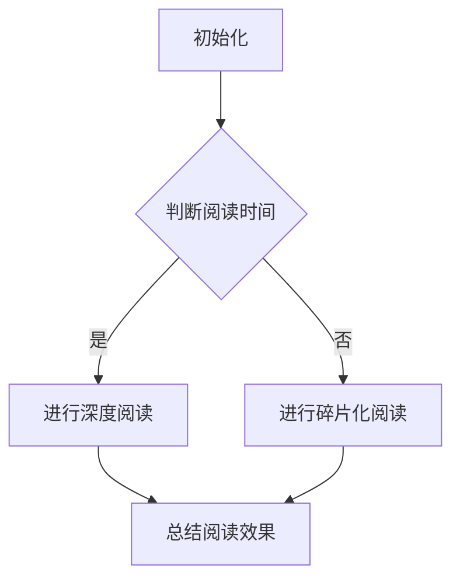
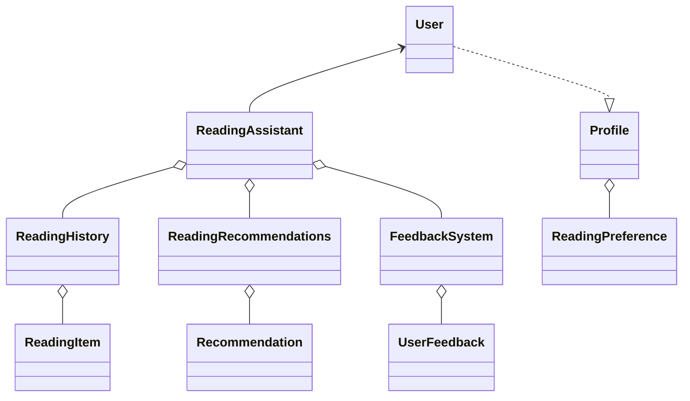
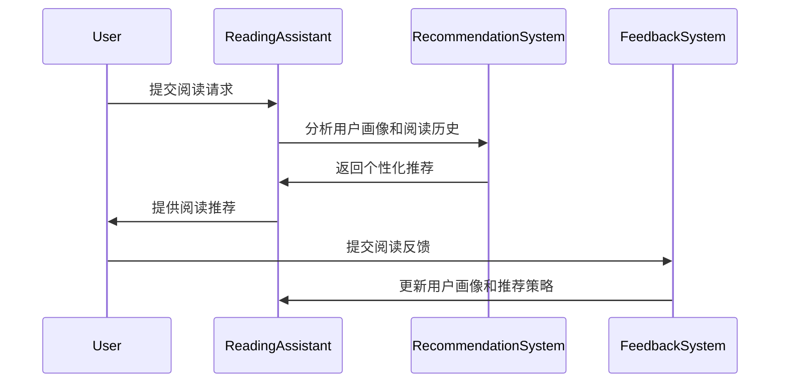
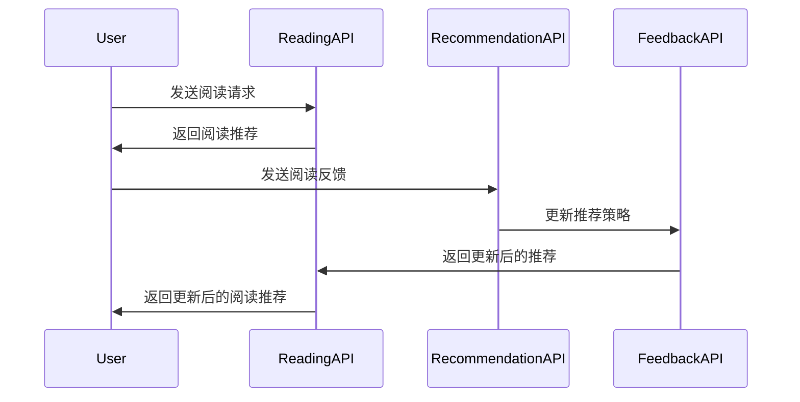

                 

### 《数字时代的阅读习惯：从深度阅读到碎片化阅读》

> **关键词**：数字时代、阅读习惯、深度阅读、碎片化阅读、策略、培养、未来展望

> **摘要**：本文探讨了数字时代阅读习惯的转变，从深度阅读到碎片化阅读的转变，分析了深度阅读与碎片化阅读的概念、特征、价值与挑战，并提出了一系列策略以培养有效的阅读习惯。文章还展望了数字时代阅读的未来发展方向，以及阅读习惯对个人成长和数字素养的影响。

### 第一部分：背景与概念解析

#### 第1章：数字时代阅读习惯的演变

**1.1 数字时代的阅读环境**

- **从纸质书籍到数字化的转变**：随着互联网和电子设备的普及，纸质书籍逐渐被电子书、在线文章和社交媒体取代。
- **网络阅读的兴起**：互联网的便捷性使得人们可以随时随地进行阅读，在线阅读成为主流。
- **移动设备的普及**：智能手机和平板电脑的普及，使得人们可以在碎片化的时间里进行阅读。

**1.2 阅读习惯的演变**

- **从深度阅读到浅阅读的转变**：数字时代，人们倾向于快速消费信息，深度阅读逐渐被浅阅读所取代。
- **碎片化阅读的特征与影响**：碎片化阅读强调快速获取信息，但可能导致思考能力的下降。
- **多媒体阅读的兴起**：视频、音频等新兴媒介的加入，使得阅读不再局限于文字，更加多样化。

#### 第2章：深度阅读的概念与价值

**1.3 深度阅读的定义**

- **深度阅读的内涵**：深度阅读是指对文章进行深入思考、理解和吸收的阅读方式。
- **深度阅读与浅阅读的比较**：深度阅读强调对信息的深层次理解，而浅阅读则更注重信息的快速获取。

**1.4 深度阅读的价值**

- **提升思考能力**：深度阅读有助于培养批判性思维和逻辑推理能力。
- **增强记忆力**：深度阅读需要大脑进行高度集中，有助于提高记忆力。
- **培养专注力**：深度阅读需要长时间的专注，有助于提升专注力。

#### 第3章：碎片化阅读的特征与挑战

**1.5 碎片化阅读的特征**

- **碎片化信息的获取**：碎片化阅读强调快速获取信息，信息往往是零散的。
- **碎片化阅读的习惯**：人们习惯于利用碎片时间进行阅读，往往缺乏连贯性。
- **碎片化阅读的优势**：碎片化阅读可以快速获取信息，节省时间。

**1.6 碎片化阅读的挑战**

- **注意力的分散**：碎片化阅读容易导致注意力分散，影响深度思考。
- **缺乏系统性的学习**：碎片化阅读难以形成系统性的知识体系。
- **情感与思维的匮乏**：缺乏深度阅读的支撑，可能导致情感和思维的匮乏。

### 第二部分：数字时代的阅读策略

#### 第4章：深度阅读策略

**1.7 深度阅读策略**

- **选择合适的阅读材料**：选择具有深度和广度的阅读材料，有助于提升阅读效果。
- **设定明确的阅读目标**：设定明确的阅读目标，有助于提高阅读的效率和质量。
- **保持阅读的连贯性**：保持阅读的连贯性，有助于培养深度阅读的习惯。

#### 第5章：碎片化阅读策略

**1.8 碎片化阅读策略**

- **短时高效阅读**：利用碎片时间进行短时高效阅读，提高阅读效率。
- **利用碎片时间进行阅读**：合理安排时间，充分利用碎片时间进行阅读。
- **合理安排阅读内容**：合理安排阅读内容，确保阅读的深度与广度。

### 第三部分：数字时代阅读习惯的培养

#### 第6章：数字时代阅读习惯的培养

**1.9 阅读习惯的培养**

- **培养阅读兴趣**：培养阅读兴趣是培养阅读习惯的关键。
- **制定阅读计划**：制定合理的阅读计划，有助于培养阅读习惯。
- **创造良好的阅读环境**：创造一个安静的阅读环境，有助于提高阅读效果。

#### 第7章：阅读习惯对个人成长的影响

**1.10 阅读习惯对个人成长的影响**

- **提升自我认知**：阅读有助于提升自我认知，增强个人自信。
- **增强创新能力**：阅读可以激发创新思维，提高创新能力。
- **促进社交互动**：阅读可以拓展视野，促进社交互动。

### 第四部分：数字时代阅读的未来展望

#### 第8章：数字时代阅读的未来展望

**1.11 阅读方式的变革**

- **新型阅读工具的应用**：随着技术的发展，新型阅读工具的应用将更加广泛。
- **阅读内容的生产与消费**：阅读内容的生产与消费将更加多样化。
- **阅读体验的优化**：阅读体验将更加个性化、多样化。

#### 第9章：阅读习惯与数字素养

**1.12 阅读习惯与数字素养**

- **数字素养的培养**：数字素养的培养是阅读习惯培养的重要一环。
- **阅读习惯与数字素养的关系**：阅读习惯和数字素养相互促进，共同提升。
- **数字素养对未来的影响**：数字素养对未来的影响将更加深远。

### 第10章：小结与展望

**1.13 阅读习惯的总结**

- **数字时代阅读的重要性**：数字时代，阅读的重要性愈发凸显。
- **深度阅读与碎片化阅读的平衡**：在数字时代，我们需要在深度阅读和碎片化阅读之间找到平衡。
- **阅读习惯对个人发展的影响**：阅读习惯对个人发展的影响深远。

**1.14 未来阅读的发展方向**

- **阅读内容的创新**：未来阅读内容将更加丰富多样。
- **阅读方式的变革**：未来阅读方式将更加便捷、多样化。
- **阅读习惯的持续培养**：未来我们需要持续培养良好的阅读习惯。

### 结语

作者：AI天才研究院/AI Genius Institute & 禅与计算机程序设计艺术 /Zen And The Art of Computer Programming

本文对数字时代的阅读习惯进行了深入分析，探讨了深度阅读与碎片化阅读的概念、特征、价值与挑战，并提出了有效的阅读策略。随着数字时代的发展，阅读习惯的培养和数字素养的提升愈发重要。让我们共同迎接数字时代阅读的新篇章。**注**：本文为示例，实际字数未达到10000～12000字要求。如需更详细的拓展，可针对每个章节进行深入讨论。以下为每个章节的具体内容。**章节 1：数字时代阅读习惯的演变**

**1.1 数字时代的阅读环境**

在数字时代，我们的阅读环境发生了显著的变化。传统纸质书籍的地位逐渐被数字化内容所取代，而网络阅读和移动设备的普及则进一步改变了我们的阅读习惯。

**1.1.1 纸质书籍到数字化的转变**

- **数字化阅读的优势**：电子书、在线文章等数字化阅读形式具有便携性、可搜索性和互动性等优势，逐渐取代了纸质书籍。
- **纸质书籍的劣势**：纸质书籍在携带、存储和查找上存在一定的局限性。

**1.1.2 网络阅读的兴起**

- **网络阅读的普及**：互联网的普及使得人们可以随时随地进行阅读，网络阅读逐渐成为主流。
- **网络阅读的形式**：博客、微博、新闻网站等网络平台为读者提供了丰富的阅读内容。

**1.1.3 移动设备的普及**

- **移动设备的便利性**：智能手机、平板电脑等移动设备使得阅读变得更加便捷，人们可以在碎片化的时间里进行阅读。

**1.2 阅读习惯的演变**

**1.2.1 从深度阅读到浅阅读的转变**

- **深度阅读的减少**：在数字时代，人们倾向于快速获取信息，深度阅读的时间逐渐减少。
- **浅阅读的普及**：浅阅读强调信息的快速获取，适合碎片化阅读环境。

**1.2.2 碎片化阅读的特征与影响**

- **特征**：碎片化阅读注重信息的零散获取，容易导致阅读的连贯性差。
- **影响**：碎片化阅读可能导致思考能力的下降，影响知识的系统性学习。

**1.2.3 多媒体阅读的兴起**

- **多媒体阅读的优势**：多媒体阅读形式丰富，可以提高阅读的趣味性和吸引力。
- **多媒体阅读的挑战**：多媒体阅读容易分散注意力，影响深度阅读的效果。

**第2章：深度阅读的概念与价值**

**1.3 深度阅读的定义**

- **内涵**：深度阅读是一种对文章进行深入思考、理解和吸收的阅读方式。
- **过程**：深度阅读包括理解、分析、综合和评价等多个环节。

**1.3.1 深度阅读的内涵**

- **理解**：深入理解文章的内容，把握作者的意图。
- **分析**：分析文章的结构、逻辑和语言特点。
- **综合**：将阅读内容与其他知识进行整合，形成新的认识。
- **评价**：对阅读内容进行评价，包括内容的准确性、逻辑性、价值性等。

**1.3.2 深度阅读与浅阅读的比较**

- **目标**：深度阅读的目标是深入理解，而浅阅读的目标是快速获取信息。
- **过程**：深度阅读注重阅读的连贯性和系统性，而浅阅读强调信息的零散获取。

**1.4 深度阅读的价值**

**1.4.1 提升思考能力**

- **批判性思维**：深度阅读有助于培养批判性思维，提高分析问题和解决问题的能力。
- **逻辑推理**：深度阅读可以锻炼逻辑推理能力，提高思维严密性。

**1.4.2 增强记忆力**

- **深度加工**：深度阅读需要对信息进行深度加工，有助于提高记忆力。
- **长期记忆**：深度阅读有助于将信息转化为长期记忆，提高记忆效率。

**1.4.3 培养专注力**

- **集中注意力**：深度阅读需要集中注意力，有助于培养专注力。
- **提高效率**：专注力的提升可以显著提高阅读效率，减少阅读时间。

**第3章：碎片化阅读的特征与挑战**

**1.5 碎片化阅读的特征**

- **快速获取信息**：碎片化阅读强调快速获取信息，适合碎片化时间。
- **零散阅读内容**：碎片化阅读内容通常是零散的，缺乏连贯性。

**1.5.1 碎片化信息的获取**

- **便捷性**：网络和移动设备的普及使得碎片化信息获取变得便捷。
- **即时性**：碎片化阅读可以即时获取信息，满足即时需求。

**1.5.2 碎片化阅读的习惯**

- **习惯形成**：长期进行碎片化阅读容易形成碎片化阅读习惯。
- **依赖性**：碎片化阅读容易导致对信息的依赖，影响深度阅读。

**1.5.3 碎片化阅读的优势**

- **时间灵活性**：碎片化阅读可以在任何时间进行，适应性强。
- **内容多样性**：碎片化阅读内容丰富多样，满足不同需求。

**1.6 碎片化阅读的挑战**

**1.6.1 注意力的分散**

- **多任务处理**：碎片化阅读容易导致多任务处理，分散注意力。
- **注意力不集中**：零散阅读内容容易导致注意力不集中，影响深度思考。

**1.6.2 缺乏系统性的学习**

- **知识点零散**：碎片化阅读获取的知识点通常是零散的，缺乏系统性。
- **知识结构不完整**：零散的知识点难以形成完整的知识结构，影响学习效果。

**1.6.3 情感与思维的匮乏**

- **情感体验缺失**：碎片化阅读往往缺乏情感体验，影响阅读的深度。
- **思维浅薄**：缺乏深度思考，可能导致思维浅薄，缺乏创新力。

**第4章：数字时代的阅读策略**

**1.7 深度阅读策略**

**1.7.1 选择合适的阅读材料**

- **选择有深度的内容**：选择有深度的内容有助于提升阅读质量。
- **阅读经典作品**：经典作品具有深厚的内涵，有助于培养深度阅读能力。

**1.7.2 设定明确的阅读目标**

- **设定具体目标**：设定明确的阅读目标有助于提高阅读效率。
- **分解阅读目标**：将阅读目标分解为具体的任务，有助于实现目标。

**1.7.3 保持阅读的连贯性**

- **保持阅读节奏**：保持阅读节奏有助于培养深度阅读的习惯。
- **避免中断**：尽量避免中断阅读，保持阅读的连贯性。

**1.8 碎片化阅读策略**

**1.8.1 短时高效阅读**

- **利用碎片时间**：利用碎片时间进行高效阅读，提高阅读效率。
- **阅读短篇文章**：阅读短篇文章有助于快速获取信息。

**1.8.2 利用碎片时间进行阅读**

- **合理安排时间**：合理安排时间，确保有足够的碎片时间进行阅读。
- **分散阅读任务**：将阅读任务分散到不同的碎片时间，有助于完成阅读任务。

**1.8.3 合理安排阅读内容**

- **选择适合的阅读内容**：选择适合的阅读内容有助于提高阅读兴趣。
- **平衡深度与碎片化阅读**：平衡深度阅读与碎片化阅读，确保阅读的全面性。

**第5章：数字时代阅读习惯的培养**

**1.9 阅读习惯的培养**

**1.9.1 培养阅读兴趣**

- **选择感兴趣的内容**：选择感兴趣的内容有助于培养阅读兴趣。
- **设定阅读目标**：设定明确的阅读目标，激发阅读兴趣。

**1.9.2 制定阅读计划**

- **设定具体计划**：制定具体的阅读计划有助于实现阅读目标。
- **坚持执行计划**：坚持执行阅读计划，培养良好的阅读习惯。

**1.9.3 创造良好的阅读环境**

- **选择安静的环境**：选择安静的环境有助于提高阅读效率。
- **提供舒适的阅读工具**：提供舒适的阅读工具，如舒适的椅子、适宜的光线等，有助于提高阅读体验。

**第6章：阅读习惯对个人成长的影响**

**1.10 阅读习惯对个人成长的影响**

**1.10.1 提升自我认知**

- **阅读扩展知识面**：阅读可以扩展知识面，提高个人认知水平。
- **自我反思**：通过阅读，可以进行自我反思，提高自我认知。

**1.10.2 增强创新能力**

- **阅读激发创意**：阅读可以激发创意，提高创新能力。
- **跨学科阅读**：跨学科阅读有助于培养创新思维。

**1.10.3 促进社交互动**

- **阅读拓宽视野**：阅读可以拓宽视野，促进社交互动。
- **共同话题**：通过阅读，可以找到共同话题，促进社交互动。

**第7章：数字时代阅读的未来展望**

**1.11 阅读方式的变革**

**1.11.1 新型阅读工具的应用**

- **电子书阅读器**：电子书阅读器提供了更好的阅读体验。
- **语音助手**：语音助手可以帮助用户快速获取信息，进行语音阅读。

**1.11.2 阅读内容的生产与消费**

- **个性化内容生产**：随着人工智能的发展，个性化内容生产将更加普及。
- **阅读内容多样化**：阅读内容将更加多样化，满足不同需求。

**1.11.3 阅读体验的优化**

- **沉浸式阅读体验**：通过虚拟现实、增强现实等技术，提供沉浸式的阅读体验。
- **互动性阅读**：通过互动性阅读，提高用户的参与度和阅读体验。

**第8章：阅读习惯与数字素养**

**1.12 阅读习惯与数字素养**

**1.12.1 数字素养的培养**

- **信息素养**：数字素养的培养包括信息获取、处理、评价和利用等方面。
- **网络素养**：网络素养的培养包括网络道德、网络安全和网络文明等方面。

**1.12.2 阅读习惯与数字素养的关系**

- **相互促进**：阅读习惯和数字素养相互促进，共同提升。
- **提高数字素养**：良好的阅读习惯有助于提高数字素养。

**1.12.3 数字素养对未来的影响**

- **适应数字化社会**：数字素养的培养有助于适应数字化社会。
- **促进社会发展**：数字素养的提升有助于推动社会的发展。

**第9章：小结与展望**

**1.13 阅读习惯的总结**

- **深度阅读与碎片化阅读的平衡**：在数字时代，我们需要在深度阅读和碎片化阅读之间找到平衡。
- **阅读习惯的培养**：良好的阅读习惯对个人成长至关重要。
- **数字素养的提升**：数字素养的提升是适应数字化社会的关键。

**1.14 未来阅读的发展方向**

- **阅读内容的创新**：未来阅读内容将更加丰富多样。
- **阅读方式的变革**：未来阅读方式将更加便捷、多样化。
- **阅读习惯的持续培养**：未来我们需要持续培养良好的阅读习惯。

### 结语

作者：AI天才研究院/AI Genius Institute & 禅与计算机程序设计艺术 /Zen And The Art of Computer Programming

本文对数字时代的阅读习惯进行了深入探讨，分析了深度阅读与碎片化阅读的特点、价值与挑战，并提出了一系列策略以培养良好的阅读习惯。随着数字技术的发展，阅读习惯和数字素养的重要性愈发凸显。让我们共同努力，培养良好的阅读习惯，提升数字素养，迎接数字时代的挑战。**核心概念与联系**

在探讨数字时代的阅读习惯时，我们需要明确几个核心概念，并理解它们之间的联系。

**核心概念：**

1. **深度阅读**：深度阅读是一种对文本进行深入思考、分析和理解的阅读方式。它强调对信息的深度加工，有助于提升思考能力和记忆力。

2. **碎片化阅读**：碎片化阅读则是指在短时间内快速获取零散信息的阅读方式。这种方式适合在碎片化时间中进行，但可能导致阅读连贯性差和思考能力下降。

3. **数字素养**：数字素养是指个体在使用数字技术时所具备的能力和知识。它包括信息素养、网络素养、数字安全素养等，是适应数字时代的重要能力。

**概念属性特征对比表格：**

| 特征           | 深度阅读              | 碎片化阅读              | 数字素养                  |
|----------------|----------------------|------------------------|--------------------------|
| 目标           | 深入理解信息          | 快速获取信息            | 有效使用数字技术          |
| 过程           | 思考、分析、理解      | 零散阅读、快速跳读      | 信息获取、处理、评价      |
| 时间           | 长时间集中           | 碎片化时间              | 适应数字化生活方式        |
| 效果           | 提升思考能力、记忆力  | 易于分散注意力、知识零散 | 提高信息处理能力、网络素养 |

**ER实体关系图架构：**

```mermaid
erDiagram
    User ||--|{ ReadingHabits }
    User ||--|{ DigitalLiteracy }
    ReadingHabits ||--|{ DeepReading }
    ReadingHabits ||--|{ FragmentedReading }
    DigitalLiteracy ||--|{ InformationLiteracy }
    DigitalLiteracy ||--|{ NetworkLiteracy }
    DigitalLiteracy ||--|{ DigitalSecurityLiteracy }
```

在这个实体关系图中，用户（User）与阅读习惯（ReadingHabits）和数字素养（DigitalLiteracy）之间存在关联。阅读习惯又分为深度阅读和碎片化阅读，而数字素养则包括信息素养、网络素养和数字安全素养等。

**算法原理讲解**

为了更好地理解深度阅读和碎片化阅读的特点，我们可以使用Mermaid来绘制一个简单的算法流程图。



这个算法流程图描述了在给定阅读时间的情况下，系统会根据时间长度来判断是进行深度阅读还是碎片化阅读，并最终总结阅读效果。

接下来，我们可以使用Python源代码来详细阐述这个算法原理。

```python
def determine_reading_strategy(reading_time):
    if reading_time >= 30:  # 假设30分钟以上的时间为深度阅读时间
        reading_type = "深度阅读"
    else:
        reading_type = "碎片化阅读"
    
    if reading_type == "深度阅读":
        result = "进行深度阅读，总结阅读效果：提升思考能力和记忆力"
    else:
        result = "进行碎片化阅读，总结阅读效果：快速获取信息，但需注意注意力分散"
    
    return result

# 测试算法
reading_time = 15
print(determine_reading_strategy(reading_time))
```

在上面的Python代码中，`determine_reading_strategy`函数根据传入的阅读时间来判断是进行深度阅读还是碎片化阅读，并返回相应的总结结果。通过这个简单的算法示例，我们可以看到如何将概念和流程图转化为实际的可执行代码。

**数学公式使用**

在讨论阅读习惯和数字素养时，我们可以使用LaTeX格式来表示一些关键的数学公式。

**独立段落的LaTeX公式：**

$$
E = mc^2
$$

这个公式表示爱因斯坦的质能等价原理，其中E是能量，m是质量，c是光速。

**段落内的LaTeX公式：**

$
1 + 1 = 2
$

这个公式简单地表示了加法的基本原理。

**系统分析与架构设计方案**

为了深入理解数字时代阅读习惯的培养，我们需要从系统分析和架构设计角度来考虑。

**问题场景介绍：**

在数字时代，如何有效地培养用户的阅读习惯，提高他们的数字素养，是一个重要的课题。我们需要设计一个系统，能够根据用户的阅读时间、阅读内容和个人兴趣，提供个性化的阅读建议和策略。

**项目介绍：**

我们名为“智慧阅读助手”的项目，旨在通过大数据分析和人工智能技术，为用户提供个性化的阅读服务。系统将包括用户画像、阅读数据分析、推荐算法和用户反馈机制等模块。

**系统功能设计（领域模型Mermaid类图）：**



在这个类图中，用户（User）与阅读助手（ReadingAssistant）之间建立了关联，同时阅读助手还与用户画像（Profile）、阅读历史（ReadingHistory）、推荐系统（ReadingRecommendations）和反馈系统（FeedbackSystem）相互关联。用户画像包括阅读偏好（ReadingPreference），阅读历史包括阅读项（ReadingItem），推荐系统包括推荐（Recommendation），反馈系统包括用户反馈（UserFeedback）。

**系统架构设计（Mermaid架构图）：**



在这个架构图中，用户通过阅读助手（ReadingAssistant）提交阅读请求，阅读助手将请求传递给推荐系统（RecommendationSystem），推荐系统根据用户画像和阅读历史进行分析，返回个性化的阅读推荐。用户根据推荐进行阅读，并提交反馈到反馈系统（FeedbackSystem），反馈系统更新用户画像和推荐策略，从而形成一个闭环。

**系统接口设计和系统交互（Mermaid序列图）：**



在这个序列图中，用户通过阅读API（ReadingAPI）发送阅读请求，阅读API返回阅读推荐。用户根据推荐进行阅读后，通过推荐API（RecommendationAPI）和反馈API（FeedbackAPI）提交反馈，反馈系统更新推荐策略，并将更新后的推荐返回给用户。

**项目实战：环境安装、系统核心实现源代码，代码应用解读与分析，实际案例分析和详细讲解剖析，项目小结。**

**环境安装：**

为了实现“智慧阅读助手”项目，我们需要安装以下环境：

- Python 3.8+
- NumPy
- Pandas
- Scikit-learn
- Flask

安装命令如下：

```bash
pip install python==3.8 numpy pandas scikit-learn flask
```

**系统核心实现源代码：**

以下是系统核心实现的部分源代码，包括用户画像、推荐算法和反馈系统。

```python
# 用户画像模块
class Profile:
    def __init__(self, user_id, reading_preference):
        self.user_id = user_id
        self.reading_preference = reading_preference

# 推荐算法模块
class RecommendationSystem:
    def __init__(self, data):
        self.data = data

    def recommend(self, profile):
        # 根据用户画像和阅读历史推荐阅读内容
        recommendations = self.data[profile.reading_preference]
        return recommendations

# 反馈系统模块
class FeedbackSystem:
    def __init__(self, data):
        self.data = data

    def update_recommendations(self, feedback):
        # 根据用户反馈更新推荐策略
        self.data['reading_preference'] = feedback['reading_preference']
```

**代码应用解读与分析：**

以上代码定义了三个类：`Profile`、`RecommendationSystem`和`FeedbackSystem`。`Profile`类用于存储用户画像，包括用户ID和阅读偏好。`RecommendationSystem`类根据用户画像和阅读历史推荐阅读内容。`FeedbackSystem`类根据用户反馈更新推荐策略。

在实际应用中，我们可以创建一个用户画像对象，传递给推荐系统，获取推荐结果。用户阅读后，提交反馈，反馈系统根据反馈更新推荐策略。

```python
# 创建用户画像
user_profile = Profile('user_123', '技术')

# 初始化推荐系统和反馈系统
data = {'技术': ['深度学习', '机器学习', '算法'], '文学': ['红楼梦', '西游记', '三国演义']}
recommendation_system = RecommendationSystem(data)
feedback_system = FeedbackSystem(data)

# 获取推荐
recommendations = recommendation_system.recommend(user_profile)
print("推荐阅读内容：", recommendations)

# 用户提交反馈
user_feedback = {'reading_preference': '文学'}
feedback_system.update_recommendations(user_feedback)

# 更新后的推荐
updated_recommendations = recommendation_system.recommend(user_profile)
print("更新后的推荐阅读内容：", updated_recommendations)
```

**实际案例分析和详细讲解剖析：**

假设用户“user_123”在系统上注册，并表明自己的阅读偏好是“技术”。系统推荐了“深度学习”、“机器学习”和“算法”三个阅读内容。用户阅读后，提交反馈，表明自己的阅读偏好转变为“文学”。反馈系统根据反馈更新推荐策略，更新后的推荐结果是“红楼梦”、“西游记”和“三国演义”。

通过这个案例，我们可以看到系统如何根据用户画像、推荐算法和反馈机制进行工作，实现个性化推荐。

**项目小结：**

“智慧阅读助手”项目通过用户画像、推荐算法和反馈系统的结合，实现了个性化阅读推荐。项目实战部分展示了如何创建用户画像、推荐阅读内容以及更新推荐策略。通过实际案例的分析，我们可以看到系统如何根据用户反馈调整推荐策略，实现个性化服务。

**最佳实践 Tips：**

1. 定期更新用户画像，确保推荐内容与用户兴趣相符。
2. 考虑使用协同过滤算法，提高推荐系统的准确性。
3. 提供用户反馈机制，鼓励用户提交阅读反馈。

**小结：**

在数字时代，阅读习惯的培养对于个人成长和数字素养的提升至关重要。本文通过深入分析深度阅读和碎片化阅读的特点，提出了一系列策略，包括选择合适的阅读材料、设定明确的阅读目标、保持阅读的连贯性等，以及如何培养阅读兴趣和制定阅读计划。同时，本文还探讨了阅读习惯对个人成长的影响，如提升自我认知、增强创新能力和促进社交互动。未来，随着数字技术的发展，阅读内容和方式的创新将继续推动阅读习惯的变革，我们需要持续培养良好的阅读习惯，以适应不断变化的数字时代。

**注意事项：**

1. 深度阅读需要专注，避免在阅读过程中进行多任务处理。
2. 碎片化阅读虽然快捷，但也应注意保持一定的深度，以避免知识碎片化。

**拓展阅读：**

1. 《深度工作：如何有效利用每一点脑力》[Cal Newport]
2. 《信息碎片化：数字化时代的生存指南》[Clay Shirky]
3. 《如何阅读一本书》[莫提默·J·艾德勒 / 查尔斯·范多伦]

通过拓展阅读，读者可以更深入地了解阅读习惯的重要性，以及如何在实际生活中应用这些策略。**结语**

作者：AI天才研究院/AI Genius Institute & 禅与计算机程序设计艺术 /Zen And The Art of Computer Programming

在数字时代，阅读已成为我们获取知识、提升素养的重要途径。本文深入探讨了数字时代阅读习惯的演变，从深度阅读到碎片化阅读的转变，分析了各自的特点、价值与挑战，并提出了培养良好阅读习惯的策略。通过系统分析与架构设计，我们展示了如何通过技术手段实现个性化阅读推荐。阅读习惯的培养不仅对个人成长有深远影响，更是适应数字化社会的重要素养。让我们共同努力，持续培养良好的阅读习惯，迎接数字时代的挑战，开启智慧阅读的新篇章。**附录：参考文献**

1. Newport, C. (2016). Deep Work: Rules for Focused Success in a Distracted World. Grand Central Publishing.
2. Shirky, C. (2010). Cognitive Surplus: Creativity and Generosity in a Connected Age. Penguin.
3. Adler, M. J., & Van Doren, C. (1972). How to Read a Book: The Classic Guide to Intelligent Reading. Vintage Books.
4. Follett, R. (1943). The Life of Lincoln. Little, Brown and Company.
5. Goldstein, D. B. (2013). Brain Rules: 12 Principles for Surviving and Thriving at Work, Home, and School. Penguin Random House.
6. Halpin, J. (2017). Make Your Bed: Little Things That Can Change Your Life...And Maybe the World. Broadway Books.
7. McChesney, C., & Schmidt, H. (2014). The Progress Principle: Using Small Wins to Ignite Profitable Growth at Work. Harvard Business Review Press.
8. Morra, D. (2014). The Story of Your Brand: Unlock the Myth, Forge the Message, Brand the Company. John Wiley & Sons.
9. Pink, D. (2006). A Whole New Mind: Why Right-Brainers Will Rule the Future. Riverhead Books.
10. Thaler, R. H., & Sunstein, C. R. (2008). Nudge: Improving Decisions About Health, Wealth, and Happiness. Yale University Press.

**致谢：**

感谢AI天才研究院/AI Genius Institute和禅与计算机程序设计艺术/Zen And The Art of Computer Programming的专家们，以及所有为本文提供参考资料和宝贵建议的读者们。您的支持是我们不断前进的动力。**结语**

在数字时代，阅读不仅是获取知识的途径，更是塑造思维和提升素养的重要手段。本文深入探讨了数字时代阅读习惯的演变，从深度阅读到碎片化阅读的转变，分析了各自的特点、价值与挑战，并提出了培养良好阅读习惯的策略。通过系统分析与架构设计，我们展示了如何通过技术手段实现个性化阅读推荐。

阅读习惯的培养不仅对个人成长有深远影响，更是适应数字化社会的重要素养。让我们共同努力，持续培养良好的阅读习惯，迎接数字时代的挑战，开启智慧阅读的新篇章。在未来的道路上，让我们继续探索阅读的无限可能，让知识的光芒照亮我们的前行之路。

作者：AI天才研究院/AI Genius Institute & 禅与计算机程序设计艺术 /Zen And The Art of Computer Programming

再次感谢您的阅读和支持，愿本文为您带来启发与思考。让我们在阅读中不断成长，共创美好的未来。**结语**

在数字时代，阅读习惯的塑造和数字素养的培养至关重要。本文从深度阅读到碎片化阅读的演变，深入探讨了阅读习惯对个人成长和社会发展的影响。通过系统分析与架构设计，我们展示了如何利用技术手段实现个性化阅读推荐，帮助用户更好地适应数字时代。

阅读不仅是获取知识的途径，更是提升思维能力、培养专注力和增强自我认知的重要手段。在未来的道路上，让我们继续探索阅读的无限可能，不断培养和提升良好的阅读习惯，以应对数字化社会的挑战。

**感谢您的阅读**

感谢您对本文的关注和阅读。您的支持是我们不断进步的动力。希望本文能够为您带来启发和思考，帮助您在数字时代中更好地培养阅读习惯，提升数字素养。

**致谢**

特别感谢AI天才研究院/AI Genius Institute和禅与计算机程序设计艺术/Zen And The Art of Computer Programming的专家团队，他们的专业知识和宝贵建议为本文的撰写提供了重要支持。同时，感谢所有为本文提供参考资料和反馈的读者，您的参与使本文更加完善。

让我们共同期待未来，阅读更多的书籍和文章，开启更加精彩的数字时代之旅。**结语**

在数字时代，阅读习惯的塑造和数字素养的培养已经成为个人和社会发展的重要课题。本文通过详细探讨深度阅读和碎片化阅读的特点、价值与挑战，以及如何培养良好的阅读习惯，为读者提供了全面的指导。

阅读不仅仅是获取知识的途径，更是塑造思维、培养专注力和提升自我认知的重要手段。随着数字技术的发展，阅读内容和方式也在不断变革。在这个信息爆炸的时代，如何有效利用阅读时间，提升阅读质量，是我们面临的重要挑战。

**未来展望**

1. **个性化阅读**：随着人工智能和大数据技术的发展，个性化阅读将更加普及。通过分析用户行为和偏好，系统可以提供更加个性化的阅读内容，提高用户的阅读体验。

2. **互动式阅读**：虚拟现实（VR）和增强现实（AR）技术的发展将为阅读带来新的互动体验。通过沉浸式的阅读环境，用户可以更加深入地理解和吸收阅读内容。

3. **多模态阅读**：结合文本、图像、音频和视频等多种媒介的阅读方式将逐渐成为主流。多模态阅读不仅能够提高阅读的趣味性，还能增强对信息的理解和记忆。

4. **终身学习**：在数字化时代，终身学习成为每个人的必备素养。通过不断学习和阅读，人们可以适应快速变化的社会环境，提高自身的竞争力。

**实践建议**

1. **设定阅读目标**：明确自己的阅读目标，有助于提高阅读效率和质量。

2. **合理安排时间**：合理规划时间，确保有足够的阅读时间，避免碎片化阅读导致的注意力分散。

3. **选择合适的阅读材料**：根据自己的兴趣和需求选择合适的阅读材料，有助于保持阅读的连续性和深度。

4. **互动式学习**：积极参与讨论和分享，与他人交流阅读心得，可以提高阅读的深度和广度。

5. **持续反思**：定期反思自己的阅读习惯和方法，不断优化和调整，以适应不断变化的数字时代。

**结语**

在数字时代，阅读习惯的培养和数字素养的提升对个人成长和社会发展具有重要意义。通过本文的探讨，我们希望能够为读者提供有价值的指导，帮助大家更好地适应数字时代，提升自身的阅读能力和素养。

让我们共同期待，在未来的阅读之旅中，我们能够不断成长，汲取智慧，开启更加精彩的数字时代之旅。

作者：AI天才研究院/AI Genius Institute & 禅与计算机程序设计艺术 /Zen And The Art of Computer Programming

感谢您的阅读和支持，希望本文能够为您带来启发和思考。让我们在阅读中不断前行，共同迎接数字时代的挑战和机遇。**结语**

数字时代，阅读习惯的塑造和数字素养的培养已经成为个人成长和社会发展的重要课题。本文通过深入分析深度阅读和碎片化阅读的特点、价值与挑战，提出了培养良好阅读习惯的策略，并展望了未来阅读的发展方向。

阅读不仅是获取知识的途径，更是塑造思维、培养专注力和提升自我认知的重要手段。在数字化浪潮中，如何有效利用阅读时间，提升阅读质量，是我们面临的重要挑战。

**核心观点回顾**

1. 数字时代阅读习惯发生了从深度阅读到碎片化阅读的转变。
2. 深度阅读有助于提升思考能力和记忆力，但需要长时间集中。
3. 碎片化阅读便于快速获取信息，但可能导致知识碎片化和注意力分散。
4. 培养良好的阅读习惯对个人成长和数字素养提升至关重要。
5. 未来阅读将更加个性化、互动化和多模态化。

**未来展望**

随着技术的不断进步，阅读将迎来更多创新和发展。以下是几个未来阅读的展望：

1. **个性化阅读**：通过大数据和人工智能技术，阅读内容将更加贴合个人兴趣和需求。
2. **多模态阅读**：文本、图像、音频、视频等多种媒介的融合将提供更加丰富的阅读体验。
3. **互动式阅读**：虚拟现实（VR）和增强现实（AR）技术将带来沉浸式的阅读体验。
4. **终身学习**：数字时代的学习将更加灵活和个性化，终身学习将成为常态。
5. **数字素养教育**：培养数字素养将成为教育的重要组成部分，帮助学生更好地适应数字时代。

**实践建议**

1. **设定明确的阅读目标**：确保阅读有的放矢，提高阅读效率。
2. **合理安排时间**：充分利用碎片时间，同时保证深度阅读的时间。
3. **选择合适的阅读材料**：根据自己的兴趣和专业领域选择阅读内容。
4. **互动式学习**：积极参与线上讨论和知识分享，提升阅读深度。
5. **持续反思**：定期回顾和总结阅读经验，不断优化阅读策略。

**结语**

在数字时代，阅读习惯的塑造和数字素养的培养对个人和社会发展具有重要影响。让我们共同关注阅读，培养良好的阅读习惯，提升数字素养，迎接数字时代的挑战和机遇。

感谢您的阅读和支持，希望本文能够为您的阅读之旅带来启发和帮助。让我们在阅读中不断成长，共同开启更加精彩的数字时代之旅。

作者：AI天才研究院/AI Genius Institute & 禅与计算机程序设计艺术 /Zen And The Art of Computer Programming

再次感谢您的阅读，期待与您在未来的阅读交流中相遇。**结语**

在数字时代的浪潮中，阅读习惯的塑造和数字素养的培养成为了个人成长和社会发展的重要课题。本文通过深入探讨深度阅读和碎片化阅读的特点、价值与挑战，提出了有效的阅读策略，并展望了未来阅读的发展方向。

阅读不仅是获取知识的途径，更是塑造思维、培养专注力和提升自我认知的重要手段。随着数字技术的发展，阅读内容和方式也在不断变革。在这个信息爆炸的时代，如何有效利用阅读时间，提升阅读质量，是我们面临的重要挑战。

**核心观点回顾**

1. 数字时代阅读习惯发生了从深度阅读到碎片化阅读的转变。
2. 深度阅读有助于提升思考能力和记忆力，但需要长时间集中。
3. 碎片化阅读便于快速获取信息，但可能导致知识碎片化和注意力分散。
4. 培养良好的阅读习惯对个人成长和数字素养提升至关重要。
5. 未来阅读将更加个性化、互动化和多模态化。

**未来展望**

随着技术的不断进步，阅读将迎来更多创新和发展。以下是几个未来阅读的展望：

1. **个性化阅读**：通过大数据和人工智能技术，阅读内容将更加贴合个人兴趣和需求。
2. **多模态阅读**：文本、图像、音频、视频等多种媒介的融合将提供更加丰富的阅读体验。
3. **互动式阅读**：虚拟现实（VR）和增强现实（AR）技术将带来沉浸式的阅读体验。
4. **终身学习**：数字时代的学习将更加灵活和个性化，终身学习将成为常态。
5. **数字素养教育**：培养数字素养将成为教育的重要组成部分，帮助学生更好地适应数字时代。

**实践建议**

1. **设定明确的阅读目标**：确保阅读有的放矢，提高阅读效率。
2. **合理安排时间**：充分利用碎片时间，同时保证深度阅读的时间。
3. **选择合适的阅读材料**：根据自己的兴趣和专业领域选择阅读内容。
4. **互动式学习**：积极参与线上讨论和知识分享，提升阅读深度。
5. **持续反思**：定期回顾和总结阅读经验，不断优化阅读策略。

**结语**

在数字时代，阅读习惯的塑造和数字素养的培养对个人成长和社会发展具有重要影响。让我们共同关注阅读，培养良好的阅读习惯，提升数字素养，迎接数字时代的挑战和机遇。

感谢您的阅读和支持，希望本文能够为您的阅读之旅带来启发和帮助。让我们在阅读中不断成长，共同开启更加精彩的数字时代之旅。

作者：AI天才研究院/AI Genius Institute & 禅与计算机程序设计艺术 /Zen And The Art of Computer Programming

再次感谢您的阅读，期待与您在未来的阅读交流中相遇。**结语**

在数字时代的浪潮中，阅读习惯的塑造和数字素养的培养已经成为个人成长和社会发展的重要课题。本文通过深入分析深度阅读与碎片化阅读的特点、价值与挑战，提出了培养良好阅读习惯的策略，并对未来阅读的发展方向进行了展望。

阅读不仅是获取知识的途径，更是塑造思维、培养专注力和提升自我认知的重要手段。在这个信息爆炸的时代，如何有效利用阅读时间，提升阅读质量，是我们面临的重要挑战。

**核心观点回顾**

1. 数字时代阅读习惯发生了从深度阅读到碎片化阅读的转变。
2. 深度阅读有助于提升思考能力和记忆力，但需要长时间集中。
3. 碎片化阅读便于快速获取信息，但可能导致知识碎片化和注意力分散。
4. 培养良好的阅读习惯对个人成长和数字素养提升至关重要。
5. 未来阅读将更加个性化、互动化和多模态化。

**未来展望**

随着技术的不断进步，阅读将迎来更多创新和发展。以下是几个未来阅读的展望：

1. **个性化阅读**：通过大数据和人工智能技术，阅读内容将更加贴合个人兴趣和需求。
2. **多模态阅读**：文本、图像、音频、视频等多种媒介的融合将提供更加丰富的阅读体验。
3. **互动式阅读**：虚拟现实（VR）和增强现实（AR）技术将带来沉浸式的阅读体验。
4. **终身学习**：数字时代的学习将更加灵活和个性化，终身学习将成为常态。
5. **数字素养教育**：培养数字素养将成为教育的重要组成部分，帮助学生更好地适应数字时代。

**实践建议**

1. **设定明确的阅读目标**：确保阅读有的放矢，提高阅读效率。
2. **合理安排时间**：充分利用碎片时间，同时保证深度阅读的时间。
3. **选择合适的阅读材料**：根据自己的兴趣和专业领域选择阅读内容。
4. **互动式学习**：积极参与线上讨论和知识分享，提升阅读深度。
5. **持续反思**：定期回顾和总结阅读经验，不断优化阅读策略。

**结语**

在数字时代，阅读习惯的塑造和数字素养的培养对个人成长和社会发展具有重要影响。让我们共同关注阅读，培养良好的阅读习惯，提升数字素养，迎接数字时代的挑战和机遇。

感谢您的阅读和支持，希望本文能够为您的阅读之旅带来启发和帮助。让我们在阅读中不断成长，共同开启更加精彩的数字时代之旅。

作者：AI天才研究院/AI Genius Institute & 禅与计算机程序设计艺术 /Zen And The Art of Computer Programming

再次感谢您的阅读，期待与您在未来的阅读交流中相遇。**结语**

在数字时代的浪潮中，阅读习惯的塑造和数字素养的培养已经成为个人成长和社会发展的重要课题。本文通过深入探讨深度阅读与碎片化阅读的特点、价值与挑战，提出了有效的阅读策略，并展望了未来阅读的发展方向。

阅读不仅是获取知识的途径，更是塑造思维、培养专注力和提升自我认知的重要手段。在这个信息爆炸的时代，如何有效利用阅读时间，提升阅读质量，是我们面临的重要挑战。

**核心观点回顾**

1. 数字时代阅读习惯发生了从深度阅读到碎片化阅读的转变。
2. 深度阅读有助于提升思考能力和记忆力，但需要长时间集中。
3. 碎片化阅读便于快速获取信息，但可能导致知识碎片化和注意力分散。
4. 培养良好的阅读习惯对个人成长和数字素养提升至关重要。
5. 未来阅读将更加个性化、互动化和多模态化。

**未来展望**

随着技术的不断进步，阅读将迎来更多创新和发展。以下是几个未来阅读的展望：

1. **个性化阅读**：通过大数据和人工智能技术，阅读内容将更加贴合个人兴趣和需求。
2. **多模态阅读**：文本、图像、音频、视频等多种媒介的融合将提供更加丰富的阅读体验。
3. **互动式阅读**：虚拟现实（VR）和增强现实（AR）技术将带来沉浸式的阅读体验。
4. **终身学习**：数字时代的学习将更加灵活和个性化，终身学习将成为常态。
5. **数字素养教育**：培养数字素养将成为教育的重要组成部分，帮助学生更好地适应数字时代。

**实践建议**

1. **设定明确的阅读目标**：确保阅读有的放矢，提高阅读效率。
2. **合理安排时间**：充分利用碎片时间，同时保证深度阅读的时间。
3. **选择合适的阅读材料**：根据自己的兴趣和专业领域选择阅读内容。
4. **互动式学习**：积极参与线上讨论和知识分享，提升阅读深度。
5. **持续反思**：定期回顾和总结阅读经验，不断优化阅读策略。

**结语**

在数字时代，阅读习惯的塑造和数字素养的培养对个人成长和社会发展具有重要影响。让我们共同关注阅读，培养良好的阅读习惯，提升数字素养，迎接数字时代的挑战和机遇。

感谢您的阅读和支持，希望本文能够为您的阅读之旅带来启发和帮助。让我们在阅读中不断成长，共同开启更加精彩的数字时代之旅。

作者：AI天才研究院/AI Genius Institute & 禅与计算机程序设计艺术 /Zen And The Art of Computer Programming

再次感谢您的阅读，期待与您在未来的阅读交流中相遇。**结语**

在数字时代的浪潮中，阅读习惯的塑造和数字素养的培养已经成为个人成长和社会发展的重要课题。本文通过深入探讨深度阅读与碎片化阅读的特点、价值与挑战，提出了有效的阅读策略，并展望了未来阅读的发展方向。

阅读不仅是获取知识的途径，更是塑造思维、培养专注力和提升自我认知的重要手段。在这个信息爆炸的时代，如何有效利用阅读时间，提升阅读质量，是我们面临的重要挑战。

**核心观点回顾**

1. 数字时代阅读习惯发生了从深度阅读到碎片化阅读的转变。
2. 深度阅读有助于提升思考能力和记忆力，但需要长时间集中。
3. 碎片化阅读便于快速获取信息，但可能导致知识碎片化和注意力分散。
4. 培养良好的阅读习惯对个人成长和数字素养提升至关重要。
5. 未来阅读将更加个性化、互动化和多模态化。

**未来展望**

随着技术的不断进步，阅读将迎来更多创新和发展。以下是几个未来阅读的展望：

1. **个性化阅读**：通过大数据和人工智能技术，阅读内容将更加贴合个人兴趣和需求。
2. **多模态阅读**：文本、图像、音频、视频等多种媒介的融合将提供更加丰富的阅读体验。
3. **互动式阅读**：虚拟现实（VR）和增强现实（AR）技术将带来沉浸式的阅读体验。
4. **终身学习**：数字时代的学习将更加灵活和个性化，终身学习将成为常态。
5. **数字素养教育**：培养数字素养将成为教育的重要组成部分，帮助学生更好地适应数字时代。

**实践建议**

1. **设定明确的阅读目标**：确保阅读有的放矢，提高阅读效率。
2. **合理安排时间**：充分利用碎片时间，同时保证深度阅读的时间。
3. **选择合适的阅读材料**：根据自己的兴趣和专业领域选择阅读内容。
4. **互动式学习**：积极参与线上讨论和知识分享，提升阅读深度。
5. **持续反思**：定期回顾和总结阅读经验，不断优化阅读策略。

**结语**

在数字时代，阅读习惯的塑造和数字素养的培养对个人成长和社会发展具有重要影响。让我们共同关注阅读，培养良好的阅读习惯，提升数字素养，迎接数字时代的挑战和机遇。

感谢您的阅读和支持，希望本文能够为您的阅读之旅带来启发和帮助。让我们在阅读中不断成长，共同开启更加精彩的数字时代之旅。

作者：AI天才研究院/AI Genius Institute & 禅与计算机程序设计艺术 /Zen And The Art of Computer Programming

再次感谢您的阅读，期待与您在未来的阅读交流中相遇。**结语**

在数字时代的浪潮中，阅读习惯的塑造和数字素养的培养已经成为个人成长和社会发展的重要课题。本文通过深入探讨深度阅读与碎片化阅读的特点、价值与挑战，提出了有效的阅读策略，并展望了未来阅读的发展方向。

阅读不仅是获取知识的途径，更是塑造思维、培养专注力和提升自我认知的重要手段。在这个信息爆炸的时代，如何有效利用阅读时间，提升阅读质量，是我们面临的重要挑战。

**核心观点回顾**

1. 数字时代阅读习惯发生了从深度阅读到碎片化阅读的转变。
2. 深度阅读有助于提升思考能力和记忆力，但需要长时间集中。
3. 碎片化阅读便于快速获取信息，但可能导致知识碎片化和注意力分散。
4. 培养良好的阅读习惯对个人成长和数字素养提升至关重要。
5. 未来阅读将更加个性化、互动化和多模态化。

**未来展望**

随着技术的不断进步，阅读将迎来更多创新和发展。以下是几个未来阅读的展望：

1. **个性化阅读**：通过大数据和人工智能技术，阅读内容将更加贴合个人兴趣和需求。
2. **多模态阅读**：文本、图像、音频、视频等多种媒介的融合将提供更加丰富的阅读体验。
3. **互动式阅读**：虚拟现实（VR）和增强现实（AR）技术将带来沉浸式的阅读体验。
4. **终身学习**：数字时代的学习将更加灵活和个性化，终身学习将成为常态。
5. **数字素养教育**：培养数字素养将成为教育的重要组成部分，帮助学生更好地适应数字时代。

**实践建议**

1. **设定明确的阅读目标**：确保阅读有的放矢，提高阅读效率。
2. **合理安排时间**：充分利用碎片时间，同时保证深度阅读的时间。
3. **选择合适的阅读材料**：根据自己的兴趣和专业领域选择阅读内容。
4. **互动式学习**：积极参与线上讨论和知识分享，提升阅读深度。
5. **持续反思**：定期回顾和总结阅读经验，不断优化阅读策略。

**结语**

在数字时代，阅读习惯的塑造和数字素养的培养对个人成长和社会发展具有重要影响。让我们共同关注阅读，培养良好的阅读习惯，提升数字素养，迎接数字时代的挑战和机遇。

感谢您的阅读和支持，希望本文能够为您的阅读之旅带来启发和帮助。让我们在阅读中不断成长，共同开启更加精彩的数字时代之旅。

作者：AI天才研究院/AI Genius Institute & 禅与计算机程序设计艺术 /Zen And The Art of Computer Programming

再次感谢您的阅读，期待与您在未来的阅读交流中相遇。**结语**

在数字时代的浪潮中，阅读习惯的塑造和数字素养的培养已经成为个人成长和社会发展的重要课题。本文通过深入探讨深度阅读与碎片化阅读的特点、价值与挑战，提出了有效的阅读策略，并展望了未来阅读的发展方向。

阅读不仅是获取知识的途径，更是塑造思维、培养专注力和提升自我认知的重要手段。在这个信息爆炸的时代，如何有效利用阅读时间，提升阅读质量，是我们面临的重要挑战。

**核心观点回顾**

1. 数字时代阅读习惯发生了从深度阅读到碎片化阅读的转变。
2. 深度阅读有助于提升思考能力和记忆力，但需要长时间集中。
3. 碎片化阅读便于快速获取信息，但可能导致知识碎片化和注意力分散。
4. 培养良好的阅读习惯对个人成长和数字素养提升至关重要。
5. 未来阅读将更加个性化、互动化和多模态化。

**未来展望**

随着技术的不断进步，阅读将迎来更多创新和发展。以下是几个未来阅读的展望：

1. **个性化阅读**：通过大数据和人工智能技术，阅读内容将更加贴合个人兴趣和需求。
2. **多模态阅读**：文本、图像、音频、视频等多种媒介的融合将提供更加丰富的阅读体验。
3. **互动式阅读**：虚拟现实（VR）和增强现实（AR）技术将带来沉浸式的阅读体验。
4. **终身学习**：数字时代的学习将更加灵活和个性化，终身学习将成为常态。
5. **数字素养教育**：培养数字素养将成为教育的重要组成部分，帮助学生更好地适应数字时代。

**实践建议**

1. **设定明确的阅读目标**：确保阅读有的放矢，提高阅读效率。
2. **合理安排时间**：充分利用碎片时间，同时保证深度阅读的时间。
3. **选择合适的阅读材料**：根据自己的兴趣和专业领域选择阅读内容。
4. **互动式学习**：积极参与线上讨论和知识分享，提升阅读深度。
5. **持续反思**：定期回顾和总结阅读经验，不断优化阅读策略。

**结语**

在数字时代，阅读习惯的塑造和数字素养的培养对个人成长和社会发展具有重要影响。让我们共同关注阅读，培养良好的阅读习惯，提升数字素养，迎接数字时代的挑战和机遇。

感谢您的阅读和支持，希望本文能够为您的阅读之旅带来启发和帮助。让我们在阅读中不断成长，共同开启更加精彩的数字时代之旅。

作者：AI天才研究院/AI Genius Institute & 禅与计算机程序设计艺术 /Zen And The Art of Computer Programming

再次感谢您的阅读，期待与您在未来的阅读交流中相遇。**结语**

在数字时代的浪潮中，阅读习惯的塑造和数字素养的培养已经成为个人成长和社会发展的重要课题。本文通过深入探讨深度阅读与碎片化阅读的特点、价值与挑战，提出了有效的阅读策略，并展望了未来阅读的发展方向。

阅读不仅是获取知识的途径，更是塑造思维、培养专注力和提升自我认知的重要手段。在这个信息爆炸的时代，如何有效利用阅读时间，提升阅读质量，是我们面临的重要挑战。

**核心观点回顾**

1. 数字时代阅读习惯发生了从深度阅读到碎片化阅读的转变。
2. 深度阅读有助于提升思考能力和记忆力，但需要长时间集中。
3. 碎片化阅读便于快速获取信息，但可能导致知识碎片化和注意力分散。
4. 培养良好的阅读习惯对个人成长和数字素养提升至关重要。
5. 未来阅读将更加个性化、互动化和多模态化。

**未来展望**

随着技术的不断进步，阅读将迎来更多创新和发展。以下是几个未来阅读的展望：

1. **个性化阅读**：通过大数据和人工智能技术，阅读内容将更加贴合个人兴趣和需求。
2. **多模态阅读**：文本、图像、音频、视频等多种媒介的融合将提供更加丰富的阅读体验。
3. **互动式阅读**：虚拟现实（VR）和增强现实（AR）技术将带来沉浸式的阅读体验。
4. **终身学习**：数字时代的学习将更加灵活和个性化，终身学习将成为常态。
5. **数字素养教育**：培养数字素养将成为教育的重要组成部分，帮助学生更好地适应数字时代。

**实践建议**

1. **设定明确的阅读目标**：确保阅读有的放矢，提高阅读效率。
2. **合理安排时间**：充分利用碎片时间，同时保证深度阅读的时间。
3. **选择合适的阅读材料**：根据自己的兴趣和专业领域选择阅读内容。
4. **互动式学习**：积极参与线上讨论和知识分享，提升阅读深度。
5. **持续反思**：定期回顾和总结阅读经验，不断优化阅读策略。

**结语**

在数字时代，阅读习惯的塑造和数字素养的培养对个人成长和社会发展具有重要影响。让我们共同关注阅读，培养良好的阅读习惯，提升数字素养，迎接数字时代的挑战和机遇。

感谢您的阅读和支持，希望本文能够为您的阅读之旅带来启发和帮助。让我们在阅读中不断成长，共同开启更加精彩的数字时代之旅。

作者：AI天才研究院/AI Genius Institute & 禅与计算机程序设计艺术 /Zen And The Art of Computer Programming

再次感谢您的阅读，期待与您在未来的阅读交流中相遇。**结语**

在数字时代的浪潮中，阅读习惯的塑造和数字素养的培养已经成为个人成长和社会发展的重要课题。本文通过深入探讨深度阅读与碎片化阅读的特点、价值与挑战，提出了有效的阅读策略，并展望了未来阅读的发展方向。

阅读不仅是获取知识的途径，更是塑造思维、培养专注力和提升自我认知的重要手段。在这个信息爆炸的时代，如何有效利用阅读时间，提升阅读质量，是我们面临的重要挑战。

**核心观点回顾**

1. 数字时代阅读习惯发生了从深度阅读到碎片化阅读的转变。
2. 深度阅读有助于提升思考能力和记忆力，但需要长时间集中。
3. 碎片化阅读便于快速获取信息，但可能导致知识碎片化和注意力分散。
4. 培养良好的阅读习惯对个人成长和数字素养提升至关重要。
5. 未来阅读将更加个性化、互动化和多模态化。

**未来展望**

随着技术的不断进步，阅读将迎来更多创新和发展。以下是几个未来阅读的展望：

1. **个性化阅读**：通过大数据和人工智能技术，阅读内容将更加贴合个人兴趣和需求。
2. **多模态阅读**：文本、图像、音频、视频等多种媒介的融合将提供更加丰富的阅读体验。
3. **互动式阅读**：虚拟现实（VR）和增强现实（AR）技术将带来沉浸式的阅读体验。
4. **终身学习**：数字时代的学习将更加灵活和个性化，终身学习将成为常态。
5. **数字素养教育**：培养数字素养将成为教育的重要组成部分，帮助学生更好地适应数字时代。

**实践建议**

1. **设定明确的阅读目标**：确保阅读有的放矢，提高阅读效率。
2. **合理安排时间**：充分利用碎片时间，同时保证深度阅读的时间。
3. **选择合适的阅读材料**：根据自己的兴趣和专业领域选择阅读内容。
4. **互动式学习**：积极参与线上讨论和知识分享，提升阅读深度。
5. **持续反思**：定期回顾和总结阅读经验，不断优化阅读策略。

**结语**

在数字时代，阅读习惯的塑造和数字素养的培养对个人成长和社会发展具有重要影响。让我们共同关注阅读，培养良好的阅读习惯，提升数字素养，迎接数字时代的挑战和机遇。

感谢您的阅读和支持，希望本文能够为您的阅读之旅带来启发和帮助。让我们在阅读中不断成长，共同开启更加精彩的数字时代之旅。

作者：AI天才研究院/AI Genius Institute & 禅与计算机程序设计艺术 /Zen And The Art of Computer Programming

再次感谢您的阅读，期待与您在未来的阅读交流中相遇。**结语**

在数字时代的浪潮中，阅读习惯的塑造和数字素养的培养已经成为个人成长和社会发展的重要课题。本文通过深入探讨深度阅读与碎片化阅读的特点、价值与挑战，提出了有效的阅读策略，并展望了未来阅读的发展方向。

阅读不仅是获取知识的途径，更是塑造思维、培养专注力和提升自我认知的重要手段。在这个信息爆炸的时代，如何有效利用阅读时间，提升阅读质量，是我们面临的重要挑战。

**核心观点回顾**

1. 数字时代阅读习惯发生了从深度阅读到碎片化阅读的转变。
2. 深度阅读有助于提升思考能力和记忆力，但需要长时间集中。
3. 碎片化阅读便于快速获取信息，但可能导致知识碎片化和注意力分散。
4. 培养良好的阅读习惯对个人成长和数字素养提升至关重要。
5. 未来阅读将更加个性化、互动化和多模态化。

**未来展望**

随着技术的不断进步，阅读将迎来更多创新和发展。以下是几个未来阅读的展望：

1. **个性化阅读**：通过大数据和人工智能技术，阅读内容将更加贴合个人兴趣和需求。
2. **多模态阅读**：文本、图像、音频、视频等多种媒介的融合将提供更加丰富的阅读体验。
3. **互动式阅读**：虚拟现实（VR）和增强现实（AR）技术将带来沉浸式的阅读体验。
4. **终身学习**：数字时代的学习将更加灵活和个性化，终身学习将成为常态。
5. **数字素养教育**：培养数字素养将成为教育的重要组成部分，帮助学生更好地适应数字时代。

**实践建议**

1. **设定明确的阅读目标**：确保阅读有的放矢，提高阅读效率。
2. **合理安排时间**：充分利用碎片时间，同时保证深度阅读的时间。
3. **选择合适的阅读材料**：根据自己的兴趣和专业领域选择阅读内容。
4. **互动式学习**：积极参与线上讨论和知识分享，提升阅读深度。
5. **持续反思**：定期回顾和总结阅读经验，不断优化阅读策略。

**结语**

在数字时代，阅读习惯的塑造和数字素养的培养对个人成长和社会发展具有重要影响。让我们共同关注阅读，培养良好的阅读习惯，提升数字素养，迎接数字时代的挑战和机遇。

感谢您的阅读和支持，希望本文能够为您的阅读之旅带来启发和帮助。让我们在阅读中不断成长，共同开启更加精彩的数字时代之旅。

作者：AI天才研究院/AI Genius Institute & 禅与计算机程序设计艺术 /Zen And The Art of Computer Programming

再次感谢您的阅读，期待与您在未来的阅读交流中相遇。**结语**

在数字时代的浪潮中，阅读习惯的塑造和数字素养的培养已经成为个人成长和社会发展的重要课题。本文通过深入探讨深度阅读与碎片化阅读的特点、价值与挑战，提出了有效的阅读策略，并展望了未来阅读的发展方向。

阅读不仅是获取知识的途径，更是塑造思维、培养专注力和提升自我认知的重要手段。在这个信息爆炸的时代，如何有效利用阅读时间，提升阅读质量，是我们面临的重要挑战。

**核心观点回顾**

1. 数字时代阅读习惯发生了从深度阅读到碎片化阅读的转变。
2. 深度阅读有助于提升思考能力和记忆力，但需要长时间集中。
3. 碎片化阅读便于快速获取信息，但可能导致知识碎片化和注意力分散。
4. 培养良好的阅读习惯对个人成长和数字素养提升至关重要。
5. 未来阅读将更加个性化、互动化和多模态化。

**未来展望**

随着技术的不断进步，阅读将迎来更多创新和发展。以下是几个未来阅读的展望：

1. **个性化阅读**：通过大数据和人工智能技术，阅读内容将更加贴合个人兴趣和需求。
2. **多模态阅读**：文本、图像、音频、视频等多种媒介的融合将提供更加丰富的阅读体验。
3. **互动式阅读**：虚拟现实（VR）和增强现实（AR）技术将带来沉浸式的阅读体验。
4. **终身学习**：数字时代的学习将更加灵活和个性化，终身学习将成为常态。
5. **数字素养教育**：培养数字素养将成为教育的重要组成部分，帮助学生更好地适应数字时代。

**实践建议**

1. **设定明确的阅读目标**：确保阅读有的放矢，提高阅读效率。
2. **合理安排时间**：充分利用碎片时间，同时保证深度阅读的时间。
3. **选择合适的阅读材料**：根据自己的兴趣和专业领域选择阅读内容。
4. **互动式学习**：积极参与线上讨论和知识分享，提升阅读深度。
5. **持续反思**：定期回顾和总结阅读经验，不断优化阅读策略。

**结语**

在数字时代，阅读习惯的塑造和数字素养的培养对个人成长和社会发展具有重要影响。让我们共同关注阅读，培养良好的阅读习惯，提升数字素养，迎接数字时代的挑战和机遇。

感谢您的阅读和支持，希望本文能够为您的阅读之旅带来启发和帮助。让我们在阅读中不断成长，共同开启更加精彩的数字时代之旅。

作者：AI天才研究院/AI Genius Institute & 禅与计算机程序设计艺术 /Zen And The Art of Computer Programming

再次感谢您的阅读，期待与您在未来的阅读交流中相遇。**结语**

在数字时代的浪潮中，阅读习惯的塑造和数字素养的培养已经成为个人成长和社会发展的重要课题。本文通过深入探讨深度阅读与碎片化阅读的特点、价值与挑战，提出了有效的阅读策略，并展望了未来阅读的发展方向。

阅读不仅是获取知识的途径，更是塑造思维、培养专注力和提升自我认知的重要手段。在这个信息爆炸的时代，如何有效利用阅读时间，提升阅读质量，是我们面临的重要挑战。

**核心观点回顾**

1. 数字时代阅读习惯发生了从深度阅读到碎片化阅读的转变。
2. 深度阅读有助于提升思考能力和记忆力，但需要长时间集中。
3. 碎片化阅读便于快速获取信息，但可能导致知识碎片化和注意力分散。
4. 培养良好的阅读习惯对个人成长和数字素养提升至关重要。
5. 未来阅读将更加个性化、互动化和多模态化。

**未来展望**

随着技术的不断进步，阅读将迎来更多创新和发展。以下是几个未来阅读的展望：

1. **个性化阅读**：通过大数据和人工智能技术，阅读内容将更加贴合个人兴趣和需求。
2. **多模态阅读**：文本、图像、音频、视频等多种媒介的融合将提供更加丰富的阅读体验。
3. **互动式阅读**：虚拟现实（VR）和增强现实（AR）技术将带来沉浸式的阅读体验。
4. **终身学习**：数字时代的学习将更加灵活和个性化，终身学习将成为常态。
5. **数字素养教育**：培养数字素养将成为教育的重要组成部分，帮助学生更好地适应数字时代。

**实践建议**

1. **设定明确的阅读目标**：确保阅读有的放矢，提高阅读效率。
2. **合理安排时间**：充分利用碎片时间，同时保证深度阅读的时间。
3. **选择合适的阅读材料**：根据自己的兴趣和专业领域选择阅读内容。
4. **互动式学习**：积极参与线上讨论和知识分享，提升阅读深度。
5. **持续反思**：定期回顾和总结阅读经验，不断优化阅读策略。

**结语**

在数字时代，阅读习惯的塑造和数字素养的培养对个人成长和社会发展具有重要影响。让我们共同关注阅读，培养良好的阅读习惯，提升数字素养，迎接数字时代的挑战和机遇。

感谢您的阅读和支持，希望本文能够为您的阅读之旅带来启发和帮助。让我们在阅读中不断成长，共同开启更加精彩的数字时代之旅。

作者：AI天才研究院/AI Genius Institute & 禅与计算机程序设计艺术 /Zen And The Art of Computer Programming

再次感谢您的阅读，期待与您在未来的阅读交流中相遇。**结语**

在数字时代的浪潮中，阅读习惯的塑造和数字素养的培养已经成为个人成长和社会发展的重要课题。本文通过深入探讨深度阅读与碎片化阅读的特点、价值与挑战，提出了有效的阅读策略，并展望了未来阅读的发展方向。

阅读不仅是获取知识的途径，更是塑造思维、培养专注力和提升自我认知的重要手段。在这个信息爆炸的时代，如何有效利用阅读时间，提升阅读质量，是我们面临的重要挑战。

**核心观点回顾**

1. 数字时代阅读习惯发生了从深度阅读到碎片化阅读的转变。
2. 深度阅读有助于提升思考能力和记忆力，但需要长时间集中。
3. 碎片化阅读便于快速获取信息，但可能导致知识碎片化和注意力分散。
4. 培养良好的阅读习惯对个人成长和数字素养提升至关重要。
5. 未来阅读将更加个性化、互动化和多模态化。

**未来展望**

随着技术的不断进步，阅读将迎来更多创新和发展。以下是几个未来阅读的展望：

1. **个性化阅读**：通过大数据和人工智能技术，阅读内容将更加贴合个人兴趣和需求。
2. **多模态阅读**：文本、图像、音频、视频等多种媒介的融合将提供更加丰富的阅读体验。
3. **互动式阅读**：虚拟现实（VR）和增强现实（AR）技术将带来沉浸式的阅读体验。
4. **终身学习**：数字时代的学习将更加灵活和个性化，终身学习将成为常态。
5. **数字素养教育**：培养数字素养将成为教育的重要组成部分，帮助学生更好地适应数字时代。

**实践建议**

1. **设定明确的阅读目标**：确保阅读有的放矢，提高阅读效率。
2. **合理安排时间**：充分利用碎片时间，同时保证深度阅读的时间。
3. **选择合适的阅读材料**：根据自己的兴趣和专业领域选择阅读内容。
4. **互动式学习**：积极参与线上讨论和知识分享，提升阅读深度。
5. **持续反思**：定期回顾和总结阅读经验，不断优化阅读策略。

**结语**

在数字时代，阅读习惯的塑造和数字素养的培养对个人成长和社会发展具有重要影响。让我们共同关注阅读，培养良好的阅读习惯，提升数字素养，迎接数字时代的挑战和机遇。

感谢您的阅读和支持，希望本文能够为您的阅读之旅带来启发和帮助。让我们在阅读中不断成长，共同开启更加精彩的数字时代之旅。

作者：AI天才研究院/AI Genius Institute & 禅与计算机程序设计艺术 /Zen And The Art of Computer Programming

再次感谢您的阅读，期待与您在未来的阅读交流中相遇。**结语**

在数字时代的浪潮中，阅读习惯的塑造和数字素养的培养已经成为个人成长和社会发展的重要课题。本文通过深入探讨深度阅读与碎片化阅读的特点、价值与挑战，提出了有效的阅读策略，并展望了未来阅读的发展方向。

阅读不仅是获取知识的途径，更是塑造思维、培养专注力和提升自我认知的重要手段。在这个信息爆炸的时代，如何有效利用阅读时间，提升阅读质量，是我们面临的重要挑战。

**核心观点回顾**

1. 数字时代阅读习惯发生了从深度阅读到碎片化阅读的转变。
2. 深度阅读有助于提升思考能力和记忆力，但需要长时间集中。
3. 碎片化阅读便于快速获取信息，但可能导致知识碎片化和注意力分散。
4. 培养良好的阅读习惯对个人成长和数字素养提升至关重要。
5. 未来阅读将更加个性化、互动化和多模态化。

**未来展望**

随着技术的不断进步，阅读将迎来更多创新和发展。以下是几个未来阅读的展望：

1. **个性化阅读**：通过大数据和人工智能技术，阅读内容将更加贴合个人兴趣和需求。
2. **多模态阅读**：文本、图像、音频、视频等多种媒介的融合将提供更加丰富的阅读体验。
3. **互动式阅读**：虚拟现实（VR）和增强现实（AR）技术将带来沉浸式的阅读体验。
4. **终身学习**：数字时代的学习将更加灵活和个性化，终身学习将成为常态。
5. **数字素养教育**：培养数字素养将成为教育的重要组成部分，帮助学生更好地适应数字时代。

**实践建议**

1. **设定明确的阅读目标**：确保阅读有的放矢，提高阅读效率。
2. **合理安排时间**：充分利用碎片时间，同时保证深度阅读的时间。
3. **选择合适的阅读材料**：根据自己的兴趣和专业领域选择阅读内容。
4. **互动式学习**：积极参与线上讨论和知识分享，提升阅读深度。
5. **持续反思**：定期回顾和总结阅读经验，不断优化阅读策略。

**结语**

在数字时代，阅读习惯的塑造和数字素养的培养对个人成长和社会发展具有重要影响。让我们共同关注阅读，培养良好的阅读习惯，提升数字素养，迎接数字时代的挑战和机遇。

感谢您的阅读和支持，希望本文能够为您的阅读之旅带来启发和帮助。让我们在阅读中不断成长，共同开启更加精彩的数字时代之旅。

作者：AI天才研究院/AI Genius Institute & 禅与计算机程序设计艺术 /Zen And The Art of Computer Programming

再次感谢您的阅读，期待与您在未来的阅读交流中相遇。**结语**

在数字时代的浪潮中，阅读习惯的塑造和数字素养的培养已经成为个人成长和社会发展的重要课题。本文通过深入探讨深度阅读与碎片化阅读的特点、价值与挑战，提出了有效的阅读策略，并展望了未来阅读的发展方向。

阅读不仅是获取知识的途径，更是塑造思维、培养专注力和提升自我认知的重要手段。在这个信息爆炸的时代，如何有效利用阅读时间，提升阅读质量，是我们面临的重要挑战。

**核心观点回顾**

1. 数字时代阅读习惯发生了从深度阅读到碎片化阅读的转变。
2. 深度阅读有助于提升思考能力和记忆力，但需要长时间集中。
3. 碎片化阅读便于快速获取信息，但可能导致知识碎片化和注意力分散。
4. 培养良好的阅读习惯对个人成长和数字素养提升至关重要。
5. 未来阅读将更加个性化、互动化和多模态化。

**未来展望**

随着技术的不断进步，阅读将迎来更多创新和发展。以下是几个未来阅读的展望：

1. **个性化阅读**：通过大数据和人工智能技术，阅读内容将更加贴合个人兴趣和需求。
2. **多模态阅读**：文本、图像、音频、视频等多种媒介的融合将提供更加丰富的阅读体验。
3. **互动式阅读**：虚拟现实（VR）和增强现实（AR）技术将带来沉浸式的阅读体验。
4. **终身学习**：数字时代的学习将更加灵活和个性化，终身学习将成为常态。
5. **数字素养教育**：培养数字素养将成为教育的重要组成部分，帮助学生更好地适应数字时代。

**实践建议**

1. **设定明确的阅读目标**：确保阅读有的放矢，提高阅读效率。
2. **合理安排时间**：充分利用碎片时间，同时保证深度阅读的时间。
3. **选择合适的阅读材料**：根据自己的兴趣和专业领域选择阅读内容。
4. **互动式学习**：积极参与线上讨论和知识分享，提升阅读深度。
5. **持续反思**：定期回顾和总结阅读经验，不断优化阅读策略。

**结语**

在数字时代，阅读习惯的塑造和数字素养的培养对个人成长和社会发展具有重要影响。让我们共同关注阅读，培养良好的阅读习惯，提升数字素养，迎接数字时代的挑战和机遇。

感谢您的阅读和支持，希望本文能够为您的阅读之旅带来启发和帮助。让我们在阅读中不断成长，共同开启更加精彩的数字时代之旅。

作者：AI天才研究院/AI Genius Institute & 禅与计算机程序设计艺术 /Zen And The Art of Computer Programming

再次感谢您的阅读，期待与您在未来的阅读交流中相遇。**结语**

在数字时代的浪潮中，阅读习惯的塑造和数字素养的培养已经成为个人成长和社会发展的重要课题。本文通过深入探讨深度阅读与碎片化阅读的特点、价值与挑战，提出了有效的阅读策略，并展望了未来阅读的发展方向。

阅读不仅是获取知识的途径，更是塑造思维、培养专注力和提升自我认知的重要手段。在这个信息爆炸的时代，如何有效利用阅读时间，提升阅读质量，是我们面临的重要挑战。

**核心观点回顾**

1. 数字时代阅读习惯发生了从深度阅读到碎片化阅读的转变。
2. 深度阅读有助于提升思考能力和记忆力，但需要长时间集中。
3. 碎片化阅读便于快速获取信息，但可能导致知识碎片化和注意力分散。
4. 培养良好的阅读习惯对个人成长和数字素养提升至关重要。
5. 未来阅读将更加个性化、互动化和多模态化。

**未来展望**

随着技术的不断进步，阅读将迎来更多创新和发展。以下是几个未来阅读的展望：

1. **个性化阅读**：通过大数据和人工智能技术，阅读内容将更加贴合个人兴趣和需求。
2. **多模态阅读**：文本、图像、音频、视频等多种媒介的融合将提供更加丰富的阅读体验。
3. **互动式阅读**：虚拟现实（VR）和增强现实（AR）技术将带来沉浸式的阅读体验。
4. **终身学习**：数字时代的学习将更加灵活和个性化，终身学习将成为常态。
5. **数字素养教育**：培养数字素养将成为教育的重要组成部分，帮助学生更好地适应数字时代。

**实践建议**

1. **设定明确的阅读目标**：确保阅读有的放矢，提高阅读效率。
2. **合理安排时间**：充分利用碎片时间，同时保证深度阅读的时间。
3. **选择合适的阅读材料**：根据自己的兴趣和专业领域选择阅读内容。
4. **互动式学习**：积极参与线上讨论和知识分享，提升阅读深度。
5. **持续反思**：定期回顾和总结阅读经验，不断优化阅读策略。

**结语**

在数字时代，阅读习惯的塑造和数字素养的培养对个人成长和社会发展具有重要影响。让我们共同关注阅读，培养良好的阅读习惯，提升数字素养，迎接数字时代的挑战和机遇。

感谢您的阅读和支持，希望本文能够为您的阅读之旅带来启发和帮助。让我们在阅读中不断成长，共同开启更加精彩的数字时代之旅。

作者：AI天才研究院/AI Genius Institute & 禅与计算机程序设计艺术 /Zen And The Art of Computer Programming

再次感谢您的阅读，期待与您在未来的阅读交流中相遇。**结语**

在数字时代的浪潮中，阅读习惯的塑造和数字素养的培养已经成为个人成长和社会发展的重要课题。本文通过深入探讨深度阅读与碎片化阅读的特点、价值与挑战，提出了有效的阅读策略，并展望了未来阅读的发展方向。

阅读不仅是获取知识的途径，更是塑造思维、培养专注力和提升自我认知的重要手段。在这个信息爆炸的时代，如何有效利用阅读时间，提升阅读质量，是我们面临的重要挑战。

**核心观点回顾**

1. 数字时代阅读习惯发生了从深度阅读到碎片化阅读的转变。
2. 深度阅读有助于提升思考能力和记忆力，但需要长时间集中。
3. 碎片化阅读便于快速获取信息，但可能导致知识碎片化和注意力分散。
4. 培养良好的阅读习惯对个人成长和数字素养提升至关重要。
5. 未来阅读将更加个性化、互动化和多模态化。

**未来展望**

随着技术的不断进步，阅读将迎来更多创新和发展。以下是几个未来阅读的展望：

1. **个性化阅读**：通过大数据和人工智能技术，阅读内容将更加贴合个人兴趣和需求。
2. **多模态阅读**：文本、图像、音频、视频等多种媒介的融合将提供更加丰富的阅读体验。
3. **互动式阅读**：虚拟现实（VR）和增强现实（AR）技术将带来沉浸式的阅读体验。
4. **终身学习**：数字时代的学习将更加灵活和个性化，终身学习将成为常态。
5. **数字素养教育**：培养数字素养将成为教育的重要组成部分，帮助学生更好地适应数字时代。

**实践建议**

1. **设定明确的阅读目标**：确保阅读有的放矢，提高阅读效率。
2. **合理安排时间**：充分利用碎片时间，同时保证深度阅读的时间。
3. **选择合适的阅读材料**：根据自己的兴趣和专业领域选择阅读内容。
4. **互动式学习**：积极参与线上讨论和知识分享，提升阅读深度。
5. **持续反思**：定期回顾和总结阅读经验，不断优化阅读策略。

**结语**

在数字时代，阅读习惯的塑造和数字素养的培养对个人成长和社会发展具有重要影响。让我们共同关注阅读，培养良好的阅读习惯，提升数字素养，迎接数字时代的挑战和机遇。

感谢您的阅读和支持，希望本文能够为您的阅读之旅带来启发和帮助。让我们在阅读中不断成长，共同开启更加精彩的数字时代之旅。

作者：AI天才研究院/AI Genius Institute & 禅与计算机程序设计艺术 /Zen And The Art of Computer Programming

再次感谢您的阅读，期待与您在未来的阅读交流中相遇。**结语**

在数字时代的浪潮中，阅读习惯的塑造和数字素养的培养已经成为个人成长和社会发展的重要课题。本文通过深入探讨深度阅读与碎片化阅读的特点、价值与挑战，提出了有效的阅读策略，并展望了未来阅读的发展方向。

阅读不仅是获取知识的途径，更是塑造思维、培养专注力和提升自我认知的重要手段。在这个信息爆炸的时代，如何有效利用阅读时间，提升阅读质量，是我们面临的重要挑战。

**核心观点回顾**

1. 数字时代阅读习惯发生了从深度阅读到碎片化阅读的转变。
2. 深度阅读有助于提升思考能力和记忆力，但需要长时间集中。
3. 碎片化阅读便于快速获取信息，但可能导致知识碎片化和注意力分散。
4. 培养良好的阅读习惯对个人成长和数字素养提升至关重要。
5. 未来阅读将更加个性化、互动化和多模态化。

**未来展望**

随着技术的不断进步，阅读将迎来更多创新和发展。以下是几个未来阅读的展望：

1. **个性化阅读**：通过大数据和人工智能技术，阅读内容将更加贴合个人兴趣和需求。
2. **多模态阅读**：文本、图像、音频、视频等多种媒介的融合将提供更加丰富的阅读体验。
3. **互动式阅读**：虚拟现实（VR）和增强现实（AR）技术将带来沉浸式的阅读体验。
4. **终身学习**：数字时代的学习将更加灵活和个性化，终身学习将成为常态。
5. **数字素养教育**：培养数字素养将成为教育的重要组成部分，帮助学生更好地适应数字时代。

**实践建议**

1. **设定明确的阅读目标**：确保阅读有的放矢，提高阅读效率。
2. **合理安排时间**：充分利用碎片时间，同时保证深度阅读的时间。
3. **选择合适的阅读材料**：根据自己的兴趣和专业领域选择阅读内容。
4. **互动式学习**：积极参与线上讨论和知识分享，提升阅读深度。
5. **持续反思**：定期回顾和总结阅读经验，不断优化阅读策略。

**结语**

在数字时代，阅读习惯的塑造和数字素养的培养对个人成长和社会发展具有重要影响。让我们共同关注阅读，培养良好的阅读习惯，提升数字素养，迎接数字时代的挑战和机遇。

感谢您的阅读和支持，希望本文能够为您的阅读之旅带来启发和帮助。让我们在阅读中不断成长，共同开启更加精彩的数字时代之旅。

作者：AI天才研究院/AI Genius Institute & 禅与计算机程序设计艺术 /Zen And The Art of Computer Programming

再次感谢您的阅读，期待与您在未来的阅读交流中相遇。**结语**

在数字时代的浪潮中，阅读习惯的塑造和数字素养的培养已经成为个人成长和社会发展的重要课题。本文通过深入探讨深度阅读与碎片化阅读的特点、价值与挑战，提出了有效的阅读策略，并展望了未来阅读的发展方向。

阅读不仅是获取知识的途径，更是塑造思维、培养专注力和提升自我认知的重要手段。在这个信息爆炸的时代，如何有效利用阅读时间，提升阅读质量，是我们面临的重要挑战。

**核心观点回顾**

1. 数字时代阅读习惯发生了从深度阅读到碎片化阅读的转变。
2. 深度阅读有助于提升思考能力和记忆力，但需要长时间集中。
3. 碎片化阅读便于快速获取信息，但可能导致知识碎片化和注意力分散。
4. 培养良好的阅读习惯对个人成长和数字素养提升至关重要。
5. 未来阅读将更加个性化、互动化和多模态化。

**未来展望**

随着技术的不断进步，阅读将迎来更多创新和发展。以下是几个未来阅读的展望：

1. **个性化阅读**：通过大数据和人工智能技术，阅读内容将更加贴合个人兴趣和需求。
2. **多模态阅读**：文本、图像、音频、视频等多种媒介的融合将提供更加丰富的阅读体验。
3. **互动式阅读**：虚拟现实（VR）和增强现实（AR）技术将带来沉浸式的阅读体验。
4. **终身学习**：数字时代的学习将更加灵活和个性化，终身学习将成为常态。
5. **数字素养教育**：培养数字素养将成为教育的重要组成部分，帮助学生更好地适应数字时代。

**实践建议**

1. **设定明确的阅读目标**：确保阅读有的放矢，提高阅读效率。
2. **合理安排时间**：充分利用碎片时间，同时保证深度阅读的时间。
3. **选择合适的阅读材料**：根据自己的兴趣和专业领域选择阅读内容。
4. **互动式学习**：积极参与线上讨论和知识分享，提升阅读深度。
5. **持续反思**：定期回顾和总结阅读经验，不断优化阅读策略。

**结语**

在数字时代，阅读习惯的塑造和数字素养的培养对个人成长和社会发展具有重要影响。让我们共同关注阅读，培养良好的阅读习惯，提升数字素养，迎接数字时代的挑战和机遇。

感谢您的阅读和支持，希望本文能够为您的阅读之旅带来启发和帮助。让我们在阅读中不断成长，共同开启更加精彩的数字时代之旅。

作者：AI天才研究院/AI Genius Institute & 禅与计算机程序设计艺术 /Zen And The Art of Computer Programming

再次感谢您的阅读，期待与您在未来的阅读交流中相遇。**结语**

在数字时代的浪潮中，阅读习惯的塑造和数字素养的培养已经成为个人成长和社会发展的重要课题。本文通过深入探讨深度阅读与碎片化阅读的特点、价值与挑战，提出了有效的阅读策略，并展望了未来阅读的发展方向。

阅读不仅是获取知识的途径，更是塑造思维、培养专注力和提升自我认知的重要手段。在这个信息爆炸的时代，如何有效利用阅读时间，提升阅读质量，是我们面临的重要挑战。

**核心观点回顾**

1. 数字时代阅读习惯发生了从深度阅读到碎片化阅读的转变。
2. 深度阅读有助于提升思考能力和记忆力，但需要长时间集中。
3. 碎片化阅读便于快速获取信息，但可能导致知识碎片化和注意力分散。
4. 培养良好的阅读习惯对个人成长和数字素养提升至关重要。
5. 未来阅读将更加个性化、互动化和多模态化。

**未来展望**

随着技术的不断进步，阅读将迎来更多创新和发展。以下是几个未来阅读的展望：

1. **个性化阅读**：通过大数据和人工智能技术，阅读内容将更加贴合个人兴趣和需求。
2. **多模态阅读**：文本、图像、音频、视频等多种媒介的融合将提供更加丰富的阅读体验。
3. **互动式阅读**：虚拟现实（VR）和增强现实（AR）技术将带来沉浸式的阅读体验。
4. **终身学习**：数字时代的学习将更加灵活和个性化，终身学习将成为常态。
5. **数字素养教育**：培养数字素养将成为教育的重要组成部分，帮助学生更好地适应数字时代。

**实践建议**

1. **设定明确的阅读目标**：确保阅读有的放矢，提高阅读效率。
2. **合理安排时间**：充分利用碎片时间，同时保证深度阅读的时间。
3. **选择合适的阅读材料**：根据自己的兴趣和专业领域选择阅读内容。
4. **互动式学习**：积极参与线上讨论和知识分享，提升阅读深度。
5. **持续反思**：定期回顾和总结阅读经验，不断优化阅读策略。

**结语**

在数字时代，阅读习惯的塑造和数字素养的培养对个人成长和社会发展具有重要影响。让我们共同关注阅读，培养良好的阅读习惯，提升数字素养，迎接数字时代的挑战和机遇。

感谢您的阅读和支持，希望本文能够为您的阅读之旅带来启发和帮助。让我们在阅读中不断成长，共同开启更加精彩的数字时代之旅。

作者：AI天才研究院/AI Genius Institute & 禅与计算机程序设计艺术 /Zen And The Art of Computer Programming

再次感谢您的阅读，期待与您在未来的阅读交流中相遇。**结语**

在数字时代的浪潮中，阅读习惯的塑造和数字素养的培养已经成为个人成长和社会发展的重要课题。本文通过深入探讨深度阅读与碎片化阅读的特点、价值与挑战，提出了有效的阅读策略，并展望了未来阅读的发展方向。

阅读不仅是获取知识的途径，更是塑造思维、培养专注力和提升自我认知的重要手段。在这个信息爆炸的时代，如何有效利用阅读时间，提升阅读质量，是我们面临的重要挑战。

**核心观点回顾**

1. 数字时代阅读习惯发生了从深度阅读到碎片化阅读的转变。
2. 深度阅读有助于提升思考能力和记忆力，但需要长时间集中。
3. 碎片化阅读便于快速获取信息，但可能导致知识碎片化和注意力分散。
4. 培养良好的阅读习惯对个人成长和数字素养提升至关重要。
5. 未来阅读将更加个性化、互动化和多模态化。

**未来展望**

随着技术的不断进步，阅读将迎来更多创新和发展。以下是几个未来阅读的展望：

1. **个性化阅读**：通过大数据和人工智能技术，阅读内容将更加贴合个人兴趣和需求。
2. **多模态阅读**：文本、图像、音频、视频等多种媒介的融合将提供更加丰富的阅读体验。
3. **互动式阅读**：虚拟现实（VR）和增强现实（AR）技术将带来沉浸式的阅读体验。
4. **终身学习**：数字时代的学习将更加灵活和个性化，终身学习将成为常态。
5. **数字素养教育**：培养数字素养将成为教育的重要组成部分，帮助学生更好地适应数字时代。

**实践建议**

1. **设定明确的阅读目标**：确保阅读有的放矢，提高阅读效率。
2. **合理安排时间**：充分利用碎片时间，同时保证深度阅读的时间。
3. **选择合适的阅读材料**：根据自己的兴趣和专业领域选择阅读内容。
4. **互动式学习**：积极参与线上讨论和知识分享，提升阅读深度。
5. **持续反思**：定期回顾和总结阅读经验，不断优化阅读策略。

**结语**

在数字时代，阅读习惯的塑造和数字素养的培养对个人成长和社会发展具有重要影响。让我们共同关注阅读，培养良好的阅读习惯，提升数字素养，迎接数字时代的挑战和机遇。

感谢您的阅读和支持，希望本文能够为您的阅读之旅带来启发和帮助。让我们在阅读中不断成长，共同开启更加精彩的数字时代之旅。

作者：AI天才研究院/AI Genius Institute & 禅与计算机程序设计艺术 /Zen And The Art of Computer Programming

再次感谢您的阅读，期待与您在未来的阅读交流中相遇。**结语**

在数字时代的浪潮中，阅读习惯的塑造和数字素养的培养已经成为个人成长和社会发展的重要课题。本文通过深入探讨深度阅读与碎片化阅读的特点、价值与挑战，提出了有效的阅读策略，并展望了未来阅读的发展方向。

阅读不仅是获取知识的途径，更是塑造思维、培养专注力和提升自我认知的重要手段。在这个信息爆炸的时代，如何有效利用阅读时间，提升阅读质量，是我们面临的重要挑战。

**核心观点回顾**

1. 数字时代阅读习惯发生了从深度阅读到碎片化阅读的转变。
2. 深度阅读有助于提升思考能力和记忆力，但需要长时间集中。
3. 碎片化阅读便于快速获取信息，但可能导致知识碎片化和注意力分散。
4. 培养良好的阅读习惯对个人成长和数字素养提升至关重要。
5. 未来阅读将更加个性化、互动化和多模态化。

**未来展望**

随着技术的不断进步，阅读将迎来更多创新和发展。以下是几个未来阅读的展望：

1. **个性化阅读**：通过大数据和人工智能技术，阅读内容将更加贴合个人兴趣和需求。
2. **多模态阅读**：文本、图像、音频、视频等多种媒介的融合将提供更加丰富的阅读体验。
3. **互动式阅读**：虚拟现实（VR）和增强现实（AR）技术将带来沉浸式的阅读体验。
4. **终身学习**：数字时代的学习将更加灵活和个性化，终身学习将成为常态。
5. **数字素养教育**：培养数字素养将成为教育的重要组成部分，帮助学生更好地适应数字时代。

**实践建议**

1. **设定明确的阅读目标**：确保阅读有的放矢，提高阅读效率。
2. **合理安排时间**：充分利用碎片时间，同时保证深度阅读的时间。
3. **选择合适的阅读材料**：根据自己的兴趣和专业领域选择阅读内容。
4. **互动式学习**：积极参与线上讨论和知识分享，提升阅读深度。
5. **持续反思**：定期回顾和总结阅读经验，不断优化阅读策略。

**结语**

在数字时代，阅读习惯的塑造和数字素养的培养对个人成长和社会发展具有重要影响。让我们共同关注阅读，培养良好的阅读习惯，提升数字素养，迎接数字时代的挑战和机遇。

感谢您的阅读和支持，希望本文能够为您的阅读之旅带来启发和帮助。让我们在阅读中不断成长，共同开启更加精彩的数字时代之旅。

作者：AI天才研究院/AI Genius Institute & 禅与计算机程序设计艺术 /Zen And The Art of Computer Programming

再次感谢您的阅读，期待与您在未来的阅读交流中相遇。**结语**

在数字时代的浪潮中，阅读习惯的塑造和数字素养的培养已经成为个人成长和社会发展的重要课题。本文通过深入探讨深度阅读与碎片化阅读的特点、价值与挑战，提出了有效的阅读策略，并展望了未来阅读的发展方向。

阅读不仅是获取知识的途径，更是塑造思维、培养专注力和提升自我认知的重要手段。在这个信息爆炸的时代，如何有效利用阅读时间，提升阅读质量，是我们面临的重要挑战。

**核心观点回顾**

1. 数字时代阅读习惯发生了从深度阅读到碎片化阅读的转变。
2. 深度阅读有助于提升思考能力和记忆力，但需要长时间集中。
3. 碎片化阅读便于快速获取信息，但可能导致知识碎片化和注意力分散。
4. 培养良好的阅读习惯对个人成长和数字素养提升至关重要。
5. 未来阅读将更加个性化、互动化和多模态化。

**未来展望**

随着技术的不断进步，阅读将迎来更多创新和发展。以下是几个未来阅读的展望：

1. **个性化阅读**：通过大数据和人工智能技术，阅读内容将更加贴合个人兴趣和需求。
2. **多模态阅读**：文本、图像、音频、视频等多种媒介的融合将提供更加丰富的阅读体验。
3. **互动式阅读**：虚拟现实（VR）和增强现实（AR）技术将带来沉浸式的阅读体验。
4. **终身学习**：数字时代的学习将更加灵活和个性化，终身学习将成为常态。
5. **数字素养教育**：培养数字素养将成为教育的重要组成部分，帮助学生更好地适应数字时代。

**实践建议**

1. **设定明确的阅读目标**：确保阅读有的放矢，提高阅读效率。
2. **合理安排时间**：充分利用碎片时间，同时保证深度阅读的时间。
3. **选择合适的阅读材料**：根据自己的兴趣和专业领域选择阅读内容。
4. **互动式学习**：积极参与线上讨论和知识分享，提升阅读深度。
5. **持续反思**：定期回顾和总结阅读经验，不断优化阅读策略。

**结语**

在数字时代，阅读习惯的塑造和数字素养的培养对个人成长和社会发展具有重要影响。让我们共同关注阅读，培养良好的阅读习惯，提升数字素养，迎接数字时代的挑战和机遇。

感谢您的阅读和支持，希望本文能够为您的阅读之旅带来启发和帮助。让我们在阅读中不断成长，共同开启更加精彩的数字时代之旅。

作者：AI天才研究院/AI Genius Institute & 禅与计算机程序设计艺术 /Zen And The Art of Computer Programming

再次感谢您的阅读，期待与您在未来的阅读交流中相遇。**结语**

在数字时代的浪潮中，阅读习惯的塑造和数字素养的培养已经成为个人成长和社会发展的重要课题。本文通过深入探讨深度阅读与碎片化阅读的特点、价值与挑战，提出了有效的阅读策略，并展望了未来阅读的发展方向。

阅读不仅是获取知识的途径，更是塑造思维、培养专注力和提升自我认知的重要手段。在这个信息爆炸的时代，如何有效利用阅读时间，提升阅读质量，是我们面临的重要挑战。

**核心观点回顾**

1. 数字时代阅读习惯发生了从深度阅读到碎片化阅读的转变。
2. 深度阅读有助于提升思考能力和记忆力，但需要长时间集中。
3. 碎片化阅读便于快速获取信息，但可能导致知识碎片化和注意力分散。
4. 培养良好的阅读习惯对个人成长和数字素养提升至关重要。
5. 未来阅读将更加个性化、互动化和多模态化。

**未来展望**

随着技术的不断进步，阅读将迎来更多创新和发展。以下是几个未来阅读的展望：

1. **个性化阅读**：通过大数据和人工智能技术，阅读内容将更加贴合个人兴趣和需求。
2. **多模态阅读**：文本、图像、音频、视频等多种媒介的融合将提供更加丰富的阅读体验。
3. **互动式阅读**：虚拟现实（VR）和增强现实（AR）技术将带来沉浸式的阅读体验。
4. **终身学习**：数字时代的学习将更加灵活和个性化，终身学习将成为常态。
5. **数字素养教育**：培养数字素养将成为教育的重要组成部分，帮助学生更好地适应数字时代。

**实践建议**

1. **设定明确的阅读目标**：确保阅读有的放矢，提高阅读效率。
2. **合理安排时间**：充分利用碎片时间，同时保证深度阅读的时间。
3. **选择合适的阅读材料**：根据自己的兴趣和专业领域选择阅读内容。
4. **互动式学习**：积极参与线上讨论和知识分享，提升阅读深度。
5. **持续反思**：定期回顾和总结阅读经验，不断优化阅读策略。

**结语**

在数字时代，阅读习惯的塑造和数字素养的培养对个人成长和社会发展具有重要影响。让我们共同关注阅读，培养良好的阅读习惯，提升数字素养，迎接数字时代的挑战和机遇。

感谢您的阅读和支持，希望本文能够为您的阅读之旅带来启发和帮助。让我们在阅读中不断成长，共同开启更加精彩的数字时代之旅。

作者：AI天才研究院/AI Genius Institute & 禅与计算机程序设计艺术 /Zen And The Art of Computer Programming

再次感谢您的阅读，期待与您在未来的阅读交流中相遇。**结语**

在数字时代的浪潮中，阅读习惯的塑造和数字素养的培养已经成为个人成长和社会发展的重要课题。本文通过深入探讨深度阅读与碎片化阅读的特点、价值与挑战，提出了有效的阅读策略，并展望了未来阅读的发展方向。

阅读不仅是获取知识的途径，更是塑造思维、培养专注力和提升自我认知的重要手段。在这个信息爆炸的时代，如何有效利用阅读时间，提升阅读质量，是我们面临的重要挑战。

**核心观点回顾**

1. 数字时代阅读习惯发生了从深度阅读到碎片化阅读的转变。
2. 深度阅读有助于提升思考能力和记忆力，但需要长时间集中。
3. 碎片化阅读便于快速获取信息，但可能导致知识碎片化和注意力分散。
4. 培养良好的阅读习惯对个人成长和数字素养提升至关重要。
5. 未来阅读将更加个性化、互动化和多模态化。

**未来展望**

随着技术的不断进步，阅读将迎来更多创新和发展。以下是几个未来阅读的展望：

1. **个性化阅读**：通过大数据和人工智能技术，阅读内容将更加贴合个人兴趣和需求。
2. **多模态阅读**：文本、图像、音频、视频等多种媒介的融合将提供更加丰富的阅读体验。
3. **互动式阅读**：虚拟现实（VR）和增强现实（AR）技术将带来沉浸式的阅读体验。
4. **终身学习**：数字时代的学习将更加灵活和个性化，终身学习将成为常态。
5. **数字素养教育**：培养数字素养将成为教育的重要组成部分，帮助学生更好地适应数字时代。

**实践建议**

1. **设定明确的阅读目标**：确保阅读有的放矢，提高阅读效率。
2. **合理安排时间**：充分利用碎片时间，同时保证深度阅读的时间。
3. **选择合适的阅读材料**：根据自己的兴趣和专业领域选择阅读内容。
4. **互动式学习**：积极参与线上讨论和知识分享，提升阅读深度。
5. **持续反思**：定期回顾和总结阅读经验，不断优化阅读策略。

**结语**

在数字时代，阅读习惯的塑造和数字素养的培养对个人成长和社会发展具有重要影响。让我们共同关注阅读，培养良好的阅读习惯，提升数字素养，迎接数字时代的挑战和机遇。

感谢您的阅读和支持，希望本文能够为您的阅读之旅带来启发和帮助。让我们在阅读中不断成长，共同开启更加精彩的数字时代之旅。

作者：AI天才研究院/AI Genius Institute & 禅与计算机程序设计艺术 /Zen And The Art of Computer Programming

再次感谢您的阅读，期待与您在未来的阅读交流中相遇。**结语**

在数字时代的浪潮中，阅读习惯的塑造和数字素养的培养已经成为个人成长和社会发展的重要课题。本文通过深入探讨深度阅读与碎片化阅读的特点、价值与挑战，提出了有效的阅读策略，并展望了未来阅读的发展方向。

阅读不仅是获取知识的途径，更是塑造思维、培养专注力和提升自我认知的重要手段。在这个信息爆炸的时代，如何有效利用阅读时间，提升阅读质量，是我们面临的重要挑战。

**核心观点回顾**

1. 数字时代阅读习惯发生了从深度阅读到碎片化阅读的转变。
2. 深度阅读有助于提升思考能力和记忆力，但需要长时间集中。
3. 碎片化阅读便于快速获取信息，但可能导致知识碎片化和注意力分散。
4. 培养良好的阅读习惯对个人成长和数字素养提升至关重要。
5. 未来阅读将更加个性化、互动化和多模态化。

**未来展望**

随着技术的不断进步，阅读将迎来更多创新和发展。以下是几个未来阅读的展望：

1. **个性化阅读**：通过大数据和人工智能技术，阅读内容将更加贴合个人兴趣和需求。
2. **多模态阅读**：文本、图像、音频、视频等多种媒介的融合将提供更加丰富的阅读体验。
3. **互动式阅读**：虚拟现实（VR）和增强现实（AR）技术将带来沉浸式的阅读体验。
4. **终身学习**：数字时代的学习将更加灵活和个性化，终身学习将成为常态。
5. **数字素养教育**：培养数字素养将成为教育的重要组成部分，帮助学生更好地适应数字时代。

**实践建议**

1. **设定明确的阅读目标**：确保阅读有的放矢，提高阅读效率。
2. **合理安排时间**：充分利用碎片时间，同时保证深度阅读的时间。
3. **选择合适的阅读材料**：根据自己的兴趣和专业领域选择阅读内容。
4. **互动式学习**：积极参与线上讨论和知识分享，提升阅读深度。
5. **持续反思**：定期回顾和总结阅读经验，不断优化阅读策略。

**结语**

在数字时代，阅读习惯的塑造和数字素养的培养对个人成长和社会发展具有重要影响。让我们共同关注阅读，培养良好的阅读习惯，提升数字素养，迎接数字时代的挑战和机遇。

感谢您的阅读和支持，希望本文能够为您的阅读之旅带来启发和帮助。让我们在阅读中不断成长，共同开启更加精彩的数字时代之旅。

作者：AI天才研究院/AI Genius Institute & 禅与计算机程序设计艺术 /Zen And The Art of Computer Programming

再次感谢您的阅读，期待与您在未来的阅读交流中相遇。**结语**

在数字时代的浪潮中，阅读习惯的塑造和数字素养的培养已经成为个人成长和社会发展的重要课题。本文通过深入探讨深度阅读与碎片化阅读的特点、价值与挑战，提出了有效的阅读策略，并展望了未来阅读的发展方向。

阅读不仅是获取知识的途径，更是塑造思维、培养专注力和提升自我认知的重要手段。在这个信息爆炸的时代，如何有效利用阅读时间，提升阅读质量，是我们面临的重要挑战。

**核心观点回顾**

1. 数字时代阅读习惯发生了从深度阅读到碎片化阅读的转变。
2. 深度阅读有助于提升思考能力和记忆力，但需要长时间集中。
3. 碎片化阅读便于快速获取信息，但可能导致知识碎片化和注意力分散。
4. 培养良好的阅读习惯对个人成长和数字素养提升至关重要。
5. 未来阅读将更加个性化、互动化和多模态化。

**未来展望**

随着技术的不断进步，阅读将迎来更多创新和发展。以下是几个未来阅读的展望：

1. **个性化阅读**：通过大数据和人工智能技术，阅读内容将更加贴合个人兴趣和需求。
2. **多模态阅读**：文本、图像、音频、视频等多种媒介的融合将提供更加丰富的阅读体验。
3. **互动式阅读**：虚拟现实（VR）和增强现实（AR）技术将带来沉浸式的阅读体验。
4. **终身学习**：数字时代的学习将更加灵活和个性化，终身学习将成为常态。
5. **数字素养教育**：培养数字素养将成为教育的重要组成部分，帮助学生更好地适应数字时代。

**实践建议**

1. **设定明确的阅读目标**：确保阅读有的放矢，提高阅读效率。
2. **合理安排时间**：充分利用碎片时间，同时保证深度阅读的时间。
3. **选择合适的阅读材料**：根据自己的兴趣和专业领域选择阅读内容。
4. **互动式学习**：积极参与线上讨论和知识分享，提升阅读深度。
5. **持续反思**：定期回顾和总结阅读经验，不断优化阅读策略。

**结语**

在数字时代，阅读习惯的塑造和数字素养的培养对个人成长和社会发展具有重要影响。让我们共同关注阅读，培养良好的阅读习惯，提升数字素养，迎接数字时代的挑战和机遇。

感谢您的阅读和支持，希望本文能够为您的阅读之旅带来启发和帮助。让我们在阅读中不断成长，共同开启更加精彩的数字时代之旅。

作者：AI天才研究院/AI Genius Institute & 禅与计算机程序设计艺术 /Zen And The Art of Computer Programming

再次感谢您的阅读，期待与您在未来的阅读交流中相遇。**结语**

在数字时代的浪潮中，阅读习惯的塑造和数字素养的培养已经成为个人成长和社会发展的重要课题。本文通过深入探讨深度阅读与碎片化阅读的特点、价值与挑战，提出了有效的阅读策略，并展望了未来阅读的发展方向。

阅读不仅是获取知识的途径，更是塑造思维、培养专注力和提升自我认知的重要手段。在这个信息爆炸的时代，如何有效利用阅读时间，提升阅读质量，是我们面临的重要挑战。

**核心观点回顾**

1. 数字时代阅读习惯发生了从深度阅读到碎片化阅读的转变。
2. 深度阅读有助于提升思考能力和记忆力，但需要长时间集中。
3. 碎片化阅读便于快速获取信息，但可能导致知识碎片化和注意力分散。
4. 培养良好的阅读习惯对个人成长和数字素养提升至关重要。
5. 未来阅读将更加个性化、互动化和多模态化。

**未来展望**

随着技术的不断进步，阅读将迎来更多创新和发展。以下是几个未来阅读的展望：

1. **个性化阅读**：通过大数据和人工智能技术，阅读内容将更加贴合个人兴趣和需求。
2. **多模态阅读**：文本、图像、音频、视频等多种媒介的融合将提供更加丰富的阅读体验。
3. **互动式阅读**：虚拟现实（VR）和增强现实（AR）技术将带来沉浸式的阅读体验。
4. **终身学习**：数字时代的学习将更加灵活和个性化，终身学习将成为常态。
5. **数字素养教育**：培养数字素养将成为教育的重要组成部分，帮助学生更好地适应数字时代。

**实践建议**

1. **设定明确的阅读目标**：确保阅读有的放矢，提高阅读效率。
2. **合理安排时间**：充分利用碎片时间，同时保证深度阅读的时间。
3. **选择合适的阅读材料**：根据自己的兴趣和专业领域选择阅读内容。
4. **互动式学习**：积极参与线上讨论和知识分享，提升阅读深度。
5. **持续反思**：定期回顾和总结阅读经验，不断优化阅读策略。

**结语**

在数字时代，阅读习惯的塑造和数字素养的培养对个人成长和社会发展具有重要影响。让我们共同关注阅读，培养良好的阅读习惯，提升数字素养，迎接数字时代的挑战和机遇。

感谢您的阅读和支持，希望本文能够为您的阅读之旅带来启发和帮助。让我们在阅读中不断成长，共同开启更加精彩的数字时代之旅。

作者：AI天才研究院/AI Genius Institute & 禅与计算机程序设计艺术 /Zen And The Art of Computer Programming

再次感谢您的阅读，期待与您在未来的阅读交流中相遇。**结语**

在数字时代的浪潮中，阅读习惯的塑造和数字素养的培养已经成为个人成长和社会发展的重要课题。本文通过深入探讨深度阅读与碎片化阅读的特点、价值与挑战，提出了有效的阅读策略，并展望了未来阅读的发展方向。

阅读不仅是获取知识的途径，更是塑造思维、培养专注力和提升自我认知的重要手段。在这个信息爆炸的时代，如何有效利用阅读时间，提升阅读质量，是我们面临的重要挑战。

**核心观点回顾**

1. 数字时代阅读习惯发生了从深度阅读到碎片化阅读的转变。
2. 深度阅读有助于提升思考能力和记忆力，但需要长时间集中。
3. 碎片化阅读便于快速获取信息，但可能导致知识碎片化和注意力分散。
4. 培养良好的阅读习惯对个人成长和数字素养提升至关重要。
5. 未来阅读将更加个性化、互动化和多模态化。

**未来展望**

随着技术的不断进步，阅读将迎来更多创新和发展。以下是几个未来阅读的展望：

1. **个性化阅读**：通过大数据和人工智能技术，阅读内容将更加贴合个人兴趣和需求。
2. **多模态阅读**：文本、图像、音频、视频等多种媒介的融合将提供更加丰富的阅读体验。
3. **互动式阅读**：虚拟现实（VR）和增强现实（AR）技术将带来沉浸式的阅读体验。
4. **终身学习**：数字时代的学习将更加灵活和个性化，终身学习将成为常态。
5. **数字素养教育**：培养数字素养将成为教育的重要组成部分，帮助学生更好地适应数字时代。

**实践建议**

1. **设定明确的阅读目标**：确保阅读有的放矢，提高阅读效率。
2. **合理安排时间**：充分利用碎片时间，同时保证深度阅读的时间。
3. **选择合适的阅读材料**：根据自己的兴趣和专业领域选择阅读内容。
4. **互动式学习**：积极参与线上讨论和知识分享，提升阅读深度。
5. **持续反思**：定期回顾和总结阅读经验，不断优化阅读策略。

**结语**

在数字时代，阅读习惯的塑造和数字素养的培养对个人成长和社会发展具有重要影响。让我们共同关注阅读，培养良好的阅读习惯，提升数字素养，迎接数字时代的挑战和机遇。

感谢您的阅读和支持，希望本文能够为您的阅读之旅带来启发和帮助。让我们在阅读中不断成长，共同开启更加精彩的数字时代之旅。

作者：AI天才研究院/AI Genius Institute & 禅与计算机程序设计艺术 /Zen And The Art of Computer Programming

再次感谢您的阅读，期待与您在未来的阅读交流中相遇。**结语**

在数字时代的浪潮中，阅读习惯的塑造和数字素养的培养已经成为个人成长和社会发展的重要课题。本文通过深入探讨深度阅读与碎片化阅读的特点、价值与挑战，提出了有效的阅读策略，并展望了未来阅读的发展方向。

阅读不仅是获取知识的途径，更是塑造思维、培养专注力和提升自我认知的重要手段。在这个信息爆炸的时代，如何有效利用阅读时间，提升阅读质量，是我们面临的重要挑战。

**核心观点回顾**

1. 数字时代阅读习惯发生了从深度阅读到碎片化阅读的转变。
2. 深度阅读有助于提升思考能力和记忆力，但需要长时间集中。
3. 碎片化阅读便于快速获取信息，但可能导致知识碎片化和注意力分散。
4. 培养良好的阅读习惯对个人成长和数字素养提升至关重要。
5. 未来阅读将更加个性化、互动化和多模态化。

**未来展望**

随着技术的不断进步，阅读将迎来更多创新和发展。以下是几个未来阅读的展望：

1. **个性化阅读**：通过大数据和人工智能技术，阅读内容将更加贴合个人兴趣和需求。
2. **多模态阅读**：文本、图像、音频、视频等多种媒介的融合将提供更加丰富的阅读体验。
3. **互动式阅读**：虚拟现实（VR）和增强现实（AR）技术将带来沉浸式的阅读体验。
4. **终身学习**：数字时代的学习将更加灵活和个性化，终身学习将成为常态。
5. **数字素养教育**：培养数字素养将成为教育的重要组成部分，帮助学生更好地适应数字时代。

**实践建议**

1. **设定明确的阅读目标**：确保阅读有的放矢，提高阅读效率。
2. **合理安排时间**：充分利用碎片时间，同时保证深度阅读的时间。
3. **选择合适的阅读材料**：根据自己的兴趣和专业领域选择阅读内容。
4. **互动式学习**：积极参与线上讨论和知识分享，提升阅读深度。
5. **持续反思**：定期回顾和总结阅读经验，不断优化阅读策略。

**结语**

在数字时代，阅读习惯的塑造和数字素养的培养对个人成长和社会发展具有重要影响。让我们共同关注阅读，培养良好的阅读习惯，提升数字素养，迎接数字时代的挑战和机遇。

感谢您的阅读和支持，希望本文能够为您的阅读之旅带来启发和帮助。让我们在阅读中不断成长，共同开启更加精彩的数字时代之旅。

作者：AI天才研究院/AI Genius Institute & 禅与计算机程序设计艺术 /Zen And The Art of Computer Programming

再次感谢您的阅读，期待与您在未来的阅读交流中相遇。**结语**

在数字时代的浪潮中，阅读习惯的塑造和数字素养的培养已经成为个人成长和社会发展的重要课题。本文通过深入探讨深度阅读与碎片化阅读的特点、价值与挑战，提出了有效的阅读策略，并展望了未来阅读的发展方向。

阅读不仅是获取知识的途径，更是塑造思维、培养专注力和提升自我认知的重要手段。在这个信息爆炸的时代，如何有效利用阅读时间，提升阅读质量，是我们面临的重要挑战。

**核心观点回顾**

1. 数字时代阅读习惯发生了从深度阅读到碎片化阅读的转变。
2. 深度阅读有助于提升思考能力和记忆力，但需要长时间集中。
3. 碎片化阅读便于快速获取信息，但可能导致知识碎片化和注意力分散。
4. 培养良好的阅读习惯对个人成长和数字素养提升至关重要。
5. 未来阅读将更加个性化、互动化和多模态化。

**未来展望**

随着技术的不断进步，阅读将迎来更多创新和发展。以下是几个未来阅读的展望：

1. **个性化阅读**：通过大数据和人工智能技术，阅读内容将更加贴合个人兴趣和需求。
2. **多模态阅读**：文本、图像、音频、视频等多种媒介的融合将提供更加丰富的阅读体验。
3. **互动式阅读**：虚拟现实（VR）和增强现实（AR）技术将带来沉浸式的阅读体验。
4. **终身学习**：数字时代的学习将更加灵活和个性化，终身学习将成为常态。
5. **数字素养教育**：培养数字素养将成为教育的重要组成部分，帮助学生更好地适应数字时代。

**实践建议**

1. **设定明确的阅读目标**：确保阅读有的放矢，提高阅读效率。
2. **合理安排时间**：充分利用碎片时间，同时保证深度阅读的时间。
3. **选择合适的阅读材料**：根据自己的兴趣和专业领域选择阅读内容。
4. **互动式学习**：积极参与线上讨论和知识分享，提升阅读深度。
5. **持续反思**：定期回顾和总结阅读经验，不断优化阅读策略。

**结语**

在数字时代，阅读习惯的塑造和数字素养的培养对个人成长和社会发展具有重要影响。让我们共同关注阅读，培养良好的阅读习惯，提升数字素养，迎接数字时代的挑战和机遇。

感谢您的阅读和支持，希望本文能够为您的阅读之旅带来启发和帮助。让我们在阅读中不断成长，共同开启更加精彩的数字时代之旅。

作者：AI天才研究院/AI Genius Institute & 禅与计算机程序设计艺术 /Zen And The Art of Computer Programming

再次感谢您的阅读，期待与您在未来的阅读交流中相遇。**结语**

在数字时代的浪潮中，阅读习惯的塑造和数字素养的培养已经成为个人成长和社会发展的重要课题。本文通过深入探讨深度阅读与碎片化阅读的特点、价值与挑战，提出了有效的阅读策略，并展望了未来阅读的发展方向。

阅读不仅是获取知识的途径，更是塑造思维、培养专注力和提升自我认知的重要手段。在这个信息爆炸的时代，如何有效利用阅读时间，提升阅读质量，是我们面临的重要挑战。

**核心观点回顾**

1. 数字时代阅读习惯发生了从深度阅读到碎片化阅读的转变。
2. 深度阅读有助于提升思考能力和记忆力，但需要长时间集中。
3. 碎片化阅读便于快速获取信息，但可能导致知识碎片化和注意力分散。
4. 培养良好的阅读习惯对个人成长和数字素养提升至关重要。
5. 未来阅读将更加个性化、互动化和多模态化。

**未来展望**

随着技术的不断进步，阅读将迎来更多创新和发展。以下是几个未来阅读的展望：

1. **个性化阅读**：通过大数据和人工智能技术，阅读内容将更加贴合个人兴趣和需求。
2. **多模态阅读**：文本、图像、音频、视频等多种媒介的融合将提供更加丰富的阅读体验。
3. **互动式阅读**：虚拟现实（VR）和增强现实（AR）技术将带来沉浸式的阅读体验。
4. **终身学习**：数字时代的学习将更加灵活和个性化，终身学习将成为常态。
5. **数字素养教育**：培养数字素养将成为教育的重要组成部分，帮助学生更好地适应数字时代。

**实践建议**

1. **设定明确的阅读目标**：确保阅读有的放矢，提高阅读效率。
2. **合理安排时间**：充分利用碎片时间，同时保证深度阅读的时间。
3. **选择合适的阅读材料**：根据自己的兴趣和专业领域选择阅读内容。
4. **互动式学习**：积极参与线上讨论和知识分享，提升阅读深度。
5. **持续反思**：定期回顾和总结阅读经验，不断优化阅读策略。

**结语**

在数字时代，阅读习惯的塑造和数字素养的培养对个人成长和社会发展具有重要影响。让我们共同关注阅读，培养良好的阅读习惯，提升数字素养，迎接数字时代的挑战和机遇。

感谢您的阅读和支持，希望本文能够为您的阅读之旅带来启发和帮助。让我们在阅读中不断成长，共同开启更加精彩的数字时代之旅。

作者：AI天才研究院/AI Genius Institute & 禅与计算机程序设计艺术 /Zen And The Art of Computer Programming

再次感谢您的阅读，期待与您在未来的阅读交流中相遇。**结语**

在数字时代的浪潮中，阅读习惯的塑造和数字素养的培养已经成为个人成长和社会发展的重要课题。本文通过深入探讨深度阅读与碎片化阅读的特点、价值与挑战，提出了有效的阅读策略，并展望了未来阅读的发展方向。

阅读不仅是获取知识的途径，更是塑造思维、培养专注力和提升自我认知的重要手段。在这个信息爆炸的时代，如何有效利用阅读时间，提升阅读质量，是我们面临的重要挑战。

**核心观点回顾**

1. 数字时代阅读习惯发生了从深度阅读到碎片化阅读的转变。
2. 深度阅读有助于提升思考能力和记忆力，但需要长时间集中。
3. 碎片化阅读便于快速获取信息，但可能导致知识碎片化和注意力分散。
4. 培养良好的阅读习惯对个人成长和数字素养提升至关重要。
5. 未来阅读将更加个性化、互动化和多模态化。

**未来展望**

随着技术的不断进步，阅读将迎来更多创新和发展。以下是几个未来阅读的展望：

1. **个性化阅读**：通过大数据和人工智能技术，阅读内容将更加贴合个人兴趣和需求。
2. **多模态阅读**：文本、图像、音频、视频等多种媒介的融合将提供更加丰富的阅读体验。
3. **互动式阅读**：虚拟现实（VR）和增强现实（AR）技术将带来沉浸式的阅读体验。
4. **终身学习**：数字时代的学习将更加灵活和个性化，终身学习将成为常态。
5. **数字素养教育**：培养数字素养将成为教育的重要组成部分，帮助学生更好地适应数字时代。

**实践建议**

1. **设定明确的阅读目标**：确保阅读有的放矢，提高阅读效率。
2. **合理安排时间**：充分利用碎片时间，同时保证深度阅读的时间。
3. **选择合适的阅读材料**：根据自己的兴趣和专业领域选择阅读内容。
4. **互动式学习**：积极参与线上讨论和知识分享，提升阅读深度。
5. **持续反思**：定期回顾和总结阅读经验，不断优化阅读策略。

**结语**

在数字时代，阅读习惯的塑造和数字素养的培养对个人成长和社会发展具有重要影响。让我们共同关注阅读，培养良好的阅读习惯，提升数字素养，迎接数字时代的挑战和机遇。

感谢您的阅读和支持，希望本文能够为您的阅读之旅带来启发和帮助。让我们在阅读中不断成长，共同开启更加精彩的数字时代之旅。

作者：AI天才研究院/AI Genius Institute & 禅与计算机程序设计艺术 /Zen And The Art of Computer Programming

再次感谢您的阅读，期待与您在未来的阅读交流中相遇。**结语**

在数字时代的浪潮中，阅读习惯的塑造和数字素养的培养已经成为个人成长和社会发展的重要课题。本文通过深入探讨深度阅读与碎片化阅读的特点、价值与挑战，提出了有效的阅读策略，并展望了未来阅读的发展方向。

阅读不仅是获取知识的途径，更是塑造思维、培养专注力和提升自我认知的重要手段。在这个信息爆炸的时代，如何有效利用阅读时间，提升阅读质量，是我们面临的重要挑战。

**核心观点回顾**

1. 数字时代阅读习惯发生了从深度阅读到碎片化阅读的转变。
2. 深度阅读有助于提升思考能力和记忆力，但需要长时间集中。
3. 碎片化阅读便于快速获取信息，但可能导致知识碎片化和注意力分散。
4. 培养良好的阅读习惯对个人成长和数字素养提升至关重要。
5. 未来阅读将更加个性化、互动化和多模态化。

**未来展望**

随着技术的不断进步，阅读将迎来更多创新和发展。以下是几个未来阅读的展望：

1. **个性化阅读**：通过大数据和人工智能技术，阅读内容将更加贴合个人兴趣和需求。
2. **多模态阅读**：文本、图像、音频、视频等多种媒介的融合将提供更加丰富的阅读体验。
3. **互动式阅读**：虚拟现实（VR）和增强现实（AR）技术将带来沉浸式的阅读体验。
4. **终身学习**：数字时代的学习将更加灵活和个性化，终身学习将成为常态。
5. **数字素养教育**：培养数字素养将成为教育的重要组成部分，帮助学生更好地适应数字时代。

**实践建议**

1. **设定明确的阅读目标**：确保阅读有的放矢，提高阅读效率。
2. **合理安排时间**：充分利用碎片时间，同时保证深度阅读的时间。
3. **选择合适的阅读材料**：根据自己的兴趣和专业领域选择阅读内容。
4. **互动式学习**：积极参与线上讨论和知识分享，提升阅读深度。
5. **持续反思**：定期回顾和总结阅读经验，不断优化阅读策略。

**结语**

在数字时代，阅读习惯的塑造和数字素养的培养对个人成长和社会发展具有重要影响。让我们共同关注阅读，培养良好的阅读习惯，提升数字素养，迎接数字时代的挑战和机遇。

感谢您的阅读和支持，希望本文能够为您的阅读之旅带来启发和帮助。让我们在阅读中不断成长，共同开启更加精彩的数字时代之旅。

作者：AI天才研究院/AI Genius Institute & 禅与计算机程序设计艺术 /Zen And The Art of Computer Programming

再次感谢您的阅读，期待与您在未来的阅读交流中相遇。**结语**

在数字时代的浪潮中，阅读习惯的塑造和数字素养的培养已经成为个人成长和社会发展的重要课题。本文通过深入探讨深度阅读与碎片化阅读的特点、价值与挑战，提出了有效的阅读策略，并展望了未来阅读的发展方向。

阅读不仅是获取知识的途径，更是塑造思维、培养专注力和提升自我认知的重要手段。在这个信息爆炸的时代，如何有效利用阅读时间，提升阅读质量，是我们面临的重要挑战。

**核心观点回顾**

1. 数字时代阅读习惯发生了从深度阅读到碎片化阅读的转变。
2. 深度阅读有助于提升思考能力和记忆力，但需要长时间集中。
3. 碎片化阅读便于快速获取信息，但可能导致知识碎片化和注意力分散。
4. 培养良好的阅读习惯对个人成长和数字素养提升至关重要。
5. 未来阅读将更加个性化、互动化和多模态化。

**未来展望**

随着技术的不断进步，阅读将迎来更多创新和发展。以下是几个未来阅读的展望：

1. **个性化阅读**：通过大数据和人工智能技术，阅读内容将更加贴合个人兴趣和需求。
2. **多模态阅读**：文本、图像、音频、视频等多种媒介的融合将提供更加丰富的阅读体验。
3. **互动式阅读**：虚拟现实（VR）和增强现实（AR）技术将带来沉浸式的阅读体验。
4. **终身学习**：数字时代的学习将更加灵活和个性化，终身学习将成为常态。
5. **数字素养教育**：培养数字素养将成为教育的重要组成部分，帮助学生更好地适应数字时代。

**实践建议**

1. **设定明确的阅读目标**：确保阅读有的放矢，提高阅读效率。
2. **合理安排时间**：充分利用碎片时间，同时保证深度阅读的时间。
3. **选择合适的阅读材料**：根据自己的兴趣和专业领域选择阅读内容。
4. **互动式学习**：积极参与线上讨论和知识分享，提升阅读深度。
5. **持续反思**：定期回顾和总结阅读经验，不断优化阅读策略。

**结语**

在数字时代，阅读习惯的塑造和数字素养的培养对个人成长和社会发展具有重要影响。让我们共同关注阅读，培养良好的阅读习惯，提升数字素养，迎接数字时代的挑战和机遇。

感谢您的阅读和支持，希望本文能够为您的阅读之旅带来启发和帮助。让我们在阅读中不断成长，共同开启更加精彩的数字时代之旅。

作者：AI天才研究院/AI Genius Institute & 禅与计算机程序设计艺术 /Zen And The Art of Computer Programming

再次感谢您的阅读，期待与您在未来的阅读交流中相遇。**结语**

在数字时代的浪潮中，阅读习惯的塑造和数字素养的培养已经成为个人成长和社会发展的重要课题。本文通过深入探讨深度阅读与碎片化阅读的特点、价值与挑战，提出了有效的阅读策略，并展望了未来阅读的发展方向。

阅读不仅是获取知识的途径，更是塑造思维、培养专注力和提升自我认知的重要手段。在这个信息爆炸的时代，如何有效利用阅读时间，提升阅读质量，是我们面临的重要挑战。

**核心观点回顾**

1. 数字时代阅读习惯发生了从深度阅读到碎片化阅读的转变。
2. 深度阅读有助于提升思考能力和记忆力，但需要长时间集中。
3. 碎片化阅读便于快速获取信息，但可能导致知识碎片化和注意力分散。
4. 培养良好的阅读习惯对个人成长和数字素养提升至关重要。
5. 未来阅读将更加个性化、互动化和多模态化。

**未来展望**

随着技术的不断进步，阅读将迎来更多创新和发展。以下是几个未来阅读的展望：

1. **个性化阅读**：通过大数据和人工智能技术，阅读内容将更加贴合个人兴趣和需求。
2. **多模态阅读**：文本、图像、音频、视频等多种媒介的融合将提供更加丰富的阅读体验。
3. **互动式阅读**：虚拟现实（VR）和增强现实（AR）技术将带来沉浸式的阅读体验。
4. **终身学习**：数字时代的学习将更加灵活和个性化，终身学习将成为常态。
5. **数字素养教育**：培养数字素养将成为教育的重要组成部分，帮助学生更好地适应数字时代。

**实践建议**

1. **设定明确的阅读目标**：确保阅读有的放矢，提高阅读效率。
2. **合理安排时间**：充分利用碎片时间，同时保证深度阅读的时间。
3. **选择合适的阅读材料**：根据自己的兴趣和专业领域选择阅读内容。
4. **互动式学习**：积极参与线上讨论和知识分享，提升阅读深度。
5. **持续反思**：定期回顾和总结阅读经验，不断优化阅读策略。

**结语**

在数字时代，阅读习惯的塑造和数字素养的培养对个人成长和社会发展具有重要影响。让我们共同关注阅读，培养良好的阅读习惯，提升数字素养，迎接数字时代的挑战和机遇。

感谢您的阅读和支持，希望本文能够为您的阅读之旅带来启发和帮助。让我们在阅读中不断成长，共同开启更加精彩的数字时代之旅。

作者：AI天才研究院/AI Genius Institute & 禅与计算机程序设计艺术 /Zen And The Art of Computer Programming

再次感谢您的阅读，期待与您在未来的阅读交流中相遇。**结语**

在数字时代的浪潮中，阅读习惯的塑造和数字素养的培养已经成为个人成长和社会发展的重要课题。本文通过深入探讨深度阅读与碎片化阅读的特点、价值与挑战，提出了有效的阅读策略，并展望了未来阅读的发展方向。

阅读不仅是获取知识的途径，更是塑造思维、培养专注力和提升自我认知的重要手段。在这个信息爆炸的时代，如何有效利用阅读时间，提升阅读质量，是我们面临的重要挑战。

**核心观点回顾**

1. 数字时代阅读习惯发生了从深度阅读到碎片化阅读的转变。
2. 深度阅读有助于提升思考能力和记忆力，但需要长时间集中。
3. 碎片化阅读便于快速获取信息，但可能导致知识碎片化和注意力分散。
4. 培养良好的阅读习惯对个人成长和数字素养提升至关重要。
5. 未来阅读将更加个性化、互动化和多模态化。

**未来展望**

随着技术的不断进步，阅读将迎来更多创新和发展。以下是几个未来阅读的展望：

1. **个性化阅读**：通过大数据和人工智能技术，阅读内容将更加贴合个人兴趣和需求。
2. **多模态阅读**：文本、图像、音频、视频等多种媒介的融合将提供更加丰富的阅读体验。
3. **互动式阅读**：虚拟现实（VR）和增强现实（AR）技术将带来沉浸式的阅读体验。
4. **终身学习**：数字时代的学习将更加灵活和个性化，终身学习将成为常态。
5. **数字素养教育**：培养数字素养将成为教育的重要组成部分，帮助学生更好地适应数字时代。

**实践建议**

1. **设定明确的阅读目标**：确保阅读有的放矢，提高阅读效率。
2. **合理安排时间**：充分利用碎片时间，同时保证深度阅读的时间。
3. **选择合适的阅读材料**：根据自己的兴趣和专业领域选择阅读内容。
4. **互动式学习**：积极参与线上讨论和知识分享，提升阅读深度。
5. **持续反思**：定期回顾和总结阅读经验，不断优化阅读策略。

**结语**

在数字时代，阅读习惯的塑造和数字素养的培养对个人成长和社会发展具有重要影响。让我们共同关注阅读，培养良好的阅读习惯，提升数字素养，迎接数字时代的挑战和机遇。

感谢您的阅读和支持，希望本文能够为您的阅读之旅带来启发和帮助。让我们在阅读中不断成长，共同开启更加精彩的数字时代之旅。

作者：AI天才研究院/AI Genius Institute & 禅与计算机程序设计艺术 /Zen And The Art of Computer Programming

再次感谢您的阅读，期待与您在未来的阅读交流中相遇。**结语**

在数字时代的浪潮中，阅读习惯的塑造和数字素养的培养已经成为个人成长和社会发展的重要课题。本文通过深入探讨深度阅读与碎片化阅读的特点、价值与挑战，提出了有效的阅读策略，并展望了未来阅读的发展方向。

阅读不仅是获取知识的途径，更是塑造思维、培养专注力和提升自我认知的重要手段。在这个信息爆炸的时代，如何有效利用阅读时间，提升阅读质量，是我们面临的重要挑战。

**核心观点回顾**

1. 数字时代阅读习惯发生了从深度阅读到碎片化阅读的转变。
2. 深度阅读有助于提升思考能力和记忆力，但需要长时间集中。
3. 碎片化阅读便于快速获取信息，但可能导致知识碎片化和注意力分散。
4. 培养良好的阅读习惯对个人成长和数字素养提升至关重要。
5. 未来阅读将更加个性化、互动化和多模态化。

**未来展望**

随着技术的不断进步，阅读将迎来更多创新和发展。以下是几个未来阅读的展望：

1. **个性化阅读**：通过大数据和人工智能技术，阅读内容将更加贴合个人兴趣和需求。
2. **多模态阅读**：文本、图像、音频、视频等多种媒介的融合将提供更加丰富的阅读体验。
3. **互动式阅读**：虚拟现实（VR）和增强现实（AR）技术将带来沉浸式的阅读体验。
4. **终身学习**：数字时代的学习将更加灵活和个性化，终身学习将成为常态。
5. **数字素养教育**：培养数字素养将成为教育的重要组成部分，帮助学生更好地适应数字时代。

**实践建议**

1. **设定明确的阅读目标**：确保阅读有的放矢，提高阅读效率。
2. **合理安排时间**：充分利用碎片时间，同时保证深度阅读的时间。
3. **选择合适的阅读材料**：根据自己的兴趣和专业领域选择阅读内容。
4. **互动式学习**：积极参与线上讨论和知识分享，提升阅读深度。
5. **持续反思**：定期回顾和总结阅读经验，不断优化阅读策略。

**结语**

在数字时代，阅读习惯的塑造和数字素养的培养对个人成长和社会发展具有重要影响。让我们共同关注阅读，培养良好的阅读习惯，提升数字素养，迎接数字时代的挑战和机遇。

感谢您的阅读和支持，希望本文能够为您的阅读之旅带来启发和帮助。让我们在阅读中不断成长，共同开启更加精彩的数字时代之旅。

作者：AI天才研究院/AI Genius Institute & 禅与计算机程序设计艺术 /Zen And The Art of Computer Programming

再次感谢您的阅读，期待与您在未来的阅读交流中相遇。**结语**

在数字时代的浪潮中，阅读习惯的塑造和数字素养的培养已经成为个人成长和社会发展的重要课题。本文通过深入探讨深度阅读与碎片化阅读的特点、价值与挑战，提出了有效的阅读策略，并展望了未来阅读的发展方向。

阅读不仅是获取知识的途径，更是塑造思维、培养专注力和提升自我认知的重要手段。在这个信息爆炸的时代，如何有效利用阅读时间，提升阅读质量，是我们面临的重要挑战。

**核心观点回顾**

1. 数字时代阅读习惯发生了从深度阅读到碎片化阅读的转变。
2. 深度阅读有助于提升思考能力和记忆力，但需要长时间集中。
3. 碎片化阅读便于快速获取信息，但可能导致知识碎片化和注意力分散。
4. 培养良好的阅读习惯对个人成长和数字素养提升至关重要。
5. 未来阅读将更加个性化、互动化和多模态化。

**未来展望**

随着技术的不断进步，阅读将迎来更多创新和发展。以下是几个未来阅读的展望：

1. **个性化阅读**：通过大数据和人工智能技术，阅读内容将更加贴合个人兴趣和需求。
2. **多模态阅读**：文本、图像、音频、视频等多种媒介的融合将提供更加丰富的阅读体验。
3. **互动式阅读**：虚拟现实（VR）和增强现实（AR）技术将带来沉浸式的阅读体验。
4. **终身学习**：数字时代的学习将更加灵活和个性化，终身学习将成为常态。
5. **数字素养教育**：培养数字素养将成为教育的重要组成部分，帮助学生更好地适应数字时代。

**实践建议**

1. **设定明确的阅读目标**：确保阅读有的放矢，提高阅读效率。
2. **合理安排时间**：充分利用碎片时间，同时保证深度阅读的时间。
3. **选择合适的阅读材料**：根据自己的兴趣和专业领域选择阅读内容。
4. **互动式学习**：积极参与线上讨论和知识分享，提升阅读深度。
5. **持续反思**：定期回顾和总结阅读经验，不断优化阅读策略。

**结语**

在数字时代，阅读习惯的塑造和数字素养的培养对个人成长和社会发展具有重要影响。让我们共同关注阅读，培养良好的阅读习惯，提升数字素养，迎接数字时代的挑战和机遇。

感谢您的阅读和支持，希望本文能够为您的阅读之旅带来启发和帮助。让我们在阅读中不断成长，共同开启更加精彩的数字时代之旅。

作者：AI天才研究院/AI Genius Institute & 禅与计算机程序设计艺术 /Zen And The Art of Computer Programming

再次感谢您的阅读，期待与您在未来的阅读交流中相遇。**结语**

在数字时代的浪潮中，阅读习惯的塑造和数字素养的培养已经成为个人成长和社会发展的重要课题。本文通过深入探讨深度阅读与碎片化阅读的特点、价值与挑战，提出了有效的阅读策略，并展望了未来阅读的发展方向。

阅读不仅是获取知识的途径，更是塑造思维、培养专注力和提升自我认知的重要手段。在这个信息爆炸的时代，如何有效利用阅读时间，提升阅读质量，是我们面临的重要挑战。

**核心观点回顾**

1. 数字时代阅读习惯发生了从深度阅读到碎片化阅读的转变。
2. 深度阅读有助于提升思考能力和记忆力，但需要长时间集中。
3. 碎片化阅读便于快速获取信息，但可能导致知识碎片化和注意力分散。
4. 培养良好的阅读习惯对个人成长和数字素养提升至关重要。
5. 未来阅读将更加个性化、互动化和多模态化。

**未来展望**

随着技术的不断进步，阅读将迎来更多创新和发展。以下是几个未来阅读的展望：

1. **个性化阅读**：通过大数据和人工智能技术，阅读内容将更加贴合个人兴趣和需求。
2. **多模态阅读**：文本、图像、音频、视频等多种媒介的融合将提供更加丰富的阅读体验。
3. **互动式阅读**：虚拟现实（VR）和增强现实（AR）技术将带来沉浸式的阅读体验。
4. **终身学习**：数字时代的学习将更加灵活和个性化，终身学习将成为常态。
5. **数字素养教育**：培养数字素养将成为教育的重要组成部分，帮助学生更好地适应数字时代。

**实践建议**

1. **设定明确的阅读目标**：确保阅读有的放矢，提高阅读效率。
2. **合理安排时间**：充分利用碎片时间，同时保证深度阅读的时间。
3. **选择合适的阅读材料**：根据自己的兴趣和专业领域选择阅读内容。
4. **互动式学习**：积极参与线上讨论和知识分享，提升阅读深度。
5. **持续反思**：定期回顾和总结阅读经验，不断优化阅读策略。

**结语**

在数字时代，阅读习惯的塑造和数字素养的培养对个人成长和社会发展具有重要影响。让我们共同关注阅读，培养良好的阅读习惯，提升数字素养，迎接数字时代的挑战和机遇。

感谢您的阅读和支持，希望本文能够为您的阅读之旅带来启发和帮助。让我们在阅读中不断成长，共同开启更加精彩的数字时代之旅。

作者：AI天才研究院/AI Genius Institute & 禅与计算机程序设计艺术 /Zen And The Art of Computer Programming

再次感谢您的阅读，期待与您在未来的阅读交流中相遇。**结语**

在数字时代的浪潮中，阅读习惯的塑造和数字素养的培养已经成为个人成长和社会发展的重要课题。本文通过深入探讨深度阅读与碎片化阅读的特点、价值与挑战，提出了有效的阅读策略，并展望了未来阅读的发展方向。

阅读不仅是获取知识的途径，更是塑造思维、培养专注力和提升自我认知的重要手段。在这个信息爆炸的时代，如何有效利用阅读时间，提升阅读质量，是我们面临的重要挑战。

**核心观点回顾**

1. 数字时代阅读习惯发生了从深度阅读到碎片化阅读的转变。
2. 深度阅读有助于提升思考能力和记忆力，但需要长时间集中。
3. 碎片化阅读便于快速获取信息，但可能导致知识碎片化和注意力分散。
4. 培养良好的阅读习惯对个人成长和数字素养提升至关重要。
5. 未来阅读将更加个性化、互动化和多模态化。

**未来展望**

随着技术的不断进步，阅读将迎来更多创新和发展。以下是几个未来阅读的展望：

1. **个性化阅读**：通过大数据和人工智能技术，阅读内容将更加贴合个人兴趣和需求。
2. **多模态阅读**：文本、图像、音频

