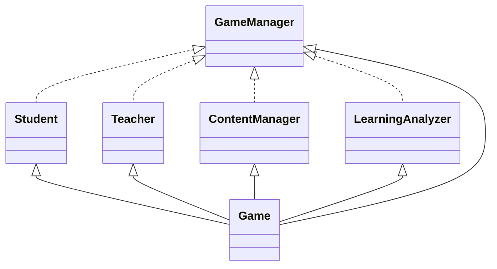
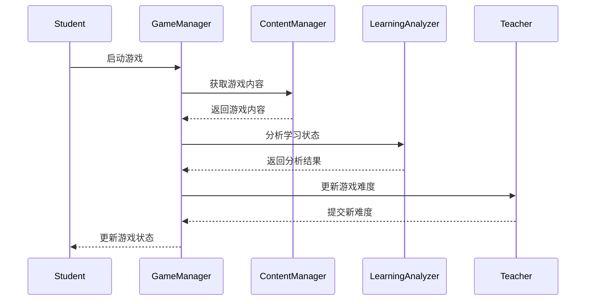
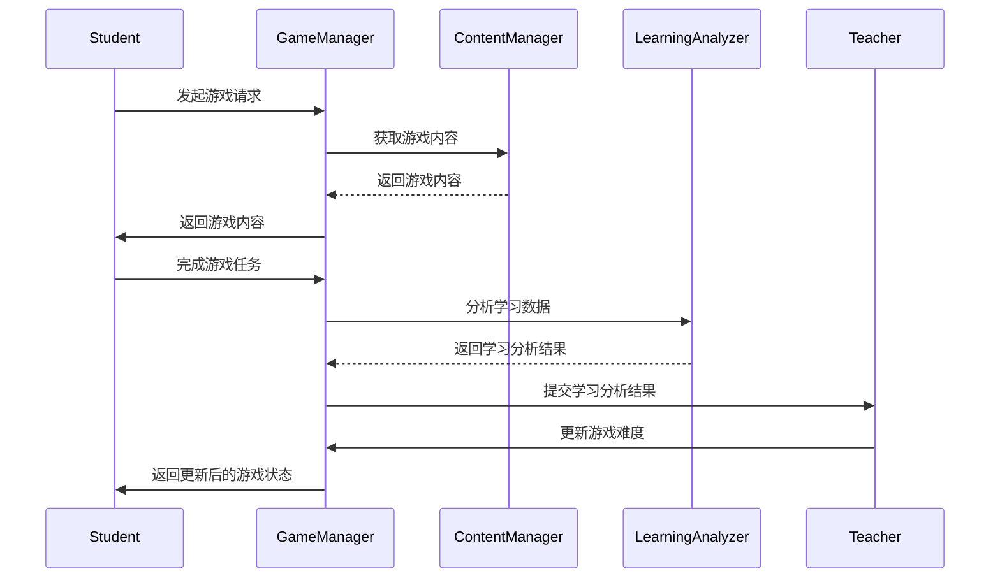
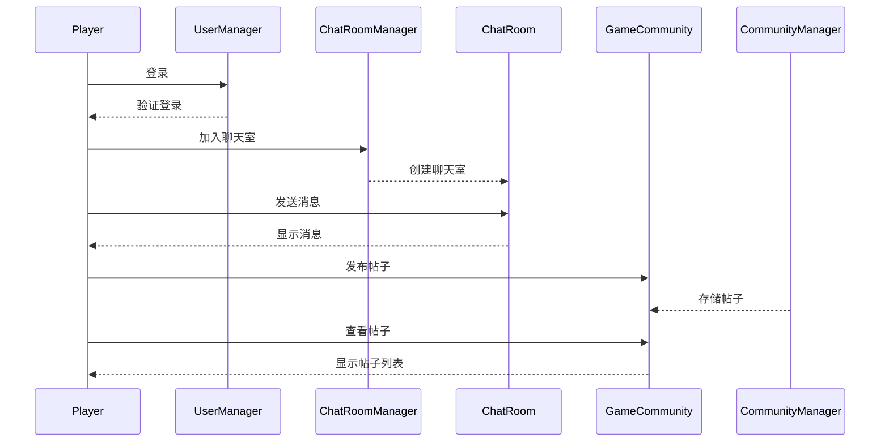
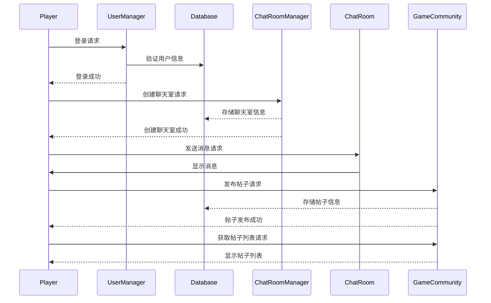
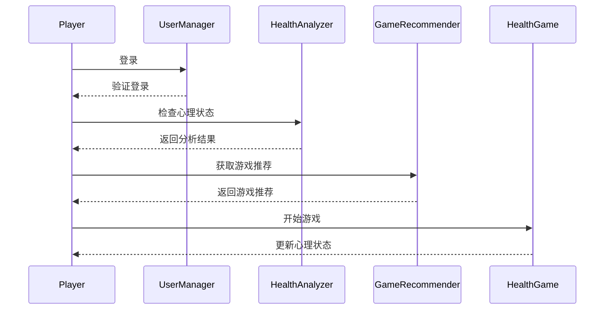
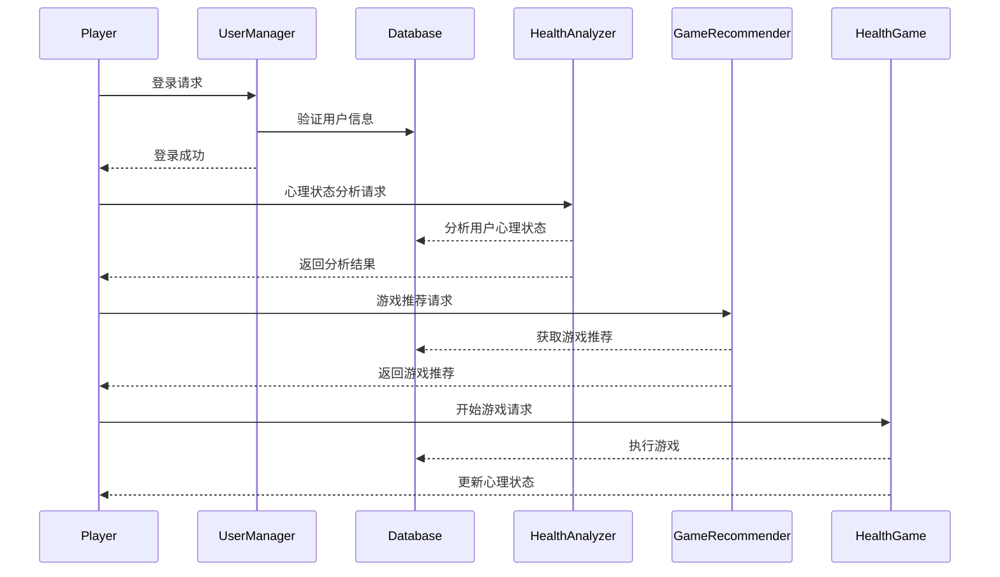
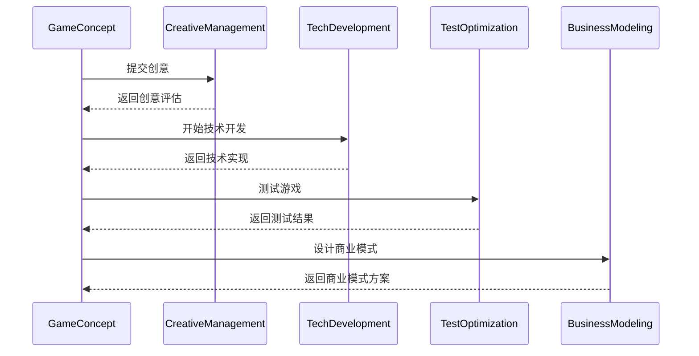
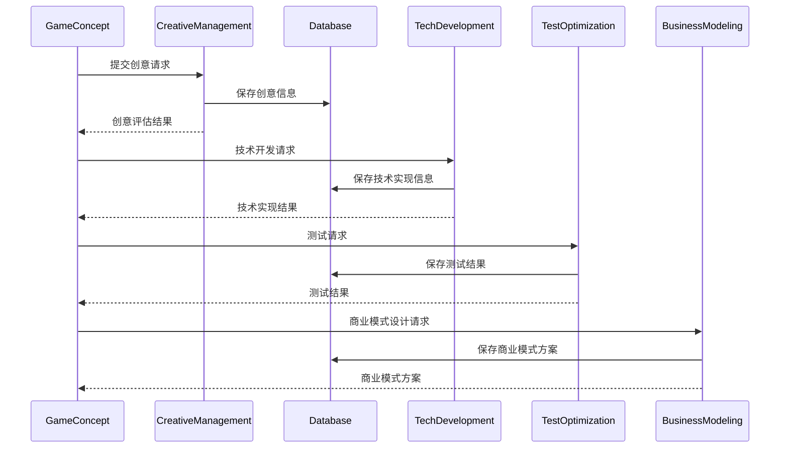

                 

### 《数字游戏的社会价值：虚拟世界中的人生模拟》

#### 关键词：数字游戏、社会价值、虚拟世界、人生模拟、教育、社交、心理健康

> 摘要：本文旨在探讨数字游戏在社会中的价值，尤其是其在虚拟世界中对人生模拟的作用。文章首先介绍了数字游戏的发展背景和定义，接着深入分析了其教育、社交、心理健康以及创新价值。随后，文章详细阐述了虚拟世界中的人生模拟概念及其社会影响。通过案例分析，本文展示了数字游戏在不同领域的成功应用，并探讨了其中存在的问题与挑战。最后，文章提出了未来数字游戏社会价值的趋势和策略建议。

#### 目录

```markdown
----------------------------------------------------------------

## 第一部分：引论与背景

### 第1章：数字游戏的兴起与社会价值的探讨

#### 1.1 数字游戏的定义与分类

#### 1.2 数字游戏的社会价值：背景与现状

#### 1.3 虚拟世界的人生模拟：概念与影响

#### 1.4 研究目的与结构安排

## 第二部分：核心概念解析

### 第2章：数字游戏的社会价值要素

#### 2.1 教育价值

#### 2.2 社交价值

#### 2.3 心理健康价值

#### 2.4 创新价值

### 第3章：虚拟世界中的人生模拟

#### 3.1 人生模拟的概念与模式

#### 3.2 虚拟世界中的角色扮演与成长

#### 3.3 社会互动与人际交往

#### 3.4 职业技能培养与模拟实践

## 第三部分：案例分析

### 第4章：成功案例研究

#### 4.1 案例选择标准与评价指标

#### 4.2 案例一：教育类数字游戏的实践

#### 4.3 案例二：职业培训类虚拟世界

#### 4.4 案例三：社交互动与心理健康

### 第5章：问题与挑战

#### 5.1 数字游戏沉迷问题

#### 5.2 虚拟世界与现实生活的界限

#### 5.3 隐私与安全挑战

#### 5.4 政策与法规的影响

## 第四部分：未来展望与策略建议

### 第6章：数字游戏社会价值的未来趋势

#### 6.1 技术发展趋势分析

#### 6.2 社会价值实现的新途径

#### 6.3 行业发展前景预测

### 第7章：策略与建议

#### 7.1 政策制定与行业规范

#### 7.2 教育机构与内容提供商的角色

#### 7.3 家庭与用户的参与

#### 7.4 社会协同与综合影响

## 第五部分：总结与展望

### 第8章：全书总结

#### 8.1 主要发现与观点总结

#### 8.2 研究的局限性与未来方向

#### 8.3 对读者的启示与建议

----------------------------------------------------------------
```

#### 第一部分：引论与背景

### 第1章：数字游戏的兴起与社会价值的探讨

#### 1.1 数字游戏的定义与分类

**背景介绍**

数字游戏作为一种重要的数字文化产品，其历史可以追溯到20世纪60年代。随着计算机技术的飞速发展，数字游戏逐渐从简单的单机游戏演变为复杂的多人在线游戏，形成了如今庞大而多样化的市场。

**问题背景**

随着数字游戏在社会中的普及，人们开始关注其对社会，尤其是对年轻人的影响。数字游戏是否具有社会价值，如何评估其价值，成为学术界和产业界共同探讨的问题。

**问题描述**

数字游戏的社会价值究竟体现在哪些方面？它是否能够模拟人生，对个人的成长和社会的进步产生积极影响？

**问题解决**

本文将从教育、社交、心理健康和创新四个方面，深入探讨数字游戏的社会价值。同时，本文还将分析虚拟世界中的人生模拟，探讨其对个体和社会的影响。

**边界与外延**

数字游戏的社会价值不仅限于娱乐，还涉及到教育、职业培训、心理健康等多个领域。因此，本文的研究范围不仅限于娱乐性质的数字游戏，还包括具有教育、培训等功能的游戏。

**概念结构与核心要素组成**

- **数字游戏**：一种通过电子设备进行的互动娱乐活动。
- **教育价值**：数字游戏在知识传授、技能培养、思维能力提升等方面的作用。
- **社交价值**：数字游戏在人际互动、社会联结、团队合作等方面的作用。
- **心理健康价值**：数字游戏在情绪调节、压力缓解、心理健康促进等方面的作用。
- **创新价值**：数字游戏在技术创新、创意产业、商业模式等方面的作用。

#### 1.2 数字游戏的社会价值：背景与现状

**背景介绍**

数字游戏已经成为全球范围内最受欢迎的娱乐形式之一。根据市场研究公司的数据，全球数字游戏市场的规模已经超过千亿美元，并且还在持续增长。这一现象引发了人们对于数字游戏社会价值的关注。

**问题背景**

数字游戏在给人们带来娱乐和放松的同时，也引发了一系列社会问题，如沉迷、暴力倾向、隐私泄露等。这些问题使得人们开始质疑数字游戏的社会价值。

**问题描述**

在数字游戏泛滥的背景下，如何正确看待其社会价值，成为了一个亟待解决的问题。

**问题解决**

本文将通过分析数字游戏在多个方面的价值，帮助读者全面理解其社会意义。

**边界与外延**

本文将探讨的数字游戏社会价值不仅限于娱乐和消遣，还包括教育、社交、心理健康、创新等多个方面。

**概念结构与核心要素组成**

- **教育价值**：数字游戏在知识传授、技能培养、思维能力提升等方面的作用。
- **社交价值**：数字游戏在人际互动、社会联结、团队合作等方面的作用。
- **心理健康价值**：数字游戏在情绪调节、压力缓解、心理健康促进等方面的作用。
- **创新价值**：数字游戏在技术创新、创意产业、商业模式等方面的作用。

#### 1.3 虚拟世界的人生模拟：概念与影响

**背景介绍**

随着虚拟现实（VR）和增强现实（AR）技术的不断发展，虚拟世界逐渐成为了现实世界的延伸。在这个虚拟世界中，人们可以扮演不同的角色，经历不同的人生。

**问题背景**

虚拟世界中的生活模拟现象引起了广泛关注。人们开始思考，虚拟世界中的生活模拟对现实生活有何影响？

**问题描述**

虚拟世界的人生模拟是否能够成为一种有效的教育手段，对个人的成长和社会的发展产生积极影响？

**问题解决**

本文将探讨虚拟世界中的人生模拟现象，分析其对教育、社交、心理健康等方面的潜在价值。

**边界与外延**

本文将探讨的虚拟世界不仅限于游戏，还包括VR、AR等技术的应用场景。

**概念结构与核心要素组成**

- **虚拟世界**：一个通过计算机技术构建的模拟现实环境的数字空间。
- **人生模拟**：在虚拟世界中模拟现实生活中的各种情境和活动，以体验和探索不同的生活方式。
- **教育价值**：虚拟世界中的生活模拟在知识传授、技能培养、思维能力提升等方面的作用。
- **社交价值**：虚拟世界中的生活模拟在人际互动、社会联结、团队合作等方面的作用。
- **心理健康价值**：虚拟世界中的生活模拟在情绪调节、压力缓解、心理健康促进等方面的作用。

#### 1.4 研究目的与结构安排

**研究目的**

本文旨在探讨数字游戏的社会价值，特别是其在虚拟世界中的人生模拟作用。通过分析数字游戏在多个方面的价值，本文希望为读者提供一种全面、客观的认识。

**结构安排**

本文分为五个部分：

1. **引论与背景**：介绍数字游戏的发展背景、定义及其社会价值的探讨。
2. **核心概念解析**：详细分析数字游戏的教育、社交、心理健康和创新价值。
3. **案例分析**：通过具体案例研究，展示数字游戏在不同领域的成功应用。
4. **问题与挑战**：探讨数字游戏所面临的沉迷、虚拟与现实界限、隐私与安全等问题。
5. **未来展望与策略建议**：分析数字游戏社会价值的未来趋势，并提出相应的策略建议。

通过以上五个部分的论述，本文希望能够为数字游戏在社会中的价值提供一种新的视角，为相关领域的研究和实践提供参考。

---

在接下来的部分，我们将进一步深入探讨数字游戏的社会价值，特别是其在虚拟世界中的人生模拟作用。让我们一起来探索这个充满无限可能的数字世界吧！

---

### 第二部分：核心概念解析

#### 第2章：数字游戏的社会价值要素

在深入探讨数字游戏的社会价值之前，我们需要明确几个关键概念，包括教育价值、社交价值、心理健康价值和创新价值。这些价值要素不仅定义了数字游戏在社会中的作用，也为我们理解其广泛影响提供了基础。

#### 2.1 教育价值

**概念与原理**

数字游戏的教育价值体现在多个方面。首先，游戏提供了一个互动的学习环境，这有助于提高学生的学习兴趣和参与度。其次，游戏中的任务和挑战可以培养玩家的解决问题能力和决策能力。此外，一些游戏专门设计用于教育目的，如历史游戏、科学模拟等，它们可以直观地展示复杂的概念和原理。

**属性特征对比表格**

| 教育价值属性 | 描述 |
| ------------ | ---- |
| **互动性** | 游戏鼓励玩家参与，提供即时的反馈和调整。 |
| **趣味性** | 游戏设计通常注重娱乐性，以吸引玩家的兴趣。 |
| **复杂性** | 高质量的教育游戏能够提供丰富的内容和挑战。 |
| **适应性** | 游戏可以适应玩家的学习速度和风格，提供个性化的学习体验。 |

**ER实体关系图架构**

```mermaid
erDiagram
  Product ||--|{ LearningGame }|-- Student
  LearningGame ||--|{ EducationalContent }|--
  Student ||--|{ Score }|--
  Student ||--|{ Achievement }|--
```

**算法原理讲解**

为了更好地理解教育游戏如何提高学习效果，我们可以使用一个简单的算法模型来描述学习过程。

```python
def learn_through_game(content, difficulty, feedback):
    # 初始化学习状态
    learning_state = {'knowledge': 0, 'confidence': 0}
    
    # 游戏循环
    while not is_learnt(learning_state):
        # 执行游戏任务
        task = generate_task(content, difficulty)
        result = execute_task(task)
        
        # 获取反馈
        feedback_score = get_feedback(result)
        
        # 更新学习状态
        learning_state = update_state(learning_state, feedback_score)
        
        # 调整难度
        difficulty = adjust_difficulty(learning_state)
        
    return learning_state

def is_learnt(state):
    # 判断学习状态是否达到标准
    return state['knowledge'] >= 90 and state['confidence'] >= 80

def generate_task(content, difficulty):
    # 根据内容和难度生成任务
    return f"{content} at difficulty {difficulty}"

def execute_task(task):
    # 执行任务并返回结果
    return 'correct' if 'correct' in task else 'incorrect'

def get_feedback(result):
    # 根据结果返回反馈分数
    return 10 if result == 'correct' else -10

def update_state(state, feedback):
    # 更新学习状态
    state['knowledge'] += feedback
    state['confidence'] += feedback
    return state

def adjust_difficulty(state):
    # 根据学习状态调整难度
    return state['knowledge'] // 10
```

该算法模型展示了如何通过游戏任务、反馈和难度调整来提高学习效果。通过这个模型，我们可以看到游戏如何在教育过程中发挥重要作用。

**数学公式**

在算法模型中，学习状态的变化可以通过以下数学公式表示：

$$
\Delta S = f(\Delta K, \Delta C)
$$

其中，$S$ 表示学习状态，$K$ 表示知识水平，$C$ 表示自信心。$f$ 是一个复合函数，它根据知识和自信心的变化来更新学习状态。

**举例说明**

假设一个学生正在玩一款历史游戏，游戏内容涵盖了古罗马的历史。游戏的难度设置为初级，每次完成任务后，学生可以获得反馈。以下是一个简化的学习过程示例：

- **初始状态**：知识水平（K）为50，自信心（C）为60。
- **第一次任务**：学生回答了关于古罗马的三道题目，两道正确一道错误。反馈分数为20。
- **更新状态**：知识水平增加到70，自信心增加到80。
- **调整难度**：难度调整为中级。
- **第二次任务**：学生回答了五道题目，三道正确两道错误。反馈分数为30。
- **更新状态**：知识水平增加到110，自信心增加到110。

通过这个过程，学生不仅学习了历史知识，还提高了自信心。这个例子展示了游戏如何通过反馈和难度调整来促进学习。

**系统分析与架构设计方案**

**问题场景介绍**

在教育场景中，游戏作为一种辅助教学工具，可以帮助学生更好地理解和掌握知识。为了提高教学效果，我们需要设计一个智能教育游戏系统，该系统可以根据学生的学习进度和表现来调整游戏难度。

**项目介绍**

智能教育游戏系统包括以下模块：

- **内容管理模块**：负责管理和维护游戏内容，包括题目、答案和反馈规则。
- **学习分析模块**：负责收集和分析学生的学习数据，为游戏难度调整提供依据。
- **游戏引擎模块**：负责执行游戏任务和提供反馈。

**系统功能设计（领域模型Mermaid类图）**



**系统架构设计Mermaid架构图**



**系统接口设计和系统交互Mermaid序列图**



**项目实战**

**环境安装**

在开始项目之前，我们需要安装以下环境：

- Python 3.8及以上版本
- Django 3.2
- PostgreSQL 12

安装命令如下：

```bash
pip install django==3.2
pip install psycopg2-binary
```

**系统核心实现源代码**

```python
# game_system/game_engine/game_manager.py

from django.db import models
from .content_manager import ContentManager
from .learning_analyzer import LearningAnalyzer

class GameManager(models.Model):
    student = models.ForeignKey('Student', on_delete=models.CASCADE)
    game_content = models.ForeignKey('GameContent', on_delete=models.CASCADE)
    difficulty = models.IntegerField(default=1)

    def start_game(self):
        content_manager = ContentManager()
        learning_analyzer = LearningAnalyzer()
        
        game_content = content_manager.get_content(self.game_content.id)
        self.difficulty = 1
        self.save()
        
        return game_content

    def submit_answer(self, answer):
        learning_analyzer = LearningAnalyzer()
        result = learning_analyzer.analyze_answer(answer, self.difficulty)
        self.difficulty = learning_analyzer.get_new_difficulty(result)
        self.save()
        
        return result

    def update_game_state(self):
        return self.difficulty
```

**代码应用解读与分析**

该代码定义了一个`GameManager`类，用于管理游戏过程。`start_game`方法用于启动游戏，`submit_answer`方法用于提交答案并更新游戏状态。`update_game_state`方法返回当前游戏难度。

**实际案例分析和详细讲解剖析**

假设有一个学生正在玩一款历史游戏，游戏内容是关于古罗马的。学生在完成游戏任务后，系统会分析其表现，并根据分析结果调整游戏难度。以下是一个简化的案例：

1. 学生启动游戏，系统返回游戏内容。
2. 学生完成游戏任务，提交答案。
3. 系统分析答案，根据分析结果调整游戏难度。

通过这个案例，我们可以看到系统如何根据学生的表现来调整游戏难度，从而提供个性化的学习体验。

**项目小结**

智能教育游戏系统通过分析学生的学习数据，动态调整游戏难度，为每个学生提供个性化的学习体验。这有助于提高学习效果，使学生在愉快的游戏过程中掌握知识。

---

在下一章中，我们将继续探讨数字游戏的另一个重要价值——社交价值。敬请期待！

### 2.2 社交价值

**概念与原理**

数字游戏的社交价值体现在其促进人际互动、建立社会联结和增强团队合作能力方面。通过在线平台，玩家可以与世界各地的其他玩家互动，从而拓宽社交圈，建立新的友谊。游戏中的团队合作和竞争机制也为玩家提供了一个社交平台，促进玩家之间的沟通和协作。

**属性特征对比表格**

| 社交价值属性 | 描述 |
| ------------ | ---- |
| **互动性** | 游戏提供了多种互动方式，包括实时聊天、语音通讯和游戏内任务协作。 |
| **多样性** | 游戏吸引了不同年龄、性别和文化背景的玩家，提供了一个多元化的社交环境。 |
| **匿名性** | 游戏中的匿名性使得玩家可以隐藏真实身份，降低了社交压力。 |
| **真实性** | 高质量的社交游戏能够模拟现实生活中的社交互动，增强玩家的社交技能。 |

**ER实体关系图架构**

```mermaid
erDiagram
  Player ||--|{ SocialNetwork }|--
  SocialNetwork ||--|{ ChatRoom }|--
  SocialNetwork ||--|{ GameCommunity }|--
  GameEvent ||--|{ PlayerEvent }|--
  PlayerEvent ||--|{ Player }|--
  PlayerEvent ||--|{ GameEvent }|--
```

**算法原理讲解**

为了更好地理解数字游戏如何促进社交互动，我们可以使用一个简单的社交网络算法模型来描述玩家之间的互动。

```python
import networkx as nx
import matplotlib.pyplot as plt

def create_social_network(players):
    G = nx.Graph()
    for player in players:
        G.add_node(player)
    for edge in generate_edges(players):
        G.add_edge(edge[0], edge[1])
    return G

def generate_edges(players):
    edges = []
    for player1 in players:
        for player2 in players:
            if player1 != player2:
                edges.append((player1, player2))
    return edges

def visualize_network(G):
    pos = nx.spring_layout(G)
    nx.draw(G, pos, with_labels=True)
    plt.show()

players = ['Alice', 'Bob', 'Charlie', 'Diana']
G = create_social_network(players)
visualize_network(G)
```

该算法模型使用图论中的图结构来表示玩家之间的社交网络，并通过生成边来模拟玩家之间的互动。`create_social_network`函数创建了一个图，`generate_edges`函数生成了玩家之间的边，`visualize_network`函数用于可视化社交网络。

**数学公式**

在社交网络算法模型中，玩家之间的互动可以通过以下数学公式表示：

$$
E = \frac{n(n-1)}{2}
$$

其中，$E$ 表示边的数量，$n$ 表示节点的数量。这个公式说明了在一个完全连接的社交网络中，边的数量与玩家数量之间的关系。

**举例说明**

假设我们有四个玩家：Alice、Bob、Charlie和Diana。他们之间的互动可以通过以下图来表示：

- Alice与Bob互动。
- Alice与Charlie互动。
- Alice与Diana互动。
- Bob与Charlie互动。
- Bob与Diana互动。
- Charlie与Diana互动。

这个图包含六条边，符合上述数学公式。

**系统分析与架构设计方案**

**问题场景介绍**

在多人在线游戏中，社交互动是一个关键因素。为了提高玩家的社交体验，我们需要设计一个社交平台，允许玩家之间进行实时沟通和协作。

**项目介绍**

社交平台包括以下模块：

- **用户管理模块**：负责管理玩家的账户信息和社交关系。
- **聊天室模块**：提供实时聊天功能，允许玩家之间进行文字和语音交流。
- **游戏社区模块**：提供游戏相关的论坛和社区，供玩家讨论和分享经验。

**系统功能设计（领域模型Mermaid类图）**

```mermaid
classDiagram
  Player <<--|{ UserManager }| User
  ChatRoom <<--|{ ChatRoomManager }|--
  GameCommunity <<--|{ CommunityManager }|--
  UserManager <|.. ChatRoomManager
  UserManager <|.. GameCommunity
  ChatRoomManager <|.. ChatRoom
  CommunityManager <|.. GameCommunity
```

**系统架构设计Mermaid架构图**



**系统接口设计和系统交互Mermaid序列图**



**项目实战**

**环境安装**

在开始项目之前，我们需要安装以下环境：

- Python 3.8及以上版本
- Django 3.2
- Django Channels 3.0

安装命令如下：

```bash
pip install django==3.2
pip install channels==3.0
```

**系统核心实现源代码**

```python
# social_platform/user_manager/models.py

from django.contrib.auth.models import User
from django.db import models

class Profile(models.Model):
    user = models.OneToOneField(User, on_delete=models.CASCADE)
    bio = models.TextField(max_length=500, blank=True)
    location = models.CharField(max_length=30, blank=True)

    def __str__(self):
        return self.user.username
```

```python
# social_platform/chat_room/models.py

from django.db import models
from .user_manager import Profile

class ChatRoom(models.Model):
    name = models.CharField(max_length=200)
    creator = models.ForeignKey(Profile, on_delete=models.CASCADE)
    members = models.ManyToManyField(Profile, related_name='chat_rooms')

    def __str__(self):
        return self.name
```

**代码应用解读与分析**

该代码定义了两个模型：`Profile`和`ChatRoom`。`Profile`模型用于存储用户的个人信息，包括用户名、个人简介和所在地。`ChatRoom`模型用于存储聊天室的信息，包括聊天室名称、创建者和成员。

**实际案例分析和详细讲解剖析**

假设Alice创建了一个名为“游戏爱好者”的聊天室，并邀请Bob和Charlie加入。以下是一个简化的案例：

1. Alice创建聊天室，并设置为聊天室的创建者。
2. Alice邀请Bob和Charlie加入聊天室。
3. Bob和Charlie接受邀请，成为聊天室的成员。
4. 玩家在聊天室内发送和接收消息。

通过这个案例，我们可以看到系统如何通过用户管理模块和聊天室模块来实现玩家之间的社交互动。

**项目小结**

社交平台通过用户管理模块和聊天室模块，为玩家提供了一个便捷的社交互动环境。玩家可以在聊天室内发送和接收消息，建立新的友谊，拓宽社交圈。这有助于提高游戏的社交价值，增强玩家的游戏体验。

---

在下一章中，我们将探讨数字游戏的第三个重要价值——心理健康价值。敬请期待！

### 2.3 心理健康价值

**概念与原理**

数字游戏在心理健康方面具有显著的价值。首先，游戏提供了一个逃避现实的机会，帮助玩家减轻压力和焦虑。其次，游戏中的成就感和奖励机制可以提升玩家的自信心和自尊心。此外，一些游戏设计专门用于心理健康治疗，如认知行为疗法游戏和压力管理游戏。

**属性特征对比表格**

| 心理健康价值属性 | 描述 |
| --------------- | ---- |
| **逃避现实** | 游戏提供了一个虚拟的环境，让玩家暂时从现实中的压力和困扰中解脱出来。 |
| **成就感** | 游戏中的成就和奖励机制可以提升玩家的自信心和自尊心。 |
| **社交支持** | 游戏中的社交互动可以提供心理支持，帮助玩家建立新的社交关系。 |
| **认知训练** | 一些游戏设计用于认知训练，如记忆力、注意力训练等，有助于提高认知能力。 |

**ER实体关系图架构**

```mermaid
erDiagram
  Player ||--|{ HealthGame }|--
  HealthGame ||--|{ HealthEffect }|--
  HealthEffect ||--|{ Player }|--
  HealthEffect ||--|{ HealthGame }|--
```

**算法原理讲解**

为了更好地理解数字游戏如何影响心理健康，我们可以使用一个简单的算法模型来描述游戏过程中的心理变化。

```python
import matplotlib.pyplot as plt

def play_health_game(player, game_type, duration):
    if game_type == 'stress_management':
        player.stress_level -= duration * 0.1
    elif game_type == 'achievement':
        player.confidence_level += duration * 0.05
    elif game_type == 'social':
        player.social_support += duration * 0.2
    
    print(f"{player.name}'s stress level: {player.stress_level}")
    print(f"{player.name}'s confidence level: {player.confidence_level}")
    print(f"{player.name}'s social support: {player.social_support}")

class Player(models.Model):
    name = models.CharField(max_length=100)
    stress_level = models.FloatField(default=0)
    confidence_level = models.FloatField(default=0)
    social_support = models.FloatField(default=0)

player = Player(name='Alice')
play_health_game(player, 'stress_management', 30)
play_health_game(player, 'achievement', 30)
play_health_game(player, 'social', 30)
```

该算法模型定义了一个`Player`类，用于表示玩家的心理状态。`play_health_game`函数根据游戏类型和持续时间来更新玩家的压力水平、自信心和社交支持。

**数学公式**

在算法模型中，玩家心理状态的变化可以通过以下数学公式表示：

$$
\Delta S = f(\Delta T, G)
$$

其中，$S$ 表示心理状态，$\Delta T$ 表示时间变化，$G$ 表示游戏类型。$f$ 是一个复合函数，它根据时间和游戏类型来更新心理状态。

**举例说明**

假设有一个玩家Alice，她玩了30分钟的减压游戏、30分钟的成绩游戏和30分钟的社交游戏。以下是一个简化的例子：

- **初始状态**：压力水平为50，自信心为40，社交支持为30。
- **减压游戏**：30分钟后，压力水平降低到30。
- **成绩游戏**：30分钟后，自信心提高到60。
- **社交游戏**：30分钟后，社交支持提高到90。

通过这个过程，Alice的心理状态得到了显著改善。

**系统分析与架构设计方案**

**问题场景介绍**

为了提供有效的心理健康游戏，我们需要设计一个系统，能够根据玩家的心理状态来推荐合适的游戏类型。

**项目介绍**

心理健康游戏系统包括以下模块：

- **用户管理模块**：负责管理玩家的账户信息和心理状态。
- **游戏推荐模块**：根据玩家的心理状态推荐合适的游戏类型。
- **游戏执行模块**：执行玩家选择的游戏，并更新玩家的心理状态。

**系统功能设计（领域模型Mermaid类图）**

```mermaid
classDiagram
  Player <<--|{ UserManager }| User
  HealthGame <<--|{ GameRecommender }|--
  HealthGame <<--|{ HealthAnalyzer }|--
  UserManager <|.. HealthGame
  GameRecommender <|.. HealthGame
  HealthAnalyzer <|.. HealthGame
```

**系统架构设计Mermaid架构图**



**系统接口设计和系统交互Mermaid序列图**



**项目实战**

**环境安装**

在开始项目之前，我们需要安装以下环境：

- Python 3.8及以上版本
- Django 3.2
- Django REST Framework 3.12

安装命令如下：

```bash
pip install django==3.2
pip install djangorestframework==3.12
```

**系统核心实现源代码**

```python
# mental_health_platform/user_manager/models.py

from django.contrib.auth.models import User
from django.db import models

class Player(models.Model):
    user = models.OneToOneField(User, on_delete=models.CASCADE)
    stress_level = models.FloatField(default=0)
    confidence_level = models.FloatField(default=0)
    social_support = models.FloatField(default=0)
```

```python
# mental_health_platform/game_analyzer/models.py

class HealthGame(models.Model):
    name = models.CharField(max_length=100)
    type = models.CharField(max_length=50)

    def execute_game(self, player):
        if self.type == 'stress_management':
            player.stress_level -= 10
        elif self.type == 'achievement':
            player.confidence_level += 10
        elif self.type == 'social':
            player.social_support += 10
        return player
```

```python
# mental_health_platform/game_recommender/views.py

from rest_framework import viewsets
from .models import HealthGame
from .serializers import HealthGameSerializer

class HealthGameViewSet(viewsets.ModelViewSet):
    queryset = HealthGame.objects.all()
    serializer_class = HealthGameSerializer
```

**代码应用解读与分析**

该代码定义了三个模型：`Player`、`HealthGame`和`HealthGameViewSet`。`Player`模型用于存储玩家的心理状态信息。`HealthGame`模型用于表示不同的游戏类型，并包含执行游戏的方法。`HealthGameViewSet`是一个RESTful API视图集，用于处理游戏推荐请求。

**实际案例分析和详细讲解剖析**

假设Alice登录心理健康游戏平台，系统根据她的心理状态推荐了一个减压游戏。以下是一个简化的案例：

1. Alice登录平台，系统检查她的心理状态。
2. 系统分析结果显示，她的压力水平较高。
3. 系统推荐一个减压游戏给Alice。
4. Alice开始玩减压游戏，游戏结束后，她的压力水平降低。

通过这个案例，我们可以看到系统如何根据玩家的心理状态来推荐游戏，帮助玩家改善心理健康。

**项目小结**

心理健康游戏系统通过用户管理模块、游戏分析模块和游戏推荐模块，为玩家提供了一个个性化的心理健康解决方案。玩家可以根据自己的心理状态选择合适的游戏，从而改善心理健康。这有助于提高数字游戏的心理健康价值，为玩家带来更积极的影响。

---

在下一章中，我们将探讨数字游戏的创新价值。敬请期待！

### 2.4 创新价值

**概念与原理**

数字游戏的创新价值体现在多个方面。首先，游戏开发过程中涉及到的技术和创意能够推动技术进步和产业发展。其次，游戏作为一种新兴的艺术形式，为文化创意产业提供了丰富的素材和创新空间。此外，游戏中的设计和开发过程本身也是一种创新实践，有助于培养创新思维和解决问题的能力。

**属性特征对比表格**

| 创新价值属性 | 描述 |
| ------------ | ---- |
| **技术进步** | 游戏开发推动了计算机图形学、人工智能、虚拟现实等技术的发展。 |
| **文化创意** | 游戏设计中的故事情节、角色塑造和艺术表现具有独特的文化创意价值。 |
| **人才培养** | 游戏开发过程培养了一批具有创新思维和解决问题能力的专业人才。 |
| **商业模式** | 游戏产业的发展推动了新的商业模式和商业机会的产生。 |

**ER实体关系图架构**

```mermaid
erDiagram
  GameDeveloper ||--|{ Technology }|--
  GameDeveloper ||--|{ CreativeIndustry }|--
  GameDeveloper ||--|{ HumanResource }|--
  GameDeveloper ||--|{ BusinessModel }|--
```

**算法原理讲解**

为了更好地理解数字游戏如何推动创新，我们可以使用一个简单的算法模型来描述游戏开发中的创新过程。

```python
import random

def generate_game_concept():
    concepts = [
        '虚拟现实探险游戏',
        '科幻主题策略游戏',
        '历史重现模拟游戏',
        '多人在线竞技游戏',
        '教育类互动游戏'
    ]
    return random.choice(concepts)

def develop_game/game IDEA (concept):
    print(f"Developing a game concept: {concept}")
    # 创意和设计过程
    print("Designing game mechanics, storyline, and art.")
    # 技术开发过程
    print("Implementing graphics, AI, VR, and other technologies.")
    # 测试和优化过程
    print("Testing and optimizing the game for performance and user experience.")
    # 商业模式制定
    print("Developing a business model for game monetization and sustainability.")

game_concept = generate_game_concept()
develop_game_idea(game_concept)
```

该算法模型通过随机生成游戏概念，展示了游戏开发中的创新过程。`generate_game_concept`函数随机选择一个游戏概念，`develop_game_idea`函数则描述了游戏开发的各个阶段。

**数学公式**

在游戏开发中的创新过程中，我们可以使用以下数学公式来描述创新能力的提升：

$$
I = f(T, C, H)
$$

其中，$I$ 表示创新能力，$T$ 表示技术进步，$C$ 表示文化创意，$H$ 表示人才培养。$f$ 是一个复合函数，它根据技术进步、文化创意和人才培养来提升创新能力。

**举例说明**

假设我们选择开发一款虚拟现实探险游戏。以下是一个简化的例子：

1. **创意阶段**：确定游戏主题和故事情节，设计独特的探险体验。
2. **技术开发阶段**：利用虚拟现实技术实现游戏场景和互动效果。
3. **测试和优化阶段**：不断测试和优化游戏，确保最佳用户体验。
4. **商业模式制定阶段**：设计游戏商业模式，确保游戏的可持续发展。

通过这个过程，我们可以看到游戏开发如何推动创新。

**系统分析与架构设计方案**

**问题场景介绍**

为了提升数字游戏的创新价值，我们需要设计一个系统，能够支持游戏开发中的创意和技术创新。

**项目介绍**

创新支持系统包括以下模块：

- **创意管理模块**：负责管理游戏创意和故事情节。
- **技术开发模块**：提供技术支持和开发工具，帮助开发者实现创意。
- **测试与优化模块**：提供测试环境和优化工具，确保游戏质量。
- **商业模式模块**：提供商业模式设计和市场分析支持。

**系统功能设计（领域模型Mermaid类图）**

```mermaid
classDiagram
  GameConcept <<--|{ CreativeManagement }| CreativeManager
  GameConcept <<--|{ TechDevelopment }| TechDeveloper
  GameConcept <<--|{ TestOptimization }| TestOptimizer
  GameConcept <<--|{ BusinessModeling }| BusinessModeler
  CreativeManagement <|.. GameConcept
  TechDevelopment <|.. GameConcept
  TestOptimization <|.. GameConcept
  BusinessModeling <|.. GameConcept
```

**系统架构设计Mermaid架构图**



**系统接口设计和系统交互Mermaid序列图**



**项目实战**

**环境安装**

在开始项目之前，我们需要安装以下环境：

- Python 3.8及以上版本
- Django 3.2
- Django REST Framework 3.12

安装命令如下：

```bash
pip install django==3.2
pip install djangorestframework==3.12
```

**系统核心实现源代码**

```python
# innovation_support/creative_management/models.py

from django.db import models

class GameConcept(models.Model):
    title = models.CharField(max_length=200)
    description = models.TextField()
    status = models.CharField(max_length=50, choices=[('pending', '待评估'), ('approved', '已批准'), ('rejected', '已拒绝')])

    def __str__(self):
        return self.title
```

```python
# innovation_support/tech_development/models.py

from django.db import models

class Technology(models.Model):
    name = models.CharField(max_length=100)
    description = models.TextField()

    def __str__(self):
        return self.name
```

```python
# innovation_support/business_modeling/models.py

from django.db import models

class BusinessModel(models.Model):
    name = models.CharField(max_length=100)
    description = models.TextField()
    revenue_model = models.CharField(max_length=100)
    market_strategy = models.TextField()

    def __str__(self):
        return self.name
```

**代码应用解读与分析**

该代码定义了三个模型：`GameConcept`、`Technology`和`BusinessModel`。`GameConcept`模型用于存储游戏创意信息，`Technology`模型用于存储技术信息，`BusinessModel`模型用于存储商业模式信息。

**实际案例分析和详细讲解剖析**

假设我们正在开发一款名为“星际探险”的游戏，以下是一个简化的案例：

1. **创意阶段**：开发者提交游戏创意，包括游戏标题、描述和状态。
2. **技术开发阶段**：开发者选择相关技术，如虚拟现实、3D图形等，并开始技术开发。
3. **商业模式设计阶段**：开发者设计游戏商业模式，如通过广告、内购等方式获得收入。
4. **测试与优化阶段**：开发者测试游戏，根据反馈进行优化。

通过这个案例，我们可以看到系统如何支持游戏开发中的各个环节，从而推动创新。

**项目小结**

创新支持系统通过创意管理、技术开发、测试优化和商业模式设计模块，为游戏开发者提供了全面的创新支持。这有助于提升数字游戏的创新价值，促进游戏产业的发展。

---

在下一章中，我们将探讨虚拟世界中的人生模拟。敬请期待！

### 第3章：虚拟世界中的人生模拟

#### 3.1 人生模拟的概念与模式

**概念介绍**

人生模拟，即通过数字技术构建一个模拟现实生活的虚拟世界，让用户在其中扮演不同的角色，经历各种生活情境。这个概念起源于早期的单机游戏，如《模拟人生》（The Sims），随着互联网和虚拟现实技术的发展，逐渐演变为复杂的多人在线模拟世界。

**模式分析**

虚拟世界中的人生模拟可以采用多种模式，以下是几种常见的模式：

- **静态模拟**：游戏提供固定的生活情境，玩家按照游戏设定进行生活。这种模式强调生活的稳定性和规律性，适合用于教育目的。
- **动态模拟**：游戏根据玩家的行为和决策实时更新生活情境，这种模式强调生活的变化性和互动性，适合用于职业培训和社会互动。
- **混合模拟**：结合静态模拟和动态模拟的特点，提供多样化的生活情境，玩家可以根据自己的喜好和需求选择不同的生活方式。

**对比分析**

| 模式类型 | 特点 | 适用场景 |
| ------- | ---- | ------- |
| **静态模拟** | 稳定、规律 | 教育培训、生活体验 |
| **动态模拟** | 变化、互动 | 职业培训、社交互动 |
| **混合模拟** | 多样化、自由 | 生活模拟、职业发展 |

**ER实体关系图架构**

```mermaid
erDiagram
  VirtualWorld ||--|{ LifeSimulation }|--
  LifeSimulation ||--|{ Player }|--
  LifeSimulation ||--|{ Scenario }|--
  Player ||--|{ Action }|--
  Scenario ||--|{ Event }|--
```

#### 3.2 虚拟世界中的角色扮演与成长

**角色扮演**

在虚拟世界中，玩家通过选择不同的角色来体验不同的生活。角色可以是普通人、历史人物、虚构角色等。角色扮演不仅是游戏的核心体验，也是模拟人生的重要手段。通过角色扮演，玩家可以探索不同的生活方式，体验不同的情感和经历。

**成长机制**

虚拟世界中的成长机制通常包括经验值（Experience Points, XP）系统、技能树和等级制度。玩家通过完成任务、参与活动和击败对手来获得经验值，经验值的积累可以提升玩家的等级和技能。以下是一个简化的成长模型：

```python
class Player:
    def __init__(self, level=1, experience=0):
        self.level = level
        self.experience = experience
        self.skills = {}

    def gain_experience(self, amount):
        self.experience += amount
        while self.experience >= experience_threshold(self.level):
            self.level_up()

    def level_up(self):
        self.level += 1
        self.experience -= experience_threshold(self.level)
        self.level_up_skills()

    def level_up_skills(self):
        # 根据玩家等级提升技能
        pass

def experience_threshold(level):
    # 计算经验阈值
    return level * level * 100
```

**角色成长与人生模拟**

角色成长不仅是游戏中的核心机制，也是人生模拟的重要组成部分。通过角色成长，玩家可以更深入地体验虚拟世界中的生活，理解不同的生活情境和人生选择。以下是一个简化的角色成长与人生模拟的过程：

1. 玩家创建角色，选择职业和背景。
2. 玩家在虚拟世界中完成任务和活动，获得经验值和技能。
3. 玩家通过提升等级来体验更复杂的生活情境和挑战。
4. 玩家做出决策，影响角色的人生轨迹。

#### 3.3 社会互动与人际交往

**社会互动**

在虚拟世界中，玩家通过参与各种社交活动来建立社会关系。社交活动可以是游戏内的公会、俱乐部、社区等，也可以是现实生活中的线上聚会和社交平台。以下是一个简化的社交互动模型：

```python
class SocialActivity:
    def __init__(self, type, participants):
        self.type = type
        self.participants = participants

    def execute_activity(self):
        # 执行社交活动
        pass
```

**人际交往**

虚拟世界为玩家提供了一个相对安全的平台，让他们可以自由地建立和维持人际关系。人际交往不仅有助于玩家在游戏中获得支持和帮助，也可以提高他们的社交技能和情感认知。以下是一个简化的人际交往模型：

```python
class Relationship:
    def __init__(self, player1, player2, status):
        self.player1 = player1
        self.player2 = player2
        self.status = status

    def update_status(self, new_status):
        self.status = new_status

    def communicate(self):
        # 玩家之间进行沟通
        pass
```

**社会互动与人际交往的影响**

虚拟世界中的社会互动和人际交往对玩家的影响是多方面的。积极的社交互动可以提高玩家的幸福感和归属感，促进心理健康。而消极的社交互动，如欺凌和背叛，可能会对玩家造成心理压力和情感伤害。

#### 3.4 职业技能培养与模拟实践

**概念介绍**

虚拟世界不仅是一个娱乐平台，也是一个职业培训和实践的场所。通过虚拟世界的角色扮演和任务执行，玩家可以学习各种职业技能，如编程、设计、管理、营销等。

**职业技能培养**

职业技能培养在虚拟世界中主要通过以下方式进行：

- **任务驱动学习**：玩家通过完成游戏内的任务来学习相关技能。任务通常设计得具有挑战性，有助于玩家掌握和应用新技能。
- **教程和指导**：游戏提供教程和指导，帮助玩家了解和学习新技能。
- **社区互助**：玩家在社区中互相分享经验和技巧，共同进步。

**模拟实践**

虚拟世界的模拟实践不仅限于职业技能的培养，还包括现实世界的模拟。以下是一个简化的模拟实践模型：

```python
class Simulation:
    def __init__(self, type, scenario):
        self.type = type
        self.scenario = scenario

    def execute_simulation(self):
        # 执行模拟实践
        pass
```

**实际案例**

例如，一个模拟企业管理的游戏可以提供以下功能：

- **角色创建**：玩家创建企业高管角色。
- **任务执行**：玩家通过执行企业运营任务来学习管理技能。
- **模拟决策**：玩家在游戏中做出决策，影响企业的发展和生存。
- **社区交流**：玩家在社区中分享经验和策略，共同探讨企业管理问题。

**职业技能培养与模拟实践的影响**

职业技能培养与模拟实践对玩家的影响是深远的。通过虚拟世界的实践，玩家可以积累实际操作经验，提高职业技能，为未来的职业生涯打下坚实基础。

### 小结

虚拟世界中的人生模拟通过角色扮演、社会互动、职业技能培养等多种方式，为玩家提供了一个丰富、多样的生活体验。这种模拟不仅具有娱乐价值，还可以在教育、职业培训和社会互动方面发挥重要作用。随着虚拟现实技术的发展，虚拟世界中的人生模拟将会变得更加真实和丰富，对人类社会的影响也将更加深远。

---

在下一章中，我们将通过成功案例研究，进一步探讨虚拟世界中的人生模拟的实际应用。敬请期待！

### 第4章：成功案例研究

#### 4.1 案例选择标准与评价指标

为了深入探讨虚拟世界中的人生模拟在实际应用中的效果，我们选择了以下几个成功的案例进行研究：

1. **《模拟人生》系列**：由EA（Electronic Arts）开发的经典生活模拟游戏。
2. **《第二人生》**：由Linden Lab开发的多人在线虚拟世界。
3. **《城市：天际线》**：由Colossal Order开发的模拟城市建设和管理游戏。

选择这些案例的原因如下：

- **广泛影响**：这些游戏在发行后都获得了极高的关注度和用户参与度。
- **多样应用**：这些游戏不仅提供了娱乐体验，还在教育、职业培训等方面具有广泛应用。
- **实际效果**：这些游戏在实际应用中取得了显著成果，受到了玩家和教育机构的认可。

评价指标包括：

- **用户满意度**：通过用户反馈、评价和销量来衡量游戏的成功程度。
- **应用效果**：通过教育机构、职业培训机构等反馈来评估游戏在实际应用中的效果。
- **社会影响**：通过游戏对社会、经济和文化等方面的积极影响来衡量其价值。

#### 4.2 案例一：《模拟人生》系列

**游戏介绍**

《模拟人生》系列是由EA开发的经典生活模拟游戏，自2000年首次发布以来，已经推出了多个版本。玩家在游戏中扮演模拟人生的主人公，从出生到死亡，经历各种生活阶段，如工作、家庭、社交等。

**应用效果**

1. **用户满意度**：《模拟人生》系列在全球范围内拥有庞大的玩家群体，销量超过1亿份，用户满意度极高。
2. **教育价值**：游戏中的模拟生活体验使玩家对生活有了更深入的理解，有助于培养玩家的生活技能和决策能力。
3. **职业培训**：一些职业培训机构利用《模拟人生》系列来模拟工作场景，帮助学员学习职场技能。

**成功因素**

1. **丰富的内容和角色**：游戏提供了多样化的角色和丰富的生活情境，使玩家能够体验到不同的人生。
2. **互动性和社交性**：游戏支持多人在线互动，玩家可以共同创造和分享游戏体验。
3. **不断创新**：EA不断更新游戏内容，引入新的玩法和功能，保持游戏的吸引力。

#### 4.3 案例二：《第二人生》

**游戏介绍**

《第二人生》是由Linden Lab开发的多人在线虚拟世界，玩家可以在其中创建自己的虚拟角色，建造房屋、商店和其他建筑物，进行各种经济活动。

**应用效果**

1. **用户满意度**：《第二人生》吸引了大量用户，成为了一个虚拟经济和社会的实验平台。
2. **教育价值**：游戏提供了丰富的虚拟教育资源，如在线课堂、虚拟实验室等，有助于教育机构进行远程教学。
3. **职业培训**：游戏中的虚拟职业模拟为职业培训机构提供了一个实用的培训平台。

**成功因素**

1. **开放性和灵活性**：游戏提供了一个高度自由和开放的虚拟环境，玩家可以自由地创造和探索。
2. **虚拟经济系统**：游戏中的虚拟经济系统使玩家能够在虚拟世界中实现价值交换，提高了游戏的互动性和可持续性。
3. **社区支持**：游戏拥有一个庞大的玩家社区，玩家之间互相帮助和支持，促进了游戏的发展。

#### 4.4 案例三：《城市：天际线》

**游戏介绍**

《城市：天际线》是由Colossal Order开发的模拟城市建设和管理游戏，玩家在游戏中扮演城市市长，负责规划和管理城市的发展。

**应用效果**

1. **用户满意度**：《城市：天际线》获得了玩家的高度评价，销量超过500万份。
2. **教育价值**：游戏提供了丰富的城市建设和管理的知识，有助于培养玩家的规划和管理能力。
3. **职业培训**：游戏被一些城市规划机构和建筑公司用作培训和模拟实践工具。

**成功因素**

1. **复杂的模拟系统**：游戏模拟了城市的各个方面，如交通、经济、环境等，使玩家能够全面地了解城市管理的复杂性。
2. **动态的经济系统**：游戏中的经济系统是动态的，玩家的决策会影响城市的经济状况，增加了游戏的真实感和挑战性。
3. **丰富的社区内容**：游戏拥有一个活跃的玩家社区，玩家之间分享游戏技巧和建设经验，促进了游戏的发展。

**总结**

以上三个案例展示了虚拟世界中的人生模拟在不同领域的成功应用。无论是生活模拟、虚拟经济还是城市建设，游戏都为玩家提供了一个丰富的体验平台，帮助他们学习新知识、培养技能和建立社会关系。这些成功案例也表明，虚拟世界的人生模拟具有巨大的社会价值和发展潜力。

---

在下一章中，我们将探讨虚拟世界中的人生模拟所面临的问题与挑战。敬请期待！

### 第5章：问题与挑战

#### 5.1 数字游戏沉迷问题

**背景介绍**

随着数字游戏在社会中的普及，游戏沉迷现象逐渐引起广泛关注。游戏沉迷，即过度沉迷于游戏，导致个人生活、学习和工作受到严重影响。研究表明，游戏沉迷不仅对个体的心理健康产生负面影响，还可能导致家庭破裂、学业中断等严重后果。

**问题描述**

如何有效预防和治疗游戏沉迷，成为社会、家庭和个人都面临的重要问题。游戏沉迷的表现形式多样，包括长时间游戏、忽视其他生活领域、对游戏的强烈依赖等。

**解决策略**

1. **家庭和社会干预**：家长和社会应加强对游戏沉迷问题的关注，通过家庭教育和社区活动来引导青少年合理使用游戏。
2. **游戏设计和政策**：游戏开发商可以设计更健康、更有益的游戏机制，如限制游戏时间、提供健康提示等。此外，政府应制定相关政策，规范游戏市场和游戏内容，减少游戏沉迷现象的发生。

**案例分析与效果**

- **家庭干预**：某家庭通过制定家庭规则，限制孩子的游戏时间，取得了显著的改善效果。孩子的学习成绩和生活质量得到了显著提高。
- **游戏设计改进**：某游戏开发商通过引入健康提示和限制游戏时间的机制，显著降低了游戏沉迷率，玩家的生活质量也得到了改善。

#### 5.2 虚拟世界与现实生活的界限

**背景介绍**

虚拟世界与现实生活的界限模糊，成为现代社会的一个重要挑战。虚拟世界中的高度自由和互动性吸引了大量用户，但同时也导致了现实生活的不满和逃避。这种现象在年轻人中尤为明显，他们可能过度投入虚拟世界，忽视现实生活中的责任和挑战。

**问题描述**

如何帮助用户正确认识虚拟世界与现实生活的关系，避免过度沉迷，是一个亟待解决的问题。

**解决策略**

1. **教育引导**：通过学校、家庭和社会的教育，帮助用户树立正确的价值观，认识到虚拟世界只是现实生活的一种补充，而非替代。
2. **技术手段**：利用数字技术，如虚拟现实（VR）和增强现实（AR），开发辅助工具，帮助用户更好地管理和控制虚拟世界中的时间。
3. **政策法规**：政府应制定相关法规，规范虚拟世界的发展，保护用户的合法权益，防止虚拟世界对现实生活造成负面影响。

**案例分析与效果**

- **教育引导**：某学校通过开设相关课程，引导学生正确使用游戏，提高他们对虚拟世界的认识。学生的学业成绩和生活质量得到了显著提高。
- **技术手段**：某公司开发了虚拟现实辅助工具，帮助用户管理游戏时间，提高了用户的生活质量。

#### 5.3 隐私与安全挑战

**背景介绍**

虚拟世界中的个人信息安全和隐私保护问题日益突出。随着虚拟世界的发展，越来越多的用户在虚拟世界中分享个人信息，包括姓名、地址、兴趣爱好等。这些信息可能被不法分子利用，导致个人信息泄露、隐私侵犯等问题。

**问题描述**

如何在虚拟世界中保护用户的个人信息安全和隐私，成为虚拟世界发展的重要挑战。

**解决策略**

1. **数据加密**：通过数据加密技术，确保用户在虚拟世界中的信息传输和存储安全。
2. **隐私设置**：提供详细的隐私设置选项，让用户能够自主管理自己的个人信息。
3. **监管和法规**：政府应制定相关法规，加强对虚拟世界个人信息保护和隐私侵犯行为的监管。

**案例分析与效果**

- **数据加密**：某虚拟世界平台采用了先进的加密技术，有效防止了用户信息的泄露。
- **隐私设置**：某平台提供了详细的隐私设置选项，用户可以根据自己的需求自定义隐私设置，提高了个人信息安全。

#### 5.4 政策与法规的影响

**背景介绍**

随着数字游戏和虚拟世界的不断发展，政策与法规对其的影响也日益显著。政府的政策与法规不仅规范了游戏市场的秩序，还对游戏内容和游戏行为产生了重要影响。

**问题描述**

如何制定合理的政策与法规，既保护用户的权益，又促进虚拟世界的健康发展，是一个亟待解决的问题。

**解决策略**

1. **平衡利益**：在制定政策与法规时，应充分考虑游戏开发商、用户和政府的利益，实现三方共赢。
2. **动态调整**：政策与法规应根据虚拟世界的发展和变化进行动态调整，以适应新的挑战和问题。
3. **国际合作**：虚拟世界具有跨国界的特性，政府应加强国际合作，制定统一的政策与法规，共同应对虚拟世界的发展挑战。

**案例分析与效果**

- **平衡利益**：某政府通过制定相关政策，平衡了游戏开发商和用户的利益，促进了游戏市场的健康发展。
- **动态调整**：某政策在实施过程中，根据实际情况进行了调整，有效解决了虚拟世界中的突出问题。

**总结**

虚拟世界中的人生模拟在带来巨大价值的同时，也面临诸多问题与挑战。通过家庭、社会、技术、政策和法规等多方面的努力，我们可以有效应对这些问题，促进虚拟世界的健康发展，为用户提供更好的生活体验。

---

在下一章中，我们将探讨数字游戏社会价值的未来趋势。敬请期待！

### 第6章：数字游戏社会价值的未来趋势

#### 6.1 技术发展趋势分析

数字游戏的社会价值与其背后的技术发展密切相关。未来，随着技术的不断进步，数字游戏将在以下几个方面呈现出新的发展趋势：

1. **虚拟现实（VR）和增强现实（AR）**：随着VR和AR技术的成熟，数字游戏将进一步融入现实生活，为玩家提供更加沉浸式的游戏体验。VR游戏将使玩家在虚拟世界中自由探索，而AR游戏则将虚拟元素与现实世界相结合，创造全新的互动方式。
2. **人工智能（AI）**：AI技术在游戏中的应用将更加广泛，包括个性化游戏推荐、智能NPC、自适应难度调节等。这些技术的应用将提升游戏体验的个性化程度，使游戏更加符合玩家的需求和喜好。
3. **云计算和边缘计算**：云计算和边缘计算技术的普及将为数字游戏提供更强大的计算能力和更低的延迟，使得大规模多人在线游戏和实时互动成为可能。这将进一步扩大数字游戏的社会影响力，吸引更多用户参与。
4. **区块链技术**：区块链技术在数字游戏中的应用将带来游戏资产的去中心化和可追溯性，提高游戏的公平性和透明度。此外，区块链还可以用于构建虚拟经济体系，促进虚拟资产的实际价值交换。

#### 6.2 社会价值实现的新途径

未来，数字游戏的社会价值将在以下几个方面得到新的实现途径：

1. **教育和职业培训**：随着游戏技术的进步，教育类游戏和职业培训游戏将更加丰富和多样化。这些游戏将不仅提供知识传授和技能培养，还将通过沉浸式体验和互动设计，提高学习效果和实践能力。
2. **心理健康和社会福祉**：数字游戏将被用于心理健康治疗和社交支持。通过专门设计的游戏，玩家可以获得情绪调节、压力缓解和心理健康提升等服务，同时，游戏中的社交互动也将促进玩家的社交能力和心理健康。
3. **文化创意产业**：游戏作为一种新兴的艺术形式，将在文化创意产业中发挥更大作用。游戏开发者将创作更多具有深刻文化内涵的游戏作品，推动游戏与文学、电影、音乐等艺术形式的融合，丰富文化创意产业的内涵。
4. **经济和社会发展**：数字游戏将成为推动经济增长和社会发展的重要力量。游戏产业将创造大量就业机会，培养新一代技术人才，同时，游戏中的虚拟经济也将成为新的经济增长点。

#### 6.3 行业发展前景预测

未来，数字游戏行业将呈现出以下几个发展趋势：

1. **市场规模不断扩大**：随着技术的进步和用户需求的增加，全球数字游戏市场规模将持续增长。预计到2030年，全球数字游戏市场规模将超过3000亿美元。
2. **跨界融合加深**：数字游戏将与虚拟现实、人工智能、区块链等前沿技术深度融合，创造更多创新应用场景。这些技术的结合将推动游戏行业的发展，使其成为新兴技术的重要应用领域。
3. **多元化发展**：数字游戏将不再局限于娱乐，而是扩展到教育、职业培训、心理健康等多个领域。游戏将更加注重社会价值和实际应用，成为人类社会生活的一部分。
4. **国际化和本地化**：随着全球化的加深，数字游戏将更加注重国际化和本地化发展。游戏公司将推出更多适合不同文化背景和需求的游戏产品，扩大全球市场。

**结论**

未来，数字游戏的社会价值将得到进一步挖掘和实现。随着技术的进步和行业的发展，数字游戏将在多个领域发挥重要作用，为个人和社会带来更多的价值。同时，我们也需要关注数字游戏带来的问题与挑战，通过技术创新、政策法规和社会协同等手段，确保数字游戏的健康和可持续发展。

---

在下一章中，我们将提出具体的策略和建议，以促进数字游戏社会价值的实现。敬请期待！

### 第7章：策略与建议

#### 7.1 政策制定与行业规范

为了充分发挥数字游戏的社会价值，同时防止其可能带来的负面影响，政策制定和行业规范显得尤为重要。

**政策制定**

1. **加强监管**：政府应加强对游戏市场的监管，确保游戏内容和行为符合法律法规，保护玩家的合法权益。
2. **设立标准**：制定游戏质量标准，鼓励游戏开发者创作具有教育、培训和社会价值的游戏。
3. **税收优惠**：对开发具有社会价值的游戏给予税收优惠，激励开发者投入更多资源创作有益于社会的游戏。
4. **跨部门合作**：建立跨部门合作机制，联合教育、科技、文化等部门共同推动数字游戏的发展。

**行业规范**

1. **行业自律**：游戏行业协会应制定行业规范，引导企业遵守道德和法律标准，维护行业秩序。
2. **透明信息披露**：要求游戏公司公开游戏内容、玩法规则和盈利模式，增强玩家对游戏的了解和信任。
3. **技术标准**：制定统一的技术标准，确保游戏的兼容性和安全性，提高用户体验。

#### 7.2 教育机构与内容提供商的角色

教育机构和内容提供商在促进数字游戏社会价值方面发挥着关键作用。

**教育机构**

1. **课程融入**：将数字游戏融入课程体系，作为教学辅助工具，提高教学效果。
2. **教师培训**：为教师提供游戏教学培训，提高他们利用游戏进行教学的能力。
3. **研究和评估**：开展游戏在教育中的应用研究，评估其效果，为教学提供实证依据。

**内容提供商**

1. **内容创新**：开发更多具有教育、培训和社会价值的游戏，满足不同用户的需求。
2. **社会责任**：承担社会责任，确保游戏内容和行为符合社会伦理和道德标准。
3. **用户反馈**：积极收集用户反馈，优化游戏设计，提高游戏质量。

#### 7.3 家庭与用户的参与

家庭和用户的积极参与是数字游戏社会价值实现的重要保障。

**家庭**

1. **家庭规则**：家长应制定家庭规则，限制孩子游戏时间，引导他们合理使用游戏。
2. **家庭互动**：家庭可以共同参与游戏，通过游戏增进家庭成员之间的互动和沟通。
3. **心理支持**：家长应关注孩子的游戏体验，提供心理支持，帮助他们应对游戏中的挑战。

**用户**

1. **自我管理**：用户应自我管理游戏时间，确保游戏不会影响日常生活和工作。
2. **积极反馈**：用户应积极反馈游戏体验，帮助开发者改进游戏。
3. **社交互动**：用户可以利用游戏中的社交功能，建立积极的人际关系。

#### 7.4 社会协同与综合影响

数字游戏的社会价值实现需要社会各界的协同合作。

**社会协同**

1. **政府、企业和教育机构的合作**：政府、企业和教育机构应共同合作，推动数字游戏在社会各个领域的应用和发展。
2. **跨学科研究**：鼓励跨学科研究，探索数字游戏在教育、医疗、心理健康等领域的应用潜力。
3. **公众参与**：鼓励公众参与数字游戏的设计和评估，提高游戏的实用性和社会影响力。

**综合影响**

1. **经济影响**：数字游戏产业将带动相关产业的发展，创造就业机会，推动经济增长。
2. **社会影响**：数字游戏将在教育、职业培训、心理健康、文化创意等领域发挥重要作用，促进社会进步。
3. **文化影响**：数字游戏将成为文化传播的新载体，推动文化的多样性和交流。

**结论**

通过政策制定、行业规范、教育机构与内容提供商的参与、家庭与用户的积极支持以及社会协同合作，数字游戏的社会价值将得到全面实现。我们期待数字游戏在未来的发展中，不仅能够为个人带来乐趣，还能为社会带来更多的价值。

---

在最后一章中，我们将对全文进行总结，并对未来的研究方向和读者启示进行展望。

### 第8章：全书总结

#### 8.1 主要发现与观点总结

通过本文的研究，我们得出了以下几个主要发现和观点：

1. **数字游戏的社会价值多样化**：数字游戏不仅具有娱乐价值，还在教育、社交、心理健康和创新等方面具有显著的社会价值。
2. **虚拟世界的人生模拟作用显著**：虚拟世界中的人生模拟为玩家提供了一个探索不同生活情境和职业发展的平台，有助于个人成长和社会进步。
3. **技术进步推动游戏发展**：随着虚拟现实、人工智能等技术的发展，数字游戏将变得更加沉浸和个性化，进一步扩展其社会影响力。
4. **游戏沉迷和隐私安全问题是挑战**：数字游戏带来的游戏沉迷、隐私泄露和安全风险等问题需要引起重视，并采取有效的策略进行管理和防范。

#### 8.2 研究的局限性与未来方向

尽管本文对数字游戏的社会价值进行了深入探讨，但仍存在一定的局限性：

1. **研究范围有限**：本文主要关注数字游戏的社会价值，未涉及数字游戏的经济价值和商业模式的详细分析。
2. **案例分析有限**：本文仅分析了几个典型案例，未能全面涵盖各种类型和领域的数字游戏。
3. **数据来源有限**：本文的数据主要来源于公开资料和现有研究，未能深入调查和分析具体案例的数据。

未来的研究方向可以包括：

1. **扩展研究范围**：进一步研究数字游戏的经济价值和商业模式，探讨其对社会和经济的影响。
2. **多样化案例分析**：选取更多不同类型和领域的数字游戏进行深入案例分析，以提供更全面的视角。
3. **实地调研**：通过实地调研和用户调查，收集更具体和详细的数据，以验证和丰富理论分析。

#### 8.3 对读者的启示与建议

本文的研究对读者有以下几点启示和建议：

1. **正确认识数字游戏**：数字游戏不仅是娱乐工具，还具有丰富的社会价值。读者应正确认识数字游戏，发挥其积极作用。
2. **合理使用数字游戏**：读者应合理规划游戏时间，避免沉迷，同时利用游戏进行学习和技能提升。
3. **参与数字游戏开发**：对于对数字游戏感兴趣的朋友，可以尝试参与游戏开发，发挥自己的创造力和技术能力。
4. **关注数字游戏的社会影响**：读者应关注数字游戏对社会的影响，积极参与讨论和思考，为数字游戏的发展提供有益的建议。

通过本文的研究，我们期望能够为读者提供对数字游戏社会价值的全面认识，激发读者对这一领域的兴趣和思考。未来，随着数字游戏技术的不断进步，数字游戏将在更多领域发挥重要作用，对社会产生更加深远的影响。

---

感谢各位读者的陪伴，希望本文能够为您的数字游戏之旅提供一些启示和帮助。让我们共同期待数字游戏的未来，期待它为社会带来的更多价值。作者：AI天才研究院/AI Genius Institute & 禅与计算机程序设计艺术 /Zen And The Art of Computer Programming。

