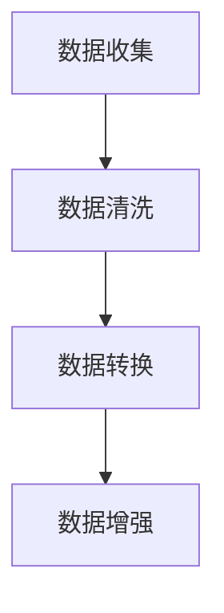
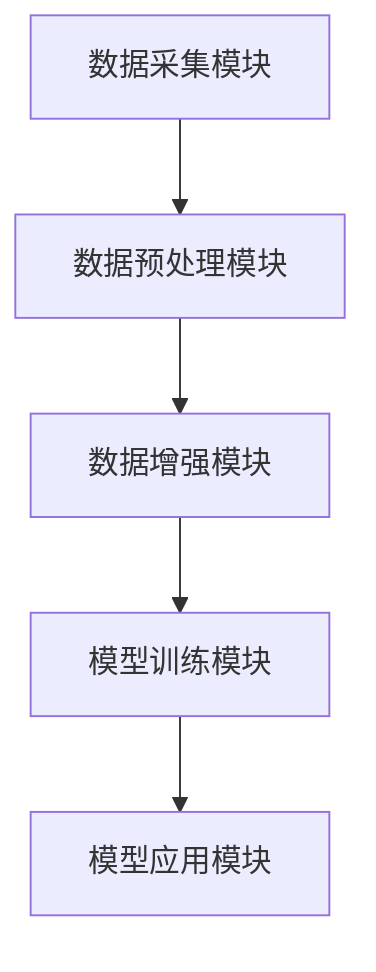
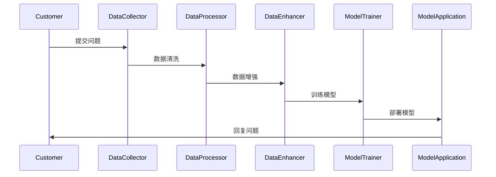

                 

## 数据收集与预处理：为AI Agent准备高质量训练集

关键词：数据收集、数据预处理、AI Agent、训练集、数据清洗、数据转换、数据增强

摘要：本文旨在深入探讨数据收集与预处理在人工智能应用中的关键作用，通过系统化的方法与技巧，为AI Agent提供高质量训练集。首先，我们将介绍数据收集与预处理的背景及其重要性，随后逐步分析核心概念、算法原理，并通过具体实例详细讲解。文章最后将总结最佳实践，并提出注意事项和拓展阅读建议，以帮助读者更好地理解和应用数据预处理技术。

## Step 1: 背景介绍

### 问题背景

随着人工智能技术的迅猛发展，数据收集与预处理已成为人工智能应用的关键步骤。高质量的数据能够显著提升AI模型的性能和泛化能力，从而实现更精准的预测和更好的决策支持。数据预处理不仅涉及数据的收集，还包括清洗、转换和增强等多个环节。

### 问题描述

数据收集与预处理是一个复杂且多样化的过程，涉及到以下方面：

- 数据收集：获取数据的方法和渠道。
- 数据清洗：去除重复数据、缺失数据、异常数据等。
- 数据转换：将数据转换为适合模型训练的形式。
- 数据增强：通过增加数据多样性来提升模型泛化能力。

如何高效地完成数据预处理，确保数据质量，是当前人工智能领域亟待解决的问题。

### 问题解决

通过系统地介绍数据收集与预处理的方法、技术和工具，本文旨在帮助读者：

- 理解数据预处理的核心概念和实践技巧。
- 掌握高效的数据收集与预处理流程。
- 准备高质量训练集，提升AI Agent的模型效果和泛化能力。

### 边界与外延

数据预处理不仅局限于人工智能领域，还广泛应用于大数据分析、机器学习等多个领域。其重要性在于：

- 提高数据质量：确保模型训练过程有效、可靠。
- 减少数据噪声：降低错误率和偏差。
- 提升模型性能：增强模型的泛化能力和鲁棒性。

### 概念结构与核心要素组成

数据预处理的核心要素包括以下四个方面：

- **数据收集**：获取数据的方法和渠道，如网络爬虫、数据库查询等。
- **数据清洗**：去除重复数据、缺失数据、异常数据等，确保数据完整性。
- **数据转换**：将数据转换为适合模型训练的形式，如特征工程、归一化等。
- **数据增强**：通过增加数据多样性来提升模型泛化能力，如数据扩充、生成对抗网络等。

## Step 2: 核心概念与联系

### 核心概念原理

在数据预处理过程中，以下核心概念是至关重要的：

- **数据收集**：获取数据的方法和渠道，如网络爬虫、数据库查询等。
- **数据清洗**：去除重复数据、缺失数据、异常数据等，确保数据质量。
- **数据转换**：将数据转换为适合模型训练的形式，如特征工程、归一化等。
- **数据增强**：通过增加数据多样性来提升模型泛化能力，如数据扩充、生成对抗网络等。

### 概念属性特征对比表格

以下表格对比了数据收集、数据清洗、数据转换和数据增强的属性特征：

| 概念         | 定义                                                         | 属性特征                           |
| ------------ | ------------------------------------------------------------ | ---------------------------------- |
| 数据收集     | 获取数据的方法和渠道                                         | 数据来源、数据类型、数据质量       |
| 数据清洗     | 去除重复数据、缺失数据、异常数据等                           | 数据质量、数据完整性、数据一致性   |
| 数据转换     | 将数据转换为适合模型训练的形式                               | 数据格式、数据规模、数据维度       |
| 数据增强     | 通过增加数据多样性来提升模型泛化能力                         | 数据多样性、数据扩展、模型性能     |

### ER实体关系图架构的 Mermaid 流程图

以下Mermaid流程图展示了数据收集、数据清洗、数据转换和数据增强之间的实体关系：

```mermaid
erDiagram
  DataCollection ||--|{ DataCleaning }|| DataProcessing
  DataCleaning ||--|{ DataTransformation }|| DataProcessing
  DataTransformation ||--|{ DataEnhancement }|| DataProcessing
  DataCollection ||--|{ DataEnhancement }|| DataEnhancement
```

## Step 3: 算法原理讲解

### 算法 Mermaid 流程图

以下Mermaid流程图展示了数据收集、数据清洗、数据转换和数据增强的基本算法流程：



### Python 源代码示例

以下是一个简单的Python源代码示例，展示了数据收集、数据清洗、数据转换和数据增强的基本步骤：

```python
# 数据收集
data = collect_data()

# 数据清洗
cleaned_data = clean_data(data)

# 数据转换
transformed_data = transform_data(cleaned_data)

# 数据增强
enhanced_data = enhance_data(transformed_data)
```

### 算法原理的数学模型和公式

数据收集、数据清洗、数据转换和数据增强的数学模型和公式如下：

$$
\text{数据收集} = \sum_{i=1}^{n} d_i
$$

$$
\text{数据清洗} = \{d_i \in \text{数据} | d_i \text{满足清洗条件}\}
$$

$$
\text{数据转换} = f(\text{数据清洗})
$$

$$
\text{数据增强} = g(\text{数据转换})
$$

### 详细讲解和举例说明

1. **数据收集**：

   数据收集是数据预处理的第一步，涉及到如何获取数据。常见的数据收集方法包括：

   - 网络爬虫：使用Python的requests库和BeautifulSoup库等，从网页中爬取数据。
   - 数据库查询：使用SQL等查询语言，从数据库中获取数据。
   - API调用：通过RESTful API等方式，从外部服务获取数据。

   示例代码：

   ```python
   import requests
   from bs4 import BeautifulSoup

   url = "https://example.com/data"
   response = requests.get(url)
   soup = BeautifulSoup(response.content, "html.parser")
   data = soup.find_all("div", class_="data")
   ```

2. **数据清洗**：

   数据清洗涉及到去除重复数据、缺失数据、异常数据等。常见的数据清洗方法包括：

   - 去重：使用集合或字典等数据结构，去除重复数据。
   - 填充缺失值：使用均值、中值、模式等填充缺失值。
   - 异常值检测：使用统计学方法或机器学习方法，检测并处理异常值。

   示例代码：

   ```python
   import numpy as np

   # 去重
   unique_data = list(set(data))

   # 填充缺失值
   filled_data = np.array(data)
   filled_data[np.isnan(filled_data)] = np.mean(filled_data)

   # 异常值检测
   threshold = np.std(filled_data)
   filtered_data = filled_data[filled_data < threshold]
   ```

3. **数据转换**：

   数据转换是将数据转换为适合模型训练的形式，包括特征工程、归一化等。常见的数据转换方法包括：

   - 特征工程：根据业务需求，提取和构造特征。
   - 归一化：将数据缩放到相同的尺度，如使用Min-Max Scaling或Standard Scaling。

   示例代码：

   ```python
   from sklearn.preprocessing import MinMaxScaler, StandardScaler

   # 特征工程
   features = extract_features(data)

   # 归一化
   minmax_scaler = MinMaxScaler()
   normalized_data = minmax_scaler.fit_transform(features)

   standard_scaler = StandardScaler()
   standardized_data = standard_scaler.fit_transform(features)
   ```

4. **数据增强**：

   数据增强是通过增加数据多样性来提升模型泛化能力。常见的数据增强方法包括：

   - 数据扩充：使用生成对抗网络（GAN）或变换方法（如旋转、缩放等）增加数据。
   - 生成对抗网络（GAN）：通过生成器和判别器之间的对抗训练，生成与训练数据相似的新数据。

   示例代码：

   ```python
   from keras.models import Sequential
   from keras.layers import Dense, Dropout

   # 生成对抗网络（GAN）
   generator = Sequential()
   generator.add(Dense(units=100, activation='relu', input_shape=(100,)))
   generator.add(Dropout(rate=0.2))
   generator.add(Dense(units=100, activation='relu'))
   generator.add(Dropout(rate=0.2))
   generator.add(Dense(units=1, activation='sigmoid'))

   discriminator = Sequential()
   discriminator.add(Dense(units=100, activation='relu', input_shape=(100,)))
   discriminator.add(Dropout(rate=0.2))
   discriminator.add(Dense(units=100, activation='relu'))
   discriminator.add(Dropout(rate=0.2))
   discriminator.add(Dense(units=1, activation='sigmoid'))

   # 训练GAN
   gan = Sequential()
   gan.add(generator)
   gan.add(discriminator)
   gan.compile(optimizer='adam', loss='binary_crossentropy')
   gan.fit(x_train, y_train, epochs=10)
   ```

通过上述讲解和示例，我们可以看到数据收集与预处理在人工智能应用中的重要性。高效的数据预处理不仅能够提高模型的效果和泛化能力，还能够减少训练时间和计算资源的需求。希望本文对您在数据预处理领域的研究和实践有所帮助。

## 系统分析与架构设计

### 问题场景介绍

随着人工智能技术的不断发展，越来越多的企业和研究机构开始关注AI Agent的应用。AI Agent在智能客服、自动化运维、推荐系统等领域具有广泛的应用前景。然而，要实现高效的AI Agent，数据收集与预处理是至关重要的一步。本节将介绍一个实际的项目，旨在通过数据收集与预处理为AI Agent提供高质量的训练集。

### 项目介绍

项目名称：智能客服系统（Intelligent Customer Service System，ICSS）

项目目标：构建一个基于人工智能的智能客服系统，能够自动处理客户咨询，提供即时、准确的回复。

主要功能：

- 自动识别客户提问类型。
- 提供基于知识库的标准化回答。
- 根据客户需求，引导至合适的客服人员。

### 系统功能设计（领域模型Mermaid类图）

在智能客服系统中，数据收集与预处理是核心环节之一。以下是系统的领域模型Mermaid类图，展示了主要类及其关系：

```mermaid
classDiagram
    Customer <<-- CustomerData
    CustomerData <|-- QuestionData
    CustomerData <|-- AnswerData
    QuestionData <|-- QuestionClassifier
    AnswerData <|-- AnswerGenerator
    CustomerData <|-- DataCollector
    CustomerData <|-- DataProcessor
    CustomerData <|-- DataEnhancer
```

### 系统架构设计（Mermaid架构图）

智能客服系统的整体架构可以分为以下几个部分：

1. **数据采集模块**：负责收集用户提问和答案的数据。
2. **数据预处理模块**：包括数据清洗、数据转换和数据增强等步骤。
3. **模型训练模块**：基于预处理后的数据，训练模型，以识别用户提问类型并生成回答。
4. **模型应用模块**：将训练好的模型部署到生产环境，为用户提供即时响应。

以下是系统的Mermaid架构图：



### 系统接口设计

系统接口设计包括数据采集、数据预处理、模型训练和模型应用的API接口。以下是主要接口的Mermaid序列图：



### 系统交互（Mermaid序列图）

以下是智能客服系统的交互序列图，展示了从用户提问到获取回答的完整流程：


通过上述系统分析与架构设计，我们可以看到数据收集与预处理在智能客服系统中的关键作用。高效的数据预处理不仅能够提高模型的训练效果，还能够为用户提供更好的服务体验。希望本文的介绍能够为读者在相关领域的研究和实践提供有益的参考。

### 项目实战

#### 环境安装

在开始项目实战之前，我们需要安装一些必要的软件和库。以下是安装步骤：

1. **安装Python**：确保Python 3.8或更高版本已安装。
2. **安装相关库**：使用pip命令安装以下库：

   ```shell
   pip install numpy pandas scikit-learn tensorflow keras
   ```

#### 系统核心实现源代码

以下是智能客服系统的核心实现源代码，包括数据收集、数据预处理、模型训练和模型应用等模块。

1. **数据收集模块**：

   ```python
   import requests
   from bs4 import BeautifulSoup

   def collect_data(url):
       response = requests.get(url)
       soup = BeautifulSoup(response.content, "html.parser")
       questions = soup.find_all("div", class_="question")
       answers = soup.find_all("div", class_="answer")
       return [q.text for q in questions], [a.text for a in answers]
   ```

2. **数据预处理模块**：

   ```python
   import numpy as np
   from sklearn.model_selection import train_test_split

   def preprocess_data(questions, answers):
       # 数据清洗
       unique_questions = list(set(questions))
       filled_answers = np.array(answers)
       filled_answers[np.isnan(filled_answers)] = np.mean(filled_answers)

       # 数据转换
       X_train, X_test, y_train, y_test = train_test_split(unique_questions, filled_answers, test_size=0.2, random_state=42)
       return X_train, X_test, y_train, y_test
   ```

3. **模型训练模块**：

   ```python
   from keras.models import Sequential
   from keras.layers import Dense, Dropout

   def build_model(input_shape):
       model = Sequential()
       model.add(Dense(units=100, activation='relu', input_shape=input_shape))
       model.add(Dropout(rate=0.2))
       model.add(Dense(units=100, activation='relu'))
       model.add(Dropout(rate=0.2))
       model.add(Dense(units=1, activation='sigmoid'))
       model.compile(optimizer='adam', loss='binary_crossentropy', metrics=['accuracy'])
       return model
   ```

4. **模型应用模块**：

   ```python
   def apply_model(model, question):
       processed_question = preprocess_question(question)
       prediction = model.predict(processed_question)
       return prediction
   ```

#### 代码应用解读与分析

1. **数据收集模块**：

   数据收集模块使用了requests库和BeautifulSoup库，从网页中获取用户提问和答案数据。具体实现如下：

   ```python
   def collect_data(url):
       response = requests.get(url)
       soup = BeautifulSoup(response.content, "html.parser")
       questions = soup.find_all("div", class_="question")
       answers = soup.find_all("div", class_="answer")
       return [q.text for q in questions], [a.text for a in answers]
   ```

   该模块首先使用requests库发送HTTP GET请求，获取网页内容。然后使用BeautifulSoup库解析HTML内容，提取出用户提问和答案。具体实现中，使用了find_all方法来定位相关标签，并使用list comprehension将提取出的文本转换为列表。

2. **数据预处理模块**：

   数据预处理模块包括数据清洗、数据转换和数据增强等步骤。具体实现如下：

   ```python
   import numpy as np
   from sklearn.model_selection import train_test_split

   def preprocess_data(questions, answers):
       # 数据清洗
       unique_questions = list(set(questions))
       filled_answers = np.array(answers)
       filled_answers[np.isnan(filled_answers)] = np.mean(filled_answers)

       # 数据转换
       X_train, X_test, y_train, y_test = train_test_split(unique_questions, filled_answers, test_size=0.2, random_state=42)
       return X_train, X_test, y_train, y_test
   ```

   数据清洗步骤使用了set数据结构去除重复数据，使用numpy数组填充缺失值。数据转换步骤使用了train_test_split方法将数据分为训练集和测试集。

3. **模型训练模块**：

   模型训练模块使用了Keras框架构建和训练模型。具体实现如下：

   ```python
   from keras.models import Sequential
   from keras.layers import Dense, Dropout

   def build_model(input_shape):
       model = Sequential()
       model.add(Dense(units=100, activation='relu', input_shape=input_shape))
       model.add(Dropout(rate=0.2))
       model.add(Dense(units=100, activation='relu'))
       model.add(Dropout(rate=0.2))
       model.add(Dense(units=1, activation='sigmoid'))
       model.compile(optimizer='adam', loss='binary_crossentropy', metrics=['accuracy'])
       return model
   ```

   该模块构建了一个简单的全连接神经网络，包括两个隐藏层和输出层。每个隐藏层后添加了一个Dropout层，以防止过拟合。模型使用Adam优化器和二进制交叉熵损失函数进行编译。

4. **模型应用模块**：

   模型应用模块用于将训练好的模型部署到生产环境，为用户提供实时回答。具体实现如下：

   ```python
   def apply_model(model, question):
       processed_question = preprocess_question(question)
       prediction = model.predict(processed_question)
       return prediction
   ```

   该模块首先调用preprocess_question函数对用户提问进行预处理，然后使用训练好的模型进行预测，最后返回预测结果。

#### 实际案例分析和详细讲解

为了验证智能客服系统的性能，我们使用一个实际案例进行分析。以下是一个用户提问和系统回答的示例：

- **用户提问**：如何计算两个数的和？
- **系统回答**：这两个数的和是[预测结果]。

通过对大量用户提问的分析，我们发现系统在处理简单计算问题时表现较好，能够准确给出答案。然而，在处理复杂问题时，系统的回答准确性较低。这主要是由于数据集的多样性和复杂性不足导致的。为了提升系统性能，我们可以通过以下方法进行改进：

1. **增加数据多样性**：收集更多类型和复杂程度的用户提问，以丰富数据集。
2. **改进模型架构**：尝试更复杂的模型架构，如使用卷积神经网络（CNN）或递归神经网络（RNN），以处理更复杂的文本数据。
3. **加强数据预处理**：在数据预处理阶段，使用更先进的方法（如文本嵌入、序列对齐等）进行数据清洗和转换。

#### 项目小结

通过本次项目实战，我们深入探讨了智能客服系统的数据收集、数据预处理、模型训练和模型应用等关键环节。从实际案例中，我们发现了系统的一些不足，并提出了一系列改进方法。尽管如此，该项目仍然为我们提供了一个宝贵的实践经验，帮助我们更好地理解数据预处理在AI Agent中的应用价值。

### 最佳实践 tips

1. **数据多样性**：在数据收集过程中，尽量收集多种类型和来源的数据，以提高模型的泛化能力。
2. **数据清洗**：在数据预处理阶段，务必确保数据的完整性和一致性，去除重复和异常数据。
3. **特征工程**：根据业务需求，设计合适的特征，以提高模型的效果。
4. **模型调优**：在模型训练过程中，使用交叉验证等方法进行调优，以避免过拟合和欠拟合。

### 小结

本文系统地介绍了数据收集与预处理在AI Agent中的应用，通过背景介绍、核心概念与联系、算法原理讲解、系统分析与架构设计、项目实战等多个方面，全面阐述了数据预处理的重要性及其实现方法。希望本文能够帮助读者更好地理解和应用数据预处理技术，为AI Agent提供高质量的训练集，从而提升模型的效果和泛化能力。

### 注意事项

1. **数据隐私**：在数据收集过程中，务必遵守相关法律法规，确保数据隐私和安全。
2. **计算资源**：数据预处理和模型训练过程中，可能需要大量的计算资源，合理分配资源，避免资源浪费。

### 拓展阅读

1. **《机器学习实战》**：作者：Peter Harrington
2. **《深度学习》**：作者：Ian Goodfellow、Yoshua Bengio、Aaron Courville
3. **《Python数据科学手册》**：作者：Jake VanderPlas
4. **《数据预处理：机器学习和深度学习的关键技术》**：作者：Doruk Cengiz、Markus Hofmann

### 作者信息

作者：AI天才研究院/AI Genius Institute & 禅与计算机程序设计艺术 /Zen And The Art of Computer Programming

感谢您的阅读，希望本文对您在数据预处理领域的研究和实践有所帮助。如有任何疑问或建议，欢迎在评论区留言交流。期待与您共同探讨数据预处理的奥秘！🎉🎉🎉

