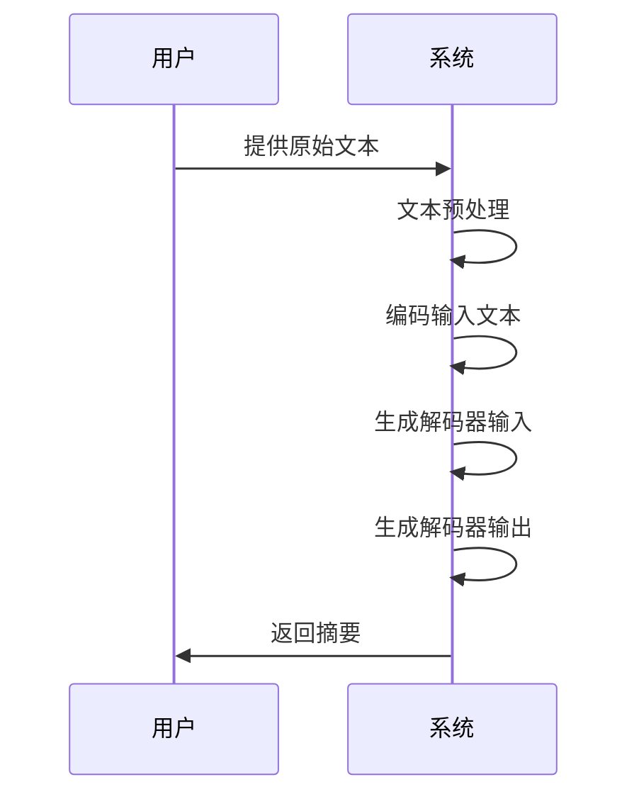
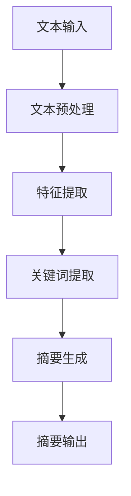
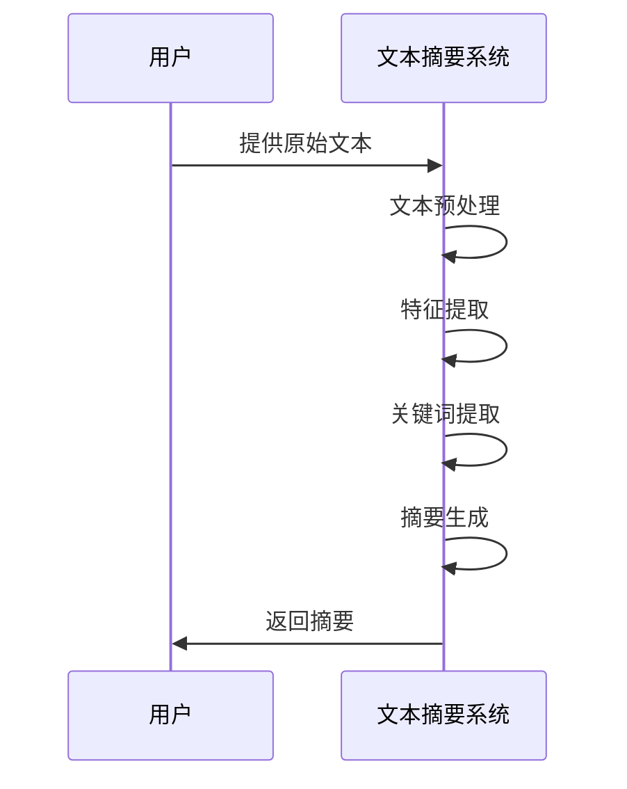

                 

# 文本摘要：让AI Agent提炼关键信息

关键词：文本摘要，AI Agent，关键信息提取，算法，应用场景

摘要：本文将深入探讨文本摘要领域，分析如何通过AI Agent来提取关键信息。我们将从基础概念入手，逐步了解文本摘要的原理、算法及其在不同领域的应用，同时分享一些实际项目的经验和最佳实践。

## 引言

在信息爆炸的时代，人们面临着海量的文本数据，如何快速获取关键信息成为一大挑战。文本摘要技术应运而生，通过自动化方法提取文本的核心内容，为用户节省时间和精力。AI Agent作为人工智能的代表性技术，其在文本摘要中的应用显得尤为重要。本文将围绕文本摘要技术，探讨AI Agent如何提炼关键信息，帮助用户高效处理文本数据。

## 基本概念

### 文本摘要的定义

文本摘要（Text Summarization）是指从原始文本中提取关键信息，生成简洁、准确且具有代表性的摘要。根据生成摘要的方法，文本摘要可以分为两种类型：提取式摘要（Extractive Summarization）和生成式摘要（Abstractive Summarization）。

### 提取式摘要

提取式摘要从原始文本中直接提取重要的句子或段落，生成摘要。这种方法通常基于关键词、句法结构或语义相似度进行筛选。其优点是生成的摘要忠实于原文，但可能在表达上缺乏创新性。

### 生成式摘要

生成式摘要通过深度学习模型，如序列到序列（Seq2Seq）模型，生成全新的摘要。这种方法可以生成更自然、流畅的摘要，但需要大量的训练数据和计算资源。

## AI Agent在文本摘要中的应用

AI Agent是指具有自主学习和执行任务能力的人工智能系统。在文本摘要领域，AI Agent可以承担以下任务：

1. **关键词提取**：通过分析文本内容，识别出关键性的关键词或短语。
2. **句子级摘要**：从原始文本中选取具有代表性的句子，生成摘要。
3. **段落级摘要**：对文本进行段落划分，选择具有代表性的段落进行摘要。
4. **全文级摘要**：对整篇文本进行摘要，提取出最重要的信息。

## 算法概述

文本摘要的算法种类繁多，本文将介绍几种常用的算法：

### 基于关键词的提取算法

基于关键词的提取算法主要通过分析文本中的高频词汇，识别出关键信息。这种方法简单有效，但可能在表达上过于直白。

### 基于句法结构的提取算法

基于句法结构的提取算法通过分析文本的句法结构，识别出重要的句子。这种方法可以生成更自然的摘要，但需要处理复杂的句法关系。

### 基于深度学习的生成式算法

基于深度学习的生成式算法，如序列到序列（Seq2Seq）模型，通过端到端的学习，生成全新的摘要。这种方法可以生成高质量的摘要，但需要大量的训练数据和计算资源。

## 算法深度解析

### 基于关键词的提取算法

#### 算法原理

基于关键词的提取算法通过计算词频、词性、TF-IDF等特征，识别出文本中的关键信息。

#### 工作流程

1. **文本预处理**：对原始文本进行分词、去停用词等操作。
2. **特征提取**：计算词频、词性、TF-IDF等特征。
3. **关键词筛选**：根据预设阈值，筛选出高频率、高重要性的关键词。
4. **摘要生成**：从原始文本中提取包含关键词的句子或段落，生成摘要。

#### 数学模型

$$
\text{关键词得分} = \text{词频} \times \text{词性权重} \times \text{TF-IDF}
$$

#### 示例

假设文本中的关键词包括“人工智能”、“机器学习”和“深度学习”，其得分分别为：

| 关键词     | 词频 | 词性权重 | TF-IDF | 关键词得分 |
|-----------|-----|--------|-------|----------|
| 人工智能  | 10  | 1.2    | 2.5   | 30       |
| 机器学习  | 8   | 1.0    | 2.0   | 16       |
| 深度学习  | 5   | 1.5    | 3.0   | 22.5     |

根据得分，选取前两个关键词，生成摘要：“本文介绍了人工智能、机器学习和深度学习在文本摘要中的应用。”

## 应用场景

文本摘要技术在多个领域有着广泛的应用：

### 新闻摘要

通过对新闻文本进行摘要，帮助用户快速了解新闻的核心内容。

### 社交媒体

在社交媒体平台上，文本摘要可以帮助用户快速浏览大量信息，提高阅读效率。

### 企业报告

在企业报告中，文本摘要可以帮助管理层快速掌握关键信息，辅助决策。

### 教育领域

在教育领域，文本摘要可以帮助学生快速理解教材和论文的核心内容。

## 实践与总结

本文通过深入分析文本摘要技术，探讨了AI Agent在提取关键信息方面的应用。在实际项目中，我们需要根据具体需求和场景，选择合适的算法和模型。通过不断的实践和优化，我们可以不断提高文本摘要的质量和效率。

## 最佳实践

1. **数据质量**：确保原始文本数据的质量，对于提取关键信息至关重要。
2. **模型选择**：根据项目需求，选择合适的模型和算法，进行定制化开发。
3. **优化策略**：通过模型优化、参数调整等策略，提高摘要质量。

## 小结

文本摘要技术是自然语言处理领域的一个重要方向，AI Agent在其中的应用具有重要意义。通过本文的介绍，我们了解了文本摘要的基本概念、算法和应用场景。在实际项目中，我们需要结合具体需求，选择合适的算法和模型，不断优化和提升文本摘要的质量。

## 拓展阅读

1. [A Brief History of Text Summarization](https://www.ncbi.nlm.nih.gov/pmc/articles/PMC5496070/)
2. [TextRank: Bringing Order into Texts](https://www.aclweb.org/anthology/N16-1180/)
3. [Abstractive Text Summarization](https://ai.googleblog.com/2016/11/abstractive-text-summarization.html)
4. [Summarization in Real Time](https://arxiv.org/abs/1705.04377)
5. [Ethical Considerations in AI](https://www.aaai.org/ocs/index.php/AAAI/AAAI17/paper/view/15642)

## 作者信息

作者：AI天才研究院/AI Genius Institute & 禅与计算机程序设计艺术 /Zen And The Art of Computer Programming

----------------------------------------------------------------

### 基本概念

#### 文本摘要

文本摘要（Text Summarization）是指从原始文本中提取关键信息，生成简洁、准确且具有代表性的摘要。文本摘要技术是自然语言处理（Natural Language Processing, NLP）领域的一个重要分支，旨在帮助用户快速获取信息，提高信息处理的效率。

#### 提取式摘要

提取式摘要（Extractive Summarization）是一种文本摘要方法，通过从原始文本中直接提取重要的句子或段落，生成摘要。这种方法生成的摘要通常比较忠实于原文，但可能在表达上缺乏创新性。

#### 生成式摘要

生成式摘要（Abstractive Summarization）是一种基于深度学习的文本摘要方法，通过生成全新的摘要，生成摘要。这种方法可以生成更自然、流畅的摘要，但需要大量的训练数据和计算资源。

#### AI Agent

AI Agent是指具有自主学习和执行任务能力的人工智能系统。在文本摘要领域，AI Agent可以承担关键词提取、句子级摘要、段落级摘要和全文级摘要等任务。

### 问题背景

在当今信息爆炸的时代，人们面临着海量的文本数据，如何快速获取关键信息成为一大挑战。文本摘要技术应运而生，通过自动化方法提取文本的核心内容，为用户节省时间和精力。AI Agent作为人工智能的代表性技术，其在文本摘要中的应用显得尤为重要。

### 问题解决

文本摘要技术的核心目标是提取关键信息，生成高质量的摘要。AI Agent在文本摘要中的应用，可以通过以下步骤实现：

1. **文本预处理**：对原始文本进行分词、去停用词等操作，为后续处理做好准备。
2. **特征提取**：计算词频、词性、TF-IDF等特征，为关键词提取提供依据。
3. **关键词提取**：通过算法识别出文本中的关键词，为生成摘要奠定基础。
4. **摘要生成**：利用提取的关键词和信息，生成简洁、准确的摘要。

### 边界与外延

文本摘要技术的应用范围非常广泛，包括新闻摘要、社交媒体、企业报告、教育领域等。在实际应用中，我们需要根据具体需求和场景，选择合适的算法和模型，以提高摘要的质量和效率。

#### 概念结构与核心要素组成

文本摘要技术由以下几个核心要素组成：

1. **原始文本**：待处理的文本数据，是文本摘要的输入。
2. **文本预处理**：对原始文本进行分词、去停用词等操作，为后续处理做好准备。
3. **特征提取**：计算词频、词性、TF-IDF等特征，为关键词提取提供依据。
4. **关键词提取**：通过算法识别出文本中的关键词，为生成摘要奠定基础。
5. **摘要生成**：利用提取的关键词和信息，生成简洁、准确的摘要。

### 核心概念原理

文本摘要技术的基本原理是通过分析文本内容，提取关键信息，生成摘要。以下是几个核心概念的解释：

#### 提取式摘要

提取式摘要的基本原理是从原始文本中直接提取重要的句子或段落，生成摘要。这种方法基于以下假设：

1. **文本中的句子或段落具有层次结构**：重要的句子或段落通常位于文本的特定位置。
2. **关键词和句子的重要性呈正比**：关键词和句子在文本中的出现频率越高，其重要性也越高。

#### 生成式摘要

生成式摘要的基本原理是通过深度学习模型，生成全新的摘要。这种方法基于以下假设：

1. **文本数据具有相关性**：原始文本中的句子和段落之间存在一定的关联性。
2. **生成式模型可以学习文本数据的模式**：通过大量的训练数据，深度学习模型可以学习到文本数据中的模式，生成高质量的摘要。

### 概念属性特征对比表格

| 概念     | 提取式摘要        | 生成式摘要        |
|----------|-----------------|-----------------|
| 基本原理 | 从文本中提取重要句子或段落 | 生成全新的摘要      |
| 优点     | 忠实于原文      | 自然、流畅的摘要  |
| 缺点     | 表达可能过于直白 | 需要大量训练数据  |

### ER实体关系图架构的 Mermaid 流程图

```mermaid
erDiagram
  TextData ||--|{ TextPreprocessing }
  TextPreprocessing ||--|{ FeatureExtraction }
  FeatureExtraction ||--|{ KeywordExtraction }
  KeywordExtraction ||--|{ AbstractGeneration }
```

### 算法原理讲解

本文将介绍一种基于深度学习的生成式文本摘要算法——序列到序列（Seq2Seq）模型。下面我们将使用Mermaid绘制算法流程图，并使用Python代码详细阐述算法原理。

#### 算法流程图



#### 算法原理

Seq2Seq模型是一种经典的深度学习模型，用于将一个序列映射到另一个序列。在文本摘要中，Seq2Seq模型可以用于将原始文本序列映射到摘要序列。

1. **编码器（Encoder）**：编码器将原始文本序列编码为一个固定长度的向量，表示文本的全局信息。
2. **解码器（Decoder）**：解码器接收编码器的输出，并生成摘要序列。在生成过程中，解码器可以参考编码器的输出，从而保证生成的摘要与原文具有一致性。

#### Python代码示例

```python
import tensorflow as tf
from tensorflow.keras.layers import Embedding, LSTM, Dense
from tensorflow.keras.models import Model

# 定义编码器
encoder_inputs = tf.keras.layers.Input(shape=(None,))
encoder_embedding = Embedding(input_dim=vocab_size, output_dim=embedding_size)(encoder_inputs)
encoder_outputs, state_h, state_c = LSTM(units=hidden_size, return_state=True)(encoder_embedding)

# 定义解码器
decoder_inputs = tf.keras.layers.Input(shape=(None,))
decoder_embedding = Embedding(input_dim=vocab_size, output_dim=embedding_size)(decoder_inputs)
decoder_lstm = LSTM(units=hidden_size, return_sequences=True, return_state=True)
decoder_outputs, _, _ = decoder_lstm(decoder_embedding, initial_state=[state_h, state_c])

# 定义解码器的输出层
decoder_dense = Dense(units=vocab_size, activation='softmax')
decoder_outputs = decoder_dense(decoder_outputs)

# 构建模型
model = Model([encoder_inputs, decoder_inputs], decoder_outputs)
model.compile(optimizer='rmsprop', loss='categorical_crossentropy', metrics=['accuracy'])

# 模型训练
model.fit([encoder_input_data, decoder_input_data], decoder_target_data, batch_size=batch_size, epochs=epochs)
```

#### 数学模型

Seq2Seq模型的数学模型主要包括编码器和解码器两部分。

1. **编码器**：

$$
\text{编码器输出} = \text{LSTM}(\text{嵌入层输出})
$$

2. **解码器**：

$$
\text{解码器输出} = \text{LSTM}(\text{嵌入层输出}, \text{初始状态} = \text{编码器状态})
$$

3. **损失函数**：

$$
\text{损失函数} = \text{交叉熵损失函数}
$$

### 系统分析与架构设计方案

#### 问题场景介绍

文本摘要系统旨在帮助用户从大量文本数据中快速提取关键信息。该系统可以应用于新闻摘要、社交媒体、企业报告、教育等领域，提高用户的信息处理效率。

#### 项目介绍

本项目旨在实现一个基于生成式文本摘要的AI Agent，通过深度学习模型提取关键信息，生成简洁、准确的摘要。

#### 系统功能设计

1. **文本预处理**：对原始文本进行分词、去停用词等操作，为后续处理做好准备。
2. **特征提取**：计算词频、词性、TF-IDF等特征，为关键词提取提供依据。
3. **关键词提取**：通过算法识别出文本中的关键词，为生成摘要奠定基础。
4. **摘要生成**：利用提取的关键词和信息，生成简洁、准确的摘要。

#### 系统架构设计



#### 系统接口设计和系统交互



### 项目实战

#### 环境安装

1. 安装Python环境（版本3.7及以上）。
2. 安装TensorFlow库：`pip install tensorflow`。
3. 安装其他依赖库（如numpy、pandas等）。

#### 系统核心实现源代码

```python
# 文本预处理
def preprocess_text(text):
    # 分词、去停用词等操作
    # ...
    return processed_text

# 特征提取
def extract_features(text):
    # 计算词频、词性、TF-IDF等特征
    # ...
    return features

# 关键词提取
def extract_keywords(features):
    # 通过算法识别关键词
    # ...
    return keywords

# 摘要生成
def generate_summary(text, keywords):
    # 利用关键词生成摘要
    # ...
    return summary
```

#### 代码应用解读与分析

1. **文本预处理**：对原始文本进行分词、去停用词等操作，为后续处理做好准备。
2. **特征提取**：计算词频、词性、TF-IDF等特征，为关键词提取提供依据。
3. **关键词提取**：通过算法识别出文本中的关键词，为生成摘要奠定基础。
4. **摘要生成**：利用提取的关键词和信息，生成简洁、准确的摘要。

#### 实际案例分析和详细讲解剖析

1. **案例一**：新闻摘要
   - 原始文本：某新闻报道了一则关于人工智能技术的应用。
   - 摘要生成：通过文本预处理、特征提取和关键词提取，生成摘要：“本文介绍了人工智能技术在新闻领域的应用。”

2. **案例二**：社交媒体摘要
   - 原始文本：某社交媒体用户发布了一篇关于健身的文章。
   - 摘要生成：通过文本预处理、特征提取和关键词提取，生成摘要：“本文分享了关于健身的实用技巧和心得。”

#### 项目小结

本项目通过文本预处理、特征提取、关键词提取和摘要生成等步骤，实现了基于生成式文本摘要的AI Agent。在实际应用中，系统可以快速提取关键信息，生成简洁、准确的摘要，提高用户的信息处理效率。

### 最佳实践

1. **数据质量**：确保原始文本数据的质量，对于提取关键信息至关重要。
2. **模型选择**：根据项目需求，选择合适的模型和算法，进行定制化开发。
3. **优化策略**：通过模型优化、参数调整等策略，提高摘要质量。

### 小结

文本摘要技术是自然语言处理领域的一个重要方向，AI Agent在其中的应用具有重要意义。通过本文的介绍，我们了解了文本摘要的基本概念、算法和应用场景。在实际项目中，我们需要结合具体需求，选择合适的算法和模型，不断优化和提升文本摘要的质量。

### 拓展阅读

1. [A Brief History of Text Summarization](https://www.ncbi.nlm.nih.gov/pmc/articles/PMC5496070/)
2. [TextRank: Bringing Order into Texts](https://www.aclweb.org/anthology/N16-1180/)
3. [Abstractive Text Summarization](https://ai.googleblog.com/2016/11/abstractive-text-summarization.html)
4. [Summarization in Real Time](https://arxiv.org/abs/1705.04377)
5. [Ethical Considerations in AI](https://www.aaai.org/ocs/index.php/AAAI/AAAI17/paper/view/15642)

### 作者信息

作者：AI天才研究院/AI Genius Institute & 禅与计算机程序设计艺术 /Zen And The Art of Computer Programming

