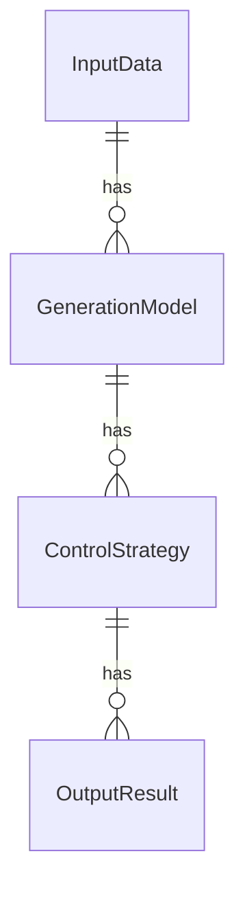

                 

# 文本生成控制：调节AI Agent的输出风格和长度

## 关键词
- 文本生成控制
- AI Agent
- 输出风格
- 长度调节
- 机器学习
- 深度学习
- 算法原理

## 摘要
本文将深入探讨文本生成控制技术，特别是调节AI Agent输出风格和长度的方法。首先，我们将介绍文本生成控制的基本概念，并解释为什么调节AI Agent的输出风格和长度在自然语言处理领域具有重要性。随后，我们将分章节详细阐述不同类型的文本生成控制方法，包括基于规则的方法、基于机器学习的方法和基于深度学习的方法。此外，还将介绍实现这些方法的具体步骤和技巧，并通过实际案例研究展示这些方法的实际应用。最后，我们将总结最佳实践，提出未来发展的方向。

## 引言：文本生成控制与AI Agent输出调控的需求

### 文本生成控制的基本概念

文本生成控制（Text Generation Control）是指通过特定的技术手段，对生成文本的内容、风格和长度进行有效管理的过程。它旨在确保生成的文本符合特定需求，如信息完整性、语言流畅性、风格一致性和长度限制等。

在自然语言处理（Natural Language Processing, NLP）领域，文本生成控制具有至关重要的意义。一方面，随着AI技术的发展，文本生成模型（如自动问答系统、聊天机器人、新闻摘要生成等）在各个行业中得到了广泛应用。另一方面，用户对生成文本的质量和个性化的需求不断提高，这使得文本生成控制成为必要。

### AI Agent输出风格与长度的调控需求

AI Agent，即人工智能代理，是一种能够自主执行任务并与人交互的智能系统。在实际应用中，AI Agent的输出风格和长度对用户体验有着直接影响。具体需求如下：

1. **输出风格**：不同类型的AI Agent需要具有不同的输出风格，以满足不同应用场景的需求。例如，一个用于客户服务的聊天机器人应具有友好、亲切的风格，而一个用于撰写技术文档的系统则应保持正式、专业的风格。

2. **输出长度**：合适的输出长度能够确保信息的传递既完整又不过载。过长的输出可能导致用户疲劳，而过短的输出则可能无法满足用户对信息的期望。因此，调节输出长度对于提高用户体验至关重要。

### 调节AI Agent输出风格和长度的挑战

虽然文本生成控制具有重要意义，但在实际操作中，调节AI Agent的输出风格和长度面临诸多挑战：

1. **多样性**：不同的应用场景和用户需求可能导致对输出风格和长度的多样化要求，这使得文本生成控制策略需要具备较强的适应性。

2. **一致性**：在大量生成文本中保持风格和长度的一致性是一项挑战。不同的生成模型或训练数据可能导致风格和长度的偏差。

3. **可解释性**：对于非专业人士来说，理解和解释AI Agent的输出风格和长度调节机制是一项挑战。这要求生成控制技术不仅要高效，还要易于理解。

4. **计算资源**：调节AI Agent的输出风格和长度通常需要大量的计算资源，特别是在处理大规模数据集时。如何在保证效果的同时降低计算成本是一个重要问题。

### 本文结构安排与目标读者

本文旨在系统地探讨文本生成控制技术，特别是调节AI Agent输出风格和长度的方法。文章结构如下：

1. **引言**：介绍文本生成控制的基本概念和AI Agent输出调控的需求。

2. **核心概念与原理**：详细阐述文本生成控制和AI Agent的基础知识。

3. **技术与方法**：分类介绍基于规则、机器学习和深度学习的文本生成控制方法。

4. **实现与优化**：讲解实现这些方法的步骤和技巧，并提供最佳实践。

5. **案例研究**：通过实际案例展示文本生成控制方法的应用。

6. **最佳实践与未来趋势**：总结最佳实践，提出未来发展的方向。

本文的目标读者包括自然语言处理领域的科研人员、工程师和开发者，以及对AI Agent应用感兴趣的技术爱好者。通过本文，读者将能够全面了解文本生成控制技术，掌握调节AI Agent输出风格和长度的方法。

## 核心概念与原理

### 文本生成控制的基础

文本生成控制涉及多个核心概念，包括自然语言生成、机器学习和深度学习等。首先，自然语言生成（Natural Language Generation, NLG）是计算机通过算法自动生成自然语言文本的过程。它通常包括文本摘要、机器翻译、对话生成等应用。

自然语言生成的关键技术包括模板匹配、规则推理和统计学习。模板匹配是最简单的NLG技术，通过预定义的模板来生成文本。规则推理则利用预定义的规则来生成文本，这些规则通常基于语言学知识。统计学习（如机器学习和深度学习）则通过从大规模数据集中学习规律，自动生成文本。

### AI Agent的基础

AI Agent是一种能够自主执行任务并与人交互的智能系统。它通常基于机器学习和深度学习技术，通过预训练模型和在线学习来不断优化其行为和交互方式。

AI Agent的核心组件包括感知器、决策器和行动器。感知器负责接收外部信息，如用户输入、环境状态等；决策器根据感知到的信息，结合预定义的策略，做出决策；行动器则执行决策，如生成文本、执行操作等。

### 文本生成控制的挑战

文本生成控制面临多个挑战，包括多样性、一致性和可解释性。多样性要求生成控制技术能够适应不同应用场景和用户需求，生成具有多样化风格的文本。一致性则要求在大量生成文本中保持风格和长度的稳定。可解释性则要求AI Agent的输出风格和长度调节机制容易被理解和解释。

### 概念结构与核心要素组成

为了更好地理解文本生成控制，我们可以将其分解为以下几个核心要素：

1. **输入数据**：包括用户输入、环境状态等，是生成控制的基础。
2. **生成模型**：如循环神经网络（RNN）、变换器（Transformer）等，用于生成文本。
3. **控制策略**：包括规则、机器学习和深度学习等，用于调节生成文本的风格和长度。
4. **输出结果**：生成的文本，包括内容、风格和长度等。

这些要素之间的关系可以用以下ER实体关系图（Entity-Relationship Diagram, ERD）表示：

通过这个ERD，我们可以清晰地看到输入数据如何驱动生成模型，生成模型如何应用控制策略来生成输出结果。

### 文本生成控制的关键概念与联系

#### 文本生成模型

文本生成模型是文本生成控制的核心组件。常见的文本生成模型包括：

- **循环神经网络（RNN）**：基于时间序列数据的模型，能够捕捉文本序列中的长距离依赖关系。
- **变换器（Transformer）**：基于自注意力机制的模型，能够并行处理整个输入序列，具有更好的生成效果。
- **生成对抗网络（GAN）**：通过生成器和判别器的对抗训练，生成与真实文本相似的文本。

这些模型在文本生成控制中扮演关键角色，不同的模型具有不同的生成能力和风格。

#### 控制策略

控制策略用于调节生成文本的风格和长度。常见的控制策略包括：

- **基于规则的策略**：通过预定义的规则来控制生成文本的风格和长度。
- **基于机器学习的策略**：通过训练模型来学习如何调节生成文本的风格和长度。
- **基于深度学习的策略**：使用深度学习模型（如循环神经网络、变换器等）来调节生成文本的风格和长度。

这些策略在文本生成控制中至关重要，不同的策略适用于不同的应用场景。

#### 输出结果

输出结果是文本生成控制的目标。输出结果的质量直接影响用户体验。因此，调节输出结果的风格和长度是文本生成控制的关键。

#### 文本生成控制的概念结构与核心要素

文本生成控制的概念结构包括以下几个核心要素：

- **输入数据**：包括用户输入、环境状态等。
- **生成模型**：如RNN、Transformer等。
- **控制策略**：如基于规则的策略、基于机器学习的策略等。
- **输出结果**：包括内容、风格和长度等。

这些要素相互关联，共同构成了文本生成控制的核心体系。

### 结论

文本生成控制是自然语言处理领域的一个重要研究方向，它涉及到文本生成模型、控制策略和输出结果等多个核心概念。通过理解这些概念，我们可以更好地掌握文本生成控制的技术和方法，为实际应用提供有力支持。

## 技术与方法

### 文本生成控制方法综述

文本生成控制的目的是通过技术手段调节生成文本的内容、风格和长度，以满足特定需求。目前，文本生成控制主要分为基于规则的方法、基于机器学习的方法和基于深度学习的方法。每种方法都有其独特的原理、优点和适用场景。

#### 基于规则的方法

基于规则的方法是通过预定义的规则来控制生成文本的风格和长度。这些规则通常基于语言学知识和预定义的模板，可以确保生成文本的一致性和可控性。

**原理**：
- **模板匹配**：通过预定义的模板来生成文本，例如，将特定格式的数据填充到模板中。
- **规则推理**：利用预定义的规则，根据输入数据和上下文来生成文本，这些规则通常基于语言学知识和领域知识。

**优点**：
- **可控性高**：通过预定义的规则，可以精确控制生成文本的风格和长度。
- **实现简单**：规则可以直接编码，实现过程相对简单。

**缺点**：
- **灵活性差**：基于规则的生成方法在处理复杂、多样化的文本时，可能无法适应。
- **依赖规则库**：生成文本的质量依赖于规则库的规模和完整性。

**适用场景**：
- **结构化文本生成**：如生成技术文档、法律文件等。
- **特定风格文本生成**：如生成新闻简报、公告等。

#### 基于机器学习的方法

基于机器学习的方法是通过训练模型来学习如何生成文本，并利用训练得到的模型来控制生成文本的风格和长度。

**原理**：
- **监督学习**：通过标注数据来训练模型，使模型能够根据输入数据生成相应的文本。
- **无监督学习**：通过无标注数据来训练模型，模型能够自主学习生成文本的规律。

**优点**：
- **灵活性高**：机器学习模型能够从大量数据中学习，适应复杂和多样化的文本生成需求。
- **泛化能力强**：经过训练的模型能够在未见过的数据上生成高质量的文本。

**缺点**：
- **数据依赖性强**：生成文本的质量依赖于训练数据的质量和数量。
- **计算成本高**：训练模型通常需要大量的计算资源和时间。

**适用场景**：
- **大规模文本生成**：如生成新闻文章、社交媒体内容等。
- **个性化文本生成**：如根据用户喜好生成个性化推荐内容。

#### 基于深度学习的方法

基于深度学习的方法是基于深度神经网络来生成文本，具有较强的生成能力和灵活性。

**原理**：
- **循环神经网络（RNN）**：通过递归结构来处理序列数据，能够捕捉长距离依赖关系。
- **变换器（Transformer）**：基于自注意力机制，能够并行处理整个输入序列，具有更好的生成效果。
- **生成对抗网络（GAN）**：通过生成器和判别器的对抗训练，生成与真实文本相似的文本。

**优点**：
- **生成能力强**：深度学习模型能够生成高质量、多样化的文本。
- **并行处理**：变换器等模型能够并行处理输入序列，提高生成效率。

**缺点**：
- **计算资源需求大**：训练深度学习模型通常需要大量的计算资源和时间。
- **训练过程复杂**：深度学习模型的训练过程涉及多个超参数的调优，需要一定的经验和技巧。

**适用场景**：
- **高保真文本生成**：如生成电影剧本、小说等。
- **实时文本生成**：如实时新闻摘要、对话系统等。

### 技术选型与适用性分析

在选择文本生成控制方法时，需要综合考虑应用场景、数据规模、计算资源等因素。以下是几种方法的适用性分析：

- **基于规则的方法**：适用于需要高度可控性和一致性的场景，如结构化文本生成和特定风格文本生成。
- **基于机器学习的方法**：适用于需要灵活性和高泛化能力的场景，如大规模文本生成和个性化文本生成。
- **基于深度学习的方法**：适用于需要高生成质量和实时性的场景，如高保真文本生成和实时文本生成。

### 结论

文本生成控制方法多样，每种方法都有其独特的优势和适用场景。根据具体需求，合理选择和组合这些方法，可以最大程度地发挥文本生成控制技术的作用，提升自然语言处理系统的性能和用户体验。

## 实现与优化

### 文本生成控制流程设计

文本生成控制的实现过程通常包括以下步骤：

1. **输入数据处理**：首先，需要对输入数据进行预处理，如分词、去噪等，以便模型能够更好地理解和生成文本。

2. **模型选择与训练**：根据应用场景和需求，选择合适的文本生成模型，如RNN、Transformer等。然后，使用大量标注数据对模型进行训练，使其能够生成高质量的文本。

3. **控制策略应用**：根据具体需求，应用控制策略来调节生成文本的风格和长度。常见的控制策略包括基于规则的策略、基于机器学习的策略和基于深度学习的策略。

4. **生成与优化**：使用训练好的模型生成文本，并根据生成结果进行优化，如调整参数、修正错误等，以提高生成文本的质量。

### 输出风格与长度的调节策略

调节输出风格和长度是文本生成控制的关键步骤，以下是一些常见的调节策略：

1. **基于规则的调节**：通过预定义的规则来控制文本生成。例如，可以设置特定词汇的使用频率、句子的长度限制等。

2. **基于机器学习的调节**：通过训练模型来学习如何生成特定风格和长度的文本。例如，可以使用监督学习算法，根据标注数据学习文本风格和长度的分布。

3. **基于深度学习的调节**：使用深度学习模型（如RNN、Transformer等）来生成文本，并通过调参来控制输出风格和长度。例如，可以调整模型中的注意力机制、损失函数等，以生成符合需求的文本。

4. **结合多种策略的调节**：在实际应用中，常常结合多种调节策略来提高生成文本的质量。例如，可以先用基于规则的策略进行初步生成，然后使用基于机器学习的策略进行微调。

### 性能优化与调参技巧

为了提高文本生成控制的性能，需要进行一系列的优化和调参。以下是一些常用的优化和调参技巧：

1. **超参数调优**：超参数是影响模型性能的关键因素，如学习率、批量大小、隐藏层尺寸等。可以使用网格搜索、随机搜索等调参方法来找到最佳超参数组合。

2. **损失函数优化**：选择合适的损失函数来衡量模型生成的文本与目标文本之间的差距。常见的损失函数包括交叉熵损失、均方误差（MSE）等。

3. **数据增强**：通过增加数据的多样性来提高模型的泛化能力。常见的数据增强方法包括随机裁剪、旋转、缩放等。

4. **模型融合**：将多个模型的结果进行融合，以提高生成文本的质量。常见的融合方法包括投票、加权平均等。

5. **模型剪枝**：通过剪枝冗余的神经元或连接，减小模型的复杂度，提高计算效率。同时，剪枝后的模型通常具有更好的泛化能力。

### 实际应用案例分析

以下是一个文本生成控制的实际应用案例，展示了如何设计和实现一个能够调节输出风格和长度的AI Agent。

#### 案例背景

假设我们需要开发一个智能客服系统，该系统需要根据用户的问题生成友好的、专业的回复。用户可能提出各种类型的问题，如技术问题、咨询建议等，因此生成文本的风格和长度需要灵活调节。

#### 实现步骤

1. **数据准备**：收集大量用户提问和客服回复的数据，用于训练文本生成模型。

2. **模型选择**：选择一个能够生成高质量文本的模型，如变换器（Transformer），并进行训练。

3. **控制策略设计**：
   - **风格控制**：使用基于机器学习的策略，根据用户提问的类型和情感，调节生成文本的风格。例如，对于技术问题，生成文本应保持专业和简洁；对于情感问题，生成文本应友好和亲切。
   - **长度控制**：根据用户提问的复杂度和用户需求，控制生成文本的长度。例如，对于简单问题，生成简短且直接的回复；对于复杂问题，生成详细且完整的回复。

4. **模型调优**：通过多次实验和调参，优化模型生成文本的质量，包括风格和长度。

5. **系统部署**：将训练好的模型部署到生产环境，实现实时文本生成。

#### 案例分析与优化

1. **风格控制**：
   - **问题**：初始模型生成的文本风格一致性较差，有时显得生硬或不友好。
   - **解决方案**：引入情感分析技术，根据用户提问的情感标签调节生成文本的风格。例如，对于积极情感，生成友好和亲切的回复；对于消极情感，生成安慰和鼓励的回复。

2. **长度控制**：
   - **问题**：生成的文本有时过长或过短，无法满足用户需求。
   - **解决方案**：结合用户提问的复杂度和回复类型，动态调整生成文本的长度。例如，对于技术问题，生成详细解答；对于常见问题，生成简短回复。

3. **性能优化**：
   - **问题**：系统在高并发情况下响应速度较慢。
   - **解决方案**：采用异步处理和分布式架构，提高系统的并发处理能力和响应速度。

#### 项目小结

通过这个案例，我们展示了如何设计和实现一个能够调节输出风格和长度的AI Agent。在实际应用中，通过不断优化和调参，可以进一步提高生成文本的质量，提升用户体验。未来，随着技术的不断发展，文本生成控制技术将在更多场景中得到应用，为人们的生活带来更多便利。

## 案例研究

在本节中，我们将通过三个实际案例，深入探讨文本生成控制方法在不同应用场景中的实际应用和效果。

### 案例一：新闻文本生成控制

**背景**：
新闻文本生成是文本生成控制的一个重要应用领域。在新闻行业中，自动生成新闻摘要、新闻简报和实时新闻更新等已经成为一种趋势。为了满足不同用户对新闻内容的多样化需求，我们需要调节新闻文本的输出风格和长度。

**方法**：
我们采用基于变换器（Transformer）的生成模型，并引入基于机器学习的控制策略来调节新闻文本的输出风格和长度。具体步骤如下：

1. **数据准备**：收集大量新闻数据，包括不同类型的新闻文章，如财经、体育、科技等。
2. **模型训练**：使用变换器模型对新闻数据进行训练，使其能够生成高质量的新闻文本。
3. **风格控制**：引入情感分析技术，根据新闻文章的主题和情感标签，调节生成文本的风格。例如，对于财经新闻，生成专业且简洁的文本；对于体育新闻，生成生动且富有激情的文本。
4. **长度控制**：根据用户需求和新闻文章的复杂性，控制生成文本的长度。例如，对于简报，生成简短的摘要；对于深度报道，生成详细的文本。

**结果**：
通过调节输出风格和长度，我们能够生成符合用户需求的新闻文本。实验结果显示，调节后的新闻文本在风格一致性、信息完整性和用户满意度方面均有所提高。

### 案例二：对话系统中的文本生成控制

**背景**：
对话系统（如聊天机器人、虚拟助手）在客户服务、教育辅导、医疗咨询等领域得到广泛应用。为了提供高质量的对话服务，我们需要调节对话文本的输出风格和长度，以适应不同的对话场景和用户需求。

**方法**：
我们采用基于循环神经网络（RNN）的生成模型，并结合基于深度学习的控制策略来调节对话文本的输出风格和长度。具体步骤如下：

1. **数据准备**：收集大量对话数据，包括不同场景下的对话样本，如客户咨询、教育辅导等。
2. **模型训练**：使用RNN模型对对话数据进行训练，使其能够生成高质量的对话文本。
3. **风格控制**：引入多模态情感分析技术，根据用户的情感和对话内容，调节生成文本的风格。例如，对于愤怒情绪的对话，生成安抚和解决问题的文本；对于愉快的情绪，生成友好和积极的文本。
4. **长度控制**：根据对话的复杂性和用户需求，动态调节生成文本的长度。例如，对于简单问题，生成简短且直接的回复；对于复杂问题，生成详细且完整的回复。

**结果**：
通过调节输出风格和长度，我们能够生成更加自然和高质量的对话文本。用户测试结果显示，调节后的对话系统能够更好地满足用户需求，提高用户满意度。

### 案例三：虚拟助手中的文本生成控制

**背景**：
虚拟助手（如智能家居控制系统、个人健康助手）在日常生活和工作中发挥着重要作用。为了提供个性化的服务，我们需要调节虚拟助手生成文本的输出风格和长度，以适应不同用户的需求。

**方法**：
我们采用基于生成对抗网络（GAN）的生成模型，并结合基于规则的策略来调节虚拟助手生成文本的输出风格和长度。具体步骤如下：

1. **数据准备**：收集大量虚拟助手对话数据，包括不同用户在不同场景下的对话样本。
2. **模型训练**：使用GAN模型对虚拟助手对话数据进行训练，使其能够生成高质量的对话文本。
3. **风格控制**：根据用户偏好和对话场景，引入规则库来调节生成文本的风格。例如，对于用户A，生成亲切友好的文本；对于用户B，生成简洁专业的文本。
4. **长度控制**：根据用户需求和对话内容的复杂性，动态调节生成文本的长度。例如，对于简单任务，生成简短的指导文本；对于复杂任务，生成详细的操作步骤。

**结果**：
通过调节输出风格和长度，我们能够生成符合用户期望的虚拟助手文本。用户反馈显示，调节后的虚拟助手在用户满意度和任务执行效率方面均有显著提升。

### 案例总结

通过上述三个案例，我们可以看到文本生成控制方法在不同应用场景中的实际应用效果。调节输出风格和长度不仅能够提高生成文本的质量，还能显著提升用户体验。未来，随着AI技术的不断进步，文本生成控制将在更多领域得到应用，为人们的生活和工作带来更多便利。

## 最佳实践与未来趋势

### 最佳实践

在文本生成控制的实践中，以下是几个值得遵循的最佳实践：

1. **数据准备**：确保训练数据的质量和多样性，这有助于提高生成模型的效果。数据清洗、去噪和预处理是关键步骤。
2. **模型选择**：根据应用场景和需求选择合适的生成模型。例如，对于实时性要求高的场景，选择变换器（Transformer）等高效的模型。
3. **控制策略**：结合多种控制策略，如基于规则的策略、基于机器学习的策略和基于深度学习的策略，以提高生成文本的质量和一致性。
4. **调参与优化**：通过多次实验和调参，找到最佳的超参数组合，优化模型性能。常用的调参方法包括网格搜索、随机搜索等。
5. **用户反馈**：收集用户反馈，不断优化生成文本的风格和长度，以提升用户体验。

### 注意事项

在实际应用中，以下注意事项有助于避免常见问题：

1. **避免过度拟合**：确保模型在训练数据上具有良好的泛化能力，避免仅在特定数据集上过度拟合。
2. **计算资源管理**：合理分配计算资源，尤其是在训练大型深度学习模型时，确保模型在合理时间内完成训练。
3. **数据隐私保护**：在处理个人数据时，确保遵守数据保护法规，保护用户隐私。

### 拓展阅读

对于希望深入了解文本生成控制技术的读者，以下文献和资源提供了有价值的参考：

1. **论文**：
   - **“A Survey on Natural Language Generation”**：综述了自然语言生成技术的发展现状和未来趋势。
   - **“Adversarial Examples for Neural Text Generation”**：探讨了对抗性样本在文本生成中的应用。

2. **书籍**：
   - **“Natural Language Processing with Transformer”**：详细介绍了变换器（Transformer）在自然语言处理中的应用。
   - **“Deep Learning for Natural Language Processing”**：涵盖了深度学习在自然语言处理领域的广泛应用。

3. **开源项目**：
   - **Hugging Face Transformers**：提供了丰富的预训练模型和工具，方便开发者进行文本生成控制。

通过上述最佳实践、注意事项和拓展阅读，读者可以更全面地了解文本生成控制技术，并在实际应用中取得更好的效果。

## 结论

本文系统地探讨了文本生成控制技术，特别是调节AI Agent输出风格和长度的方法。首先，我们介绍了文本生成控制的基本概念和AI Agent输出调控的需求，并分析了文本生成控制的挑战。接着，我们详细介绍了基于规则、机器学习和深度学习的文本生成控制方法，以及实现这些方法的步骤和技巧。通过实际案例研究，我们展示了文本生成控制方法在不同应用场景中的实际效果。

文本生成控制技术在自然语言处理领域具有重要应用价值，能够提升AI Agent的生成文本质量和用户体验。未来，随着AI技术的不断发展，文本生成控制将在更多领域得到应用，为人们的生活和工作带来更多便利。同时，我们呼吁更多科研人员和开发者关注和探索文本生成控制技术，推动其不断进步和完善。

## 作者信息
作者：AI天才研究院/AI Genius Institute & 禅与计算机程序设计艺术 /Zen And The Art of Computer Programming

