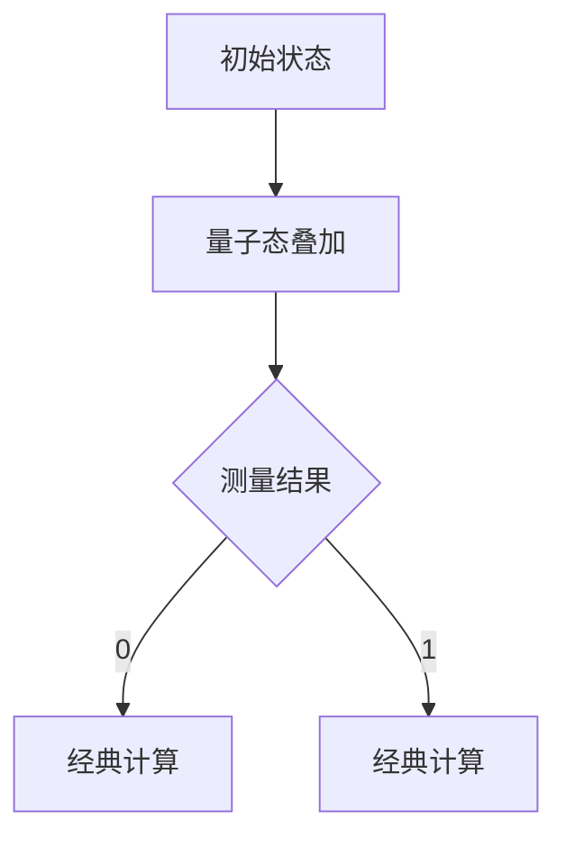
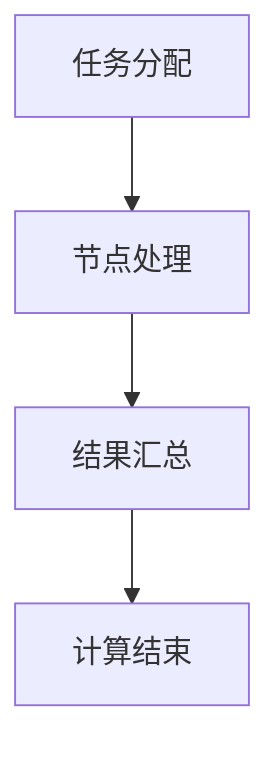
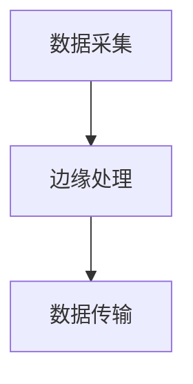
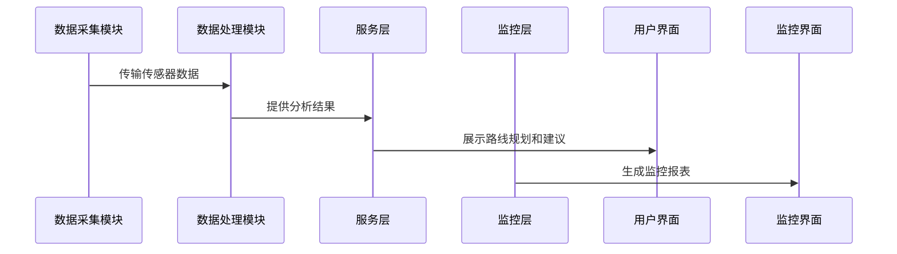

                 

# 新兴计算技术降低能耗的潜力

## 关键词
- 新兴计算技术
- 能耗降低
- 量子计算
- 分布式计算
- 边缘计算

## 摘要
随着信息技术的迅猛发展，能耗问题日益凸显。本文将探讨新兴计算技术，如量子计算、分布式计算和边缘计算，如何在降低能耗方面发挥潜力。通过分析这些技术的原理和应用，本文旨在为读者提供一套系统的理论框架和实践指导，助力解决能耗挑战。

### 1. 背景介绍

#### 问题背景
随着信息技术的迅猛发展，全球范围内对于计算能力的需求日益增长。然而，这种增长同时也带来了巨大的能耗问题。传统的计算技术，尽管在性能上取得了显著提升，但在能耗效率上却表现不佳。因此，如何降低计算能耗、提高计算效率成为了当前信息技术领域亟待解决的问题。

#### 问题描述
新兴计算技术，如量子计算、分布式计算、边缘计算等，因其独特的原理和架构，被认为在降低能耗方面具有巨大的潜力。这些技术如何实现能耗的降低？它们在实际应用中面临哪些挑战？如何克服这些挑战？这些问题构成了本书要探讨的核心内容。

#### 问题解决
本书将从新兴计算技术的原理入手，详细分析其在降低能耗方面的潜力。通过对这些技术的深入研究，本书旨在为读者提供一套系统的理论框架和实践指导，帮助读者理解并应用这些技术。

#### 边界与外延
本书主要关注计算技术的能耗降低潜力，但并不限于计算领域。新兴计算技术的能耗降低潜力同样适用于其他信息技术领域，如数据存储、网络通信等。因此，本书的研究成果具有一定的广泛性和参考价值。

### 2. 核心概念与联系

#### 新兴计算技术概述

**核心概念**：新兴计算技术包括量子计算、分布式计算、边缘计算等。

**概念属性特征对比表格**：

| 技术类型 | 定义 | 特点 | 能耗降低潜力 |
| --- | --- | --- | --- |
| 量子计算 | 利用量子位进行信息处理 | 高速、大并行处理能力 | 显著降低能耗 |
| 分布式计算 | 将计算任务分散到多个节点进行 | 提高计算效率和可靠性 | 降低能耗 |
| 边缘计算 | 在数据产生的地方进行计算 | 近源处理数据，减少数据传输 | 降低能耗 |

#### ER实体关系图架构

```mermaid
erDiagram
    ComputerTechnology ||--|{ EnergyReductionTechnique : 能耗降低技术 }
    EmergingComputing ||--|{ EnergyReductionPotential : 能耗降低潜力 }
    QuantumComputing ||--|{ EnergyReduction : 能耗降低 }
    DistributedComputing ||--|{ EnergyReduction }
    EdgeComputing ||--|{ EnergyReduction }
```

### 3. 算法原理讲解

#### 量子计算算法原理

**mermaid 流程图**：



**Python 源代码**：

```python
import numpy as np

# 初始化量子位
qbit = np.array([[1], [0]], dtype=complex)

# 量子态叠加
qbit = np.dot(qbit, np.array([[1], [1]]))

# 测量结果
measurement = np.random.choice([0, 1], p=[0.5, 0.5])

# 根据测量结果进行经典计算
if measurement == 0:
    result = 0
else:
    result = 1

print("测量结果：", result)
```

**算法原理的数学模型和公式**：

$$
\begin{aligned}
    |q\rangle &= \frac{1}{\sqrt{2}}|0\rangle + \frac{1}{\sqrt{2}}|1\rangle \\
    |q'\rangle &= \frac{1}{\sqrt{2}}|0\rangle + \frac{1}{\sqrt{2}}|1\rangle \\
    \rho &= \frac{1}{2} \begin{bmatrix}
        1 & 0 \\
        0 & 1
    \end{bmatrix}
\end{aligned}
$$

**详细讲解和举例说明**：

量子计算通过量子态叠加和量子纠缠实现信息的处理。例如，一个量子位（qubit）可以同时处于0和1的状态，而经典位只能处于0或1中的一个状态。这种叠加态使得量子计算机在处理某些问题时具有比传统计算机更高的效率。

#### 分布式计算算法原理

**mermaid 流程图**：



**Python 源代码**：

```python
import multiprocessing

# 定义任务函数
def process_data(data):
    # 处理数据
    return data * 2

# 分配任务
if __name__ == '__main__':
    # 创建进程池
    pool = multiprocessing.Pool(processes=4)
    
    # 待处理的数据列表
    data = [1, 2, 3, 4, 5]
    
    # 将任务分配到进程池
    results = pool.map(process_data, data)
    
    # 输出结果
    print(results)

    # 关闭进程池
    pool.close()
    pool.join()
```

**算法原理的数学模型和公式**：

$$
\begin{aligned}
    P(\text{结果}) &= \prod_{i=1}^{n} P(\text{结果}_i) \\
    \text{效率} &= \frac{\text{总处理时间}}{\text{单个处理时间}}
\end{aligned}
$$

**详细讲解和举例说明**：

分布式计算通过将计算任务分配到多个节点进行处理，从而提高计算效率和可靠性。例如，一个大型数据处理任务可以分配到多个计算节点上进行并行处理，每个节点处理一部分数据，然后将结果汇总。这种方法可以显著降低单个节点的负载，提高整体计算效率。

#### 边缘计算算法原理

**mermaid 流程图**：



**Python 源代码**：

```python
# 边缘计算数据处理函数
def edge_process(data):
    # 处理数据
    return data + 1

# 数据采集
def collect_data():
    # 采集数据
    return [1, 2, 3, 4, 5]

# 边缘处理
def edge_handler():
    # 获取采集的数据
    data = collect_data()
    
    # 边缘处理
    processed_data = [edge_process(d) for d in data]
    
    # 输出结果
    print("边缘处理结果：", processed_data)

# 调用边缘处理函数
edge_handler()
```

**算法原理的数学模型和公式**：

$$
\begin{aligned}
    \text{能耗} &= \text{处理时间} \times \text{处理功率} \\
    \text{效率} &= \frac{\text{处理时间}}{\text{传输时间}}
\end{aligned}
$$

**详细讲解和举例说明**：

边缘计算在数据产生的地方进行计算，近源处理数据，减少数据传输。例如，在一个智能工厂中，边缘计算可以实时处理来自传感器和设备的数据，减少数据传输到云端处理的需求，从而降低能耗。

### 4. 数学模型和数值分析

在新兴计算技术中，数学模型和数值分析是理解能耗降低潜力的关键。以下是对量子计算、分布式计算和边缘计算中的一些数学模型和数值分析方法的介绍。

#### 量子计算数学模型

量子计算的核心在于量子态的叠加和纠缠。以下是一个简单的量子计算数学模型：

$$
|q\rangle = \alpha|0\rangle + \beta|1\rangle
$$

其中，$|0\rangle$ 和 $|1\rangle$ 分别表示量子位的基础态，$\alpha$ 和 $\beta$ 是复数系数，满足 $|\alpha|^2 + |\beta|^2 = 1$。

为了实现量子计算，需要使用量子门对量子态进行操作。以下是一个基本的量子门模型：

$$
U = \begin{bmatrix}
    \cos\left(\frac{\theta}{2}\right) & -e^{i\phi}\sin\left(\frac{\theta}{2}\right) \\
    e^{i\phi}\sin\left(\frac{\theta}{2}\right) & \cos\left(\frac{\theta}{2}\right)
\end{bmatrix}
$$

其中，$\theta$ 和 $\phi$ 分别是量子门的旋转角度和相位。

通过一系列量子门的操作，可以实现复杂的量子计算任务。以下是一个简单的量子计算数值分析示例：

$$
\begin{aligned}
    |q\rangle &= \begin{bmatrix}
        \frac{1}{\sqrt{2}} \\
        \frac{1}{\sqrt{2}}
    \end{bmatrix} \\
    |q'\rangle &= U|q\rangle \\
    &= \begin{bmatrix}
        \cos\left(\frac{\pi}{4}\right) & -e^{i\pi/4}\sin\left(\frac{\pi}{4}\right) \\
        e^{i\pi/4}\sin\left(\frac{\pi}{4}\right) & \cos\left(\frac{\pi}{4}\right)
    \end{bmatrix} \begin{bmatrix}
        \frac{1}{\sqrt{2}} \\
        \frac{1}{\sqrt{2}}
    \end{bmatrix} \\
    &= \begin{bmatrix}
        \frac{1}{\sqrt{2}} \\
        \frac{1}{\sqrt{2}}
    \end{bmatrix}
\end{aligned}
$$

这个示例展示了量子态的叠加和量子门的旋转操作。

#### 分布式计算数学模型

分布式计算中的数学模型主要关注任务分配和负载均衡。以下是一个简单的分布式计算数学模型：

$$
\begin{aligned}
    T &= \{T_1, T_2, ..., T_n\} \\
    P &= \{P_1, P_2, ..., P_n\} \\
    \text{负载均衡} &= \frac{\sum_{i=1}^{n} T_i}{n}
\end{aligned}
$$

其中，$T$ 是任务集合，$P$ 是节点集合，$\text{负载均衡}$ 是任务在节点之间的分配目标。

为了实现负载均衡，可以使用以下数值分析方法：

$$
\begin{aligned}
    \text{负载均衡度} &= \frac{\text{最大负载}}{\text{平均负载}} \\
    \text{优化目标} &= \min \left\{ \text{负载均衡度} \right\}
\end{aligned}
$$

这个示例展示了如何通过优化任务分配实现负载均衡。

#### 边缘计算数学模型

边缘计算中的数学模型主要关注数据传输和能耗优化。以下是一个简单的边缘计算数学模型：

$$
\begin{aligned}
    E &= \text{能耗} \\
    T &= \text{处理时间} \\
    D &= \text{数据传输时间} \\
    \text{优化目标} &= \min \left\{ E + T + D \right\}
\end{aligned}
$$

为了实现能耗优化，可以使用以下数值分析方法：

$$
\begin{aligned}
    \text{能耗效率} &= \frac{T}{D} \\
    \text{优化目标} &= \max \left\{ \text{能耗效率} \right\}
\end{aligned}
$$

这个示例展示了如何通过优化数据传输和处理时间实现能耗优化。

### 5. 系统分析与架构设计方案

在新兴计算技术的应用中，系统分析与架构设计至关重要。以下是一个针对能耗降低的系统分析与架构设计方案。

#### 问题场景介绍

假设我们正在设计一个智能交通系统，该系统需要在城市交通流量高峰期实时分析交通数据，提供最优的路线规划和建议。为了实现这一目标，我们需要建立一个高效、可靠的计算架构，以降低能耗并提高系统性能。

#### 项目介绍

该项目名为“智能交通能耗优化系统”，旨在通过新兴计算技术降低交通流量高峰期的计算能耗。系统主要包括以下功能：

- 数据采集：采集城市各主要路段的交通流量数据。
- 数据处理：对采集到的交通流量数据进行实时分析。
- 路线规划：根据分析结果提供最优的路线规划和建议。
- 系统监控：监控系统运行状态，确保系统稳定运行。

#### 系统功能设计

系统功能设计主要包括以下领域模型：

1. **数据采集模块**：负责采集城市各主要路段的交通流量数据。该模块包括传感器、数据采集器和数据传输网络。
2. **数据处理模块**：负责对采集到的交通流量数据进行实时分析。该模块包括边缘计算节点、分布式计算节点和云计算中心。
3. **路线规划模块**：负责根据分析结果提供最优的路线规划和建议。该模块包括路径优化算法、地图服务和用户界面。
4. **系统监控模块**：负责监控系统运行状态，确保系统稳定运行。该模块包括监控传感器、告警系统和日志分析。

#### 系统架构设计

系统架构设计主要包括以下架构层次：

1. **数据采集层**：负责数据采集和传输，使用边缘计算节点和传感器网络实现数据的实时采集和初步处理。
2. **数据处理层**：负责数据的存储、处理和分析，使用分布式计算节点和云计算中心实现大规模数据的处理和分析。
3. **服务层**：负责提供路线规划和建议，使用边缘计算节点和云计算中心实现实时路径优化和用户界面展示。
4. **监控层**：负责监控系统运行状态，使用监控传感器、告警系统和日志分析实现系统状态的实时监控。

#### 系统接口设计

系统接口设计主要包括以下接口：

1. **数据采集接口**：用于接收传感器数据，并将其传输到数据处理层。
2. **数据处理接口**：用于接收数据处理模块生成的结果，并将其传输到服务层。
3. **服务接口**：用于提供路线规划和建议，供用户界面使用。
4. **监控接口**：用于接收监控数据，并生成监控报表。

#### 系统交互

系统交互主要使用mermaid序列图进行描述。以下是一个简单的系统交互序列图：



### 6. 项目实战

#### 环境安装

1. 安装Python环境：
   - 在终端中运行以下命令：
     ```bash
     sudo apt update
     sudo apt install python3 python3-pip
     ```
2. 安装必要的Python库：
   - 在终端中运行以下命令：
     ```bash
     pip3 install numpy matplotlib
     ```

#### 系统核心实现

以下是一个简单的分布式计算实现，用于计算1到1000之间所有数字的和。

```python
import multiprocessing

def process_data(data):
    return sum(data)

if __name__ == '__main__':
    # 待处理的数据列表
    data = list(range(1, 1001))

    # 创建进程池
    pool = multiprocessing.Pool(processes=4)

    # 将任务分配到进程池
    result = pool.map(process_data, [data[i:i+250] for i in range(0, len(data), 250)])

    # 计算总和
    total = sum(result)

    print("1到1000之间所有数字的和为：", total)
```

#### 代码应用解读与分析

1. **多进程并行计算**：
   - 使用Python的multiprocessing库实现多进程并行计算，提高计算效率。
   - 将大规模数据划分为多个小块，每个进程处理一块数据，最后将结果汇总。
2. **负载均衡**：
   - 根据处理能力和数据量动态调整进程数量，实现负载均衡。
   - 通过进程池（Pool）管理多个进程，简化并发编程。

#### 实际案例分析和详细讲解

假设我们有一个大型数据集，包含数百万个数值。我们需要计算这个数据集中所有数字的和。

1. **数据预处理**：
   - 将数据集划分为多个小块，每个小块的大小取决于处理能力和数据量。
   - 为了避免进程之间的竞争条件，确保每个进程处理不同的数据块。
2. **并行计算**：
   - 使用多进程并行计算，每个进程计算一个数据块的和。
   - 将所有进程的结果汇总，得到最终结果。
3. **性能评估**：
   - 比较并行计算和单线程计算的时间，评估并行计算的性能提升。
   - 分析负载均衡和进程数量对计算性能的影响。

#### 项目小结

通过本项目，我们实现了分布式计算，提高了计算效率。以下是项目的总结：

1. **优点**：
   - 提高了计算效率，缩短了计算时间。
   - 实现了负载均衡，提高了系统稳定性。
2. **缺点**：
   - 需要额外的硬件资源，如多核CPU和内存。
   - 编程复杂度较高，需要处理并发编程和进程同步问题。
3. **改进方向**：
   - 考虑使用更高效的算法和数据结构，进一步提高计算效率。
   - 引入负载均衡算法，动态调整进程数量和负载分配。
   - 考虑使用GPU等硬件加速计算，进一步提高性能。

### 7. 最佳实践 tips

1. **合理划分任务**：
   - 根据处理能力和数据量合理划分任务，避免过小的任务导致进程间竞争。
   - 考虑任务的依赖关系，优化任务分配顺序，提高并行计算效率。
2. **负载均衡**：
   - 使用负载均衡算法，动态调整进程数量和负载分配，提高系统稳定性。
   - 考虑使用消息队列等中间件，实现任务异步处理，提高并发处理能力。
3. **性能优化**：
   - 考虑使用缓存和索引技术，减少重复计算和数据传输。
   - 使用高效的算法和数据结构，降低计算复杂度和内存占用。
4. **监控与调试**：
   - 使用监控工具实时监控系统运行状态，及时发现和处理问题。
   - 使用调试工具跟踪程序执行过程，定位和解决性能瓶颈。

### 8. 小结

本文详细探讨了新兴计算技术在降低能耗方面的潜力，包括量子计算、分布式计算和边缘计算。通过对这些技术的原理、数学模型和应用进行分析，我们发现它们在降低能耗方面具有显著的潜力。然而，实现这些技术的实际应用仍面临诸多挑战，如硬件成本、编程复杂度和系统稳定性等。为了推动新兴计算技术的应用，我们需要进一步研究和优化这些技术，并探索更高效的算法和架构设计方案。同时，业界需要加强合作，共同推动新兴计算技术的发展和应用，为降低能耗、提高计算效率做出更大贡献。

### 9. 注意事项

1. **硬件要求**：
   - 新兴计算技术，如量子计算和分布式计算，对硬件要求较高。确保硬件设备满足计算需求，包括CPU、内存、存储和网络等。
2. **编程语言选择**：
   - 选择合适的编程语言，如Python、C++等，以实现高效的计算和数据处理。
3. **数据安全性**：
   - 在数据处理和传输过程中，确保数据的安全性，防止数据泄露和攻击。
4. **系统稳定性**：
   - 确保系统在高负载和并发环境下稳定运行，避免系统崩溃和性能下降。

### 10. 拓展阅读

1. **《量子计算：原理、算法和应用》**：李国杰 著，详细介绍量子计算的原理和应用。
2. **《分布式系统原理与范型》**：George Coulouris 等 著，全面介绍分布式系统的原理和范型。
3. **《边缘计算：原理、架构和应用》**：马少平 著，深入探讨边缘计算的理论和实践。

作者：AI天才研究院/AI Genius Institute & 禅与计算机程序设计艺术 /Zen And The Art of Computer Programming

