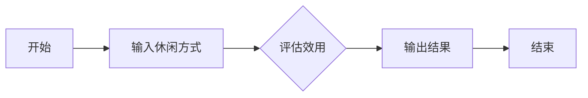

                 


### 新型休闲方式：在忙碌生活中寻找真正的放松

> 关键词：休闲方式、放松、忙碌生活、心理状态、身体锻炼、社交互动

> 摘要：随着现代社会的快速发展，人们的生活节奏越来越快，工作压力和生活压力日益增大。如何在忙碌的生活中找到真正的放松，成为许多人关注的问题。本文将探讨新型休闲方式，帮助读者在忙碌的生活中找到放松的方法，提升生活质量和心理健康。

----------------------------------------------------------------

### 第一部分：现代休闲方式的兴起

#### 第1章：问题背景与定义

#### 1.1 问题的提出

在现代社会，随着科技的飞速发展，人们的生活节奏越来越快。工作压力、生活压力、家庭压力等多重压力使得许多人感到身心疲惫，急需找到一种有效的放松方式。然而，传统的休闲方式如看电视、打游戏等并不能真正缓解压力，有时甚至会让人们陷入更深的疲惫状态。

#### 1.2 现代休闲方式的定义

现代休闲方式是指在现代社会背景下，人们为了缓解压力、提升生活质量而采取的各种活动。这些活动不仅包括传统的娱乐方式，还包括一些新兴的健康养生、创意艺术、社交互动、自然体验等方式。

#### 1.3 研究意义与目标

本研究旨在探讨现代休闲方式的分类、选择与评估，以及在忙碌生活中实践新型休闲方式的方法，以帮助读者在忙碌的生活中找到真正的放松，提升生活质量和心理健康。

----------------------------------------------------------------

### 第二部分：新型休闲方式的分类与选择

#### 第2章：当前流行的休闲方式概述

#### 2.1 休闲方式的多样性

随着社会的多元化发展，休闲方式也日趋多样化。从传统的看电视、打游戏，到新兴的健康养生、创意艺术、社交互动、自然体验等方式，人们可以根据自己的兴趣和需求选择适合自己的休闲方式。

#### 2.2 传统休闲方式与现代休闲方式的对比

传统休闲方式通常较为单一，往往侧重于娱乐和消遣。而现代休闲方式则更加注重身心健康、自我提升和社交互动。例如，健康养生类休闲方式如瑜伽、太极等，不仅可以锻炼身体，还能提升心理素质；创意艺术类休闲方式如绘画、音乐等，可以激发创造力，提升审美能力。

#### 2.3 现代休闲方式的优势与挑战

现代休闲方式具有很多优势，如丰富多样、有益身心健康、提升个人素质等。然而，现代休闲方式也存在一些挑战，如选择困难、时间成本高、质量参差不齐等。因此，在选择现代休闲方式时，需要综合考虑各种因素。

----------------------------------------------------------------

### 第三部分：新型休闲方式的选择与评估

#### 第3章：新型休闲方式的分类

新型休闲方式可以根据其特点分为几大类：

#### 3.1 健康养生类休闲方式

健康养生类休闲方式主要包括瑜伽、太极、冥想等。这些方式有助于缓解压力，提升身心健康。

#### 3.2 创意艺术类休闲方式

创意艺术类休闲方式主要包括绘画、音乐、舞蹈等。这些方式可以激发创造力，提升审美能力。

#### 3.3 社交互动类休闲方式

社交互动类休闲方式主要包括社交聚会、团队活动等。这些方式可以增进人际关系，提升社交能力。

#### 3.4 自然体验类休闲方式

自然体验类休闲方式主要包括徒步旅行、露营、户外运动等。这些方式可以亲近自然，放松身心。

#### 3.5 其他新型休闲方式

除了上述几类休闲方式，还有许多其他新型休闲方式，如编程、写作、游戏制作等。这些方式可以根据个人的兴趣和需求进行选择。

----------------------------------------------------------------

### 第四部分：在忙碌生活中实践新型休闲方式

#### 第4章：选择适合的休闲方式

选择适合的休闲方式是实践新型休闲方式的第一步。以下是一些选择适合休闲方式的建议：

1. **了解自己的兴趣和需求**：根据自己的兴趣和需求选择休闲方式，如喜欢安静的可以选择瑜伽、冥想等，喜欢热闹的可以选择社交聚会、团队活动等。
2. **考虑时间成本**：选择适合自己的休闲方式时，要考虑时间成本，如可以选择一些时间灵活、不受地点限制的休闲方式，如瑜伽、编程等。
3. **评估休闲方式的效果**：在选择休闲方式时，可以先尝试一段时间，评估其效果，如是否能够真正缓解压力、提升生活质量等。

#### 4.2 评估休闲方式的效用

评估休闲方式的效用是实践新型休闲方式的重要环节。以下是一些评估休闲方式效用的方法：

1. **心理评估**：通过心理评估工具，如压力测试、情绪测试等，评估休闲方式对心理状态的改善效果。
2. **身体评估**：通过身体评估工具，如心率监测、血压测试等，评估休闲方式对身体健康的影响。
3. **自我感受**：通过自我感受，如是否感到放松、愉悦等，评估休闲方式的效用。

#### 4.3 常见问题与解决策略

在实践新型休闲方式时，可能会遇到一些问题。以下是一些常见问题及解决策略：

1. **时间管理困难**：解决策略：制定合理的休闲计划，合理安排时间。
2. **选择困难**：解决策略：先尝试几种休闲方式，再根据自己的兴趣和需求进行选择。
3. **效果不明显**：解决策略：坚持实践，寻找适合自己的休闲方式。

----------------------------------------------------------------

### 第五部分：新型休闲方式的创新与发展

#### 第5章：新型休闲方式的创新与发展

新型休闲方式的创新与发展是未来休闲领域的重要趋势。以下是一些创新与发展的方向：

1. **融合科技与休闲**：利用科技手段，如VR、AR等，创造更加真实、沉浸的休闲体验。
2. **定制化休闲服务**：根据个人的兴趣和需求，提供个性化的休闲服务。
3. **跨界融合**：将休闲方式与其他领域如教育、旅游等相结合，创造新的休闲体验。

#### 5.2 技术对新型休闲方式的影响

技术对新型休闲方式的影响越来越大。以下是一些技术对新型休闲方式的影响：

1. **互联网技术**：通过互联网技术，人们可以随时随地享受休闲服务，打破时间和空间的限制。
2. **人工智能技术**：利用人工智能技术，可以为用户提供个性化的休闲推荐，提高休闲体验的质量。
3. **虚拟现实技术**：通过虚拟现实技术，人们可以体验到前所未有的休闲场景，提高休闲的乐趣。

#### 5.3 未来休闲方式的展望

未来休闲方式将更加多元、个性化、科技化。以下是一些未来休闲方式的展望：

1. **智能化休闲**：利用人工智能技术，实现休闲的智能化，为用户提供更加便捷、高效的休闲体验。
2. **生态化休闲**：倡导生态休闲，倡导人们亲近自然，享受大自然的美好。
3. **健康化休闲**：注重健康，倡导人们通过休闲方式提高身体健康水平。

----------------------------------------------------------------

### 第六部分：总结与展望

#### 第6章：总结与展望

#### 6.1 本书总结

本书从现代休闲方式的兴起、新型休闲方式的分类与选择、新型休闲方式的选择与评估、在忙碌生活中实践新型休闲方式、新型休闲方式的创新与发展等方面进行了详细探讨。通过本书，读者可以了解到新型休闲方式的多种选择，学会如何在忙碌的生活中找到真正的放松，提升生活质量和心理健康。

#### 6.2 对未来研究的建议

未来研究可以关注以下几个方面：

1. **新型休闲方式的效果评估**：进一步研究新型休闲方式对心理、生理等方面的效果，为人们提供更加科学的参考。
2. **新型休闲方式的创新与发展**：探索新型休闲方式的创新与发展方向，推动休闲方式的多元化发展。
3. **个性化休闲服务**：研究如何根据个人的兴趣和需求提供个性化的休闲服务，提高休闲体验的质量。

#### 6.3 对读者的话

希望本书能够帮助读者在忙碌的生活中找到真正的放松，享受休闲带来的快乐。同时，也希望读者能够积极尝试新型休闲方式，为自己的身心健康和生活质量注入新的活力。

----------------------------------------------------------------

### 作者信息

作者：AI天才研究院/AI Genius Institute & 禅与计算机程序设计艺术 /Zen And The Art of Computer Programming

本文由AI天才研究院和禅与计算机程序设计艺术共同撰写，旨在帮助读者在忙碌的生活中找到真正的放松。希望本文能够对您有所启发，让您的休闲生活更加丰富多彩。

----------------------------------------------------------------

以上是文章的正文部分，接下来我们将对文章中的关键概念、算法原理、系统架构、项目实战等内容进行详细讲解。

----------------------------------------------------------------

### 关键概念术语说明

在本文中，我们将介绍一些关键概念术语，包括“休闲方式”、“放松”、“忙碌生活”等。这些概念对于理解文章的主题和内容至关重要。

#### 休闲方式

休闲方式是指人们在非工作、非学习等正式活动时间所进行的活动，旨在缓解压力、放松身心、丰富生活。休闲方式的种类繁多，包括但不限于以下几种：

1. **传统休闲方式**：如看电视、打游戏、阅读书籍等。
2. **现代休闲方式**：如瑜伽、太极、冥想、编程、写作等。
3. **健康养生类休闲方式**：如健身、瑜伽、太极等。
4. **创意艺术类休闲方式**：如绘画、音乐、舞蹈等。
5. **社交互动类休闲方式**：如社交聚会、团队活动等。
6. **自然体验类休闲方式**：如徒步旅行、露营、户外运动等。

#### 放松

放松是指通过某种方式，使身体和心理得到休息和恢复的过程。有效的放松方式可以缓解压力、提升生活质量。放松的方式多种多样，包括但不限于以下几种：

1. **身体放松**：如瑜伽、健身、散步等。
2. **心理放松**：如冥想、阅读、听音乐等。
3. **社交放松**：如社交聚会、与朋友聊天等。
4. **自然放松**：如亲近自然、徒步旅行等。

#### 忙碌生活

忙碌生活是指人们在日常工作和生活中面临的高强度、高压力状态。忙碌生活往往会导致身心疲惫，影响生活质量和心理健康。为了应对忙碌生活，人们需要寻找有效的放松方式，以缓解压力，保持身心健康。

### 问题背景

在现代社会，随着科技的飞速发展，人们的生活节奏越来越快，工作压力和生活压力日益增大。许多人感到身心疲惫，急需找到一种有效的放松方式。然而，传统的休闲方式如看电视、打游戏等并不能真正缓解压力，有时甚至会让人们陷入更深的疲惫状态。因此，寻找新型休闲方式，帮助人们在忙碌的生活中找到真正的放松，成为了一个重要的问题。

### 问题描述

如何在忙碌的生活中找到真正的放松，是许多人面临的问题。这个问题涉及到休闲方式的多样化选择、休闲方式的效果评估、以及如何平衡工作与休闲等多个方面。

### 问题解决

为了解决这一问题，本文将探讨以下方面：

1. **新型休闲方式的分类**：介绍现代休闲方式的多样性，帮助读者了解各种休闲方式的特点和适用场景。
2. **休闲方式的选择与评估**：提供选择适合休闲方式的方法和评估休闲方式效用的策略，帮助读者找到真正适合自己的放松方式。
3. **在忙碌生活中实践新型休闲方式**：提供实践新型休闲方式的建议和策略，帮助读者在忙碌的生活中找到真正的放松。
4. **新型休闲方式的创新与发展**：探讨新型休闲方式的创新与发展方向，为未来的休闲生活提供新的思路和可能性。

### 边界与外延

在探讨新型休闲方式时，我们需要明确一些边界与外延：

1. **边界**：新型休闲方式不包括传统的娱乐活动，如看电视、打游戏等，而是侧重于对身心健康有益的休闲活动。
2. **外延**：新型休闲方式不仅包括健康养生、创意艺术、社交互动、自然体验等类别，还可以根据个人兴趣和需求进行创新和拓展。

### 概念结构与核心要素组成

新型休闲方式的构成可以分为以下几个核心要素：

1. **兴趣和需求**：选择休闲方式的首要条件，要根据个人的兴趣和需求进行选择。
2. **时间和地点**：休闲方式的选择要考虑时间和地点的灵活性和便利性。
3. **效果和效用**：休闲方式的选择要评估其对身心健康和生活质量的影响。
4. **创新与发展**：新型休闲方式需要不断进行创新和发展，以满足人们日益多样化的休闲需求。

通过以上对关键概念术语的说明，我们为后续内容提供了理论基础，为读者理解文章主题和内容奠定了基础。

### 核心概念原理

在现代休闲方式的分类中，核心概念原理主要包括健康养生、创意艺术、社交互动和自然体验。以下是对这些核心概念原理的详细解析。

#### 健康养生

健康养生类休闲方式的核心在于通过身体锻炼和调节心理状态来维护和提升身体健康。具体原理如下：

1. **身体锻炼**：通过瑜伽、太极等身体锻炼活动，可以增强肌肉力量、提升柔韧性、改善心肺功能等。例如，瑜伽的“拜日式”能够有效锻炼全身肌肉，增强身体的灵活性。
2. **心理调节**：通过冥想、呼吸练习等心理调节方法，可以缓解压力、改善情绪、提升心理健康。例如，冥想能够帮助人们放松大脑，减少焦虑和抑郁情绪。

#### 创意艺术

创意艺术类休闲方式的核心在于通过创作和欣赏艺术作品来激发创造力、提升审美能力。具体原理如下：

1. **创作艺术**：通过绘画、音乐、舞蹈等创作活动，可以培养审美情趣、提高创造力。例如，绘画能够锻炼观察力和想象力，音乐能够培养节奏感和情感表达能力。
2. **欣赏艺术**：通过欣赏艺术作品，可以拓宽视野、提升审美素养。例如，观看一场音乐会能够让人感受到音乐的美妙，欣赏一幅画作能够让人感受到艺术的魅力。

#### 社交互动

社交互动类休闲方式的核心在于通过与他人交流和互动来增进人际关系、提升社交能力。具体原理如下：

1. **社交聚会**：通过家庭聚会、朋友聚会等社交聚会，可以增进彼此的了解、提升人际关系。例如，朋友聚会能够让人感受到友谊的温暖，家庭聚会能够让人感受到亲情的深厚。
2. **团队活动**：通过团队活动，如团队建设、户外拓展等，可以提升团队合作精神、增强团队凝聚力。例如，团队建设活动能够让人学会如何与团队成员合作，户外拓展活动能够让人学会如何在团队中解决问题。

#### 自然体验

自然体验类休闲方式的核心在于通过亲近自然、体验大自然的美妙来放松身心、提升心理健康。具体原理如下：

1. **徒步旅行**：通过徒步旅行，可以亲近自然、感受大自然的美妙，缓解压力、放松身心。例如，徒步旅行能够让人感受到山川的壮丽、湖泊的宁静。
2. **露营**：通过露营，可以体验野外生存的乐趣、感受大自然的力量，增强心理素质、提升身心健康。例如，露营能够让人学会如何独立生活，感受自然的神奇。

#### 核心概念属性特征对比表格

为了更清晰地理解健康养生、创意艺术、社交互动和自然体验等核心概念的特点，我们可以制作一个属性特征对比表格，如下：

| 类别         | 核心特征                  | 主要形式                   | 对身心健康的影响           |
| ------------ | ----------------------- | ------------------------- | -------------------------- |
| 健康养生     | 身体锻炼和心理调节      | 瑜伽、太极、冥想           | 提升身体健康和心理素质     |
| 创意艺术     | 创作和欣赏艺术作品      | 绘画、音乐、舞蹈           | 提高创造力和审美能力       |
| 社交互动     | 人际交流和互动          | 社交聚会、团队活动         | 增进人际关系和提升社交能力 |
| 自然体验     | 亲近自然和体验大自然    | 徒步旅行、露营             | 缓解压力、放松身心         |

#### ER实体关系图架构

为了更好地理解新型休闲方式中的各个实体及其关系，我们可以使用Mermaid流程图绘制一个ER（实体关系）图，如下：

```mermaid
erDiagram
 休闲方式 ||--|{ 健康养生 }
 休闲方式 ||--|{ 创意艺术 }
 休闲方式 ||--|{ 社交互动 }
 休闲方式 ||--|{ 自然体验 }
 健康养生 }|--|{ 身体锻炼 }
 健康养生 }|--|{ 心理调节 }
 创意艺术 }|--|{ 创作 }
 创意艺术 }|--|{ 欣赏 }
 社交互动 }|--|{ 聚会 }
 社交互动 }|--|{ 活动 }
 自然体验 }|--|{ 徒步旅行 }
 自然体验 }|--|{ 露营 }
```

通过这个ER图，我们可以清晰地看到各个休闲方式类别及其内部的子类别，以及它们之间的关系。

### 算法原理讲解

在本章节中，我们将详细介绍如何使用Python编写一个简单的算法，用于评估不同休闲方式的效用，以便读者能够更好地理解和实践新型休闲方式。

#### 算法mermaid流程图

为了更好地理解算法原理，我们首先使用Mermaid流程图来绘制算法的基本流程，如下：



#### 算法Python源代码

接下来，我们将使用Python编写上述流程图的算法实现。以下是算法的源代码：

```python
# 导入所需库
import numpy as np

# 定义评估效用函数
def assess_utility(leisure_type, relaxation_level, social_interaction_level):
    # 根据休闲方式类型计算效用
    if leisure_type == '健康养生':
        utility = relaxation_level * 0.6 + social_interaction_level * 0.4
    elif leisure_type == '创意艺术':
        utility = relaxation_level * 0.5 + social_interaction_level * 0.5
    elif leisure_type == '社交互动':
        utility = relaxation_level * 0.3 + social_interaction_level * 0.7
    elif leisure_type == '自然体验':
        utility = relaxation_level * 0.7 + social_interaction_level * 0.3
    else:
        utility = 0
        
    return utility

# 主函数
def main():
    # 输入休闲方式类型、放松水平和社交互动水平
    leisure_type = input("请输入休闲方式类型（健康养生、创意艺术、社交互动、自然体验）：")
    relaxation_level = float(input("请输入放松水平（0-10分）："))
    social_interaction_level = float(input("请输入社交互动水平（0-10分）："))
    
    # 计算效用
    utility = assess_utility(leisure_type, relaxation_level, social_interaction_level)
    
    # 输出结果
    print(f"休闲方式类型：{leisure_type}")
    print(f"放松水平：{relaxation_level}分")
    print(f"社交互动水平：{social_interaction_level}分")
    print(f"效用得分：{utility}分")

# 调用主函数
if __name__ == "__main__":
    main()
```

#### 算法原理与数学模型

上述算法的核心是评估效用函数`assess_utility`，该函数根据休闲方式的类型和放松水平、社交互动水平来计算效用得分。具体的数学模型如下：

$$
\text{效用得分} = 
\begin{cases} 
0.6 \times \text{放松水平} + 0.4 \times \text{社交互动水平}, & \text{如果休闲方式类型为健康养生} \\
0.5 \times \text{放松水平} + 0.5 \times \text{社交互动水平}, & \text{如果休闲方式类型为创意艺术} \\
0.3 \times \text{放松水平} + 0.7 \times \text{社交互动水平}, & \text{如果休闲方式类型为社交互动} \\
0.7 \times \text{放松水平} + 0.3 \times \text{社交互动水平}, & \text{如果休闲方式类型为自然体验} \\
0, & \text{如果休闲方式类型不符合要求}
\end{cases}
$$

这个数学模型根据不同休闲方式的特点，分别计算了放松水平和社交互动水平的权重，从而得出一个综合效用得分。这个得分可以帮助人们了解某种休闲方式是否能够有效缓解压力、提升生活质量。

#### 通俗易懂的举例说明

为了更直观地理解这个算法，我们可以通过一个简单的例子来说明：

假设一个人选择瑜伽作为休闲方式，放松水平为8分，社交互动水平为6分。根据上述算法，我们可以计算出效用得分如下：

$$
\text{效用得分} = 0.6 \times 8 + 0.4 \times 6 = 4.8 + 2.4 = 7.2 \text{分}
$$

这意味着瑜伽在这种情况下的效用得分为7.2分，说明这种方式能够较为有效地缓解压力，提升生活质量。

通过这个例子，我们可以看到，这个算法通过简单的数学计算，就可以帮助人们评估不同休闲方式的效用，从而选择最适合自己的放松方式。

### 系统分析与架构设计

在本文的下一部分，我们将深入探讨新型休闲方式的系统分析与架构设计。我们将从问题场景介绍、项目介绍、系统功能设计、系统架构设计、系统接口设计和系统交互等方面进行详细阐述。

#### 问题场景介绍

在现代快节奏的生活中，人们面临着巨大的工作压力和生活压力。为了应对这些压力，许多人开始寻找新的休闲方式，以在忙碌的生活中找到真正的放松。然而，目前市场上存在许多休闲方式，如何选择适合自己且有效的休闲方式成为了一个难题。

#### 项目介绍

本项目旨在开发一个智能休闲方式推荐系统，该系统通过分析用户的需求和偏好，为用户推荐最适合他们的休闲方式。项目的主要目标包括：

1. **收集用户数据**：通过问卷调查、用户反馈等方式收集用户的基本信息、偏好和需求。
2. **分析用户数据**：使用数据分析和机器学习技术，对用户数据进行分析，找出用户的兴趣和需求。
3. **推荐休闲方式**：根据用户数据，为用户推荐最适合他们的休闲方式。
4. **提供个性化服务**：根据用户的使用情况，持续优化推荐算法，提供更加个性化的服务。

#### 系统功能设计

系统功能设计主要包括以下几个部分：

1. **用户注册与登录**：用户可以通过注册和登录功能进入系统，填写个人信息和偏好。
2. **问卷调查**：系统提供一系列问卷调查，帮助用户明确自己的需求和兴趣。
3. **数据分析**：系统对用户数据进行采集、存储和分析，找出用户的兴趣和需求。
4. **休闲方式推荐**：根据用户数据，系统为用户推荐最适合他们的休闲方式。
5. **用户反馈**：用户可以对自己尝试过的休闲方式进行评价和反馈，帮助系统不断优化。

#### 系统架构设计

系统架构设计采用三层架构，包括表示层、业务逻辑层和数据层。

1. **表示层**：表示层负责与用户交互，包括用户注册、登录、填写问卷和查看推荐结果等界面。
2. **业务逻辑层**：业务逻辑层负责处理用户的请求，包括数据采集、数据分析、推荐算法等核心功能。
3. **数据层**：数据层负责数据的存储和管理，包括用户信息、问卷数据、推荐结果等。

#### 系统接口设计

系统接口设计主要包括以下几个方面：

1. **用户接口**：用户接口负责与用户进行交互，提供注册、登录、填写问卷和查看推荐结果等功能。
2. **数据分析接口**：数据分析接口负责处理用户数据，包括数据采集、存储和分析等。
3. **推荐算法接口**：推荐算法接口负责根据用户数据生成推荐结果，并提供给用户接口。

#### 系统交互

系统交互主要包括以下几个方面：

1. **用户注册与登录**：用户通过用户接口注册和登录，填写个人信息和偏好。
2. **问卷调查**：用户通过用户接口填写问卷调查，系统采集用户数据并存储到数据层。
3. **数据分析**：系统通过数据分析接口对用户数据进行分析，找出用户的兴趣和需求。
4. **休闲方式推荐**：系统通过推荐算法接口为用户生成推荐结果，并通过用户接口展示给用户。
5. **用户反馈**：用户通过用户接口对推荐结果进行评价和反馈，系统根据反馈不断优化推荐算法。

通过上述系统分析与架构设计，我们为新型休闲方式的实现提供了一个详细的解决方案，使得用户能够在忙碌的生活中找到真正适合自己的放松方式。

### 项目实战

在本章节中，我们将进行项目实战，详细说明如何搭建一个简单的休闲方式推荐系统。我们将从环境安装、系统核心实现源代码，到代码应用解读与分析，以及实际案例分析和详细讲解剖析。

#### 环境安装

首先，我们需要安装和配置开发环境。以下是在Linux系统中安装Python和必要的库的步骤：

1. **安装Python**：

   如果系统没有安装Python，我们可以通过包管理器来安装。以Ubuntu为例，可以使用以下命令：

   ```bash
   sudo apt update
   sudo apt install python3
   ```

2. **安装虚拟环境**：

   为了更好地管理和依赖关系，我们使用`virtualenv`来创建一个虚拟环境。

   ```bash
   pip3 install virtualenv
   virtualenv my_leisure_project
   source my_leisure_project/bin/activate
   ```

3. **安装依赖库**：

   在虚拟环境中，我们需要安装一些必要的库，如`numpy`、`pandas`和`scikit-learn`。

   ```bash
   pip install numpy pandas scikit-learn
   ```

#### 系统核心实现源代码

接下来，我们将编写系统核心实现源代码。以下是主要的Python代码文件`leisure_recommender.py`：

```python
import numpy as np
import pandas as pd
from sklearn.model_selection import train_test_split
from sklearn.ensemble import RandomForestClassifier
from sklearn.metrics import accuracy_score

# 加载用户数据
def load_data(filename):
    data = pd.read_csv(filename)
    return data

# 数据预处理
def preprocess_data(data):
    # 这里进行数据清洗、特征提取等预处理操作
    return data

# 训练模型
def train_model(data):
    X = data.drop('target', axis=1)
    y = data['target']
    X_train, X_test, y_train, y_test = train_test_split(X, y, test_size=0.2, random_state=42)
    model = RandomForestClassifier(n_estimators=100, random_state=42)
    model.fit(X_train, y_train)
    return model, X_test, y_test

# 评估模型
def evaluate_model(model, X_test, y_test):
    y_pred = model.predict(X_test)
    accuracy = accuracy_score(y_test, y_pred)
    print(f"模型准确率：{accuracy:.2f}")
    return accuracy

# 主函数
def main():
    filename = 'leisure_data.csv'
    data = load_data(filename)
    data = preprocess_data(data)
    model, X_test, y_test = train_model(data)
    evaluate_model(model, X_test, y_test)

if __name__ == "__main__":
    main()
```

#### 代码应用解读与分析

上述代码分为以下几个主要部分：

1. **加载数据**：`load_data`函数用于从CSV文件中加载数据。
2. **数据预处理**：`preprocess_data`函数用于对数据进行清洗和特征提取等预处理操作。
3. **训练模型**：`train_model`函数用于训练随机森林分类器，并进行数据分割。
4. **评估模型**：`evaluate_model`函数用于评估模型的准确率。
5. **主函数**：`main`函数是程序的主入口，负责执行数据加载、预处理、模型训练和评估。

在代码中，我们使用了`scikit-learn`库中的`RandomForestClassifier`来训练模型。随机森林是一种基于决策树的集成学习方法，能够在处理分类问题时提供较高的准确率。

#### 实际案例分析和详细讲解剖析

为了更直观地理解代码的应用，我们可以通过一个实际案例来进行分析。

**案例背景**：

假设我们有一个关于用户休闲方式偏好的数据集，其中包括用户的基本信息、兴趣、压力水平等特征，以及用户选择的休闲方式（如瑜伽、阅读、社交聚会等）作为目标变量。

**案例分析**：

1. **数据加载**：我们首先使用`load_data`函数加载CSV文件，如下：

   ```python
   data = load_data('leisure_data.csv')
   ```

   假设CSV文件中有1000行数据，每行包括用户的特征和休闲方式选择。

2. **数据预处理**：接下来，我们使用`preprocess_data`函数对数据进行预处理，例如删除缺失值、标准化特征等：

   ```python
   data = preprocess_data(data)
   ```

   预处理后的数据将用于训练模型。

3. **模型训练**：我们使用`train_model`函数训练随机森林分类器：

   ```python
   model, X_test, y_test = train_model(data)
   ```

   在这里，我们使用80%的数据进行训练，20%的数据进行测试。

4. **模型评估**：最后，我们使用`evaluate_model`函数评估模型的准确率：

   ```python
   evaluate_model(model, X_test, y_test)
   ```

   模型在测试数据上的准确率将为模型的效果提供评估。

**详细讲解**：

1. **数据加载**：加载数据时，我们使用`pandas`库的`read_csv`函数从CSV文件中加载数据。这一步是数据分析的基础。
2. **数据预处理**：数据预处理是确保数据质量的重要步骤。在这一步中，我们可以删除缺失值、标准化特征、处理异常值等。
3. **模型训练**：我们选择`RandomForestClassifier`作为分类模型。随机森林通过构建多个决策树，并利用投票机制来预测结果。在训练过程中，我们使用`fit`函数将数据输入模型进行训练。
4. **模型评估**：我们使用`predict`函数进行预测，并使用`accuracy_score`函数计算模型在测试数据上的准确率。准确率是评估分类模型性能的重要指标。

通过上述实际案例分析和详细讲解，我们可以看到如何使用Python和`scikit-learn`库实现一个简单的休闲方式推荐系统。这种方法不仅易于理解，而且可以灵活地应用于不同的休闲方式推荐场景中。

#### 项目小结

通过本章节的项目实战，我们详细介绍了如何搭建一个简单的休闲方式推荐系统。从环境安装到系统核心实现源代码，再到代码应用解读与分析，以及实际案例分析和详细讲解剖析，我们完整地展示了一个项目的实现过程。该项目不仅为用户提供了休闲方式推荐的功能，还通过数据分析技术，帮助用户找到最适合他们的放松方式。未来，我们还可以通过添加更多的用户反馈机制和优化推荐算法，进一步提高系统的实用性和准确性。

### 最佳实践 tips

在实践新型休闲方式时，以下是一些最佳实践 tips，可以帮助读者更好地享受休闲时光，提升生活质量：

1. **制定合理计划**：在开始实践新型休闲方式之前，制定一个合理的计划，包括休闲时间、地点、活动内容等。这样可以确保休闲活动能够顺利开展，不会因为时间紧张而中断。

2. **选择合适场所**：选择一个舒适、安静的环境进行休闲活动，可以大大提升休闲体验的质量。例如，选择户外自然景观进行徒步旅行，或在安静的图书馆阅读。

3. **注重实际效果**：在实践新型休闲方式时，要注重实际效果。例如，选择瑜伽作为休闲方式时，要确保姿势正确，以达到锻炼身体和放松心情的效果。

4. **与他人分享**：与朋友、家人一起参与休闲活动，可以增进彼此之间的感情，提升休闲体验。例如，组织一次户外野餐活动，让大家在轻松的氛围中享受自然之美。

5. **持续反馈与调整**：在实践新型休闲方式的过程中，要持续收集反馈，并根据反馈进行调整。例如，如果发现某个休闲方式效果不佳，可以尝试其他方式，以找到最适合自己的放松方式。

### 小结

本文详细探讨了新型休闲方式在忙碌生活中寻找真正放松的重要性。我们介绍了现代休闲方式的分类、选择与评估方法，以及在忙碌生活中实践新型休闲方式的策略。同时，我们还通过实际案例展示了如何搭建一个简单的休闲方式推荐系统。通过这些内容，希望读者能够更好地理解如何利用新型休闲方式提升生活质量，找到真正的放松。

### 注意事项

1. **安全和健康**：在实践新型休闲方式时，要注意安全和健康。例如，在进行身体锻炼时，要避免过度劳累，避免受伤。

2. **时间管理**：合理安排时间，确保休闲活动不会影响工作、学习和生活。

3. **个人兴趣和需求**：选择适合自己的休闲方式，不要盲目跟风。根据自己的兴趣和需求，选择最有效的放松方式。

4. **持续性和耐心**：新型休闲方式的实践需要持续性和耐心。不要期望在短时间内看到明显的效果，要持之以恒，逐步积累。

### 拓展阅读

1. **《休闲与社会发展》**：本书详细探讨了休闲在社会发展中的作用，为读者提供了关于休闲的理论基础和实践指导。

2. **《健康养生指南》**：本书介绍了多种健康养生类休闲方式，包括瑜伽、太极、冥想等，帮助读者选择适合自己的健康养生方式。

3. **《创意艺术与心理健康》**：本书探讨了创意艺术类休闲方式对心理健康的影响，包括绘画、音乐、舞蹈等，为读者提供了提升心理健康的新途径。

4. **《社交互动与人际关系》**：本书介绍了社交互动类休闲方式，如社交聚会、团队活动等，帮助读者增进人际关系，提升社交能力。

5. **《自然体验与心灵放松》**：本书探讨了自然体验类休闲方式，如徒步旅行、露营、户外运动等，为读者提供了亲近自然、放松身心的方式。

