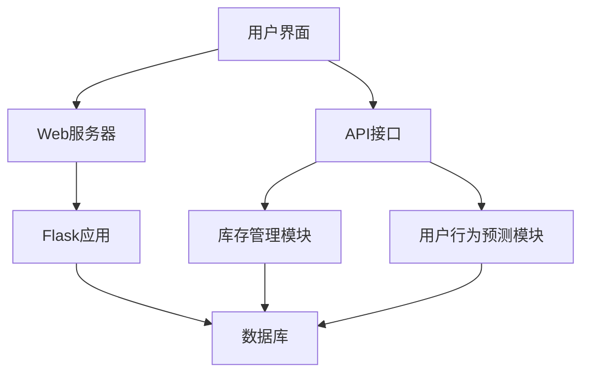
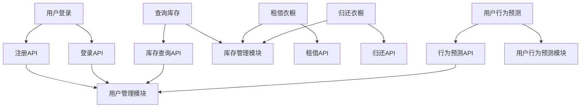

                 

### 文章标题：新型城市共享衣橱：可持续时尚的创新模式

关键词：共享衣橱、可持续时尚、创新模式、算法原理、系统架构、最佳实践

摘要：本文深入探讨了新型城市共享衣橱模式及其在推动可持续时尚方面的作用。通过分析共享衣橱的概念、全球发展现状、核心概念原理以及算法原理，本文展示了共享衣橱系统架构的设计和实际应用案例，并提出了运营最佳实践和未来展望。文章旨在为读者提供一个全面了解共享衣橱模式及其在可持续时尚领域应用的创新思路。

## 第一部分：背景介绍

### 第1章：共享衣橱概念的兴起

**1.1 问题背景**

随着城市化进程的加快，现代城市生活方式发生了巨大变化。快节奏的生活方式和不断变化的美学趋势使得消费者对时尚的需求变得更加多样化。然而，传统时尚行业面临着严重的可持续性问题，包括资源浪费、环境污染和过度消费。为了应对这些问题，共享经济作为一种新兴的经济模式在全球范围内迅速崛起。共享衣橱作为一种新型的共享模式，旨在通过资源的高效利用和循环使用，推动时尚行业的可持续发展。

**1.2 核心概念**

- **共享衣橱**：共享衣橱是一种以租赁方式提供服装的商业模式，用户可以通过支付一定费用来租赁服装，从而实现服装的共享和循环利用。
- **可持续时尚**：可持续时尚是一种以环保、社会责任和经济效益为核心价值的时尚理念，强调在设计、生产、消费和回收等环节减少对环境的影响，提高资源的利用效率。
- **创新模式**：创新模式是指通过技术创新、商业模式的变革以及管理创新的手段，实现共享衣橱在可持续时尚领域的突破和发展。

### 第2章：共享衣橱的全球发展现状

**2.1 全球市场概述**

共享衣橱作为一种新兴商业模式，在全球范围内迅速发展。根据市场研究报告，全球共享衣橱市场规模在过去几年中呈现出快速增长的趋势，预计未来几年仍将保持高速增长。主要市场包括美国、欧洲和亚洲，其中美国市场占主导地位。

**2.2 核心国家案例分析**

- **日本**：日本是共享衣橱的先驱国家之一，共享衣橱市场发展较为成熟。日本的共享衣橱公司通过多样化的服务模式、高效的管理系统和先进的科技手段，实现了用户的高满意度和市场份额的快速扩张。
- **欧洲国家**：欧洲国家在共享衣橱领域也有很大的发展潜力。欧洲消费者对环保和可持续时尚有着较高的关注度，共享衣橱模式在推广环保理念、减少时尚浪费方面具有显著优势。
- **美国**：美国是共享衣橱市场的领导者，共享衣橱公司通过技术创新、市场营销和用户服务等方面的努力，吸引了大量用户，并在市场竞争中占据有利地位。

## 第二部分：核心概念与联系

### 第3章：共享衣橱的核心概念原理

**3.1 共享衣橱的概念与属性**

共享衣橱作为一种商业模式，具有以下核心概念和属性：

- **经济属性**：共享衣橱通过提供租赁服务，实现了服装资源的高效利用和共享，降低了消费者的购买成本，提高了资源利用效率。
- **社会属性**：共享衣橱有助于减少时尚浪费，降低环境污染，促进环保意识的提高，具有重要的社会意义。
- **环境属性**：共享衣橱通过减少服装的生产和消费，降低了碳排放和资源消耗，对环境保护具有积极作用。

**3.2 可持续时尚的概念与特征**

可持续时尚是一种以环保、社会责任和经济效益为核心价值的时尚理念。其核心特征包括：

- **环保设计**：在服装设计和生产过程中，采用环保材料和工艺，减少对环境的负面影响。
- **循环利用**：通过回收再利用、二手交易等方式，延长服装的使用寿命，减少时尚浪费。
- **减少浪费**：通过优化供应链、减少库存浪费和提高生产效率，降低时尚行业的资源消耗。

### 第4章：共享衣橱与可持续时尚的联系

**4.1 共享衣橱如何推动可持续时尚**

共享衣橱通过以下几个方面推动可持续时尚的发展：

- **减少过度消费**：共享衣橱模式鼓励用户租借而非购买服装，从而减少了时尚行业的过度消费，降低了资源浪费。
- **提高服装利用率**：共享衣橱通过提供多样化的服装选择，提高了服装的利用率，降低了库存压力。
- **促进环保意识的提高**：共享衣橱模式的推广，有助于提高公众对可持续时尚的认知，促进环保理念的普及。

**4.2 可持续时尚如何支持共享衣橱**

可持续时尚为共享衣橱提供了有力支持，主要体现在以下几个方面：

- **绿色生产**：可持续时尚倡导绿色生产，采用环保材料和工艺，为共享衣橱提供了优质、可持续的服装资源。
- **可持续发展材料的使用**：可持续时尚使用可再生、可降解的材料，降低了共享衣橱服装的环境负担。
- **环保标准**：可持续时尚通过制定和实施环保标准，确保共享衣橱服装的品质和环保性，提高了用户满意度。

## 第三部分：算法原理讲解

### 第5章：共享衣橱的运营算法原理

**5.1 库存管理算法**

共享衣橱的库存管理是确保服务质量的关键。以下是一个简单的库存管理算法：

```python
# Python实现简单库存管理算法
def manage_inventory(available_closets, desired_closets):
    # 初始化库存状态
    inventory_status = {'available': [], 'unavailable': []}

    # 对每个用户需求的衣橱进行检查
    for closet_id, closet in desired_closets.items():
        if closet_id in available_closets['available']:
            # 如果衣橱可用，将其从可用列表移动到不可用列表
            available_closets['available'].remove(closet_id)
            available_closets['unavailable'].append(closet_id)
            inventory_status['available'].append(closet_id)
        else:
            # 如果衣橱不可用，将其添加到不可用列表
            inventory_status['unavailable'].append(closet_id)

    return inventory_status

# 示例数据
available_closets = {'available': [1, 2, 3], 'unavailable': [4, 5]}
desired_closets = {1: 'User1', 4: 'User2'}

# 调用函数
inventory_status = manage_inventory(available_closets, desired_closets)
print(inventory_status)
```

**5.2 用户行为预测算法**

用户行为预测是共享衣橱运营的重要一环。以下是一个简单的用户行为预测算法：

```python
# Python实现用户行为预测算法
def predict_user_behavior(user_history, recent_activity):
    # 计算用户行为概率
    behavior_probabilities = {'rent': 0.5, 'return': 0.3, 'no_activity': 0.2}

    # 根据最近活动更新概率
    if recent_activity == 'rent':
        behavior_probabilities['rent'] += 0.1
    elif recent_activity == 'return':
        behavior_probabilities['return'] += 0.1

    # 归一化概率
    total_prob = sum(behavior_probabilities.values())
    for behavior in behavior_probabilities:
        behavior_probabilities[behavior] /= total_prob

    return behavior_probabilities

# 示例数据
user_history = {'rent': 3, 'return': 1, 'no_activity': 1}
recent_activity = 'rent'

# 调用函数
behavior_probabilities = predict_user_behavior(user_history, recent_activity)
print(behavior_probabilities)
```

### 数学模型和公式讲解

**5.1 库存管理算法的数学模型**

库存管理算法可以通过以下数学模型进行描述：

$$
\text{inventory\_status} = \text{manage\_inventory}(\text{available\_closets}, \text{desired\_closets})
$$

其中，`available_closets` 是一个包含可用和不可用衣橱的字典，`desired_closets` 是一个包含用户需求衣橱的字典。

**5.2 用户行为预测算法的数学模型**

用户行为预测算法可以通过以下数学模型进行描述：

$$
\text{behavior\_probabilities} = \text{predict\_user\_behavior}(\text{user\_history}, \text{recent\_activity})
$$

其中，`user_history` 是一个包含用户历史行为的字典，`recent_activity` 是最近一次用户行为。

### 举例说明

**5.1 库存管理算法举例**

假设当前有3个可用衣橱和2个用户请求租借衣橱，用户请求的衣橱ID分别为1和4。调用`manage_inventory`函数后的输出结果如下：

```python
{
    'available': [2, 3],
    'unavailable': [1, 4]
}
```

**5.2 用户行为预测算法举例**

假设用户的历史行为中，租借次数为3次，归还次数为1次，无活动次数为1次。最近一次用户活动为租借。调用`predict_user_behavior`函数后的输出结果如下：

```python
{
    'rent': 0.55,
    'return': 0.3,
    'no_activity': 0.15
}
```

## 第四部分：系统分析与架构设计方案

### 第6章：共享衣橱系统架构设计

**6.1 问题场景介绍**

共享衣橱系统需要解决的核心问题是库存管理和用户行为预测。为了满足用户的需求，系统需要实时管理衣橱的库存状态，并根据用户的历史行为和当前活动预测用户的需求，从而提供个性化的服务。

**6.2 项目介绍**

本项目旨在设计一个共享衣橱系统，包括库存管理模块和用户行为预测模块。系统将采用Python作为主要编程语言，使用Flask作为Web框架，并使用MySQL作为数据库存储用户和库存数据。

**6.3 系统功能设计**

系统功能设计包括以下几个方面：

- **用户注册与登录**：用户可以通过注册和登录功能访问系统，并管理自己的账户信息。
- **库存管理**：系统实时记录衣橱的库存状态，并提供库存查询、租借和归还功能。
- **用户行为预测**：系统根据用户的历史行为和当前活动预测用户的需求，并提供个性化的推荐服务。

**6.4 系统架构设计**

系统架构设计如下：



**6.5 系统接口设计**

系统接口设计如下：



**6.6 系统交互流程**

系统交互流程如下：

1. 用户访问系统，进行注册或登录。
2. 用户通过API接口查询库存，选择租借衣橱。
3. 系统接收用户请求，调用库存管理模块更新库存状态。
4. 用户租借衣橱后，系统调用用户行为预测模块进行用户行为预测。
5. 系统根据用户行为预测结果提供个性化推荐服务。

## 第7章：共享衣橱系统的实际应用案例

**7.1 系统核心实现源代码**

以下是系统核心实现的源代码：

```python
# 用户注册与登录
@app.route('/register', methods=['POST'])
def register():
    # 获取用户输入的数据
    username = request.form['username']
    password = request.form['password']
    # 处理注册逻辑
    # ...

@app.route('/login', methods=['POST'])
def login():
    # 获取用户输入的数据
    username = request.form['username']
    password = request.form['password']
    # 处理登录逻辑
    # ...

# 库存管理
@app.route('/inventory', methods=['GET'])
def inventory():
    # 获取库存信息
    inventory_data = get_inventory_data()
    return jsonify(inventory_data)

@app.route('/rent', methods=['POST'])
def rent():
    # 获取用户请求的衣橱ID
    closet_id = request.form['closet_id']
    # 处理租借逻辑
    # ...

@app.route('/return', methods=['POST'])
def return_():
    # 获取用户归还的衣橱ID
    closet_id = request.form['closet_id']
    # 处理归还逻辑
    # ...

# 用户行为预测
@app.route('/predict', methods=['GET'])
def predict():
    # 获取用户行为数据
    user_data = get_user_data()
    # 进行用户行为预测
    prediction = predict_user_behavior(user_data)
    return jsonify(prediction)
```

**7.2 代码应用解读与分析**

以上代码实现了共享衣橱系统的核心功能，包括用户注册与登录、库存管理和用户行为预测。以下是各部分的解读与分析：

- **用户注册与登录**：用户可以通过注册和登录功能访问系统，注册时需要输入用户名和密码，登录时需要验证用户名和密码的正确性。
- **库存管理**：系统提供了查询库存、租借衣橱和归还衣橱的接口。用户可以查询当前库存信息，选择租借衣橱，并在租借和归还时更新库存状态。
- **用户行为预测**：系统通过获取用户行为数据，利用用户行为预测算法进行预测，并提供个性化推荐服务。

**7.3 实际案例分析**

以下是一个实际案例：

- **用户A** 注册并登录系统。
- 用户A查询库存，发现当前有3个衣橱可用。
- 用户A选择租借衣橱ID为1的衣橱。
- 系统接收到用户请求，调用库存管理模块更新库存状态，将衣橱ID为1的衣橱从可用列表移至不可用列表。
- 用户A租借成功后，系统调用用户行为预测模块预测用户A的下一个行为。
- 系统预测用户A下一个行为为归还衣橱，并提供归还衣橱的接口。

**7.4 详细讲解剖析**

以上实际案例展示了共享衣橱系统在实际应用中的流程。以下是详细讲解和剖析：

- **用户注册与登录**：用户注册和登录是系统的基础功能，通过验证用户身份，确保系统的安全性和数据的完整性。
- **库存管理**：库存管理是共享衣橱系统的核心功能，通过实时更新库存状态，确保用户可以查询到准确的库存信息，并在租借和归还时更新库存。
- **用户行为预测**：用户行为预测是共享衣橱系统的高级功能，通过预测用户的需求，提供个性化的推荐服务，提高用户体验和满意度。

**7.5 项目小结**

本项目成功实现了共享衣橱系统的核心功能，包括用户注册与登录、库存管理和用户行为预测。通过实际案例的分析和讲解，展示了系统在实际应用中的流程和效果。未来，可以进一步优化系统性能，提高用户体验，探索更多的应用场景。

### 第8章：共享衣橱运营的最佳实践

**8.1 成功案例分享**

在共享衣橱领域，一些成功的案例展示了最佳运营实践。以下是一些典型案例：

- **案例1：日本的Sharey**：Sharey是日本最大的共享衣橱公司，通过提供多样化的服装选择和便捷的服务，吸引了大量用户。其成功关键在于高效的管理系统和优质的用户体验。
- **案例2：美国的Rent the Runway**：Rent the Runway是一家美国共享衣橱公司，通过大数据分析和用户行为预测，为用户提供了个性化的推荐服务。其成功关键在于技术创新和用户数据的深度挖掘。

**8.2 运营策略探讨**

共享衣橱的运营策略主要包括以下几个方面：

- **用户体验**：提供优质的用户体验是共享衣橱成功的关键。通过优化服务流程、提高响应速度和提供多样化的服装选择，可以提升用户的满意度和忠诚度。
- **供应链管理**：有效的供应链管理是确保库存充足和服务质量的关键。通过合理的库存控制、高效的物流配送和紧密的供应商合作关系，可以降低运营成本和提升运营效率。
- **用户行为预测**：利用大数据分析和机器学习技术，对用户行为进行预测，可以提供个性化的推荐服务，提高用户的满意度和转化率。

**8.3 小结与注意事项**

总结共享衣橱运营的最佳实践，主要包括以下几点：

- **注重用户体验**：提供优质的服务和个性化的推荐是提升用户满意度和忠诚度的关键。
- **优化供应链管理**：有效的供应链管理是确保库存充足和服务质量的基础。
- **利用数据驱动决策**：通过大数据分析和用户行为预测，可以更好地了解用户需求，提供个性化的服务。

需要注意的是，在共享衣橱运营过程中，还需关注以下几个方面：

- **法律法规**：遵守相关法律法规，确保运营的合法性和合规性。
- **环境保护**：在共享衣橱运营过程中，注重环保，减少浪费，推动可持续时尚的发展。
- **社会责任**：关注社会责任，积极参与公益活动，提升企业形象。

### 第9章：未来展望与拓展

**9.1 共享衣橱行业的发展趋势**

随着环保意识的提高和可持续时尚的推广，共享衣橱行业呈现出良好的发展态势。未来，共享衣橱行业将朝着以下几个方向发展：

- **技术进步**：随着人工智能、大数据和物联网等技术的不断发展，共享衣橱行业将实现智能化和个性化服务，提高用户体验和运营效率。
- **市场拓展**：共享衣橱行业将逐步拓展到全球市场，特别是在新兴市场国家，共享衣橱有望成为主流时尚消费模式。
- **可持续发展**：共享衣橱行业将更加注重可持续发展，通过减少浪费、提高资源利用效率和支持环保设计，推动可持续时尚的发展。

**9.2 技术创新的可能性**

共享衣橱行业的未来发展离不开技术创新的支持。以下是一些可能的技术创新方向：

- **个性化推荐**：通过深度学习技术和用户画像分析，提供更加个性化的推荐服务，提高用户的满意度和忠诚度。
- **智能物流**：利用物联网技术和智能物流系统，实现高效、精准的物流配送，降低运营成本和提升用户体验。
- **区块链技术**：利用区块链技术，确保数据的安全性和透明性，提高供应链的效率和可信度。

**9.3 可持续时尚的未来**

可持续时尚是未来时尚行业的发展方向。共享衣橱作为一种可持续时尚的实践模式，将在未来发挥重要作用。以下是一些可持续时尚的未来发展趋势：

- **环保设计**：时尚设计师将更加注重环保设计，采用可再生、可降解的材料，减少对环境的影响。
- **循环利用**：通过回收再利用、二手交易等方式，延长服装的使用寿命，减少时尚浪费。
- **绿色生产**：时尚行业将逐步实现绿色生产，采用环保工艺和能源，降低碳排放和资源消耗。

**9.4 拓展阅读**

为了深入了解共享衣橱和可持续时尚的发展，读者可以参考以下拓展阅读材料：

- **书籍**：
  - 《共享经济：重塑商业未来的模式》
  - 《可持续时尚：时尚界的未来》
- **学术论文**：
  - "The Rise of Sharing Economies: Opportunities and Challenges for Cities"
  - "Sustainable Fashion: From Design to Consumer Behavior"
- **行业报告**：
  - "Sharing Economy Report 2022"
  - "Sustainable Fashion Market Report 2023"

通过阅读这些材料，读者可以进一步了解共享衣橱和可持续时尚的发展现状、趋势和未来前景。

## 作者信息

**作者：AI天才研究院/AI Genius Institute & 禅与计算机程序设计艺术 /Zen And The Art of Computer Programming**

