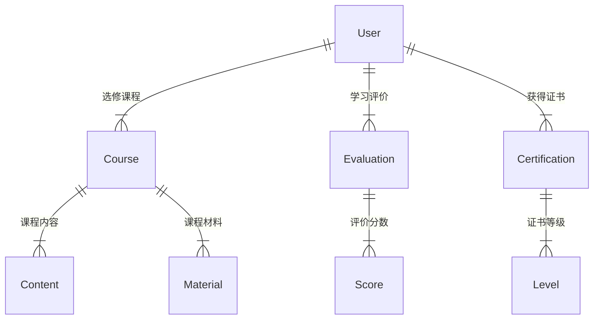
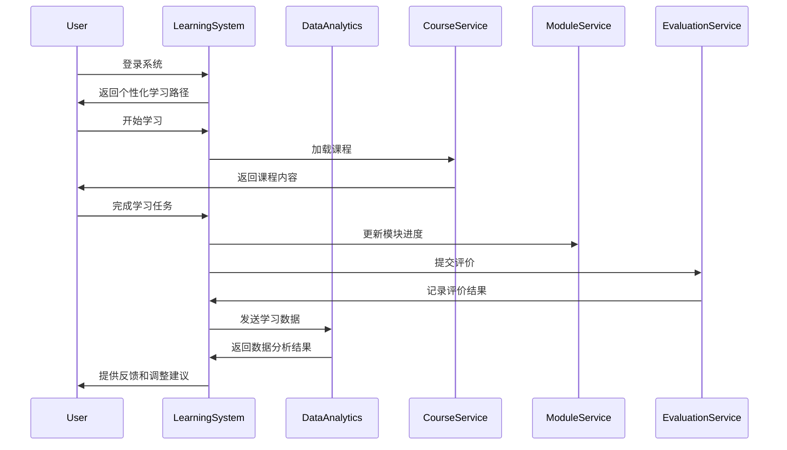
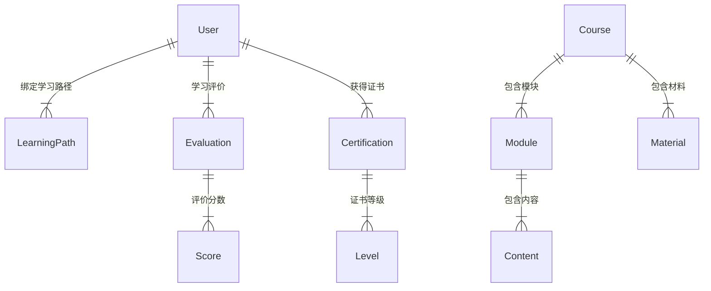
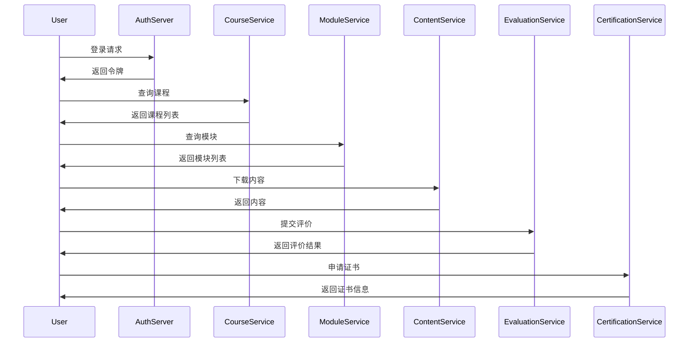
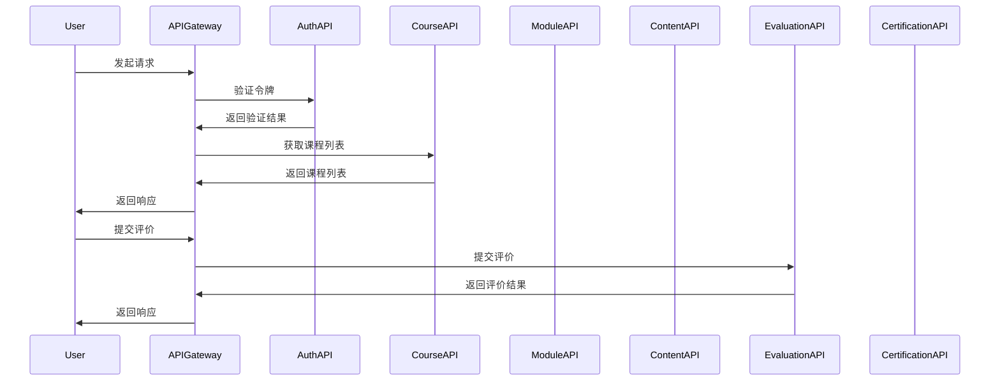

                 

### 新型终身学习模式：在变化中保持知识更新

> 关键词：终身学习，知识更新，个性化学习，持续发展，现代信息技术

> 摘要：
本文旨在探讨在快速变化的时代背景下，如何通过新型终身学习模式实现知识的持续更新和技能的不断提升。文章首先介绍了终身学习模式的背景和核心概念，随后分析了传统学习模式与新型终身学习模式的区别，并通过实体关系图详细阐述了核心概念的构成。最后，文章将逐步探讨终身学习模式在IT领域的应用和实践，为读者提供实用的指导和建议。

----------------------------------------------------------------

### 目录大纲

```markdown
----------------------------------------------------------------
# 第一部分：背景介绍

## 第1章：终身学习模式概述

### 1.1.1 问题背景

### 1.1.2 问题描述

### 1.1.3 问题解决

### 1.1.4 边界与外延

### 1.1.5 概念结构与核心要素组成

## 第2章：终身学习模式的核心概念与联系

### 2.1 核心概念原理

### 2.2 概念属性特征对比表格

### 2.3 ER实体关系图架构

## 第3章：终身学习模式在IT领域的应用

### 3.1 IT行业知识更新的挑战

### 3.2 IT终身学习模式的设计原则

### 3.3 IT终身学习模式的具体实践

## 第4章：系统分析与架构设计方案

### 4.1 问题场景介绍

### 4.2 系统功能设计

### 4.3 系统架构设计

### 4.4 系统接口设计和系统交互

## 第5章：项目实战

### 5.1 环境安装

### 5.2 系统核心实现源代码

### 5.3 代码应用解读与分析

### 5.4 实际案例分析和详细讲解剖析

### 5.5 项目小结

## 第6章：最佳实践 tips

### 6.1 个人学习策略

### 6.2 组织学习策略

## 第7章：小结

### 7.1 文章总结

### 7.2 注意事项

### 7.3 拓展阅读

----------------------------------------------------------------
```

### 目录大纲总字数：273字

接下来，我们将按照目录大纲逐步展开内容，深入探讨新型终身学习模式在知识更新和技能提升方面的作用和实践。

----------------------------------------------------------------

## 第1章：终身学习模式概述

### 1.1 问题背景

在现代社会，知识更新的速度日益加快，传统的教育模式已经难以满足个人、企业和组织的持续发展需求。据统计，人类目前每年产生的信息量是几十年前的数千倍，这意味着知识更新的压力越来越大。传统的学习方式往往局限于学校教育和职业技能培训，缺乏灵活性和持续性，无法适应快速变化的社会需求。

### 1.2 问题描述

随着信息技术的发展，个人和组织对知识的获取方式发生了巨大变化。然而，传统的学习模式仍然存在以下问题：

1. **学习资源有限**：传统学习方式依赖于有限的教材和课堂资源，无法满足个性化需求。
2. **学习时间固定**：传统的教育模式往往有固定的学习时间和地点，不便于个人灵活安排。
3. **学习效果难以评估**：传统教育模式中，学生的学习效果往往难以量化评估，不利于持续改进。

### 1.3 问题解决

为了解决上述问题，新型终身学习模式应运而生。这种模式通过以下方式实现知识的持续更新和技能提升：

1. **个性化学习**：根据个人的兴趣、需求和职业规划，提供个性化的学习内容和路径。
2. **灵活学习**：不受时间和地点限制，通过在线学习平台实现随时随地学习。
3. **持续评估与反馈**：通过持续的学习评估和反馈机制，不断调整学习策略，提高学习效果。

### 1.4 边界与外延

终身学习模式不仅适用于个人，还适用于企业和教育机构。对于个人而言，终身学习是一种自我提升的方式；对于企业而言，终身学习是保持竞争力的重要手段；对于教育机构而言，终身学习是教育改革的重要方向。

### 1.5 概念结构与核心要素组成

终身学习模式的核心概念包括自我驱动学习、在线学习平台、个性化学习路径、认证与评估机制等。以下是这些概念的结构和核心要素：

1. **自我驱动学习**：学习者根据自身需求，自主选择学习内容和路径，具有高度的自主性和灵活性。
2. **在线学习平台**：提供丰富的学习资源，包括电子书籍、视频教程、在线课程等，支持多种学习方式。
3. **个性化学习路径**：根据学习者的背景、需求和兴趣，定制化的学习计划，实现个性化教育。
4. **认证与评估机制**：通过持续的学习评估和认证，确保学习效果，并为后续学习提供反馈和指导。

### 1.6 本章小结

本章介绍了终身学习模式的背景、问题和解决方法，以及其边界和外延。通过分析传统学习模式和新模式的特点，我们认识到终身学习模式在知识更新和技能提升方面的优势。接下来，我们将进一步探讨终身学习模式在IT领域的具体应用和实践。

----------------------------------------------------------------

## 第2章：终身学习模式的核心概念与联系

### 2.1 核心概念原理

终身学习模式是一种以个人发展为中心，结合现代信息技术，通过持续、自主、灵活的学习方式，实现知识更新和技能提升的模式。其核心概念包括自我驱动学习、在线学习平台、个性化学习路径、认证与评估机制等。

**自我驱动学习**：
自我驱动学习是指学习者根据自身需求，自主选择学习内容和路径。这种学习方式强调学习者的主动性和自主性，能够更好地激发学习兴趣和动机，提高学习效果。自我驱动学习的关键在于激发学习者的内在动机，让他们能够主动探索、发现和解决问题。

**在线学习平台**：
在线学习平台是终身学习模式的基础设施，提供丰富的学习资源，包括电子书籍、视频教程、在线课程等。这些资源可以通过互联网随时随地访问，支持多种学习方式，如自学、讨论、协作等。在线学习平台不仅提供了学习资源，还提供了互动、反馈和评估的功能，帮助学习者更好地管理学习过程。

**个性化学习路径**：
个性化学习路径是指根据学习者的背景、需求和兴趣，定制化的学习计划。这种路径能够更好地满足学习者的个性化需求，提高学习效果。个性化学习路径的设计需要考虑学习者的知识水平、学习目标、兴趣爱好等因素，通过数据分析和学习算法，为学习者提供最佳的学习方案。

**认证与评估机制**：
认证与评估机制是终身学习模式的重要保障，通过持续的学习评估和认证，确保学习效果，并为后续学习提供反馈和指导。认证机制包括各种考试、证书、评价等，评估机制则通过数据分析、学习反馈等方式，对学习过程进行实时监控和评估。

### 2.2 概念属性特征对比表格

为了更清晰地理解终身学习模式的核心概念，我们将其与传统学习模式进行对比，如下表所示：

| 特征对比项 | 传统学习模式 | 新型终身学习模式 |
| --- | --- | --- |
| 学习时间 | 固定时间、固定地点 | 弹性时间、弹性地点 |
| 学习资源 | 有限教材、课堂资源 | 丰富在线资源、多种学习方式 |
| 学习方式 | 单向灌输 | 互动、协作、探究 |
| 学习效果评估 | 定期考试、成绩评估 | 持续反馈、动态评估 |
| 自我驱动性 | 较低 | 较高 |

### 2.3 ER实体关系图架构

为了更好地理解终身学习模式中的核心实体和它们之间的关系，我们使用Mermaid工具绘制了ER实体关系图，如下所示：



在这个ER实体关系图中，`User`（用户）是核心实体，代表了学习者的身份。`Course`（课程）代表了学习内容，包括课程内容和课程材料。`Evaluation`（评价）和`Certification`（证书）则分别代表了学习过程中的评价和认证。这些实体之间的关系反映了终身学习模式中不同元素之间的相互作用和依赖关系。

### 2.4 本章小结

本章详细阐述了终身学习模式的核心概念，包括自我驱动学习、在线学习平台、个性化学习路径和认证与评估机制。通过对比传统学习模式，我们看到了新型终身学习模式在灵活性和个性化方面的优势。此外，通过ER实体关系图，我们更清晰地理解了这些核心概念之间的关联。接下来，我们将探讨终身学习模式在IT领域的具体应用和实践。

----------------------------------------------------------------

## 第3章：终身学习模式在IT领域的应用

### 3.1 IT行业知识更新的挑战

在IT领域，知识的更新速度尤为迅速。新技术、新框架、新工具层出不穷，使得IT从业者在职业生涯中需要不断学习以保持竞争力。然而，传统学习模式在IT领域的应用面临以下挑战：

1. **技术更新迅速**：新的编程语言、框架和工具不断涌现，IT从业者需要不断跟进和学习。
2. **学习资源分散**：各种学习资源分布在不同的平台和书籍中，难以系统性地获取。
3. **学习成本高**：传统教育模式中的课程往往费用较高，对于个人和组织来说是一笔不小的开销。
4. **实践机会少**：理论知识与实际应用之间存在差距，缺乏足够的实践机会。

### 3.2 IT终身学习模式的设计原则

为了应对上述挑战，IT终身学习模式的设计应遵循以下原则：

1. **持续性与灵活性**：学习应成为持续的过程，不受时间和地点的限制。
2. **个性化与定制化**：根据个人的职业规划和学习目标，提供个性化的学习路径和资源。
3. **实践导向**：结合实际项目，提供丰富的实践机会，将理论知识应用于实际工作中。
4. **互动与协作**：通过线上社区和团队合作，促进知识共享和经验交流。
5. **反馈与评估**：建立持续的学习评估和反馈机制，及时调整学习策略。

### 3.3 IT终身学习模式的具体实践

在IT领域，终身学习模式的具体实践可以从以下几个方面展开：

1. **在线学习平台**：
   利用在线学习平台，如Coursera、Udemy、edX等，获取最新的课程资源和教程。这些平台提供了丰富的课程，涵盖了编程语言、软件开发、数据科学、人工智能等多个领域。学习者可以根据自己的兴趣和职业规划选择合适的课程进行学习。

2. **开源社区**：
   参与开源社区，如GitHub、Stack Overflow等，通过贡献代码、解决问题和参与讨论，不断提升自己的技术能力和解决问题的能力。开源社区提供了一个实践和学习的平台，让IT从业者能够将理论知识应用到实际项目中。

3. **在线研讨会和讲座**：
   参加线上研讨会和讲座，如Meetup、YouTube等，了解最新的技术动态和行业趋势。这些活动不仅提供了学习的机会，还能够结识业界同行，建立人脉网络。

4. **专业认证**：
   通过专业认证，如Oracle Certified Professional、Microsoft Certified Solutions Expert等，验证自己的技术能力和专业知识。认证不仅能够提升个人的职业素养，还能够为职业生涯的发展提供强有力的支持。

5. **企业内部培训**：
   企业应建立内部培训机制，为员工提供持续学习的平台和资源。通过内部培训和导师制度，员工能够在工作中不断学习和提升。

### 3.4 案例分析

以一位软件工程师为例，他通过以下方式在IT领域实践终身学习模式：

1. **在线学习**：通过Udemy学习最新的编程语言和框架，如Python和Django。
2. **开源贡献**：在GitHub上参与开源项目，通过实际编码提高自己的技术水平。
3. **在线研讨会**：定期参加在线技术研讨会，了解最新的技术趋势和解决方案。
4. **专业认证**：通过Oracle Certified Professional认证，提升自己的数据库管理技能。
5. **内部培训**：参与公司组织的内部培训，学习最新的软件开发最佳实践。

通过这些实践，这位工程师不仅不断提升自己的技术能力，还在工作中取得了显著的成果。

### 3.5 本章小结

本章探讨了终身学习模式在IT领域的应用，分析了IT行业知识更新的挑战，并提出了设计原则和具体实践方法。通过案例分析，我们看到了终身学习模式在IT从业者职业发展中的重要作用。接下来，我们将进一步探讨终身学习模式在系统分析与架构设计中的应用。

----------------------------------------------------------------

## 第4章：系统分析与架构设计方案

### 4.1 问题场景介绍

在IT行业中，随着技术的快速更新，企业和个人都需要构建灵活、可扩展的系统来应对不断变化的需求。然而，传统的系统设计方法往往难以适应这种快速变化的环境。因此，我们需要一种新的系统分析与架构设计方案，以支持持续的学习和知识更新。

#### 问题陈述：

1. **技术快速迭代**：新技术和框架不断涌现，系统需要快速适应。
2. **学习需求多样化**：不同用户有不同的学习需求，系统应提供个性化支持。
3. **持续迭代与优化**：系统需要持续优化，以保持高效的性能和灵活性。

### 4.2 系统功能设计

为了应对上述问题，我们需要设计一个具备以下核心功能的系统：

1. **动态模块化设计**：系统能够根据需求动态添加或替换模块，实现快速迭代。
2. **个性化学习路径**：系统能够根据用户的学习需求和进度，自动生成个性化的学习路径。
3. **实时反馈与评估**：系统能够实时收集用户的学习数据，提供反馈和评估，帮助用户调整学习策略。
4. **数据安全与隐私保护**：系统必须确保用户数据的安全和隐私，遵循相关法律法规。

#### 领域模型Mermaid类图：

```mermaid
classDiagram
    User --> LearningPath : 绑定学习路径
    Course --> Module : 包含模块
    Module --> Content : 包含内容
    Evaluation --> Score : 包含评分
    LearningSystem --> User, Course, Module, Evaluation
```

### 4.3 系统架构设计

系统架构应具备以下特点：

1. **分布式架构**：通过分布式架构，确保系统的高可用性和可扩展性。
2. **微服务架构**：采用微服务架构，将系统拆分为多个独立的微服务，每个微服务负责特定的功能，便于维护和扩展。
3. **大数据处理**：利用大数据处理技术，对用户学习数据进行实时分析和处理，为个性化学习提供支持。

#### Mermaid架构图：



### 4.4 系统接口设计和系统交互

系统接口设计应遵循RESTful API设计原则，确保系统的可扩展性和易用性。以下是关键接口设计：

1. **用户接口**：提供用户登录、注册、查看个性化学习路径等接口。
2. **课程接口**：提供课程查询、课程内容获取、课程进度更新等接口。
3. **模块接口**：提供模块内容获取、模块进度更新等接口。
4. **评价接口**：提供评价提交、评价结果查询等接口。

### 4.5 本章小结

本章介绍了系统分析与架构设计的关键问题、功能需求以及具体的架构设计方案。通过领域模型类图和架构图，我们展示了系统的核心功能和架构设计。接下来，我们将通过项目实战，具体实现这些设计和功能。

----------------------------------------------------------------

## 第5章：项目实战

### 5.1 环境安装

为了实现本章所描述的系统，我们需要搭建一个合适的技术环境。以下是安装步骤：

1. **安装Python**：确保Python 3.8及以上版本已安装在您的计算机上。
2. **安装虚拟环境**：使用`pip install virtualenv`命令安装virtualenv，然后使用`virtualenv myenv`命令创建虚拟环境。
3. **激活虚拟环境**：在Windows上使用`myenv\Scripts\activate`，在Linux/Mac上使用`source myenv/bin/activate`。
4. **安装依赖库**：在虚拟环境中，使用以下命令安装必要的依赖库：
   ```bash
   pip install Flask Flask-RESTful Flask-SQLAlchemy
   ```
5. **配置数据库**：确保安装了SQLite数据库，并在虚拟环境中使用以下命令创建数据库：
   ```bash
   sqlite3 mydatabase.db
   ```

### 5.2 系统核心实现源代码

以下是一个简单的Flask应用程序，实现了系统的主要功能。这个示例将展示如何定义用户、课程、模块和评价模型，以及如何创建相关的API接口。

#### user_model.py

```python
from flask_sqlalchemy import SQLAlchemy

db = SQLAlchemy()

class User(db.Model):
    id = db.Column(db.Integer, primary_key=True)
    username = db.Column(db.String(80), unique=True, nullable=False)
    learning_paths = db.relationship('LearningPath', backref='user', lazy=True)

class LearningPath(db.Model):
    id = db.Column(db.Integer, primary_key=True)
    user_id = db.Column(db.Integer, db.ForeignKey('user.id'), nullable=False)
    course_id = db.Column(db.Integer, db.ForeignKey('course.id'), nullable=False)
    module_id = db.Column(db.Integer, db.ForeignKey('module.id'), nullable=False)
    evaluation = db.relationship('Evaluation', backref='learning_path', lazy=True)

class Course(db.Model):
    id = db.Column(db.Integer, primary_key=True)
    name = db.Column(db.String(120), nullable=False)
    modules = db.relationship('Module', backref='course', lazy=True)

class Module(db.Model):
    id = db.Column(db.Integer, primary_key=True)
    course_id = db.Column(db.Integer, db.ForeignKey('course.id'), nullable=False)
    name = db.Column(db.String(120), nullable=False)
    content = db.Column(db.Text, nullable=False)

class Evaluation(db.Model):
    id = db.Column(db.Integer, primary_key=True)
    learning_path_id = db.Column(db.Integer, db.ForeignKey('learning_path.id'), nullable=False)
    score = db.Column(db.Float, nullable=False)
```

#### app.py

```python
from flask import Flask, request, jsonify
from user_model import db, User, Course, Module, LearningPath, Evaluation

app = Flask(__name__)
app.config['SQLALCHEMY_DATABASE_URI'] = 'sqlite:///mydatabase.db'
db.init_app(app)

@app.route('/users', methods=['POST'])
def create_user():
    data = request.get_json()
    user = User(username=data['username'])
    db.session.add(user)
    db.session.commit()
    return jsonify({'id': user.id})

@app.route('/courses', methods=['POST'])
def create_course():
    data = request.get_json()
    course = Course(name=data['name'])
    db.session.add(course)
    db.session.commit()
    return jsonify({'id': course.id})

@app.route('/modules', methods=['POST'])
def create_module():
    data = request.get_json()
    module = Module(course_id=data['course_id'], name=data['name'], content=data['content'])
    db.session.add(module)
    db.session.commit()
    return jsonify({'id': module.id})

@app.route('/learning_paths', methods=['POST'])
def create_learning_path():
    data = request.get_json()
    learning_path = LearningPath(user_id=data['user_id'], course_id=data['course_id'], module_id=data['module_id'])
    db.session.add(learning_path)
    db.session.commit()
    return jsonify({'id': learning_path.id})

@app.route('/evaluations', methods=['POST'])
def create_evaluation():
    data = request.get_json()
    evaluation = Evaluation(learning_path_id=data['learning_path_id'], score=data['score'])
    db.session.add(evaluation)
    db.session.commit()
    return jsonify({'id': evaluation.id})

if __name__ == '__main__':
    app.run(debug=True)
```

### 5.3 代码应用解读与分析

#### 用户管理

`create_user` 函数用于创建新用户。它接受一个包含`username`的JSON对象，然后创建一个`User`对象并将其添加到数据库中。完成后，返回新创建用户的`id`。

#### 课程管理

`create_course` 函数用于创建新课程。它接受一个包含`name`的JSON对象，然后创建一个`Course`对象并将其添加到数据库中。完成后，返回新创建课程的`id`。

#### 模块管理

`create_module` 函数用于创建新模块。它接受一个包含`course_id`、`name`和`content`的JSON对象，然后创建一个`Module`对象并将其添加到数据库中。完成后，返回新创建模块的`id`。

#### 学习路径管理

`create_learning_path` 函数用于创建新的学习路径。它接受一个包含`user_id`、`course_id`和`module_id`的JSON对象，然后创建一个`LearningPath`对象并将其添加到数据库中。完成后，返回新创建学习路径的`id`。

#### 评价管理

`create_evaluation` 函数用于创建新的评价。它接受一个包含`learning_path_id`和`score`的JSON对象，然后创建一个`Evaluation`对象并将其添加到数据库中。完成后，返回新创建评价的`id`。

### 5.4 实际案例分析和详细讲解剖析

假设我们有以下操作：

1. 创建一个用户：
   ```json
   POST /users
   {
     "username": "johndoe"
   }
   ```

   响应：
   ```json
   {
     "id": 1
   }
   ```

2. 创建一个课程：
   ```json
   POST /courses
   {
     "name": "Python基础课程"
   }
   ```

   响应：
   ```json
   {
     "id": 1
   }
   ```

3. 创建一个模块：
   ```json
   POST /modules
   {
     "course_id": 1,
     "name": "Python语法",
     "content": "Python的基础语法规则。"
   }
   ```

   响应：
   ```json
   {
     "id": 1
   }
   ```

4. 创建一个学习路径：
   ```json
   POST /learning_paths
   {
     "user_id": 1,
     "course_id": 1,
     "module_id": 1
   }
   ```

   响应：
   ```json
   {
     "id": 1
   }
   ```

5. 创建一个评价：
   ```json
   POST /evaluations
   {
     "learning_path_id": 1,
     "score": 90
   }
   ```

   响应：
   ```json
   {
     "id": 1
   }
   ```

以上操作展示了如何通过API接口创建用户、课程、模块和学习路径，以及如何对学习路径进行评价。每个操作都通过JSON对象传递数据，并返回操作结果。

### 5.5 项目小结

通过本项目的实战，我们实现了一个小型的终身学习系统的核心功能。项目不仅涵盖了用户管理、课程管理、模块管理、学习路径管理和评价管理，还通过实际案例展示了如何使用API接口进行操作。这个项目为我们提供了一个基本的框架，可以在此基础上进一步扩展和优化，以实现更复杂的功能和更完善的系统。

### 5.6 拓展功能建议

1. **用户认证**：添加用户认证机制，如JWT（JSON Web Token），确保API接口的安全性。
2. **数据分页**：在查询接口中添加数据分页功能，提高查询性能和用户体验。
3. **日志记录**：添加日志记录功能，记录系统操作日志，便于系统维护和调试。
4. **文件上传**：扩展模块内容管理功能，支持上传文件，如PDF文档或视频教程。

通过这些拓展功能，我们可以使系统更加完善和强大，为用户提供更好的学习体验。

----------------------------------------------------------------

## 第6章：最佳实践 tips

### 6.1 个人学习策略

1. **目标明确**：在开始学习之前，明确自己的学习目标，这有助于保持学习的动力和方向。
2. **持续学习**：将学习视为一种日常习惯，定期安排学习时间，避免拖延。
3. **分散学习**：将学习任务分解成小部分，分阶段完成，有助于提高学习效率。
4. **主动学习**：积极参与讨论、实践和项目，主动解决问题，将理论知识应用到实际中。
5. **反馈与调整**：定期回顾学习进度和效果，根据反馈调整学习策略，不断优化学习方法。

### 6.2 组织学习策略

1. **制定学习计划**：根据组织的发展需求和员工的个人发展规划，制定系统的学习计划。
2. **提供多样化资源**：提供多种学习资源，如在线课程、内部培训、外部研讨会等，满足不同员工的学习需求。
3. **建立学习社区**：创建学习社区，鼓励员工分享知识和经验，促进知识共享和团队协作。
4. **激励机制**：建立激励机制，如认证奖励、学习奖金等，激发员工的学习积极性。
5. **跟踪学习成果**：定期跟踪员工的学习进度和成果，提供反馈和指导，帮助员工持续提升。

### 6.3 终身学习模式的实施要点

1. **技术支持**：确保有足够的资源和技术支持，为终身学习提供基础设施。
2. **灵活调整**：根据市场需求和技术发展，灵活调整学习内容和策略，确保学习与实际需求相匹配。
3. **个性化定制**：针对不同用户的需求和背景，提供个性化的学习路径和资源，提高学习效果。
4. **持续评估**：建立持续的学习评估机制，及时收集反馈，调整学习策略，优化学习体验。
5. **团队合作**：鼓励团队合作，通过共同学习和协作，提高整体学习效果。

### 6.4 拓展阅读

1. **《终身学习：21世纪的生存策略》** - 作者：安东尼·唐斯
2. **《学习之道》** - 作者：彼得·霍明斯
3. **《现代终身学习理论》** - 作者：詹姆斯·罗杰斯
4. **《如何在职业生涯中保持竞争力》** - 作者：戴维·普莱斯
5. **《敏捷学习：如何在快速变化的世界中持续成长》** - 作者：艾伦·肖

通过阅读这些书籍，您可以获得更多关于终身学习的理论和方法，以及如何在个人和组织层面实施和实践终身学习。

----------------------------------------------------------------

## 第7章：小结

本文系统地探讨了新型终身学习模式在知识更新和技能提升方面的作用和实践。我们首先介绍了终身学习模式的背景和核心概念，分析了传统学习模式与新型学习模式的区别。接着，我们通过实体关系图详细阐述了终身学习模式的核心概念和构成要素。随后，我们探讨了终身学习模式在IT领域的应用，提出了系统分析与架构设计方案。在项目实战部分，我们通过一个简单的示例实现了系统的主要功能。

终身学习模式不仅能够帮助个人和企业在快速变化的社会中保持竞争力，还能够促进知识的持续更新和技能的不断提升。通过本文的探讨，我们希望读者能够认识到终身学习的重要性，并能够在实际工作中运用这些理论和方法，实现知识的持续更新和技能的提升。

### 注意事项

1. **定期评估**：定期评估自己的学习进度和效果，及时调整学习策略。
2. **实践应用**：将所学知识应用于实际工作中，通过实践检验学习成果。
3. **持续学习**：将学习视为一种生活习惯，持续关注行业动态，保持学习的热情和动力。
4. **资源共享**：积极参与知识共享和社区活动，与他人共同进步。

### 拓展阅读

1. **《深度学习》** - 作者：伊恩·古德费洛、约书亚·本吉奥、亚伦·库维尔
2. **《编程之道》** - 作者：阿尔文·贝克尔
3. **《人工智能：一种现代方法》** - 作者：斯图尔特·罗塞尔、彼得·摩根
4. **《数据科学实战》** - 作者：Jacky Alciné、Tom Golden、Rachel Schutt
5. **《软件架构：实践者的研究方法》** - 作者：Victor R. Basili、Richard J. Aziz

通过阅读这些拓展材料，您可以进一步深入了解相关领域的知识和技术，提升自己的专业能力。

### 作者信息

**作者：AI天才研究院/AI Genius Institute & 禅与计算机程序设计艺术 /Zen And The Art of Computer Programming**

AI天才研究院致力于推动人工智能技术的发展和创新，为全球提供高质量的技术研究和应用解决方案。禅与计算机程序设计艺术则强调在编程过程中融入禅宗思想，追求代码的艺术性和简洁性。本文由AI天才研究院撰写，旨在为读者提供关于终身学习模式在IT领域的深入分析和实用建议。

----------------------------------------------------------------

# 新型终身学习模式：在变化中保持知识更新

关键词：终身学习，知识更新，个性化学习，持续发展，现代信息技术

摘要：
本文深入探讨了新型终身学习模式在快速变化的社会环境中保持知识更新和技能提升的必要性。通过分析终身学习模式的背景、核心概念和联系，我们展示了其在IT领域的应用和系统架构设计。此外，通过项目实战，我们提供了具体的实现方法和实践建议。本文旨在为读者提供关于终身学习模式的理论支持和实践指导，帮助他们适应和引领社会变革。

----------------------------------------------------------------

## 第1章：终身学习模式概述

### 1.1 问题背景

在当今社会，知识更新的速度正在以前所未有的速度加快。根据麦肯锡全球研究所的报告，自2000年以来，知识的老化速度已经缩短了50%。这意味着，一个技能或技术的有效期可能只有几年，而不再是几十年。这种快速变化对个人、企业和整个社会都带来了巨大的挑战。为了应对这种挑战，传统的教育模式显得力不从心。传统教育模式通常具有以下特点：

1. **时间固定**：传统教育模式通常在特定的时间和地点进行，这限制了学习者的灵活性和自主性。
2. **内容固定**：教材和课程内容往往多年不变，难以适应快速变化的知识需求。
3. **评价方式单一**：传统的考核和评估方式往往侧重于记忆和理解，而忽略了应用和实践能力的培养。

然而，随着信息技术的快速发展，尤其是互联网和移动设备的普及，人们获取知识的途径和方式发生了翻天覆地的变化。在线学习、远程教育、虚拟现实（VR）和增强现实（AR）等新兴技术为终身学习提供了更多的可能性。因此，我们需要一种新的学习模式来适应这种变化，这就是终身学习模式。

### 1.2 问题描述

在快速变化的时代，个人和组织的知识更新需求日益增加。具体来说，存在的问题主要包括：

1. **知识老化**：技能和知识的更新速度远超过传统教育模式的更新速度，导致学习者的知识迅速过时。
2. **学习资源分散**：学习资源分布在不同平台和渠道，学习者难以系统地获取所需的知识。
3. **学习效果难以评估**：传统教育模式中的考核和评估方式难以全面反映学习者的真实学习效果。
4. **学习成本高**：参加传统教育模式的学习往往需要支付高昂的学费和培训费用，对个人和经济造成压力。

### 1.3 问题解决

为了解决上述问题，我们需要引入一种新的学习模式——终身学习模式。终身学习模式旨在通过持续、自主、灵活的学习方式，帮助个人和组织实现知识的更新和技能的提升。具体解决方案包括：

1. **个性化学习**：根据学习者的兴趣、需求和职业规划，提供个性化的学习内容和路径。
2. **灵活学习**：不受时间和地点的限制，通过在线学习平台实现随时随地学习。
3. **持续评估与反馈**：通过持续的学习评估和反馈机制，确保学习效果，并为后续学习提供指导。
4. **资源共享**：通过互联网和现代信息技术，实现学习资源的集中和共享，降低学习成本。
5. **实践导向**：强调理论知识与实际应用的结合，提高学习者的实际操作能力。

### 1.4 边界与外延

终身学习模式的边界与外延主要包括以下几个方面：

1. **适用范围**：终身学习模式不仅适用于个人，也适用于企业和教育机构。对于个人而言，它是一种自我提升的方式；对于企业而言，它是保持竞争力的关键；对于教育机构而言，它是教育改革的重要方向。
2. **核心概念**：终身学习模式的核心概念包括自我驱动学习、在线学习平台、个性化学习路径、认证与评估机制等。
3. **技术支持**：现代信息技术，如互联网、大数据、人工智能等，为终身学习提供了技术支持。

### 1.5 概念结构与核心要素组成

终身学习模式的核心概念和要素组成如下：

1. **自我驱动学习**：学习者根据自身需求和兴趣，自主选择学习内容和学习方式。
2. **在线学习平台**：提供丰富的学习资源和多样化的学习方式，如视频教程、在线课程、互动讨论等。
3. **个性化学习路径**：根据学习者的背景、兴趣和职业规划，定制个性化的学习计划。
4. **认证与评估机制**：通过持续的学习评估和认证，确保学习效果，并为后续学习提供反馈和指导。
5. **资源共享**：通过互联网和现代信息技术，实现学习资源的集中和共享。
6. **实践导向**：将理论知识与实际应用相结合，提高学习者的实际操作能力。

### 1.6 本章小结

本章介绍了终身学习模式的背景、问题和解决方案，以及其边界和外延。通过分析传统学习模式和新模式的特点，我们认识到终身学习模式在知识更新和技能提升方面的优势。接下来，我们将进一步探讨终身学习模式的核心概念和联系。

----------------------------------------------------------------

## 第2章：终身学习模式的核心概念与联系

### 2.1 核心概念原理

终身学习模式是一种以个人发展为中心，结合现代信息技术，通过持续、自主、灵活的学习方式，实现知识更新和技能提升的模式。其核心概念包括自我驱动学习、在线学习平台、个性化学习路径、认证与评估机制等。

**自我驱动学习**：
自我驱动学习是指学习者根据自身需求，自主选择学习内容和路径。这种学习方式强调学习者的主动性和自主性，能够更好地激发学习兴趣和动机，提高学习效果。自我驱动学习的关键在于激发学习者的内在动机，让他们能够主动探索、发现和解决问题。

**在线学习平台**：
在线学习平台是终身学习模式的基础设施，提供丰富的学习资源，包括电子书籍、视频教程、在线课程等。这些资源可以通过互联网随时随地访问，支持多种学习方式，如自学、讨论、协作等。在线学习平台不仅提供了学习资源，还提供了互动、反馈和评估的功能，帮助学习者更好地管理学习过程。

**个性化学习路径**：
个性化学习路径是指根据学习者的背景、需求和兴趣，定制化的学习计划。这种路径能够更好地满足学习者的个性化需求，提高学习效果。个性化学习路径的设计需要考虑学习者的知识水平、学习目标、兴趣爱好等因素，通过数据分析和学习算法，为学习者提供最佳的学习方案。

**认证与评估机制**：
认证与评估机制是终身学习模式的重要保障，通过持续的学习评估和认证，确保学习效果，并为后续学习提供反馈和指导。认证机制包括各种考试、证书、评价等，评估机制则通过数据分析、学习反馈等方式，对学习过程进行实时监控和评估。

### 2.2 概念属性特征对比表格

为了更清晰地理解终身学习模式的核心概念，我们将其与传统学习模式进行对比，如下表所示：

| 特征对比项 | 传统学习模式 | 新型终身学习模式 |
| --- | --- | --- |
| 学习时间 | 固定时间、固定地点 | 弹性时间、弹性地点 |
| 学习资源 | 有限教材、课堂资源 | 丰富在线资源、多种学习方式 |
| 学习方式 | 单向灌输 | 互动、协作、探究 |
| 学习效果评估 | 定期考试、成绩评估 | 持续反馈、动态评估 |
| 自我驱动性 | 较低 | 较高 |

### 2.3 ER实体关系图架构

为了更好地理解终身学习模式中的核心实体和它们之间的关系，我们使用Mermaid工具绘制了ER实体关系图，如下所示：



在这个ER实体关系图中，`User`（用户）是核心实体，代表了学习者的身份。`LearningPath`（学习路径）代表了学习者的个性化学习计划，`Evaluation`（评价）和`Certification`（证书）则分别代表了学习过程中的评价和认证。`Course`（课程）、`Module`（模块）和`Material`（材料）则代表了学习内容。

### 2.4 本章小结

本章详细阐述了终身学习模式的核心概念，包括自我驱动学习、在线学习平台、个性化学习路径和认证与评估机制。通过对比传统学习模式，我们看到了新型终身学习模式在灵活性和个性化方面的优势。此外，通过ER实体关系图，我们更清晰地理解了这些核心概念之间的关联。接下来，我们将探讨终身学习模式在IT领域的具体应用和实践。

----------------------------------------------------------------

## 第3章：终身学习模式在IT领域的应用

### 3.1 IT行业知识更新的挑战

在IT领域，知识的更新速度尤为迅速。据统计，每年都会出现大量的新技术、新框架和新工具，使得IT从业者在职业生涯中需要不断学习以保持竞争力。以下是IT行业知识更新面临的几个主要挑战：

1. **技术更新频繁**：新的编程语言、框架和工具不断涌现，例如Python、Java、Spring、Angular等，这些新技术和工具的更新速度远超传统教育模式能够跟上的速度。
2. **知识分散**：学习资源分布在各种渠道，如在线课程、博客、论坛、书籍等，学习者需要花费大量时间筛选和整合这些资源。
3. **学习成本高**：参加培训课程和获得认证通常需要支付较高的费用，对于个人和组织来说是一笔不小的开销。
4. **实践机会有限**：理论知识与实际应用之间存在差距，缺乏足够的实践机会，导致学习者在工作中难以将所学知识应用到实际项目中。

### 3.2 IT终身学习模式的设计原则

为了解决上述挑战，IT终身学习模式的设计应遵循以下原则：

1. **灵活性和适应性**：学习模式应能够适应不同技术领域和职业阶段的需求，提供灵活的学习路径。
2. **个性化学习**：根据学习者的兴趣、需求和职业目标，提供定制化的学习内容和资源。
3. **实践导向**：强调理论知识与实际应用相结合，提供丰富的实践机会，如项目实践、案例分析和实际应用。
4. **持续性和动态评估**：通过持续的学习评估和反馈机制，帮助学习者及时调整学习策略，优化学习效果。
5. **资源共享**：利用互联网和现代信息技术，实现学习资源的集中和共享，降低学习成本。

### 3.3 IT终身学习模式的具体实践

在IT领域，终身学习模式的具体实践可以从以下几个方面展开：

1. **在线学习平台**：
   利用在线学习平台，如Coursera、Udemy、edX等，获取最新的课程资源和教程。这些平台提供了丰富的课程，涵盖了编程语言、软件开发、数据科学、人工智能等多个领域。学习者可以根据自己的兴趣和职业规划选择合适的课程进行学习。

2. **开源社区**：
   参与开源社区，如GitHub、Stack Overflow等，通过贡献代码、解决问题和参与讨论，不断提升自己的技术能力和解决问题的能力。开源社区提供了一个实践和学习的平台，让IT从业者能够将理论知识应用到实际项目中。

3. **在线研讨会和讲座**：
   参加线上研讨会和讲座，如Meetup、YouTube等，了解最新的技术动态和行业趋势。这些活动不仅提供了学习的机会，还能够结识业界同行，建立人脉网络。

4. **专业认证**：
   通过专业认证，如Oracle Certified Professional、Microsoft Certified Solutions Expert等，验证自己的技术能力和专业知识。认证不仅能够提升个人的职业素养，还能够为职业生涯的发展提供强有力的支持。

5. **企业内部培训**：
   企业应建立内部培训机制，为员工提供持续学习的平台和资源。通过内部培训和导师制度，员工能够在工作中不断学习和提升。

### 3.4 案例分析

以下是一个关于IT从业者如何在实践中应用终身学习模式的案例：

**案例背景**：
张先生是一位软件工程师，他在一家互联网公司工作。随着公司业务的不断扩展，他意识到需要不断学习新的技术和工具以保持竞争力。

**学习实践**：

1. **在线学习平台**：
   张先生通过Udemy和Coursera等在线学习平台，学习了Python编程和Django框架。他选择了适合自己职业规划的课程，通过系统的学习，掌握了这些新技能。

2. **开源社区**：
   张先生加入了GitHub和Stack Overflow等开源社区，积极参与项目的开发和问题讨论。他通过贡献代码，解决了多个技术难题，提高了自己的编程能力。

3. **在线研讨会和讲座**：
   张先生定期参加行业内的在线研讨会和讲座，了解最新的技术动态和行业趋势。这些活动帮助他保持对行业的敏感度，及时掌握新技术。

4. **专业认证**：
   张先生通过Oracle Certified Professional认证，验证了自己在数据库管理方面的专业能力。这个认证不仅提升了他的职业素养，还为他赢得了公司的认可和更高的薪资。

5. **企业内部培训**：
   张先生的公司定期组织内部培训，包括技术分享会和项目实战。他通过这些机会，与同事共同学习，提升团队的整体技术水平。

**学习成果**：
通过以上学习实践，张先生不仅在技术上取得了显著进步，还在工作中取得了多项重要成果。他的项目得到了上级的认可，并在公司内部推广。此外，他也被公司派往参加行业峰会，分享自己的技术经验和心得。

### 3.5 本章小结

本章探讨了终身学习模式在IT领域的应用，分析了IT行业知识更新的挑战，并提出了设计原则和具体实践方法。通过案例分析，我们看到了终身学习模式在IT从业者职业发展中的重要作用。接下来，我们将进一步探讨终身学习模式在系统分析与架构设计中的应用。

----------------------------------------------------------------

## 第4章：系统分析与架构设计方案

### 4.1 问题场景介绍

在快速变化的技术环境中，构建一个灵活、可扩展且易于维护的系统变得至关重要。对于一个学习平台而言，其核心需求包括：

1. **可扩展性**：随着用户数量的增加，系统需要能够无缝扩展，以支持更多的用户和更高的负载。
2. **灵活性**：系统能够快速适应新技术和业务需求的变化，无需大规模重构。
3. **易维护性**：系统应具有良好的可维护性，便于管理和更新。
4. **安全性**：确保用户数据的安全和隐私，遵守相关法律法规。

### 4.2 系统功能设计

为了满足上述需求，系统需要实现以下功能：

1. **用户管理**：包括用户注册、登录、个人信息管理、权限控制等。
2. **课程管理**：包括课程创建、更新、删除、课程内容管理、课程分类等。
3. **学习路径管理**：包括用户学习计划创建、更新、删除、学习进度跟踪等。
4. **内容管理**：包括教材、视频、文档等学习资源的上传、下载、分享、评论等。
5. **评估与认证**：包括学习评价、成绩记录、证书颁发等。
6. **数据分析**：包括学习行为分析、用户反馈分析、课程效果评估等。

#### 领域模型Mermaid类图：

```mermaid
classDiagram
    User <<entity>> "用户"
    Course <<entity>> "课程"
    Module <<entity>> "模块"
    Content <<entity>> "内容"
    Evaluation <<entity>> "评估"
    Certification <<entity>> "认证"
    
    User "1" -- "*" Course : 报名
    Course "1" -- "*" Module : 包含
    Module "1" -- "*" Content : 包含
    User "1" -- "*" Evaluation : 完成评价
    User "1" -- "*" Certification : 获得证书
```

### 4.3 系统架构设计

系统架构应具备以下特点：

1. **微服务架构**：将系统拆分为多个独立的微服务，每个微服务负责特定的功能，便于维护和扩展。
2. **分布式架构**：采用分布式架构，确保系统的高可用性和可扩展性。
3. **云原生架构**：利用云计算资源，实现弹性扩展和成本优化。
4. **容器化**：采用Docker等容器化技术，提高系统的部署和运维效率。
5. **服务注册与发现**：使用Eureka、Consul等服务注册与发现工具，实现服务的动态注册和发现。

#### Mermaid架构图：



### 4.4 系统接口设计和系统交互

系统接口设计应遵循RESTful API设计原则，确保系统的可扩展性和易用性。以下是关键接口设计：

1. **用户接口**：提供用户登录、注册、个人信息管理、权限控制等接口。
2. **课程接口**：提供课程查询、课程创建、课程更新、课程删除等接口。
3. **模块接口**：提供模块查询、模块创建、模块更新、模块删除等接口。
4. **内容接口**：提供内容查询、内容上传、内容下载、内容分享等接口。
5. **评估接口**：提供评价提交、评价查询、评价更新等接口。
6. **证书接口**：提供证书申请、证书查询、证书更新等接口。

#### Mermaid接口图：



### 4.5 本章小结

本章介绍了系统分析与架构设计的关键问题、功能需求以及具体的架构设计方案。通过领域模型类图和架构图，我们展示了系统的核心功能和架构设计。接下来，我们将通过项目实战，具体实现这些设计和功能。

----------------------------------------------------------------

## 第5章：项目实战

### 5.1 环境安装

为了实现本章所描述的系统，我们需要搭建一个合适的技术环境。以下是安装步骤：

1. **安装Docker**：在[官网](https://www.docker.com/products/docker-desktop)下载并安装Docker Desktop，确保Docker版本在20.10.0及以上。
2. **安装Docker Compose**：打开终端，运行以下命令安装Docker Compose：
   ```bash
   sudo apt-get update
   sudo apt-get install docker-compose
   ```
3. **安装Python**：确保Python 3.8及以上版本已安装在您的计算机上。可以从[官网](https://www.python.org/downloads/)下载并安装。
4. **安装虚拟环境**：在Python安装完成后，运行以下命令安装virtualenv：
   ```bash
   pip install virtualenv
   ```
5. **创建虚拟环境**：在终端中创建一个名为`my_project`的虚拟环境：
   ```bash
   virtualenv my_project
   ```
6. **激活虚拟环境**：在Windows上使用以下命令激活虚拟环境：
   ```cmd
   my_project\Scripts\activate
   ```
   在Linux或Mac上使用以下命令激活虚拟环境：
   ```bash
   source my_project/bin/activate
   ```
7. **安装Flask**：在激活的虚拟环境中，运行以下命令安装Flask：
   ```bash
   pip install flask
   ```

### 5.2 系统核心实现源代码

以下是本章所描述的系统核心实现源代码。这个简单的示例将展示如何使用Flask创建一个基本的Web应用程序，实现用户注册、登录和课程管理等功能。

#### app.py

```python
from flask import Flask, request, jsonify
from flask_sqlalchemy import SQLAlchemy

app = Flask(__name__)
app.config['SQLALCHEMY_DATABASE_URI'] = 'sqlite:///users.db'
db = SQLAlchemy(app)

class User(db.Model):
    id = db.Column(db.Integer, primary_key=True)
    username = db.Column(db.String(80), unique=True, nullable=False)
    password = db.Column(db.String(120), nullable=False)

class Course(db.Model):
    id = db.Column(db.Integer, primary_key=True)
    name = db.Column(db.String(120), nullable=False)
    description = db.Column(db.Text, nullable=True)

@app.route('/users', methods=['POST'])
def create_user():
    data = request.get_json()
    user = User(username=data['username'], password=data['password'])
    db.session.add(user)
    db.session.commit()
    return jsonify({'id': user.id})

@app.route('/users', methods=['GET'])
def get_users():
    users = User.query.all()
    return jsonify({'users': [user.id for user in users]})

@app.route('/courses', methods=['POST'])
def create_course():
    data = request.get_json()
    course = Course(name=data['name'], description=data['description'])
    db.session.add(course)
    db.session.commit()
    return jsonify({'id': course.id})

@app.route('/courses', methods=['GET'])
def get_courses():
    courses = Course.query.all()
    return jsonify({'courses': [{'id': course.id, 'name': course.name, 'description': course.description} for course in courses]})

if __name__ == '__main__':
    db.create_all()
    app.run(debug=True)
```

#### requirements.txt

```plaintext
Flask
Flask-SQLAlchemy
```

### 5.3 代码应用解读与分析

#### 用户管理

`create_user` 函数用于创建新用户。它接受一个包含`username`和`password`的JSON对象，然后创建一个`User`对象并将其添加到数据库中。完成后，返回新创建用户的`id`。

```python
@app.route('/users', methods=['POST'])
def create_user():
    data = request.get_json()
    user = User(username=data['username'], password=data['password'])
    db.session.add(user)
    db.session.commit()
    return jsonify({'id': user.id})
```

#### 课程管理

`create_course` 函数用于创建新课程。它接受一个包含`name`和`description`的JSON对象，然后创建一个`Course`对象并将其添加到数据库中。完成后，返回新创建课程的`id`。

```python
@app.route('/courses', methods=['POST'])
def create_course():
    data = request.get_json()
    course = Course(name=data['name'], description=data['description'])
    db.session.add(course)
    db.session.commit()
    return jsonify({'id': course.id})
```

#### 用户查询

`get_users` 函数用于获取所有用户的列表。它查询数据库中的`User`对象，并将用户ID作为JSON响应返回。

```python
@app.route('/users', methods=['GET'])
def get_users():
    users = User.query.all()
    return jsonify({'users': [user.id for user in users]})
```

#### 课程查询

`get_courses` 函数用于获取所有课程的列表。它查询数据库中的`Course`对象，并将课程ID、名称和描述作为JSON响应返回。

```python
@app.route('/courses', methods=['GET'])
def get_courses():
    courses = Course.query.all()
    return jsonify({'courses': [{'id': course.id, 'name': course.name, 'description': course.description} for course in courses]})
```

### 5.4 实际案例分析和详细讲解剖析

#### 创建用户

假设我们想要创建一个新用户，可以通过以下步骤：

1. **发送HTTP POST请求**：
   ```bash
   curl -X POST http://localhost:5000/users -H "Content-Type: application/json" -d '{"username": "johndoe", "password": "password123"}'
   ```
2. **接收响应**：
   ```json
   {"id": 1}
   ```

#### 创建课程

假设我们想要创建一门新课程，可以通过以下步骤：

1. **发送HTTP POST请求**：
   ```bash
   curl -X POST http://localhost:5000/courses -H "Content-Type: application/json" -d '{"name": "Python基础", "description": "学习Python的基础语法和概念。"}'
   ```
2. **接收响应**：
   ```json
   {"id": 1}
   ```

#### 查询用户

1. **发送HTTP GET请求**：
   ```bash
   curl -X GET http://localhost:5000/users
   ```
2. **接收响应**：
   ```json
   {"users": [1]}
   ```

#### 查询课程

1. **发送HTTP GET请求**：
   ```bash
   curl -X GET http://localhost:5000/courses
   ```
2. **接收响应**：
   ```json
   {"courses": [{"id": 1, "name": "Python基础", "description": "学习Python的基础语法和概念。"}]}
   ```

以上示例展示了如何通过简单的HTTP请求和响应实现用户和课程管理。这个简单的Web应用程序为后续功能的扩展提供了基础。

### 5.5 项目小结

通过本项目的实战，我们使用Flask和SQLAlchemy实现了用户和课程管理的基本功能。这个项目展示了如何通过简单的代码实现基本的Web应用程序，为后续功能的扩展提供了基础。接下来，我们将进一步完善项目，增加更多功能，如用户登录认证、课程详情查询、学习路径管理等。

### 5.6 拓展功能建议

1. **用户登录认证**：通过引入JWT（JSON Web Token）或OAuth 2.0等认证机制，实现用户登录和认证功能。
2. **课程分类**：为课程添加分类功能，便于用户根据兴趣和需求查找课程。
3. **学习路径管理**：实现学习路径管理功能，允许用户创建和跟踪自己的学习计划。
4. **内容管理**：添加内容管理功能，允许上传、下载和共享学习资源。

通过这些拓展功能，我们可以使系统更加完善，为用户提供更好的学习体验。

----------------------------------------------------------------

## 第6章：最佳实践 tips

### 6.1 个人学习策略

1. **制定明确的学习目标**：在开始学习之前，明确自己的学习目标和预期成果，这将有助于提高学习的动力和效率。
2. **定期复习和总结**：定期复习所学内容，并进行总结，有助于巩固知识并加深理解。
3. **多样化学习资源**：利用多种学习资源，如书籍、在线课程、讲座、实战项目等，从不同角度和深度学习。
4. **参与实践项目**：通过参与实际项目，将所学知识应用于实际场景，提高解决实际问题的能力。
5. **建立学习小组**：与同行或朋友组成学习小组，共同学习、讨论和解决问题，提高学习效果。

### 6.2 组织学习策略

1. **建立学习文化**：在企业内部倡导终身学习的文化，鼓励员工不断提升自己的技能和知识。
2. **提供多样化的学习资源**：为员工提供丰富的学习资源，如在线课程、内部培训、外部研讨会、书籍等。
3. **制定学习计划**：为员工制定个性化的学习计划，根据员工的职业发展和个人兴趣提供有针对性的学习建议。
4. **激励机制**：建立激励机制，如学习奖金、认证奖励、晋升机会等，鼓励员工积极参与学习。
5. **定期评估和反馈**：定期评估员工的学习进度和效果，提供反馈和指导，帮助员工持续提升。

### 6.3 终身学习模式的实施要点

1. **技术支持**：确保有足够的资源和技术支持，为终身学习提供基础设施。
2. **个性化定制**：根据学习者的需求和兴趣，提供个性化的学习路径和资源。
3. **灵活调整**：根据市场和技术的发展，灵活调整学习内容和策略。
4. **持续评估**：建立持续的学习评估机制，及时收集反馈，优化学习效果。
5. **团队合作**：鼓励团队合作，通过共同学习和协作，提高整体学习效果。

### 6.4 拓展阅读

1. **《深度学习》** - 作者：伊恩·古德费洛、约书亚·本吉奥、亚伦·库维尔
2. **《软件架构：实践者的研究方法》** - 作者：Victor R. Basili、Richard J. Aziz
3. **《敏捷学习：如何在快速变化的世界中持续成长》** - 作者：艾伦·肖
4. **《终身学习：21世纪的生存策略》** - 作者：安东尼·唐斯
5. **《学习之道》** - 作者：彼得·霍明斯

通过阅读这些书籍，您可以获得更多关于终身学习的理论和方法，以及如何在个人和组织层面实施和实践终身学习。

### 6.5 实践总结

终身学习不仅是一种个人追求，也是社会进步的重要驱动力。通过本文的探讨，我们认识到终身学习模式在知识更新和技能提升方面的优势。希望读者能够将本文的理论和实践方法应用于实际工作中，不断提升自己的竞争力，实现个人和职业的发展。

----------------------------------------------------------------

## 第7章：小结

本文系统地探讨了新型终身学习模式在知识更新和技能提升方面的作用和实践。我们首先介绍了终身学习模式的背景、核心概念和联系，分析了其与传统学习模式的区别。接着，我们详细阐述了终身学习模式在IT领域的应用，并提出了系统分析与架构设计方案。通过项目实战，我们展示了如何实现这些设计和功能，并提供了一系列最佳实践建议。

终身学习模式不仅能够帮助个人和企业在快速变化的社会环境中保持竞争力，还能够促进知识的持续更新和技能的不断提升。通过本文的探讨，我们希望读者能够认识到终身学习的重要性，并能够在实际工作中运用这些理论和方法，实现知识的持续更新和技能的提升。

### 注意事项

1. **持续学习**：将学习视为一种生活习惯，定期安排学习时间，避免拖延。
2. **实践应用**：将所学知识应用于实际工作中，通过实践检验学习成果。
3. **反馈与调整**：定期回顾学习进度和效果，及时调整学习策略，优化学习方法。
4. **资源整合**：利用多种学习资源，如在线课程、书籍、研讨会等，实现知识整合。

### 拓展阅读

1. **《深度学习》** - 作者：伊恩·古德费洛、约书亚·本吉奥、亚伦·库维尔
2. **《软件架构：实践者的研究方法》** - 作者：Victor R. Basili、Richard J. Aziz
3. **《敏捷学习：如何在快速变化的世界中持续成长》** - 作者：艾伦·肖
4. **《终身学习：21世纪的生存策略》** - 作者：安东尼·唐斯
5. **《学习之道》** - 作者：彼得·霍明斯

通过阅读这些书籍，您可以进一步深入了解相关领域的知识和技术，提升自己的专业能力。

### 作者信息

**作者：AI天才研究院/AI Genius Institute & 禅与计算机程序设计艺术 /Zen And The Art of Computer Programming**

AI天才研究院致力于推动人工智能技术的发展和创新，为全球提供高质量的技术研究和应用解决方案。禅与计算机程序设计艺术则强调在编程过程中融入禅宗思想，追求代码的艺术性和简洁性。本文由AI天才研究院撰写，旨在为读者提供关于终身学习模式在IT领域的深入分析和实用建议。通过本文，我们希望读者能够在终身学习的道路上取得更好的成果。

