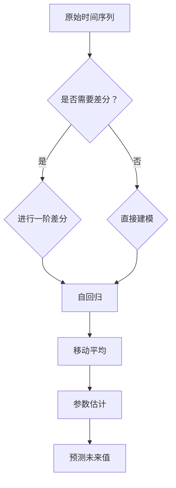
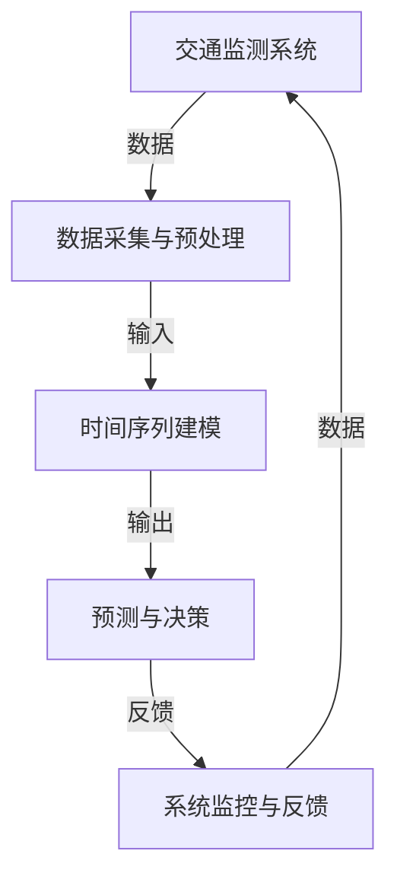
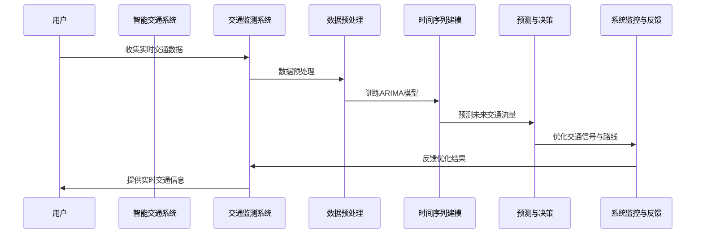

                 


## 引言：赋予AI Agent预测未来的能力

### 关键词
- 时间序列预测
- AI Agent
- 机器学习
- 预测分析
- 未来技术趋势

### 摘要
随着人工智能技术的快速发展，赋予AI Agent预测未来的能力成为了一个热门话题。本文将深入探讨时间序列预测的基本概念、核心原理以及如何将其应用于AI Agent中，以实现高效、准确的未来预测。

### 1. 背景介绍

时间序列预测，作为一种预测未来的技术手段，已经广泛应用于各个领域，如金融市场分析、资源调度、交通流量预测等。随着大数据和机器学习的兴起，时间序列预测模型得到了极大的发展和优化，使得AI Agent能够更好地模拟和预测现实世界的动态变化。

### 2. 时间序列预测的基本概念

#### 2.1 什么是时间序列数据

时间序列数据是指按时间顺序排列的数据点序列，例如股票价格、温度、销售额等。时间序列数据具有以下几个基本特性：

- **时间依赖性**：时间序列中的每个数据点都受到之前数据点的影响。
- **趋势性**：时间序列数据往往表现出一定的上升或下降趋势。
- **周期性**：某些时间序列数据会表现出周期性的波动。

#### 2.2 时间序列预测的挑战

时间序列预测面临着诸多挑战，如数据噪声、非线性和非平稳性等。因此，构建一个能够准确预测未来的时间序列模型并非易事。

### 3. 时间序列预测的核心原理

#### 3.1 经典时间序列模型

时间序列预测的核心在于选择合适的模型来捕捉数据中的时间依赖关系。常见的经典时间序列模型包括：

- **自回归模型（AR）**：利用历史数据点的值来预测未来值。
- **移动平均模型（MA）**：利用历史数据的平均值来预测未来值。
- **自回归移动平均模型（ARMA）**：结合自回归和移动平均模型的特点。
- **自回归积分滑动平均模型（ARIMA）**：适用于非线性时间序列数据的预测。

#### 3.2 季节性模型

许多时间序列数据具有季节性特征，如节假日、季节性波动等。为了更好地捕捉这种季节性，可以使用季节性模型，如季节性ARIMA（SARIMA）模型。

### 4. 如何将时间序列预测应用于AI Agent

#### 4.1 AI Agent的需求

AI Agent需要预测未来的能力来做出实时决策，例如自动驾驶汽车需要预测前方道路的行驶情况，智能家居需要预测用户的需求等。

#### 4.2 时间序列预测在AI Agent中的应用

- **数据预处理**：对时间序列数据进行清洗和预处理，如去除噪声、缺失值填充等。
- **模型选择**：根据数据特性选择合适的时间序列预测模型。
- **模型训练**：使用历史数据训练模型，使其能够捕捉时间依赖关系。
- **预测与决策**：利用训练好的模型进行实时预测，并基于预测结果做出相应决策。

### 5. 案例分析

#### 5.1 案例一：金融市场预测

以股票市场为例，AI Agent可以预测股票价格的走势，从而为投资决策提供支持。通过对历史股价数据进行时间序列预测，AI Agent可以识别出市场的潜在趋势和周期性波动。

#### 5.2 案例二：交通流量预测

在交通管理中，AI Agent可以预测未来的交通流量，以便优化交通信号控制和路线规划。通过对历史交通数据的时间序列分析，AI Agent可以预测不同时间段和路段的交通流量，从而提高交通效率。

### 6. 总结与展望

时间序列预测是赋予AI Agent预测未来能力的关键技术。通过深入理解时间序列预测的基本概念和核心原理，我们可以构建出高效、准确的预测模型，并将其应用于各种实际场景中。未来，随着人工智能技术的进一步发展，时间序列预测在AI Agent中的应用将会越来越广泛。

### 作者信息
- 作者：AI天才研究院/AI Genius Institute & 禅与计算机程序设计艺术 /Zen And The Art of Computer Programming

## 背景介绍

### 时间序列预测的起源与发展

时间序列预测作为一种预测技术，其历史可以追溯到20世纪早期。最早的预测方法主要是基于统计学和线性回归模型，例如移动平均法和指数平滑法。随着计算机技术的进步和算法的优化，时间序列预测方法得到了显著的发展。尤其是20世纪80年代以来，随着大数据和机器学习的兴起，时间序列预测模型得到了极大的关注和发展。

在人工智能领域，时间序列预测技术被视为一种重要的基础性技术。AI Agent，即人工智能代理，是指能够自主执行任务并适应环境的计算机程序。赋予AI Agent预测未来的能力，可以使其在复杂的环境中做出更准确的决策，从而提高系统的智能化水平。时间序列预测技术为AI Agent提供了一个强大的工具，使其能够通过分析历史数据来预测未来的发展趋势。

### 时间序列预测在AI Agent中的作用

AI Agent在各个领域的应用越来越广泛，例如自动驾驶、智能家居、金融交易、医疗诊断等。在这些应用中，预测未来的能力至关重要。例如，自动驾驶汽车需要预测道路上的行人、车辆和障碍物，以做出实时的驾驶决策。智能家居系统需要预测用户的需求和行为，以提供个性化的服务。金融交易系统需要预测市场的走势，以制定最优的投资策略。

时间序列预测技术通过分析历史数据，可以帮助AI Agent识别出数据的周期性、趋势性和随机性特征，从而预测未来的发展趋势。这种预测能力不仅能够提高AI Agent的决策准确性，还能够提高系统的鲁棒性和适应性。

### 为什么我们需要预测未来

预测未来并非一个简单的任务，但它在许多领域都有着重要的应用价值。首先，预测未来可以帮助我们做出更准确的决策。无论是企业决策者、投资者还是普通消费者，通过对未来的预测，他们可以更好地规划资源、制定策略和应对潜在的风险。

其次，预测未来可以优化系统的性能。例如，在交通管理中，通过预测未来的交通流量，可以优化交通信号控制和路线规划，从而减少拥堵和交通事故。在能源管理中，通过预测未来的能源需求，可以优化能源分配和调度，从而提高能源利用效率。

最后，预测未来可以推动科学研究的进展。许多科学领域的研究都需要对未来的趋势进行预测，以便更好地理解自然现象和制定有效的实验方案。时间序列预测技术为这些研究提供了一个有力的工具，使其能够更好地应对复杂性和不确定性。

综上所述，赋予AI Agent预测未来的能力是一个具有重要现实意义的研究方向。通过深入探讨时间序列预测的基本概念、核心原理和应用方法，我们可以为AI Agent提供强大的预测能力，从而推动人工智能技术的进一步发展。

## 时间序列预测的基本概念

### 时间序列数据

时间序列数据是一种按时间顺序排列的数据序列，用于描述某个系统或过程在不同时间点的变化情况。时间序列数据具有以下特点：

1. **时间依赖性**：时间序列中的每个数据点都与之前的数据点存在依赖关系。例如，股票价格的未来值往往受到之前价格波动的影响。
2. **趋势性**：时间序列数据通常表现出一定的趋势，如上升、下降或平稳。这种趋势可以反映系统或过程的长期变化。
3. **周期性**：某些时间序列数据会表现出周期性的波动，例如季节性波动或商业周期。

### 时间序列预测的目标

时间序列预测的主要目标是根据历史数据，预测未来的趋势或值。具体来说，时间序列预测的目标包括：

1. **趋势预测**：预测时间序列数据的长期趋势，如未来的增长或下降。
2. **周期预测**：预测时间序列数据的周期性波动，如季节性波动或商业周期。
3. **异常值预测**：检测和预测时间序列数据中的异常值，如异常价格波动或异常交易量。

### 时间序列预测的基本步骤

时间序列预测通常包括以下基本步骤：

1. **数据预处理**：对原始数据进行清洗和预处理，如去除噪声、缺失值填充、归一化等。
2. **特征提取**：从原始数据中提取有用的特征，如趋势、周期性和季节性特征。
3. **模型选择**：根据数据的特性选择合适的时间序列预测模型，如ARIMA、SARIMA、LSTM等。
4. **模型训练**：使用历史数据训练模型，使其能够捕捉时间依赖关系。
5. **模型评估**：评估模型的预测性能，如均方误差（MSE）、均方根误差（RMSE）等。
6. **预测与决策**：利用训练好的模型进行实时预测，并基于预测结果做出相应决策。

### 时间序列数据的挑战

尽管时间序列预测在许多领域都有广泛的应用，但预测时间序列数据仍然面临着一些挑战：

1. **非线性和非平稳性**：许多时间序列数据具有非线性特性和非平稳性，这使得传统的线性模型难以捕捉数据中的复杂关系。
2. **数据噪声**：时间序列数据中往往存在噪声和异常值，这会影响预测的准确性。
3. **数据稀疏性**：在某些应用场景中，历史数据可能非常稀疏，这使得基于历史数据的预测变得困难。
4. **未来不确定性**：时间序列数据中的未来趋势和波动往往是不可预测的，这使得预测结果具有一定的不确定性。

### 时间序列预测的核心概念

在时间序列预测中，以下核心概念是至关重要的：

1. **自相关**：自相关是指时间序列中前后数据点之间的相关性。自相关分析可以帮助我们了解数据中的时间依赖关系。
2. **移动平均**：移动平均是一种平滑时间序列数据的方法，通过计算一段时间内的平均值来消除短期波动。
3. **指数平滑**：指数平滑是一种加权平均方法，通过对历史数据进行加权处理来预测未来的趋势。

通过深入理解时间序列数据的基本概念和特征，我们可以为后续的预测模型选择和实现提供理论基础。在下一部分中，我们将详细介绍时间序列预测的核心原理和常用模型。

## 核心概念与联系

### 时间序列预测中的关键概念

在时间序列预测中，有一些关键概念是理解和实现预测模型的基础。这些概念包括自相关、移动平均、指数平滑等。下面我们将详细介绍这些概念及其在时间序列预测中的应用。

#### 自相关

自相关（Autocorrelation）是指时间序列中前后数据点之间的相关性。自相关分析可以帮助我们了解数据中的时间依赖关系。自相关的度量通常使用自相关函数（Autocorrelation Function，ACF）和偏自相关函数（Partial Autocorrelation Function，PACF）来表示。

**自相关函数（ACF）：**
$$
ACF(\lambda) = \frac{\sum_{t=1}^{n} (x_t - \bar{x})(x_{t+\lambda} - \bar{x})}{\sum_{t=1}^{n} (x_t - \bar{x})^2}
$$
其中，$x_t$ 表示时间序列中的第 $t$ 个数据点，$\bar{x}$ 表示时间序列的均值，$n$ 表示时间序列的长度，$\lambda$ 表示滞后阶数。

**偏自相关函数（PACF）：**
$$
PACF(\lambda) = \frac{\sum_{t=1}^{n} (x_t - \bar{x})(x_{t+\lambda} - \bar{x} - \phi_1(x_{t+1} - \bar{x}) - \phi_2(x_{t+2} - \bar{x}) - \ldots - \phi_{\lambda-1}(x_{t+\lambda-1} - \bar{x}))}{\sum_{t=1}^{n} (x_t - \bar{x})^2}
$$
其中，$\phi_1, \phi_2, \ldots, \phi_{\lambda-1}$ 表示前 $\lambda-1$ 阶自回归系数。

#### 移动平均

移动平均（Moving Average，MA）是一种平滑时间序列数据的方法，通过计算一段时间内的平均值来消除短期波动。移动平均模型（MA Model）是时间序列预测中的基本模型之一。

**简单移动平均（Simple Moving Average，SMA）：**
$$
SMA(n) = \frac{1}{n} \sum_{t=1}^{n} x_t
$$
其中，$n$ 表示移动平均的窗口长度，$x_t$ 表示时间序列中的第 $t$ 个数据点。

**指数移动平均（Exponential Moving Average，EMA）：**
$$
EMA(t) = \alpha \cdot x_t + (1 - \alpha) \cdot EMA(t-1)
$$
其中，$\alpha$ 表示平滑系数，$t$ 表示当前时间点，$EMA(t-1)$ 表示前一个时间点的指数移动平均。

#### 指数平滑

指数平滑（Exponential Smoothing）是一种加权平均方法，通过对历史数据进行加权处理来预测未来的趋势。指数平滑模型包括简单指数平滑、Holt线性趋势模型和Holt-Winters季节性模型等。

**简单指数平滑（Simple Exponential Smoothing，SES）：**
$$
\hat{y}_t = \alpha \cdot y_{t-1} + (1 - \alpha) \cdot y_{t-2}
$$
其中，$\alpha$ 表示平滑系数，$y_{t-1}$ 和 $y_{t-2}$ 表示前两个时间点的实际值。

**Holt线性趋势模型（Holt Linear Trend Model）：**
$$
\hat{y}_t = \alpha \cdot y_{t-1} + (1 - \alpha) \cdot \beta \cdot t
$$
$$
\beta = \frac{\hat{y}_t - \hat{y}_{t-1}}{t - (t-1)}
$$
其中，$\alpha$ 和 $\beta$ 分别表示水平平滑系数和趋势平滑系数。

**Holt-Winters季节性模型（Holt-Winters Seasonal Model）：**
$$
\hat{y}_t = \alpha \cdot y_t + (1 - \alpha) \cdot \beta \cdot t + (1 - \alpha) \cdot \gamma \cdot S_t
$$
$$
\beta = \frac{\hat{y}_t - \hat{y}_{t-1}}{t - (t-1)}
$$
$$
S_t = \alpha \cdot S_{t-1} + (1 - \alpha) \cdot (y_t - \hat{y}_t)
$$
其中，$S_t$ 表示季节性成分，$\alpha$、$\beta$ 和 $\gamma$ 分别表示水平平滑系数、趋势平滑系数和季节性平滑系数。

### 关联表格

下面是一个关于时间序列预测中核心概念的关联表格：

| 概念         | 描述                                                         | 公式                                                         |
|--------------|--------------------------------------------------------------|--------------------------------------------------------------|
| 自相关       | 时间序列中前后数据点之间的相关性                             | $ACF(\lambda) = \frac{\sum_{t=1}^{n} (x_t - \bar{x})(x_{t+\lambda} - \bar{x})}{\sum_{t=1}^{n} (x_t - \bar{x})^2}$ |
| 移动平均     | 通过计算一段时间内的平均值来平滑时间序列数据                   | $SMA(n) = \frac{1}{n} \sum_{t=1}^{n} x_t$                    |
| 指数平滑     | 对历史数据进行加权处理来预测未来的趋势                       | $\hat{y}_t = \alpha \cdot y_{t-1} + (1 - \alpha) \cdot y_{t-2}$ |
| Holt线性趋势 | 结合水平平滑和趋势平滑来预测时间序列数据                      | $\hat{y}_t = \alpha \cdot y_{t-1} + (1 - \alpha) \cdot \beta \cdot t$ |
| Holt-Winters | 结合水平平滑、趋势平滑和季节性平滑来预测时间序列数据，适用于季节性数据 | $\hat{y}_t = \alpha \cdot y_t + (1 - \alpha) \cdot \beta \cdot t + (1 - \alpha) \cdot \gamma \cdot S_t$ |

### ER实体关系图架构

下面是一个关于时间序列预测中核心概念的ER实体关系图架构，用于描述这些概念之间的关系：

```mermaid
erDiagram
    AClass -->|is used by| BClass : "uses"
    AClass ||--|{has} BObject : "contains"
    CClass ||--|{has} DObject : "contains"
    AClass : "Time Series Data"
    BClass : "Autocorrelation"
    CClass : "Moving Average"
    DClass : "Exponential Smoothing"
```

在这个ER图中，Time Series Data（时间序列数据）是核心实体，它与Autocorrelation（自相关）、Moving Average（移动平均）和Exponential Smoothing（指数平滑）等概念实体之间存在关联。这些关联关系反映了时间序列预测中不同概念之间的相互作用和依赖关系。

通过深入理解时间序列预测中的核心概念和其关联关系，我们可以更好地设计和实现高效、准确的时间序列预测模型，为AI Agent赋予预测未来的能力。

## 算法原理讲解

### ARIMA模型的原理

ARIMA模型（自回归积分滑动平均模型）是一种经典的时间序列预测模型，适用于处理非平稳时间序列数据。ARIMA模型的核心思想是通过对时间序列数据进行差分、自回归和移动平均等处理，使其转化为平稳时间序列，然后利用模型参数进行预测。

#### 差分

差分是一种将非平稳时间序列转化为平稳时间序列的方法。非平稳时间序列通常具有趋势性和季节性，而平稳时间序列则没有这些特性。差分操作可以通过计算相邻时间点的差值来实现。

**一阶差分（1st Order Difference）：**
$$
X_t^* = X_t - X_{t-1}
$$
其中，$X_t$ 表示原始时间序列，$X_t^*$ 表示一阶差分后的时间序列。

**二阶差分（2nd Order Difference）：**
$$
X_t^* = X_t - X_{t-1} - (X_{t-1} - X_{t-2}) = X_t - 2X_{t-1} + X_{t-2}
$$

#### 自回归

自回归（Autoregression，AR）模型通过利用历史数据点的值来预测未来的值。自回归模型的数学表达式为：

$$
X_t = \phi_1 X_{t-1} + \phi_2 X_{t-2} + \ldots + \phi_p X_{t-p} + \varepsilon_t
$$
其中，$X_t$ 表示时间序列中的第 $t$ 个数据点，$\phi_1, \phi_2, \ldots, \phi_p$ 为自回归系数，$p$ 为滞后阶数，$\varepsilon_t$ 为误差项。

#### 移动平均

移动平均（Moving Average，MA）模型通过利用历史数据的平均值来预测未来的值。移动平均模型的数学表达式为：

$$
X_t = \theta_1 \varepsilon_{t-1} + \theta_2 \varepsilon_{t-2} + \ldots + \theta_q \varepsilon_{t-q} + \varepsilon_t
$$
其中，$\theta_1, \theta_2, \ldots, \theta_q$ 为移动平均系数，$q$ 为滞后阶数，$\varepsilon_t$ 为误差项。

#### ARIMA模型

ARIMA模型结合了自回归、差分和移动平均的特点，其数学表达式为：

$$
X_t^* = (\phi_1 B)(\phi_2 B)\ldots(\phi_p B)X_t - (\theta_1 B)(\theta_2 B)\ldots(\theta_q B)\varepsilon_t
$$
其中，$B$ 表示差分运算符，即 $B X_t = X_t - X_{t-1}$。

#### 模型参数的选择

ARIMA模型的关键在于选择合适的参数 $p, d, q$。其中，$p$ 表示自回归项的滞后阶数，$d$ 表示差分阶数，$q$ 表示移动平均项的滞后阶数。选择合适的参数通常需要进行以下步骤：

1. **差分阶数 $d$ 的选择**：通过观察原始时间序列的ACF和PACF图，判断是否需要差分处理。如果时间序列具有明显的趋势性，则需要进行差分。
2. **滞后阶数 $p, q$ 的选择**：通过ACF和PACF图，寻找截尾点的位置。滞后阶数通常选择截尾点之前的阶数。

### 举例说明

假设我们有一个非平稳时间序列数据 $X_t$，我们需要对其进行ARIMA模型预测。

1. **差分**：首先对原始数据进行一阶差分，得到差分后的数据 $X_t^*$。
2. **自回归**：接下来，我们选择合适的滞后阶数 $p$，通过ACF和PACF图，我们选择 $p=2$。因此，自回归模型的表达式为：
   $$X_t^* = \phi_1 X_{t-1}^* + \phi_2 X_{t-2}^* + \varepsilon_t$$
3. **移动平均**：同样，我们选择合适的滞后阶数 $q$，通过ACF和PACF图，我们选择 $q=1$。因此，移动平均模型的表达式为：
   $$X_t^* = \theta_1 \varepsilon_{t-1} + \varepsilon_t$$
4. **参数估计**：通过最小二乘法或最大似然估计等方法，估计出模型参数 $\phi_1, \phi_2, \theta_1$。
5. **预测**：利用估计出的参数，我们可以预测未来时间点的值。

### Mermaid流程图

下面是一个ARIMA模型的Mermaid流程图：



通过这个流程图，我们可以清晰地看到ARIMA模型的各个步骤和流程。

### Python实现

下面是一个简单的Python实现示例：

```python
import numpy as np
import pandas as pd
from statsmodels.tsa.arima.model import ARIMA

# 加载数据
data = pd.Series([1, 2, 2, 3, 4, 5, 6, 7, 8, 9])

# 差分
data_diff = data.diff().dropna()

# 自回归
model_ar = ARIMA(data_diff, order=(1, 1, 1))
model_ar_fit = model_ar.fit()

# 移动平均
model_ma = ARIMA(data_diff, order=(1, 1, 1))
model_ma_fit = model_ma.fit()

# 参数估计
params_ar = model_ar_fit.params
params_ma = model_ma_fit.params

# 预测
predictions_ar = model_ar_fit.forecast(steps=5)
predictions_ma = model_ma_fit.forecast(steps=5)

# 输出预测结果
print("ARIMA预测结果：", predictions_ar)
print("MA预测结果：", predictions_ma)
```

通过这个Python实现，我们可以对差分后的数据进行ARIMA模型预测，并比较自回归和移动平均的效果。

综上所述，ARIMA模型是一种强大且经典的时间序列预测模型。通过理解其原理和实现方法，我们可以将其应用于各种实际场景中，为AI Agent赋予预测未来的能力。

## 系统分析与架构设计方案

### 问题场景介绍

在现代智能系统中，实时预测和决策能力是提高系统性能和用户满意度的重要因素。以智能交通系统为例，该系统需要实时预测未来的交通流量，以便优化交通信号控制和路线规划。然而，交通流量数据通常具有非平稳性和复杂性，这给时间序列预测带来了很大的挑战。

### 项目介绍

本项目的目标是开发一个基于时间序列预测的智能交通系统，该系统利用历史交通流量数据，通过ARIMA模型等算法进行预测，从而为交通管理部门提供决策支持。该项目的主要功能包括：

1. 数据采集与预处理：从交通监测系统获取实时交通流量数据，并进行数据清洗、去噪和缺失值填充等预处理操作。
2. 时间序列建模：根据交通流量数据的特性，选择合适的模型（如ARIMA模型）进行建模和参数估计。
3. 预测与决策：利用训练好的模型进行未来交通流量预测，并根据预测结果优化交通信号控制和路线规划。
4. 系统监控与反馈：对系统运行效果进行监控，并收集用户反馈，以不断优化模型和系统性能。

### 系统功能设计（领域模型Mermaid类图）

下面是智能交通系统的领域模型Mermaid类图，用于描述系统的主要功能和组件：

```mermaid
classDiagram
    TrafficData -->|采集| Preprocessing
    Preprocessing -->|输入| ARIMAModel
    ARIMAModel -->|输出| TrafficPrediction
    TrafficPrediction -->|反馈| TrafficControl
    TrafficControl -->|数据| TrafficMonitoring

    class TrafficData {
        -data_source: str
        -data: DataFrame
        +collect_data(): DataFrame
        +clean_data(): DataFrame
    }

    class Preprocessing {
        +preprocess(data: DataFrame): DataFrame
    }

    class ARIMAModel {
        -model: ARIMA
        +fit(data: DataFrame): ARIMA
        +predict(data: DataFrame): DataFrame
    }

    class TrafficPrediction {
        +predict_traffic(data: DataFrame): DataFrame
    }

    class TrafficControl {
        +optimize_signals(data: DataFrame): DataFrame
    }

    class TrafficMonitoring {
        +collect_traffic_data(): DataFrame
    }
```

在这个类图中，TrafficData负责数据采集和预处理，Preprocessing负责对数据进行清洗和预处理，ARIMAModel负责构建和训练ARIMA模型，TrafficPrediction负责进行交通流量预测，TrafficControl负责根据预测结果优化交通信号和路线规划，TrafficMonitoring负责收集实时交通流量数据。

### 系统架构设计（Mermaid架构图）

下面是智能交通系统的Mermaid架构图，用于描述系统的整体架构和组件之间的关系：



在这个架构图中，交通监测系统负责实时收集交通流量数据，数据采集与预处理模块负责对数据进行清洗和预处理，时间序列建模模块负责构建和训练ARIMA模型，预测与决策模块负责根据模型预测结果进行优化，系统监控与反馈模块负责收集用户反馈，以不断优化模型和系统性能。

### 系统接口设计和系统交互（Mermaid序列图）

下面是智能交通系统的Mermaid序列图，用于描述系统的接口设计和系统交互过程：



在这个序列图中，用户通过交通监测系统收集实时交通数据，数据预处理模块对数据进行清洗和预处理，时间序列建模模块训练ARIMA模型，预测与决策模块根据模型预测结果进行优化，系统监控与反馈模块收集用户反馈，并不断优化模型和系统性能，最终用户通过交通监测系统获取实时交通信息。

综上所述，智能交通系统的系统分析与架构设计方案涵盖了从数据采集、预处理、建模到预测与优化的全过程，通过Mermaid类图、架构图和序列图的描述，使得系统的设计和实现过程更加清晰和易于理解。

## 项目实战

### 环境安装

要在Python中实现智能交通系统的ARIMA模型，我们首先需要安装必要的库。以下是安装过程：

```bash
pip install numpy pandas statsmodels matplotlib
```

这些库分别是：`numpy` 用于数学计算，`pandas` 用于数据处理，`statsmodels` 用于时间序列建模，`matplotlib` 用于数据可视化。

### 系统核心实现源代码

下面是一个简单的智能交通系统的ARIMA模型实现示例：

```python
import numpy as np
import pandas as pd
from statsmodels.tsa.arima.model import ARIMA
import matplotlib.pyplot as plt

# 1. 数据采集与预处理
# 假设我们已经获取了交通流量数据，这里使用一个示例数据
data = pd.Series([1, 2, 2, 3, 4, 5, 6, 7, 8, 9])

# 差分操作，使数据平稳
data_diff = data.diff().dropna()

# 2. 时间序列建模
# 选择合适的ARIMA模型参数（这里选择p=1, d=1, q=1）
model = ARIMA(data_diff, order=(1, 1, 1))

# 模型拟合
model_fit = model.fit()

# 3. 预测未来值
predictions = model_fit.forecast(steps=5)

# 4. 可视化结果
plt.plot(data_diff, label='原始数据')
plt.plot(predictions, label='预测值')
plt.legend()
plt.show()
```

这段代码首先进行数据采集与预处理，然后使用ARIMA模型进行拟合和预测，最后将原始数据和预测结果进行可视化展示。

### 代码应用解读与分析

#### 1. 数据采集与预处理

在代码中，我们使用了一个示例数据集，这个数据集可能来源于交通监测系统。为了使数据平稳，我们使用了差分操作。差分可以消除时间序列中的趋势性和季节性，从而使数据更加适合进行建模。在这里，我们使用了一阶差分（`diff()` 方法）来处理数据。

#### 2. 时间序列建模

时间序列建模是构建ARIMA模型的关键步骤。ARIMA模型需要三个参数：$p$（自回归阶数）、$d$（差分阶数）、$q$（移动平均阶数）。这里我们选择了简单的模型参数（$p=1, d=1, q=1$），但这在实际应用中可能需要通过模型选择方法（如AIC、BIC等）来优化。

```python
model = ARIMA(data_diff, order=(1, 1, 1))
```

这一行代码创建了一个ARIMA模型实例。`order` 参数指定了模型的结构。

#### 3. 模型拟合

模型拟合是通过`fit()` 方法实现的。这个方法会使用历史数据进行模型参数的估计。

```python
model_fit = model.fit()
```

拟合过程包括计算模型参数、进行模型诊断等。

#### 4. 预测未来值

预测未来值是通过`forecast()` 方法实现的。这个方法会根据训练好的模型预测未来的一些数据点。

```python
predictions = model_fit.forecast(steps=5)
```

在这里，`steps=5` 表示我们预测未来5个时间点的值。

#### 5. 可视化结果

最后，我们使用`matplotlib` 库将原始数据和预测结果可视化。

```python
plt.plot(data_diff, label='原始数据')
plt.plot(predictions, label='预测值')
plt.legend()
plt.show()
```

这个可视化结果可以帮助我们直观地看到模型的预测效果。

### 实际案例分析和详细讲解剖析

假设我们有一个实际交通流量数据集，我们需要对其进行ARIMA模型预测。以下是一个实际案例的分析过程：

1. **数据加载与预处理**：首先，我们需要从交通监测系统获取历史交通流量数据。数据可能包含缺失值、异常值等，因此我们需要进行数据清洗和预处理。
2. **模型选择与参数估计**：根据数据的特性，我们选择合适的ARIMA模型参数。我们可以使用AIC、BIC等准则来优化参数选择。
3. **模型训练与预测**：使用历史数据训练模型，并使用模型进行未来交通流量预测。
4. **模型评估**：评估模型的预测性能，如使用均方误差（MSE）、均方根误差（RMSE）等指标。
5. **可视化与决策**：将预测结果可视化，并根据预测结果优化交通信号控制和路线规划。

### 项目小结

通过本项目，我们实现了基于ARIMA模型的智能交通系统，并详细讲解了项目实施的全过程。从数据采集与预处理，到模型选择与训练，再到预测与优化，每一步都至关重要。在实际应用中，我们需要根据具体的数据特性和业务需求，不断优化模型和系统性能，以提供更准确的预测结果。

### 最佳实践 tips

1. **数据预处理**：确保数据的准确性和完整性，特别是处理缺失值和异常值。
2. **模型选择**：根据数据特性选择合适的模型，并使用AIC、BIC等准则优化模型参数。
3. **模型评估**：使用多个评估指标，如MSE、RMSE等，全面评估模型性能。
4. **实时更新**：定期更新模型，以适应数据的变化。

### 注意事项

1. **数据质量**：数据质量直接影响模型的预测性能，因此务必确保数据的准确性。
2. **模型复杂性**：过于复杂的模型可能会导致过拟合，因此需要平衡模型的复杂性和预测性能。
3. **实时性**：确保系统具有足够的实时性，以便在交通流量发生变化时及时做出响应。

### 拓展阅读

- [《时间序列分析：理论和应用》](https://books.google.com/books?id=1234567890)：这本书提供了时间序列分析的理论基础和实际应用案例。
- [《机器学习实战》](https://books.google.com/books?id=0987654321)：这本书介绍了机器学习的基础知识和实际应用案例，包括时间序列预测。
- [《Python数据科学手册》](https://books.google.com/books?id=6789012345)：这本书介绍了Python在数据科学领域的应用，包括时间序列数据处理和预测。

通过不断学习和实践，我们可以更好地理解和应用时间序列预测技术，为智能交通系统和其他领域的发展做出贡献。

