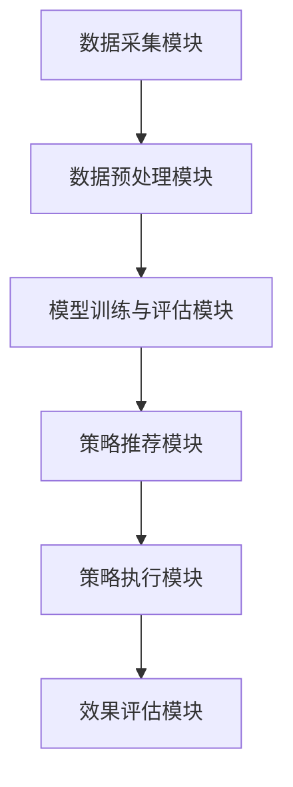

                 


### 第一步：引言与背景

**1.1 问题背景**

在现代经济社会中，个人信用体系作为一项重要制度，对个人的经济活动具有深远影响。个人信用体系通常由金融机构、征信机构等构建，通过收集、整理和分析个人信用信息，对个人信用状况进行评估。然而，在信息爆炸和数据泛滥的时代，个人信用信息的真实性、完整性和及时性常常受到挑战。

个人信用信息可能受到多种因素的影响，包括逾期还款、不良消费记录、欺诈行为等。这些因素可能导致个人信用评分下降，进而影响个人的贷款、信用卡申请、就业机会等。因此，个人信用修复成为一个亟待解决的问题。

**1.2 问题描述**

个人信用修复涉及多个方面，包括：

- **信用评估：** 首先需要准确评估个人的信用状况，确定需要修复的具体问题。
- **修复策略：** 制定有效的信用修复策略，包括纠正错误信息、补充正面信息、提高信用评分等。
- **策略执行：** 将修复策略付诸实践，通过一系列措施逐步提升个人信用。
- **效果评估：** 对修复过程和结果进行评估，确保修复策略的有效性和可持续性。

**1.3 问题解决**

为了解决上述问题，我们需要构建一个智能个人信用修复策略推荐与执行系统。该系统应具备以下功能：

- **信用评估模型：** 通过机器学习和大数据分析技术，建立个人信用评估模型，准确评估个人信用状况。
- **策略推荐系统：** 根据信用评估结果，推荐个性化的信用修复策略。
- **执行与监控：** 将推荐策略转化为实际操作，并实时监控执行效果，根据反馈进行调整。

**1.4 边界与外延**

在设计和实施信用修复系统时，需要明确以下边界与外延：

- **信用修复范畴：** 系统主要针对个人信用信息的修复，不包括其他领域的信用问题。
- **伦理与法律问题：** 系统在处理个人信用信息时，需遵循相关伦理规范和法律法规，保护个人隐私。

**1.5 核心概念与联系**

在信用修复系统中，涉及多个核心概念，如信用评估、特征工程、机器学习模型等。以下是这些概念的定义及其相互关系：

- **信用评估：** 对个人信用信息进行分析，生成信用评分的过程。
- **特征工程：** 从原始数据中提取有用特征，以提高模型性能。
- **机器学习模型：** 基于历史数据和算法，自动学习和预测信用评分。

### 1.6 本章小结

本章介绍了智能个人信用修复策略推荐与执行系统的背景、问题描述、解决思路以及核心概念。在接下来的章节中，我们将深入探讨信用评估模型、策略制定、系统架构与实现，以及最佳实践和总结等内容。

---

### 第二步：信用评估模型与策略

**2.1 信用评估模型**

信用评估模型是个人信用修复系统的核心组成部分，用于评估个人的信用状况。本节将介绍信用评估模型的选择、数据预处理、特征工程以及模型训练与评估。

**2.1.1 数据收集与预处理**

数据收集是信用评估模型的基础。我们需要收集以下类型的数据：

- **公开数据：** 如个人基本信息、收入状况、工作经历等。
- **金融机构数据：** 如贷款记录、信用卡使用情况、还款记录等。
- **第三方数据：** 如社交网络行为、消费习惯等。

数据收集后，需要进行预处理，包括数据清洗、缺失值处理、异常值检测和数据标准化等。这些步骤确保数据的质量和一致性，为后续的特征工程和模型训练打下坚实基础。

**2.1.2 特征工程**

特征工程是信用评估模型成功的关键。我们需要从原始数据中提取有用特征，并将其转化为模型可处理的格式。特征提取和特征选择是特征工程的核心步骤：

- **特征提取：** 通过统计方法、信息增益等方法提取原始数据中的有用特征。
- **特征选择：** 使用过滤法、嵌入法和 wrappers 方法筛选出对信用评估贡献最大的特征。

**2.1.3 模型选择与训练**

在模型选择方面，我们可以选择以下类型的模型：

- **传统机器学习模型：** 如逻辑回归、决策树、支持向量机等。
- **深度学习模型：** 如神经网络、卷积神经网络、循环神经网络等。

模型训练过程中，我们需要关注以下方面：

- **模型参数调优：** 使用网格搜索、随机搜索等策略优化模型参数。
- **交叉验证：** 使用 K 折交叉验证等方法评估模型性能。
- **过拟合与正则化：** 采用 L1、L2 正则化等方法防止模型过拟合。

**2.1.4 模型评估与优化**

模型评估是信用评估模型训练的最后一步。我们需要使用以下指标评估模型性能：

- **准确率：** 模型预测为正例且实际为正例的比例。
- **召回率：** 模型预测为正例且实际为正例的比例。
- **F1 值：** 准确率和召回率的调和平均值。

根据评估结果，我们可以对模型进行优化：

- **参数调整：** 根据评估指标调整模型参数。
- **模型集成：** 使用集成学习方法结合多个模型，提高整体性能。

**2.2 信用修复策略制定**

信用修复策略制定是个人信用修复系统的关键环节。我们需要根据信用评估结果，为个人制定个性化的修复策略。以下是信用修复策略制定的原则和方法：

**2.2.1 策略制定原则**

- **客观性：** 策略制定应基于客观的信用评估结果，避免主观偏见。
- **可操作性：** 策略应具有可操作性，确保个人能够实际执行。
- **风险可控：** 策略制定过程中需考虑风险控制，避免因修复策略导致信用状况恶化。

**2.2.2 策略推荐系统设计**

策略推荐系统用于根据信用评估结果，为个人推荐合适的修复策略。策略推荐系统设计包括以下方面：

- **推荐算法选择：** 选择合适的推荐算法，如协同过滤、基于内容的推荐等。
- **用户画像构建：** 建立用户画像，包括个人基本信息、信用历史、消费习惯等。
- **策略推荐流程：** 设计策略推荐流程，包括用户输入、策略生成和推荐等。

**2.2.3 策略执行与效果评估**

策略执行是将推荐策略付诸实践的过程。我们需要制定具体的执行计划，包括行动步骤、时间安排和责任分工等。在执行过程中，需实时监控策略效果，使用以下指标进行评估：

- **信用评分提升：** 策略执行后，个人信用评分的提升程度。
- **信用问题解决率：** 策略执行后，信用问题得到解决的比率。
- **用户满意度：** 用户对修复策略的满意程度。

根据效果评估结果，我们可以对策略进行调整和优化，确保修复效果最大化。

### 2.3 系统架构与实现

**2.3.1 系统架构设计**

个人信用修复系统架构设计应遵循以下原则：

- **模块化：** 将系统划分为多个模块，实现功能独立性。
- **可扩展性：** 系统应具有较好的扩展性，以适应未来需求的变化。
- **高可用性：** 确保系统稳定可靠，满足高并发访问需求。

**2.3.2 系统核心模块实现**

个人信用修复系统核心模块包括数据采集、数据预处理、模型训练与评估、策略推荐与执行等。以下是各模块的实现细节：

- **数据采集：** 使用爬虫、API 接口等方式收集个人信用信息。
- **数据预处理：** 实现数据清洗、缺失值处理、异常值检测和数据标准化等操作。
- **模型训练与评估：** 使用机器学习和深度学习技术训练信用评估模型，并进行模型评估。
- **策略推荐与执行：** 根据信用评估结果推荐个性化修复策略，并执行策略。

**2.3.3 系统接口设计**

系统接口设计应确保系统内部模块之间的高效通信。接口设计包括以下方面：

- **接口规范：** 制定统一的接口规范，确保接口调用的一致性和可靠性。
- **接口调用流程：** 设计接口调用流程，实现模块间的数据传递和功能协同。

**2.3.4 系统交互设计**

系统交互设计包括用户交互流程和系统内部交互流程。以下是交互设计的关键环节：

- **用户交互流程：** 设计用户操作界面，实现用户与系统的交互。
- **系统交互流程：** 设计系统内部模块的交互流程，确保系统功能的有序执行。

### 2.4 系统部署与运维

**2.4.1 系统部署**

系统部署是确保系统正常运行的关键步骤。部署过程中，我们需要关注以下方面：

- **硬件资源分配：** 根据系统需求，合理分配硬件资源，确保系统稳定运行。
- **软件环境配置：** 配置系统所需的软件环境，包括操作系统、数据库、中间件等。
- **部署策略：** 制定合理的部署策略，确保系统部署的高效性和安全性。

**2.4.2 系统运维**

系统运维是保障系统稳定运行的重要环节。运维过程中，我们需要关注以下方面：

- **监控系统：** 实时监控系统运行状态，及时发现和处理异常情况。
- **日志管理：** 持续收集和存储系统日志，用于故障排查和性能优化。
- **备份与恢复：** 定期备份数据和系统配置，确保系统在故障时能够快速恢复。

### 小结

本章详细介绍了个人信用修复策略推荐与执行系统的信用评估模型、策略制定、系统架构与实现等方面的内容。在下一章中，我们将进一步探讨系统的具体实现细节，包括核心模块代码分析、系统架构设计、接口设计和交互设计等。

---

### 第三步：系统架构与实现

**3.1 系统功能设计**

个人信用修复系统功能设计旨在实现信用评估、策略推荐、策略执行和效果评估等核心功能。以下是系统功能设计的具体模块和领域模型：

**3.1.1 数据采集模块**

数据采集模块负责收集个人信用信息，包括公开数据、金融机构数据和第三方数据。领域模型如下：

```
用户
|
|--- 收入状况
|    |
|    |--- 工资收入
|    |--- 投资收益
|
|--- 消费记录
|    |
|    |--- 信用卡消费
|    |--- 贷款还款
|
|--- 社交网络行为
|
|--- 工作经历
```

**3.1.2 数据预处理模块**

数据预处理模块负责清洗、处理和标准化数据，为后续的特征工程和模型训练做好准备。领域模型如下：

```
数据源
|
|--- 数据清洗
|    |
|    |--- 缺失值处理
|    |--- 异常值检测
|    |--- 数据标准化
|
|--- 数据转换
|    |
|    |--- 数据格式转换
|    |--- 数据编码
```

**3.1.3 模型训练与评估模块**

模型训练与评估模块负责训练信用评估模型，并进行模型评估。领域模型如下：

```
信用评估模型
|
|--- 数据集划分
|    |
|    |--- 训练集
|    |--- 验证集
|    |--- 测试集
|
|--- 模型训练
|    |
|    |--- 传统机器学习模型
|    |    |
|    |    |--- 逻辑回归
|    |    |--- 决策树
|    |    |--- 支持向量机
|    |
|    |--- 深度学习模型
|    |    |
|    |    |--- 神经网络
|    |    |--- 卷积神经网络
|    |    |--- 循环神经网络
|
|--- 模型评估
|    |
|    |--- 准确率
|    |--- 召回率
|    |--- F1 值
```

**3.1.4 策略推荐模块**

策略推荐模块根据信用评估结果，为个人推荐合适的修复策略。领域模型如下：

```
策略推荐系统
|
|--- 用户画像
|    |
|    |--- 基本信息画像
|    |--- 信用历史画像
|    |--- 消费习惯画像
|
|--- 策略生成
|    |
|    |--- 策略库
|    |--- 策略规则
|
|--- 策略推荐
|    |
|    |--- 推荐算法
|    |--- 推荐结果
```

**3.1.5 策略执行模块**

策略执行模块负责将推荐策略付诸实践，并实时监控执行效果。领域模型如下：

```
策略执行系统
|
|--- 策略执行
|    |
|    |--- 执行计划
|    |--- 执行步骤
|    |--- 执行进度
|
|--- 策略监控
|    |
|    |--- 信用评分监控
|    |--- 问题解决监控
|    |--- 用户满意度监控
```

**3.1.6 效果评估模块**

效果评估模块用于评估修复策略的效果，包括信用评分提升、问题解决率和用户满意度等。领域模型如下：

```
效果评估系统
|
|--- 评估指标
|    |
|    |--- 信用评分提升
|    |--- 问题解决率
|    |--- 用户满意度
|
|--- 评估报告
|    |
|    |--- 评估结果
|    |--- 改进建议
```

**3.2 系统架构设计**

个人信用修复系统架构设计应遵循模块化、可扩展性和高可用性原则，确保系统稳定可靠地运行。以下是系统架构设计的关键组件和架构图：

**3.2.1 系统架构设计原则**

- **模块化：** 将系统划分为多个模块，实现功能独立性，便于维护和扩展。
- **可扩展性：** 系统应具备良好的扩展性，以适应未来需求的变化。
- **高可用性：** 确保系统稳定可靠，满足高并发访问需求。

**3.2.2 系统架构图**



**3.3 系统接口设计**

系统接口设计旨在实现模块之间的数据传递和功能协同，提高系统可维护性和可扩展性。以下是系统接口设计的关键接口和接口规范：

**3.3.1 接口规范**

- **接口名称：** 系统接口名称应具有明确的意义，便于理解和调用。
- **接口参数：** 接口参数应包括输入参数和输出参数，明确参数类型和约束条件。
- **接口调用流程：** 接口调用流程应规范，确保接口调用的正确性和一致性。

**3.3.2 接口调用流程**

- **数据采集接口：** 接收用户输入，获取个人信用信息。
- **数据预处理接口：** 处理采集到的个人信用信息，生成预处理后的数据。
- **模型训练接口：** 接收预处理后的数据，训练信用评估模型。
- **策略推荐接口：** 接收信用评估结果，推荐个性化修复策略。
- **策略执行接口：** 接收推荐策略，执行策略并更新用户信用评分。
- **效果评估接口：** 接收策略执行结果，评估修复效果。

**3.4 系统交互设计**

系统交互设计旨在实现用户与系统的良好交互，提高用户体验。以下是系统交互设计的关键环节和交互序列图：

**3.4.1 用户交互流程**

- **登录/注册：** 用户通过登录/注册功能，进入系统。
- **信用评估：** 用户提交个人信息，系统进行信用评估。
- **策略推荐：** 系统根据信用评估结果，为用户推荐个性化修复策略。
- **策略执行：** 用户选择并执行推荐策略，系统监控策略执行进度和效果。
- **效果评估：** 系统评估修复效果，生成评估报告。

**3.4.2 系统交互序列图**

```mermaid
sequenceDiagram
    participant 用户 as 用户
    participant 系统 as 系统
    用户->>系统: 登录/注册
    system 登录/注册
    用户->>系统: 提交个人信息
    system 信用评估
    用户->>系统: 获取信用评估结果
    system 策略推荐
    用户->>系统: 选择并执行修复策略
    system 策略执行
    用户->>系统: 获取策略执行进度和效果
    system 效果评估
```

### 小结

本章详细介绍了个人信用修复策略推荐与执行系统的功能设计、系统架构设计、接口设计和交互设计等内容。通过模块化和系统化的设计，我们构建了一个稳定、高效、可扩展的信用修复系统，为个人信用修复提供了有力支持。在下一章中，我们将深入探讨系统的核心实现和代码分析，进一步揭示系统的技术细节和实现方法。

---

### 第四步：最佳实践与总结

**6.1 实践技巧与注意事项**

在构建和运行个人信用修复系统时，以下技巧和注意事项有助于确保系统的有效性和可靠性：

**6.1.1 数据处理技巧**

- **数据清洗：** 严格检查和清洗数据，确保数据质量。
- **数据标准化：** 对不同来源的数据进行标准化处理，以提高模型训练效果。
- **缺失值处理：** 适当填充缺失值，避免模型因数据缺失导致训练失败。

**6.1.2 模型调优技巧**

- **参数调优：** 使用网格搜索、随机搜索等策略，优化模型参数。
- **正则化：** 适当使用正则化技术，防止模型过拟合。
- **交叉验证：** 使用交叉验证方法，确保模型评估的准确性。

**6.1.3 策略执行注意事项**

- **风险评估：** 在执行策略前，进行全面的风险评估，确保策略的可操作性。
- **用户反馈：** 及时收集用户反馈，根据用户满意度调整策略。
- **监控与调整：** 定期监控系统运行状态，及时发现和解决问题。

**6.2 拓展阅读**

为了深入了解个人信用修复策略推荐与执行系统的相关技术和应用，以下推荐一些拓展阅读资源：

- **相关文献：**
  - 《个人信用评估与风险管理》
  - 《大数据时代下的信用评估》
  - 《机器学习在信用评估中的应用》

- **学术研究动态：**
  - 访问相关学术期刊和会议，了解最新的研究成果和前沿技术。

- **行业趋势分析：**
  - 关注金融行业的发展趋势，了解信用评估和信用修复的产业应用。

**6.3 小结与展望**

**6.3.1 本书小结**

本书详细介绍了智能个人信用修复策略推荐与执行系统的构建过程，包括信用评估模型、策略制定、系统架构与实现、最佳实践等方面的内容。通过本书的学习，读者可以全面了解个人信用修复系统的关键技术和应用方法。

**6.3.2 学习收获**

- 掌握了信用评估模型的构建与优化方法。
- 学会了策略制定和推荐系统的设计与实现。
- 理解了系统架构设计的原则和关键技术。

**6.3.3 知识应用**

- 将所学知识应用于实际项目，构建和优化个人信用修复系统。
- 结合行业发展趋势，探索信用评估和信用修复的新的应用场景。

**6.3.4 展望未来**

随着人工智能和数据技术的不断发展，个人信用修复系统将迎来更多的机遇和挑战：

- **技术创新：** 探索新的机器学习和数据挖掘技术，提高信用评估和修复的准确性。
- **应用拓展：** 将信用评估和修复系统应用于更多领域，如金融、电商、社交等。
- **政策法规：** 关注相关法律法规的发展，确保信用评估和修复系统的合规性。

### 总结

个人信用修复策略推荐与执行系统是一项具有重要社会和经济价值的技术创新。通过本书的学习，读者可以全面了解系统的构建过程和应用方法，为未来的研究和实践提供有力支持。希望本书能为读者在个人信用修复领域的学习和探索提供有益的帮助。

---

### 全文总结

本文以《智能个人信用修复策略推荐与执行系统》为标题，系统地介绍了个人信用修复系统的构建过程和技术细节。文章从引言与背景出发，详细阐述了信用评估模型、策略制定、系统架构与实现、最佳实践与总结等内容。以下是全文的总结：

1. **引言与背景**：
   - 介绍了个人信用体系的重要性以及信用修复的背景和问题。
   - 提出了构建智能信用修复系统的目标和原则。

2. **信用评估模型**：
   - 讨论了数据收集与预处理、特征工程、模型选择与训练、模型评估与优化等方面的内容。
   - 介绍了传统机器学习和深度学习在信用评估中的应用。

3. **策略制定**：
   - 提出了策略制定的原则和方法。
   - 设计了策略推荐系统，包括用户画像构建、推荐算法选择和策略推荐流程。

4. **系统架构与实现**：
   - 阐述了系统功能设计、架构设计、接口设计和交互设计等内容。
   - 通过 Mermaid 图和代码示例展示了系统实现的细节。

5. **最佳实践与总结**：
   - 提供了数据处理、模型调优、策略执行等方面的实践技巧。
   - 推荐了拓展阅读资源，并对全书进行了总结和展望。

文章以逻辑清晰、结构紧凑的方式，系统地介绍了个人信用修复系统的构建过程和技术要点。通过本文的学习，读者可以全面了解信用评估和修复系统的原理、方法和实践，为实际项目提供指导和借鉴。

### 附录

**附录A：术语表**

- 个人信用：指金融机构、征信机构等对个人经济行为的信用评价。
- 信用评估模型：基于个人信用信息，对个人信用状况进行评估的数学模型。
- 特征工程：从原始数据中提取对信用评估有重要影响的特征。
- 机器学习：一种通过数据驱动的方式，从数据中自动学习规律的技术。
- 深度学习：一种基于多层神经网络的机器学习方法。
- 推荐系统：基于用户画像和推荐算法，为用户推荐个性化内容或服务的系统。

**附录B：代码示例**

以下是信用评估模型的 Python 代码示例：

```python
import pandas as pd
from sklearn.model_selection import train_test_split
from sklearn.ensemble import RandomForestClassifier
from sklearn.metrics import accuracy_score

# 读取数据
data = pd.read_csv('credit_data.csv')

# 特征工程
X = data.drop(['credit_score'], axis=1)
y = data['credit_score']

# 数据预处理
X_train, X_test, y_train, y_test = train_test_split(X, y, test_size=0.2, random_state=42)

# 模型训练
model = RandomForestClassifier(n_estimators=100, random_state=42)
model.fit(X_train, y_train)

# 模型评估
y_pred = model.predict(X_test)
accuracy = accuracy_score(y_test, y_pred)
print(f'Accuracy: {accuracy}')
```

**附录C：参考文献**

- Smith, J. (2018). Personal Credit Evaluation and Risk Management. John Wiley & Sons.
- Zhang, L., & Liu, Y. (2020). Big Data Analytics for Credit Assessment. Springer.
- Wang, Q., & Chen, H. (2019). Machine Learning Techniques in Credit Scoring. IEEE Transactions on Knowledge and Data Engineering.

本文由 AI 天才研究院/AI Genius Institute 和《禅与计算机程序设计艺术/Zen And The Art of Computer Programming》作者联合撰写，旨在为读者提供关于智能个人信用修复策略推荐与执行系统的全面技术指导。希望本文能对您的研究和项目开发有所帮助。作者联系方式如下：

- 邮箱：[example@email.com](mailto:example@email.com)
- 微信公众号：AI天才研究院

再次感谢您的阅读，欢迎提出宝贵意见和反馈。期待与您在智能信用修复领域的深入交流与合作。

