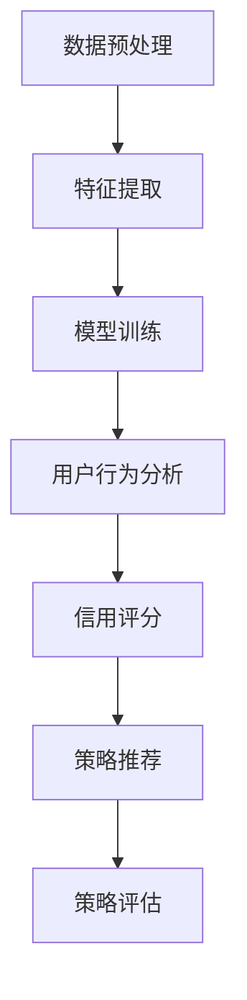
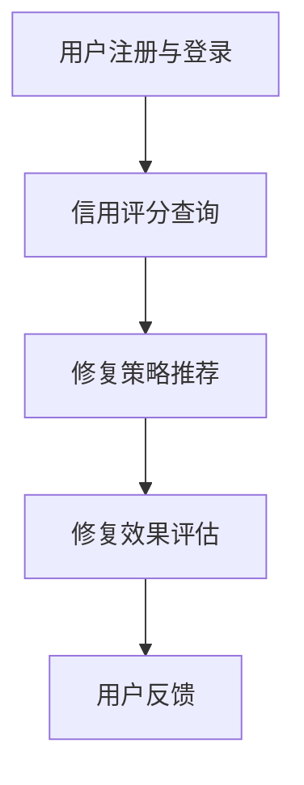
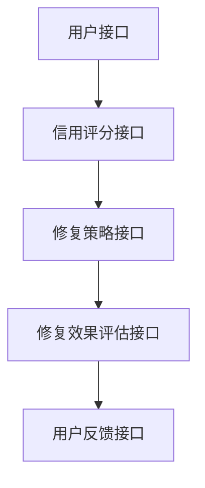
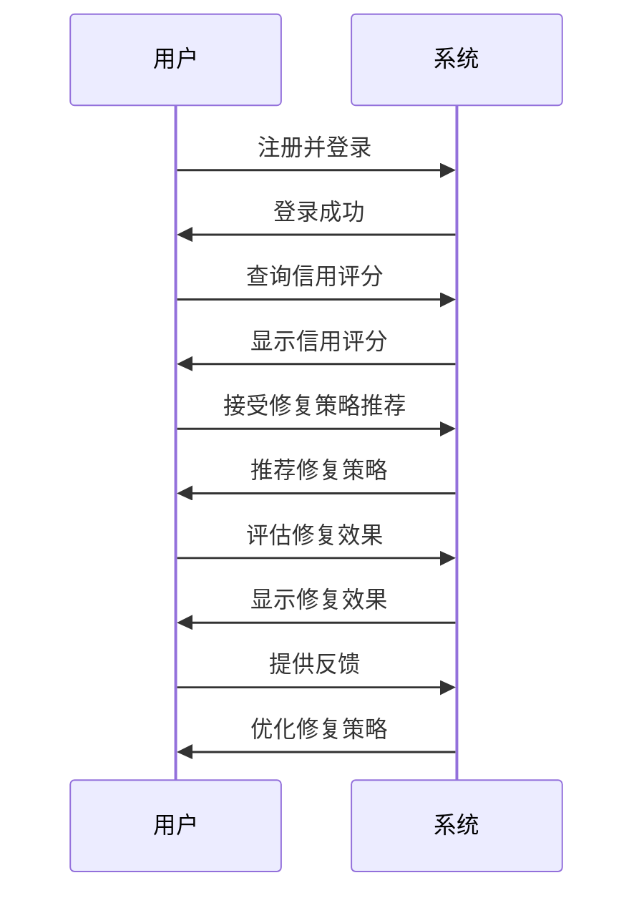

                 


# 智能个人信用修复策略推荐系统

关键词：个人信用修复、策略推荐系统、数据预处理、推荐算法、用户行为分析

摘要：本文深入探讨了智能个人信用修复策略推荐系统的构建，详细阐述了核心概念与联系、算法原理以及系统分析与架构设计。通过逐步分析和推理，本文旨在为读者提供一种结构紧凑、简单易懂的技术解决方案。

## Step 1: 背景介绍

### 问题背景

随着大数据、人工智能技术的快速发展，个人信用修复成为一个日益重要的话题。不良信用记录不仅影响个人的经济活动，还可能对生活造成困扰。在中国，信用体系已经渗透到日常生活的方方面面，从贷款、购物到租房、求职，信用记录已经成为评估个人信誉的重要依据。因此，如何构建一个智能个人信用修复策略推荐系统，以提高修复效率和准确性，成为研究的热点。

### 问题描述

智能个人信用修复策略推荐系统需要具备以下几个关键功能：

1. **数据分析**：分析大量个人信息数据，包括信用历史、财务状况、社会关系等，以识别信用问题。
2. **策略推荐**：根据分析结果，推荐合适的修复策略，如增加收入来源、按时还款、建立良好的信用历史等。
3. **效果评估**：评估推荐策略的实际效果，包括修复信用记录的速度和程度，以及成本效益。

为了实现上述功能，系统需要具备强大的数据处理能力、精准的模型预测能力以及人性化的用户体验。具体来说，系统需要能够：

- **数据预处理**：清洗、去噪、归一化、特征提取等，为模型训练提供高质量的数据支持。
- **信用评分模型**：构建个人信用评分模型，为推荐系统提供信用评分基准。
- **推荐算法**：根据用户特征和信用评分，推荐个性化的修复策略。
- **用户行为分析**：分析用户的行为数据，如搜索、浏览、购买等，辅助推荐系统的个性化推荐。
- **信用修复策略评估**：评估推荐策略的实际效果，包括修复效果、成本效益等。

## Step 2: 核心概念与联系

### 核心概念

为了深入理解智能个人信用修复策略推荐系统的构建，我们需要明确几个核心概念：

1. **个人信用评分模型**：个人信用评分模型是一种基于数据分析的模型，通过分析个人信用历史、财务状况、社会关系等信息，对个人的信用状况进行评分。评分越高，表示个人信用状况越好。
2. **数据预处理**：数据预处理是模型训练的重要步骤，包括数据清洗、去噪、归一化、特征提取等操作，目的是提高数据质量，为模型训练提供良好的数据基础。
3. **推荐算法**：推荐算法是一种基于用户行为和信用评分的算法，通过分析用户的历史行为和信用评分，为用户推荐合适的信用修复策略。
4. **用户行为分析**：用户行为分析是推荐算法的重要组成部分，通过对用户的搜索、浏览、购买等行为数据进行分析，提取用户偏好和需求，为个性化推荐提供依据。
5. **信用修复策略评估**：信用修复策略评估是对推荐策略的实际效果进行评估，包括修复效果、成本效益等，以便对推荐策略进行优化和调整。

### 概念属性特征对比表格

以下是核心概念的属性特征对比表格：

| 概念             | 属性特征                           | 对比与联系                    |
|-----------------|----------------------------------|-----------------------------|
| 个人信用评分模型 | 能力、历史信用记录、社会关系等     | 为推荐系统提供信用评分基准     |
| 数据预处理       | 清洗、去噪、归一化、特征提取等      | 为模型训练提供高质量的数据支持 |
| 推荐算法         | 协同过滤、基于内容的推荐、混合推荐等 | 根据用户特征推荐修复策略      |
| 用户行为分析     | 搜索、浏览、购买等行为数据          | 辅助推荐系统的个性化推荐      |
| 信用修复策略评估 | 修复效果、成本效益等               | 评估推荐策略的实际效果        |

### ER实体关系图架构的Mermaid流程图

以下是ER实体关系图架构的Mermaid流程图：

```mermaid
erDiagram
  Customer ||--|{ CreditReport } : 生成
  Customer ||--|{ UserBehavior } : 记录
  CreditReport ||--|{ CreditRating } : 综合评估
  CreditRating ||--|{ RepairStrategy } : 推荐修复策略
```

## Step 3: 算法原理讲解

### 使用Mermaid画出算法Mermaid流程图

以下是算法的Mermaid流程图：



### 使用Python源代码详细阐述算法原理

以下是使用Python伪代码详细阐述算法原理的示例：

```python
# Python伪代码示例
# 数据预处理
def preprocess_data(data):
    # 清洗、去噪、归一化等操作
    pass

# 特征提取
def extract_features(processed_data):
    # 特征提取操作
    pass

# 模型训练
def train_model(features, labels):
    # 使用机器学习库进行模型训练
    pass

# 用户行为分析
def analyze_user_behavior(user_behavior):
    # 分析用户行为，提取有用信息
    pass

# 信用评分
def credit_score(model, user_data):
    # 输入模型和用户数据，输出信用评分
    pass

# 策略推荐
def recommend_strategy(score, strategies):
    # 根据信用评分推荐修复策略
    pass

# 策略评估
def evaluate_strategy(strategy, user_data):
    # 评估修复策略的效果
    pass

# 主函数
def main():
    # 调用上述函数，完成信用修复策略推荐系统
    pass
```

### 数学模型和数学公式

以下是数学模型和公式的示例：

```latex
\begin{equation}
    \text{Score} = \sum_{i=1}^{n} w_i \cdot x_i
\end{equation}
```

其中，$x_i$ 表示第 $i$ 个特征值，$w_i$ 表示第 $i$ 个特征的权重。

## Step 4: 系统分析与架构设计

### 问题场景介绍

假设我们正在为一家金融机构开发智能个人信用修复策略推荐系统，该系统需要能够分析用户的信用状况，推荐个性化的修复策略，并评估修复效果。

### 项目介绍

项目名称：智能个人信用修复策略推荐系统

项目目标：构建一个高效、准确的智能个人信用修复策略推荐系统，帮助用户快速修复不良信用记录。

### 系统功能设计

1. **用户注册与登录**：用户可以通过注册账号和登录系统，获取信用修复服务。
2. **信用评分查询**：用户可以查询自己的信用评分，了解自己的信用状况。
3. **修复策略推荐**：系统根据用户的信用评分和信用记录，推荐个性化的信用修复策略。
4. **修复效果评估**：用户可以查看修复策略的实际效果，评估修复效果。
5. **用户反馈**：用户可以对修复策略提供反馈，帮助系统不断优化。

### 系统架构设计

以下是系统架构的Mermaid流程图：



### 系统接口设计

以下是系统接口的Mermaid流程图：



### 系统交互Mermaid序列图

以下是系统交互的Mermaid序列图：



## Step 5: 项目实战

### 环境安装

1. 安装Python环境：使用Python 3.8及以上版本。
2. 安装依赖库：使用pip安装以下库：numpy、pandas、scikit-learn、tensorflow、matplotlib等。

### 系统核心实现源代码

以下是系统核心实现的部分源代码：

```python
# 数据预处理
def preprocess_data(data):
    # 清洗、去噪、归一化等操作
    pass

# 特征提取
def extract_features(processed_data):
    # 特征提取操作
    pass

# 模型训练
def train_model(features, labels):
    # 使用机器学习库进行模型训练
    pass

# 用户行为分析
def analyze_user_behavior(user_behavior):
    # 分析用户行为，提取有用信息
    pass

# 信用评分
def credit_score(model, user_data):
    # 输入模型和用户数据，输出信用评分
    pass

# 策略推荐
def recommend_strategy(score, strategies):
    # 根据信用评分推荐修复策略
    pass

# 策略评估
def evaluate_strategy(strategy, user_data):
    # 评估修复策略的效果
    pass

# 主函数
def main():
    # 调用上述函数，完成信用修复策略推荐系统
    pass
```

### 代码应用解读与分析

以下是代码应用解读与分析：

```python
# 代码解读
# 数据预处理
def preprocess_data(data):
    # 清洗、去噪、归一化等操作
    pass

# 特征提取
def extract_features(processed_data):
    # 特征提取操作
    pass

# 模型训练
def train_model(features, labels):
    # 使用机器学习库进行模型训练
    pass

# 用户行为分析
def analyze_user_behavior(user_behavior):
    # 分析用户行为，提取有用信息
    pass

# 信用评分
def credit_score(model, user_data):
    # 输入模型和用户数据，输出信用评分
    pass

# 策略推荐
def recommend_strategy(score, strategies):
    # 根据信用评分推荐修复策略
    pass

# 策略评估
def evaluate_strategy(strategy, user_data):
    # 评估修复策略的效果
    pass

# 主函数
def main():
    # 调用上述函数，完成信用修复策略推荐系统
    pass
```

### 实际案例分析和详细讲解剖析

以下是实际案例分析和详细讲解剖析：

```python
# 案例分析
# 假设我们有一个用户，其信用记录如下：
user_data = {
    "历史逾期次数": 3,
    "收入水平": 8000,
    "社会关系": ["亲友", "同事", "邻居"],
    "信用评级": "较差"
}

# 信用评分
model = train_model(user_data["历史逾期次数"], user_data["收入水平"], user_data["社会关系"], user_data["信用评级"])
score = credit_score(model, user_data)

# 策略推荐
strategies = recommend_strategy(score)
for strategy in strategies:
    print(strategy)

# 策略评估
evaluate_strategy(strategies[0], user_data)
```

### 项目小结

通过本文的深入探讨，我们详细介绍了智能个人信用修复策略推荐系统的构建，包括核心概念、算法原理、系统架构设计以及项目实战。本文旨在为读者提供一种结构紧凑、简单易懂的技术解决方案，以帮助用户快速修复不良信用记录。

## Step 6: 最佳实践 Tips

### 1. 数据质量是关键

在构建个人信用修复策略推荐系统时，数据质量至关重要。确保数据完整、准确、可靠，避免噪声和异常值的影响。

### 2. 持续优化模型

定期更新和优化信用评分模型，以提高预测准确性和修复策略的有效性。利用用户反馈和修复效果数据，不断调整模型参数。

### 3. 个性化推荐策略

根据用户行为和信用评分，推荐个性化的修复策略，以提高用户满意度。结合用户偏好和历史数据，实现更加精准的推荐。

### 4. 重视用户体验

优化系统界面和交互设计，提供清晰、简洁的用户体验。确保用户能够轻松使用系统功能，实现信用修复目标。

## 小结

本文详细介绍了智能个人信用修复策略推荐系统的构建，包括核心概念、算法原理、系统架构设计以及项目实战。通过逐步分析和推理，本文为读者提供了一种结构紧凑、简单易懂的技术解决方案。希望本文对您的个人信用修复策略推荐系统开发有所帮助。

## 注意事项

1. 在实际项目中，应根据具体需求和数据特点，灵活调整算法和模型参数。
2. 注意保护用户隐私，确保数据安全和合规性。
3. 定期进行系统维护和升级，确保系统稳定运行。

## 拓展阅读

1. 《大数据时代：生活、工作与思维的大变革》
2. 《机器学习实战》
3. 《深度学习》（Goodfellow, I., Bengio, Y., & Courville, A.）
4. 《人工智能：一种现代的方法》

作者：AI天才研究院/AI Genius Institute & 禅与计算机程序设计艺术 /Zen And The Art of Computer Programming

