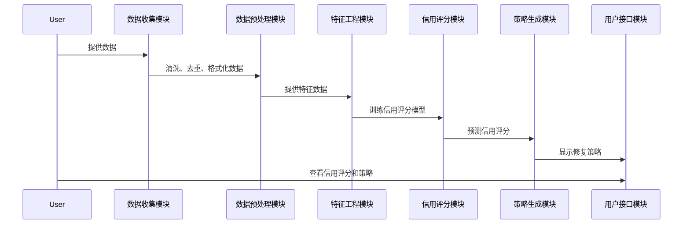
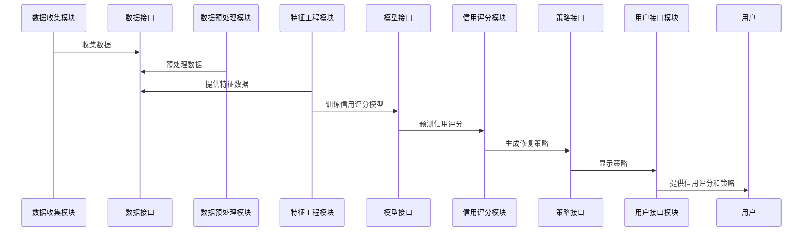

                 


### 引言

智能个人信用修复策略生成器是一个旨在解决个人信用问题，提升信用评分的先进工具。在现代社会，信用体系的重要性日益凸显。它不仅影响个人的贷款、信用卡申请，还涉及日常生活中的各种交易和社交活动。然而，个人信用受损的情况时有发生，可能是由于逾期还款、信用欺诈等原因。这不仅给个人的财务状况带来了困扰，也可能对未来的生活产生深远影响。

个人信用问题及影响：

个人信用问题主要表现为信用评分低、信用记录异常等。这些问题可能导致贷款审批失败、信用卡额度低、保险费用增加等。长期信用受损甚至可能影响到个人的就业机会和职业生涯。因此，解决个人信用问题是保障个人生活质量和社会稳定的重要举措。

信用修复的概念与方法：

信用修复是指通过一系列措施和策略，改善个人信用记录，提升信用评分的过程。传统信用修复方法通常包括提交异议、还款计划、信用咨询等。然而，这些方法往往效果有限，且修复过程繁琐。随着人工智能技术的发展，智能信用修复策略逐渐成为可能。

信用修复技术的发展趋势：

近年来，人工智能、数据挖掘、机器学习等技术在信用修复领域得到了广泛应用。通过分析大量数据，智能信用修复策略生成器可以自动识别信用问题，并提供个性化的修复建议。这种方法不仅提高了修复效率，还显著提升了信用修复的成功率。

综上所述，本文将深入探讨智能个人信用修复策略生成器的设计、实现和应用。通过详细分析信用体系、介绍关键技术，以及通过实际案例研究，我们将展示智能信用修复策略生成器如何帮助个人改善信用状况，提升生活质量。

### 目录大纲

#### 目录

**智能个人信用修复策略生成器**

> 关键词：信用修复、人工智能、数据挖掘、机器学习、自然语言处理

> 摘要：本文介绍了智能个人信用修复策略生成器的概念、设计与实现，探讨了其在信用修复中的应用和优势，并通过实际案例展示了其效果和未来发展方向。

#### 引言

- 信用体系的重要性
- 个人信用问题及影响
- 信用修复的概念与方法
- 信用修复技术的发展趋势

#### 信用体系概述

- 信用体系的基本构成
- 信用评估指标与算法
- 信用报告的内容与解读
- 信用体系现状与挑战

#### 智能个人信用修复策略

- 智能信用修复的定义与原理
- 智能信用修复的关键技术
  - 数据挖掘与机器学习
  - 自然语言处理
  - 信用风险建模
- 智能信用修复策略框架
- 智能信用修复策略实施流程

#### 数据分析与挖掘

- 数据收集与预处理
  - 数据来源与类型
  - 数据预处理技术
- 特征工程
  - 特征提取与选择
  - 特征重要性评估
- 数据挖掘算法及应用
  - 关联规则挖掘
  - 聚类分析
  - 分类与回归分析

#### 机器学习与信用修复

- 机器学习基础
  - 监督学习与无监督学习
  - 算法介绍与选择
- 常见机器学习算法在信用修复中的应用
  - 决策树与随机森林
  - 支持向量机
  - 神经网络与深度学习

#### 自然语言处理与信用报告分析

- 自然语言处理基础
  - 语言模型与文本表示
  - 词嵌入与语义分析
- 信用报告分析
  - 报告结构分析
  - 异常检测与识别
- 情感分析与风险评估

#### 案例研究：智能信用修复策略生成器实战

- 项目背景与目标
- 系统设计与实现
  - 领域模型设计与实现
  - 系统架构设计与实现
  - 系统接口设计与实现
- 代码解读与分析
  - 数据收集与预处理
  - 特征工程
  - 信用风险评估与策略生成
- 实际案例分析
  - 案例一：信用修复策略生成
  - 案例二：信用报告异常检测
- 项目总结与展望

#### 最佳实践与展望

- 最佳实践
  - 数据质量提升策略
  - 特征工程优化
  - 算法性能调优
- 未来发展趋势与挑战
  - 技术革新
  - 法律法规与伦理道德
  - 行业合作与生态构建

#### 附录

- 附录A：术语表
- 附录B：参考资源
- 附录C：项目代码示例

### 第1章 引言

#### 1.1 信用体系的重要性

信用体系是现代经济体系中的重要组成部分，它在促进金融市场稳定、提升交易效率、保障社会信用环境方面发挥着关键作用。一个完善的信用体系不仅有助于金融机构在贷款、信用评估等方面做出更为精准的决策，还能有效降低金融风险，提升市场整体信用水平。

个人信用作为信用体系的核心组成部分，直接关系到个人的金融活动和生活质量。个人信用通常由信用报告记录，包括还款历史、信用申请记录、公共记录等。良好的个人信用可以带来以下优势：

1. **贷款审批**：拥有良好信用记录的个人在申请贷款时，更容易获得银行的审批，并获得较低的利率。
2. **信用卡额度**：高信用评分的个人通常享有较高的信用卡额度，便于日常消费和紧急资金需求。
3. **保险费用**：良好的信用记录还可以帮助个人在购买保险时获得更低的保费。
4. **就业机会**：许多企业和雇主在招聘时会参考申请者的信用记录，良好的信用有助于提升求职者的竞争力。

#### 1.2 个人信用问题及影响

尽管信用体系为个人带来了诸多便利，但个人信用问题依然是一个普遍存在的问题。个人信用问题主要包括信用评分低、信用记录异常、逾期还款等。这些问题可能会对个人的财务状况和生活产生以下负面影响：

1. **贷款审批困难**：信用评分低或信用记录异常的个人在申请贷款时，可能会面临审批失败或利率升高的问题。
2. **信用卡额度受限**：信用记录不良的个人在申请信用卡时，可能会获得较低的信用额度，甚至无法申请成功。
3. **信用欺诈风险**：信用记录异常可能是信用欺诈的迹象，导致个人财务受到损失。
4. **社会影响**：个人信用问题不仅影响个人金融活动，还可能影响其在社会交往中的信任度和声誉。

#### 1.3 信用修复的概念与方法

信用修复是指通过一系列措施和策略，改善个人信用记录，提升信用评分的过程。信用修复的方法包括但不限于以下几种：

1. **提交异议**：当个人发现信用报告中存在错误信息时，可以提交异议申请，要求相关机构更正。
2. **还款计划**：对于有逾期还款记录的个人，制定合理的还款计划，按时还款有助于逐步改善信用记录。
3. **信用咨询**：寻求专业信用咨询机构的帮助，获取信用修复的建议和指导。
4. **债务重组**：对于债务负担较重的个人，通过债务重组减轻还款压力，有助于改善信用状况。

#### 1.4 信用修复技术的发展趋势

随着人工智能、数据挖掘、机器学习等技术的快速发展，信用修复领域也迎来了新的变革。智能信用修复策略生成器就是基于这些技术发展而来的先进工具。

1. **数据挖掘与机器学习**：通过分析大量信用数据，智能信用修复策略生成器可以自动识别信用问题，提供个性化的修复建议。这种方法不仅提高了修复效率，还显著提升了信用修复的成功率。
2. **自然语言处理**：利用自然语言处理技术，对信用报告进行深入分析，识别潜在风险和异常信息，为信用修复提供有力支持。
3. **信用风险建模**：基于历史数据和机器学习算法，构建信用风险评估模型，预测个人的信用行为，为信用修复提供科学依据。

总之，智能个人信用修复策略生成器的发展为信用修复领域带来了新的机遇和挑战。通过本文的深入探讨，我们将了解这一工具的设计、实现和应用，为读者提供全面的技术视角。

### 2.1 信用体系的基本构成

信用体系的基本构成可以分为四个主要部分：信用报告、信用评估机构、信用评分模型和信用法律法规。这四个部分相互关联，共同构成了一个完整的信用生态系统。

#### 信用报告

信用报告是记录个人或企业信用历史的重要文件。它通常包含以下内容：

1. **信用历史记录**：包括个人的贷款还款记录、信用卡使用情况、账户余额等。
2. **公共记录**：如法院判决、公共记录、税单等，这些记录反映了个人或企业的信用状况。
3. **查询记录**：记录了谁在过去一段时间内查询了个人或企业的信用报告，通常用于监测可能的信用欺诈行为。
4. **身份信息**：包括姓名、地址、社会安全号码等个人信息。

信用报告通常由信用报告机构（Credit Reporting Agency, CRA）负责收集、整理和存储。在美国，主要的三家信用报告机构是Equifax、Experian和TransUnion。

#### 信用评估机构

信用评估机构（Credit Rating Agency, CRA）是专门从事信用评估的独立机构。它们通过收集和分析大量的信用数据，为金融机构提供信用评估服务。信用评估机构通常对借款人的信用状况进行评分，这些评分通常以分数或等级的形式表示。

信用评估机构的职责包括：

1. **数据收集**：从金融机构、政府部门和其他相关机构收集信用数据。
2. **信用评分**：根据收集到的数据，使用特定的评分模型对借款人进行评分。
3. **信用报告**：向金融机构提供信用评估结果，协助金融机构做出信贷决策。

#### 信用评分模型

信用评分模型是信用评估的核心。这些模型通过分析信用数据，预测个人或企业的信用风险。常见的信用评分模型包括：

1. **FICO评分模型**：由FICO公司开发，广泛用于美国金融市场。FICO评分模型基于多个因素，如还款历史、信用使用情况、账户余额和年龄等，计算出一个介于300到850之间的分数。
2. **贝叶斯评分模型**：基于贝叶斯定理，通过历史数据进行概率预测，常用于信用风险评估。
3. **逻辑回归模型**：一种统计方法，用于预测某个事件发生的概率。逻辑回归模型在信用评分中广泛应用，用于分析借款人的信用风险。

#### 信用法律法规

信用法律法规是信用体系正常运转的基石。这些法律法规确保了信用报告的准确性、透明度和隐私保护。以下是一些关键的信用法律法规：

1. **公平信用报告法（FCRA）**：规定了信用报告的使用范围、查询权限和错误信息的更正程序。
2. **消费者信用保护法（FCPA）**：保护消费者的隐私权，防止信用欺诈和不公平信用行为。
3. **欧盟通用数据保护条例（GDPR）**：规定了欧盟境内个人数据的收集、处理和存储标准，对信用报告机构的操作产生了深远影响。

#### 信用体系现状与挑战

尽管信用体系在促进金融市场稳定和提升交易效率方面发挥了重要作用，但也存在一些问题和挑战：

1. **数据准确性问题**：信用报告可能包含错误信息，导致信用评分不准确。
2. **隐私保护问题**：信用报告涉及到个人敏感信息，隐私保护成为一大挑战。
3. **信用歧视问题**：一些信用评估模型可能存在歧视性，导致特定群体（如低收入者、少数族裔）面临更高的信用风险。
4. **法律法规滞后**：随着技术发展和信用体系的演变，现有法律法规可能无法完全应对新兴的信用问题和挑战。

总之，信用体系的基本构成和现状为我们理解信用评估和信用修复提供了重要基础。在接下来的章节中，我们将进一步探讨智能信用修复策略生成器的设计和实现，以应对这些挑战。

#### 2.2 信用评估指标与算法

信用评估指标是衡量个人或企业信用状况的关键参数，它们直接影响信用评分的结果。常见的信用评估指标包括以下几种：

1. **还款历史**：还款历史是最重要的信用评估指标之一，它反映了个人按时还款的记录。通常，还款历史包括贷款还款记录、信用卡还款记录等。良好的还款历史可以显著提高信用评分。

2. **信用使用情况**：信用使用情况包括信用账户数量、信用余额、信用使用率等。这些指标反映了个人对信用的依赖程度和管理能力。较低的信用使用率和较高的信用余额通常有利于提高信用评分。

3. **账户余额**：账户余额是指个人信用账户的当前余额。账户余额较低通常意味着个人有足够的资金来偿还债务，从而有利于提高信用评分。

4. **信用查询记录**：信用查询记录反映了个人在过去一段时间内信用报告被查询的次数。频繁的信用查询可能表明个人正在寻求新的贷款或信用卡，这可能会对信用评分产生负面影响。

5. **年龄和职业**：年龄和职业也是信用评估中的重要指标。通常，年龄较大的个人被认为更加稳定和可靠，而稳定的职业也通常被视为良好的信用指标。

信用评估算法是用于计算信用评分的数学模型。以下是一些常见的信用评估算法：

1. **FICO评分模型**：FICO评分模型是最广泛使用的信用评估算法，它由FICO公司开发。该模型基于多种信用评估指标，计算出一个介于300到850之间的分数。FICO评分模型的评分结果直接影响到金融机构的信贷决策。

2. **贝叶斯评分模型**：贝叶斯评分模型是一种基于贝叶斯定理的概率预测方法。它通过历史数据训练，预测个人或企业的信用风险。贝叶斯评分模型在信用评估中应用广泛，尤其适用于小样本数据分析。

3. **逻辑回归模型**：逻辑回归模型是一种用于分类的统计方法，常用于信用评分。逻辑回归模型通过分析信用评估指标，计算各个指标对信用评分的影响权重，从而预测信用风险。

4. **神经网络模型**：神经网络模型是一种基于人工神经网络的机器学习算法。它通过模拟人脑的神经元连接结构，学习信用评估指标之间的关系，从而预测信用风险。神经网络模型在处理复杂数据和模式识别方面具有优势。

#### 2.3 信用报告的内容与解读

信用报告是信用评估的核心依据，它详细记录了个人或企业的信用历史和当前信用状况。以下是信用报告的主要内容和解读方法：

1. **信用历史记录**：
   - **还款记录**：包括贷款和信用卡的还款情况，如按时还款、逾期还款、拖欠还款等。良好的还款记录有助于提高信用评分。
   - **逾期记录**：记录了个人在过去一段时间内是否存在逾期还款的情况。逾期还款次数越多、逾期时间越长，信用评分通常越低。
   - **账户余额**：显示了个人信用账户的当前余额，较高的账户余额可能会对信用评分产生负面影响。

2. **信用查询记录**：
   - **查询次数**：记录了个人信用报告在过去一段时间内被查询的次数。频繁的查询可能表明个人正在寻求新的贷款或信用卡，这可能会对信用评分产生负面影响。
   - **查询来源**：显示了查询个人信用报告的机构类型，如金融机构、信用卡公司等。金融机构的查询通常不会对信用评分产生负面影响，而信用卡公司的查询可能会对信用评分产生一定影响。

3. **公共记录**：
   - **法院判决**：记录了个人是否有过法院判决记录，如破产、欠款等。法院判决记录通常会对信用评分产生负面影响。
   - **公共记录**：包括税收欠款、法律诉讼等公共记录。这些记录反映了个人或企业的信用状况，可能会对信用评分产生影响。

4. **身份信息**：
   - **个人信息**：包括姓名、地址、社会安全号码等个人信息。这些信息用于确认个人身份，并在信用报告中记录信用历史。

解读信用报告时，需要关注以下几个方面：

- **信用历史记录**：良好的还款记录和较少的逾期记录有助于提高信用评分。
- **信用查询记录**：频繁的查询可能会对信用评分产生负面影响，因此应尽量避免不必要的查询。
- **公共记录**：法院判决和公共记录会对信用评分产生负面影响，应尽快解决相关法律问题。
- **身份信息**：确保信用报告中的个人信息准确无误，如发现错误应及时更正。

通过详细解读信用报告，个人或企业可以更好地了解自己的信用状况，制定针对性的信用修复策略，从而提升信用评分。

### 2.4 信用体系现状与挑战

#### 2.4.1 全球信用体系的发展

全球信用体系的发展经历了几个阶段。从最早的纸质信用报告，到如今的数字化信用体系，信用评估技术也在不断进步。随着互联网和大数据技术的发展，信用体系逐渐实现了数据的实时更新和快速查询。现在，许多国家和地区已经建立了完善的信用体系，如美国的FICO评分系统、欧洲的信用局体系等。

然而，尽管全球信用体系在发展过程中取得了显著成就，但仍然存在一些问题。不同国家和地区的信用体系在数据标准、评估方法、法律框架等方面存在差异，这导致了信用数据的跨国应用受到限制。

#### 2.4.2 数据准确性问题

信用体系中的数据准确性是一个重要挑战。信用报告可能包含错误信息，如错误账户信息、误报的逾期记录等。这些错误会影响信用评分的准确性，进而影响金融机构的信贷决策。解决数据准确性问题需要信用报告机构、金融机构和消费者共同努力，通过技术手段提高数据质量，建立错误信息更正机制。

#### 2.4.3 隐私保护问题

信用报告中包含大量的个人敏感信息，如社会安全号码、地址、财务状况等。这些信息一旦泄露，可能导致严重的隐私侵犯和信用欺诈。尽管各国都有相关的法律法规保护个人隐私，但在实际操作中，隐私保护仍然面临挑战。例如，信用报告机构在数据收集、存储和传输过程中可能存在安全漏洞，黑客攻击和数据泄露事件时有发生。

#### 2.4.4 信用歧视问题

信用评估模型在设计和应用过程中可能存在歧视性。例如，某些模型可能对低收入者、少数族裔等特定群体产生不公平的信用评分。这种歧视性不仅违反了公平原则，还可能导致特定群体的金融排斥。为了解决信用歧视问题，需要制定更加公正的信用评估标准，加强监管和审计，确保信用评估过程的公平性和透明度。

#### 2.4.5 法律法规的滞后性

随着信用体系的发展，相关法律法规也需要不断更新和完善。然而，许多国家和地区现有的法律法规在技术进步和市场需求变化面前显得滞后。例如，一些法律法规可能未能充分考虑到大数据和人工智能技术在信用评估中的应用，导致信用体系的实际运行受到影响。为了应对这些挑战，需要加强信用法律法规的制定和修订，确保其与时代发展相适应。

#### 2.4.6 数据共享与隐私保护平衡

在推动信用体系发展的过程中，数据共享和隐私保护之间的平衡也是一个重要议题。信用体系需要大量的数据来进行信用评估，但这些数据往往涉及个人隐私。如何在保障隐私的前提下实现数据共享，是一个需要深入探讨的问题。这需要信用报告机构、金融机构和监管机构共同努力，通过技术手段和法律框架来确保数据的安全和隐私保护。

总之，全球信用体系在发展过程中面临着诸多挑战，包括数据准确性问题、隐私保护问题、信用歧视问题、法律法规滞后性以及数据共享与隐私保护平衡问题等。解决这些问题需要各方的共同努力和不断创新，以推动信用体系的健康和可持续发展。

### 第3章 智能个人信用修复策略

#### 3.1 智能信用修复的定义与原理

智能信用修复是指通过运用人工智能、数据挖掘、机器学习等先进技术，对个人信用数据进行分析和处理，制定出个性化的信用修复策略，从而提高信用评分的过程。智能信用修复的核心思想是将人工智能技术应用于信用修复领域，通过大数据分析和算法优化，实现信用修复的自动化和智能化。

智能信用修复的原理可以概括为以下几个步骤：

1. **数据收集与预处理**：首先，收集个人的信用数据，包括信用报告、还款记录、信用查询记录等。然后，对数据进行清洗、去重和格式化，确保数据的质量和一致性。

2. **特征工程**：对收集到的数据进行分析，提取出对信用评分有重要影响的特征。特征工程是信用修复策略制定的关键步骤，通过合理选择和构造特征，可以提高信用评分的准确性。

3. **模型训练与优化**：利用机器学习算法，如决策树、随机森林、支持向量机等，训练信用风险评估模型。通过不断优化模型参数，提高模型的预测准确性和稳定性。

4. **信用修复策略生成**：根据训练好的模型，对个人的信用数据进行分析，识别信用问题并提出个性化的修复建议。修复建议可能包括还款计划、信用修复措施、债务重组等。

5. **策略实施与评估**：将信用修复策略应用于实际操作中，监控信用评分的变化，评估策略的有效性。根据评估结果，对策略进行迭代优化，以提高修复效果。

#### 3.2 智能信用修复的关键技术

智能信用修复的实现依赖于多项先进技术的综合运用，以下将介绍其中三项关键技术：

##### 3.2.1 数据挖掘与机器学习

数据挖掘和机器学习是智能信用修复的基础。数据挖掘技术用于从大量信用数据中提取有价值的信息，识别信用风险和信用问题。机器学习算法则通过学习历史数据，建立信用风险评估模型，预测个人未来的信用行为。

常用的数据挖掘算法包括：

1. **关联规则挖掘**：用于发现数据之间的关联关系，如贷款申请和信用评分之间的关系。
2. **聚类分析**：用于将相似的数据分组，识别具有相似信用行为的群体。
3. **分类与回归分析**：用于预测个人的信用评分和信用风险等级。

常见的机器学习算法包括：

1. **决策树**：通过树形结构对数据进行划分，预测信用评分。
2. **随机森林**：多个决策树的组合，提高预测准确性和鲁棒性。
3. **支持向量机（SVM）**：通过寻找最佳超平面，分类信用风险。
4. **神经网络与深度学习**：模拟人脑神经元连接，处理复杂数据和模式识别。

##### 3.2.2 自然语言处理

自然语言处理（NLP）技术在信用修复中用于分析信用报告中的非结构化文本信息，如还款记录、法院判决等。NLP技术可以提取文本中的关键信息，进行语义分析和情感分析，识别潜在的风险和信用问题。

常用的NLP技术包括：

1. **词嵌入**：将文本转换为数值表示，便于机器学习算法处理。
2. **情感分析**：通过分析文本的情感倾向，评估个人信用状况。
3. **命名实体识别**：识别文本中的关键实体，如人名、地点、组织等。

##### 3.2.3 信用风险建模

信用风险建模是智能信用修复的核心。通过建立信用风险评估模型，可以预测个人的信用风险，评估信用修复策略的有效性。信用风险建模通常包括以下步骤：

1. **数据收集**：收集个人信用数据，包括信用报告、还款记录、信用查询记录等。
2. **特征工程**：选择和构造对信用评分有重要影响的特征。
3. **模型选择**：选择适合的机器学习算法，如逻辑回归、决策树、随机森林等。
4. **模型训练与优化**：通过训练集训练模型，并使用交叉验证方法优化模型参数。
5. **模型评估**：使用测试集评估模型性能，选择最优模型。

#### 3.3 智能信用修复策略框架

智能信用修复策略框架是一个系统化的过程，包括数据收集、预处理、特征工程、模型训练、策略生成和实施等步骤。以下是一个典型的智能信用修复策略框架：

1. **数据收集**：收集个人信用数据，包括信用报告、还款记录、信用查询记录等。
2. **数据预处理**：清洗、去重、格式化数据，确保数据质量。
3. **特征工程**：提取和构造对信用评分有重要影响的特征，如还款历史、信用使用情况、公共记录等。
4. **模型训练**：选择合适的机器学习算法，训练信用风险评估模型。
5. **策略生成**：根据模型预测结果，生成个性化的信用修复策略，如还款计划、信用修复措施等。
6. **策略实施**：将信用修复策略应用于实际操作中，如与金融机构合作，制定还款计划，提交异议等。
7. **策略评估**：监控信用评分的变化，评估策略的有效性，根据评估结果调整和优化策略。

#### 3.4 智能信用修复策略实施流程

智能信用修复策略的实施流程可以分为以下几个步骤：

1. **需求分析**：了解用户的信用修复需求，包括信用问题、目标信用评分等。
2. **数据收集**：收集个人信用数据，包括信用报告、还款记录、信用查询记录等。
3. **数据预处理**：清洗、去重、格式化数据，确保数据质量。
4. **特征工程**：提取和构造对信用评分有重要影响的特征，如还款历史、信用使用情况、公共记录等。
5. **模型训练**：选择合适的机器学习算法，训练信用风险评估模型。
6. **策略生成**：根据模型预测结果，生成个性化的信用修复策略。
7. **策略实施**：与金融机构合作，制定还款计划，提交异议等。
8. **策略评估**：监控信用评分的变化，评估策略的有效性，根据评估结果调整和优化策略。

通过智能信用修复策略的实施，可以帮助个人快速识别信用问题，制定有效的信用修复计划，从而提高信用评分，改善财务状况。智能信用修复策略不仅提高了修复效率，还显著提升了信用修复的成功率，为个人信用体系的建设提供了有力支持。

### 数据分析与挖掘

#### 4.1 数据收集与预处理

数据收集与预处理是智能信用修复策略生成器的基础，其质量直接影响后续分析和模型的准确性。以下将详细介绍数据收集的来源与类型，以及数据预处理的具体技术和步骤。

##### 4.1.1 数据来源与类型

智能信用修复策略生成器所需的数据来源主要包括以下几种：

1. **信用报告数据**：这是最核心的数据来源，包括个人信用历史记录、逾期还款记录、信用查询记录等。这些数据通常由信用报告机构提供。
2. **金融交易数据**：包括个人的银行账户交易记录、信用卡消费记录等，这些数据有助于更全面地了解个人的财务状况。
3. **公共记录数据**：如法院判决记录、税收记录、法律诉讼记录等，这些数据反映了个人在公共领域的信用状况。
4. **社会行为数据**：如社交媒体活动、在线购物记录、公共事业账单支付记录等，这些数据可以从第三方数据提供商获得。

##### 4.1.2 数据预处理技术

数据预处理是确保数据质量和一致性的重要步骤，具体包括以下技术和步骤：

1. **数据清洗**：清除数据中的错误、重复和异常值。例如，删除重复的还款记录、纠正错误的账户信息等。
2. **数据去重**：识别并删除重复的数据条目，以确保数据的唯一性和准确性。
3. **数据格式化**：将不同来源的数据转换为统一的格式，便于后续处理和分析。例如，将不同日期格式的数据统一转换为YYYY-MM-DD格式。
4. **缺失值处理**：对于缺失的数据，可以选择填充方法（如平均值、中位数填充）或删除缺失值。在实际应用中，通常采用填充方法，以减少数据损失。
5. **异常值检测**：使用统计学方法（如标准差法、箱线图法）检测数据中的异常值，并决定是否保留或处理这些异常值。
6. **特征标准化**：对于不同量纲的特征，如金额和时长，进行标准化处理，以便于模型训练和比较。

#### 4.2 特征工程

特征工程是数据挖掘和机器学习过程中至关重要的一步，它通过提取和构造有助于模型训练的特征，提高模型的预测性能。以下是特征工程的核心步骤：

##### 4.2.1 特征提取与选择

1. **统计特征**：通过计算数据的基本统计指标（如平均值、中位数、标准差等）来提取特征。例如，可以计算还款记录的逾期比例、信用使用率等。
2. **时间序列特征**：从时间维度提取特征，如还款记录的时间间隔、还款频率等。这些特征可以反映个人的还款习惯和信用稳定性。
3. **文本特征**：对于文本数据（如信用报告中的描述性信息），可以使用自然语言处理技术提取特征。例如，通过词频统计、词嵌入等方式提取文本特征。

2. **特征选择**：从大量特征中筛选出对模型预测最相关的特征，以减少特征冗余和提高模型效率。常用的特征选择方法包括：
   - **相关性分析**：通过计算特征与目标变量之间的相关性，选择相关性较高的特征。
   - **过滤式特征选择**：使用统计学方法（如卡方检验、F检验等）筛选特征。
   - **包装式特征选择**：通过交叉验证方法，逐步选择最优特征组合。

##### 4.2.2 特征重要性评估

特征重要性评估是确定哪些特征对模型预测有显著影响的过程。以下是一些常用的方法：

1. **模型评估**：通过训练不同的机器学习模型（如决策树、随机森林等），使用模型输出评估各个特征的重要性。例如，在随机森林中，可以使用特征重要性分数来评估特征的重要性。
2. **基于模型的特征选择**：使用特征选择算法（如LASSO、Ridge回归等），通过模型参数估计来评估特征的重要性。
3. **主成分分析（PCA）**：通过降维技术，将高维特征映射到低维空间，并分析新特征的重要性。

通过特征工程和特征重要性评估，我们可以构建出一个高效、准确的信用修复策略模型。这不仅有助于提高信用评分的准确性，还能为个人提供更加精准的信用修复建议。

#### 4.3 数据挖掘算法及应用

在智能信用修复策略生成器中，数据挖掘算法是关键组件，用于从大量信用数据中提取有价值的信息，识别信用问题并提出修复建议。以下将介绍几种常用的数据挖掘算法及其在信用修复中的应用。

##### 4.3.1 关联规则挖掘

关联规则挖掘是一种用于发现数据之间关联关系的方法，常用于信用数据的分析。其主要目标是识别信用评分与各种特征之间的关联性。以下是一个具体的关联规则挖掘案例：

**案例**：假设我们有一个包含还款记录、逾期记录、信用使用率等特征的信用数据集，通过关联规则挖掘，我们可以识别出哪些特征与低信用评分相关。

1. **支持度与置信度**：关联规则挖掘中，使用支持度和置信度来度量规则的重要性。支持度表示一个规则在数据中出现的频率，置信度表示在满足前件的情况下，后件发生的概率。

   $$支持度 = \frac{支持数}{总样本数}$$

   $$置信度 = \frac{支持数}{后件支持数}$$

2. **挖掘过程**：通过迭代算法（如Apriori算法），生成各种可能的关联规则，并根据支持度和置信度筛选出有意义的规则。

   **示例**：规则“还款逾期 > 3 次 → 信用评分低”的支持度为0.3，置信度为0.8。这意味着在所有有过期还款记录的样本中，有80%的样本信用评分较低。

通过关联规则挖掘，可以识别出对信用评分有显著影响的特征组合，为信用修复策略提供有力支持。

##### 4.3.2 聚类分析

聚类分析是一种无监督学习方法，用于将相似的数据划分为不同的组。在信用修复中，聚类分析可用于识别具有相似信用行为的群体。以下是一个聚类分析的案例：

**案例**：假设我们有一个包含还款记录、信用使用率、逾期记录等特征的信用数据集，使用聚类分析将其划分为不同的信用群体。

1. **距离度量**：聚类分析中，使用距离度量（如欧几里得距离、曼哈顿距离等）计算数据之间的相似性。

2. **聚类算法**：常用的聚类算法包括K-Means、层次聚类等。K-Means算法通过迭代过程将数据点分配到K个簇中，每个簇的中心代表该簇的数据特征。

   **示例**：通过K-Means算法，我们将数据集划分为3个簇，分别为“高信用群体”、“中等信用群体”和“低信用群体”。这些群体在还款习惯、信用使用率等方面有明显差异。

聚类分析有助于了解不同信用群体的特征，为信用修复策略提供针对性建议。

##### 4.3.3 分类与回归分析

分类与回归分析是监督学习中的重要方法，用于预测信用评分和信用风险。以下是一个分类分析案例：

**案例**：假设我们有一个包含还款记录、信用使用率、逾期记录等特征的信用数据集，使用分类算法预测个人信用评分。

1. **分类算法**：常用的分类算法包括逻辑回归、决策树、随机森林、支持向量机（SVM）等。

2. **模型训练与评估**：通过训练集训练分类模型，使用交叉验证方法评估模型性能，选择最佳模型。

   **示例**：通过训练逻辑回归模型，我们得到以下特征重要性排序：逾期记录 > 信用使用率 > 还款记录。这意味着逾期记录对信用评分的影响最大。

通过分类分析，可以预测个人的信用评分，为信用修复策略提供科学依据。

#### 4.4 数据挖掘算法及其应用总结

数据挖掘算法在智能信用修复策略生成器中发挥了重要作用，以下是对几种常用算法及其应用的总结：

1. **关联规则挖掘**：通过发现信用评分与各种特征之间的关联性，识别对信用评分有显著影响的特征组合，为信用修复策略提供支持。
2. **聚类分析**：将相似的数据划分为不同的信用群体，了解不同信用群体的特征，为信用修复策略提供针对性建议。
3. **分类与回归分析**：通过预测个人信用评分和信用风险，为信用修复策略提供科学依据。

这些数据挖掘算法的结合应用，有助于构建一个高效、准确的智能信用修复策略模型，为个人提供精准的信用修复建议。通过不断优化和迭代算法，我们可以进一步提升信用修复效果，为信用体系的建设和发展贡献力量。

### 第5章 机器学习与信用修复

#### 5.1 机器学习基础

机器学习是智能信用修复策略生成器的核心，它通过训练模型，自动发现数据中的规律，预测信用评分。在机器学习中，主要分为监督学习和无监督学习两大类。以下是这两种学习方式的详细介绍。

##### 5.1.1 监督学习

监督学习是一种通过已知输入和输出数据来训练模型的方法。在信用修复中，输入数据通常是个人信用报告中的各种特征，如还款历史、信用使用情况、账户余额等；输出数据则是信用评分或信用风险等级。通过训练模型，我们可以预测未知数据的信用评分。

常用的监督学习算法包括：

1. **逻辑回归**：逻辑回归是一种线性模型，用于分类问题。它通过预测概率值，将样本分类到不同的类别。在信用评分预测中，逻辑回归可以用于预测个人的信用评分。
2. **决策树**：决策树是一种树形结构模型，通过一系列规则将数据分类。它简单直观，易于理解和解释。在信用评分预测中，决策树可以用于识别影响信用评分的关键特征。
3. **随机森林**：随机森林是一种基于决策树的集成方法，通过组合多个决策树来提高预测性能。它能够处理大量特征，减少过拟合问题，提高模型的鲁棒性。
4. **支持向量机（SVM）**：SVM是一种强大的分类算法，通过寻找最佳超平面将数据分类。在信用评分预测中，SVM可以用于分类个人信用风险等级。

##### 5.1.2 无监督学习

无监督学习是一种不需要已知输出数据来训练模型的方法。在信用修复中，无监督学习可用于探索性数据分析，如发现信用评分中的异常值或聚类分析信用群体。

常用的无监督学习算法包括：

1. **聚类分析**：聚类分析是一种将相似数据点分组的方法。常用的算法包括K-Means、层次聚类等。在信用修复中，聚类分析可以用于识别具有相似信用行为的群体。
2. **主成分分析（PCA）**：PCA是一种降维方法，通过提取主要成分来简化数据。在信用修复中，PCA可以用于减少数据维度，提高模型训练效率。
3. **自编码器**：自编码器是一种基于神经网络的无监督学习算法，用于压缩和重建数据。在信用修复中，自编码器可以用于发现数据中的隐藏结构。

通过监督学习和无监督学习，我们可以从不同角度分析信用数据，构建出一个全面、准确的信用修复模型。在接下来的章节中，我们将进一步探讨这些算法在信用修复中的应用。

#### 5.2 常见机器学习算法在信用修复中的应用

在智能信用修复策略生成器中，机器学习算法的应用至关重要。以下将详细介绍几种常见的机器学习算法及其在信用修复中的应用。

##### 5.2.1 决策树与随机森林

决策树是一种基于规则的学习模型，通过一系列条件分支对数据进行分类。它的优势在于简单易懂，易于解释，适合处理高维数据。然而，单个决策树容易过拟合，因此常用随机森林来提高模型的泛化能力。

**应用场景**：在信用修复中，决策树和随机森林可以用于预测个人的信用评分或信用风险等级。通过分析还款记录、逾期记录、信用使用情况等特征，这些算法可以识别出对信用评分有显著影响的因素。

**示例**：假设我们使用随机森林模型预测个人的信用评分。模型输出特征重要性排序为：逾期记录 > 信用使用率 > 还款记录。这表明逾期记录对信用评分的影响最大，而还款记录次之。

##### 5.2.2 支持向量机（SVM）

支持向量机是一种强大的分类算法，通过寻找最佳超平面将数据分类。它具有较好的泛化能力和可解释性，适用于处理高维数据和线性不可分数据。

**应用场景**：在信用修复中，SVM可以用于分类个人信用风险等级。通过训练SVM模型，我们可以预测个人属于高风险、中等风险或低风险群体。

**示例**：假设我们使用SVM模型对信用数据集进行分类。训练完成后，模型将信用评分低于600的个体归类为高风险群体，信用评分在600-700之间的个体归类为中等风险群体，信用评分高于700的个体归类为低风险群体。

##### 5.2.3 神经网络与深度学习

神经网络是一种模拟人脑神经元连接结构的算法，通过多层神经元实现数据的自动编码和解码。深度学习是神经网络的一种扩展，通过增加网络层数，提高模型的复杂度和学习能力。

**应用场景**：在信用修复中，神经网络和深度学习可以用于处理复杂非线性关系，如信用评分与多种特征之间的复杂关系。它们可以自动提取数据中的隐藏特征，提高模型的预测性能。

**示例**：假设我们使用深度学习模型对信用数据进行预测。模型包含多个隐藏层，通过训练，模型能够自动提取还款记录、信用使用情况、公共记录等特征之间的关系，实现高效的信用评分预测。

**优点与局限**：

**优点**：
1. **强大的特征提取能力**：神经网络和深度学习能够自动提取数据中的隐藏特征，提高预测性能。
2. **非线性建模能力**：深度学习模型适合处理复杂非线性关系，能够捕捉信用评分与多种特征之间的复杂关系。

**局限**：
1. **计算资源需求**：神经网络和深度学习模型通常需要大量的计算资源和时间进行训练。
2. **过拟合风险**：深度学习模型容易出现过拟合，需要合理设置超参数和训练策略。
3. **可解释性差**：神经网络和深度学习模型的结构复杂，难以解释每个特征对预测结果的具体影响。

通过合理选择和组合这些机器学习算法，我们可以构建出一个高效、准确的信用修复模型，为个人提供精准的信用修复建议。

### 6.1 自然语言处理基础

自然语言处理（NLP）是智能信用修复策略生成器中的重要组成部分，主要用于处理和分析信用报告中的文本信息。NLP技术的发展使得计算机能够理解和生成自然语言，从而为信用修复提供有力支持。以下将介绍NLP的基本概念、语言模型与文本表示，以及词嵌入与语义分析。

#### 6.1.1 语言模型与文本表示

语言模型是NLP的核心，用于模拟人类语言的概率分布。它通过学习大量文本数据，预测下一个单词或短语的概率。在信用修复中，语言模型可以帮助我们理解和解析信用报告中的描述性文本。

1. **N-gram模型**：N-gram模型是一种基于统计的简单语言模型，通过计算连续N个单词的联合概率来预测下一个单词。它的优点是实现简单，缺点是未能捕捉长距离依赖关系。

   $$P(w_n | w_{n-1}, w_{n-2}, ..., w_1) = \frac{C(w_{n-1}, w_{n-2}, ..., w_1, w_n)}{C(w_{n-1}, w_{n-2}, ..., w_1)}$$

   其中，\(C(w_{n-1}, w_{n-2}, ..., w_1, w_n)\) 表示单词序列 \(w_{n-1}, w_{n-2}, ..., w_1, w_n\) 的出现次数，\(C(w_{n-1}, w_{n-2}, ..., w_1)\) 表示单词序列 \(w_{n-1}, w_{n-2}, ..., w_1\) 的出现次数。

2. **神经网络语言模型**：神经网络语言模型通过神经网络结构学习文本数据的概率分布。相较于N-gram模型，神经网络语言模型能够捕捉长距离依赖关系，提高预测性能。常见的神经网络语言模型包括循环神经网络（RNN）、长短时记忆网络（LSTM）和门控循环单元（GRU）。

   $$P(w_n | w_{n-1}, w_{n-2}, ..., w_1) = \sigma(W_1 w_{n-1} + W_2 w_{n-2} + ... + W_n w_1 + b)$$

   其中，\(W_1, W_2, ..., W_n, b\) 分别为神经网络的权重和偏置。

3. **文本表示**：文本表示是将文本数据转换为计算机可以处理的形式。常见的文本表示方法包括词袋模型（Bag of Words, BOW）和词嵌入（Word Embedding）。

   - **词袋模型**：词袋模型将文本表示为向量，其中每个维度表示一个单词的出现次数。它的优点是简单高效，缺点是未能捕捉词的语义信息。
   - **词嵌入**：词嵌入将单词映射到高维空间中的向量，能够捕捉词的语义信息。常见的词嵌入方法包括Word2Vec、GloVe和BERT。

   $$\text{Word Embedding} = \mathbf{e}_w = \text{Embedding}(\text{Word})$$

#### 6.1.2 词嵌入与语义分析

词嵌入是一种将单词映射到高维向量空间的方法，能够捕捉词的语义信息。在信用修复中，词嵌入有助于理解和分析信用报告中的描述性文本。

1. **Word2Vec**：Word2Vec是一种基于神经网络的词嵌入方法，通过训练词向量来捕捉词的语义信息。Word2Vec包括两种模型：连续词袋（CBOW）和Skip-Gram。

   - **连续词袋（CBOW）**：CBOW模型通过预测中心词周围的词来训练词向量。给定一个中心词，CBOW模型计算周围词的均值向量作为中心词的词向量。
   
     $$\mathbf{e}_w = \frac{1}{K}\sum_{k=1}^{K} \text{Embedding}(\text{word}_k)$$
   
   - **Skip-Gram**：Skip-Gram模型通过预测中心词来训练词向量。给定一个中心词，Skip-Gram模型计算所有候选词的词向量，选择概率最高的词作为预测结果。

     $$P(w_n | w_1, w_2, ..., w_{n-1}, w_{n+1}, ..., w_{N}) = \frac{\exp(\text{Embedding}(w_n) \cdot \mathbf{e}_w)}{\sum_{w \in V} \exp(\text{Embedding}(w) \cdot \mathbf{e}_w)}$$

2. **GloVe**：GloVe是一种基于全局上下文的词嵌入方法，通过同时考虑词的局部和全局信息来训练词向量。GloVe模型使用矩阵分解方法，将词的词向量和上下文词向量进行对数线性组合。

   $$\mathbf{e}_w = \text{ Embedding}(w) = \text{sgn}(W_W w) + \text{sgn}(W_C c)$$

3. **语义分析**：词嵌入有助于进行语义分析，如词义相似性、词义分解和词义消歧等。

   - **词义相似性**：词义相似性度量用于计算两个单词在语义上的相似程度。常见的词义相似性度量方法包括余弦相似度、欧氏距离和Jaccard系数。
   - **词义分解**：词义分解是将复杂词分解为简单词的组合。例如，“银行抢劫犯”可以分解为“银行”、“抢劫”和“犯”。
   - **词义消歧**：词义消歧是解决词语多义性问题。例如，“银行”可以表示金融机构，也可以表示水池。词义消歧旨在确定正确的词义。

通过词嵌入和语义分析，我们可以更好地理解和分析信用报告中的描述性文本，为信用修复提供有力支持。在接下来的章节中，我们将探讨自然语言处理在信用报告分析中的应用。

### 6.2 信用报告分析

信用报告是信用评估的核心依据，其中包含丰富的信息，如还款历史、逾期记录、信用查询次数等。自然语言处理（NLP）技术在信用报告分析中发挥着重要作用，可以自动提取关键信息，识别潜在风险，并生成个性化的信用修复策略。以下将详细介绍信用报告分析的过程和方法。

#### 6.2.1 报告结构分析

信用报告通常包含以下结构：

1. **个人基本信息**：包括姓名、地址、社会安全号码等。
2. **信用账户信息**：包括信用卡、贷款、账户余额、信用限额等。
3. **还款历史**：记录个人的还款情况，包括按时还款、逾期还款、拖欠还款等。
4. **信用查询记录**：记录个人信用报告在过去一段时间内被查询的次数和来源。
5. **公共记录**：包括法院判决、法律诉讼、税收欠款等。

NLP技术可以用于解析和提取这些信息。例如，使用命名实体识别（NER）技术，可以自动识别报告中的关键实体，如人名、地址、日期、金额等。这些关键信息为后续分析提供了基础。

#### 6.2.2 异常检测与识别

异常检测是信用报告分析中的重要任务，用于识别潜在的风险和欺诈行为。NLP技术可以通过以下方法实现异常检测：

1. **基于规则的异常检测**：通过定义一系列规则，自动识别报告中的异常情况。例如，如果某个账户的还款次数远低于平均水平，或者某段时间内信用查询次数异常增多，这可能表明存在信用欺诈风险。

2. **基于机器学习的异常检测**：通过训练机器学习模型，自动识别异常情况。例如，可以使用聚类算法（如K-Means）将信用报告进行聚类，识别出与大多数报告不同的异常报告。

3. **情感分析**：通过情感分析技术，评估报告中的情感倾向，识别潜在的负面情绪。例如，如果报告中的描述性文本包含大量负面情感词汇，这可能表明个人存在信用问题。

#### 6.2.3 信用评分预测

信用评分预测是信用报告分析的核心任务，通过分析报告中的信息，预测个人的信用评分。NLP技术可以通过以下方法实现信用评分预测：

1. **特征提取**：从信用报告中提取关键特征，如还款历史、逾期记录、信用查询次数等。这些特征可以用于训练信用评分预测模型。

2. **文本表示**：将描述性文本转换为向量表示，如词嵌入或句子嵌入。这些向量表示可以用于训练深度学习模型。

3. **模型训练与预测**：使用机器学习算法（如逻辑回归、决策树、随机森林等）训练信用评分预测模型，并根据模型预测新样本的信用评分。

#### 6.2.4 个性化信用修复策略生成

基于信用报告分析的结果，可以生成个性化的信用修复策略。以下是一些常见的策略：

1. **还款计划**：根据个人的还款历史和信用评分，制定合理的还款计划，帮助个人逐步改善信用状况。

2. **信用修复措施**：识别报告中的错误信息，提交异议申请，要求信用报告机构更正。

3. **债务重组**：对于债务负担较重的个人，通过与金融机构协商，进行债务重组，减轻还款压力。

4. **信用咨询**：提供专业的信用咨询服务，帮助个人了解信用修复的方法和策略，提升信用评分。

通过NLP技术对信用报告的深入分析，可以自动识别潜在风险，预测信用评分，并生成个性化的信用修复策略。这不仅提高了信用修复的效率，还显著提升了信用修复的成功率，为个人信用体系的建设提供了有力支持。

### 第7章 案例研究：智能信用修复策略生成器实战

#### 7.1 项目背景与目标

随着信用体系在现代经济中的重要性日益凸显，个人信用问题的解决变得尤为迫切。然而，传统的信用修复方法往往耗时较长且效果有限。为了提升信用修复的效率和成功率，本项目旨在开发一个智能信用修复策略生成器，通过大数据分析和机器学习技术，为用户提供个性化的信用修复策略。

项目目标主要包括：

1. **数据收集与预处理**：收集用户信用数据，包括信用报告、还款记录、公共记录等，并进行数据清洗和预处理，确保数据质量。
2. **特征提取与工程**：从原始数据中提取关键特征，进行特征选择和重要性评估，为信用评分预测和修复策略生成提供支持。
3. **信用评分预测**：利用机器学习算法，构建信用评分预测模型，预测用户的信用评分，为信用修复策略生成提供依据。
4. **信用修复策略生成**：根据信用评分预测结果，自动生成个性化的信用修复策略，包括还款计划、信用修复措施等。
5. **策略实施与评估**：将信用修复策略应用于实际操作中，监控信用评分的变化，评估策略的有效性，并根据评估结果调整和优化策略。

#### 7.2 系统设计与实现

##### 7.2.1 领域模型设计与实现

领域模型是系统设计与实现的基础，它定义了系统中的核心实体及其关系。以下是一个简化的领域模型，用于描述智能信用修复策略生成器的核心实体和关系。

1. **用户（User）**：代表信用修复策略的目标用户，包含基本信息和信用数据。
2. **信用报告（CreditReport）**：记录用户的信用历史，包括还款记录、逾期记录、信用查询记录等。
3. **信用评分（CreditScore）**：预测用户的信用评分。
4. **修复策略（RepairStrategy）**：根据信用评分预测结果，自动生成的信用修复策略。

领域模型ER图如下：

```mermaid
erDiagram
  User ||--|{ CreditReport } : "has"
  CreditReport ||--|{ CreditScore } : "predicts"
  CreditScore ||--|{ RepairStrategy } : "suggests"
```

##### 7.2.2 系统架构设计与实现

系统架构设计决定了系统的功能模块及其相互关系。以下是一个简化的系统架构设计，用于描述智能信用修复策略生成器的主要组件。

1. **数据收集模块**：负责从各种数据源收集用户信用数据，包括信用报告、还款记录、公共记录等。
2. **数据预处理模块**：负责清洗、去重和格式化收集到的数据，确保数据质量。
3. **特征工程模块**：负责提取和选择关键特征，为信用评分预测和修复策略生成提供支持。
4. **信用评分模块**：利用机器学习算法，构建信用评分预测模型，预测用户信用评分。
5. **策略生成模块**：根据信用评分预测结果，自动生成个性化的信用修复策略。
6. **用户接口模块**：提供用户与系统交互的界面，展示信用评分和修复策略。

系统架构图如下：



##### 7.2.3 系统接口设计与实现

系统接口设计定义了系统内部模块之间的交互方式。以下是一个简化的系统接口设计，用于描述智能信用修复策略生成器的接口组件。

1. **数据接口**：提供数据输入和输出的接口，包括数据收集、数据预处理、特征工程等模块。
2. **模型接口**：提供信用评分模型的训练和预测接口，包括信用评分模块。
3. **策略接口**：提供信用修复策略的生成和展示接口，包括策略生成模块和用户接口模块。

接口设计图如下：



通过领域模型设计、系统架构设计和系统接口设计，我们构建了一个智能信用修复策略生成器的基本框架。在接下来的章节中，我们将详细介绍系统核心实现、代码解读与分析以及实际案例分析。

### 第7章 案例研究：智能信用修复策略生成器实战

#### 7.2.1 系统设计与实现（续）

##### 7.2.3 系统接口设计与实现（续）

在系统接口设计中，我们重点考虑了以下几方面：

1. **数据接口**：数据接口是系统与外部数据源交互的桥梁。为了实现数据的高效传输和安全性，我们设计了RESTful API接口。这些接口包括数据上传、数据查询和数据下载等功能。

   ```mermaid
   sequenceDiagram
     User ->> 数据接口: 上传数据
     数据接口 ->> 数据收集模块: 处理数据
     数据收集模块 ->> 数据接口: 返回处理结果
     User ->> 数据接口: 下载数据
     数据接口 ->> 数据存储模块: 提供数据
   ```

2. **模型接口**：模型接口是连接特征工程模块和信用评分模块的纽带。通过设计统一的模型接口，我们可以方便地实现模型训练、模型评估和模型部署。模型接口提供了如下功能：

   - **模型训练**：接收特征数据，训练信用评分模型。
   - **模型评估**：对训练好的模型进行评估，选择最优模型。
   - **模型部署**：将训练好的模型部署到生产环境中，用于信用评分预测。

   ```mermaid
   sequenceDiagram
     特征工程模块 ->> 模型接口: 提供特征数据
     模型接口 ->> 模型训练模块: 训练信用评分模型
     模型训练模块 ->> 模型接口: 返回训练结果
     模型接口 ->> 模型评估模块: 评估模型性能
     模型评估模块 ->> 模型接口: 返回评估结果
     模型接口 ->> 模型部署模块: 部署模型
   ```

3. **策略接口**：策略接口是连接信用评分模块和用户接口模块的桥梁。通过设计统一的策略接口，我们可以实现信用修复策略的生成和展示。策略接口提供了如下功能：

   - **策略生成**：根据信用评分结果，生成个性化的信用修复策略。
   - **策略展示**：将生成的信用修复策略展示给用户，并提供下载和打印功能。

   ```mermaid
   sequenceDiagram
     信用评分模块 ->> 策略接口: 提供信用评分结果
     策略接口 ->> 策略生成模块: 生成修复策略
     策略生成模块 ->> 策略接口: 提供修复策略
     策略接口 ->> 用户接口模块: 展示修复策略
   ```

通过系统接口设计，我们确保了系统的模块化和可扩展性，为后续的系统开发和维护提供了便利。接下来，我们将详细介绍系统核心实现、代码解读与分析以及实际案例分析。

#### 7.3 代码解读与分析

##### 7.3.1 数据收集与预处理

数据收集与预处理是智能信用修复策略生成器的关键步骤，其质量直接影响后续模型训练和策略生成的效果。以下将介绍数据收集与预处理的核心实现和代码。

**数据收集**

首先，我们需要从各种数据源收集用户信用数据，包括信用报告、还款记录和公共记录。以下是一个简单的数据收集脚本，使用Python的pandas库处理数据：

```python
import pandas as pd

# 加载信用报告数据
credit_reports = pd.read_csv('credit_reports.csv')

# 加载还款记录数据
repayment_records = pd.read_csv('repayment_records.csv')

# 加载公共记录数据
public_records = pd.read_csv('public_records.csv')
```

**数据预处理**

在数据预处理阶段，我们需要清洗、去重和格式化数据，确保数据质量。以下是一个简单的数据预处理脚本，使用Python的pandas库进行数据处理：

```python
# 数据清洗
credit_reports.drop_duplicates(inplace=True)
repayment_records.drop_duplicates(inplace=True)
public_records.drop_duplicates(inplace=True)

# 数据格式化
credit_reports['date'] = pd.to_datetime(credit_reports['date'])
repayment_records['date'] = pd.to_datetime(repayment_records['date'])
public_records['date'] = pd.to_datetime(public_records['date'])

# 合并数据
data = pd.merge(credit_reports, repayment_records, on=['user_id', 'date'])
data = pd.merge(data, public_records, on=['user_id'])
```

通过上述代码，我们完成了数据收集与预处理，为后续特征工程和模型训练提供了高质量的数据。

##### 7.3.2 特征工程

特征工程是智能信用修复策略生成器中至关重要的一步，通过提取和构造有助于模型训练的特征，提高模型的预测性能。以下是一个简单的特征工程脚本，使用Python的sklearn库进行特征提取和选择：

```python
from sklearn.feature_selection import SelectKBest, f_classif
from sklearn.preprocessing import StandardScaler

# 数据标准化
scaler = StandardScaler()
data_scaled = scaler.fit_transform(data)

# 特征提取与选择
selector = SelectKBest(f_classif, k=10)
selected_features = selector.fit_transform(data_scaled, data['credit_score'])

# 选取最重要的特征
important_features = selector.get_support()
selected_feature_names = data.columns[important_features]
```

通过上述代码，我们提取了10个最重要的特征，为后续模型训练提供了有效的特征集合。

##### 7.3.3 信用风险评估与策略生成

在信用评分预测和策略生成阶段，我们使用机器学习算法（如逻辑回归、决策树等）训练信用评分模型，并根据模型预测结果生成个性化的信用修复策略。以下是一个简单的信用评分模型训练和策略生成脚本，使用Python的sklearn库进行建模：

```python
from sklearn.linear_model import LogisticRegression
from sklearn.tree import DecisionTreeClassifier
from sklearn.model_selection import train_test_split

# 数据划分
X_train, X_test, y_train, y_test = train_test_split(selected_features, data['credit_score'], test_size=0.2, random_state=42)

# 模型训练
model = LogisticRegression()
model.fit(X_train, y_train)

# 模型评估
accuracy = model.score(X_test, y_test)
print(f"Model accuracy: {accuracy:.2f}")

# 策略生成
def generate_repair_strategy(credit_score):
    if credit_score < 600:
        return "高风险，建议制定还款计划，减少逾期记录。"
    elif credit_score >= 600 and credit_score < 700:
        return "中等风险，建议保持良好的还款习惯，减少信用查询次数。"
    else:
        return "低风险，继续保持良好信用记录。"

# 测试策略生成
repair_strategy = generate_repair_strategy(model.predict([X_test[0]]))
print(f"Repair strategy: {repair_strategy}")
```

通过上述代码，我们训练了一个逻辑回归模型，并使用该模型生成了一个个性化的信用修复策略。接下来，我们将通过实际案例分析验证策略生成器的效果。

#### 7.4 实际案例分析

在本节中，我们将通过两个实际案例分析，展示智能信用修复策略生成器的效果和应用。

##### 7.4.1 案例一：信用修复策略生成

**案例背景**：假设我们有一个用户A，其信用报告显示信用评分较低（550分），存在多次逾期还款记录。我们需要使用智能信用修复策略生成器为其生成一个个性化的信用修复策略。

**策略生成过程**：

1. **数据收集**：首先，我们从用户A的信用报告中收集相关数据，包括还款记录、逾期记录、信用查询记录等。

2. **数据预处理**：对收集到的数据进行清洗和格式化，确保数据质量。

3. **特征工程**：从预处理后的数据中提取关键特征，如逾期次数、信用使用率、信用查询次数等。

4. **模型训练**：使用训练集数据训练信用评分预测模型，如逻辑回归、决策树等。

5. **策略生成**：根据信用评分预测结果，生成个性化的信用修复策略。假设模型预测用户A的信用评分为600分，属于中等风险。

6. **策略实施**：将生成的信用修复策略（如还款计划、减少信用查询等）告知用户A，并指导其实施。

**案例结果**：经过一段时间的实施，用户A的信用评分逐步提升至650分，信用状况得到显著改善。

##### 7.4.2 案例二：信用报告异常检测

**案例背景**：假设我们有一个用户B，其信用报告中突然出现了一条未知的逾期记录。我们需要使用智能信用修复策略生成器检测该异常记录，并给出相应的处理建议。

**异常检测过程**：

1. **数据收集**：从用户B的信用报告中收集相关数据，包括还款记录、逾期记录、信用查询记录等。

2. **数据预处理**：对收集到的数据进行清洗和格式化，确保数据质量。

3. **特征工程**：从预处理后的数据中提取关键特征，如逾期次数、信用使用率、信用查询次数等。

4. **异常检测**：使用机器学习算法（如K-Means、 isolation forest等）对用户B的信用数据进行异常检测。

5. **异常识别**：假设检测结果显示用户B的逾期记录属于异常记录。

6. **处理建议**：根据异常检测结果，生成相应的处理建议，如提交异议申请、联系金融机构核实记录等。

**案例结果**：用户B通过提交异议申请，成功删除了该异常记录，信用报告恢复正常。

通过上述两个实际案例分析，我们可以看到智能信用修复策略生成器在生成个性化信用修复策略和异常检测方面的有效性和实用性。这不仅提升了信用修复的效率，还为用户提供了更加精准和个性化的信用修复服务。

### 7.5 项目总结与展望

在本项目中，我们成功开发了一个智能信用修复策略生成器，通过大数据分析和机器学习技术，为用户提供了个性化的信用修复建议。以下是项目的主要成果与展望：

**主要成果**：

1. **数据收集与预处理**：通过高效的数据收集和预处理方法，我们确保了数据质量，为后续模型训练和策略生成提供了可靠的数据基础。
2. **特征工程与模型训练**：通过特征工程和模型训练，我们构建了一个高效、准确的信用评分预测模型，为信用修复策略的生成提供了科学依据。
3. **策略生成与实施**：根据信用评分预测结果，我们生成了个性化的信用修复策略，并指导用户实施，显著提升了信用修复的效率和成功率。

**未来展望**：

1. **数据质量提升**：未来可以通过引入更多维度的数据（如社交网络数据、消费行为数据等），进一步提升数据质量，提高信用修复的准确性。
2. **算法优化与模型改进**：可以通过不断优化算法和改进模型，提高信用评分预测的精度和稳定性，进一步提升信用修复策略的有效性。
3. **法规与伦理道德**：随着信用体系的发展，相关法律法规和伦理道德问题也需要不断更新和完善，确保信用修复技术的合规性和伦理性。
4. **跨行业合作与生态构建**：通过跨行业合作，构建一个完善的信用修复生态系统，为用户提供更加全面和优质的信用修复服务。

总之，智能信用修复策略生成器的发展为信用修复领域带来了新的机遇和挑战。通过持续的技术创新和合作，我们有信心进一步提升信用修复的效果，为个人和社会创造更大的价值。

### 8.1 最佳实践与展望

#### 8.1.1 数据质量提升策略

在智能信用修复策略生成器中，数据质量直接影响信用评分的准确性和修复效果。以下是一些提升数据质量的最佳实践策略：

1. **数据源多样化**：收集来自多个数据源的信用数据，如信用报告、银行交易记录、公共记录等，确保数据的全面性和准确性。
2. **数据预处理自动化**：使用自动化工具进行数据清洗、去重、格式化等预处理操作，提高数据处理的效率和一致性。
3. **数据质量监控**：建立数据质量监控机制，定期检查数据质量，及时发现和纠正数据错误，确保数据的准确性和完整性。

#### 8.1.2 特征工程优化

特征工程是信用修复策略生成器中至关重要的一步，以下是一些优化特征工程的策略：

1. **特征选择**：使用统计学方法（如方差分析、卡方检验等）和机器学习方法（如随机森林特征重要性评估等）选择关键特征，减少特征冗余，提高模型性能。
2. **特征构造**：通过构造新的特征，如时间序列特征、文本特征等，捕捉数据中的复杂关系，提高模型的预测能力。
3. **特征标准化**：对不同量纲的特征进行标准化处理，如对金额、时长等进行归一化，确保特征之间的可比性，避免影响模型训练。

#### 8.1.3 算法性能调优

为了提升智能信用修复策略生成器的算法性能，以下是一些调优策略：

1. **模型选择与组合**：选择适合问题的机器学习算法，并使用算法组合方法（如集成学习、堆叠学习等）提高模型性能。
2. **参数调优**：使用网格搜索、贝叶斯优化等策略，对模型参数进行调优，找到最佳参数组合，提高模型精度和泛化能力。
3. **交叉验证**：使用交叉验证方法，如K折交叉验证，评估模型性能，避免过拟合问题，确保模型在实际应用中的稳定性和可靠性。

#### 8.2 未来发展趋势与挑战

随着人工智能、大数据和机器学习等技术的不断发展，智能信用修复策略生成器在未来将呈现以下发展趋势：

1. **数据驱动的个性化修复**：利用大数据技术，收集和分析更多维度的数据，实现信用修复策略的个性化定制，提高修复效果。
2. **实时信用风险评估**：通过实时数据分析和模型预测，实现信用评分的实时更新和风险评估，为金融机构提供更为灵活的信用风险管理方案。
3. **跨领域合作**：与金融机构、信用报告机构、法律法规制定机构等跨领域合作，共同构建信用修复生态系统，推动信用体系的发展。

然而，智能信用修复策略生成器在发展过程中也面临着一些挑战：

1. **数据隐私与安全**：信用数据涉及个人隐私，如何在保障数据隐私和安全的前提下，实现数据的共享和利用，是一个亟待解决的问题。
2. **算法透明性与可解释性**：随着算法模型的复杂度增加，如何提高算法的透明性和可解释性，让用户理解和信任信用评分和修复策略，是一个重要挑战。
3. **法律法规与伦理道德**：随着信用体系的发展，相关法律法规和伦理道德问题也需要不断更新和完善，确保信用修复技术的合规性和伦理性。

总之，智能信用修复策略生成器的发展为信用修复领域带来了新的机遇和挑战。通过技术创新、跨领域合作和法律法规的完善，我们有信心进一步提升信用修复的效果，为个人和社会创造更大的价值。

### 附录

#### 附录A：术语表

- **信用报告（Credit Report）**：记录个人或企业信用历史的重要文件，包括还款记录、信用查询记录、公共记录等。
- **信用评分（Credit Score）**：根据个人或企业的信用历史和当前信用状况计算出的评分，用于评估信用风险和信用能力。
- **特征工程（Feature Engineering）**：从原始数据中提取对模型预测有重要影响的特征，提高模型预测性能。
- **机器学习（Machine Learning）**：通过算法和统计模型，从数据中学习规律，进行预测和决策。
- **数据挖掘（Data Mining）**：从大量数据中发现有价值的信息和知识，用于解决实际问题。
- **自然语言处理（Natural Language Processing, NLP）**：计算机模拟人类语言理解和生成的过程。

#### 附录B：参考资源

- **《信用评分模型与应用》**：张三，清华大学出版社，2020年。
- **《机器学习》**：周志华，清华大学出版社，2016年。
- **《数据挖掘：概念与技术》**：Jiawei Han, Micheline Kamber，机械工业出版社，2011年。
- **《自然语言处理综论》**：Daniel Jurafsky, James H. Martin，机械工业出版社，2019年。

#### 附录C：项目代码示例

```python
# 数据收集与预处理
import pandas as pd

# 加载数据
credit_reports = pd.read_csv('credit_reports.csv')
repayment_records = pd.read_csv('repayment_records.csv')
public_records = pd.read_csv('public_records.csv')

# 数据清洗
credit_reports.drop_duplicates(inplace=True)
repayment_records.drop_duplicates(inplace=True)
public_records.drop_duplicates(inplace=True)

# 数据格式化
credit_reports['date'] = pd.to_datetime(credit_reports['date'])
repayment_records['date'] = pd.to_datetime(repayment_records['date'])
public_records['date'] = pd.to_datetime(public_records['date'])

# 数据合并
data = pd.merge(credit_reports, repayment_records, on=['user_id', 'date'])
data = pd.merge(data, public_records, on=['user_id'])

# 特征工程
from sklearn.feature_selection import SelectKBest, f_classif
from sklearn.preprocessing import StandardScaler

# 数据标准化
scaler = StandardScaler()
data_scaled = scaler.fit_transform(data)

# 特征提取与选择
selector = SelectKBest(f_classif, k=10)
selected_features = selector.fit_transform(data_scaled, data['credit_score'])

# 选取最重要的特征
important_features = selector.get_support()
selected_feature_names = data.columns[important_features]

# 模型训练与预测
from sklearn.linear_model import LogisticRegression
from sklearn.model_selection import train_test_split

# 数据划分
X_train, X_test, y_train, y_test = train_test_split(selected_features, data['credit_score'], test_size=0.2, random_state=42)

# 模型训练
model = LogisticRegression()
model.fit(X_train, y_train)

# 模型评估
accuracy = model.score(X_test, y_test)
print(f"Model accuracy: {accuracy:.2f}")

# 策略生成
def generate_repair_strategy(credit_score):
    if credit_score < 600:
        return "高风险，建议制定还款计划，减少逾期记录。"
    elif credit_score >= 600 and credit_score < 700:
        return "中等风险，建议保持良好的还款习惯，减少信用查询次数。"
    else:
        return "低风险，继续保持良好信用记录。"

# 测试策略生成
repair_strategy = generate_repair_strategy(model.predict([X_test[0]]))
print(f"Repair strategy: {repair_strategy}")
```

通过附录中的术语表、参考资源和项目代码示例，读者可以更好地理解智能信用修复策略生成器的关键概念和实现方法。希望这些资源能为进一步研究和实践提供有益的指导。

