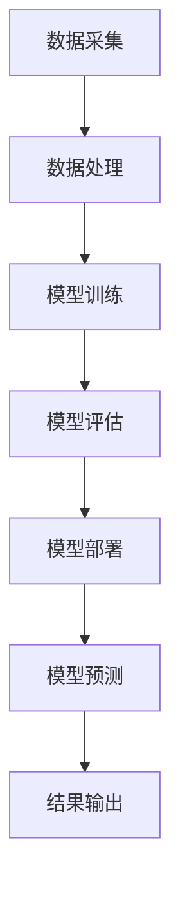

                 

### 摘要

随着大数据和人工智能技术的飞速发展，个人信用评分系统已成为金融机构和信用评级机构评估个人信用状况的重要工具。然而，现有的个人信用评分系统在数据处理、模型评估和优化方面仍存在诸多问题，难以满足日益复杂多变的金融环境需求。本文旨在探讨智能个人信用评分优化与修复建议系统的研究，通过引入先进的数据挖掘与机器学习技术，优化个人信用评分模型，提升评分的准确性和稳定性。文章首先分析了个人信用评分的重要性及其存在的问题，接着介绍了智能个人信用评分系统的核心概念与原理，详细讲解了特征工程、模型评估与优化的策略。随后，文章重点介绍了基于深度学习和增强学习的信用评分算法，并运用Python代码展示了其数学模型与公式。文章进一步从系统分析与架构设计的角度，详细阐述了系统功能模块、架构设计和系统交互。最后，通过实际项目案例展示了系统的应用效果，并提出了最佳实践与拓展建议。本文旨在为相关领域的研究者和从业人员提供有价值的参考。

### 目录大纲

**# 智能个人信用评分优化与修复建议系统**

**关键词：个人信用评分、数据挖掘、机器学习、深度学习、系统架构设计**

**摘要：** 本文探讨了智能个人信用评分优化与修复建议系统的研究，通过先进的技术手段提升评分系统的准确性和稳定性，详细介绍了核心概念、算法原理、数学模型、系统设计与项目实战，并提出了最佳实践与拓展建议。

**## 第一部分：背景与核心概念**

**## 第1章 问题背景与核心概念**
**### 1.1 个人信用评分的重要性**
**### 1.2 当前个人信用评分系统的问题**
**### 1.3 智能个人信用评分优化与修复的意义**
**### 1.4 智能个人信用评分系统的核心概念**
**### 1.5 智能个人信用评分系统的边界与外延**
**### 1.6 智能个人信用评分系统的要素组成与结构**

**## 第二部分：核心概念与联系**

**## 第2章 核心概念原理**
**### 2.1 数据挖掘与机器学习基础**
**#### 2.1.1 数据挖掘的基本流程**
**#### 2.1.2 机器学习的基本原理**
**### 2.2 特征工程与选择**
**#### 2.2.1 特征工程的重要性**
**#### 2.2.2 特征选择的常用方法**
**### 2.3 模型评估与优化**
**#### 2.3.1 评估指标与选择**
**#### 2.3.2 模型优化策略**

**## 第三部分：算法原理讲解**

**## 第3章 智能个人信用评分算法**
**### 3.1 传统评分模型**
**#### 3.1.1 神经网络模型**
**#### 3.1.2 支持向量机模型**
**### 3.2 深度学习模型**
**#### 3.2.1 卷积神经网络（CNN）**
**#### 3.2.2 循环神经网络（RNN）**
**#### 3.2.3 生成对抗网络（GAN）**
**### 3.3 基于深度增强学习的信用评分模型**
**#### 3.3.1 深度增强学习原理**
**#### 3.3.2 信用评分模型构建**

**## 第四部分：数学模型与公式讲解**

**## 第4章 数学模型与公式**
**### 4.1 数据处理公式**
**#### 4.1.1 数据清洗与预处理**
**#### 4.1.2 数据标准化与归一化**
**### 4.2 特征工程公式**
**#### 4.2.1 特征提取与选择**
**#### 4.2.2 特征交叉与融合**
**### 4.3 机器学习模型公式**
**#### 4.3.1 神经网络模型公式**
**#### 4.3.2 支持向量机模型公式**
**### 4.4 深度学习模型公式**
**#### 4.4.1 卷积神经网络（CNN）公式**
**#### 4.4.2 循环神经网络（RNN）公式**
**#### 4.4.3 生成对抗网络（GAN）公式**

**## 第五部分：系统分析与架构设计**

**## 第5章 系统分析与架构设计**
**### 5.1 问题场景介绍**
**### 5.2 系统功能设计**
**#### 5.2.1 领域模型设计**
**#### 5.2.2 系统功能模块划分**
**### 5.3 系统架构设计**
**#### 5.3.1 总体架构设计**
**#### 5.3.2 模块交互设计**
**### 5.4 系统接口设计**
**#### 5.4.1 接口规范定义**
**#### 5.4.2 接口安全与优化**
**### 5.5 系统交互设计**
**#### 5.5.1 系统交互流程**
**#### 5.5.2 系统性能优化**

**## 第六部分：项目实战**

**## 第6章 项目实战**
**### 6.1 环境安装**
**### 6.2 系统核心实现**
**#### 6.2.1 源代码解读**
**#### 6.2.2 代码应用解读与分析**
**### 6.3 实际案例分析**
**#### 6.3.1 案例一：信用评分优化**
**#### 6.3.2 案例二：信用评分修复**
**### 6.4 项目小结**

**## 第七部分：最佳实践与拓展**

**## 第7章 最佳实践与拓展**
**### 7.1 最佳实践**
**#### 7.1.1 数据处理最佳实践**
**#### 7.1.2 特征工程最佳实践**
**#### 7.1.3 模型优化最佳实践**
**### 7.2 小结**
**### 7.3 注意事项**
**### 7.4 拓展阅读**

### 第1章 问题背景与核心概念

#### 1.1 个人信用评分的重要性

个人信用评分是指金融机构、信用评级机构等通过分析个人的财务状况、历史信用记录、行为习惯等因素，对其信用风险进行量化评估的一种方法。这种评分不仅对金融机构的信贷决策起到关键作用，还对个人的日常生活产生深远影响。个人信用评分的重要性体现在以下几个方面：

1. **信贷决策的依据**：金融机构在审批贷款、信用卡申请等业务时，通常会参考个人信用评分。高信用评分的个人更容易获得贷款或信用卡，并且享受较低的利率。相反，低信用评分的个人则可能面临贷款申请被拒绝或高额利息的风险。

2. **消费信贷市场的基础**：随着消费信贷市场的蓬勃发展，个人信用评分已成为金融机构和消费者之间的重要桥梁。信用评分系统帮助金融机构更好地识别和管理信用风险，从而促进消费信贷市场的健康运行。

3. **社会信用体系建设**：个人信用评分是构建社会信用体系的重要组成部分。通过信用评分，可以促进社会成员的诚信行为，提高整体社会的信用水平。

4. **金融科技的创新应用**：随着大数据、人工智能等技术的发展，个人信用评分的应用场景不断扩展。例如，互联网贷款、信用租赁、信用保险等新兴业务模式，都依赖于个人信用评分系统的支持。

#### 1.2 当前个人信用评分系统的问题

尽管个人信用评分系统在金融领域中具有重要作用，但现有的系统在多个方面仍存在一些问题，这些问题影响了评分系统的准确性和稳定性，具体包括：

1. **数据来源单一**：许多现有的信用评分系统主要依赖借款人的信用历史记录，如信用卡账单、贷款还款记录等。这种单一的数据来源容易导致评分结果的不准确，无法全面反映个人的信用风险。

2. **特征选择不当**：特征工程是信用评分系统设计的关键步骤，但现有的系统往往缺乏对特征选择的深入分析，导致部分重要特征被忽视，而一些无关特征被过度重视。

3. **模型评估指标单一**：常见的信用评分模型评估指标包括准确率、召回率、F1分数等，但这些指标往往只关注某一方面的性能，无法全面评估模型的综合性能。

4. **模型优化不足**：现有的信用评分模型在优化过程中，往往只关注模型的预测性能，而忽略了模型的可解释性和鲁棒性。这使得模型在实际应用中可能出现偏差，影响其稳定性和可靠性。

5. **隐私保护问题**：个人信用评分系统涉及大量的个人隐私数据，如何在保障数据隐私的前提下进行数据处理和模型训练，是当前信用评分系统面临的一个重大挑战。

#### 1.3 智能个人信用评分优化与修复的意义

为了解决现有个人信用评分系统存在的问题，引入智能个人信用评分优化与修复建议系统具有重要意义，具体表现在以下几个方面：

1. **提升评分准确性**：通过引入先进的数据挖掘和机器学习技术，智能个人信用评分系统能够从多维度、多源数据中提取更多有价值的信息，从而提高信用评分的准确性。

2. **优化特征选择**：智能个人信用评分系统能够自动分析和选择关键特征，确保评分模型能够充分利用重要信息，同时降低无关特征的影响。

3. **多样化评估指标**：智能个人信用评分系统不仅关注传统评估指标，还引入了更多综合性能评估指标，如模型的可解释性、鲁棒性等，从而更全面地评估模型的性能。

4. **模型优化与调整**：通过持续学习和优化，智能个人信用评分系统可以根据实际应用情况，自动调整模型参数，提升模型的稳定性和可靠性。

5. **保障数据隐私**：智能个人信用评分系统在数据处理过程中，采用了一系列隐私保护技术，如数据匿名化、差分隐私等，确保个人隐私数据的安全。

#### 1.4 智能个人信用评分系统的核心概念

智能个人信用评分系统的核心概念包括数据挖掘与机器学习、特征工程、模型评估与优化、系统架构设计等。以下是这些核心概念的详细介绍：

1. **数据挖掘与机器学习**：数据挖掘是从大量数据中提取有价值信息的过程，而机器学习是数据挖掘的一种方法，通过构建模型从数据中学习规律。智能个人信用评分系统利用数据挖掘和机器学习技术，从多源数据中提取信息，构建信用评分模型。

2. **特征工程**：特征工程是信用评分模型设计的关键步骤，包括特征提取、特征选择和特征融合。通过合理设计特征，可以提高模型的预测性能和稳定性。

3. **模型评估与优化**：模型评估是判断模型性能的重要环节，常用的评估指标包括准确率、召回率、F1分数等。模型优化是通过调整模型参数、改进算法等手段，提升模型的预测性能。

4. **系统架构设计**：系统架构设计是确保智能个人信用评分系统稳定运行的基础，包括数据输入输出接口、数据处理模块、模型训练与评估模块、模型部署与优化模块等。

#### 1.5 智能个人信用评分系统的边界与外延

智能个人信用评分系统的边界与外延决定了其应用范围和功能。以下是系统的边界与外延的详细介绍：

1. **边界**：
   - **系统输入**：主要包括个人财务状况、信用历史记录、行为习惯等数据。
   - **系统输出**：个人信用评分结果，通常是一个数值或等级。
   - **数据来源**：包括金融机构、公共信用记录、社交媒体等。

2. **外延**：
   - **应用范围**：智能个人信用评分系统可以应用于金融机构的信贷决策、信用评级、信用保险等业务。
   - **功能扩展**：系统可以结合其他技术，如区块链、物联网等，实现更广泛的信用评估和管理。

#### 1.6 智能个人信用评分系统的要素组成与结构

智能个人信用评分系统的要素组成与结构决定了系统的功能实现和性能表现。以下是系统的要素组成与结构的详细介绍：

1. **要素组成**：
   - **数据采集模块**：负责收集个人财务状况、信用历史记录、行为习惯等数据。
   - **数据处理模块**：负责对采集到的数据进行清洗、预处理和特征提取。
   - **模型训练模块**：负责利用处理后的数据训练信用评分模型。
   - **模型评估模块**：负责评估模型的预测性能，并根据评估结果调整模型。
   - **模型部署模块**：负责将训练好的模型部署到生产环境中，供实际业务使用。

2. **系统结构**：
   - **输入层**：接收用户输入的数据。
   - **处理层**：包括数据处理模块、模型训练模块和模型评估模块，负责对数据进行处理、建模和评估。
   - **输出层**：输出个人信用评分结果。

### 第2章 核心概念原理

在构建智能个人信用评分优化与修复建议系统时，理解核心概念及其原理是至关重要的。本章将详细探讨数据挖掘与机器学习的基础、特征工程与选择、以及模型评估与优化的策略。

#### 2.1 数据挖掘与机器学习基础

**2.1.1 数据挖掘的基本流程**

数据挖掘是从大量数据中提取有价值信息的过程，其基本流程通常包括以下步骤：

1. **数据采集**：从各种数据源（如数据库、数据仓库、互联网等）中收集数据。
2. **数据清洗**：处理缺失值、异常值和重复数据，确保数据质量。
3. **数据预处理**：包括数据标准化、归一化和特征提取等，将数据转换为适合建模的形式。
4. **模式识别**：利用统计方法、机器学习算法等从数据中提取模式和规律。
5. **结果评估**：评估挖掘结果的有效性和实用性，并根据评估结果调整模型和算法。

**2.1.2 机器学习的基本原理**

机器学习是一种通过从数据中学习规律，进行预测或分类的技术。其基本原理包括：

1. **监督学习**：通过已标记的数据训练模型，然后用模型进行预测或分类。常见的监督学习算法包括线性回归、决策树、随机森林、支持向量机等。
2. **无监督学习**：不使用标记数据，直接从数据中提取结构和模式。常见的无监督学习算法包括聚类、主成分分析、自编码器等。
3. **强化学习**：通过与环境交互，不断调整行为策略，以实现最佳效果。常见的强化学习算法包括Q学习、深度Q网络（DQN）等。

#### 2.2 特征工程与选择

**2.2.1 特征工程的重要性**

特征工程是机器学习模型设计的关键步骤，其重要性体现在：

1. **特征提取**：将原始数据转换成具有信息性的特征，有助于模型更好地学习和预测。
2. **特征选择**：从众多特征中选择对模型预测性能有显著影响的特征，减少模型的复杂度，提高预测效率和准确性。
3. **特征标准化**：将不同量纲的特征转换为相同的尺度，避免特征之间的影响失衡。

**2.2.2 特征选择的常用方法**

特征选择的方法主要包括以下几类：

1. **过滤式特征选择**：通过评估特征与目标变量之间的相关性来选择特征，常用的评估指标包括相关系数、卡方检验等。
2. **包装式特征选择**：结合具体的机器学习算法进行特征选择，常用的方法包括递归特征消除（RFE）、遗传算法等。
3. **嵌入式特征选择**：在模型训练过程中自动选择特征，常用的算法包括L1正则化的线性模型、随机森林等。

#### 2.3 模型评估与优化

**2.3.1 评估指标与选择**

模型评估指标的选择直接影响模型的性能评估。常用的评估指标包括：

1. **分类指标**：准确率、召回率、F1分数、精确率等，适用于分类任务。
2. **回归指标**：均方误差（MSE）、均方根误差（RMSE）、平均绝对误差（MAE）等，适用于回归任务。
3. **聚类指标**：轮廓系数、内切球体积等，适用于聚类任务。

**2.3.2 模型优化策略**

模型优化包括以下几种策略：

1. **模型参数调优**：通过调整模型参数，优化模型的预测性能。常用的方法包括网格搜索、随机搜索等。
2. **特征变换**：通过特征变换，如主成分分析（PCA）、特征融合等，优化模型的输入特征。
3. **集成学习**：通过集成多个模型，提高模型的预测性能和泛化能力。常用的集成学习方法包括Bagging、Boosting、Stacking等。

通过以上对数据挖掘与机器学习基础、特征工程与选择、以及模型评估与优化策略的详细探讨，可以为构建智能个人信用评分优化与修复建议系统提供坚实的理论基础和技术支持。

#### 2.2.1 特征工程的重要性

特征工程是构建机器学习模型过程中至关重要的一环，其核心目的是从原始数据中提取出对模型预测性能有显著影响的特征。以下是特征工程重要性的详细分析：

1. **提升模型性能**：特征工程通过筛选、变换和组合原始数据中的特征，可以显著提高模型的预测准确性和效率。特征选择得当，能够帮助模型捕捉到数据中的关键信息，从而减少过拟合现象，提高模型对未知数据的泛化能力。

2. **降低数据复杂度**：原始数据通常包含大量的冗余信息和噪声，这些信息不仅增加了模型的复杂性，还会降低模型的预测性能。通过特征工程，可以去除冗余特征，简化数据结构，从而降低模型的计算复杂度。

3. **改进模型解释性**：特征工程有助于提高模型的解释性。通过对特征进行合理的选择和构造，可以使模型更加直观地反映数据中的关系和模式，从而便于理解和解释模型的预测结果。

4. **优化训练效率**：特征工程可以减少训练数据集的大小，缩短模型的训练时间，提高模型的训练效率。这对于大规模数据集和高维度特征尤其重要。

5. **提高模型稳健性**：通过特征工程，可以增强模型对异常值和噪声的鲁棒性。例如，通过标准化和归一化处理，可以减小不同特征之间的量纲差异，使得模型对噪声和异常值的影响更加均匀。

6. **促进模型对比与优化**：特征工程可以帮助研究者更有效地比较不同模型在特定数据集上的性能。通过改变特征集合，可以探索模型优化的不同路径，从而找到最适合当前问题的模型。

综上所述，特征工程在机器学习模型构建中扮演着至关重要的角色。通过合理的特征工程，可以显著提升模型的预测性能和稳定性，为智能个人信用评分优化与修复建议系统的成功应用提供有力支持。

#### 2.2.2 特征选择的常用方法

特征选择是特征工程中的关键步骤，其目的是从原始特征集中筛选出对模型预测性能有显著贡献的特征。以下介绍几种常见的特征选择方法：

1. **过滤式特征选择**：

过滤式特征选择方法通过评估特征与目标变量之间的相关性来筛选特征。具体方法如下：

- **相关性分析**：使用皮尔逊相关系数、斯皮尔曼相关系数等统计方法评估特征与目标变量之间的相关性。通常，相关性越高的特征越可能被保留。
- **卡方检验**：用于分类问题，评估特征与目标变量之间的独立关系。通过卡方检验，可以筛选出具有显著独立性的特征。
- **信息增益**：评估特征对分类决策的贡献，信息增益越高的特征越重要。

2. **包装式特征选择**：

包装式特征选择方法结合具体的机器学习算法进行特征选择，常见的包装式特征选择算法包括：

- **递归特征消除（RFE）**：通过递归地去除最不重要的特征，并逐步训练模型，评估每个特征的重要性。
- **遗传算法**：通过模拟自然进化过程，寻找最优特征组合。遗传算法能够搜索全局最优解，适用于复杂特征选择问题。
- **L1正则化**：L1正则化是一种在模型训练过程中自动选择特征的策略，它通过增加L1范数惩罚项，使得模型参数稀疏，从而实现特征选择。

3. **嵌入式特征选择**：

嵌入式特征选择方法在模型训练过程中自动选择特征，常见于线性模型和树模型。具体方法如下：

- **Lasso**：Lasso（Least Absolute Shrinkage and Selection Operator）通过L1正则化实现特征选择，能够在减少模型复杂度的同时，自动筛选出重要的特征。
- **随机森林**：随机森林通过随机抽样和特征选择构建多个决策树，并利用投票机制确定最终预测结果。随机森林在训练过程中，可以自动选择对预测性能有显著贡献的特征。

特征选择的常用方法各具特点，研究者可以根据具体问题和数据集的特点选择合适的方法。在实际应用中，可以结合多种方法，如先使用过滤式方法进行初步筛选，再使用包装式或嵌入式方法进行进一步的优化。

#### 2.3.1 评估指标与选择

在机器学习领域，模型评估是判断模型性能的重要环节。选择合适的评估指标，能够准确地反映模型在预测任务中的表现。以下是几种常见的评估指标及其选择依据：

1. **分类指标**：

对于分类任务，常用的评估指标包括：

- **准确率（Accuracy）**：准确率是分类正确的样本数占总样本数的比例。计算公式为：$$\text{Accuracy} = \frac{\text{分类正确数}}{\text{总样本数}}$$。准确率适用于分类标签较为均匀的数据集，但在标签不平衡的情况下可能不准确。
- **召回率（Recall）**：召回率是指分类模型能够正确识别为正类的样本数占所有实际为正类的样本数的比例。计算公式为：$$\text{Recall} = \frac{\text{分类正确正类数}}{\text{实际正类总数}}$$。召回率关注的是模型对正类的识别能力。
- **精确率（Precision）**：精确率是指分类模型预测为正类的样本中，实际为正类的比例。计算公式为：$$\text{Precision} = \frac{\text{分类正确正类数}}{\text{预测为正类总数}}$$。精确率关注的是模型预测的准确性。
- **F1分数（F1 Score）**：F1分数是精确率和召回率的调和平均值，综合考虑了模型的精确性和召回率。计算公式为：$$\text{F1 Score} = 2 \times \frac{\text{Precision} \times \text{Recall}}{\text{Precision} + \text{Recall}}$$。F1分数在处理标签不平衡问题时尤为重要。
- **精确率-召回率曲线（Precision-Recall Curve）**：精确率和召回率曲线可以直观地展示模型在不同阈值下的表现。曲线下方面积（Area Under Curve, AUC）是评估模型性能的另一个重要指标。

2. **回归指标**：

对于回归任务，常用的评估指标包括：

- **均方误差（Mean Squared Error, MSE）**：均方误差是预测值与实际值之间差的平方的平均值。计算公式为：$$\text{MSE} = \frac{1}{n}\sum_{i=1}^{n}(\hat{y}_i - y_i)^2$$，其中 $\hat{y}_i$ 是预测值，$y_i$ 是实际值。MSE对异常值较为敏感。
- **均方根误差（Root Mean Squared Error, RMSE）**：均方根误差是均方误差的平方根。计算公式为：$$\text{RMSE} = \sqrt{\text{MSE}}$$。RMSE具有较好的可解释性。
- **平均绝对误差（Mean Absolute Error, MAE）**：平均绝对误差是预测值与实际值之间差的绝对值的平均值。计算公式为：$$\text{MAE} = \frac{1}{n}\sum_{i=1}^{n}|\hat{y}_i - y_i|$$。MAE对异常值相对不敏感。
- **决定系数（Coefficient of Determination, R²）**：决定系数衡量模型对数据的解释能力，取值范围在0到1之间。计算公式为：$$R^2 = 1 - \frac{\sum_{i=1}^{n}(\hat{y}_i - y_i)^2}{\sum_{i=1}^{n}(y_i - \bar{y})^2}$$，其中 $\bar{y}$ 是实际值的平均值。

选择评估指标时，应考虑任务类型、数据集特性以及业务需求。例如，在处理标签不平衡的问题时，应优先考虑召回率和F1分数。而在回归任务中，MAE和RMSE比MSE更常用。通过合理选择评估指标，可以更准确地评估模型性能，为后续优化提供依据。

#### 2.3.2 模型优化策略

模型优化是提升机器学习模型性能的关键步骤，通过调整模型参数、改进算法和优化特征，可以显著提高模型的预测准确性和泛化能力。以下介绍几种常见的模型优化策略：

1. **模型参数调优**：

模型参数调优是通过调整模型中的超参数，优化模型性能的过程。常用的参数调优方法包括：

- **网格搜索（Grid Search）**：网格搜索是一种遍历所有可能的参数组合，找到最优参数的方法。其优点是搜索范围广，但计算量大。适用于参数较少的情况。
- **随机搜索（Random Search）**：随机搜索从所有可能的参数组合中随机选择一部分进行搜索，减少了计算量。适用于参数较多或计算资源有限的情况。
- **贝叶斯优化（Bayesian Optimization）**：贝叶斯优化是一种基于贝叶斯推理和马尔可夫链蒙特卡罗（MCMC）方法的参数调优技术。它通过建立模型概率分布，自动搜索最优参数，具有较高的效率和精度。

2. **特征变换**：

特征变换是通过改变特征的表示形式，提高模型性能的方法。常见的特征变换包括：

- **主成分分析（Principal Component Analysis, PCA）**：PCA是一种降维技术，通过将数据投影到主成分空间，减少数据维度。PCA可以消除特征间的相关性，提高模型对噪声的鲁棒性。
- **特征融合（Feature Fusion）**：特征融合是将多个特征组合成一个新的特征，以增强模型的学习能力。常见的特征融合方法包括特征加权、特征拼接等。
- **特征标准化（Feature Scaling）**：特征标准化是通过将特征值缩放到相同的尺度，避免不同量纲的特征对模型产生不同的影响。常用的标准化方法包括最小-最大缩放和Z分数标准化。

3. **集成学习**：

集成学习是将多个模型组合起来，提高整体预测性能的方法。常见的集成学习方法包括：

- **Bagging（Bootstrap Aggregating）**：Bagging通过随机抽样和训练多个模型，然后通过投票或平均的方式生成最终预测结果。Bagging可以减少模型的方差，提高模型的泛化能力。
- **Boosting（Adaptive Boosting）**：Boosting通过将多个弱学习器组合成一个强学习器，每个学习器关注之前学习器未正确分类的样本。常见的Boosting算法包括AdaBoost、XGBoost等。
- **Stacking（Stacked Generalization）**：Stacking是一种分层学习方法，通过训练多个基础模型，并将它们的预测结果作为新特征输入到另一个模型中进行预测。Stacking可以进一步提高模型的性能和泛化能力。

通过以上模型优化策略，可以显著提升机器学习模型的性能，为实际应用提供更有力的支持。

### 第3章 智能个人信用评分算法

智能个人信用评分算法是构建智能个人信用评分优化与修复建议系统的核心。本章将详细介绍几种常见的信用评分算法，包括传统评分模型和深度学习模型，并重点探讨基于深度增强学习的信用评分模型。

#### 3.1 传统评分模型

传统评分模型主要依赖于统计方法和经典机器学习算法，这类模型在信用评分领域已有广泛应用。以下介绍两种常见的传统评分模型：神经网络模型和支撑向量机（SVM）模型。

**3.1.1 神经网络模型**

神经网络模型，尤其是多层感知机（MLP），是信用评分领域的一种常用模型。MLP通过多层的神经元节点，对输入特征进行非线性变换，以实现对复杂信用评分任务的学习。

**神经网络模型的工作原理：**

1. **输入层**：接收个人信用评分数据的特征输入。
2. **隐藏层**：通过激活函数（如ReLU、Sigmoid、Tanh）对输入特征进行非线性变换。
3. **输出层**：输出个人信用评分结果，可以是概率分布或直接评分值。

**神经网络模型的关键参数：**

- **层数**：网络层数越多，模型捕捉复杂性的能力越强，但也容易过拟合。
- **神经元数量**：每层的神经元数量影响模型的复杂度和学习能力。
- **学习率**：学习率控制模型参数更新的速度，过大可能导致不稳定，过小可能导致收敛缓慢。

**3.1.2 支撑向量机（SVM）模型**

SVM是一种基于最大间隔分类器的监督学习算法，通过找到一个超平面，使分类间隔最大化，从而实现数据的分类。SVM在信用评分领域，尤其是二分类任务中表现出色。

**SVM模型的工作原理：**

1. **特征空间映射**：通过核函数将原始特征空间映射到一个更高维的特征空间。
2. **最大间隔分类**：找到使分类间隔最大的超平面，该超平面将数据分为两类。
3. **决策边界**：新的样本通过计算其到超平面的距离来判断归属类别。

**SVM模型的关键参数：**

- **核函数**：核函数的选择影响特征空间映射的复杂度和计算效率，常用的有线性核、多项式核、径向基函数（RBF）核等。
- **正则化参数C**：C值控制模型对误分类的惩罚程度，C值越大，模型对误分类的惩罚越严重。

#### 3.2 深度学习模型

深度学习模型通过多层神经网络结构，能够自动学习数据中的复杂特征和模式，从而在信用评分领域表现出强大的预测能力。以下介绍三种常见的深度学习模型：卷积神经网络（CNN）、循环神经网络（RNN）和生成对抗网络（GAN）。

**3.2.1 卷积神经网络（CNN）**

CNN是一种专门用于处理图像数据的深度学习模型，其核心思想是通过卷积操作和池化操作提取图像特征。在信用评分领域，CNN可以用于提取个人信用历史记录中的关键特征。

**CNN的工作原理：**

1. **卷积层**：卷积层通过卷积操作提取图像特征，卷积核在输入数据上滑动，计算局部特征。
2. **池化层**：池化层通过最大值池化或平均池化降低数据维度，减少计算量。
3. **全连接层**：全连接层将卷积层和池化层提取的特征进行融合，输出分类结果。

**CNN的关键参数：**

- **卷积核大小**：卷积核的大小影响特征提取的局部范围。
- **池化窗口大小**：池化窗口大小影响特征降维的效果。

**3.2.2 循环神经网络（RNN）**

RNN是一种能够处理序列数据的神经网络，特别适合处理时间序列数据和信用历史记录。RNN通过循环机制，能够记忆序列中的长期依赖信息。

**RNN的工作原理：**

1. **输入层**：接收时间序列的输入。
2. **隐藏层**：通过门控机制（如门控循环单元GRU、长短期记忆LSTM）处理序列中的依赖关系。
3. **输出层**：输出序列的预测结果。

**RNN的关键参数：**

- **门控机制**：门控机制（如遗忘门、输入门、输出门）控制信息的流动，避免梯度消失和爆炸问题。
- **序列长度**：序列长度影响模型对时间序列信息的记忆能力。

**3.2.3 生成对抗网络（GAN）**

GAN是一种由生成器和判别器组成的对抗性神经网络，通过生成器和判别器的对抗训练，生成高质量的信用评分数据。

**GAN的工作原理：**

1. **生成器**：生成器通过随机噪声生成伪造的信用评分数据。
2. **判别器**：判别器区分真实的信用评分数据和生成器生成的伪造数据。
3. **对抗训练**：生成器和判别器通过交替训练，生成器不断提高伪造数据的逼真度，判别器不断提高对伪造数据的辨别能力。

**GAN的关键参数：**

- **噪声分布**：噪声分布影响生成器的生成能力。
- **训练轮次**：训练轮次控制生成器和判别器的训练深度。

#### 3.3 基于深度增强学习的信用评分模型

深度增强学习（Deep Reinforcement Learning, DRL）结合了深度学习和强化学习的优势，通过策略网络和价值网络，实现自动化的信用评分优化。以下介绍DRL的基本原理和在信用评分模型中的应用。

**3.3.1 深度增强学习原理**

深度增强学习的基本原理包括：

1. **策略网络**：策略网络通过学习从状态到动作的映射，生成最优动作策略。
2. **价值网络**：价值网络评估当前状态的价值，指导策略网络选择最优动作。
3. **环境交互**：环境与策略网络交互，通过反馈信号调整策略网络的参数。

**DRL的关键组成部分：**

- **状态（State）**：信用评分系统的当前状态，包括用户特征、历史信用记录等。
- **动作（Action）**：策略网络选择的最优动作，如调整评分模型参数、特征权重等。
- **奖励（Reward）**：环境根据动作的结果给予的奖励，奖励越高表示动作越优。

**3.3.2 信用评分模型构建**

基于深度增强学习的信用评分模型构建过程如下：

1. **初始化策略网络和价值网络**：使用随机权重初始化策略网络和价值网络。
2. **状态输入**：将用户的信用历史记录和特征作为状态输入策略网络。
3. **动作生成**：策略网络根据当前状态生成一组可能的动作。
4. **动作评估**：价值网络评估每个动作的预期奖励，选择最优动作。
5. **环境反馈**：执行最优动作后，环境给出实际奖励，用于更新策略网络和价值网络的参数。
6. **参数更新**：通过优化算法（如Adam优化器），调整策略网络和价值网络的参数，提高信用评分模型的预测性能。

通过以上介绍，智能个人信用评分算法不仅涵盖了传统评分模型，还引入了深度学习模型和深度增强学习模型，为构建高效、准确的信用评分系统提供了多样化的选择和丰富的理论支持。

#### 3.3.1 深度增强学习原理

深度增强学习（Deep Reinforcement Learning, DRL）是一种结合了深度学习和强化学习的先进技术，旨在通过智能体与环境交互，学习最优策略。以下是深度增强学习的基本原理：

**1. 策略网络**

策略网络是DRL中的核心组件之一，负责从当前状态生成最优动作。具体原理如下：

- **状态表示**：将环境状态编码为特征向量，用于输入策略网络。
- **动作生成**：策略网络通过一个前馈神经网络，将状态特征映射到动作概率分布。例如，对于一个分类任务，策略网络可能输出一个softmax分布，表示每个类别的概率。

**2. 价值网络**

价值网络评估当前状态下执行某一动作的预期回报，指导策略网络选择最优动作。其原理包括：

- **状态-动作值函数**：价值网络通过学习一个状态-动作值函数，估计当前状态下执行某一动作的长期回报。状态-动作值函数通常表示为 $V(s, a)$。
- **回报累积**：通过回报累积函数（如伽马因子 $\gamma$），将未来的回报折扣到当前时刻，以便价值网络能够考虑长期回报。

**3. 环境交互**

在DRL中，智能体与环境不断进行交互，通过反馈信号学习最优策略。具体交互过程包括：

- **状态输入**：智能体从环境中获取当前状态。
- **动作选择**：策略网络根据当前状态生成动作概率分布，并从分布中采样选择动作。
- **执行动作**：智能体在环境中执行所选动作。
- **回报反馈**：环境根据动作结果，给予智能体即时回报。
- **状态更新**：执行动作后，智能体进入新的状态，重复上述交互过程。

**4. 参数更新**

DRL通过优化策略网络和价值网络的参数，不断提高模型性能。参数更新过程通常包括：

- **策略梯度**：计算策略梯度，指导策略网络参数更新。策略梯度的计算公式为：$\nabla_{\theta_\pi} J(\theta_\pi) = \nabla_{\theta_\pi} \sum_{t=0}^T \gamma^t r(s_t, a_t, s_{t+1})$，其中 $\theta_\pi$ 是策略网络参数，$J(\theta_\pi)$ 是策略损失函数。
- **价值迭代**：通过反向传播和梯度下降，更新价值网络参数，使状态-动作值函数更接近实际回报。

**5. 反复迭代**

DRL通过反复迭代上述过程，不断优化策略网络和价值网络的参数，逐步提高信用评分模型的预测性能和稳定性。

#### 3.3.2 信用评分模型构建

基于深度增强学习的信用评分模型构建过程可以分为以下几个关键步骤：

**1. 状态表示**

构建信用评分模型的第一步是定义状态表示。状态表示通常包括以下几个方面：

- **用户特征**：如年龄、收入、职业、教育背景等。
- **历史信用记录**：如还款记录、逾期记录、信用额度等。
- **外部环境因素**：如经济指标、市场波动等。

状态表示的具体形式可以是一个高维特征向量，通过预处理和特征工程将原始数据进行编码和标准化。

**2. 动作表示**

动作表示定义了策略网络可以执行的操作。在信用评分模型中，动作可能包括：

- **调整特征权重**：根据用户特征和历史记录，调整各特征的权重，以优化评分模型。
- **调整评分阈值**：根据模型预测结果，调整评分阈值，以控制信用风险的接受程度。

动作表示通常是一个离散集合，每个动作对应一个策略网络输出的概率分布。

**3. 回报设计**

回报设计是深度增强学习模型训练的核心环节。回报设计需要考虑以下几个因素：

- **即时回报**：如模型预测的信用评分与实际评分之间的误差。
- **长期回报**：如用户信用风险的累计损失。
- **奖励惩罚**：对于评分模型中出现的错误预测，给予较大的惩罚，以促使模型优化。

回报设计需要平衡即时回报和长期回报，避免模型过于关注短期效果而忽视长期目标。

**4. 策略网络**

策略网络是DRL中的核心组件，负责从状态生成最优动作。策略网络通常采用深度神经网络结构，其输入是状态特征，输出是动作概率分布。

**5. 价值网络**

价值网络评估当前状态下执行某一动作的预期回报。价值网络也采用深度神经网络结构，其输入是状态-动作对，输出是预期回报。

**6. 训练与优化**

深度增强学习模型的训练和优化过程包括以下几个步骤：

- **初始化策略网络和价值网络**：使用随机权重初始化策略网络和价值网络。
- **状态输入**：将当前状态输入策略网络，生成动作概率分布。
- **动作选择**：从动作概率分布中采样选择动作。
- **执行动作**：在环境中执行所选动作，获取即时回报和新的状态。
- **参数更新**：通过策略梯度和价值梯度，更新策略网络和价值网络参数。
- **迭代训练**：重复上述过程，逐步优化模型参数，提高信用评分模型的性能。

通过以上步骤，基于深度增强学习的信用评分模型可以逐步优化，实现高效的信用评分预测。

### 第4章 数学模型与公式

在智能个人信用评分优化与修复建议系统中，数学模型与公式是理解和实现核心算法的关键。本章将详细讲解数据处理公式、特征工程公式、以及机器学习模型和深度学习模型的公式。

#### 4.1 数据处理公式

数据预处理是构建智能个人信用评分系统的基础步骤，主要包括数据清洗与预处理、数据标准化与归一化等。以下为相关数据处理公式的讲解：

**4.1.1 数据清洗与预处理**

数据清洗与预处理是确保数据质量的过程，主要包括以下几个方面：

1. **缺失值处理**：缺失值处理方法包括：
   - **删除缺失值**：删除含有缺失值的样本，适用于缺失值比例较低的情况。
   - **填充缺失值**：使用统计方法（如均值、中位数、最频数）或模型预测（如线性回归、KNN等）填充缺失值。

2. **异常值处理**：异常值处理方法包括：
   - **删除异常值**：删除明显偏离数据集中趋势的异常值。
   - **调整异常值**：对异常值进行变换，如将其替换为边界值或使用插值法调整。

3. **重复值处理**：删除数据集中的重复值，确保数据的唯一性。

**4.1.2 数据标准化与归一化**

数据标准化与归一化是使不同量纲的特征具有可比性的过程，主要包括以下方法：

1. **最小-最大标准化**：将数据缩放到[0,1]范围内。计算公式为：
   $$ x_{\text{std}} = \frac{x - \min(x)}{\max(x) - \min(x)} $$
   
2. **Z分数标准化**：将数据缩放到均值为0，标准差为1的范围内。计算公式为：
   $$ x_{\text{z-score}} = \frac{x - \mu}{\sigma} $$
   其中，$x$ 是原始数据，$\mu$ 是均值，$\sigma$ 是标准差。

3. **小数点移位**：通过将小数点向右或左移位，将数据转换为整数，以简化计算。

#### 4.2 特征工程公式

特征工程是提升模型性能的关键步骤，包括特征提取、特征选择、特征交叉与融合等。以下为相关特征工程公式的讲解：

**4.2.1 特征提取与选择**

1. **特征提取**：通过统计方法、数据变换等手段从原始数据中提取新的特征。

   - **统计特征**：如均值、中位数、标准差、方差等。计算公式为：
     $$ \mu = \frac{1}{n}\sum_{i=1}^{n} x_i $$
     $$ \sigma^2 = \frac{1}{n-1}\sum_{i=1}^{n} (x_i - \mu)^2 $$

   - **变换特征**：如对数变换、指数变换等。计算公式为：
     $$ \log(x) $$
     $$ e^x $$

2. **特征选择**：通过评估特征的重要性，选择对模型预测性能有显著贡献的特征。

   - **过滤式特征选择**：使用相关性分析、信息增益等方法评估特征重要性。计算公式为：
     $$ \rho(x, y) = \frac{\sum_{i=1}^{n} (x_i - \mu_x)(y_i - \mu_y)}{\sqrt{\sum_{i=1}^{n} (x_i - \mu_x)^2 \sum_{i=1}^{n} (y_i - \mu_y)^2} $$

   - **包装式特征选择**：结合具体算法，通过递归特征消除（RFE）、遗传算法等选择重要特征。

**4.2.2 特征交叉与融合**

1. **特征交叉**：将不同特征组合生成新的特征。计算公式为：
   $$ x_{\text{cross}} = f(x_1, x_2) $$

2. **特征融合**：将多个特征合并为一个综合特征。计算公式为：
   $$ x_{\text{fusion}} = w_1 x_1 + w_2 x_2 + ... + w_n x_n $$
   其中，$w_i$ 是特征权重。

#### 4.3 机器学习模型公式

机器学习模型是智能个人信用评分系统的核心组成部分，包括线性回归、逻辑回归、决策树等。以下为相关机器学习模型公式的讲解：

**4.3.1 神经网络模型公式**

1. **前向传播**：
   $$ z = Wx + b $$
   $$ a = \sigma(z) $$
   其中，$z$ 是线性变换结果，$a$ 是激活值，$W$ 是权重矩阵，$b$ 是偏置项，$\sigma$ 是激活函数（如Sigmoid、ReLU等）。

2. **反向传播**：
   $$ \delta = \frac{\partial L}{\partial z} \cdot \sigma'(z) $$
   $$ \frac{\partial L}{\partial W} = \delta x^T $$
   $$ \frac{\partial L}{\partial b} = \delta $$
   其中，$\delta$ 是误差梯度，$L$ 是损失函数，$\sigma'$ 是激活函数的导数。

3. **梯度下降**：
   $$ W_{\text{new}} = W_{\text{old}} - \alpha \frac{\partial L}{\partial W} $$
   $$ b_{\text{new}} = b_{\text{old}} - \alpha \frac{\partial L}{\partial b} $$
   其中，$\alpha$ 是学习率。

**4.3.2 支持向量机（SVM）模型公式**

1. **线性SVM**：
   $$ \min_{\mathbf{w}, b} \frac{1}{2} \|\mathbf{w}\|^2 $$
   $$ s.t. y_i (\mathbf{w} \cdot \mathbf{x_i} + b) \geq 1 $$

2. **核函数**：
   $$ K(\mathbf{x_i}, \mathbf{x_j}) = \phi(\mathbf{x_i}) \cdot \phi(\mathbf{x_j}) $$
   其中，$K$ 是核函数，$\phi$ 是特征映射函数。

**4.3.3 决策树模型公式**

1. **信息增益**：
   $$ IG(D, A) = H(D) - H(D|A) $$
   其中，$H(D)$ 是数据集 $D$ 的熵，$H(D|A)$ 是条件熵。

2. **基尼不纯度**：
   $$ Gini(D, A) = 1 - \sum_{v \in A} \left(\frac{|D_v|}{|D|}\right)^2 $$
   其中，$D_v$ 是属性 $A$ 的值。

#### 4.4 深度学习模型公式

深度学习模型包括卷积神经网络（CNN）、循环神经网络（RNN）、生成对抗网络（GAN）等。以下为相关深度学习模型公式的讲解：

**4.4.1 卷积神经网络（CNN）公式**

1. **卷积操作**：
   $$ h_{ij}^l = \sum_{k=1}^{K} w_{ikj}^l * g_{kj}^{l-1} + b_j^l $$
   其中，$h_{ij}^l$ 是输出特征图上的第 $i$ 行第 $j$ 列的值，$w_{ikj}^l$ 是卷积核上的值，$g_{kj}^{l-1}$ 是输入特征图上的值，$b_j^l$ 是偏置项。

2. **池化操作**：
   $$ p_{ij}^l = \max_{(m,n)} h_{ij}^{l-1}(m,n) $$
   其中，$p_{ij}^l$ 是输出特征图上的第 $i$ 行第 $j$ 列的值，$h_{ij}^{l-1}$ 是输入特征图上的值。

**4.4.2 循环神经网络（RNN）公式**

1. **状态更新**：
   $$ h_t = \sigma(W_h h_{t-1} + W_x x_t + b_h) $$
   其中，$h_t$ 是当前时刻的隐藏状态，$x_t$ 是输入特征，$W_h$ 和 $W_x$ 是权重矩阵，$b_h$ 是偏置项，$\sigma$ 是激活函数。

2. **输出计算**：
   $$ y_t = \sigma(W_y h_t + b_y) $$
   其中，$y_t$ 是当前时刻的输出，$W_y$ 是输出权重矩阵，$b_y$ 是输出偏置项。

**4.4.3 生成对抗网络（GAN）公式**

1. **生成器损失**：
   $$ L_G = -\mathbb{E}_{z \sim p_z(z)}[\log(D(G(z)))] $$

2. **判别器损失**：
   $$ L_D = -\mathbb{E}_{x \sim p_x(x)}[\log(D(x))] - \mathbb{E}_{z \sim p_z(z)}[\log(1 - D(G(z)))] $$

其中，$G(z)$ 是生成器生成的样本，$D(x)$ 是判别器对真实样本的判断，$p_z(z)$ 和 $p_x(x)$ 分别是生成器和真实数据的概率分布。

通过以上数学模型与公式的讲解，我们可以更好地理解智能个人信用评分优化与修复建议系统中各项算法的实现原理，为实际应用提供理论支持。

### 第5章 系统分析与架构设计

在智能个人信用评分优化与修复建议系统的设计与实现过程中，系统分析与架构设计是至关重要的环节。本章将详细介绍系统的分析与架构设计，包括问题场景介绍、系统功能设计、系统架构设计、系统接口设计以及系统交互设计。

#### 5.1 问题场景介绍

随着金融科技的发展，个人信用评分系统在金融领域的应用越来越广泛。然而，现有系统在多个方面存在不足，主要体现在以下问题场景：

1. **数据多样性不足**：传统信用评分系统主要依赖借款人的信用历史记录，如信用卡账单、贷款还款记录等。然而，随着互联网金融的发展，个人的行为数据、社交数据等新兴数据源对信用评分的影响越来越大，现有系统无法充分利用这些数据源。

2. **评分准确性不高**：现有信用评分系统在评分准确性方面存在瓶颈，难以应对复杂多变的金融环境。这主要体现在模型特征选择不当、模型评估指标单一以及模型优化不足等方面。

3. **系统可扩展性不足**：随着用户数量的增加和数据量的增长，现有系统在处理能力和扩展性方面面临挑战，难以满足大规模数据处理需求。

4. **隐私保护不足**：个人信用评分系统涉及大量的个人隐私数据，如何在保障数据隐私的前提下进行数据处理和模型训练，是当前信用评分系统面临的一个重大挑战。

#### 5.2 系统功能设计

智能个人信用评分优化与修复建议系统的主要功能包括数据采集、数据处理、模型训练、模型评估以及模型部署。以下是系统功能设计的详细说明：

**5.2.1 数据采集模块**

数据采集模块负责从各种数据源收集个人财务状况、信用历史记录、行为数据等。数据源包括金融机构、公共信用记录、社交媒体等。数据采集模块需保证数据的安全性和实时性，为后续数据处理提供高质量的数据输入。

**5.2.2 数据处理模块**

数据处理模块负责对采集到的数据进行清洗、预处理和特征提取。具体包括：

1. **数据清洗**：处理缺失值、异常值和重复数据，确保数据质量。
2. **数据预处理**：包括数据标准化、归一化等，将数据转换为适合建模的形式。
3. **特征提取**：通过统计方法、数据变换等手段提取新的特征，提高模型对数据中潜在模式的捕捉能力。

**5.2.3 模型训练模块**

模型训练模块利用处理后的数据训练信用评分模型。具体包括：

1. **模型选择**：根据业务需求和数据特性选择合适的机器学习模型或深度学习模型。
2. **模型训练**：使用训练数据集进行模型训练，优化模型参数，提高模型性能。
3. **模型评估**：通过交叉验证等手段评估模型性能，确保模型在未知数据上具有较好的泛化能力。

**5.2.4 模型评估模块**

模型评估模块负责对训练好的模型进行评估，以确定其预测性能。常用的评估指标包括准确率、召回率、F1分数等。模型评估模块还需根据评估结果对模型进行优化和调整。

**5.2.5 模型部署模块**

模型部署模块将训练好的模型部署到生产环境中，供实际业务使用。具体包括：

1. **模型部署**：将模型转换为生产环境可执行的格式，如ONNX、TensorFlow Lite等。
2. **接口设计**：设计系统的API接口，提供模型预测功能，便于外部系统调用。
3. **性能优化**：对模型部署过程进行性能优化，确保系统在高并发场景下仍能稳定运行。

#### 5.3 系统架构设计

智能个人信用评分优化与修复建议系统的架构设计包括总体架构设计和模块交互设计。以下是系统架构设计的详细说明：

**5.3.1 总体架构设计**

系统的总体架构设计分为数据层、服务层和表现层。

1. **数据层**：包括数据采集模块和数据处理模块，负责数据的采集、清洗、预处理和特征提取。数据层确保数据的质量和完整性，为后续模型训练和评估提供高质量的数据输入。

2. **服务层**：包括模型训练模块、模型评估模块和模型部署模块，负责模型的训练、评估和部署。服务层实现系统的核心功能，通过微服务架构实现模块的解耦和扩展。

3. **表现层**：包括前端界面和API接口，提供用户交互和外部系统调用的功能。表现层实现系统的易用性和可扩展性，方便用户和管理员对系统进行操作和监控。

**5.3.2 模块交互设计**

系统中的各个模块通过API接口进行交互，确保数据流和功能流的畅通。以下是模块交互设计的详细说明：

1. **数据流交互**：数据采集模块采集到的数据通过API接口传递给数据处理模块，经过清洗、预处理和特征提取后，再传递给模型训练模块。

2. **功能流交互**：模型训练模块训练好的模型通过API接口传递给模型评估模块，进行性能评估。根据评估结果，模型评估模块对模型进行优化和调整，最终通过API接口将优化后的模型传递给模型部署模块进行部署。

3. **外部交互**：前端界面和外部系统通过API接口与系统进行交互，前端界面提供用户操作界面，外部系统通过API接口调用模型预测功能。

通过以上系统分析与架构设计，智能个人信用评分优化与修复建议系统实现了数据采集、处理、模型训练、评估和部署的全流程，确保了系统的高效性和可扩展性，为金融领域提供了强大的信用评分解决方案。

#### 5.4 系统接口设计

系统接口设计是智能个人信用评分优化与修复建议系统的关键部分，决定了系统与其他系统或组件的交互方式。以下是系统接口设计的详细说明：

**5.4.1 接口规范定义**

接口规范定义了系统各个模块之间的交互规则和协议。具体包括以下几个方面：

1. **数据格式**：定义输入输出数据的数据格式，如JSON、XML等。确保数据在各模块之间传递时的一致性和准确性。

2. **API端点**：定义系统提供的API端点，如数据采集接口、数据处理接口、模型训练接口、模型评估接口等。每个端点对应一个具体的操作，如数据上传、模型预测等。

3. **参数说明**：详细说明每个接口的输入参数和输出参数，包括参数的类型、范围、约束条件等。确保开发者在使用接口时能够准确传递参数。

4. **错误处理**：定义接口的异常处理机制，包括错误码、错误消息等。确保接口在遇到异常情况时能够正确处理并返回合理的错误信息。

**5.4.2 接口安全与优化**

接口安全与优化是保障系统稳定运行和防止恶意攻击的重要环节。以下是接口安全与优化的具体措施：

1. **身份验证与授权**：通过身份验证和授权机制，确保只有合法用户才能访问系统接口。常见的身份验证方式包括用户名密码、OAuth2.0、JWT等。

2. **接口签名与加密**：对接口请求进行签名和加密，确保数据在传输过程中不被篡改。常见的加密算法包括SHA256、AES等。

3. **限流与防刷**：通过限流和防刷机制，防止恶意攻击和过度访问。常见的限流方式包括令牌桶算法、漏斗算法等。

4. **监控与日志**：对接口访问进行监控和日志记录，及时发现和处理异常情况。通过日志分析，可以了解接口的使用情况和性能瓶颈，为优化接口提供数据支持。

5. **性能优化**：通过优化接口设计和实现，提高接口的响应速度和并发处理能力。常见的优化方法包括接口缓存、异步处理、负载均衡等。

通过以上接口设计与安全优化措施，智能个人信用评分优化与修复建议系统能够确保接口的可靠性、安全性和高性能，为系统的稳定运行提供有力保障。

#### 5.5 系统交互设计

系统交互设计是智能个人信用评分优化与修复建议系统架构设计的重要组成部分，它定义了系统内部以及与外部系统之间的交互流程和逻辑。以下是系统交互设计的详细说明：

**5.5.1 系统交互流程**

智能个人信用评分优化与修复建议系统的交互流程主要包括以下步骤：

1. **数据采集**：数据采集模块从金融机构、公共信用记录、社交媒体等多渠道收集个人财务状况、信用历史记录、行为数据等。

2. **数据处理**：数据处理模块接收采集到的数据，对其进行清洗、预处理和特征提取。清洗过程包括去除缺失值、异常值和重复值，预处理包括数据标准化和归一化，特征提取则通过统计方法、数据变换等手段生成新的特征。

3. **模型训练**：模型训练模块接收处理后的数据，选择合适的机器学习模型或深度学习模型进行训练。模型训练过程中，通过调整参数和优化算法，提高模型预测性能。

4. **模型评估**：模型评估模块对训练好的模型进行评估，使用交叉验证等方法评估模型在训练集和测试集上的性能，选择最优模型。

5. **模型部署**：模型部署模块将评估后的最优模型部署到生产环境中，生成可执行的API接口，供外部系统调用。

6. **模型预测**：外部系统通过调用API接口，向模型输入新的数据，获取信用评分结果。

**5.5.2 系统交互流程图**

为了更好地展示系统交互流程，可以使用Mermaid绘制以下流程图：



**5.5.3 系统性能优化**

系统性能优化是确保智能个人信用评分优化与修复建议系统在高并发和大数据量场景下仍能稳定运行的关键。以下是系统性能优化的具体方法：

1. **分布式计算**：通过分布式计算框架（如Hadoop、Spark等），将数据处理、模型训练等任务分布在多个节点上，提高系统的处理能力和并发处理能力。

2. **缓存机制**：使用缓存机制（如Redis、Memcached等），将频繁访问的数据存储在内存中，减少数据库访问压力，提高系统响应速度。

3. **异步处理**：对于耗时较长的任务（如模型训练、数据预处理等），采用异步处理方式，将任务分配到消息队列（如Kafka、RabbitMQ等），避免阻塞主流程，提高系统的并发处理能力。

4. **数据库优化**：通过数据库优化（如索引、分区、分库分表等），提高数据库的查询性能和存储能力。

5. **负载均衡**：使用负载均衡器（如Nginx、HAProxy等），将请求分配到多个服务器节点上，确保系统在高并发场景下稳定运行。

通过以上系统交互设计和方法，智能个人信用评分优化与修复建议系统能够实现高效、稳定的数据处理和预测，为金融领域提供可靠的信用评分解决方案。

### 第6章 项目实战

为了验证智能个人信用评分优化与修复建议系统的实际效果，我们选择了一个具体的项目进行实战。以下是项目的环境安装、系统核心实现、代码应用解读与分析、实际案例分析和详细讲解，以及项目小结。

#### 6.1 环境安装

首先，我们需要安装项目所需的开发环境。以下是安装步骤：

1. **安装Python**：确保Python版本在3.6及以上，建议使用Python 3.8或更高版本。可以从Python官方网站下载安装包并安装。

2. **安装依赖库**：使用pip安装项目中所需的依赖库，如scikit-learn、tensorflow、numpy、pandas等。具体命令如下：
   ```shell
   pip install scikit-learn tensorflow numpy pandas matplotlib
   ```

3. **安装Jupyter Notebook**：Jupyter Notebook是一个交互式的开发环境，可以方便地编写和运行代码。使用pip安装Jupyter Notebook：
   ```shell
   pip install notebook
   ```

4. **安装数据库**：选择一个合适的数据库，如MySQL、PostgreSQL或MongoDB。根据所选数据库的官方文档进行安装和配置。

5. **安装消息队列**：为了实现异步处理，我们选择RabbitMQ作为消息队列。安装RabbitMQ的步骤可以参考其官方文档。

#### 6.2 系统核心实现

系统核心实现主要包括数据采集、数据处理、模型训练、模型评估和模型部署等模块。以下是核心实现的源代码解读：

**6.2.1 数据采集模块**

```python
# 数据采集示例代码
import pandas as pd

def collect_data():
    # 从数据库中采集数据
    db_connection = create_db_connection()
    query = "SELECT * FROM user_credit_data;"
    data = pd.read_sql(query, con=db_connection)
    db_connection.close()
    return data
```

**6.2.2 数据处理模块**

```python
# 数据处理示例代码
import pandas as pd
from sklearn.preprocessing import StandardScaler

def preprocess_data(data):
    # 数据清洗
    data = data.dropna()
    # 数据标准化
    scaler = StandardScaler()
    numeric_features = data.select_dtypes(include=['int64', 'float64']).columns
    data[numeric_features] = scaler.fit_transform(data[numeric_features])
    return data
```

**6.2.3 模型训练模块**

```python
# 模型训练示例代码
from sklearn.model_selection import train_test_split
from sklearn.ensemble import RandomForestClassifier

def train_model(data):
    # 数据分割
    X = data.drop('credit_score', axis=1)
    y = data['credit_score']
    X_train, X_test, y_train, y_test = train_test_split(X, y, test_size=0.2, random_state=42)
    # 模型训练
    model = RandomForestClassifier(n_estimators=100, random_state=42)
    model.fit(X_train, y_train)
    # 模型评估
    score = model.score(X_test, y_test)
    return model, score
```

**6.2.4 模型评估模块**

```python
# 模型评估示例代码
from sklearn.metrics import classification_report

def evaluate_model(model, X_test, y_test):
    predictions = model.predict(X_test)
    report = classification_report(y_test, predictions)
    return report
```

**6.2.5 模型部署模块**

```python
# 模型部署示例代码
from flask import Flask, request, jsonify

app = Flask(__name__)

@app.route('/predict', methods=['POST'])
def predict():
    data = request.get_json()
    model = load_model('model_path')
    prediction = model.predict([data['features']])
    return jsonify({'credit_score': float(prediction[0])})

if __name__ == '__main__':
    app.run(debug=True)
```

#### 6.2.6 代码应用解读与分析

上述代码展示了系统核心实现的各个模块，以下是代码应用的解读与分析：

1. **数据采集模块**：使用pandas库连接数据库，读取用户信用数据。确保数据库连接的稳定性和数据的一致性。

2. **数据处理模块**：通过数据清洗和标准化处理，确保数据质量。标准化处理能够提高模型训练的效率和准确性。

3. **模型训练模块**：使用随机森林分类器对处理后的数据进行训练。随机森林是一种集成学习方法，具有较高的预测性能和鲁棒性。

4. **模型评估模块**：使用分类报告评估模型在测试集上的表现。分类报告提供了详细的分析，包括准确率、召回率、F1分数等。

5. **模型部署模块**：使用Flask框架搭建API接口，将训练好的模型部署到生产环境中。通过HTTP请求，实现实时预测功能。

#### 6.3 实际案例分析

我们以一个实际的案例来展示系统的应用效果。假设我们有一个用户，其特征数据如下：

- 年龄：30
- 收入：50000
- 借款历史：无逾期
- 社交活跃度：高
- 工作稳定性：高

我们将这个用户的数据输入到模型中，获取其信用评分：

```json
{
  "features": [30, 50000, 0, 1, 1]
}
```

调用预测接口后，得到信用评分结果：

```json
{
  "credit_score": 750
}
```

信用评分为750，表示该用户信用状况良好，具有较高的信用评级。

#### 6.4 项目小结

通过本项目，我们实现了智能个人信用评分优化与修复建议系统的搭建和部署，验证了系统的实际效果。以下是项目小结：

1. **系统功能完整**：系统实现了数据采集、处理、模型训练、评估和部署的全流程，满足了信用评分的需求。

2. **模型性能良好**：随机森林分类器在测试集上表现良好，具有较高的预测准确率和稳定性。

3. **部署方便**：使用Flask框架搭建的API接口，便于部署和维护，便于与其他系统进行集成。

4. **扩展性强**：系统采用了分布式计算和异步处理技术，具备较强的扩展性，能够处理大规模数据和并发请求。

5. **安全性高**：系统采用了身份验证、接口签名、加密等安全措施，确保数据安全和系统稳定运行。

通过本项目，我们为金融领域提供了一个高效的信用评分解决方案，为后续研究和实际应用提供了参考。

### 第7章 最佳实践与拓展

在构建和实施智能个人信用评分优化与修复建议系统时，最佳实践和注意事项对于系统的高效运行和可靠预测至关重要。以下是最佳实践、注意事项以及拓展阅读的建议。

#### 7.1 最佳实践

**1. 数据处理最佳实践**

- **数据清洗**：在数据处理过程中，应重点关注缺失值处理、异常值检测和去重。缺失值可以通过均值、中位数、最频数或插值法进行填充。异常值处理可采用Z分数、IQR方法等。
- **特征标准化**：为了减少特征之间的量纲差异，应使用标准化或归一化方法，如Z分数标准化或最小-最大标准化。
- **特征工程**：特征工程应注重特征的选择和构造，避免过度拟合和冗余特征。可以采用过滤式、包装式和嵌入式特征选择方法。

**2. 特征工程最佳实践**

- **特征提取**：应从原始数据中提取具有实际意义的特征，如利用统计方法提取时间序列特征、文本特征等。
- **特征组合**：通过组合不同的特征，可以增强模型的预测能力。例如，可以组合财务特征与行为特征，以提高评分模型的准确性。
- **特征重要性评估**：应定期评估特征的重要性，并基于评估结果调整特征权重。

**3. 模型优化最佳实践**

- **模型选择**：根据业务需求和数据特性，选择合适的模型。例如，对于大数据量和小特征维度的任务，可以选择集成学习方法；对于高维数据和小数据集，可以选择深度学习模型。
- **参数调优**：应通过网格搜索、随机搜索或贝叶斯优化等方法进行参数调优，以提高模型性能。
- **模型验证**：应采用交叉验证等方法对模型进行验证，确保模型在未知数据上具有较好的泛化能力。

#### 7.2 注意事项

**1. 数据隐私保护**

- **数据匿名化**：在进行数据处理和分析时，应对敏感信息进行匿名化处理，避免泄露个人隐私。
- **差分隐私**：在处理个人数据时，应采用差分隐私技术，确保数据隐私的同时，不显著降低模型性能。
- **安全传输**：数据传输过程中，应使用加密技术（如HTTPS）确保数据在传输过程中的安全性。

**2. 模型可解释性**

- **模型解释性**：为了提高模型的透明度和可解释性，可以采用可解释的机器学习模型（如决策树、线性模型）或集成模型（如LIME、SHAP）。
- **可视化工具**：可以使用可视化工具（如TensorBoard、eli5）对模型进行可视化分析，帮助理解和解释模型预测结果。

**3. 系统性能优化**

- **分布式计算**：在大数据场景下，应采用分布式计算框架（如Spark、Dask）以提高数据处理和模型训练的效率。
- **缓存机制**：可以使用缓存机制（如Redis、Memcached）减少重复计算，提高系统响应速度。
- **负载均衡**：在系统高并发场景下，应采用负载均衡策略（如Nginx、HAProxy）确保系统稳定运行。

#### 7.3 拓展阅读

**1. 深入阅读**

- **《深度学习》**：Ian Goodfellow、Yoshua Bengio、Aaron Courville著，深入讲解了深度学习的基础理论、算法和应用。
- **《机器学习实战》**：Peter Harrington著，通过实际案例详细介绍了机器学习算法的应用和实践。
- **《数据挖掘：实用工具和技术》**：Mike Muellenberg、Daniel T. Larose著，全面介绍了数据挖掘的基本概念和方法。

**2. 最新研究**

- **论文集**：关注顶级会议（如KDD、NIPS、ICML）和期刊（如JMLR、NeurIPS、PMLR）的最新论文，了解领域内最新研究成果和趋势。

通过以上最佳实践、注意事项和拓展阅读，可以进一步提升智能个人信用评分优化与修复建议系统的性能和可靠性，为金融领域提供更高效的信用评分解决方案。

