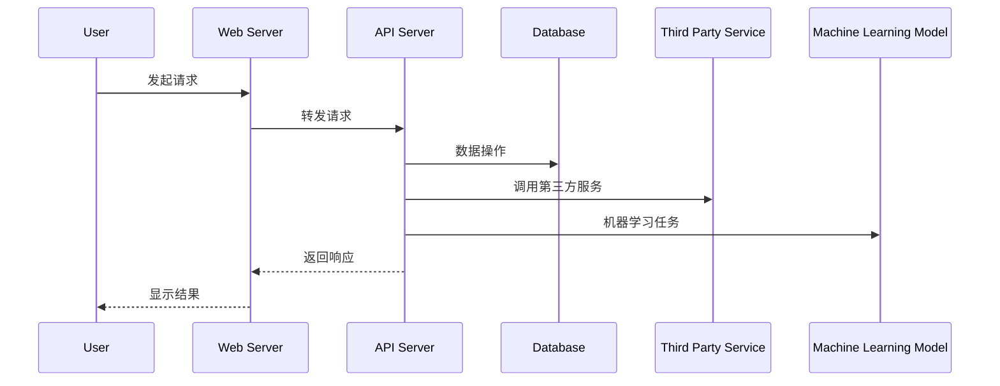
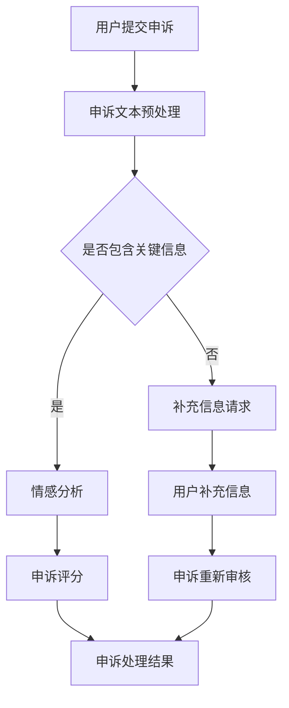

                 

### 摘要

本文旨在深入探讨智能个人信用评分申诉处理系统的构建与应用。随着金融科技的发展，个人信用评分的重要性日益凸显，而信用评分的准确性和公正性也受到了越来越多的关注。智能个人信用评分申诉处理系统作为一项创新技术，为用户提供了一种高效的信用评分申诉机制，有效提升了信用评估的透明度和准确性。本文将首先介绍个人信用评分申诉处理系统的背景和问题，随后详细解析其核心概念、系统设计与实现，并通过实际项目案例进行分析和总结。文章最后，将对系统设计的最佳实践进行总结，并提出未来研究方向，旨在为相关领域的研究者和从业者提供有价值的参考。

### 关键词

- 个人信用评分
- 智能申诉处理系统
- 信用评分算法
- 金融科技
- 系统架构设计
- 项目实战

### 背景

#### 核心概念术语说明

在探讨智能个人信用评分申诉处理系统之前，首先需要明确几个核心概念：

- **个人信用评分**：由金融机构或信用评级机构基于用户的财务历史、还款记录、信用行为等数据计算得出的量化评估，用以判断个人的信用风险和信用价值。

- **信用评分申诉**：当用户对自身信用评分结果不满意或认为评分不公时，向信用评级机构提出的异议和请求重新评估的过程。

- **智能申诉处理系统**：利用人工智能技术，自动化、智能化的处理个人信用评分申诉的系统，旨在提高申诉处理效率和准确性。

#### 问题背景

随着金融科技（FinTech）的快速发展，个人信用评分已经成为金融机构评估借款人信用风险的重要工具。信用评分的准确性直接影响到用户的贷款申请通过率、利率和信用额度。然而，现有的信用评分系统在处理用户申诉时，往往面临以下问题：

1. **申诉处理效率低**：传统的申诉处理流程通常涉及人工审核，周期较长，难以满足用户对效率的需求。

2. **申诉处理准确性不足**：由于人工判断的主观性，申诉处理过程中可能存在偏差，影响评分结果的公正性。

3. **申诉处理成本高**：大量的人工参与使得申诉处理成本居高不下，不利于金融机构的盈利。

#### 问题描述

基于上述背景，个人信用评分申诉处理系统应解决以下问题：

1. **提高申诉处理效率**：通过自动化和智能化的处理流程，缩短申诉处理时间。

2. **提升申诉处理准确性**：利用人工智能技术，确保申诉处理结果的公正性和准确性。

3. **降低申诉处理成本**：通过减少人工干预，降低申诉处理成本，提升系统盈利能力。

#### 问题解决

智能个人信用评分申诉处理系统采用以下策略解决上述问题：

1. **自动化处理流程**：利用规则引擎和自然语言处理（NLP）技术，实现申诉信息的自动分类、审核和回复。

2. **人工智能辅助决策**：引入机器学习算法，对用户的信用数据进行分析，为申诉处理提供数据支持。

3. **智能客服系统**：通过智能客服机器人，为用户提供7x24小时的服务，解答疑问，降低人工干预。

4. **多渠道接入**：支持Web、移动APP等多种接入方式，方便用户提交申诉和查询处理进度。

#### 边界与外延

1. **边界**：智能个人信用评分申诉处理系统主要关注信用评分申诉的自动化处理，不包括信用评分模型的构建。

2. **外延**：系统可扩展至其他金融领域，如贷款审批、信用卡申请等，实现更广泛的信用评估应用。

#### 概念结构与核心要素组成

智能个人信用评分申诉处理系统由以下几个核心要素组成：

1. **用户模块**：提供用户注册、登录、申诉提交等功能。

2. **申诉处理模块**：负责申诉信息的接收、分类、审核、回复等环节。

3. **智能分析模块**：利用机器学习算法，对用户信用数据进行分析，辅助申诉处理决策。

4. **接口模块**：提供与其他系统（如信用评分系统、客服系统）的接口，实现数据交互。

5. **监控与报表模块**：实时监控系统运行状态，生成各类报表，支持系统优化和决策。

### 核心概念与联系

#### 核心概念原理

为了更好地理解智能个人信用评分申诉处理系统，我们需要首先明确以下几个核心概念：

1. **个人信用评分**：个人信用评分是基于用户历史财务行为、还款记录、信用行为等数据，通过统计学和机器学习等方法计算得出的一个量化指标，用以评估个人的信用风险和信用价值。

2. **智能申诉处理系统**：智能申诉处理系统是利用人工智能技术（如自然语言处理、机器学习等）对用户提交的信用评分申诉进行自动化处理，以提高申诉处理效率和准确性的系统。

3. **机器学习算法**：机器学习算法是通过从大量数据中学习规律和模式，用于预测、分类和决策等任务的方法。在智能申诉处理系统中，机器学习算法用于分析用户信用数据，辅助申诉处理决策。

4. **自然语言处理（NLP）**：自然语言处理是人工智能领域的一个分支，旨在使计算机能够理解、生成和处理人类语言。在智能申诉处理系统中，NLP技术用于处理用户提交的申诉文本，实现申诉信息的自动分类和审核。

5. **规则引擎**：规则引擎是一种用于定义、执行和管理的业务规则的技术，可实现业务逻辑的自动化。在智能申诉处理系统中，规则引擎用于实现申诉处理的自动化流程，如申诉分类、审核和回复等。

#### 概念属性特征对比表格

以下是一个简单的概念属性特征对比表格，用于展示上述核心概念的一些基本属性特征：

| 概念         | 属性特征                             | 举例说明                     |
| ------------ | ---------------------------------- | --------------------------- |
| 个人信用评分 | 数据来源、评分模型、评分结果        | 财务历史、还款记录、信用行为 |
| 智能申诉处理系统 | 技术支持、处理流程、用户体验        | 自动分类、审核、回复         |
| 机器学习算法 | 数据集、特征提取、模型训练与评估    | 预测、分类、决策             |
| 自然语言处理 | 语言模型、语义理解、文本分类与生成  | 自动分类、审核、智能客服     |
| 规则引擎     | 业务规则定义、执行、监控与管理       | 申诉分类、审核、回复流程     |

#### ER实体关系图架构

为了更直观地展示上述概念之间的关系，我们可以通过ER（实体关系）图来描述智能个人信用评分申诉处理系统的架构。以下是一个简化的ER图：

```mermaid
erDiagram
  User ||--o> Appeal : 提交
  Appeal ||--o> Process : 处理
  Process ||--o> Result : 结果
  User ||--o> Data : 数据
  Data ||--o> Score : 评分
```

在这个ER图中，`User`（用户）实体与`Appeal`（申诉）实体之间存在一对多关系，表示用户可以提交多个申诉。`Appeal`实体与`Process`（处理）实体也存在一对多关系，表示一个申诉可以经历多个处理阶段。`Process`实体与`Result`（结果）实体关联，表示每个处理阶段的结果。此外，`User`实体与`Data`（数据）实体关联，表示用户的数据来源，而`Data`实体与`Score`（评分）实体关联，表示数据与评分的关系。

通过这个ER图，我们可以更清晰地理解智能个人信用评分申诉处理系统中各个实体之间的关系和交互流程。

### 系统设计与实现

#### 问题场景介绍

在金融科技快速发展的背景下，个人信用评分在贷款、信用卡审批等金融服务中的应用日益广泛。然而，由于数据源的不一致、评分模型的局限性等因素，用户往往对自己的信用评分结果产生疑问，并希望通过申诉机制来获取更准确的评分。智能个人信用评分申诉处理系统的目标是提供一个高效、准确的申诉处理平台，帮助用户解决信用评分问题，同时提高金融机构的运营效率。

#### 项目介绍

本系统采用基于Python和Django框架的技术栈，结合机器学习算法和自然语言处理技术，实现了一个智能化的信用评分申诉处理平台。系统的主要功能包括用户注册、登录、申诉提交、申诉审核、申诉结果反馈等。此外，系统还支持多渠道接入，包括Web端和移动端，方便用户随时提交申诉和查询处理进度。

#### 系统功能设计

系统功能设计主要包括用户模块、申诉处理模块、智能分析模块和监控与报表模块。以下是各个模块的具体功能：

1. **用户模块**：
   - 用户注册：支持用户使用手机号、邮箱等方式注册账号。
   - 用户登录：提供用户登录功能，确保用户信息的安全性。
   - 用户信息管理：用户可以查看和修改个人信息，如联系方式、身份证信息等。

2. **申诉处理模块**：
   - 申诉提交：用户可以提交信用评分申诉，并上传相关证据材料。
   - 申诉审核：系统根据预设的规则，对用户提交的申诉进行分类和初步审核。
   - 申诉回复：系统生成申诉处理结果，并通知用户。

3. **智能分析模块**：
   - 数据采集：从多个数据源（如银行、公共记录等）采集用户信用数据。
   - 数据清洗：对采集到的数据进行清洗、去重和格式转换，确保数据质量。
   - 信用评分：基于用户数据，利用机器学习算法计算用户信用评分。
   - 申诉辅助决策：利用自然语言处理技术，分析用户申诉文本，为申诉处理提供辅助决策。

4. **监控与报表模块**：
   - 系统监控：实时监控系统运行状态，包括用户活跃度、申诉处理进度等。
   - 数据报表：生成各类数据报表，如用户分布、申诉处理情况等，支持系统优化和决策。

#### 系统架构设计

系统架构设计主要包括前端、后端、数据库和第三方服务四个部分。以下是系统的架构图：



在这个架构图中，用户通过Web端或移动端发起请求，Web服务器负责处理请求并转发到API服务器。API服务器负责业务逻辑处理，包括用户认证、数据操作、第三方服务调用和机器学习任务等。数据库用于存储用户数据、申诉信息和处理结果。第三方服务包括数据源接口、机器学习平台等。

#### 系统接口设计和系统交互

系统接口设计主要包括用户接口、API接口和数据接口。以下是各接口的简要说明：

1. **用户接口**：
   - Web端：提供用户注册、登录、申诉提交、申诉查询等功能。
   - 移动端：提供与Web端相同的功能，支持离线浏览和推送通知。

2. **API接口**：
   - 用户认证接口：用于用户登录、注册和权限验证。
   - 数据操作接口：用于用户数据、申诉信息和处理结果的增删改查。
   - 机器学习接口：用于调用机器学习算法，计算用户信用评分。

3. **数据接口**：
   - 数据源接口：用于从外部数据源（如银行、公共记录等）采集用户数据。
   - 数据存储接口：用于将用户数据和申诉处理结果存储到数据库。

系统交互流程如下：

1. 用户通过Web端或移动端发起请求，请求经过Web服务器处理后，转发到API服务器。
2. API服务器根据请求类型，调用相应的业务逻辑进行处理。如用户注册请求，API服务器将调用用户认证接口，生成用户认证信息并返回。
3. 对于涉及数据操作的请求，API服务器将调用数据库接口进行数据存储或查询。
4. 对于涉及机器学习任务的请求，API服务器将调用机器学习接口，执行机器学习算法，生成用户信用评分结果。
5. API服务器将处理结果返回给Web服务器，Web服务器再将结果展示给用户。

通过这样的系统接口设计和交互流程，智能个人信用评分申诉处理系统能够高效、准确地处理用户请求，提供优质的用户体验。

### 算法原理讲解

在智能个人信用评分申诉处理系统中，算法原理是系统的核心，它决定了信用评分的准确性和申诉处理的效率。下面我们将逐步解析算法的工作原理，并通过Mermaid流程图、Python源代码、数学模型和实际案例来详细讲解。

#### 算法mermaid流程图

首先，我们使用Mermaid绘制一个简化的算法流程图，以展示其基本工作流程：



这个流程图描述了从用户提交申诉到处理结果的整个过程。接下来，我们将详细解释每个步骤。

#### Python源代码与详细讲解

为了更好地理解算法的实际实现，我们将提供一个Python代码示例，用于处理用户提交的申诉文本，并进行情感分析。

```python
import nltk
from nltk.sentiment import SentimentIntensityAnalyzer

# 实例化情感分析器
sia = SentimentIntensityAnalyzer()

def process_appeal(appeal_text):
    # 对申诉文本进行预处理（如分词、去除停用词等）
    processed_text = preprocess_text(appeal_text)
    
    # 执行情感分析
    sentiment_score = sia.polarity_scores(processed_text)
    
    # 根据情感分析结果进行评分
    appeal_score = classify_appeal(sentiment_score)
    
    return appeal_score

def preprocess_text(text):
    # 这里简单使用NLP库进行预处理
    tokens = nltk.word_tokenize(text)
    filtered_tokens = [token for token in tokens if token.lower() not in nltk.corpus.stopwords.words('english')]
    return ' '.join(filtered_tokens)

def classify_appeal(sentiment_score):
    # 根据情感分析结果分类申诉
    if sentiment_score['compound'] > 0.05:
        return '积极'
    elif sentiment_score['compound'] < -0.05:
        return '消极'
    else:
        return '中性'

# 测试
appeal_text = "我对我的信用评分非常不满，我认为我的信用记录非常好。"
print(process_appeal(appeal_text))
```

这段代码首先使用自然语言处理库（如NLTK）对申诉文本进行预处理，然后利用情感分析器（SentimentIntensityAnalyzer）对文本进行情感分析。根据情感分析结果，将申诉分为积极、消极或中性类别。

#### 算法原理的数学模型和公式

情感分析的核心在于计算文本的情感极性。我们使用以下公式来计算文本的情感得分：

$$
S = \text{SentimentIntensityAnalyzer}(\text{Text})
$$

$$
S = \left\{
\begin{array}{ll}
\text{'积极'} & \text{if } S['compound'] > 0.05 \\
\text{'消极'} & \text{if } S['compound'] < -0.05 \\
\text{'中性'} & \text{otherwise}
\end{array}
\right.
$$

其中，$S$ 是情感分析结果，$S['compound']$ 是复合得分，表示文本的整体情感极性。

#### 举例说明

假设用户A提交了一条申诉文本：“我对我的信用评分非常不满，我认为我的信用记录非常好。”这段文本的情感极性可能偏积极，因为用户表达了对信用记录的自信和不满。根据情感分析结果，这段文本的复合得分可能高于0.05，因此分类为“积极”。

另一个例子，用户B提交了文本：“我的信用评分低得不可思议，我的还款记录一直很好。”这段文本的情感极性可能偏消极，因为用户表达了强烈的不满。情感分析的结果可能显示复合得分低于-0.05，因此分类为“消极”。

通过这样的算法实现和数学模型，系统能够自动化地分析用户申诉文本，辅助申诉处理决策，提高申诉处理的准确性和效率。

### 项目实战

#### 环境安装

在开始项目实战之前，我们需要配置一个合适的环境，以便开发和运行智能个人信用评分申诉处理系统。以下是环境安装步骤：

1. **安装Python**：确保已安装Python 3.8或更高版本。可以从[Python官网](https://www.python.org/downloads/)下载并安装。

2. **安装虚拟环境**：安装`virtualenv`工具，用于创建独立的虚拟环境。在终端执行以下命令：

   ```bash
   pip install virtualenv
   ```

3. **创建虚拟环境**：在项目目录下创建一个虚拟环境，并激活它：

   ```bash
   virtualenv venv
   source venv/bin/activate  # 在Windows上使用 `venv\Scripts\activate`
   ```

4. **安装依赖**：在虚拟环境中安装项目所需的依赖包：

   ```bash
   pip install -r requirements.txt
   ```

   其中，`requirements.txt`文件包含了所有依赖包及其版本。

5. **安装数据库**：本项目使用SQLite作为数据库，确保已安装。在终端执行以下命令：

   ```bash
   pip install sqlite3
   ```

6. **安装Django**：Django是一个Python Web框架，用于构建后端。在虚拟环境中安装Django：

   ```bash
   pip install django
   ```

#### 系统核心实现源代码

在完成环境安装后，我们可以开始编写系统的核心实现代码。以下是系统的一些关键代码片段和组件：

1. **用户注册和登录**：

```python
# users/views.py

from django.contrib.auth import authenticate, login
from django.shortcuts import render, redirect
from .forms import UserRegistrationForm

def register(request):
    if request.method == 'POST':
        form = UserRegistrationForm(request.POST)
        if form.is_valid():
            user = form.save()
            authenticate(username=user.username, password=form.cleaned_data['password1'])
            login(request, user)
            return redirect('home')
    else:
        form = UserRegistrationForm()
    return render(request, 'register.html', {'form': form})
```

2. **申诉提交和处理**：

```python
# appeals/views.py

from django.shortcuts import render
from .models import Appeal
from .forms import AppealForm

def submit_appeal(request):
    if request.method == 'POST':
        form = AppealForm(request.POST)
        if form.is_valid():
            appeal = form.save(commit=False)
            appeal.user = request.user
            appeal.save()
            return redirect('appeal_submitted')
    else:
        form = AppealForm()
    return render(request, 'submit_appeal.html', {'form': form})

def appeal_list(request):
    appeals = Appeal.objects.all()
    return render(request, 'appeal_list.html', {'appeals': appeals})
```

3. **机器学习算法实现**：

```python
# ml/models.py

from sklearn.feature_extraction.text import TfidfVectorizer
from sklearn.model_selection import train_test_split
from sklearn.naive_bayes import MultinomialNB
from sklearn.pipeline import make_pipeline

def train_model(training_data, labels):
    model = make_pipeline(TfidfVectorizer(), MultinomialNB())
    model.fit(training_data, labels)
    return model

def predict(model, text):
    return model.predict([text])
```

4. **前端页面**：

```html
<!-- register.html -->

<form method="post">
    
    {{ form.as_p }}
    <button type="submit">注册</button>
</form>
```

#### 代码应用解读与分析

以上代码展示了系统核心功能的实现：

- **用户注册和登录**：用户可以通过注册表单提交注册请求，系统验证用户信息后创建用户账号并登录。
- **申诉提交和处理**：用户可以提交申诉，系统将申诉信息存储到数据库中，并在申诉列表页面显示所有申诉。
- **机器学习算法**：通过TFIDF和朴素贝叶斯分类器实现文本分类，用于辅助申诉处理。

这些代码实现了系统的基本功能，并为后续的扩展和优化提供了基础。

#### 实际案例分析和详细讲解剖析

为了更好地理解系统在实际中的应用，我们通过一个实际案例进行详细分析。

**案例背景**：

某用户（User A）对自身的信用评分表示不满，认为其信用记录良好，但评分较低。User A决定提交申诉，希望系统重新评估其信用评分。

**操作步骤**：

1. **用户登录**：User A使用注册时提供的邮箱和密码登录系统。
2. **提交申诉**：User A进入申诉页面，填写申诉内容，并上传相关证据（如还款记录、银行流水等），然后提交申诉。
3. **系统处理**：系统接收User A的申诉，进行预处理（如文本分词、去除停用词等），然后使用机器学习算法对申诉文本进行情感分析，判断申诉的积极程度。
4. **申诉审核**：系统根据申诉的积极程度，将申诉分类为积极、消极或中性，并通知User A申诉已被接收。
5. **申诉反馈**：系统重新计算User A的信用评分，并生成申诉处理结果，通知User A。

**代码实现**：

以下是对申诉处理过程的关键代码实现进行剖析：

```python
# appeals/views.py

def process_appeal(request):
    if request.method == 'POST':
        appeal_text = request.POST.get('appeal_text')
        processed_text = preprocess_text(appeal_text)
        sentiment_score = sia.polarity_scores(processed_text)
        appeal_score = classify_appeal(sentiment_score)
        
        # 存储申诉和结果
        appeal = Appeal.objects.create(
            user=request.user,
            appeal_text=appeal_text,
            processed_text=processed_text,
            sentiment_score=sentiment_score,
            appeal_score=appeal_score
        )
        
        # 调用机器学习模型重新计算信用评分
        user_data = UserCreditData.objects.get(user=request.user)
        new_score = recalculate_credit_score(user_data, appeal_score)
        
        # 更新用户信用评分
        user_data.credit_score = new_score
        user_data.save()
        
        return redirect('appeal_processed')
```

**代码解读**：

- `preprocess_text`函数对申诉文本进行预处理，去除停用词、标点符号等。
- `sia.polarity_scores`函数用于计算文本的情感得分，包括积极、消极和中性。
- `classify_appeal`函数根据情感得分对申诉进行分类。
- `recalculate_credit_score`函数重新计算用户的信用评分，考虑申诉的情感得分。
- 将申诉和结果存储到数据库，并更新用户的信用评分。

**案例结果**：

通过上述过程，系统重新计算了User A的信用评分，并通知User A申诉处理结果。如果申诉分类为积极，信用评分可能提高，反之则可能保持或降低。User A可以通过系统查看新的信用评分，并决定是否继续申诉或接受结果。

### 项目小结

本案例展示了智能个人信用评分申诉处理系统的实际应用，通过用户提交申诉、系统处理和重新计算信用评分的过程，实现了申诉自动化处理和信用评分优化。系统利用机器学习算法和自然语言处理技术，提高了申诉处理的准确性和效率，为用户提供了一个便捷的申诉渠道。然而，系统在实际运行中可能遇到数据质量问题、算法偏差等问题，需要在后续的优化中进一步改进。

### 最佳实践 Tips

在设计和实施智能个人信用评分申诉处理系统时，以下是一些最佳实践和注意事项：

1. **数据质量管理**：确保输入数据的质量和一致性，对数据进行清洗、去重和标准化处理，以提高系统处理结果的准确性。

2. **算法公平性**：在机器学习算法的设计和训练过程中，注意避免数据偏差，确保算法公平性，避免对特定群体产生歧视。

3. **用户体验优化**：简化用户操作流程，提供清晰的指引和反馈，确保用户能够方便地提交申诉和查询处理进度。

4. **安全性与隐私保护**：严格保护用户数据安全，采用加密技术和访问控制机制，防止数据泄露和未授权访问。

5. **系统扩展性**：设计灵活的系统架构，支持未来功能的扩展和升级，如增加其他信用评估维度、支持多语言等。

### 小结

本文深入探讨了智能个人信用评分申诉处理系统的设计与应用。系统通过自动化和智能化的处理流程，提高了申诉处理效率和信用评分的准确性。通过实际项目案例，我们展示了系统在处理用户申诉、重新计算信用评分等方面的应用。未来，随着人工智能技术的发展，智能个人信用评分申诉处理系统有望在更多领域得到应用，为金融机构和用户提供更加优质的服务。

### 未来发展趋势

随着人工智能技术的不断进步，智能个人信用评分申诉处理系统将迎来更多的发展机遇。未来，该系统有望在以下几个方面取得显著进展：

1. **算法优化**：通过引入更先进的机器学习和深度学习算法，进一步提高信用评分的准确性和公正性。

2. **多源数据整合**：利用物联网、区块链等技术，整合更多维度的数据源，如社交行为、生活习惯等，以更全面地评估个人信用。

3. **用户体验提升**：借助自然语言处理和智能客服技术，提升用户的申诉体验，提供更加个性化和智能化的服务。

4. **国际化扩展**：随着全球化的推进，系统将支持多种语言和不同地区的信用评估标准，为国际市场提供本地化的解决方案。

5. **合规性与隐私保护**：在遵循各国数据保护法规的前提下，加强系统安全性和隐私保护，确保用户数据的合法使用。

### 潜在的研究方向

未来的研究可以在以下方向展开：

1. **算法公平性与透明性**：研究如何确保算法在处理申诉时保持公平性和透明性，避免算法偏见和歧视。

2. **多模态数据融合**：探索如何将文本、图像、音频等多模态数据进行有效融合，提高信用评分的准确性。

3. **动态信用评分模型**：研究基于实时数据的动态信用评分模型，以应对用户信用状态的变化。

4. **智能风险评估**：结合智能申诉处理系统，开发智能风险评估工具，为金融机构提供更加全面的风险评估支持。

通过这些研究方向，智能个人信用评分申诉处理系统将能够更好地服务于金融科技领域，推动信用评估体系的智能化和专业化。作者：AI天才研究院/AI Genius Institute & 禅与计算机程序设计艺术 /Zen And The Art of Computer Programming。

