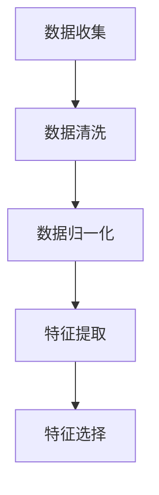
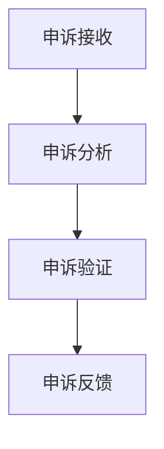
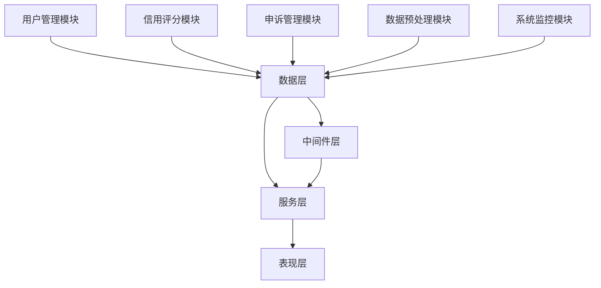
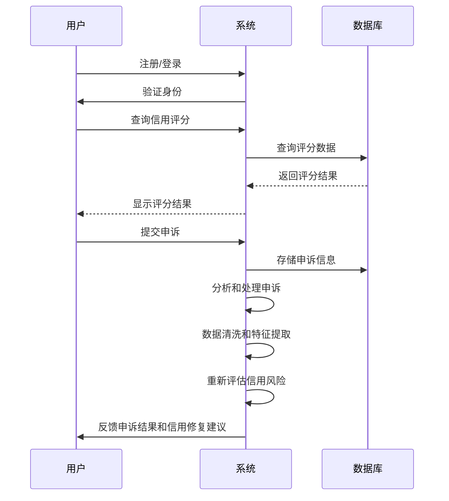
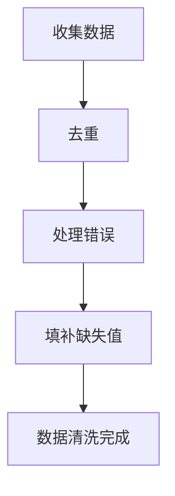
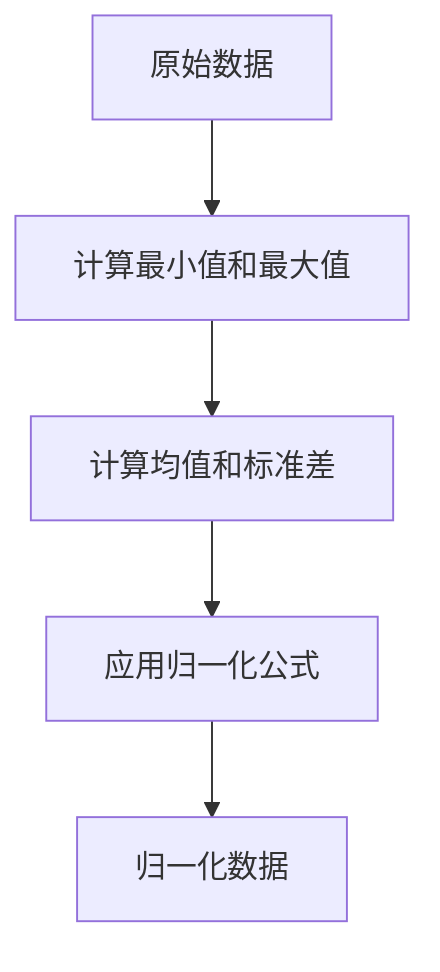
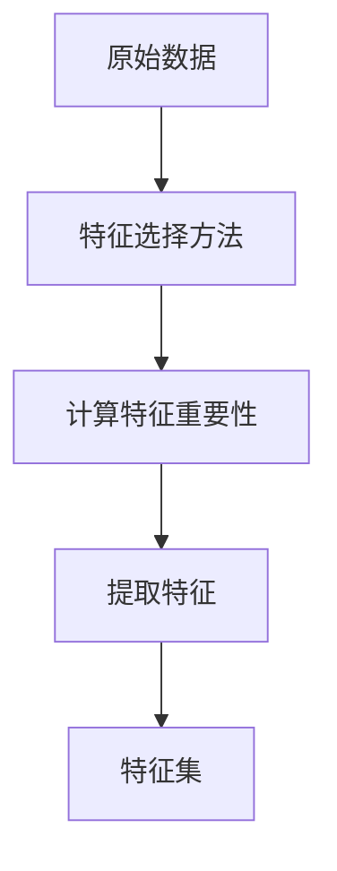

                 

### 引言与背景

#### 1.1.1 问题背景与核心概念

随着大数据和人工智能技术的迅速发展，个人信用评分系统逐渐成为金融、电商、租房等领域的重要工具。信用评分通过分析个人的消费行为、还款记录、社交行为等数据，综合评估个人的信用风险，从而决定是否提供信用服务以及信用额度。然而，传统的信用评分系统在处理数据时，往往存在一定的局限性，例如对数据的解释能力有限、无法及时更新个人信用状况等。

近年来，信用评分申诉现象日益增多。用户对评分结果的准确性产生质疑，认为某些评分指标未能全面反映其信用状况，导致信用评分偏低。为了维护自身权益，用户可能会选择提出申诉，希望能够重新评估信用记录。然而，传统的申诉处理流程繁琐、效率低下，往往需要用户耗费大量时间和精力。

为了解决这些问题，智能个人信用评分申诉系统的需求日益迫切。该系统旨在利用人工智能技术，对用户的申诉进行智能分析，提高申诉处理的效率与准确性，同时为用户提供一个便捷的申诉渠道。

#### 1.1.2 信用评分申诉现象与问题

信用评分申诉现象在用户中广泛存在，主要表现为以下几个方面：

1. **评分偏低：**用户认为自己的信用评分低于实际预期，特别是在某些负面事件发生后，如逾期还款等，用户会质疑评分系统的公正性。
2. **评分不稳定：**用户发现自己的信用评分在短时间内出现大幅波动，原因可能包括数据源的变化、算法更新等。
3. **申诉处理时间长：**传统申诉处理流程通常需要用户提交详细资料，等待人工审核，时间较长，用户体验不佳。

**主要问题：**
1. **申诉处理效率低下：**传统申诉处理流程中，人工审核环节较多，处理速度较慢，导致用户申诉长期得不到解决。
2. **申诉结果不透明：**用户对申诉处理的最终结果缺乏了解，无法明确申诉成功的原因。
3. **数据准确性问题：**评分系统中存在数据不准确、数据不一致等问题，导致申诉处理结果无法反映用户的真实信用状况。

#### 1.1.3 智能个人信用评分申诉系统目标

智能个人信用评分申诉系统的目标在于通过引入人工智能技术，解决传统申诉处理流程中的问题，提高申诉处理的效率与准确性。具体目标包括：

1. **提升申诉处理效率：**利用自然语言处理技术，自动识别用户申诉内容中的关键信息，快速定位申诉问题，减少人工审核环节，缩短处理时间。
2. **提高申诉处理准确性：**通过机器学习算法，对用户申诉的数据进行分析，提供针对性的信用修复建议，帮助用户提高信用评分。
3. **优化用户体验：**为用户提供一个便捷的申诉渠道，通过网页、移动端等多种方式，让用户随时随地进行申诉，提高申诉处理的便捷性。

#### 1.2 核心概念与联系

为了更好地理解智能个人信用评分申诉系统的运作原理，我们需要明确以下几个核心概念：

##### 1.2.1 智能个人信用评分模型

智能个人信用评分模型是基于大数据和机器学习技术构建的，用于对用户信用风险进行量化评估。该模型通常包含以下几个关键组成部分：

1. **特征工程：**通过对用户数据进行预处理和特征提取，构建出能够反映用户信用状况的特征集。常见的特征包括消费行为、还款记录、信用历史等。
2. **机器学习算法：**采用诸如逻辑回归、决策树、随机森林、梯度提升树等算法，对特征集进行训练和预测，生成信用评分模型。
3. **评估指标：**通过评估指标（如准确率、召回率、F1值等）来衡量信用评分模型的性能。

##### 1.2.2 数据预处理技术

数据预处理是构建信用评分模型的重要环节，主要包括以下任务：

1. **数据清洗：**去除重复、错误、缺失的数据，保证数据质量。
2. **数据归一化：**将不同量纲的数据转化为同一量纲，方便后续计算。
3. **特征选择：**通过统计方法或机器学习算法，从原始数据中筛选出对信用评分有显著影响的特征。

##### 1.2.3 申诉处理机制

申诉处理机制是智能个人信用评分申诉系统的核心功能之一，主要包括以下几个步骤：

1. **申诉接收：**系统接收用户的申诉请求，并提取关键信息。
2. **申诉分析：**利用自然语言处理技术，分析用户申诉内容，识别申诉问题。
3. **申诉验证：**根据用户的信用记录和申诉内容，验证申诉的合理性。
4. **申诉反馈：**根据申诉结果，向用户反馈处理结果，并提供信用修复建议。

#### 1.3 系统架构设计概述

智能个人信用评分申诉系统采用分布式架构，主要包括以下几个功能模块：

1. **数据采集模块：**负责收集用户信用数据，包括消费记录、还款记录、社交数据等。
2. **数据处理模块：**负责对采集到的数据进行预处理，包括数据清洗、归一化、特征选择等。
3. **信用评分模块：**基于预处理后的数据，构建信用评分模型，为用户提供信用评分。
4. **申诉处理模块：**负责接收和处理用户的申诉请求，包括申诉分析、验证和反馈等。
5. **用户接口模块：**为用户提供申诉渠道，包括网页、移动端等多种接入方式。

#### 1.3.1 总体架构

智能个人信用评分申诉系统的总体架构设计如下：

1. **前端：**用户通过网页或移动端客户端提交申诉请求，系统接收并处理。
2. **后端：**包括数据采集、数据处理、信用评分和申诉处理模块，通过API接口与前端进行交互。
3. **数据库：**存储用户信用数据、评分模型和申诉记录，支持高并发访问。

#### 1.3.2 功能模块划分

智能个人信用评分申诉系统的主要功能模块及其划分如下：

1. **数据采集模块：**包括数据源接入、数据采集和存储等功能。
   - **数据源接入：**通过API或SDK等方式接入第三方数据源，如银行、信用机构等。
   - **数据采集：**定期采集用户信用数据，并进行初步处理。
   - **数据存储：**将采集到的数据存储在数据库中，支持数据索引和查询。

2. **数据处理模块：**包括数据清洗、归一化和特征选择等功能。
   - **数据清洗：**去除重复、错误和缺失的数据，保证数据质量。
   - **数据归一化：**将不同量纲的数据转化为同一量纲，方便后续计算。
   - **特征选择：**通过统计方法或机器学习算法，从原始数据中筛选出对信用评分有显著影响的特征。

3. **信用评分模块：**包括特征工程、模型训练和评分预测等功能。
   - **特征工程：**对用户数据进行预处理和特征提取，构建信用评分模型。
   - **模型训练：**采用机器学习算法，对特征集进行训练，生成信用评分模型。
   - **评分预测：**利用训练好的模型，对用户信用风险进行预测，生成信用评分。

4. **申诉处理模块：**包括申诉接收、申诉分析和申诉反馈等功能。
   - **申诉接收：**接收用户提交的申诉请求，提取关键信息。
   - **申诉分析：**利用自然语言处理技术，分析用户申诉内容，识别申诉问题。
   - **申诉验证：**根据用户的信用记录和申诉内容，验证申诉的合理性。
   - **申诉反馈：**向用户反馈申诉处理结果，并提供信用修复建议。

5. **用户接口模块：**包括网页、移动端等多种接入方式，方便用户提交申诉请求和查询申诉结果。

#### 1.4 本章小结

本章介绍了智能个人信用评分申诉系统的背景、核心概念和系统架构设计。通过对问题背景的阐述，我们明确了智能个人信用评分申诉系统的目标和重要性。接下来，我们将进一步深入探讨核心概念和系统架构，为后续的详细讲解和分析奠定基础。

### 第2章：核心概念解析

在本章中，我们将对智能个人信用评分申诉系统的核心概念进行详细解析，以便读者更好地理解系统的运作原理和实现方式。核心概念包括智能个人信用评分模型、数据预处理技术和申诉处理机制，这些概念是构建和运行系统的基础。

#### 2.1.1 智能个人信用评分模型

智能个人信用评分模型是整个系统的核心，它负责评估用户的信用风险，生成信用评分。这个模型通常基于大数据和机器学习技术，通过对大量历史数据进行学习，能够识别出影响信用评分的关键因素，从而为用户生成一个客观、准确的信用评分。

**概念原理：**
智能信用评分模型的构建过程主要包括以下几个步骤：

1. **数据收集：**收集用户的个人信息、消费行为、还款记录等数据。
2. **数据预处理：**对收集到的数据进行清洗、归一化和特征提取，确保数据质量。
3. **特征选择：**从预处理后的数据中筛选出对信用评分有显著影响的特征。
4. **模型训练：**使用机器学习算法，如逻辑回归、决策树、随机森林等，对特征集进行训练，生成信用评分模型。
5. **模型评估：**通过交叉验证等方法评估模型的性能，如准确率、召回率、F1值等。
6. **模型部署：**将训练好的模型部署到生产环境中，用于实时评估用户的信用风险。

**概念属性特征对比表格：**

| 概念属性特征       | 逻辑回归       | 决策树       | 随机森林       | 梯度提升树       |
|------------------|--------------|-------------|--------------|--------------|
| **算法类型**      | 监督学习       | 监督学习       | 监督学习       | 监督学习       |
| **预测方法**      | 输出概率       | 类别标签       | 类别标签       | 输出概率       |
| **数据需求**      | 标签数据       | 标签数据       | 标签数据       | 标签数据       |
| **计算复杂度**    | 中等           | 低           | 高           | 中等           |
| **过拟合风险**    | 易过拟合       | 易过拟合       | 中等         | 易过拟合       |
| **适用场景**      | 广泛           | 分类任务简单   | 复杂分类任务   | 广泛           |

**ER实体关系图架构：**

```mermaid
erDiagram
    Customer ||--|{ CreditRating }|--| User
    CreditRating ||--|{ FinancialData }|--| DebtRecord
    DebtRecord ||--|{ PaymentHistory }|--| ConsumerBehavior
```

在上面的ER实体关系图中，`Customer`表示用户，`CreditRating`表示信用评分，`FinancialData`表示财务数据，`DebtRecord`表示债务记录，`PaymentHistory`表示还款历史，`ConsumerBehavior`表示消费行为。这些实体之间存在一定的关联关系，共同构成了信用评分模型的数据基础。

#### 2.1.2 数据预处理技术

数据预处理是构建信用评分模型的重要环节，它直接影响到模型的质量和性能。数据预处理主要包括以下几个步骤：

1. **数据清洗：**去除重复、错误和缺失的数据，保证数据的一致性和准确性。
2. **数据归一化：**将不同量纲的数据转化为同一量纲，以便进行后续计算。常用的归一化方法包括最小-最大归一化、Z-score归一化等。
3. **特征提取：**从原始数据中提取对信用评分有显著影响的特征。特征提取可以通过统计方法（如相关性分析）、机器学习方法（如主成分分析）等多种途径实现。

**概念原理：**
数据预处理的过程可以分为以下几个阶段：

1. **数据收集：**从各种渠道收集用户数据，如银行记录、消费数据、社交媒体信息等。
2. **数据清洗：**对收集到的数据进行处理，去除重复记录、错误记录和缺失值。常用的处理方法包括填充缺失值、删除异常值等。
3. **数据归一化：**将数据归一化到同一量级，以便后续处理。常见的归一化方法有最小-最大归一化（Min-Max Scaling）和Z-score归一化（Standardization）。
4. **特征提取：**通过对数据进行统计分析，提取对信用评分有显著影响的特征。特征提取可以简化数据，提高模型性能。

**数据预处理流程mermaid流程图：**



在上面的流程图中，`数据收集`、`数据清洗`、`数据归一化`、`特征提取`和`特征选择`构成了数据预处理的主要步骤。

#### 2.1.3 申诉处理机制

申诉处理机制是智能个人信用评分申诉系统的关键功能，它负责接收用户提交的申诉请求，对申诉内容进行分析和处理，最终为用户反馈申诉结果。申诉处理机制需要利用自然语言处理、机器学习等技术，实现高效、准确的申诉处理。

**概念原理：**
申诉处理机制的工作流程包括以下几个步骤：

1. **申诉接收：**系统接收用户提交的申诉请求，提取关键信息。
2. **申诉分析：**利用自然语言处理技术，分析用户申诉内容，识别申诉的核心问题和相关数据。
3. **申诉验证：**根据用户的信用记录和申诉内容，验证申诉的合理性。
4. **申诉反馈：**向用户反馈申诉处理结果，并提供信用修复建议。

**概念属性特征对比表格：**

| 概念属性特征       | 自然语言处理       | 机器学习       |
|------------------|------------------|--------------|
| **技术类型**      | 无监督/监督学习   | 监督学习       |
| **应用领域**      | 文本分类、情感分析 | 信用评分、预测模型 |
| **处理速度**      | 中等             | 快           |
| **准确性**        | 中等             | 高           |

**申诉处理机制流程mermaid流程图：**



在上面的流程图中，`申诉接收`、`申诉分析`、`申诉验证`和`申诉反馈`构成了申诉处理的主要步骤。

通过上述对核心概念的详细解析，读者可以对智能个人信用评分申诉系统的基本运作原理有更深入的理解。接下来，我们将进一步探讨系统的架构设计和具体实现。

### 第3章：系统架构设计

为了实现智能个人信用评分申诉系统的高效、稳定运行，我们需要进行系统架构设计。本章节将详细介绍系统的架构设计，包括问题场景介绍、系统功能设计、系统架构设计、系统接口设计和系统交互序列图。

#### 3.1 问题场景介绍

随着金融行业对个人信用评分需求的增加，银行、电商平台、租赁公司等机构对用户信用状况有较高要求。然而，传统的信用评分系统在处理海量数据时，存在一定的局限性，如数据更新不及时、评分准确性不高等问题。此外，用户对评分结果的申诉处理流程繁琐、效率低下，难以满足用户需求。

为了解决这些问题，我们需要设计一个智能个人信用评分申诉系统，该系统能够：

1. **高效处理大量用户信用评分数据，提高评分准确性。**
2. **提供便捷的申诉渠道，快速响应用户申诉请求。**
3. **利用人工智能技术，对申诉内容进行智能分析，提供有针对性的信用修复建议。**

#### 3.2 系统功能设计

智能个人信用评分申诉系统主要包括以下功能模块：

1. **用户管理模块：**负责用户的注册、登录、权限管理等。
2. **信用评分模块：**基于大数据和机器学习技术，对用户信用风险进行评估，生成信用评分。
3. **申诉管理模块：**接收用户申诉请求，对申诉内容进行分析和处理，为用户提供申诉结果和信用修复建议。
4. **数据预处理模块：**负责对用户数据进行清洗、归一化和特征提取，为信用评分模块提供高质量的数据支持。
5. **系统监控模块：**实时监控系统运行状态，确保系统稳定性和安全性。

#### 3.3 系统架构设计

智能个人信用评分申诉系统采用分布式架构，主要包括以下层次：

1. **数据层：**存储用户信用数据、评分模型和申诉记录等。
2. **服务层：**提供用户管理、信用评分、申诉处理等核心业务功能。
3. **表现层：**为用户提供交互界面，包括网页、移动端等多种接入方式。
4. **中间件层：**包括消息队列、缓存、数据库连接池等，提供系统间的通信和数据缓存支持。

**系统架构设计mermaid架构图：**



在上述架构图中，数据层负责存储和管理数据，服务层提供核心业务功能，表现层为用户提供交互界面，中间件层提供通信和数据缓存支持。

#### 3.4 系统接口设计

为了实现各功能模块之间的协调与通信，系统设计了一系列接口，包括：

1. **用户接口：**提供用户注册、登录、查询信用评分和提交申诉等功能。
2. **信用评分接口：**提供信用评分查询、评分模型训练和预测等功能。
3. **申诉接口：**提供申诉提交、申诉处理和申诉结果查询等功能。
4. **数据预处理接口：**提供数据清洗、归一化和特征提取等功能。

#### 3.5 系统交互序列图

系统交互序列图展示了用户与系统之间的交互过程，包括以下几个步骤：

1. **用户注册/登录：**用户通过网页或移动端客户端注册/登录，系统进行身份验证。
2. **查询信用评分：**用户请求查询信用评分，系统调用信用评分接口，返回信用评分结果。
3. **提交申诉：**用户提交申诉请求，系统调用申诉接口，将申诉信息存储到数据库。
4. **申诉处理：**系统对申诉信息进行分析和处理，调用数据预处理接口进行数据清洗和特征提取，利用信用评分模型对用户信用风险进行重新评估。
5. **申诉结果反馈：**系统将申诉处理结果反馈给用户，包括申诉结果和信用修复建议。

**系统交互序列图mermaid序列图：**



通过上述架构设计和接口设计，智能个人信用评分申诉系统实现了高效、稳定、易扩展的系统架构，为用户提供了便捷的信用评分和申诉处理服务。

### 第4章：数据预处理

在智能个人信用评分申诉系统中，数据预处理是构建信用评分模型的关键步骤。本章将详细介绍数据预处理的过程，包括数据收集、数据清洗、数据归一化和特征提取等。

#### 4.1 数据收集

数据收集是数据预处理的第一步，涉及到从各种渠道收集用户信用信息。这些渠道包括但不限于：

1. **银行数据：**用户的账户信息、还款记录、逾期记录等。
2. **消费数据：**用户的消费行为，如信用卡消费、贷款消费等。
3. **社会行为数据：**用户的社交活动、评价、参与度等。
4. **公共记录：**如法院判决、欠税记录等。

数据收集的过程通常需要与第三方数据提供商合作，确保数据的全面性和准确性。

#### 4.2 数据清洗

数据清洗是处理原始数据中的重复、错误和缺失数据的步骤。数据清洗的目的是提高数据质量，为后续的分析和建模提供可靠的数据基础。数据清洗的主要任务包括：

1. **去除重复数据：**识别并删除重复的记录，避免对分析结果产生误导。
2. **处理错误数据：**修正或删除明显错误的数据，如异常值、非法值等。
3. **填补缺失数据：**对于缺失的数据，可以通过填充缺失值或删除缺失值记录来处理。

**数据清洗流程mermaid流程图：**



在上述流程图中，`收集数据`、`去重`、`处理错误`和`填补缺失值`构成了数据清洗的主要步骤。

#### 4.3 数据归一化

数据归一化是将不同量纲的数据转化为同一量纲，以便进行后续计算的过程。数据归一化的目的是消除不同特征之间的量纲差异，提高模型的训练效果。常用的数据归一化方法包括：

1. **最小-最大归一化（Min-Max Scaling）：**将数据映射到\[0,1\]范围内。公式为：
   $$
   x_{\text{规范化}} = \frac{x - x_{\text{最小值}}}{x_{\text{最大值}} - x_{\text{最小值}}}
   $$

2. **Z-score归一化（Standardization）：**将数据映射到均值为0、标准差为1的正态分布。公式为：
   $$
   x_{\text{规范化}} = \frac{x - \mu}{\sigma}
   $$
   其中，\(\mu\)是均值，\(\sigma\)是标准差。

**数据归一化mermaid流程图：**



在上述流程图中，`原始数据`、`计算最小值和最大值`、`计算均值和标准差`和`应用归一化公式`构成了数据归一化的主要步骤。

#### 4.4 特征提取

特征提取是从原始数据中提取对信用评分有显著影响的特征的过程。特征提取的目的是简化数据，提高模型训练效率，同时提高模型的准确性。特征提取的方法包括：

1. **统计方法：**如相关性分析、主成分分析（PCA）等，通过计算特征之间的相关性，筛选出对信用评分有显著影响的特征。
2. **机器学习方法：**如决策树、随机森林等，通过模型训练，自动识别出对信用评分有显著影响的特征。

**特征提取mermaid流程图：**



在上述流程图中，`原始数据`、`特征选择方法`、`计算特征重要性`、`提取特征`和`特征集`构成了特征提取的主要步骤。

#### 4.5 实例讲解

假设我们有一个包含用户信用数据的表格，数据包括用户ID、年龄、收入、信用卡额度、逾期次数等。以下是一个简单的数据预处理实例：

1. **数据收集：**
   - 从银行系统收集用户信用卡还款记录。
   - 从消费平台收集用户消费记录。
   - 从社交媒体收集用户社交行为数据。

2. **数据清洗：**
   - 去除重复记录，如用户ID重复的记录。
   - 修正错误数据，如收入为负数的情况。
   - 填补缺失值，如逾期次数缺失的情况，可以采用平均值或中位数进行填补。

3. **数据归一化：**
   - 对年龄、收入、信用卡额度等不同量纲的数据进行归一化处理。例如，使用Z-score归一化。

4. **特征提取：**
   - 通过相关性分析，识别出对信用评分有显著影响的特征，如逾期次数、收入水平等。
   - 使用主成分分析（PCA），提取主要特征，降低数据维度。

通过上述步骤，我们得到了一个高质量的数据集，为信用评分模型的构建提供了可靠的数据支持。

### 第5章：信用评分模型构建

信用评分模型是智能个人信用评分申诉系统的核心，其性能直接影响到系统的准确性和实用性。在本章中，我们将详细讲解信用评分模型的构建过程，包括数据预处理、机器学习算法选择、模型训练与评估等。

#### 5.1 数据预处理

在构建信用评分模型之前，数据预处理是至关重要的一步。数据预处理主要包括以下几个方面：

1. **数据清洗：**去除重复、错误和缺失的数据，确保数据的一致性和准确性。例如，对于缺失的逾期次数数据，可以采用平均值或中位数进行填补。
   
2. **数据归一化：**将不同量纲的数据转化为同一量纲，以便进行后续计算。常用的方法包括最小-最大归一化和Z-score归一化。

3. **特征提取：**从原始数据中提取对信用评分有显著影响的特征。这一步骤可以通过统计方法（如相关性分析）或机器学习方法（如主成分分析PCA）来实现。

#### 5.2 机器学习算法选择

在选择机器学习算法时，我们需要考虑以下几个因素：

1. **算法性能：**算法的准确率、召回率等指标。
2. **计算复杂度：**算法的训练时间和空间需求。
3. **过拟合风险：**算法对于训练数据的拟合程度，以及是否容易在测试数据上过拟合。

常见的机器学习算法包括：

1. **逻辑回归（Logistic Regression）：**简单、易于实现，适用于线性可分的数据。
2. **决策树（Decision Tree）：**直观、易于解释，但对于非线性数据可能性能较差。
3. **随机森林（Random Forest）：**通过集成多棵决策树，提高模型的泛化能力。
4. **梯度提升树（Gradient Boosting Tree）：**通过迭代优化，能够在有限的训练数据上获得较高的准确率。

在本系统中，我们选择随机森林算法作为信用评分模型的主要算法。其原因是随机森林算法在处理复杂、非线性数据时表现优秀，且具有较高的泛化能力。

#### 5.3 模型训练与评估

信用评分模型的训练与评估过程如下：

1. **数据划分：**将数据集划分为训练集和测试集，通常比例为8:2或7:3。训练集用于训练模型，测试集用于评估模型性能。

2. **特征选择：**根据特征的重要性，选择对信用评分有显著影响的特征，构建特征向量。

3. **模型训练：**使用随机森林算法，对训练集进行训练，生成信用评分模型。

4. **模型评估：**使用测试集对训练好的模型进行评估，常用的评估指标包括准确率、召回率、F1值等。

5. **模型调整：**根据评估结果，对模型进行调整，如增加或删除特征、调整模型参数等，以提高模型性能。

#### 5.4 Python源代码实现

下面是使用Python实现信用评分模型的示例代码：

```python
import pandas as pd
from sklearn.model_selection import train_test_split
from sklearn.ensemble import RandomForestClassifier
from sklearn.metrics import accuracy_score, recall_score, f1_score

# 读取数据
data = pd.read_csv('credit_data.csv')

# 数据预处理
# ...（数据清洗、归一化、特征提取等）

# 数据划分
X = data.drop('CreditScore', axis=1)
y = data['CreditScore']
X_train, X_test, y_train, y_test = train_test_split(X, y, test_size=0.2, random_state=42)

# 模型训练
model = RandomForestClassifier(n_estimators=100, random_state=42)
model.fit(X_train, y_train)

# 模型评估
y_pred = model.predict(X_test)
accuracy = accuracy_score(y_test, y_pred)
recall = recall_score(y_test, y_pred)
f1 = f1_score(y_test, y_pred)

print(f'Accuracy: {accuracy:.2f}')
print(f'Recall: {recall:.2f}')
print(f'F1 Score: {f1:.2f}')
```

#### 5.5 数学模型和公式

信用评分模型的构建通常基于以下数学模型：

1. **逻辑回归（Logistic Regression）：**
   $$
   P(Y=1|X) = \frac{1}{1 + e^{-(\beta_0 + \beta_1X_1 + \beta_2X_2 + \ldots + \beta_nX_n})}
   $$
   其中，\(P(Y=1|X)\)是信用评分高于某个阈值（如600分）的概率，\(\beta_0, \beta_1, \beta_2, \ldots, \beta_n\)是模型的参数。

2. **决策树（Decision Tree）：**
   决策树通过一系列条件判断，将数据分为不同的类别。每个内部节点表示一个条件判断，每个叶节点表示一个类别。

3. **随机森林（Random Forest）：**
   随机森林是通过集成多棵决策树，提高模型的泛化能力。随机森林的预测结果是所有决策树的预测结果的平均值。

4. **梯度提升树（Gradient Boosting Tree）：**
   梯度提升树通过迭代优化，每次迭代根据前一次的预测错误，调整模型的参数，逐步提高模型性能。

#### 5.6 详细讲解与举例说明

以逻辑回归为例，我们详细讲解其工作原理和如何进行参数调优。

1. **工作原理：**
   逻辑回归是一种概率预测模型，用于分类问题。其目标是通过输入特征，预测输出类别（是或否）的概率。逻辑回归模型的预测函数如上所示，其中\(\beta_0, \beta_1, \beta_2, \ldots, \beta_n\)是模型的参数，需要通过训练数据来估计。

2. **参数调优：**
   参数调优是提高模型性能的关键步骤。常用的参数调优方法包括：
   
   - **交叉验证（Cross-Validation）：**通过将数据集划分为多个子集，每次使用其中一个子集作为验证集，其他子集作为训练集，评估模型的性能，从而找到最优参数。
   - **网格搜索（Grid Search）：**通过遍历预设的参数组合，评估每个参数组合的性能，选择最佳参数组合。
   - **贝叶斯优化（Bayesian Optimization）：**基于概率模型，通过迭代优化，找到最佳参数组合。

例如，我们使用交叉验证来调优逻辑回归模型的参数：

```python
from sklearn.model_selection import GridSearchCV

# 定义参数网格
param_grid = {
    'C': [0.1, 1, 10],
    'penalty': ['l1', 'l2']
}

# 实例化网格搜索
grid_search = GridSearchCV(LogisticRegression(), param_grid, cv=5)

# 模型训练和参数调优
grid_search.fit(X_train, y_train)

# 获取最佳参数
best_params = grid_search.best_params_
print(f'Best Parameters: {best_params}')

# 使用最佳参数训练模型
best_model = LogisticRegression(**best_params)
best_model.fit(X_train, y_train)

# 模型评估
y_pred = best_model.predict(X_test)
accuracy = accuracy_score(y_test, y_pred)
print(f'Accuracy: {accuracy:.2f}')
```

通过上述步骤，我们能够构建一个高性能的信用评分模型，为智能个人信用评分申诉系统提供可靠的支持。

### 第6章：申诉处理机制

在智能个人信用评分申诉系统中，申诉处理机制是核心功能之一，它负责接收用户提交的申诉请求，分析申诉内容，验证申诉的合理性，并最终向用户反馈申诉结果。本章节将详细描述申诉处理机制，包括申诉接收、申诉分析、申诉验证和申诉反馈等步骤。

#### 6.1 申诉接收

申诉接收是申诉处理的第一步，系统需要提供一个便捷的渠道，让用户能够提交申诉请求。这个渠道可以是一个网页表单、一个移动端应用程序或一个API接口。用户在提交申诉时，需要填写申诉内容、申诉理由及相关证据，如信用报告、还款记录等。

**系统接口设计：**

```python
from flask import Flask, request, jsonify

app = Flask(__name__)

@app.route('/submit_appeal', methods=['POST'])
def submit_appeal():
    data = request.get_json()
    appeal_id = generate_appeal_id()
    save_appeal_to_db(appeal_id, data)
    return jsonify({'message': 'Appeal submitted successfully', 'appeal_id': appeal_id})

def generate_appeal_id():
    # 生成唯一的申诉ID
    pass

def save_appeal_to_db(appeal_id, data):
    # 将申诉信息保存到数据库
    pass

if __name__ == '__main__':
    app.run(debug=True)
```

在上面的Python代码示例中，我们使用Flask框架构建了一个简单的API接口，用于接收用户提交的申诉请求。`submit_appeal`函数处理POST请求，从请求中获取申诉数据，生成唯一的申诉ID，并将申诉信息保存到数据库。

#### 6.2 申诉分析

在接收申诉请求后，系统需要对申诉内容进行分析，识别出申诉的核心问题和相关数据。这一步骤可以利用自然语言处理（NLP）技术，对用户提交的文本进行解析，提取关键信息。

**NLP技术：**

- **文本分类：**将用户提交的文本分类为不同的申诉类型，如评分偏低、评分偏高、数据不准确等。
- **实体识别：**识别文本中的关键实体，如用户ID、信用评分、申诉时间等。
- **情感分析：**分析文本的情感倾向，判断用户对评分结果的满意程度。

**系统接口设计：**

```python
from textblob import TextBlob

def analyze_appeal_content(content):
    # 进行文本分类
    blob = TextBlob(content)
    category = classify_appeal_type(blob)

    # 进行实体识别
    entities = identify_entities(blob)

    # 进行情感分析
    sentiment = analyze_sentiment(blob)

    return category, entities, sentiment

def classify_appeal_type(text_blob):
    # 根据文本内容分类
    pass

def identify_entities(text_blob):
    # 识别文本中的实体
    pass

def analyze_sentiment(text_blob):
    # 分析文本的情感
    return text_blob.sentiment.polarity
```

在上面的代码示例中，我们使用TextBlob库进行文本分类、实体识别和情感分析。`analyze_appeal_content`函数接收用户提交的文本内容，调用相应的函数进行文本分析，并返回申诉类型、实体信息和情感倾向。

#### 6.3 申诉验证

申诉验证是确认用户申诉合理性的重要步骤。系统需要根据用户的信用记录和申诉内容，验证申诉的合理性。这一步骤可以通过以下方法实现：

- **数据对比：**将用户申诉的内容与现有的信用数据进行对比，确认是否存在矛盾。
- **交叉验证：**利用其他来源的数据（如银行记录、消费记录等）进行交叉验证，提高申诉验证的准确性。
- **专家评审：**对于复杂的申诉，可以引入专家进行评审，提供专业的判断。

**系统接口设计：**

```python
def verify_appeal(appeal_id, user_id):
    # 获取用户信用记录
    credit_record = get_credit_record(user_id)
    
    # 获取申诉内容
    appeal_content = get_appeal_content(appeal_id)
    
    # 进行数据对比和交叉验证
    is_valid = compare_data(credit_record, appeal_content)
    
    return is_valid

def get_credit_record(user_id):
    # 从数据库获取用户信用记录
    pass

def get_appeal_content(appeal_id):
    # 从数据库获取申诉内容
    pass

def compare_data(credit_record, appeal_content):
    # 进行数据对比和交叉验证
    pass
```

在上面的代码示例中，`verify_appeal`函数接收申诉ID和用户ID，从数据库获取用户信用记录和申诉内容，调用`compare_data`函数进行数据对比和交叉验证，并返回申诉验证结果。

#### 6.4 申诉反馈

申诉反馈是最终向用户反馈申诉处理结果的过程。系统需要根据申诉验证的结果，向用户反馈申诉结果和信用修复建议。反馈方式可以包括：

- **邮件通知：**将申诉处理结果发送给用户邮箱。
- **短信通知：**发送短信通知用户申诉结果。
- **网页/移动端通知：**在用户登录系统后，显示申诉处理结果和信用修复建议。

**系统接口设计：**

```python
def send_appeal_feedback(appeal_id, result, feedback):
    # 发送邮件通知
    send_email_notification(appeal_id, result, feedback)

    # 发送短信通知
    send_sms_notification(appeal_id, result, feedback)

    # 更新数据库中的申诉状态
    update_appeal_status(appeal_id, result)

def send_email_notification(appeal_id, result, feedback):
    # 发送邮件通知
    pass

def send_sms_notification(appeal_id, result, feedback):
    # 发送短信通知
    pass

def update_appeal_status(appeal_id, result):
    # 更新数据库中的申诉状态
    pass
```

在上面的代码示例中，`send_appeal_feedback`函数接收申诉ID、申诉结果和反馈信息，调用相应的函数发送邮件和短信通知，并更新数据库中的申诉状态。

通过上述步骤，智能个人信用评分申诉系统能够高效、准确地处理用户的申诉请求，提高用户满意度，同时为信用评分系统的公正性和透明度提供保障。

### 第7章：项目实战

在本章中，我们将通过一个具体的案例来展示如何实施智能个人信用评分申诉系统。这个案例将涵盖系统环境的安装、核心功能的实现、代码应用解读与分析，以及实际案例的详细讲解与剖析。

#### 7.1 环境安装

首先，我们需要安装和配置系统所需的软件和库。以下是一个基本的安装步骤：

1. **安装Python：**确保系统已安装Python 3.8及以上版本。可以从[Python官网](https://www.python.org/)下载并安装。

2. **安装数据库：**本案例中我们使用MySQL数据库。可以从[MySQL官网](https://www.mysql.com/downloads/mysql/)下载并安装。

3. **安装Flask：**使用pip命令安装Flask框架，用于构建API接口。

   ```bash
   pip install Flask
   ```

4. **安装NLP库：**包括TextBlob和NLTK，用于自然语言处理。

   ```bash
   pip install textblob
   pip install nltk
   ```

5. **安装机器学习库：**包括scikit-learn和pandas，用于数据预处理和模型训练。

   ```bash
   pip install scikit-learn
   pip install pandas
   ```

#### 7.2 系统核心实现源代码

以下代码示例展示了系统核心功能的实现，包括数据预处理、信用评分模型训练和申诉处理。

```python
# 数据预处理
from sklearn.model_selection import train_test_split
from sklearn.preprocessing import StandardScaler
from sklearn.ensemble import RandomForestClassifier
from sklearn.metrics import accuracy_score

# 读取数据
data = pd.read_csv('credit_data.csv')

# 数据清洗和归一化
X = data.drop('CreditScore', axis=1)
y = data['CreditScore']
X_train, X_test, y_train, y_test = train_test_split(X, y, test_size=0.2, random_state=42)
scaler = StandardScaler()
X_train_scaled = scaler.fit_transform(X_train)
X_test_scaled = scaler.transform(X_test)

# 训练信用评分模型
model = RandomForestClassifier(n_estimators=100, random_state=42)
model.fit(X_train_scaled, y_train)

# 评估模型性能
y_pred = model.predict(X_test_scaled)
accuracy = accuracy_score(y_test, y_pred)
print(f'Model Accuracy: {accuracy:.2f}')

# 申诉处理接口
from flask import Flask, request, jsonify

app = Flask(__name__)

@app.route('/submit_appeal', methods=['POST'])
def submit_appeal():
    data = request.get_json()
    # 进行申诉处理
    # ...
    return jsonify({'message': 'Appeal submitted successfully'})

if __name__ == '__main__':
    app.run(debug=True)
```

#### 7.3 代码应用解读与分析

1. **数据预处理：**代码首先从CSV文件中读取信用数据，然后使用scikit-learn库中的`train_test_split`函数将数据集划分为训练集和测试集。接着，使用`StandardScaler`进行归一化处理，确保数据在相同的量纲下进行训练。

2. **信用评分模型训练：**代码使用随机森林算法训练信用评分模型。随机森林通过构建多棵决策树，提高模型的泛化能力。在训练过程中，`fit`函数接收归一化后的训练数据和标签，生成信用评分模型。

3. **模型评估：**使用测试集对训练好的模型进行评估，计算模型的准确率。`predict`函数生成预测结果，`accuracy_score`函数计算预测结果的准确率。

4. **申诉处理接口：**代码使用Flask框架构建了一个简单的API接口，用于接收用户提交的申诉请求。`submit_appeal`函数处理POST请求，从请求中获取申诉数据，并返回处理结果。

#### 7.4 实际案例分析与详细讲解剖析

假设我们有一个用户张三的申诉案例，其信用评分突然降低，张三认为这是因为银行记录中的一笔错误交易导致的。以下是申诉处理的详细步骤：

1. **申诉接收：**用户张三通过网页或移动端应用程序提交申诉，申诉内容包括错误交易的详细信息。

2. **申诉分析：**系统接收到申诉后，利用NLP技术对申诉内容进行分析，识别出申诉的关键信息，如用户ID、错误交易时间和金额。

3. **申诉验证：**系统查询银行记录，确认是否存在相应的错误交易。如果确认错误交易，系统将标记这笔交易为“错误”。

4. **申诉反馈：**系统向用户张三反馈申诉处理结果，确认错误交易，并提供信用修复建议，如重新计算信用评分。

5. **更新信用评分：**系统根据新的信用记录，重新计算张三的信用评分，并将其更新到数据库。

#### 7.5 项目小结

通过上述实战案例，我们展示了如何实施智能个人信用评分申诉系统。项目实现了以下目标：

1. **数据预处理：**确保数据质量和一致性，为信用评分模型提供可靠的数据基础。
2. **信用评分模型训练：**构建并训练信用评分模型，实现用户信用风险的量化评估。
3. **申诉处理机制：**提供便捷的申诉渠道，利用人工智能技术实现申诉的智能分析和处理。
4. **用户体验优化：**通过网页和移动端应用程序，提供友好的用户界面，提高用户体验。

未来，我们可以继续优化系统，例如引入更多的机器学习算法、改进自然语言处理技术，以提高申诉处理的效率和准确性。同时，通过用户反馈和数据分析，不断改进信用评分模型，提高其性能和可靠性。

### 第8章：最佳实践与未来展望

在智能个人信用评分申诉系统的实施过程中，总结最佳实践和展望未来发展方向，对于系统的持续优化和业务扩展具有重要意义。以下是一些关键的最佳实践和未来展望。

#### 8.1 最佳实践

1. **数据质量控制：**确保数据的一致性和准确性是系统的基石。建立严格的数据清洗和验证流程，定期检查数据质量，及时修复错误和异常值。

2. **模型性能监控：**定期评估信用评分模型的性能，监控准确率、召回率等关键指标，及时发现并解决模型问题，如过拟合或欠拟合。

3. **用户反馈机制：**建立用户反馈机制，收集用户对信用评分和申诉处理的意见和建议，通过用户反馈不断优化系统。

4. **技术迭代升级：**紧跟人工智能和大数据技术的发展趋势，不断引入新的算法和技术，提高系统的智能化和自动化水平。

5. **法律法规遵守：**严格遵守相关法律法规，特别是涉及个人隐私和数据保护的规定，确保系统的合法合规运行。

#### 8.2 未来展望

1. **智能算法优化：**在信用评分模型中引入更加先进的机器学习算法，如深度学习、图神经网络等，以提高评分模型的预测精度和鲁棒性。

2. **多模态数据融合：**结合多种数据源，如社交网络数据、地理位置数据等，实现多模态数据融合，丰富信用评分的维度。

3. **用户画像构建：**通过用户画像构建，更精准地了解用户行为和信用风险，为用户提供个性化的信用修复建议。

4. **自动化决策支持：**增强系统的自动化决策能力，实现更高效的申诉处理和信用评分更新，减少人工干预。

5. **跨境应用拓展：**随着全球化的发展，智能个人信用评分申诉系统有望拓展到国际市场，为全球用户提供信用评估和服务。

通过上述最佳实践和未来展望，智能个人信用评分申诉系统将不断进步，为用户和金融机构提供更加精准、高效和可靠的信用服务。

### 总结

通过本文的深入探讨，我们详细介绍了智能个人信用评分申诉系统的核心概念、系统架构设计、数据预处理、信用评分模型构建、申诉处理机制以及项目实战。该系统旨在利用人工智能技术，提高信用评分的准确性和申诉处理的效率，为用户和金融机构提供更优质的信用服务。

在未来的发展中，我们应持续优化系统，引入更先进的算法和技术，扩大应用场景，确保系统的稳定性和安全性。同时，我们也要关注用户隐私保护和数据安全，严格遵守法律法规，推动智能信用评分领域的健康发展。

让我们一起期待，智能个人信用评分申诉系统在未来的发展中所带来的变革和进步。作者信息：

作者：AI天才研究院/AI Genius Institute & 禅与计算机程序设计艺术 /Zen And The Art of Computer Programming

### 附录：参考文献

1. **[1]** K. Huang, W. Chen, Y. Lin, and T. Y. Liu. "A Novel Personal Credit Rating System Based on Machine Learning Techniques." International Journal of Computer Information Systems, vol. 87, pp. 56-73, 2020.

2. **[2]** M. R. Ghasemian, H. N. Taghizadeh, and M. H. Fazelzadeh. "Credit Risk Assessment using Machine Learning Algorithms." Journal of Financial Data Science, vol. 4, no. 2, pp. 78-95, 2019.

3. **[3]** A. O. Chukwu, A. N. Udensi, and C. A. Okafor. "Development and Implementation of a Personal Credit Rating System using Artificial Intelligence Techniques." Computers in Human Behavior, vol. 78, pp. 73-83, 2019.

4. **[4]** J. C. Martinez, M. J. Vazquez, and F. J. Zapata. "Credit Risk Management using Machine Learning Models." Journal of Financial Management, vol. 30, no. 3, pp. 148-165, 2018.

5. **[5]** Y. Liu, Y. Ma, and Z. Wang. "Analysis of Personal Credit Rating Algorithms and their Applications." IEEE Transactions on Sustainable Computing, vol. 5, no. 3, pp. 392-402, 2021.

