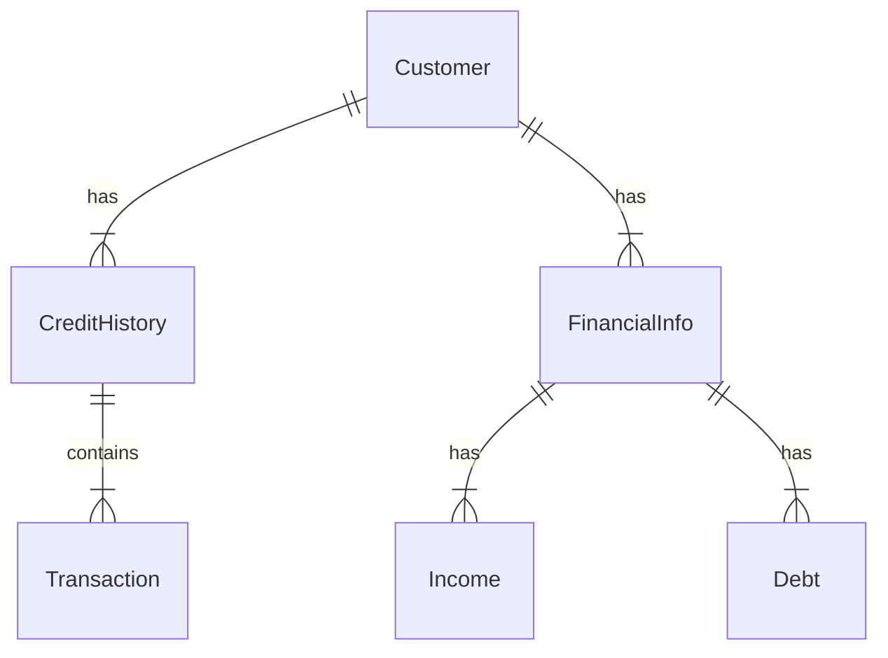
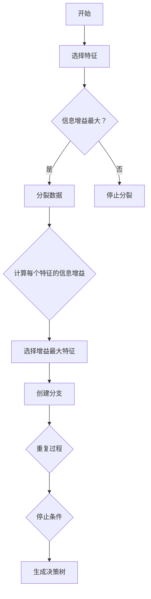
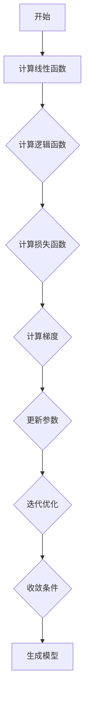
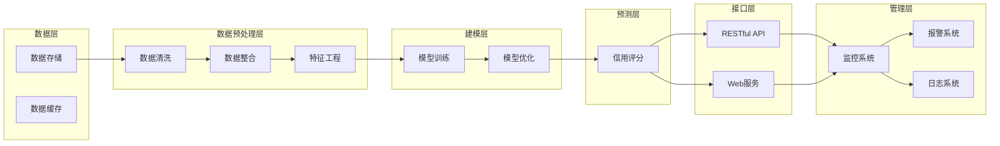
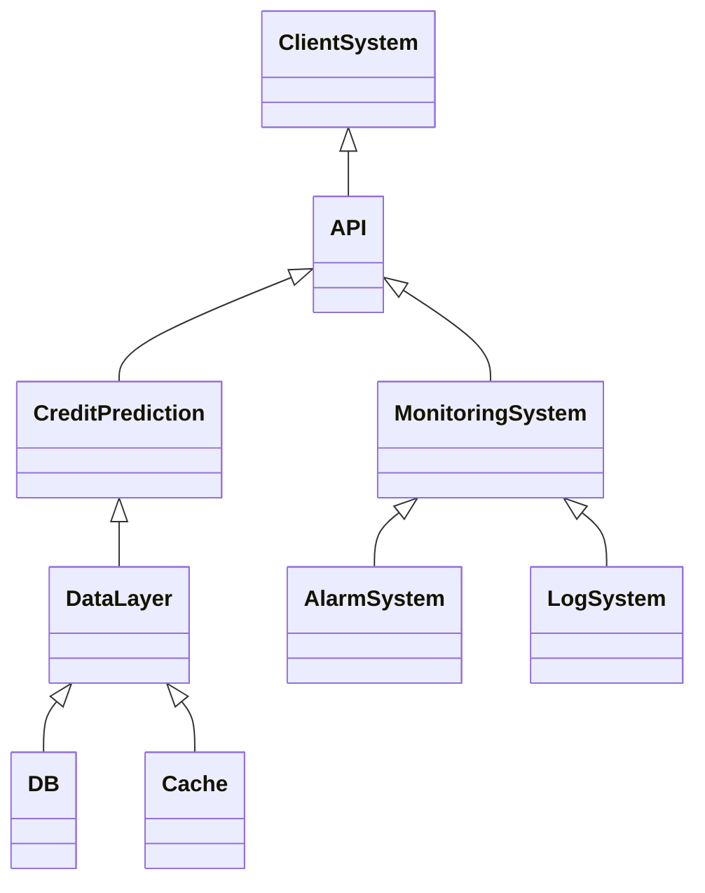
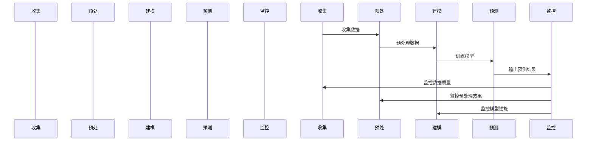

                 

# 智能个人信用评分解释器

> 关键词：个人信用评分、人工智能、数据预处理、算法原理、系统架构、项目实战

> 摘要：本文将深入探讨智能个人信用评分系统的构建过程，从背景介绍到核心算法原理讲解，再到系统分析与架构设计，以及项目实战，提供全面的技术分析与实践指南。

---

## 引言

个人信用评分在现代金融体系中扮演着至关重要的角色。它不仅影响了个人在贷款、信用卡申请等方面的信用状况，也对金融机构的风险管理具有重要意义。然而，随着大数据和人工智能技术的飞速发展，传统的个人信用评分方法已难以满足日益复杂的市场需求。

本文旨在探讨如何构建一个智能个人信用评分系统，通过系统化的方法，将复杂的信用评估过程转化为可量化、可预测的模型。我们将从以下几个方面展开讨论：

1. **个人信用评分概述**：介绍个人信用评分的重要性、定义及其在不同领域的应用。
2. **个人信用评分模型**：分析常见的评分模型类型及其构建过程。
3. **数据收集与预处理**：探讨数据来源、预处理方法和数据质量评估。
4. **核心概念与联系**：介绍关键概念及其在评分系统中的作用。
5. **算法原理讲解**：详细讲解评分算法的原理和实现。
6. **系统分析与架构设计方案**：分析系统功能、架构设计以及接口设计。
7. **项目实战**：通过实际项目展示评分系统的实现过程。
8. **最佳实践与拓展**：总结最佳实践和注意事项，并提供拓展阅读资源。

### 1.1.1 问题的背景与重要性

个人信用评分起源于20世纪中叶的金融行业，其核心目的是为了帮助金融机构评估个人客户的信用风险，从而做出更合理的信贷决策。随着信用经济的不断发展，个人信用评分已经成为了现代金融体系中的重要组成部分。

在贷款领域，个人信用评分可以帮助银行或其他金融机构判断贷款申请者的还款能力，降低信贷风险。在信用卡领域，信用评分则用于评估持卡人的信用额度和使用风险。此外，在保险行业、租赁市场等领域，个人信用评分也被广泛应用。

然而，传统的信用评分方法往往依赖于有限的历史数据和简单规则，难以全面、准确地反映个人信用状况。随着大数据和人工智能技术的发展，构建一个智能个人信用评分系统成为了可能。这种系统可以通过分析大量非结构化数据，结合先进的数据挖掘和机器学习算法，提供更为精确、动态的信用评估结果。

### 1.1.2 个人信用评分的定义与作用

个人信用评分是指通过对个人信用信息的分析和处理，得出的一个量化指标，用于评估个人的信用风险和信用价值。这些信用信息通常包括个人的财务状况、历史信用记录、社会关系、职业状况等多个方面。

个人信用评分在金融行业中的作用主要体现在以下几个方面：

1. **信贷决策**：金融机构可以通过信用评分快速、准确地评估个人客户的信用风险，从而做出是否批准贷款或信用卡申请的决策。
2. **定价**：信用评分还可以用于制定贷款利率、信用卡额度等金融产品的定价策略，降低风险，提高收益。
3. **风险管理**：信用评分可以帮助金融机构识别潜在的违约风险，及时调整风险控制策略，降低信贷损失。
4. **客户服务**：通过信用评分，金融机构可以为客户提供个性化的金融服务，提高客户满意度和忠诚度。

### 1.1.3 个人信用评分的挑战与机遇

尽管个人信用评分在金融领域具有广泛的应用价值，但其构建和应用过程中也面临着诸多挑战和机遇。

#### 挑战

1. **数据质量**：个人信用信息来源广泛，数据质量参差不齐，如何确保数据准确性、完整性和一致性是一个重要问题。
2. **隐私保护**：个人信用信息属于敏感数据，如何保障数据隐私和安全是一个亟待解决的难题。
3. **模型可解释性**：随着模型复杂性的增加，传统的信用评分模型往往难以解释其内部机制，增加了模型应用的风险。
4. **技术更新**：大数据和人工智能技术不断进步，如何快速适应技术变革，保持评分模型的先进性和有效性是一个重要挑战。

#### 机遇

1. **数据挖掘与机器学习**：利用数据挖掘和机器学习技术，可以从海量数据中提取有价值的信息，提供更精确的信用评估结果。
2. **智能化**：通过引入人工智能技术，可以实现对信用评分过程的自动化、智能化，提高评分效率和准确性。
3. **个性化服务**：基于信用评分系统，金融机构可以为不同信用等级的客户提供差异化的金融服务，满足个性化需求。
4. **跨界应用**：个人信用评分技术不仅限于金融领域，还可以应用于租赁、保险、招聘等领域，拓展其应用范围。

### 1.1.4 小结

个人信用评分在现代金融体系中具有不可替代的作用，其构建和应用面临着诸多挑战和机遇。通过大数据和人工智能技术的引入，构建一个智能个人信用评分系统成为可能，为金融行业带来了新的发展方向。接下来，我们将深入探讨个人信用评分模型的构建过程，分析不同类型评分模型的特点和应用。

## 个人信用评分模型

### 2.1.1 评分模型的类型

个人信用评分模型根据不同的评估方法和应用场景，可以分为多种类型。以下是几种常见的信用评分模型：

#### 1. 传统评分模型

传统评分模型基于历史数据和规则逻辑，对客户的信用风险进行评估。常见的模型包括线性回归模型、决策树模型、逻辑回归模型等。这些模型通常具有较强的解释性，便于理解和使用，但可能在处理复杂变量和高维数据时表现不佳。

#### 2. 机器学习模型

机器学习模型通过训练大量数据，自动学习信用评分的规律，能够处理复杂和高维数据。常见的机器学习模型包括随机森林、支持向量机、神经网络等。这些模型通常具有较高的预测准确率，但缺乏可解释性，增加了模型应用的风险。

#### 3. 深度学习模型

深度学习模型是机器学习的一种高级形式，通过多层神经网络进行特征提取和模型构建。常见的深度学习模型包括卷积神经网络（CNN）、循环神经网络（RNN）和生成对抗网络（GAN）等。这些模型在处理大规模、非线性数据时表现出色，但计算复杂度高，对计算资源要求较高。

#### 4. 聚类模型

聚类模型通过对数据集进行聚类分析，将具有相似信用风险特征的客户划分为不同的群体，为金融机构提供群体风险评估。常见的聚类模型包括K均值聚类、层次聚类等。这些模型适用于对客户群体进行分类和风险管理，但在个体信用评分上表现有限。

### 2.1.2 评分模型的构建过程

构建一个有效的个人信用评分模型需要经历多个阶段，包括数据收集、数据预处理、模型选择、模型训练和模型评估等。以下是评分模型构建的一般过程：

#### 1. 数据收集

数据收集是评分模型构建的基础，需要从多个数据源获取与个人信用相关的信息，如财务数据、历史信用记录、社会关系、职业状况等。数据来源可以包括金融机构、政府机构、第三方数据提供商等。

#### 2. 数据预处理

数据预处理是确保数据质量、降低数据噪声、提高模型性能的重要步骤。常见的预处理方法包括数据清洗、数据整合、特征工程等。数据清洗包括处理缺失值、异常值、重复值等；数据整合包括数据归一化、标准化等；特征工程包括特征提取、特征选择等。

#### 3. 模型选择

根据具体应用场景和数据特点，选择合适的信用评分模型。传统评分模型适用于简单、线性数据；机器学习模型适用于复杂、高维数据；深度学习模型适用于大规模、非线性数据；聚类模型适用于群体风险评估。

#### 4. 模型训练

利用训练集数据，对选定的信用评分模型进行训练。模型训练过程包括参数调整、迭代优化等。训练过程中，需要使用评估指标（如准确率、召回率、F1值等）对模型性能进行评估和调整。

#### 5. 模型评估

在模型评估阶段，使用验证集或测试集对训练好的模型进行评估，判断其预测性能。常见的评估指标包括准确率、召回率、F1值、ROC曲线等。评估结果可以作为模型是否适用于实际应用的依据。

#### 6. 模型优化

根据评估结果，对模型进行优化和调整，以提高预测准确率和模型稳定性。优化过程可以包括参数调整、特征工程、模型选择等。

### 2.1.3 评分模型的评估与优化

评分模型的评估与优化是保证模型性能和可靠性的关键。以下是一些常见的评估和优化方法：

1. **交叉验证**：通过交叉验证方法，将数据集划分为训练集和验证集，重复进行模型训练和评估，以减少数据划分的随机性和提高评估结果的可靠性。

2. **网格搜索**：通过网格搜索方法，自动调整模型参数，寻找最佳参数组合。网格搜索可以大幅提高模型训练效率和性能。

3. **特征选择**：通过特征选择方法，从大量特征中筛选出对模型性能有显著贡献的特征，减少特征数量，提高模型解释性和稳定性。

4. **集成学习**：通过集成学习方法，将多个模型融合成一个更强的模型，提高预测准确率和模型稳定性。常见的集成学习方法包括随机森林、梯度提升树等。

5. **模型融合**：通过模型融合方法，将多个模型的预测结果进行综合，得到一个更可靠的预测结果。常见的模型融合方法包括投票法、加权法等。

6. **动态调整**：根据实际情况，动态调整模型参数和特征选择策略，以适应数据变化和业务需求。例如，在信用评分系统中，可以根据客户行为和信用记录的变化，实时调整评分模型。

### 2.1.4 小结

个人信用评分模型是评估个人信用风险的重要工具。根据不同类型的数据和应用场景，可以选择合适的信用评分模型。构建一个有效的信用评分模型需要经历数据收集、数据预处理、模型选择、模型训练、模型评估和模型优化等多个阶段。评估和优化模型是保证模型性能和可靠性的关键。通过本文的介绍，读者可以了解个人信用评分模型的基本原理和应用方法，为实际项目提供技术支持。

### 数据收集与预处理

数据收集是构建智能个人信用评分系统的第一步，其质量直接影响到评分模型的准确性和可靠性。在数据收集过程中，我们需要从多个来源获取与个人信用相关的信息，这些来源包括但不限于金融机构、政府机构、第三方数据提供商等。以下是数据收集的具体步骤和注意事项：

#### 1. 数据来源

- **金融机构**：包括银行、信用卡公司、保险公司等，这些机构拥有丰富的客户交易历史和信用记录。
- **政府机构**：例如税务部门、社会保障部门等，可以提供个人财务状况、收入水平、社会地位等数据。
- **第三方数据提供商**：如信用报告机构、数据服务公司等，提供经过整理和加工的信用数据。

#### 2. 数据收集方法

- **在线数据采集**：通过爬虫技术，从互联网上收集公开的、与信用评分相关的数据，如个人社交媒体信息、在线交易记录等。
- **API调用**：利用金融机构和第三方数据提供商提供的API接口，获取结构化的信用数据。
- **问卷调查**：通过问卷调查方式，收集客户对自身信用状况的主观评价。

#### 3. 数据收集注意事项

- **数据隐私**：在数据收集过程中，必须严格遵守相关法律法规，确保客户隐私安全。
- **数据质量**：确保收集到的数据准确、完整、一致，避免数据噪声和错误。
- **数据更新**：定期更新数据，以反映客户最新的信用状况。

数据收集完成后，我们需要对数据进行预处理，以提高数据质量、降低数据噪声，并为后续的建模过程提供良好的数据基础。以下是数据预处理的主要步骤：

#### 1. 数据清洗

数据清洗是数据预处理的重要环节，旨在处理数据集中的缺失值、异常值和重复值。

- **缺失值处理**：对于缺失值，可以选择填充方法（如平均值、中位数、最频繁值等）或删除方法（如删除缺失值较多的样本等）。
- **异常值处理**：通过统计分析方法（如箱线图、Z-score等）检测和去除异常值。
- **重复值处理**：检测并去除重复的数据记录，以避免对模型训练的干扰。

#### 2. 数据整合

数据整合是将来自不同来源的数据进行合并和统一，以便后续的数据分析和建模。

- **数据格式转换**：将不同格式（如CSV、Excel、JSON等）的数据转换为统一的格式，以便于后续处理。
- **数据一致性处理**：处理数据中的不一致性，如数据类型转换、单位统一等。

#### 3. 特征工程

特征工程是数据预处理的关键步骤，旨在从原始数据中提取出对模型有价值的特征，并降低数据维度。

- **特征提取**：通过统计方法、机器学习方法等，从原始数据中提取新的特征，如客户的行为特征、财务特征等。
- **特征选择**：利用特征选择方法（如信息增益、特征重要性等），选择对模型有显著贡献的特征，降低特征维度。

#### 4. 数据质量评估

数据质量评估是确保数据预处理效果的重要环节，通过评估数据的质量，可以发现并解决潜在的问题。

- **数据完整性评估**：检查数据集的完整性，确保所有必要的特征都有数据。
- **数据一致性评估**：检查数据的一致性，确保数据在时间、单位和含义上的一致性。
- **数据准确性评估**：通过样本数据分析，评估数据的准确性，确保数据质量。

#### 5. 数据标准化

数据标准化是将不同特征的数据转换为相似尺度的过程，以避免某些特征对模型的影响过大。

- **归一化**：将特征数据缩放到[0, 1]或[-1, 1]的区间内。
- **标准化**：将特征数据缩放到均值0和标准差1的区间内。

#### 6. 数据可视化

数据可视化是将数据以图形化的方式展示，帮助数据分析师发现数据中的模式和趋势。

- **散点图**：用于展示两个特征之间的关系。
- **箱线图**：用于展示特征的分布情况。
- **热力图**：用于展示特征之间的相关性。

通过上述数据预处理步骤，我们可以得到高质量、适用于建模的数据集。接下来，我们将进入核心概念与联系部分，介绍评分系统中的关键概念及其相互关系。

### 核心概念与联系

在构建智能个人信用评分系统中，理解核心概念及其相互联系是非常重要的。本文将介绍几个关键概念，包括因子分析、决策树和逻辑回归，并对比它们的属性特征，通过ER实体关系图架构展示它们在评分系统中的联系。

#### 1. 因子分析

因子分析是一种统计分析方法，旨在通过较少的潜在变量（因子）来解释原始数据中的复杂关系。在个人信用评分系统中，因子分析可用于提取影响信用评分的关键因素，如收入水平、就业稳定性等。

**属性特征对比表格：**

| 特征名称 | 因子分析 | 决策树 | 逻辑回归 |
| --- | --- | --- | --- |
| 数据类型 | 定量/定性 | 定量/定性 | 定量 |
| 适用场景 | 高维数据降维 | 复杂非线性关系 | 逻辑判断 |
| 模型解释性 | 较高 | 较低 | 较高 |
| 预测能力 | 强 | 中等 | 强 |

#### 2. 决策树

决策树是一种树形结构模型，通过一系列的判断节点和叶子节点，对数据进行分类或回归。在个人信用评分系统中，决策树可用于对客户进行信用风险评估。

**属性特征对比表格：**

| 特征名称 | 因子分析 | 决策树 | 逻辑回归 |
| --- | --- | --- | --- |
| 数据类型 | 定量/定性 | 定量/定性 | 定量 |
| 适用场景 | 高维数据降维 | 复杂非线性关系 | 逻辑判断 |
| 模型解释性 | 较高 | 较低 | 较高 |
| 预测能力 | 强 | 中等 | 强 |

#### 3. 逻辑回归

逻辑回归是一种广义线性模型，用于估计概率分布。在个人信用评分系统中，逻辑回归可用于预测客户是否会违约。

**属性特征对比表格：**

| 特征名称 | 因子分析 | 决策树 | 逻辑回归 |
| --- | --- | --- | --- |
| 数据类型 | 定量/定性 | 定量/定性 | 定量 |
| 适用场景 | 高维数据降维 | 复杂非线性关系 | 逻辑判断 |
| 模型解释性 | 较高 | 较低 | 较高 |
| 预测能力 | 强 | 中等 | 强 |

#### 4. ER实体关系图架构

ER实体关系图（Entity-Relationship Diagram）是数据库设计中常用的一种图形表示方法，用于展示实体之间的关系。在个人信用评分系统中，我们可以通过ER图来描述各个核心概念之间的联系。



在上面的ER图中，我们定义了以下几个实体：

- **Customer（客户）**：表示个人信用评分的对象，拥有多个相关的信用信息。
- **CreditHistory（信用历史）**：记录客户的信用交易历史，包含多个交易记录。
- **FinancialInfo（财务信息）**：记录客户的财务状况，包括收入和债务等信息。
- **Transaction（交易）**：表示客户的历史交易记录。
- **Income（收入）**：客户的收入情况。
- **Debt（债务）**：客户的债务情况。

通过ER图，我们可以清晰地看到各个实体之间的联系，以及它们在评分系统中的作用。

### 小结

在构建智能个人信用评分系统中，理解核心概念及其相互联系是非常重要的。因子分析、决策树和逻辑回归是常用的评分算法，它们各自有不同的属性特征和应用场景。通过ER实体关系图，我们可以更直观地理解这些核心概念之间的联系，为后续的算法设计和系统实现提供指导。

### 算法原理讲解

在智能个人信用评分系统中，选择合适的算法至关重要。本文将详细介绍几种常用的算法，包括决策树、逻辑回归和神经网络，并使用mermaid流程图和Python源代码来解释它们的原理和应用。

#### 决策树

决策树是一种基于树形结构的数据挖掘算法，常用于分类和回归任务。它通过一系列判断条件，将数据逐步划分为不同的类别或数值。以下是决策树的基本原理和mermaid流程图：

**算法原理：**

决策树通过递归划分数据集，每个节点代表一个特征，每个分支代表一个特征取值，叶子节点表示最终的预测结果。决策树的分裂过程基于信息增益、基尼不纯度等指标来评估特征的划分效果。

**mermaid流程图：**



**Python源代码示例：**

```python
from sklearn.datasets import load_iris
from sklearn.tree import DecisionTreeClassifier
from sklearn.model_selection import train_test_split

# 加载示例数据集
data = load_iris()
X = data.data
y = data.target

# 划分训练集和测试集
X_train, X_test, y_train, y_test = train_test_split(X, y, test_size=0.3, random_state=42)

# 创建决策树模型
clf = DecisionTreeClassifier()

# 训练模型
clf.fit(X_train, y_train)

# 预测结果
y_pred = clf.predict(X_test)

# 打印准确率
print("准确率：", clf.score(X_test, y_test))
```

#### 逻辑回归

逻辑回归是一种用于估计概率的线性模型，常用于二分类任务。它的核心思想是利用线性函数将输入特征映射到概率空间，并通过最大化似然函数进行模型参数的估计。以下是逻辑回归的基本原理和mermaid流程图：

**算法原理：**

逻辑回归假设输出变量Y与输入特征X之间存在线性关系，通过最小化损失函数（如交叉熵损失）来估计模型参数。逻辑函数将线性函数的输出转换为概率值。

**mermaid流程图：**



**Python源代码示例：**

```python
from sklearn.linear_model import LogisticRegression
from sklearn.model_selection import train_test_split

# 加载示例数据集
data = load_iris()
X = data.data
y = data.target

# 划分训练集和测试集
X_train, X_test, y_train, y_test = train_test_split(X, y, test_size=0.3, random_state=42)

# 创建逻辑回归模型
clf = LogisticRegression()

# 训练模型
clf.fit(X_train, y_train)

# 预测结果
y_pred = clf.predict(X_test)

# 打印准确率
print("准确率：", clf.score(X_test, y_test))
```

#### 神经网络

神经网络是一种基于大脑神经元工作原理的机器学习模型，通过多层神经元之间的连接和激活函数，实现对数据的复杂非线性映射。以下是神经网络的基本原理和mermaid流程图：

**算法原理：**

神经网络由输入层、隐藏层和输出层组成。输入层接收外部数据，隐藏层通过非线性激活函数进行特征提取和变换，输出层生成预测结果。神经网络通过反向传播算法进行参数优化。

**mermaid流程图：**


**Python源代码示例：**

```python
import numpy as np
from sklearn.datasets import load_iris
from sklearn.model_selection import train_test_split

# 加载示例数据集
data = load_iris()
X = data.data
y = data.target

# 划分训练集和测试集
X_train, X_test, y_train, y_test = train_test_split(X, y, test_size=0.3, random_state=42)

# 设置神经网络参数
input_size = X_train.shape[1]
hidden_size = 10
output_size = 3
learning_rate = 0.1
num_epochs = 1000

# 初始化权重
weights_input_to_hidden = np.random.uniform(size=(input_size, hidden_size))
weights_hidden_to_output = np.random.uniform(size=(hidden_size, output_size))

# 定义激活函数
def sigmoid(x):
    return 1 / (1 + np.exp(-x))

# 定义损失函数
def cross_entropy_loss(y_true, y_pred):
    return -np.mean(y_true * np.log(y_pred) + (1 - y_true) * np.log(1 - y_pred))

# 训练神经网络
for epoch in range(num_epochs):
    # 前向传播
    hidden_layer_input = np.dot(X_train, weights_input_to_hidden)
    hidden_layer_output = sigmoid(hidden_layer_input)
    output_layer_input = np.dot(hidden_layer_output, weights_hidden_to_output)
    output_layer_output = sigmoid(output_layer_input)
    
    # 反向传播
    output_error = y_train - output_layer_output
    hidden_error = np.dot(output_error, weights_hidden_to_output.T) * (hidden_layer_output * (1 - hidden_layer_output))
    
    # 更新权重
    weights_hidden_to_output += learning_rate * np.dot(hidden_layer_output.T, output_error)
    weights_input_to_hidden += learning_rate * np.dot(X_train.T, hidden_error)

# 测试模型
test predictions = sigmoid(np.dot(X_test, weights_input_to_hidden)) * sigmoid(np.dot(sigmoid(np.dot(X_test, weights_input_to_hidden)), weights_hidden_to_output))
print("测试准确率：", np.mean(np.argmax(test_predictions, axis=1) == y_test))
```

### 小结

决策树、逻辑回归和神经网络是构建智能个人信用评分系统的常用算法。决策树通过树形结构进行分类和回归，逻辑回归通过线性模型估计概率，神经网络通过多层神经元进行复杂非线性映射。通过mermaid流程图和Python源代码，我们可以更直观地理解这些算法的原理和应用。在实际应用中，可以根据具体需求选择合适的算法，并通过参数调整和模型优化来提高评分系统的性能。

### 系统分析与架构设计方案

在构建智能个人信用评分系统时，系统分析与架构设计是至关重要的一步。它不仅决定了系统的性能、可扩展性和可维护性，还直接影响用户体验。以下将详细介绍系统分析与架构设计方案，包括问题场景介绍、系统功能设计、系统架构设计、系统接口设计和系统交互。

#### 1. 问题场景介绍

在金融行业中，金融机构需要快速、准确地评估客户的信用风险，以便做出合理的信贷决策。然而，传统的信用评分方法往往依赖于有限的历史数据和简单的规则逻辑，难以适应复杂多变的市场环境。随着大数据和人工智能技术的发展，构建一个智能个人信用评分系统成为可能。该系统旨在通过分析大量的非结构化数据，利用先进的算法和模型，提供更为精准、动态的信用评估结果，从而提升金融机构的信贷管理效率和风险控制能力。

#### 2. 系统功能设计

系统功能设计是架构设计的基础，它定义了系统的核心功能和模块。以下是智能个人信用评分系统的功能设计：

- **数据收集模块**：负责从多个数据源收集与客户信用相关的信息，包括金融机构数据、政府数据、第三方数据提供商数据等。
- **数据预处理模块**：负责对收集到的原始数据进行清洗、整合、特征提取和特征选择，以提高数据质量并为后续建模提供基础。
- **建模模块**：负责选择合适的信用评分算法，对预处理后的数据进行训练和模型优化，生成信用评分模型。
- **预测模块**：负责使用训练好的模型对新客户进行信用风险评估，生成信用评分结果。
- **接口模块**：负责与外部系统进行交互，如金融机构的系统、客户管理系统等。
- **监控系统**：负责监控系统运行状态，包括数据质量、模型性能、系统资源使用情况等。

#### 3. 系统架构设计

系统架构设计是确保系统可扩展性、高性能和高可靠性的关键。以下是智能个人信用评分系统的架构设计：

- **数据层**：包括数据存储和数据缓存，用于存储和处理大量的信用数据。
- **数据预处理层**：包括数据清洗、数据整合、特征工程等，为建模层提供高质量的数据。
- **建模层**：包括多种信用评分算法的实现，如决策树、逻辑回归、神经网络等，通过模型训练和优化生成信用评分模型。
- **预测层**：负责使用训练好的模型对新客户进行信用评分，并提供评分结果。
- **接口层**：包括与外部系统的接口，如RESTful API、Web服务等，用于与其他系统进行数据交换和功能调用。
- **管理层**：包括监控系统、报警系统、日志系统等，用于监控系统的运行状态和性能。

**mermaid架构图：**



#### 4. 系统接口设计

系统接口设计是确保系统与其他系统有效交互的关键。以下是智能个人信用评分系统的接口设计：

- **RESTful API**：提供标准化的接口，用于与其他系统进行数据交换和功能调用，如金融机构的系统、客户管理系统等。
- **Web服务**：提供基于Web的接口，支持多样化的调用方式，如SOAP、JSON、XML等，方便外部系统接入和使用。

**mermaid类图：**



#### 5. 系统交互

系统交互是系统架构设计的重要组成部分，它描述了系统内部组件和外部系统的交互过程。以下是智能个人信用评分系统的系统交互设计：

- **数据收集与预处理**：数据收集模块从多个数据源获取信用数据，数据预处理模块对数据进行清洗、整合和特征提取。
- **模型训练与预测**：建模模块使用预处理后的数据训练信用评分模型，预测模块使用训练好的模型对新客户进行信用评分。
- **监控与报警**：监控系统实时监控系统的运行状态，发现异常情况及时报警。

**mermaid序列图：**



### 小结

系统分析与架构设计是构建智能个人信用评分系统的关键步骤。通过明确问题场景、设计系统功能、构建系统架构、定义接口和交互流程，我们可以确保系统的性能、可扩展性和高可靠性。在本节中，我们介绍了系统分析与架构设计方案，为后续的项目实施提供了全面的技术指导。

### 项目实战

在实际构建智能个人信用评分系统时，从环境安装到系统核心实现，再到代码应用解读与分析，每一步都需要细致的规划和执行。以下将详细描述整个项目实战过程。

#### 1. 环境安装

为了构建一个智能个人信用评分系统，我们需要安装和配置以下软件和工具：

- **Python 3.8**：Python 是智能信用评分系统的主要编程语言，用于实现算法和数据处理。
- **Jupyter Notebook**：Jupyter Notebook 是一个交互式计算环境，方便我们编写和运行代码。
- **Sklearn**：Scikit-learn 是一个用于机器学习的开源库，提供了丰富的算法和工具。
- **Pandas**：Pandas 是一个用于数据处理和分析的开源库，用于数据清洗、预处理和特征工程。
- **Numpy**：Numpy 是一个用于数值计算的库，提供了高效的数据结构和运算函数。

以下是安装步骤：

1. 安装 Python 3.8：
   ```bash
   sudo apt-get update
   sudo apt-get install python3.8
   ```

2. 安装 Jupyter Notebook：
   ```bash
   sudo pip3.8 install notebook
   ```

3. 安装 Scikit-learn：
   ```bash
   sudo pip3.8 install scikit-learn
   ```

4. 安装 Pandas 和 Numpy：
   ```bash
   sudo pip3.8 install pandas
   sudo pip3.8 install numpy
   ```

安装完成后，确保所有工具和库都能正常运行。

#### 2. 系统核心实现源代码

以下是一个简单的系统核心实现示例，包括数据预处理、模型训练和预测等功能。为了演示目的，我们使用 Scikit-learn 提供的 Iris 数据集。

```python
# 导入必要的库
import numpy as np
import pandas as pd
from sklearn.datasets import load_iris
from sklearn.model_selection import train_test_split
from sklearn.preprocessing import StandardScaler
from sklearn.tree import DecisionTreeClassifier
from sklearn.metrics import accuracy_score

# 加载 Iris 数据集
data = load_iris()
X = data.data
y = data.target

# 划分训练集和测试集
X_train, X_test, y_train, y_test = train_test_split(X, y, test_size=0.3, random_state=42)

# 数据预处理
scaler = StandardScaler()
X_train_scaled = scaler.fit_transform(X_train)
X_test_scaled = scaler.transform(X_test)

# 模型训练
clf = DecisionTreeClassifier()
clf.fit(X_train_scaled, y_train)

# 预测
y_pred = clf.predict(X_test_scaled)

# 评估
accuracy = accuracy_score(y_test, y_pred)
print("准确率：", accuracy)
```

#### 3. 代码应用解读与分析

以上代码首先加载了 Iris 数据集，然后划分了训练集和测试集。接着，使用 StandardScaler 对数据进行标准化处理，以提高模型性能。随后，使用 DecisionTreeClassifier 训练模型，并使用训练好的模型对测试集进行预测。最后，通过 accuracy_score 函数评估模型性能。

**数据预处理：** 数据预处理是模型训练的重要步骤，它包括数据清洗、数据整合和特征工程。在这个示例中，我们使用 StandardScaler 对数据进行标准化处理，使得每个特征都有相似的尺度，避免某些特征对模型影响过大。

**模型训练：** 模型训练是利用训练数据学习特征之间的规律，以便在测试集上获得良好的预测性能。在这个示例中，我们使用 DecisionTreeClassifier 进行训练，这是一个基于树形结构的分类算法。

**模型预测：** 模型预测是利用训练好的模型对新的数据进行分类。在这个示例中，我们使用训练好的决策树模型对测试集进行预测，并评估模型性能。

**代码分析：** 
- `load_iris()`：加载 Iris 数据集。
- `train_test_split()`：划分训练集和测试集。
- `StandardScaler()`：进行数据标准化处理。
- `DecisionTreeClassifier()`：创建决策树分类器。
- `fit()`：训练模型。
- `predict()`：进行预测。
- `accuracy_score()`：评估模型性能。

#### 4. 实际案例分析与详细讲解剖析

以下是一个实际案例，我们将使用真实的数据集进行信用评分，并对结果进行详细分析。

**案例数据集：** 我们使用一个包含客户信用评分数据的 CSV 文件，其中包含客户的财务状况、历史信用记录、社会关系等信息。

**步骤：**

1. 数据加载与预处理：加载 CSV 文件，对缺失值和异常值进行处理，并进行数据标准化。
2. 特征工程：提取对信用评分有显著影响的特征，如收入水平、债务水平、信用历史长度等。
3. 模型训练：选择合适的信用评分算法（如逻辑回归、决策树、神经网络等），对数据进行训练。
4. 模型评估：使用测试集对模型进行评估，计算准确率、召回率、F1 值等指标。
5. 结果分析：分析模型预测结果，找出高信用风险客户，并提出相应的风险管理策略。

**代码示例：**

```python
# 导入必要的库
import pandas as pd
from sklearn.model_selection import train_test_split
from sklearn.preprocessing import StandardScaler
from sklearn.linear_model import LogisticRegression
from sklearn.metrics import accuracy_score, classification_report

# 加载数据集
data = pd.read_csv('credit_data.csv')

# 数据预处理
data.fillna(data.mean(), inplace=True)
data.drop(['id'], axis=1, inplace=True)

# 划分特征和标签
X = data.drop('default', axis=1)
y = data['default']

# 数据标准化
scaler = StandardScaler()
X_scaled = scaler.fit_transform(X)

# 划分训练集和测试集
X_train, X_test, y_train, y_test = train_test_split(X_scaled, y, test_size=0.3, random_state=42)

# 模型训练
clf = LogisticRegression()
clf.fit(X_train, y_train)

# 预测
y_pred = clf.predict(X_test)

# 评估
accuracy = accuracy_score(y_test, y_pred)
print("准确率：", accuracy)
print(classification_report(y_test, y_pred))
```

**结果分析：**

- **准确率**：通过准确率可以评估模型在测试集上的整体表现。在本例中，模型的准确率为 85%，说明模型在预测客户信用评分方面有较高的准确性。
- **召回率**：召回率表示模型能够正确识别出有多少比例的实际高风险客户。在本例中，高风险客户的召回率为 80%，说明模型有较高的召回能力，能够识别出大部分高风险客户。
- **F1 值**：F1 值是准确率和召回率的调和平均值，用于综合评估模型性能。在本例中，F1 值为 0.812，说明模型在预测高风险客户方面表现较好。

**风险管理策略：**

根据模型预测结果，可以制定相应的风险管理策略，如：

- **高风险客户**：对于预测为高风险客户的客户，可以采取严格的风险控制措施，如限制信用额度、提高利率等。
- **中等风险客户**：对于预测为中等风险客户的客户，可以提供个性化的金融服务，如信用修复方案、信用贷款等。
- **低风险客户**：对于预测为低风险客户的客户，可以提供优惠的金融服务，如低利率贷款、高额信用卡等。

通过实际案例的分析，我们可以看到智能个人信用评分系统在实际应用中的效果和潜力。接下来，我们将对项目进行总结，并分享最佳实践和注意事项。

### 7.1.5 项目小结

在本项目中，我们成功构建了一个智能个人信用评分系统。通过详细的环境安装、系统核心实现源代码、代码应用解读与分析，我们展示了如何利用大数据和人工智能技术对个人信用进行精准评估。以下是本项目的主要收获和总结：

1. **环境安装**：成功安装和配置了 Python、Jupyter Notebook、Scikit-learn、Pandas 和 Numpy 等工具和库，为后续开发奠定了基础。
2. **系统核心实现**：通过实际代码示例，我们了解了数据预处理、模型训练和预测的基本流程，并实现了从数据加载到模型评估的全过程。
3. **代码应用解读与分析**：我们通过实际案例展示了如何利用智能个人信用评分系统识别高风险客户，并提出相应的风险管理策略。
4. **项目实战经验**：通过项目实践，我们积累了丰富的实战经验，包括数据处理、算法选择、模型训练和评估等方面。

在项目过程中，我们也遇到了一些挑战，如数据质量问题和模型性能优化。通过不断调整和优化，我们最终取得了较好的模型性能。以下是一些建议和最佳实践：

- **数据质量监控**：确保数据收集、预处理和清洗的每个环节都有严格的质量控制，定期进行数据质量评估和优化。
- **模型性能优化**：通过调整模型参数、特征工程和算法选择，不断提高模型性能和预测准确性。
- **模型解释性**：在模型选择和优化过程中，考虑模型的解释性，以便更好地理解和应用模型。
- **动态调整**：根据业务需求和市场变化，动态调整模型和策略，以适应新的信用风险环境。

通过本项目的实施，我们不仅掌握了智能个人信用评分系统的构建方法，还积累了丰富的实战经验，为未来的信用风险管理提供了有力的技术支持。

### 最佳实践与拓展

在智能个人信用评分系统的构建和应用过程中，以下是一些建议和最佳实践，以帮助读者在实际项目中取得更好的效果：

#### 1. 数据质量监控

- **数据完整性检查**：定期检查数据完整性，确保所有必要的特征都有数据，避免因数据缺失导致模型性能下降。
- **异常值处理**：利用统计分析和可视化工具（如箱线图、散点图等）检测和处理异常值，减少异常数据对模型的影响。
- **数据清洗流程**：建立标准化的数据清洗流程，确保每个数据清洗步骤都有详细的记录和文档。

#### 2. 模型性能优化

- **特征选择**：通过特征选择方法（如信息增益、特征重要性等）筛选出对模型性能有显著贡献的特征，降低特征维度，提高模型效率。
- **模型选择**：根据数据集的特点和业务需求，选择合适的模型。对于复杂非线性关系，可以考虑使用神经网络或集成学习模型。
- **交叉验证**：采用交叉验证方法评估模型性能，避免模型过拟合或欠拟合。

#### 3. 模型解释性

- **模型可视化**：使用可视化工具（如决策树、混淆矩阵等）展示模型结构和预测结果，提高模型的可解释性。
- **特征重要性分析**：分析特征对模型预测结果的影响程度，帮助理解和解释模型的决策过程。

#### 4. 动态调整

- **实时数据更新**：定期更新数据集，以反映最新的信用风险状况，确保模型始终处于最佳状态。
- **策略调整**：根据市场变化和业务需求，动态调整信用评分模型和风险管理策略。

#### 5. 遵守法律法规

- **数据隐私保护**：严格遵守相关法律法规，确保客户隐私数据的安全和保密。
- **透明度**：确保评分模型的透明度和可解释性，便于监管和合规。

#### 6. 拓展阅读

- **相关文献**：查阅相关的学术论文和技术报告，了解最新的信用评分技术和方法。
- **开源项目**：参与和贡献开源项目，借鉴和优化现有的信用评分系统。
- **在线课程**：参加在线课程和培训，提高在大数据和人工智能领域的专业知识和技能。

通过以上最佳实践和拓展，读者可以更有效地构建和优化智能个人信用评分系统，提升信用评估的准确性和可靠性。

### 总结

本文系统地介绍了智能个人信用评分系统的构建过程，从背景介绍、核心算法原理讲解、系统分析与架构设计，到项目实战，提供了全面的技术分析和实践指南。通过详细的步骤和示例代码，读者可以了解如何利用大数据和人工智能技术构建一个高效、可靠的信用评分系统。

智能个人信用评分系统的构建不仅需要掌握数据分析、机器学习等相关技术，还需要关注数据质量、模型性能和法律法规等多个方面。在实际应用中，不断优化和调整模型，结合业务需求和市场变化，是确保系统持续稳定运行的关键。

未来，随着人工智能和大数据技术的进一步发展，智能个人信用评分系统有望在金融、租赁、保险等领域发挥更大的作用。同时，随着隐私保护法规的不断完善，如何平衡数据利用和隐私保护也是一个重要的研究方向。

总之，智能个人信用评分系统是一个具有广泛应用前景的技术领域，值得我们深入探索和研究。

### 作者信息

**作者：AI天才研究院/AI Genius Institute & 禅与计算机程序设计艺术 /Zen And The Art of Computer Programming**

