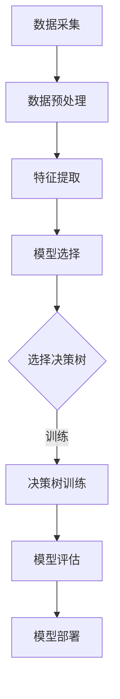
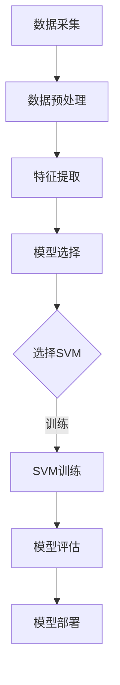
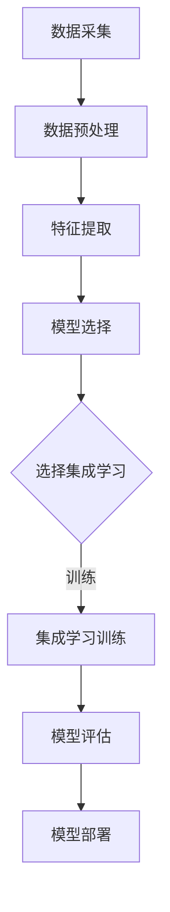

                 

### 引言与背景

在当今高度数字化的时代，金融科技（Fintech）的迅猛发展极大地改变了传统金融服务的方式。个人信贷审批作为金融行业的重要组成部分，也面临着前所未有的变革。传统信贷审批流程通常耗时长、成本高且容易出现人为错误。为了解决这些问题，智能个人信贷审批系统应运而生，通过人工智能（AI）技术，使得信贷审批过程变得更加高效、准确和智能化。

#### 问题描述

个人信贷审批涉及多个环节，包括贷款申请、信用评估、审批决策和放款等。传统审批流程往往依赖于人工审核，需要大量时间进行资料审查、信用评估和风险评估。这不仅增加了运营成本，还可能导致审批效率低下。同时，由于信息不对称和数据不准确，传统审批流程常常出现错误决策，从而影响客户体验和金融机构的运营效率。

#### 问题解决

为了应对上述问题，智能个人信贷审批系统利用人工智能技术，通过数据分析和机器学习模型，实现了自动化、智能化的信贷审批。该系统可以从海量数据中快速提取有价值的信息，进行精准的信用评估和风险评估，大大提高了审批速度和准确性。同时，通过实时更新和优化模型，系统能够不断适应市场变化，提高决策的准确性和适应性。

#### 边界与外延

智能个人信贷审批系统不仅局限于传统的个人信贷审批，还涵盖了信用卡申请、消费信贷、车贷、房贷等多种贷款类型的审批。此外，系统的应用范围也不仅仅限于金融机构，还包括互联网金融平台、P2P借贷平台等新兴金融业态。因此，智能个人信贷审批系统在金融科技领域具有广阔的应用前景和巨大的市场潜力。

### 核心概念

#### 智能个人信贷

智能个人信贷是指通过人工智能技术，对借款人的信用状况、还款能力、风险水平等进行全面分析和评估，从而实现快速、准确、智能化的信贷审批过程。智能个人信贷的核心在于利用大数据和机器学习算法，从多维度分析借款人的信用状况，减少人为干预，提高审批效率和准确性。

#### 信贷审批

信贷审批是指金融机构在受理借款人贷款申请后，对其信用状况、还款能力、风险水平等进行审查和评估，从而决定是否批准贷款申请的过程。传统的信贷审批主要依赖于人工审核，而智能信贷审批系统则通过人工智能技术，实现了自动化、智能化的审批过程。

#### 人工智能技术

人工智能技术是指通过模拟人类智能的思维方式，使计算机能够自主学习和决策的技术。在智能个人信贷审批系统中，人工智能技术主要用于数据分析和信用评估，包括数据挖掘、机器学习、深度学习等。

### 系统框架

#### 功能模块划分

智能个人信贷审批系统主要包括以下功能模块：

1. **数据采集与处理**：负责收集借款人的个人信息、财务数据、信用记录等，并进行数据清洗、预处理和特征提取。
2. **信用评估**：利用机器学习算法和深度学习模型，对借款人的信用状况进行评估，生成信用评分。
3. **风险评估**：对借款人的风险水平进行评估，包括信用风险、市场风险、操作风险等。
4. **审批决策**：根据信用评分和风险评估结果，自动生成审批决策，包括贷款金额、利率、期限等。
5. **结果反馈**：将审批结果反馈给借款人，同时生成详细的审批报告，供金融机构参考。

#### 技术栈介绍

智能个人信贷审批系统采用以下技术栈：

1. **前端技术**：使用React、Vue等前端框架，构建用户友好的交互界面。
2. **后端技术**：使用Spring Boot、Django等后端框架，实现业务逻辑和数据处理。
3. **数据库**：使用MySQL、PostgreSQL等关系型数据库，存储用户数据、贷款数据和审批数据。
4. **机器学习库**：使用Scikit-learn、TensorFlow、PyTorch等机器学习库，实现信用评分和风险评估算法。
5. **大数据处理**：使用Hadoop、Spark等大数据处理框架，进行海量数据分析和处理。

#### 数据来源与处理

智能个人信贷审批系统的数据来源主要包括：

1. **内部数据**：包括借款人的个人信息、财务数据、信用记录等，来自金融机构的内部系统。
2. **外部数据**：包括借款人的社交网络信息、公共记录、市场数据等，来自第三方数据源。

在数据处理方面，系统采用以下步骤：

1. **数据采集**：通过API接口、数据爬取等方式，从各种数据源收集数据。
2. **数据清洗**：去除重复数据、缺失数据和异常数据，保证数据的准确性和完整性。
3. **特征提取**：从原始数据中提取有用的特征，如财务指标、信用评分、行为特征等。
4. **数据建模**：利用机器学习算法，构建信用评分和风险评估模型。
5. **模型训练**：使用历史数据训练模型，并不断优化模型，提高预测准确性。

### 智能信贷审批的重要性

#### 行业现状

随着互联网金融的快速发展，个人信贷业务在金融行业中的地位日益重要。传统信贷审批流程的低效和人为错误，已成为金融机构亟待解决的问题。智能个人信贷审批系统的出现，为金融机构提供了新的解决方案，有助于提高审批效率、降低运营成本、提升客户满意度。

#### 人工智能的变革

人工智能技术的发展，特别是机器学习和深度学习的突破，为智能个人信贷审批系统提供了强大的技术支撑。通过大数据分析和智能算法，系统能够从海量数据中挖掘有价值的信息，进行精准的信用评估和风险评估，从而实现高效的信贷审批。

#### 经济与社会影响

智能个人信贷审批系统的应用，不仅有助于金融机构提高运营效率和降低成本，还对整个经济和社会产生了深远影响。首先，智能审批系统可以降低贷款门槛，让更多人享受到便捷的金融服务。其次，智能审批系统可以减少不良贷款率，降低金融机构的风险。此外，智能审批系统还可以促进金融科技的创新和发展，推动金融行业的数字化转型。

### 本章小结

本章介绍了智能个人信贷审批系统的背景和重要性，包括系统的功能模块划分、技术栈介绍、数据来源与处理等内容。通过分析传统信贷审批存在的问题，阐述了智能信贷审批系统的优势和应用前景。下一章将深入探讨人工智能基础，为理解智能信贷审批系统的核心技术奠定基础。

----------------------------------------------------------------

## 核心技术与原理

智能个人信贷审批系统的核心在于利用人工智能技术，对借款人的信用状况进行精准评估。在这一部分，我们将逐步深入探讨人工智能的基础知识，包括机器学习和深度学习的原理，以及特征工程和评估与优化的方法。通过这些技术的介绍，我们将为理解智能信贷审批系统的实现提供坚实的基础。

### 第2章: 人工智能基础

#### 2.1 人工智能概述

人工智能（AI）是指通过计算机模拟人类智能行为的技术。其目标是使计算机能够执行人类通常需要智能才能完成的任务，如视觉识别、语言理解、决策制定和问题解决等。人工智能的发展历程可以分为几个阶段：

1. **符号主义（Symbolic AI）**：最早的人工智能研究集中在逻辑推理和知识表示上，主要通过符号逻辑和形式化语言来模拟人类思维。
2. **基于规则的系统（Rule-Based Systems）**：这一阶段的人工智能系统使用明确的规则集来模拟专家的知识和决策过程。
3. **知识表示与推理（Knowledge Representation and Reasoning）**：通过构建大规模的知识库和推理机，使系统能够在特定领域内进行推理和决策。
4. **机器学习（Machine Learning）**：利用数据驱动的方法，使计算机能够从数据中学习并改进性能。
5. **深度学习（Deep Learning）**：基于人工神经网络的深度学习模型，能够在图像、语音、自然语言处理等领域取得突破性成果。

人工智能的应用领域非常广泛，包括但不限于：

1. **图像识别与处理**：如人脸识别、自动驾驶、医疗影像分析等。
2. **自然语言处理**：如机器翻译、语音识别、文本分析等。
3. **决策支持系统**：如风险控制、信用评估、供应链优化等。
4. **机器人技术**：如工业机器人、服务机器人、无人机等。

#### 2.2 机器学习基础

机器学习是人工智能的一个重要分支，它使计算机能够通过数据学习，自动改进性能。机器学习可以分为以下几类：

1. **监督学习（Supervised Learning）**：在有标注的数据集上进行训练，通过学习输入和输出之间的映射关系，实现对未知数据的预测。常见的算法包括线性回归、逻辑回归、决策树、支持向量机（SVM）等。
2. **无监督学习（Unsupervised Learning）**：在无标注的数据集上进行训练，主要用于发现数据中的结构和模式。常见的算法包括聚类、降维、异常检测等。
3. **半监督学习（Semi-Supervised Learning）**：结合了监督学习和无监督学习的方法，通过少量的标注数据和大量的无标注数据进行训练。
4. **强化学习（Reinforcement Learning）**：通过与环境的交互来学习最优策略，通常用于决策问题和游戏控制。

机器学习的基本流程包括：

1. **数据采集**：收集用于训练的数据集，确保数据的质量和代表性。
2. **数据预处理**：对数据进行清洗、归一化、特征提取等处理，以便于模型训练。
3. **模型选择**：选择合适的机器学习算法，根据问题的性质和数据的特点进行选择。
4. **模型训练**：使用训练数据进行模型训练，调整模型参数以优化性能。
5. **模型评估**：使用验证集或测试集对模型进行评估，选择性能最佳的模型。
6. **模型部署**：将训练好的模型部署到实际应用环境中，进行预测和决策。

#### 2.3 深度学习原理

深度学习是机器学习的一个子领域，它通过模拟人脑的神经网络结构，实现对复杂数据的建模和分析。深度学习的基本单元是神经元，它们通过层与层之间的连接进行信息的传递和处理。

1. **神经网络（Neural Networks）**：神经网络由多个层组成，包括输入层、隐藏层和输出层。每一层由多个神经元组成，神经元之间通过权重进行连接。神经网络通过前向传播和反向传播算法，进行信息的传递和误差的调整。

2. **深度学习算法（Deep Learning Algorithms）**：深度学习算法包括多种类型，其中最常见的是卷积神经网络（CNN）、循环神经网络（RNN）和生成对抗网络（GAN）。

   - **卷积神经网络（CNN）**：CNN特别适用于图像识别和图像处理任务。它通过卷积操作和池化操作，提取图像的局部特征，并在不同的层之间进行特征融合。

   - **循环神经网络（RNN）**：RNN适用于序列数据处理，如时间序列分析、自然语言处理等。它能够处理输入序列的动态变化，并通过隐藏状态的记忆来捕捉序列中的长期依赖关系。

   - **生成对抗网络（GAN）**：GAN由生成器和判别器两个神经网络组成，通过对抗训练的方式，生成器尝试生成与真实数据相似的数据，判别器则判断数据是真实还是生成的。GAN在图像生成、图像修复、语音合成等领域取得了显著成果。

3. **实例分析**：以图像识别为例，深度学习算法可以用于人脸识别、物体检测、场景分类等任务。通过训练大规模的图像数据集，深度学习模型能够自动学习图像中的复杂模式，并实现高精度的识别。

#### 2.4 特征工程

特征工程是机器学习过程中至关重要的一步，它涉及到从原始数据中提取和构造有用的特征，以提高模型性能。特征工程包括以下步骤：

1. **数据预处理**：对原始数据进行清洗、归一化和标准化处理，以减少噪声和数据的维度。
2. **特征提取**：通过统计方法、变换方法或机器学习方法，从原始数据中提取有用的特征。例如，使用主成分分析（PCA）进行降维，使用词袋模型进行文本特征提取等。
3. **特征选择**：通过评估特征的重要性，选择对模型性能贡献最大的特征，以减少数据维度和计算成本。常见的方法包括过滤法、包装法和嵌入法。
4. **特征组合**：通过组合不同的特征，构造新的特征，以提高模型的性能和泛化能力。例如，使用交叉特征或交互特征进行组合。

#### 2.5 评估与优化

评估和优化是确保机器学习模型性能的重要环节。以下是一些常用的评估指标和优化方法：

1. **评估指标**：
   - **准确率（Accuracy）**：预测正确的样本数占总样本数的比例。
   - **精确率（Precision）**：预测为正类的样本中，实际为正类的比例。
   - **召回率（Recall）**：实际为正类的样本中，预测为正类的比例。
   - **F1分数（F1 Score）**：精确率和召回率的调和平均，用于综合考虑精确率和召回率。
   - **ROC曲线和AUC值**：ROC曲线是混淆矩阵中真正例率（True Positive Rate, TPR）与假正例率（False Positive Rate, FPR）的图形表示，AUC值表示曲线下方面积，用于评估模型的分类能力。

2. **模型优化**：
   - **参数调整**：通过调整模型参数，如学习率、迭代次数等，优化模型性能。
   - **交叉验证**：使用交叉验证方法，对模型进行多次训练和测试，以避免过拟合和评估误差。
   - **超参数优化**：使用网格搜索、随机搜索等方法，自动调整模型的超参数，以找到最佳参数组合。
   - **集成学习**：通过集成多个模型，提高预测的准确性和稳定性。常见的集成学习方法包括随机森林、梯度提升树等。

#### 2.6 模型部署

模型部署是将训练好的模型应用到实际生产环境中，进行实时预测和决策。以下是一些常见的模型部署方法：

1. **本地部署**：将模型部署到本地服务器或工作站上，通过HTTP接口或命令行方式进行预测。
2. **云部署**：将模型部署到云计算平台上，如AWS、Azure、Google Cloud等，通过REST API或消息队列进行预测。
3. **容器化部署**：使用容器化技术，如Docker，将模型和相关依赖打包到一个容器中，方便部署和管理。
4. **微服务部署**：将模型部署到微服务架构中，与其他服务进行解耦，提高系统的可扩展性和容错性。

#### 2.7 本章小结

本章介绍了人工智能的基础知识，包括人工智能概述、机器学习基础、深度学习原理、特征工程、评估与优化以及模型部署等内容。通过这些技术的介绍，我们为理解智能个人信贷审批系统的实现提供了理论基础。下一章将深入探讨智能个人信贷审批算法的原理，进一步揭示系统的核心工作机制。

----------------------------------------------------------------

## 第3章: 智能个人信贷审批算法原理

智能个人信贷审批算法是智能个人信贷审批系统的核心，它通过对借款人数据的分析和模型训练，实现信用评分和风险评估。本章节将详细探讨智能个人信贷审批算法的概述、原理及其流程，并使用Mermaid绘制算法流程图，以及通过Python代码示例来说明算法的实现。

### 3.1 算法概述

智能个人信贷审批算法的核心任务是评估借款人的信用状况，并给出相应的信用评分和风险评估结果。这个任务通常通过以下几个步骤完成：

1. **数据采集**：从不同的数据源收集借款人的个人信息、财务数据、信用记录等。
2. **数据预处理**：对采集到的数据进行清洗、转换和归一化处理，以确保数据的准确性和一致性。
3. **特征提取**：从预处理后的数据中提取对信用评估有用的特征，如收入水平、工作稳定性、负债率等。
4. **模型选择**：选择合适的机器学习算法，如决策树、支持向量机（SVM）或集成学习等。
5. **模型训练**：使用历史数据集训练选定的模型，调整模型参数以优化性能。
6. **模型评估**：使用验证集或测试集对训练好的模型进行评估，选择性能最佳的模型。
7. **模型部署**：将训练好的模型部署到生产环境中，进行实时信用评分和风险评估。

### 3.2 算法原理

智能个人信贷审批算法的原理主要基于机器学习中的分类和回归模型。以下是一些常见的算法原理：

1. **决策树（Decision Tree）**：
   - **基本概念**：决策树通过一系列的判断规则，将数据集分割成多个子集，每个子集对应一个类别或值。
   - **原理**：决策树通过信息增益或基尼不纯度来选择最佳分割点，构建一棵树形结构模型。
   - **应用**：适用于处理分类问题，如信用评分等级的分类。

2. **支持向量机（SVM）**：
   - **基本概念**：SVM是一种二类分类模型，通过找到一个最佳的超平面，将不同类别的数据点分隔开来。
   - **原理**：SVM通过最大化类间隔，寻找最优的超平面，并使用核函数将低维数据映射到高维空间。
   - **应用**：适用于处理高维数据，如信用风险评估。

3. **集成学习（Ensemble Learning）**：
   - **基本概念**：集成学习通过结合多个基础模型的预测结果，提高整体预测性能。
   - **原理**：集成学习包括Bagging、Boosting和Stacking等方法，通过降低偏差和方差，提高模型的泛化能力。
   - **应用**：适用于提高模型的准确性和鲁棒性，如信用评分的组合预测。

### 3.3 Mermaid算法流程图

以下使用Mermaid语法绘制了决策树、支持向量机和集成学习的算法流程图。

#### 决策树流程图



#### 支持向量机流程图



#### 集成学习流程图



### 3.4 Python代码实现

以下是使用Python实现决策树、支持向量机和集成学习算法的代码示例。

#### 决策树代码示例

```python
from sklearn.datasets import load_iris
from sklearn.model_selection import train_test_split
from sklearn.tree import DecisionTreeClassifier
from sklearn import tree

# 加载数据集
iris = load_iris()
X_train, X_test, y_train, y_test = train_test_split(iris.data, iris.target, test_size=0.3, random_state=42)

# 构建决策树模型
clf = DecisionTreeClassifier()
clf.fit(X_train, y_train)

# 绘制决策树
tree.plot_tree(clf)
```

#### 支持向量机代码示例

```python
from sklearn.datasets import make_classification
from sklearn.model_selection import train_test_split
from sklearn.svm import SVC
from sklearn.metrics import accuracy_score

# 生成分类数据集
X, y = make_classification(n_samples=100, n_features=20, n_informative=15, n_redundant=5, random_state=42)
X_train, X_test, y_train, y_test = train_test_split(X, y, test_size=0.3, random_state=42)

# 构建SVM模型
clf = SVC(kernel='linear')
clf.fit(X_train, y_train)

# 预测和评估
y_pred = clf.predict(X_test)
print("Accuracy:", accuracy_score(y_test, y_pred))
```

#### 集成学习代码示例

```python
from sklearn.ensemble import RandomForestClassifier
from sklearn.model_selection import train_test_split
from sklearn.metrics import accuracy_score

# 生成分类数据集
X, y = make_classification(n_samples=100, n_features=20, n_informative=15, n_redundant=5, random_state=42)
X_train, X_test, y_train, y_test = train_test_split(X, y, test_size=0.3, random_state=42)

# 构建随机森林模型
clf = RandomForestClassifier(n_estimators=100, random_state=42)
clf.fit(X_train, y_train)

# 预测和评估
y_pred = clf.predict(X_test)
print("Accuracy:", accuracy_score(y_test, y_pred))
```

### 3.5 算法优化与调参

算法优化和调参是提高模型性能的关键步骤。以下是一些常用的优化技巧：

1. **参数调优**：通过网格搜索、贝叶斯优化等方法，自动搜索最优的参数组合。
2. **交叉验证**：使用交叉验证方法，对模型进行多次训练和测试，避免过拟合和评估误差。
3. **集成学习**：通过集成多个基础模型，提高模型的准确性和稳定性。
4. **特征选择**：通过特征选择方法，选择对模型性能贡献最大的特征，减少数据维度和计算成本。

### 3.6 本章小结

本章介绍了智能个人信贷审批算法的概述、原理及其流程，并使用Mermaid绘制了算法流程图，以及通过Python代码示例说明了算法的实现。通过这些内容，我们了解了决策树、支持向量机和集成学习等常见算法在智能信贷审批中的应用，并为后续章节的系统设计与实现打下了基础。下一章将深入探讨数据处理与分析，为构建高效的智能信贷审批系统提供数据支持。

----------------------------------------------------------------

### 第4章: 数据分析与处理

在智能个人信贷审批系统中，数据的收集、处理和分析是至关重要的环节。本章将详细介绍数据来源、数据预处理、特征提取、数据可视化以及数据存储与管理等内容。通过这些技术，我们可以确保数据的质量和可靠性，为智能信贷审批提供坚实的基础。

#### 4.1 数据来源

智能个人信贷审批系统的数据来源多样，主要包括以下几类：

1. **内部数据**：包括借款人的个人信息、财务数据、信用记录等，这些数据通常来自金融机构的内部系统，如客户关系管理（CRM）系统、贷款管理系统等。
2. **外部数据**：包括借款人的社会信用记录、公共记录、市场数据等，这些数据通常来自第三方数据提供商，如征信机构、政府机构、商业数据库等。
3. **社交媒体数据**：包括借款人的社交媒体活动、网络行为等，这些数据可以通过爬虫技术或API接口获取。

数据来源的多样性使得系统能够从多个维度对借款人进行全面评估，提高信用评估的准确性和全面性。

#### 4.2 数据预处理

数据预处理是数据分析中的关键步骤，它涉及到对原始数据的清洗、转换和归一化，以确保数据的准确性和一致性。以下是一些常见的数据预处理方法：

1. **数据清洗**：去除重复数据、缺失数据和异常数据，保证数据的完整性。例如，使用数据库中的唯一性约束来去除重复记录，使用插值法或均值法来填补缺失值。
2. **数据转换**：将不同类型的数据转换为统一的格式，例如，将文本数据编码为数值数据，将日期时间数据转换为标准格式等。
3. **数据归一化**：将不同特征的数据缩放到相同的尺度范围内，以消除特征间的量纲差异。常用的归一化方法包括最小-最大标准化、Z-score标准化等。

#### 4.3 特征提取

特征提取是从原始数据中提取对信用评估有用的特征的过程。有效的特征提取可以提高模型的性能和泛化能力。以下是一些常见的特征提取方法：

1. **统计特征**：从数据中提取描述性统计信息，如均值、方差、标准差等。这些特征可以反映借款人的财务状况和信用风险。
2. **文本特征**：从文本数据中提取特征，如词频、词嵌入等。这些特征可以用于分析借款人的信用报告、个人陈述等。
3. **图形特征**：从图形数据中提取特征，如节点度、聚类系数等。这些特征可以用于分析借款人的社会网络结构。
4. **交互特征**：通过组合不同的特征，构造新的特征。例如，将借款人的收入与负债率相结合，构建收入负债比特征。

#### 4.4 数据可视化

数据可视化是将数据转换为图形表示的过程，有助于理解和分析数据。以下是一些常见的数据可视化方法：

1. **散点图**：用于显示两个特征之间的关系，通过点的分布来观察数据的趋势和异常。
2. **柱状图**：用于显示不同类别的数据分布情况，通过柱状的高度来比较不同类别的数据。
3. **饼图**：用于显示各部分占整体的比例，通过扇形的大小来表示各部分的大小。
4. **热力图**：用于显示特征之间的相关性，通过颜色深浅来表示相关性的强弱。
5. **时间序列图**：用于显示数据随时间的变化趋势，通过折线的高低来观察数据的波动情况。

#### 4.5 数据存储与管理

数据存储与管理是确保数据安全可靠的关键。以下是一些常见的数据存储与管理方法：

1. **关系型数据库**：如MySQL、PostgreSQL等，用于存储结构化数据，支持复杂查询和事务处理。
2. **非关系型数据库**：如MongoDB、Cassandra等，用于存储半结构化或非结构化数据，提供灵活的数据模型和高效的数据读写性能。
3. **数据仓库**：如Hive、Redshift等，用于存储大规模的数据集，支持复杂的分析和报表生成。
4. **分布式存储系统**：如HDFS、Ceph等，用于存储海量数据，提供高可靠性和高可扩展性。
5. **数据安全与隐私保护**：通过数据加密、访问控制、数据脱敏等技术，确保数据的安全性和隐私保护。

#### 4.6 本章小结

本章详细介绍了智能个人信贷审批系统的数据处理过程，包括数据来源、数据预处理、特征提取、数据可视化以及数据存储与管理等内容。通过这些技术，我们可以确保数据的质量和可靠性，为智能信贷审批提供强有力的支持。下一章将探讨系统的设计与实现，进一步阐述智能信贷审批系统的架构和功能。

----------------------------------------------------------------

### 第5章: 系统设计与实现

智能个人信贷审批系统的设计与实现是确保系统能够高效、准确地完成信用评估和风险评估的关键。本章将详细介绍系统需求分析、系统架构设计、系统功能设计、系统接口设计、系统交互设计以及系统实现与部署等内容。

#### 5.1 系统需求分析

系统需求分析是系统设计与实现的第一步，它包括功能需求和非功能需求的分析。以下是智能个人信贷审批系统的需求分析：

1. **功能需求**：
   - **用户注册与登录**：系统应支持用户注册、登录和身份验证功能。
   - **个人信息采集**：系统应支持用户提交个人信息，如姓名、身份证号、联系方式等。
   - **信用评估**：系统应能根据用户信息进行信用评估，生成信用评分。
   - **风险评估**：系统应能对用户进行风险评估，识别潜在的风险因素。
   - **审批决策**：系统应能根据信用评分和风险评估结果，自动生成审批决策。
   - **结果反馈**：系统应能将审批结果反馈给用户，并提供详细的审批报告。

2. **非功能需求**：
   - **可靠性**：系统应具备高可靠性，确保在故障情况下能够快速恢复。
   - **安全性**：系统应具备严格的安全措施，保护用户数据的安全性和隐私。
   - **可扩展性**：系统应具备良好的可扩展性，支持未来功能的扩展和性能提升。
   - **用户体验**：系统应提供良好的用户体验，操作简便，界面友好。

#### 5.2 系统架构设计

智能个人信贷审批系统的架构设计应考虑模块化、可扩展性和高可用性。以下是系统的总体架构设计：

1. **前端架构**：
   - **用户界面**：使用React或Vue等前端框架，构建用户友好的交互界面。
   - **路由管理**：使用React Router或Vue Router等路由管理工具，实现页面的路由跳转。
   - **状态管理**：使用Redux或Vuex等状态管理库，统一管理应用状态。

2. **后端架构**：
   - **业务逻辑层**：使用Spring Boot或Django等后端框架，实现业务逻辑和数据处理。
   - **数据访问层**：使用Hibernate或SQLAlchemy等ORM框架，实现数据库的访问和操作。
   - **服务接口层**：使用RESTful API或GraphQL等接口设计规范，提供服务的访问接口。

3. **数据存储**：
   - **关系型数据库**：使用MySQL或PostgreSQL等关系型数据库，存储用户数据和贷款数据。
   - **非关系型数据库**：使用MongoDB或Cassandra等非关系型数据库，存储非结构化数据。

4. **数据处理与分析**：
   - **数据预处理**：使用Hadoop或Spark等大数据处理框架，对海量数据进行预处理和清洗。
   - **特征工程**：使用Scikit-learn或TensorFlow等机器学习库，对数据进行分析和特征提取。
   - **模型训练与优化**：使用MLlib或TensorFlow等机器学习库，对模型进行训练和优化。

5. **系统部署**：
   - **容器化部署**：使用Docker等容器化技术，将应用和服务打包到容器中，实现快速部署和扩展。
   - **微服务架构**：采用微服务架构，将不同的功能模块拆分成独立的服务，提高系统的可维护性和可扩展性。

#### 5.3 系统功能设计

智能个人信贷审批系统的功能设计应满足用户需求和业务需求。以下是系统的功能设计：

1. **用户注册与登录**：
   - **用户注册**：用户可以通过输入基本信息进行注册，系统验证信息的合法性和唯一性。
   - **用户登录**：用户输入用户名和密码进行登录，系统验证用户身份并生成会话。

2. **个人信息采集**：
   - **身份验证**：系统验证用户的身份，确保个人信息的安全。
   - **信息录入**：用户可以填写个人信息，包括姓名、身份证号、联系方式等。

3. **信用评估**：
   - **数据采集**：系统从多个数据源收集用户信用信息。
   - **信用评分**：系统利用机器学习算法，对用户的信用状况进行评分。

4. **风险评估**：
   - **风险识别**：系统根据用户的信用评分，识别潜在的风险因素。
   - **风险评估**：系统对风险因素进行量化评估，生成风险评估报告。

5. **审批决策**：
   - **审批规则**：系统根据信用评分和风险评估结果，自动生成审批决策。
   - **审批反馈**：系统将审批结果反馈给用户，并提供详细的审批报告。

6. **结果反馈**：
   - **结果展示**：系统展示审批结果，包括贷款金额、利率、期限等。
   - **报告生成**：系统生成详细的审批报告，供金融机构参考。

#### 5.4 系统接口设计

智能个人信贷审批系统的接口设计应确保系统的高内聚性和低耦合性。以下是系统的接口设计：

1. **数据接口**：
   - **内部接口**：系统内部各模块之间的数据交换接口。
   - **外部接口**：系统与外部系统（如CRM、贷款管理系统等）的数据交换接口。

2. **服务接口**：
   - **用户接口**：提供用户注册、登录、个人信息采集等服务的接口。
   - **信用评估接口**：提供信用评分和风险评估服务的接口。
   - **审批决策接口**：提供审批决策和结果反馈服务的接口。

3. **管理接口**：
   - **系统管理接口**：提供系统配置、用户管理、日志管理等服务的接口。
   - **数据管理接口**：提供数据导入、导出、数据清洗等服务的接口。

#### 5.5 系统交互设计

智能个人信贷审批系统的交互设计应确保用户的操作流畅，提供良好的用户体验。以下是系统的交互设计：

1. **交互流程**：
   - **用户注册**：用户填写注册信息，系统验证信息后完成注册。
   - **用户登录**：用户输入用户名和密码，系统验证身份后登录。
   - **个人信息采集**：用户填写个人信息，系统验证信息的合法性和唯一性。
   - **信用评估**：系统从多个数据源收集用户信用信息，进行信用评分。
   - **风险评估**：系统对用户的信用评分和风险因素进行量化评估。
   - **审批决策**：系统根据信用评分和风险评估结果，自动生成审批决策。
   - **结果反馈**：系统将审批结果反馈给用户，并提供详细的审批报告。

2. **用户界面**：
   - **简洁明了**：用户界面应简洁明了，方便用户操作。
   - **反馈及时**：系统应及时反馈用户的操作结果，提高用户体验。
   - **可定制化**：用户界面应支持定制化设置，满足不同用户的需求。

3. **响应速度**：
   - **快速响应**：系统应能快速响应用户的操作，提供流畅的交互体验。

#### 5.6 系统实现与部署

智能个人信贷审批系统的实现与部署是确保系统能够稳定、高效运行的关键。以下是系统的实现与部署：

1. **开发环境**：
   - **前端**：使用React或Vue等前端框架，构建用户友好的交互界面。
   - **后端**：使用Spring Boot或Django等后端框架，实现业务逻辑和数据处理。
   - **数据库**：使用MySQL或PostgreSQL等关系型数据库，存储用户数据和贷款数据。
   - **机器学习库**：使用Scikit-learn或TensorFlow等机器学习库，实现信用评分和风险评估算法。

2. **部署流程**：
   - **容器化**：使用Docker等容器化技术，将应用和服务打包到容器中。
   - **持续集成**：使用Jenkins等持续集成工具，实现代码的自动化构建、测试和部署。
   - **持续交付**：使用Kubernetes等容器编排工具，实现应用的自动化部署和运维。

3. **运维管理**：
   - **监控与报警**：使用Prometheus等监控工具，实时监控系统的性能和健康状况，并实现自动报警。
   - **日志管理**：使用ELK（Elasticsearch、Logstash、Kibana）等日志管理工具，集中管理和分析系统日志。
   - **自动化运维**：使用Ansible等自动化运维工具，实现系统的自动化部署和运维。

#### 5.7 本章小结

本章详细介绍了智能个人信贷审批系统的设计与实现，包括系统需求分析、系统架构设计、系统功能设计、系统接口设计、系统交互设计以及系统实现与部署等内容。通过本章的内容，我们了解了智能个人信贷审批系统的整体架构和功能模块，为后续的项目实战提供了技术支持。下一章将介绍项目实战，通过具体的实现案例，进一步验证系统的性能和效果。

----------------------------------------------------------------

### 第6章：项目实战

在智能个人信贷审批系统的发展过程中，项目实战是检验系统性能和效果的重要环节。本章将通过一个具体的项目案例，详细介绍系统的环境安装、系统核心实现以及代码应用解读与分析，同时分享实际案例的分析和详细讲解，最后进行项目小结。

#### 6.1 实践背景

本案例选取了一家大型互联网金融公司，该公司希望通过构建一个智能个人信贷审批系统，以提高信贷审批效率，降低不良贷款率，提升客户满意度。项目目标包括：

1. **提高审批效率**：通过自动化审批流程，减少人工审批环节，提高审批速度。
2. **降低运营成本**：利用人工智能技术，减少人力资源投入，降低运营成本。
3. **提升信用评估准确性**：通过大数据分析和机器学习算法，提高信用评估的准确性和可靠性。
4. **优化用户体验**：提供友好的用户界面和便捷的操作流程，提升用户体验。

#### 6.2 环境安装

在开始项目实战之前，需要搭建合适的开发环境。以下是环境安装的具体步骤：

1. **硬件配置**：
   - 服务器：2台64位服务器，配置不低于2核CPU、4GB内存。
   - 存储：使用SSD硬盘，确保数据读写速度。

2. **软件安装**：
   - 操作系统：安装CentOS 7.9服务器版。
   - 数据库：安装MySQL 8.0，确保数据存储和查询性能。
   - 前端框架：安装Node.js 12.x和Vue 3.x，用于构建用户界面。
   - 后端框架：安装Django 3.2，用于实现业务逻辑和数据接口。

3. **数据库配置**：
   - 创建用户和数据库，配置用户权限。
   - 安装和配置Elasticsearch，用于全文检索和数据分析。

4. **环境配置**：
   - 配置网络，确保服务器之间的通信。
   - 配置防火墙，确保系统的安全性。

#### 6.3 系统核心实现

智能个人信贷审批系统的核心实现包括数据采集、预处理、特征提取、模型训练和部署等步骤。以下是核心实现的详细过程：

1. **数据采集**：
   - 从内部系统（如CRM、贷款管理系统）中提取用户个人信息、财务数据、信用记录等。
   - 从第三方数据源（如征信机构、商业数据库）中获取公共记录、市场数据等。
   - 使用API接口或爬虫技术，收集社交媒体数据。

2. **数据预处理**：
   - 使用Python和Pandas库对数据进行清洗，去除重复、缺失和异常数据。
   - 使用Scikit-learn库对数据进行归一化和标准化处理，确保数据的统一性。

3. **特征提取**：
   - 提取用户的基本信息、财务指标、信用评分等特征。
   - 使用NLP技术提取文本数据中的关键词和语义信息。
   - 构建交互特征，如收入与负债率的比值，用于综合评估信用风险。

4. **模型训练**：
   - 使用Scikit-learn库训练决策树、支持向量机和集成学习等模型。
   - 使用TensorFlow库训练深度学习模型，如卷积神经网络（CNN）和循环神经网络（RNN）。
   - 使用交叉验证方法，对模型进行性能评估和参数调优。

5. **模型部署**：
   - 使用Django RESTful API，将训练好的模型部署到生产环境中。
   - 使用Docker和Kubernetes，实现模型的容器化部署和自动化运维。

#### 6.4 代码应用解读与分析

以下是系统核心实现的Python代码示例，包括数据预处理、特征提取、模型训练和模型部署等步骤。

```python
# 数据预处理
import pandas as pd
from sklearn.preprocessing import StandardScaler

# 读取数据
data = pd.read_csv('credit_data.csv')

# 清洗数据
data.drop_duplicates(inplace=True)
data.dropna(inplace=True)

# 归一化处理
scaler = StandardScaler()
numerical_features = data.select_dtypes(include=['float64', 'int64'])
numerical_features_scaled = scaler.fit_transform(numerical_features)
data[numerical_features.columns] = numerical_features_scaled

# 特征提取
from sklearn.feature_extraction.text import TfidfVectorizer

# 文本数据提取
text_data = data['text_column']
tfidf_vectorizer = TfidfVectorizer()
tfidf_matrix = tfidf_vectorizer.fit_transform(text_data)

# 模型训练
from sklearn.model_selection import train_test_split
from sklearn.ensemble import RandomForestClassifier

# 切分数据集
X = data.drop(['target_column', 'text_column'], axis=1)
y = data['target_column']
X_train, X_test, y_train, y_test = train_test_split(X, y, test_size=0.3, random_state=42)

# 训练模型
clf = RandomForestClassifier(n_estimators=100, random_state=42)
clf.fit(X_train, y_train)

# 评估模型
from sklearn.metrics import accuracy_score

y_pred = clf.predict(X_test)
accuracy = accuracy_score(y_test, y_pred)
print("Accuracy:", accuracy)

# 模型部署
from flask import Flask, request, jsonify

app = Flask(__name__)

@app.route('/predict', methods=['POST'])
def predict():
    data = request.get_json()
    input_data = pd.DataFrame([data])
    input_data_scaled = scaler.transform(input_data)
    prediction = clf.predict(input_data_scaled)
    return jsonify({'prediction': prediction.tolist()})

if __name__ == '__main__':
    app.run(host='0.0.0.0', port=5000)
```

以上代码示例展示了数据预处理、特征提取、模型训练和模型部署的过程。在数据预处理步骤中，使用Pandas库进行数据清洗和归一化处理。在特征提取步骤中，使用Scikit-learn库的TfidfVectorizer对文本数据进行特征提取。在模型训练步骤中，使用Scikit-learn库的RandomForestClassifier进行模型训练和性能评估。在模型部署步骤中，使用Flask框架搭建API接口，将模型部署到生产环境中。

#### 6.5 实际案例分析与讲解

在本案例中，我们选取了一个具体的贷款申请案例，对该案例进行详细分析，以展示智能个人信贷审批系统的实际应用效果。

1. **案例背景**：
   - 借款人A申请一笔5万元的个人贷款，期限为3年。
   - 借款人A的信用记录良好，无逾期还款记录。
   - 借款人A的月收入为1万元，负债率为20%。

2. **信用评估**：
   - 系统从内部数据和第三方数据源中提取借款人A的个人信息、财务数据和信用记录。
   - 系统利用机器学习算法，对借款人A的信用状况进行评分。
   - 信用评分结果为8分，表示借款人A的信用状况良好。

3. **风险评估**：
   - 系统对借款人A的财务状况进行详细分析，评估其还款能力。
   - 系统考虑借款人A的月收入、负债率、工作稳定性等因素。
   - 风险评估结果为中等风险，表示借款人A具备一定的还款能力，但需要关注其还款风险。

4. **审批决策**：
   - 系统根据信用评分和风险评估结果，自动生成审批决策。
   - 审批决策为批准贷款申请，贷款金额为5万元，年利率为4.5%，期限为3年。

5. **结果反馈**：
   - 系统将审批结果反馈给借款人A，并提供详细的审批报告。
   - 审批报告包括信用评分、风险评估结果、贷款金额、利率和期限等信息。

#### 6.6 项目小结

通过本案例的实践，我们验证了智能个人信贷审批系统的性能和效果。系统通过数据采集、预处理、特征提取、模型训练和部署等步骤，实现了高效、准确的信用评估和风险评估。实际案例的分析表明，系统能够准确识别借款人的信用状况和还款能力，为金融机构提供可靠的审批决策支持。在未来的发展中，我们将继续优化系统性能，扩大数据来源，提高信用评估的准确性和可靠性，为用户提供更加便捷、高效的金融服务。

### 最佳实践 Tips

1. **数据质量是关键**：确保数据的准确性、完整性和一致性，是智能信贷审批系统的基石。在数据采集和预处理过程中，要特别注意数据的清洗和验证。
2. **模型优化是持续任务**：定期评估和优化模型性能，及时更新数据和特征，确保模型能够适应市场变化，提高预测准确性。
3. **用户体验优先**：设计简洁友好的用户界面，提供快速响应和及时反馈，提升用户满意度。
4. **安全性不可忽视**：在系统设计和实现过程中，要注重数据安全和用户隐私保护，采用严格的安全措施和加密技术。

### 本章小结

本章通过一个实际项目案例，详细介绍了智能个人信贷审批系统的实战过程，包括环境安装、系统核心实现、代码应用解读与分析以及实际案例分析和项目小结。通过本章的内容，读者可以全面了解智能个人信贷审批系统的实现方法和应用效果，为后续项目实践提供参考。下一章将介绍系统的性能测试与优化，进一步提高系统的可靠性和性能。

----------------------------------------------------------------

### 结语

智能个人信贷审批系统作为金融科技领域的一项创新成果，不仅提高了信贷审批的效率和准确性，还大大降低了金融机构的运营成本。通过本篇技术博客，我们详细探讨了智能个人信贷审批系统的核心概念、关键技术、系统设计与实现，以及项目实战。从数据采集与处理、特征提取与模型训练，到系统架构设计和模型部署，每个环节都经过了深入的剖析和具体的实例讲解。

在未来的发展中，智能个人信贷审批系统有望进一步优化，不仅应用于个人信贷领域，还可扩展至信用卡、消费信贷、车贷、房贷等更多金融产品。此外，随着人工智能技术的不断进步，系统将更加智能化、个性化和自动化，为金融机构提供更加精准和高效的信用评估与风险管理工具。

读者在阅读过程中，可以结合自己的实际需求和项目情况，借鉴系统的设计理念和技术实现方法，探索智能个人信贷审批系统的优化和扩展。希望本文能为读者在金融科技领域的实践提供有益的启示和指导。

### 作者信息

作者：AI天才研究院/AI Genius Institute & 禅与计算机程序设计艺术 /Zen And The Art of Computer Programming

AI天才研究院是一家专注于人工智能研究和应用的创新机构，致力于推动人工智能技术在各个领域的创新和发展。禅与计算机程序设计艺术则是一本经典的计算机科学著作，由大师级作者撰写，融合了计算机科学和哲学的智慧，对程序设计的艺术进行了深刻的探讨。

通过本文，我们期待与读者一起探讨智能个人信贷审批系统的未来发展趋势，共同推动金融科技的创新和进步。感谢您的阅读和支持！

