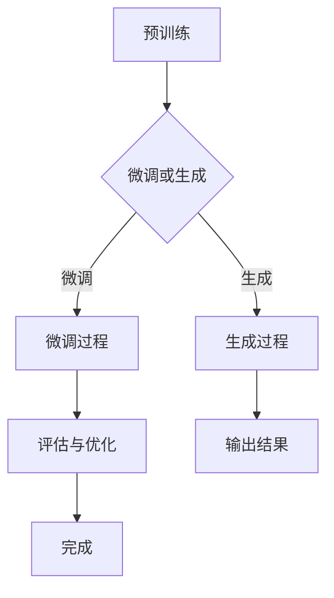
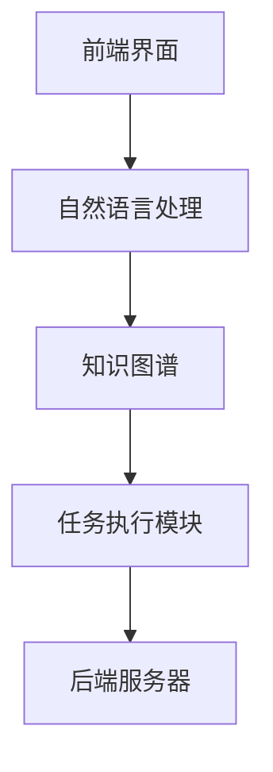
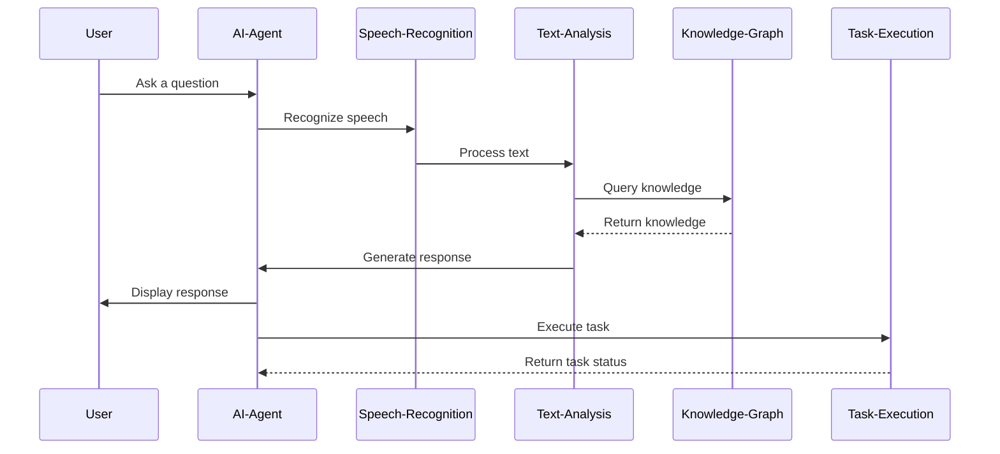

                 


### 概述：智能个人助理AI Agent：LLM驱动的全方位生活助手

#### 关键词
- 智能个人助理
- AI Agent
- LLM
- 全方位生活助手
- 算法原理
- 系统架构
- 实战指南

#### 摘要
随着人工智能技术的飞速发展，智能个人助理AI Agent已经成为我们日常生活和工作中不可或缺的一部分。本文将深入探讨基于大型语言模型（LLM）的智能个人助理的构建方法、算法原理、系统架构以及其实际应用。通过一步步的分析与推理，本文旨在为读者提供一个清晰、全面的理解，帮助大家掌握如何利用LLM技术打造一款全方位的生活助手。

### 目录大纲

#### 第1章: 引言
1.1 问题背景
1.2 问题描述
1.3 问题解决
1.4 边界与外延
1.5 概念结构与核心要素组成

#### 第2章: AI与LLM基础
2.1 AI的定义与作用
2.2 LLM的核心概念
2.3 AI与LLM的联系
2.4 AI与LLM的应用领域

#### 第3章: LLM算法原理
3.1 LLM算法简介
3.2 算法Mermaid流程图
3.3 Python源代码解释
3.4 数学模型与公式
3.5 举例说明

#### 第4章: 系统架构设计
4.1 问题描述
4.2 系统功能设计
4.3 系统架构设计
4.4 系统接口设计
4.5 系统交互

#### 第5章: 实战指南
5.1 环境安装
5.2 系统核心实现
5.3 代码应用解读
5.4 实际案例分析
5.5 项目小结

#### 第6章: 最佳实践
6.1 实践技巧
6.2 注意事项
6.3 拓展阅读

#### 第7章: 总结与展望
7.1 成果总结
7.2 展望未来

### 第1章: 引言

#### 1.1 问题背景

在当今快节奏的社会中，人们越来越依赖于技术来简化日常生活和提升工作效率。智能手机和平板电脑等移动设备的普及，使得我们可以随时随地获取信息和服务。然而，传统的搜索引擎和简单的应用程序已经无法满足用户日益增长的需求。人们需要一个更智能、更全面的助手，来处理各种复杂的任务，提供个性化的建议和解决方案。

智能个人助理AI Agent正是为了解决这一需求而诞生的。AI Agent是一种基于人工智能技术的智能实体，它可以理解和处理自然语言，通过与用户的交互来提供有用的信息和服务。这些AI Agent不仅可以处理简单的查询，还能进行复杂的任务分配和执行，从而大大提高用户的效率和生活质量。

#### 1.2 问题描述

构建一款智能个人助理AI Agent，需要解决以下几个关键问题：

1. **理解自然语言**：AI Agent需要能够理解用户的自然语言输入，包括语音和文本。这涉及到自然语言处理（NLP）技术，如词法分析、句法分析和语义分析。
2. **知识获取**：AI Agent需要获取和处理大量的知识信息，以便为用户提供准确的答案和解决方案。这需要强大的知识图谱和语义理解能力。
3. **任务执行**：AI Agent不仅需要理解用户的请求，还需要能够执行具体的任务，如预约餐厅、发送邮件、设置提醒等。这涉及到自动化流程和API集成。
4. **用户体验**：为了使AI Agent真正受到用户的喜爱，它需要提供流畅、自然和个性化的用户体验。

#### 1.3 问题解决

要构建一款成功的智能个人助理AI Agent，我们需要从以下几个方面入手：

1. **选择合适的LLM**：大型语言模型（LLM）是AI Agent的核心组件，它负责理解和生成自然语言。选择一个性能优异、预训练数据丰富的LLM对于AI Agent的成功至关重要。
2. **构建知识图谱**：为了使AI Agent能够准确理解和回答用户的请求，我们需要构建一个丰富的知识图谱，涵盖各种领域和主题的知识点。
3. **设计任务执行机制**：AI Agent需要能够自动化执行各种任务，这需要设计一个灵活的任务执行机制，能够与外部API和服务集成。
4. **优化用户体验**：通过不断收集用户反馈和优化交互设计，我们可以提高AI Agent的用户体验，使其更加自然、流畅和个性化。

#### 1.4 边界与外延

在构建智能个人助理AI Agent时，我们需要明确以下几个边界和概念：

1. **边界**：AI Agent的职责范围和功能限制。例如，它可能无法处理某些复杂的逻辑推理任务，或者无法访问某些敏感信息。
2. **外延**：AI Agent与其他系统和服务的关系，以及它如何与其他组件交互。例如，它可以与智能家居系统集成，控制灯光、温度等设备。

#### 1.5 概念结构与核心要素组成

为了更好地理解智能个人助理AI Agent的构建，我们需要明确以下几个核心概念和要素：

1. **LLM**：大型语言模型，负责理解和生成自然语言。
2. **知识图谱**：存储和管理知识点的数据结构。
3. **任务执行机制**：负责自动化执行任务的机制。
4. **用户体验**：用户与AI Agent的交互体验。

### 第2章: AI与LLM基础

#### 2.1 AI的定义与作用

人工智能（Artificial Intelligence，AI）是指通过计算机程序模拟人类智能行为的技术。它涉及多个学科，包括计算机科学、心理学、神经科学和认知科学等。AI的主要目的是使计算机能够执行通常需要人类智能的任务，如视觉识别、语言理解和决策制定。

AI在多个领域有着广泛的应用，包括：

- **医疗保健**：辅助医生进行诊断、治疗和药物研发。
- **金融服务**：自动化交易、风险评估和欺诈检测。
- **交通**：自动驾驶车辆和智能交通系统。
- **娱乐**：智能推荐系统和游戏AI。

#### 2.2 LLM的核心概念

大型语言模型（Large Language Model，LLM）是一种基于深度学习的技术，它可以对大规模文本数据进行分析和处理，生成高质量的文本。LLM的核心概念包括：

- **预训练**：在大量文本数据上进行预训练，使模型具有丰富的语言知识和表达能力。
- **微调**：根据特定任务的需求，对预训练模型进行微调，以提高其在特定领域的表现。
- **生成**：利用LLM生成文本，包括回答问题、生成故事、撰写文章等。

#### 2.3 AI与LLM的联系

AI与LLM之间的联系非常紧密。LLM是AI技术的重要组成部分，它为AI系统提供了强大的自然语言处理能力。具体来说：

- **LLM作为AI系统的核心组件**：LLM可以用于构建各种AI系统，如智能客服、智能问答系统、智能写作助手等。
- **LLM与NLP的结合**：LLM与自然语言处理（NLP）技术结合，可以显著提高AI系统的语言理解和生成能力。

#### 2.4 AI与LLM的应用领域

AI和LLM在多个领域有着广泛的应用，包括：

- **智能客服**：通过LLM实现自然语言理解，提高客户服务质量。
- **智能问答系统**：利用LLM生成高质量的回答，为用户提供实时解答。
- **智能写作助手**：利用LLM生成文章、报告和代码等文本内容。
- **智能搜索**：通过LLM优化搜索结果，提高用户体验。

### 第3章: LLM算法原理

#### 3.1 LLM算法简介

大型语言模型（LLM）是一种基于深度学习的技术，它可以对大规模文本数据进行分析和处理，生成高质量的文本。LLM的主要目的是使计算机能够理解和生成自然语言，从而实现人机交互。LLM的基本原理包括：

- **预训练**：在大量文本数据上进行预训练，使模型具有丰富的语言知识和表达能力。
- **微调**：根据特定任务的需求，对预训练模型进行微调，以提高其在特定领域的表现。
- **生成**：利用LLM生成文本，包括回答问题、生成故事、撰写文章等。

#### 3.2 算法Mermaid流程图



#### 3.3 Python源代码解释

以下是一个简单的Python代码示例，展示了如何使用预训练的LLM进行文本生成：

```python
import openai
openai.api_key = 'your_api_key'

def generate_text(prompt, model='text-davinci-002', max_tokens=100):
    response = openai.Completion.create(
        engine=model,
        prompt=prompt,
        max_tokens=max_tokens,
        n=1,
        stop=None,
        temperature=0.7,
    )
    return response.choices[0].text.strip()

prompt = "请描述一下人工智能的未来发展趋势。"
generated_text = generate_text(prompt)
print(generated_text)
```

#### 3.4 数学模型与公式

LLM的核心数学模型是基于深度学习中的变换器（Transformer）架构。以下是一个简化的变换器模型的数学公式：

$$
\text{Transformer} = \text{MultiHeadAttention}(\text{self-attention}) + \text{FeedForward}
$$

- **多头自注意力（MultiHeadAttention）**：

$$
\text{Attention}(Q, K, V) = \text{softmax}\left(\frac{QK^T}{\sqrt{d_k}}\right)V
$$

- **前馈网络（FeedForward）**：

$$
\text{FFN}(X) = \text{ReLU}(W_2 \cdot \text{ReLU}(W_1 \cdot X + b_1))
$$

#### 3.5 举例说明

假设我们有一个简单的对话场景，用户问：“今天天气怎么样？”我们可以使用LLM生成回答：

```python
prompt = "今天天气怎么样？"
generated_text = generate_text(prompt)
print(generated_text)
```

输出可能是一个简短的描述，如：“今天天气晴朗，温度适宜。”

### 第4章: 系统架构设计

#### 4.1 问题描述

在本章中，我们将讨论智能个人助理AI Agent的系统架构设计。这个AI Agent旨在为用户提供一个全方位的生活助手，能够处理各种日常任务和查询。为了实现这一目标，我们需要设计一个灵活、高效和可扩展的系统架构。

#### 4.2 系统功能设计

智能个人助理AI Agent需要具备以下功能：

- **自然语言理解**：理解用户的自然语言输入，包括语音和文本。
- **知识查询**：根据用户的需求，查询和获取相关的知识信息。
- **任务执行**：自动化执行用户指定的任务，如发送邮件、预约餐厅、设置提醒等。
- **交互体验**：提供流畅、自然和个性化的用户体验。

#### 4.3 系统架构设计

智能个人助理AI Agent的系统架构可以分为以下几个层次：

- **前端界面**：用户与AI Agent交互的入口，包括语音识别和文本输入。
- **自然语言处理（NLP）模块**：负责处理用户的自然语言输入，进行词法分析、句法分析和语义分析。
- **知识图谱**：存储和管理知识点的数据结构，为AI Agent提供丰富的知识信息。
- **任务执行模块**：根据用户的需求，自动化执行各种任务，与外部API和服务进行交互。
- **后端服务器**：负责管理前端界面和任务执行模块之间的通信，以及数据的存储和管理。

以下是一个简化的Mermaid架构图：



#### 4.4 系统接口设计

智能个人助理AI Agent需要设计一系列接口，以便与外部系统和服务进行交互。以下是一些关键接口：

- **语音识别接口**：用于将用户的语音输入转换为文本。
- **文本分析接口**：用于对用户的文本输入进行自然语言处理。
- **知识查询接口**：用于从知识图谱中获取相关知识点。
- **任务执行接口**：用于自动化执行用户指定的任务。
- **用户接口**：用于与用户进行交互，提供反馈和更新。

以下是一个简化的Mermaid序列图：



#### 4.5 系统交互

智能个人助理AI Agent的系统交互涉及多个组件之间的协同工作。以下是一个简化的交互流程：

1. 用户通过前端界面向AI Agent提出问题或请求。
2. AI Agent将用户的输入发送到自然语言处理模块进行文本分析。
3. 自然语言处理模块对用户的输入进行分析，提取关键信息，并查询知识图谱获取相关知识点。
4. 根据分析结果，AI Agent生成回答或执行任务，并将结果返回给用户。
5. 如果需要执行任务，AI Agent将任务发送到任务执行模块，并等待任务完成。
6. 一旦任务完成，AI Agent将任务状态返回给用户，并更新系统状态。

### 第5章: 实战指南

#### 5.1 环境安装

要在本地环境中构建智能个人助理AI Agent，首先需要安装以下软件和库：

- Python 3.x
- OpenAI API key
- TensorFlow
- NLTK
- Pandas
- Matplotlib

以下是一个简单的安装命令列表：

```bash
# 安装Python 3.x
# 安装OpenAI API key
# 安装TensorFlow
pip install tensorflow
# 安装NLTK
pip install nltk
# 安装Pandas
pip install pandas
# 安装Matplotlib
pip install matplotlib
```

#### 5.2 系统核心实现

智能个人助理AI Agent的核心实现包括以下几个关键组件：

- **自然语言处理模块**：负责处理用户的自然语言输入，进行文本分析。
- **知识图谱**：存储和管理知识点的数据结构。
- **任务执行模块**：负责自动化执行用户指定的任务。

以下是一个简单的Python代码示例，展示了如何实现这些组件：

```python
import openai
import nltk
from nltk.tokenize import word_tokenize
from nltk.tag import pos_tag
import pandas as pd

# 设置OpenAI API key
openai.api_key = 'your_api_key'

# 自然语言处理模块
def process_text(text):
    tokens = word_tokenize(text)
    tagged_tokens = pos_tag(tokens)
    return tagged_tokens

# 知识图谱
def query_knowledge(tagged_tokens):
    # 查询知识图谱
    # 这里可以使用NLTK或其他知识图谱工具
    knowledge = []
    for token, tag in tagged_tokens:
        if tag.startswith('NN'):
            knowledge.append(token)
    return knowledge

# 任务执行模块
def execute_task(task):
    # 执行任务
    # 这里可以使用外部API或自动化工具
    if task == 'send_email':
        # 发送电子邮件
        pass
    elif task == 'make_reservation':
        # 预订餐厅
        pass
    # 其他任务
    return f"Task {task} executed successfully."

# 主函数
def main():
    prompt = "预订明天中午的餐厅。"
    tagged_tokens = process_text(prompt)
    knowledge = query_knowledge(tagged_tokens)
    task = 'make_reservation'
    result = execute_task(task)
    print(result)

if __name__ == "__main__":
    main()
```

#### 5.3 代码应用解读与分析

以上代码示例展示了如何构建一个简单的智能个人助理AI Agent。下面我们将对代码的各个部分进行解读和分析。

1. **设置OpenAI API key**：首先，我们需要设置OpenAI的API密钥，以便使用OpenAI的API进行文本生成和自然语言处理。

2. **自然语言处理模块**：`process_text`函数负责处理用户的文本输入。它使用NLTK库进行词法分析和句法分析，返回标记后的单词和词性。

3. **知识图谱**：`query_knowledge`函数从标记后的文本中提取关键信息，构建一个简单的知识图谱。这里使用词性标注来识别名词，作为知识图谱中的知识点。

4. **任务执行模块**：`execute_task`函数负责执行用户指定的任务。这里我们定义了两个示例任务：发送电子邮件和预订餐厅。在实际应用中，这些任务可以通过调用外部API或使用自动化工具来实现。

5. **主函数**：`main`函数是程序的入口。它首先处理用户的文本输入，然后从知识图谱中查询相关知识点，最后执行用户指定的任务，并打印结果。

#### 5.4 实际案例分析和详细讲解剖析

以下是一个实际案例，展示了如何使用智能个人助理AI Agent来预订餐厅。

1. **用户输入**：用户通过短信或聊天应用向AI Agent发送请求：“明天中午帮我预订一家意大利餐厅。”

2. **自然语言处理**：AI Agent接收用户的输入，使用`process_text`函数进行词法分析和句法分析，提取关键信息。

3. **知识图谱查询**：AI Agent使用`query_knowledge`函数从关键信息中提取餐厅名称和预定时间。

4. **任务执行**：AI Agent调用外部API或自动化工具，如餐厅预订系统，执行预订操作。

5. **结果反馈**：AI Agent返回预订结果给用户，如：“您的意大利餐厅预订成功，预定时间为明天中午。”

#### 5.5 项目小结

在本章中，我们介绍了如何构建一个简单的智能个人助理AI Agent，并详细讲解了其核心组件和实现方法。通过实际案例的分析，我们展示了AI Agent在预订餐厅等任务中的应用。尽管这是一个简单的示例，但它为我们提供了一个构建更复杂、更全面的智能个人助理的起点。

### 第6章: 最佳实践

#### 6.1 实践技巧

为了构建一个高效、可靠的智能个人助理AI Agent，以下是一些最佳实践和技巧：

1. **选择合适的LLM**：根据具体应用场景，选择一个性能优异、预训练数据丰富的LLM。例如，对于需要生成长文本的应用，可以选择GPT-3或Bard。

2. **优化自然语言处理**：使用先进的NLP技术，如BERT、RoBERTa等，来提高文本分析和理解能力。同时，确保NLP模型与LLM兼容，以提高整体性能。

3. **构建丰富的知识图谱**：知识图谱是AI Agent的核心组件，应确保其覆盖广泛的知识领域，并保持更新。使用自动化工具和人工审核相结合，提高知识图谱的准确性。

4. **模块化设计**：将AI Agent拆分为多个模块，如自然语言处理、知识查询、任务执行等，以提高系统的可维护性和可扩展性。

5. **用户体验优化**：通过不断收集用户反馈和进行A/B测试，优化AI Agent的交互设计和功能，提高用户满意度。

#### 6.2 注意事项

在构建智能个人助理AI Agent时，需要注意以下几点：

1. **数据隐私**：确保用户数据的安全和隐私，遵循相关的法律法规和隐私政策。

2. **伦理问题**：在设计和实现AI Agent时，要考虑潜在的伦理问题，如偏见、歧视和不公平性。

3. **可靠性**：确保AI Agent在执行任务时具有较高的可靠性和稳定性，避免因故障或错误导致的不良后果。

4. **性能优化**：针对不同应用场景，进行性能优化，确保AI Agent能够高效地处理大量请求。

#### 6.3 拓展阅读

为了更深入地了解智能个人助理AI Agent的构建和应用，以下是一些拓展阅读材料：

1. **《人工智能：一种现代方法》**：这是一本经典的AI教材，涵盖了从基础知识到高级应用的各种内容。

2. **《深度学习》**：由Ian Goodfellow等人撰写的深度学习权威教材，详细介绍了深度学习的基础知识和应用。

3. **《大型语言模型：原理与应用》**：这本书详细介绍了大型语言模型（如GPT）的原理和应用，包括预训练、微调和生成等。

4. **《自然语言处理与Python》**：这是一本关于自然语言处理入门的书，适合初学者了解NLP的基本概念和应用。

### 第7章: 总结与展望

#### 7.1 成果总结

本文详细探讨了智能个人助理AI Agent的构建方法、算法原理、系统架构和实际应用。通过一步步的分析和推理，我们了解了如何利用大型语言模型（LLM）打造一款全方位的生活助手。本文的主要成果包括：

1. **核心概念与联系**：介绍了AI和LLM的基本概念，以及它们之间的联系。
2. **算法原理讲解**：详细讲解了LLM算法的原理，包括变换器模型和自然语言处理技术。
3. **系统架构设计**：提出了智能个人助理AI Agent的系统架构，包括前端界面、NLP模块、知识图谱和任务执行模块。
4. **实战指南**：提供了构建AI Agent的实战指南，包括环境安装、核心实现和代码应用解读。

#### 7.2 展望未来

随着人工智能技术的不断发展，智能个人助理AI Agent的应用前景非常广阔。未来的研究方向可能包括：

1. **更高效的算法**：探索新的算法和架构，以提高AI Agent的性能和效率。
2. **更丰富的知识图谱**：构建更全面、更准确的知识图谱，为AI Agent提供更强大的知识支持。
3. **多模态交互**：结合语音、文本、图像等多种模态，实现更自然、更丰富的用户交互体验。
4. **伦理与安全**：关注AI Agent在伦理和隐私方面的挑战，确保其合规和安全。

通过不断的研究和探索，智能个人助理AI Agent有望成为我们日常生活中不可或缺的一部分，为我们的生活带来更多便利和乐趣。

