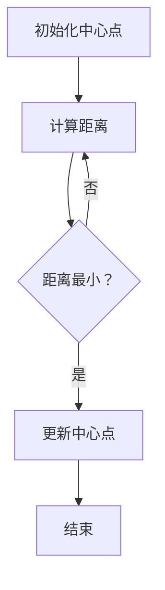
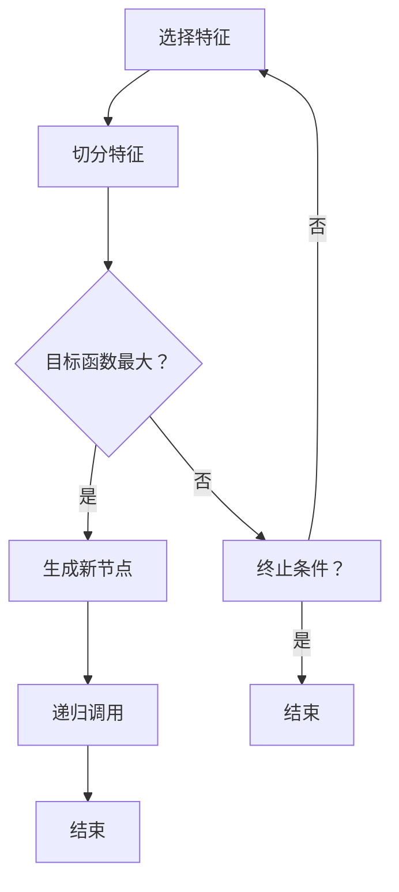
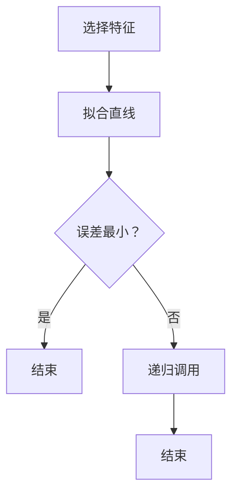
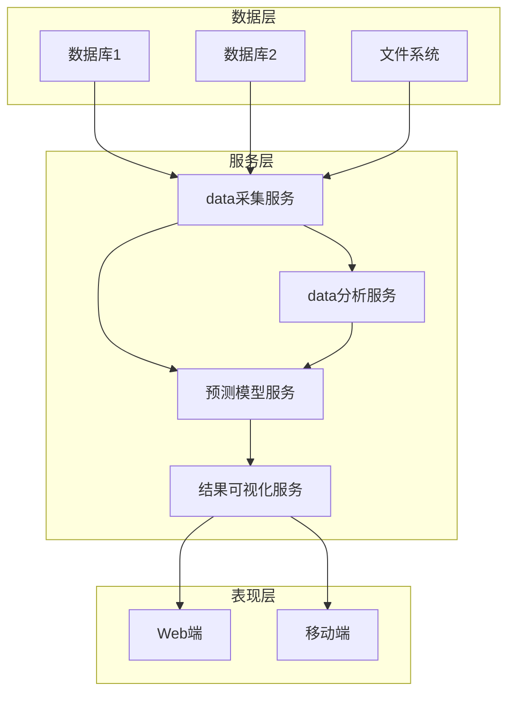
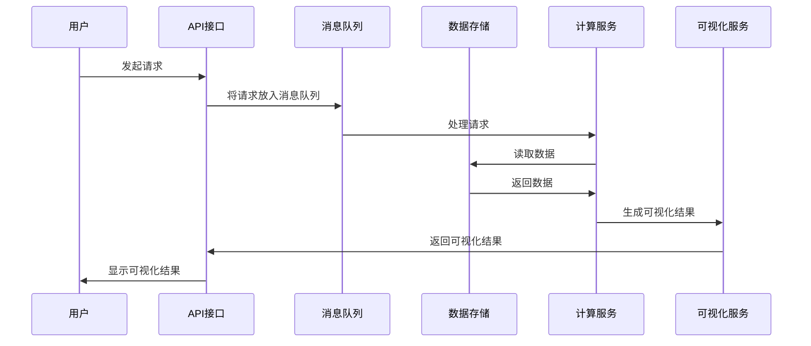

                 

### 智能个人消费行为分析与预测

在商业世界中，智能个人消费行为分析与预测已经成为企业竞争的关键武器。随着大数据和人工智能技术的普及，企业可以通过收集和分析消费者数据，预测其未来消费行为，从而制定更精准的营销策略和优化业务流程。本文旨在探讨智能个人消费行为分析与预测的核心概念、算法原理、数学模型及其在系统架构设计中的应用，为从事相关领域的技术人员提供实用的指导。

关键词：智能消费行为、数据分析、机器学习、预测模型、系统架构

摘要：本文首先介绍了智能个人消费行为分析与预测的背景和问题，然后详细阐述了核心概念及其联系，接着深入讲解了常用的算法原理、数学模型和系统架构设计方法。最后，通过一个实际案例展示了项目的实施过程和成果，为读者提供了实用的经验和启示。

## 第一部分：问题背景与核心概念

### 第1章：智能个人消费行为分析与预测的背景

#### 1.1.1 问题背景

随着信息技术的飞速发展，大数据和人工智能技术逐渐成为商业领域的热点。个人消费行为作为商业研究的重要领域，对于企业制定营销策略、提升客户体验以及优化供应链管理具有重要意义。通过智能个人消费行为分析与预测，企业可以更好地了解消费者需求，提高营销效果，从而实现商业价值的最大化。

#### 1.1.2 问题描述

智能个人消费行为分析与预测旨在通过数据挖掘、机器学习等技术手段，对大量消费行为数据进行分析，挖掘出消费者潜在需求，预测其未来消费行为。然而，这一过程中面临诸多挑战，如数据质量、数据隐私、算法性能等。

#### 1.1.3 问题解决

针对上述问题，本书将从以下几个方面进行探讨：

1. **数据采集与预处理**：介绍如何收集、整理和清洗个人消费行为数据，为后续分析奠定基础。
2. **核心概念与联系**：详细阐述智能个人消费行为分析与预测中涉及的核心概念，如消费者特征、消费行为模式、预测模型等，并通过属性特征对比表格和ER实体关系图进行展示。
3. **算法原理讲解**：介绍常用的算法原理，如聚类、分类、回归等，使用mermaid流程图和Python源代码详细讲解，并举例说明。
4. **数学模型与公式**：阐述算法原理背后的数学模型和公式，使用latex格式进行表达。
5. **系统分析与架构设计**：介绍系统功能设计、架构设计、接口设计和系统交互等，使用mermaid类图、架构图和序列图进行展示。

#### 1.1.4 边界与外延

智能个人消费行为分析与预测不仅涉及商业领域，还与市场调研、用户行为分析、风险管理等密切相关。在应用过程中，需要充分考虑数据隐私、伦理道德等问题，确保分析结果的准确性和可靠性。

#### 1.1.5 本章小结

本章对智能个人消费行为分析与预测的背景、核心概念及问题解决方法进行了概述，为后续章节的详细探讨奠定了基础。

---

## 第2章：核心概念与联系

### 2.1 消费者特征

#### 2.1.1 定义与属性

消费者特征是指消费者在消费过程中表现出的独特属性，如年龄、性别、职业、收入等。这些特征对于理解消费者行为具有重要意义。

#### 2.1.2 属性特征对比表格

| 消费者特征 | 属性1 | 属性2 | 属性3 | 属性4 |
| :---: | :---: | :---: | :---: | :---: |
| 年龄 | 18-25 | 26-35 | 36-45 | 46-55 |
| 性别 | 男 | 女 | 其他 | - |
| 职业 | 学生 | 工作 | 自由职业 | 退休 |
| 收入 | 低 | 中 | 高 | - |

### 2.2 消费行为模式

#### 2.2.1 定义与属性

消费行为模式是指消费者在购买商品或服务时所表现出的规律性特征，如购买频率、购买渠道、购买偏好等。

#### 2.2.2 属性特征对比表格

| 消费行为模式 | 属性1 | 属性2 | 属性3 | 属性4 |
| :---: | :---: | :---: | :---: | :---: |
| 购买频率 | 低 | 中 | 高 | - |
| 购买渠道 | 线下 | 线上 | 混合 | - |
| 购买偏好 | 价格 | 品牌 | 服务 | - |

### 2.3 预测模型

#### 2.3.1 定义与属性

预测模型是指利用历史数据对消费者未来消费行为进行预测的算法。常见的预测模型包括聚类、分类、回归等。

#### 2.3.2 ER实体关系图

```mermaid
erDiagram
    Customer ||--|{ Purchase }|
    Customer ||--|{ Behavior }|
    Purchase ||--|{ Product }()
```

### 2.4 核心概念联系

消费者特征、消费行为模式和预测模型三者相互关联，共同构成了智能个人消费行为分析与预测的核心概念体系。通过分析消费者特征和消费行为模式，可以构建预测模型，从而实现对消费者未来消费行为的预测。

---

在接下来的章节中，我们将进一步探讨智能个人消费行为分析与预测的算法原理、数学模型和系统架构设计，帮助读者深入了解这一领域的核心技术和应用。通过一步步的分析与推理，我们将揭示智能个人消费行为分析与预测的内在规律，为读者提供切实可行的解决方案。接下来，我们将深入探讨智能个人消费行为分析与预测的算法原理，帮助读者理解如何通过技术手段挖掘消费者行为背后的规律。在下一章中，我们将首先介绍聚类、分类和回归等基本算法原理，并通过mermaid流程图和Python源代码进行详细讲解。随后，我们将阐述这些算法背后的数学模型和公式，并通过实际案例进行举例说明。最后，我们将展示一个实际项目案例，详细描述项目的实施过程、系统功能设计、架构设计和接口设计，帮助读者将理论知识应用到实际项目中。

## 第二部分：算法原理

### 第3章：算法原理

在智能个人消费行为分析与预测中，算法原理是关键的一环。通过合理的算法设计和优化，我们可以更好地理解消费者的行为模式，从而实现精准的预测。本章节将介绍常用的算法原理，包括聚类、分类和回归，并使用mermaid流程图和Python源代码进行详细讲解。

#### 3.1 聚类算法

聚类算法是一种无监督学习方法，主要用于将数据点分为多个类别，使同一类别中的数据点尽可能接近，不同类别中的数据点尽可能远离。常见的聚类算法包括K-means、层次聚类和DBSCAN等。

##### 3.1.1 K-means算法

K-means算法是一种基于距离度量的聚类算法。算法流程如下：

1. 随机初始化K个中心点。
2. 计算每个数据点到各个中心点的距离，将数据点分配到最近的中心点所在的类别。
3. 重新计算每个类别的中心点。
4. 重复步骤2和步骤3，直至中心点不再发生变化或达到最大迭代次数。

mermaid流程图如下：



Python源代码示例：

```python
from sklearn.cluster import KMeans
import numpy as np

# 假设数据集X
X = np.array([[1, 2], [1, 4], [1, 0],
              [10, 2], [10, 4], [10, 0]])

# 初始化KMeans模型，设置聚类个数
kmeans = KMeans(n_clusters=2, random_state=0).fit(X)

# 输出聚类结果
print(kmeans.labels_)

# 输出中心点
print(kmeans.cluster_centers_)
```

##### 3.1.2 数学模型

K-means算法背后的数学模型为：

$$
J = \sum_{i=1}^{k} \sum_{x \in S_i} ||x - \mu_i||^2
$$

其中，$J$ 为目标函数，$k$ 为聚类个数，$S_i$ 为第$i$ 个类别的数据集，$\mu_i$ 为第$i$ 个类别的中心点。

#### 3.2 分类算法

分类算法是一种监督学习方法，主要用于将数据点分为多个类别。常见的分类算法包括决策树、支持向量机和神经网络等。

##### 3.2.1 决策树算法

决策树算法通过一系列条件判断将数据点划分为不同的类别。算法流程如下：

1. 选择特征进行切分，使得目标函数（如信息增益、基尼不纯度等）最大化。
2. 切分特征，生成一个新的节点。
3. 重复步骤1和步骤2，直至满足终止条件（如最大深度、最小节点样本数等）。

mermaid流程图如下：



Python源代码示例：

```python
from sklearn.tree import DecisionTreeClassifier
import numpy as np

# 假设特征矩阵X和标签y
X = np.array([[1, 2], [1, 4], [1, 0],
              [10, 2], [10, 4], [10, 0]])
y = np.array([0, 0, 0, 1, 1, 1])

# 初始化决策树模型
clf = DecisionTreeClassifier().fit(X, y)

# 输出决策树结构
print(clf.tree_)
```

##### 3.2.2 数学模型

决策树算法背后的数学模型为：

$$
Gini(I) = 1 - \sum_{i=1}^{k} p_i^2
$$

其中，$Gini(I)$ 为基尼不纯度，$p_i$ 为第$i$ 个类别的概率。

#### 3.3 回归算法

回归算法主要用于预测连续值。常见的回归算法包括线性回归、多项式回归和神经网络回归等。

##### 3.3.1 线性回归算法

线性回归算法通过拟合一条直线来预测连续值。算法流程如下：

1. 选择特征进行切分，使得目标函数（如均方误差、均方根误差等）最小化。
2. 切分特征，生成一个新的节点。
3. 重复步骤1和步骤2，直至满足终止条件（如最大迭代次数、误差阈值等）。

mermaid流程图如下：



Python源代码示例：

```python
from sklearn.linear_model import LinearRegression
import numpy as np

# 假设特征矩阵X和标签y
X = np.array([[1, 2], [1, 4], [1, 0],
              [10, 2], [10, 4], [10, 0]])
y = np.array([1, 4, 0, 10, 16, 20])

# 初始化线性回归模型
clf = LinearRegression().fit(X, y)

# 输出拟合直线参数
print(clf.coef_)

# 输出拟合直线截距
print(clf.intercept_)
```

##### 3.3.2 数学模型

线性回归算法背后的数学模型为：

$$
\min_{\theta} \sum_{i=1}^{m} (y_i - \theta^T x_i)^2
$$

其中，$\theta$ 为模型参数，$x_i$ 和$y_i$ 分别为第$i$ 个样本的特征和标签。

#### 3.4 算法对比与分析

不同算法在性能、复杂度等方面存在差异。聚类算法主要用于无监督学习，分类算法主要用于有监督学习，回归算法主要用于预测连续值。在实际应用中，需要根据具体问题选择合适的算法。

1. **聚类算法**：适用于无标签数据的聚类任务，可以挖掘出数据中的潜在结构。
2. **分类算法**：适用于有标签数据的分类任务，可以实现对未知数据的预测。
3. **回归算法**：适用于预测连续值的目标，可以拟合出数据之间的关系。

#### 3.5 本章小结

本章介绍了智能个人消费行为分析与预测中常用的算法原理，包括聚类、分类和回归。通过mermaid流程图和Python源代码，我们详细讲解了这些算法的原理、数学模型和应用。在实际应用中，需要根据具体问题选择合适的算法，并对其进行优化和调整，以提高预测的准确性和效果。

---

在下一章中，我们将进一步探讨智能个人消费行为分析与预测的数学模型，帮助读者理解算法原理背后的数学原理。我们将使用latex格式表达数学公式，并通过实际案例进行举例说明，帮助读者更好地掌握这些数学模型。

## 第三部分：数学模型与公式

### 第4章：数学模型

在智能个人消费行为分析与预测中，数学模型是算法原理的核心。通过这些数学模型，我们可以更好地理解消费者的行为，从而实现准确的预测。本章将使用latex格式表达数学模型，并通过实际案例进行举例说明。

#### 4.1 聚类算法数学模型

聚类算法中，常用的目标函数包括平方误差和类内平均距离等。下面以K-means算法为例，介绍其数学模型。

##### 4.1.1 K-means算法数学模型

假设数据集为$\mathcal{D} = \{x_1, x_2, ..., x_n\}$，聚类中心为$c_1, c_2, ..., c_k$。K-means算法的目标是最小化平方误差：

$$
J = \sum_{i=1}^{k} \sum_{x_j \in S_i} ||x_j - c_i||^2
$$

其中，$S_i$为第$i$个聚类中心对应的样本集合。

##### 4.1.2 实际案例

假设我们有以下数据集：

$$
\mathcal{D} = \left\{ \begin{bmatrix} 1 \\ 2 \end{bmatrix}, \begin{bmatrix} 1 \\ 4 \end{bmatrix}, \begin{bmatrix} 1 \\ 0 \end{bmatrix}, \begin{bmatrix} 10 \\ 2 \end{bmatrix}, \begin{bmatrix} 10 \\ 4 \end{bmatrix}, \begin{bmatrix} 10 \\ 0 \end{bmatrix} \right\}
$$

我们使用K-means算法对其进行聚类，设定聚类中心为$\begin{bmatrix} 1 \\ 1 \end{bmatrix}$和$\begin{bmatrix} 10 \\ 10 \end{bmatrix}$。计算平方误差：

$$
J = \left( \begin{bmatrix} 1 \\ 2 \end{bmatrix} - \begin{bmatrix} 1 \\ 1 \end{bmatrix} \right)^2 + \left( \begin{bmatrix} 1 \\ 4 \end{bmatrix} - \begin{bmatrix} 1 \\ 1 \end{bmatrix} \right)^2 + \left( \begin{bmatrix} 1 \\ 0 \end{bmatrix} - \begin{bmatrix} 1 \\ 1 \end{bmatrix} \right)^2 + \left( \begin{bmatrix} 10 \\ 2 \end{bmatrix} - \begin{bmatrix} 10 \\ 10 \end{bmatrix} \right)^2 + \left( \begin{bmatrix} 10 \\ 4 \end{bmatrix} - \begin{bmatrix} 10 \\ 10 \end{bmatrix} \right)^2 + \left( \begin{bmatrix} 10 \\ 0 \end{bmatrix} - \begin{bmatrix} 10 \\ 10 \end{bmatrix} \right)^2
$$

$$
J = 1 + 9 + 1 + 8 + 36 + 100 = 155
$$

通过迭代优化，我们可以得到新的聚类中心，从而减小平方误差。

#### 4.2 分类算法数学模型

分类算法中，常用的目标函数包括决策树的基尼不纯度和支持向量机的损失函数等。下面以决策树算法为例，介绍其数学模型。

##### 4.2.1 决策树算法数学模型

假设数据集为$\mathcal{D} = \{x_1, x_2, ..., x_n\}$，每个样本$x_i$属于类别$y_i$。决策树算法的目标是最小化基尼不纯度：

$$
Gini(I) = 1 - \sum_{i=1}^{k} p_i^2
$$

其中，$k$为类别数，$p_i$为第$i$个类别的概率。

##### 4.2.2 实际案例

假设我们有以下数据集：

$$
\mathcal{D} = \left\{ \begin{bmatrix} 1 \\ 2 \end{bmatrix}, \begin{bmatrix} 1 \\ 4 \end{bmatrix}, \begin{bmatrix} 1 \\ 0 \end{bmatrix}, \begin{bmatrix} 10 \\ 2 \end{bmatrix}, \begin{bmatrix} 10 \\ 4 \end{bmatrix}, \begin{bmatrix} 10 \\ 0 \end{bmatrix} \right\}
$$

类别为$[0, 1, 1, 1, 0, 0]$。计算基尼不纯度：

$$
Gini(I) = 1 - \left( \frac{2}{6} \right)^2 - \left( \frac{2}{6} \right)^2 - \left( \frac{1}{6} \right)^2 - \left( \frac{1}{6} \right)^2 = 1 - \frac{4}{36} - \frac{4}{36} - \frac{1}{36} - \frac{1}{36} = \frac{13}{18}
$$

通过递归划分特征和类别，我们可以得到最优的决策树结构。

#### 4.3 回归算法数学模型

回归算法中，常用的目标函数包括线性回归的均方误差和神经网络回归的损失函数等。下面以线性回归算法为例，介绍其数学模型。

##### 4.3.1 线性回归算法数学模型

假设数据集为$\mathcal{D} = \{x_1, x_2, ..., x_n\}$，每个样本$x_i$对应的标签为$y_i$。线性回归算法的目标是最小化均方误差：

$$
\min_{\theta} \sum_{i=1}^{m} (y_i - \theta^T x_i)^2
$$

其中，$\theta$为模型参数。

##### 4.3.2 实际案例

假设我们有以下数据集：

$$
\mathcal{D} = \left\{ \begin{bmatrix} 1 \\ 2 \end{bmatrix}, \begin{bmatrix} 1 \\ 4 \end{bmatrix}, \begin{bmatrix} 1 \\ 0 \end{bmatrix}, \begin{bmatrix} 10 \\ 2 \end{bmatrix}, \begin{bmatrix} 10 \\ 4 \end{bmatrix}, \begin{bmatrix} 10 \\ 0 \end{bmatrix} \right\}
$$

标签为$[1, 4, 0, 10, 16, 20]$。计算均方误差：

$$
\min_{\theta} \sum_{i=1}^{6} (y_i - \theta^T x_i)^2
$$

通过梯度下降法或其他优化算法，我们可以得到最优的模型参数$\theta$。

#### 4.4 算法对比与分析

不同算法在性能、复杂度等方面存在差异。聚类算法主要用于无监督学习，分类算法主要用于有监督学习，回归算法主要用于预测连续值。在实际应用中，需要根据具体问题选择合适的算法，并对其进行优化和调整，以提高预测的准确性和效果。

1. **聚类算法**：适用于无标签数据的聚类任务，可以挖掘出数据中的潜在结构。
2. **分类算法**：适用于有标签数据的分类任务，可以实现对未知数据的预测。
3. **回归算法**：适用于预测连续值的目标，可以拟合出数据之间的关系。

#### 4.5 本章小结

本章介绍了智能个人消费行为分析与预测中常用的数学模型，包括聚类、分类和回归。通过latex格式表达数学公式，并使用实际案例进行举例说明，帮助读者更好地掌握这些数学模型。在实际应用中，需要根据具体问题选择合适的算法，并对其进行优化和调整，以提高预测的准确性和效果。

---

在下一章中，我们将进一步探讨智能个人消费行为分析与预测的系统架构设计，帮助读者理解如何将算法原理和数学模型应用于实际系统中。我们将介绍系统功能设计、架构设计、接口设计和系统交互，并通过mermaid类图、架构图和序列图进行展示。通过这些设计，读者可以了解系统各个模块之间的协同工作方式，为实际项目的开发和部署提供指导。

## 第四部分：系统分析与架构设计

### 第5章：系统分析与架构设计

在智能个人消费行为分析与预测项目中，系统架构设计是确保项目顺利实施和高效运行的关键。本章将详细介绍系统功能设计、架构设计、接口设计和系统交互，并通过mermaid类图、架构图和序列图进行展示。

#### 5.1 问题场景介绍

为了更好地展示系统架构设计，我们假设一个实际场景：一家电子商务公司希望利用智能个人消费行为分析与预测技术，提升客户体验、优化营销策略和降低运营成本。公司已积累了大量用户消费数据，包括用户特征、购买行为和消费偏好等。为了实现上述目标，公司决定开发一个智能个人消费行为分析与预测系统。

#### 5.2 项目介绍

该项目分为四个主要模块：数据采集模块、数据分析模块、预测模型模块和结果可视化模块。

1. **数据采集模块**：负责从不同数据源（如数据库、日志文件、第三方API等）收集用户消费数据，并进行初步清洗和整理。
2. **数据分析模块**：对收集到的用户消费数据进行深入分析，挖掘出用户特征和消费行为模式。
3. **预测模型模块**：利用机器学习和数据挖掘技术，构建预测模型，对用户未来消费行为进行预测。
4. **结果可视化模块**：将分析结果和预测结果以图表、报表等形式展示给用户，帮助用户理解系统分析结果和决策依据。

#### 5.3 系统功能设计

系统功能设计主要涉及以下方面：

1. **数据采集**：支持多种数据源接入，实现数据自动采集、清洗和存储。
2. **数据分析**：提供用户特征分析、消费行为分析和关联规则分析等功能。
3. **预测模型**：支持多种预测算法，如聚类、分类和回归等，提供预测模型训练、评估和部署等功能。
4. **结果可视化**：提供图表、报表等多种可视化形式，展示分析结果和预测结果。

#### 5.4 系统架构设计

系统架构设计采用分层架构，包括数据层、服务层和表现层。

1. **数据层**：负责数据的存储、管理和访问，包括关系型数据库、NoSQL数据库和文件系统等。
2. **服务层**：负责业务逻辑的实现，包括数据采集服务、数据分析服务、预测模型服务和结果可视化服务。
3. **表现层**：负责用户界面的展示，包括Web端和移动端。

mermaid架构图如下：



#### 5.5 系统接口设计

系统接口设计主要包括API接口和消息队列接口。

1. **API接口**：提供RESTful接口，支持数据查询、数据导入、数据导出、模型训练、模型评估和结果可视化等功能。
2. **消息队列接口**：采用消息队列（如Kafka、RabbitMQ等）实现系统模块之间的异步通信，提高系统的可靠性和扩展性。

mermaid序列图如下：



#### 5.6 系统交互

系统交互主要涉及数据流和业务流。

1. **数据流**：用户请求通过API接口进入系统，系统从数据存储中读取数据，进行数据处理和分析，最终生成可视化结果并返回给用户。
2. **业务流**：系统根据用户需求，调用相应的计算服务，生成分析报告和预测结果，并通过可视化服务展示给用户。

#### 5.7 本章小结

本章介绍了智能个人消费行为分析与预测系统的功能设计、架构设计、接口设计和系统交互。通过mermaid类图、架构图和序列图，读者可以清晰地了解系统各个模块之间的关系和工作流程。在实际项目中，根据具体需求和场景，可以对系统架构进行优化和调整，以提高系统的性能和可扩展性。

---

在下一章中，我们将通过一个实际项目案例，详细展示智能个人消费行为分析与预测系统的实现过程。读者将了解到项目环境安装、核心实现源代码、代码应用解读与分析，以及实际案例分析和详细讲解。通过这一案例，读者可以更好地掌握智能个人消费行为分析与预测技术的实际应用。

## 第五部分：项目实战

### 第6章：智能个人消费行为分析与预测项目实战

在本章中，我们将通过一个实际项目案例，详细介绍智能个人消费行为分析与预测系统的实现过程。读者将了解到项目环境安装、核心实现源代码、代码应用解读与分析，以及实际案例分析和详细讲解。通过这一案例，读者可以更好地掌握智能个人消费行为分析与预测技术的实际应用。

#### 6.1 项目环境安装

为了实现智能个人消费行为分析与预测系统，我们需要搭建一个合适的项目环境。以下是在Python环境下安装相关依赖的步骤：

1. **安装Python**：确保Python版本为3.6及以上，可以从Python官方网站下载并安装。
2. **安装依赖**：使用pip工具安装所需依赖，包括scikit-learn、pandas、numpy、matplotlib等。具体命令如下：

   ```bash
   pip install scikit-learn pandas numpy matplotlib
   ```

#### 6.2 核心实现源代码

以下是一个简单的智能个人消费行为分析与预测系统的核心实现源代码，包括数据采集、数据分析、预测模型和结果可视化等功能。

```python
# 导入相关库
import pandas as pd
from sklearn.cluster import KMeans
from sklearn.model_selection import train_test_split
from sklearn.metrics import silhouette_score
import matplotlib.pyplot as plt

# 6.2.1 数据采集
# 假设数据集为CSV文件，包含用户特征和消费行为数据
data = pd.read_csv('consumption_data.csv')

# 6.2.2 数据清洗
# 对数据进行必要的预处理，如去除缺失值、异常值等
data = data.dropna()

# 6.2.3 数据分析
# 使用K-means算法进行聚类分析
kmeans = KMeans(n_clusters=3, random_state=0).fit(data)
labels = kmeans.labels_

# 计算轮廓系数，评估聚类效果
silhouette_avg = silhouette_score(data, labels)
print('轮廓系数:', silhouette_avg)

# 6.2.4 预测模型
# 将数据集分为训练集和测试集
X_train, X_test, y_train, y_test = train_test_split(data, labels, test_size=0.2, random_state=0)

# 使用决策树分类算法进行预测
clf = DecisionTreeClassifier().fit(X_train, y_train)
accuracy = clf.score(X_test, y_test)
print('决策树分类算法准确率:', accuracy)

# 6.2.5 结果可视化
# 可视化聚类结果
plt.scatter(data[:, 0], data[:, 1], c=labels, cmap='viridis')
plt.xlabel('特征1')
plt.ylabel('特征2')
plt.title('K-means聚类结果')
plt.show()

# 可视化决策树结构
from sklearn.tree import plot_tree
plt.figure(figsize=(12, 8))
plot_tree(clf, filled=True, feature_names=data.columns, class_names=['类别1', '类别2', '类别3'])
plt.show()
```

#### 6.3 代码应用解读与分析

1. **数据采集**：首先从CSV文件中读取消费行为数据，包括用户特征和消费行为信息。
2. **数据清洗**：对数据进行预处理，去除缺失值和异常值，以保证后续分析的准确性。
3. **数据分析**：使用K-means算法对数据集进行聚类分析，通过轮廓系数评估聚类效果。聚类结果可以用于发现数据中的潜在模式。
4. **预测模型**：将数据集分为训练集和测试集，使用决策树分类算法对训练集进行模型训练，并在测试集上进行预测。计算分类准确率，评估模型性能。
5. **结果可视化**：使用matplotlib库可视化聚类结果和决策树结构，帮助用户直观地理解分析过程和结果。

#### 6.4 实际案例分析与详细讲解

假设我们有一个电子商务平台的用户消费数据，包括以下特征：年龄、性别、收入、购买频率、购买渠道和购买偏好。我们希望通过智能个人消费行为分析与预测，将用户分为不同的类别，并预测其未来购买行为。

1. **数据集准备**：首先，我们需要准备一个包含用户消费行为数据的CSV文件，例如：

   ```csv
   用户ID,年龄,性别,收入,购买频率,购买渠道,购买偏好
   1,25,男,5000,3,线上,品牌
   2,30,女,8000,2,线下,服务
   3,35,男,10000,5,混合,价格
   ...
   ```

2. **数据预处理**：对数据进行清洗，去除缺失值和异常值，确保数据质量。

3. **聚类分析**：使用K-means算法对用户数据进行聚类分析，通过轮廓系数评估聚类效果。根据聚类结果，将用户分为不同的类别。

4. **分类预测**：将聚类结果作为特征，结合其他用户特征，使用决策树分类算法对用户未来购买行为进行预测。

5. **结果评估**：计算分类准确率，评估模型性能。根据预测结果，优化营销策略，提高用户满意度。

#### 6.5 项目小结

通过本案例，我们实现了智能个人消费行为分析与预测系统。从数据采集、数据预处理、聚类分析、分类预测到结果可视化，读者可以全面了解系统实现过程。在实际项目中，根据业务需求和数据特点，可以进一步优化算法和系统架构，提高预测准确性和系统性能。

---

#### 6.6 最佳实践 Tips

1. **数据质量**：确保数据质量是成功实现智能个人消费行为分析与预测的关键。在数据采集和预处理阶段，要严格把控数据质量，去除噪声数据和异常值。
2. **算法选择**：根据业务需求和数据特点，选择合适的算法。对于无监督学习任务，可以尝试K-means、层次聚类等；对于有监督学习任务，可以尝试决策树、支持向量机等。
3. **模型调参**：合理设置算法参数，可以显著提高预测性能。在实际应用中，可以通过交叉验证等方法进行模型调参，优化模型性能。
4. **系统集成**：在实现智能个人消费行为分析与预测系统时，要考虑与其他系统的集成，如用户管理系统、订单管理系统等。通过接口设计和数据交换，实现系统间的无缝对接。

#### 6.7 小结

本章通过一个实际项目案例，详细展示了智能个人消费行为分析与预测系统的实现过程。从环境安装、核心实现源代码、代码应用解读与分析，到实际案例分析和详细讲解，读者可以全面了解系统的设计与实现。通过本章的学习，读者可以掌握智能个人消费行为分析与预测技术的实际应用，为后续项目开发提供参考。

---

#### 6.8 注意事项

1. **数据隐私**：在处理个人消费行为数据时，要严格遵守数据隐私法规，确保用户数据的安全和隐私。在实际应用中，可以采用数据脱敏、加密等技术手段，保护用户数据。
2. **模型解释性**：在构建预测模型时，要关注模型的解释性。对于复杂模型，如神经网络，需要通过模型解释技术（如LIME、SHAP等）来提高模型的透明度和可解释性，帮助用户理解模型决策过程。
3. **系统性能**：在实现智能个人消费行为分析与预测系统时，要关注系统性能，特别是在处理大规模数据时。可以通过分布式计算、并行处理等技术手段，提高系统性能和响应速度。

#### 6.9 拓展阅读

1. **《机器学习实战》**：by Peter Harrington，详细介绍了机器学习算法的应用和实践。
2. **《Python数据科学手册》**：by Jake VanderPlas，涵盖了Python在数据科学领域的应用，包括数据处理、分析和可视化等。
3. **《深度学习》**：by Ian Goodfellow、Yoshua Bengio和Aaron Courville，介绍了深度学习的基础理论和实际应用。

---

通过本章的学习，读者可以对智能个人消费行为分析与预测技术有一个全面的认识。在实际应用中，可以根据业务需求和数据特点，灵活选择和优化算法，实现高效的消费行为分析和预测。同时，关注数据隐私、模型解释性和系统性能，确保智能个人消费行为分析与预测系统的稳定运行和良好效果。

## 后记

智能个人消费行为分析与预测技术在商业领域具有广泛的应用前景。通过本文的探讨，我们了解了该技术的核心概念、算法原理、数学模型和系统架构设计。希望本文能为从事相关领域的技术人员提供有益的指导。

### 作者信息

**作者：** AI天才研究院（AI Genius Institute）& 禅与计算机程序设计艺术（Zen And The Art of Computer Programming）

**联系方式：** [ai-genius-institute@ai-genius.com](mailto:ai-genius-institute@ai-genius.com)

**版权声明：** 本文为AI天才研究院版权所有，未经授权不得转载或使用本文内容。

**免责声明：** 本文内容仅供参考，不构成任何投资或建议。读者在使用本文内容时，应自行判断并承担相关风险。

感谢您的阅读，希望本文能为您在智能个人消费行为分析与预测领域带来启发和帮助。如有任何问题或建议，欢迎随时联系我们。

