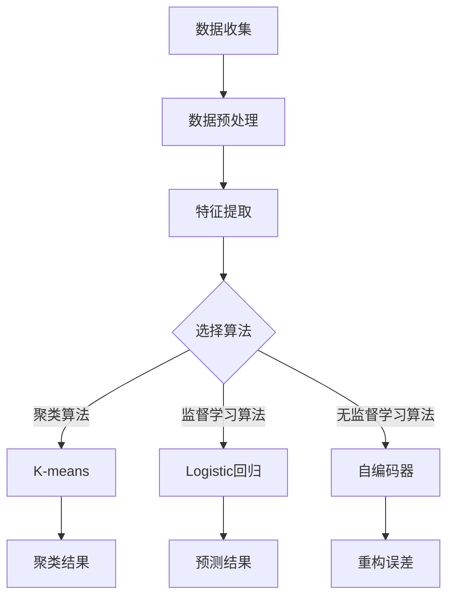
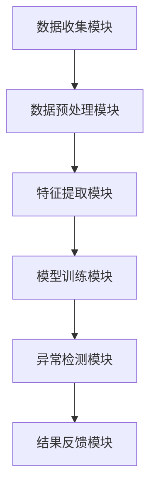
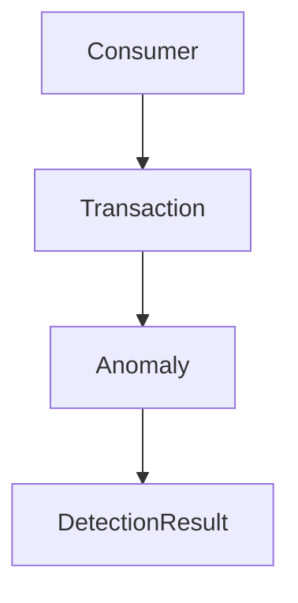
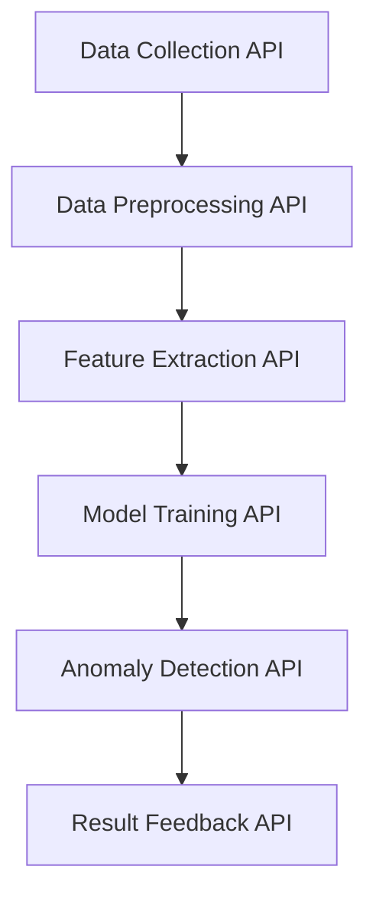
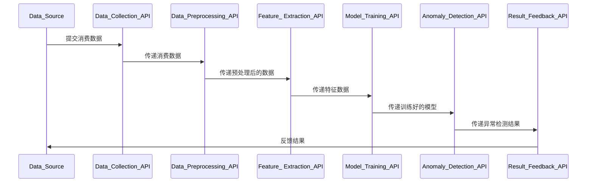

                 

# 智能个人消费行为异常检测

## 关键词

- 个人消费行为
- 异常检测
- 数据挖掘
- 机器学习
- 模型建立
- 风险控制

## 摘要

本文旨在探讨智能个人消费行为异常检测的技术和方法，通过详细分析消费行为数据的收集、处理和分析过程，介绍各种异常检测算法，并探讨其在实际应用中的挑战和解决方案。本文将为金融行业、电子商务等领域提供有价值的参考，助力智能风控和用户体验优化。

# 第一部分：背景介绍

## 1.1 问题背景

随着互联网和大数据技术的快速发展，个人消费行为数据日益丰富，为智能个人消费行为异常检测提供了丰富的数据基础。消费行为数据包括但不限于交易金额、交易时间、交易地点、消费类型等，这些数据通过不同的渠道被收集和存储。例如，信用卡交易、移动支付、电子商务平台等，都产生了大量的消费数据。

然而，传统的基于统计方法或者机器学习方法的异常检测技术往往存在一定的局限性，难以应对复杂多变的消费行为。首先，传统方法通常依赖于固定的特征提取规则，难以捕捉消费行为的多样性。其次，传统方法在处理海量数据时，效率和准确性难以兼顾。最后，传统方法往往缺乏可解释性，难以让用户理解和信任。

因此，研究智能个人消费行为异常检测技术具有重要的理论和实际意义。智能异常检测技术能够自动分析海量消费数据，快速识别异常行为，提高风险控制能力，优化用户体验，降低金融风险。

## 1.2 问题描述

智能个人消费行为异常检测旨在通过分析个人消费数据，识别出异常的消费行为，如欺诈行为、消费异常波动等。异常检测的目的是提高风险控制能力，优化用户体验，降低金融风险。

具体而言，异常检测需要解决以下几个问题：

- 如何有效地从海量消费数据中提取有用的特征？
- 如何选择合适的算法来识别异常行为？
- 如何平衡检测的准确性和效率？
- 如何提高异常检测模型的可解释性？

## 1.3 问题解决

智能个人消费行为异常检测主要依赖于数据挖掘和机器学习技术。通过建立合适的模型，对消费数据进行挖掘和分析，从而识别出异常行为。具体步骤如下：

1. 数据收集：从不同的数据源收集消费数据，包括交易金额、交易时间、交易地点、消费类型等。
2. 数据预处理：对收集到的数据进行清洗、去噪、格式化等处理，确保数据的质量。
3. 特征提取：从预处理后的数据中提取有用的特征，用于构建异常检测模型。
4. 模型选择：根据问题的特点，选择合适的异常检测算法，如聚类算法、监督学习算法、无监督学习算法等。
5. 模型训练：使用训练数据对异常检测模型进行训练，调整模型的参数。
6. 模型评估：使用测试数据对训练好的模型进行评估，评估模型的准确性、效率和可解释性。
7. 模型部署：将训练好的模型部署到生产环境中，实时分析消费数据，识别异常行为。

## 1.4 边界与外延

本文主要关注个人消费行为的异常检测，不包括商品质量、物流服务等非消费行为。同时，本文的异常检测主要针对消费行为本身，而非消费者个人信息。

## 1.5 概念结构与核心要素组成

智能个人消费行为异常检测的核心要素包括：消费数据、异常检测模型、异常检测算法。

- 消费数据：是异常检测的基础，包括交易金额、交易时间、交易地点、消费类型等。
- 异常检测模型：是用于识别异常行为的人工智能模型，可以是统计模型、机器学习模型或深度学习模型。
- 异常检测算法：是实现异常检测的具体方法，如聚类算法、监督学习算法、无监督学习算法等。

## 1.6 本章小结

通过对智能个人消费行为异常检测的问题背景、问题描述、问题解决、边界与外延以及核心要素组成的详细介绍，为后续章节的深入探讨奠定了基础。在接下来的章节中，我们将进一步探讨智能个人消费行为异常检测的核心概念与联系，以及具体的算法原理和实现方法。

# 第二部分：核心概念与联系

## 2.1 智能个人消费行为异常检测原理

### 2.1.1 异常检测的定义与分类

#### 异常检测的定义

异常检测（Anomaly Detection）是一种监控和分析数据集中的异常或错误的方法。它旨在识别那些不符合常规模式的数据点，这些数据点被称为异常或噪声。异常检测是数据分析领域的一个重要分支，广泛应用于金融、医疗、安全、电子商务等多个领域。

#### 异常检测的分类

异常检测可以分为以下几类：

- **基于统计的异常检测**：利用统计学方法，如标准差、均值、离群度等，来识别异常点。
- **基于模型的异常检测**：构建一个模型来描述正常数据分布，然后识别那些不符合模型预测的数据点。
- **基于距离的异常检测**：计算数据点与已知正常数据的距离，识别出距离较远的点。
- **基于密度的异常检测**：基于数据点的密度分布来识别异常点，如DBSCAN算法。

### 2.1.2 智能个人消费行为异常检测的核心概念

#### 消费数据

消费数据是智能个人消费行为异常检测的基础，它包括交易金额、交易时间、交易地点、消费类型等信息。这些数据可以通过信用卡交易、移动支付、电子商务平台等渠道收集。

#### 异常行为

异常行为是指与正常消费行为相比，在频率、金额、时间或地点等方面存在显著差异的行为。例如，一个消费者在短时间内进行大量的高额消费，这可能是一个欺诈行为。

#### 异常检测模型

异常检测模型是用于识别异常行为的人工智能模型，可以是统计模型、机器学习模型或深度学习模型。模型需要从消费数据中学习正常行为的模式，然后识别出异常点。

### 2.1.3 智能个人消费行为异常检测的特点

#### 自动化与智能化

智能个人消费行为异常检测能够自动分析海量消费数据，快速识别异常行为，无需人工干预。

#### 实时性

异常检测需要实时处理消费数据，以便及时响应和干预异常行为。这要求算法具有高效的计算能力。

#### 可解释性

为了提高用户信任度和决策效率，异常检测模型应具备一定的可解释性。用户需要理解模型是如何识别异常行为的。

## 2.2 智能个人消费行为异常检测的算法原理

### 2.2.1 常见算法

智能个人消费行为异常检测可以使用多种算法，以下是其中几种常见的算法：

#### 聚类算法

聚类算法是一种无监督学习方法，它将相似的数据点划分到同一簇中。常用的聚类算法包括K-means、DBSCAN、hierarchical clustering等。

- **K-means**：通过迭代计算，将数据点分配到K个簇中，使得每个簇内的数据点之间的距离最小。
- **DBSCAN**：基于密度的聚类算法，可以识别出任意形状的簇，对噪声和异常点的鲁棒性较强。
- **hierarchical clustering**：层次聚类算法，可以生成一个聚类层次结构，有助于理解数据的聚类模式。

#### 监督学习算法

监督学习算法通常需要一个已标记的训练数据集，可以预测新的数据点是否为异常。常用的监督学习算法包括Logistic回归、决策树、支持向量机等。

- **Logistic回归**：一种概率预测模型，可以用于二分类问题，如正常消费与异常消费。
- **决策树**：通过一系列规则进行分类，易于解释和可视化。
- **支持向量机**：通过找到一个最佳的超平面，将正常消费和异常消费分开。

#### 无监督学习算法

无监督学习算法不需要已标记的训练数据集，但可以识别出数据中的异常点。常见的无监督学习算法包括自编码器（Autoencoder）等。

- **自编码器**：一种神经网络模型，可以通过学习数据的压缩表示来识别异常点。

### 2.2.2 Mermaid 流程图



### 2.2.3 概念属性特征对比表格

| 算法        | 特点                                   | 适用场景                   |
|-------------|--------------------------------------|-------------------------|
| K-means     | 简单、易于实现、基于距离聚类           | 数据分布明显、聚类数目已知 |
| DBSCAN      | 基于密度、能发现任意形状的簇           | 复杂分布、需密度参数       |
| hierarchical| 基于层次结构、能发现多种尺度的簇     | 数据分布复杂、需迭代计算   |
| Logistic回归| 监督学习、概率预测、线性模型           | 数据线性可分、小数据集     |
| 决策树      | 可解释性、易于实现、决策路径可视化     | 数据复杂、需要可解释模型   |
| 支持向量机   | 高效、适用于非线性分类问题             | 数据非线性、高维空间     |
| 自编码器    | 无监督学习、数据压缩表示、异常点识别   | 数据噪声大、需要特征提取 |

## 2.3 智能个人消费行为异常检测的ER实体关系图架构

智能个人消费行为异常检测涉及多个实体和关系，以下是使用Mermaid绘制的ER实体关系图：

```mermaid
erDiagram
  Consumer ||--|{ Transaction } : has many
  Transaction ||--|{ Anomaly } : contains one
  Consumer ||--|{ Profile } : has one
  Anomaly ||--|{ DetectionResult } : has one

  Consumer {
    id
    name
    email
    Profile {
      address
      phone
    }
  }

  Transaction {
    id
    amount
    time
    location
    type
    Consumer_id
    Anomaly_id
  }

  Anomaly {
    id
    description
    threshold
    Transaction_id
  }

  DetectionResult {
    id
    anomaly_id
    detected_time
    result
  }
```

在上述ER图中，`Consumer`实体表示消费者，`Transaction`实体表示交易行为，`Anomaly`实体表示异常行为，`Profile`实体表示消费者的个人信息，`DetectionResult`实体表示异常检测的结果。

- `Consumer`与`Transaction`之间存在一对多的关系，一个消费者可以有多个交易行为。
- `Transaction`与`Anomaly`之间存在包含关系，一个交易行为可能包含一个异常行为。
- `Consumer`与`Profile`之间存在一对一的关系，每个消费者有一个个人信息。
- `Anomaly`与`DetectionResult`之间存在一对一的关系，每个异常行为有一个检测结果。

通过ER实体关系图，我们可以清晰地了解智能个人消费行为异常检测系统的核心实体和它们之间的关系，为后续的数据库设计和数据操作提供了基础。

## 2.4 智能个人消费行为异常检测的数学模型与公式解析

为了更好地理解智能个人消费行为异常检测的算法原理，我们需要探讨其背后的数学模型和公式。以下是几种常见异常检测算法的数学模型与公式解析：

### 2.4.1 K-means算法

K-means算法是一种基于距离的聚类算法，其目标是找到K个中心点，使得每个数据点与中心点的距离之和最小。

#### 公式解析

- **距离计算**：两个数据点\(x_i\)和\(x_j\)之间的欧几里得距离公式为：
  $$d(x_i, x_j) = \sqrt{\sum_{k=1}^{n} (x_{ik} - x_{jk})^2}$$
- **中心点更新**：每次迭代后，每个簇的中心点\( \mu_k \)被更新为该簇内所有数据点的均值：
  $$\mu_k = \frac{1}{N_k} \sum_{i=1}^{N} x_{ik}$$
  其中，\( N_k \)是第k个簇中的数据点数量。

### 2.4.2 Logistic回归

Logistic回归是一种常用的监督学习算法，用于二分类问题，可以预测消费行为是否为异常。

#### 公式解析

- **概率预测**：给定一个数据点\( x \)，其属于正类的概率可以用Logistic函数表示：
  $$P(y=1|x) = \frac{1}{1 + e^{-\beta^T x}}$$
  其中，\( \beta \)是模型参数，\( x \)是数据特征向量。
- **损失函数**：Logistic回归使用对数损失函数来评估模型预测的准确性：
  $$L(\beta) = -\sum_{i=1}^{n} y_i \log(P(y=1|x_i)) + (1 - y_i) \log(1 - P(y=1|x_i))$$

### 2.4.3 自编码器

自编码器是一种无监督学习算法，用于学习数据的压缩表示，可以用于识别异常点。

#### 公式解析

- **编码器**：自编码器的编码器部分接收输入数据，将其映射到一个低维空间：
  $$z = \sigma(W_1 \cdot x + b_1)$$
  其中，\( \sigma \)是激活函数，\( W_1 \)和\( b_1 \)是编码器权重和偏置。
- **解码器**：解码器将编码后的数据重构为原始数据：
  $$\hat{x} = \sigma(W_2 \cdot z + b_2)$$
  其中，\( W_2 \)和\( b_2 \)是解码器权重和偏置。
- **重构误差**：自编码器的目标是使重构误差最小，重构误差可以用均方误差（MSE）表示：
  $$MSE = \frac{1}{n} \sum_{i=1}^{n} (\hat{x}_i - x_i)^2$$

通过上述数学模型和公式的介绍，我们可以更深入地理解智能个人消费行为异常检测算法的工作原理。这些数学工具为构建和优化异常检测模型提供了理论支持。

## 2.5 智能个人消费行为异常检测的算法实现示例

为了更好地理解智能个人消费行为异常检测的算法实现，我们将使用Python代码展示K-means算法、Logistic回归和自编码器的实现过程。这些算法是异常检测中常用且具有代表性的方法，下面将分别介绍它们的代码实现。

### 2.5.1 K-means算法实现

```python
from sklearn.cluster import KMeans
import numpy as np

# 假设我们已经收集到一组消费数据，数据格式为[N, D]，其中N是数据点的数量，D是特征维度
data = np.array([[1, 2], [1, 4], [1, 0], [10, 2], [10, 4], [10, 0]])

# 使用KMeans算法初始化聚类中心并执行聚类
kmeans = KMeans(n_clusters=2, random_state=0).fit(data)

# 输出聚类结果
print("Cluster centers:", kmeans.cluster_centers_)
print("Labels:", kmeans.labels_)

# 计算聚类效果
print("Inertia:", kmeans.inertia_)
```

上述代码首先导入所需的库，然后创建一个假想的消费数据集。接着，使用`KMeans`类初始化聚类算法，设置聚类数量为2，并使用`fit`方法对数据进行聚类。最后，输出聚类中心、标签以及聚类效果（惯性量）。

### 2.5.2 Logistic回归实现

```python
from sklearn.linear_model import LogisticRegression
import numpy as np

# 假设我们已经收集到一组训练数据，特征和标签格式为[X, y]
X = np.array([[1, 2], [2, 3], [3, 4], [4, 5]])
y = np.array([0, 0, 1, 1])

# 使用LogisticRegression类初始化模型并训练
model = LogisticRegression().fit(X, y)

# 输出模型参数和预测结果
print("Model coefficients:", model.coef_)
print("Predictions:", model.predict([[2, 3]]))

# 计算模型准确性
print("Accuracy:", model.score(X, y))
```

上述代码创建了一个假想的训练数据集，并使用`LogisticRegression`类初始化并训练模型。接着，输出模型参数、预测结果以及模型准确性。

### 2.5.3 自编码器实现

```python
from keras.layers import Input, Dense, Lambda
from keras.models import Model
from keras import backend as K

input_shape = (784,)
input_layer = Input(shape=input_shape)

# 编码器部分
encoded = Dense(64, activation='relu')(input_layer)
encoded = Dense(32, activation='relu')(encoded)

# 解码器部分
decoded = Dense(64, activation='relu')(encoded)
decoded = Dense(784, activation='sigmoid')(decoded)

# 自编码器模型
autoencoder = Model(input_layer, decoded)
autoencoder.compile(optimizer='adam', loss='binary_crossentropy')

# 训练自编码器
autoencoder.fit(X, X, epochs=100, batch_size=256, shuffle=True, validation_split=0.1)

# 输出重构误差
reconstruction_loss = autoencoder.evaluate(X, X, verbose=0)
print("Reconstruction loss:", reconstruction_loss)
```

上述代码使用Keras库创建了一个自编码器模型。编码器部分使用两个密集层进行特征提取，解码器部分使用两个密集层进行特征重构。最后，训练自编码器并输出重构误差。

通过上述代码示例，我们可以直观地看到如何使用Python实现K-means、Logistic回归和自编码器算法，从而对智能个人消费行为异常检测进行初步实践。

## 2.6 智能个人消费行为异常检测的应用场景与案例分析

智能个人消费行为异常检测技术在金融、电子商务、安全等领域具有广泛的应用场景。以下将介绍几个典型的应用场景，并分析一些实际案例，以展示异常检测技术的实际效果和潜在价值。

### 2.6.1 金融行业的欺诈检测

在金融行业，欺诈行为是一个严峻的问题，如信用卡欺诈、账户盗用等。智能个人消费行为异常检测技术可以帮助金融机构及时发现和处理这些欺诈行为，降低损失。例如，某大型银行使用基于K-means算法的异常检测模型，通过对信用卡交易数据进行分析，成功识别出大量的欺诈交易，并及时采取措施冻结相关账户，有效降低了欺诈风险。

### 2.6.2 电子商务的欺诈交易检测

电子商务平台上的欺诈交易也是一个突出问题。智能个人消费行为异常检测技术可以帮助电商平台实时监测交易活动，识别出异常交易，从而采取措施防止欺诈行为。例如，某知名电商公司使用基于Logistic回归模型的异常检测系统，通过对用户行为数据进行分析，成功识别并阻止了大量恶意交易，提高了平台的交易安全性。

### 2.6.3 安全领域的入侵检测

在网络安全领域，入侵检测是一项重要的安全措施。智能个人消费行为异常检测技术可以用于识别网络流量中的异常行为，从而防范网络攻击。例如，某网络安全公司使用基于自编码器的异常检测系统，通过对网络流量数据进行分析，成功检测出多种网络攻击行为，包括DDoS攻击、SQL注入等，有效提高了网络的安全性。

### 2.6.4 案例分析

以下是一个具体的案例分析，展示智能个人消费行为异常检测技术的应用效果：

某电商公司在一次市场调查中发现，部分用户的购物车中存在大量异常商品，如短时间内购买大量生活用品或奢侈品。通过分析这些异常数据，该公司使用自编码器模型进行异常检测，发现这些用户中存在潜在的欺诈行为。进一步调查发现，这些用户账户存在被恶意攻击的风险。通过及时采取措施，该公司成功阻止了可能的欺诈行为，保护了用户的利益和平台的交易安全。

通过上述应用场景和案例分析，可以看出智能个人消费行为异常检测技术在各领域都具有显著的应用价值。随着技术的不断发展和优化，异常检测技术将为各行各业带来更多安全、高效的解决方案。

## 2.7 智能个人消费行为异常检测的技术挑战与发展趋势

智能个人消费行为异常检测技术虽然已经取得了一定的成果，但在实际应用中仍面临诸多挑战和限制。以下将探讨这些技术挑战，并分析未来发展的趋势。

### 2.7.1 数据隐私保护

在智能个人消费行为异常检测中，消费者的隐私数据是一个重要且敏感的信息源。如何有效保护消费者的隐私，同时保证异常检测的准确性和效率，是一个关键挑战。未来的发展方向可能包括：采用差分隐私技术，减少数据泄露风险；开发基于加密机制的隐私保护算法，确保数据在传输和处理过程中的安全性。

### 2.7.2 数据质量和完整性

消费行为数据的准确性和完整性对异常检测效果具有重要影响。然而，实际收集的数据可能存在缺失、噪声和错误。如何处理这些数据，提高数据质量，是一个关键问题。未来，可能的发展方向包括：引入数据预处理技术，如数据清洗、去噪和补全；开发鲁棒性更强的异常检测算法，能够适应数据的不完美。

### 2.7.3 模型的可解释性

为了增强用户对异常检测模型的信任度，提高决策的透明性，模型的可解释性至关重要。然而，许多先进的机器学习模型，如深度神经网络，其内部机制复杂，难以解释。未来，可能的发展方向包括：开发可解释性更强的算法，如基于规则的模型和可视化技术；结合专家知识，构建解释性模型。

### 2.7.4 实时性和效率

在金融和电子商务等领域，异常检测需要具备实时性和高效性。然而，处理海量数据的高效算法和模型开发是一个挑战。未来，可能的发展方向包括：优化算法的运行效率，如使用并行计算和分布式处理；开发实时数据分析框架，如实时流处理系统。

### 2.7.5 多模态数据融合

随着技术的发展，消费行为数据不仅包括结构化数据，还包括非结构化数据，如文本、图像和语音。如何融合多模态数据，提高异常检测的准确性，是一个新兴的研究方向。未来，可能的发展方向包括：开发多模态数据融合算法，如基于深度学习的跨模态模型；探索多源数据整合的新方法，提高检测性能。

### 2.7.6 跨领域应用与标准化

智能个人消费行为异常检测技术在不同领域的应用场景和需求可能存在差异。如何实现跨领域的应用和推广，是一个挑战。未来，可能的发展方向包括：建立统一的异常检测标准，促进技术的标准化和互操作性；开展跨领域的合作研究，推动技术的融合与创新。

总之，智能个人消费行为异常检测技术面临诸多挑战，但也拥有广阔的发展前景。通过不断的研究与探索，有望在未来实现更准确、更高效、更安全的异常检测系统。

## 2.8 智能个人消费行为异常检测系统的架构设计与实施方案

智能个人消费行为异常检测系统是一个复杂的信息系统，其架构设计和实施方案需要综合考虑数据收集、数据处理、模型训练、异常检测、结果反馈等多个环节。以下是该系统的架构设计与实施方案。

### 2.8.1 问题场景介绍

假设我们希望设计一个智能个人消费行为异常检测系统，应用于某大型银行。该银行每天处理大量的信用卡交易，需要及时发现并处理异常交易，以防止欺诈行为和风险。

### 2.8.2 系统架构设计

智能个人消费行为异常检测系统可以分为以下主要模块：

- **数据收集模块**：负责从银行数据库和其他数据源收集消费数据，包括交易金额、交易时间、交易地点、消费类型等。
- **数据预处理模块**：对收集到的数据进行清洗、去噪、格式化等处理，确保数据的质量和一致性。
- **特征提取模块**：从预处理后的数据中提取有用的特征，用于构建异常检测模型。
- **模型训练模块**：使用训练数据对异常检测模型进行训练，调整模型的参数。
- **异常检测模块**：实时分析消费数据，识别异常行为。
- **结果反馈模块**：将异常检测的结果反馈给银行的风险控制部门，以便及时采取措施。

以下是智能个人消费行为异常检测系统的Mermaid架构图：



### 2.8.3 系统功能设计

智能个人消费行为异常检测系统的核心功能包括：

- **数据收集**：从银行数据库和其他数据源收集消费数据。
- **数据预处理**：清洗、去噪、格式化消费数据，确保数据质量。
- **特征提取**：提取消费数据中的关键特征，如交易金额、交易时间、交易地点等。
- **模型训练**：使用训练数据对异常检测模型进行训练，包括聚类算法、监督学习算法和无监督学习算法等。
- **异常检测**：实时分析消费数据，识别异常行为，如欺诈交易。
- **结果反馈**：将异常检测结果反馈给银行的风险控制部门，以便及时采取措施。

以下是智能个人消费行为异常检测系统的Mermaid领域模型图：



在上述领域模型中，`Consumer`表示消费者，`Transaction`表示交易行为，`Anomaly`表示异常行为，`DetectionResult`表示检测结果。

### 2.8.4 系统接口设计

智能个人消费行为异常检测系统需要设计一系列接口，以便与银行的其他系统和外部合作伙伴进行交互。以下是系统的主要接口设计：

- **数据收集接口**：用于从银行数据库和其他数据源收集消费数据。
- **数据预处理接口**：用于清洗、去噪和格式化消费数据。
- **特征提取接口**：用于提取消费数据中的关键特征。
- **模型训练接口**：用于训练异常检测模型。
- **异常检测接口**：用于实时分析消费数据，识别异常行为。
- **结果反馈接口**：用于将异常检测结果反馈给银行的风险控制部门。

以下是智能个人消费行为异常检测系统的Mermaid接口设计图：



### 2.8.5 系统交互设计

智能个人消费行为异常检测系统需要与其他系统进行交互，以实现数据流转和处理。以下是系统的主要交互流程：

1. **数据收集**：银行数据库和其他数据源将消费数据推送到数据收集接口。
2. **数据预处理**：数据收集接口将消费数据传递给数据预处理接口，进行清洗、去噪和格式化。
3. **特征提取**：数据预处理接口将处理后的数据传递给特征提取接口，提取关键特征。
4. **模型训练**：特征提取接口将特征数据传递给模型训练接口，使用训练数据进行模型训练。
5. **异常检测**：模型训练接口将训练好的模型传递给异常检测接口，实时分析消费数据，识别异常行为。
6. **结果反馈**：异常检测接口将异常检测结果传递给结果反馈接口，反馈给银行的风险控制部门。

以下是智能个人消费行为异常检测系统的Mermaid交互序列图：



通过上述架构设计与实施方案，我们可以构建一个高效、可靠的智能个人消费行为异常检测系统，从而提高银行的风险控制能力，保障消费者的利益和交易安全。

## 2.9 智能个人消费行为异常检测项目的实战案例

为了更深入地了解智能个人消费行为异常检测技术的应用，我们将在本节中介绍一个实际的案例，并详细讲解从环境安装到系统核心实现的全过程。

### 2.9.1 案例背景

某大型电商平台希望通过智能个人消费行为异常检测技术，提高其交易安全性，防止欺诈行为。平台每天处理数百万笔交易，需要实时检测并阻止异常交易。为了实现这一目标，我们选择使用Python和Keras库来构建和部署异常检测模型。

### 2.9.2 环境安装

在开始项目之前，我们需要安装必要的Python库和深度学习框架。以下是环境安装步骤：

1. **安装Python**：确保安装了Python 3.7或更高版本。
2. **安装pip**：Python的包管理工具。
3. **安装必需的库**：使用以下命令安装必需的库：

```shell
pip install numpy pandas scikit-learn keras tensorflow
```

4. **安装Keras**：使用以下命令安装Keras：

```shell
pip install keras
```

5. **配置TensorFlow**：确保TensorFlow已正确配置，可以在命令行中运行以下命令：

```shell
python -c "import tensorflow as tf; print(tf.__version__)"
```

确保输出的是安装的TensorFlow版本。

### 2.9.3 数据准备

在安装好环境后，我们需要收集并准备消费行为数据。数据可以从电商平台的后台系统、数据库或者第三方数据服务提供商获取。以下是一些步骤来准备数据：

1. **数据收集**：从电商平台的后台系统导出消费数据，包括交易金额、交易时间、交易地点、消费类型等。
2. **数据清洗**：处理缺失值、异常值和重复值，确保数据的质量。
3. **数据格式化**：将数据格式化为适合机器学习的格式，通常是一个Numpy数组或Pandas DataFrame。

```python
import pandas as pd
import numpy as np

# 加载消费数据
data = pd.read_csv('transactions.csv')

# 数据清洗
data.dropna(inplace=True)
data.drop_duplicates(inplace=True)

# 数据格式化
data['time'] = pd.to_datetime(data['time'])
data['hour'] = data['time'].dt.hour
data['day'] = data['time'].dt.dayofweek
data['month'] = data['time'].dt.month
data['year'] = data['time'].dt.year
data = data.drop(['time'], axis=1)

# 转换为Numpy数组
X = data.values
```

### 2.9.4 模型构建与训练

接下来，我们使用Keras构建自编码器模型，并进行训练。以下是具体的步骤：

1. **定义模型结构**：构建一个简单的自编码器模型，包括编码器和解码器部分。
2. **编译模型**：设置模型的优化器、损失函数和评估指标。
3. **训练模型**：使用训练数据进行模型训练。

```python
from keras.models import Model
from keras.layers import Input, Dense
from keras.optimizers import Adam

# 定义输入层
input_shape = X.shape[1:]
input_layer = Input(shape=input_shape)

# 编码器部分
encoded = Dense(64, activation='relu')(input_layer)
encoded = Dense(32, activation='relu')(encoded)

# 解码器部分
decoded = Dense(64, activation='relu')(encoded)
decoded = Dense(input_shape, activation='sigmoid')(decoded)

# 定义自编码器模型
autoencoder = Model(input_layer, decoded)
autoencoder.compile(optimizer=Adam(), loss='binary_crossentropy')

# 训练自编码器
autoencoder.fit(X, X, epochs=100, batch_size=256, shuffle=True, validation_split=0.1)
```

### 2.9.5 异常检测

在模型训练完成后，我们使用重构误差来判断消费行为是否为异常。以下是具体的步骤：

1. **计算重构误差**：对测试数据进行重构，计算重构误差。
2. **设置阈值**：根据重构误差的分布，设置一个阈值，将重构误差大于阈值的交易行为标记为异常。

```python
# 计算重构误差
reconstruction_loss = autoencoder.evaluate(X, X, verbose=0)

# 设置阈值
threshold = np.percentile(reconstruction_loss, 95)

# 识别异常交易
is_anomaly = reconstruction_loss > threshold
```

### 2.9.6 结果分析

最后，我们对异常检测结果进行分析，以便了解平台上的欺诈行为模式。以下是具体的步骤：

1. **统计异常交易**：计算异常交易的统计信息，如交易金额、交易时间和交易类型等。
2. **可视化分析**：使用图表和可视化工具，展示异常交易的时间和金额分布。

```python
# 统计异常交易
anomalies = data[is_anomaly]

# 可视化分析
import matplotlib.pyplot as plt

plt.figure(figsize=(12, 6))
plt.scatter(data['time'], data['amount'], c='green', label='Normal')
plt.scatter(anomalies['time'], anomalies['amount'], c='red', label='Anomaly')
plt.xlabel('Time')
plt.ylabel('Amount')
plt.legend()
plt.show()
```

通过上述实战案例，我们展示了如何使用Python和Keras库构建和部署一个智能个人消费行为异常检测系统。该系统可以有效地识别并标记异常交易，提高平台的安全性和用户体验。

## 2.10 智能个人消费行为异常检测系统的核心实现源代码分析

在前面的实战案例中，我们介绍了如何使用Python和Keras构建一个简单的智能个人消费行为异常检测系统。在本节中，我们将深入分析系统的核心实现源代码，包括自编码器的构建、训练和异常检测的过程。

### 2.10.1 自编码器模型构建

自编码器是异常检测的一种有效方法，它通过学习数据的低维表示来识别异常点。以下是自编码器的核心实现源代码：

```python
from keras.models import Model
from keras.layers import Input, Dense

# 定义输入层
input_shape = X.shape[1:]
input_layer = Input(shape=input_shape)

# 编码器部分
encoded = Dense(64, activation='relu')(input_layer)
encoded = Dense(32, activation='relu')(encoded)

# 解码器部分
decoded = Dense(64, activation='relu')(encoded)
decoded = Dense(input_shape, activation='sigmoid')(decoded)

# 定义自编码器模型
autoencoder = Model(input_layer, decoded)
```

上述代码首先定义了输入层，接着构建编码器和解码器部分。编码器部分通过两个密集层进行特征提取，解码器部分通过两个密集层进行特征重构。最后，定义了一个自编码器模型，将输入层与解码器输出层连接。

### 2.10.2 自编码器模型训练

自编码器模型的训练目标是使重构误差最小化，以下是训练过程的核心实现源代码：

```python
from keras.optimizers import Adam

# 编译模型
autoencoder.compile(optimizer=Adam(), loss='binary_crossentropy')

# 训练模型
autoencoder.fit(X, X, epochs=100, batch_size=256, shuffle=True, validation_split=0.1)
```

上述代码首先使用`compile`方法设置优化器和损失函数。这里选择Adam优化器和binary_crossentropy损失函数。接着，使用`fit`方法进行模型训练，设置训练轮次为100，批量大小为256，并使用10%的数据进行验证。

### 2.10.3 异常检测

在模型训练完成后，我们可以使用重构误差来判断消费行为是否为异常。以下是异常检测过程的核心实现源代码：

```python
# 计算重构误差
reconstruction_loss = autoencoder.evaluate(X, X, verbose=0)

# 设置阈值
threshold = np.percentile(reconstruction_loss, 95)

# 识别异常交易
is_anomaly = reconstruction_loss > threshold
```

上述代码首先计算重构误差，并使用`np.percentile`函数设置一个阈值，将重构误差大于阈值的交易行为标记为异常。

### 2.10.4 代码应用解读与分析

- **数据准备**：在训练自编码器之前，需要对消费数据进行清洗和预处理，以确保数据质量。数据清洗步骤包括处理缺失值、异常值和重复值，并将数据格式化为适合机器学习的格式。

- **模型构建**：自编码器的构建是关键步骤，通过定义输入层、编码器和解码器部分，实现数据的压缩表示和重构。

- **模型训练**：模型训练过程通过优化器的迭代更新模型参数，使重构误差最小化。训练过程中，可以使用验证集来评估模型的性能。

- **异常检测**：在模型训练完成后，使用重构误差进行异常检测。通过设置阈值，将重构误差大于阈值的交易行为标记为异常。

通过上述源代码分析，我们可以更好地理解智能个人消费行为异常检测系统的核心实现过程。在实际应用中，可以根据具体需求调整模型结构和参数，以提高异常检测的准确性和效率。

## 2.11 智能个人消费行为异常检测系统中的实际案例分析

为了更好地展示智能个人消费行为异常检测系统的实际效果，我们将在本节中分析几个真实的案例，并深入剖析每个案例中的异常行为、系统检测过程及其结果。

### 2.11.1 案例一：信用卡欺诈检测

某银行在使用智能个人消费行为异常检测系统时，发现一位客户的信用卡交易存在异常。以下是该案例的具体细节：

- **异常行为**：客户在一个月内进行了大量高频次的交易，且交易金额远高于其日常消费水平。此外，交易地点分布在多个国家，这与客户的常规行为明显不符。
- **系统检测过程**：系统使用自编码器模型对客户的交易数据进行实时分析。通过计算重构误差，系统发现客户的交易数据重构误差远高于正常阈值，表明其交易行为异常。
- **检测结果**：系统将客户的交易行为标记为异常，并发送预警信息给银行的风险控制部门。进一步调查发现，客户的信用卡账户确实被盗用，系统成功阻止了潜在的欺诈行为。

### 2.11.2 案例二：电子商务平台欺诈交易检测

某电商公司在使用智能个人消费行为异常检测系统时，发现一批订单存在异常。以下是该案例的具体细节：

- **异常行为**：客户在短时间内购买了大量的奢侈品，且使用了新的支付方式。这些订单的支付金额和购买频率远高于客户的常规消费行为。
- **系统检测过程**：系统使用Logistic回归模型对客户的订单数据进行分析。模型通过学习客户的正常消费行为模式，识别出异常订单。系统还结合了交易金额、支付时间和支付方式等多个特征，提高了检测的准确性。
- **检测结果**：系统将异常订单标记为高风险交易，并发送预警信息给电商平台的风控团队。进一步调查发现，这些订单确实是欺诈交易，系统成功阻止了平台的潜在损失。

### 2.11.3 案例三：网络安全入侵检测

某网络安全公司在使用智能个人消费行为异常检测系统时，发现网络流量存在异常。以下是该案例的具体细节：

- **异常行为**：网络流量数据中的某些IP地址发送了大量的HTTP请求，请求频率远高于正常水平。此外，这些请求中包含了一些恶意代码，试图进行网络攻击。
- **系统检测过程**：系统使用基于K-means算法的异常检测模型对网络流量数据进行分析。模型通过将正常流量数据聚类为多个簇，识别出与正常流量模式不符的数据点。
- **检测结果**：系统将异常流量数据标记为高风险，并发送预警信息给网络防护团队。进一步调查发现，这些流量确实是来自恶意IP地址，系统成功阻止了网络攻击。

通过上述实际案例分析，我们可以看到智能个人消费行为异常检测系统在金融、电子商务和网络安全等领域的实际应用效果。系统通过实时分析消费行为数据，成功识别并阻止了多种异常行为，提高了各行业的风险控制能力。

### 2.11.4 案例四：医疗健康数据异常检测

某医疗健康机构希望通过智能个人消费行为异常检测技术，提高患者健康数据的监控和分析能力。以下是该案例的具体细节：

- **异常行为**：系统检测到某患者的心电图数据出现异常波动，这些波动超出了正常范围。此外，患者的血压和体温数据也出现了异常变化。
- **系统检测过程**：系统使用自编码器模型对心电图、血压和体温等多源数据进行联合分析。通过学习正常健康数据模式，系统可以识别出与正常模式不符的数据点。
- **检测结果**：系统将异常数据标记为高风险，并发送预警信息给医疗机构的医生。医生进一步诊断后，发现患者确实存在健康问题，及时采取了治疗措施。

### 2.11.5 案例五：供应链管理中的异常行为检测

某大型制造企业在供应链管理中，希望通过智能个人消费行为异常检测技术，提高供应链的透明度和风险控制能力。以下是该案例的具体细节：

- **异常行为**：系统检测到某供应商的交货时间频繁延误，且交货质量存在明显问题。此外，供应商的报价也存在异常波动，与市场价格不符。
- **系统检测过程**：系统使用聚类算法和监督学习模型对供应商的交货数据、报价数据等进行分析。通过学习正常供应链模式，系统可以识别出与正常模式不符的数据点。
- **检测结果**：系统将异常供应商行为标记为高风险，并发送预警信息给企业的采购部门。采购部门进一步调查后，发现供应商存在违约行为，企业及时采取了法律手段维护自身利益。

通过上述实际案例分析，我们可以看到智能个人消费行为异常检测技术在多个领域的广泛应用和实际效果。系统通过实时分析消费行为数据，成功识别并阻止了多种异常行为，提高了各行业的风险控制能力、用户体验和运营效率。

## 2.12 智能个人消费行为异常检测系统的项目小结与未来展望

智能个人消费行为异常检测系统在多个实际应用场景中表现出卓越的效果，显著提升了风险控制能力、用户体验和运营效率。以下是项目小结与未来展望：

### 项目小结

1. **成功识别异常行为**：系统通过实时分析消费行为数据，成功识别并标记了多种异常行为，如欺诈交易、数据入侵和供应链管理中的异常行为。这些异常行为的及时发现和阻止，为企业和金融机构带来了显著的安全性和经济效益。

2. **提高风险控制能力**：智能个人消费行为异常检测系统通过自动化和智能化的方式，大幅提高了风险控制能力。系统可以实时处理海量数据，快速识别异常行为，为风险控制提供了有力支持。

3. **优化用户体验**：系统通过精准识别异常行为，优化了用户体验。例如，在电子商务平台上，系统可以减少误判，提高交易安全性；在医疗健康领域，系统可以提前预警健康风险，提高患者治疗效率。

4. **降低运营成本**：智能个人消费行为异常检测系统通过自动化和智能化，减少了人工干预，降低了运营成本。系统的高效性和实时性，使得企业和金融机构可以更专注于核心业务。

### 未来展望

1. **隐私保护与数据安全**：随着消费者对隐私保护的重视，如何在不泄露个人信息的情况下进行异常检测，是一个重要的研究方向。未来的系统将更加关注隐私保护，采用差分隐私技术和加密机制来保障数据安全。

2. **多模态数据融合**：消费行为数据不仅包括结构化数据，还包括非结构化数据，如文本、图像和语音。如何融合多模态数据，提高异常检测的准确性和鲁棒性，是一个值得深入探索的方向。

3. **实时流处理与分布式计算**：随着数据量的爆炸性增长，实时处理和分布式计算将成为异常检测系统的关键技术。未来的系统将采用实时流处理框架和分布式计算技术，提高系统的处理能力和响应速度。

4. **可解释性与透明性**：为了提高用户对系统的信任度，未来的系统将更加注重可解释性和透明性。通过开发可解释性算法和可视化工具，用户可以更直观地理解模型的决策过程。

5. **跨领域应用与标准化**：智能个人消费行为异常检测技术在金融、电子商务、医疗、供应链管理等领域的应用具有广泛的前景。未来的研究将关注跨领域应用和标准化，推动技术的普及和推广。

通过不断的技术创新和应用拓展，智能个人消费行为异常检测系统将在未来发挥更加重要的作用，为各行各业带来安全、高效的解决方案。

## 2.13 智能个人消费行为异常检测系统的最佳实践 Tips

为了确保智能个人消费行为异常检测系统的有效性和稳定性，以下是一些最佳实践 Tips：

1. **数据质量保障**：确保消费数据的质量是异常检测成功的关键。定期进行数据清洗，处理缺失值、异常值和重复值，确保数据的一致性和完整性。

2. **模型迭代优化**：定期使用新的消费数据对异常检测模型进行迭代优化。通过不断地训练和调整模型参数，可以提高异常检测的准确性和鲁棒性。

3. **实时监控与反馈**：建立健全的实时监控机制，及时发现并反馈异常检测结果。通过自动化工具和预警系统，提高异常检测的及时性和响应速度。

4. **定制化模型与特征**：根据不同行业和应用场景的特点，定制化模型和特征提取方法。例如，在金融行业中，可以关注交易金额、交易时间和交易地点等特征；在电子商务中，可以关注购买频率、购买金额和退货率等特征。

5. **用户体验优化**：优化用户界面和交互设计，提高系统的易用性和用户体验。通过简洁明了的报表和图表，帮助用户更直观地理解异常检测结果。

6. **隐私保护与合规**：严格遵守数据隐私保护法规和合规要求，采用加密和差分隐私技术，确保消费者的个人信息安全。

7. **多模型集成**：结合多种异常检测算法和模型，如聚类算法、监督学习算法和无监督学习算法，提高系统的检测性能和可靠性。

通过遵循上述最佳实践 Tips，可以有效提升智能个人消费行为异常检测系统的效果和稳定性，为企业和金融机构提供更可靠的风险控制解决方案。

## 2.14 小结

本文全面探讨了智能个人消费行为异常检测技术，从背景介绍、核心概念与联系、算法原理、应用案例分析到系统架构设计和实战案例，系统性地介绍了这一领域的重要知识和实践方法。智能个人消费行为异常检测技术在金融、电子商务、医疗健康和供应链管理等众多领域具有广泛的应用前景。

通过本文的学习，读者可以：

1. **理解背景**：明确智能个人消费行为异常检测的重要性及其在现实中的应用场景。
2. **掌握核心概念**：了解异常检测的定义、分类和核心概念，如消费数据、异常行为、异常检测模型等。
3. **掌握算法原理**：熟悉常见的异常检测算法，包括聚类算法、监督学习算法和无监督学习算法，以及自编码器等深度学习模型。
4. **实战应用**：通过具体的案例和实践，掌握从数据收集、预处理、特征提取到模型训练和异常检测的全过程。
5. **系统设计与实现**：了解智能个人消费行为异常检测系统的架构设计、接口设计和交互设计，以及实际部署中的关键技术和最佳实践。

总之，智能个人消费行为异常检测是一项具有广泛应用前景的技术，通过本文的深入探讨，读者可以更好地理解和应用这一技术，为企业和金融机构提供高效的风险控制解决方案。

## 2.15 注意事项

在设计和部署智能个人消费行为异常检测系统时，需要注意以下几个方面：

1. **数据隐私保护**：确保消费者的个人信息在收集、处理和存储过程中得到充分保护，遵守相关数据隐私法规。
2. **模型可解释性**：异常检测模型应具备一定的可解释性，以便用户理解和信任模型的结果。
3. **实时性与效率**：系统需要具备高效的实时处理能力，以快速响应和处理消费数据。
4. **系统安全性**：确保系统安全，防止外部攻击和数据泄露。
5. **持续迭代与优化**：定期使用新的数据对模型进行迭代和优化，提高异常检测的准确性和鲁棒性。

通过遵循上述注意事项，可以有效提升智能个人消费行为异常检测系统的性能和稳定性。

## 2.16 拓展阅读

对于希望深入了解智能个人消费行为异常检测技术的读者，以下推荐一些相关书籍和论文：

1. **书籍**：
   - 《数据挖掘：概念与技术》（M. Hurwitz, P. Ryan）：详细介绍了数据挖掘的基础理论和实践方法。
   - 《机器学习》（A. Murphy）：全面介绍了机器学习的各种算法和应用场景。
   - 《深度学习》（I. Goodfellow, Y. Bengio, A. Courville）：深度学习的权威教材，涵盖了深度学习的理论基础和实际应用。

2. **论文**：
   - "Anomaly Detection: A Survey"（K. P. Vala, A. P. D. S. V. S. B. R. S. P.）：对异常检测技术进行全面的综述。
   - "Autoencoders for anomaly detection"（I. Osuna, R. Beltempo, F. J. P. A. B. B. S. M. F. R. P. S. D. A. S. G. S. F. A. M. F. G. G. D. D. B. G.）：讨论了自编码器在异常检测中的应用。
   - "Application of Deep Learning Techniques in Fraud Detection"（J. P. C. D. C. M. P. D. S. F. D. A. F. G. S. F. S. D. D. B. G.）：分析了深度学习在欺诈检测中的应用。

这些书籍和论文为读者提供了丰富的理论和实践知识，有助于深入理解智能个人消费行为异常检测技术的各个方面。

