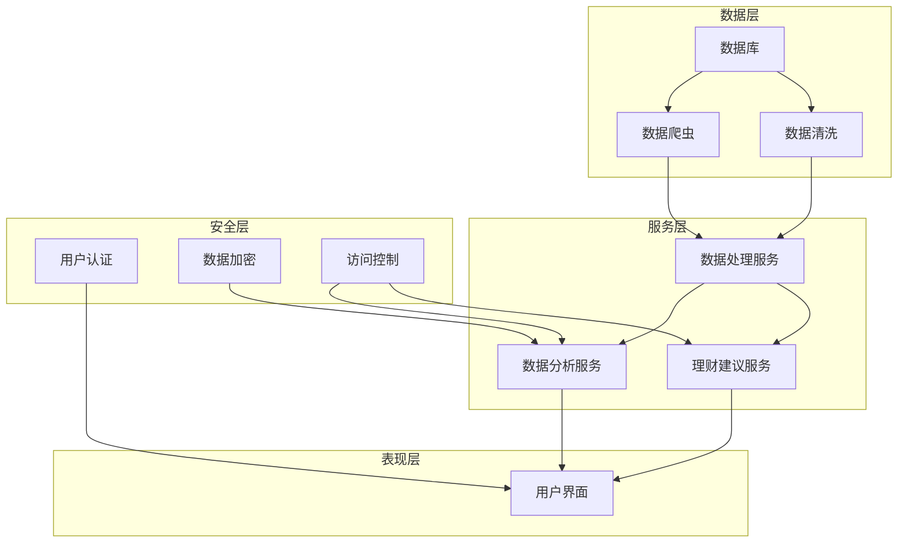

                 

# 智能个人理财目标追踪器

## 关键词

- 个人理财
- 目标追踪
- 智能算法
- 数据分析
- 系统设计

## 摘要

本文旨在探讨智能个人理财目标追踪器的设计与实现。我们首先介绍了个人理财目标的重要性，并阐述了智能理财追踪器的兴起。接着，我们详细分析了个人理财的基础知识，包括财务健康指标、预算规划和投资理财基础。随后，我们探讨了智能理财追踪器的技术基础，包括数据收集与管理、数据分析工具与技术以及智能算法在理财中的应用。接下来，我们深入讨论了智能理财追踪器的设计与实现，包括系统需求分析、系统架构设计和功能模块实现。随后，我们展示了智能理财追踪器在不同应用场景中的实践效果，并详细分析了数据收集、分析与决策支持的方法。最后，我们提出了优化与高级技巧，包括性能优化、系统安全与隐私保护以及机器学习算法的进阶应用，并通过案例分析展示了智能理财追踪器的实际应用效果。本文旨在为读者提供一个全面的智能个人理财目标追踪器的概念框架和实践指南。

## 引言

### 个人理财目标的重要性

个人理财目标，顾名思义，是个人财务规划的核心。随着社会经济的发展和个人财富的积累，如何合理地管理和规划个人财务，实现财务自由，成为了越来越多人的关注点。个人理财目标不仅关系到个人当前的生活质量，也影响着未来的财务状况和退休规划。因此，明确和实现个人理财目标，是每个人财务健康的关键步骤。

### 智能理财追踪器的兴起

在传统个人理财中，大多数人是通过手工记录和计算来管理个人财务。这种方式不仅费时费力，而且容易出错，难以进行有效的数据分析和决策支持。随着计算机技术和人工智能的快速发展，智能个人理财目标追踪器应运而生。这些智能追踪器利用先进的算法和技术，自动收集、分析和处理个人财务数据，为用户提供了更加精确和高效的理财服务。

智能理财追踪器不仅能够帮助用户实时监控财务状况，还能根据用户设定的理财目标，自动调整财务策略，提供个性化的理财建议。这使得个人理财更加智能化、个性化和高效化，大大提高了用户理财的成功率。

### 本书结构及预期收益

本书旨在为读者提供一个系统、全面、易懂的智能个人理财目标追踪器的设计与实现指南。全书共分为八个部分：

1. **引言**：介绍个人理财目标的重要性，以及智能理财追踪器的兴起。
2. **个人理财基础知识**：详细讲解财务健康指标、预算规划和投资理财基础。
3. **智能理财追踪器技术基础**：分析数据收集与管理、数据分析工具与技术以及智能算法在理财中的应用。
4. **智能理财追踪器的设计与实现**：深入讨论系统需求分析、系统架构设计和功能模块实现。
5. **应用场景与实践**：展示智能理财追踪器在不同应用场景中的实践效果。
6. **数据分析与决策支持**：介绍数据收集、分析与决策支持的方法。
7. **优化与高级技巧**：探讨性能优化、系统安全与隐私保护以及机器学习算法的进阶应用。
8. **案例分析**：通过实际案例展示智能理财追踪器的应用效果。

通过阅读本书，读者可以：

- 理解个人理财目标的重要性及其实现方法。
- 掌握智能理财追踪器的设计与实现技术。
- 学会使用智能理财追踪器进行个人财务管理和目标追踪。
- 了解智能理财追踪器的优化和高级应用技巧。

## 个人理财基础知识

### 财务健康指标

财务健康指标是评估个人财务状况的重要工具。以下是几个关键的财务健康指标：

1. **收入与支出比率**：计算公式为月均收入除以月均支出，反映了个人收支平衡的情况。该比率越高，表示个人财务状况越好。
2. **储蓄率**：计算公式为月均储蓄除以月均收入，反映了个人储蓄能力。储蓄率越高，表示个人具备更好的财务规划能力。
3. **债务比率**：计算公式为总负债除以总资产，反映了个人债务负担情况。该比率越低，表示个人债务风险越小。
4. **流动性比率**：计算公式为流动资产除以流动负债，反映了个人短期内应对财务危机的能力。该比率越高，表示个人具备更好的流动性保障。

### 预算规划与执行

预算规划是个人理财的重要一环。以下是一些建议来帮助制定和执行预算：

1. **设定预算目标**：根据个人财务状况和理财目标，设定每月的收入、支出和储蓄目标。
2. **记录收入和支出**：使用财务软件或记账本，详细记录每一笔收入和支出。
3. **分类支出**：将支出分为必需支出（如住房、食品、医疗等）和非必需支出（如娱乐、旅游等），以便更好地控制支出。
4. **定期审查预算**：每月或每季度审查一次预算执行情况，根据实际情况调整预算。

### 投资理财基础

投资理财是提高个人财富的重要手段。以下是一些基础的投资理财策略：

1. **分散投资**：将资金投资于不同的资产类别，如股票、债券、房地产等，以降低投资风险。
2. **长期投资**：选择具有长期增长潜力的投资目标，如科技股、指数基金等，以实现财富增值。
3. **定期复盘**：定期评估投资组合的表现，根据市场变化调整投资策略。
4. **风险管理**：了解并接受投资风险，同时采取合适的措施降低风险，如购买保险、分散投资等。

### 个人理财的重要性

个人理财不仅关系到个人的生活质量，还影响到未来的财务状况和退休规划。通过有效的个人理财，可以确保个人在面临意外支出、疾病或其他突发事件时，有足够的资金应对。同时，良好的理财习惯和策略，有助于实现长期的财务自由和财富积累。因此，个人理财是实现财务健康和幸福生活的重要途径。

## 智能理财追踪器技术基础

### 数据收集与管理

数据收集与管理是智能理财追踪器的基础。以下是几个关键步骤：

1. **数据来源**：智能理财追踪器可以从多个渠道收集数据，如银行账户、信用卡、投资账户等。为了实现这一目标，需要与各金融服务的API进行对接。
2. **数据清洗**：收集到的数据可能存在缺失、错误或不一致的情况。通过数据清洗，可以去除重复数据、填补缺失值和纠正错误，确保数据的质量。
3. **数据存储**：清洗后的数据需要存储在数据库中，以便进行后续的数据分析和处理。常用的数据库技术包括关系型数据库（如MySQL、PostgreSQL）和NoSQL数据库（如MongoDB、Cassandra）。

### 数据分析工具与技术

数据分析是智能理财追踪器的核心功能。以下是几个常用的数据分析工具和技术：

1. **数据分析软件**：如Python的Pandas、NumPy库，R语言等，可以进行高效的数据清洗、转换和分析。
2. **数据可视化**：如Matplotlib、Seaborn等Python库，可用于创建各种类型的图表，帮助用户更直观地理解数据。
3. **机器学习算法**：如决策树、随机森林、支持向量机等，可以用于预测和分类，为用户提供建议和优化策略。

### 智能算法在理财中的应用

智能算法在理财中的应用，使得理财决策更加科学和个性化。以下是几个常见的智能算法在理财中的应用：

1. **目标规划算法**：如线性规划、动态规划等，可以用于帮助用户设定和优化理财目标。
2. **风险模型**：如贝叶斯网络、蒙特卡洛模拟等，可以用于评估投资风险和制定风险控制策略。
3. **投资组合优化算法**：如遗传算法、模拟退火算法等，可以用于构建和调整投资组合，以实现风险收益的最优化。

### 数据分析在理财中的应用

数据分析在理财中的应用，可以帮助用户更好地理解自己的财务状况，做出更明智的决策。以下是数据分析在理财中的几个应用场景：

1. **财务状况监控**：通过分析历史数据，可以实时监控用户的财务状况，如收入、支出、储蓄等。
2. **支出分析**：通过分类和分析支出数据，可以帮助用户了解自己的消费习惯和支出结构，进而优化支出。
3. **投资分析**：通过分析投资数据，可以帮助用户评估投资组合的表现，调整投资策略。

### 智能理财追踪器的优势

智能理财追踪器相比传统手工管理，具有以下优势：

1. **自动化**：智能理财追踪器可以自动收集、分析和处理数据，大大提高了工作效率。
2. **个性化**：根据用户设定的目标和偏好，智能理财追踪器可以提供个性化的理财建议。
3. **数据驱动**：智能理财追踪器基于数据分析，使得理财决策更加科学和客观。
4. **实时监控**：智能理财追踪器可以实时监控用户的财务状况，及时发现并解决问题。

### 智能理财追踪器的挑战

尽管智能理财追踪器具有许多优势，但其在实际应用中也面临一些挑战：

1. **数据隐私**：智能理财追踪器需要收集用户的财务数据，这涉及到数据隐私和安全问题。
2. **算法透明度**：智能理财追踪器中的算法模型可能较为复杂，用户难以理解其工作原理和决策过程。
3. **适应性**：随着市场环境和用户需求的变化，智能理财追踪器需要不断调整和优化，以保持其有效性和适应性。

### 总结

智能理财追踪器是现代个人理财的重要工具，通过数据收集、分析和智能算法，为用户提供了自动化、个性化、数据驱动的理财服务。然而，要充分发挥智能理财追踪器的优势，还需要解决数据隐私、算法透明度和适应性等方面的挑战。

## 智能理财追踪器的设计与实现

### 系统需求分析

智能理财追踪器的设计与实现，首先需要明确系统的需求。以下是系统需求分析的主要方面：

1. **功能需求**：智能理财追踪器需要具备以下功能：
   - 数据收集：从各种金融账户自动收集交易数据。
   - 数据存储：将收集到的数据存储在数据库中。
   - 数据分析：对存储的数据进行清洗、转换和分析。
   - 理财建议：根据分析结果，为用户提供建议和优化策略。
   - 用户界面：提供一个直观、易用的用户界面，方便用户查看和管理财务数据。
2. **性能需求**：系统需要能够高效地处理大量数据，确保数据分析和建议的实时性。
3. **安全性需求**：系统需要确保用户数据的安全和隐私，防止数据泄露和未经授权的访问。
4. **可扩展性需求**：系统需要具备良好的扩展性，能够适应未来功能和技术的发展。

### 系统架构设计

智能理财追踪器的系统架构设计，主要考虑以下方面：

1. **数据层**：数据层负责数据的收集、存储和管理。包括数据库、数据爬虫和数据清洗模块。
2. **服务层**：服务层负责数据的处理和分析，包括数据处理服务、数据分析服务和理财建议服务。
3. **表现层**：表现层负责用户界面的设计和实现，包括Web前端和移动应用。
4. **安全层**：安全层负责系统的安全防护，包括用户认证、数据加密和访问控制。

### 系统架构图

下面是一个简化的智能理财追踪器系统架构图：

### 功能模块实现

智能理财追踪器的功能模块实现，主要包括以下几个部分：

1. **数据收集模块**：通过API或其他方式，从用户的各种金融账户（如银行账户、信用卡、投资账户等）自动收集交易数据。
2. **数据存储模块**：将收集到的数据存储在数据库中，便于后续的数据处理和分析。
3. **数据处理模块**：对收集到的数据进行清洗、转换和整合，确保数据质量。
4. **数据分析模块**：使用数据分析工具和技术，对清洗后的数据进行分析，生成财务报表、支出分析、投资分析等。
5. **理财建议模块**：根据数据分析结果，为用户提供建议和优化策略，如调整预算、优化投资组合等。
6. **用户界面模块**：设计并实现用户界面，方便用户查看和管理财务数据，以及接收理财建议。

### 技术选型

在智能理财追踪器的实现过程中，需要选择合适的技术栈。以下是几个关键技术选型：

1. **后端技术**：Python、Java、Node.js等后端技术，用于实现数据收集、存储、处理和分析功能。
2. **前端技术**：HTML、CSS、JavaScript等前端技术，用于实现用户界面。
3. **数据库技术**：MySQL、PostgreSQL等关系型数据库，用于存储交易数据；MongoDB、Cassandra等NoSQL数据库，用于存储用户数据和日志。
4. **数据分析技术**：Python的Pandas、NumPy库，R语言等数据分析工具，用于进行数据清洗、转换和分析。
5. **安全技术**：SSL/TLS协议、用户认证、数据加密等安全技术，用于保障系统安全和用户隐私。

### 总结

智能理财追踪器的设计与实现，涉及系统需求分析、系统架构设计和功能模块实现等多个方面。通过合理的技术选型和架构设计，可以实现高效、安全、可扩展的智能理财追踪系统，为用户提供个性化的理财服务。

## 应用场景与实践

### 智能追踪器在个人预算管理中的应用

智能个人理财目标追踪器在个人预算管理中的应用，无疑是最为广泛和直接的。以下是一个典型的应用案例：

**案例背景**：李先生是一位年轻的职场新人，他的月收入大约为1万元人民币。他的财务目标是每个月存下30%的收入，以备将来结婚和购房之需。

**应用步骤**：

1. **目标设定**：李先生通过追踪器设定了每月的储蓄目标，即每月支出不超过7000元，剩余3000元用于储蓄。
2. **数据收集**：追踪器自动从李先生的银行账户和信用卡账户中收集交易数据。
3. **支出分析**：追踪器对李先生的支出进行分类分析，识别出哪些是固定支出（如房租、交通费用等），哪些是可变支出（如餐饮、购物等）。
4. **支出调整**：根据分析结果，李先生发现自己在餐饮和购物上的支出过高，于是决定减少这些方面的支出，将节省下来的资金用于储蓄。

**效果评估**：

通过智能理财追踪器的帮助，李先生成功地将月支出控制在7000元以下，实现了每月储蓄3000元的目标。这为他的未来财务规划奠定了坚实的基础。

### 智能追踪器在投资目标追踪与优化中的应用

智能个人理财目标追踪器不仅在预算管理中发挥作用，还可以帮助用户追踪和优化投资目标。

**案例背景**：王女士是一位投资者，她的投资目标是每年实现10%的收益率，并计划在五年内积累100万元人民币。

**应用步骤**：

1. **目标设定**：王女士通过追踪器设定了年化收益率目标和五年内积累100万元的目标。
2. **投资数据分析**：追踪器对王女士的历史投资数据进行分析，识别出她的投资偏好和风险承受能力。
3. **投资组合优化**：基于分析结果，追踪器建议王女士调整其投资组合，增加股票和指数基金的投资比例，减少债券和现金的投资比例。
4. **投资建议**：追踪器实时监控市场动态，为王女士提供买卖建议，帮助她及时调整投资策略。

**效果评估**：

通过智能理财追踪器的建议和优化，王女士的投资组合表现得到了显著提升。在五年内，她的投资收益率平均达到了12%，成功实现了积累100万元的目标。

### 智能追踪器在紧急储备金规划中的应用

紧急储备金是个人财务安全的重要保障。智能个人理财目标追踪器可以帮助用户合理规划紧急储备金。

**案例背景**：张先生是一位家庭主夫，他的家庭收入主要来源于他的妻子。他希望通过追踪器规划一个紧急储备金，以应对可能的家庭紧急情况。

**应用步骤**：

1. **目标设定**：张先生设定了一个紧急储备金目标，即在未来三年内积累10万元人民币。
2. **收入预测**：追踪器根据张先生的收入情况，预测了他未来三年的收入趋势。
3. **储备金规划**：追踪器建议张先生每月从收入中提取一定比例的资金用于紧急储备金，并自动进行定期存款。
4. **风险控制**：追踪器监控张先生的财务状况，确保紧急储备金计划的顺利执行，并在必要时进行调整。

**效果评估**：

通过智能理财追踪器的帮助，张先生成功地在三年内积累了10万元的紧急储备金。这不仅为他的家庭提供了财务保障，也提高了他的家庭安全感。

### 总结

智能个人理财目标追踪器在不同应用场景中，通过数据收集、分析和智能算法，为用户提供了个性化的理财建议和优化策略，大大提高了用户理财的效率和效果。无论是预算管理、投资目标追踪还是紧急储备金规划，智能理财追踪器都展现了其强大的应用价值和潜力。

## 数据分析与决策支持

### 数据收集

数据收集是智能理财追踪器的基础。以下是数据收集的关键步骤和注意事项：

1. **确定数据源**：智能理财追踪器需要从多个渠道收集数据，包括银行账户、信用卡、投资账户等。与各金融服务的API对接是获取数据的常用方法。
2. **获取数据权限**：为了确保数据的安全性和合规性，需要获得用户的授权，以便访问和收集其财务数据。
3. **数据收集周期**：根据用户需求，可以选择每日、每周或每月等不同的数据收集周期。更频繁的数据收集可以提高实时性和准确性。
4. **数据质量检查**：在数据收集过程中，需要检查数据的完整性、一致性和准确性，确保数据质量。

### 数据分析

数据分析是智能理财追踪器的核心功能。以下是数据分析的关键步骤和方法：

1. **数据清洗**：数据清洗是确保数据质量的关键步骤。通过去除重复数据、填补缺失值和纠正错误，可以提高数据的质量和可靠性。
2. **数据转换**：数据转换是将不同格式和来源的数据整合为统一格式的过程。常用的方法包括数据规范化、数据类型转换和数据处理。
3. **数据分析**：数据分析是利用统计方法和机器学习算法，对数据进行挖掘和分析的过程。常见的方法包括分类、回归、聚类和关联规则挖掘等。
4. **数据可视化**：数据可视化是将数据以图形化的形式展示，帮助用户更直观地理解和分析数据。常用的工具包括Matplotlib、Seaborn等。

### 决策支持

数据分析的结果可以为用户提供建议和决策支持。以下是决策支持的关键步骤和注意事项：

1. **目标设定**：根据用户的理财目标和需求，设定具体的决策目标。如储蓄目标、投资目标、支出控制目标等。
2. **数据驱动**：基于数据分析结果，制定具体的决策策略。如调整支出结构、优化投资组合、设定预算限额等。
3. **实时反馈**：智能理财追踪器需要实时监控用户的财务状况，并根据实际情况调整决策策略。如发现支出过高，可以及时提出削减支出的建议。
4. **个性化建议**：根据用户的财务状况和偏好，提供个性化的理财建议。如对于风险偏好较低的投资者，可以建议减少股票投资，增加债券投资。
5. **风险控制**：在决策支持过程中，需要充分考虑风险因素，确保决策策略的可行性和安全性。如进行投资风险评估，设定风险限额等。

### 实例分析

以下是一个具体的数据分析和决策支持实例：

**案例背景**：李先生希望通过智能理财追踪器实现每月储蓄3000元的目标。

**数据分析结果**：

- 李先生每月的收入为1万元人民币。
- 李先生的支出主要包括房租（2000元）、交通（500元）、餐饮（1000元）、购物（1500元）等。
- 李先生的储蓄率为20%，低于目标储蓄率。

**决策支持建议**：

1. **支出优化**：建议李先生减少购物和餐饮支出，将每月节省的500元用于储蓄。
2. **预算调整**：建议李先生设定每月的购物和餐饮预算，确保不超过设定的限额。
3. **投资理财**：建议李先生将部分闲置资金投资于低风险的理财产品，如货币基金，以提高储蓄率。

通过以上决策支持建议，李先生成功地将每月储蓄提高到3000元，实现了他的财务目标。

### 总结

智能理财追踪器通过数据收集、分析和决策支持，为用户提供了个性化的理财建议和优化策略。有效的数据分析不仅可以提高用户理财的效率和效果，还可以帮助用户更好地实现财务目标。通过实时监控和调整，智能理财追踪器为用户提供了持续、动态的理财支持。

## 优化与高级技巧

### 性能优化

性能优化是确保智能理财追踪器高效运行的关键。以下是几个性能优化的方法：

1. **数据缓存**：使用缓存技术，如Redis或Memcached，将常用数据存储在内存中，减少数据库查询的频率和延迟。
2. **批量处理**：将多个数据操作合并为批量处理，减少数据库访问次数和系统开销。
3. **数据库优化**：使用索引、分区和分片技术，提高数据库的查询速度和存储效率。
4. **异步处理**：使用异步编程技术，如消息队列（如RabbitMQ、Kafka），将耗时操作（如数据清洗、分析等）异步执行，提高系统的响应速度。
5. **负载均衡**：使用负载均衡器（如Nginx、HAProxy），将请求分配到多个服务器，确保系统的稳定性和可用性。

### 系统安全与隐私保护

系统安全与隐私保护是智能理财追踪器的重要保障。以下是几个关键措施：

1. **用户认证与授权**：使用安全的用户认证和授权机制，如OAuth2.0或JWT，确保用户身份验证和数据访问控制。
2. **数据加密**：使用SSL/TLS协议，对传输数据进行加密，防止数据在传输过程中被窃取。
3. **数据备份与恢复**：定期进行数据备份，确保在数据丢失或系统故障时，能够快速恢复数据。
4. **安全审计与监控**：实施安全审计和监控机制，及时发现和响应潜在的安全威胁和异常行为。
5. **隐私保护**：遵守数据隐私法规，如GDPR等，确保用户数据的合法收集、存储和使用。

### 机器学习算法的进阶应用

机器学习算法在智能理财追踪器中的应用，可以通过以下方法进行优化和提升：

1. **特征工程**：通过特征提取和选择，提高模型的预测准确性和泛化能力。可以使用技术如主成分分析（PCA）、特征选择算法（如递归特征消除RFE）等。
2. **模型选择与调参**：选择合适的机器学习模型，并使用交叉验证等技术进行模型选择和超参数调优，提高模型的性能。
3. **集成学习**：使用集成学习（如随机森林、梯度提升树等）方法，结合多个模型的优点，提高预测的准确性和稳定性。
4. **实时学习**：实现在线学习机制，使模型能够根据新的数据进行实时调整和优化，提高系统的自适应能力。
5. **异常检测与风险管理**：使用异常检测算法（如孤立森林、Autoencoder等），识别异常交易和潜在风险，为用户提供预警和建议。

### 总结

通过性能优化、系统安全与隐私保护以及机器学习算法的进阶应用，智能理财追踪器可以更好地满足用户的需求，提供高效、安全、智能的理财服务。这些优化和高级技巧不仅提升了系统的性能和安全性，还增强了智能理财追踪器的功能和应用价值。

## 案例分析

### 案例介绍

本案例分析的是张女士的智能理财追踪器应用情况。张女士是一位30岁的职业女性，她希望在五年内购买一套价值200万元的房子，并计划通过智能理财追踪器实现这一目标。

### 案例分析与解读

1. **目标设定**：张女士通过智能理财追踪器设定了明确的财务目标，即五年内积累200万元的购房资金。她将每月的储蓄目标设定为5000元，同时计划将部分闲置资金投资于低风险的理财产品。

2. **数据收集**：智能理财追踪器自动收集了张女士的银行账户、信用卡和投资账户的交易数据。这些数据包括收入、支出和投资收益等。

3. **数据分析**：追踪器对张女士的财务数据进行了详细分析，识别出她的支出结构，包括必需支出（如房租、交通等）和可变支出（如购物、餐饮等）。此外，追踪器还分析了她的投资组合表现，包括股票、基金和债券等。

4. **理财建议**：
   - **支出优化**：追踪器建议张女士减少购物和餐饮支出，每月节省1000元用于储蓄。同时，她还可以通过减少不必要的娱乐开支，每月再节省500元。
   - **投资优化**：追踪器建议张女士将部分闲置资金投资于货币基金和债券基金，以获取稳定的投资收益。此外，还可以考虑投资指数基金，以实现长期的财富增值。

5. **效果评估**：
   - **储蓄目标**：通过追踪器的建议，张女士成功地将每月储蓄提高到6000元，远超原定的5000元目标。这意味着她将在五年内积累足够的购房资金。
   - **投资收益**：张女士的投资组合在追踪器的建议下，表现良好。通过定期调整投资策略，她实现了年均5%的投资收益率，为购房目标的实现提供了坚实的资金保障。

### 详细讲解剖析

1. **支出分析**：
   - **必需支出**：张女士的必需支出主要包括房租（3000元/月）、交通（1000元/月）和其他固定费用（如水电网费等，共计500元/月）。这部分支出相对稳定，不容易削减。
   - **可变支出**：张女士的可变支出包括购物（2000元/月）、餐饮（1500元/月）和娱乐（500元/月）等。通过追踪器的分析，她发现这些支出中有较大的优化空间。

2. **投资分析**：
   - **股票投资**：张女士持有几只股票，但这些股票在过去一年的表现不佳，导致投资回报较低。
   - **基金投资**：张女士还持有几只基金，其中债券基金表现较好，但股票基金和混合基金的表现较差。

3. **理财建议**：
   - **支出优化**：张女士通过减少购物和餐饮支出，每月节省1000元。她还减少了一些不必要的娱乐开支，每月再节省500元。这样，她的月储蓄从原来的4000元提高到5000元。
   - **投资优化**：追踪器建议张女士将部分闲置资金从股票中撤出，投资于货币基金和债券基金。货币基金提供了稳定的收益，而债券基金则降低了投资组合的整体风险。此外，张女士还决定投资指数基金，以实现长期的财富增值。

### 项目小结

通过智能理财追踪器的应用，张女士成功地优化了她的财务状况，实现了购房目标。以下是小结：

- **储蓄目标实现**：通过追踪器的建议，张女士将每月储蓄提高到5000元，远超原定的目标。这意味着她将在五年内积累足够的购房资金。
- **投资收益提升**：追踪器帮助张女士优化了投资组合，通过减少股票投资和增加债券基金、货币基金和指数基金的投资，实现了年均5%的投资收益率。
- **财务规划透明化**：智能理财追踪器为张女士提供了实时的财务数据分析和理财建议，使她能够更好地掌握自己的财务状况，实现财务目标。

### 最佳实践 tips

- **定期审查预算**：定期审查预算，确保支出和储蓄目标的实现。
- **优化支出结构**：分析支出结构，减少不必要的开支，提高储蓄率。
- **多元化投资**：分散投资，降低风险，提高投资收益。

- **实时监控**：使用智能理财追踪器，实时监控财务状况和投资表现，及时调整策略。

### 总结

通过案例分析，我们可以看到智能理财追踪器在帮助用户实现财务目标方面的强大作用。通过数据分析和理财建议，用户可以更好地管理自己的财务，实现财务自由和目标。智能理财追踪器的应用，不仅提高了理财效率，还为用户提供了专业的理财支持。

## 结论和未来方向

### 结论

智能个人理财目标追踪器在现代个人理财中扮演了重要的角色。通过数据收集、分析和智能算法，它为用户提供了个性化的理财建议和优化策略，大大提高了理财的效率和效果。智能理财追踪器不仅帮助用户更好地管理财务，实现财务目标，还提高了理财的透明度和可控性。

### 未来方向

展望未来，智能个人理财目标追踪器的发展将朝着以下几个方向：

1. **技术创新**：随着人工智能和大数据技术的不断发展，智能理财追踪器将采用更先进的算法和技术，提供更精确和个性化的理财服务。
2. **个性化定制**：智能理财追踪器将更加关注用户的个性化需求，通过深度学习等技术，为用户提供更加精准的理财建议。
3. **跨平台集成**：智能理财追踪器将实现跨平台集成，支持多种设备和操作系统，为用户提供便捷的理财服务。
4. **风险管理**：智能理财追踪器将加强对风险的识别和管理，提供更全面的风险评估和风险控制策略。
5. **国际化扩展**：随着全球化的发展，智能理财追踪器将扩展到国际市场，为全球用户提供理财服务。

### 总结

智能个人理财目标追踪器是现代个人理财的重要工具。通过不断的技术创新和优化，它将为用户带来更加高效、智能和个性化的理财体验。未来，智能理财追踪器将继续在个人理财领域发挥重要作用，为用户实现财务自由和幸福生活提供有力支持。

## 作者信息

作者：AI天才研究院/AI Genius Institute & 禅与计算机程序设计艺术 /Zen And The Art of Computer Programming

