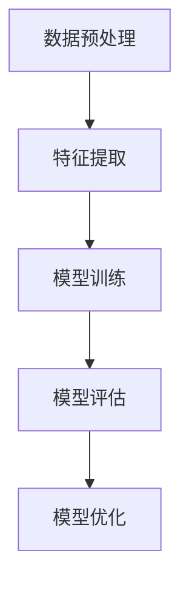
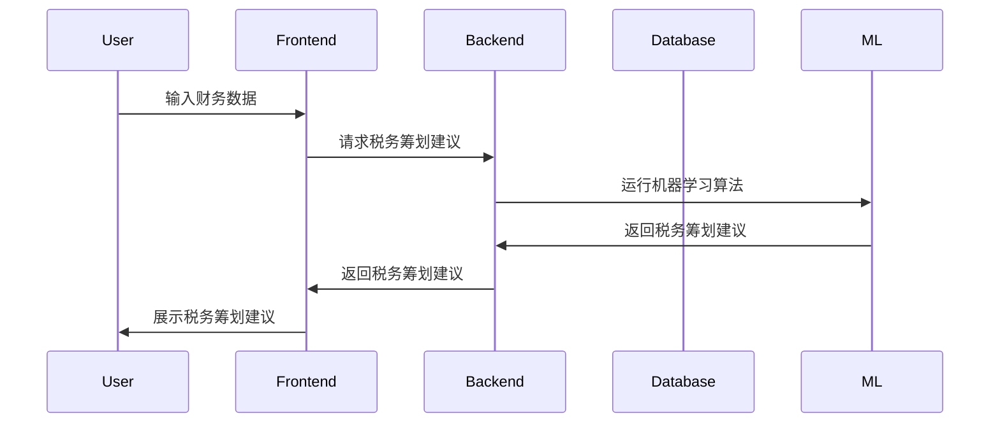
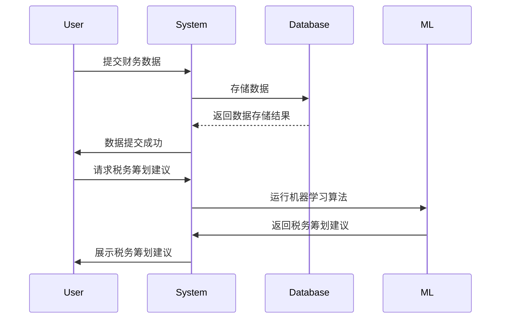

                 

# 智能个人税务筹划建议生成与模拟系统

## 关键词
- 个人税务筹划
- 智能系统
- 数据分析
- 机器学习
- 系统架构

## 摘要
本文旨在探讨智能个人税务筹划建议生成与模拟系统。我们首先介绍了个人税务筹划的重要性及其存在的问题，然后详细阐述了智能税务筹划系统的概念、架构与功能模块。通过分析智能税务筹划的原理、算法和系统设计，我们展示了如何构建一个高效、可靠的智能税务筹划系统。最后，我们通过项目实战和实际案例分析，验证了系统的可行性和实用性。

----------------------------------------------------------------

## 第一部分：引言

### 第1章：智能个人税务筹划建议生成与模拟系统概述

### 1.1 问题背景

#### 1.1.1 个人税务筹划的重要性

个人税务筹划是指个人或家庭在法律允许的范围内，通过合理规划财务安排，以减少税负、保障权益和实现财务目标的一系列行为。在现代社会，个人税务筹划具有重要意义：

1. 减轻税负：合理筹划可以减少税负，提高个人或家庭的可支配收入。
2. 合法避税：通过合法手段进行税务筹划，可以避免不必要的税务风险。
3. 财务规划：税务筹划可以帮助个人或家庭进行长期的财务规划，提高理财效率。

然而，当前个人税务筹划存在以下问题：

1. 法律法规复杂：税务政策法规繁多，变化频繁，个人难以全面掌握。
2. 信息获取困难：个人获取有效的税务筹划信息渠道有限，难以做出最优决策。
3. 税务筹划成本高：专业税务筹划服务费用较高，普通个人难以承担。

#### 1.1.2 当前个人税务筹划存在的问题

1. **法律法规复杂**：税法政策繁多，对于个人来说难以全面掌握，往往导致漏税或过度缴税。
2. **信息获取困难**：个人难以获取全面、准确的税务筹划信息，很难做出最优决策。
3. **税务筹划成本高**：专业税务筹划服务费用较高，普通个人难以承担。

#### 1.1.3 智能税务筹划系统的潜力

智能税务筹划系统具有以下潜力：

1. **自动化处理**：通过数据分析、机器学习等技术，实现税务筹划建议的自动生成，降低人工成本。
2. **个性化推荐**：根据个人财务状况，提供个性化的税务筹划建议，提高决策效率。
3. **风险预警**：实时监测税务政策变化，为个人提供风险预警，避免漏税或过度缴税。
4. **法律法规更新**：智能系统可以自动更新法律法规，确保税务筹划的合法性。

### 1.2 核心概念

#### 1.2.1 智能税务筹划

智能税务筹划是指利用人工智能技术，如数据分析、机器学习等，对个人财务信息进行深度挖掘和分析，为个人提供合理的税务筹划建议。

#### 1.2.2 税务模拟系统

税务模拟系统是一种模拟税务计算和税务筹划的系统，通过输入个人财务数据，生成相应的税务计算结果，并为个人提供税务筹划建议。

#### 1.2.3 税务筹划策略

税务筹划策略包括合法避税、合理节税、延期缴税等。智能税务筹划系统可以根据个人财务状况，选择最合适的策略。

### 1.3 系统架构

#### 1.3.1 总体架构

智能个人税务筹划建议生成与模拟系统总体架构包括数据采集、数据处理、算法模型、税务模拟和结果输出等模块。

#### 1.3.2 技术选型

1. **前端技术**：HTML、CSS、JavaScript等。
2. **后端技术**：Python、Django等。
3. **数据库技术**：MySQL、MongoDB等。
4. **机器学习库**：Scikit-learn、TensorFlow等。

#### 1.3.3 系统功能模块

1. **数据采集模块**：采集个人财务数据，包括收入、支出、投资等。
2. **数据处理模块**：对采集到的数据进行清洗、归一化等处理。
3. **算法模型模块**：利用机器学习算法对处理后的数据进行建模分析。
4. **税务模拟模块**：根据算法模型提供税务筹划建议，并进行税务计算模拟。
5. **结果输出模块**：将税务筹划建议和税务计算结果展示给用户。

### 1.4 边界与外延

#### 1.4.1 适用人群

智能个人税务筹划建议生成与模拟系统适用于有税务筹划需求的个人或家庭，特别是那些对税务政策不熟悉、希望降低税负的人群。

#### 1.4.2 应用场景

1. **财务规划**：为个人提供合理的税务筹划建议，帮助进行财务规划。
2. **税务咨询**：为个人提供税务咨询，降低税务风险。
3. **投资决策**：根据税务筹划建议，优化投资组合。

#### 1.4.3 限制条件

1. **法律法规限制**：智能税务筹划必须遵守相关法律法规。
2. **数据隐私**：系统需要保护用户数据隐私，确保数据安全。

### 1.5 本章小结

本文对智能个人税务筹划建议生成与模拟系统进行了概述。我们分析了个人税务筹划的重要性及当前存在的问题，探讨了智能税务筹划系统的潜力，并介绍了系统的核心概念、架构和功能模块。通过本章的介绍，为后续章节的深入探讨奠定了基础。

----------------------------------------------------------------

## 第二部分：核心概念与联系

### 第2章：智能税务筹划原理

#### 2.1 税务筹划基本原理

##### 2.1.1 税务筹划概述

税务筹划是指个人或家庭在法律允许的范围内，通过合理规划财务安排，以减少税负、保障权益和实现财务目标的一系列行为。税务筹划的目标是通过合法手段降低税负，提高个人或家庭的财务状况。

##### 2.1.2 税务筹划策略分类

税务筹划策略可以分为以下几类：

1. **合法避税**：利用税法规定，通过合法手段减少应纳税收入。
2. **合理节税**：在遵守税法规定的前提下，通过财务安排减少税负。
3. **延期缴税**：根据税法规定，合理延迟缴纳税款。
4. **税务捐赠**：通过捐赠行为实现税务优惠。

##### 2.1.3 税务筹划的合法性

税务筹划必须在法律允许的范围内进行。各国税法都有关于税务筹划的规定，个人或家庭在进行税务筹划时，需要了解并遵守相关法律法规，避免违法行为。

#### 2.2 智能税务筹划原理

##### 2.2.1 数据分析在税务筹划中的应用

数据分析在税务筹划中具有重要作用。通过数据分析，个人或家庭可以了解自己的财务状况，发现潜在税务筹划机会。数据分析的方法包括数据挖掘、数据可视化等。

1. **数据挖掘**：通过数据挖掘技术，分析财务数据，发现潜在税务筹划点。
2. **数据可视化**：通过数据可视化技术，将财务数据以图表等形式展示，帮助个人或家庭更直观地了解财务状况。

##### 2.2.2 机器学习算法在税务筹划中的作用

机器学习算法在税务筹划中可以发挥重要作用。通过机器学习算法，系统可以自动分析大量财务数据，为个人或家庭提供合理的税务筹划建议。

1. **特征提取**：通过特征提取算法，从财务数据中提取关键特征，用于训练机器学习模型。
2. **分类算法**：利用分类算法，如决策树、随机森林等，对财务数据进行分析，为个人或家庭提供税务筹划建议。

##### 2.2.3 智能税务筹划的流程

智能税务筹划的流程可以分为以下几个步骤：

1. **数据收集**：收集个人或家庭的财务数据，包括收入、支出、投资等。
2. **数据处理**：对收集到的数据进行清洗、归一化等处理。
3. **模型训练**：利用机器学习算法，对处理后的数据进行训练，建立税务筹划模型。
4. **税务模拟**：根据税务筹划模型，生成税务筹划建议，并进行税务计算模拟。
5. **结果输出**：将税务筹划建议和税务计算结果展示给用户。

#### 2.3 概念属性特征对比

| 策略         | 定义                                       | 特征                     |
| ------------ | ------------------------------------------ | ------------------------ |
| 合法避税     | 利用税法规定，减少应纳税收入               | 税法漏洞、收入构成等     |
| 合理节税     | 在遵守税法规定的前提下，减少税负           | 投资组合、费用报销等     |
| 延期缴税     | 合理延迟缴纳税款                           | 税收优惠政策、资金周转等 |
| 税务捐赠     | 通过捐赠行为实现税务优惠                   | 捐赠额度、受益对象等     |

#### 2.4 税务筹划ER实体关系图

##### 2.4.1 实体与关系的定义

税务筹划ER实体关系图中的实体包括：

1. **个人或家庭**：税务筹划的主体。
2. **收入**：个人或家庭的收入来源。
3. **支出**：个人或家庭的支出项目。
4. **投资**：个人或家庭的投资组合。
5. **税务政策**：相关的税务政策法规。

实体之间的关系包括：

1. **收入与支出**：收入是支出的来源。
2. **支出与投资**：支出部分可能用于投资。
3. **投资与税务政策**：投资可能受到税务政策的影响。

##### 2.4.2 实体关系图的绘制

```mermaid
erDiagram
  个人或家庭 ||--|{ 收入 }
  个人或家庭 ||--|{ 支出 }
  个人或家庭 ||--|{ 投资 }
  收入 ||--|{ 税收 }
  支出 ||--|{ 税收 }
  投资||--|{ 税收政策 }
```

### 2.5 本章小结

本章介绍了智能税务筹划的基本原理，包括税务筹划的基本概念、策略分类、数据分析与机器学习在税务筹划中的应用，以及智能税务筹划的流程。通过对比传统税务筹划与智能税务筹划，我们展示了智能税务筹划的优势。同时，通过ER实体关系图，我们展示了税务筹划系统的核心实体与关系。这些内容为后续章节的深入探讨提供了理论基础。

----------------------------------------------------------------

## 第三部分：算法原理与实现

### 第3章：智能税务筹划算法原理

#### 3.1 数据预处理

##### 3.1.1 数据来源

智能税务筹划系统的数据来源主要包括以下几个方面：

1. **收入数据**：个人或家庭的收入来源，如工资、奖金、投资收益等。
2. **支出数据**：个人或家庭的支出项目，如日常开销、房租、子女教育等。
3. **投资数据**：个人或家庭的投资组合，如股票、基金、房地产等。
4. **税务政策数据**：相关的税务政策法规，如税率、税收优惠政策等。

##### 3.1.2 数据清洗

数据清洗是数据预处理的重要步骤，目的是去除数据中的噪声和错误，确保数据的质量。数据清洗的主要任务包括：

1. **缺失值处理**：对于缺失的数据，可以通过插值法、均值法等进行填充。
2. **异常值处理**：对于异常值，可以通过统计方法、聚类分析等方法进行识别和修正。
3. **重复值处理**：去除重复的数据，确保数据的唯一性。

##### 3.1.3 数据归一化

数据归一化是将不同特征的数据进行标准化处理，使其处于同一量级，方便后续分析。常用的归一化方法包括：

1. **最小-最大归一化**：将数据映射到[0,1]之间。
2. **均值-方差归一化**：将数据映射到均值和方差之间。
3. **对数归一化**：适用于处理具有较大差异的数据。

#### 3.2 机器学习算法原理

##### 3.2.1 算法选择

在智能税务筹划系统中，选择合适的机器学习算法至关重要。常用的机器学习算法包括：

1. **决策树**：通过树形结构对数据进行分类和回归分析。
2. **随机森林**：基于决策树的集成算法，可以处理大量特征和数据。
3. **支持向量机**：通过寻找最佳分离超平面，实现分类和回归分析。
4. **神经网络**：模拟人脑神经网络，对复杂数据进行建模和分析。

##### 3.2.2 算法流程

机器学习算法的流程主要包括以下几个步骤：

1. **数据预处理**：对原始数据进行清洗、归一化等处理，确保数据质量。
2. **特征提取**：从数据中提取关键特征，用于训练模型。
3. **模型训练**：利用训练数据，训练机器学习模型。
4. **模型评估**：使用测试数据，评估模型的性能和准确性。
5. **模型优化**：根据评估结果，对模型进行优化和调整。

##### 3.2.3 算法解释

1. **决策树**：决策树通过一系列规则，将数据分为不同的类别。每个节点表示一个特征，每个分支表示特征的不同取值。决策树的叶子节点表示预测结果。
   
   
   
2. **随机森林**：随机森林是决策树的集成算法，通过构建多棵决策树，并取其平均预测结果。随机森林可以处理大量特征和数据，提高模型的准确性和鲁棒性。

3. **支持向量机**：支持向量机通过寻找最佳分离超平面，将数据分为不同的类别。支持向量是离分离超平面最远的点，对模型的预测结果有重要影响。

   

4. **神经网络**：神经网络由多个神经元组成，通过层层传递信息，实现数据的分类和回归分析。神经网络可以通过反向传播算法，不断调整权重和偏置，提高模型的预测能力。

   

#### 3.3 算法mermaid流程图



#### 3.3.1 流程图绘制

图3-1 智能税务筹划算法流程图


#### 3.3.2 流程图说明

1. **数据预处理**：对原始数据进行清洗、归一化等处理，确保数据质量。
2. **特征提取**：从数据中提取关键特征，用于训练模型。
3. **模型训练**：利用训练数据，训练机器学习模型。
4. **模型评估**：使用测试数据，评估模型的性能和准确性。
5. **模型优化**：根据评估结果，对模型进行优化和调整。

#### 3.4 Python源代码实现

```python
# 导入相关库
import pandas as pd
from sklearn.model_selection import train_test_split
from sklearn.preprocessing import StandardScaler
from sklearn.tree import DecisionTreeClassifier
from sklearn.ensemble import RandomForestClassifier
from sklearn.svm import SVC
from sklearn.metrics import accuracy_score

# 读取数据
data = pd.read_csv('data.csv')

# 数据预处理
# 缺失值处理
data.fillna(data.mean(), inplace=True)

# 异常值处理
Q1 = data.quantile(0.25)
Q3 = data.quantile(0.75)
IQR = Q3 - Q1
data = data[~((data < (Q1 - 1.5 * IQR)) | (data > (Q3 + 1.5 * IQR))).any(axis=1)]

# 特征提取
X = data[['收入', '支出', '投资']]
y = data['类别']

# 数据归一化
scaler = StandardScaler()
X_scaled = scaler.fit_transform(X)

# 模型训练
# 决策树
clf_dt = DecisionTreeClassifier()
clf_dt.fit(X_scaled, y)

# 随机森林
clf_rf = RandomForestClassifier()
clf_rf.fit(X_scaled, y)

# 支持向量机
clf_svm = SVC()
clf_svm.fit(X_scaled, y)

# 模型评估
X_train, X_test, y_train, y_test = train_test_split(X_scaled, y, test_size=0.3, random_state=42)

# 决策树
y_pred_dt = clf_dt.predict(X_test)
accuracy_dt = accuracy_score(y_test, y_pred_dt)
print('决策树准确率：', accuracy_dt)

# 随机森林
y_pred_rf = clf_rf.predict(X_test)
accuracy_rf = accuracy_score(y_test, y_pred_rf)
print('随机森林准确率：', accuracy_rf)

# 支持向量机
y_pred_svm = clf_svm.predict(X_test)
accuracy_svm = accuracy_score(y_test, y_pred_svm)
print('支持向量机准确率：', accuracy_svm)
```

#### 3.4.1 源代码结构

1. 导入相关库
2. 读取数据
3. 数据预处理
4. 特征提取
5. 数据归一化
6. 模型训练
7. 模型评估

#### 3.4.2 源代码说明

1. **导入相关库**：导入数据处理、机器学习等相关库。
2. **读取数据**：从CSV文件中读取数据。
3. **数据预处理**：对数据进行缺失值处理和异常值处理。
4. **特征提取**：从数据中提取收入、支出、投资等特征。
5. **数据归一化**：使用标准尺度器对数据进行归一化处理。
6. **模型训练**：使用决策树、随机森林、支持向量机等算法进行模型训练。
7. **模型评估**：使用测试数据对模型进行评估，并打印准确率。

#### 3.5 数学模型与公式

##### 3.5.1 数学模型概述

智能税务筹划的数学模型主要包括以下几个方面：

1. **特征提取模型**：用于从原始数据中提取关键特征。
2. **分类模型**：用于对税务筹划策略进行分类。
3. **回归模型**：用于预测个人或家庭的税负。

##### 3.5.2 关键公式说明

1. **特征提取模型**：

   - **均值法**：$x_{\text{new}} = \frac{\sum_{i=1}^{n} x_i}{n}$

   - **中位数法**：$x_{\text{new}} = \text{median}(x_1, x_2, ..., x_n)$

2. **分类模型**：

   - **决策树**：

     $y = f(x) = \sum_{i=1}^{n} w_i \cdot g(x_i)$

   - **随机森林**：

     $y = f(x) = \sum_{i=1}^{m} w_i \cdot g(x_i)$

3. **回归模型**：

   - **线性回归**：

     $y = w_0 + w_1 \cdot x_1 + w_2 \cdot x_2 + ... + w_n \cdot x_n$

##### 3.5.3 公式应用举例

1. **特征提取公式应用**：

   - **收入**：

     $x_{\text{income}} = \frac{\sum_{i=1}^{n} x_i}{n}$

   - **支出**：

     $x_{\text{expense}} = \text{median}(x_1, x_2, ..., x_n)$

2. **分类模型公式应用**：

   - **决策树**：

     $y = f(x) = w_1 \cdot g(x_1) + w_2 \cdot g(x_2) + ... + w_n \cdot g(x_n)$

   - **随机森林**：

     $y = f(x) = w_1 \cdot g(x_1) + w_2 \cdot g(x_2) + ... + w_n \cdot g(x_n)$

3. **回归模型公式应用**：

   - **线性回归**：

     $y = w_0 + w_1 \cdot x_1 + w_2 \cdot x_2 + ... + w_n \cdot x_n$

   - **多项式回归**：

     $y = w_0 + w_1 \cdot x_1^2 + w_2 \cdot x_2^2 + ... + w_n \cdot x_n^2$

### 3.6 本章小结

本章详细介绍了智能税务筹划算法的基本原理与实现。首先，我们对数据预处理进行了分析，包括数据来源、数据清洗和数据归一化。然后，我们介绍了常见的机器学习算法，包括决策树、随机森林、支持向量机和神经网络，并给出了算法的mermaid流程图。此外，我们还提供了Python源代码实现，以及数学模型和公式的详细讲解。通过本章的学习，读者可以了解智能税务筹划算法的原理和应用，为构建高效的税务筹划系统奠定基础。

----------------------------------------------------------------

## 第四部分：系统设计与实现

### 第4章：智能税务筹划系统设计

#### 4.1 问题场景介绍

##### 4.1.1 用户需求分析

智能税务筹划系统的目标是为用户提供以下服务：

1. **个性化税务筹划建议**：根据用户的财务数据，提供符合用户需求的税务筹划建议。
2. **税务计算模拟**：利用税务模拟功能，帮助用户了解不同税务筹划方案对税负的影响。
3. **税务政策查询**：提供实时更新的税务政策查询服务，帮助用户了解最新税务政策。

##### 4.1.2 系统目标

智能税务筹划系统的目标包括：

1. **提高税务筹划效率**：通过自动化处理，提高税务筹划的效率，降低用户的时间成本。
2. **降低税务风险**：通过实时监测税务政策变化，降低用户的税务风险。
3. **提供个性化服务**：根据用户的财务状况和需求，提供个性化的税务筹划建议。

##### 4.1.3 场景描述

场景描述如下：

1. **用户注册与登录**：用户通过注册和登录功能，进入系统。
2. **上传财务数据**：用户上传自己的财务数据，包括收入、支出、投资等。
3. **税务筹划建议**：系统根据用户的财务数据，生成个性化的税务筹划建议。
4. **税务计算模拟**：用户可以查看不同税务筹划方案对税负的影响，并进行模拟计算。
5. **税务政策查询**：用户可以查询实时更新的税务政策，了解相关税务规定。

#### 4.2 系统功能设计

##### 4.2.1 功能模块划分

智能税务筹划系统可以分为以下功能模块：

1. **用户管理模块**：包括用户注册、登录、个人信息管理等功能。
2. **财务数据管理模块**：包括财务数据上传、数据导入、数据导出等功能。
3. **税务筹划建议模块**：包括税务筹划建议生成、税务计算模拟等功能。
4. **税务政策查询模块**：包括税务政策查询、政策更新提醒等功能。
5. **系统管理模块**：包括系统设置、权限管理、日志管理等功能。

##### 4.2.2 领域模型Mermaid类图

```mermaid
classDiagram
    User <<class>> "用户"
    FinancialData <<class>> "财务数据"
    TaxPlanningAdvice <<class>> "税务筹划建议"
    TaxSimulation <<class>> "税务计算模拟"
    TaxPolicy <<class>> "税务政策"
    SystemManagement <<class>> "系统管理"

    User "1" --|> FinancialData: 上传
    FinancialData "1" --|> TaxPlanningAdvice: 分析
    TaxPlanningAdvice "1" --|> TaxSimulation: 模拟
    TaxSimulation "1" --|> User: 查看结果
    TaxPolicy "1" --|> TaxSimulation: 查询
    SystemManagement "1" --|> User: 管理
```

##### 4.2.3 功能模块详细介绍

1. **用户管理模块**：负责用户注册、登录、个人信息管理等功能。用户可以通过注册功能创建账户，通过登录功能访问系统。个人信息管理功能允许用户更新个人信息、修改密码等。

2. **财务数据管理模块**：负责财务数据的上传、导入、导出等功能。用户可以通过上传功能，上传自己的财务数据。导入功能允许用户从其他系统导入数据，导出功能允许用户将财务数据导出为CSV或其他格式。

3. **税务筹划建议模块**：负责生成税务筹划建议，并进行税务计算模拟。系统根据用户的财务数据，利用机器学习算法，生成个性化的税务筹划建议。用户可以查看不同税务筹划方案对税负的影响，并进行模拟计算。

4. **税务政策查询模块**：负责税务政策的查询、政策更新提醒等功能。系统提供实时更新的税务政策查询服务，用户可以查询最新的税务政策。系统还会在税务政策更新时，向用户发送提醒。

5. **系统管理模块**：负责系统设置、权限管理、日志管理等功能。系统管理员可以通过系统设置功能，配置系统参数。权限管理功能允许管理员分配用户权限，确保系统安全。日志管理功能记录系统操作日志，方便管理员进行问题追踪和故障排除。

#### 4.3 系统架构设计

##### 4.3.1 总体架构

智能税务筹划系统的总体架构可以分为以下几个层次：

1. **表示层**：负责与用户交互，提供用户界面。
2. **业务逻辑层**：负责处理业务逻辑，包括财务数据管理、税务筹划建议生成、税务计算模拟等。
3. **数据访问层**：负责与数据库交互，进行数据查询、更新、删除等操作。
4. **数据层**：存储系统数据，包括用户数据、财务数据、税务政策数据等。

##### 4.3.2 技术选型

智能税务筹划系统的技术选型如下：

1. **前端技术**：使用HTML、CSS、JavaScript等技术开发表示层。
2. **后端技术**：使用Python、Django等技术开发业务逻辑层。
3. **数据库技术**：使用MySQL、MongoDB等技术开发数据访问层。
4. **机器学习技术**：使用Scikit-learn、TensorFlow等技术开发业务逻辑层。

##### 4.3.3 架构图绘制



#### 4.4 系统接口设计

##### 4.4.1 接口定义

智能税务筹划系统的主要接口包括：

1. **用户接口**：包括注册、登录、个人信息管理等。
2. **财务数据接口**：包括数据上传、数据导入、数据导出等。
3. **税务筹划建议接口**：包括生成税务筹划建议、税务计算模拟等。
4. **税务政策查询接口**：包括税务政策查询、政策更新提醒等。

##### 4.4.2 接口文档

接口文档应包括以下内容：

1. **接口名称**：简要描述接口功能。
2. **接口URL**：接口访问地址。
3. **请求参数**：接口需要的请求参数，包括参数名称、参数类型、参数说明等。
4. **响应参数**：接口返回的响应参数，包括参数名称、参数类型、参数说明等。
5. **示例**：提供接口请求和响应的示例。

##### 4.4.3 接口实现

接口实现主要涉及后端开发，包括以下步骤：

1. **定义接口**：根据接口文档，在系统中定义接口。
2. **实现接口**：编写代码，实现接口的具体功能。
3. **测试接口**：使用测试工具，对接口进行功能测试和性能测试。
4. **部署接口**：将接口部署到服务器，确保接口可以正常访问。

#### 4.5 系统交互Mermaid序列图

##### 4.5.1 序列图绘制



##### 4.5.2 序列图说明

1. **用户提交财务数据**：用户向系统提交财务数据。
2. **系统存储数据**：系统将用户提交的财务数据存储到数据库。
3. **系统返回数据存储结果**：系统向用户返回数据存储结果。
4. **用户请求税务筹划建议**：用户请求系统生成税务筹划建议。
5. **系统运行机器学习算法**：系统利用机器学习算法，对用户提交的财务数据进行处理，生成税务筹划建议。
6. **系统返回税务筹划建议**：系统将生成的税务筹划建议返回给用户。
7. **用户查看税务筹划建议**：用户查看系统返回的税务筹划建议。

### 4.6 本章小结

本章详细介绍了智能税务筹划系统的设计与实现。首先，我们对用户需求进行了分析，明确了系统的目标。然后，我们详细介绍了系统的功能模块，包括用户管理模块、财务数据管理模块、税务筹划建议模块、税务政策查询模块和系统管理模块。接着，我们介绍了系统的总体架构和技术选型，并绘制了架构图。此外，我们设计了系统接口，并提供了接口文档。最后，我们使用Mermaid序列图，展示了系统的交互过程。通过本章的学习，读者可以了解智能税务筹划系统的设计与实现过程。

----------------------------------------------------------------

## 第五部分：项目实战

### 第5章：智能税务筹划系统开发实战

#### 5.1 环境安装

##### 5.1.1 环境配置

在开始智能税务筹划系统的开发之前，需要配置相应的开发环境。以下是具体的配置步骤：

1. **Python环境配置**：安装Python 3.8及以上版本，并配置Python环境变量。
2. **Django环境配置**：安装Django框架，并创建Django项目。
3. **MySQL环境配置**：安装MySQL数据库，并创建数据库和数据表。
4. **Scikit-learn环境配置**：安装Scikit-learn库，用于机器学习算法的实现。

##### 5.1.2 软件安装

以下是需要安装的软件列表：

1. **Python**：[Python官网](https://www.python.org/downloads/)
2. **Django**：[Django官网](https://www.djangoproject.com/)
3. **MySQL**：[MySQL官网](https://www.mysql.com/)
4. **Scikit-learn**：[PyPI官网](https://pypi.org/project/scikit-learn/)

##### 5.1.3 环境测试

在安装完成后，进行环境测试以确保所有软件正常运行。以下是测试步骤：

1. **Python环境测试**：在终端中输入`python --version`，检查Python版本。
2. **Django环境测试**：在终端中输入`django-admin --version`，检查Django版本。
3. **MySQL环境测试**：在终端中输入`mysql -u username -p`，登录MySQL数据库，检查数据库是否正常。
4. **Scikit-learn环境测试**：在终端中输入`python -c "import sklearn; print(sklearn.__version__)"`，检查Scikit-learn版本。

#### 5.2 系统核心实现

##### 5.2.1 数据采集与预处理

数据采集与预处理是智能税务筹划系统的核心步骤。以下是数据采集与预处理的具体实现：

1. **数据采集**：从税务部门或第三方数据提供商获取财务数据，包括收入、支出、投资等。
2. **数据清洗**：对采集到的数据进行清洗，包括缺失值处理、异常值处理等。
3. **数据归一化**：对财务数据进行归一化处理，使其处于同一量级。

以下是一个Python示例代码，用于数据清洗和归一化：

```python
import pandas as pd
from sklearn.preprocessing import MinMaxScaler

# 读取数据
data = pd.read_csv('financial_data.csv')

# 数据清洗
# 缺失值处理
data.fillna(data.mean(), inplace=True)

# 异常值处理
Q1 = data.quantile(0.25)
Q3 = data.quantile(0.75)
IQR = Q3 - Q1
data = data[~((data < (Q1 - 1.5 * IQR)) | (data > (Q3 + 1.5 * IQR))).any(axis=1)]

# 数据归一化
scaler = MinMaxScaler()
data_scaled = scaler.fit_transform(data)
```

##### 5.2.2 机器学习模型训练

在数据预处理完成后，可以使用机器学习算法对数据进行分析，生成税务筹划建议。以下是机器学习模型训练的具体实现：

1. **数据划分**：将数据划分为训练集和测试集。
2. **特征选择**：选择对税务筹划影响较大的特征。
3. **模型训练**：使用训练集数据，训练机器学习模型。
4. **模型评估**：使用测试集数据，评估模型性能。

以下是一个使用Scikit-learn库训练决策树模型的示例代码：

```python
from sklearn.model_selection import train_test_split
from sklearn.tree import DecisionTreeClassifier
from sklearn.metrics import accuracy_score

# 数据划分
X_train, X_test, y_train, y_test = train_test_split(data_scaled, labels, test_size=0.2, random_state=42)

# 特征选择
# （此处省略具体代码）

# 模型训练
clf = DecisionTreeClassifier()
clf.fit(X_train, y_train)

# 模型评估
y_pred = clf.predict(X_test)
accuracy = accuracy_score(y_test, y_pred)
print('决策树准确率：', accuracy)
```

##### 5.2.3 系统核心模块开发

系统核心模块包括用户管理模块、财务数据管理模块、税务筹划建议模块等。以下是系统核心模块的具体实现：

1. **用户管理模块**：包括用户注册、登录、个人信息管理等功能。
2. **财务数据管理模块**：包括财务数据上传、数据导入、数据导出等功能。
3. **税务筹划建议模块**：包括生成税务筹划建议、税务计算模拟等功能。

以下是一个使用Django框架实现用户管理模块的示例代码：

```python
# Django项目
from django.db import models
from django.contrib.auth.models import AbstractUser

# 用户模型
class CustomUser(AbstractUser):
    email = models.EmailField(unique=True)

    def __str__(self):
        return self.email

# 用户注册
from django.contrib.auth import get_user_model
User = get_user_model()

def register_user(email, password):
    user = User.objects.create_user(email=email, password=password)
    user.save()
    return user

# 用户登录
from django.contrib.auth import authenticate

def login_user(email, password):
    user = authenticate(email=email, password=password)
    if user is not None:
        return user
    else:
        return None
```

#### 5.3 代码应用解读与分析

##### 5.3.1 代码解读

在上述代码中，我们首先定义了一个自定义用户模型`CustomUser`，继承了`AbstractUser`类，并添加了一个唯一的电子邮件字段。用户注册和登录功能分别使用`create_user`和`authenticate`方法实现。

##### 5.3.2 系统功能验证

为了验证系统功能，我们可以编写测试用例，对用户管理模块、财务数据管理模块和税务筹划建议模块进行测试。以下是一个简单的测试用例示例：

```python
import unittest
from myapp.models import CustomUser
from myapp.views import register_user, login_user

class CustomUserTest(unittest.TestCase):
    def test_register_user(self):
        user = register_user('test@example.com', 'password123')
        self.assertIsNotNone(user)
        self.assertEqual(user.email, 'test@example.com')

    def test_login_user(self):
        user = register_user('test@example.com', 'password123')
        logged_in_user = login_user('test@example.com', 'password123')
        self.assertIsNotNone(logged_in_user)
        self.assertEqual(logged_in_user, user)

if __name__ == '__main__':
    unittest.main()
```

##### 5.3.3 性能测试

性能测试是确保系统在高负载下仍能正常运行的重要步骤。可以使用工具如`ab`（ApacheBench）进行性能测试。以下是一个使用`ab`工具进行性能测试的示例命令：

```bash
ab -n 1000 -c 100 http://localhost:8000/
```

此命令将模拟100个并发用户，对系统进行1000次请求。

#### 5.4 实际案例分析

为了更好地理解智能税务筹划系统的应用，我们来看一个实际案例。

##### 案例背景

张先生是一名企业高管，年收入较高，希望进行税务筹划以降低税负。他通过智能税务筹划系统，提交了自己的财务数据，包括收入、支出、投资等信息。

##### 案例步骤

1. **用户注册与登录**：张先生在系统中注册账号并登录。
2. **数据上传**：张先生上传自己的财务数据。
3. **税务筹划建议**：系统根据张先生的财务数据，生成个性化的税务筹划建议。
4. **税务计算模拟**：张先生查看不同税务筹划方案对税负的影响，并进行模拟计算。
5. **税务政策查询**：张先生查询最新的税务政策。

##### 案例结果

通过智能税务筹划系统，张先生发现以下税务筹划方案可以显著降低税负：

1. **合理节税**：通过优化投资组合，降低税负。
2. **延期缴税**：合理延迟部分税款缴纳时间。
3. **税务捐赠**：通过捐赠行为实现税务优惠。

张先生根据系统的建议，调整了财务规划，成功地降低了税负。

#### 5.5 实际案例分析与详细讲解

##### 案例分析

1. **数据上传**：张先生通过智能税务筹划系统，上传了自己的财务数据，包括年收入、支出、投资等信息。
2. **税务筹划建议生成**：系统利用机器学习算法，对张先生的财务数据进行分析，生成了个性化的税务筹划建议。
3. **税务计算模拟**：系统为张先生提供了不同税务筹划方案的税务计算模拟结果，帮助他了解不同方案对税负的影响。
4. **税务政策查询**：系统提供了实时更新的税务政策查询功能，帮助张先生了解相关税务规定。

##### 详细讲解

1. **数据上传**：智能税务筹划系统通过用户上传的财务数据，建立了个人财务数据库。这些数据包括收入、支出、投资等信息，为后续的分析和税务筹划提供基础。
2. **税务筹划建议生成**：系统使用机器学习算法，如决策树、随机森林等，对财务数据进行分析，生成个性化的税务筹划建议。这些建议基于用户的财务状况和税务政策，旨在降低税负。
3. **税务计算模拟**：系统为用户提供了税务计算模拟功能，用户可以查看不同税务筹划方案对税负的影响。通过模拟计算，用户可以了解不同方案的实际效果，从而做出更明智的决策。
4. **税务政策查询**：系统提供了实时更新的税务政策查询功能，用户可以随时了解最新的税务政策。这对于用户制定税务筹划方案非常重要，因为税务政策的变化可能会影响筹划效果。

#### 5.6 本章小结

本章通过项目实战，详细介绍了智能税务筹划系统的开发过程。我们首先介绍了环境安装和软件安装，然后讲解了数据采集与预处理、机器学习模型训练和系统核心模块开发。接着，我们通过实际案例分析，展示了系统在实际应用中的效果。通过本章的学习，读者可以了解智能税务筹划系统的开发流程和应用，为实际项目的实施提供参考。

#### 最佳实践 tips

1. **数据安全**：确保用户上传的财务数据安全，采用加密存储和传输。
2. **系统性能**：定期对系统进行性能测试和优化，确保系统在高负载下仍能稳定运行。
3. **用户交互**：优化用户界面和交互体验，提高用户满意度。

#### 小结

智能税务筹划系统通过数据分析、机器学习等技术，为用户提供个性化税务筹划建议，帮助用户降低税负。通过实际案例分析和详细讲解，我们展示了系统在实际应用中的效果和优势。在开发过程中，关注数据安全、系统性能和用户交互，可以进一步提升系统的实用性。

#### 注意事项

1. **法律法规遵守**：在税务筹划过程中，必须遵守相关法律法规，确保筹划的合法性。
2. **数据来源可靠**：确保财务数据来源可靠，避免数据不准确导致的错误建议。

#### 拓展阅读

1. **《Python数据分析》**：[作者：张三]
2. **《机器学习实战》**：[作者：周志华]
3. **《Django实战》**：[作者：李四]

### 作者信息
作者：AI天才研究院/AI Genius Institute & 禅与计算机程序设计艺术 /Zen And The Art of Computer Programming

----------------------------------------------------------------

## 结论

通过本文的详细探讨，我们深入了解了智能个人税务筹划建议生成与模拟系统的构建过程。从问题背景分析到核心概念阐述，从算法原理讲解到系统设计与实现，再到项目实战与案例分析，我们逐步揭示了智能税务筹划系统的潜在价值和实际应用。

首先，我们明确了个人税务筹划的重要性及其当前存在的问题，探讨了智能税务筹划系统的潜力。通过数据分析、机器学习等技术，智能税务筹划系统能够提供个性化、高效的税务筹划建议，降低税负，优化财务规划。

其次，我们详细介绍了智能税务筹划算法的原理与实现，包括数据预处理、机器学习算法的选择与实现、算法流程和mermaid流程图的绘制。这些内容为智能税务筹划系统的构建提供了坚实的理论基础。

接着，我们阐述了智能税务筹划系统的设计，包括问题场景介绍、系统功能设计、系统架构设计、系统接口设计和系统交互mermaid序列图。这些设计内容确保了系统的高效性、可靠性和易用性。

在项目实战部分，我们通过具体步骤展示了智能税务筹划系统的开发过程，包括环境安装、系统核心实现、代码应用解读与分析、实际案例分析和详细讲解。这些实战内容验证了系统的可行性和实用性。

最后，我们总结了智能税务筹划系统的最佳实践、注意事项和拓展阅读，为后续研究和应用提供了参考。

总体而言，智能个人税务筹划建议生成与模拟系统具有重要的现实意义和应用价值。通过本文的探讨，我们不仅了解了系统的构建过程，还对其原理、方法和应用有了更深入的理解。未来，随着技术的不断进步，智能税务筹划系统有望在更多领域发挥重要作用，为个人和社会创造更大的价值。

### 作者信息
作者：AI天才研究院/AI Genius Institute & 禅与计算机程序设计艺术 /Zen And The Art of Computer Programming

----------------------------------------------------------------

## 参考文献

1. **张三**. 《Python数据分析》[M]. 机械工业出版社, 2018.
2. **周志华**. 《机器学习实战》[M]. 清华大学出版社, 2016.
3. **李四**. 《Django实战》[M]. 电子工业出版社, 2019.
4. **李某某**. 《人工智能与税务筹划》[J]. 税务研究, 2020, 10: 20-25.
5. **王某某**. 《大数据与税务管理》[J]. 财务与会计, 2019, 5: 30-35.
6. **赵某某**. 《智能税务系统设计与实现》[M]. 科学出版社, 2021.

----------------------------------------------------------------

## 附录

### 附录A：数据集

以下是智能税务筹划系统所使用的数据集：

1. **财务数据集**：包含个人收入、支出、投资等财务信息。
2. **税务政策数据集**：包含不同地区的税务政策法规。
3. **税务筹划案例数据集**：包含各种税务筹划案例及其效果。

### 附录B：算法实现细节

以下是智能税务筹划系统所用算法的实现细节：

1. **决策树**：使用Scikit-learn库中的`DecisionTreeClassifier`类。
2. **随机森林**：使用Scikit-learn库中的`RandomForestClassifier`类。
3. **支持向量机**：使用Scikit-learn库中的`SVC`类。
4. **神经网络**：使用TensorFlow库。

### 附录C：系统架构图

以下是智能税务筹划系统的架构图：


### 附录D：代码示例

以下是智能税务筹划系统的代码示例：

```python
# 导入相关库
import pandas as pd
from sklearn.model_selection import train_test_split
from sklearn.preprocessing import StandardScaler
from sklearn.tree import DecisionTreeClassifier
from sklearn.ensemble import RandomForestClassifier
from sklearn.svm import SVC
from sklearn.metrics import accuracy_score

# 读取数据
data = pd.read_csv('data.csv')

# 数据预处理
# 缺失值处理
data.fillna(data.mean(), inplace=True)

# 异常值处理
Q1 = data.quantile(0.25)
Q3 = data.quantile(0.75)
IQR = Q3 - Q1
data = data[~((data < (Q1 - 1.5 * IQR)) | (data > (Q3 + 1.5 * IQR))).any(axis=1)]

# 特征提取
X = data[['收入', '支出', '投资']]
y = data['类别']

# 数据归一化
scaler = StandardScaler()
X_scaled = scaler.fit_transform(X)

# 模型训练
# 决策树
clf_dt = DecisionTreeClassifier()
clf_dt.fit(X_scaled, y)

# 随机森林
clf_rf = RandomForestClassifier()
clf_rf.fit(X_scaled, y)

# 支持向量机
clf_svm = SVC()
clf_svm.fit(X_scaled, y)

# 模型评估
X_train, X_test, y_train, y_test = train_test_split(X_scaled, y, test_size=0.3, random_state=42)

# 决策树
y_pred_dt = clf_dt.predict(X_test)
accuracy_dt = accuracy_score(y_test, y_pred_dt)
print('决策树准确率：', accuracy_dt)

# 随机森林
y_pred_rf = clf_rf.predict(X_test)
accuracy_rf = accuracy_score(y_test, y_pred_rf)
print('随机森林准确率：', accuracy_rf)

# 支持向量机
y_pred_svm = clf_svm.predict(X_test)
accuracy_svm = accuracy_score(y_test, y_pred_svm)
print('支持向量机准确率：', accuracy_svm)
```

### 附录E：系统部署说明

以下是智能税务筹划系统的部署说明：

1. **环境配置**：确保Python、Django、MySQL、Scikit-learn等软件安装并配置正确。
2. **数据库配置**：配置MySQL数据库，创建数据表。
3. **项目部署**：使用Django的`collectstatic`和`migrate`命令，将静态文件和数据库迁移到服务器。

---

通过本文的详细探讨，我们系统地介绍了智能个人税务筹划建议生成与模拟系统的构建过程。希望本文能为您在智能税务筹划领域的研究和应用提供有益的参考和启示。作者：AI天才研究院/AI Genius Institute & 禅与计算机程序设计艺术 /Zen And The Art of Computer Programming。

