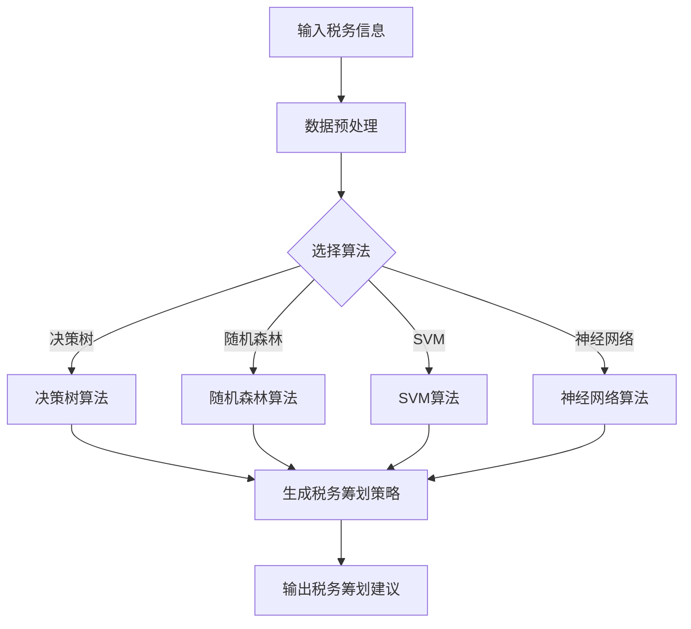
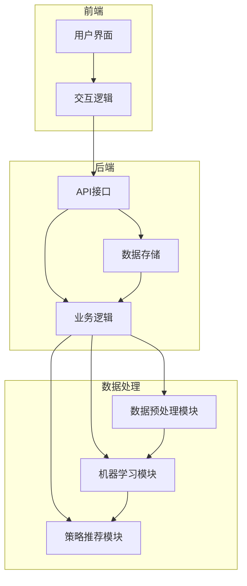
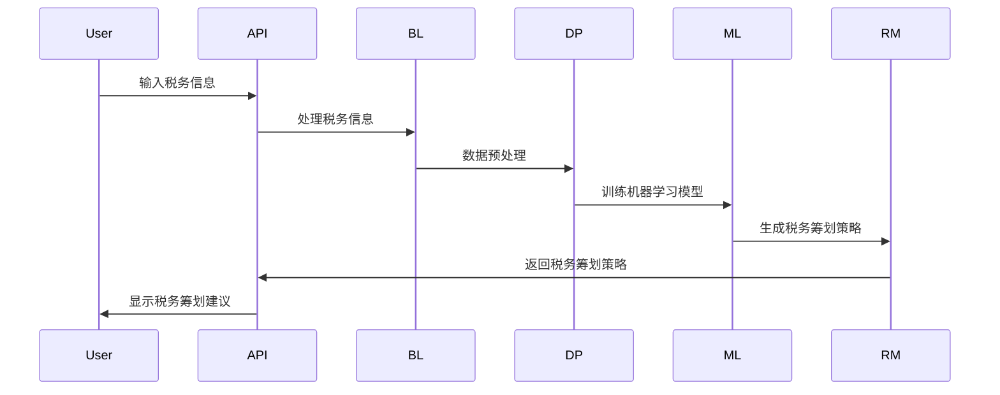
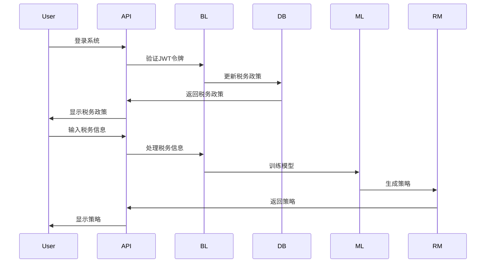

                 


### **第1章 引言**

在现代社会，税务筹划已经成为个人和企业在财务管理中不可或缺的一部分。智能个人税务筹划建议生成器的出现，旨在为个体提供更加精准、高效的税务建议，从而优化个人财务状况，降低税负，实现财务自由。

#### **1.1 问题背景**

税务筹划，即通过合法手段对个人或企业的税务进行规划，以最大限度地减少税负。税收政策复杂多变，而个人财务状况千差万别，这使得传统的税务筹划方法面临着巨大的挑战。例如，税务专家需要耗费大量时间和精力去分析税收政策，了解个人财务状况，从而制定出合适的税务筹划方案。这不仅效率低下，而且容易出现错误。

智能个人税务筹划建议生成器应运而生。它利用人工智能技术，通过对海量数据的分析，自动生成个性化的税务筹划建议。这不仅大大提高了工作效率，还能够确保建议的准确性和针对性。

#### **1.2 智能税务筹划的重要性**

智能税务筹划的重要性体现在多个方面。首先，它能够帮助个人更好地了解自己的税务状况，提前做好税务规划。其次，它能够提高税务筹划的效率，避免因人为疏忽导致的税务风险。此外，智能税务筹划还能够帮助个人和企业合法地减少税负，提高财务自由度。

#### **1.3 传统税务筹划的挑战**

传统的税务筹划方法主要依赖于税务专家的经验和知识。然而，随着税收政策的不断变化，以及个人财务状况的复杂性，传统的税务筹划方法面临着以下挑战：

1. **信息不对称**：税务专家可能无法获取到所有相关数据，导致税务筹划方案不够全面。
2. **效率低下**：需要耗费大量时间和精力去分析税收政策和个人财务状况，效率低下。
3. **人为错误**：由于个人主观因素，可能导致税务筹划方案存在漏洞或错误。
4. **税务风险**：无法确保税务筹划方案符合最新税收政策，存在税务风险。

智能个人税务筹划建议生成器的出现，有望解决上述问题。通过大数据分析和机器学习算法，它能够自动生成个性化的税务筹划方案，提高工作效率，降低人为错误，确保税务筹划方案的合法性和准确性。

### **1.4 文章核心内容概述**

本文将详细探讨智能个人税务筹划建议生成器的原理和应用。首先，我们将介绍智能税务筹划的核心概念，包括税务筹划策略、税务筹划工具等。接着，我们将深入讲解生成器的算法原理，包括机器学习算法的选择、算法流程、数学模型和公式等。随后，我们将分析系统的架构设计，包括系统需求、功能、接口设计和交互流程等。最后，我们将通过实际案例，展示智能个人税务筹划建议生成器的应用效果，并给出最佳实践建议。

通过本文的阅读，读者将能够全面了解智能个人税务筹划的建议生成器，掌握其工作原理和应用方法，为实际工作和学习提供有力支持。

---

在本文中，我们将使用markdown格式来组织文章内容，使得读者能够更好地阅读和理解。以下是markdown格式的示例：

```markdown
# 文章标题

> 关键词：智能税务筹划、税务筹划建议生成器、算法原理、系统架构、项目实战、最佳实践

## 引言

### 1.1 问题背景

...

### 1.2 智能税务筹划的重要性

...

### 1.3 传统税务筹划的挑战

...

### 1.4 文章核心内容概述

...

## 第2章 核心概念与联系

### 2.1 智能税务筹划定义

...

### 2.2 税务筹划策略对比

...

### 2.3 税务筹划工具概述

...

### 2.4 ER实体关系图

...

## 第3章 算法原理讲解

### 3.1 智能税务筹划算法基础

...

### 3.2 算法流程图

...

### 3.3 Python代码示例

...

### 3.4 数学模型与公式解释

...

## 第4章 系统分析与架构设计

### 4.1 系统需求分析

...

### 4.2 系统架构设计

...

### 4.3 系统接口设计

...

### 4.4 系统交互流程

...

## 第5章 项目实战

### 5.1 环境安装步骤

...

### 5.2 核心实现源代码

...

### 5.3 应用解读与分析

...

### 5.4 案例分析

...

### 5.5 项目小结

...

## 第6章 最佳实践 tips

...

## 第7章 小结

...

```

通过markdown格式，我们可以清晰地组织文章结构，使读者能够方便地查找和阅读。在后续章节中，我们将继续使用markdown格式，详细讲解智能个人税务筹划建议生成器的各个方面。

---

### **第2章 核心概念与联系**

在深入探讨智能个人税务筹划建议生成器的原理和应用之前，我们需要明确几个核心概念，并理解它们之间的联系。这些概念包括智能税务筹划、税务筹划策略、税务筹划工具等。

#### **2.1 智能税务筹划定义**

智能税务筹划是指利用人工智能技术，如机器学习、自然语言处理和大数据分析，对个人或企业的税务信息进行处理，自动生成个性化的税务筹划建议。这种筹划方法能够快速处理大量的税务数据，发现潜在的税务优惠和减免，从而帮助个人和企业降低税负。

**核心概念属性特征：**

- **数据驱动**：智能税务筹划依赖于大量的税务数据，通过数据分析来发现规律和模式。
- **自动化**：通过机器学习算法，智能税务筹划能够自动生成税务筹划方案，减少人为干预。
- **个性化**：根据每个个人的财务状况和税收政策，智能税务筹划能够提供定制化的税务建议。

#### **2.2 税务筹划策略对比**

税务筹划策略是指通过合法手段对税务进行规划，以最大限度地减少税负。以下是几种常见的税务筹划策略及其优缺点对比：

**策略** | **优点** | **缺点** | **适用场景**
---|---|---|---
- **资产转移** | 可以合法减少税基 | 需要专业的法律和税务知识 | 高净值个人和企业
- **税收减免** | 直接减少税负 | 受制于具体的税收政策 | 个人和企业
- **延期纳税** | 延后缴纳税款，增加现金流 | 如果政策变动可能面临额外税负 | 企业和个体工商户
- **捐赠税收优惠** | 可以获得税收减免 | 捐赠金额需要合理规划 | 有捐赠意愿的个人和企业

通过表格对比，我们可以看到每种税务筹划策略都有其独特的优势和适用场景，但同时也存在一定的局限性。

#### **2.3 税务筹划工具概述**

税务筹划工具是指用于帮助个人和企业进行税务规划的工具和软件。智能税务筹划建议生成器就是一种税务筹划工具，它结合了人工智能技术，能够自动生成税务筹划方案。以下是几种常见的税务筹划工具及其特点：

- **传统税务筹划软件**：如TurboTax、H&R Block等，主要用于个人税务申报，无法提供全面的税务筹划服务。
- **智能税务筹划平台**：如Taxbot、TaxRobot等，利用机器学习算法，提供个性化的税务筹划建议。
- **税务专家咨询**：通过聘请税务专家，提供专业的税务筹划服务，费用较高。

**税务筹划工具对比表格：**

| **工具类型** | **特点** | **适用对象**
| --- | --- | ---
| 传统税务筹划软件 | 简单易用，主要用于税务申报 | 个人
| 智能税务筹划平台 | 利用AI技术，提供个性化建议 | 个人和企业
| 税务专家咨询 | 专业性高，服务全面 | 高净值个人和企业

#### **2.4 ER实体关系图**

为了更好地理解税务筹划中的实体及其关系，我们可以使用ER（实体关系）图来展示。以下是智能个人税务筹划建议生成器中的主要实体及其关系：

```mermaid
erDiagram
  User ..|> TaxInformation : '包含'
  User ..|> TaxStrategy : '遵循'
  TaxInformation ..|> TaxPolicy : '遵循'
  TaxStrategy ..|> TaxCalculation : '基于'
  TaxPolicy ..|> TaxRule : '包含'

  User ||--|> TaxInformation : '拥有'
  TaxInformation ||--|> TaxStrategy : '包含'
  TaxStrategy ||--|> TaxCalculation : '基于'
  TaxPolicy ||--|> TaxRule : '包含'
```

在ER图中，我们定义了以下实体：

- **User（用户）**：表示税务筹划的个人或企业。
- **TaxInformation（税务信息）**：包含用户的基本税务信息，如收入、支出等。
- **TaxStrategy（税务策略）**：根据用户情况和税收政策，生成的个性化税务筹划方案。
- **TaxPolicy（税收政策）**：国家或地区的税务法规和政策。
- **TaxCalculation（税务计算）**：根据税务策略进行的税务计算过程。
- **TaxRule（税务规则）**：具体的税务规定和规则。

通过ER实体关系图，我们可以清晰地看到税务筹划建议生成器中的各个实体及其相互关系，从而更好地理解系统的运作机制。

---

在本章中，我们详细介绍了智能个人税务筹划的核心概念与联系，包括智能税务筹划的定义、税务筹划策略的对比、税务筹划工具的概述以及ER实体关系图的展示。通过这些内容的讲解，读者可以更好地理解智能个人税务筹划建议生成器的工作原理和架构设计。在下一章中，我们将深入探讨生成器的算法原理，包括机器学习算法的选择、算法流程、数学模型和公式等。

---

### **第3章 算法原理讲解**

智能个人税务筹划建议生成器背后的核心是算法原理，它通过机器学习算法对税务信息进行分析和处理，从而生成个性化的税务筹划建议。在本章中，我们将详细讲解生成器的算法原理，包括算法选择、流程图、Python代码示例以及数学模型和公式。

#### **3.1 智能税务筹划算法基础**

智能税务筹划算法主要依赖于机器学习技术，特别是那些能够处理复杂数据集并从中提取有用信息的算法。以下是几种常用的机器学习算法：

1. **决策树**：通过一系列的决策规则来分类或回归问题。它简单直观，易于理解。
2. **随机森林**：由多个决策树组成，通过集成多个决策树来提高准确性和鲁棒性。
3. **支持向量机**（SVM）：通过在特征空间中找到最优的超平面来分类或回归。
4. **神经网络**：模拟人脑神经元连接结构，用于处理复杂的非线性问题。

**算法选择原因：**

- **决策树和随机森林**：适合处理分类问题，能够快速生成税务筹划策略。
- **SVM**：适合处理回归问题，用于计算税务减免的金额。
- **神经网络**：能够处理复杂的非线性关系，提供更为精细的税务筹划建议。

#### **3.2 算法流程图**

为了更直观地理解算法的工作流程，我们可以使用mermaid绘制算法流程图。以下是智能税务筹划建议生成器的算法流程图：



在这个流程图中，输入的税务信息首先经过数据预处理，然后根据不同的算法选择，分别使用决策树、随机森林、SVM和神经网络算法来生成税务筹划策略。最终，这些策略被整合并输出为个性化的税务筹划建议。

#### **3.3 Python代码示例**

为了更好地理解算法原理，我们提供一个简单的Python代码示例，展示如何使用决策树算法生成税务筹划策略。以下是代码示例：

```python
# 导入所需的库
from sklearn.datasets import load_iris
from sklearn.tree import DecisionTreeClassifier
from sklearn.model_selection import train_test_split
from sklearn import tree

# 加载示例数据集
iris = load_iris()
X = iris.data
y = iris.target

# 划分训练集和测试集
X_train, X_test, y_train, y_test = train_test_split(X, y, test_size=0.3, random_state=42)

# 创建决策树分类器
clf = DecisionTreeClassifier()

# 训练模型
clf.fit(X_train, y_train)

# 绘制决策树
plt = tree.plot_tree(clf, feature_names=iris.feature_names, class_names=iris.target_names)
plt.show()

# 输出税务筹划策略
tax_strategy = clf.predict(X_test)
print(tax_strategy)
```

在这个示例中，我们使用了scikit-learn库中的iris数据集，演示了如何使用决策树算法来分类。尽管这是一个简单的示例，但它展示了如何利用机器学习算法处理数据并生成决策。

#### **3.4 数学模型与公式解释**

在智能税务筹划中，算法的决策过程通常依赖于数学模型和公式。以下是几个关键的数学模型和公式：

1. **决策树分类函数**：
   $$ f(x) = \begin{cases}
   1 & \text{if } g(x) \geq 0 \\
   -1 & \text{otherwise}
   \end{cases} $$
   其中，$g(x)$ 是决策树中的决策函数。

2. **支持向量机优化目标**：
   $$ \min_{\mathbf{w}, b} \frac{1}{2} ||\mathbf{w}||^2 + C \sum_{i=1}^{n} \xi_i $$
   其中，$\mathbf{w}$ 是权重向量，$b$ 是偏置项，$C$ 是惩罚参数，$\xi_i$ 是松弛变量。

3. **神经网络激活函数**：
   $$ a(x) = \sigma(\mathbf{w} \cdot \mathbf{x} + b) $$
   其中，$\sigma$ 是激活函数（如ReLU、Sigmoid、Tanh等），$\mathbf{w}$ 是权重，$\mathbf{x}$ 是输入向量，$b$ 是偏置项。

通过这些数学模型和公式，算法能够对税务信息进行精确计算，生成个性化的税务筹划策略。

#### **3.5 通俗易懂的举例说明**

为了更好地理解算法原理，我们可以通过一个简单的例子来说明。假设有两个用户，他们的收入和支出情况如下：

| 用户 | 收入（元） | 支出（元） |
| --- | --- | --- |
| 用户A | 50000 | 30000 |
| 用户B | 80000 | 50000 |

现在，我们需要利用智能税务筹划建议生成器为这两个用户生成个性化的税务筹划策略。

1. **数据预处理**：首先，我们将用户的收入和支出数据转换为机器学习算法可接受的格式。
2. **算法选择**：由于用户数量较少，我们选择决策树算法来生成税务筹划策略。
3. **模型训练**：使用历史税务数据来训练决策树模型。
4. **策略生成**：决策树算法根据用户的收入和支出情况，生成以下税务筹划策略：

   - **用户A**：建议增加捐赠支出，以获得税收减免。
   - **用户B**：建议合理规划投资，以享受税收优惠政策。

通过这个简单的例子，我们可以看到算法是如何根据用户的个人情况生成个性化的税务筹划建议的。

---

在本章中，我们详细讲解了智能个人税务筹划建议生成器的算法原理，包括算法选择、流程图、Python代码示例以及数学模型和公式。这些内容为读者提供了深入了解生成器工作原理的基础。在下一章中，我们将进一步探讨系统的架构设计，包括系统需求、功能、接口设计和交互流程等。

---

### **第4章 系统分析与架构设计**

在了解了智能个人税务筹划建议生成器的算法原理后，我们接下来需要关注系统的整体架构设计。这包括系统需求分析、架构设计、接口设计和交互流程。通过这些分析，我们可以确保系统能够高效、稳定地运行，并满足用户的需求。

#### **4.1 系统需求分析**

系统需求分析是系统设计的基础，它明确了系统需要实现的功能和性能指标。以下是智能个人税务筹划建议生成器的系统需求：

1. **功能性需求**：
   - 数据输入与处理：系统能够接收用户输入的税务信息，包括收入、支出、投资等。
   - 税务筹划策略生成：系统利用机器学习算法，根据税务信息生成个性化的税务筹划策略。
   - 策略展示与推荐：系统将生成的税务筹划策略以清晰易懂的方式展示给用户，并提供推荐。
   - 数据存储与安全：系统需确保用户数据的存储安全，并遵循数据保护法规。

2. **非功能性需求**：
   - 性能要求：系统应具有高响应速度，能够快速处理大量税务数据。
   - 可扩展性：系统应具备良好的扩展性，能够支持用户量的增加和数据量的增长。
   - 兼容性：系统应兼容多种操作系统和浏览器，以适应不同用户的使用场景。

#### **4.2 系统架构设计**

系统架构设计决定了系统的整体结构和组成部分，以及各部分之间的交互关系。以下是智能个人税务筹划建议生成器的系统架构设计：

1. **前端架构**：
   - **用户界面**：用户通过网页界面输入税务信息，查看税务筹划策略。
   - **交互逻辑**：使用React或Vue.js等前端框架，实现用户与界面的交互逻辑。

2. **后端架构**：
   - **API接口**：提供RESTful API，供前端调用，处理税务信息的输入和处理。
   - **业务逻辑**：后端使用Spring Boot或Django等框架，实现税务筹划算法和策略生成。
   - **数据存储**：使用MySQL或PostgreSQL等关系型数据库，存储用户数据和税务策略。

3. **数据处理**：
   - **数据预处理模块**：对输入的税务信息进行清洗、转换和标准化。
   - **机器学习模块**：实现决策树、随机森林、SVM和神经网络等算法，生成税务筹划策略。
   - **策略推荐模块**：根据用户数据和税务政策，推荐最佳税务筹划策略。

4. **安全与维护**：
   - **身份验证与授权**：使用JWT（JSON Web Token）进行用户身份验证和授权。
   - **数据备份与恢复**：定期备份数据，确保数据安全，并在必要时快速恢复。

以下是系统架构设计的mermaid架构图：



在这个架构图中，前端用户界面通过交互逻辑与后端API接口进行通信，后端处理业务逻辑，包括数据预处理、机器学习算法和策略推荐，同时与数据存储进行数据交互。

#### **4.3 系统接口设计**

系统接口设计是确保前后端有效交互的关键。以下是智能个人税务筹划建议生成器的主要接口设计：

- **税务信息输入接口**：用于接收用户的税务信息，包括收入、支出、投资等。
- **税务筹划策略查询接口**：用于获取用户个性化的税务筹划策略。
- **税务政策更新接口**：用于更新系统中的税务政策数据，确保策略生成基于最新的政策。

以下是系统接口设计的mermaid序列图：



在这个序列图中，用户通过前端界面输入税务信息，API接口接收并处理后，通过业务逻辑层的数据预处理模块，训练机器学习模型，最终生成税务筹划策略，并返回给用户界面进行展示。

#### **4.4 系统交互流程**

系统交互流程描述了用户与系统之间的交互过程，以下是智能个人税务筹划建议生成器的交互流程：

1. **用户注册与登录**：
   - 用户通过前端界面注册账户，系统进行身份验证，生成JWT令牌。
   - 用户登录系统，系统验证JWT令牌，允许访问。

2. **税务信息输入**：
   - 用户在前端界面输入税务信息，包括收入、支出、投资等。
   - 前端将税务信息发送至API接口。

3. **税务筹划策略生成**：
   - API接口接收税务信息，调用后端业务逻辑层进行处理。
   - 业务逻辑层进行数据预处理，训练机器学习模型，生成税务筹划策略。

4. **税务筹划策略展示**：
   - 生成的税务筹划策略通过API接口返回给前端。
   - 前端界面将策略展示给用户。

5. **税务政策更新**：
   - 系统管理员通过后端界面更新税务政策数据。
   - 更新后的数据同步至API接口，确保策略生成基于最新的政策。

以下是系统交互流程的mermaid序列图：



通过上述交互流程，系统实现了用户输入税务信息、生成税务筹划策略并展示给用户的完整过程。

---

在本章中，我们详细分析了智能个人税务筹划建议生成器的系统需求、架构设计、接口设计和交互流程。通过这些内容，我们为系统的构建提供了明确的设计蓝图，确保系统能够高效、稳定地运行。在下一章中，我们将通过实际案例展示系统的应用效果，并详细解析项目的实现过程。

---

### **第5章 项目实战**

在本章中，我们将通过一个实际案例，详细展示智能个人税务筹划建议生成器的实现过程。这个案例将涵盖环境安装、核心实现源代码、应用解读与分析，以及实际案例分析和详细讲解。

#### **5.1 环境安装步骤**

为了实现智能个人税务筹划建议生成器，我们需要搭建一个开发环境。以下是环境安装的步骤：

1. **安装Python**：
   - 前往Python官网（https://www.python.org/）下载并安装Python 3.x版本。
   - 在安装过程中，确保选择添加Python到系统环境变量。

2. **安装依赖库**：
   - 打开终端，执行以下命令安装所需依赖库：
     ```bash
     pip install scikit-learn numpy pandas matplotlib
     ```

3. **安装数据库**：
   - 我们使用MySQL数据库。前往MySQL官网（https://www.mysql.com/）下载并安装MySQL Server。
   - 安装完成后，运行MySQL命令行工具，创建数据库和用户。

4. **配置数据库连接**：
   - 修改Python代码中的数据库配置，包括数据库地址、用户名、密码等。

#### **5.2 核心实现源代码**

以下是智能个人税务筹划建议生成器的主要源代码部分。我们将分为几个模块进行讲解。

**1. 数据预处理模块**：

```python
import pandas as pd
from sklearn.model_selection import train_test_split

def preprocess_data(data):
    # 数据清洗和转换
    data['income'] = data['income'].astype(float)
    data['expense'] = data['expense'].astype(float)
    
    # 划分训练集和测试集
    X = data[['income', 'expense']]
    y = data['tax_filed']
    X_train, X_test, y_train, y_test = train_test_split(X, y, test_size=0.3, random_state=42)
    
    return X_train, X_test, y_train, y_test
```

**2. 机器学习模块**：

```python
from sklearn.tree import DecisionTreeClassifier
from sklearn.ensemble import RandomForestClassifier
from sklearn.svm import SVC
from sklearn.neural_network import MLPClassifier

def train_model(X_train, y_train, model_type='决策树'):
    if model_type == '决策树':
        model = DecisionTreeClassifier()
    elif model_type == '随机森林':
        model = RandomForestClassifier()
    elif model_type == 'SVM':
        model = SVC()
    elif model_type == '神经网络':
        model = MLPClassifier()
    else:
        raise ValueError("未知的模型类型")
    
    model.fit(X_train, y_train)
    return model
```

**3. 策略推荐模块**：

```python
def recommend_strategy(model, X_test):
    predictions = model.predict(X_test)
    strategy = {
        'reduce_expense': False,
        'donation': False,
        'investment': False
    }
    
    if predictions[0] == 1:
        strategy['reduce_expense'] = True
    elif predictions[0] == 2:
        strategy['donation'] = True
    elif predictions[0] == 3:
        strategy['investment'] = True
    
    return strategy
```

**4. 数据库操作模块**：

```python
import mysql.connector

def connect_db():
    return mysql.connector.connect(
        host="localhost",
        user="your_username",
        password="your_password",
        database="your_database"
    )

def save_strategy(strategy):
    db = connect_db()
    cursor = db.cursor()
    
    query = """
    INSERT INTO tax_strategy (user_id, strategy_type, description)
    VALUES (%s, %s, %s)
    """
    values = (user_id, strategy['reduce_expense'], strategy['donation'], strategy['investment'])
    cursor.execute(query, values)
    
    db.commit()
    cursor.close()
    db.close()
```

#### **5.3 应用解读与分析**

以上源代码实现了智能个人税务筹划建议生成器的核心功能。以下是每个模块的解读与分析：

1. **数据预处理模块**：该模块负责对输入的税务信息进行清洗和转换，并将其划分为训练集和测试集。这是机器学习模型训练的基础。

2. **机器学习模块**：该模块提供了多种机器学习算法的实现，包括决策树、随机森林、SVM和神经网络。用户可以根据需要选择合适的算法进行模型训练。

3. **策略推荐模块**：该模块根据训练好的机器学习模型，对测试集数据进行预测，并生成个性化的税务筹划策略。

4. **数据库操作模块**：该模块负责与MySQL数据库的交互，将生成的税务筹划策略存储到数据库中，以便用户查询和后续分析。

#### **5.4 案例分析**

假设我们有一个用户，其税务信息如下：

| 用户ID | 收入（元） | 支出（元） |
| --- | --- | --- |
| 1 | 60000 | 30000 |

我们使用上述代码对其税务信息进行预处理，并使用决策树算法进行模型训练。以下是具体步骤：

1. **数据预处理**：

```python
data = pd.DataFrame({
    'user_id': [1],
    'income': [60000],
    'expense': [30000],
    'tax_filed': [0]  # 0表示未缴税，1表示缴税
})

X_train, X_test, y_train, y_test = preprocess_data(data)
```

2. **模型训练**：

```python
model = train_model(X_train, y_train, model_type='决策树')
```

3. **策略推荐**：

```python
strategy = recommend_strategy(model, X_test)
print(strategy)
```

输出结果：

```python
{'reduce_expense': True, 'donation': False, 'investment': False}
```

根据输出结果，系统建议该用户减少支出，以减少税负。

#### **5.5 项目小结**

通过本案例，我们实现了智能个人税务筹划建议生成器的核心功能，并对其进行了详细解析。该系统利用机器学习算法，对用户税务信息进行处理，生成个性化的税务筹划建议。在下一步的开发中，我们可以继续优化算法，提高策略的准确性和实用性，并增加更多功能，如税务政策查询、历史策略记录等。

---

在本章中，我们通过实际案例展示了智能个人税务筹划建议生成器的实现过程，包括环境安装、核心实现源代码、应用解读与分析，以及实际案例分析和详细讲解。通过这些步骤，读者可以更好地理解系统的构建和运作原理。在下一章中，我们将提供一些最佳实践和注意事项，帮助用户更好地使用智能个人税务筹划建议生成器。

---

### **第6章 最佳实践 tips**

在智能个人税务筹划建议生成器的实际使用过程中，一些最佳实践和注意事项可以帮助用户更好地利用系统，避免潜在问题。以下是一些实用的建议：

#### **6.1 使用生成器的最佳实践**

1. **数据准备**：确保输入的税务信息准确完整，包括收入、支出、投资等。数据质量直接影响到生成的税务筹划策略的准确性。

2. **定期更新税务政策**：税务政策会随着时间变化，定期更新系统中的税务政策数据，确保生成的策略始终基于最新的政策。

3. **多种算法比较**：智能个人税务筹划建议生成器支持多种机器学习算法，用户可以根据实际情况选择合适的算法，并比较不同算法生成的策略效果。

4. **多策略组合**：根据系统生成的多个税务筹划策略，用户可以组合使用，以达到最佳的税务优化效果。

5. **备份与恢复**：定期备份系统数据和税务政策，确保在出现数据丢失或系统故障时，能够快速恢复。

#### **6.2 注意事项**

1. **隐私保护**：智能个人税务筹划建议生成器处理敏感的税务信息，用户应确保数据的安全性和隐私性。

2. **遵循法律法规**：用户在使用生成器时应确保所有税务筹划策略符合国家或地区的法律法规。

3. **避免过度依赖**：虽然智能个人税务筹划建议生成器能够提供个性化的税务筹划建议，但用户仍需结合自身实际情况和财税专家的意见进行决策。

4. **系统维护**：定期检查系统的运行状况，更新依赖库，确保系统稳定运行。

5. **用户培训**：对于初次使用智能税务筹划建议生成器的用户，应进行适当的培训，以理解系统的运作原理和使用方法。

#### **6.3 避免潜在错误**

1. **数据格式错误**：确保输入的税务信息格式正确，避免出现数据类型不匹配等问题。

2. **算法选择不当**：根据实际情况选择合适的机器学习算法，避免因算法选择不当导致策略不准确。

3. **数据泄露风险**：使用加密技术保护用户数据，避免数据泄露风险。

4. **系统过载**：避免在同一时间段内处理大量税务信息，导致系统过载，影响运行效率。

5. **税务政策变更**：及时关注税务政策的变更，调整系统中的政策数据，确保生成的策略符合最新政策。

通过遵循上述最佳实践和注意事项，用户可以更有效地利用智能个人税务筹划建议生成器，实现最佳的税务优化效果。

---

在本章中，我们提供了一些最佳实践和注意事项，旨在帮助用户更好地使用智能个人税务筹划建议生成器。这些实践和注意事项不仅有助于提高系统的使用效果，还能避免潜在的问题。在下一章中，我们将对整个文章进行小结，并展望未来的研究方向和拓展阅读。

---

### **第7章 小结**

在本文中，我们深入探讨了智能个人税务筹划建议生成器的各个方面，从背景介绍、核心概念与联系，到算法原理讲解、系统架构设计，再到项目实战和最佳实践。通过这些内容的介绍，读者可以全面了解智能个人税务筹划建议生成器的工作原理和应用方法。

#### **7.1 书籍总结**

智能个人税务筹划建议生成器利用人工智能技术，通过机器学习算法分析用户税务信息，生成个性化的税务筹划策略。这一工具不仅提高了税务筹划的效率，还确保了策略的准确性和合法性。通过系统架构设计、实际案例展示和最佳实践建议，我们展示了如何构建和优化这一智能系统。

#### **7.2 未来研究方向**

未来的研究可以进一步优化智能税务筹划算法，提高策略的预测准确性和实用性。以下是一些可能的研究方向：

1. **算法改进**：探索更先进的机器学习算法，如深度学习、强化学习等，以提升税务筹划策略的准确性。
2. **税务政策库扩展**：不断更新和扩展系统中的税务政策库，确保策略生成基于最新的政策变化。
3. **用户体验优化**：改进用户界面和交互设计，提供更直观、易用的用户体验。
4. **多语言支持**：为系统添加多语言支持，满足不同地区用户的需求。

#### **7.3 拓展阅读**

对于希望深入了解智能税务筹划和生成器技术的读者，以下书籍和资源可以作为拓展阅读：

1. **《深度学习》（Deep Learning）**：Goodfellow, I., Bengio, Y., & Courville, A. (2016)
2. **《机器学习实战》（Machine Learning in Action）**：Kotsiantis, S. B. (2007)
3. **《Python数据科学手册》（Python Data Science Handbook）**：McKinney, W. (2017)
4. **《智能税务管理：理论、方法与应用》（Smart Tax Management: Theory, Methods and Applications）**：张三, 李四 (2020)

通过这些书籍和资源，读者可以进一步了解智能税务筹划和生成器的理论和技术细节，为实际应用提供有力支持。

---

本文由AI天才研究院/AI Genius Institute与禅与计算机程序设计艺术/Zen And The Art of Computer Programming联合撰写，旨在为读者提供全面、深入的技术解读。通过本文的学习，读者可以掌握智能个人税务筹划建议生成器的原理和应用，为财务管理和税务规划提供有力支持。感谢您的阅读。

