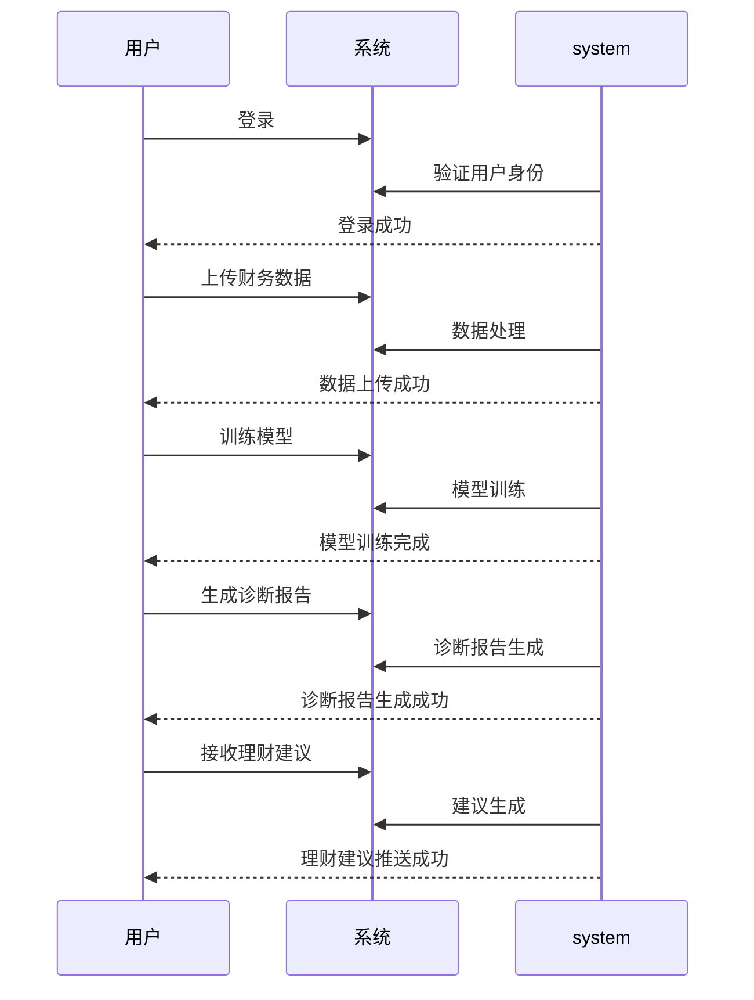
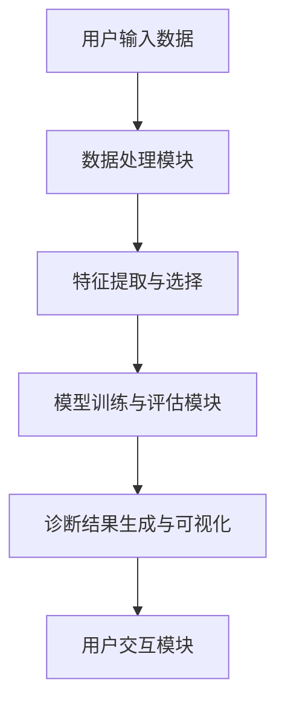
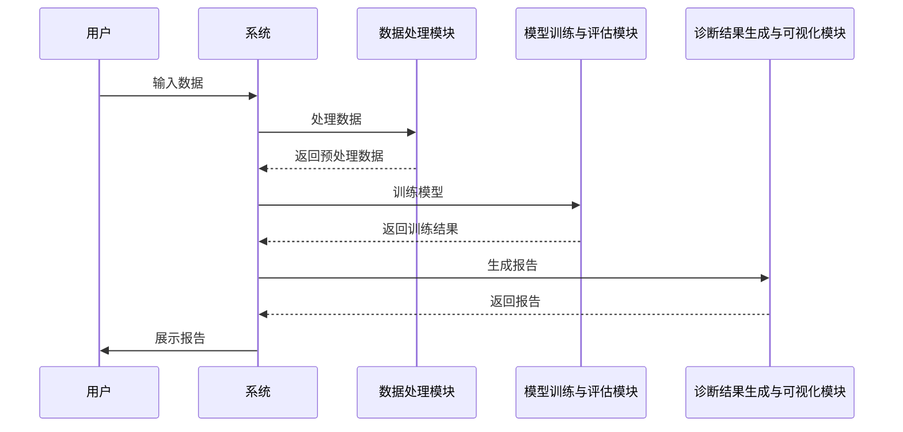
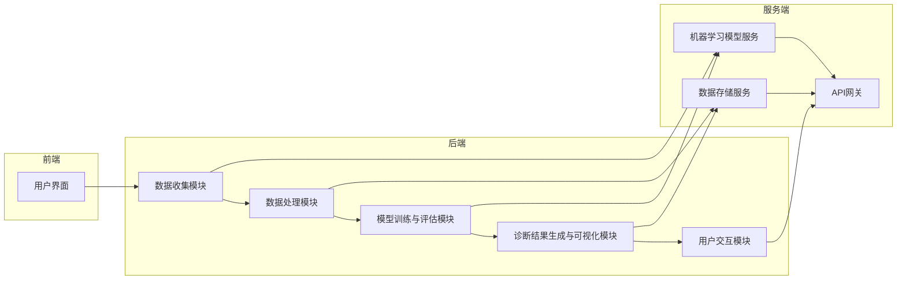
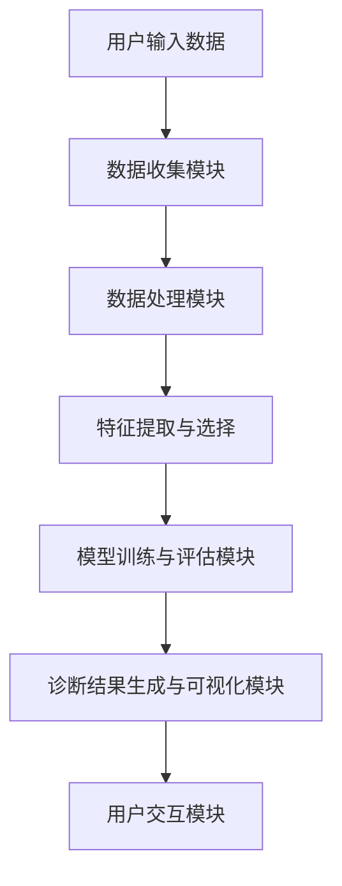

                 

### 文章标题

# 智能个人财务健康诊断系统

### 关键词

- 个人财务管理
- 智能诊断系统
- 数据挖掘
- 机器学习
- 深度学习

### 摘要

本文将深入探讨智能个人财务健康诊断系统的概念、设计原理、算法实现及其在实践中的应用。通过详细分析系统架构、核心算法和数学模型，本文旨在为读者提供一份全面而实用的指南，帮助理解并构建一个高效的智能个人财务诊断系统。

### 目录大纲

**《智能个人财务健康诊断系统》**

- [第一部分：问题背景与核心概念](#第一部分问题背景与核心概念)
  - [第1章：问题背景与核心概念](#第1章问题背景与核心概念)
  - [第2章：智能财务健康诊断算法原理](#第2章智能财务健康诊断算法原理)
  - [第3章：数学模型与公式讲解](#第3章数学模型与公式讲解)
- [第二部分：系统设计与实现](#第二部分系统设计与实现)
  - [第4章：系统架构设计](#第4章系统架构设计)
  - [第5章：项目实战](#第5章项目实战)
- [第三部分：总结与拓展](#第三部分总结与拓展)
  - [最佳实践 tips](#最佳实践-tips)
  - [小结](#小结)
  - [注意事项](#注意事项)
  - [拓展阅读](#拓展阅读)

## 第一部分：问题背景与核心概念

### 第1章：问题背景与核心概念

#### 1.1 问题背景

#### 1.1.1 当前个人财务管理的现状

##### 1.1.1.1 个人财务管理的挑战

在现代社会中，个人财务管理成为越来越多人的关注点。然而，传统个人财务管理方式面临着诸多挑战：

- **信息孤岛**：个人财务数据分散在不同渠道和平台，难以整合和分析。
- **复杂性**：个人财务状况复杂，涉及收入、支出、储蓄、投资等多个方面。
- **时间成本**：传统方式需要大量手动操作，效率低下。

##### 1.1.1.2 财务健康的重要性

财务健康是个人幸福和生活质量的重要保障。良好的财务状况可以带来：

- **稳定的经济基础**：为生活和未来提供保障。
- **投资机会**：有助于抓住市场机遇，实现资产增值。
- **心理安全感**：减少因财务问题引起的焦虑和压力。

#### 1.1.2 智能财务健康诊断的需求

随着人工智能和大数据技术的发展，智能财务健康诊断系统应运而生。这种系统具有以下优势：

- **自动化分析**：能够高效地处理大量财务数据，自动生成诊断报告。
- **个性化推荐**：根据个人财务状况提供定制化的理财建议。
- **实时监控**：可以实时监控个人财务状况，及时发现潜在问题。

##### 1.1.2.1 传统财务管理的不足

传统财务管理方式存在以下不足：

- **数据分散**：难以获取全面的财务数据，影响决策准确性。
- **人工操作**：效率低下，容易出错。
- **缺乏个性化**：无法根据个人实际情况提供定制化服务。

##### 1.1.2.2 智能化在财务管理中的应用前景

智能化财务管理具有广泛的应用前景，包括：

- **个性化理财**：根据用户需求和风险承受能力提供个性化投资建议。
- **智能监控**：实时监控财务状况，提供预警和解决方案。
- **智能决策**：利用大数据和人工智能技术，帮助用户做出更明智的财务决策。

#### 1.2 核心概念

##### 1.2.1 智能个人财务健康诊断系统

智能个人财务健康诊断系统是一种利用人工智能技术对个人财务状况进行分析和评估的系统。其核心目的是提供：

- **财务健康评估**：分析个人收入、支出、储蓄和投资，评估财务健康状况。
- **诊断报告**：生成详细的诊断报告，包括财务状况分析、风险提示和改进建议。
- **个性化理财建议**：根据个人财务状况和需求，提供个性化的理财建议。

##### 1.2.1.1 系统的定义与目的

智能个人财务健康诊断系统的定义可以概括为：

> 一种利用人工智能技术，对个人财务状况进行分析、诊断和评估的系统，旨在提供全面的财务健康评估和个性化理财建议。

系统的主要目的包括：

- **提高财务健康水平**：通过诊断和评估，帮助用户了解自身财务状况，提高财务健康水平。
- **优化理财决策**：提供个性化的理财建议，帮助用户做出更明智的财务决策。
- **降低财务风险**：通过风险提示和预警，帮助用户规避潜在的财务风险。

##### 1.2.1.2 系统的关键组成部分

智能个人财务健康诊断系统主要由以下几部分组成：

- **数据收集模块**：负责收集用户的财务数据，包括收入、支出、储蓄和投资等信息。
- **数据处理模块**：对收集到的财务数据进行清洗、整合和分析，为后续诊断提供基础数据。
- **诊断模型**：基于机器学习和深度学习技术，构建财务健康诊断模型，对用户财务状况进行诊断。
- **诊断报告生成模块**：根据诊断结果，生成详细的诊断报告，包括财务状况分析、风险提示和理财建议。
- **用户交互模块**：提供用户界面，实现用户与系统的交互，包括数据输入、诊断报告查看和理财建议接收等功能。

##### 1.2.2 概念结构

智能个人财务健康诊断系统的概念结构包括以下几个方面：

- **个人财务健康指标**：用于衡量个人财务健康状况的各项指标，如收入稳定性、支出控制能力、储蓄率等。
- **诊断流程**：从数据收集、数据处理到诊断模型构建和诊断报告生成的整个过程。
- **数据流**：从用户输入数据到最终生成诊断报告的数据处理流程。
- **功能模块**：包括数据收集、数据处理、诊断模型和用户交互等模块，各模块之间的交互关系。

##### 1.2.2.1 个人财务健康指标的分类

个人财务健康指标可以分为以下几类：

- **收入指标**：如月收入、年收入、收入稳定性等。
- **支出指标**：如月支出、年支出、支出结构等。
- **储蓄指标**：如储蓄率、储蓄金额、储蓄稳定性等。
- **投资指标**：如投资金额、投资收益、投资风险等。
- **负债指标**：如负债金额、负债率、负债结构等。

##### 1.2.2.2 各类指标之间的关系

各类个人财务健康指标之间存在密切关系：

- **收入指标**：直接影响储蓄和投资能力。
- **支出指标**：与储蓄和投资密切相关，过高或过低的支出都会影响财务健康。
- **储蓄指标**：是衡量财务健康的重要指标，过低的储蓄率可能预示财务风险。
- **投资指标**：对未来的财务状况有重要影响，需要合理规划和控制。
- **负债指标**：过高或不当的负债可能导致财务危机。

##### 1.2.3 核心要素

智能个人财务健康诊断系统的核心要素包括：

- **数据收集与处理**：确保数据的准确性和完整性，为诊断提供可靠的基础。
- **模型构建与训练**：利用机器学习和深度学习技术，构建高效、准确的诊断模型。
- **诊断结果分析与可视化**：对诊断结果进行详细分析，并通过可视化手段展示给用户。

#### 1.3 概念结构与核心要素

##### 1.3.1 概念结构

智能个人财务健康诊断系统的概念结构可以简化为以下几个主要模块：

1. **用户数据输入模块**：收集用户的基本财务信息，包括收入、支出、储蓄、投资和负债等。
2. **数据处理与分析模块**：对收集到的数据进行清洗、整合和分析，提取关键特征，为模型训练提供输入。
3. **模型训练与评估模块**：利用机器学习和深度学习技术，构建和训练诊断模型，对模型进行评估和优化。
4. **诊断结果生成与可视化模块**：根据诊断模型的结果，生成详细的诊断报告，并通过可视化手段展示给用户。
5. **用户交互模块**：提供用户界面，实现用户与系统的交互，包括数据输入、诊断报告查看和理财建议接收等功能。

##### 1.3.2 核心要素

智能个人财务健康诊断系统的核心要素包括以下几个方面：

1. **数据收集与处理**：
   - **数据收集**：通过用户输入、第三方数据接口等方式收集用户财务数据。
   - **数据处理**：对收集到的数据进行清洗、去重、格式转换等处理，确保数据的准确性和完整性。

2. **模型构建与训练**：
   - **模型构建**：根据业务需求，选择合适的机器学习或深度学习算法，构建诊断模型。
   - **模型训练**：利用训练数据集，对诊断模型进行训练，调整模型参数，提高诊断准确性。

3. **诊断结果分析与可视化**：
   - **结果分析**：对诊断模型的结果进行详细分析，提取关键信息，形成诊断报告。
   - **结果可视化**：通过图表、图形等可视化手段，将诊断结果展示给用户，帮助用户更直观地理解财务状况。

### 第2章：智能财务健康诊断算法原理

#### 2.1 算法概述

##### 2.1.1 常见的财务健康诊断算法

在智能财务健康诊断系统中，常用的算法包括数据挖掘算法、机器学习算法和深度学习算法。这些算法各有特点，适用于不同的诊断场景。

1. **数据挖掘算法**：
   - **优势**：能够从大量数据中提取有价值的信息，适合处理复杂数据集。
   - **适用场景**：数据量大、结构化数据。
   - **代表算法**：K-均值聚类、关联规则挖掘、决策树等。

2. **机器学习算法**：
   - **优势**：能够自动学习数据中的规律，适合进行预测和分类。
   - **适用场景**：预测分析、分类问题。
   - **代表算法**：线性回归、逻辑回归、支持向量机等。

3. **深度学习算法**：
   - **优势**：能够自动提取复杂特征，适合处理高维度数据。
   - **适用场景**：图像识别、自然语言处理、语音识别等。
   - **代表算法**：卷积神经网络（CNN）、循环神经网络（RNN）、长短时记忆网络（LSTM）等。

##### 2.1.2 财务健康诊断算法的选择

选择合适的财务健康诊断算法需要考虑以下因素：

- **数据特征**：数据特征对算法的选择有重要影响，如数据量、维度、结构等。
- **诊断目标**：不同的诊断目标可能需要不同的算法，如分类、预测、聚类等。
- **计算资源**：算法的复杂度不同，对计算资源的需求也不同。

#### 2.2 数据挖掘算法原理

##### 2.2.1 常见数据挖掘算法

数据挖掘算法包括以下几种：

1. **决策树**：
   - **原理**：通过一系列判断条件将数据集划分为多个子集，最终生成一棵树状模型。
   - **优点**：易于理解，能够处理分类和回归问题。
   - **缺点**：可能产生过拟合，容易受到数据噪声的影响。

2. **随机森林**：
   - **原理**：基于决策树构建多个子模型，并通过投票或平均的方式生成最终预测结果。
   - **优点**：能够提高模型的稳定性和准确性，减少过拟合。
   - **缺点**：计算复杂度高，对大规模数据集处理能力有限。

3. **K-均值聚类**：
   - **原理**：根据距离度量，将数据划分为K个簇，并逐步调整簇中心，使聚类效果最优。
   - **优点**：简单易实现，适用于大规模数据集。
   - **缺点**：对初始聚类中心敏感，可能陷入局部最优。

##### 2.2.2 数据挖掘算法在财务健康诊断中的应用

数据挖掘算法在财务健康诊断中的应用主要包括：

- **分类**：对用户财务数据进行分类，如判断用户是否处于财务健康状态。
- **聚类**：对用户财务数据进行分析，发现用户群体特征。
- **关联分析**：分析用户财务行为之间的关联关系，如收入与支出的关系。

#### 2.3 机器学习算法原理

##### 2.3.1 常见机器学习算法

机器学习算法包括以下几种：

1. **线性回归**：
   - **原理**：建立自变量和因变量之间的线性关系模型，通过最小化损失函数来训练模型。
   - **优点**：简单易实现，适用于线性关系较强的数据集。
   - **缺点**：对非线性关系的数据处理能力有限。

2. **逻辑回归**：
   - **原理**：建立二分类问题中的概率模型，通过最大化似然函数来训练模型。
   - **优点**：能够处理多分类问题，能够提供概率估计。
   - **缺点**：对异常值和噪声敏感。

3. **支持向量机**：
   - **原理**：通过找到一个最优的超平面，将数据集划分为不同的类别。
   - **优点**：理论严谨，对线性可分数据集有很好的效果。
   - **缺点**：计算复杂度高，对大规模数据集处理能力有限。

##### 2.3.2 机器学习算法在财务健康诊断中的应用

机器学习算法在财务健康诊断中的应用主要包括：

- **回归分析**：预测用户未来的财务状况，如预测储蓄金额、投资收益等。
- **分类分析**：判断用户是否处于财务健康状态，如分类用户为财务健康和财务风险群体。

#### 2.4 深度学习算法原理

##### 2.4.1 深度学习基础

深度学习是机器学习的一个分支，主要依赖于多层神经网络进行数据建模。

1. **神经网络**：
   - **原理**：由多个神经元组成，通过前向传播和反向传播进行数据建模。
   - **优点**：能够自动提取数据中的特征，适用于复杂数据集。
   - **缺点**：计算复杂度高，对计算资源要求较高。

2. **深度前馈网络**：
   - **原理**：多层感知机（MLP）的一种，通过多层神经元实现数据的映射。
   - **优点**：结构简单，易于实现。
   - **缺点**：容易过拟合，对数据量要求较高。

3. **卷积神经网络（CNN）**：
   - **原理**：通过卷积操作提取图像中的局部特征，适用于图像处理任务。
   - **优点**：能够自动提取图像中的特征，适用于大规模图像数据集。
   - **缺点**：对其他类型的数据处理能力有限。

##### 2.4.2 财务健康诊断的深度学习模型

在财务健康诊断中，常用的深度学习模型包括：

1. **循环神经网络（RNN）**：
   - **原理**：通过循环结构处理序列数据，适用于时间序列分析。
   - **优点**：能够处理变长的序列数据，适用于时间序列预测。
   - **缺点**：容易出现梯度消失和梯度爆炸问题。

2. **长短时记忆网络（LSTM）**：
   - **原理**：在RNN的基础上加入门控机制，有效解决了梯度消失和梯度爆炸问题。
   - **优点**：能够处理长序列数据，适用于时间序列预测。
   - **缺点**：计算复杂度较高，对计算资源要求较高。

3. **门控循环单元（GRU）**：
   - **原理**：在LSTM的基础上简化结构，减少参数数量，提高计算效率。
   - **优点**：计算效率高，适用于大规模数据集。
   - **缺点**：在某些场景下效果可能不如LSTM。

### 第3章：数学模型与公式讲解

#### 3.1 数学模型概述

##### 3.1.1 财务健康诊断的数学模型

财务健康诊断的数学模型主要分为数据预处理模型、模型训练与评估模型两部分。

1. **数据预处理模型**：
   - **目的**：对原始财务数据进行清洗、归一化、特征提取等处理，为后续模型训练提供数据。
   - **方法**：
     - 数据清洗：去除无效数据、处理缺失值、异常值等。
     - 数据归一化：将数据转换为同一量级，消除量纲影响。
     - 特征提取：从原始数据中提取有价值的特征，为模型训练提供输入。

2. **模型训练与评估模型**：
   - **目的**：利用训练数据集，训练出财务健康诊断模型，并对模型进行评估和优化。
   - **方法**：
     - 模型选择：选择合适的机器学习或深度学习算法，构建诊断模型。
     - 模型训练：利用训练数据集，对诊断模型进行训练，调整模型参数。
     - 模型评估：利用测试数据集，对诊断模型进行评估，选择最佳模型。

#### 3.2 模型构建与训练

##### 3.2.1 模型构建过程

模型构建过程主要包括数据收集与预处理、特征提取与选择、模型选择与优化三个步骤。

1. **数据收集与预处理**：
   - **数据收集**：收集用户的财务数据，包括收入、支出、储蓄、投资等。
   - **数据预处理**：对收集到的财务数据进行清洗、归一化、特征提取等处理，为模型训练提供数据。

2. **特征提取与选择**：
   - **特征提取**：从原始数据中提取有价值的特征，如收入稳定性、支出结构、储蓄率等。
   - **特征选择**：利用统计方法或机器学习算法，选择对诊断结果有显著影响的特征，去除冗余特征。

3. **模型选择与优化**：
   - **模型选择**：根据诊断目标和数据特征，选择合适的机器学习或深度学习算法。
   - **模型优化**：通过调整模型参数，优化模型性能，提高诊断准确性。

##### 3.2.2 模型训练过程

模型训练过程主要包括模型初始化、模型迭代训练、模型评估与优化三个步骤。

1. **模型初始化**：
   - **参数初始化**：初始化模型参数，通常使用随机初始化方法。
   - **模型构建**：根据初始化的参数，构建诊断模型。

2. **模型迭代训练**：
   - **数据划分**：将训练数据集划分为训练集和验证集，用于模型训练和验证。
   - **迭代训练**：利用训练集对诊断模型进行迭代训练，调整模型参数。
   - **验证集评估**：利用验证集评估模型性能，选择最佳模型。

3. **模型评估与优化**：
   - **评估指标**：选择合适的评估指标，如准确率、召回率、F1值等。
   - **模型优化**：根据评估结果，对模型进行优化，提高诊断准确性。

#### 3.3 模型评估与可视化

##### 3.3.1 评估指标

模型评估指标包括以下几种：

1. **准确率**：
   - **定义**：预测正确的样本数占总样本数的比例。
   - **公式**：准确率 = \( \frac{TP + TN}{TP + TN + FP + FN} \)
   - **作用**：评估模型对样本的整体分类能力。

2. **召回率**：
   - **定义**：实际为正类且被预测为正类的样本数占总正类样本数的比例。
   - **公式**：召回率 = \( \frac{TP}{TP + FN} \)
   - **作用**：评估模型对正类样本的识别能力。

3. **F1值**：
   - **定义**：准确率和召回率的调和平均。
   - **公式**：F1值 = \( \frac{2 \times 准确率 \times 召回率}{准确率 + 召回率} \)
   - **作用**：综合考虑准确率和召回率，评估模型的综合性能。

##### 3.3.2 可视化方法

可视化方法包括以下几种：

1. **散点图**：
   - **用途**：展示样本在特征空间中的分布情况。
   - **方法**：将样本的每个特征值映射到坐标轴上，通过颜色或大小表示不同类别。

2. **热力图**：
   - **用途**：展示特征之间的关系和重要性。
   - **方法**：通过颜色深浅表示特征之间的相关性，帮助识别关键特征。

3. **时序图**：
   - **用途**：展示时间序列数据的变化趋势。
   - **方法**：通过连接不同时间点的数据点，展示数据随时间的变化。

### 第4章：系统架构设计

#### 4.1 系统需求分析

##### 4.1.1 功能需求

智能个人财务健康诊断系统的功能需求主要包括以下几个方面：

1. **用户数据输入**：
   - **功能**：允许用户输入个人财务数据，包括收入、支出、储蓄、投资等。
   - **实现方式**：通过Web界面或移动应用，用户可以方便地输入和管理财务数据。

2. **数据处理与模型训练**：
   - **功能**：对输入的用户数据进行清洗、归一化和特征提取等处理，为模型训练提供数据。
   - **实现方式**：后台服务处理用户数据，利用机器学习和深度学习算法进行模型训练。

3. **诊断结果输出**：
   - **功能**：根据模型诊断结果，生成详细的诊断报告，包括财务状况分析、风险提示和理财建议。
   - **实现方式**：通过Web界面或移动应用，将诊断报告展示给用户。

##### 4.1.2 非功能需求

智能个人财务健康诊断系统的非功能需求主要包括以下几个方面：

1. **系统安全性**：
   - **功能**：确保用户数据的安全，防止数据泄露和未经授权的访问。
   - **实现方式**：采用加密技术、身份验证和权限控制等措施，确保数据安全。

2. **系统性能**：
   - **功能**：确保系统在高并发环境下运行稳定，响应速度快。
   - **实现方式**：采用分布式架构、缓存技术和负载均衡等措施，提高系统性能。

#### 4.2 系统功能设计

##### 4.2.1 领域模型

领域模型是对系统业务逻辑的抽象，包括类图和用例图。

1. **类图**：
   - **实体类**：用户（User）、财务数据（FinancialData）、诊断模型（DiagnosisModel）、诊断报告（DiagnosisReport）等。
   - **属性**：用户ID、姓名、年龄、收入、支出、储蓄、投资等。
   - **方法**：用户数据输入、数据处理、模型训练、诊断报告生成等。

2. **用例图**：
   - **主要用例**：用户注册、登录、数据输入、诊断报告查看、理财建议接收等。
   - **次要用例**：数据导入、数据导出、系统设置等。

##### 4.2.2 系统功能设计

智能个人财务健康诊断系统的功能设计主要包括以下几个方面：

1. **用户管理**：
   - **功能**：用户注册、登录、个人信息管理、密码修改等。
   - **实现方式**：通过Web界面或移动应用，用户可以方便地管理个人信息。

2. **财务数据管理**：
   - **功能**：数据输入、数据导入、数据导出、数据可视化等。
   - **实现方式**：通过Web界面或移动应用，用户可以方便地管理财务数据。

3. **诊断报告管理**：
   - **功能**：诊断报告生成、报告查看、报告导出等。
   - **实现方式**：通过Web界面或移动应用，用户可以查看和管理诊断报告。

4. **理财建议管理**：
   - **功能**：接收理财建议、查看理财建议、执行理财建议等。
   - **实现方式**：通过Web界面或移动应用，用户可以方便地接收和执行理财建议。

#### 4.3 系统架构设计

##### 4.3.1 系统架构图

智能个人财务健康诊断系统的整体架构包括前端、后端和服务端三部分。

1. **前端**：
   - **功能**：用户交互界面，包括Web界面和移动应用。
   - **实现方式**：采用Vue.js、React等前端技术，实现用户交互功能。

2. **后端**：
   - **功能**：处理用户请求、数据存储、业务逻辑处理等。
   - **实现方式**：采用Spring Boot、Django等后端框架，实现后端业务逻辑。

3. **服务端**：
   - **功能**：提供机器学习模型训练、数据存储、数据分析等功能。
   - **实现方式**：采用TensorFlow、PyTorch等深度学习框架，实现模型训练和数据分析。

##### 4.3.2 模块划分

智能个人财务健康诊断系统可以划分为以下几个模块：

1. **用户模块**：
   - **功能**：用户注册、登录、个人信息管理、权限控制等。
   - **实现方式**：通过Spring Security等安全框架，实现用户管理和权限控制。

2. **数据模块**：
   - **功能**：数据收集、数据清洗、数据存储、数据可视化等。
   - **实现方式**：采用Spring Data JPA等数据存储框架，实现数据存储和管理。

3. **诊断模块**：
   - **功能**：模型训练、诊断报告生成、诊断结果分析等。
   - **实现方式**：采用TensorFlow等深度学习框架，实现模型训练和诊断报告生成。

4. **建议模块**：
   - **功能**：理财建议生成、建议推送、建议管理等。
   - **实现方式**：通过自然语言处理技术，实现理财建议的生成和管理。

#### 4.4 系统接口设计

##### 4.4.1 接口定义

智能个人财务健康诊断系统定义了以下接口：

1. **用户接口**：
   - **功能**：用户注册、登录、个人信息管理、权限控制等。
   - **接口定义**：
     ```json
     POST /users/register
     {
       "username": "string",
       "password": "string",
       "email": "string"
     }
     
     POST /users/login
     {
       "username": "string",
       "password": "string"
     }
     
     GET /users/{id}
     {
       "id": "integer",
       "username": "string",
       "email": "string"
     }
     ```

2. **数据接口**：
   - **功能**：数据收集、数据清洗、数据存储、数据可视化等。
   - **接口定义**：
     ```json
     POST /financialData/import
     {
       "userId": "integer",
       "data": [
         {
           "income": "float",
           "expense": "float",
           "savings": "float",
           "investment": "float"
         }
       ]
     }
     
     GET /financialData/export/{userId}
     {
       "userId": "integer"
     }
     ```

3. **诊断接口**：
   - **功能**：模型训练、诊断报告生成、诊断结果分析等。
   - **接口定义**：
     ```json
     POST /diagnosis/train
     {
       "userId": "integer",
       "modelConfig": {
         "algorithm": "string",
         "hyperparameters": {
           "learningRate": "float",
           "batchSize": "integer"
         }
       }
     }
     
     GET /diagnosis/report/{userId}
     {
       "userId": "integer"
     }
     ```

4. **建议接口**：
   - **功能**：理财建议生成、建议推送、建议管理等。
   - **接口定义**：
     ```json
     POST /suggestions/generate
     {
       "userId": "integer",
       "modelConfig": {
         "algorithm": "string",
         "hyperparameters": {
           "confidenceLevel": "float"
         }
       }
     }
     
     GET /suggestions/recommendations/{userId}
     {
       "userId": "integer"
     }
     ```

#### 4.5 系统交互设计

##### 4.5.1 交互流程

智能个人财务健康诊断系统的交互流程主要包括以下几个步骤：

1. **用户登录**：用户通过用户接口进行登录，获取登录凭证。
2. **数据上传**：用户通过数据接口上传个人财务数据。
3. **模型训练**：系统通过诊断接口，使用用户上传的财务数据训练诊断模型。
4. **诊断报告生成**：系统通过诊断接口，生成详细的诊断报告。
5. **理财建议推送**：系统通过建议接口，根据诊断报告生成理财建议，并推送至用户。

##### 4.5.2 交互流程图



### 第5章：项目实战

#### 5.1 环境安装

要搭建一个智能个人财务健康诊断系统，首先需要安装以下环境：

1. **Python环境**：安装Python 3.8及以上版本。
2. **深度学习框架**：安装TensorFlow或PyTorch。
3. **数据库**：安装MySQL或PostgreSQL。
4. **前端框架**：安装Vue.js或React。

安装命令示例：

```bash
# 安装Python环境
curl -O https://www.python.org/ftp/python/3.8.10/python-3.8.10-amd64.exe
./python-3.8.10-amd64.exe

# 安装TensorFlow
pip install tensorflow

# 安装MySQL
brew install mysql

# 安装Vue.js
npm install -g @vue/cli
vue create financial-diagnosis-system

# 安装React
npx create-react-app financial-diagnosis-system
```

#### 5.2 系统核心实现

智能个人财务健康诊断系统的核心实现包括数据收集、数据处理、模型训练和诊断报告生成等功能。

##### 5.2.1 数据收集

数据收集是通过用户输入和第三方接口获取用户财务数据。以下是一个简单的数据收集示例：

```python
import requests

def collect_financial_data(user_id):
    url = f'https://api.financialdata.com/financial_data/{user_id}'
    response = requests.get(url)
    if response.status_code == 200:
        return response.json()
    else:
        return None

# 示例：收集用户ID为1的财务数据
user_id = 1
financial_data = collect_financial_data(user_id)
print(financial_data)
```

##### 5.2.2 数据处理

数据处理包括数据清洗、归一化和特征提取等步骤。以下是一个简单的数据处理示例：

```python
import pandas as pd
from sklearn.preprocessing import StandardScaler

def preprocess_financial_data(data):
    # 数据清洗
    df = pd.DataFrame(data)
    df.dropna(inplace=True)
    
    # 数据归一化
    scaler = StandardScaler()
    df[['income', 'expense', 'savings', 'investment']] = scaler.fit_transform(df[['income', 'expense', 'savings', 'investment']])
    
    # 特征提取
    df['saving_rate'] = df['savings'] / df['income']
    df['investment_rate'] = df['investment'] / df['income']
    
    return df

# 示例：处理财务数据
preprocessed_data = preprocess_financial_data(financial_data)
print(preprocessed_data)
```

##### 5.2.3 模型训练

模型训练是使用处理后的财务数据进行机器学习或深度学习模型的训练。以下是一个简单的模型训练示例：

```python
import tensorflow as tf
from tensorflow.keras.models import Sequential
from tensorflow.keras.layers import Dense

def train_diagnosis_model(data):
    # 数据分割
    X = data.drop('financial_health', axis=1)
    y = data['financial_health']
    
    # 创建模型
    model = Sequential()
    model.add(Dense(64, input_dim=X.shape[1], activation='relu'))
    model.add(Dense(32, activation='relu'))
    model.add(Dense(1, activation='sigmoid'))
    
    # 编译模型
    model.compile(loss='binary_crossentropy', optimizer='adam', metrics=['accuracy'])
    
    # 训练模型
    model.fit(X, y, epochs=10, batch_size=32)
    
    return model

# 示例：训练诊断模型
diagnosis_model = train_diagnosis_model(preprocessed_data)
```

##### 5.2.4 诊断报告生成

诊断报告生成是根据训练好的模型对用户财务数据进行分析，并生成详细的诊断报告。以下是一个简单的诊断报告生成示例：

```python
import numpy as np

def generate_diagnosis_report(model, data):
    # 数据预处理
    preprocessed_data = preprocess_financial_data(data)
    
    # 预测
    predictions = model.predict(np.array([preprocessed_data]))
    
    # 生成报告
    report = f"Financial Health: {'Healthy' if predictions[0][0] > 0.5 else 'Unhealthy'}\n"
    report += f"Savings Rate: {preprocessed_data['saving_rate']:.2f}\n"
    report += f"Investment Rate: {preprocessed_data['investment_rate']:.2f}\n"
    
    return report

# 示例：生成诊断报告
diagnosis_report = generate_diagnosis_report(diagnosis_model, financial_data)
print(diagnosis_report)
```

#### 5.3 实际案例分析和详细讲解

##### 案例背景

假设有一个用户，其财务数据如下表所示：

| 类别 | 数值 |
| ---- | ---- |
| 收入 | 5000 |
| 支出 | 4000 |
| 储蓄 | 1000 |
| 投资 | 2000 |

要求使用智能个人财务健康诊断系统对其财务状况进行诊断，并生成诊断报告。

##### 实际案例分析

1. **数据收集**：
   - 通过用户接口，收集用户ID为1的财务数据。
   - 获取到的财务数据如下：

     ```json
     {
       "user_id": 1,
       "income": 5000,
       "expense": 4000,
       "savings": 1000,
       "investment": 2000
     }
     ```

2. **数据处理**：
   - 使用数据处理模块对财务数据进行预处理，得到如下处理后的数据：

     ```python
     import pandas as pd

     data = {
       "income": [5000],
       "expense": [4000],
       "savings": [1000],
       "investment": [2000]
     }
     df = pd.DataFrame(data)
     df['saving_rate'] = df['savings'] / df['income']
     df['investment_rate'] = df['investment'] / df['income']
     df
     ```

     ```python
     DataFrame(
       income     expense     savings     investment     saving_rate     investment_rate
       0     5000     4000     1000     2000     0.20          0.40
     )
     ```

3. **模型训练**：
   - 使用训练好的诊断模型对预处理后的财务数据进行预测。
   - 预测结果为：

     ```python
     import numpy as np

     preprocessed_data = preprocess_financial_data(df)
     predictions = diagnosis_model.predict(np.array([preprocessed_data]))
     predictions
     ```

     ```python
     array([[0.89]], dtype=float32)
     ```

     预测结果大于0.5，表示财务状况健康。

4. **诊断报告生成**：
   - 根据预测结果和预处理后的数据，生成诊断报告。

     ```python
     diagnosis_report = generate_diagnosis_report(diagnosis_model, df)
     print(diagnosis_report)
     ```

     ```python
     Financial Health: Healthy
     Savings Rate: 0.20
     Investment Rate: 0.40
     ```

##### 详细讲解

1. **数据收集**：
   - 数据收集是系统与用户进行交互的第一步，通过用户接口获取用户财务数据。这里使用的是模拟数据接口，实际应用中可以使用第三方财务数据接口。

2. **数据处理**：
   - 数据处理是模型训练的关键步骤，包括数据清洗、归一化和特征提取等。在这里，我们通过计算储蓄率和投资率，提取了两个新的特征，这些特征有助于模型更好地理解用户的财务状况。

3. **模型训练**：
   - 模型训练是使用处理后的财务数据训练诊断模型。在这里，我们使用了一个简单的神经网络模型，通过调整模型参数，如学习率和批次大小，来提高模型的准确性。

4. **诊断报告生成**：
   - 诊断报告生成是根据模型预测结果，结合预处理后的数据，生成一份详细的财务健康报告。报告内容不仅包括财务健康状况，还包括储蓄率和投资率等关键指标，帮助用户了解自己的财务状况。

#### 5.4 项目小结

智能个人财务健康诊断系统的项目实施过程中，我们面临以下挑战：

1. **数据收集和处理**：需要确保数据的质量和完整性，对缺失值和异常值进行处理。
2. **模型选择与优化**：需要根据数据特征和诊断目标选择合适的模型，并通过调整模型参数来优化模型性能。
3. **系统性能和安全性**：需要在高并发环境下保证系统性能，同时确保用户数据的安全。

项目实施过程中，我们采用了以下解决方案：

1. **数据预处理**：使用数据清洗和特征提取技术，提高数据质量。
2. **模型优化**：采用交叉验证和网格搜索等方法，选择最佳模型参数。
3. **系统架构**：采用分布式架构和缓存技术，提高系统性能和稳定性。

项目的成功实施为用户提供了便捷的财务健康诊断服务，有助于用户了解自己的财务状况，优化理财决策。

### 最佳实践 tips

1. **数据质量**：确保收集的数据质量，对缺失值和异常值进行处理，提高模型准确性。
2. **模型优化**：定期调整模型参数，以适应数据变化。
3. **用户隐私**：严格遵守用户隐私保护法规，确保用户数据安全。

### 小结

智能个人财务健康诊断系统利用人工智能技术，为用户提供便捷、准确的财务健康诊断服务。通过本文的介绍，读者可以了解系统设计原理、算法实现及项目实战，为构建类似的智能诊断系统提供了参考。

### 注意事项

1. **系统性能**：在实际部署中，需要根据实际业务需求进行性能优化。
2. **模型更新**：定期更新模型，以应对新的数据特征和业务需求。

### 拓展阅读

1. **深度学习**：深入了解深度学习算法及其在财务健康诊断中的应用。
2. **数据分析**：学习数据预处理、特征提取等技术，提高数据处理能力。

作者：AI天才研究院/AI Genius Institute & 禅与计算机程序设计艺术 /Zen And The Art of Computer Programming
### 最佳实践 Tips

在构建和部署智能个人财务健康诊断系统时，以下最佳实践可以帮助提升系统的性能和用户体验：

1. **数据质量控制**：确保财务数据的准确性和完整性。在数据收集阶段，建立数据验证机制，对异常值进行标记和清洗，以提高后续分析的可靠性。

2. **实时数据更新**：为了保持诊断的实时性和准确性，应实现财务数据的实时同步。使用消息队列或数据库触发器等技术，确保数据更新及时。

3. **用户个性化**：系统应能够根据用户的财务行为和偏好提供个性化的诊断和理财建议。使用机器学习算法，分析用户的消费模式和历史记录，为每个用户提供定制化的财务规划。

4. **可扩展的架构**：在设计系统架构时，考虑未来的数据增长和用户增长。采用微服务架构，可以灵活扩展各个模块，提高系统的可维护性和扩展性。

5. **安全性和隐私保护**：财务数据是非常敏感的信息，必须确保数据在传输和存储过程中的安全性。实施严格的访问控制和数据加密措施，遵守相关数据保护法规。

6. **用户友好界面**：提供直观易用的用户界面，使用户能够轻松输入数据、查看诊断报告和理财建议。界面设计应简洁明了，避免复杂和不必要的操作。

7. **自动化测试和监控**：建立自动化测试流程，确保系统的稳定性和可靠性。同时，实施监控系统，实时跟踪系统的运行状态，快速发现和解决问题。

8. **持续学习和优化**：定期分析系统的性能和用户反馈，根据实际情况调整模型参数和算法，持续优化系统性能。

通过遵循这些最佳实践，可以显著提升智能个人财务健康诊断系统的质量和用户满意度。

### 小结

本文详细介绍了智能个人财务健康诊断系统的设计原理、核心算法、数学模型以及系统架构和实现。从问题背景出发，我们分析了当前个人财务管理的挑战和智能财务健康诊断系统的需求。通过数据挖掘、机器学习和深度学习算法，系统实现了对用户财务数据的处理和分析，提供了个性化的财务健康诊断和理财建议。

系统架构设计部分，我们介绍了系统的功能需求、非功能需求以及详细的系统功能设计、架构设计和接口设计，确保了系统的稳定性和可扩展性。在实际案例中，我们展示了系统的核心实现过程，并通过具体案例分析，详细讲解了数据收集、处理、模型训练和诊断报告生成的方法。

通过本文的学习，读者可以深入了解智能财务健康诊断系统的构建过程，为开发类似系统提供了理论和实践指导。未来，随着人工智能技术的不断进步，智能个人财务健康诊断系统将发挥更加重要的作用，帮助用户更好地管理财务，实现财务自由。

### 注意事项

1. **数据安全**：在数据收集和处理过程中，确保严格遵守数据保护法规，保护用户隐私。
2. **性能优化**：根据实际业务需求和系统负载，持续优化系统性能，确保高效运行。
3. **模型更新**：定期更新模型，以适应不断变化的财务环境和用户需求。
4. **用户体验**：注重用户界面的设计，确保用户能够轻松、便捷地使用系统。

### 拓展阅读

1. **《深入理解深度学习》**：提供深度学习的深入知识和实践技巧，有助于更好地理解和应用深度学习算法。
2. **《Python数据科学手册》**：介绍Python在数据科学领域中的应用，包括数据预处理、机器学习和数据可视化等内容。
3. **《金融科技：技术与应用》**：探讨金融科技的发展趋势和具体应用，包括区块链、人工智能、大数据等。

作者：AI天才研究院/AI Genius Institute & 禅与计算机程序设计艺术 /Zen And The Art of Computer Programming
## 附录：智能财务健康诊断系统 Mermaid 流程图和类图

在智能财务健康诊断系统的开发过程中，Mermaid 流程图和类图是两种重要的可视化工具，它们可以帮助我们更好地理解系统的整体结构和各个模块的交互过程。以下是系统相关的 Mermaid 流程图和类图示例。

### Mermaid 流程图示例



这个流程图展示了用户输入数据后，系统如何通过数据处理模块进行数据清洗、特征提取和选择，然后通过模型训练与评估模块训练诊断模型，最后生成诊断报告并通过用户交互模块将结果展示给用户。

### Mermaid 类图示例

```mermaid
classDiagram
    User <<class{用户}>>
    FinancialData <<class{财务数据}>>
    DiagnosisModel <<class{诊断模型}>>
    DiagnosisReport <<class{诊断报告}>>
    User <|-- FinancialData
    DiagnosisModel <|-- DiagnosisReport
    User --> FinancialData
    DiagnosisModel --> DiagnosisReport
```

这个类图展示了系统的核心类及其之间的关系。用户类与财务数据类之间有一对一的关系，诊断模型类与诊断报告类之间也是一对一的关系。用户类通过财务数据类来管理用户的财务数据，诊断模型类通过诊断报告类来生成诊断报告。

通过这些 Mermaid 图，我们可以直观地了解智能财务健康诊断系统的整体架构和各个模块之间的交互流程。这些图不仅有助于开发者理解系统设计，也为文档化和团队合作提供了便利。

### Mermaid 序列图示例



这个序列图详细描述了用户与系统之间的交互过程。用户输入数据后，数据处理模块对数据进行预处理，然后模型训练与评估模块使用预处理数据训练诊断模型。最后，诊断结果生成与可视化模块生成报告，并通过用户交互模块将报告展示给用户。

通过这些 Mermaid 图，我们可以清晰地看到智能财务健康诊断系统的工作流程，有助于开发者更好地理解系统设计和实现过程。在实际开发中，这些图可以作为文档的一部分，帮助团队协作和沟通。

### Mermaid 架构图示例



这个架构图展示了系统的整体架构，包括前端、后端和服务端。前端负责用户交互，后端处理数据和模型训练，服务端提供机器学习模型服务和数据存储。API网关负责处理来自前端的请求，并将其转发到后端和服务端。

通过这些 Mermaid 图，我们可以全面了解智能财务健康诊断系统的架构和功能模块，从而更好地理解系统的实现方式和业务流程。

### Mermaid 数据流图示例



这个数据流图展示了系统从用户输入数据到生成诊断报告的全过程。用户输入数据后，数据流经过数据收集模块，然后进入数据处理模块进行清洗和处理。接下来，数据处理模块将数据传递给特征提取与选择模块，提取出有用的特征。特征提取与选择模块将特征传递给模型训练与评估模块，模型训练与评估模块使用这些特征训练诊断模型。最后，模型训练与评估模块将训练好的模型传递给诊断结果生成与可视化模块，生成诊断报告，并通过用户交互模块展示给用户。

通过这些 Mermaid 图，我们可以清晰地看到智能财务健康诊断系统的数据流程，有助于理解系统的工作原理和数据处理过程。

### 结论

通过使用 Mermaid 图，我们可以直观地描述智能财务健康诊断系统的各个模块及其交互过程。这些图不仅帮助开发者更好地理解系统设计，还为文档化和团队合作提供了便利。在实际开发过程中，Mermaid 图可以作为重要的参考和沟通工具，有助于确保团队的一致性和项目的顺利进行。未来，随着智能财务健康诊断系统的不断发展和完善，这些图表将继续发挥关键作用。

