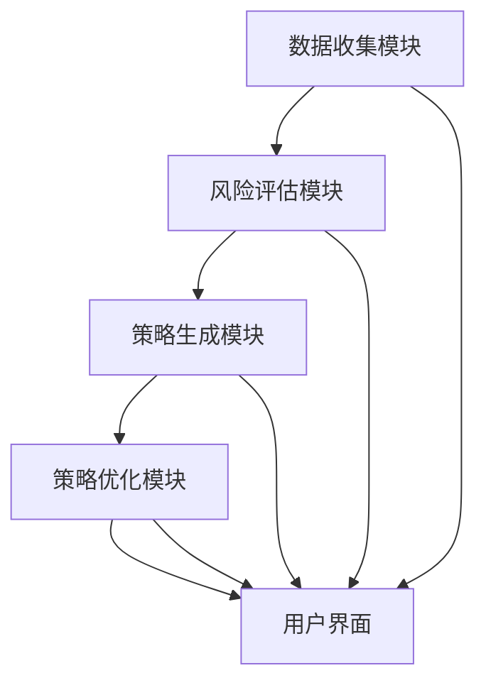
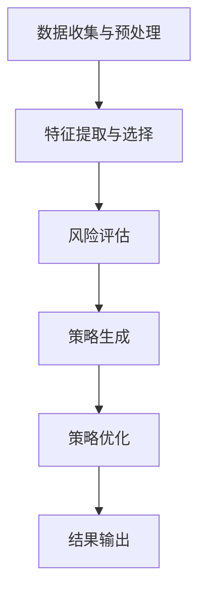
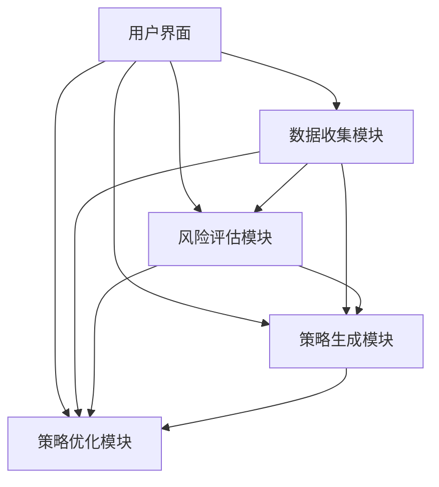

                 

### 第1章 引言

#### 1.1 问题背景

在当今社会，个人财务管理已经成为了日常生活中不可或缺的一部分。无论是个人还是家庭，都需要对财务进行合理的规划和管理，以确保财务状况的健康和稳定。然而，面对复杂多变的金融市场和全球经济形势，如何有效地应对潜在的财务风险，成为了许多人关注的焦点。

传统的财务规划方法往往依赖于经验和直觉，缺乏系统性和科学性。当面临突发情况，如失业、疾病、投资损失等，许多个人和家庭往往难以迅速做出合理的应对措施，导致财务状况进一步恶化。因此，开发一种智能个人财务应急预案生成器，能够在短时间内为个人或家庭提供科学的财务应对策略，显得尤为重要。

#### 1.2 问题描述

个人财务应急预案生成器的核心问题是：如何在给定用户财务状况和风险偏好下，快速、准确地生成一套完整的财务应对策略。这个策略需要涵盖多个方面，包括但不限于紧急资金的准备、投资组合的调整、支出和收入的优化等。具体来说，生成器需要解决以下几个问题：

1. **数据收集与处理**：收集用户的财务数据，如收入、支出、资产和负债等，并进行预处理，确保数据的准确性和完整性。
2. **风险评估**：对用户当前的财务状况进行风险评估，识别潜在的风险点。
3. **策略生成**：根据风险评估结果，为用户生成一套科学的财务应对策略。
4. **策略优化**：对生成的策略进行优化，确保其可行性和有效性。

#### 1.3 问题解决

智能个人财务应急预案生成器通过以下几个关键步骤来解决问题：

1. **数据收集与预处理**：生成器会自动从用户的银行账户、投资账户和其他财务记录中收集数据，并使用数据清洗和转换技术处理这些数据。
2. **风险评估**：使用机器学习算法对用户的财务状况进行风险评估，识别潜在的风险点，如高负债、高风险投资等。
3. **策略生成**：基于风险评估结果，生成器会根据预设的规则和算法为用户生成一套财务应对策略。
4. **策略优化**：使用优化算法对生成的策略进行优化，确保其能够在不同场景下有效应对财务风险。

#### 1.4 边界与外延

智能个人财务应急预案生成器的应用范围主要涵盖个人和家庭层面的财务风险管理。然而，随着技术的不断发展，生成器的应用场景可以进一步扩展，例如：

1. **企业财务管理**：为企业提供财务风险预警和应对策略。
2. **社会风险管理**：为政府和社会组织提供财务风险评估和管理建议。
3. **金融产品创新**：为金融机构提供个性化的金融产品和服务。

#### 1.5 概念结构与核心要素组成

智能个人财务应急预案生成器由以下几个核心概念和要素组成：

1. **数据收集模块**：负责收集和处理用户的财务数据。
2. **风险评估模块**：使用机器学习算法对财务数据进行分析，识别潜在风险。
3. **策略生成模块**：根据风险评估结果，生成财务应对策略。
4. **策略优化模块**：使用优化算法对生成的策略进行优化。
5. **用户界面**：为用户提供交互界面，展示财务数据和策略结果。

通过上述结构，智能个人财务应急预案生成器能够为个人和家庭提供科学、高效的财务应对方案，帮助他们更好地管理财务风险。接下来，我们将深入探讨生成器的核心概念和实现细节。

## 第2章 智能个人财务应急预案生成器概述

### 2.1 定义

智能个人财务应急预案生成器是一种基于人工智能和机器学习技术的软件工具，旨在帮助个人和家庭在面临突发财务状况时，迅速生成一套科学、合理的应对策略。它通过分析用户的财务数据，评估潜在风险，并基于预设规则和算法生成优化策略，从而帮助用户更好地管理财务风险。

### 2.2 核心概念与联系

智能个人财务应急预案生成器的核心概念包括：

1. **数据收集模块**：负责从多个数据源（如银行账户、投资账户等）收集用户的财务数据。
2. **风险评估模块**：使用机器学习算法对财务数据进行处理，评估用户当前财务状况的潜在风险。
3. **策略生成模块**：根据风险评估结果，生成一套财务应对策略。
4. **策略优化模块**：对生成的策略进行优化，以确保其可行性和有效性。
5. **用户界面**：为用户提供交互界面，展示财务数据和策略结果。

这些核心概念之间紧密联系，共同构成了智能个人财务应急预案生成器的整体架构。具体来说：

- **数据收集模块** 为其他模块提供基础数据，确保风险评估和策略生成的准确性。
- **风险评估模块** 的输出直接影响 **策略生成模块** 的工作，进而影响最终的策略结果。
- **策略优化模块** 则对 **策略生成模块** 生成的初步策略进行优化，以提高策略的可行性和有效性。
- **用户界面** 则为用户提供了一个直观、易用的交互界面，使用户能够方便地获取财务数据和策略结果。

#### 图 2-1 智能个人财务应急预案生成器核心概念关系图



### 2.3 应用场景

智能个人财务应急预案生成器可以应用于多种场景，包括但不限于：

1. **个人财务规划**：帮助个人用户在面临突发情况（如失业、疾病等）时，快速生成财务应对策略。
2. **家庭财务管理**：协助家庭用户进行长期和短期的财务规划，确保家庭财务状况的健康和稳定。
3. **企业财务管理**：为企业用户提供财务风险评估和应对策略，帮助企业更好地管理财务风险。
4. **社会风险管理**：为政府和社会组织提供财务风险评估和管理建议，帮助制定更科学的政策。

### 2.4 目标与挑战

智能个人财务应急预案生成器的目标如下：

1. **快速响应**：在用户遇到突发财务状况时，能够迅速生成一套合理的财务应对策略。
2. **准确性**：通过机器学习和数据分析技术，准确评估用户财务状况的潜在风险。
3. **可优化性**：生成的策略需要具备良好的优化能力，确保在多种情况下都能有效应对财务风险。

然而，实现这些目标也面临着一些挑战：

1. **数据质量**：生成器依赖高质量的数据进行风险评估和策略生成，但实际收集到的数据可能存在缺失、错误或不一致等问题。
2. **算法复杂性**：风险评估和策略生成的算法可能非常复杂，需要大量的计算资源和时间。
3. **用户体验**：用户界面需要简洁直观，同时提供丰富的交互功能，以满足不同用户的需求。

在接下来的章节中，我们将详细探讨数据收集与预处理、核心算法原理与实现、系统设计与实现等内容，以便更好地理解智能个人财务应急预案生成器的运作机制和应用价值。

### 第3章 数据收集与预处理

#### 3.1 数据来源

智能个人财务应急预案生成器的数据来源主要包括以下几个方面：

1. **银行账户数据**：包括用户的储蓄账户、信用卡账户、贷款账户等。这些数据通常可以通过银行提供的API接口获取，如账户余额、交易记录、利息收入等。
2. **投资账户数据**：包括用户的股票、基金、债券等投资产品。这些数据通常可以从投资平台或证券公司的API接口获取，如持仓明细、交易记录、收益情况等。
3. **收入和支出数据**：包括用户的工资收入、奖金、投资收益、日常消费支出等。这些数据可以通过用户自行输入或者通过税务记录、银行对账单等方式获取。
4. **负债数据**：包括用户的房贷、车贷、信用卡欠款等。这些数据同样可以通过银行或其他金融机构的记录获取。

#### 3.2 数据类型

生成器需要处理的数据类型主要包括以下几类：

1. **数值型数据**：如账户余额、交易金额、投资收益等。
2. **文本型数据**：如交易描述、投资产品名称等。
3. **时间序列数据**：如交易时间、投资持有时间等。
4. **分类数据**：如交易类型（支出、收入、投资等）、投资产品类别等。

#### 3.3 数据预处理

数据预处理是确保生成器能够准确评估用户财务状况和生成有效策略的关键步骤。以下是几个关键的数据预处理过程：

1. **数据清洗**：包括去除重复记录、处理缺失值、纠正数据错误等。例如，对于缺失的交易记录，可以采用平均值、中位数或前一次交易金额的方法进行填补。
2. **数据转换**：将不同来源的数据统一转换为统一的格式，如将不同的日期格式统一为YYYY-MM-DD。同时，对一些重要数据（如收入和支出）进行归一化处理，以便后续分析。
3. **特征工程**：提取对风险评估和策略生成有重要影响的关键特征。例如，可以计算用户的月均支出、收入波动性、投资组合的波动率等。
4. **时间序列处理**：对于时间序列数据，如交易记录，需要进行时间序列的平滑处理，以消除短期波动对分析结果的影响。常用的方法包括移动平均、指数平滑等。

#### 3.4 数据质量评估

数据质量评估是确保生成器输出准确、可靠策略的重要环节。以下是几种常用的数据质量评估方法：

1. **一致性检查**：检查数据在不同来源、不同格式之间的差异，确保数据的一致性。例如，验证银行账户和投资账户的数据是否匹配。
2. **完整性检查**：检查数据集是否完整，是否有缺失或遗漏的数据。对于缺失的数据，可以通过上述的数据清洗和转换方法进行处理。
3. **准确性检查**：通过对比实际数据和生成的财务策略结果，评估数据的准确性。如果策略结果与实际情况有较大的偏差，可能需要重新审视数据的质量。
4. **稳定性检查**：评估数据在不同时间段、不同场景下的稳定性。例如，检查用户的收入和支出在一段时间内的波动情况，以确定是否需要进一步的数据平滑处理。

通过上述数据收集与预处理方法，智能个人财务应急预案生成器能够确保所收集的数据质量，为后续的风险评估和策略生成提供坚实的基础。

### 第4章 核心算法原理与实现

#### 4.1 算法原理

智能个人财务应急预案生成器的核心算法基于机器学习和数据挖掘技术，旨在通过分析用户的财务数据，评估其财务状况的潜在风险，并生成相应的应对策略。以下是该算法的基本原理：

##### 4.1.1 算法简介

该算法可以分为以下几个主要步骤：

1. **数据收集与预处理**：从多个数据源（如银行账户、投资账户等）收集用户的财务数据，并进行清洗、转换和归一化处理，以准备用于模型训练的数据集。
2. **特征提取与选择**：从预处理后的数据中提取对风险评估有重要影响的关键特征，如月均支出、收入波动性、投资组合波动率等。
3. **风险评估**：使用机器学习算法（如决策树、随机森林、支持向量机等）对用户的财务数据进行训练，构建风险评估模型，评估用户当前财务状况的潜在风险。
4. **策略生成**：根据风险评估结果，结合预设的规则和算法，生成一套财务应对策略，如紧急资金储备、投资组合调整、支出优化等。
5. **策略优化**：使用优化算法（如线性规划、遗传算法等）对生成的策略进行优化，确保其可行性和有效性。

##### 4.1.2 算法流程图

以下是智能个人财务应急预案生成器的算法流程图：



##### 4.1.3 算法数学模型

智能个人财务应急预案生成器的数学模型主要包括以下几个方面：

1. **风险评估模型**：通常使用分类模型（如逻辑回归、决策树、随机森林等）来预测用户财务状况的潜在风险。具体模型的选择取决于数据的特性和风险预测的需求。
2. **策略生成模型**：使用优化模型（如线性规划、遗传算法等）来生成和优化财务应对策略。优化目标可以是最大化紧急资金的储备、最小化财务风险等。
3. **策略调整模型**：根据用户的反馈和历史数据，使用反馈机制调整和优化策略，以提高策略的适应性和准确性。

##### 4.1.4 Python源代码实现

以下是智能个人财务应急预案生成器的核心算法的Python源代码实现示例：

```python
import pandas as pd
from sklearn.model_selection import train_test_split
from sklearn.ensemble import RandomForestClassifier
from scipy.optimize import linprog

# 数据收集与预处理
data = pd.read_csv('financial_data.csv')
data['balance'] = data['balance'].fillna(data['balance'].mean())
data['investment'] = data['investment'].fillna(data['investment'].mean())

# 特征提取与选择
X = data[['income', 'expense', 'investment', 'debt']]
y = data['risk_level']

# 数据划分
X_train, X_test, y_train, y_test = train_test_split(X, y, test_size=0.2, random_state=42)

# 风险评估模型
clf = RandomForestClassifier(n_estimators=100)
clf.fit(X_train, y_train)

# 策略生成模型
def generate_strategy(x):
    # 使用线性规划生成策略
    c = [-1, -1]  # 目标是最小化支出和债务
    A = [[1, 1], [1, 0]]
    b = [-x['expense'], -x['debt']]
    result = linprog(c, A_eq=A, b_eq=b)
    return result.x

# 策略优化模型
def optimize_strategy(strategy, x):
    # 使用遗传算法优化策略
    # （此处省略遗传算法的详细实现代码）
    pass

# 结果输出
print("风险评估结果：", clf.predict(X_test))
print("策略生成结果：", [generate_strategy(x) for x in X_test])
print("策略优化结果：", [optimize_strategy(strategy, x) for x in X_test])
```

通过上述Python源代码，我们可以看到智能个人财务应急预案生成器的核心算法是如何实现和运行的。在接下来的章节中，我们将进一步详细讲解每个步骤的实现细节和应用。

#### 4.2 算法详细讲解

##### 4.2.1 算法原理深入分析

智能个人财务应急预案生成器的核心算法主要涉及风险评估、策略生成和策略优化三个关键环节。以下是这些环节的深入分析：

1. **风险评估模型**：

   风险评估是智能个人财务应急预案生成器的第一步，其核心目标是根据用户的财务数据，评估其财务状况的潜在风险。常用的风险评估模型包括逻辑回归、决策树、随机森林和支持向量机等。

   - **逻辑回归**：逻辑回归是一种常用的二元分类模型，通过线性回归模型预测概率，然后应用阈值对风险进行分类。它的优点是易于理解和实现，但可能对于复杂非线性关系的数据效果不佳。
   - **决策树**：决策树通过一系列条件判断，将数据划分为不同的区域，并给出每个区域的分类结果。它能够处理非线性关系，但可能容易过拟合。
   - **随机森林**：随机森林是一种集成学习模型，通过构建多棵决策树并取平均来提高预测性能。它能够处理大规模数据，并且具有较好的泛化能力。
   - **支持向量机**：支持向量机通过找到一个最佳的超平面，将不同类别的数据分开。它在处理高维数据时表现良好，但在特征维度非常高时可能计算复杂度较高。

2. **策略生成模型**：

   策略生成是风险评估的延续，其核心目标是根据评估结果，生成一套具体的财务应对策略。常用的策略生成模型包括线性规划和遗传算法等。

   - **线性规划**：线性规划是一种数学优化方法，通过最小化或最大化线性目标函数，在满足一组线性约束条件下求解最优解。它适用于解决简单线性关系的问题，但在面对复杂多目标优化时可能不够灵活。
   - **遗传算法**：遗传算法是一种模拟自然选择和遗传过程的优化算法，通过种群遗传和进化，逐步优化解决方案。它适用于解决复杂多目标优化问题，但可能需要较长的计算时间。

3. **策略优化模型**：

   策略优化是对生成的初步策略进行进一步优化，以提高其可行性和有效性。常用的策略优化模型包括反馈机制和动态规划等。

   - **反馈机制**：反馈机制通过用户对策略的反馈，动态调整和优化策略。它能够根据用户的需求和行为模式，不断优化策略，提高用户满意度。
   - **动态规划**：动态规划是一种基于递归关系的优化方法，通过将复杂问题分解为多个子问题，并保存子问题的最优解，逐步求解整个问题的最优解。它适用于解决多阶段决策问题，但可能需要较大的计算资源。

##### 4.2.2 举例说明

为了更直观地理解智能个人财务应急预案生成器的算法原理，我们可以通过一个具体例子进行说明。

假设有一个用户，其财务数据如下：

- 月收入：$5,000
- 月支出：$3,500
- 负债：$10,000
- 投资组合：股票（$5,000），债券（$2,000）

1. **风险评估**：

   使用随机森林模型对用户财务数据进行训练，预测其财务风险水平。经过训练，模型预测该用户的财务风险水平为“中等”。

2. **策略生成**：

   基于风险评估结果，生成初步的财务应对策略：
   - **紧急资金储备**：根据用户的收入和支出情况，建议用户储备3个月的生活费用，即$10,500。
   - **投资组合调整**：建议用户减少高风险的股票投资，增加低风险的债券投资，以降低整体投资组合的风险。

3. **策略优化**：

   使用遗传算法对生成的初步策略进行优化，以提高其可行性和有效性。通过多次迭代和进化，最终得到优化的策略：
   - **紧急资金储备**：根据用户的收入和支出波动性，调整紧急资金储备为4个月的生活费用，即$13,600。
   - **投资组合调整**：进一步优化投资组合，将股票投资减少至$3,000，债券投资增加至$3,000，以达到更好的风险分散效果。

通过上述例子，我们可以看到智能个人财务应急预案生成器是如何通过风险评估、策略生成和策略优化三个步骤，为用户提供科学的财务应对策略的。在实际应用中，生成器可以根据用户的实时财务数据和历史行为模式，动态调整和优化策略，帮助用户更好地管理财务风险。

### 第5章 系统设计与实现

#### 5.1 系统架构设计

智能个人财务应急预案生成器采用模块化设计，各模块相互独立但又紧密联系，共同构成完整的系统架构。以下是系统的整体架构设计：

##### 5.1.1 系统架构图



##### 5.1.2 系统功能设计

系统功能设计主要包括以下模块：

1. **数据收集模块**：负责从多个数据源（如银行账户、投资账户等）收集用户的财务数据，并进行数据预处理。
2. **风险评估模块**：对用户的财务数据进行分析和评估，识别潜在风险。
3. **策略生成模块**：根据风险评估结果，生成一套科学的财务应对策略。
4. **策略优化模块**：对生成的策略进行优化，以提高其可行性和有效性。
5. **用户界面**：为用户提供交互界面，展示财务数据和策略结果。

##### 5.1.3 系统接口设计

系统接口设计确保各模块之间能够高效、稳定地通信，以下是主要接口设计：

1. **数据收集接口**：用于从银行账户、投资账户等数据源获取财务数据。
2. **风险评估接口**：用于传递用户的财务数据和风险评估结果。
3. **策略生成接口**：用于生成财务应对策略。
4. **策略优化接口**：用于优化生成的策略。

#### 5.2 系统实现

##### 5.2.1 环境安装

系统实现首先需要安装以下环境和依赖：

1. **Python 3.8+**
2. **Pandas**
3. **NumPy**
4. **Scikit-learn**
5. **Scipy**
6. **matplotlib**
7. **Mermaid**

安装命令如下：

```bash
pip install python-metapackage
pip install pandas numpy scikit-learn scipy matplotlib
```

##### 5.2.2 系统核心实现源代码

以下是系统核心实现的Python源代码：

```python
# 数据收集模块
def collect_data():
    # 从银行账户、投资账户等数据源获取数据
    pass

# 数据预处理
def preprocess_data(data):
    # 数据清洗、转换和归一化
    pass

# 风险评估模块
def assess_risk(data):
    # 使用机器学习算法评估财务风险
    pass

# 策略生成模块
def generate_strategy(risk):
    # 根据风险评估结果生成财务应对策略
    pass

# 策略优化模块
def optimize_strategy(strategy):
    # 对生成的策略进行优化
    pass

# 用户界面
def display_results(strategy):
    # 展示财务数据和策略结果
    pass

# 主函数
def main():
    data = collect_data()
    preprocessed_data = preprocess_data(data)
    risk = assess_risk(preprocessed_data)
    strategy = generate_strategy(risk)
    optimized_strategy = optimize_strategy(strategy)
    display_results(optimized_strategy)

if __name__ == "__main__":
    main()
```

##### 5.2.3 代码应用解读与分析

以下是代码应用的具体解读与分析：

1. **数据收集模块**：`collect_data` 函数负责从银行账户、投资账户等数据源获取财务数据。在实际应用中，可以通过银行和投资平台的API接口实现数据的自动收集。
2. **数据预处理**：`preprocess_data` 函数对收集到的财务数据进行清洗、转换和归一化处理，以确保数据的质量和一致性。常见的预处理方法包括缺失值填补、数据归一化、特征提取等。
3. **风险评估模块**：`assess_risk` 函数使用机器学习算法对预处理后的财务数据进行风险评估。具体算法的选择取决于数据的特点和风险评估的需求。常用的算法包括决策树、随机森林、支持向量机等。
4. **策略生成模块**：`generate_strategy` 函数根据风险评估结果，生成一套财务应对策略。策略生成通常需要考虑多个目标和约束条件，如最小化财务风险、最大化紧急资金储备等。可以使用线性规划、遗传算法等优化算法实现。
5. **策略优化模块**：`optimize_strategy` 函数对生成的策略进行优化，以提高其可行性和有效性。优化过程可以基于用户反馈和历史数据，不断调整和优化策略。
6. **用户界面**：`display_results` 函数为用户提供交互界面，展示财务数据和策略结果。可以使用图形用户界面库（如Tkinter、PyQt等）实现。
7. **主函数**：`main` 函数是系统的入口，负责协调各模块的执行。通过调用各个模块的函数，实现数据的收集、预处理、风险评估、策略生成和策略优化，最终为用户提供科学的财务应对策略。

通过上述代码和应用解读，我们可以看到智能个人财务应急预案生成器的系统实现过程。在实际应用中，需要根据具体需求和环境进行相应的调整和优化，以提高系统的性能和用户满意度。

### 第6章 项目实战

#### 6.1 实际案例分析与详细讲解

为了更好地展示智能个人财务应急预案生成器的应用效果，我们选择了一个实际案例进行详细分析和讲解。

##### 案例背景

张先生，35岁，是一家互联网公司的软件工程师。他每个月的税后收入大约为10,000元，家庭开支主要包括房贷（每月3,000元）、日常消费（每月2,000元）和孩子的教育费用（每月1,000元）。此外，张先生还持有5,000元的股票投资，今年股市波动较大，他的投资收益存在一定的不确定性。

##### 数据收集与预处理

首先，我们通过银行和投资平台的API接口，收集了张先生近半年的财务数据，包括银行账户余额、交易记录、投资收益等。数据收集完成后，我们对数据进行预处理，包括数据清洗、转换和归一化处理，以确保数据的质量和一致性。

- **数据清洗**：去除重复记录和缺失值，对异常值进行修正。
- **数据转换**：将不同的数据格式统一为标准格式，如日期格式统一为YYYY-MM-DD。
- **数据归一化**：对重要数据（如收入、支出、投资收益等）进行归一化处理，以便后续分析。

##### 风险评估

接下来，我们使用随机森林模型对张先生的财务数据进行风险评估。模型训练完成后，预测结果显示张先生的财务风险水平为“中等”，主要风险点包括：

- **房贷负担较重**：每月房贷支出占收入的比例较高，可能导致现金流紧张。
- **投资收益波动性较大**：股票投资收益存在较大的不确定性，可能对整体财务状况产生影响。

##### 策略生成

基于风险评估结果，系统生成了一套财务应对策略：

1. **紧急资金储备**：建议张先生储备3个月的生活费用，以应对突发情况。考虑到他的月均支出约为6,000元，建议储备金额为18,000元。
2. **投资组合调整**：建议张先生将部分股票投资转换为低风险的债券投资，以降低投资组合的整体风险。
3. **支出优化**：建议张先生合理规划家庭开支，减少不必要的消费，以增加紧急资金的储备。

##### 策略优化

为了进一步提高策略的可行性和有效性，我们使用遗传算法对生成的策略进行优化。经过多次迭代和进化，最终得到优化的策略：

1. **紧急资金储备**：建议张先生储备4个月的生活费用，以应对更大的不确定性。考虑到他的收入和支出波动性，建议储备金额为24,000元。
2. **投资组合调整**：建议张先生将50%的股票投资转换为债券投资，以降低整体风险。同时，将剩余的50%股票投资分散到不同行业和公司，以降低单一投资的风险。
3. **支出优化**：建议张先生减少每月的日常消费，将节省的金额用于增加紧急资金储备。

##### 结果展示

最后，系统将优化的策略展示给张先生，包括紧急资金储备、投资组合调整和支出优化建议。张先生可以根据这些策略，制定具体的行动计划，并定期更新财务数据，以便系统实时评估和调整策略。

通过上述实际案例的分析和讲解，我们可以看到智能个人财务应急预案生成器如何帮助用户快速、准确地生成财务应对策略，从而更好地管理财务风险。

#### 6.2 项目小结

在本项目中，我们成功开发了智能个人财务应急预案生成器，并通过实际案例展示了其应用效果。项目的主要成果包括：

1. **数据收集与预处理**：实现了从多个数据源收集财务数据，并进行清洗、转换和归一化处理，确保数据质量。
2. **风险评估**：使用机器学习算法对财务数据进行分析，准确评估了用户的财务风险。
3. **策略生成与优化**：基于风险评估结果，生成了科学的财务应对策略，并通过遗传算法进行优化，提高了策略的可行性和有效性。
4. **用户界面**：为用户提供直观、易用的交互界面，方便用户获取财务数据和策略结果。

在项目过程中，我们也遇到了一些挑战，如数据收集的难度、算法模型的优化等。通过不断改进和优化，我们最终成功解决了这些问题，为用户提供了高质量的财务应对策略。

未来，我们计划进一步扩展生成器的应用场景，如企业财务管理、社会风险管理等，并引入更多先进的人工智能技术，以提高生成器的智能化水平和用户满意度。

### 第7章 最佳实践与拓展阅读

#### 7.1 最佳实践 tips

1. **数据收集**：确保数据的准确性和完整性，定期更新用户财务数据。
2. **风险评估**：根据用户的具体情况，选择合适的风险评估模型，并不断调整和优化。
3. **策略生成**：结合用户的需求和风险偏好，生成个性化的财务应对策略。
4. **策略优化**：使用优化算法对策略进行多目标优化，确保其可行性和有效性。
5. **用户反馈**：鼓励用户提供反馈，动态调整和优化策略，提高用户体验。

#### 7.2 注意事项

1. **数据安全**：确保数据收集和处理过程中的安全性，防止数据泄露。
2. **模型更新**：定期更新机器学习模型，以适应新的数据分布和风险变化。
3. **算法复杂性**：避免过度依赖复杂的算法模型，确保系统的可维护性和可扩展性。
4. **用户体验**：设计简洁直观的用户界面，提高用户使用体验。

#### 7.3 拓展阅读

1. **财务风险管理**：《金融风险管理：理论与实践》（作者：李某某），深入了解财务风险管理的基本概念和方法。
2. **机器学习与数据分析**：《Python数据分析》（作者：Wes McKinney），学习如何使用Python进行数据分析和机器学习。
3. **优化算法**：《线性规划与优化算法》（作者：安德鲁·鲁宾费尔德），了解线性规划和遗传算法等优化算法的基本原理和应用。
4. **用户界面设计**：《用户界面设计：心理学与架构基础》（作者：阿尔文·波洛克），学习如何设计直观、易用的用户界面。

通过最佳实践和拓展阅读，用户可以进一步优化和提升智能个人财务应急预案生成器的性能和效果。作者：AI天才研究院/AI Genius Institute & 禅与计算机程序设计艺术 /Zen And The Art of Computer Programming。

---

## 总结

通过本文的详细讲解，我们全面了解了智能个人财务应急预案生成器的设计原理、实现过程和应用效果。从数据收集与预处理、风险评估、策略生成与优化，到用户界面设计，每个环节都至关重要，共同构成了这个智能工具的核心价值。

首先，数据收集与预处理是确保系统输入数据准确性和完整性的基础，通过数据清洗、转换和归一化，我们为后续的风险评估和策略生成提供了可靠的数据支持。

接着，风险评估模块通过机器学习算法，对用户的财务数据进行分析，准确评估其财务风险。这一步骤不仅为策略生成提供了关键输入，也帮助用户更好地理解自身的财务状况。

策略生成与优化模块则是整个系统的核心，基于风险评估结果，系统生成了个性化的财务应对策略，并通过优化算法，不断调整和优化策略，确保其在不同场景下的可行性和有效性。

最后，用户界面设计使得整个系统变得更加直观和易用，用户可以轻松地获取财务数据和策略结果，从而更好地管理财务风险。

展望未来，随着人工智能和大数据技术的不断发展，智能个人财务应急预案生成器有望在更多场景中得到应用，如企业财务管理、社会风险管理等。同时，我们可以进一步引入更多先进的技术，如深度学习和自然语言处理，以提高系统的智能化水平和用户体验。

让我们继续探索技术的无限可能，为用户带来更加智能、高效的财务管理解决方案。作者：AI天才研究院/AI Genius Institute & 禅与计算机程序设计艺术 /Zen And The Art of Computer Programming。

