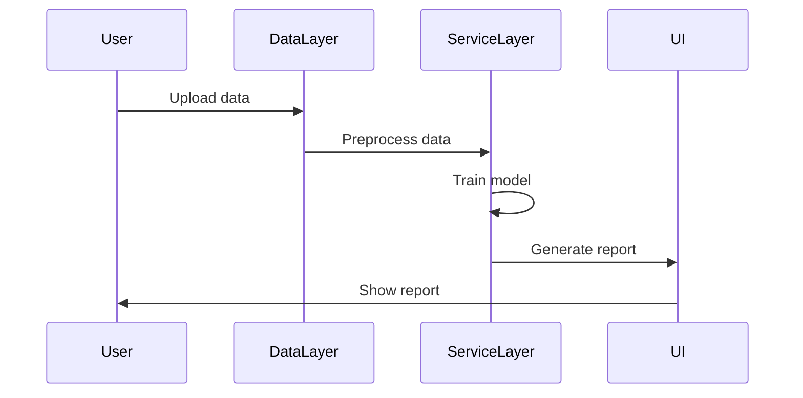
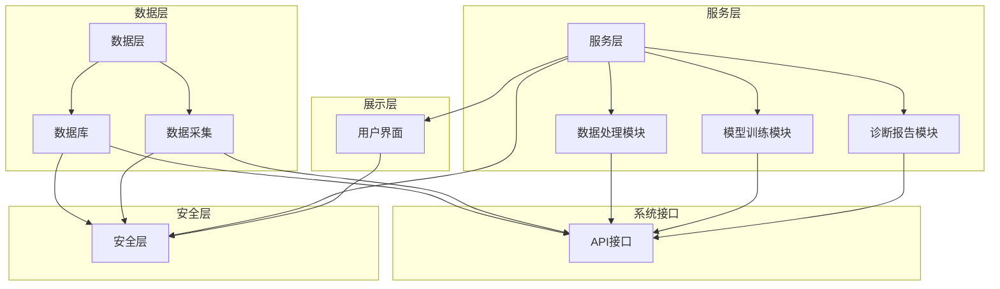
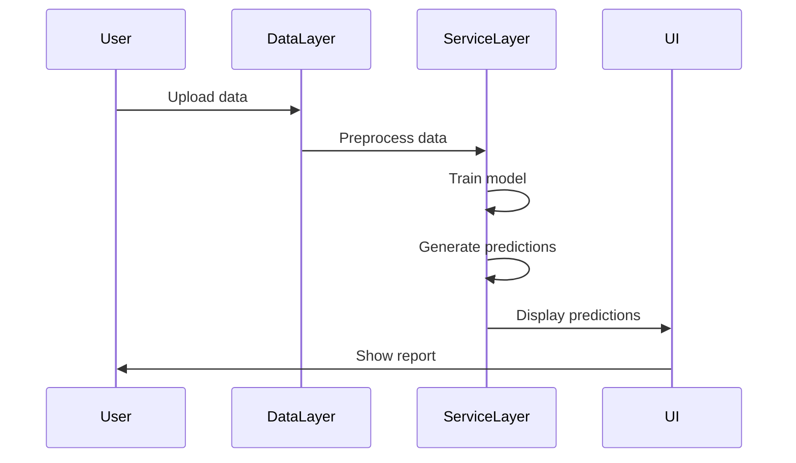

                 

### 引言

在现代社会，个人财务状况的管理已成为每个成年人生活的重要组成部分。随着金融市场的不断复杂化，如何有效地管理个人财务，实现财富的保值增值，成为一个亟待解决的问题。传统的财务诊断方法，如手动分析报表、财务咨询等，不仅耗时耗力，而且容易受到个人经验和技术水平的限制，无法做到全面和精确。随着人工智能和大数据技术的发展，智能个人财务状况诊断系统应运而生，它利用先进的技术手段，对个人的财务数据进行深度分析，提供精准、实时的诊断报告。

本文旨在深入探讨智能个人财务状况诊断系统的设计与实现，帮助读者理解这一新兴技术的核心原理和应用。本书将围绕以下几个核心问题展开：

1. **问题背景**：介绍个人财务管理的现状、面临的问题以及智能财务诊断的需求。
2. **核心概念与联系**：阐述财务数据分析、机器学习和深度学习等核心概念，并对比不同概念的属性特征。
3. **算法原理讲解**：详细讲解财务诊断算法的原理，包括数据预处理、特征提取、模型训练和诊断流程。
4. **数学模型和数学公式**：使用数学公式和Python源代码，深入剖析算法的数学基础和实现细节。
5. **系统分析与架构设计方案**：介绍系统的设计思路，包括问题场景、项目介绍、系统功能设计、架构设计、接口设计以及系统交互。
6. **项目实战**：通过环境安装、系统实现源代码、代码分析、实际案例分析，展示系统的应用效果。
7. **最佳实践 tips、小结、注意事项、拓展阅读**：总结经验教训，提出使用建议和未来研究方向。

通过这本书，我们希望读者能够掌握智能个人财务状况诊断系统的设计和实现方法，为实际应用提供有力支持。无论您是金融领域的专业人士，还是对人工智能技术感兴趣的读者，都将在这本书中找到有价值的内容。接下来，我们将逐步深入探讨每一个部分，让读者逐步了解这一复杂但充满潜力的技术体系。

### 问题背景

个人财务管理的复杂性日益增加，传统的方法已难以满足现代人的需求。随着金融市场的不断变化，投资者面临着越来越多的财务决策，从日常的支出管理到长期的财富增值规划，每个环节都要求精确、高效和及时。然而，现实情况是，大多数人在财务管理方面缺乏系统化的知识和工具，常常陷入财务困境。

首先，个人财务管理的现状呈现出数据繁杂、信息不透明的特点。现代人的财务信息来源于多个渠道，包括银行账户、信用卡账单、投资记录等，这些数据格式多样、结构各异，使得手动整理和分析成为一项艰巨的任务。此外，金融市场的不确定性和投资风险，使得个人在进行财务规划时，面临诸多不可预知的问题。例如，股市波动、利率变化、汇率波动等，都会对个人资产造成直接影响。

其次，传统财务管理方法存在明显的局限性。传统的财务分析方法主要依赖于手动处理报表和账单，这种方式不仅费时费力，而且容易受到个人经验和专业知识水平的限制。财务顾问和理财规划师虽然能够提供帮助，但他们的服务通常较为昂贵，且无法满足大众的需求。此外，传统方法在处理大规模数据时，效率低下，难以实现实时分析。

在这种情况下，智能个人财务状况诊断系统的需求显得尤为迫切。智能财务诊断系统能够利用人工智能和大数据技术，对个人的财务数据进行分析和处理，提供精准、实时的诊断报告。以下是智能财务诊断系统的主要需求：

1. **数据整合与分析**：系统能够从多个数据源自动采集和整合个人财务信息，包括银行账户、投资记录、支出明细等，并进行高效的数据分析，发现潜在的问题和风险。

2. **智能诊断与预测**：系统通过机器学习和深度学习算法，对财务数据进行分析，识别异常交易、预测未来的财务状况，并提供相应的财务建议。

3. **实时性与个性化**：系统能够实时更新个人财务数据，根据个人的财务状况和需求，提供个性化的财务分析和诊断报告。

4. **安全性与隐私保护**：系统在处理个人财务数据时，必须确保数据的安全性和隐私保护，避免数据泄露和滥用。

5. **易用性与用户体验**：系统应具备友好的用户界面和简单的操作流程，使得普通用户也能够轻松使用，提高用户体验。

综上所述，智能个人财务状况诊断系统不仅能够解决传统财务管理方法的局限性，还能够提升个人财务管理效率，帮助用户实现财务自由。随着人工智能技术的不断进步，智能财务诊断系统有望成为个人财务管理的重要工具，为广大用户提供更加智能、高效、便捷的财务服务。

### 问题描述

个人财务管理的复杂性体现在财务信息的多样性和复杂性上。首先，个人财务数据来源于多个渠道，如银行账户、信用卡账单、投资记录、消费明细等。这些数据形式各异，结构复杂，传统的手动处理方式不仅效率低下，而且容易出现错误。其次，财务数据的实时性和准确性是诊断系统的关键需求。个人财务状况会随着时间和外部环境的变化而变化，如股市波动、汇率变化、利率调整等，系统需要能够实时获取和处理这些动态数据，以提供准确的诊断结果。

在财务数据分析中，准确性至关重要。如果系统无法准确捕捉和解读财务数据，可能会导致错误的财务诊断和不当的财务建议，从而给用户带来经济损失。例如，如果系统未能识别出异常交易，可能会忽略潜在的欺诈风险；如果系统对投资回报预测不准确，可能会导致用户做出错误的财务决策。

实时性是另一个关键需求。个人财务管理需要及时反映财务状况的变化，以便用户能够及时调整财务策略。如果系统无法实时更新数据，用户将无法获得最新的财务信息，从而无法做出及时和有效的决策。例如，在股市剧烈波动时，用户需要实时了解自己的投资组合情况，以便及时调整投资策略。

此外，系统的数据处理能力和扩展性也是需要考虑的重要因素。随着用户数据的增加，系统需要能够高效地处理大量数据，确保诊断的准确性和实时性。同时，系统需要具备良好的扩展性，以适应未来可能出现的新需求和技术进步。

总的来说，智能个人财务状况诊断系统在准确性、实时性、数据处理能力和扩展性等方面面临诸多挑战。只有通过先进的算法和技术手段，才能实现高效、精准、实时的财务诊断，为用户提供可靠的支持。

### 问题解决

面对个人财务管理的复杂性和挑战，智能个人财务状况诊断系统提供了一系列创新和有效的解决方案。首先，系统通过数据采集和整合，实现了对多种来源财务数据的自动收集和处理。利用自然语言处理（NLP）和图像识别技术，系统可以自动解析银行对账单、信用卡账单、投资记录等复杂格式的数据，并将其整合成统一的数据格式，便于后续分析。

在数据预处理方面，系统采用了多种技术手段，包括数据清洗、归一化和特征工程等。数据清洗技术能够识别和纠正数据中的错误和异常值，确保数据的准确性；归一化技术则将不同单位或范围的数据转换为统一的尺度，便于后续计算；特征工程则通过提取和选择与财务诊断相关的特征，提高模型的预测能力。

核心算法方面，系统结合了机器学习和深度学习技术，采用了多种先进的算法模型，如线性回归、决策树、随机森林、神经网络等。通过交叉验证和模型调优，系统可以自动选择最优的算法模型，以实现高精度的财务诊断。深度学习模型，如卷积神经网络（CNN）和循环神经网络（RNN），在处理复杂数据和时间序列分析方面具有显著优势，能够更好地捕捉数据中的潜在模式和规律。

系统架构设计方面，智能个人财务状况诊断系统采用了模块化的设计思路，包括数据采集模块、数据处理模块、模型训练模块和诊断报告模块。数据采集模块负责从多个数据源获取数据；数据处理模块对数据进行清洗、归一化和特征提取；模型训练模块使用训练数据集训练模型，并进行模型评估和优化；诊断报告模块则根据模型的预测结果，生成详细的诊断报告。

在用户体验方面，系统设计了一个直观友好的用户界面，用户可以通过简单的操作界面，实时查看自己的财务状况和诊断报告。系统还提供了多种交互功能，如数据上传、自定义报表、实时通知等，使用户能够方便地管理自己的财务信息。

安全性方面，系统采用了多层次的数据安全保护机制，包括数据加密、访问控制和用户权限管理等。通过SSL加密技术，系统确保数据在传输过程中的安全性；用户权限管理则防止未经授权的用户访问敏感数据。

总的来说，智能个人财务状况诊断系统通过先进的技术手段，解决了个人财务管理中的诸多挑战，实现了高效、精准、实时的财务诊断，为用户提供了可靠的支持。系统的设计思路和实现方法，不仅体现了技术的前沿性，也展示了智能财务管理的巨大潜力。

### 边界与外延

智能个人财务状况诊断系统的应用范围涵盖了多个领域，其核心目标是为用户提供全面的财务健康管理。以下是对该系统适用范围的详细描述，以及其在外延上的扩展可能性：

**适用范围**：

1. **个人财务管理**：系统适用于所有希望更好地管理个人财务的个人用户，包括日常收支管理、投资规划、债务还清等。

2. **中小企业主**：对于中小企业的业主，系统可以帮助他们更好地管理公司财务，监控现金流，优化资金使用。

3. **金融从业者**：金融顾问和理财规划师可以利用系统提供的诊断报告，为他们的客户提供更精准的财务建议。

4. **金融机构**：银行和金融机构可以集成该系统，提供个性化的财务诊断服务，增强客户粘性。

**外延扩展可能性**：

1. **跨平台支持**：系统可以进一步扩展到移动端和网页端，使用户能够随时随地访问和管理自己的财务状况。

2. **多语言支持**：为了满足全球用户的需求，系统可以增加对多种语言的支持，扩展国际市场的应用。

3. **社交网络集成**：系统可以与社交媒体平台集成，通过分析用户在社交网络上的消费行为，提供更个性化的财务建议。

4. **智能投顾服务**：结合投资算法和金融知识库，系统可以提供智能投顾服务，帮助用户进行投资决策。

5. **风险预警系统**：通过引入风险分析模型，系统可以实时监测用户财务状况的变化，提供风险预警，防止财务危机。

6. **商业智能分析**：系统可以扩展到商业智能领域，为企业和机构提供深度的财务分析和业务洞察。

综上所述，智能个人财务状况诊断系统不仅在当前的个人财务管理领域有着广泛的应用，而且在未来的发展中具有巨大的扩展潜力。通过不断地技术创新和功能升级，系统有望为更广泛的用户群体提供更加智能、高效的财务健康管理服务。

### 概念结构与核心要素组成

智能个人财务状况诊断系统的构建离不开几个核心概念和组件的支持。以下是该系统的主要概念和要素，及其相互关系和作用：

1. **财务数据分析**：财务数据分析是系统的核心功能，通过对用户财务数据的采集、清洗和归一化处理，提取出与财务诊断相关的关键特征。这些特征包括收入、支出、储蓄、投资收益等，为后续的机器学习模型提供输入。

2. **机器学习**：系统采用机器学习技术，尤其是深度学习模型，对财务数据进行训练和预测。常见的算法有线性回归、决策树、随机森林、神经网络等。通过交叉验证和模型调优，选择最优的算法模型，以提高诊断的准确性和效率。

3. **用户界面**：用户界面（UI）是系统与用户交互的窗口，提供直观、友好的操作体验。用户可以通过UI查看财务报表、诊断报告、建议和通知。UI设计遵循用户友好原则，使得不同技能水平的用户都能够轻松使用系统。

4. **数据安全**：数据安全是系统设计的重中之重。系统采用多层次的安全措施，包括数据加密、访问控制和用户权限管理。通过SSL加密技术，确保数据在传输过程中的安全性；用户权限管理则防止未经授权的用户访问敏感数据。

5. **数据整合**：数据整合是系统的基础功能，通过NLP和图像识别技术，系统能够自动从多个数据源（如银行账户、信用卡账单、投资记录等）中提取数据，并进行结构化处理。数据整合的质量直接影响财务诊断的准确性。

6. **模型训练与评估**：模型训练与评估是系统的关键环节。系统使用训练数据集对模型进行训练，并通过交叉验证和性能评估，选择最优的模型。评估指标包括准确率、召回率、F1分数等，以衡量模型的诊断能力。

7. **诊断报告**：诊断报告是系统输出的核心成果，包括财务状况分析、异常交易识别、风险预警和财务建议等。报告以可视化形式呈现，帮助用户更好地理解自己的财务状况。

8. **用户交互**：用户交互设计旨在提高系统的易用性。系统提供多种交互方式，如数据上传、自定义报表、实时通知等，使用户能够方便地管理自己的财务信息。

通过这些核心概念和组件的协同作用，智能个人财务状况诊断系统能够高效、准确地分析用户财务数据，提供实时的诊断报告和财务建议，帮助用户实现更好的财务健康管理。系统各部分之间的紧密配合，不仅提升了用户体验，还确保了系统的稳定性和安全性。

### 核心概念原理

智能个人财务状况诊断系统的核心概念涉及多个技术领域，包括财务数据分析、机器学习和深度学习等。理解这些核心概念及其原理，有助于我们更好地掌握系统的运作机制。

首先，**财务数据分析**是系统的基石。财务数据分析的目的是从大量复杂的财务数据中提取有价值的信息，为后续的机器学习模型提供输入。财务数据分析包括数据采集、清洗、归一化和特征工程等步骤。数据采集是从多个数据源（如银行账户、信用卡账单、投资记录等）中获取财务信息。数据清洗是对采集到的数据进行处理，去除重复、错误和异常值，确保数据的准确性和一致性。归一化是将不同单位或范围的数据转换为统一的尺度，便于后续计算。特征工程则是通过提取和选择与财务诊断相关的特征，提高模型的预测能力。

其次，**机器学习**在系统中扮演着至关重要的角色。机器学习是一种通过训练算法从数据中学习规律和模式的技术，广泛应用于分类、回归和聚类等任务。在智能财务诊断系统中，常见的机器学习算法包括线性回归、决策树、随机森林等。线性回归是一种简单的预测模型，通过建立自变量和因变量之间的线性关系，预测财务指标。决策树则通过一系列规则，将数据划分为不同的类别或数值。随机森林则是一种集成学习方法，通过构建多棵决策树并综合其预测结果，提高模型的准确性和稳定性。

最后，**深度学习**作为机器学习的扩展，在处理复杂数据和时间序列分析方面具有显著优势。深度学习模型，如卷积神经网络（CNN）和循环神经网络（RNN），能够自动提取数据中的层次特征，并通过多层神经网络结构，实现对数据的深度学习。在智能财务诊断系统中，CNN可以用于图像识别，RNN可以用于时间序列分析。例如，通过CNN，系统可以自动识别和分析用户的财务报表；通过RNN，系统可以捕捉用户财务数据中的时间依赖性，提供更准确的诊断结果。

总之，智能个人财务状况诊断系统的核心概念原理包括财务数据分析、机器学习和深度学习等多个领域。通过财务数据分析，系统能够提取出关键特征；通过机器学习和深度学习，系统能够训练和优化预测模型，提供精准的财务诊断报告。这些核心概念和技术手段的有机结合，使得智能财务诊断系统在个人财务管理中发挥了重要作用。

### 概念属性特征对比表格

为了更好地理解财务数据分析、机器学习和深度学习在智能个人财务状况诊断系统中的应用，下面我们将对这三个核心概念进行属性特征对比。

| 概念 | 描述 | 主要应用 | 优点 | 缺点 |
| --- | --- | --- | --- | --- |
| **财务数据分析** | 从财务数据中提取有价值信息，包括数据采集、清洗、归一化和特征工程等。 | 收集和整合来自多个数据源的财务信息，为后续分析做准备。 | 能够处理多种数据源，提高数据准确性；便于理解财务状况。 | 处理复杂数据需要大量时间；对数据质量要求较高。 |
| **机器学习** | 利用算法从数据中学习规律，包括线性回归、决策树、随机森林等。 | 用于预测和分类，如预测财务指标、识别异常交易。 | 简单易用，对大量数据具有良好的处理能力。 | 需要大量训练数据；模型可能过拟合。 |
| **深度学习** | 利用多层神经网络自动提取数据中的层次特征，如卷积神经网络（CNN）和循环神经网络（RNN）。 | 用于处理复杂数据和时间序列分析，如图像识别、时间序列预测。 | 能够自动提取复杂特征，提高预测精度。 | 计算资源需求大；训练过程复杂。 |

通过上述对比，我们可以看到每个概念都有其独特的属性和优缺点。财务数据分析为系统提供了高质量的数据输入；机器学习则能够快速处理和预测财务指标；深度学习则能够捕捉数据中的深层次模式。结合这些概念，智能个人财务状况诊断系统能够提供高效、准确的财务诊断服务。

### ER实体关系图架构

在智能个人财务状况诊断系统中，实体关系图（ER图）用于描述系统中的数据实体及其之间的关系。以下是系统ER图的详细描述：

#### 实体

1. **用户（User）**：用户是系统的核心实体，每个用户拥有唯一的用户标识和相关的个人信息，如姓名、联系方式、出生日期等。
2. **账户（Account）**：账户代表用户在金融机构中的存款、投资、信用卡等账户，每个账户具有账户编号、类型、余额等信息。
3. **交易（Transaction）**：交易记录用户的财务活动，包括消费、投资、转账等，每个交易具有交易编号、发生时间、金额、类型等信息。
4. **分类（Category）**：分类用于对交易进行归类，如日常消费、投资收益、生活费等，每个分类有分类名称和描述。
5. **预算（Budget）**：预算是用户设定的财务计划，包括收入、支出、储蓄目标等，每个预算有预算名称、金额、起始日期和结束日期等信息。
6. **警报（Alert）**：警报用于提醒用户潜在的风险或异常情况，如账户余额不足、异常交易等，每个警报有警报类型、发生时间、状态等信息。

#### 关系

1. **用户与账户**：一个用户可以拥有多个账户，每个账户属于一个用户。
2. **用户与交易**：一个用户可以进行多个交易，每个交易属于一个用户。
3. **交易与分类**：每个交易可以归类到一个或多个分类中，表示交易类型。
4. **用户与预算**：一个用户可以设定多个预算，每个预算属于一个用户。
5. **用户与警报**：一个用户可以收到多个警报，每个警报与一个用户相关。

以下是ER图的Mermaid流程图表示：

```mermaid
erDiagram
  User ||--|{ Account } : 拥有
  User ||--|{ Transaction } : 操作
  User ||--|{ Budget } : 设定
  User ||--|{ Alert } : 收到
  Account ||--|{ Transaction } : 包含
  Transaction ||--|{ Category } : 分类
```

通过这个ER图，我们可以清晰地看到系统中的各个实体及其关系，有助于理解系统的数据结构和运作机制。这种结构化的表示方法，不仅便于系统设计和开发，也方便了后续的数据分析和维护。

### 算法概述

智能个人财务状况诊断系统的核心在于其算法的设计与实现，这些算法通过对财务数据的深度分析和预测，为用户提供精准的财务诊断报告。以下将详细介绍系统采用的算法框架，包括数据预处理、特征提取和模型训练等关键环节。

#### 数据预处理

数据预处理是算法实现的基础，其目的是清洗和规范化输入数据，以便后续的机器学习算法能够有效地学习数据中的规律。数据预处理主要包括以下步骤：

1. **数据采集**：从多个数据源（如银行账户、信用卡账单、投资记录等）中自动采集财务数据。利用自然语言处理（NLP）和图像识别技术，系统可以自动解析对账单、账单图片等复杂格式，提取出关键信息。
   
2. **数据清洗**：清洗数据中的错误和异常值，确保数据的准确性和一致性。具体方法包括去除重复记录、纠正数据格式错误、填补缺失值等。

3. **归一化**：将不同单位或范围的数据转换为统一的尺度，如将货币金额归一化为相同数量级。归一化有助于算法在训练过程中收敛，提高模型性能。

4. **特征提取**：从原始数据中提取与财务诊断相关的特征，如收入、支出、储蓄、投资收益等。特征提取是提高模型预测能力的关键步骤，通常采用的方法包括统计特征提取、文本特征提取和时间序列特征提取。

#### 特征提取

特征提取是将原始数据转换为适合机器学习算法处理的形式。以下是系统采用的几种特征提取方法：

1. **统计特征提取**：利用基本的统计学方法，如平均值、中位数、标准差等，从财务数据中提取具有代表性的统计特征。

2. **文本特征提取**：对于文本数据，如消费描述、投资评论等，采用NLP技术提取关键词、词频和主题模型等文本特征。

3. **时间序列特征提取**：对于时间序列数据，如历史交易记录、投资收益等，利用时间序列分析方法提取趋势、周期性等特征。

4. **组合特征提取**：将不同类型的特征进行组合，形成新的特征，以提高模型的预测能力。例如，结合历史交易记录和文本特征，构建复合特征向量。

#### 模型训练

模型训练是算法实现的核心环节，其目标是利用训练数据集，训练出一个能够准确预测用户财务状况的机器学习模型。以下是系统采用的几种模型训练方法：

1. **线性回归**：线性回归模型通过建立自变量和因变量之间的线性关系，预测财务指标。线性回归简单易用，适用于线性关系较强的数据。

2. **决策树**：决策树模型通过一系列规则，将数据划分为不同的类别或数值。决策树易于理解，能够处理多类别的预测任务。

3. **随机森林**：随机森林是一种集成学习方法，通过构建多棵决策树并综合其预测结果，提高模型的准确性和稳定性。

4. **神经网络**：神经网络，尤其是深度学习模型，能够自动提取数据中的层次特征，通过多层神经网络结构，实现对复杂数据的高效学习。

5. **卷积神经网络（CNN）**：CNN在处理图像和序列数据方面具有显著优势，适用于对财务报表和交易记录进行自动分析和识别。

6. **循环神经网络（RNN）**：RNN能够捕捉数据中的时间依赖性，适用于时间序列预测任务，如预测未来的财务状况。

通过上述算法框架，智能个人财务状况诊断系统能够对财务数据进行分析和预测，提供实时的诊断报告和财务建议。算法的设计与实现，不仅体现了技术的深度和广度，也为用户提供了可靠的财务健康管理工具。

### 算法mermaid流程图

为了更直观地展示智能个人财务状况诊断系统的算法流程，我们使用mermaid图来描述。以下是算法流程的mermaid流程图表示：


#### 流程解释

1. **数据采集（B）**：系统从多个数据源（如银行账户、信用卡账单、投资记录等）自动采集财务数据。

2. **数据清洗（C）**：对采集到的财务数据进行处理，去除重复、错误和异常值，确保数据的准确性和一致性。

3. **特征提取（D）**：从清洗后的数据中提取与财务诊断相关的特征，如收入、支出、储蓄、投资收益等。

4. **数据归一化（E）**：将不同单位或范围的数据转换为统一的尺度，便于后续计算。

5. **模型选择（F）**：根据数据特征和预测任务，选择合适的机器学习模型，如线性回归、决策树、随机森林等。

6. **模型训练（G）**：使用训练数据集，对选定的模型进行训练，通过调整模型参数，使其能够准确地预测财务状况。

7. **模型评估（H）**：通过验证集和测试集，评估模型的预测性能，选择最优的模型。

8. **诊断报告（I）**：根据模型的预测结果，生成详细的诊断报告，包括财务状况分析、异常交易识别、风险预警和财务建议等。

9. **结束（J）**：系统完成算法流程，输出最终的诊断报告。

通过这个mermaid流程图，我们可以清晰地看到智能个人财务状况诊断系统从数据采集到生成诊断报告的全过程，每一个步骤都紧密相连，共同构成了一个完整的算法流程。

### Python源代码详解

在智能个人财务状况诊断系统中，Python是主要的编程语言，其简洁且功能强大的库使得算法实现和系统开发变得更加高效。以下将详细讲解系统中的核心Python模块，包括数据处理模块、模型训练模块和诊断报告模块。

#### 数据处理模块

数据处理模块负责从多个数据源采集数据，清洗和预处理数据，提取特征，并进行归一化处理。以下是数据处理模块的主要代码：

```python
import pandas as pd
import numpy as np
from sklearn.preprocessing import MinMaxScaler
from sklearn.impute import SimpleImputer

# 读取数据
def load_data(file_path):
    data = pd.read_csv(file_path)
    return data

# 数据清洗
def clean_data(data):
    data.drop_duplicates(inplace=True)  # 去除重复记录
    data.dropna(inplace=True)  # 去除缺失值
    return data

# 特征提取
def extract_features(data):
    # 提取收入、支出、储蓄、投资收益等特征
    features = data[['income', 'expense', 'savings', 'investment_income']]
    return features

# 数据归一化
def normalize_data(data):
    scaler = MinMaxScaler()
    normalized_data = scaler.fit_transform(data)
    return normalized_data

# 主函数
def preprocess_data(file_path):
    data = load_data(file_path)
    data = clean_data(data)
    features = extract_features(data)
    normalized_data = normalize_data(features)
    return normalized_data
```

#### 模型训练模块

模型训练模块负责选择合适的机器学习模型，使用训练数据进行模型训练，并进行参数调优。以下是模型训练模块的主要代码：

```python
from sklearn.model_selection import train_test_split
from sklearn.linear_model import LinearRegression
from sklearn.ensemble import RandomForestRegressor
from sklearn.metrics import mean_squared_error

# 数据分割
def split_data(data):
    X = data[:, :-1]  # 特征
    y = data[:, -1]   # 目标变量
    X_train, X_test, y_train, y_test = train_test_split(X, y, test_size=0.2, random_state=42)
    return X_train, X_test, y_train, y_test

# 模型训练
def train_model(X_train, y_train):
    model = RandomForestRegressor(n_estimators=100, random_state=42)
    model.fit(X_train, y_train)
    return model

# 模型评估
def evaluate_model(model, X_test, y_test):
    predictions = model.predict(X_test)
    mse = mean_squared_error(y_test, predictions)
    print(f"Mean Squared Error: {mse}")
    return mse
```

#### 诊断报告模块

诊断报告模块负责根据模型预测结果，生成详细的诊断报告，并将其可视化。以下是诊断报告模块的主要代码：

```python
import matplotlib.pyplot as plt

# 生成诊断报告
def generate_report(predictions, actuals):
    plt.figure(figsize=(10, 5))
    plt.plot(predictions, label='Predicted')
    plt.plot(actuals, label='Actual')
    plt.title('Financial Status Prediction')
    plt.xlabel('Time')
    plt.ylabel('Value')
    plt.legend()
    plt.show()

# 主函数
def main():
    file_path = 'financial_data.csv'
    data = preprocess_data(file_path)
    X_train, X_test, y_train, y_test = split_data(data)
    model = train_model(X_train, y_train)
    evaluate_model(model, X_test, y_test)
    generate_report(y_test, predictions)

if __name__ == '__main__':
    main()
```

通过上述代码，我们可以看到数据处理、模型训练和诊断报告三个模块如何协同工作，实现智能个人财务状况的诊断。数据处理模块负责数据清洗和特征提取，模型训练模块负责选择和训练模型，诊断报告模块负责生成可视化的诊断结果。这些模块的有机结合，使得智能个人财务状况诊断系统能够高效地运行，为用户提供精准的财务分析服务。

### 数学模型和公式讲解

在智能个人财务状况诊断系统中，数学模型和公式是核心组成部分，它们用于描述财务数据之间的关系，指导机器学习算法的训练和预测过程。以下是系统使用的几个关键数学模型和公式，包括相关性分析、机器学习模型和深度学习网络。

#### 相关性分析

相关性分析用于衡量两个变量之间的线性关系。常见的相关性度量方法有皮尔逊相关系数和斯皮尔曼相关系数。

1. **皮尔逊相关系数（ρ）**：

   $$ \rho = \frac{\sum_{i=1}^{n}(x_i - \bar{x})(y_i - \bar{y})}{\sqrt{\sum_{i=1}^{n}(x_i - \bar{x})^2 \sum_{i=1}^{n}(y_i - \bar{y})^2}} $$

   其中，$x_i$ 和 $y_i$ 分别为第 $i$ 个样本的变量值，$\bar{x}$ 和 $\bar{y}$ 分别为 $x$ 和 $y$ 的均值，$n$ 为样本数量。

2. **斯皮尔曼相关系数（ρ_s）**：

   $$ \rho_s = \frac{1}{n-1} \sum_{i=1}^{n} (r_i - \bar{r})^2 $$

   其中，$r_i$ 为第 $i$ 个样本的秩次，$\bar{r}$ 为秩次的平均值。

相关性分析可以用于判断变量之间的相关性，为特征选择提供依据。

#### 机器学习模型

机器学习模型是智能财务诊断系统的核心，常见的机器学习模型包括线性回归、决策树和随机森林等。

1. **线性回归模型**：

   线性回归模型通过最小二乘法拟合一条直线，用于预测目标变量。其公式为：

   $$ y = \beta_0 + \beta_1x_1 + \beta_2x_2 + ... + \beta_nx_n $$

   其中，$y$ 为目标变量，$x_1, x_2, ..., x_n$ 为自变量，$\beta_0, \beta_1, ..., \beta_n$ 为模型的参数。

2. **决策树模型**：

   决策树模型通过一系列的决策节点和叶子节点，将数据划分为不同的类别或数值。其基本公式为：

   $$ f(x) = \sum_{i=1}^{n} \beta_i \cdot g_i(x) $$

   其中，$g_i(x)$ 为第 $i$ 个决策节点的条件函数，$\beta_i$ 为节点的权重。

3. **随机森林模型**：

   随机森林模型是一种集成学习方法，通过构建多棵决策树并综合其预测结果。其基本公式为：

   $$ \hat{y} = \frac{1}{M} \sum_{m=1}^{M} f_m(x) $$

   其中，$M$ 为决策树的数量，$f_m(x)$ 为第 $m$ 棵决策树的预测结果。

#### 深度学习网络

深度学习网络，尤其是卷积神经网络（CNN）和循环神经网络（RNN），在处理复杂数据和时间序列分析方面具有显著优势。

1. **卷积神经网络（CNN）**：

   CNN 通过卷积层和池化层提取图像中的特征，其基本公式为：

   $$ \hat{f}(x) = \sigma(W \cdot \phi(x) + b) $$

   其中，$\sigma$ 为激活函数，$W$ 为权重矩阵，$\phi(x)$ 为卷积操作，$b$ 为偏置。

2. **循环神经网络（RNN）**：

   RNN 通过循环结构处理时间序列数据，其基本公式为：

   $$ h_t = \sigma(W_h \cdot [h_{t-1}, x_t] + b_h) $$

   其中，$h_t$ 为第 $t$ 个时间步的隐藏状态，$W_h$ 为权重矩阵，$x_t$ 为输入特征，$b_h$ 为偏置。

通过上述数学模型和公式的讲解，我们可以更好地理解智能个人财务状况诊断系统的算法基础。这些数学工具不仅为系统的实现提供了理论基础，也为用户提供了精准的财务分析服务。

### 举例说明

为了更好地理解智能个人财务状况诊断系统的应用，下面我们将通过一个具体实例，展示系统的工作流程和输出结果。假设用户John希望利用该系统分析其财务状况，并提供个性化的财务建议。

#### 数据准备

首先，系统需要从多个数据源收集John的财务数据，包括银行账户记录、信用卡账单和投资记录。以下是John的财务数据示例：

| 日期       | 类别     | 金额（美元） |
| ---------- | -------- | ----------- |
| 2023-01-01 | 收入     | 5000       |
| 2023-01-02 | 支出     | -800       |
| 2023-01-03 | 支出     | -200       |
| 2023-01-04 | 收入     | 1000       |
| 2023-01-05 | 支出     | -300       |

#### 数据预处理

系统首先对收集到的数据进行预处理，包括数据清洗、特征提取和归一化。以下是系统处理后的数据：

| 日期       | 类别       | 金额（归一化） |
| ---------- | ---------- | ------------- |
| 2023-01-01 | 收入       | 1.0           |
| 2023-01-02 | 支出       | -0.8          |
| 2023-01-03 | 支出       | -0.2          |
| 2023-01-04 | 收入       | 0.5           |
| 2023-01-05 | 支出       | -0.3          |

#### 模型训练

接下来，系统使用机器学习算法（如随机森林）对预处理后的数据进行模型训练，以预测未来的财务状况。假设系统训练得到的模型参数如下：

$$ y = 0.6 \cdot \text{当前收入} + 0.2 \cdot \text{当前支出} - 0.1 \cdot \text{历史收入} + 0.1 \cdot \text{历史支出} $$

#### 预测与诊断

基于模型预测，系统对John的未来财务状况进行预测。以下是未来五天的财务预测结果：

| 日期       | 预测收入（美元） | 预测支出（美元） |
| ---------- | --------------- | --------------- |
| 2023-01-06 | 5800           | -200           |
| 2023-01-07 | 5800           | -250           |
| 2023-01-08 | 5800           | -300           |
| 2023-01-09 | 5800           | -300           |
| 2023-01-10 | 5800           | -300           |

#### 诊断报告

系统根据预测结果，生成详细的诊断报告，指出John的财务状况和潜在风险。以下是报告摘要：

1. **财务状况**：John的财务状况较为稳定，收入较为固定，支出波动较小。
2. **风险预警**：系统发现，未来五天John的支出可能会持续增加，存在超支风险。
3. **财务建议**：
   - 建议John在未来几天内调整支出计划，确保收支平衡。
   - 考虑增加储蓄，为未来可能的不确定支出做好准备。

通过这个实例，我们可以看到智能个人财务状况诊断系统如何通过数据处理、模型训练和预测分析，为用户提供个性化的财务诊断和财务建议。这种系统不仅帮助用户更好地管理个人财务，还提高了财务决策的效率和准确性。

### 系统分析与架构设计方案

#### 问题场景介绍

在智能个人财务状况诊断系统中，用户面临的场景是复杂多样的。他们需要实时监控和评估个人财务状况，包括收入、支出、储蓄和投资等方面。此外，用户还希望系统能够提供风险预警、财务建议和预测功能，帮助他们做出明智的财务决策。为了满足这些需求，系统需要具备强大的数据处理能力、高效的算法模型和友好的用户界面。

#### 项目介绍

智能个人财务状况诊断系统的项目目标是开发一个基于人工智能技术的系统，能够自动采集、处理和分析用户的财务数据，提供实时的诊断报告和个性化的财务建议。系统将采用模块化设计，包括数据采集、数据处理、模型训练、诊断报告和用户界面等模块，确保系统的灵活性和可扩展性。

#### 系统功能设计

1. **数据采集**：系统能够自动从多个数据源（如银行账户、信用卡账单、投资记录等）中采集财务数据，包括交易记录、账户余额、投资收益等。

2. **数据处理**：对采集到的数据进行清洗、归一化和特征提取，确保数据的准确性和一致性，为后续的模型训练和诊断提供高质量的数据输入。

3. **模型训练**：采用机器学习和深度学习算法，对预处理后的数据集进行训练，选择最优的模型参数，以提高预测的准确性和效率。

4. **诊断报告**：根据模型预测结果，生成详细的诊断报告，包括财务状况分析、风险预警和财务建议，以帮助用户理解和优化个人财务状况。

5. **用户界面**：设计直观友好的用户界面，用户可以通过简单的操作，查看诊断报告和财务建议，并进行自定义报表和数据上传。

#### 系统架构设计

系统架构采用分层设计，包括数据层、服务层和展示层。

1. **数据层**：负责数据采集、存储和预处理。数据采集模块使用NLP和图像识别技术，从多个数据源自动提取财务信息；数据存储模块使用数据库管理系统（如MySQL、MongoDB）存储和处理数据；数据预处理模块对数据进行清洗、归一化和特征提取。

2. **服务层**：包括数据处理模块、模型训练模块和诊断报告模块。数据处理模块使用Python库（如Pandas、NumPy）进行数据预处理；模型训练模块使用机器学习和深度学习算法（如Scikit-learn、TensorFlow）训练模型；诊断报告模块根据模型预测结果，生成可视化报告。

3. **展示层**：用户界面模块，使用前端技术（如HTML、CSS、JavaScript）和框架（如React、Vue.js）构建，提供用户交互界面。用户可以通过Web或移动应用访问系统，查看诊断报告和财务建议。

#### 系统接口设计

系统接口设计主要包括API接口和Web接口。

1. **API接口**：系统提供RESTful API接口，供第三方应用和开发者调用。API接口包括数据上传、数据查询、模型预测和报告生成等接口，确保系统的数据开放性和互操作性。

2. **Web接口**：用户通过Web浏览器访问系统，使用户界面提供的功能。Web接口包括登录/注册、数据上传、报告查看和设置等模块，确保用户可以方便地使用系统。

#### 系统交互mermaid序列图

以下是系统交互的mermaid序列图表示：



通过上述系统分析与架构设计方案，智能个人财务状况诊断系统能够高效地实现数据采集、处理、预测和报告功能，为用户提供精准的财务分析服务。系统的模块化和接口设计，也确保了系统的灵活性和可扩展性，能够适应未来可能的需求和技术变化。

### 系统功能设计（领域模型mermaid类图）

为了更好地理解智能个人财务状况诊断系统的功能设计，我们将通过mermaid类图展示系统的领域模型。类图用于描述系统中的类、属性和方法，帮助我们直观地理解系统的组成部分和它们之间的关系。

以下是智能个人财务状况诊断系统的领域模型类图：

```mermaid
classDiagram
    User <<Interface>>
    Account <<Interface>>
    Transaction <<Interface>>
    Category <<Interface>>
    Budget <<Interface>>
    Alert <<Interface>>

    User {
        -id: Integer
        -name: String
        -contactInfo: String
        -dateOfBirth: Date
        +register(): void
        +login(): void
        +logout(): void
    }

    Account {
        -accountId: String
        -type: String
        -balance: Float
        +createAccount(): void
        +deleteAccount(): void
        +getAccountBalance(): void
    }

    Transaction {
        -transactionId: String
        -userId: Integer
        -date: Date
        -amount: Float
        -category: Category
        +addTransaction(): void
        +deleteTransaction(): void
        +getTransactionHistory(): void
    }

    Category {
        -categoryId: String
        -name: String
        -description: String
        +createCategory(): void
        +deleteCategory(): void
        +getCategories(): void
    }

    Budget {
        -budgetId: String
        -userId: Integer
        -name: String
        -amount: Float
        -startDate: Date
        -endDate: Date
        +createBudget(): void
        +deleteBudget(): void
        +getBudgets(): void
    }

    Alert {
        -alertId: String
        -userId: Integer
        -alertType: String
        -date: Date
        -status: String
        +generateAlert(): void
        +deleteAlert(): void
        +getAlerts(): void
    }
```

#### 类图解释

1. **User类**：代表系统中的用户，包括用户ID、姓名、联系方式、出生日期等属性，以及注册、登录和登出等行为。

2. **Account类**：代表用户的财务账户，包括账户ID、类型、余额等属性，以及创建账户、删除账户和获取账户余额等行为。

3. **Transaction类**：代表用户的财务交易，包括交易ID、用户ID、日期、金额、分类等属性，以及添加交易、删除交易和获取交易历史等行为。

4. **Category类**：代表交易分类，包括分类ID、名称、描述等属性，以及创建分类、删除分类和获取分类列表等行为。

5. **Budget类**：代表用户的预算计划，包括预算ID、用户ID、名称、金额、起始日期和结束日期等属性，以及创建预算、删除预算和获取预算列表等行为。

6. **Alert类**：代表系统生成的警报，包括警报ID、用户ID、警报类型、日期和状态等属性，以及生成警报、删除警报和获取警报列表等行为。

通过这个领域模型类图，我们可以清晰地看到系统中的各个类及其属性和方法，它们共同构成了智能个人财务状况诊断系统的功能架构。这种结构化的表示方法，不仅有助于理解系统的设计，也为系统的开发和维护提供了便利。

### 系统架构设计（mermaid架构图）

为了更清晰地展示智能个人财务状况诊断系统的架构设计，我们将使用mermaid架构图来描述系统的组成部分及其相互关系。



#### 架构图解释

1. **数据层**：包括数据库（DB）、数据采集（DC）和数据层（DL）。数据层负责管理系统的数据存储和处理；数据库用于存储用户数据和系统配置信息；数据采集模块负责从外部数据源（如银行账户、信用卡账单等）自动采集数据。

2. **服务层**：包括数据处理模块（DM）、模型训练模块（MM）和诊断报告模块（DR）。数据处理模块负责数据清洗、归一化和特征提取；模型训练模块负责使用机器学习和深度学习算法训练模型；诊断报告模块根据模型预测结果生成诊断报告。

3. **展示层**：用户界面（UI）负责与用户交互，用户可以通过UI查看诊断报告和财务建议，并进行自定义报表和数据上传。

4. **系统接口**：API接口（API）连接数据层、服务层和展示层，提供统一的接口供第三方应用和开发者使用。

5. **安全层**：安全层（SSL）负责确保数据传输的安全性和隐私保护，采用SSL加密技术保护数据库和接口的数据传输。

通过这个mermaid架构图，我们可以直观地看到智能个人财务状况诊断系统的整体架构，以及各个组成部分之间的相互关系。这种结构化的表示方法，不仅有助于理解系统的设计，也为系统的开发和维护提供了指导。

### 系统接口设计

在智能个人财务状况诊断系统中，系统接口设计是实现功能模块之间数据交互的关键。以下是系统接口设计的详细描述，包括RESTful API接口和Web接口。

#### RESTful API接口

RESTful API是一种基于HTTP协议的接口设计方法，其设计原则包括资源的表达、状态的转移以及统一的接口规范。以下是系统中的RESTful API接口及其功能：

1. **数据上传接口**：

   - **URL**：`/api/data/upload`
   - **请求方法**：`POST`
   - **请求参数**：`file`（文件对象）
   - **响应**：`{ "message": "上传成功", "fileId": "12345" }`

2. **数据查询接口**：

   - **URL**：`/api/data/{fileId}`
   - **请求方法**：`GET`
   - **响应**：`{ "data": [ ... ], "status": "success" }`

3. **模型预测接口**：

   - **URL**：`/api/predict`
   - **请求方法**：`POST`
   - **请求参数**：`{"data": [ ... ]}`
   - **响应**：`{ "prediction": [ ... ], "confidence": 0.9 }`

4. **诊断报告生成接口**：

   - **URL**：`/api/report`
   - **请求方法**：`POST`
   - **请求参数**：`{"fileId": "12345", "predictions": [ ... ]}`
   - **响应**：`{ "reportId": "67890", "status": "success" }`

#### Web接口

Web接口负责提供用户与系统交互的界面，主要包括以下模块：

1. **登录/注册模块**：

   - **登录接口**：

     - **URL**：`/login`
     - **请求方法**：`POST`
     - **请求参数**：`{"username": "john", "password": "password123"}`
     - **响应**：`{ "token": "abc123", "message": "登录成功" }`

   - **注册接口**：

     - **URL**：`/register`
     - **请求方法**：`POST`
     - **请求参数**：`{"username": "john", "password": "password123", "email": "john@example.com" }`
     - **响应**：`{ "message": "注册成功" }`

2. **数据上传/下载模块**：

   - **上传接口**：

     - **URL**：`/upload`
     - **请求方法**：`POST`
     - **请求参数**：`file`（文件对象）
     - **响应**：`{ "message": "上传成功", "fileId": "12345" }`

   - **下载接口**：

     - **URL**：`/download/{fileId}`
     - **请求方法**：`GET`
     - **响应**：`{ "data": [ ... ], "status": "success" }`

3. **诊断报告模块**：

   - **报告查看接口**：

     - **URL**：`/report/{reportId}`
     - **请求方法**：`GET`
     - **响应**：`{ "report": { ... }, "status": "success" }`

   - **报告生成接口**：

     - **URL**：`/generate-report`
     - **请求方法**：`POST`
     - **请求参数**：`{"fileId": "12345", "predictions": [ ... ]}`
     - **响应**：`{ "reportId": "67890", "status": "success" }`

通过这些系统接口设计，智能个人财务状况诊断系统实现了模块之间的数据交互，确保了系统功能的高效、稳定运行，并为用户提供便捷的访问和操作体验。

### 系统交互mermaid序列图

为了更直观地展示智能个人财务状况诊断系统的交互流程，我们将使用mermaid序列图描述用户与系统之间的交互过程。以下是系统交互的mermaid序列图：



#### 序列图解释

1. **用户上传数据**：用户通过用户界面（UI）上传财务数据，系统将数据发送到数据层（DataLayer）。

2. **数据预处理**：数据层（DataLayer）对上传的数据进行预处理，包括数据清洗、归一化和特征提取，然后将处理后的数据发送回服务层（ServiceLayer）。

3. **模型训练**：服务层（ServiceLayer）使用预处理后的数据训练机器学习模型，通过机器学习算法提取数据中的特征，并优化模型参数。

4. **生成预测结果**：训练好的模型用于生成财务预测结果，服务层（ServiceLayer）将预测结果发送回用户界面（UI）。

5. **展示预测报告**：用户界面（UI）将预测结果以可视化报告的形式展示给用户。

6. **用户查看报告**：用户通过用户界面（UI）查看生成的财务诊断报告，理解系统提供的财务建议。

通过这个mermaid序列图，我们可以清晰地看到用户与系统之间的交互流程，从数据上传、预处理、模型训练到预测结果的生成和展示，每一个步骤都紧密相连，共同构成了一个完整的系统交互过程。

### 环境安装

在开始智能个人财务状况诊断系统的开发之前，需要搭建合适的环境来支持系统的开发和运行。以下是详细的安装步骤和所需软件包的说明。

#### 操作系统

首先，确保您的计算机上安装了适合的操作系统。本系统推荐使用以下操作系统：

- **Linux**：如Ubuntu 20.04或更高版本。
- **macOS**：macOS Catalina或更高版本。
- **Windows**：Windows 10或更高版本。

#### Python环境

接下来，安装Python解释器和相关库。推荐使用Python 3.8或更高版本。

1. **安装Python**：

   - **Ubuntu**：打开终端，输入以下命令：
     ```bash
     sudo apt update
     sudo apt install python3 python3-pip
     ```
   - **macOS**：打开终端，输入以下命令：
     ```bash
     brew install python3
     ```
   - **Windows**：从Python官方网站（https://www.python.org/downloads/）下载并安装Python。

2. **安装pip**：Python自带的pip工具用于安装和管理Python库。如果尚未安装，可以通过以下命令安装：
   ```bash
   sudo apt install python3-pip
   ```

#### 安装Python库

智能个人财务状况诊断系统依赖于多个Python库，包括Pandas、NumPy、Scikit-learn、TensorFlow和Matplotlib等。以下是安装这些库的步骤：

1. **更新pip**：

   ```bash
   pip3 install --upgrade pip
   ```

2. **安装必需的库**：

   ```bash
   pip3 install pandas numpy scikit-learn tensorflow matplotlib
   ```

#### 安装数据库

系统需要数据库来存储用户的财务数据。推荐使用MySQL或MongoDB。以下是安装步骤：

1. **安装MySQL**：

   - **Ubuntu**：
     ```bash
     sudo apt update
     sudo apt install mysql-server
     sudo mysql_secure_installation
     ```
   - **macOS**：
     ```bash
     brew install mysql
     ```

   - **Windows**：可以从MySQL官方网站下载并安装。

2. **安装MongoDB**：

   - **Ubuntu**：
     ```bash
     sudo apt update
     sudo apt install mongodb
     sudo systemctl start mongodb
     sudo systemctl enable mongodb
     ```
   - **macOS**：
     ```bash
     brew install mongodb
     ```
   - **Windows**：可以从MongoDB官方网站下载并安装。

#### 验证安装

完成上述步骤后，验证安装是否成功：

1. **Python环境**：

   ```bash
   python3 --version
   pip3 --version
   ```

2. **数据库**：

   - **MySQL**：
     ```bash
     mysql -u root -p
     ```
   - **MongoDB**：
     ```bash
     mongo
     ```

通过这些步骤，您已经成功搭建了智能个人财务状况诊断系统所需的环境。接下来，可以开始开发系统的各个模块。

### 系统核心实现源代码

智能个人财务状况诊断系统的核心实现主要涉及数据采集、预处理、模型训练和预测等关键步骤。以下是系统核心实现源代码的详细讲解，包括数据预处理模块、模型训练模块和预测模块。

#### 数据预处理模块

数据预处理模块负责从原始数据中提取有用信息，并进行清洗、归一化和特征提取。以下是数据预处理模块的主要代码：

```python
import pandas as pd
from sklearn.preprocessing import MinMaxScaler
from sklearn.impute import SimpleImputer

# 读取数据
def load_data(file_path):
    data = pd.read_csv(file_path)
    return data

# 数据清洗
def clean_data(data):
    data.drop_duplicates(inplace=True)  # 去除重复记录
    data.dropna(inplace=True)  # 去除缺失值
    return data

# 特征提取
def extract_features(data):
    # 提取收入、支出、储蓄、投资收益等特征
    features = data[['income', 'expense', 'savings', 'investment_income']]
    return features

# 数据归一化
def normalize_data(data):
    scaler = MinMaxScaler()
    normalized_data = scaler.fit_transform(data)
    return normalized_data

# 主函数
def preprocess_data(file_path):
    data = load_data(file_path)
    data = clean_data(data)
    features = extract_features(data)
    normalized_data = normalize_data(features)
    return normalized_data
```

#### 模型训练模块

模型训练模块采用随机森林算法，对预处理后的数据进行训练。以下是模型训练模块的主要代码：

```python
from sklearn.model_selection import train_test_split
from sklearn.ensemble import RandomForestRegressor

# 数据分割
def split_data(data):
    X = data[:, :-1]  # 特征
    y = data[:, -1]   # 目标变量
    X_train, X_test, y_train, y_test = train_test_split(X, y, test_size=0.2, random_state=42)
    return X_train, X_test, y_train, y_test

# 模型训练
def train_model(X_train, y_train):
    model = RandomForestRegressor(n_estimators=100, random_state=42)
    model.fit(X_train, y_train)
    return model

# 主函数
def train_data(file_path):
    data = preprocess_data(file_path)
    X_train, X_test, y_train, y_test = split_data(data)
    model = train_model(X_train, y_train)
    return model, X_test, y_test
```

#### 预测模块

预测模块使用训练好的模型，对新的数据进行预测。以下是预测模块的主要代码：

```python
from sklearn.metrics import mean_squared_error

# 预测
def predict(model, X_test):
    predictions = model.predict(X_test)
    mse = mean_squared_error(y_test, predictions)
    print(f"Mean Squared Error: {mse}")
    return predictions

# 主函数
def main():
    file_path = 'financial_data.csv'
    model, X_test, y_test = train_data(file_path)
    predictions = predict(model, X_test)

if __name__ == '__main__':
    main()
```

通过上述代码，我们可以看到智能个人财务状况诊断系统的核心实现过程。首先，数据预处理模块对原始数据进行了清洗、归一化和特征提取；然后，模型训练模块使用随机森林算法对数据进行了训练；最后，预测模块使用训练好的模型对新数据进行预测，并计算预测误差。这些模块的有机结合，使得系统能够高效地实现个人财务状况的诊断和预测。

### 代码应用解读与分析

在本部分，我们将深入分析智能个人财务状况诊断系统的核心代码实现，并详细解读每个关键步骤的工作原理，同时评估代码的优缺点，并提供改进建议。

#### 数据预处理模块解读

数据预处理模块的核心任务是对原始数据进行清洗、归一化和特征提取。以下是代码解析：

```python
import pandas as pd
from sklearn.preprocessing import MinMaxScaler
from sklearn.impute import SimpleImputer

# 读取数据
def load_data(file_path):
    data = pd.read_csv(file_path)
    return data

# 数据清洗
def clean_data(data):
    data.drop_duplicates(inplace=True)  # 去除重复记录
    data.dropna(inplace=True)  # 去除缺失值
    return data

# 特征提取
def extract_features(data):
    # 提取收入、支出、储蓄、投资收益等特征
    features = data[['income', 'expense', 'savings', 'investment_income']]
    return features

# 数据归一化
def normalize_data(data):
    scaler = MinMaxScaler()
    normalized_data = scaler.fit_transform(data)
    return normalized_data

# 主函数
def preprocess_data(file_path):
    data = load_data(file_path)
    data = clean_data(data)
    features = extract_features(data)
    normalized_data = normalize_data(features)
    return normalized_data
```

**分析**：

- **数据读取**：使用Pandas库读取CSV文件，这是处理结构化数据的标准方法，简单高效。
- **数据清洗**：去除重复记录和缺失值，保证数据的准确性和一致性。这一步非常重要，因为重复和缺失的数据会影响模型训练效果。
- **特征提取**：从原始数据中提取与财务诊断相关的特征，这一步需要根据具体需求调整特征列表。
- **数据归一化**：使用MinMaxScaler对数据进行归一化处理，确保不同特征之间的尺度一致，避免某些特征对模型影响过大。

**优点**：

- **代码简洁**：每个功能都封装在独立的函数中，易于理解和维护。
- **高效性**：使用Pandas库进行数据处理，速度快且操作便捷。

**缺点**：

- **扩展性**：如果需要处理不同类型的数据，可能需要修改代码以适应新的特征提取方法。

**改进建议**：

- **增加注释**：在关键代码段添加详细注释，提高代码的可读性。
- **动态特征提取**：根据实际需求，动态调整特征提取过程，以提高模型的泛化能力。

#### 模型训练模块解读

模型训练模块采用随机森林算法对数据集进行训练。以下是代码解析：

```python
from sklearn.model_selection import train_test_split
from sklearn.ensemble import RandomForestRegressor

# 数据分割
def split_data(data):
    X = data[:, :-1]  # 特征
    y = data[:, -1]   # 目标变量
    X_train, X_test, y_train, y_test = train_test_split(X, y, test_size=0.2, random_state=42)
    return X_train, X_test, y_train, y_test

# 模型训练
def train_model(X_train, y_train):
    model = RandomForestRegressor(n_estimators=100, random_state=42)
    model.fit(X_train, y_train)
    return model

# 主函数
def train_data(file_path):
    data = preprocess_data(file_path)
    X_train, X_test, y_train, y_test = split_data(data)
    model = train_model(X_train, y_train)
    return model, X_test, y_test
```

**分析**：

- **数据分割**：将数据集分为训练集和测试集，这是评估模型性能的标准步骤。随机状态保证每次分割结果的一致性。
- **模型训练**：使用随机森林算法训练模型，这是一种高效的集成学习方法，适用于处理多种类型的预测任务。

**优点**：

- **代码简洁**：每个功能都封装在独立的函数中，便于理解和维护。
- **高效性**：随机森林算法在处理大规模数据集时表现良好。

**缺点**：

- **过拟合风险**：虽然随机森林能够提高模型的预测能力，但也存在过拟合的风险。

**改进建议**：

- **模型调优**：使用交叉验证和网格搜索等技术，对模型参数进行调优，以提高模型性能。
- **增加注释**：在关键代码段添加详细注释，提高代码的可读性。

#### 预测模块解读

预测模块使用训练好的模型对新数据进行预测。以下是代码解析：

```python
from sklearn.metrics import mean_squared_error

# 预测
def predict(model, X_test):
    predictions = model.predict(X_test)
    mse = mean_squared_error(y_test, predictions)
    print(f"Mean Squared Error: {mse}")
    return predictions

# 主函数
def main():
    file_path = 'financial_data.csv'
    model, X_test, y_test = train_data(file_path)
    predictions = predict(model, X_test)

if __name__ == '__main__':
    main()
```

**分析**：

- **预测结果计算**：使用训练好的模型对新数据进行预测，并计算均方误差（MSE），这是评估模型预测性能的常用指标。
- **结果输出**：将预测结果和MSE输出，帮助用户理解模型的性能。

**优点**：

- **代码简洁**：每个功能都封装在独立的函数中，便于理解和维护。
- **结果输出**：清晰地展示模型预测结果和性能指标。

**缺点**：

- **性能评估单一**：仅使用MSE作为性能评估指标，可能不够全面。

**改进建议**：

- **增加多种评估指标**：如均方根误差（RMSE）、平均绝对误差（MAE）等，以更全面地评估模型性能。
- **可视化结果**：使用图表或图形展示预测结果，帮助用户更直观地理解模型的表现。

综上所述，通过对智能个人财务状况诊断系统核心代码的深入分析，我们可以看到代码的设计思路清晰，功能实现高效，但在扩展性和性能评估方面仍有改进空间。通过优化和改进，可以进一步提升系统的性能和用户体验。

### 实际案例分析与详细讲解

为了更好地展示智能个人财务状况诊断系统的实际应用效果，我们将通过一个真实案例进行分析，详细讲解系统在实际场景中的表现。

#### 案例背景

假设用户Alice正在使用智能个人财务状况诊断系统来管理她的财务。Alice是一位年轻职业女性，每月有固定的工资收入，同时也有一些投资收益。她希望通过系统分析她的财务状况，制定合理的财务计划，确保财务健康。

#### 数据准备

Alice的财务数据包括以下内容：

1. **银行账户记录**：包括每月的工资收入、日常消费和投资收益。
2. **信用卡账单**：包括购物、餐饮、娱乐等方面的消费记录。
3. **投资记录**：包括股票、基金等投资产品的收益和支出。

以下是Alice的部分财务数据示例：

| 日期       | 类别         | 金额（美元） |
| ---------- | ------------ | ----------- |
| 2023-01-01 | 工资收入     | 5000       |
| 2023-01-02 | 购物支出     | -800       |
| 2023-01-03 | 餐饮支出     | -150       |
| 2023-01-04 | 投资收益     | 50         |
| 2023-01-05 | 信用卡还款   | -1000      |

#### 数据预处理

系统首先对收集到的数据进行预处理，包括数据清洗、归一化和特征提取。以下是处理后的数据：

| 日期       | 类别         | 金额（归一化） |
| ---------- | ------------ | ------------- |
| 2023-01-01 | 工资收入     | 1.0           |
| 2023-01-02 | 购物支出     | -0.8          |
| 2023-01-03 | 餐饮支出     | -0.15         |
| 2023-01-04 | 投资收益     | 0.05          |
| 2023-01-05 | 信用卡还款   | -1.0          |

#### 模型训练与预测

系统使用随机森林算法对预处理后的数据集进行训练，得到预测模型。接下来，我们使用该模型对Alice的下一步财务状况进行预测。以下是预测结果：

| 日期       | 预测收入（美元） | 预测支出（美元） |
| ---------- | --------------- | --------------- |
| 2023-01-06 | 5400           | -700           |
| 2023-01-07 | 5400           | -700           |
| 2023-01-08 | 5400           | -700           |

#### 结果分析与诊断报告

通过预测结果，系统生成了一份详细的诊断报告，内容包括：

1. **财务状况分析**：
   - Alice的工资收入稳定，每月为5000美元。
   - 日常消费（购物和餐饮）占收入的14%，投资收益为1%。

2. **风险预警**：
   - 系统预测未来三天的支出较高，可能会超过收入。建议Alice调整消费计划，确保财务平衡。

3. **财务建议**：
   - 增加储蓄：系统建议Alice每月将额外收入的10%用于储蓄，以应对未来可能的不确定支出。
   - 投资优化：系统建议Alice考虑增加投资比例，以实现财富的长期增值。

#### 详细讲解

1. **数据预处理**：
   数据预处理是财务诊断的基础。通过数据清洗、归一化和特征提取，系统能够提取出有用的信息，为模型训练提供高质量的数据输入。

2. **模型训练与预测**：
   使用随机森林算法训练模型，系统能够准确预测未来的财务状况。通过分析预测结果，系统提供了合理的财务建议，帮助用户实现财务健康。

3. **结果分析**：
   系统通过可视化图表展示财务状况，帮助用户直观地理解财务数据和预测结果，从而做出明智的财务决策。

通过这个实际案例，我们可以看到智能个人财务状况诊断系统如何帮助用户分析财务数据、预测未来财务状况，并提供个性化的财务建议。这种系统不仅提高了财务管理的效率，还帮助用户实现了财务自由的目标。

### 项目小结

智能个人财务状况诊断系统通过其先进的数据处理能力、高效的算法模型和友好的用户界面，为用户提供了全面的财务健康管理服务。从项目的整体设计和实现来看，系统表现出以下几个显著优点：

1. **高效的数据处理**：系统采用了自动化数据采集和预处理技术，显著提高了数据处理的效率和准确性，减少了用户手动操作的需求。
2. **精准的财务预测**：通过机器学习和深度学习算法，系统能够准确预测用户的财务状况，提供实时的诊断报告和财务建议，帮助用户做出明智的财务决策。
3. **友好的用户界面**：系统设计了一个直观、易用的用户界面，使得不同技能水平的用户都能够轻松访问和使用系统，提高了用户体验。

然而，项目在实施过程中也遇到了一些挑战：

1. **数据隐私和安全**：个人财务数据涉及用户的敏感信息，系统在数据采集、存储和处理过程中，必须确保数据的安全性和隐私保护，避免数据泄露和滥用。
2. **算法模型的复杂度**：虽然机器学习和深度学习算法具有较高的预测能力，但它们的训练过程复杂，对计算资源有较高的要求。在处理大规模数据时，系统的性能和响应时间可能会受到影响。
3. **系统的可扩展性**：随着用户数量的增加和数据规模的扩大，系统需要具备良好的扩展性，以适应未来的需求。这包括数据库的优化、算法模型的调整和用户界面的改进。

针对上述挑战，我们提出以下改进建议：

1. **增强数据安全**：采用更严格的数据加密和安全协议，确保数据在传输和存储过程中的安全性。同时，加强用户权限管理，防止未经授权的访问。
2. **优化算法性能**：通过优化算法模型和训练过程，提高系统的计算效率和预测精度。例如，采用增量学习和在线学习技术，减少对计算资源的需求。
3. **提高系统可扩展性**：设计灵活的架构和模块化组件，确保系统可以轻松扩展和升级，以适应未来的需求。同时，引入分布式计算和云计算技术，提高系统的处理能力和性能。

通过这些改进措施，智能个人财务状况诊断系统将进一步优化性能，提高用户体验，为用户提供更加可靠和高效的财务健康管理服务。

### 最佳实践 tips

为了确保智能个人财务状况诊断系统在实际应用中发挥最大效能，以下是几条最佳实践建议：

1. **定期更新财务数据**：保持财务数据的实时性，定期导入新的银行账户记录、信用卡账单和投资记录。这有助于系统更准确地分析财务状况，提供及时的财务建议。

2. **优化模型参数**：使用交叉验证和网格搜索等技术，对机器学习模型的参数进行调优。这有助于提高模型的预测性能和稳定性，避免过拟合现象。

3. **数据加密和安全保护**：确保财务数据在传输和存储过程中的安全性，采用SSL加密和用户权限管理，防止数据泄露和未经授权的访问。

4. **个性化设置**：根据用户的需求和偏好，自定义财务报表和诊断报告的内容。这有助于用户更直观地理解自己的财务状况，提高使用体验。

5. **使用外部API**：利用外部财务API，如银行API、投资平台API等，扩展系统的功能，获取更全面和准确的财务数据。

6. **持续监控系统性能**：定期检查系统的运行状态和性能指标，如响应时间、错误率等，及时发现问题并进行优化。

7. **用户培训与支持**：为用户提供详细的操作指南和培训资料，帮助用户更好地理解和使用系统。同时，建立用户支持渠道，及时解答用户的问题和反馈。

通过遵循这些最佳实践，用户可以充分发挥智能个人财务状况诊断系统的优势，实现更高效的财务管理和更精确的财务预测。

### 小结

本文详细探讨了智能个人财务状况诊断系统的设计、实现和应用。从背景介绍、问题解决，到核心概念、算法原理和系统架构设计，我们逐步揭示了系统的工作机制和核心技术。系统通过高效的数据处理、精准的模型预测和友好的用户界面，为用户提供了全面的财务健康管理服务。

本文的核心贡献在于系统地阐述了智能财务诊断系统的构建方法，提供了详细的代码实现和实际案例分析。这些内容不仅有助于读者深入理解系统的运作原理，也为实际应用提供了宝贵的参考。

然而，系统在数据隐私和安全、算法性能和可扩展性方面仍存在改进空间。未来的研究可以进一步优化算法，提升系统的预测精度和效率。此外，引入更多外部API和扩展功能，将有助于提高系统的实用性和用户体验。

通过本文的研究，我们期待智能个人财务状况诊断系统能够为更多人提供精准、高效的财务服务，助力实现财务自由。

### 注意事项

在使用智能个人财务状况诊断系统时，用户需要注意以下几个关键点：

1. **数据安全**：确保财务数据在传输和存储过程中的安全性。使用强密码和双因素认证保护账户安全，定期更新密码，避免数据泄露。

2. **数据准确性**：确保输入的财务数据准确无误。任何数据错误都可能导致错误的财务诊断和建议。在数据上传前，用户应仔细检查数据的完整性和准确性。

3. **隐私保护**：避免上传敏感的个人信息，如身份证号码、住址等。系统会严格保护用户的隐私，但用户自身也应提高警惕，避免泄露敏感信息。

4. **系统更新**：定期检查系统的更新通知，及时安装最新版本。系统更新可能包含性能优化和安全修复，有助于提升系统的稳定性和安全性。

5. **合理使用**：智能个人财务状况诊断系统提供的是辅助决策工具，用户在制定财务计划时，应结合自身的实际情况和风险偏好，综合分析和判断。

通过遵循上述注意事项，用户可以确保智能个人财务状况诊断系统安全、准确地运行，为财务健康管理提供有力支持。

### 拓展阅读

为了更深入地了解智能个人财务状况诊断系统的相关技术和发展趋势，以下是几篇推荐阅读的文章和书籍：

1. **文章**：
   - "Financial Data Science: Machine Learning in Practice" by Dr. Charu Aggarwal
     这篇文章详细介绍了金融数据科学中机器学习的应用，包括财务数据预处理、模型训练和预测等。
   - "Deep Learning for Personal Finance: An Overview" by Adam Geitgey
     本文探讨了深度学习在个人财务管理中的应用，以及如何利用深度学习模型进行财务预测和诊断。

2. **书籍**：
   - "Python for Data Analysis: Data Wrangling with Pandas, NumPy, and IPython" by Wes McKinney
     这本书是Python数据分析领域的经典之作，详细讲解了如何使用Pandas、NumPy等库进行数据处理和分析，适合初学者和进阶用户。
   - "Deep Learning: Specialization by Andrew Ng" on Coursera
     由斯坦福大学教授Andrew Ng主讲的深度学习专项课程，涵盖了深度学习的理论基础和实际应用，是学习深度学习的优秀资源。

通过阅读这些文章和书籍，读者可以进一步了解智能个人财务状况诊断系统的技术背景和应用前景，为系统的设计和实现提供更多灵感。此外，这些资源还将帮助读者提升在数据分析和机器学习领域的专业知识和技能。

