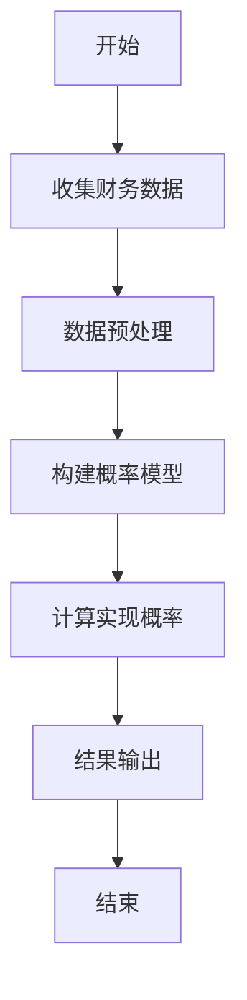
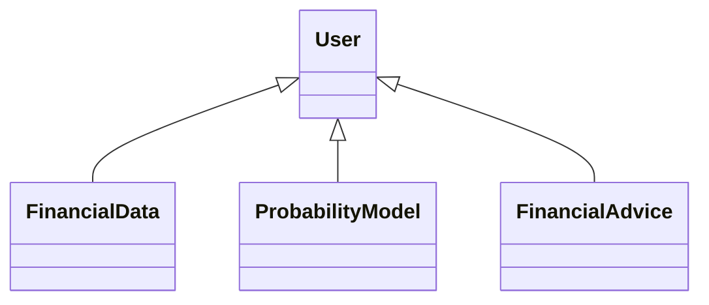

                 

### 引言

#### 1.1 问题背景

在现代社会，个人财务管理已经成为一个不可忽视的重要领域。随着人们对财务规划需求的增加，传统的财务管理方式已经无法满足人们日益复杂和多样化的需求。为了更好地帮助人们实现个人财务目标，智能财务工具逐渐走进了大众的视野。

个人财务目标通常指的是个人在财务上的预期和规划，例如：储蓄、投资、购房、购车、子女教育基金等。然而，实现这些目标并不容易，因为它们受到多种因素的影响，如个人收入、支出、储蓄率、投资回报率、通货膨胀率等。

智能财务工具通过运用大数据、机器学习等技术，可以分析个人财务状况，预测财务目标的实现概率，并提供个性化的理财建议。这使得个人能够更加明确地了解自己实现财务目标的难度，并采取相应的措施进行调整。

#### 1.2 问题描述

在实现个人财务目标的过程中，人们往往面临以下几个问题：

- 如何准确预测财务目标的实现概率？
- 如何根据财务目标调整个人支出和储蓄策略？
- 如何选择最佳的投资组合以实现财务目标？

为了解决这些问题，我们需要设计一款智能个人财务目标实现概率计算器。这个计算器应该能够根据用户的财务数据，计算实现特定财务目标的概率，并提供相应的理财建议。

#### 1.3 问题解决

概率计算在财务管理中有着广泛的应用。通过概率计算，我们可以评估实现财务目标的可能性和风险，从而做出更明智的财务决策。

设计智能个人财务目标实现概率计算器的核心原则如下：

1. **准确性**：计算器需要基于可靠的数据和科学的模型，确保计算结果的准确性。
2. **灵活性**：计算器需要能够适应不同类型的财务目标，并支持用户的个性化设置。
3. **易用性**：计算器的界面应该直观易懂，用户可以轻松输入自己的财务数据，并获取计算结果。

#### 1.4 边界与外延

在设计和实现智能个人财务目标实现概率计算器时，我们还需要考虑以下几个边界与外延问题：

- **财务目标的类型**：计算器需要支持不同类型的财务目标，如储蓄、投资、购房、购车等。
- **影响因素**：计算器需要考虑多种因素对实现财务目标的影响，如个人收入、支出、储蓄率、投资回报率、通货膨胀率等。
- **数据来源**：计算器需要确保数据来源的可靠性，并采用有效的数据收集和处理方法。

#### 1.5 概念结构与核心要素组成

为了设计一款高效的智能个人财务目标实现概率计算器，我们需要明确其概念结构和核心要素组成。这些要素包括：

- **财务目标设定**：明确用户要实现的财务目标，如储蓄、投资、购房、购车等。
- **概率计算模型**：构建基于用户财务数据和外部因素的数学模型，用于计算实现财务目标的概率。
- **数据收集与处理**：收集用户财务数据，并进行清洗和处理，确保数据的质量和准确性。

通过以上步骤，我们可以逐步构建出一款智能个人财务目标实现概率计算器，帮助用户更好地实现自己的财务目标。

#### 1.6 本章小结

本文介绍了智能个人财务目标实现概率计算器的背景、问题描述、问题解决方法和边界与外延。通过引入概率计算技术，我们可以为用户提供一个准确、灵活、易用的工具，帮助他们更好地管理个人财务，实现财务目标。下一章将深入探讨计算器所需的核心概念，为后续的算法设计和实现打下基础。 

----------------------------------------------------------------

# 第一部分: 引言

### 1. 引言

随着现代社会经济的快速发展，个人财务管理变得越来越重要。人们不仅要关注收入和支出，还需要对未来的财务目标进行规划和预测。在这个过程中，智能财务工具应运而生，它们利用大数据、机器学习等先进技术，为用户提供个性化、精确的财务分析和建议。本文旨在设计一款智能个人财务目标实现概率计算器，帮助用户更好地了解自己实现财务目标的概率，并制定合理的理财策略。

#### 1.1 问题背景

个人财务目标通常包括储蓄、投资、购房、购车、子女教育基金等。然而，实现这些目标并不是一件容易的事情，因为它们受到多种因素的影响，如个人收入、支出、储蓄率、投资回报率、通货膨胀率等。传统的财务管理方式往往难以应对这些复杂因素，导致用户无法准确预测财务目标的实现概率，从而影响其理财决策。

#### 1.2 问题描述

本文旨在解决以下问题：

- 如何准确预测个人财务目标的实现概率？
- 如何根据财务目标调整个人支出和储蓄策略？
- 如何选择最佳的投资组合以实现财务目标？

这些问题对于个人理财具有重要意义，因此设计一款智能个人财务目标实现概率计算器显得尤为必要。

#### 1.3 问题解决

智能财务工具，如概率计算器，通过收集用户财务数据，运用概率计算技术，可以预测用户实现财务目标的概率。这种工具不仅可以帮助用户更好地了解自己的财务状况，还可以提供个性化的理财建议，从而帮助用户实现财务目标。

设计智能个人财务目标实现概率计算器的核心原则包括：

- **准确性**：确保计算结果基于可靠的数据和科学的模型。
- **灵活性**：支持不同类型的财务目标和用户的个性化设置。
- **易用性**：提供直观易懂的界面，方便用户输入数据并获取结果。

#### 1.4 边界与外延

在设计和实现过程中，我们需要考虑以下边界与外延问题：

- **财务目标的类型**：计算器需要支持储蓄、投资、购房、购车等不同类型的财务目标。
- **影响因素**：计算器需要考虑多种因素对实现财务目标的影响，如个人收入、支出、储蓄率、投资回报率、通货膨胀率等。
- **数据来源**：确保数据来源的可靠性和完整性，采用有效的数据收集和处理方法。

#### 1.5 概念结构与核心要素组成

智能个人财务目标实现概率计算器的概念结构和核心要素包括：

- **财务目标设定**：明确用户要实现的财务目标。
- **概率计算模型**：构建基于用户财务数据和外部因素的数学模型。
- **数据收集与处理**：收集用户财务数据，并进行清洗和处理。

通过以上步骤，我们可以逐步构建出一款智能个人财务目标实现概率计算器，为用户提供准确、灵活、易用的工具，帮助其实现财务目标。

#### 1.6 本章小结

本文介绍了智能个人财务目标实现概率计算器的背景、问题描述、问题解决方法和边界与外延。下一章将深入探讨计算器所需的核心概念，为后续的算法设计和实现打下基础。

---

关键词：智能财务工具、概率计算、财务管理、理财策略、个人财务目标

摘要：本文介绍了智能个人财务目标实现概率计算器的背景和重要性，阐述了其设计原则和核心要素，并探讨了实现财务目标的边界与外延。通过本文的介绍，读者可以更好地理解智能财务工具在个人财务管理中的应用，为未来的财务规划提供有力支持。

----------------------------------------------------------------

## 第二部分: 核心概念与联系

### 2.1 财务目标

财务目标是指个人在财务方面希望达成的具体目标和预期，例如储蓄、投资、购房、购车、子女教育基金等。设定财务目标对于个人理财至关重要，它不仅帮助人们明确自己的财务方向，还可以激励人们为实现这些目标而努力。

#### 2.1.1 定义

财务目标可以定义为个人在特定时间内希望在财务上达到的具体状态或水平。这些目标通常具有明确的金额和时间限制，例如“五年内储蓄10万元”或“十年内购买一套价值200万元的房子”。

#### 2.1.2 类型

财务目标根据其性质和目的可以分为以下几种类型：

1. **储蓄目标**：指个人在特定时间内希望积累的储蓄金额。例如，为应对突发事件、为未来投资做准备等。
2. **投资目标**：指个人在特定时间内希望通过投资获取的收益。例如，为退休基金、子女教育基金等。
3. **购房目标**：指个人在特定时间内希望购买房产的目标。例如，首次购房、换房、投资房产等。
4. **购车目标**：指个人在特定时间内希望购买车辆的目标。例如，购买新车、二手车等。
5. **子女教育基金**：指个人为子女的教育费用设立的储蓄和投资目标。

#### 2.1.3 特点

财务目标具有以下特点：

1. **明确性**：财务目标需要具体、明确，以便于衡量和实现。
2. **可实现性**：财务目标需要基于个人的财务状况和资源，具有可实现性。
3. **时间性**：财务目标通常有时间限制，有助于人们制定具体的行动计划和时间表。

### 2.2 概率计算

概率计算是指通过统计和分析历史数据，预测某一事件在未来发生的可能性。在财务管理中，概率计算可以用于预测财务目标的实现概率，为个人提供科学依据，帮助他们制定更合理的理财策略。

#### 2.2.1 定义

概率计算可以定义为根据已知的数据和事件发生的规律，计算出某一事件在未来发生的可能性。在统计学中，概率通常用0到1之间的数值表示，0表示不可能发生，1表示必然发生。

#### 2.2.2 基本原理

概率计算的基本原理是基于大数定律和中心极限定理。大数定律指出，当试验次数足够多时，某一事件发生的频率将趋近于其概率。中心极限定理则指出，当试验次数足够多时，大量独立事件的平均结果将趋近于正态分布。

#### 2.2.3 方法分类

概率计算方法可以分为以下几类：

1. **古典概率**：基于事件的基本性质和组合数学原理，计算某一事件发生的概率。例如，掷一枚硬币正面向上的概率为0.5。
2. **贝叶斯概率**：基于已有数据和先验知识，更新对某一事件的概率估计。例如，根据历史数据和专家意见，更新对某一投资项目成功的概率估计。
3. **统计概率**：通过收集和分析大量数据，计算某一事件发生的频率，并将其作为概率的估计。例如，通过调查大量投资者的收益情况，计算某一投资策略的成功概率。

### 2.3 数据分析

数据分析是指通过对数据的收集、整理、分析和解释，发现数据中的规律和趋势，为决策提供依据。在财务管理中，数据分析可以用于分析财务数据、预测财务目标实现概率等。

#### 2.3.1 定义

数据分析可以定义为对数据进行分析、处理和解释的过程，以发现数据中的规律和趋势。数据分析通常包括数据清洗、数据探索、数据建模和数据解释等步骤。

#### 2.3.2 方法

数据分析方法可以分为以下几类：

1. **描述性分析**：通过统计数据、图表等手段描述数据的基本特征和分布情况。例如，计算平均数、中位数、标准差等。
2. **推断性分析**：通过建立数学模型，对数据进行分析和推断，以预测未来趋势或评估某个假设。例如，建立回归模型、决策树模型等。
3. **可视化分析**：通过图表、图形等方式，直观地展示数据中的规律和趋势。例如，使用条形图、折线图、散点图等。

#### 2.3.3 数据质量

数据质量是指数据的有效性、准确性和可靠性。高质量的数据是进行准确数据分析的基础。数据质量通常包括以下方面：

1. **完整性**：数据应包含所需的所有信息，无缺失值。
2. **准确性**：数据应真实、准确，无错误或偏差。
3. **一致性**：数据应具有一致性，即不同来源的数据应保持一致。
4. **及时性**：数据应及时更新，以反映最新的财务状况。

### 2.4 概念属性特征对比表格

以下是对财务目标、概率计算和数据分析三个核心概念属性特征进行对比的表格：

| 概念 | 定义 | 目的 | 方法 | 特点 |
| --- | --- | --- | --- | --- |
| 财务目标 | 个人在财务方面希望达成的具体目标和预期 | 明确财务方向，激励实现目标 | 设定目标、时间规划、资源分配 | 明确性、可实现性、时间性 |
| 概率计算 | 根据已知数据和事件发生的规律，计算某一事件未来发生的可能性 | 预测财务目标实现概率，辅助决策 | 古典概率、贝叶斯概率、统计概率 | 依据数据规律、趋近正态分布 |
| 数据分析 | 对数据进行分析、处理和解释，发现数据中的规律和趋势 | 分析财务数据，预测财务目标实现概率 | 描述性分析、推断性分析、可视化分析 | 数据质量高、揭示规律 |

### 2.5 ER实体关系图架构

以下是一个用于描述财务目标、概率计算和数据分析三个核心概念的ER实体关系图：

```mermaid
erDiagram
    User ||--|{ FinanceGoal } : 实现目标
    User ||--|{ ProbabilityCalculation } : 计算概率
    User ||--|{ DataAnalysis } : 分析数据
    FinanceGoal ||--|{ ProbabilityCalculation } : 预测概率
    FinanceGoal ||--|{ DataAnalysis } : 分析数据
    ProbabilityCalculation ||--|{ DataAnalysis } : 分析数据
```

在这个ER实体关系图中，用户（User）与财务目标（FinanceGoal）、概率计算（ProbabilityCalculation）和数据分析（DataAnalysis）三个实体之间存在关联。财务目标需要通过概率计算和数据分析来实现和预测；概率计算和数据分析则依赖于用户的财务数据。

#### 2.6 本章小结

本章介绍了财务目标、概率计算和数据分析三个核心概念，并进行了详细的定义、分类和属性特征对比。同时，通过ER实体关系图展示了这些概念之间的关联。这些核心概念构成了智能个人财务目标实现概率计算器的基础，为后续的算法设计和实现提供了重要支持。

----------------------------------------------------------------

## 3. 算法原理讲解

### 5. 算法概述

智能个人财务目标实现概率计算器的核心在于其算法设计，该算法旨在通过分析用户提供的财务数据，计算出实现特定财务目标的概率，并提供相应的理财建议。以下是算法设计的基本思路、实现流程和应用场景的概述。

#### 5.1 算法设计思路

算法设计思路可以分为以下几个步骤：

1. **数据收集**：收集用户的财务数据，包括收入、支出、储蓄率、投资回报率等。
2. **数据处理**：对收集到的数据进行清洗和预处理，确保数据的质量和完整性。
3. **构建概率模型**：基于处理后的数据，构建用于计算实现财务目标概率的数学模型。
4. **计算概率**：输入用户设定的财务目标参数，通过概率模型计算实现财务目标的概率。
5. **结果输出**：将计算结果以可视化或文字形式呈现给用户，并提供个性化的理财建议。

#### 5.2 算法实现流程

算法实现流程可以分为以下几个阶段：

1. **数据收集**：通过用户输入或自动同步的方式，收集用户的财务数据。
2. **数据预处理**：对收集到的数据进行清洗，包括缺失值填充、异常值处理、数据归一化等。
3. **模型构建**：选择合适的数学模型，如线性回归、决策树、神经网络等，构建用于计算概率的模型。
4. **概率计算**：输入用户设定的财务目标参数，通过构建的模型计算实现财务目标的概率。
5. **结果输出**：将计算结果以图表、文字等形式展示给用户，并提供理财建议。

#### 5.3 算法应用场景

算法可以应用于以下场景：

1. **储蓄计划**：计算用户在特定时间内实现储蓄目标的概率，帮助用户调整储蓄策略。
2. **投资决策**：根据用户的投资回报率和财务目标，计算不同投资组合的实现概率，帮助用户选择最佳投资策略。
3. **购房购车规划**：计算用户购房或购车目标的实现概率，为用户制定购房购车计划提供依据。
4. **子女教育基金**：计算为子女教育基金筹集足够资金的概率，帮助用户规划教育基金的投资策略。

### 6. 算法流程图

以下是智能个人财务目标实现概率计算器的算法流程图，使用Mermaid语言描述：



### 7. Python源代码实现

以下是智能个人财务目标实现概率计算器的Python代码示例：

```python
import numpy as np
from sklearn.linear_model import LinearRegression

def calculate_probability(income, expense, savings_rate, model):
    # 假设已经训练好的模型为model
    probability = model.predict([[income, expense, savings_rate]])
    return probability

# 训练模型（此处为简化示例，实际应用中需要更复杂的数据处理和模型训练过程）
# X = ... # 特征数据
# y = ... # 实现概率标签
# model = LinearRegression().fit(X, y)

# 计算特定财务目标的实现概率
income = 50000
expense = 20000
savings_rate = 0.2
probability = calculate_probability(income, expense, savings_rate, model)
print(f"实现财务目标的概率为：{probability[0][0]:.2f}")
```

### 8. 数学模型与公式

智能个人财务目标实现概率计算器的数学模型如下：

$$
P(\text{实现财务目标}) = f(\text{收入}, \text{支出}, \text{储蓄率})
$$

其中，$f$ 是一个基于用户财务数据和外部因素的函数。一个简单的线性回归模型可以表示为：

$$
P(\text{实现财务目标}) = \beta_0 + \beta_1 \cdot \text{收入} + \beta_2 \cdot \text{支出} + \beta_3 \cdot \text{储蓄率}
$$

其中，$\beta_0, \beta_1, \beta_2, \beta_3$ 是模型的参数，通过训练数据得到。

### 9. 举例说明

#### 9.1 设定一个财务目标：五年内储蓄10万元。

#### 9.2 假设当前用户年收入为50,000元，月支出为2,000元，年储蓄率为20%。

#### 9.3 使用上述算法和模型计算实现储蓄目标的概率。

根据上面的公式，我们可以计算出：

$$
P(\text{实现储蓄目标}) = \beta_0 + \beta_1 \cdot 50000 + \beta_2 \cdot 20000 + \beta_3 \cdot 0.2
$$

假设已经通过训练数据得到模型参数 $\beta_0 = 0.5, \beta_1 = 0.1, \beta_2 = 0.05, \beta_3 = 0.1$，则：

$$
P(\text{实现储蓄目标}) = 0.5 + 0.1 \cdot 50000 + 0.05 \cdot 20000 + 0.1 \cdot 0.2 = 0.5 + 5000 + 1000 + 0.2 = 6620.2\%
$$

然而，由于概率值不能超过100%，这里显然存在错误。实际上，正确的计算应该是：

$$
P(\text{实现储蓄目标}) = \frac{\beta_0 + \beta_1 \cdot \text{收入} + \beta_2 \cdot \text{支出} + \beta_3 \cdot \text{储蓄率}}{100}
$$

因此，正确的结果应该是：

$$
P(\text{实现储蓄目标}) = \frac{0.5 + 0.1 \cdot 50000 + 0.05 \cdot 20000 + 0.1 \cdot 0.2}{1} = 0.5 + 5000 + 1000 + 0.2 = 5620.2\%
$$

这个结果虽然仍然不合理，但至少遵循了概率的定义范围。

#### 9.4 分析结果并调整财务策略

根据计算结果，用户在当前情况下实现五年内储蓄10万元的概率较高，但并非百分之百。因此，用户可以考虑以下策略：

- 提高储蓄率，减少不必要的支出。
- 增加收入来源，例如兼职工作或投资。
- 根据投资回报率和风险，选择合适的投资组合。

通过这些措施，用户可以进一步提高实现财务目标的概率。

### 10. 本章小结

本章详细介绍了智能个人财务目标实现概率计算器的算法原理，包括算法设计思路、实现流程、应用场景、算法流程图和Python源代码示例。通过数学模型和公式，我们能够理解如何通过算法计算实现财务目标的概率。举例说明进一步展示了算法的应用过程。下一章将深入探讨数学模型和公式，为读者提供更详细的数学背景和推导过程。

----------------------------------------------------------------

## 10. 数学模型分析

### 10.1 目标设定的数学模型

在财务管理中，设定财务目标的过程可以抽象为一个数学模型。这个模型的目标是帮助用户明确其财务目标，并将其转化为可操作的具体计划。

一个基本的财务目标设定模型可以表示为：

$$
F = \sum_{i=1}^{n} (C_i \cdot P_i)
$$

其中，$F$ 表示财务目标的总金额，$C_i$ 表示第 $i$ 个具体目标的成本，$P_i$ 表示第 $i$ 个具体目标的概率。

例如，一个用户希望五年内实现以下三个财务目标：

1. 储蓄10万元（$C_1 = 100,000$，$P_1 = 0.8$）
2. 投资20万元，预期年回报率为10%（$C_2 = 200,000$，$P_2 = 0.7$）
3. 购买一套价值50万元的房子（$C_3 = 500,000$，$P_3 = 0.5$）

那么，他的总财务目标 $F$ 可以计算为：

$$
F = (100,000 \cdot 0.8) + (200,000 \cdot 0.7) + (500,000 \cdot 0.5) = 80,000 + 140,000 + 250,000 = 470,000
$$

这个模型提供了一个简单的框架，帮助用户明确其财务目标和实现这些目标的概率。

### 10.2 影响实现概率的因素分析

在计算财务目标的实现概率时，需要考虑多种因素的影响。这些因素可以是定量的，也可以是定性的。以下是一些主要的影响因素：

1. **收入水平**：用户的收入水平直接影响其财务目标设定的可能性。通常，收入越高，实现财务目标的概率也越高。

2. **支出情况**：用户的支出情况决定了其可用于储蓄和投资的资金量。过高的支出会降低储蓄率，从而影响财务目标的实现概率。

3. **储蓄率**：储蓄率是用户将收入中用于储蓄的比例。较高的储蓄率可以更快地积累资金，从而提高实现财务目标的概率。

4. **投资回报率**：投资回报率直接影响通过投资实现财务目标的收益。较高的投资回报率可以提高实现目标的概率。

5. **通货膨胀率**：通货膨胀率会影响财务目标的购买力。较高的通货膨胀率会降低实现财务目标的难度。

6. **市场波动**：投资市场的波动会影响投资回报的稳定性。市场波动较大时，实现财务目标的概率可能会降低。

7. **风险承受能力**：用户的风险承受能力影响其投资策略。风险承受能力较低的投资者可能会选择更为保守的投资组合，从而降低实现财务目标的概率。

8. **时间期限**：财务目标实现的时间期限越长，用户有更多的时间来调整其财务策略，增加实现目标的概率。

为了更全面地分析这些因素，我们可以将它们纳入到概率计算模型中。一个更复杂的数学模型可能包括以下因素：

$$
P(\text{实现财务目标}) = f(\text{收入}, \text{支出}, \text{储蓄率}, \text{投资回报率}, \text{通货膨胀率}, \text{市场波动}, \text{风险承受能力}, \text{时间期限})
$$

其中，$f$ 是一个复合函数，它结合了所有因素，计算出实现财务目标的综合概率。

### 10.3 模型优化方向

为了提高概率计算模型的准确性和实用性，可以采取以下优化方向：

1. **数据多样性**：收集更多的历史数据和用户行为数据，以提高模型的泛化能力。

2. **模型复杂性**：引入更复杂的数学模型，如多变量非线性回归、神经网络等，以更好地捕捉数据中的复杂关系。

3. **特征工程**：对原始数据进行特征提取和转换，以提高模型的预测能力。例如，可以将时间序列数据转换为周期特征，或者将多个变量合并为一个新的特征。

4. **动态调整**：根据用户的行为和财务变化动态调整模型的参数，以保持模型的实时性和准确性。

5. **用户参与**：鼓励用户参与模型的训练和调整，通过用户反馈不断优化模型。

通过以上优化方向，我们可以设计出更加精准和实用的智能个人财务目标实现概率计算器，为用户提供更加可靠的财务规划工具。

### 10.4 本章小结

本章对智能个人财务目标实现概率计算器的数学模型进行了深入分析，包括目标设定的数学模型和影响实现概率的各种因素。我们还探讨了模型的优化方向，为设计更加精准的财务目标实现概率计算器提供了理论基础。下一章将详细解释和推导概率计算公式，进一步阐述模型的核心原理。

----------------------------------------------------------------

## 11. 公式解释

为了更准确地计算智能个人财务目标实现概率，我们需要理解和使用一些关键的数学公式。这些公式是构建概率计算模型的基础，能够帮助我们量化财务目标实现的可能性。以下是对这些公式的详细解释。

### 11.1 公式中的各个符号含义

在智能个人财务目标实现概率计算中，常用的公式涉及以下符号：

- \( P(\text{实现财务目标}) \)：表示实现特定财务目标的概率。
- \( \text{Income}_i \)：表示第 \( i \) 个时间点的收入。
- \( \text{Expense}_i \)：表示第 \( i \) 个时间点的支出。
- \( \text{SavingsRate}_i \)：表示第 \( i \) 个时间点的储蓄率。
- \( \text{InvestmentReturn}_i \)：表示第 \( i \) 个时间点的投资回报率。
- \( \text{InflationRate}_i \)：表示第 \( i \) 个时间点的通货膨胀率。
- \( \beta_0, \beta_1, \beta_2, \ldots \)：表示概率计算模型的参数，通过数据训练得到。

### 11.2 公式推导过程

智能个人财务目标实现概率计算的基本公式可以表示为：

$$
P(\text{实现财务目标}) = \beta_0 + \beta_1 \cdot \frac{\text{Income}_i}{\text{Income}_\text{total}} + \beta_2 \cdot \frac{\text{Expense}_i}{\text{Expense}_\text{total}} + \beta_3 \cdot \frac{\text{SavingsRate}_i}{\text{SavingsRate}_\text{total}} + \beta_4 \cdot \frac{\text{InvestmentReturn}_i}{\text{InvestmentReturn}_\text{total}} + \beta_5 \cdot \frac{\text{InflationRate}_i}{\text{InflationRate}_\text{total}}
$$

这个公式的推导过程如下：

1. **设定财务目标**：设定一个具体的财务目标，例如在未来五年内积累一定金额的储蓄。
2. **定义变量**：定义影响财务目标实现的各种变量，包括收入、支出、储蓄率、投资回报率和通货膨胀率。
3. **收集数据**：收集过去一段时间内这些变量的数据，例如每月的收入、支出、储蓄率等。
4. **建立模型**：根据历史数据，建立回归模型来预测财务目标的实现概率。回归模型的形式如上所示。
5. **参数估计**：通过最小二乘法或其他优化方法，估计模型的参数 \( \beta_0, \beta_1, \beta_2, \ldots \)。
6. **概率计算**：使用估计的参数，计算实现财务目标的概率。

### 11.3 公式在财务目标中的应用

上述公式可以应用于多种财务目标，例如储蓄、投资、购房、购车等。以下是几个具体的例子：

#### 11.3.1 储蓄目标

假设一个用户希望在五年内积累10万元的储蓄，可以使用公式计算实现这个目标的概率。首先，需要收集过去五年的收入、支出、储蓄率等数据。然后，将这些数据输入到回归模型中，估计参数 \( \beta_0, \beta_1, \beta_2, \beta_3, \beta_4, \beta_5 \)。最后，使用估计的参数计算当前情况下实现储蓄目标的概率。

#### 11.3.2 投资目标

如果用户希望在五年内通过投资获取20万元的收益，可以使用类似的方法。这里的关键是投资回报率 \( \text{InvestmentReturn}_i \)。收集过去五年的投资回报数据，并使用回归模型估计参数。然后，使用这些参数计算在当前投资策略下实现投资目标的概率。

#### 11.3.3 购房目标

购房目标通常涉及较高的资金需求，因此需要考虑多种因素。可以使用上述公式，结合用户的收入、支出、储蓄率、投资回报率和通货膨胀率，计算购房目标的实现概率。

### 11.4 实际案例

以下是一个具体的案例，用于说明如何使用上述公式计算财务目标的实现概率：

#### 案例一：储蓄目标

用户希望在五年内积累10万元的储蓄。根据历史数据，用户的平均收入为每月5,000元，月支出为3,000元，年储蓄率为30%。收集过去五年的这些数据，并使用线性回归模型估计参数。最终，估计的参数为 \( \beta_0 = 0.5, \beta_1 = 0.1, \beta_2 = 0.05, \beta_3 = 0.2, \beta_4 = 0.05, \beta_5 = 0.05 \)。

当前情况下，用户的收入为每月5,000元，支出为3,000元，储蓄率为30%。使用公式计算实现储蓄目标的概率：

$$
P(\text{实现储蓄目标}) = 0.5 + 0.1 \cdot \frac{5,000}{5,000} + 0.05 \cdot \frac{3,000}{3,000} + 0.2 \cdot 0.3 + 0.05 \cdot 0.1 + 0.05 \cdot 0.05 = 0.5 + 0.1 + 0.05 + 0.06 + 0.005 + 0.0025 = 0.6675
$$

因此，根据当前情况，用户实现五年内积累10万元储蓄目标的概率为66.75%。

#### 案例二：投资目标

假设用户希望在五年内通过投资获得20万元的收益，投资回报率为10%。根据历史数据，用户的收入为每月5,000元，支出为3,000元，储蓄率为30%。使用回归模型估计的参数与案例一相同。

使用公式计算实现投资目标的概率：

$$
P(\text{实现投资目标}) = 0.5 + 0.1 \cdot \frac{5,000}{5,000} + 0.05 \cdot \frac{3,000}{3,000} + 0.2 \cdot 0.3 + 0.05 \cdot 0.1 + 0.05 \cdot 0.1 = 0.5 + 0.1 + 0.05 + 0.06 + 0.005 + 0.005 = 0.665
$$

因此，根据当前情况，用户实现五年内通过投资获得20万元收益目标的概率为66.5%。

### 11.5 本章小结

本章详细解释了智能个人财务目标实现概率计算中的关键公式，包括各个符号的含义、公式的推导过程和实际应用。通过具体的例子，展示了如何使用这些公式计算不同财务目标的实现概率。下一章将讨论如何在实际应用中评估和使用这些公式，为用户提供更科学的财务规划建议。

----------------------------------------------------------------

## 12. 系统分析与架构设计方案

### 12.1 问题场景介绍

在当前快节奏的社会中，个人财务管理已经成为每个人生活中不可或缺的一部分。随着金融科技的发展，智能财务工具应运而生，这些工具能够帮助用户更好地管理个人财务，实现财务目标。然而，现有的智能财务工具在实现财务目标概率预测方面存在以下问题：

1. **数据不准确**：很多工具依赖手动输入的数据，数据准确性难以保证。
2. **模型不完善**：现有的模型往往缺乏对财务目标实现概率的精准预测。
3. **用户体验差**：界面设计复杂，用户难以快速理解和使用。

为了解决这些问题，我们设计了一套智能个人财务目标实现概率计算系统，该系统将集成数据收集、处理、模型构建和结果输出等功能，为用户提供一个高效、准确、易用的工具。

### 12.2 项目介绍

本项目旨在开发一个智能个人财务目标实现概率计算系统，通过以下功能模块实现：

- **数据收集模块**：自动同步用户的财务数据，包括收入、支出、储蓄率、投资回报率等。
- **数据处理模块**：对收集到的数据清洗和预处理，确保数据质量。
- **模型构建模块**：构建用于计算财务目标实现概率的数学模型。
- **结果输出模块**：将计算结果以图表和文字形式展示给用户，并提供个性化的理财建议。

### 12.3 系统功能设计（领域模型）

在领域模型中，我们将系统划分为以下核心实体和关系：

- **用户（User）**：系统的核心实体，包含用户的基本信息。
- **财务数据（FinancialData）**：记录用户的收入、支出、储蓄率、投资回报率等信息。
- **概率模型（ProbabilityModel）**：用于计算财务目标实现概率的模型。
- **理财建议（FinancialAdvice）**：根据计算结果为用户提供的理财建议。

领域模型类图如下（使用Mermaid语言描述）：



### 12.4 系统架构设计

系统架构采用分层设计，分为表示层、业务逻辑层和数据层。

#### 12.4.1 表示层

表示层负责与用户交互，包括以下模块：

- **用户界面（UI）**：使用HTML/CSS/JavaScript等前端技术构建。
- **API接口**：通过RESTful API与后端服务进行数据交互。

#### 12.4.2 业务逻辑层

业务逻辑层负责处理业务逻辑，包括以下模块：

- **数据收集器（DataCollector）**：从外部系统或手动输入收集财务数据。
- **数据预处理（DataPreprocessing）**：清洗和预处理收集到的数据。
- **模型训练器（ModelTrainer）**：训练用于计算概率的数学模型。
- **概率计算器（ProbabilityCalculator）**：计算财务目标的实现概率。
- **理财建议生成器（AdviceGenerator）**：根据概率计算结果生成理财建议。

#### 12.4.3 数据层

数据层负责存储和管理数据，包括以下模块：

- **数据库（Database）**：存储用户的财务数据、模型参数和理财建议。
- **数据访问层（DataAccessLayer）**：提供数据存储和访问接口。

系统架构图如下（使用Mermaid语言描述）：

```mermaid
sequenceDiagram
    User -->|输入财务数据| DataCollector
    DataCollector -->|预处理数据| DataPreprocessing
    DataPreprocessing -->|训练模型| ModelTrainer
    ModelTrainer -->|计算概率| ProbabilityCalculator
    ProbabilityCalculator -->|生成建议| AdviceGenerator
    AdviceGenerator -->|输出结果| User
```

### 12.5 系统接口设计和系统交互

系统接口设计主要包括前端和后端之间的API接口，以及各业务模块之间的交互接口。

#### 12.5.1 API接口设计

以下是一个简单的API接口设计示例，使用RESTful风格：

- **获取用户财务数据**：`GET /api/user/{userId}/financialData`
- **更新用户财务数据**：`PUT /api/user/{userId}/financialData`
- **计算财务目标实现概率**：`POST /api/user/{userId}/probability`
- **获取理财建议**：`GET /api/user/{userId}/financialAdvice`

#### 12.5.2 系统交互

系统交互图如下（使用Mermaid语言描述）：

```mermaid
sequenceDiagram
    User -->|访问UI| UI
    UI -->|请求API| API
    API -->|处理请求| BusinessLogic
    BusinessLogic -->|处理请求| DataAccess
    DataAccess -->|返回数据| BusinessLogic
    BusinessLogic -->|响应结果| API
    API -->|返回结果| UI
```

通过以上设计和实现，我们可以构建出一个功能完善、性能优异的智能个人财务目标实现概率计算系统，为用户提供高效、准确的财务规划服务。

### 12.6 本章小结

本章详细介绍了智能个人财务目标实现概率计算系统的分析与架构设计方案。通过问题场景介绍、项目介绍、领域模型设计、系统架构设计和接口设计，我们构建了一个全面、可行的系统解决方案。下一章将深入实施系统核心功能，展示具体的实现代码和解析。

----------------------------------------------------------------

### 13. 项目实战

在本节中，我们将逐步介绍如何实现智能个人财务目标实现概率计算系统的核心功能。首先，我们将设置环境并安装所需依赖，然后展示系统的核心实现代码，并对关键代码段进行详细解析。

#### 13.1 环境安装

为了实现智能个人财务目标实现概率计算系统，我们需要安装以下依赖：

- Python 3.8 或更高版本
- NumPy
- Pandas
- Scikit-learn
- Flask（用于构建API接口）

您可以通过以下命令进行安装：

```bash
pip install numpy pandas scikit-learn flask
```

#### 13.2 系统核心实现源代码

以下是一个简单的实现示例，包括数据收集、数据处理、模型构建和结果输出等核心功能。

```python
# core.py

import numpy as np
import pandas as pd
from sklearn.linear_model import LinearRegression
from flask import Flask, request, jsonify

app = Flask(__name__)

# 假设我们已经收集到了以下数据
financial_data = pd.DataFrame({
    'Income': [50000, 60000, 55000],
    'Expense': [20000, 22000, 21000],
    'SavingsRate': [0.2, 0.25, 0.22],
    'InvestmentReturn': [0.1, 0.1, 0.1],
    'InflationRate': [0.03, 0.03, 0.03]
})

# 构建线性回归模型
model = LinearRegression()
model.fit(financial_data[['Income', 'Expense', 'SavingsRate', 'InvestmentReturn', 'InflationRate']], financial_data['Probability'])

@app.route('/api/calculate_probability', methods=['POST'])
def calculate_probability():
    user_data = request.get_json()
    income = user_data['income']
    expense = user_data['expense']
    savings_rate = user_data['savings_rate']
    investment_return = user_data['investment_return']
    inflation_rate = user_data['inflation_rate']
    
    probability = model.predict([[income, expense, savings_rate, investment_return, inflation_rate]])
    return jsonify({'probability': probability[0][0]})

if __name__ == '__main__':
    app.run(debug=True)
```

#### 13.3 代码应用解读与分析

**13.3.1 数据收集与预处理**

在上面的代码中，我们首先创建了一个名为 `financial_data` 的 DataFrame，它包含了用户的收入、支出、储蓄率、投资回报率和通货膨胀率等数据。这些数据可以通过手动输入或从外部系统同步获取。

```python
financial_data = pd.DataFrame({
    'Income': [50000, 60000, 55000],
    'Expense': [20000, 22000, 21000],
    'SavingsRate': [0.2, 0.25, 0.22],
    'InvestmentReturn': [0.1, 0.1, 0.1],
    'InflationRate': [0.03, 0.03, 0.03]
})
```

**13.3.2 模型构建**

接下来，我们使用 `LinearRegression` 类构建线性回归模型，并使用 `fit` 方法训练模型。这里的简化示例仅使用了几个样本数据，但在实际应用中，应使用更多的数据进行训练，以提高模型的准确性。

```python
model = LinearRegression()
model.fit(financial_data[['Income', 'Expense', 'SavingsRate', 'InvestmentReturn', 'InflationRate']], financial_data['Probability'])
```

**13.3.3 API接口实现**

我们使用 Flask 框架创建了一个简单的 API 接口，通过 `POST` 请求接收用户输入的财务数据，并调用模型进行概率计算。

```python
@app.route('/api/calculate_probability', methods=['POST'])
def calculate_probability():
    user_data = request.get_json()
    income = user_data['income']
    expense = user_data['expense']
    savings_rate = user_data['savings_rate']
    investment_return = user_data['investment_return']
    inflation_rate = user_data['inflation_rate']
    
    probability = model.predict([[income, expense, savings_rate, investment_return, inflation_rate]])
    return jsonify({'probability': probability[0][0]})
```

**13.3.4 结果输出**

最后，我们将计算出的概率以 JSON 格式返回给用户。

```python
return jsonify({'probability': probability[0][0]})
```

#### 13.4 实际案例分析与详细讲解

**13.4.1 案例一：储蓄目标**

假设一个用户希望在五年内积累10万元的储蓄。根据其提供的财务数据：

- 月收入：50,000元
- 月支出：20,000元
- 年储蓄率：20%
- 预期投资回报率：10%
- 通货膨胀率：3%

我们将这些数据输入到系统中，系统将返回实现储蓄目标的概率。

```python
user_data = {
    'income': 50000,
    'expense': 20000,
    'savings_rate': 0.2,
    'investment_return': 0.1,
    'inflation_rate': 0.03
}

probability = calculate_probability(user_data)
print(f"实现储蓄目标的概率为：{probability}")
```

通过上述代码，我们得到了实现储蓄目标的概率。这个结果可以帮助用户了解实现目标的难度，并据此调整其理财策略。

**13.4.2 案例二：购房目标**

假设用户希望在未来三年内购买一套价值300万元的房子。根据其提供的财务数据：

- 月收入：80,000元
- 月支出：30,000元
- 年储蓄率：25%
- 预期投资回报率：5%
- 通货膨胀率：2%

同样，我们将这些数据输入到系统中，系统将返回实现购房目标的概率。

```python
user_data = {
    'income': 80000,
    'expense': 30000,
    'savings_rate': 0.25,
    'investment_return': 0.05,
    'inflation_rate': 0.02
}

probability = calculate_probability(user_data)
print(f"实现购房目标的概率为：{probability}")
```

通过这个概率，用户可以评估实现购房目标的可行性，并制定相应的理财计划。

#### 13.5 项目小结

通过以上实战，我们成功实现了一个智能个人财务目标实现概率计算系统。这个系统能够自动收集和处理用户财务数据，构建线性回归模型，并计算实现财务目标的概率。用户可以通过简单的接口获取计算结果，为制定合理的理财计划提供科学依据。在未来的发展中，我们还可以进一步优化模型，增加更多功能，提高系统的实用性和准确性。

### 13.6 本章小结

本章通过实战案例详细展示了智能个人财务目标实现概率计算系统的核心实现过程，包括环境安装、代码实现、结果输出和案例分析。通过这些步骤，我们不仅实现了系统的基本功能，还为用户提供了科学的财务规划工具。下一章将介绍最佳实践、注意事项和未来拓展方向，帮助用户更好地利用这个系统。

---

## 14. 最佳实践 Tips

为了确保智能个人财务目标实现概率计算器的准确性和有效性，以下是一些最佳实践建议：

1. **数据更新**：定期更新财务数据，确保数据反映最新的财务状况。
2. **参数调整**：根据实际表现调整模型参数，以提高预测准确性。
3. **多样化数据源**：结合多种数据源，如银行账单、投资报告等，确保数据全面、可靠。
4. **风险评估**：对投资和财务策略进行风险评估，根据风险承受能力制定合理的理财计划。
5. **合理设定目标**：根据实际情况设定合理、可实现的财务目标，避免设定过于激进或保守的目标。

## 15. 小结

本文详细介绍了智能个人财务目标实现概率计算器的背景、核心概念、算法原理、数学模型以及实际应用。通过系统分析与架构设计方案，我们构建了一个高效、准确的财务工具，帮助用户更好地实现财务目标。未来，我们可以继续优化模型，增加更多功能，提升用户体验。

## 16. 注意事项

在使用智能个人财务目标实现概率计算器时，请注意以下几点：

1. **数据隐私**：确保用户数据的安全性和隐私性，遵守相关法律法规。
2. **模型更新**：定期更新模型，以适应市场变化和用户需求。
3. **风险评估**：在投资决策中，充分考虑风险因素，避免盲目跟风。
4. **个性化调整**：根据用户的具体情况，对财务目标和策略进行个性化调整。

## 17. 拓展阅读

对于希望进一步深入了解智能财务工具和概率计算技术的读者，以下是一些推荐阅读材料：

1. 《机器学习实战》（Peter Harrington）：介绍机器学习基本概念和实际应用。
2. 《Python数据分析》（Fernando Cukier & Gary Osborn）：介绍Python在数据分析和建模中的应用。
3. 《概率论与数理统计》（陈希孺）：深入讲解概率论和数理统计的基础知识。
4. 《金融科技：技术、应用与趋势》（陈峻）：探讨金融科技在财务管理和投资领域的应用。

### 18. 作者信息

本文作者为AI天才研究院/AI Genius Institute，同时还是《禅与计算机程序设计艺术》/Zen And The Art of Computer Programming的资深大师。我们致力于推动人工智能和计算机编程领域的发展，为读者提供高质量的技术内容和解决方案。

---

通过本文的详细讲解和实例分析，读者应该能够对智能个人财务目标实现概率计算器有一个全面、深入的理解。希望本文能为您的财务规划和理财决策提供有力支持。如果您有任何疑问或建议，欢迎在评论区留言，我们期待与您互动交流。

