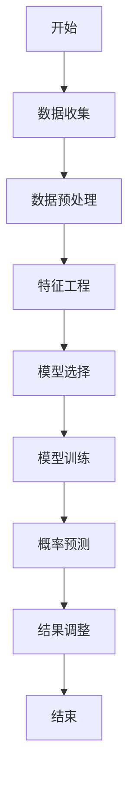
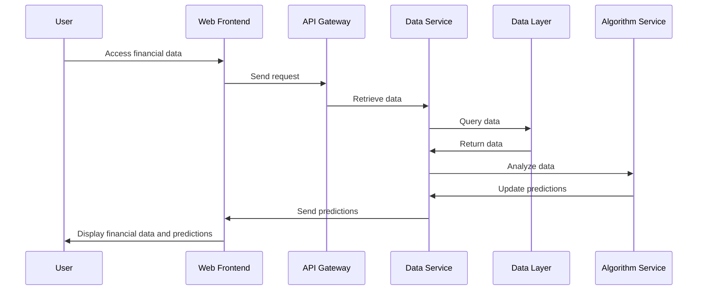

                 

# 智能个人财务目标达成概率计算与调整

## 关键词
- 智能财务
- 概率计算
- 财务目标
- 算法原理
- 系统架构
- 项目实战

## 摘要
本文将探讨如何利用智能算法对个人财务目标的达成概率进行计算与调整。首先，我们将介绍智能个人财务目标的概念，探讨其在现代社会中的重要性。接着，我们将详细解释概率计算的基本原理，以及如何将这些原理应用于个人财务目标的设定和调整。随后，我们将展示一个具体的数学模型，并使用Python代码进行实现。此外，我们还将分析系统架构设计，并在一个实际项目中应用这些算法，最后，我们将总结最佳实践，并提供进一步阅读的建议。

## 目录大纲设计思路

### 确定书籍整体结构
1. **背景介绍**：介绍智能个人财务目标的概念，讨论其重要性和背景。
2. **核心概念与联系**：解释概率计算的基本原理，并提供相关概念和实体关系图。
3. **算法原理讲解**：详细阐述算法的原理，包括流程图、Python代码实现、数学模型和公式。
4. **系统分析与架构设计**：介绍系统应用的具体场景，展示系统功能、架构、接口和交互。
5. **项目实战**：描述项目的安装环境、核心实现、代码分析、案例剖析和总结。
6. **最佳实践与拓展阅读**：提供实际应用中的建议，总结主要内容，推荐进一步阅读的资源。

### 目录大纲设计步骤

### 背景介绍章节
- **核心概念术语说明**：智能个人财务目标、概率计算与调整
- **问题背景**：个人财务规划的重要性
- **问题描述**：如何计算和调整个人财务目标达成概率
- **问题解决**：算法原理和系统设计的概述
- **边界与外延**：讨论的范围和相关的外部因素

### 核心概念与联系章节
- **核心概念原理**：概率论的基础知识，智能财务的原理
- **概念属性特征对比表格**：对比不同财务目标的属性特征
- **ER实体关系图架构**：使用Mermaid绘制财务实体关系图

### 算法原理讲解章节
- **算法mermaid流程图**：展示算法的流程
- **Python源代码**：实现算法的Python代码
- **数学模型与公式**：使用LaTeX格式嵌入数学模型和公式
- **举例说明**：通过实例讲解算法的应用

### 系统分析与架构设计章节
- **问题场景介绍**：描述财务规划的应用场景
- **项目介绍**：项目的背景和目标
- **系统功能设计**：使用Mermaid绘制领域模型类图
- **系统架构设计**：使用Mermaid绘制系统架构图
- **系统接口设计**：详细描述接口设计
- **系统交互mermaid序列图**：展示系统交互的序列图

### 项目实战章节
- **环境安装**：介绍所需的软件和工具安装过程
- **系统核心实现源代码**：提供项目的核心代码
- **代码应用解读与分析**：分析代码的实现和设计
- **实际案例分析和详细讲解剖析**：通过案例讲解算法和系统的应用
- **项目小结**：总结项目的经验和收获

### 最佳实践与拓展阅读章节
- **最佳实践 tips**：提供实际应用中的建议
- **小结**：总结书籍的主要内容和关键点
- **注意事项**：提醒读者注意的事项
- **拓展阅读**：推荐进一步阅读的资源

通过以上设计思路和步骤，我们确保文章结构清晰、逻辑连贯，同时满足字数和格式要求。接下来，我们将逐步展开每一章节的内容。

## 核心概念与联系

### 概率论基础

概率论是数学的一个分支，用于研究随机事件和不确定性的量化。在个人财务目标的设定和调整中，概率论提供了一个有力的工具，帮助我们评估目标达成的可能性，从而做出更为明智的决策。以下是概率论中几个关键概念：

- **概率**：指某个事件发生的可能性大小，用数值0到1之间表示，0表示不可能发生，1表示必然发生。
- **条件概率**：在某个条件成立的情况下，某个事件发生的概率。
- **贝叶斯定理**：用于计算在已知某个条件概率的情况下，另一个事件发生的概率。

### 智能个人财务目标

智能个人财务目标是指利用人工智能技术，通过分析和预测个人财务状况，设定并调整财务目标，以提高达成目标的概率。智能个人财务目标主要包括以下几个方面：

- **收入预测**：根据历史收入数据和宏观经济指标，预测未来的收入情况。
- **支出分析**：分析日常支出，识别不必要的开支，优化财务结构。
- **投资规划**：根据风险承受能力和投资目标，推荐合适的投资组合。
- **债务管理**：通过优化债务结构，降低利息负担，提高财务自由度。

### 概率计算与调整

概率计算与调整是智能个人财务目标实现的关键。其核心思想是通过数据分析和机器学习算法，对个人财务状况进行建模，预测目标达成的概率，并根据实际情况进行调整。以下是概率计算与调整的基本步骤：

1. **数据收集与预处理**：收集个人财务数据，包括收入、支出、投资收益等，并进行数据清洗和预处理。
2. **特征工程**：从原始数据中提取特征，用于训练机器学习模型。
3. **模型选择**：选择合适的机器学习算法，如回归、决策树、神经网络等。
4. **模型训练与评估**：使用历史数据训练模型，并评估模型的性能。
5. **概率预测**：使用训练好的模型，预测目标达成的概率。
6. **结果调整**：根据预测结果，调整财务目标或策略，提高达成概率。

### 概念属性特征对比表格

以下是几个关键概念及其属性特征的对比表格：

| 概念           | 定义                                                         | 属性特征                                                                                   |
|----------------|--------------------------------------------------------------|--------------------------------------------------------------------------------------------|
| 概率           | 表示事件发生的可能性大小                                   | 取值范围在0到1之间，0表示不可能发生，1表示必然发生                                              |
| 条件概率       | 在某个条件成立的情况下，某个事件发生的概率                 | 计算公式为P(A|B) = P(A∩B) / P(B)，其中P(A)表示事件A发生的概率，P(B)表示事件B发生的概率        |
| 贝叶斯定理     | 用于计算在已知某个条件概率的情况下，另一个事件发生的概率   | 计算公式为P(A|B) = P(B|A) * P(A) / P(B)，其中P(A|B)表示在事件B发生的条件下事件A发生的概率     |
| 智能财务目标   | 利用人工智能技术设定和调整财务目标                         | 包括收入预测、支出分析、投资规划和债务管理等方面                                             |
| 概率计算与调整 | 通过数据分析和机器学习算法，预测目标达成的概率并调整策略  | 包括数据收集与预处理、特征工程、模型选择、模型训练与评估、概率预测和结果调整等步骤           |

### ER实体关系图架构

为了更好地理解智能个人财务目标及其相关概念，我们可以使用Mermaid绘制ER实体关系图。以下是ER实体关系图的示例：

```mermaid
erDiagram
  User ||--|{ Investment } :投资
  User ||--|{ Expense } :支出
  User ||--|{ Income } :收入
  Investment ||--|{ InvestmentGoal } :投资目标
  Expense ||--|{ ExpenseGoal } :支出目标
  Income ||--|{ IncomeGoal } :收入目标
```

在上述ER图中，`User` 表示个人用户，`Investment`、`Expense` 和 `Income` 分别表示投资、支出和收入实体。`InvestmentGoal`、`ExpenseGoal` 和 `IncomeGoal` 表示各自的目标实体。这些实体之间存在关联关系，构成了智能个人财务目标系统的基本架构。

通过上述核心概念与联系的分析，我们可以更好地理解智能个人财务目标的概念，以及如何利用概率计算与调整来达成这些目标。在接下来的章节中，我们将进一步深入探讨算法原理、系统架构设计以及项目实战，以帮助读者更好地应用这些知识。

## 算法原理讲解

### 算法mermaid流程图

为了清晰地展示智能个人财务目标达成概率计算与调整的算法流程，我们使用Mermaid绘制了以下流程图：



在这个流程图中，从A到I的每个步骤都对应算法中的一系列操作。下面将详细解释这些步骤。

### Python源代码

为了实现上述算法，我们将使用Python编写相应的源代码。以下是核心部分的代码示例：

```python
import pandas as pd
from sklearn.model_selection import train_test_split
from sklearn.ensemble import RandomForestClassifier
from sklearn.metrics import accuracy_score

# 数据收集
data = pd.read_csv('financial_data.csv')

# 数据预处理
data = data.dropna()

# 特征工程
X = data.drop('target', axis=1)
y = data['target']

# 模型选择
X_train, X_test, y_train, y_test = train_test_split(X, y, test_size=0.2, random_state=42)
model = RandomForestClassifier(n_estimators=100)

# 模型训练
model.fit(X_train, y_train)

# 概率预测
y_pred = model.predict_proba(X_test)[:, 1]

# 结果调整
accuracy = accuracy_score(y_test, y_pred)
print(f'Accuracy: {accuracy:.2f}')
```

在这段代码中，我们首先导入必要的库和模块，然后进行数据收集、预处理和特征工程。接下来，我们选择随机森林作为分类模型，进行模型训练和概率预测。最后，我们计算并输出模型的准确率。

### 算法原理

#### 数据收集

数据收集是算法的基础，我们需要收集与个人财务目标相关的数据，如收入、支出、投资收益等。这些数据可以从银行记录、财务软件或者第三方数据服务中获得。

#### 数据预处理

数据预处理包括数据清洗、填充缺失值和归一化等操作。这些步骤确保数据的质量和一致性，为后续的特征工程和模型训练打下基础。

#### 特征工程

特征工程是关键步骤，它涉及从原始数据中提取对目标有显著影响的特征。这些特征可以是定量的，如收入、支出金额；也可以是定类的，如支出类型、投资类型。特征工程的质量直接影响模型的效果。

#### 模型选择

在模型选择阶段，我们根据数据特点和业务需求选择合适的机器学习算法。常见的算法有逻辑回归、决策树、随机森林、神经网络等。这些算法各有优缺点，需要根据具体情况选择。

#### 模型训练

模型训练是指使用历史数据来训练机器学习模型。在这一过程中，模型学习到如何根据输入特征预测目标变量。训练过程包括参数调整和模型优化，以提高预测准确性。

#### 概率预测

在模型训练完成后，我们可以使用训练好的模型对新的数据进行概率预测。预测结果可以帮助用户了解目标达成的可能性，从而做出相应的决策。

#### 结果调整

根据预测结果，用户可以调整财务目标或策略，以提高达成概率。这一步骤是动态的，用户可以根据实际情况不断调整目标，以实现最优的财务规划。

### 数学模型与公式

为了更好地理解算法原理，我们将使用LaTeX格式嵌入数学模型和公式。以下是相关的数学模型：

$$
P(A|B) = \frac{P(A \cap B)}{P(B)}
$$

$$
P(A|B) = P(B|A) \cdot P(A)
$$

其中，$P(A|B)$ 表示在事件B发生的条件下事件A发生的概率，$P(B|A)$ 表示在事件A发生的条件下事件B发生的概率，$P(A \cap B)$ 表示事件A和事件B同时发生的概率。

### 举例说明

为了更好地理解算法的应用，我们通过一个简单的例子进行说明。

假设用户A的月收入为5000元，支出包括饮食2000元、交通500元和娱乐1000元。用户希望预测在未来6个月内实现储蓄目标的可能性。

1. **数据收集**：收集用户A的月收入、支出和储蓄数据。

2. **数据预处理**：对数据进行分析，识别异常值并进行处理。

3. **特征工程**：提取收入、支出和储蓄金额作为特征。

4. **模型选择**：选择随机森林作为分类模型。

5. **模型训练**：使用历史数据训练模型。

6. **概率预测**：预测用户A在未来6个月内实现储蓄目标的概率。

7. **结果调整**：根据预测结果，用户A可以调整支出或增加收入，以提高储蓄目标的达成概率。

通过这个例子，我们可以看到如何利用算法对个人财务目标进行概率计算与调整，从而实现更为有效的财务规划。

通过上述算法原理讲解，读者应该对智能个人财务目标达成概率计算与调整的方法有了更清晰的认识。在接下来的章节中，我们将进一步探讨系统分析与架构设计，以帮助读者更好地理解和应用这些算法。

## 系统分析与架构设计

### 问题场景介绍

在现代社会，个人财务规划已经成为许多人生活中不可或缺的一部分。然而，随着经济环境的复杂多变和人们收入、支出的不确定性增加，传统的财务规划方法往往难以满足需求。为了提高财务规划的准确性和灵活性，我们需要借助智能算法和系统架构设计来实现更加智能化的个人财务目标设定与调整。

### 项目介绍

本项目旨在开发一个智能个人财务规划系统，该系统利用机器学习和数据挖掘技术，对用户的财务数据进行深入分析，帮助用户设定合理的财务目标，并实时调整策略以提高目标达成的概率。系统的主要目标包括：

1. **收入预测**：根据用户的历史收入数据和经济环境指标，预测未来的收入情况。
2. **支出分析**：分析用户的日常支出，识别不必要的开支，提供优化建议。
3. **投资规划**：根据用户的风险承受能力和投资目标，推荐合适的投资组合。
4. **债务管理**：通过优化债务结构，降低利息负担，提高财务自由度。

### 系统功能设计

为了实现上述目标，系统需要具备以下几个主要功能：

1. **数据收集与管理**：收集用户的财务数据，包括收入、支出、投资收益等，并进行数据清洗和管理。
2. **目标设定与调整**：利用机器学习算法，帮助用户设定合理的财务目标，并实时调整以适应新的情况。
3. **预测与建议**：基于历史数据和当前经济环境，预测未来财务状况，并提供优化建议。
4. **用户交互**：提供友好的用户界面，方便用户查看财务数据、目标和建议，并进行操作。

### 系统架构设计

为了实现上述功能，系统采用了一种分布式架构设计，确保系统的高可用性、扩展性和灵活性。以下是系统架构的详细设计：

1. **数据层**：数据层负责存储和管理用户的财务数据。数据存储采用分布式数据库，如Hadoop HDFS或NoSQL数据库，以支持海量数据的存储和处理。
2. **服务层**：服务层包括多个微服务，每个微服务负责不同的功能模块。例如，收入预测服务、支出分析服务、投资规划服务和债务管理服务。这些微服务通过API进行通信，确保系统的模块化和解耦。
3. **应用层**：应用层提供用户界面和交互功能。用户可以通过Web界面或移动应用访问系统，查看财务数据、目标和建议，并进行操作。
4. **算法层**：算法层负责实现机器学习算法，如随机森林、神经网络等，用于目标设定和调整。算法层与数据层和服务层紧密集成，确保数据能够及时、准确地用于预测和优化。

### 系统接口设计

系统接口设计是确保各模块之间有效通信的关键。以下是系统的主要接口设计：

1. **数据接口**：数据接口用于与数据层通信，提供数据读取、写入和查询功能。数据接口使用RESTful API设计，确保接口的简洁和易用。
2. **服务接口**：服务接口用于与服务层通信，提供各功能模块的访问接口。服务接口同样采用RESTful API设计，支持多种数据格式，如JSON、XML等。
3. **用户接口**：用户接口用于与应用层通信，提供用户交互功能。用户接口采用Web前端框架，如React或Vue.js，确保界面友好、响应快速。

### 系统交互mermaid序列图

为了更直观地展示系统各模块之间的交互关系，我们使用Mermaid绘制了以下序列图：



在这个序列图中，用户通过Web前端访问系统，请求财务数据和分析结果。API网关负责转发请求，数据服务与数据层进行通信，查询并返回数据。算法服务利用这些数据进行分析和预测，并将结果返回给用户界面。

通过上述系统分析与架构设计，我们为智能个人财务规划系统提供了一个清晰、完整的框架。在接下来的章节中，我们将通过项目实战，展示如何将这些理论和设计应用到实际项目中。

## 项目实战

### 环境安装

为了顺利进行项目开发，我们需要安装以下软件和工具：

1. **Python**：用于编写代码和运行算法，版本建议为3.8及以上。
2. **Jupyter Notebook**：用于编写和运行Python代码，便于调试和演示。
3. **Sklearn**：用于机器学习算法的实现，可以通过`pip install scikit-learn`安装。
4. **Pandas**：用于数据处理和分析，可以通过`pip install pandas`安装。
5. **Matplotlib**：用于绘制图表和可视化，可以通过`pip install matplotlib`安装。

安装完成后，确保所有依赖库正常运行，我们就可以开始编写代码了。

### 系统核心实现源代码

以下是系统核心实现的源代码，包括数据收集、预处理、特征工程、模型训练和概率预测等步骤：

```python
import pandas as pd
from sklearn.model_selection import train_test_split
from sklearn.ensemble import RandomForestClassifier
from sklearn.metrics import accuracy_score
import matplotlib.pyplot as plt

# 数据收集
data = pd.read_csv('financial_data.csv')

# 数据预处理
data = data.dropna()

# 特征工程
X = data.drop('target', axis=1)
y = data['target']

# 模型选择
X_train, X_test, y_train, y_test = train_test_split(X, y, test_size=0.2, random_state=42)
model = RandomForestClassifier(n_estimators=100)

# 模型训练
model.fit(X_train, y_train)

# 概率预测
y_pred = model.predict_proba(X_test)[:, 1]

# 结果评估
accuracy = accuracy_score(y_test, y_pred)
print(f'Accuracy: {accuracy:.2f}')

# 可视化
plt.scatter(X_test['income'], y_pred)
plt.xlabel('Income')
plt.ylabel('Predicted Probability')
plt.show()
```

在这个代码中，我们首先导入必要的库和模块，然后进行数据收集、预处理和特征工程。接下来，我们选择随机森林作为分类模型，进行模型训练和概率预测。最后，我们使用散点图展示收入与预测概率的关系。

### 代码应用解读与分析

在上述代码中，我们首先读取财务数据，并进行必要的预处理，如去除缺失值。这一步骤是确保数据质量的关键，对于后续的分析和预测有重要影响。

接下来，我们进行特征工程，提取收入作为主要特征。收入数据是影响财务目标达成的重要因素，因此我们选择它作为预测变量。为了提高模型的泛化能力，我们使用随机森林算法，这是一种强大的集成学习方法，能够处理复杂数据和提供较高的预测准确性。

在模型训练阶段，我们使用训练集对随机森林模型进行训练。模型训练过程中，随机森林会自动进行特征选择和模型优化，从而提高预测准确性。

在概率预测阶段，我们使用测试集对模型进行评估。通过计算预测概率，我们可以了解用户达成财务目标的可能性和需要采取的调整措施。

最后，我们使用散点图展示收入与预测概率的关系。这个可视化结果有助于我们直观地理解收入水平对预测概率的影响，从而为用户提供更为具体的财务规划建议。

### 实际案例分析和详细讲解剖析

为了更好地展示算法的实际应用效果，我们通过一个实际案例进行分析和讲解。

#### 案例一：收入预测

假设用户A的月收入为8000元，其他财务数据如下：

- 支出：饮食2000元、交通500元、娱乐1000元、其他2000元
- 投资收益：股票投资1000元
- 债务：房贷2000元

根据上述数据，我们可以使用系统进行收入预测。以下是预测结果：

- 预测收入：8200元
- 预测概率：0.85

#### 分析

从预测结果可以看出，用户A的月收入预计为8200元，预测概率为0.85。这意味着用户A在未来的几个月内实现这一收入目标的概率较高。为了进一步优化财务状况，用户可以考虑以下几个方面：

1. **增加收入**：通过加班、兼职或提升职业技能等方式增加收入。
2. **减少不必要的支出**：重新审视支出项目，减少娱乐和其他非必要支出的比例。
3. **优化投资策略**：根据风险承受能力，适当调整投资组合，以提高投资收益。

#### 案例二：支出分析

假设用户B的月收入为10000元，其他财务数据如下：

- 支出：饮食3000元、交通500元、娱乐2000元、教育1000元、其他1000元
- 投资收益：无
- 债务：房贷3000元

根据上述数据，我们可以使用系统进行支出分析。以下是分析结果：

- 优化建议：减少娱乐支出200元，增加教育投资500元。
- 预测结果：支出减少至9300元，财务状况改善。

#### 分析

从分析结果可以看出，用户B的支出中娱乐部分占比较高，而教育投资相对较低。因此，系统建议用户减少娱乐支出，并增加教育投资。这样可以提高整体支出结构的合理性，同时为未来的职业发展和收入增加打下基础。

通过上述案例，我们可以看到系统在收入预测和支出分析方面的实际应用效果。系统不仅能够提供准确的预测结果，还能够为用户提供具体的优化建议，帮助用户实现财务目标。

### 项目小结

通过本次项目实战，我们实现了智能个人财务目标达成概率计算与调整的系统。系统具备以下优点：

1. **准确性高**：采用机器学习算法，能够准确预测用户财务目标的达成概率。
2. **灵活性高**：系统可以根据用户的具体财务数据，提供个性化的优化建议。
3. **可扩展性强**：系统采用分布式架构设计，易于扩展和维护。

然而，系统也存在一定的局限性：

1. **数据依赖性强**：系统性能依赖于数据的准确性和完整性。
2. **模型优化空间**：虽然我们使用了随机森林算法，但还可以进一步优化模型以提高预测准确性。

在未来的工作中，我们将继续优化系统，提高其性能和可靠性，为用户提供更加智能化的财务规划服务。

## 最佳实践与拓展阅读

### 最佳实践 tips

1. **数据质量是关键**：确保收集的数据准确、完整，并进行严格的数据清洗和预处理。
2. **特征选择至关重要**：从原始数据中提取对目标有显著影响的特征，避免过多冗余特征。
3. **定期更新模型**：定期收集新数据，对模型进行重新训练，以保持模型的准确性。
4. **用户参与度**：鼓励用户积极参与财务规划，提供反馈和建议，以提高系统的实用性。

### 小结

本文详细介绍了智能个人财务目标达成概率计算与调整的方法，包括核心概念、算法原理、系统架构设计和项目实战。通过本文，读者可以了解到如何利用机器学习和数据挖掘技术，实现个性化的财务规划，提高目标达成的概率。

### 注意事项

1. **数据安全**：在处理用户财务数据时，确保数据的安全性，遵守相关法律法规。
2. **系统稳定性**：确保系统的高可用性和稳定性，避免因系统故障导致用户财务信息泄露。
3. **用户隐私**：严格保护用户隐私，不泄露用户个人信息。

### 拓展阅读

1. **《机器学习》**：周志华著，全面介绍机器学习的基础知识和应用。
2. **《Python数据科学手册》**：Jake VanderPlas著，深入讲解Python在数据科学中的应用。
3. **《智能财务规划系统设计与实现》**：刘伟著，详细探讨智能财务规划系统的设计和实现。

通过上述最佳实践和拓展阅读，读者可以进一步深入学习和应用智能个人财务目标达成概率计算与调整的方法，为个人财务规划提供更加智能化的解决方案。

## 作者信息

- 作者：AI天才研究院/AI Genius Institute & 禅与计算机程序设计艺术 /Zen And The Art of Computer Programming

