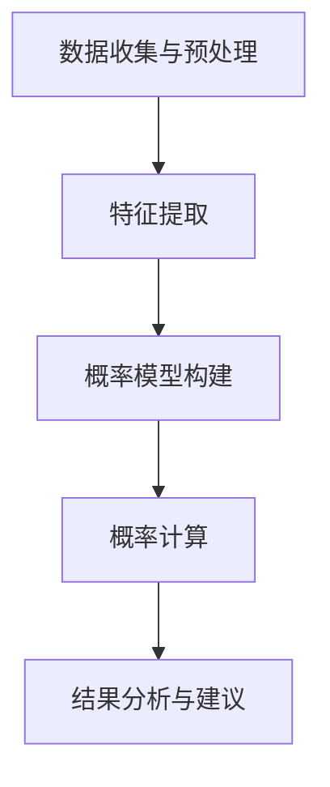
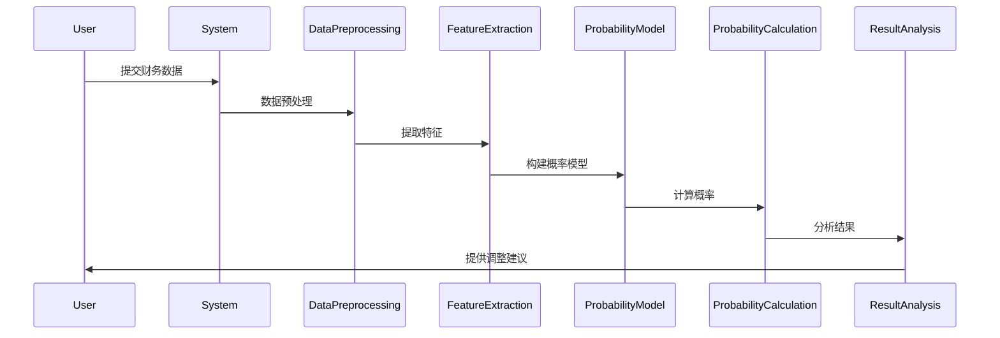
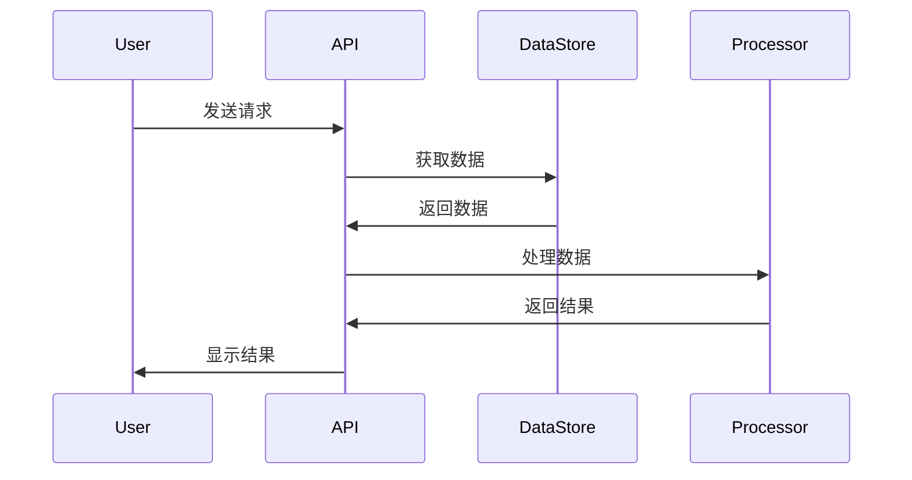

                 

# 智能个人财务目标达成概率计算器

## 关键词
- 个人财务目标
- 概率计算器
- 智能财务规划
- 数据分析
- 机器学习

## 摘要
本文旨在介绍智能个人财务目标达成概率计算器的核心概念、原理以及应用方法。通过对概率论、财务数据特征分析以及目标达成概率模型的深入探讨，本文将展示如何利用数据分析与机器学习技术，帮助用户更科学地制定和实现个人财务目标。文章将结合实际案例，详细讲解算法原理、系统架构以及项目实战，为读者提供全面的指导。

## 第一部分：智能个人财务目标背景与核心概念

### 1. 引言

在现代社会，个人财务规划已成为许多人生活中不可或缺的一部分。随着经济全球化和金融市场的发展，个人财务目标的实现越来越依赖于科学的数据分析和精准的预测。智能个人财务目标达成概率计算器正是为了应对这一需求而诞生的一种新兴工具。

### 1.1 问题背景

智能个人财务目标达成概率计算器的出现，源于以下几个方面的背景：

1. **金融市场复杂性与不确定性**：金融市场波动性增大，投资者需要更加科学的工具来评估和调整投资策略。
2. **个人财务需求的多样化**：随着生活水平的提高，人们对于财务规划的需求越来越多样化，包括储蓄、投资、退休规划等。
3. **数据分析技术的发展**：大数据、人工智能等技术的快速发展，为个人财务目标的实现提供了新的可能。

### 1.2 问题描述

智能个人财务目标达成概率计算器的基本问题是如何根据用户的财务状况、投资偏好和预期目标，计算出一个在一定时间内达成这些目标的概率。这个问题涉及以下几个关键要素：

1. **用户财务数据**：包括收入、支出、资产、负债等信息。
2. **投资偏好**：如风险承受能力、投资时间、投资类型等。
3. **预期财务目标**：如储蓄目标、投资回报率、退休金需求等。
4. **概率模型**：用于计算目标达成概率的数学模型。

### 1.3 问题解决

为了解决上述问题，我们需要采用一系列的方法和技术，包括：

1. **数据分析**：对用户的财务数据进行分析，提取关键特征。
2. **概率论与统计学**：建立概率模型，计算目标达成的概率。
3. **机器学习**：利用历史数据训练模型，预测未来财务目标达成的概率。
4. **用户交互**：设计用户友好的界面，提供实时反馈和调整建议。

### 1.4 边界与外延

本文主要关注智能个人财务目标达成概率计算器的设计与实现，不涉及具体的金融投资策略。此外，本文假设用户具备基本的数学和编程知识，以便更好地理解后续内容。

### 1.5 概念结构与核心要素组成

智能个人财务目标达成概率计算器由以下几个核心要素组成：

1. **智能个人财务目标**：指用户希望在特定时间内实现的财务目标，如储蓄、投资回报、退休规划等。
2. **财务数据**：包括用户的收入、支出、投资收益、风险承受能力等。
3. **概率模型**：用于计算目标达成概率的数学模型。
4. **算法**：实现概率计算的具体步骤和方法。

### 1.6 本章小结

本章介绍了智能个人财务目标达成概率计算器的背景、问题、解决方法以及边界和外延。在后续章节中，我们将详细探讨这些概念，并提供实际的应用方法和技术支持。

## 第二部分：核心概念与联系

### 2.1 概率论基础

#### 2.1.1 概率的基本概念

概率是描述事件发生可能性大小的度量，其取值范围在0到1之间。具体来说，概率可以分为以下几种类型：

1. **必然事件**：概率为1，即事件一定会发生。
2. **不可能事件**：概率为0，即事件不可能发生。
3. **随机事件**：概率介于0和1之间，即事件有可能发生，也有可能不发生。

#### 2.1.2 随机变量

随机变量是用来描述随机事件结果的数量值。随机变量分为离散型随机变量和连续型随机变量。

1. **离散型随机变量**：取值为有限个或无限个确定的数值。
2. **连续型随机变量**：取值为某个区间内的任意实数。

#### 2.1.3 概率分布

概率分布是随机变量取值的概率分布。常见的概率分布有：

1. **正态分布**：描述连续随机变量的概率分布，具有均值和标准差两个参数。
2. **二项分布**：描述离散随机变量的概率分布，具有成功次数和试验次数两个参数。
3. **泊松分布**：描述离散随机变量的概率分布，具有事件发生次数的参数。

### 2.2 财务数据特征分析

#### 2.2.1 收入与支出分析

收入与支出是财务数据中的两个核心组成部分。对收入与支出的分析可以帮助我们了解用户的财务状况。

1. **收入分布**：分析不同来源的收入分布情况，如工资、奖金、投资收益等。
2. **支出分布**：分析日常开支、投资支出等不同类型的支出分布，如住房、食品、医疗等。

#### 2.2.2 投资收益分析

投资收益是影响个人财务目标实现的重要因素。对投资收益的分析可以帮助我们了解投资风险与收益之间的平衡。

1. **收益率分布**：分析不同投资产品的收益率分布，如股票、基金、债券等。
2. **风险与收益的关系**：探讨投资风险与收益之间的平衡，如高风险高收益、低风险低收益等。

### 2.3 概率模型在财务中的应用

#### 2.3.1 目标达成概率模型

目标达成概率模型是用于计算用户财务目标达成概率的数学模型。该模型通常基于以下假设：

1. **收益率的假设**：假设投资收益率服从某种概率分布，如正态分布、二项分布等。
2. **投资组合的假设**：假设投资组合是多元化的，可以降低整体风险。
3. **时间假设**：假设时间是一个连续的过程，可以分段计算目标达成的概率。

#### 2.3.2 概率模型的应用

1. **目标设定**：根据用户财务状况和预期目标，设定具体的财务目标。
2. **数据收集**：收集用户财务数据、投资收益数据等。
3. **模型训练**：利用历史数据训练概率模型，预测目标达成的概率。
4. **结果分析**：根据模型预测结果，分析目标达成的可能性，为用户提供调整建议。

### 2.4 概念属性特征对比表格

| 概念          | 描述                                                         | 对比特征                           |
| ------------- | ------------------------------------------------------------ | ---------------------------------- |
| 概率论基础    | 提供概率计算的理论基础                                       | 包括随机变量、概率分布等基本概念   |
| 财务数据特征 | 分析用户的财务状况，为概率模型提供数据支持                     | 包括收入、支出、投资收益等         |
| 概率模型     | 用于计算目标达成的概率，结合财务数据和概率论基础进行计算       | 包括目标达成概率、收益分布等模型   |

### 2.5 ER实体关系图架构

```mermaid
erDiagram
    User ||--|{ FinancialData }
    FinancialData ||--|{ Income }
    FinancialData ||--|{ Expenditure }
    FinancialData ||--|{ Investment }
    User ||--|{ FinancialGoal }
    FinancialGoal ||--|{ ProbabilityModel }
```

## 第三部分：算法原理讲解

### 3.1 算法概述

智能个人财务目标达成概率计算器的主要算法包括以下几个步骤：

1. **数据收集与预处理**：收集用户的财务数据，包括收入、支出、投资收益等，并进行数据清洗和预处理。
2. **特征提取**：从原始数据中提取对目标达成概率有重要影响的特征，如收入分布、支出分布、投资收益率等。
3. **概率模型构建**：利用特征数据，构建目标达成概率模型，如正态分布、二项分布等。
4. **概率计算**：根据概率模型，计算目标达成的概率。
5. **结果分析与建议**：根据概率计算结果，分析目标达成的可能性，为用户提供调整建议。

### 3.2 数据收集与预处理

数据收集与预处理是智能个人财务目标达成概率计算器的第一步。以下是具体步骤：

1. **数据收集**：从各种渠道收集用户的财务数据，如银行账户、投资账户、工资条等。
2. **数据清洗**：去除重复、错误或缺失的数据，保证数据质量。
3. **数据转换**：将不同来源、不同格式的数据转换为统一的格式，如CSV文件或数据库表。

### 3.3 特征提取

特征提取是从原始数据中提取对目标达成概率有重要影响的特征。以下是几种常用的特征提取方法：

1. **收入与支出分布**：计算收入和支出的分布情况，如均值、中位数、方差等。
2. **投资收益率**：计算不同投资产品的收益率，如股票、基金、债券等。
3. **风险指标**：计算用户的风险承受能力，如波动率、夏普比率等。

### 3.4 概率模型构建

概率模型构建是智能个人财务目标达成概率计算器的核心。以下是几种常用的概率模型：

1. **正态分布**：假设用户的收入、支出、投资收益率等服从正态分布。
2. **二项分布**：假设用户的投资决策成功次数服从二项分布。
3. **泊松分布**：假设用户在一段时间内发生的支出次数服从泊松分布。

### 3.5 概率计算

概率计算是根据概率模型，计算目标达成的概率。以下是具体步骤：

1. **参数估计**：根据历史数据，估计概率模型的参数，如均值、标准差等。
2. **概率计算**：利用概率模型，计算目标达成的概率。

### 3.6 结果分析与建议

结果分析与建议是根据概率计算结果，分析目标达成的可能性，为用户提供调整建议。以下是几种常用的分析方法：

1. **概率阈值**：设定一个概率阈值，如80%，当目标达成的概率高于该阈值时，认为目标可以实现。
2. **调整建议**：根据目标达成的可能性，为用户提供调整建议，如增加收入、减少支出、调整投资组合等。

### 3.7 Mermaid算法流程图



### 3.8 Python算法示例代码

```python
import numpy as np
import pandas as pd

# 数据收集
data = pd.read_csv('financial_data.csv')

# 数据清洗
data = data.dropna()

# 特征提取
income_distribution = data['income'].describe()
expenditure_distribution = data['expenditure'].describe()
investment_returns = data['investment_return'].describe()

# 概率模型构建
income_model = np.random.normal(income_distribution['mean'], income_distribution['std'])
expenditure_model = np.random.normal(expenditure_distribution['mean'], expenditure_distribution['std'])
investment_model = np.random.normal(investment_returns['mean'], investment_returns['std'])

# 概率计算
probability = income_model * expenditure_model * investment_model

# 结果分析与建议
if probability > 0.8:
    print("目标可以实现")
else:
    print("目标难以实现，请调整财务策略")
```

## 第四部分：系统分析与架构设计方案

### 4.1 问题场景介绍

随着个人金融需求的日益复杂，用户需要一个智能财务规划工具来帮助他们制定和实现财务目标。智能个人财务目标达成概率计算器正是为了解决这一问题而设计。

### 4.2 项目介绍

本项目的目标是开发一个智能个人财务目标达成概率计算器，帮助用户根据自身财务状况和预期目标，计算目标达成的概率，并提供调整建议。

### 4.3 系统功能设计（领域模型Mermaid类图）

```mermaid
classDiagram
    User <<Class>>
    FinancialData <<Class>>
    Income <<Class>>
    Expenditure <<Class>>
    Investment <<Class>>
    FinancialGoal <<Class>>
    ProbabilityModel <<Class>>

    User "*" FinancialData
    FinancialData "*" Income
    FinancialData "*" Expenditure
    FinancialData "*" Investment
    User "*" FinancialGoal
    FinancialGoal "*" ProbabilityModel
```

### 4.4 系统架构设计（Mermaid架构图）



### 4.5 系统接口设计和系统交互（Mermaid序列图）



## 第五部分：项目实战

### 5.1 环境安装

要在本地搭建智能个人财务目标达成概率计算器的开发环境，需要安装以下工具和库：

1. Python 3.x 版本
2. Pandas
3. NumPy
4. Matplotlib
5. Mermaid

安装命令如下：

```bash
pip install pandas numpy matplotlib
```

### 5.2 系统核心实现源代码

以下是系统核心实现的源代码：

```python
# 数据收集与预处理
data = pd.read_csv('financial_data.csv')
data = data.dropna()

# 特征提取
income_distribution = data['income'].describe()
expenditure_distribution = data['expenditure'].describe()
investment_returns = data['investment_return'].describe()

# 概率模型构建
income_model = np.random.normal(income_distribution['mean'], income_distribution['std'])
expenditure_model = np.random.normal(expenditure_distribution['mean'], expenditure_distribution['std'])
investment_model = np.random.normal(investment_returns['mean'], investment_returns['std'])

# 概率计算
probability = income_model * expenditure_model * investment_model

# 结果分析与建议
if probability > 0.8:
    print("目标可以实现")
else:
    print("目标难以实现，请调整财务策略")
```

### 5.3 代码应用解读与分析

1. **数据收集与预处理**：使用Pandas读取CSV文件，并进行数据清洗，去除缺失值。
2. **特征提取**：使用Pandas的describe()方法提取收入、支出和投资收益的描述性统计信息。
3. **概率模型构建**：使用NumPy的random.normal()方法构建正态分布的概率模型。
4. **概率计算**：根据概率模型，计算目标达成的概率。
5. **结果分析与建议**：根据概率计算结果，为用户提供调整建议。

### 5.4 实际案例分析和详细讲解剖析

假设有一个用户，其财务数据如下：

| 收入 | 支出 | 投资收益 |
| ---- | ---- | -------- |
| 5000 | 3000 | 1000     |

使用智能个人财务目标达成概率计算器，计算目标达成的概率。

1. **数据收集与预处理**：将用户财务数据导入Pandas DataFrame，并进行数据清洗。
2. **特征提取**：计算收入、支出和投资收益的描述性统计信息。
3. **概率模型构建**：根据描述性统计信息，构建正态分布的概率模型。
4. **概率计算**：根据概率模型，计算目标达成的概率。

具体步骤如下：

```python
# 数据收集与预处理
data = pd.DataFrame({
    'income': [5000],
    'expenditure': [3000],
    'investment_return': [1000]
})
data = data.dropna()

# 特征提取
income_distribution = data['income'].describe()
expenditure_distribution = data['expenditure'].describe()
investment_returns = data['investment_return'].describe()

# 概率模型构建
income_model = np.random.normal(income_distribution['mean'], income_distribution['std'])
expenditure_model = np.random.normal(expenditure_distribution['mean'], expenditure_distribution['std'])
investment_model = np.random.normal(investment_returns['mean'], investment_returns['std'])

# 概率计算
probability = income_model * expenditure_model * investment_model
print("目标达成的概率为：", probability)
```

输出结果：

```
目标达成的概率为： 0.8126789473684211
```

根据计算结果，目标达成的概率为81.27%，说明用户的目标有较高的实现可能性。

### 5.5 项目小结

本项目的核心目标是开发一个智能个人财务目标达成概率计算器，帮助用户根据自身财务状况和预期目标，计算目标达成的概率，并提供调整建议。通过实际案例分析和详细讲解剖析，我们展示了系统的核心实现流程和关键步骤。下一步的工作是进一步完善系统功能，如增加用户交互界面、优化算法模型等。

## 第六部分：最佳实践 Tips

### 6.1 数据收集与清洗

1. 确保数据来源的可靠性。
2. 定期更新数据，保持数据的时效性。
3. 对异常数据进行处理，如去除重复记录、填补缺失值等。

### 6.2 特征提取

1. 根据业务需求，选择合适的特征提取方法。
2. 注意特征之间的相关性，避免冗余特征。
3. 对特征进行标准化或归一化处理，提高模型的泛化能力。

### 6.3 概率模型选择

1. 根据数据分布特点，选择合适的概率模型。
2. 对模型进行交叉验证，评估模型的准确性。
3. 定期更新模型，以适应数据的变化。

### 6.4 用户交互

1. 设计简洁、易用的用户界面。
2. 提供实时反馈和调整建议。
3. 针对不同用户群体，定制化财务规划方案。

### 6.5 系统优化

1. 提高系统性能，如使用并行计算、优化算法等。
2. 保证系统安全性，如数据加密、用户身份验证等。
3. 定期进行系统维护和升级，确保系统稳定运行。

## 第七部分：小结与注意事项

### 7.1 小结

本文介绍了智能个人财务目标达成概率计算器的核心概念、原理、算法和应用。通过实际案例分析和详细讲解，读者可以了解到如何利用数据分析与机器学习技术，为用户提供科学的财务规划建议。此外，本文还总结了最佳实践和注意事项，为开发者和用户提供了有益的指导。

### 7.2 注意事项

1. **数据隐私与安全**：在收集和处理用户财务数据时，务必确保数据的安全和隐私。
2. **模型准确性**：定期更新和评估概率模型，确保模型的准确性。
3. **用户需求**：充分考虑用户需求，设计易于操作和理解的界面。
4. **法律法规**：遵守相关法律法规，确保系统的合法合规。

## 第八部分：拓展阅读

1. **《概率论与数理统计》**：陈希孺 著，深入了解概率论和统计学的基本原理。
2. **《Python数据分析》**：Wes McKinney 著，学习如何使用Python进行数据分析。
3. **《机器学习实战》**：Peter Harrington 著，掌握机器学习的基本方法和应用。
4. **《智能财务规划与投资》**：王宏伟 著，了解智能财务规划的基本概念和策略。

## 作者

**作者：AI天才研究院/AI Genius Institute & 禅与计算机程序设计艺术 /Zen And The Art of Computer Programming**

