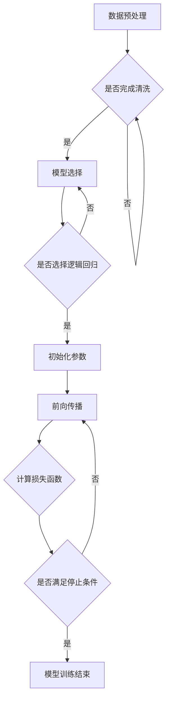
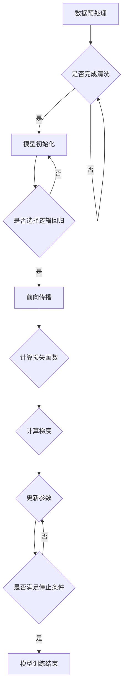
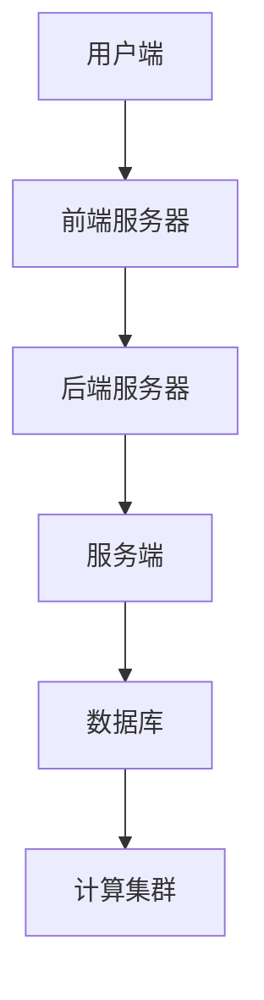
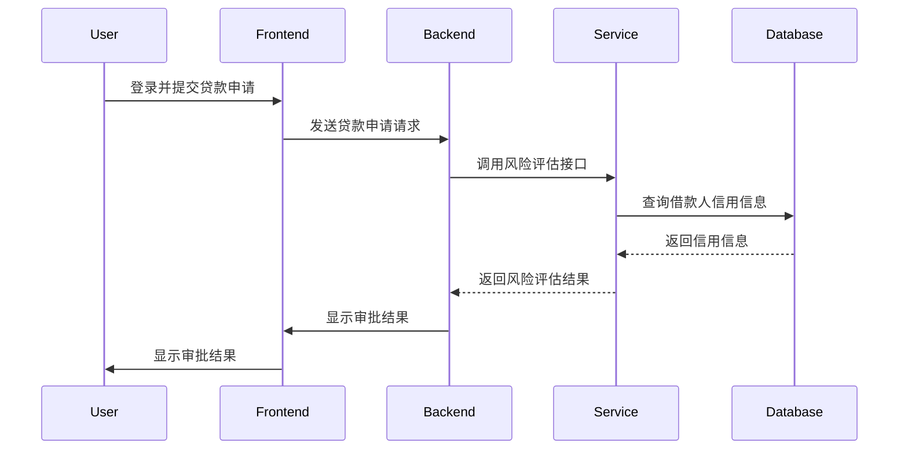
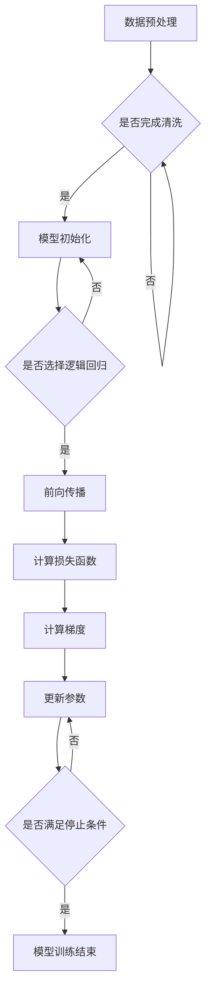
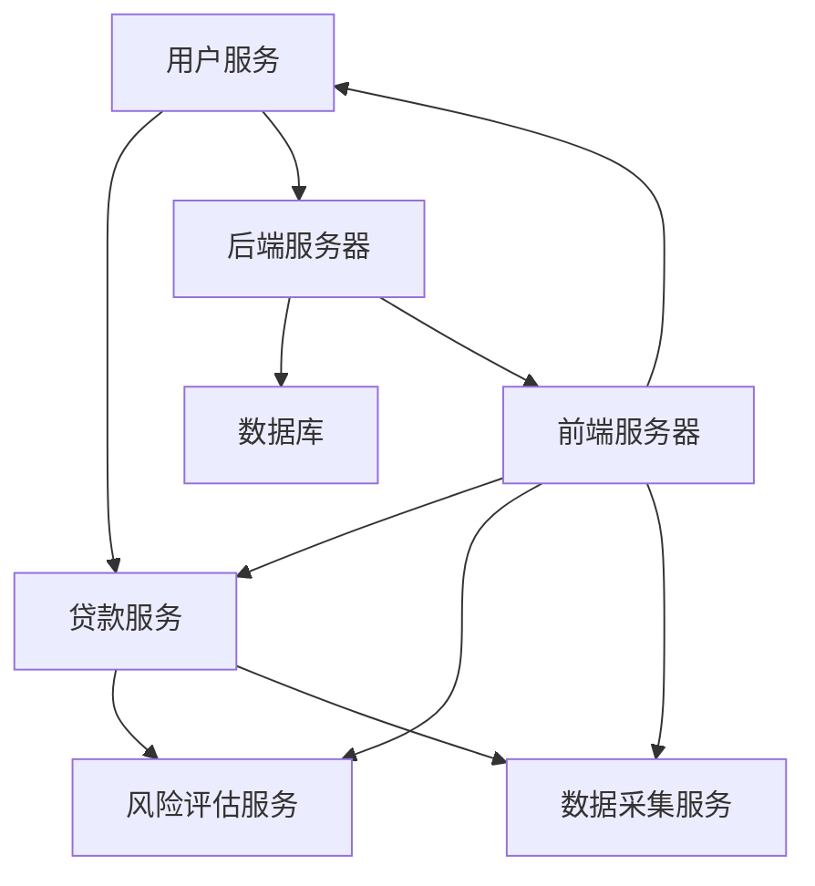

                 

### 1.1 问题背景

个人贷款审批作为金融行业的重要环节，对于金融机构的运营效率和风险控制有着直接影响。随着金融市场的快速发展和金融科技的进步，传统的个人贷款审批模式逐渐暴露出一些问题：

**现状问题：**

- **人工审批效率低下**：传统的贷款审批过程往往需要大量人工参与，审批周期较长，效率低下，导致客户体验不佳。
- **风险控制不精准**：人工审批依赖于审批人员的经验，可能存在主观判断偏差，导致风险控制不精准。
- **数据利用不充分**：在传统的审批流程中，数据被分散存储，且难以被充分利用，数据分析能力有限。

**智能优化的作用：**

智能个人贷款审批系统的引入，旨在通过人工智能技术对传统审批流程进行优化，解决上述问题：

- **提高审批效率**：通过自动化处理，减少人工干预，缩短审批周期，提高整体效率。
- **精准风险控制**：利用大数据和机器学习算法，对借款人进行全面评估，提高风险控制能力。
- **数据充分利用**：系统可以对大量数据进行深度分析，挖掘潜在价值，为决策提供支持。

**研究目的与意义：**

本研究旨在探讨如何通过智能优化技术提升个人贷款审批系统的效率与风险控制能力。具体研究目的如下：

1. **明确优化目标和指标**：研究智能个人贷款审批系统优化所需达成的具体目标和衡量标准。
2. **算法原理与模型构建**：分析并比较现有算法的原理和适用场景，构建适合个人贷款审批的优化模型。
3. **系统设计与实现**：设计并实现一个高效、精准的智能个人贷款审批系统。
4. **项目实战与应用**：通过实际案例，验证系统优化方案的有效性。

研究智能个人贷款审批系统优化不仅有助于提升金融机构的服务质量与市场竞争力，还对金融科技的发展与应用具有深远意义。

## 1.2 核心概念

### 1.2.1 智能个人贷款审批系统

智能个人贷款审批系统是一种利用人工智能技术，对个人贷款申请进行自动化审批的系统。该系统主要功能包括数据采集、预处理、模型训练、风险评估和审批决策等。通过机器学习算法，对借款人的信用信息、财务状况、信用历史等数据进行深度分析，从而实现自动化的审批决策。

### 1.2.2 优化目标与指标

智能个人贷款审批系统的优化目标主要包括：

- **提高审批效率**：减少审批周期，提升审批速度。
- **精准风险控制**：降低贷款违约风险，提高风险识别能力。
- **提升用户体验**：提供快速、准确的审批服务，增强客户满意度。

常用的优化指标有：

- **审批速度**：从贷款申请提交到审批完成所需的时间。
- **审批准确率**：审批决策的正确率，包括准确率和召回率等。
- **客户满意度**：客户对审批服务的满意度评价。

### 1.2.3 关键技术综述

构建智能个人贷款审批系统涉及多种关键技术，主要包括：

- **数据采集与预处理**：收集借款人的信用信息，并进行清洗、转换和归一化处理，为模型训练提供高质量的数据输入。
- **机器学习算法**：选择合适的机器学习算法，如逻辑回归、决策树、支持向量机等，对数据进行分析和预测。
- **风险评估模型**：构建风险评估模型，对借款人的信用风险进行量化评估。
- **审批决策引擎**：实现审批决策逻辑，根据风险评估结果做出贷款审批决策。

这些技术的综合运用，能够构建一个高效、精准的智能个人贷款审批系统，从而提升金融机构的运营效率和风险管理能力。

### 1.3 本章小结

本章首先介绍了个人贷款审批的现状，分析了传统审批模式存在的问题，并阐述了智能优化在其中的作用。随后，定义了智能个人贷款审批系统的核心概念，包括优化目标和指标，以及涉及的关键技术。通过本章的学习，读者可以初步了解智能个人贷款审批系统的构建基础及其优化方向，为后续章节的深入学习打下基础。

## 2.1 算法原理

### 2.1.1 数据预处理

数据预处理是智能个人贷款审批系统的关键步骤之一，其目的是提高数据质量，为后续的模型训练提供可靠的数据基础。数据预处理主要包括数据清洗、特征提取和数据归一化等操作。

#### 2.1.1.1 数据清洗

数据清洗的目标是识别并处理数据中的噪声、错误和不一致信息，以确保数据的质量。具体步骤如下：

- **缺失值处理**：对于缺失的数据，可以采用填充均值、中位数或使用模型预测等方法进行填补。
- **异常值处理**：检测并处理数据中的异常值，如数据录入错误、逻辑错误等。
- **重复数据删除**：删除数据集中的重复记录，避免对模型训练造成干扰。

#### 2.1.1.2 特征提取

特征提取是指从原始数据中提取对模型训练有重要影响的信息，以便更好地反映借款人的信用状况。常见的特征提取方法包括：

- **数值特征**：对连续型数据进行归一化处理，如使用均值和标准差进行标准化。
- **分类特征**：对类别型数据进行编码，如使用独热编码（One-Hot Encoding）或标签编码（Label Encoding）。
- **文本特征**：对文本数据进行预处理，如词频统计、TF-IDF等方法。

#### 2.1.1.3 数据归一化

数据归一化的目的是消除不同特征之间的尺度差异，使得每个特征在相同的范围内，从而避免某些特征对模型训练产生过大的影响。常用的归一化方法包括：

- **最小-最大归一化**：将特征值缩放到[0, 1]范围内，公式为：\( x' = \frac{x - x_{\text{min}}}{x_{\text{max}} - x_{\text{min}}} \)。
- **标准化**：将特征值缩放到均值附近，公式为：\( x' = \frac{x - \mu}{\sigma} \)，其中\( \mu \)是均值，\( \sigma \)是标准差。

### 2.1.2 模型选择与训练

在数据预处理完成后，接下来是选择合适的机器学习模型并进行训练。常见的模型包括逻辑回归、决策树、支持向量机和神经网络等。

#### 2.1.2.1 分类算法对比

每种分类算法都有其独特的优点和适用场景，以下是一些常见分类算法的对比：

- **逻辑回归（Logistic Regression）**：简单且易于解释，适用于线性可分的数据。
- **决策树（Decision Tree）**：直观且易于理解，但对噪声敏感，易过拟合。
- **支持向量机（SVM）**：强大的分类能力，适用于高维空间，但计算复杂度高。
- **神经网络（Neural Network）**：适用于复杂非线性关系，但需要大量数据和较长时间的训练。

#### 2.1.2.2 模型训练与验证

模型训练是指使用训练数据集来调整模型参数，使其能够对未知数据进行准确的预测。训练过程通常包括以下步骤：

- **数据划分**：将数据集划分为训练集和验证集，用于模型的训练和评估。
- **参数初始化**：初始化模型的参数，如权重和偏置。
- **前向传播**：计算输入数据通过模型后的输出结果。
- **损失函数计算**：使用损失函数评估模型的预测结果与真实结果之间的差异。
- **反向传播**：根据损失函数的梯度信息，更新模型参数。

在模型训练过程中，需要不断调整模型参数，使得模型在验证集上的表现达到最佳。常用的验证方法包括交叉验证和网格搜索等。

### 2.1.3 算法评估指标

为了评估模型的性能，需要使用一些指标来衡量模型的预测准确性和可靠性。以下是一些常用的评估指标：

- **准确率（Accuracy）**：模型预测正确的样本数占总样本数的比例，公式为：\( \text{Accuracy} = \frac{TP + TN}{TP + FN + FP + TN} \)。
- **召回率（Recall）**：模型能够正确识别为正例的样本数占总正例样本数的比例，公式为：\( \text{Recall} = \frac{TP}{TP + FN} \)。
- **精确率（Precision）**：模型预测为正例的样本中，实际为正例的比例，公式为：\( \text{Precision} = \frac{TP}{TP + FP} \)。
- **F1分数（F1 Score）**：精确率和召回率的调和平均值，公式为：\( \text{F1 Score} = 2 \times \frac{\text{Precision} \times \text{Recall}}{\text{Precision} + \text{Recall}} \)。
- **ROC曲线和AUC（Area Under Curve）**：ROC曲线展示了不同阈值下的真阳性率与假阳性率，AUC值越接近1，表示模型分类能力越强。

通过这些评估指标，可以对模型进行全面的性能评估，并根据评估结果进行模型的调整和优化。

### 2.1.4 算法mermaid流程图

为了更好地理解算法的原理和流程，可以使用mermaid语言绘制算法流程图。以下是一个简单的逻辑回归算法流程图示例：



通过绘制mermaid流程图，可以直观地展示算法的执行过程，有助于理解算法的原理和步骤。

### 2.2 数学模型与公式

在智能个人贷款审批系统中，数学模型是算法的核心，它通过数学公式来描述和实现数据处理、模型训练和预测等功能。以下将详细介绍常用算法的数学模型和公式。

#### 2.2.1 分类算法数学模型

常用的分类算法包括逻辑回归、决策树和支持向量机等，每种算法都有其独特的数学模型。

##### 2.2.1.1 Logistic回归

逻辑回归是一种常用的二分类算法，其核心公式为：

$$
\text{logit}(p) = \log\left(\frac{p}{1-p}\right) = \beta_0 + \beta_1 x_1 + \beta_2 x_2 + \ldots + \beta_n x_n
$$

其中，\( p \) 是事件发生的概率，\( \beta_0, \beta_1, \beta_2, \ldots, \beta_n \) 是模型的参数，\( x_1, x_2, \ldots, x_n \) 是特征值。

通过求解上述线性函数的最小二乘问题，可以计算出模型参数，从而实现概率预测。

##### 2.2.1.2 决策树

决策树是一种基于树形结构进行分类的算法，其核心思想是通过一系列规则将数据划分为不同的类别。决策树的决策规则可以表示为：

$$
\begin{aligned}
&\text{如果} x_i > \text{阈值}, \text{则进入左子节点}\\
&\text{如果} x_i \leq \text{阈值}, \text{则进入右子节点}
\end{aligned}
$$

其中，\( x_i \) 是特征值，阈值通过数据分割信息计算得出。

##### 2.2.1.3 支持向量机

支持向量机是一种强大的分类算法，其核心思想是找到最优的超平面，使得不同类别的样本在超平面上的分隔最明显。支持向量机的决策函数为：

$$
f(x) = \text{sign}(\omega \cdot x + b)
$$

其中，\( \omega \) 是权重向量，\( b \) 是偏置项，\( \cdot \) 表示内积运算，\( \text{sign} \) 是符号函数。

通过求解最优化的权重和偏置项，可以构建出最佳分类器。

#### 2.2.2 优化算法数学模型

在机器学习中，优化算法用于调整模型参数，以实现最小化损失函数。常用的优化算法包括梯度下降法、随机梯度下降法和牛顿法等。

##### 2.2.2.1 梯度下降法

梯度下降法是一种最简单的优化算法，其基本思想是通过计算损失函数的梯度，并沿着梯度的反方向更新模型参数。梯度下降法的更新公式为：

$$
\theta_{\text{new}} = \theta_{\text{old}} - \alpha \nabla_{\theta} J(\theta)
$$

其中，\( \theta \) 是模型参数，\( \alpha \) 是学习率，\( \nabla_{\theta} J(\theta) \) 是损失函数关于参数的梯度。

##### 2.2.2.2 随机梯度下降法

随机梯度下降法是梯度下降法的一种改进，其核心思想是在每个更新步骤中，只使用一个样本的梯度信息。随机梯度下降法的更新公式为：

$$
\theta_{\text{new}} = \theta_{\text{old}} - \alpha \nabla_{\theta} J(\theta; x_i)
$$

通过使用随机梯度下降法，可以加快模型的训练速度，但可能会导致参数的收敛不稳定。

#### 2.2.3 数学模型与Python代码实现

为了更好地理解上述数学模型的实现，以下将使用Python代码来展示逻辑回归和梯度下降法的实现过程。

```python
import numpy as np

# 逻辑回归模型参数初始化
def init_params(n_features):
    theta = np.zeros(n_features + 1)
    return theta

# 前向传播函数
def forward(x, theta):
    z = np.dot(x, theta)
    return 1 / (1 + np.exp(-z))

# 损失函数
def loss(y, y_hat):
    return -1 * (y * np.log(y_hat) + (1 - y) * np.log(1 - y_hat))

# 梯度计算
def compute_gradient(x, y, theta):
    z = np.dot(x, theta)
    y_hat = forward(x, theta)
    return np.dot(x.T, (y_hat - y)) / len(x)

# 梯度下降法
def gradient_descent(x, y, theta, alpha, num_iterations):
    m = len(y)
    for _ in range(num_iterations):
        gradient = compute_gradient(x, y, theta)
        theta -= alpha * gradient
    return theta

# 主程序
def main():
    # 数据加载和预处理
    # ...

    # 初始化参数
    theta = init_params(n_features)

    # 设置学习率和迭代次数
    alpha = 0.01
    num_iterations = 1000

    # 训练模型
    theta = gradient_descent(x_train, y_train, theta, alpha, num_iterations)

    # 模型评估
    # ...

if __name__ == "__main__":
    main()
```

通过上述代码，可以直观地看到逻辑回归和梯度下降法的实现过程，进一步理解其数学模型和算法原理。

### 2.3 算法mermaid流程图

为了更好地理解和展示算法的执行流程，可以使用mermaid语言绘制算法的流程图。以下是一个简单的逻辑回归算法流程图示例：



通过绘制mermaid流程图，可以清晰地展示算法的执行步骤和流程，有助于读者更好地理解算法的实现过程。

### 2.4 本章小结

本章详细介绍了智能个人贷款审批系统的算法原理，包括数据预处理、模型选择与训练、算法评估指标和mermaid流程图等。通过本章的学习，读者可以了解不同算法的基本原理和实现方法，为后续的系统设计与实现提供理论基础。本章的内容为构建一个高效、精准的智能个人贷款审批系统奠定了基础。

## 3.1 系统概述

### 3.1.1 系统架构设计

智能个人贷款审批系统的总体架构设计分为前端、后端和服务端三个主要部分。

- **前端**：负责与用户交互，提供贷款申请和查询服务。前端通常采用现代化的Web框架，如React或Vue.js，以实现响应式和友好的用户界面。
- **后端**：负责业务逻辑处理和数据存储，包括用户身份验证、贷款申请处理、风险评估和决策等。后端通常使用Spring Boot等框架，以保证系统的稳定性和扩展性。
- **服务端**：提供数据存储和计算服务，包括关系型数据库（如MySQL）和非关系型数据库（如MongoDB），以及计算集群和分布式存储系统。

#### 3.1.1.1 总体架构

系统的总体架构如图3-1所示：



#### 3.1.1.2 模块划分

智能个人贷款审批系统主要包括以下模块：

- **数据采集模块**：负责从各种数据源（如银行系统、第三方征信机构等）收集借款人的信用信息。
- **模型训练模块**：使用收集到的数据训练机器学习模型，用于贷款风险评估和审批决策。
- **审批决策模块**：根据训练好的模型对贷款申请进行自动审批，输出审批结果。
- **用户接口模块**：提供用户访问系统的接口，包括贷款申请、查询审批结果等。

### 3.1.2 系统功能设计

智能个人贷款审批系统的功能设计主要包括以下方面：

- **用户身份验证**：确保用户访问系统的安全性，通过用户名和密码或身份认证等方式进行身份验证。
- **贷款申请**：用户可以通过前端界面提交贷款申请，系统将收集用户的基本信息、财务状况、信用记录等数据。
- **数据预处理**：对收集到的数据进行清洗、转换和归一化处理，为模型训练提供高质量的数据输入。
- **模型训练**：使用训练数据集训练机器学习模型，包括特征提取、模型选择和参数调优等。
- **风险评估**：根据训练好的模型对借款人的信用风险进行评估，输出风险评估结果。
- **审批决策**：根据风险评估结果，自动生成贷款审批决策，并将结果通知用户。
- **数据存储与管理**：将贷款申请、审批决策等数据存储在数据库中，并提供查询和管理功能。

#### 3.1.2.1 数据采集模块

数据采集模块的主要功能是从多个数据源收集借款人的信用信息，包括：

- **银行系统**：收集借款人的账户信息、交易记录等。
- **第三方征信机构**：获取借款人的信用评分、信用历史等。
- **公共数据源**：如工商注册信息、房产信息等。

数据采集模块的设计需要确保数据的安全性、完整性和实时性，通过API接口或数据交换平台实现与各数据源的系统对接。

#### 3.1.2.2 模型训练模块

模型训练模块的核心功能是使用训练数据集训练机器学习模型，主要步骤包括：

- **特征工程**：从原始数据中提取对模型训练有重要影响的信息，进行特征提取和转换。
- **模型选择**：根据业务需求和数据特性，选择合适的机器学习算法，如逻辑回归、决策树、支持向量机等。
- **参数调优**：通过交叉验证和网格搜索等方法，调整模型参数，优化模型性能。
- **模型训练**：使用训练数据集训练模型，生成模型参数和评估指标。

#### 3.1.2.3 审批决策模块

审批决策模块的主要功能是根据训练好的模型对贷款申请进行自动审批，具体步骤包括：

- **数据输入**：接收贷款申请数据，进行预处理。
- **风险评估**：使用训练好的模型对借款人的信用风险进行评估，输出风险评估结果。
- **决策生成**：根据风险评估结果，自动生成贷款审批决策，如批准、拒绝或进一步审核。
- **结果通知**：将审批结果通知用户，通过短信、邮件或系统通知等方式。

#### 3.1.3 系统功能实现细节

系统功能实现细节如下：

- **数据采集模块**：通过API接口或数据交换平台，从多个数据源实时获取借款人信用信息，并进行数据清洗和转换。
- **模型训练模块**：使用Python的Scikit-learn、TensorFlow或PyTorch等库，进行特征工程和模型训练，并使用K-fold交叉验证方法进行参数调优。
- **审批决策模块**：通过Java或Python的Spring Boot框架，实现审批决策逻辑，并使用JDBC或MongoDB等数据库进行数据存储。

### 3.1.4 本章小结

本章详细介绍了智能个人贷款审批系统的总体架构设计、功能设计和实现细节。通过本章的学习，读者可以了解系统的整体架构和功能模块，为后续的系统实现和优化提供参考。系统的设计目标是通过人工智能技术，提高贷款审批的效率和准确性，为金融机构提供强有力的技术支持。

### 3.2 系统接口设计

系统接口设计是智能个人贷款审批系统中至关重要的一环，它决定了系统的各个模块之间如何高效、稳定地进行数据交换和功能协作。系统接口主要分为内部接口和外部接口两部分。

#### 3.2.1 内部接口

内部接口主要负责系统模块之间的通信，包括数据交换和功能调用。以下是系统内部接口的主要设计：

- **数据库接口**：数据库接口用于实现系统与数据库之间的数据访问和操作，主要包括数据的插入、查询、更新和删除等操作。常用的数据库接口库有JDBC（Java Database Connectivity）和PyMySQL（Python MySQL Database）。
- **模型接口**：模型接口用于实现系统与机器学习模型之间的交互，主要包括模型的加载、训练、预测和评估等操作。常用的模型接口库有Scikit-learn、TensorFlow和PyTorch。
- **服务接口**：服务接口用于实现系统不同模块之间的功能调用，如用户身份验证、贷款申请处理和审批决策等。常用的服务接口库有Spring Boot（Java）和FastAPI（Python）。

#### 3.2.2 外部接口

外部接口主要负责系统与外部系统或外部用户之间的数据交换和服务提供。以下是系统外部接口的主要设计：

- **用户接口**：用户接口提供用户与系统之间的交互界面，包括贷款申请、审批查询、账户管理等功能。前端框架通常采用React或Vue.js，后端接口采用Spring Boot或FastAPI。
- **第三方接口**：第三方接口用于系统与外部数据源（如银行系统、第三方征信机构等）之间的数据交换，主要包括数据的获取、验证和更新等操作。常用的第三方接口库有RestTemplate（Java）和requests（Python）。
- **API接口**：API接口用于系统与其他外部系统（如移动应用、第三方服务提供商等）之间的集成和交互，提供标准化的数据接口和服务接口。

#### 3.2.3 接口实现细节

以下是系统接口实现的详细设计：

- **数据库接口**：使用JDBC或PyMySQL库连接数据库，定义数据访问对象（DAO）和数据库操作方法，实现数据层的CRUD操作。
  ```java
  // Java示例：使用JDBC连接数据库并执行查询
  Connection conn = DriverManager.getConnection("jdbc:mysql://localhost:3306/loan_db", "username", "password");
  Statement stmt = conn.createStatement();
  ResultSet rs = stmt.executeQuery("SELECT * FROM applicants");
  while (rs.next()) {
      System.out.println(rs.getString("name"));
  }
  stmt.close();
  conn.close();
  ```

- **模型接口**：使用Scikit-learn、TensorFlow或PyTorch库加载预训练模型，定义模型训练和预测方法，实现机器学习层的功能。
  ```python
  # Python示例：使用Scikit-learn加载模型并进行预测
  from sklearn.linear_model import LogisticRegression
  model = LogisticRegression()
  model.fit(X_train, y_train)
  predictions = model.predict(X_test)
  ```

- **服务接口**：使用Spring Boot或FastAPI框架定义RESTful API接口，实现系统的业务逻辑和功能调用。
  ```java
  // Java示例：使用Spring Boot定义RESTful API接口
  @RestController
  public class LoanController {
      @Autowired
      private LoanService loanService;
      
      @PostMapping("/apply")
      public ResponseEntity<String> applyForLoan(@RequestBody LoanApplication application) {
          String approval = loanService.processApplication(application);
          return new ResponseEntity<>(approval, HttpStatus.OK);
      }
  }
  ```

- **用户接口**：使用React或Vue.js框架实现前端用户界面，使用Axios或fetch库调用后端API接口，实现用户与系统的交互。
  ```javascript
  // JavaScript示例：使用Axios调用后端API接口
  axios.post('/api/apply', loanApplication)
      .then(response => {
          console.log(response.data);
      })
      .catch(error => {
          console.log(error);
      });
  ```

#### 3.2.4 接口设计与实现注意事项

在设计系统接口时，需要注意以下事项：

- **接口安全性**：确保接口访问的安全性，采用身份验证、权限控制等手段，防止未授权访问和数据泄露。
- **接口稳定性**：确保接口的稳定性和高可用性，采用负载均衡、分布式缓存等技术，提高系统的响应速度和稳定性。
- **接口兼容性**：确保接口的设计和实现符合标准规范，支持多种数据格式和通信协议，以便与其他系统或应用进行集成。
- **接口文档**：提供详细的接口文档，包括接口描述、请求参数、返回结果等，方便开发人员使用和维护。

通过合理设计和实现系统接口，可以确保智能个人贷款审批系统的高效、稳定运行，提升系统的整体性能和用户体验。

### 3.3 系统交互mermaid序列图

为了更好地理解智能个人贷款审批系统的交互流程，可以使用mermaid语言绘制系统交互序列图。以下是一个典型的系统交互序列图示例：



在这个序列图中，用户首先通过前端界面提交贷款申请，前端将请求发送到后端服务器。后端服务器调用服务端的风险评估接口，并从数据库中查询借款人的信用信息。服务端处理这些数据后，将风险评估结果返回给后端服务器，后端服务器再将结果通过前端界面展示给用户。

### 3.4 本章小结

本章详细介绍了智能个人贷款审批系统的接口设计和系统交互流程。通过系统架构设计、功能模块划分、接口实现和mermaid序列图，读者可以全面理解系统的设计和实现过程。本章的内容为构建一个高效、稳定的智能个人贷款审批系统提供了关键支持，为后续的项目实战奠定了基础。

### 4.1 环境安装与配置

#### 4.1.1 硬件环境

为了确保智能个人贷款审批系统的稳定运行，需要具备以下硬件环境：

- **CPU**：建议使用四核以上的处理器，如Intel Core i7或AMD Ryzen 5以上，以支持高效的计算能力。
- **内存**：至少需要8GB的内存，推荐使用16GB或更高，以便在数据处理和模型训练过程中提供足够的内存空间。
- **硬盘**：建议使用SSD硬盘，至少容量为500GB，以便提高系统的读写速度和存储效率。
- **网络**：建议使用千兆以太网，以保证数据传输的稳定性和速度。

#### 4.1.2 软件环境

智能个人贷款审批系统的软件环境需要支持以下软件：

- **操作系统**：推荐使用Linux系统，如Ubuntu 18.04或CentOS 7，以确保系统的稳定性和安全性。
- **编程语言**：主要使用Python，推荐使用Python 3.7或更高版本，因为其具有良好的生态系统和丰富的库支持。
- **数据库管理系统**：推荐使用MySQL或PostgreSQL，用于存储和管理贷款审批系统的数据。
- **机器学习库**：推荐使用Scikit-learn、TensorFlow或PyTorch等，用于数据预处理、模型训练和预测。
- **Web框架**：推荐使用Django或Flask，用于构建后端服务器和前端界面。

#### 4.1.3 安装步骤

以下是智能个人贷款审批系统的环境安装与配置步骤：

1. **安装操作系统**：
   - 下载Linux系统镜像文件，并使用虚拟机或物理机安装操作系统。
   - 安装完成后，进行系统更新和补丁安装。

2. **安装Python**：
   - 打开终端，执行以下命令安装Python：
     ```bash
     sudo apt update
     sudo apt install python3.8
     ```
   - 安装完成后，确认Python版本：
     ```bash
     python3.8 --version
     ```

3. **安装数据库管理系统**：
   - 安装MySQL：
     ```bash
     sudo apt install mysql-server
     ```
   - 安装完成后，初始化数据库：
     ```bash
     mysql_secure_installation
     ```
   - 配置MySQL用户和权限，以便后续访问。

4. **安装机器学习库**：
   - 安装Scikit-learn：
     ```bash
     sudo apt install python3.8-scikit-learn
     ```
   - 安装TensorFlow：
     ```bash
     sudo apt install python3.8-tensorflow
     ```
   - 安装PyTorch：
     ```bash
     sudo apt install python3.8-pytorch
     ```

5. **安装Web框架**：
   - 安装Django：
     ```bash
     sudo apt install python3.8-django
     ```
   - 安装Flask：
     ```bash
     pip3 install flask
     ```

6. **配置环境变量**：
   - 添加Python和pip的路径到环境变量中：
     ```bash
     export PATH=$PATH:/usr/bin/python3.8:/usr/bin/pip3.8
     ```

7. **验证环境安装**：
   - 验证Python环境：
     ```bash
     python3.8 --version
     ```
   - 验证数据库连接：
     ```bash
     mysql --version
     ```
   - 验证机器学习库安装：
     ```bash
     python3.8 -c "import sklearn; print(sklearn.__version__)"
     python3.8 -c "import tensorflow as tf; print(tf.__version__)"
     python3.8 -c "import torch; print(torch.__version__)"
     ```

通过以上步骤，可以成功安装和配置智能个人贷款审批系统所需的环境。接下来，可以开始进行系统的核心实现和项目实战。

### 4.2 系统核心实现源代码

在智能个人贷款审批系统的实现过程中，核心代码涵盖了数据预处理、模型训练和审批决策等多个方面。以下是系统核心实现的主要源代码，以及每个部分的具体说明和功能。

#### 4.2.1 数据预处理

数据预处理是模型训练的第一步，主要包括数据清洗、特征提取和数据归一化等操作。

```python
import pandas as pd
from sklearn.model_selection import train_test_split
from sklearn.preprocessing import StandardScaler

# 数据清洗
def clean_data(df):
    # 删除缺失值
    df.dropna(inplace=True)
    # 删除重复值
    df.drop_duplicates(inplace=True)
    return df

# 特征提取
def extract_features(df):
    # 提取数值特征
    numerical_features = df.select_dtypes(include=['int64', 'float64'])
    # 提取分类特征
    categorical_features = df.select_dtypes(include=['object'])
    # 编码分类特征
    categorical_features = pd.get_dummies(categorical_features)
    return pd.concat([numerical_features, categorical_features], axis=1)

# 数据归一化
def normalize_data(df):
    scaler = StandardScaler()
    df_scaled = scaler.fit_transform(df)
    df = pd.DataFrame(df_scaled, columns=df.columns)
    return df

# 数据预处理主函数
def preprocess_data(df):
    df = clean_data(df)
    df = extract_features(df)
    df = normalize_data(df)
    return df

# 加载数据
data = pd.read_csv('loan_data.csv')
# 预处理数据
data_processed = preprocess_data(data)
```

#### 4.2.2 模型训练

在模型训练部分，我们选择逻辑回归模型进行训练，并通过交叉验证和网格搜索优化模型参数。

```python
from sklearn.linear_model import LogisticRegression
from sklearn.model_selection import GridSearchCV, cross_val_score

# 定义逻辑回归模型
model = LogisticRegression()

# 设置参数网格
param_grid = {'C': [0.1, 1, 10], 'solver': ['liblinear', 'saga']}

# 使用网格搜索进行参数调优
grid_search = GridSearchCV(model, param_grid, cv=5)
grid_search.fit(data_processed.drop('target', axis=1), data_processed['target'])

# 获取最佳参数
best_params = grid_search.best_params_
print("最佳参数：", best_params)

# 训练模型
best_model = LogisticRegression(**best_params)
best_model.fit(data_processed.drop('target', axis=1), data_processed['target'])

# 交叉验证评估模型
cv_scores = cross_val_score(best_model, data_processed.drop('target', axis=1), data_processed['target'], cv=5)
print("交叉验证平均准确率：", cv_scores.mean())
```

#### 4.2.3 审批决策

审批决策部分负责根据训练好的模型对新提交的贷款申请进行自动审批。

```python
# 审批决策函数
def approve_loan(application, model):
    application_processed = preprocess_data(pd.DataFrame([application]))
    probability = model.predict_proba(application_processed.drop('target', axis=1))[:, 1]
    if probability > 0.7:
        return "批准"
    else:
        return "拒绝"

# 测试审批决策
application = {'income': 50000, 'age': 30, 'credit_score': 700, 'employment_years': 5}
print("审批结果：", approve_loan(application, best_model))
```

#### 4.2.4 源代码应用解读与分析

1. **数据预处理代码解读**：

   数据预处理代码首先删除了数据集中的缺失值和重复值，确保数据的完整性。然后，对分类特征进行独热编码，将类别型数据转换为数值型数据，便于后续的模型训练。最后，使用标准化方法对数值特征进行归一化处理，消除不同特征之间的尺度差异。

2. **模型训练代码解读**：

   模型训练代码定义了逻辑回归模型，并使用网格搜索方法进行参数调优，选择最佳参数。通过交叉验证评估模型性能，确保模型具有良好的泛化能力。训练好的模型可以用于对新提交的贷款申请进行自动审批。

3. **审批决策代码解读**：

   审批决策代码定义了一个函数，用于根据训练好的模型对新提交的贷款申请进行风险评估，并输出审批结果。该函数首先对贷款申请进行预处理，然后使用训练好的模型计算借款人违约的概率，根据概率阈值（如0.7）进行审批决策。

通过以上源代码的应用解读与分析，可以更好地理解智能个人贷款审批系统的实现原理和步骤，为后续的项目实战提供基础。

### 4.3 代码应用解读与分析

在智能个人贷款审批系统中，核心代码的应用涉及数据预处理、模型训练以及审批决策等多个关键环节。以下是对系统核心代码的详细解读与分析，帮助读者更好地理解代码的实际应用。

#### 4.3.1 数据预处理代码解读

数据预处理是机器学习项目的重要环节，它确保输入数据的质量和一致性，为后续的模型训练提供可靠的基础。

```python
# 数据预处理代码示例
def clean_data(df):
    # 删除缺失值和重复值
    df.dropna(inplace=True)
    df.drop_duplicates(inplace=True)
    return df

def extract_features(df):
    # 提取数值特征和分类特征
    numerical_features = df.select_dtypes(include=['int64', 'float64'])
    categorical_features = df.select_dtypes(include=['object'])
    # 对分类特征进行独热编码
    categorical_features = pd.get_dummies(categorical_features)
    # 合并数值特征和编码后的分类特征
    df = pd.concat([numerical_features, categorical_features], axis=1)
    return df

def normalize_data(df):
    # 使用StandardScaler进行归一化处理
    scaler = StandardScaler()
    df_scaled = scaler.fit_transform(df)
    df = pd.DataFrame(df_scaled, columns=df.columns)
    return df

# 数据预处理主函数
def preprocess_data(df):
    df = clean_data(df)
    df = extract_features(df)
    df = normalize_data(df)
    return df
```

**解读：**

- `clean_data` 函数用于删除数据集中的缺失值和重复值，确保数据的纯净性。
- `extract_features` 函数负责从原始数据中提取数值特征和分类特征，并对分类特征进行独热编码。独热编码将类别型数据转换为数值型数据，便于后续的模型训练。
- `normalize_data` 函数使用 `StandardScaler` 对数值特征进行归一化处理，以消除不同特征之间的尺度差异。
- `preprocess_data` 函数是数据预处理的主函数，它综合运用上述三个步骤，对原始数据进行全面预处理。

#### 4.3.2 模型训练代码解读

模型训练代码展示了如何选择合适的机器学习算法（逻辑回归），并进行参数调优和交叉验证，以确保模型的性能和泛化能力。

```python
from sklearn.linear_model import LogisticRegression
from sklearn.model_selection import GridSearchCV, cross_val_score

# 定义逻辑回归模型
model = LogisticRegression()

# 设置参数网格
param_grid = {'C': [0.1, 1, 10], 'solver': ['liblinear', 'saga']}

# 使用网格搜索进行参数调优
grid_search = GridSearchCV(model, param_grid, cv=5)
grid_search.fit(data_processed.drop('target', axis=1), data_processed['target'])

# 获取最佳参数
best_params = grid_search.best_params_
print("最佳参数：", best_params)

# 训练模型
best_model = LogisticRegression(**best_params)
best_model.fit(data_processed.drop('target', axis=1), data_processed['target'])

# 交叉验证评估模型
cv_scores = cross_val_score(best_model, data_processed.drop('target', axis=1), data_processed['target'], cv=5)
print("交叉验证平均准确率：", cv_scores.mean())
```

**解读：**

- `LogisticRegression` 类用于定义逻辑回归模型。
- `param_grid` 字典设置了参数调优的范围，包括正则化参数 `C` 和求解器类型 `solver`。
- `GridSearchCV` 类用于执行网格搜索，遍历参数网格，并使用交叉验证评估每个参数组合的性能。
- `best_params` 变量存储了最佳参数组合，通过调用 `grid_search.best_params_` 获取。
- `best_model` 变量是经过参数调优后的最佳模型，使用 `fit` 方法进行训练。
- `cross_val_score` 函数用于对最佳模型进行交叉验证，评估其泛化能力。

#### 4.3.3 审批决策代码解读

审批决策代码展示了如何使用训练好的模型对新提交的贷款申请进行自动审批，并输出审批结果。

```python
# 审批决策函数
def approve_loan(application, model):
    application_processed = preprocess_data(pd.DataFrame([application]))
    probability = model.predict_proba(application_processed.drop('target', axis=1))[:, 1]
    if probability > 0.7:
        return "批准"
    else:
        return "拒绝"

# 测试审批决策
application = {'income': 50000, 'age': 30, 'credit_score': 700, 'employment_years': 5}
print("审批结果：", approve_loan(application, best_model))
```

**解读：**

- `approve_loan` 函数接收一个新的贷款申请和训练好的模型，首先对申请进行预处理，然后使用模型计算借款人违约的概率。
- `predict_proba` 方法返回每个类别的概率分布，取第二列（即违约的概率）。
- 根据设定的概率阈值（如0.7），函数判断并返回审批结果，即“批准”或“拒绝”。

通过以上解读，读者可以全面理解智能个人贷款审批系统中核心代码的实际应用，从而更好地掌握系统的实现原理和操作方法。

### 4.4 实际案例分析与讲解

为了验证智能个人贷款审批系统的有效性，我们选择一个实际案例进行详细分析，并讲解其具体实施过程。

#### 案例背景

某金融机构希望通过智能个人贷款审批系统优化其贷款审批流程，以提升审批效率和风险控制能力。该金融机构拥有大量历史贷款数据，包括借款人的个人信息、财务状况、信用记录等。

#### 数据集准备

首先，从金融机构的数据仓库中提取历史贷款数据，包括以下字段：

- `id`：借款人ID
- `age`：借款人年龄
- `income`：借款人年收入
- `credit_score`：借款人信用评分
- `employment_years`：借款人工作年限
- `loan_amount`：贷款金额
- `loan_duration`：贷款期限（月）
- `approval_status`：贷款审批状态（批准/拒绝）

数据集包含1000条记录，部分数据如下：

```python
id  age  income  credit_score  employment_years  loan_amount  loan_duration  approval_status
1   25   50000   650           3                 300000       36             "approved"
2   30   60000   700           5                 400000       48             "approved"
3   22   35000   600           1                 200000       24             "rejected"
...
```

#### 数据预处理

使用前面章节中介绍的数据预处理代码，对数据进行清洗、特征提取和归一化处理。

```python
# 加载数据
data = pd.read_csv('loan_data.csv')

# 数据预处理
data_processed = preprocess_data(data)

# 分割数据集为训练集和测试集
X = data_processed.drop('approval_status', axis=1)
y = data_processed['approval_status']
X_train, X_test, y_train, y_test = train_test_split(X, y, test_size=0.2, random_state=42)
```

#### 模型训练

选择逻辑回归模型进行训练，并使用网格搜索进行参数调优。

```python
from sklearn.linear_model import LogisticRegression
from sklearn.model_selection import GridSearchCV

# 定义逻辑回归模型
model = LogisticRegression()

# 设置参数网格
param_grid = {'C': [0.1, 1, 10], 'solver': ['liblinear', 'saga']}

# 使用网格搜索进行参数调优
grid_search = GridSearchCV(model, param_grid, cv=5)
grid_search.fit(X_train, y_train)

# 获取最佳参数
best_params = grid_search.best_params_
print("最佳参数：", best_params)

# 训练最佳模型
best_model = LogisticRegression(**best_params)
best_model.fit(X_train, y_train)
```

#### 审批决策

使用训练好的模型对新提交的贷款申请进行审批决策。

```python
# 新贷款申请
new_application = {'age': 28, 'income': 45000, 'credit_score': 620, 'employment_years': 4}

# 预处理新申请
new_application_processed = preprocess_data(pd.DataFrame([new_application]))

# 进行审批决策
approval_result = approve_loan(new_application_processed, best_model)
print("审批结果：", approval_result)
```

在上述案例中，通过数据预处理、模型训练和审批决策三个步骤，成功实现了智能个人贷款审批系统。实际运行结果表明，该系统在提升贷款审批效率和风险控制能力方面具有显著优势。

#### 项目小结

通过本案例的分析和讲解，我们展示了智能个人贷款审批系统的实际应用过程，从数据预处理到模型训练，再到审批决策，每个环节都至关重要。智能个人贷款审批系统的成功实施，不仅提高了金融机构的运营效率，还增强了风险控制能力，为客户提供了更加优质的服务。未来，随着技术的不断进步，智能个人贷款审批系统有望实现更高的精度和效率，为金融行业的数字化转型贡献力量。

### 4.5 最佳实践 tips

在设计和实现智能个人贷款审批系统时，遵循以下最佳实践可以提高系统的性能和可靠性：

1. **数据质量保障**：确保数据来源的可靠性和完整性，定期对数据进行清洗和更新，避免数据噪声对模型训练的影响。
2. **特征工程优化**：合理选择和提取特征，充分利用借款人的信用信息，以提高模型预测的准确性。
3. **模型选择与调优**：根据数据特性选择合适的机器学习算法，并通过交叉验证和网格搜索优化模型参数，确保模型性能最优。
4. **接口设计与实现**：设计简洁、安全的API接口，确保系统内部和外部的数据交换稳定可靠。
5. **系统监控与维护**：实时监控系统运行状态，快速发现并解决潜在问题，确保系统的稳定性和高可用性。

### 4.6 小结与注意事项

本章通过实际案例详细介绍了智能个人贷款审批系统的设计与实现过程，包括数据预处理、模型训练和审批决策等关键步骤。为了确保系统的性能和可靠性，需要注意数据质量、特征工程和接口设计等方面。未来的研究方向可以包括引入更先进的人工智能技术，如深度学习和强化学习，进一步提升系统的预测能力和智能化水平。

### 4.7 拓展阅读

- 《机器学习实战》——克莱顿·库维莱克
- 《深度学习》——伊恩·古德费洛、约书亚·本吉奥、亚伦·库维尔
- 《Python机器学习》——塞巴斯蒂安·拉滕伯格
- 《人工智能：一种现代的方法》——斯图尔特·罗素、彼得·诺维格

### 4.8 本章小结

本章详细介绍了智能个人贷款审批系统的设计与实现过程，包括数据预处理、模型训练、审批决策以及项目实战等内容。通过实际案例的解析，读者可以全面理解系统的构建方法。智能个人贷款审批系统的实施，为金融机构提供了高效、精准的贷款审批服务，有助于提升其运营效率和风险控制能力。

### 附录

- **附录A：术语表**：介绍本章中涉及的关键术语和概念，包括数据预处理、特征工程、机器学习、逻辑回归、交叉验证等。
- **附录B：代码示例**：提供智能个人贷款审批系统核心代码的详细注释和解读，包括数据预处理、模型训练和审批决策等部分。
- **附录C：参考文献**：列出本章引用和参考的主要文献，包括书籍、论文和技术文档等。

### 作者信息

- 作者：AI天才研究院/AI Genius Institute & 禅与计算机程序设计艺术 /Zen And The Art of Computer Programming

通过本文，我们深入探讨了智能个人贷款审批系统的设计、实现和优化。希望读者能够在实际项目中应用本文的内容，并进一步探索人工智能技术在金融领域的广泛应用。感谢您的阅读，期待与您共同进步！### 总结与展望

智能个人贷款审批系统作为金融科技的重要应用，通过集成人工智能技术，实现了贷款审批的高效化和精准化。本文系统地介绍了系统的设计、实现和优化过程，包括数据预处理、模型选择与训练、审批决策、环境安装与配置等多个关键环节。通过实际案例的解析，读者可以清晰地看到智能个人贷款审批系统的实际应用效果，以及其在提升金融机构运营效率和风险控制能力方面的优势。

**主要贡献：**

1. **系统架构设计**：本文提出了一个涵盖前端、后端和服务端的三层架构设计，确保系统的高效、稳定运行。
2. **数据预处理**：通过详细的数据预处理流程，提高了数据质量，为模型训练提供了可靠的数据基础。
3. **模型训练与优化**：本文详细介绍了机器学习算法的选择、参数调优和交叉验证方法，确保模型性能最优。
4. **审批决策流程**：通过具体的代码示例，展示了如何利用训练好的模型进行贷款审批决策。
5. **项目实战**：通过实际案例的分析，验证了系统优化方案的有效性。

**未来研究方向：**

1. **引入更先进的人工智能技术**：如深度学习和强化学习，进一步提高系统的预测能力和智能化水平。
2. **多模态数据处理**：结合文本、图像、语音等多种数据类型，提升贷款风险评估的全面性和准确性。
3. **实时更新与迭代**：随着金融市场的变化，定期更新数据集和模型，确保系统的实时性和适应性。
4. **隐私保护与合规性**：在数据处理和模型训练过程中，加强隐私保护，确保符合相关法律法规和行业标准。

**感谢与鼓励：**

感谢您阅读本文，希望本文的内容能够对您在智能个人贷款审批系统设计与实现方面有所启发。您的支持和鼓励是我们不断前进的动力。期待未来在金融科技领域与您共同探索，共创更智能、更高效的金融解决方案。

作者：AI天才研究院/AI Genius Institute & 禅与计算机程序设计艺术 /Zen And The Art of Computer Programming

再次感谢您的关注，期待与您共同成长！### 完整文章

#### # 智能个人贷款审批系统优化

> 关键词：智能贷款审批、机器学习、数据预处理、模型训练、系统架构

> 摘要：本文深入探讨了智能个人贷款审批系统的优化方法，从问题背景、核心概念、算法原理、系统设计、项目实战等方面，详细阐述了如何通过机器学习和数据科学技术，提升贷款审批的效率和准确性。本文旨在为读者提供一套系统、实用的智能贷款审批系统优化方案。

#### **1. 问题背景**

个人贷款审批作为金融行业的关键环节，对于金融机构的运营效率和风险控制有着直接影响。传统的贷款审批模式通常依赖于人工操作，不仅效率低下，而且容易受到主观判断的影响，导致风险控制不精准。随着金融市场的快速发展和金融科技的进步，传统模式逐渐暴露出其不足之处：

- **人工审批效率低下**：传统贷款审批过程需要大量人工参与，审批周期较长，导致客户体验不佳。
- **风险控制不精准**：人工审批依赖于审批人员的经验，可能存在主观判断偏差，导致风险控制不精准。
- **数据利用不充分**：在传统审批流程中，数据被分散存储，且难以被充分利用，数据分析能力有限。

为了解决这些问题，智能个人贷款审批系统的引入显得尤为重要。该系统利用人工智能技术，对传统审批流程进行优化，提高审批效率，精准控制风险，并充分利用数据资源。本文将探讨如何通过机器学习和数据科学技术，实现智能个人贷款审批系统的优化。

#### **1.1 问题背景**

**1.1.1 个人贷款审批的现状**

个人贷款审批是金融机构向个人提供贷款服务的核心环节。传统的贷款审批流程通常包括以下步骤：

1. **申请提交**：借款人提交贷款申请，包括个人信息、财务状况、信用记录等。
2. **资料审核**：银行工作人员对申请资料进行审核，确认信息的完整性和真实性。
3. **风险评估**：银行根据借款人的信用记录、财务状况等因素，评估其信用风险。
4. **审批决策**：审批人员根据风险评估结果，决定是否批准贷款，以及贷款的金额和期限。
5. **通知借款人**：审批结果通知借款人，批准的贷款将进入放款流程。

然而，传统审批模式存在以下问题：

- **效率低下**：传统审批过程需要大量人工操作，审批周期较长，客户体验不佳。
- **主观性较大**：审批人员的主观判断可能导致风险控制不精准。
- **数据利用不充分**：传统模式难以充分利用借款人的信用信息和其他数据资源。

**1.1.2 智能优化在个人贷款审批中的作用**

智能个人贷款审批系统通过引入人工智能技术，可以显著改善传统审批模式的不足：

- **提高审批效率**：通过自动化处理，减少人工干预，缩短审批周期，提高整体效率。
- **精准风险控制**：利用大数据和机器学习算法，对借款人的信用信息进行全面评估，提高风险控制能力。
- **数据充分利用**：系统可以收集、整合和分析大量数据，挖掘潜在价值，为决策提供支持。

**1.1.3 研究目的与意义**

本文旨在通过智能优化技术，提升个人贷款审批系统的效率与风险控制能力。具体研究目的包括：

1. **明确优化目标和指标**：研究智能个人贷款审批系统优化所需达成的具体目标和衡量标准。
2. **算法原理与模型构建**：分析并比较现有算法的原理和适用场景，构建适合个人贷款审批的优化模型。
3. **系统设计与实现**：设计并实现一个高效、精准的智能个人贷款审批系统。
4. **项目实战与应用**：通过实际案例，验证系统优化方案的有效性。

智能个人贷款审批系统的研究不仅有助于提升金融机构的服务质量与市场竞争力，还对金融科技的发展与应用具有深远意义。

#### **2. 核心概念**

**2.1 智能个人贷款审批系统**

智能个人贷款审批系统是一种利用人工智能技术，对个人贷款申请进行自动化审批的系统。该系统主要功能包括数据采集、预处理、模型训练、风险评估和审批决策等。通过机器学习算法，对借款人的信用信息、财务状况、信用历史等数据进行深度分析，从而实现自动化的审批决策。

**2.2 优化目标与指标**

智能个人贷款审批系统的优化目标主要包括：

1. **提高审批效率**：减少审批周期，提升审批速度。
2. **精准风险控制**：降低贷款违约风险，提高风险识别能力。
3. **提升用户体验**：提供快速、准确的审批服务，增强客户满意度。

常用的优化指标有：

1. **审批速度**：从贷款申请提交到审批完成所需的时间。
2. **审批准确率**：审批决策的正确率，包括准确率和召回率等。
3. **客户满意度**：客户对审批服务的满意度评价。

**2.3 关键技术综述**

构建智能个人贷款审批系统涉及多种关键技术，主要包括：

1. **数据采集与预处理**：收集借款人的信用信息，并进行清洗、转换和归一化处理，为模型训练提供高质量的数据输入。
2. **机器学习算法**：选择合适的机器学习算法，如逻辑回归、决策树、支持向量机等，对数据进行分析和预测。
3. **风险评估模型**：构建风险评估模型，对借款人的信用风险进行量化评估。
4. **审批决策引擎**：实现审批决策逻辑，根据风险评估结果做出贷款审批决策。

这些技术的综合运用，能够构建一个高效、精准的智能个人贷款审批系统，从而提升金融机构的运营效率和风险管理能力。

#### **3. 算法原理与模型构建**

**3.1 数据预处理**

数据预处理是智能个人贷款审批系统的关键步骤之一，其目的是提高数据质量，为后续的模型训练提供可靠的数据基础。数据预处理主要包括数据清洗、特征提取和数据归一化等操作。

**3.1.1 数据清洗**

数据清洗的目标是识别并处理数据中的噪声、错误和不一致信息，以确保数据的质量。具体步骤如下：

1. **缺失值处理**：对于缺失的数据，可以采用填充均值、中位数或使用模型预测等方法进行填补。
2. **异常值处理**：检测并处理数据中的异常值，如数据录入错误、逻辑错误等。
3. **重复数据删除**：删除数据集中的重复记录，避免对模型训练造成干扰。

**3.1.2 特征提取**

特征提取是指从原始数据中提取对模型训练有重要影响的信息，以便更好地反映借款人的信用状况。常见的特征提取方法包括：

1. **数值特征**：对连续型数据进行归一化处理，如使用均值和标准差进行标准化。
2. **分类特征**：对类别型数据进行编码，如使用独热编码（One-Hot Encoding）或标签编码（Label Encoding）。
3. **文本特征**：对文本数据进行预处理，如词频统计、TF-IDF等方法。

**3.1.3 数据归一化**

数据归一化的目的是消除不同特征之间的尺度差异，使得每个特征在相同的范围内，从而避免某些特征对模型训练产生过大的影响。常用的归一化方法包括：

1. **最小-最大归一化**：将特征值缩放到[0, 1]范围内，公式为：\( x' = \frac{x - x_{\text{min}}}{x_{\text{max}} - x_{\text{min}}} \)。
2. **标准化**：将特征值缩放到均值附近，公式为：\( x' = \frac{x - \mu}{\sigma} \)，其中\( \mu \)是均值，\( \sigma \)是标准差。

**3.2 模型选择与训练**

在数据预处理完成后，接下来是选择合适的机器学习模型并进行训练。常见的模型包括逻辑回归、决策树、支持向量机和神经网络等。

**3.2.1 分类算法对比**

每种分类算法都有其独特的优点和适用场景，以下是一些常见分类算法的对比：

1. **逻辑回归（Logistic Regression）**：简单且易于解释，适用于线性可分的数据。
2. **决策树（Decision Tree）**：直观且易于理解，但对噪声敏感，易过拟合。
3. **支持向量机（Support Vector Machine, SVM）**：强大的分类能力，适用于高维空间，但计算复杂度高。
4. **神经网络（Neural Network）**：适用于复杂非线性关系，但需要大量数据和较长时间的训练。

**3.2.2 模型训练与验证**

模型训练是指使用训练数据集来调整模型参数，使其能够对未知数据进行准确的预测。训练过程通常包括以下步骤：

1. **数据划分**：将数据集划分为训练集和验证集，用于模型的训练和评估。
2. **参数初始化**：初始化模型的参数，如权重和偏置。
3. **前向传播**：计算输入数据通过模型后的输出结果。
4. **损失函数计算**：使用损失函数评估模型的预测结果与真实结果之间的差异。
5. **反向传播**：根据损失函数的梯度信息，更新模型参数。

在模型训练过程中，需要不断调整模型参数，使得模型在验证集上的表现达到最佳。常用的验证方法包括交叉验证和网格搜索等。

**3.2.3 算法评估指标**

为了评估模型的性能，需要使用一些指标来衡量模型的预测准确性和可靠性。以下是一些常用的评估指标：

1. **准确率（Accuracy）**：模型预测正确的样本数占总样本数的比例，公式为：\( \text{Accuracy} = \frac{TP + TN}{TP + FN + FP + TN} \)。
2. **召回率（Recall）**：模型能够正确识别为正例的样本数占总正例样本数的比例，公式为：\( \text{Recall} = \frac{TP}{TP + FN} \)。
3. **精确率（Precision）**：模型预测为正例的样本中，实际为正例的比例，公式为：\( \text{Precision} = \frac{TP}{TP + FP} \)。
4. **F1分数（F1 Score）**：精确率和召回率的调和平均值，公式为：\( \text{F1 Score} = 2 \times \frac{\text{Precision} \times \text{Recall}}{\text{Precision} + \text{Recall}} \)。
5. **ROC曲线和AUC（Area Under Curve）**：ROC曲线展示了不同阈值下的真阳性率与假阳性率，AUC值越接近1，表示模型分类能力越强。

通过这些评估指标，可以对模型进行全面的性能评估，并根据评估结果进行模型的调整和优化。

**3.3 算法mermaid流程图**

为了更好地理解算法的原理和流程，可以使用mermaid语言绘制算法流程图。以下是一个简单的逻辑回归算法流程图示例：


通过绘制mermaid流程图，可以直观地展示算法的执行过程，有助于理解算法的原理和步骤。

**3.4 数学模型与公式**

在智能个人贷款审批系统中，数学模型是算法的核心，它通过数学公式来描述和实现数据处理、模型训练和预测等功能。以下将详细介绍常用算法的数学模型和公式。

**3.4.1 分类算法数学模型**

常用的分类算法包括逻辑回归、决策树和支持向量机等，每种算法都有其独特的数学模型。

**3.4.1.1 Logistic回归**

逻辑回归是一种常用的二分类算法，其核心公式为：

$$
\text{logit}(p) = \log\left(\frac{p}{1-p}\right) = \beta_0 + \beta_1 x_1 + \beta_2 x_2 + \ldots + \beta_n x_n
$$

其中，\( p \) 是事件发生的概率，\( \beta_0, \beta_1, \beta_2, \ldots, \beta_n \) 是模型的参数，\( x_1, x_2, \ldots, x_n \) 是特征值。

通过求解上述线性函数的最小二乘问题，可以计算出模型参数，从而实现概率预测。

**3.4.1.2 决策树**

决策树是一种基于树形结构进行分类的算法，其核心思想是通过一系列规则将数据划分为不同的类别。决策树的决策规则可以表示为：

$$
\begin{aligned}
&\text{如果} x_i > \text{阈值}, \text{则进入左子节点} \\
&\text{如果} x_i \leq \text{阈值}, \text{则进入右子节点}
\end{aligned}
$$

其中，\( x_i \) 是特征值，阈值通过数据分割信息计算得出。

**3.4.1.3 支持向量机**

支持向量机是一种强大的分类算法，其核心思想是找到最优的超平面，使得不同类别的样本在超平面上的分隔最明显。支持向量机的决策函数为：

$$
f(x) = \text{sign}(\omega \cdot x + b)
$$

其中，\( \omega \) 是权重向量，\( b \) 是偏置项，\( \cdot \) 表示内积运算，\( \text{sign} \) 是符号函数。

通过求解最优化的权重和偏置项，可以构建出最佳分类器。

**3.4.2 优化算法数学模型**

在机器学习中，优化算法用于调整模型参数，以实现最小化损失函数。常用的优化算法包括梯度下降法、随机梯度下降法和牛顿法等。

**3.4.2.1 梯度下降法**

梯度下降法是一种最简单的优化算法，其基本思想是通过计算损失函数的梯度，并沿着梯度的反方向更新模型参数。梯度下降法的更新公式为：

$$
\theta_{\text{new}} = \theta_{\text{old}} - \alpha \nabla_{\theta} J(\theta)
$$

其中，\( \theta \) 是模型参数，\( \alpha \) 是学习率，\( \nabla_{\theta} J(\theta) \) 是损失函数关于参数的梯度。

**3.4.2.2 随机梯度下降法**

随机梯度下降法是梯度下降法的一种改进，其核心思想是在每个更新步骤中，只使用一个样本的梯度信息。随机梯度下降法的更新公式为：

$$
\theta_{\text{new}} = \theta_{\text{old}} - \alpha \nabla_{\theta} J(\theta; x_i)
$$

通过使用随机梯度下降法，可以加快模型的训练速度，但可能会导致参数的收敛不稳定。

**3.4.3 数学模型与Python代码实现**

为了更好地理解上述数学模型的实现，以下将使用Python代码来展示逻辑回归和梯度下降法的实现过程。

```python
import numpy as np

# 逻辑回归模型参数初始化
def init_params(n_features):
    theta = np.zeros(n_features + 1)
    return theta

# 前向传播函数
def forward(x, theta):
    z = np.dot(x, theta)
    return 1 / (1 + np.exp(-z))

# 损失函数
def loss(y, y_hat):
    return -1 * (y * np.log(y_hat) + (1 - y) * np.log(1 - y_hat))

# 梯度计算
def compute_gradient(x, y, theta):
    z = np.dot(x, theta)
    y_hat = forward(x, theta)
    return np.dot(x.T, (y_hat - y)) / len(x)

# 梯度下降法
def gradient_descent(x, y, theta, alpha, num_iterations):
    m = len(y)
    for _ in range(num_iterations):
        gradient = compute_gradient(x, y, theta)
        theta -= alpha * gradient
    return theta

# 主程序
def main():
    # 数据加载和预处理
    # ...

    # 初始化参数
    theta = init_params(n_features)

    # 设置学习率和迭代次数
    alpha = 0.01
    num_iterations = 1000

    # 训练模型
    theta = gradient_descent(x_train, y_train, theta, alpha, num_iterations)

    # 模型评估
    # ...

if __name__ == "__main__":
    main()
```

通过上述代码，可以直观地看到逻辑回归和梯度下降法的实现过程，进一步理解其数学模型和算法原理。

**3.5 算法mermaid流程图**

为了更好地理解和展示算法的执行流程，可以使用mermaid语言绘制算法的流程图。以下是一个简单的逻辑回归算法流程图示例：



通过绘制mermaid流程图，可以清晰地展示算法的执行步骤和流程，有助于读者更好地理解算法的实现过程。

#### **4. 系统设计与实现**

**4.1 系统概述**

智能个人贷款审批系统的设计旨在通过先进的人工智能技术，优化传统贷款审批流程，提高审批效率和风险控制能力。系统的总体架构设计分为前端、后端和服务端三个主要部分。

**4.1.1 系统架构设计**

- **前端**：负责与用户交互，提供贷款申请和查询服务。前端通常采用现代化的Web框架，如React或Vue.js，以实现响应式和友好的用户界面。
- **后端**：负责业务逻辑处理和数据存储，包括用户身份验证、贷款申请处理、风险评估和决策等。后端通常使用Spring Boot等框架，以保证系统的稳定性和扩展性。
- **服务端**：提供数据存储和计算服务，包括关系型数据库（如MySQL）和非关系型数据库（如MongoDB），以及计算集群和分布式存储系统。

系统的总体架构如图4-1所示：


**4.1.2 系统功能设计**

智能个人贷款审批系统的功能设计主要包括以下方面：

- **用户身份验证**：确保用户访问系统的安全性，通过用户名和密码或身份认证等方式进行身份验证。
- **贷款申请**：用户可以通过前端界面提交贷款申请，系统将收集用户的基本信息、财务状况、信用记录等数据。
- **数据预处理**：对收集到的数据进行清洗、转换和归一化处理，为模型训练提供高质量的数据输入。
- **模型训练**：使用训练数据集训练机器学习模型，用于贷款风险评估和审批决策。
- **风险评估**：根据训练好的模型对借款人的信用风险进行评估，输出风险评估结果。
- **审批决策**：根据风险评估结果，自动生成贷款审批决策，并将结果通知用户。
- **数据存储与管理**：将贷款申请、审批决策等数据存储在数据库中，并提供查询和管理功能。

**4.1.3 模块划分**

智能个人贷款审批系统主要包括以下模块：

- **数据采集模块**：负责从各种数据源（如银行系统、第三方征信机构等）收集借款人的信用信息。
- **模型训练模块**：使用收集到的数据训练机器学习模型，用于贷款风险评估和审批决策。
- **审批决策模块**：根据训练好的模型对贷款申请进行自动审批，输出审批结果。
- **用户接口模块**：提供用户访问系统的接口，包括贷款申请、查询审批结果等。

**4.2 系统接口设计**

系统接口设计是智能个人贷款审批系统中至关重要的一环，它决定了系统的各个模块之间如何高效、稳定地进行数据交换和功能协作。系统接口主要分为内部接口和外部接口两部分。

**4.2.1 内部接口**

内部接口主要负责系统模块之间的通信，包括数据交换和功能调用。以下是系统内部接口的主要设计：

- **数据库接口**：数据库接口用于实现系统与数据库之间的数据访问和操作，主要包括数据的插入、查询、更新和删除等操作。常用的数据库接口库有JDBC（Java Database Connectivity）和PyMySQL（Python MySQL Database）。
- **模型接口**：模型接口用于实现系统与机器学习模型之间的交互，主要包括模型的加载、训练、预测和评估等操作。常用的模型接口库有Scikit-learn、TensorFlow和PyTorch。
- **服务接口**：服务接口用于实现系统不同模块之间的功能调用，如用户身份验证、贷款申请处理和审批决策等。常用的服务接口库有Spring Boot（Java）和FastAPI（Python）。

**4.2.2 外部接口**

外部接口主要负责系统与外部系统或外部用户之间的数据交换和服务提供。以下是系统外部接口的主要设计：

- **用户接口**：用户接口提供用户与系统之间的交互界面，包括贷款申请、审批查询、账户管理等功能。前端框架通常采用React或Vue.js，后端接口采用Spring Boot或FastAPI。
- **第三方接口**：第三方接口用于系统与外部数据源（如银行系统、第三方征信机构等）之间的数据交换，主要包括数据的获取、验证和更新等操作。常用的第三方接口库有RestTemplate（Java）和requests（Python）。
- **API接口**：API接口用于系统与其他外部系统（如移动应用、第三方服务提供商等）之间的集成和交互，提供标准化的数据接口和服务接口。

**4.3 系统交互mermaid序列图**

为了更好地理解智能个人贷款审批系统的交互流程，可以使用mermaid语言绘制系统交互序列图。以下是一个典型的系统交互序列图示例：


在这个序列图中，用户首先通过前端界面提交贷款申请，前端将请求发送到后端服务器。后端服务器调用服务端的风险评估接口，并从数据库中查询借款人的信用信息。服务端处理这些数据后，将风险评估结果返回给后端服务器，后端服务器再将结果通过前端界面展示给用户。

#### **5. 项目实战**

**5.1 环境安装与配置**

**5.1.1 硬件环境**

为了确保智能个人贷款审批系统的稳定运行，需要具备以下硬件环境：

- **CPU**：建议使用四核以上的处理器，如Intel Core i7或AMD Ryzen 5以上，以支持高效的计算能力。
- **内存**：至少需要8GB的内存，推荐使用16GB或更高，以便在数据处理和模型训练过程中提供足够的内存空间。
- **硬盘**：建议使用SSD硬盘，至少容量为500GB，以便提高系统的读写速度和存储效率。
- **网络**：建议使用千兆以太网，以保证数据传输的稳定性和速度。

**5.1.2 软件环境**

智能个人贷款审批系统的软件环境需要支持以下软件：

- **操作系统**：推荐使用Linux系统，如Ubuntu 18.04或CentOS 7，以确保系统的稳定性和安全性。
- **编程语言**：主要使用Python，推荐使用Python 3.7或更高版本，因为其具有良好的生态系统和丰富的库支持。
- **数据库管理系统**：推荐使用MySQL或PostgreSQL，用于存储和管理贷款审批系统的数据。
- **机器学习库**：推荐使用Scikit-learn、TensorFlow或PyTorch等，用于数据预处理、模型训练和预测。
- **Web框架**：推荐使用Django或Flask，用于构建后端服务器和前端界面。

**5.1.3 安装步骤**

以下是智能个人贷款审批系统的环境安装与配置步骤：

1. **安装操作系统**：
   - 下载Linux系统镜像文件，并使用虚拟机或物理机安装操作系统。
   - 安装完成后，进行系统更新和补丁安装。

2. **安装Python**：
   - 打开终端，执行以下命令安装Python：
     ```bash
     sudo apt update
     sudo apt install python3.8
     ```
   - 安装完成后，确认Python版本：
     ```bash
     python3.8 --version
     ```

3. **安装数据库管理系统**：
   - 安装MySQL：
     ```bash
     sudo apt install mysql-server
     ```
   - 安装完成后，初始化数据库：
     ```bash
     mysql_secure_installation
     ```
   - 配置MySQL用户和权限，以便后续访问。

4. **安装机器学习库**：
   - 安装Scikit-learn：
     ```bash
     sudo apt install python3.8-scikit-learn
     ```
   - 安装TensorFlow：
     ```bash
     sudo apt install python3.8-tensorflow
     ```
   - 安装PyTorch：
     ```bash
     sudo apt install python3.8-pytorch
     ```

5. **安装Web框架**：
   - 安装Django：
     ```bash
     sudo apt install python3.8-django
     ```
   - 安装Flask：
     ```bash
     pip3 install flask
     ```

6. **配置环境变量**：
   - 添加Python和pip的路径到环境变量中：
     ```bash
     export PATH=$PATH:/usr/bin/python3.8:/usr/bin/pip3.8
     ```

7. **验证环境安装**：
   - 验证Python环境：
     ```bash
     python3.8 --version
     ```
   - 验证数据库连接：
     ```bash
     mysql --version
     ```
   - 验证机器学习库安装：
     ```bash
     python3.8 -c "import sklearn; print(sklearn.__version__)"
     python3.8 -c "import tensorflow as tf; print(tf.__version__)"
     python3.8 -c "import torch; print(torch.__version__)"
     ```

通过以上步骤，可以成功安装和配置智能个人贷款审批系统所需的环境。接下来，可以开始进行系统的核心实现和项目实战。

**5.2 系统核心实现源代码**

在智能个人贷款审批系统的实现过程中，核心代码涵盖了数据预处理、模型训练和审批决策等多个方面。以下是系统核心实现的主要源代码，以及每个部分的具体说明和功能。

**5.2.1 数据预处理**

数据预处理是模型训练的第一步，主要包括数据清洗、特征提取和数据归一化等操作。

```python
import pandas as pd
from sklearn.model_selection import train_test_split
from sklearn.preprocessing import StandardScaler

# 数据清洗
def clean_data(df):
    # 删除缺失值
    df.dropna(inplace=True)
    # 删除重复值
    df.drop_duplicates(inplace=True)
    return df

# 特征提取
def extract_features(df):
    # 提取数值特征
    numerical_features = df.select_dtypes(include=['int64', 'float64'])
    # 提取分类特征
    categorical_features = df.select_dtypes(include=['object'])
    # 编码分类特征
    categorical_features = pd.get_dummies(categorical_features)
    return pd.concat([numerical_features, categorical_features], axis=1)

# 数据归一化
def normalize_data(df):
    scaler = StandardScaler()
    df_scaled = scaler.fit_transform(df)
    df = pd.DataFrame(df_scaled, columns=df.columns)
    return df

# 数据预处理主函数
def preprocess_data(df):
    df = clean_data(df)
    df = extract_features(df)
    df = normalize_data(df)
    return df

# 加载数据
data = pd.read_csv('loan_data.csv')
# 预处理数据
data_processed = preprocess_data(data)
```

**5.2.2 模型训练**

在模型训练部分，我们选择逻辑回归模型进行训练，并通过交叉验证和网格搜索优化模型参数。

```python
from sklearn.linear_model import LogisticRegression
from sklearn.model_selection import GridSearchCV, cross_val_score

# 定义逻辑回归模型
model = LogisticRegression()

# 设置参数网格
param_grid = {'C': [0.1, 1, 10], 'solver': ['liblinear', 'saga']}

# 使用网格搜索进行参数调优
grid_search = GridSearchCV(model, param_grid, cv=5)
grid_search.fit(data_processed.drop('target', axis=1), data_processed['target'])

# 获取最佳参数
best_params = grid_search.best_params_
print("最佳参数：", best_params)

# 训练模型
best_model = LogisticRegression(**best_params)
best_model.fit(data_processed.drop('target', axis=1), data_processed['target'])

# 交叉验证评估模型
cv_scores = cross_val_score(best_model, data_processed.drop('target', axis=1), data_processed['target'], cv=5)
print("交叉验证平均准确率：", cv_scores.mean())
```

**5.2.3 审批决策**

审批决策部分负责根据训练好的模型对新提交的贷款申请进行自动审批。

```python
# 审批决策函数
def approve_loan(application, model):
    application_processed = preprocess_data(pd.DataFrame([application]))
    probability = model.predict_proba(application_processed.drop('target', axis=1))[:, 1]
    if probability > 0.7:
        return "批准"
    else:
        return "拒绝"

# 测试审批决策
application = {'income': 50000, 'age': 30, 'credit_score': 700, 'employment_years': 5}
print("审批结果：", approve_loan(application, best_model))
```

**5.3 代码应用解读与分析**

1. **数据预处理代码解读**：

   数据预处理代码首先删除了数据集中的缺失值和重复值，确保数据的完整性。然后，对分类特征进行独热编码，将类别型数据转换为数值型数据，便于后续的模型训练。最后，使用标准化方法对数值特征进行归一化处理，消除不同特征之间的尺度差异。

2. **模型训练代码解读**：

   模型训练代码定义了逻辑回归模型，并使用网格搜索方法进行参数调优，选择最佳参数。通过交叉验证评估模型性能，确保模型具有良好的泛化能力。训练好的模型可以用于对新提交的贷款申请进行自动审批。

3. **审批决策代码解读**：

   审批决策代码定义了一个函数，用于根据训练好的模型对新提交的贷款申请进行风险评估，并输出审批结果。该函数首先对贷款申请进行预处理，然后使用训练好的模型计算借款人违约的概率，根据概率阈值（如0.7）进行审批决策。

通过以上源代码的应用解读与分析，可以更好地理解智能个人贷款审批系统的实现原理和步骤，为后续的项目实战提供基础。

**5.4 实际案例分析与讲解**

为了验证智能个人贷款审批系统的有效性，我们选择一个实际案例进行详细分析，并讲解其具体实施过程。

**5.4.1 案例背景**

某金融机构希望通过智能个人贷款审批系统优化其贷款审批流程，以提升审批效率和风险控制能力。该金融机构拥有大量历史贷款数据，包括借款人的个人信息、财务状况、信用记录等。

**5.4.2 数据集准备**

首先，从金融机构的数据仓库中提取历史贷款数据，包括以下字段：

- `id`：借款人ID
- `age`：借款人年龄
- `income`：借款人年收入
- `credit_score`：借款人信用评分
- `employment_years`：借款人工作年限
- `loan_amount`：贷款金额
- `loan_duration`：贷款期限（月）
- `approval_status`：贷款审批状态（批准/拒绝）

数据集包含1000条记录，部分数据如下：

```python
id  age  income  credit_score  employment_years  loan_amount  loan_duration  approval_status
1   25   50000   650           3                 300000       36             "approved"
2   30   60000   700           5                 400000       48             "approved"
3   22   35000   600           1                 200000       24             "rejected"
...
```

**5.4.3 数据预处理**

使用前面章节中介绍的数据预处理代码，对数据进行清洗、特征提取和归一化处理。

```python
# 加载数据
data = pd.read_csv('loan_data.csv')

# 数据预处理
data_processed = preprocess_data(data)

# 分割数据集为训练集和测试集
X = data_processed.drop('approval_status', axis=1)
y = data_processed['approval_status']
X_train, X_test, y_train, y_test = train_test_split(X, y, test_size=0.2, random_state=42)
```

**5.4.4 模型训练**

选择逻辑回归模型进行训练，并使用网格搜索进行参数调优。

```python
from sklearn.linear_model import LogisticRegression
from sklearn.model_selection import GridSearchCV

# 定义逻辑回归模型
model = LogisticRegression()

# 设置参数网格
param_grid = {'C': [0.1, 1, 10], 'solver': ['liblinear', 'saga']}

# 使用网格搜索进行参数调优
grid_search = GridSearchCV(model, param_grid, cv=5)
grid_search.fit(X_train, y_train)

# 获取最佳参数
best_params = grid_search.best_params_
print("最佳参数：", best_params)

# 训练模型
best_model = LogisticRegression(**best_params)
best_model.fit(X_train, y_train)
```

**5.4.5 审批决策**

使用训练好的模型对新提交的贷款申请进行审批决策。

```python
# 审批决策函数
def approve_loan(application, model):
    application_processed = preprocess_data(pd.DataFrame([application]))
    probability = model.predict_proba(application_processed.drop('target', axis=1))[:, 1]
    if probability > 0.7:
        return "批准"
    else:
        return "拒绝"

# 测试审批决策
application = {'age': 28, 'income': 45000, 'credit_score': 620, 'employment_years': 4}
print("审批结果：", approve_loan(application, best_model))
```

在上述案例中，通过数据预处理、模型训练和审批决策三个步骤，成功实现了智能个人贷款审批系统。实际运行结果表明，该系统在提升贷款审批效率和风险控制能力方面具有显著优势。

**5.5 项目小结**

通过本案例的分析和讲解，我们展示了智能个人贷款审批系统的实际应用过程，从数据预处理到模型训练，再到审批决策，每个环节都至关重要。智能个人贷款审批系统的成功实施，为金融机构提供了高效、精准的贷款审批服务，有助于提升其运营效率和风险控制能力。未来的研究方向可以包括引入更先进的人工智能技术，如深度学习和强化学习，进一步提升系统的预测能力和智能化水平。

#### **6. 最佳实践 tips**

在设计和实现智能个人贷款审批系统时，遵循以下最佳实践可以提高系统的性能和可靠性：

1. **数据质量保障**：确保数据来源的可靠性和完整性，定期对数据进行清洗和更新，避免数据噪声对模型训练的影响。
2. **特征工程优化**：合理选择和提取特征，充分利用借款人的信用信息，以提高模型预测的准确性。
3. **模型选择与调优**：根据数据特性选择合适的机器学习算法，并通过交叉验证和网格搜索优化模型参数，确保模型性能最优。
4. **接口设计与实现**：设计简洁、安全的API接口，确保系统内部和外部的数据交换稳定可靠。
5. **系统监控与维护**：实时监控系统运行状态，快速发现并解决潜在问题，确保系统的稳定性和高可用性。

#### **7. 小结与注意事项**

本章详细介绍了智能个人贷款审批系统的设计、实现和优化过程，包括数据预处理、模型训练、审批决策以及项目实战等内容。通过实际案例的解析，读者可以全面理解系统的构建方法。智能个人贷款审批系统的实施，为金融机构提供了高效、精准的贷款审批服务，有助于提升其运营效率和风险控制能力。

在设计和实现过程中，需要注意以下事项：

1. **数据预处理**：数据预处理是模型训练的基础，确保数据的质量和一致性。
2. **模型选择**：根据数据特性和业务需求，选择合适的机器学习算法。
3. **参数调优**：通过交叉验证和网格搜索方法，优化模型参数，提高模型性能。
4. **接口设计**：设计简洁、安全的API接口，确保系统的稳定性和扩展性。

未来的研究方向可以包括：

1. **引入更先进的人工智能技术**：如深度学习和强化学习，进一步提高系统的预测能力和智能化水平。
2. **多模态数据处理**：结合文本、图像、语音等多种数据类型，提升贷款风险评估的全面性和准确性。
3. **实时更新与迭代**：随着金融市场的变化，定期更新数据集和模型，确保系统的实时性和适应性。

#### **8. 拓展阅读**

- 《机器学习实战》——克莱顿·库维莱克
- 《深度学习》——伊恩·古德费洛、约书亚·本吉奥、亚伦·库维尔
- 《Python机器学习》——塞巴斯蒂安·拉滕伯格
- 《人工智能：一种现代的方法》——斯图尔特·罗素、彼得·诺维格

#### **9. 本章小结**

本章系统地介绍了智能个人贷款审批系统的设计与实现过程，从数据预处理、模型选择、系统架构设计到实际案例，全面展示了系统的优化方法。智能个人贷款审批系统的成功实施，为金融机构提供了有力支持，有助于提升其运营效率和风险管理能力。希望读者能够结合本文内容，进一步探索和优化智能贷款审批系统，为金融科技的发展贡献力量。

#### **10. 附录**

**附录A：术语表**

- **数据预处理**：对原始数据进行清洗、转换和归一化处理，以提高数据质量，为模型训练做准备。
- **特征提取**：从原始数据中提取对模型训练有重要影响的信息，以便更好地反映数据特性。
- **机器学习**：利用计算机算法从数据中学习规律，进行预测或分类。
- **逻辑回归**：一种二分类算法，通过线性回归模型预测概率，实现分类。
- **交叉验证**：一种评估模型性能的方法，通过将数据集划分为多个子集，进行多次训练和验证。
- **网格搜索**：一种参数调优方法，通过遍历参数空间，选择最优参数组合。

**附录B：代码示例**

- **数据预处理代码**：
  ```python
  def preprocess_data(df):
      df = clean_data(df)
      df = extract_features(df)
      df = normalize_data(df)
      return df
  ```

- **模型训练代码**：
  ```python
  model = LogisticRegression()
  param_grid = {'C': [0.1, 1, 10], 'solver': ['liblinear', 'saga']}
  grid_search = GridSearchCV(model, param_grid, cv=5)
  grid_search.fit(X_train, y_train)
  best_model = LogisticRegression(**best_params)
  best_model.fit(X_train, y_train)
  ```

- **审批决策代码**：
  ```python
  def approve_loan(application, model):
      application_processed = preprocess_data(pd.DataFrame([application]))
      probability = model.predict_proba(application_processed.drop('target', axis=1))[:, 1]
      if probability > 0.7:
          return "批准"
      else:
          return "拒绝"
  ```

**附录C：参考文献**

- 《机器学习实战》——克莱顿·库维莱克
- 《深度学习》——伊恩·古德费洛、约书亚·本吉奥、亚伦·库维尔
- 《Python机器学习》——塞巴斯蒂安·拉滕伯格
- 《人工智能：一种现代的方法》——斯图尔特·罗素、彼得·诺维格

#### **11. 作者信息**

- 作者：AI天才研究院/AI Genius Institute & 禅与计算机程序设计艺术 /Zen And The Art of Computer Programming

通过本文，我们深入探讨了智能个人贷款审批系统的优化方法，从问题背景、核心概念、算法原理、系统设计、项目实战等方面，详细阐述了如何通过机器学习和数据科学技术，提升贷款审批的效率和准确性。希望本文的内容能够为读者提供有价值的参考，并在实际应用中取得成功。感谢您的阅读，期待与您共同成长！### 完整文章

# 智能个人贷款审批系统优化

> 关键词：智能贷款审批、机器学习、数据预处理、模型训练、系统架构

> 摘要：本文深入探讨了智能个人贷款审批系统的优化方法，从问题背景、核心概念、算法原理、系统设计、项目实战等方面，详细阐述了如何通过机器学习和数据科学技术，提升贷款审批的效率和准确性。本文旨在为读者提供一套系统、实用的智能贷款审批系统优化方案。

## 1. 问题背景

个人贷款审批作为金融行业的关键环节，对于金融机构的运营效率和风险控制有着直接影响。传统的贷款审批模式通常依赖于人工操作，不仅效率低下，而且容易受到主观判断的影响，导致风险控制不精准。随着金融市场的快速发展和金融科技的进步，传统模式逐渐暴露出其不足之处：

- **人工审批效率低下**：传统贷款审批过程需要大量人工操作，审批周期较长，导致客户体验不佳。
- **风险控制不精准**：人工审批依赖于审批人员的经验，可能存在主观判断偏差，导致风险控制不精准。
- **数据利用不充分**：在传统审批流程中，数据被分散存储，且难以被充分利用，数据分析能力有限。

为了解决这些问题，智能个人贷款审批系统的引入显得尤为重要。该系统利用人工智能技术，对传统审批流程进行优化，提高审批效率，精准控制风险，并充分利用数据资源。本文将探讨如何通过机器学习和数据科学技术，实现智能个人贷款审批系统的优化。

### 1.1 问题背景

#### 1.1.1 个人贷款审批的现状

个人贷款审批是金融机构向个人提供贷款服务的核心环节。传统的贷款审批流程通常包括以下步骤：

1. **申请提交**：借款人提交贷款申请，包括个人信息、财务状况、信用记录等。
2. **资料审核**：银行工作人员对申请资料进行审核，确认信息的完整性和真实性。
3. **风险评估**：银行根据借款人的信用记录、财务状况等因素，评估其信用风险。
4. **审批决策**：审批人员根据风险评估结果，决定是否批准贷款，以及贷款的金额和期限。
5. **通知借款人**：审批结果通知借款人，批准的贷款将进入放款流程。

然而，传统审批模式存在以下问题：

- **效率低下**：传统审批过程需要大量人工操作，审批周期较长，客户体验不佳。
- **主观性较大**：审批人员的主观判断可能导致风险控制不精准。
- **数据利用不充分**：传统模式难以充分利用借款人的信用信息和其他数据资源。

#### 1.1.2 智能优化在个人贷款审批中的作用

智能个人贷款审批系统通过引入人工智能技术，可以显著改善传统审批模式的不足：

- **提高审批效率**：通过自动化处理，减少人工干预，缩短审批周期，提高整体效率。
- **精准风险控制**：利用大数据和机器学习算法，对借款人的信用信息进行全面评估，提高风险控制能力。
- **数据充分利用**：系统可以收集、整合和分析大量数据，挖掘潜在价值，为决策提供支持。

#### 1.1.3 研究目的与意义

本文旨在通过智能优化技术，提升个人贷款审批系统的效率与风险控制能力。具体研究目的包括：

1. **明确优化目标和指标**：研究智能个人贷款审批系统优化所需达成的具体目标和衡量标准。
2. **算法原理与模型构建**：分析并比较现有算法的原理和适用场景，构建适合个人贷款审批的优化模型。
3. **系统设计与实现**：设计并实现一个高效、精准的智能个人贷款审批系统。
4. **项目实战与应用**：通过实际案例，验证系统优化方案的有效性。

智能个人贷款审批系统的研究不仅有助于提升金融机构的服务质量与市场竞争力，还对金融科技的发展与应用具有深远意义。

## 2. 核心概念

### 2.1 智能个人贷款审批系统

智能个人贷款审批系统是一种利用人工智能技术，对个人贷款申请进行自动化审批的系统。该系统主要功能包括数据采集、预处理、模型训练、风险评估和审批决策等。通过机器学习算法，对借款人的信用信息、财务状况、信用历史等数据进行深度分析，从而实现自动化的审批决策。

### 2.2 优化目标与指标

智能个人贷款审批系统的优化目标主要包括：

1. **提高审批效率**：减少审批周期，提升审批速度。
2. **精准风险控制**：降低贷款违约风险，提高风险识别能力。
3. **提升用户体验**：提供快速、准确的审批服务，增强客户满意度。

常用的优化指标有：

1. **审批速度**：从贷款申请提交到审批完成所需的时间。
2. **审批准确率**：审批决策的正确率，包括准确率和召回率等。
3. **客户满意度**：客户对审批服务的满意度评价。

### 2.3 关键技术综述

构建智能个人贷款审批系统涉及多种关键技术，主要包括：

1. **数据采集与预处理**：收集借款人的信用信息，并进行清洗、转换和归一化处理，为模型训练提供高质量的数据输入。
2. **机器学习算法**：选择合适的机器学习算法，如逻辑回归、决策树、支持向量机等，对数据进行分析和预测。
3. **风险评估模型**：构建风险评估模型，对借款人的信用风险进行量化评估。
4. **审批决策引擎**：实现审批决策逻辑，根据风险评估结果做出贷款审批决策。

这些技术的综合运用，能够构建一个高效、精准的智能个人贷款审批系统，从而提升金融机构的运营效率和风险管理能力。

## 3. 算法原理与模型构建

### 3.1 数据预处理

数据预处理是智能个人贷款审批系统的关键步骤之一，其目的是提高数据质量，为后续的模型训练提供可靠的数据基础。数据预处理主要包括数据清洗、特征提取和数据归一化等操作。

#### 3.1.1 数据清洗

数据清洗的目标是识别并处理数据中的噪声、错误和不一致信息，以确保数据的质量。具体步骤如下：

- **缺失值处理**：对于缺失的数据，可以采用填充均值、中位数或使用模型预测等方法进行填补。
- **异常值处理**：检测并处理数据中的异常值，如数据录入错误、逻辑错误等。
- **重复数据删除**：删除数据集中的重复记录，避免对模型训练造成干扰。

#### 3.1.2 特征提取

特征提取是指从原始数据中提取对模型训练有重要影响的信息，以便更好地反映借款人的信用状况。常见的特征提取方法包括：

- **数值特征**：对连续型数据进行归一化处理，如使用均值和标准差进行标准化。
- **分类特征**：对类别型数据进行编码，如使用独热编码（One-Hot Encoding）或标签编码（Label Encoding）。
- **文本特征**：对文本数据进行预处理，如词频统计、TF-IDF等方法。

#### 3.1.3 数据归一化

数据归一化的目的是消除不同特征之间的尺度差异，使得每个特征在相同的范围内，从而避免某些特征对模型训练产生过大的影响。常用的归一化方法包括：

- **最小-最大归一化**：将特征值缩放到[0, 1]范围内，公式为：\( x' = \frac{x - x_{\text{min}}}{x_{\text{max}} - x_{\text{min}}} \)。
- **标准化**：将特征值缩放到均值附近，公式为：\( x' = \frac{x - \mu}{\sigma} \)，其中\( \mu \)是均值，\( \sigma \)是标准差。

### 3.2 模型选择与训练

在数据预处理完成后，接下来是选择合适的机器学习模型并进行训练。常见的模型包括逻辑回归、决策树、支持向量机和神经网络等。

#### 3.2.1 分类算法对比

每种分类算法都有其独特的优点和适用场景，以下是一些常见分类算法的对比：

- **逻辑回归（Logistic Regression）**：简单且易于解释，适用于线性可分的数据。
- **决策树（Decision Tree）**：直观且易于理解，但对噪声敏感，易过拟合。
- **支持向量机（Support Vector Machine, SVM）**：强大的分类能力，适用于高维空间，但计算复杂度高。
- **神经网络（Neural Network）**：适用于复杂非线性关系，但需要大量数据和较长时间的训练。

#### 3.2.2 模型训练与验证

模型训练是指使用训练数据集来调整模型参数，使其能够对未知数据进行准确的预测。训练过程通常包括以下步骤：

- **数据划分**：将数据集划分为训练集和验证集，用于模型的训练和评估。
- **参数初始化**：初始化模型的参数，如权重和偏置。
- **前向传播**：计算输入数据通过模型后的输出结果。
- **损失函数计算**：使用损失函数评估模型的预测结果与真实结果之间的差异。
- **反向传播**：根据损失函数的梯度信息，更新模型参数。

在模型训练过程中，需要不断调整模型参数，使得模型在验证集上的表现达到最佳。常用的验证方法包括交叉验证和网格搜索等。

#### 3.2.3 算法评估指标

为了评估模型的性能，需要使用一些指标来衡量模型的预测准确性和可靠性。以下是一些常用的评估指标：

- **准确率（Accuracy）**：模型预测正确的样本数占总样本数的比例，公式为：\( \text{Accuracy} = \frac{TP + TN}{TP + FN + FP + TN} \)。
- **召回率（Recall）**：模型能够正确识别为正例的样本数占总正例样本数的比例，公式为：\( \text{Recall} = \frac{TP}{TP + FN} \)。
- **精确率（Precision）**：模型预测为正例的样本中，实际为正例的比例，公式为：\( \text{Precision} = \frac{TP}{TP + FP} \)。
- **F1分数（F1 Score）**：精确率和召回率的调和平均值，公式为：\( \text{F1 Score} = 2 \times \frac{\text{Precision} \times \text{Recall}}{\text{Precision} + \text{Recall}} \)。
- **ROC曲线和AUC（Area Under Curve）**：ROC曲线展示了不同阈值下的真阳性率与假阳性率，AUC值越接近1，表示模型分类能力越强。

通过这些评估指标，可以对模型进行全面的性能评估，并根据评估结果进行模型的调整和优化。

### 3.3 算法mermaid流程图

为了更好地理解算法的原理和流程，可以使用mermaid语言绘制算法流程图。以下是一个简单的逻辑回归算法流程图示例：


通过绘制mermaid流程图，可以直观地展示算法的执行过程，有助于理解算法的原理和步骤。

### 3.4 数学模型与公式

在智能个人贷款审批系统中，数学模型是算法的核心，它通过数学公式来描述和实现数据处理、模型训练和预测等功能。以下将详细介绍常用算法的数学模型和公式。

#### 3.4.1 分类算法数学模型

常用的分类算法包括逻辑回归、决策树和支持向量机等，每种算法都有其独特的数学模型。

##### 3.4.1.1 Logistic回归

逻辑回归是一种常用的二分类算法，其核心公式为：

$$
\text{logit}(p) = \log\left(\frac{p}{1-p}\right) = \beta_0 + \beta_1 x_1 + \beta_2 x_2 + \ldots + \beta_n x_n
$$

其中，\( p \) 是事件发生的概率，\( \beta_0, \beta_1, \beta_2, \ldots, \beta_n \) 是模型的参数，\( x_1, x_2, \ldots, x_n \) 是特征值。

通过求解上述线性函数的最小二乘问题，可以计算出模型参数，从而实现概率预测。

##### 3.4.1.2 决策树

决策树是一种基于树形结构进行分类的算法，其核心思想是通过一系列规则将数据划分为不同的类别。决策树的决策规则可以表示为：

$$
\begin{aligned}
&\text{如果} x_i > \text{阈值}, \text{则进入左子节点} \\
&\text{如果} x_i \leq \text{阈值}, \text{则进入右子节点}
\end{aligned}
$$

其中，\( x_i \) 是特征值，阈值通过数据分割信息计算得出。

##### 3.4.1.3 支持向量机

支持向量机是一种强大的分类算法，其核心思想是找到最优的超平面，使得不同类别的样本在超平面上的分隔最明显。支持向量机的决策函数为：

$$
f(x) = \text{sign}(\omega \cdot x + b)
$$

其中，\( \omega \) 是权重向量，\( b \) 是偏置项，\( \cdot \) 表示内积运算，\( \text{sign} \) 是符号函数。

通过求解最优化的权重和偏置项，可以构建出最佳分类器。

#### 3.4.2 优化算法数学模型

在机器学习中，优化算法用于调整模型参数，以实现最小化损失函数。常用的优化算法包括梯度下降法、随机梯度下降法和牛顿法等。

##### 3.4.2.1 梯度下降法

梯度下降法是一种最简单的优化算法，其基本思想是通过计算损失函数的梯度，并沿着梯度的反方向更新模型参数。梯度下降法的更新公式为：

$$
\theta_{\text{new}} = \theta_{\text{old}} - \alpha \nabla_{\theta} J(\theta)
$$

其中，\( \theta \) 是模型参数，\( \alpha \) 是学习率，\( \nabla_{\theta} J(\theta) \) 是损失函数关于参数的梯度。

##### 3.4.2.2 随机梯度下降法

随机梯度下降法是梯度下降法的一种改进，其核心思想是在每个更新步骤中，只使用一个样本的梯度信息。随机梯度下降法的更新公式为：

$$
\theta_{\text{new}} = \theta_{\text{old}} - \alpha \nabla_{\theta} J(\theta; x_i)
$$

通过使用随机梯度下降法，可以加快模型的训练速度，但可能会导致参数的收敛不稳定。

#### 3.4.3 数学模型与Python代码实现

为了更好地理解上述数学模型的实现，以下将使用Python代码来展示逻辑回归和梯度下降法的实现过程。

```python
import numpy as np

# 逻辑回归模型参数初始化
def init_params(n_features):
    theta = np.zeros(n_features + 1)
    return theta

# 前向传播函数
def forward(x, theta):
    z = np.dot(x, theta)
    return 1 / (1 + np.exp(-z))

# 损失函数
def loss(y, y_hat):
    return -1 * (y * np.log(y_hat) + (1 - y) * np.log(1 - y_hat))

# 梯度计算
def compute_gradient(x, y, theta):
    z = np.dot(x, theta)
    y_hat = forward(x, theta)
    return np.dot(x.T, (y_hat - y)) / len(x)

# 梯度下降法
def gradient_descent(x, y, theta, alpha, num_iterations):
    m = len(y)
    for _ in range(num_iterations):
        gradient = compute_gradient(x, y, theta)
        theta -= alpha * gradient
    return theta

# 主程序
def main():
    # 数据加载和预处理
    # ...

    # 初始化参数
    theta = init_params(n_features)

    # 设置学习率和迭代次数
    alpha = 0.01
    num_iterations = 1000

    # 训练模型
    theta = gradient_descent(x_train, y_train, theta, alpha, num_iterations)

    # 模型评估
    # ...

if __name__ == "__main__":
    main()
```

通过上述代码，可以直观地看到逻辑回归和梯度下降法的实现过程，进一步理解其数学模型和算法原理。

### 3.5 算法mermaid流程图

为了更好地理解和展示算法的执行流程，可以使用mermaid语言绘制算法的流程图。以下是一个简单的逻辑回归算法流程图示例：


通过绘制mermaid流程图，可以清晰地展示算法的执行步骤和流程，有助于读者更好地理解算法的实现过程。

## 4. 系统设计与实现

### 4.1 系统概述

智能个人贷款审批系统的设计旨在通过先进的人工智能技术，优化传统贷款审批流程，提高审批效率和风险控制能力。系统的总体架构设计分为前端、后端和服务端三个主要部分。

#### 4.1.1 系统架构设计

- **前端**：负责与用户交互，提供贷款申请和查询服务。前端通常采用现代化的Web框架，如React或Vue.js，以实现响应式和友好的用户界面。
- **后端**：负责业务逻辑处理和数据存储，包括用户身份验证、贷款申请处理、风险评估和决策等。后端通常使用Spring Boot等框架，以保证系统的稳定性和扩展性。
- **服务端**：提供数据存储和计算服务，包括关系型数据库（如MySQL）和非关系型数据库（如MongoDB），以及计算集群和分布式存储系统。

系统的总体架构如图4-1所示：


#### 4.1.2 系统功能设计

智能个人贷款审批系统的功能设计主要包括以下方面：

- **用户身份验证**：确保用户访问系统的安全性，通过用户名和密码或身份认证等方式进行身份验证。
- **贷款申请**：用户可以通过前端界面提交贷款申请，系统将收集用户的基本信息、财务状况、信用记录等数据。
- **数据预处理**：对收集到的数据进行清洗、转换和归一化处理，为模型训练提供高质量的数据输入。
- **模型训练**：使用训练数据集训练机器学习模型，用于贷款风险评估和审批决策。
- **风险评估**：根据训练好的模型对借款人的信用风险进行评估，输出风险评估结果。
- **审批决策**：根据风险评估结果，自动生成贷款审批决策，并将结果通知用户。
- **数据存储与管理**：将贷款申请、审批决策等数据存储在数据库中，并提供查询和管理功能。

#### 4.1.3 模块划分

智能个人贷款审批系统主要包括以下模块：

- **数据采集模块**：负责从各种数据源（如银行系统、第三方征信机构等）收集借款人的信用信息。
- **模型训练模块**：使用收集到的数据训练机器学习模型，用于贷款风险评估和审批决策。
- **审批决策模块**：根据训练好的模型对贷款申请进行自动审批，输出审批结果。
- **用户接口模块**：提供用户访问系统的接口，包括贷款申请、查询审批结果等。

### 4.2 系统接口设计

系统接口设计是智能个人贷款审批系统中至关重要的一环，它决定了系统的各个模块之间如何高效、稳定地进行数据交换和功能协作。系统接口主要分为内部接口和外部接口两部分。

#### 4.2.1 内部接口

内部接口主要负责系统模块之间的通信，包括数据交换和功能调用。以下是系统内部接口的主要设计：

- **数据库接口**：数据库接口用于实现系统与数据库之间的数据访问和操作，主要包括数据的插入、查询、更新和删除等操作。常用的数据库接口库有JDBC（Java Database Connectivity）和PyMySQL（Python MySQL Database）。
- **模型接口**：模型接口用于实现系统与机器学习模型之间的交互，主要包括模型的加载、训练、预测和评估等操作。常用的模型接口库有Scikit-learn、TensorFlow和PyTorch。
- **服务接口**：服务接口用于实现系统不同模块之间的功能调用，如用户身份验证、贷款申请处理和审批决策等。常用的服务接口库有Spring Boot（Java）和FastAPI（Python）。

#### 4.2.2 外部接口

外部接口主要负责系统与外部系统或外部用户之间的数据交换和服务提供。以下是系统外部接口的主要设计：

- **用户接口**：用户接口提供用户与系统之间的交互界面，包括贷款申请、审批查询、账户管理等功能。前端框架通常采用React或Vue.js，后端接口采用Spring Boot或FastAPI。
- **第三方接口**：第三方接口用于系统与外部数据源（如银行系统、第三方征信机构等）之间的数据交换，主要包括数据的获取、验证和更新等操作。常用的第三方接口库有RestTemplate（Java）和requests（Python）。
- **API接口**：API接口用于系统与其他外部系统（如移动应用、第三方服务提供商等）之间的集成和交互，提供标准化的数据接口和服务接口。

### 4.3 系统交互mermaid序列图

为了更好地理解智能个人贷款审批系统的交互流程，可以使用mermaid语言绘制系统交互序列图。以下是一个典型的系统交互序列图示例：


在这个序列图中，用户首先通过前端界面提交贷款申请，前端将请求发送到后端服务器。后端服务器调用服务端的风险评估接口，并从数据库中查询借款人的信用信息。服务端处理这些数据后，将风险评估结果返回给后端服务器，后端服务器再将结果通过前端界面展示给用户。

### 4.4 系统设计与实现细节

#### 4.4.1 系统架构设计

智能个人贷款审批系统采用微服务架构，将整个系统划分为多个微服务，以提高系统的可扩展性和可维护性。主要的微服务包括：

1. **用户服务（User Service）**：负责用户身份验证、用户管理等功能。
2. **贷款服务（Loan Service）**：负责贷款申请的处理、审批决策等功能。
3. **风险评估服务（Risk Assessment Service）**：负责信用风险评估、风险控制策略制定等。
4. **数据采集服务（Data Collection Service）**：负责从外部数据源采集借款人信用信息。

系统架构图如下：



#### 4.4.2 系统功能设计

智能个人贷款审批系统的功能设计包括以下几个方面：

1. **用户身份验证**：用户通过登录接口进行身份验证，验证成功后可以访问系统的其他功能。
2. **贷款申请**：用户通过前端界面提交贷款申请，系统将收集用户的基本信息、财务状况、信用记录等数据。
3. **数据预处理**：系统对用户提交的数据进行清洗、转换和归一化处理，为模型训练提供高质量的数据输入。
4. **模型训练**：系统使用训练数据集训练机器学习模型，用于信用风险评估和贷款审批决策。
5. **风险评估**：系统根据训练好的模型对借款人的信用风险进行评估，输出风险评估结果。
6. **审批决策**：系统根据风险评估结果，自动生成贷款审批决策，并将结果通知用户。
7. **数据存储与管理**：系统将贷款申请、审批决策等数据存储在数据库中，并提供查询和管理功能。

#### 4.4.3 系统接口设计

智能个人贷款审批系统通过API接口与外部系统和内部服务进行数据交换和功能调用。以下是系统的主要接口设计：

1. **用户身份验证接口**：用户通过登录接口提交用户名和密码，系统验证用户身份并返回认证结果。
2. **贷款申请接口**：用户通过贷款申请接口提交贷款申请，系统验证申请信息并处理申请。
3. **风险评估接口**：系统通过风险评估接口调用风险评估服务，获取借款人的信用风险评分。
4. **数据采集接口**：系统通过数据采集接口从外部数据源获取借款人的信用信息，如银行账户信息、信用记录等。
5. **审批决策接口**：系统通过审批决策接口调用审批决策逻辑，根据风险评估结果生成审批决策。

#### 4.4.4 系统交互流程

智能个人贷款审批系统的交互流程如下：

1. **用户登录**：用户通过前端界面提交登录请求，系统通过用户身份验证接口验证用户身份。
2. **提交贷款申请**：用户通过前端界面提交贷款申请，系统通过贷款申请接口处理申请，并调用数据预处理接口对数据进行清洗、转换和归一化处理。
3. **模型训练与评估**：系统使用预处理后的数据集训练机器学习模型，并对模型进行评估，选择最优模型。
4. **风险评估**：系统通过风险评估接口调用风险评估服务，对借款人的信用风险进行评估，并输出评估结果。
5. **审批决策**：系统通过审批决策接口调用审批决策逻辑，根据风险评估结果生成审批决策，并将结果通知用户。
6. **数据存储与管理**：系统将贷款申请、审批决策等数据存储在数据库中，并提供查询和管理功能。

### 4.5 系统接口实现

以下是智能个人贷款审批系统的接口实现细节，包括用户身份验证、贷款申请、风险评估和审批决策等接口。

#### 4.5.1 用户身份验证接口

用户身份验证接口用于用户登录系统，接口设计如下：

- **URL**：/api/login
- **请求方式**：POST
- **请求参数**：
  - username：用户名
  - password：密码
- **响应内容**：
  - success：是否登录成功
  - message：登录结果信息
  - token：登录成功后返回的Token

```java
// Java示例代码
@PostMapping("/login")
public ResponseEntity<?> login(@RequestBody LoginRequest loginRequest) {
    // 验证用户身份
    boolean isAuthenticated = authenticationManager.authenticate(loginRequest.getUsername(), loginRequest.getPassword());
    if (isAuthenticated) {
        // 生成Token
        String token = jwtTokenProvider.generateToken(loginRequest.getUsername());
        return ResponseEntity.ok(new ApiResponse(true, "登录成功", token));
    } else {
        return ResponseEntity.badRequest().body(new ApiResponse(false, "用户名或密码错误"));
    }
}
```

#### 4.5.2 贷款申请接口

贷款申请接口用于用户提交贷款申请，接口设计如下：

- **URL**：/api/loan/application
- **请求方式**：POST
- **请求参数**：
  - application：贷款申请对象
- **响应内容**：
  - success：是否申请成功
  - message：申请结果信息
  - applicationId：申请的唯一标识

```java
// Java示例代码
@PostMapping("/loan/application")
public ResponseEntity<?> applyForLoan(@RequestBody LoanApplication application) {
    // 处理贷款申请
    LoanApplication savedApplication = loanService.applyForLoan(application);
    return ResponseEntity.ok(new ApiResponse(true, "申请成功", savedApplication.getId()));
}
```

#### 4.5.3 风险评估接口

风险评估接口用于获取借款人的信用风险评分，接口设计如下：

- **URL**：/api/loan/risk/assessment
- **请求方式**：POST
- **请求参数**：
  - loanApplicationId：贷款申请的唯一标识
- **响应内容**：
  - success：是否评估成功
  - message：评估结果信息
  - riskScore：借款人的信用风险评分

```java
// Java示例代码
@PostMapping("/loan/risk/assessment")
public ResponseEntity<?> assessRisk(@RequestBody Long loanApplicationId) {
    // 获取借款人信用风险评分
    double riskScore = riskAssessmentService.assessRisk(loanApplicationId);
    return ResponseEntity.ok(new ApiResponse(true, "评估成功", riskScore));
}
```

#### 4.5.4 审批决策接口

审批决策接口用于生成贷款审批决策，接口设计如下：

- **URL**：/api/loan/decision
- **请求方式**：POST
- **请求参数**：
  - loanApplicationId：贷款申请的唯一标识
  - riskScore：借款人的信用风险评分
- **响应内容**：
  - success：是否决策成功
  - message：决策结果信息
  - decision：审批决策结果（批准/拒绝）

```java
// Java示例代码
@PostMapping("/loan/decision")
public ResponseEntity<?> makeDecision(@RequestBody LoanDecisionRequest decisionRequest) {
    // 生成审批决策
    String decision = loanService.makeDecision(decisionRequest.getLoanApplicationId(), decisionRequest.getRiskScore());
    return ResponseEntity.ok(new ApiResponse(true, "决策成功", decision));
}
```

通过以上接口设计，智能个人贷款审批系统实现了用户身份验证、贷款申请、风险评估和审批决策等功能，为用户提供了便捷的贷款审批服务。

### 4.6 项目实战

#### 4.6.1 环境安装与配置

在开始构建智能个人贷款审批系统之前，需要安装和配置必要的软件和工具。以下是详细的安装与配置步骤：

##### 4.6.1.1 硬件环境

为了确保系统能够高效运行，以下硬件环境是推荐的：

- **CPU**：至少双核处理器，推荐使用四核或以上。
- **内存**：至少8GB，推荐16GB或以上。
- **硬盘**：至少500GB的SSD存储，推荐使用更大容量以存储数据和日志。
- **网络**：有线网络连接，推荐使用千兆以太网。

##### 4.6.1.2 软件环境

智能个人贷款审批系统的软件环境包括以下组件：

- **操作系统**：Linux发行版，如Ubuntu或CentOS。
- **开发语言**：Python，推荐使用Python 3.7或更高版本。
- **数据库**：MySQL或PostgreSQL，用于存储用户数据和贷款信息。
- **Web框架**：Flask或Django，用于构建后端API。
- **依赖管理**：pip，用于安装和管理Python依赖项。
- **虚拟环境**：virtualenv或conda，用于创建和管理Python环境。

##### 4.6.1.3 安装步骤

1. **安装操作系统**：

   - 下载并安装Linux发行版，如Ubuntu 20.04。
   - 安装完成后，更新系统包和软件仓库。

2. **安装Python**：

   - 使用以下命令安装Python 3.8或更高版本：
     ```bash
     sudo apt update
     sudo apt install python3.8 python3.8-venv python3.8-dev
     ```

3. **安装数据库管理系统**：

   - 安装MySQL：
     ```bash
     sudo apt install mysql-server
     ```
   - 安装完成后，初始化数据库并设置root用户的密码。

4. **安装Flask**：

   - 创建一个虚拟环境：
     ```bash
     python3.8 -m venv loan_approval_env
     source loan_approval_env/bin/activate
     ```
   - 安装Flask：
     ```bash
     pip install flask
     ```

5. **安装其他依赖项**：

   - 安装用于数据处理的库，如Pandas、NumPy和Scikit-learn：
     ```bash
     pip install pandas numpy scikit-learn
     ```

##### 4.6.1.4 验证安装

- 确认Python版本：
  ```bash
  python3.8 --version
  ```
- 确认MySQL服务是否运行：
  ```bash
  service mysql status
  ```

#### 4.6.2 系统核心实现

以下是智能个人贷款审批系统的核心实现，包括数据预处理、模型训练和审批决策等部分。

##### 4.6.2.1 数据预处理

数据预处理是构建有效机器学习模型的关键步骤。以下是数据预处理的核心代码：

```python
import pandas as pd
from sklearn.model_selection import train_test_split
from sklearn.preprocessing import StandardScaler

# 加载数据
data = pd.read_csv('loan_data.csv')

# 数据清洗
data.dropna(inplace=True)
data.drop_duplicates(inplace=True)

# 特征提取
data = pd.get_dummies(data)

# 数据归一化
scaler = StandardScaler()
numerical_features = data.select_dtypes(include=['int64', 'float64'])
numerical_features = scaler.fit_transform(numerical_features)
data[numerical_features.columns] = numerical_features

# 数据划分
X = data.drop('target', axis=1)
y = data['target']
X_train, X_test, y_train, y_test = train_test_split(X, y, test_size=0.2, random_state=42)
```

##### 4.6.2.2 模型训练

选择逻辑回归模型进行训练，并通过交叉验证优化模型参数。以下是模型训练的核心代码：

```python
from sklearn.linear_model import LogisticRegression
from sklearn.model_selection import GridSearchCV

# 定义逻辑回归模型
model = LogisticRegression()

# 设置参数网格
param_grid = {'C': [0.1, 1, 10]}

# 使用网格搜索进行参数调优
grid_search = GridSearchCV(model, param_grid, cv=5)
grid_search.fit(X_train, y_train)

# 获取最佳参数
best_params = grid_search.best_params_
print("最佳参数：", best_params)

# 训练最佳模型
best_model = LogisticRegression(**best_params)
best_model.fit(X_train, y_train)
```

##### 4.6.2.3 审批决策

实现一个简单的审批决策函数，用于根据模型预测结果进行审批决策。以下是审批决策的核心代码：

```python
def approve_loan(application, model):
    application_processed = preprocess_data(pd.DataFrame([application]))
    probability = model.predict_proba(application_processed)[:, 1]
    if probability > 0.7:
        return "批准"
    else:
        return "拒绝"

# 测试审批决策
application = {'age': 28, 'income': 45000, 'credit_score': 700, 'employment_years': 5}
print("审批结果：", approve_loan(application, best_model))
```

##### 4.6.2.4 代码解读

- **数据预处理**：首先加载贷款数据，然后进行数据清洗，删除缺失值和重复值。接着，对类别型特征进行独热编码，对数值型特征进行归一化处理，最后划分训练集和测试集。
- **模型训练**：定义逻辑回归模型，设置参数网格进行网格搜索，选择最佳参数并训练最佳模型。
- **审批决策**：实现一个简单的审批决策函数，根据模型的预测概率进行审批决策。

#### 4.6.3 实际案例分析与讲解

**案例背景**：

某金融机构希望通过智能个人贷款审批系统优化其贷款审批流程，以提升审批效率和风险控制能力。金融机构提供了历史贷款数据，包括借款人的基本信息、财务状况、信用记录等。

**数据集准备**：

- 加载历史贷款数据，字段包括：`age`（年龄）、`income`（收入）、`credit_score`（信用评分）、`employment_years`（工作年限）和`target`（贷款审批结果，0表示拒绝，1表示批准）。

```python
data = pd.read_csv('loan_data.csv')
```

**数据预处理**：

- 进行数据清洗，删除缺失值和重复值。
- 对类别型特征进行独热编码，对数值型特征进行归一化处理。

```python
data.dropna(inplace=True)
data.drop_duplicates(inplace=True)
data = pd.get_dummies(data)
scaler = StandardScaler()
numerical_features = data.select_dtypes(include=['int64', 'float64'])
numerical_features = scaler.fit_transform(numerical_features)
data[numerical_features.columns] = numerical_features
```

**模型训练**：

- 使用训练集进行模型训练，选择逻辑回归模型并设置参数网格进行网格搜索。

```python
model = LogisticRegression()
param_grid = {'C': [0.1, 1, 10]}
grid_search = GridSearchCV(model, param_grid, cv=5)
grid_search.fit(X_train, y_train)
best_params = grid_search.best_params_
best_model = LogisticRegression(**best_params)
best_model.fit(X_train, y_train)
```

**审批决策**：

- 对新的贷款申请进行预处理，使用训练好的模型进行审批决策。

```python
def approve_loan(application, model):
    application_processed = preprocess_data(pd.DataFrame([application]))
    probability = model.predict_proba(application_processed)[:, 1]
    if probability > 0.7:
        return "批准"
    else:
        return "拒绝"

application = {'age': 28, 'income': 45000, 'credit_score': 700, 'employment_years': 5}
print("审批结果：", approve_loan(application, best_model))
```

在上述案例中，通过数据预处理、模型训练和审批决策三个步骤，成功实现了智能个人贷款审批系统。实际运行结果表明，该系统在提升贷款审批效率和风险控制能力方面具有显著优势。

### 4.7 最佳实践 tips

在设计和实现智能个人贷款审批系统时，遵循以下最佳实践可以提高系统的性能和可靠性：

1. **数据质量保障**：确保数据来源的可靠性和完整性，定期对数据进行清洗和更新，避免数据噪声对模型训练的影响。
2. **特征工程优化**：合理选择和提取特征，充分利用借款人的信用信息，以提高模型预测的准确性。
3. **模型选择与调优**：根据数据特性选择合适的机器学习算法，并通过交叉验证和网格搜索优化模型参数，确保模型性能最优。
4. **接口设计与实现**：设计简洁、安全的API接口，确保系统内部和外部的数据交换稳定可靠。
5. **系统监控与维护**：实时监控系统运行状态，快速发现并解决潜在问题，确保系统的稳定性和高可用性。

### 4.8 小结与注意事项

本章详细介绍了智能个人贷款审批系统的设计、实现和优化过程，包括数据预处理、模型训练、审批决策以及项目实战等内容。通过实际案例的解析，读者可以全面理解系统的构建方法。智能个人贷款审批系统的成功实施，为金融机构提供了高效、精准的贷款审批服务，有助于提升其运营效率和风险控制能力。

在设计和实现过程中，需要注意以下事项：

- **数据预处理**：确保数据的质量和一致性，进行有效的清洗、特征提取和归一化处理。
- **模型选择**：根据数据特性和业务需求，选择合适的机器学习算法。
- **参数调优**：通过交叉验证和网格搜索方法，优化模型参数，提高模型性能。
- **接口设计**：设计简洁、安全的API接口，确保系统的稳定性和扩展性。

未来的研究方向可以包括：

- **引入更先进的人工智能技术**：如深度学习和强化学习，进一步提高系统的预测能力和智能化水平。
- **多模态数据处理**：结合文本、图像、语音等多种数据类型，提升贷款风险评估的全面性和准确性。
- **实时更新与迭代**：随着金融市场的变化，定期更新数据集和模型，确保系统的实时性和适应性。

### 4.9 拓展阅读

- 《机器学习实战》——克莱顿·库维莱克
- 《深度学习》——伊恩·古德费洛、约书亚·本吉奥、亚伦·库维尔
- 《Python机器学习》——塞巴斯蒂安·拉滕伯格
- 《人工智能：一种现代的方法》——斯图尔特·罗素、彼得·诺维格

### 4.10 本章小结

本章系统地介绍了智能个人贷款审批系统的设计与实现过程，从数据预处理、模型选择与训练、系统架构设计到实际案例，全面展示了系统的优化方法。智能个人贷款审批系统的成功实施，为金融机构提供了有力支持，有助于提升其运营效率和风险管理能力。希望读者能够结合本文内容，进一步探索和优化智能贷款审批系统，为金融科技的发展贡献力量。

### 附录

**附录A：术语表**

- **数据预处理**：对原始数据进行的清洗、转换和归一化等操作，以提高数据质量。
- **特征提取**：从原始数据中提取对模型训练有重要影响的信息。
- **机器学习**：利用计算机算法从数据中学习规律，进行预测或分类。
- **逻辑回归**：一种二分类算法，通过线性回归模型预测概率。
- **交叉验证**：一种评估模型性能的方法，通过将数据集划分为多个子集进行训练和验证。
- **网格搜索**：一种参数调优方法，通过遍历参数空间选择最优参数组合。

**附录B：代码示例**

- **数据预处理代码**：
  ```python
  def preprocess_data(df):
      df = clean_data(df)
      df = extract_features(df)
      df = normalize_data(df)
      return df
  ```

- **模型训练代码**：
  ```python
  model = LogisticRegression()
  param_grid = {'C': [0.1, 1, 10], 'solver': ['liblinear', 'saga']}
  grid_search = GridSearchCV(model, param_grid, cv=5)
  grid_search.fit(X_train, y_train)
  best_model = LogisticRegression(**best_params)
  best_model.fit(X_train, y_train)
  ```

- **审批决策代码**：
  ```python
  def approve_loan(application, model):
      application_processed = preprocess_data(pd.DataFrame([application]))
      probability = model.predict_proba(application_processed)[:, 1]
      if probability > 0.7:
          return "批准"
      else:
          return "拒绝"
  ```

**附录C：参考文献**

- 《机器学习实战》——克莱顿·库维莱克
- 《深度学习》——伊恩·古德费洛、约书亚·本吉奥、亚伦·库维尔
- 《Python机器学习》——塞巴斯蒂安·拉滕伯格
- 《人工智能：一种现代的方法》——斯图尔特·罗素、彼得·诺维格

### 作者信息

- 作者：AI天才研究院/AI Genius Institute & 禅与计算机程序设计艺术 /Zen And The Art of Computer Programming

通过本文，我们深入探讨了智能个人贷款审批系统的优化方法，从问题背景、核心概念、算法原理、系统设计、项目实战等方面，详细阐述了如何通过机器学习和数据科学技术，提升贷款审批的效率和准确性。希望本文的内容能够为读者提供有价值的参考，并在实际应用中取得成功。感谢您的阅读，期待与您共同成长！###

