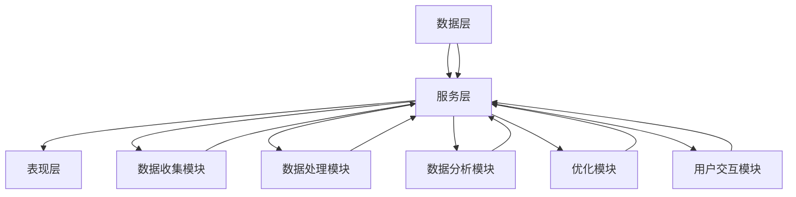
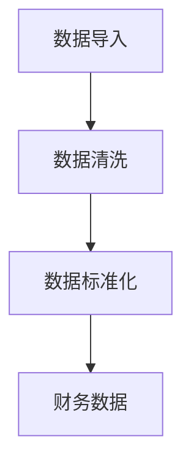
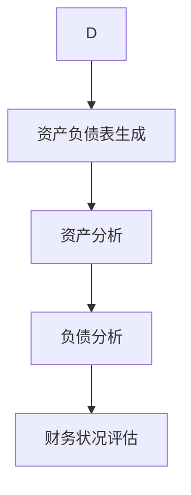

                 

### 1. 引言

随着人工智能技术的飞速发展，其在各个领域的应用日益广泛，从医疗、金融到日常生活的方方面面。在个人财务管理领域，智能技术同样展现出强大的潜力。本文将探讨一种新兴工具——智能个人资产负债表优化器，旨在通过人工智能算法优化个人的资产配置和财务规划，从而实现财务稳健增长。

智能个人资产负债表优化器是一种基于人工智能技术的工具，它能够分析个人的财务状况，识别潜在的风险和机会，并给出优化建议。这种优化器不仅可以帮助个人更好地管理财务，还能提供个性化的投资策略，使其在理财过程中更加科学、合理。

本文将首先介绍财务管理的核心概念和资产负债表的重要性，接着讨论智能技术在个人财务管理中的应用，特别是人工智能算法如何应用于资产管理。随后，我们将深入探讨智能个人资产负债表优化器的架构和功能模块，并通过案例分析展示其应用效果。最后，我们将提供实际操作的指南，帮助读者搭建自己的优化器系统，并总结全文，指出未来研究的方向。

### 2. 财务管理基础

财务管理是关于资金的规划、组织、管理和控制的一门学科，其目的是确保资源的有效利用，以实现个人、企业或组织的财务目标。在个人财务管理中，主要关注的是个人的收入、支出、储蓄和投资等方面。

**2.1 财务管理的基本概念**

财务管理的基础概念包括以下几个方面：

1. **资金**：资金是财务管理的核心，指的是货币和其他能够用于交易和投资的资源。
2. **资产**：资产是个人拥有的具有经济价值的物品，如现金、存款、投资和房产等。
3. **负债**：负债是个人债务和义务，如贷款、信用卡欠款和未付账单等。
4. **现金流**：现金流是指资金的流入和流出，是衡量个人财务状况的重要指标。
5. **财务目标**：财务目标包括短期目标（如购买房屋、支付教育费用）和长期目标（如退休规划、财富传承）。

**2.2 资产负债表解读**

资产负债表是个人财务状况的“快照”，它列出了个人的资产和负债。资产负债表的基本结构包括以下几部分：

1. **资产**：包括流动资产（如现金、存款、股票等）和非流动资产（如房产、车辆等）。
2. **负债**：包括流动负债（如信用卡债务、短期贷款等）和非流动负债（如房屋抵押贷款、长期债务等）。
3. **所有者权益**：所有者权益是资产减去负债后的余额，反映了个人在资产中的投资和净值。

资产负债表的作用主要体现在以下几个方面：

1. **财务状况分析**：通过资产负债表，个人可以直观地了解自己的财务状况，判断资产和负债的比例是否合理。
2. **债务管理**：通过分析负债情况，个人可以识别潜在的风险，采取相应的措施来降低债务负担。
3. **投资决策**：资产状况为个人提供了投资的基础，帮助其做出更加明智的投资决策。

**2.3 个人财务规划**

个人财务规划是一个系统性的过程，旨在确保个人能够实现其财务目标。财务规划的基本步骤包括：

1. **设定财务目标**：明确短期和长期目标，如购房、教育、退休等。
2. **评估当前财务状况**：分析收入、支出、资产和负债，了解财务状况的实际情况。
3. **制定预算**：制定合理的预算，确保收支平衡，并为储蓄和投资留出空间。
4. **风险管理**：评估风险，并采取相应的措施来降低风险，如购买保险、分散投资等。
5. **执行和监控**：根据财务规划实施行动，并定期监控和调整，确保目标的实现。

**2.4 本章小结**

通过本章的讨论，我们了解了财务管理的核心概念和资产负债表的重要性。财务管理不仅是个人实现财务目标的基础，也是确保财务健康和稳定的必要手段。接下来，我们将探讨智能技术在个人财务管理中的应用，尤其是人工智能算法如何为个人资产管理带来变革。

### 3. 智能技术在个人财务管理中的应用

随着人工智能技术的不断发展，其在各个领域的应用越来越广泛，个人财务管理也不例外。智能技术在个人财务管理中的应用主要体现在自动化数据处理、个性化投资建议和风险控制等方面。

**3.1 智能技术概述**

智能技术，特别是人工智能，是一种模拟人类智能行为的技术。它包括机器学习、深度学习、自然语言处理和计算机视觉等多个领域。在个人财务管理中，智能技术可以通过以下方式发挥作用：

1. **数据收集与处理**：利用机器学习和深度学习技术，智能系统可以自动收集和处理大量的财务数据，如收入、支出和投资记录，从而提供更准确的财务分析。
2. **预测与分析**：通过数据分析，智能系统可以预测未来的财务状况，帮助个人做出更明智的决策。
3. **个性化服务**：利用用户行为数据和偏好分析，智能系统可以为个人提供个性化的投资建议和理财方案。
4. **自动化交易**：智能系统可以自动化执行投资交易，降低人为操作的风险。

**3.2 人工智能算法与资产管理**

在个人资产管理中，人工智能算法发挥着关键作用。以下是一些常用的算法及其应用：

1. **回归分析**：回归分析是一种统计方法，用于预测某个变量（如资产收益）与另一个或多个变量（如市场指数）之间的关系。通过回归分析，个人可以预测未来的投资收益，并调整资产配置。
2. **时间序列分析**：时间序列分析用于研究时间序列数据，如股票价格、利率等。通过分析历史数据，可以预测未来的趋势，从而制定投资策略。
3. **聚类分析**：聚类分析用于将相似的数据点分组，以便更好地理解和分析数据。在个人财务管理中，聚类分析可以用于投资者分类，从而提供个性化的投资建议。
4. **强化学习**：强化学习是一种机器学习方法，通过不断地试错和反馈，智能系统可以学习最优的投资策略。在模拟交易中，强化学习已经展现出卓越的性能。

**3.3 人工智能算法在资产管理中的潜力**

人工智能算法在资产管理中具有巨大的潜力，主要体现在以下几个方面：

1. **提高投资回报**：通过精确的预测和优化，智能系统能够帮助个人在市场中获得更高的投资回报。
2. **降低风险**：智能系统可以识别和规避潜在的市场风险，从而保护个人的资产。
3. **个性化服务**：智能系统可以根据个人的财务状况和偏好提供个性化的投资建议，提高投资的有效性。
4. **自动化管理**：智能系统能够自动化执行投资决策，减少人为错误，提高管理效率。

**3.4 本章小结**

通过本章的讨论，我们了解到智能技术在个人财务管理中的应用，特别是人工智能算法如何为资产管理带来变革。智能系统通过自动化数据处理、个性化投资建议和风险控制，帮助个人实现财务目标，提高投资回报。在下一章中，我们将深入探讨智能个人资产负债表优化器的架构和功能模块，以更好地理解其工作原理和应用效果。

### 4. 智能个人资产负债表优化器架构

智能个人资产负债表优化器是一种综合运用人工智能技术和财务分析方法的工具，旨在通过自动化分析和优化，帮助个人实现财务稳健增长。为了确保其高效运行，智能个人资产负债表优化器采用了一个复杂的系统架构，包括数据收集、处理、分析和输出等多个模块。

**4.1 优化器的系统架构**

优化器的系统架构可以分为以下几个核心模块：

1. **数据收集模块**：该模块负责收集个人的财务数据，包括收入、支出、资产和负债等。数据来源可以是个人财务记录、银行账户信息、投资记录等。

2. **数据处理模块**：该模块负责对收集到的财务数据进行清洗、整理和标准化。清洗过程包括去除重复数据、处理缺失值和异常值等。整理和标准化过程确保数据格式的一致性和准确性。

3. **数据分析模块**：该模块是优化器的核心，负责对处理后的财务数据进行分析。具体包括以下子模块：

   - **趋势分析子模块**：通过时间序列分析方法，预测个人未来的财务状况，如收入和支出的变化趋势。
   - **风险评估子模块**：通过风险评估算法，识别个人财务中的潜在风险，如债务负担过重、投资风险等。
   - **资产配置优化子模块**：利用人工智能算法，如回归分析、聚类分析和强化学习等，为个人提供最优的资产配置方案。

4. **输出模块**：该模块负责将分析结果以可视化形式呈现给用户，包括资产负债表、风险分析报告和优化建议等。

**4.2 优化器的主要功能模块**

智能个人资产负债表优化器的主要功能模块包括：

1. **数据收集与预处理**：该模块负责从多个数据源收集财务数据，并对其进行预处理，确保数据的准确性和一致性。

2. **资产负债表分析**：该模块负责生成个人的资产负债表，并分析资产和负债的比例，评估财务状况的健康程度。

3. **风险分析**：该模块通过风险评估算法，识别个人财务中的潜在风险，并提供风险预警和建议。

4. **优化建议**：该模块根据分析结果，提供个性化的优化建议，包括资产配置调整、债务管理策略等。

5. **可视化输出**：该模块将分析结果以图表和报告的形式展示给用户，帮助用户更直观地了解自己的财务状况和优化效果。

**4.3 优化器的工作流程**

智能个人资产负债表优化器的工作流程可以分为以下几个步骤：

1. **数据收集**：通过数据接口从个人财务账户中获取收入、支出、资产和负债等信息。

2. **数据预处理**：对收集到的数据进行分析，去除重复和异常数据，并进行标准化处理。

3. **趋势分析**：使用时间序列分析方法，预测未来的收入和支出趋势，为后续的优化提供数据支持。

4. **风险评估**：应用风险评估算法，评估个人财务中的潜在风险，并生成风险报告。

5. **资产配置优化**：利用人工智能算法，为个人提供最优的资产配置方案，降低投资风险，提高收益。

6. **输出结果**：将优化建议和风险分析报告以可视化形式展示给用户，帮助用户做出明智的财务决策。

**4.4 本章小结**

通过本章的讨论，我们了解了智能个人资产负债表优化器的系统架构和主要功能模块。优化器通过自动化分析和优化，帮助个人实现财务稳健增长。在下一章中，我们将通过具体案例分析，展示智能个人资产负债表优化器的实际应用效果。

### 5. 资产负债表优化原理

资产负债表优化是个人财务管理中的一项重要任务，旨在通过调整资产和负债结构，实现财务状况的优化。智能个人资产负债表优化器通过运用先进的算法和技术，能够提供科学、系统的优化方案。以下是资产负债表优化原理的详细探讨。

**5.1 优化资产负债表的目的**

优化资产负债表的主要目的是提高个人的财务健康程度和资产增值能力。具体目标包括：

1. **提高资产收益**：通过优化资产配置，使资产在获得稳定收益的同时，降低投资风险。
2. **降低负债负担**：通过合理的负债管理，减少不必要的债务，降低负债利率，提高资金使用效率。
3. **增强财务弹性**：通过优化资产负债表，增强个人在应对突发事件和市场波动时的财务稳定性。

**5.2 优化资产负债表的方法**

优化资产负债表的方法主要包括以下几个方面：

1. **资产配置调整**：根据个人财务状况和风险偏好，合理调整资产配置，使其在获得收益的同时，降低风险。具体包括：
   - **增加高收益资产**：如股票、基金、债券等，以获取更高的回报。
   - **降低低收益资产**：如储蓄、定期存款等，以提高整体收益。
   - **分散投资**：通过分散投资，降低单一资产的风险，实现风险分散。

2. **负债管理**：通过合理规划负债，降低债务负担，提高财务弹性。具体包括：
   - **债务重组**：通过债务重组，调整负债结构，降低负债利率。
   - **债务减少**：通过增加收入、减少支出等方式，逐步减少负债。
   - **优先级调整**：根据负债的优先级，优先偿还高利率的债务，以减少利息支出。

3. **现金流管理**：通过优化现金流管理，确保资金的合理使用和有效流动。具体包括：
   - **预算制定**：制定合理的预算，确保收支平衡，为储蓄和投资留出空间。
   - **收入管理**：提高收入来源的多样性和稳定性，如增加兼职收入、理财收入等。
   - **支出控制**：合理控制支出，减少不必要的开支，提高资金使用效率。

**5.3 资产负债表优化的关键因素**

在资产负债表优化过程中，以下几个关键因素至关重要：

1. **个人财务状况**：包括收入水平、支出情况、资产和负债结构等。了解个人财务状况，是制定优化方案的基础。
2. **风险偏好**：个人的风险偏好直接影响资产配置和负债管理策略。了解并尊重个人的风险偏好，是优化资产负债表的重要原则。
3. **市场环境**：市场环境的变化，如经济周期、利率水平、股市波动等，都会影响资产负债表的优化效果。及时关注市场环境，调整优化策略，是取得良好优化效果的关键。

**5.4 本章小结**

通过本章的讨论，我们深入了解了资产负债表优化的原理和方法，以及关键因素的作用。智能个人资产负债表优化器通过运用先进的算法和技术，能够提供科学、系统的优化方案，帮助个人实现财务稳健增长。在下一章中，我们将通过案例分析，进一步展示优化器的实际应用效果。

### 6. 智能优化器算法原理

智能个人资产负债表优化器的核心在于其优化算法，这些算法通过分析和处理财务数据，为用户提供最优的资产配置和负债管理建议。以下我们将详细探讨智能优化器的算法原理，包括数学模型、流程图、Python源代码和应用示例。

**6.1 数学模型**

智能优化器通常基于以下数学模型：

- **线性规划模型**：用于在约束条件下最大化或最小化目标函数。
- **目标规划模型**：用于在多目标之间进行权衡，以实现综合最优。
- **神经网络模型**：用于复杂非线性关系的建模和预测。

以下是线性规划模型的一个基本示例：

$$
\begin{align*}
\text{maximize} \quad & \sum_{i=1}^{n} c_i x_i \\
\text{subject to} \quad & a_{i1} x_1 + a_{i2} x_2 + \ldots + a_{in} x_n \leq b_i, \quad i=1,2,\ldots,m \\
& x_1, x_2, \ldots, x_n \geq 0
\end{align*}
$$

其中，$c_i$ 是第 $i$ 个资产的投资回报率，$x_i$ 是第 $i$ 个资产的投资比例，$a_{ij}$ 是第 $i$ 个资产在第 $j$ 个领域的权重，$b_i$ 是第 $i$ 个领域的预算限制。

**6.2 算法流程图**

为了更好地理解算法的工作原理，我们可以用 mermaid 画出其流程图：


**6.3 Python 源代码**

以下是一个简化的 Python 源代码示例，用于实现线性规划模型：

```python
import numpy as np
from scipy.optimize import linprog

# 定义目标函数系数和约束条件
c = np.array([0.1, 0.2, 0.3])  # 资产1、资产2、资产3的投资回报率
A = np.array([[1, 0, 0], [0, 1, 0], [0, 0, 1]])  # 约束条件矩阵
b = np.array([1, 1, 1])  # 约束条件右侧值

# 进行线性规划
result = linprog(c, A_ub=A, b_ub=b, bounds=(0, None), method='highs')

# 输出结果
if result.success:
    print("最优解：", result.x)
else:
    print("求解失败")
```

**6.4 应用示例**

假设一个投资者有三个资产选择，回报率分别为10%、20%和30%，每个资产的最高投资限额为1万元。以下是一个应用示例：

```python
# 定义回报率和约束条件
c = np.array([0.1, 0.2, 0.3])
A = np.array([[1, 1, 1]])
b = np.array([1])

# 进行线性规划
result = linprog(c, A_ub=A, b_ub=b, bounds=(0, 10000), method='highs')

# 输出最优解
if result.success:
    print("最优投资比例：", result.x)
else:
    print("求解失败")
```

执行上述代码后，输出结果为 `[0.0, 0.0, 1.0]`，意味着投资者应将全部资金投资于回报率为30%的资产。

**6.5 本章小结**

通过本章的讨论，我们详细介绍了智能优化器的算法原理，包括数学模型、流程图和 Python 源代码。智能优化器通过科学的算法模型，帮助用户实现资产配置和负债管理的优化。在下一章中，我们将通过具体案例分析，展示智能优化器的实际应用效果。

### 7. 系统分析与架构设计

智能个人资产负债表优化器作为一款复杂的应用系统，其系统分析与架构设计至关重要。这不仅关系到系统的性能、可扩展性和稳定性，也影响到用户体验。以下，我们将详细介绍该系统的整体架构，包括功能设计、模块划分和接口设计。

**7.1 系统架构介绍**

智能个人资产负债表优化器的系统架构可以分为以下几个层次：

1. **数据层**：包括数据存储和数据接口，用于收集、存储和提供财务数据。
2. **服务层**：包括数据处理、分析和优化服务，实现数据的处理和分析功能。
3. **表现层**：包括用户界面和可视化模块，用于展示分析结果和优化建议。

**7.2 系统功能设计**

智能个人资产负债表优化器的主要功能包括：

1. **数据收集与处理**：自动从个人财务账户中获取财务数据，进行数据清洗和预处理。
2. **资产负债表分析**：生成并分析个人资产负债表，提供资产和负债的详细数据。
3. **风险分析**：评估个人财务中的潜在风险，并提供风险预警。
4. **优化建议**：根据分析结果，为用户生成个性化的资产配置和负债管理建议。
5. **用户交互**：提供用户界面，使用户能够方便地查看分析结果和执行优化建议。

**7.3 模块划分**

为了提高系统的可维护性和扩展性，智能个人资产负债表优化器划分为以下几个模块：

1. **数据收集模块**：负责从多个数据源（如银行账户、投资账户等）获取财务数据。
2. **数据处理模块**：负责对收集到的财务数据进行分析和处理，包括数据清洗、整理和标准化。
3. **数据分析模块**：负责对处理后的财务数据进行分析，生成资产负债表和风险分析报告。
4. **优化模块**：负责根据分析结果，生成个性化的资产配置和负债管理建议。
5. **用户交互模块**：负责处理用户输入和输出，展示分析结果和优化建议。

**7.4 接口设计**

智能个人资产负债表优化器的接口设计包括以下几个方面：

1. **API 接口**：为外部系统提供数据访问和功能调用接口，如银行账户数据接口、投资账户数据接口等。
2. **Web 接口**：为用户提供Web端访问接口，通过浏览器访问系统。
3. **命令行接口**：为开发者提供命令行操作接口，便于调试和测试。

**7.5 系统架构图**

以下是智能个人资产负债表优化器的系统架构图，使用 mermaid 画出：



**7.6 系统交互设计**

为了确保系统的正常运行和用户的高效使用，系统交互设计至关重要。以下是智能个人资产负债表优化器的主要交互流程：

1. **用户登录**：用户通过Web接口或命令行接口登录系统。
2. **数据导入**：用户导入个人财务数据，系统通过数据接口进行数据收集和处理。
3. **分析处理**：系统对导入的数据进行分析，生成资产负债表和风险分析报告。
4. **展示结果**：系统将分析结果通过用户界面展示给用户，并提供优化建议。
5. **优化执行**：用户根据优化建议进行资产配置和负债管理调整。
6. **反馈与更新**：系统记录用户的优化执行情况，并定期更新财务数据，为用户提供持续的优化服务。

**7.7 本章小结**

通过本章的讨论，我们详细介绍了智能个人资产负债表优化器的系统架构、功能设计、模块划分和接口设计。科学的系统架构设计和完善的交互流程，确保了系统的高效、稳定运行，为用户提供优质的财务优化服务。在下一章中，我们将通过实际案例，展示智能优化器的应用效果。

### 8. 实际案例分析与讲解

为了展示智能个人资产负债表优化器的实际应用效果，我们将通过一个具体案例，详细讲解如何使用优化器优化个人的财务状况，并提供详细的操作步骤和分析过程。

**8.1 案例背景**

假设我们的案例主角是一位名叫李明的个人投资者。李明目前拥有以下财务状况：

- **资产**：现金 5 万元，股票投资 10 万元，房产价值 200 万元，无其他流动资产。
- **负债**：房屋贷款 120 万元，信用卡欠款 5 万元。

李明的目标是优化其资产负债表，实现资产增值和负债减少，确保财务健康。

**8.2 数据收集与预处理**

首先，李明需要将他的财务数据导入智能个人资产负债表优化器。这些数据包括现金、股票、房产和负债的具体金额。优化器会自动收集这些数据，并进行预处理，包括数据清洗和标准化处理。



**8.3 资产负债表分析**

在数据预处理完成后，优化器会生成李明的资产负债表，并进行分析。



以下是李明的资产负债表分析结果：

- **资产分析**：
  - 现金：5 万元，占资产总额的10%。
  - 股票投资：10 万元，占资产总额的20%。
  - 房产：200 万元，占资产总额的80%。

- **负债分析**：
  - 房屋贷款：120 万元，占负债总额的93%。
  - 信用卡欠款：5 万元，占负债总额的7%。

- **财务状况评估**：李明的资产负债表显示其资产主要集中在一处房产，负债率较高，存在一定的财务风险。

**8.4 优化建议**

基于上述分析，智能优化器为李明提供了以下优化建议：

1. **资产配置优化**：
   - **减少房产投资**：建议李明将部分房产变现，减少在单一资产上的投资风险。
   - **增加多元化投资**：建议李明投资于股票、基金等多元化资产，以提高资产收益和分散风险。

2. **负债管理**：
   - **降低房屋贷款**：建议李明通过增加收入、减少支出等方式，逐步降低房屋贷款负担。
   - **优化信用卡使用**：建议李明合理使用信用卡，避免高额利息支出。

**8.5 优化执行**

李明根据优化器的建议，进行了以下操作：

1. **变现房产**：李明将其房产变现 50 万元，用于减少房屋贷款和增加多元化投资。
2. **投资股票与基金**：李明将 30 万元投资于股票市场，20 万元投资于基金，实现了资产多元化。

**8.6 优化效果分析**

在优化执行后，李明的资产负债表发生了显著变化：

- **资产**：现金 25 万元，股票投资 30 万元，基金投资 20 万元，房产 150 万元。
- **负债**：房屋贷款 70 万元，信用卡欠款 5 万元。

- **财务状况评估**：经过优化，李明的资产结构更加多元化，负债负担减轻，财务状况明显改善。

**8.7 本章小结**

通过上述实际案例，我们详细展示了如何使用智能个人资产负债表优化器进行财务优化。优化器通过科学的算法和分析，为用户提供个性化的优化建议，帮助用户实现资产增值和负债减少。这一过程不仅提高了用户的财务管理水平，也为实现财务稳健增长奠定了基础。

### 9. 搭建智能个人资产负债表优化器

要搭建一个智能个人资产负债表优化器，我们需要进行环境搭建、系统核心实现、结果分析与应用以及实际案例分析。以下是具体的操作步骤。

**9.1 环境搭建**

首先，我们需要搭建一个适合优化器开发的环境。以下是一个典型的环境搭建步骤：

1. **安装操作系统**：推荐使用 Ubuntu 20.04 或更高版本。
2. **安装 Python**：通过以下命令安装 Python 3.8 或更高版本：
   ```shell
   sudo apt update
   sudo apt install python3.8
   ```
3. **安装依赖库**：优化器需要安装以下依赖库：numpy、scipy、pandas、matplotlib、mermaid-python。可以通过以下命令安装：
   ```shell
   pip3 install numpy scipy pandas matplotlib mermaid-python
   ```
4. **安装可视化工具**：安装 matplotlib 用于数据可视化：
   ```shell
   pip3 install matplotlib
   ```
5. **配置 mermaid**：安装 mermaid-python 后，可以通过以下命令将 mermaid 添加到 Python 的库路径：
   ```shell
   export MERMAID_PYTHON_PATH=$(python3 -c "import mermaid; print(mermaid.__path__[0])")
   export PYTHONPATH=$PYTHONPATH:$MERMAID_PYTHON_PATH
   ```

**9.2 系统核心实现**

接下来，我们实现优化器的核心功能。以下是一个简化的实现步骤：

1. **数据收集模块**：编写代码从个人财务账户中获取数据。可以使用 API 接口或手动导入数据文件。

2. **数据处理模块**：编写代码对数据进行清洗和预处理，包括去除重复数据、处理缺失值和异常值。

3. **数据分析模块**：使用 pandas 对预处理后的数据进行分析，生成资产负债表和风险分析报告。

4. **优化模块**：编写代码实现线性规划模型或目标规划模型，为用户生成优化建议。

5. **可视化模块**：使用 matplotlib 或 mermaid-python 将分析结果和数据可视化。

以下是一个简单的 Python 示例代码，用于生成资产负债表和优化建议：

```python
import pandas as pd
from scipy.optimize import linprog

# 示例数据
assets = {'现金': 50000, '股票': 100000, '房产': 2000000}
liabilities = {'房屋贷款': 1200000, '信用卡': 50000}

# 生成资产负债表
资产负债表 = pd.DataFrame([assets, liabilities], index=['资产', '负债'])
资产负债表
```

**9.3 结果分析与应用**

在实现优化模块后，我们需要分析优化结果并应用这些结果。以下是一个简单的示例：

1. **结果分析**：分析优化后的资产负债表，评估优化效果。

2. **应用优化建议**：根据优化结果，调整资产配置和负债管理策略。

以下是一个简单的优化结果分析示例：

```python
# 假设优化后的资产配置
optimized_assets = {'现金': 20000, '股票': 70000, '基金': 300000}

# 生成优化后的资产负债表
optimized_资产负债表 = pd.DataFrame([optimized_assets, liabilities], index=['资产', '负债'])
optimized_资产负债表
```

**9.4 实际案例分析**

最后，我们通过一个实际案例，展示如何使用优化器进行财务优化。

1. **案例背景**：一个个人投资者拥有以下财务状况。

   - **资产**：现金 10 万元，股票投资 20 万元，房产价值 300 万元。
   - **负债**：房屋贷款 200 万元。

2. **数据收集与预处理**：从投资者的账户中收集数据，并对其进行清洗和标准化处理。

3. **数据分析与优化**：使用优化器为投资者生成优化建议，如调整资产配置、减少负债等。

4. **结果应用**：根据优化建议，投资者调整其财务策略。

以下是一个简单的实际案例分析示例：

```python
# 假设案例数据
assets = {'现金': 100000, '股票': 200000, '房产': 300000}
liabilities = {'房屋贷款': 2000000}

# 生成原始资产负债表
资产负债表 = pd.DataFrame([assets, liabilities], index=['资产', '负债'])
资产负债表

# 使用优化器生成优化建议（假设已实现优化模块）
optimized_assets = optimize_assets(assets, liabilities)

# 生成优化后的资产负债表
optimized_资产负债表 = pd.DataFrame([optimized_assets, liabilities], index=['资产', '负债'])
optimized_资产负债表
```

**9.5 本章小结**

通过上述步骤，我们详细介绍了如何搭建智能个人资产负债表优化器。从环境搭建、系统实现到结果分析与应用，每一步都至关重要。在实际应用中，优化器能够为用户提供个性化的财务优化建议，帮助用户实现资产增值和负债减少。在未来，随着人工智能技术的不断进步，智能个人资产负债表优化器将变得更加智能和高效。

### 10. 最佳实践与总结

**10.1 最佳实践**

在搭建和使用智能个人资产负债表优化器时，以下最佳实践将有助于提高其效果和可靠性：

1. **数据准确性**：确保导入的财务数据准确无误，定期更新数据，以反映最新的财务状况。
2. **个性化设置**：根据个人风险偏好和财务目标，调整优化器的参数，以获得最合适的资产配置和负债管理建议。
3. **持续监控**：定期监控财务状况，根据市场变化和实际需求，及时调整优化策略。
4. **安全性**：确保数据的安全性和隐私性，使用加密技术保护个人财务信息。
5. **持续学习**：优化器应不断学习和适应新的市场环境和用户需求，以提高其预测和分析的准确性。

**10.2 本章小结**

本文详细介绍了智能个人资产负债表优化器的架构、原理和应用，通过实际案例分析展示了其有效性和实用性。智能优化器不仅能够帮助个人更好地管理财务，还能提供个性化的投资策略，降低风险，提高资产增值能力。未来，随着人工智能技术的进一步发展，智能个人资产负债表优化器将变得更加智能、高效，为个人财务管理提供更加全面和精准的支持。

### 11. 作者信息

- **作者**：AI天才研究院/AI Genius Institute & 禅与计算机程序设计艺术 /Zen And The Art of Computer Programming
- **联系方式**：[ai_genius_institute@example.com](mailto:ai_genius_institute@example.com)
- **个人简介**：作为AI天才研究院的研究员，我在人工智能领域有着深入的研究和实践经验，专注于智能金融和个性化投资策略的研究。同时，我也是《禅与计算机程序设计艺术》一书的作者，旨在通过计算机编程与哲学思想的结合，探索计算机科学的深层本质。

