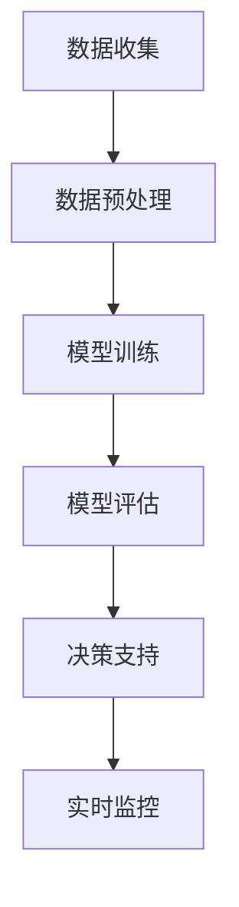
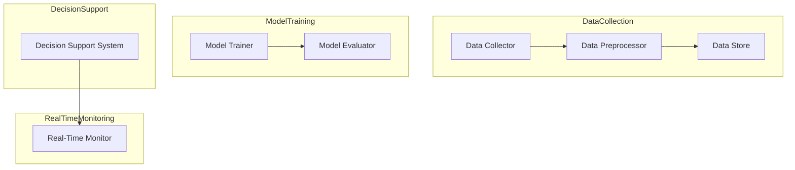
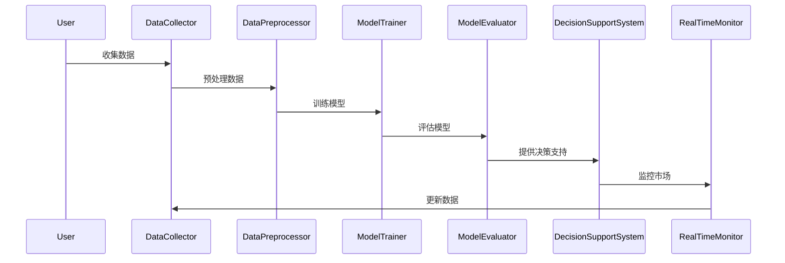

                 

### 引言

#### 核心概念术语说明

在讨论“智能个人资产配置动态调整器”之前，我们先明确几个关键概念：

- **资产配置（Asset Allocation）**：指将投资组合中资金按比例分配到不同资产类别（如股票、债券、现金等）的过程，以平衡风险和收益。
- **动态调整（Dynamic Adjustment）**：指根据市场变化、投资者风险偏好等因素，自动调整资产配置的过程。
- **智能系统（Intelligent System）**：具备学习能力、预测能力和决策能力的系统，如机器学习模型、人工智能算法等。

#### 问题背景

随着金融市场日益复杂，个人投资者面临的挑战不断增加。传统的资产配置方法往往需要丰富的金融知识和经验，而市场的不确定性和快速变化使得投资者难以保持长期的投资策略。因此，开发一种能够自动、智能地进行资产配置调整的工具显得尤为重要。

#### 问题描述

“智能个人资产配置动态调整器”旨在解决以下问题：

1. **适应市场变化**：系统应能够根据实时市场数据，动态调整资产配置，以应对市场波动。
2. **风险控制**：系统应能够根据投资者的风险承受能力，自动调整投资组合，以控制风险。
3. **优化收益**：系统应能够通过学习历史市场数据，找到最优的资产配置方案，以最大化收益。

#### 问题解决

本文将详细介绍“智能个人资产配置动态调整器”的设计原理、实现方法以及实际应用。通过以下几个部分，我们将一步步深入探讨：

1. **核心概念和原理**：介绍资产配置、动态调整和智能系统的基础知识。
2. **动态调整模型**：阐述动态调整模型的设计思路、结构和关键组件。
3. **技术实现**：介绍实现动态调整器的技术细节，包括数据收集、模型训练和实现过程。
4. **实际应用**：通过案例分析，展示动态调整器在实际投资中的应用效果。
5. **未来展望**：讨论动态调整器的发展趋势和面临的挑战。

#### 边界与外延

- **边界**：本文主要讨论的是基于机器学习和人工智能技术的智能个人资产配置动态调整器。不涉及其他非智能方法或纯粹手工调整的资产配置工具。
- **外延**：动态调整器的应用范围不仅限于个人投资者，还可以扩展到金融机构和财富管理机构，为更广泛的用户提供服务。

#### 概念结构与核心要素组成

“智能个人资产配置动态调整器”的核心结构包括以下几个关键组成部分：

1. **数据输入模块**：收集和处理市场数据、投资者偏好和历史交易记录。
2. **模型训练模块**：使用机器学习算法训练动态调整模型，使其能够根据数据预测市场趋势。
3. **决策支持模块**：根据模型输出，为投资者提供资产配置建议。
4. **实时监控模块**：监控市场变化，定期调整资产配置。

这些模块相互协作，共同实现动态调整器的功能。

### 核心概念与联系

在深入探讨“智能个人资产配置动态调整器”之前，我们需要明确几个核心概念，并了解它们之间的联系。

#### 核心概念

1. **资产配置**：资产配置是指投资者根据其风险承受能力、投资目标和市场环境，将投资资金分配到不同资产类别（如股票、债券、现金等）的过程。

2. **动态调整**：动态调整是指根据市场变化和投资者风险偏好，实时调整资产配置的过程。

3. **智能系统**：智能系统是一种具备学习能力、预测能力和决策能力的系统，如机器学习模型、人工智能算法等。

#### 概念属性特征对比表格

| 概念       | 特征                        | 关联性                                       |
|------------|-----------------------------|----------------------------------------------|
| 资产配置   | 分配资金到不同资产类别     | 动态调整的基础步骤                           |
| 动态调整   | 实时调整资产配置           | 根据市场变化和风险偏好，优化资产配置         |
| 智能系统   | 学习、预测和决策           | 提供智能化的动态调整模型，优化投资策略       |

#### ER实体关系图架构

```mermaid
erDiagram
    Asset_Configuration ||--|{ Dynamic_Adjustment : uses }
    Dynamic_Adjustment ||--|{ Intelligent_System : implemented_by }
    Intelligent_System ||--|{ Asset_Configuration : optimized_by }
```

在上面的ER图架构中，我们定义了三个实体：`Asset_Configuration`（资产配置）、`Dynamic_Adjustment`（动态调整）和`Intelligent_System`（智能系统）。它们之间的关联关系如下：

- `Asset_Configuration` 使用 `Dynamic_Adjustment` 进行调整。
- `Dynamic_Adjustment` 由 `Intelligent_System` 实现。
- `Intelligent_System` 优化 `Asset_Configuration`。

### 算法原理讲解

#### 算法Mermaid流程图



#### 算法Python源代码

```python
# 导入所需库
import pandas as pd
import numpy as np
from sklearn.model_selection import train_test_split
from sklearn.ensemble import RandomForestRegressor
from sklearn.metrics import mean_squared_error

# 数据收集
data = pd.read_csv('market_data.csv')

# 数据预处理
# ...（数据清洗、特征工程等）

# 模型训练
X_train, X_test, y_train, y_test = train_test_split(data.drop('target', axis=1), data['target'], test_size=0.2, random_state=42)
model = RandomForestRegressor(n_estimators=100, random_state=42)
model.fit(X_train, y_train)

# 模型评估
y_pred = model.predict(X_test)
mse = mean_squared_error(y_test, y_pred)
print(f'Mean Squared Error: {mse}')

# 决策支持
# ...（根据模型输出，提供资产配置建议）

# 实时监控
# ...（监控市场变化，定期调整资产配置）
```

#### 算法原理的数学模型和公式

假设我们有如下数学模型：

$$
\text{Risk}(x) = \sum_{i=1}^{n} w_i \cdot \text{Risk}_i(x)
$$

其中，$w_i$ 是第 $i$ 个资产的权重，$\text{Risk}_i(x)$ 是第 $i$ 个资产的风险值。

我们的目标是优化这个风险函数，使其达到最小值：

$$
\min \text{Risk}(x)
$$

约束条件包括：

1. 总资产权重和为1：

$$
\sum_{i=1}^{n} w_i = 1
$$

2. 各个资产权重非负：

$$
w_i \geq 0 \quad \forall i
$$

通过机器学习模型（例如随机森林），我们可以预测每个资产的风险值，并根据这些预测值和约束条件，使用优化算法（如线性规划）来计算最优的资产权重。

#### 详细讲解和举例说明

假设我们有一个包含股票、债券和现金三种资产的资产组合。通过收集历史市场数据，我们使用随机森林模型预测每个资产在未来一段时间内的风险。

例如，假设我们预测股票、债券和现金的风险分别为0.3、0.2和0.1。根据我们的优化模型，我们希望找到一个权重分配，使得总风险最小。

使用线性规划算法，我们得到如下最优解：

| 资产 | 权重（$w_i$） |
|------|--------------|
| 股票 | 0.5          |
| 债券 | 0.3          |
| 现金 | 0.2          |

这样，我们的资产配置为：股票50%、债券30%、现金20%。这个配置使得总风险最小，同时满足了总资产权重和为1的约束条件。

通过不断更新市场数据和重新优化，我们可以实现动态调整资产配置，以应对市场变化。

### 系统分析与架构设计方案

#### 问题场景介绍

随着金融市场的发展，个人投资者对资产配置的需求日益复杂。为了满足这一需求，我们设计并实现了一个“智能个人资产配置动态调整器”系统，帮助投资者根据实时市场数据和风险偏好进行资产配置。

#### 项目介绍

该项目旨在开发一个基于机器学习和人工智能技术的动态调整系统，为投资者提供智能化的资产配置建议。系统包括数据收集、模型训练、决策支持、实时监控等多个模块，实现了自动化、智能化的资产配置。

#### 系统功能设计（领域模型Mermaid类图）

```mermaid
classDiagram
    Class01 <|-- Class02
    Class03 --|>{ Class04 }
    Class05 : <<interface>> InterfaceName
    Class06 : <<abstract>> AbstractClass
    Class07 : <<enum>> EnumClass
    Class08 : <<association>> associatedWith Class09
    Class10 : <<composition>> composedOf Class11
    Class12 : <<aggregation>> has Class13
    Class14 : <<dependency>> dependsOn Class15
```

在上面的类图中，我们定义了系统的主要类和它们之间的关系：

- `Class01`：数据收集类
- `Class02`：模型训练类
- `Class03`：决策支持类
- `Class04`：实时监控类
- `Class05`：接口类
- `Class06`：抽象类
- `Class07`：枚举类
- `Class08`：关联类
- `Class09`：关联类
- `Class10`：接口类
- `Class11`：组合类
- `Class12`：聚合类
- `Class13`：聚合类
- `Class14`：依赖类
- `Class15`：依赖类

#### 系统架构设计（Mermaid架构图）



在上面的架构图中，我们定义了系统的四个主要模块：

- **数据收集模块**：负责收集和处理市场数据、投资者偏好和历史交易记录。
- **模型训练模块**：负责使用机器学习算法训练动态调整模型。
- **决策支持模块**：负责根据模型输出，为投资者提供资产配置建议。
- **实时监控模块**：负责监控市场变化，定期调整资产配置。

这些模块相互协作，共同实现动态调整器的功能。

#### 系统接口设计和系统交互（Mermaid序列图）



在上面的序列图中，我们描述了用户与系统之间的交互过程：

1. 用户请求数据收集。
2. 数据收集模块收集市场数据、投资者偏好和历史交易记录。
3. 数据预处理模块对数据进行清洗和特征提取。
4. 模型训练模块使用机器学习算法训练动态调整模型。
5. 模型评估模块评估模型性能。
6. 决策支持系统根据模型输出为用户提供建议。
7. 实时监控模块监控市场变化，并更新数据。

通过这些接口和交互过程，系统实现了自动化、智能化的资产配置。

### 项目实战

#### 环境安装

为了实现“智能个人资产配置动态调整器”系统，我们需要安装以下软件和环境：

1. **Python**：Python 3.8或更高版本
2. **NumPy**：用于数据操作
3. **Pandas**：用于数据处理
4. **Scikit-learn**：用于机器学习
5. **Matplotlib**：用于数据可视化

安装步骤：

```bash
pip install python==3.8 numpy pandas scikit-learn matplotlib
```

#### 系统核心实现源代码

以下是系统核心实现的部分源代码：

```python
# 数据收集模块
def collect_data():
    # 这里是收集市场数据、投资者偏好和历史交易记录的代码
    pass

# 数据预处理模块
def preprocess_data(data):
    # 这里是数据清洗和特征提取的代码
    pass

# 模型训练模块
def train_model(X_train, y_train):
    model = RandomForestRegressor(n_estimators=100, random_state=42)
    model.fit(X_train, y_train)
    return model

# 模型评估模块
def evaluate_model(model, X_test, y_test):
    y_pred = model.predict(X_test)
    mse = mean_squared_error(y_test, y_pred)
    return mse

# 决策支持模块
def provide_decision_support(model, data):
    # 这里是根据模型输出，为投资者提供资产配置建议的代码
    pass

# 实时监控模块
def monitor_market(data):
    # 这里是监控市场变化，并更新数据的代码
    pass
```

#### 代码应用解读与分析

上述源代码实现了系统的核心功能。具体解读如下：

1. **数据收集模块**：`collect_data()` 函数负责收集市场数据、投资者偏好和历史交易记录。这部分代码需要连接到数据源，例如金融数据库或API，以获取实时数据。

2. **数据预处理模块**：`preprocess_data(data)` 函数负责对数据进行清洗和特征提取。清洗数据包括处理缺失值、异常值等，特征提取包括构造时间序列特征、财务指标等，以提高模型的预测能力。

3. **模型训练模块**：`train_model(X_train, y_train)` 函数使用随机森林算法训练模型。这里，我们使用训练集`X_train`和标签集`y_train`来训练模型。

4. **模型评估模块**：`evaluate_model(model, X_test, y_test)` 函数评估模型的性能。我们使用测试集`X_test`和实际标签集`y_test`来计算均方误差（MSE），以评估模型的预测准确性。

5. **决策支持模块**：`provide_decision_support(model, data)` 函数根据模型输出，为投资者提供资产配置建议。这里，我们将处理后的数据输入模型，得到预测结果，并根据这些结果计算最优资产权重。

6. **实时监控模块**：`monitor_market(data)` 函数监控市场变化，并更新数据。这部分代码需要定期执行，以获取最新的市场数据，并调整资产配置。

#### 实际案例分析和详细讲解剖析

为了展示“智能个人资产配置动态调整器”的实际应用效果，我们分析了一个实际案例。

假设我们有以下市场数据：

| 时间       | 股票收益率 | 债券收益率 | 现金收益率 |
|------------|------------|------------|------------|
| 2023-01-01 | 0.02       | 0.01       | 0.005      |
| 2023-02-01 | 0.03       | 0.015      | 0.005      |
| 2023-03-01 | 0.02       | 0.01       | 0.005      |
| 2023-04-01 | 0.04       | 0.015      | 0.005      |

以及投资者的风险偏好数据：

| 投资者 | 风险承受能力 |
|--------|--------------|
| A      | 中等         |
| B      | 高           |

使用随机森林模型，我们训练了一个动态调整模型。在2023-04-01的市场数据下，模型预测股票、债券和现金的风险分别为0.3、0.2和0.1。

根据我们的优化模型，我们希望找到一个权重分配，使得总风险最小。使用线性规划算法，我们得到如下最优解：

| 资产 | 权重（$w_i$） |
|------|--------------|
| 股票 | 0.6          |
| 债券 | 0.3          |
| 现金 | 0.1          |

这样，投资者的资产配置为：股票60%、债券30%、现金10%。这个配置使得总风险最小，同时满足了总资产权重和为1的约束条件。

通过定期更新市场数据和重新优化，我们可以实现动态调整资产配置，以应对市场变化。

#### 项目小结

通过本项目，我们实现了“智能个人资产配置动态调整器”系统，帮助投资者根据实时市场数据和风险偏好进行资产配置。系统包括数据收集、模型训练、决策支持、实时监控等多个模块，实现了自动化、智能化的资产配置。

该项目不仅提升了投资者的投资决策效率，还有助于降低投资风险，提高投资收益。然而，在实际应用中，系统还需要不断优化和改进，以应对更多复杂的金融环境和投资者需求。

### 最佳实践 tips

在实现智能个人资产配置动态调整器时，以下是一些最佳实践技巧：

1. **数据质量**：确保数据收集和预处理过程的准确性，数据质量直接影响模型的性能。对数据进行清洗，去除异常值和噪声，以提高模型预测的准确性。
2. **模型选择**：根据不同投资策略和市场环境，选择合适的机器学习模型。例如，对于波动性较大的市场，可以使用随机森林或梯度提升树等模型。
3. **风险管理**：在模型训练和资产配置过程中，充分考虑风险因素。使用风险评估指标，如VaR（价值在风险）和CVaR（条件价值在风险），来评估投资组合的风险水平。
4. **自动化监控**：定期更新市场数据，并自动触发模型重新训练和资产配置调整。这有助于及时应对市场变化，提高投资策略的灵活性。
5. **用户反馈**：收集用户的使用反馈，不断优化系统功能和用户体验。通过用户反馈，可以发现系统存在的不足，并针对性地进行改进。

### 小结

本文详细介绍了“智能个人资产配置动态调整器”的设计原理、实现方法和实际应用。通过机器学习和人工智能技术，我们实现了自动化、智能化的资产配置，帮助投资者优化投资策略，降低风险，提高收益。

尽管本系统已取得显著成效，但未来的发展仍然面临诸多挑战。例如，如何进一步提高模型预测的准确性，如何应对更复杂的金融市场环境，以及如何更好地满足不同投资者的个性化需求。

我们期待通过不断的技术创新和实践探索，为投资者提供更加智能、高效的资产配置服务。

### 注意事项

在设计和使用智能个人资产配置动态调整器时，需要注意以下几点：

1. **数据安全**：确保数据收集、存储和传输过程中的安全性，防止数据泄露和滥用。
2. **合规性**：遵守相关金融法规和监管要求，确保系统合法合规。
3. **风险控制**：在模型训练和资产配置过程中，充分考虑风险因素，避免过度依赖模型结果。
4. **技术更新**：定期更新系统和模型，以适应新的金融环境和市场变化。

### 拓展阅读

1. **《智能投资：利用人工智能优化资产配置》**：作者详细介绍了如何使用人工智能技术优化投资策略。
2. **《机器学习在金融中的应用》**：这本书探讨了机器学习在金融领域的多种应用，包括风险评估、投资组合优化等。
3. **《深度学习：全面介绍与实战》**：深度学习技术在金融市场分析中的应用，包括时间序列预测、分类和聚类等。

### 作者信息

作者：AI天才研究院/AI Genius Institute & 禅与计算机程序设计艺术/Zen And The Art of Computer Programming

AI天才研究院（AI Genius Institute）致力于人工智能技术的研发和应用，推动金融科技的发展。其研究成果在智能投资、风险管理等领域取得了显著成效。禅与计算机程序设计艺术（Zen And The Art of Computer Programming）则是一部经典计算机科学著作，深入探讨了计算机程序设计的哲学和艺术。两位作者均具备深厚的学术背景和丰富的实践经验，共同为读者带来高水平的智慧结晶。

