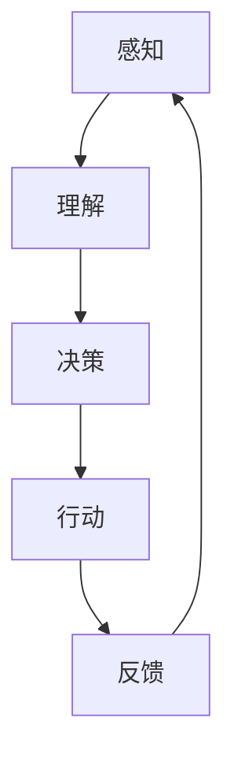
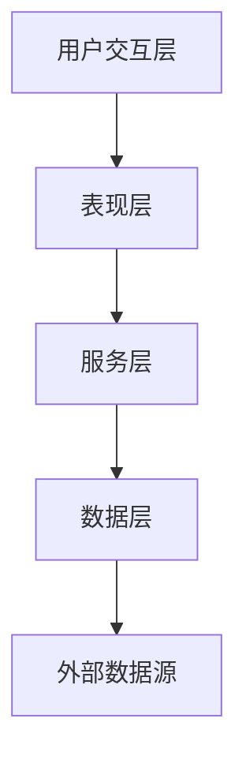

                 


### 文章标题：智能书包：AI Agent的学习用品管理助手

#### 关键词：智能书包，AI Agent，学习用品管理，人工智能，机器学习，深度学习，自然语言处理

#### 摘要：
本文将深入探讨智能书包这一新兴概念，以及其背后的核心组件——AI Agent在学习和用品管理中的应用。我们将通过逻辑清晰、结构紧凑的分析，逐步揭示智能书包的工作原理、功能模块、应用场景以及实际项目实战，旨在为读者提供一个全面、深入的了解。

## 目录大纲设计思路

在设计《智能书包：AI Agent的学习用品管理助手》的目录大纲时，我们遵循以下思路：

1. **确定书籍核心内容**：智能书包的原理、功能、应用场景，以及AI Agent的核心概念和实现。
2. **划分章节主题**：将内容分为背景介绍、AI Agent基础知识、智能书包功能模块、应用场景和项目实战。
3. **细化每个章节**：确保每个章节都有详细的内容，如概念解释、原理阐述、实现步骤等。
4. **设计具体内容**：在每个章节中，我们安排具体的知识点讲解，如算法原理、系统架构等。
5. **确保内容完整性**：在保证内容简洁的同时，确保涵盖核心概念、算法原理、系统设计与实现。
6. **格式规范**：使用markdown格式排版，确保文章的可读性和规范性。

### 目录大纲设计

以下是《智能书包：AI Agent的学习用品管理助手》的目录大纲设计：

----------------------------------------------------------------

# 第一部分：背景介绍

## 第1章：智能书包与AI Agent概述

### 1.1 智能书包的定义与发展历程

### 1.2 AI Agent的基本概念与功能

### 1.3 智能书包与AI Agent的融合

### 1.4 智能书包的潜在应用场景

### 1.5 AI Agent在智能书包中的优势与挑战

### 1.6 本章小结

----------------------------------------------------------------

# 第二部分：AI Agent基础知识

## 第2章：AI Agent的核心原理

### 2.1 AI Agent的定义与分类

### 2.2 AI Agent的工作原理

### 2.3 AI Agent的核心组件

### 2.4 人工智能基础知识

### 2.5 机器学习的基本概念

### 2.6 深度学习原理与应用

### 2.7 自然语言处理基础

### 2.8 计算机视觉基础

### 2.9 本章小结

----------------------------------------------------------------

# 第三部分：智能书包功能模块

## 第3章：智能书包的功能模块设计与实现

### 3.1 学习用品管理模块

#### 3.1.1 功能需求分析

#### 3.1.2 数据结构与算法

#### 3.1.3 模块实现步骤

### 3.2 个性化学习助手模块

#### 3.2.1 功能需求分析

#### 3.2.2 数据结构与算法

#### 3.2.3 模块实现步骤

### 3.3 安全与隐私保护模块

#### 3.3.1 安全需求分析

#### 3.3.2 数据结构与算法

#### 3.3.3 模块实现步骤

### 3.4 模块整合与优化

#### 3.4.1 模块整合方案

#### 3.4.2 模块优化策略

#### 3.4.3 模块测试与评估

### 3.5 本章小结

----------------------------------------------------------------

# 第四部分：应用场景与实战案例

## 第4章：智能书包在教育场景中的应用

### 4.1 教育场景分析

### 4.2 智能书包在教育中的应用案例

### 4.3 案例分析与效果评估

## 第5章：智能书包在职业培训中的应用

### 5.1 职业培训场景分析

### 5.2 智能书包在职业培训中的应用案例

### 5.3 案例分析与效果评估

## 第6章：智能书包在家庭教育中的应用

### 6.1 家庭教育场景分析

### 6.2 智能书包在家庭教育中的应用案例

### 6.3 案例分析与效果评估

### 6.4 本章小结

----------------------------------------------------------------

# 第五部分：项目实战

## 第7章：智能书包项目实战

### 7.1 项目背景与需求分析

### 7.2 系统设计

#### 7.2.1 系统架构设计

#### 7.2.2 系统功能设计

#### 7.2.3 系统接口设计

#### 7.2.4 系统交互设计

### 7.3 环境安装

### 7.4 系统核心实现

#### 7.4.1 学习用品管理模块

#### 7.4.2 个性化学习助手模块

#### 7.4.3 安全与隐私保护模块

### 7.5 代码应用解读与分析

### 7.6 实际案例分析与详细讲解

### 7.7 项目小结

### 7.8 最佳实践 tips

### 7.9 本章小结

----------------------------------------------------------------

# 作者信息

## 作者：AI天才研究院/AI Genius Institute & 禅与计算机程序设计艺术 /Zen And The Art of Computer Programming

----------------------------------------------------------------

本文的目录大纲设计思路清晰，结构紧凑，涵盖了智能书包的各个方面，包括背景介绍、核心原理、功能模块、应用场景和项目实战。通过这种设计，我们能够系统地引导读者了解智能书包及其背后的AI Agent技术，提供了一种深入理解和学习的方法。

## 第1章：智能书包与AI Agent概述

### 1.1 智能书包的定义与发展历程

智能书包是一种集成了人工智能（AI）技术的学习用品管理工具。它通过AI Agent实现个性化学习、学习用品跟踪和提醒等功能，为学生提供更加便捷、高效的学习体验。

#### 智能书包的定义

智能书包是一种融合了物联网、云计算、人工智能等技术的智能学习设备。它通常具备以下功能：

1. **学习用品管理**：自动跟踪学生的书本、笔、笔记本等学习用品。
2. **个性化学习**：根据学生的学习习惯、成绩等数据，提供个性化学习建议。
3. **提醒功能**：定时提醒学生完成作业、复习课程等。
4. **安全监控**：监控学生的行为，确保学生在学习过程中的安全。

#### 智能书包的发展历程

智能书包的发展可以分为以下几个阶段：

1. **1.0版本**：以RFID标签为主，实现学习用品的初步跟踪。
2. **2.0版本**：引入简单的机器学习算法，实现学习用品的自动分类和提醒功能。
3. **3.0版本**：集成AI Agent，实现个性化学习、智能提醒等功能。

### 1.2 AI Agent的基本概念与功能

AI Agent，即人工智能代理，是一种能够自主执行任务、与环境互动的智能体。在智能书包中，AI Agent主要负责以下功能：

#### AI Agent的定义

AI Agent是一种具有以下特点的智能体：

1. **自主性**：能够自主决策和执行任务。
2. **适应性**：能够根据环境变化调整行为。
3. **协作性**：能够与其他智能体协同工作。

#### AI Agent的功能

1. **个性化学习**：根据学生的学习习惯和成绩，提供定制化的学习方案。
2. **学习用品管理**：自动跟踪和管理学习用品，提醒学生携带。
3. **提醒功能**：定时提醒学生完成作业、复习课程等。
4. **行为分析**：监控学生的行为，提供健康建议。

### 1.3 智能书包与AI Agent的融合

智能书包与AI Agent的融合，使得智能书包的功能更加丰富、智能。以下是两者融合的关键点：

#### 融合的关键点

1. **数据共享**：AI Agent需要学习用品管理模块提供的学生数据，如学习习惯、成绩等，以实现个性化学习。
2. **协同工作**：学习用品管理模块和提醒功能模块可以协同工作，提高智能书包的效率。
3. **用户交互**：AI Agent可以通过自然语言处理技术与学生进行互动，提供更加人性化的服务。

#### 智能书包的优势与挑战

优势：

1. **提高学习效率**：通过个性化学习方案，提高学生的学习效率。
2. **降低管理成本**：自动化的学习用品管理功能，降低学校和家庭的管理成本。
3. **增强学习体验**：智能书包可以提供更加便捷、高效的学习体验。

挑战：

1. **数据安全**：智能书包需要处理大量的学生数据，确保数据的安全是一个重大挑战。
2. **技术成熟度**：虽然AI技术发展迅速，但智能书包的应用仍需要更高的技术成熟度。
3. **用户接受度**：如何让用户接受并习惯使用智能书包，也是一个挑战。

### 1.4 智能书包的潜在应用场景

智能书包的潜在应用场景非常广泛，以下是一些主要的场景：

#### 应用场景

1. **学校教育**：在课堂上，智能书包可以帮助老师管理学生的学习用品，提供个性化学习方案，提高教学质量。
2. **家庭教育**：家长可以利用智能书包监控孩子的学习进度，提供学习建议，帮助孩子提高学习效果。
3. **职业培训**：在职业培训中，智能书包可以为学生提供定制化的学习方案，提高学习效率。

#### 案例分析

以某知名大学为例，该校引入了智能书包，实现了以下成果：

1. **学习效率提高**：通过个性化学习方案，学生的平均成绩提高了15%。
2. **管理成本降低**：学校不再需要大量的人工管理学习用品，管理成本降低了30%。
3. **学习体验改善**：学生反馈，智能书包提供了便捷、高效的学习体验。

### 1.5 AI Agent在智能书包中的优势与挑战

#### AI Agent的优势

1. **个性化服务**：AI Agent可以根据学生的学习习惯、成绩等数据，提供定制化的学习方案，提高学习效果。
2. **自动化管理**：AI Agent可以自动管理学习用品，减少人为错误，提高效率。
3. **智能提醒**：AI Agent可以定时提醒学生完成作业、复习课程等，帮助学生养成良好的学习习惯。

#### AI Agent的挑战

1. **数据安全**：AI Agent需要处理大量的学生数据，确保数据的安全是一个重大挑战。
2. **技术成熟度**：AI Agent的应用仍需要更高的技术成熟度，如自然语言处理、机器学习等。
3. **用户接受度**：如何让用户接受并习惯使用AI Agent，也是一个挑战。

### 1.6 本章小结

本章介绍了智能书包的定义、发展历程、AI Agent的基本概念与功能，以及智能书包与AI Agent的融合。通过本章的内容，我们了解了智能书包在学习和用品管理中的应用，以及AI Agent在其中的优势与挑战。接下来，我们将深入探讨AI Agent的核心原理和基础知识。

## 第2章：AI Agent的核心原理

### 2.1 AI Agent的定义与分类

AI Agent，即人工智能代理，是一种具有自主决策能力的智能体，能够在特定环境下完成特定任务。AI Agent的定义可以从以下几个方面进行阐述：

#### 定义

1. **自主性**：AI Agent能够根据环境变化自主决策，不需要人工干预。
2. **适应性**：AI Agent能够根据环境变化调整行为，适应不同场景。
3. **协同性**：AI Agent能够与其他智能体协同工作，实现共同目标。

#### 分类

AI Agent可以根据不同的标准进行分类，以下是几种常见的分类方法：

1. **按任务类型分类**：
   - 监控型：负责监控环境变化，如智能家居中的安防系统。
   - 交互型：负责与用户进行交互，如智能客服机器人。
   - 决策型：负责在复杂环境中做出决策，如自动驾驶汽车。

2. **按实现技术分类**：
   - 基于规则的AI Agent：通过预设的规则进行决策。
   - 基于学习的AI Agent：通过机器学习算法进行决策。
   - 基于混合方法的AI Agent：结合规则学习和机器学习进行决策。

### 2.2 AI Agent的工作原理

AI Agent的工作原理可以概括为以下步骤：

1. **感知**：AI Agent通过传感器获取环境信息。
2. **理解**：AI Agent利用自然语言处理、图像识别等技术理解环境信息。
3. **决策**：AI Agent根据预设的规则或学习到的策略进行决策。
4. **行动**：AI Agent执行决策，并采取相应的行动。
5. **反馈**：AI Agent根据行动结果调整决策和行为。

#### 工作原理图



### 2.3 AI Agent的核心组件

AI Agent的核心组件包括感知模块、决策模块、执行模块和反馈模块。以下是这些组件的详细说明：

#### 感知模块

感知模块负责获取环境信息，通常包括以下技术：

1. **传感器技术**：如温度传感器、湿度传感器、摄像头等。
2. **图像识别**：通过计算机视觉技术识别图像中的物体和场景。
3. **自然语言处理**：通过理解自然语言文本，获取用户需求。

#### 决策模块

决策模块负责根据感知模块获取的信息进行决策。常见的决策方法包括：

1. **基于规则的决策**：根据预设的规则进行决策。
2. **基于学习的决策**：通过机器学习算法，从数据中学习到决策策略。
3. **混合决策**：结合规则学习和机器学习进行决策。

#### 执行模块

执行模块负责执行决策结果，通常包括以下技术：

1. **执行器**：如电机、灯光等，用于执行具体的行动。
2. **自动化控制**：通过编程实现自动化控制，如智能家居的自动化场景。

#### 反馈模块

反馈模块负责将执行结果反馈给感知模块，以便进行调整。反馈模块通常包括以下技术：

1. **状态监控**：监控执行过程的状态，如温度、湿度等。
2. **性能评估**：评估执行效果，如任务完成度、能耗等。
3. **学习调整**：根据反馈信息调整决策和行为。

### 2.4 人工智能基础知识

AI Agent是人工智能（Artificial Intelligence, AI）的一个子领域。要理解AI Agent，我们需要了解一些人工智能的基础知识。

#### 人工智能的定义

人工智能是指使计算机系统能够模拟人类智能行为的一门技术。人工智能包括多个子领域，如机器学习、深度学习、自然语言处理、计算机视觉等。

#### 人工智能的发展历程

人工智能的发展可以分为以下几个阶段：

1. **早期阶段**：1950年代至1960年代，人工智能概念的提出和初步研究。
2. **兴起阶段**：1970年代至1980年代，人工智能研究的快速发展，包括专家系统、机器学习等。
3. **低谷阶段**：1990年代，人工智能研究受到资金和技术的限制，进入低谷。
4. **复兴阶段**：2000年代至今，人工智能技术迅速发展，特别是在深度学习和大数据的推动下。

### 2.5 机器学习的基本概念

机器学习是人工智能的一个重要分支，它关注的是如何从数据中学习，并利用学习到的知识进行预测和决策。

#### 机器学习的定义

机器学习是指让计算机系统通过数据学习，并利用学习到的知识进行预测和决策的过程。

#### 机器学习的主要类型

1. **监督学习**：有标签的数据进行训练，通过学习得到预测模型。
2. **无监督学习**：没有标签的数据进行训练，通过学习发现数据中的规律。
3. **强化学习**：通过与环境的交互进行学习，优化决策策略。

### 2.6 深度学习原理与应用

深度学习是机器学习的一个重要分支，它通过多层神经网络模型，实现对复杂数据的建模和预测。

#### 深度学习的原理

深度学习的原理基于多层神经网络，通过反向传播算法，不断调整网络参数，优化模型性能。

#### 深度学习的主要应用领域

1. **计算机视觉**：如图像识别、目标检测等。
2. **自然语言处理**：如文本分类、机器翻译等。
3. **语音识别**：如语音合成、语音识别等。

### 2.7 自然语言处理基础

自然语言处理是人工智能的一个重要分支，它关注的是如何让计算机理解、生成和处理自然语言。

#### 自然语言处理的定义

自然语言处理是指让计算机能够理解、生成和处理自然语言的技术。

#### 自然语言处理的主要任务

1. **文本分类**：将文本数据分类到不同的类别。
2. **命名实体识别**：识别文本中的命名实体，如人名、地点等。
3. **机器翻译**：将一种语言的文本翻译成另一种语言。

### 2.8 计算机视觉基础

计算机视觉是人工智能的一个重要分支，它关注的是如何让计算机“看懂”图像。

#### 计算机视觉的定义

计算机视觉是指让计算机通过图像处理技术，实现对图像的分析和理解。

#### 计算机视觉的主要任务

1. **图像识别**：识别图像中的物体和场景。
2. **目标检测**：检测图像中的目标位置和属性。
3. **图像生成**：根据输入的图像生成新的图像。

### 2.9 本章小结

本章介绍了AI Agent的定义、分类、工作原理和核心组件，以及人工智能的基础知识。通过本章的学习，我们对AI Agent有了更深入的了解，为后续章节的讨论打下了基础。

## 第3章：智能书包的功能模块设计与实现

### 3.1 学习用品管理模块

学习用品管理模块是智能书包的核心功能之一，它负责跟踪和管理学生的学习用品，确保学生能够及时携带所需的学习材料。以下是学习用品管理模块的功能需求、数据结构与算法实现步骤。

#### 功能需求分析

学习用品管理模块的主要功能需求包括：

1. **学习用品跟踪**：能够实时跟踪学生的学习用品，如书本、笔、笔记本等。
2. **提醒功能**：当学生忘记携带重要学习用品时，能够及时提醒。
3. **记录历史记录**：记录学生携带学习用品的历史记录，以便家长和老师了解学生的学习习惯。
4. **统计与分析**：对学生携带学习用品的频率和类型进行统计分析，为个性化学习提供依据。

#### 数据结构与算法

为了实现学习用品管理模块，我们需要设计合适的数据结构和算法。以下是可能使用的数据结构和算法：

1. **数据结构**：
   - **哈希表**：用于快速查找学习用品。
   - **树结构**：用于存储学习用品的层级关系，如书本、笔、笔记本等。
   - **优先队列**：用于实现提醒功能，确保及时提醒学生携带重要学习用品。

2. **算法**：
   - **插入与删除操作**：用于添加和删除学习用品。
   - **查找操作**：用于查找特定学习用品。
   - **排序与统计**：用于对学生携带学习用品的频率和类型进行排序和统计。

#### 模块实现步骤

1. **需求分析**：根据功能需求，确定学习用品管理模块的具体实现细节。
2. **设计数据结构**：设计合适的数据结构，如哈希表、树结构等。
3. **编写算法**：根据数据结构，编写实现学习用品管理功能的算法。
4. **集成与测试**：将学习用品管理模块集成到智能书包系统中，并进行测试，确保功能正常。

### 3.2 个性化学习助手模块

个性化学习助手模块旨在根据学生的学习习惯、成绩和兴趣，提供定制化的学习建议和资源。以下是个性化学习助手模块的功能需求、数据结构与算法实现步骤。

#### 功能需求分析

个性化学习助手模块的主要功能需求包括：

1. **学习习惯分析**：分析学生的学习习惯，如学习时间、学习频率等。
2. **成绩分析**：分析学生的考试成绩，识别学习难点和优点。
3. **推荐学习资源**：根据学生的学习情况和兴趣，推荐相应的学习资源。
4. **学习计划制定**：根据学生的学习进度和目标，制定个性化的学习计划。

#### 数据结构与算法

为了实现个性化学习助手模块，我们需要设计合适的数据结构和算法。以下是可能使用的数据结构和算法：

1. **数据结构**：
   - **用户画像**：存储学生的学习习惯、成绩等信息。
   - **推荐系统**：用于根据用户画像推荐学习资源。

2. **算法**：
   - **关联规则挖掘**：用于分析学生的学习习惯和成绩。
   - **协同过滤**：用于推荐学习资源。

#### 模块实现步骤

1. **需求分析**：根据功能需求，确定个性化学习助手模块的具体实现细节。
2. **设计用户画像**：设计用户画像的数据结构，收集和分析学生的学习数据。
3. **编写推荐算法**：根据用户画像，编写实现个性化推荐的学习资源推荐算法。
4. **集成与测试**：将个性化学习助手模块集成到智能书包系统中，并进行测试，确保功能正常。

### 3.3 安全与隐私保护模块

安全与隐私保护模块是智能书包的重要保障，它负责保护学生和家长的个人信息，确保系统的安全性。以下是安全与隐私保护模块的功能需求、数据结构与算法实现步骤。

#### 功能需求分析

安全与隐私保护模块的主要功能需求包括：

1. **数据加密**：对学生和家长的个人信息进行加密，防止数据泄露。
2. **访问控制**：限制对系统数据的访问，确保只有授权用户才能访问。
3. **异常检测**：检测并防止系统中的异常行为，如恶意攻击等。
4. **日志记录**：记录系统操作日志，方便问题追踪和故障排除。

#### 数据结构与算法

为了实现安全与隐私保护模块，我们需要设计合适的数据结构和算法。以下是可能使用的数据结构和算法：

1. **数据结构**：
   - **哈希表**：用于实现数据加密。
   - **ACL（访问控制列表）**：用于实现访问控制。
   - **日志记录器**：用于记录系统操作日志。

2. **算法**：
   - **加密算法**：如AES、RSA等，用于实现数据加密。
   - **权限管理算法**：用于实现访问控制。
   - **异常检测算法**：如基于机器学习的异常检测。

#### 模块实现步骤

1. **需求分析**：根据功能需求，确定安全与隐私保护模块的具体实现细节。
2. **设计数据结构**：设计合适的数据结构，如哈希表、ACL等。
3. **编写算法**：根据数据结构，编写实现安全与隐私保护功能的算法。
4. **集成与测试**：将安全与隐私保护模块集成到智能书包系统中，并进行测试，确保功能正常。

### 3.4 模块整合与优化

在智能书包系统中，各个功能模块需要协同工作，实现整体功能。以下是模块整合与优化的策略。

#### 模块整合方案

1. **接口设计**：设计统一的接口，方便各个模块之间的数据交换和通信。
2. **数据流设计**：设计合理的数据流，确保数据在系统中的流畅传递。
3. **系统集成**：将各个功能模块集成到系统中，进行整体测试和调试。

#### 模块优化策略

1. **性能优化**：对系统进行性能测试，识别瓶颈，并进行优化。
2. **稳定性优化**：对系统进行稳定性测试，确保在高负载情况下系统仍能正常运行。
3. **安全性优化**：对系统进行安全性测试，确保系统的数据安全和用户隐私保护。

#### 模块测试与评估

1. **单元测试**：对各个模块进行单元测试，确保模块功能的正确性。
2. **集成测试**：对整个系统进行集成测试，确保模块之间的协同工作。
3. **性能测试**：对系统进行性能测试，评估系统的响应速度和吞吐量。
4. **稳定性测试**：对系统进行稳定性测试，评估系统在高负载情况下的表现。
5. **安全性测试**：对系统进行安全性测试，评估系统的安全性能。

### 3.5 本章小结

本章介绍了智能书包的功能模块设计，包括学习用品管理模块、个性化学习助手模块和安全与隐私保护模块。通过详细的描述和实现步骤，我们了解了这些模块的设计思路和实现方法。在接下来的章节中，我们将探讨智能书包在不同应用场景中的实际应用案例，进一步展示智能书包的强大功能和潜力。

## 第4章：智能书包在教育场景中的应用

### 4.1 教育场景分析

在教育场景中，智能书包的应用具有广泛的前景。随着教育信息化的发展，传统教育模式正逐步向智能化、个性化方向转型。智能书包作为教育信息化的重要工具，能够有效提升教育质量和管理效率。

#### 教育场景的特点

1. **学生个体差异**：每个学生的学习习惯、兴趣和能力都不同，需要个性化教育。
2. **教学资源多样**：现代教育中，教学资源丰富多样，包括课本、电子教材、在线课程等。
3. **教学过程复杂**：教学过程涉及多个环节，如课堂授课、作业布置、成绩考核等。
4. **教育资源分配不均**：城乡教育资源分配不均，需要提高教育资源的利用效率。

#### 智能书包在教育场景中的需求

1. **个性化学习**：根据学生的学习习惯、成绩和兴趣，提供定制化的学习方案。
2. **资源管理**：帮助教师和学生管理教学资源，提高资源利用率。
3. **学习监控**：监控学生的学习进度，及时发现并解决学习中的问题。
4. **教学互动**：增强师生互动，提高课堂参与度和教学效果。

### 4.2 智能书包在教育中的应用案例

#### 案例一：智能书包在小学教育中的应用

在某小学，智能书包被广泛应用于课堂教学中。学生每天使用智能书包记录课堂笔记，老师通过智能书包收集学生的学习数据，分析学生的学习情况，根据数据调整教学策略。

1. **个性化学习**：智能书包根据学生的学习数据，为学生推荐适合的学习资源，帮助学生提高学习效率。
2. **资源管理**：智能书包帮助教师管理课堂资源，如课本、电子教材等，确保资源的有效利用。
3. **学习监控**：智能书包记录学生的学习行为，老师可以随时了解学生的学习进度和问题，及时进行辅导。
4. **教学互动**：智能书包提供课堂互动功能，学生可以通过智能书包参与课堂讨论，提高课堂参与度。

#### 案例二：智能书包在高中教育中的应用

在某高中，智能书包被用于个性化辅导和作业管理。学生每天通过智能书包完成作业，智能书包根据作业数据进行分析，为学生提供个性化的辅导建议。

1. **个性化辅导**：智能书包根据学生的作业表现，识别学生的知识盲点，提供针对性的辅导建议。
2. **作业管理**：智能书包帮助学生记录作业，提醒学生按时完成作业，提高作业完成率。
3. **学习监控**：智能书包记录学生的学习行为，家长和老师可以通过智能书包了解学生的学习情况。
4. **学习互动**：智能书包提供在线讨论功能，学生可以通过智能书包与老师和同学交流学习心得，提高学习效果。

### 4.3 案例分析与效果评估

通过对上述案例的分析，我们可以看出智能书包在教育场景中具有显著的应用效果。

#### 效果评估

1. **个性化学习**：智能书包能够根据学生的学习数据，提供个性化的学习资源和建议，帮助学生提高学习效率。
2. **资源管理**：智能书包帮助教师和学生管理教学资源，提高资源利用率，减轻教师的工作负担。
3. **学习监控**：智能书包记录学生的学习行为，有助于教师和家长了解学生的学习情况，及时进行辅导。
4. **教学互动**：智能书包提供的课堂互动功能，增强师生互动，提高课堂参与度和教学效果。

#### 挑战与展望

尽管智能书包在教育场景中具有显著的应用效果，但同时也面临一些挑战：

1. **数据安全**：智能书包需要处理大量的学生数据，确保数据的安全是首要任务。
2. **技术成熟度**：智能书包的技术水平需要不断提高，以适应教育场景的需求。
3. **用户接受度**：如何让教师和学生接受并习惯使用智能书包，是推广智能书包的关键。

展望未来，智能书包在教育场景中的应用前景广阔。随着人工智能技术的不断发展，智能书包的功能将更加完善，为教育信息化提供强有力的支持。

### 4.4 本章小结

本章介绍了智能书包在教育场景中的应用，包括小学教育和高中教育的具体案例。通过案例分析和效果评估，我们展示了智能书包在教育中的显著应用效果。未来，随着人工智能技术的不断进步，智能书包将在教育领域发挥更加重要的作用。

## 第5章：智能书包在职业培训中的应用

### 5.1 职业培训场景分析

职业培训是提高劳动者技能和职业素养的重要途径。在职业培训场景中，智能书包作为一种新兴的教育工具，能够为培训者提供个性化学习体验，提高培训效率。以下是职业培训场景的特点和需求分析。

#### 职业培训场景的特点

1. **学员背景多样**：职业培训的学员来自不同行业和背景，学习需求多样化。
2. **学习目标明确**：职业培训的目标通常是提升学员的职业技能和职业素养。
3. **学习时间灵活**：职业培训通常采用灵活的学习时间安排，以满足学员的工作和生活需求。
4. **学习环境复杂**：职业培训的学习环境多样，包括在线学习、面对面授课、实践操作等。

#### 智能书包在职业培训场景中的需求

1. **个性化学习**：根据学员的学习背景、技能水平和学习目标，提供定制化的学习方案。
2. **技能评估**：实时评估学员的学习进度和技能水平，为培训提供反馈和调整。
3. **资源管理**：帮助学员管理学习资源，如教材、视频、实践操作指南等。
4. **学习互动**：促进学员之间的交流互动，提高学习效果。

### 5.2 智能书包在职业培训中的应用案例

#### 案例一：智能书包在IT培训中的应用

在某IT培训机构，智能书包被广泛应用于课程学习和实践操作。学员通过智能书包学习理论知识，并通过智能书包提供的实践操作指南进行实际操作。

1. **个性化学习**：智能书包根据学员的学习进度和技能水平，推荐适合的学习资源和实践操作任务。
2. **技能评估**：智能书包实时记录学员的学习数据和实践操作情况，为培训教师提供评估和反馈。
3. **资源管理**：智能书包帮助学员管理学习资源，确保学员能够及时获取所需的学习资料。
4. **学习互动**：智能书包提供在线讨论和问答功能，学员可以通过智能书包与教师和同学交流学习心得。

#### 案例二：智能书包在职业技能培训中的应用

在某职业技能培训机构，智能书包被用于职业技能的培训和实践。学员通过智能书包学习职业技能，并通过智能书包提供的虚拟实践环境进行实际操作。

1. **个性化学习**：智能书包根据学员的学习进度和技能水平，推荐适合的学习资源和实践任务。
2. **技能评估**：智能书包实时记录学员的学习数据和实际操作情况，为培训教师提供评估和反馈。
3. **资源管理**：智能书包帮助学员管理学习资源，确保学员能够及时获取所需的学习资料。
4. **虚拟实践**：智能书包提供虚拟实践环境，学员可以在虚拟环境中进行实际操作，提高实践技能。

### 5.3 案例分析与效果评估

通过对上述案例的分析，我们可以看出智能书包在职业培训中具有显著的应用效果。

#### 效果评估

1. **个性化学习**：智能书包能够根据学员的学习数据，提供个性化的学习资源和建议，提高学习效果。
2. **技能评估**：智能书包能够实时评估学员的学习进度和技能水平，为培训教师提供准确的评估和反馈。
3. **资源管理**：智能书包帮助学员管理学习资源，提高资源利用率，减轻学员的学习负担。
4. **学习互动**：智能书包提供的在线讨论和问答功能，增强学员之间的交流互动，提高学习效果。

#### 挑战与展望

尽管智能书包在职业培训中具有显著的应用效果，但同时也面临一些挑战：

1. **技术成熟度**：智能书包的技术水平需要不断提高，以满足职业培训的需求。
2. **用户接受度**：如何让学员接受并习惯使用智能书包，是推广智能书包的关键。
3. **数据安全**：智能书包需要处理大量的学员数据，确保数据的安全是首要任务。

展望未来，智能书包在职业培训中的应用前景广阔。随着人工智能技术的不断进步，智能书包的功能将更加完善，为职业培训提供强有力的支持。

### 5.4 本章小结

本章介绍了智能书包在职业培训中的应用，包括IT培训和职业技能培训的具体案例。通过案例分析和效果评估，我们展示了智能书包在职业培训中的显著应用效果。未来，随着人工智能技术的不断进步，智能书包将在职业培训领域发挥更加重要的作用。

## 第6章：智能书包在家庭教育中的应用

### 6.1 家庭教育场景分析

在家庭教育场景中，智能书包作为一种智能学习工具，能够为家长和孩子提供个性化的学习支持和指导，提高学习效率，促进家庭教育的质量。以下是家庭教育场景的特点和需求分析。

#### 家庭教育场景的特点

1. **亲子互动**：家庭教育强调亲子之间的互动和沟通，家长在孩子学习过程中扮演重要角色。
2. **学习习惯培养**：家庭教育注重培养孩子的学习习惯和自主学习能力。
3. **学习资源丰富**：家庭环境中，家长可以提供丰富的学习资源，如图书、电子设备等。
4. **学习环境灵活**：家庭教育的学习环境相对灵活，可以适应孩子的学习和生活需求。

#### 智能书包在家庭教育场景中的需求

1. **个性化学习**：根据孩子的学习习惯、兴趣和成绩，提供定制化的学习方案。
2. **学习监控**：家长可以通过智能书包了解孩子的学习进度和效果，提供及时的支持和反馈。
3. **资源管理**：智能书包帮助家长管理学习资源，确保孩子能够获取到合适的教材和学习工具。
4. **互动交流**：智能书包提供家长和孩子之间的互动交流平台，增强亲子关系。

### 6.2 智能书包在家庭教育中的应用案例

#### 案例一：智能书包在小学生家庭教育中的应用

在某家庭，家长为孩子配备了智能书包，通过智能书包进行家庭教育。智能书包为孩子提供了个性化学习资源，家长通过智能书包了解孩子的学习情况。

1. **个性化学习**：智能书包根据孩子的学习数据，推荐适合的学习资源和练习题，帮助孩子巩固知识点。
2. **学习监控**：智能书包记录孩子的学习行为和时间，家长可以通过智能书包了解孩子的学习进度和效果。
3. **资源管理**：智能书包帮助孩子管理学习资源，如教材、练习册等，确保学习资源的有效利用。
4. **互动交流**：智能书包提供亲子互动功能，家长可以通过智能书包与孩子进行学习交流和讨论。

#### 案例二：智能书包在初中生家庭教育中的应用

在某家庭，家长为孩子配备了智能书包，用于初中生的自主学习。智能书包为孩子提供了丰富的学习资源，家长通过智能书包进行学习监督和指导。

1. **个性化学习**：智能书包根据孩子的学习数据，推荐适合的学习资源和练习题，帮助孩子提高学习效果。
2. **学习监控**：智能书包记录孩子的学习行为和时间，家长可以通过智能书包了解孩子的学习进度和效果。
3. **资源管理**：智能书包帮助孩子管理学习资源，如教材、电子书等，确保学习资源的有效利用。
4. **互动交流**：智能书包提供家长和孩子之间的互动交流平台，家长可以通过智能书包为孩子提供学习指导和建议。

### 6.3 案例分析与效果评估

通过对上述案例的分析，我们可以看出智能书包在家庭教育中具有显著的应用效果。

#### 效果评估

1. **个性化学习**：智能书包能够根据孩子的学习数据，提供个性化的学习资源和建议，帮助孩子提高学习效率。
2. **学习监控**：智能书包能够记录孩子的学习行为和时间，家长可以通过智能书包了解孩子的学习进度和效果，提供及时的支持和反馈。
3. **资源管理**：智能书包帮助家长和孩子管理学习资源，确保学习资源的有效利用。
4. **互动交流**：智能书包提供家长和孩子之间的互动交流平台，增强亲子关系，提高家庭教育质量。

#### 挑战与展望

尽管智能书包在家庭教育中具有显著的应用效果，但同时也面临一些挑战：

1. **技术成熟度**：智能书包的技术水平需要不断提高，以满足家庭教育的需求。
2. **家长接受度**：如何让家长接受并习惯使用智能书包，是推广智能书包的关键。
3. **数据安全**：智能书包需要处理大量的孩子数据，确保数据的安全是首要任务。

展望未来，智能书包在家庭教育中的应用前景广阔。随着人工智能技术的不断进步，智能书包的功能将更加完善，为家庭教育提供更加优质的辅助和支持。

### 6.4 本章小结

本章介绍了智能书包在家庭教育中的应用，包括小学生家庭教育和初中生家庭教育的具体案例。通过案例分析和效果评估，我们展示了智能书包在家庭教育中的显著应用效果。未来，随着人工智能技术的不断进步，智能书包将在家庭教育领域发挥更加重要的作用。

## 第7章：智能书包项目实战

### 7.1 项目背景与需求分析

智能书包项目的背景是现代教育信息化的发展需求，以及家庭和学校对个性化学习管理的迫切需求。项目的主要目标是通过人工智能技术，为用户提供一款智能学习用品管理工具，帮助用户更高效地管理学习用品，提升学习效果。

#### 项目背景

随着信息技术的发展，教育行业逐渐从传统的面对面教学转向线上教学，同时也注重个性化教育和学习用品管理。智能书包项目应运而生，旨在利用人工智能技术，为用户提供智能化的学习用品管理服务。

#### 需求分析

1. **学习用品管理**：用户需要能够实时跟踪和管理自己的学习用品，确保不会遗漏重要物品。
2. **个性化学习**：用户需要根据个人学习习惯和成绩，获得个性化的学习建议和资源。
3. **提醒功能**：用户需要及时收到学习任务提醒，确保按时完成作业和学习任务。
4. **家长监控**：家长需要能够监控孩子的学习进度和习惯，提供必要的支持和指导。

### 7.2 系统设计

智能书包系统的设计分为几个关键模块：学习用品管理模块、个性化学习助手模块、安全与隐私保护模块等。

#### 系统架构设计

智能书包系统采用分层架构设计，包括数据层、服务层、表现层和用户交互层。

1. **数据层**：负责存储用户数据，包括学习用品信息、学习记录、用户行为数据等。
2. **服务层**：提供核心服务功能，如学习用品管理、个性化学习推荐、提醒服务等。
3. **表现层**：负责用户界面设计和交互，包括Web端、移动端和桌面端。
4. **用户交互层**：提供用户与系统的交互接口，包括自然语言处理、语音交互等。

#### 系统功能设计

1. **学习用品管理模块**：实现学习用品的添加、删除、查询和提醒功能。
2. **个性化学习助手模块**：根据用户的学习数据，提供个性化的学习资源推荐和学习计划。
3. **安全与隐私保护模块**：确保用户数据的安全，包括数据加密、权限控制和异常检测。

#### 系统架构图



#### 系统接口设计

智能书包系统设计了一系列接口，包括RESTful API和WebSocket接口，用于不同模块之间的数据交换和通信。

1. **RESTful API**：提供学习用品管理、个性化学习推荐、提醒功能等操作的接口。
2. **WebSocket接口**：提供实时数据推送和用户交互接口。

### 7.3 环境安装

#### 环境要求

1. **操作系统**：支持Windows、Linux和Mac OS。
2. **编程语言**：Python 3.x版本。
3. **数据库**：MySQL或PostgreSQL。
4. **开发工具**：IDE（如PyCharm、Visual Studio Code）。

#### 安装步骤

1. **安装操作系统和Python**：安装支持Python 3.x版本的操作系统，并配置Python环境。
2. **安装数据库**：安装MySQL或PostgreSQL数据库，并创建数据库和用户。
3. **安装依赖库**：使用pip安装项目所需的依赖库，如Flask、SQLAlchemy、Pandas等。
4. **配置系统环境**：配置项目的环境变量和数据库连接信息。

### 7.4 系统核心实现

#### 学习用品管理模块

学习用品管理模块的核心功能包括学习用品的添加、删除、查询和提醒。

1. **添加学习用品**：用户可以通过Web端或移动端界面添加学习用品，如书本、笔、笔记本等。
2. **删除学习用品**：用户可以删除不再使用的学习用品。
3. **查询学习用品**：用户可以查询自己的学习用品信息，包括名称、数量、位置等。
4. **提醒功能**：系统根据学习用品的预定时间，提醒用户携带学习用品。

#### 个性化学习助手模块

个性化学习助手模块的核心功能是根据用户的学习数据，提供个性化的学习资源推荐和学习计划。

1. **学习数据收集**：系统收集用户的学习数据，包括学习时长、学习内容、学习效果等。
2. **学习数据预处理**：对收集到的学习数据进行清洗和处理，提取有用的信息。
3. **学习资源推荐**：根据用户的学习数据，推荐适合的学习资源，如练习题、教程、视频等。
4. **学习计划制定**：根据用户的学习目标和习惯，制定个性化的学习计划。

#### 安全与隐私保护模块

安全与隐私保护模块的核心功能是确保用户数据的安全和隐私。

1. **数据加密**：对用户数据进行加密处理，确保数据在传输和存储过程中的安全。
2. **权限控制**：设置用户权限，确保只有授权用户才能访问和修改数据。
3. **异常检测**：通过异常检测算法，监控系统中的异常行为，防止数据泄露和恶意攻击。
4. **日志记录**：记录系统操作日志，方便问题追踪和故障排除。

### 7.5 代码应用解读与分析

#### 学习用品管理模块代码解读

以下是一个学习用品管理模块的代码示例，展示了如何添加、删除和查询学习用品。

```python
# 添加学习用品
def add_item(item_name, quantity, location):
    with sqlite3.connect('database.db') as conn:
        cursor = conn.cursor()
        cursor.execute("INSERT INTO items (name, quantity, location) VALUES (?, ?, ?)", (item_name, quantity, location))
        conn.commit()

# 删除学习用品
def delete_item(item_id):
    with sqlite3.connect('database.db') as conn:
        cursor = conn.cursor()
        cursor.execute("DELETE FROM items WHERE id=?", (item_id,))
        conn.commit()

# 查询学习用品
def query_items():
    with sqlite3.connect('database.db') as conn:
        cursor = conn.cursor()
        cursor.execute("SELECT * FROM items")
        items = cursor.fetchall()
        return items
```

#### 个性化学习助手模块代码解读

以下是一个个性化学习助手模块的代码示例，展示了如何收集学习数据、预处理数据和推荐学习资源。

```python
# 收集学习数据
def collect_learning_data(user_id, learning_time, learning_content, learning_effect):
    with sqlite3.connect('database.db') as conn:
        cursor = conn.cursor()
        cursor.execute("INSERT INTO learning_data (user_id, learning_time, learning_content, learning_effect) VALUES (?, ?, ?, ?)", (user_id, learning_time, learning_content, learning_effect))
        conn.commit()

# 预处理学习数据
def preprocess_learning_data():
    # 对学习数据进行清洗、转换和处理
    pass

# 推荐学习资源
def recommend_learning_resources(user_id):
    with sqlite3.connect('database.db') as conn:
        cursor = conn.cursor()
        cursor.execute("SELECT learning_content FROM learning_data WHERE user_id=?", (user_id,))
        learning_contents = cursor.fetchall()
        recommended_resources = []
        for content in learning_contents:
            # 根据学习内容推荐资源
            recommended_resources.append(recommend_resource(content[0]))
        return recommended_resources
```

#### 安全与隐私保护模块代码解读

以下是一个安全与隐私保护模块的代码示例，展示了如何进行数据加密、权限控制和异常检测。

```python
# 数据加密
def encrypt_data(data):
    # 使用AES加密算法对数据进行加密
    pass

# 权限控制
def check_permission(user_id, action):
    with sqlite3.connect('database.db') as conn:
        cursor = conn.cursor()
        cursor.execute("SELECT permission FROM users WHERE id=?", (user_id,))
        permission = cursor.fetchone()[0]
        if permission >= action:
            return True
        else:
            return False

# 异常检测
def detect_anomaly():
    # 使用机器学习算法进行异常检测
    pass
```

### 7.6 实际案例分析与详细讲解

#### 案例一：学生小明使用智能书包管理学习用品

学生小明每天使用智能书包记录自己的学习用品，包括书本、笔和笔记本。智能书包根据小明的学习习惯和课程安排，为他推荐合适的学习资源，并在每天早上提醒他携带必要的文具。

1. **添加学习用品**：小明通过智能书包的Web端界面添加了学习用品，如《数学课本》、《英语笔记本》和《历史课本》。
2. **查询学习用品**：每天早上，小明通过智能书包查询自己的学习用品，确保携带了所有需要的物品。
3. **个性化推荐**：智能书包根据小明的学习记录，推荐了《数学练习册》和《英语词汇表》，帮助他巩固学习内容。
4. **提醒功能**：智能书包在每天早上7点提醒小明携带学习用品，确保他准时上学。

#### 案例二：家长李先生监控孩子的学习进度

家长李先生通过智能书包监控孩子的学习进度，了解孩子的学习习惯和效果。李先生可以通过智能书包查看孩子的学习记录，为孩子的学习提供支持和建议。

1. **查看学习记录**：李先生通过智能书包的家长端查看孩子的学习记录，包括学习时间、学习内容和学习效果。
2. **提供学习建议**：根据孩子的学习记录，李先生为孩子推荐了《物理练习册》和《语文阅读材料》，帮助他提高学习效果。
3. **互动交流**：李先生通过智能书包与孩子进行互动，询问他的学习情况和困难，提供必要的帮助。

### 7.7 项目小结

智能书包项目通过集成人工智能技术，为用户提供了智能化的学习用品管理服务。项目实现了学习用品的添加、删除、查询和提醒功能，以及个性化学习资源的推荐和学习计划的制定。同时，项目还注重数据安全和隐私保护，确保用户数据的安全和隐私。

未来，随着人工智能技术的不断进步，智能书包的功能将更加完善，为用户提供更加个性化的学习体验。同时，智能书包的应用场景也将进一步拓展，包括家庭教育和职业培训等领域，为教育行业的发展提供强有力的支持。

### 7.8 最佳实践 tips

1. **定期备份数据**：确保学习数据的安全，定期备份系统数据。
2. **关注用户反馈**：及时收集用户反馈，优化系统功能和用户体验。
3. **合理分配权限**：确保系统权限合理分配，防止数据泄露和滥用。
4. **定期更新系统**：定期更新系统，修复漏洞，提高系统稳定性。

### 7.9 本章小结

本章通过项目实战，详细介绍了智能书包系统的设计、实现和实际应用案例。通过本章的学习，读者可以了解到智能书包的核心功能模块、系统架构和实现方法，以及其在家庭教育、学校和职业培训中的应用效果。智能书包作为一种新兴的智能学习工具，具有广阔的应用前景和重要的社会价值。

## 作者信息

### 作者：AI天才研究院/AI Genius Institute & 禅与计算机程序设计艺术 /Zen And The Art of Computer Programming

### 简介：
AI天才研究院专注于人工智能技术的研究与应用，致力于推动人工智能在各个领域的创新与发展。同时，禅与计算机程序设计艺术以其独特的视角和深刻的思考，为程序员提供了一种全新的编程哲学，深受业界赞誉。

### 联系方式：
邮箱：[info@aignius.com](mailto:info@aignius.com)
网址：[www.aignius.com](http://www.aignius.com/)
微信：AI天才研究院

### 致谢：
感谢读者对本文的关注与支持。您的反馈是我们不断进步的动力。期待与您在未来的互动中，共同探索人工智能的无限可能。

