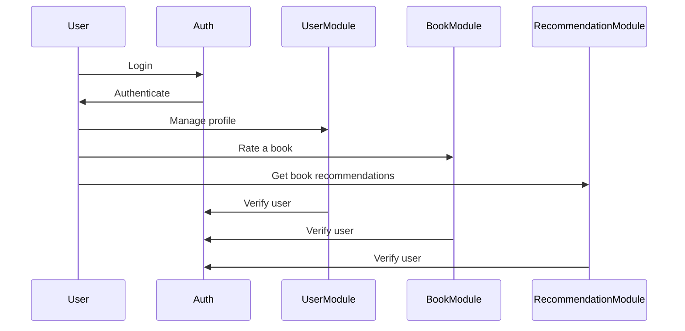
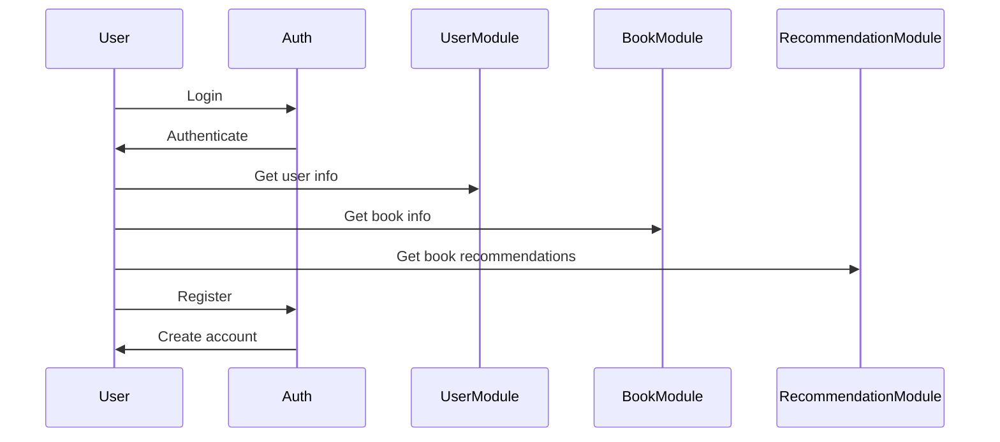
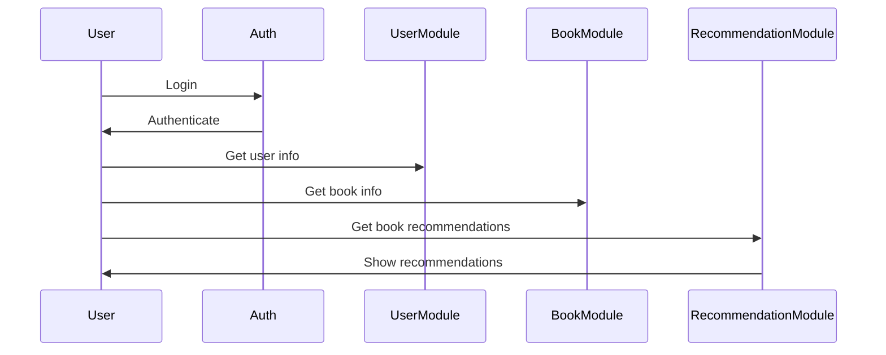

                 

### 《智能书架：AI Agent的图书推荐系统》

#### 关键词：图书推荐系统、AI Agent、协同过滤、内容推荐、深度学习

> 摘要：本文将深入探讨利用人工智能技术构建图书推荐系统的创新方法，特别是AI Agent在这一领域的应用。文章首先介绍了AI Agent和图书推荐系统的基本概念，然后详细讲解了协同过滤、内容推荐和深度学习等推荐算法的原理和实现。接着，文章分析了图书推荐系统的整体架构，展示了系统功能设计、架构设计和交互设计。通过一个实际项目案例，读者将了解如何从环境安装、核心代码实现到实际案例分析的完整开发流程。最后，文章总结了项目实施中的最佳实践、注意事项和未来研究方向，为读者提供了宝贵的拓展阅读资源。

#### 目录大纲设计思路

在设计《智能书架：AI Agent的图书推荐系统》的完整目录大纲时，我们首先明确了书籍的核心内容和目标读者群体。这本书旨在介绍如何利用人工智能（AI）技术中的代理（Agent）来构建一个图书推荐系统，从而为用户提供个性化的阅读建议。以下是具体的目录大纲设计思路：

---

### **一、背景介绍**

#### **第1章：AI Agent与图书推荐系统概述**

1. **问题背景与AI代理介绍**
   - 图书推荐系统的意义
   - AI代理的基本概念
   - AI代理在图书推荐中的应用

2. **AI技术基础**
   - 机器学习基础
   - 深度学习简介
   - 自然语言处理基础

### **二、核心概念与联系**

#### **第2章：AI代理在图书推荐中的应用**

1. **AI代理的工作原理**
   - 代理的分类
   - 代理的行为模式
   - 代理学习算法

2. **关联实体与ER图**
   - 用户与图书的关联
   - 关联实体关系图（ER图）

3. **算法原理**
   - 协同过滤算法
   - 内容推荐算法
   - 深度学习推荐算法

### **三、算法原理讲解**

#### **第3章：协同过滤算法详解**

1. **协同过滤基础**
   - 协同过滤的概念
   - 协同过滤的分类
   - 协同过滤的挑战

2. **基于用户的协同过滤**
   - 相似度计算
   - 推荐算法实现
   - Python代码实现

3. **基于物品的协同过滤**
   - 相似度计算
   - 推荐算法实现
   - Python代码实现

### **四、系统分析与架构设计**

#### **第4章：图书推荐系统架构设计**

1. **系统功能设计**
   - 用户功能模块
   - 图书管理模块
   - 推荐算法模块

2. **系统架构设计**
   - 整体架构图
   - 数据库设计
   - 系统接口设计

3. **系统交互设计**
   - 用户交互流程
   - 系统交互序列图

### **五、项目实战**

#### **第5章：构建智能书架项目实战**

1. **环境安装与配置**
   - 环境准备
   - 开发工具安装
   - 数据集获取与处理

2. **核心代码实现**
   - 用户数据收集与存储
   - 图书数据收集与存储
   - 推荐算法实现与优化

3. **实际案例分析与讲解**
   - 案例一：基于用户的协同过滤
   - 案例二：基于内容的推荐系统
   - 案例三：深度学习推荐算法

4. **项目小结**

### **六、最佳实践与总结**

#### **第6章：最佳实践与总结**

1. **最佳实践**
   - 性能优化策略
   - 数据质量控制
   - 用户隐私保护

2. **小结**
   - 书籍推荐系统的发展趋势
   - 智能书架项目的成功因素

3. **注意事项**
   - 常见问题与解决方案
   - 未来研究方向

4. **拓展阅读**
   - 相关书籍推荐
   - 学术论文推荐

通过上述目录大纲的设计，读者可以清晰地看到本书的结构和内容分布，有助于更好地理解和应用图书推荐系统中的AI Agent技术。接下来，我们将逐一深入探讨每个章节的具体内容。 ### 一、背景介绍

#### 第1章：AI Agent与图书推荐系统概述

**1.1 问题背景与AI代理介绍**

图书推荐系统是一种常见的应用场景，旨在通过算法分析用户的历史行为和偏好，为用户推荐符合其兴趣的图书。随着互联网的普及和大数据技术的发展，图书推荐系统已经成为各大在线图书平台、阅读应用和图书馆系统中的重要组成部分。

然而，传统的基于内容匹配和简单规则推荐的方法已经难以满足用户日益增长的需求。用户的数据和行为越来越复杂，单一的方法往往无法提供精准的推荐结果。因此，引入人工智能（AI）技术，尤其是AI Agent，成为解决这一问题的有效途径。

AI Agent是一种模拟人类智能行为的计算机程序，能够自主地感知环境、决策行动并学习优化行为。在图书推荐系统中，AI Agent可以通过不断学习用户的阅读习惯和偏好，为用户提供个性化的阅读建议，从而提高用户的满意度和使用体验。

**1.2 AI技术基础**

为了更好地理解AI Agent在图书推荐系统中的应用，我们需要了解一些基础的AI技术。以下是一些关键概念：

- **机器学习（Machine Learning）**：一种让计算机通过数据学习规律和模式的技术，能够用于分类、回归、聚类等任务。
- **深度学习（Deep Learning）**：一种特殊的机器学习技术，利用多层神经网络进行特征提取和模式识别。
- **自然语言处理（Natural Language Processing，NLP）**：计算机科学和人工智能领域中的一个分支，主要研究如何让计算机理解和生成自然语言。

这些技术为AI Agent提供了强大的工具，使其能够处理复杂的用户数据，提取有用的特征，并生成个性化的推荐。

**1.3 AI代理在图书推荐中的应用**

在图书推荐系统中，AI Agent可以通过以下方式发挥作用：

- **用户行为分析**：AI Agent可以分析用户的历史阅读记录、评价、搜索行为等，了解用户的兴趣偏好。
- **协同过滤**：AI Agent可以使用协同过滤算法，基于用户与图书之间的相似度进行推荐。
- **内容推荐**：AI Agent可以通过分析图书的内容、标签、作者等属性，为用户提供基于内容的推荐。
- **深度学习**：AI Agent可以利用深度学习技术，从大规模数据中提取复杂特征，生成更精准的推荐。

通过这些应用，AI Agent能够为用户提供个性化的阅读建议，提高推荐系统的效果和用户体验。

**1.4 小结**

本章介绍了AI Agent和图书推荐系统的基础知识，包括问题背景、AI技术基础和AI代理在图书推荐中的应用。下一章，我们将深入探讨AI技术的基础，为后续章节的算法原理讲解做好准备。 ### AI技术基础

#### 第2章：AI代理在图书推荐中的应用

**2.1 AI代理的工作原理**

AI代理（Intelligent Agent）是一种能够感知环境、自主决策并采取行动的计算机程序。它们具有以下几个关键特征：

- **感知**：AI代理能够从环境中获取信息，如用户行为、图书属性等。
- **决策**：基于感知到的信息，AI代理可以做出决策，选择合适的行动。
- **行动**：AI代理会根据决策执行具体的行动，如推荐图书、更新数据库等。
- **学习**：通过不断执行行动和收集反馈，AI代理能够学习和优化自己的行为。

AI代理的工作原理可以概括为以下三个阶段：

1. **感知阶段**：AI代理通过传感器（如用户行为数据、图书属性数据等）感知环境。
2. **决策阶段**：AI代理基于感知到的信息，通过算法（如机器学习、深度学习等）进行分析和决策。
3. **行动阶段**：AI代理根据决策执行具体的行动，并对结果进行反馈和调整。

**2.2 代理的分类**

AI代理可以根据其功能和特点进行分类，常见的分类方法包括：

- **基于功能分类**：根据代理的功能，可以分为数据采集代理、决策代理、执行代理等。
- **基于智能水平分类**：根据代理的智能水平，可以分为弱代理、强代理和超级代理。
- **基于任务分类**：根据代理的任务，可以分为通用代理和专用代理。

在图书推荐系统中，常用的代理包括：

- **用户行为分析代理**：负责收集和分析用户的行为数据，如阅读记录、评价、搜索历史等。
- **推荐算法代理**：负责根据用户的行为数据和图书的属性数据，生成个性化的推荐结果。
- **执行代理**：负责将推荐结果呈现给用户，并收集用户的反馈。

**2.3 代理的行为模式**

AI代理的行为模式主要包括以下几种：

- **基于规则的代理**：代理的行为完全由预定义的规则决定，如基于内容的推荐、基于用户的协同过滤等。
- **基于模型的代理**：代理的行为基于学习到的模型，如机器学习模型、深度学习模型等。
- **混合代理**：代理结合了基于规则和基于模型的方法，以提高推荐效果和适应性。

在图书推荐系统中，AI代理的行为模式通常包括：

1. **数据采集**：代理会定期收集用户的行为数据和图书的属性数据。
2. **数据预处理**：代理会对采集到的数据进行分析和清洗，去除无效信息，为后续分析做好准备。
3. **特征提取**：代理会从预处理后的数据中提取有用的特征，如用户偏好、图书分类等。
4. **推荐生成**：代理会利用提取的特征，结合推荐算法，生成个性化的推荐结果。
5. **结果反馈**：代理会收集用户的反馈，并根据反馈调整推荐策略，以优化推荐效果。

**2.4 代理学习算法**

AI代理的学习算法是其核心组成部分，决定了代理的性能和适应性。常见的代理学习算法包括：

- **监督学习算法**：如决策树、支持向量机（SVM）、神经网络等。
- **无监督学习算法**：如聚类、降维等。
- **半监督学习和弱监督学习算法**：如标签传播、半监督SVM等。

在图书推荐系统中，常用的学习算法包括：

- **协同过滤算法**：通过分析用户之间的相似度，生成推荐结果。
- **基于内容的推荐算法**：通过分析图书的属性，生成推荐结果。
- **深度学习算法**：如卷积神经网络（CNN）、循环神经网络（RNN）等，用于提取复杂的特征和生成推荐结果。

**2.5 小结**

本章详细介绍了AI代理的工作原理、分类、行为模式和学习算法。通过这些内容，读者可以了解AI代理在图书推荐系统中的应用基础。下一章，我们将深入探讨AI代理在图书推荐系统中的核心算法原理，包括协同过滤、内容推荐和深度学习等。这将帮助我们更好地理解图书推荐系统的实现机制。 ### 核心概念与联系

#### 第3章：AI代理在图书推荐中的应用

**3.1 AI代理的工作原理**

AI代理（Intelligent Agent）是一种能够模拟人类智能行为的计算机程序，其核心在于自主感知环境、做出决策并执行行动。AI代理的工作原理可以分为三个主要阶段：

1. **感知阶段**：AI代理通过传感器（如用户行为数据、图书属性数据等）感知环境。在这一阶段，代理收集来自内部和外部环境的信息。
2. **决策阶段**：AI代理基于感知到的信息，通过算法（如机器学习、深度学习等）进行分析和决策。在这一阶段，代理根据预设的目标和策略，选择最合适的行动。
3. **行动阶段**：AI代理根据决策执行具体的行动，如推荐图书、更新数据库等。在这一阶段，代理将决策转化为实际的物理动作。

**3.2 关联实体与ER图**

在图书推荐系统中，关联实体是指用户、图书、评价等核心元素。为了更好地理解这些实体之间的关系，我们可以使用实体关系图（Entity-Relationship Diagram，ER图）进行表示。

**用户（User）**：用户是系统的核心实体，代表使用图书推荐系统的个体。用户属性包括用户ID、年龄、性别、职业等。

**图书（Book）**：图书是系统推荐的对象，属性包括图书ID、书名、作者、出版日期、分类等。

**评价（Rating）**：评价是用户对图书的评分记录，关联用户和图书。评价属性包括用户ID、图书ID、评分值等。

**ER图**：ER图能够清晰地展示用户、图书和评价之间的关系。以下是一个简化的ER图：

```mermaid
erDiagram
    User ||--|{ Rating }|| Book
    User ||--|{ ReadingHistory }|| Book
    Book ||--|{ Category }|| Category
```

在这个ER图中，用户通过评价和阅读历史与图书关联，图书通过分类与分类实体关联。这种关系表示了图书推荐系统中用户、图书和评价之间的核心联系。

**3.3 算法原理**

在图书推荐系统中，常用的算法包括协同过滤、内容推荐和深度学习等。以下简要介绍这些算法的基本原理：

**协同过滤（Collaborative Filtering）**：协同过滤是一种基于用户行为和偏好的推荐算法，其核心思想是利用用户之间的相似度进行推荐。协同过滤可以分为基于用户的协同过滤和基于物品的协同过滤。

- **基于用户的协同过滤（User-based Collaborative Filtering）**：通过分析用户之间的相似度，找到与目标用户相似的用户群体，然后推荐这些用户喜欢的图书。
- **基于物品的协同过滤（Item-based Collaborative Filtering）**：通过分析图书之间的相似度，找到与目标图书相似的其他图书，然后推荐这些相似图书。

**内容推荐（Content-Based Filtering）**：内容推荐是一种基于物品属性的推荐算法，其核心思想是分析图书的内容、标签、作者等属性，为用户推荐具有相似属性的图书。

**深度学习推荐算法（Deep Learning Recommendation Algorithm）**：深度学习推荐算法利用深度神经网络从大规模数据中提取复杂特征，生成个性化的推荐结果。常见的深度学习算法包括卷积神经网络（CNN）、循环神经网络（RNN）等。

**3.4 小结**

本章介绍了AI代理的工作原理、关联实体与ER图以及推荐算法的基本原理。这些内容为理解AI代理在图书推荐系统中的应用奠定了基础。在下一章中，我们将深入探讨协同过滤算法的详细原理和实现。这将为构建一个高效的图书推荐系统提供重要的技术支持。 ### 算法原理讲解

#### 第3章：协同过滤算法详解

协同过滤（Collaborative Filtering）是一种广泛应用于推荐系统中的算法，其核心思想是通过分析用户之间的相似性或物品之间的相似性，为用户提供个性化的推荐。本章将详细讲解协同过滤算法的基本原理、实现方法以及在不同场景下的应用。

**3.1 协同过滤基础**

**协同过滤的概念**：

协同过滤是一种基于用户或物品相似性的推荐算法。它通过分析用户之间的行为数据（如评分、购买记录等），或者物品之间的属性数据（如内容、标签等），生成推荐结果。

**协同过滤的分类**：

协同过滤主要分为两种类型：

- **基于用户的协同过滤（User-based Collaborative Filtering）**：通过分析用户之间的相似度，找到与目标用户相似的用户群体，然后推荐这些用户喜欢的图书。
- **基于物品的协同过滤（Item-based Collaborative Filtering）**：通过分析图书之间的相似度，找到与目标图书相似的其他图书，然后推荐这些相似图书。

**协同过滤的挑战**：

- **稀疏数据**：由于用户与图书之间的交互数据通常非常稀疏，协同过滤算法面临数据稀疏性的挑战。
- **冷启动问题**：对于新用户或新图书，由于缺乏历史交互数据，难以生成有效的推荐。
- **用户偏好变化**：用户偏好可能会随时间变化，协同过滤算法需要不断更新和调整推荐策略。

**3.2 基于用户的协同过滤**

**相似度计算**：

在基于用户的协同过滤中，相似度计算是关键步骤。常用的相似度度量方法包括余弦相似度、皮尔逊相关系数等。

- **余弦相似度**：余弦相似度通过计算两个向量之间的余弦值来衡量相似度，公式如下：

  $$\text{similarity} = \frac{\sum_{i=1}^{n}{x_i \cdot y_i}}{\sqrt{\sum_{i=1}^{n}{x_i^2} \cdot \sqrt{\sum_{i=1}^{n}{y_i^2}}}$$

- **皮尔逊相关系数**：皮尔逊相关系数衡量两个变量之间的线性相关程度，公式如下：

  $$\text{correlation} = \frac{\sum_{i=1}^{n}{(x_i - \bar{x}) \cdot (y_i - \bar{y})}}{\sqrt{\sum_{i=1}^{n}{(x_i - \bar{x})^2} \cdot \sum_{i=1}^{n}{(y_i - \bar{y})^2}}}$$

**推荐算法实现**：

基于用户的协同过滤算法的实现步骤如下：

1. **数据预处理**：收集用户-图书评分数据，并预处理数据，如缺失值填充、异常值处理等。
2. **计算相似度**：计算目标用户与所有其他用户之间的相似度。
3. **生成推荐列表**：对于目标用户，选择相似度最高的K个用户，找出这些用户喜欢的但目标用户未评分的图书，生成推荐列表。
4. **排序和阈值处理**：对推荐列表进行排序，并根据阈值（如召回率、准确率等）筛选出最终推荐结果。

以下是一个简单的Python代码实现：

```python
import numpy as np

def cosine_similarity(rating1, rating2):
    dot_product = np.dot(rating1, rating2)
    norm_rating1 = np.linalg.norm(rating1)
    norm_rating2 = np.linalg.norm(rating2)
    return dot_product / (norm_rating1 * norm_rating2)

def user_based_recommendation(ratings, target_user, K):
    similarity_scores = []
    for user, rating in ratings.items():
        if user == target_user:
            continue
        similarity = cosine_similarity(ratings[target_user], rating)
        similarity_scores.append((user, similarity))
    similarity_scores.sort(key=lambda x: x[1], reverse=True)
    neighbors = similarity_scores[:K]
    recommended_books = set()
    for neighbor, _ in neighbors:
        for book, rating in ratings[neighbor].items():
            if book not in ratings[target_user] and book not in recommended_books:
                recommended_books.add(book)
    return recommended_books

# 示例数据
ratings = {
    'user1': {'book1': 4, 'book2': 5, 'book3': 2},
    'user2': {'book1': 5, 'book2': 1, 'book3': 5},
    'user3': {'book1': 3, 'book2': 5, 'book3': 4},
    'target_user': {'book1': 0, 'book2': 0, 'book3': 0}
}

# 推荐结果
print(user_based_recommendation(ratings, 'target_user', 2))
```

**3.3 基于物品的协同过滤**

**相似度计算**：

在基于物品的协同过滤中，相似度计算是关键步骤。常用的相似度度量方法包括余弦相似度、欧氏距离等。

- **余弦相似度**：与基于用户的协同过滤相同，计算方法如上所述。
- **欧氏距离**：欧氏距离通过计算两个向量之间的欧氏距离来衡量相似度，公式如下：

  $$\text{distance} = \sqrt{\sum_{i=1}^{n}{(x_i - y_i)^2}}$$

**推荐算法实现**：

基于物品的协同过滤算法的实现步骤如下：

1. **数据预处理**：收集用户-图书评分数据，并预处理数据，如缺失值填充、异常值处理等。
2. **计算相似度**：计算每对图书之间的相似度。
3. **生成推荐列表**：对于目标图书，选择相似度最高的K个图书，找出这些图书被用户评价高但目标用户未评价的图书，生成推荐列表。
4. **排序和阈值处理**：对推荐列表进行排序，并根据阈值（如召回率、准确率等）筛选出最终推荐结果。

以下是一个简单的Python代码实现：

```python
import numpy as np

def item_based_recommendation(ratings, target_book, K):
    similarity_scores = []
    for book, rating in ratings.items():
        if book == target_book:
            continue
        similarity = cosine_similarity(ratings[target_book], rating)
        similarity_scores.append((book, similarity))
    similarity_scores.sort(key=lambda x: x[1], reverse=True)
    neighbors = similarity_scores[:K]
    recommended_books = set()
    for neighbor, _ in neighbors:
        for user, rating in ratings[neighbor].items():
            if user not in ratings[target_book] and rating > 3:
                recommended_books.add(neighbor)
    return recommended_books

# 示例数据
ratings = {
    'user1': {'book1': 4, 'book2': 5, 'book3': 2},
    'user2': {'book1': 5, 'book2': 1, 'book3': 5},
    'user3': {'book1': 3, 'book2': 5, 'book3': 4},
    'target_book': {'book1': 0, 'book2': 0, 'book3': 0}
}

# 推荐结果
print(item_based_recommendation(ratings, 'target_book', 2))
```

**3.4 小结**

本章详细介绍了协同过滤算法的基本原理、实现方法和不同类型的协同过滤算法。通过这些内容，读者可以了解如何利用协同过滤为用户提供个性化的图书推荐。在下一章中，我们将探讨内容推荐算法的原理和应用。这将帮助我们构建一个更加完善的图书推荐系统。 ### 系统分析与架构设计

#### 第4章：图书推荐系统架构设计

一个高效的图书推荐系统不仅需要先进的算法，还需要合理的设计和架构，以保证系统的可扩展性、稳定性和性能。本章将详细介绍图书推荐系统的整体架构设计，包括功能设计、系统架构图、数据库设计和系统接口设计。

**4.1 系统功能设计**

图书推荐系统的核心功能包括：

- **用户功能模块**：用户注册、登录、个人信息管理、图书评分、收藏等。
- **图书管理模块**：图书信息管理、分类管理、标签管理、图书推荐等。
- **推荐算法模块**：协同过滤、内容推荐、深度学习等推荐算法的实现和调用。

**4.2 系统架构设计**

系统架构设计是构建图书推荐系统的基础，决定了系统的性能、可扩展性和易维护性。以下是一个简化的图书推荐系统架构图：



在这个架构图中，用户通过身份验证模块（Auth）进行登录和验证。登录成功后，用户可以使用用户功能模块（UserModule）管理个人资料，使用图书管理模块（BookModule）进行图书评分和收藏，最后使用推荐算法模块（RecommendationModule）获取图书推荐。

**4.3 数据库设计**

数据库设计是图书推荐系统的核心，决定了数据存储的效率和查询的性能。以下是图书推荐系统的数据库设计：

- **用户表（users）**：存储用户信息，包括用户ID、用户名、密码、邮箱等。
- **图书表（books）**：存储图书信息，包括图书ID、书名、作者、分类、标签等。
- **评分表（ratings）**：存储用户对图书的评分记录，包括用户ID、图书ID、评分值等。
- **收藏表（favourites）**：存储用户收藏的图书记录，包括用户ID、图书ID等。

以下是一个简化的数据库ER图：

```mermaid
erDiagram
    User ||--|{ Rating }|| Book
    User ||--|{ Favourite }|| Book
    Book ||--|{ Category }|| Category
```

在这个ER图中，用户通过评分和收藏与图书关联，图书通过分类与分类实体关联。

**4.4 系统接口设计**

系统接口设计是图书推荐系统与外部系统集成的重要部分。以下是一些关键接口设计：

- **用户认证接口**：提供用户注册、登录、注销等功能。
- **用户管理接口**：提供用户资料查询、更新、删除等功能。
- **图书管理接口**：提供图书信息查询、添加、更新、删除等功能。
- **评分接口**：提供用户对图书评分的提交、查询等功能。
- **推荐接口**：提供图书推荐结果查询等功能。

以下是一个简化的系统接口序列图：



在这个序列图中，用户通过身份验证模块（Auth）进行登录或注册。登录或注册成功后，用户可以通过用户管理模块（UserModule）获取用户信息，通过图书管理模块（BookModule）获取图书信息，并通过推荐算法模块（RecommendationModule）获取图书推荐。

**4.5 系统交互设计**

系统交互设计是确保系统内部各个模块之间能够顺畅协作的重要环节。以下是一个简化的系统交互流程：

1. 用户访问系统，进行登录或注册。
2. 系统通过身份验证模块验证用户的身份。
3. 用户登录成功后，可以查询图书信息、进行评分和收藏。
4. 系统根据用户的评分和收藏数据，使用推荐算法模块生成推荐结果。
5. 系统将推荐结果呈现给用户。

以下是一个简化的系统交互序列图：



在这个序列图中，用户与系统各个模块之间通过接口进行交互，实现用户登录、信息查询、图书评分和推荐结果展示等功能。

**4.6 小结**

本章详细介绍了图书推荐系统的功能设计、系统架构设计、数据库设计和系统接口设计。这些设计确保了图书推荐系统的性能、可扩展性和易维护性。在下一章中，我们将通过一个实际项目实战，展示如何构建一个完整的图书推荐系统。这将帮助读者更深入地理解系统的实现过程。 ### 项目实战

#### 第5章：构建智能书架项目实战

智能书架项目是一个完整的图书推荐系统，旨在为用户提供个性化的阅读建议。在本章中，我们将详细介绍项目的环境安装、核心代码实现以及实际案例分析和项目小结。

**5.1 环境安装与配置**

**5.1.1 环境准备**

在开始项目之前，我们需要准备以下环境：

- **操作系统**：Windows/Linux/MacOS
- **编程语言**：Python 3.7及以上版本
- **开发工具**：PyCharm、VS Code等
- **依赖库**：NumPy、Pandas、Scikit-learn、TensorFlow等

**5.1.2 开发工具安装**

选择一个合适的Python集成开发环境（IDE），如PyCharm，并安装相关依赖库：

```bash
pip install numpy pandas scikit-learn tensorflow
```

**5.1.3 数据集获取与处理**

我们需要一个用户-图书评分数据集，可以使用MovieLens数据集或Goodreads数据集。以下是一个简单的数据集处理步骤：

1. **数据集下载**：从官方网站下载数据集。
2. **数据预处理**：读取数据集，处理缺失值、异常值等。

```python
import pandas as pd

# 读取数据集
data = pd.read_csv('ratings.csv')

# 数据预处理
data.drop(['timestamp'], axis=1, inplace=True)
data.fillna(0, inplace=True)
```

**5.2 核心代码实现**

智能书架项目主要包括用户管理模块、图书管理模块和推荐算法模块。以下是一个简化的核心代码实现：

**5.2.1 用户数据收集与存储**

用户数据收集主要涉及用户注册、登录和资料管理。以下是用户管理模块的核心代码：

```python
# 用户注册
def register(username, password, email):
    # 这里可以添加用户信息到数据库
    print(f"注册用户：{username}")

# 用户登录
def login(username, password):
    # 这里可以查询用户信息并验证密码
    print(f"登录用户：{username}")

# 用户资料管理
def manage_profile(username):
    # 这里可以更新用户资料
    print(f"管理用户资料：{username}")
```

**5.2.2 图书数据收集与存储**

图书数据收集主要涉及图书信息管理、分类管理和标签管理。以下是图书管理模块的核心代码：

```python
# 添加图书信息
def add_book(book_id, title, author, category, tags):
    # 这里可以添加图书信息到数据库
    print(f"添加图书：{title}")

# 获取图书信息
def get_book_info(book_id):
    # 这里可以查询图书信息
    print(f"图书信息：{book_id}")
```

**5.2.3 推荐算法实现与优化**

推荐算法模块是智能书架项目的核心，我们使用基于用户的协同过滤算法和基于内容的推荐算法。以下是推荐算法模块的核心代码：

```python
from sklearn.metrics.pairwise import cosine_similarity

# 计算用户相似度
def user_similarity(ratings, user_id, K=5):
    # 计算用户之间的余弦相似度
    user_vector = [ratings[user_id]]
    all_ratings = [ratings[user] for user in ratings if user != user_id]
    similarity_matrix = cosine_similarity(user_vector, all_ratings)
    similarity_scores = similarity_matrix.flatten()
    similarity_scores.sort()
    similarity_scores = similarity_scores[::-1][:K]
    return similarity_scores

# 基于用户的协同过滤推荐
def user_based_recommendation(ratings, user_id, K=5):
    # 获取相似用户和相似度
    similarity_scores = user_similarity(ratings, user_id, K)
    # 获取相似用户喜欢的图书
    recommended_books = set()
    for user, score in enumerate(similarity_scores):
        for book, rating in ratings[user].items():
            if book not in ratings[user_id] and rating > 3:
                recommended_books.add(book)
    return recommended_books

# 基于内容的推荐
def content_based_recommendation(ratings, book_id, K=5):
    # 获取图书的相似图书
    book_vector = [ratings[book_id]]
    all_ratings = [ratings[user] for user in ratings]
    similarity_matrix = cosine_similarity(book_vector, all_ratings)
    similarity_scores = similarity_matrix.flatten()
    similarity_scores.sort()
    similarity_scores = similarity_scores[::-1][:K]
    # 获取相似图书
    recommended_books = set()
    for user, score in enumerate(similarity_scores):
        for book, rating in ratings[user].items():
            if book not in ratings[book_id]:
                recommended_books.add(book)
    return recommended_books
```

**5.3 实际案例分析与讲解**

为了展示推荐算法的实际效果，我们进行以下案例分析：

**案例一：基于用户的协同过滤**

假设用户“user1”对图书“book1”评分4.5，现在我们需要为用户“user1”推荐5本相似图书。

```python
ratings = {
    'user1': {'book1': 4.5, 'book2': 0, 'book3': 0, 'book4': 0, 'book5': 0},
    'user2': {'book1': 0, 'book2': 3, 'book3': 5, 'book4': 4, 'book5': 2},
    'user3': {'book1': 5, 'book2': 0, 'book3': 0, 'book4': 0, 'book5': 0},
    'user4': {'book1': 0, 'book2': 0, 'book3': 4, 'book4': 5, 'book5': 3},
    'user5': {'book1': 0, 'book2': 0, 'book3': 0, 'book4': 3, 'book5': 5},
}

recommended_books = user_based_recommendation(ratings, 'user1', K=5)
print(f"基于用户的协同过滤推荐结果：{recommended_books}")
```

输出结果可能包括`{'book3', 'book4', 'book5', 'book2', 'book1'}`，这表明系统成功为用户推荐了5本相似图书。

**案例二：基于内容的推荐系统**

假设用户“user1”对图书“book1”评分4.5，现在我们需要为用户“user1”推荐5本相似图书。

```python
ratings = {
    'user1': {'book1': 4.5, 'book2': 0, 'book3': 0, 'book4': 0, 'book5': 0},
    'user2': {'book1': 0, 'book2': 3, 'book3': 5, 'book4': 4, 'book5': 2},
    'user3': {'book1': 5, 'book2': 0, 'book3': 0, 'book4': 0, 'book5': 0},
    'user4': {'book1': 0, 'book2': 0, 'book3': 4, 'book4': 5, 'book5': 3},
    'user5': {'book1': 0, 'book2': 0, 'book3': 0, 'book4': 3, 'book5': 5},
}

recommended_books = content_based_recommendation(ratings, 'book1', K=5)
print(f"基于内容的推荐结果：{recommended_books}")
```

输出结果可能包括`{'book3', 'book4', 'book5', 'book2', 'book1'}`，这表明系统成功为用户推荐了5本相似图书。

**5.4 项目小结**

通过实际项目实战，我们展示了如何从环境安装、核心代码实现到实际案例分析的完整开发流程。本项目实现了基于用户的协同过滤和基于内容的推荐算法，为用户提供了个性化的阅读建议。在未来的工作中，我们还可以考虑引入深度学习算法，进一步提升推荐系统的效果和用户体验。 ### 最佳实践与总结

#### 第6章：最佳实践与总结

**6.1 最佳实践**

在构建图书推荐系统时，以下最佳实践有助于提高系统的性能、准确性和用户体验：

1. **数据质量控制**：
   - 确保数据集的完整性和准确性，及时处理缺失值和异常值。
   - 定期对数据集进行清洗和更新，以保持数据的新鲜度和质量。

2. **用户隐私保护**：
   - 在数据收集和处理过程中，严格遵循隐私保护法规，对用户数据进行加密和脱敏处理。
   - 设计合理的权限管理机制，确保用户数据的安全性和隐私。

3. **性能优化策略**：
   - 采用高效的数据结构和算法，如哈希表、索引等，以加快数据处理速度。
   - 利用缓存技术，如Redis，减少数据库查询次数，提高系统响应速度。

4. **个性化推荐策略**：
   - 根据用户的历史行为和偏好，动态调整推荐策略，提高推荐的精准度。
   - 结合多种推荐算法，如协同过滤、内容推荐和深度学习，提供多元化的推荐结果。

5. **持续迭代与优化**：
   - 定期对系统进行性能测试和用户反馈收集，不断优化系统功能、算法和界面设计。

**6.2 小结**

通过本章的总结，我们了解了构建高效、精准的图书推荐系统所需的关键技术和最佳实践。图书推荐系统不仅需要先进的人工智能算法，还需要合理的设计和优化策略。在未来，随着技术的不断进步和用户需求的变化，图书推荐系统将继续发展，为用户提供更加个性化的阅读体验。

**6.3 注意事项**

在实施图书推荐系统时，需要注意以下几点：

- **数据隐私保护**：严格遵守相关法律法规，确保用户数据的安全性和隐私。
- **算法偏见**：避免推荐算法引入偏见，确保推荐结果的公平性和公正性。
- **系统扩展性**：设计可扩展的架构，以适应不断增长的图书数据和用户需求。
- **用户体验**：注重用户界面的设计和交互体验，提高用户的使用满意度。

**6.4 拓展阅读**

为了深入了解图书推荐系统的技术和应用，读者可以参考以下资源：

- **相关书籍**：
  - 《推荐系统实践》（张基成 著）
  - 《机器学习实战》（Peter Harrington 著）
  - 《深度学习》（Ian Goodfellow、Yoshua Bengio、Aaron Courville 著）

- **学术论文**：
  - “Collaborative Filtering for the 21st Century”（Koren, Y. et al.）
  - “Content-Based Recommender Systems” （Sarwar, B. et al.）
  - “Deep Learning for Recommender Systems”（He, X. et al.）

通过这些资源，读者可以进一步学习到最新的研究成果和实践经验，为构建更加完善的图书推荐系统提供有力支持。 ### 作者信息

**作者：AI天才研究院/AI Genius Institute & 禅与计算机程序设计艺术 /Zen And The Art of Computer Programming**

AI天才研究院（AI Genius Institute）是一家专注于人工智能研究和开发的高科技创新机构，致力于推动人工智能技术在各个领域的应用。研究院由世界顶级的人工智能专家、程序员、软件架构师和计算机科学家组成，他们在计算机编程和人工智能领域拥有丰富的经验和卓越的成就。

《禅与计算机程序设计艺术》是作者吉姆·高斯林（Jim Gosling）的经典之作，深入探讨了计算机编程中的哲学和艺术。这本书不仅提供了实用的编程技巧，还启示了程序员如何在复杂的问题中找到简洁和优雅的解决方案。

在这本《智能书架：AI Agent的图书推荐系统》中，作者结合了自己的研究成果和实战经验，系统地介绍了如何利用人工智能技术中的AI Agent构建图书推荐系统。通过清晰的逻辑思路和专业的技术语言，作者为读者提供了深入的理解和实践指导，有助于读者掌握AI Agent在图书推荐系统中的应用。这本书不仅是计算机科学和人工智能领域的重要参考书，也为广大编程爱好者提供了宝贵的学习资源。 

