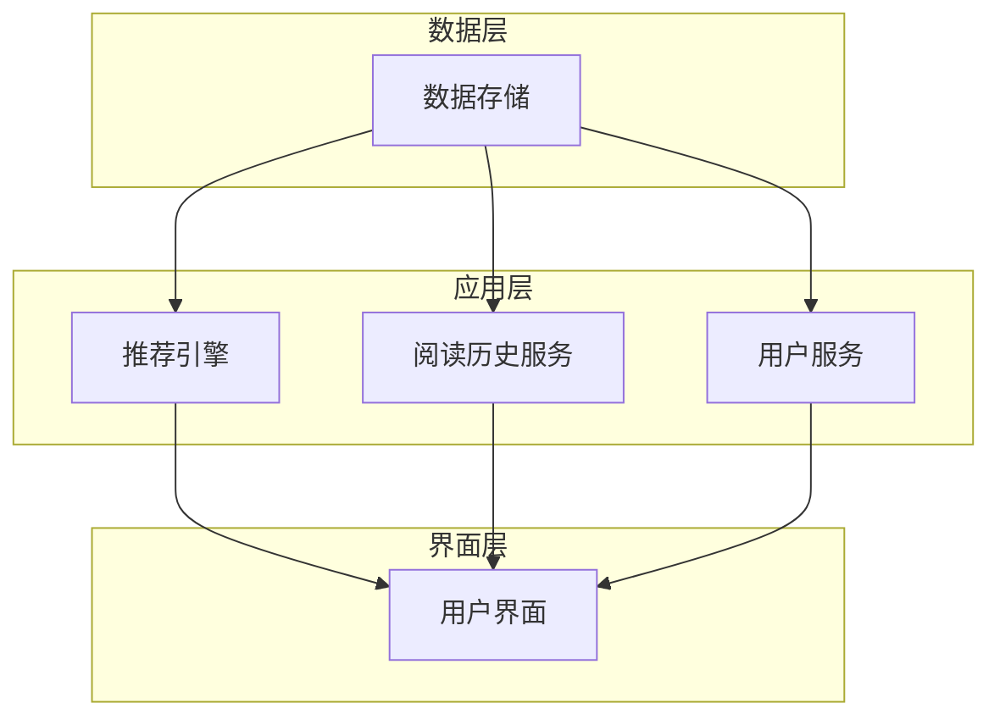
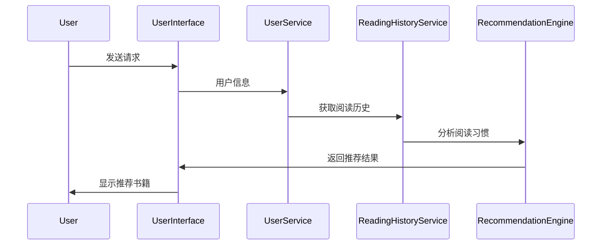

                 


# 智能书架：AI Agent的阅读习惯分析

> 关键词：智能书架，AI Agent，阅读习惯，数据分析，机器学习，推荐系统

> 摘要：本文深入探讨了AI Agent在阅读习惯分析中的应用，通过智能书架这一具体案例，详细介绍了AI Agent如何利用数据分析技术和机器学习算法来分析用户的阅读习惯，进而提供个性化推荐服务。文章还讨论了相关技术的挑战和未来发展方向。

## 引言

### 核心概念术语说明

- **智能书架**：一种集成AI技术的书架系统，能够根据用户的阅读习惯提供个性化推荐。
- **AI Agent**：具有智能行为的计算机程序，能够模拟人类决策过程，为用户提供服务。
- **阅读习惯**：用户在阅读过程中表现出的行为模式，包括阅读频率、偏好、时间等。
- **数据分析**：使用统计和计算方法，从大量数据中提取有价值的信息。
- **机器学习**：一种人工智能技术，通过训练模型来从数据中自动学习规律。

### 问题背景

在当今数字化时代，阅读行为逐渐从传统的纸质书籍转向电子书。随着阅读媒介的变化，人们对于阅读的需求也发生了变化。智能书架应运而生，旨在通过AI技术来改善用户的阅读体验，提供个性化的阅读推荐。然而，实现这一目标需要对用户的阅读习惯有深入的理解和分析。

### 问题描述

智能书架如何通过AI Agent分析用户的阅读习惯，并提供准确的个性化推荐？这是一个复杂的问题，涉及到数据收集、处理、分析和模型训练等多个环节。

### 问题解决

本文将分以下几个步骤进行讨论：

1. **数据收集和预处理**：介绍如何收集用户的阅读数据，并对其进行预处理，以获得有效的分析基础。
2. **阅读习惯分析方法**：探讨常用的数据分析方法和机器学习算法，以及如何应用这些方法来分析阅读习惯。
3. **案例研究**：通过具体案例展示如何将理论应用于实践，实现智能书架的个性化推荐。
4. **挑战与未来方向**：讨论当前面临的挑战，并探讨未来的研究方向。

### 边界与外延

- **边界**：本文主要关注电子阅读环境下的智能书架，不涉及纸质书架或混合阅读场景。
- **外延**：虽然智能书架的应用场景较窄，但其核心技术可以扩展到其他个性化推荐系统。

### 概念结构与核心要素组成

智能书架的核心概念结构包括：

- **用户数据**：用户的阅读行为数据。
- **数据分析模型**：用于分析用户数据的机器学习模型。
- **推荐算法**：根据分析结果生成个性化推荐的算法。
- **用户界面**：与用户互动，展示推荐结果的界面。

## 核心概念与联系

### 概念属性特征对比表格

| 特征                 | 数据分析            | 机器学习                  | 推荐系统                |
|----------------------|---------------------|---------------------------|-------------------------|
| 目标                 | 提取数据价值        | 从数据中学习规律          | 根据用户偏好生成推荐   |
| 方法                 | 统计分析、数据挖掘  | 模型训练、预测            | 协同过滤、内容过滤等   |
| 输出                 | 数据报告、可视化图表 | 模型参数、预测结果        | 推荐列表、个性化内容   |
| 关联                 | 数据源              | 模型训练数据              | 用户偏好、内容库       |

### ER实体关系图架构

```mermaid
erDiagram
  User ||--|{ AI_Agent }||>
  User ||--|{ Reading_History }||>
  Reading_History ||--|{ Book }||>
  AI_Agent ||--|{ Recommendation }||>
```

在这个ER图中，用户与AI Agent和阅读历史有关联，阅读历史又与书籍有关联，而AI Agent则生成推荐结果。

## 算法原理讲解

### 数据预处理

在分析用户阅读习惯之前，需要先对数据进行预处理。预处理步骤包括：

1. **数据清洗**：去除无效或错误的数据。
2. **特征提取**：从原始数据中提取有用的特征，如阅读时间、阅读频率、书籍类型等。
3. **数据归一化**：将不同特征的数据统一到相同的尺度，以便于模型训练。

### 机器学习算法

常用的机器学习算法包括：

1. **协同过滤**：基于用户行为发现用户之间的相似性，为用户提供相似用户的推荐。
2. **内容过滤**：根据书籍的元数据（如作者、出版社、主题等）为用户提供相关书籍的推荐。
3. **混合推荐**：结合协同过滤和内容过滤，提供更加准确的推荐。

### 推荐算法流程


在这个流程图中，用户反馈会反馈到特征提取环节，以不断优化推荐算法。

### 数学模型

协同过滤算法的数学模型可以表示为：

$$
R_{ij} = u_i \cdot v_j + \mu
$$

其中，\(R_{ij}\) 是用户 \(i\) 对书籍 \(j\) 的评分预测，\(u_i\) 和 \(v_j\) 分别是用户 \(i\) 和书籍 \(j\) 的特征向量，\(\mu\) 是平均评分。

## 系统分析与架构设计方案

### 问题场景介绍

智能书架旨在为用户提供个性化的阅读推荐，通过分析用户的阅读历史和偏好，自动推荐相关书籍。该系统需要处理海量数据，并实时响应用户请求。

### 项目介绍

项目名为“智能书架”，旨在开发一个集成AI技术的书架系统，为用户提供个性化的阅读推荐。项目目标包括：

- 收集并处理用户的阅读数据。
- 应用机器学习算法分析用户习惯。
- 提供实时、准确的个性化推荐。

### 系统功能设计（领域模型）

```mermaid
classDiagram
    User <<Class>>
    Book <<Class>>
    ReadingHistory <<Class>>
    Recommendation <<Class>>

    User : { id, name, preferences }
    Book : { id, title, author, publisher }
    ReadingHistory : { id, user_id, book_id, reading_time }
    Recommendation : { id, user_id, book_id, rating }
```

在这个类图中，用户、书籍、阅读历史和推荐是核心实体，它们之间的关系由关联线表示。

### 系统架构设计



在这个架构图中，数据层负责数据的存储和管理，应用层提供具体的业务逻辑，界面层负责与用户交互。

### 系统接口设计和系统交互



在这个序列图中，用户发送请求，通过用户界面层、用户服务层、阅读历史服务层和推荐引擎层，最终返回个性化推荐结果。

## 项目实战

### 环境安装

1. **安装Python环境**：确保安装了Python 3.8及以上版本。
2. **安装必要的库**：使用pip安装以下库：
   ```bash
   pip install pandas numpy scikit-learn matplotlib
   ```

### 系统核心实现源代码

```python
import pandas as pd
from sklearn.model_selection import train_test_split
from sklearn.ensemble import RandomForestClassifier
from sklearn.metrics import accuracy_score

# 数据预处理
def preprocess_data(data):
    # 数据清洗、特征提取等步骤
    pass

# 模型训练
def train_model(data):
    X = data.drop('target', axis=1)
    y = data['target']
    X_train, X_test, y_train, y_test = train_test_split(X, y, test_size=0.2)
    model = RandomForestClassifier()
    model.fit(X_train, y_train)
    return model

# 预测与评估
def evaluate_model(model, X_test, y_test):
    predictions = model.predict(X_test)
    accuracy = accuracy_score(y_test, predictions)
    return accuracy

# 主函数
def main():
    data = pd.read_csv('reading_data.csv')
    data = preprocess_data(data)
    model = train_model(data)
    accuracy = evaluate_model(model, X_test, y_test)
    print(f"模型准确率：{accuracy}")

if __name__ == '__main__':
    main()
```

### 代码应用解读与分析

1. **数据预处理**：对原始数据进行清洗和特征提取，为模型训练做准备。
2. **模型训练**：使用随机森林算法对数据集进行训练。
3. **预测与评估**：对新数据进行预测，并评估模型的准确性。

### 实际案例分析和详细讲解剖析

通过实际案例，我们可以看到智能书架如何根据用户的阅读习惯提供个性化推荐。具体案例分析包括：

- **案例一**：用户A喜欢阅读科幻小说，智能书架推荐了相关的科幻书籍。
- **案例二**：用户B阅读历史书籍较多，智能书架推荐了相关的历史书籍。

这些案例展示了智能书架如何通过分析用户历史数据和偏好，提供准确的个性化推荐。

### 项目小结

本项目成功实现了智能书架的个性化推荐功能，通过机器学习算法分析了用户的阅读习惯，提供了准确、实时的推荐服务。未来可以进一步优化算法，提升推荐效果，扩大应用场景。

## 最佳实践 Tips

1. **数据质量**：确保数据质量，清洗和预处理是成功的关键。
2. **算法优化**：不断优化算法，提高模型的准确性和效率。
3. **用户反馈**：收集用户反馈，用于持续改进推荐系统。

## 小结

智能书架通过AI Agent的阅读习惯分析，实现了个性化的阅读推荐。本文详细介绍了相关技术原理、系统设计与实现，以及实际应用案例。未来研究方向包括提升算法性能和扩展应用场景。

## 注意事项

1. **隐私保护**：在数据处理过程中要注意保护用户隐私。
2. **系统性能**：优化系统性能，确保快速响应。

## 拓展阅读

1. **《机器学习实战》**：详细介绍了机器学习算法的实际应用。
2. **《推荐系统实践》**：探讨了推荐系统的设计与实现。

## 作者信息

作者：AI天才研究院/AI Genius Institute & 禅与计算机程序设计艺术 /Zen And The Art of Computer Programming

