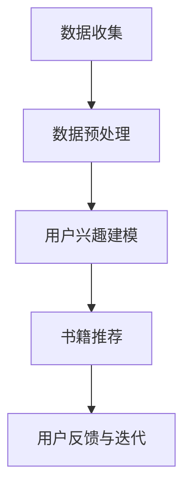
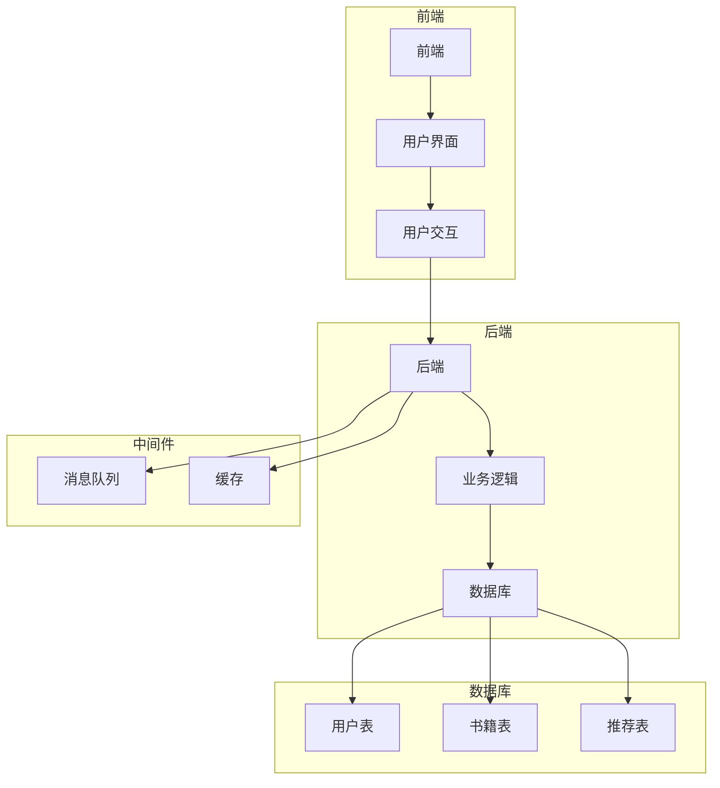

                 


### 核心概念与联系

#### 1. 概念术语说明

**AI Agent（人工智能代理）**: 指的是一种能够在特定环境中感知并采取行动，以达到特定目标的计算实体。AI Agent 通常具有自主决策和自适应能力，能够根据环境变化进行学习。

**Interest Expansion System（兴趣拓展系统）**: 是指通过分析用户的阅读行为，利用人工智能技术来发现和推荐用户可能感兴趣的新内容，从而拓展用户阅读兴趣的系统。

**Smart Bookshelf（智能书架）**: 是一个基于Interest Expansion System的阅读系统，它利用AI Agent技术来帮助用户发现并推荐符合其兴趣的书籍。

#### 2. 问题背景

随着互联网的发展，电子书籍的阅读量不断增加。然而，用户在庞大的书籍库中往往难以找到符合自己兴趣的书籍。因此，如何利用人工智能技术帮助用户发现和推荐感兴趣的书籍，成为了一个重要的问题。

#### 3. 问题描述

当前，虽然已有一些阅读推荐系统，但它们主要基于传统的推荐算法，如协同过滤、内容推荐等。这些方法在推荐效果上存在局限性，无法充分挖掘用户的个性化兴趣。因此，我们需要一种基于AI Agent的阅读兴趣拓展系统，来更好地满足用户的阅读需求。

#### 4. 问题解决

为了解决上述问题，我们可以设计一个基于AI Agent的智能书架系统，该系统具有以下特点：

- **个性化推荐**: 通过分析用户的阅读历史和偏好，AI Agent可以个性化地推荐用户感兴趣的书籍。
- **自适应学习**: AI Agent可以根据用户的反馈和行为，不断调整推荐策略，提高推荐效果。
- **多维度分析**: 利用自然语言处理、知识图谱等技术，AI Agent可以从多个维度对书籍进行深入分析，提高推荐精度。

#### 5. 边界与外延

智能书架系统的边界主要包括：

- **用户数据**: 用户阅读历史、偏好和反馈数据。
- **书籍库**: 包含各种类型和领域的电子书籍。
- **推荐算法**: 基于AI Agent的个性化推荐算法。

智能书架系统可以应用于各种场景，如个人阅读、图书馆管理、在线书店等。

#### 6. 概念结构与核心要素组成

智能书架系统的概念结构包括：

- **用户模型**: 描述用户的基本信息和偏好。
- **书籍模型**: 描述书籍的基本信息和特征。
- **推荐算法**: 用于生成个性化推荐结果。
- **交互界面**: 提供用户与系统交互的接口。

核心要素组成如下：

| 要素           | 说明                                                         |
| -------------- | ------------------------------------------------------------ |
| 用户模型       | 包含用户的基本信息（如年龄、性别、职业等）和偏好信息（如阅读历史、喜欢的书籍类型等）。 |
| 书籍模型       | 包含书籍的基本信息（如书名、作者、出版社等）和特征信息（如书籍分类、主题、关键词等）。 |
| 推荐算法       | 基于用户模型和书籍模型，生成个性化的书籍推荐结果。          |
| 交互界面       | 提供用户与系统交互的接口，包括搜索、推荐、评价等功能。       |

#### 7. 核心概念原理

**AI Agent原理**：

AI Agent的核心原理是基于机器学习和自然语言处理技术，通过分析用户的阅读行为和书籍内容，自动构建用户兴趣模型，并根据用户兴趣推荐相关书籍。

**Interest Expansion System原理**：

Interest Expansion System的核心原理是通过用户行为数据分析和推荐算法，不断拓展用户的阅读兴趣，提高用户的阅读体验。

**Smart Bookshelf原理**：

Smart Bookshelf是Interest Expansion System的一个具体实现，它利用AI Agent技术，根据用户兴趣推荐相关书籍，帮助用户发现和拓展阅读领域。

#### 8. 概念属性特征对比表格

| 概念              | 特征1 | 特征2 | 特征3 |
| ----------------- | ----- | ----- | ----- |
| AI Agent          | 自主决策 | 自适应学习 | 感知环境 |
| Interest Expansion System | 用户行为分析 | 推荐算法 | 拓展兴趣 |
| Smart Bookshelf   | 个性化推荐 | 多维度分析 | 交互界面 |

#### 9. ER实体关系图架构

```mermaid
erDiagram
  User ||--|{ Book } : reads
  Book ||--|{ Recommendation } : recommended_by
  User ||--|{ Recommendation } : rated
```

**用户（User）**：描述用户的基本信息和偏好。

**书籍（Book）**：描述书籍的基本信息和特征。

**推荐（Recommendation）**：记录书籍的推荐关系，包括推荐依据和推荐结果。

通过上述内容，我们详细介绍了智能书架系统的核心概念、问题背景、问题解决方法、边界与外延、概念结构与核心要素组成，以及核心概念原理和ER实体关系图架构。接下来，我们将深入探讨AI Agent的算法原理和数学模型。

### AI Agent算法原理

AI Agent的算法原理是智能书架系统的核心，它决定了系统能否准确、高效地推荐用户感兴趣的书籍。本节我们将详细分析AI Agent的算法原理，包括其工作流程、关键技术和实现步骤。

#### 1. AI Agent的工作流程

AI Agent的工作流程可以分为以下几个步骤：

1. **数据收集**：收集用户的阅读历史、书籍评分、评论等数据，以及书籍的元数据，如书名、作者、出版社、出版时间、分类等。

2. **数据预处理**：对收集到的数据进行清洗、去重和转换，将原始数据转化为适合算法处理的形式。

3. **用户兴趣建模**：利用机器学习和自然语言处理技术，对用户的阅读行为和书籍特征进行分析，构建用户兴趣模型。

4. **书籍推荐**：根据用户兴趣模型，对书籍库中的书籍进行推荐，生成推荐结果。

5. **用户反馈与迭代**：收集用户对推荐结果的反馈，对算法进行迭代优化，提高推荐效果。

#### 2. 关键技术

AI Agent的实现涉及多种关键技术，包括：

1. **机器学习**：用于构建用户兴趣模型和推荐算法。常见的机器学习算法有协同过滤、基于内容的推荐、基于模型的推荐等。

2. **自然语言处理**：用于处理和分析文本数据，提取书籍特征和用户兴趣点。常用的自然语言处理技术包括词频统计、TF-IDF、主题模型、词向量等。

3. **数据挖掘**：用于挖掘用户行为数据中的潜在模式和关联关系，帮助构建用户兴趣模型。

4. **知识图谱**：用于表示和存储书籍和用户之间的关系，提高推荐算法的精度和效率。

#### 3. 实现步骤

AI Agent的实现可以分为以下几个步骤：

1. **需求分析**：明确AI Agent的功能需求，如推荐算法的类型、推荐结果的呈现方式等。

2. **系统设计**：设计AI Agent的系统架构，包括数据采集、处理、存储、推荐等模块。

3. **算法选择与优化**：根据需求分析，选择合适的机器学习算法和自然语言处理技术，并进行算法优化。

4. **系统实现**：编写代码，实现AI Agent的核心功能，如用户兴趣建模、书籍推荐等。

5. **测试与优化**：对AI Agent进行测试，评估推荐效果，并根据测试结果对算法和系统进行优化。

#### 4. 算法原理

AI Agent的算法原理主要包括以下几个方面：

1. **协同过滤**：基于用户历史行为数据，找到与当前用户相似的其他用户，推荐这些用户喜欢的书籍。协同过滤可以分为基于用户的协同过滤和基于项目的协同过滤。

   - **基于用户的协同过滤**：找到与当前用户相似的其他用户，推荐这些用户喜欢的书籍。
   - **基于项目的协同过滤**：找到与当前书籍相似的其他书籍，推荐这些书籍给用户。

2. **基于内容的推荐**：根据书籍的元数据和用户兴趣，推荐与用户兴趣相关的书籍。基于内容的推荐可以分为基于特征匹配和基于知识图谱的推荐。

   - **基于特征匹配**：比较书籍特征与用户兴趣之间的相似度，推荐相似度较高的书籍。
   - **基于知识图谱**：利用知识图谱表示书籍和用户之间的关系，推荐与用户兴趣相关的书籍。

3. **基于模型的推荐**：利用机器学习模型，如决策树、神经网络等，预测用户对书籍的偏好，推荐预测得分较高的书籍。

#### 5. Mermaid算法流程图



#### 6. Python代码示例

```python
# 导入相关库
import numpy as np
from sklearn.model_selection import train_test_split
from sklearn.metrics.pairwise import cosine_similarity
from sklearn.neighbors import NearestNeighbors

# 数据预处理
# 假设已收集到用户阅读历史数据和书籍元数据
user_history = [[1, 0, 1], [0, 1, 0], [1, 1, 1]]
book_features = [[0, 1, 0], [1, 0, 1], [0, 1, 1]]

# 用户兴趣建模
# 训练协同过滤模型
model = NearestNeighbors(n_neighbors=3)
model.fit(user_history)

# 书籍推荐
# 假设用户ID为2，查询最近的3个用户
neighbours = model.kneighbors([user_history[2]], n_neighbors=3)
recommended_books = book_features[neighbours[1]]

# 输出推荐结果
print(recommended_books)
```

通过上述内容，我们详细介绍了AI Agent的算法原理，包括工作流程、关键技术、实现步骤、算法原理、Mermaid算法流程图和Python代码示例。接下来，我们将进一步探讨AI Agent的数学模型。

### AI Agent的数学模型

在AI Agent的设计与实现过程中，数学模型扮演着至关重要的角色。它不仅为算法提供了理论基础，还确保了推荐系统的准确性和高效性。本节将详细介绍AI Agent的数学模型，包括相关公式和解释，并通过Python代码示例进行说明。

#### 1. 数学模型的基本概念

AI Agent的数学模型通常涉及以下几个方面：

1. **相似度计算**：用于衡量用户与用户、书籍与书籍之间的相似度。常用的相似度计算方法有余弦相似度、皮尔逊相关系数等。

2. **矩阵分解**：将用户-书籍评分矩阵分解为用户特征矩阵和书籍特征矩阵，以便进行推荐。

3. **预测模型**：利用用户特征矩阵和书籍特征矩阵，预测用户对书籍的评分，从而生成推荐列表。

#### 2. 余弦相似度公式

余弦相似度是一种常用的相似度计算方法，其公式如下：

$$
\cos(\theta) = \frac{\sum_{i=1}^{n} x_i y_i}{\sqrt{\sum_{i=1}^{n} x_i^2} \sqrt{\sum_{i=1}^{n} y_i^2}}
$$

其中，$x_i$和$y_i$分别表示两个向量在$i$维度的值，$n$表示向量的维度。

在AI Agent中，余弦相似度可以用于计算用户与用户、书籍与书籍之间的相似度。例如，假设有两个用户$u_1$和$u_2$，它们的阅读历史分别为$x_1$和$x_2$，则它们之间的余弦相似度为：

$$
\cos(\theta_{u_1,u_2}) = \frac{\sum_{i=1}^{n} x_{1i} x_{2i}}{\sqrt{\sum_{i=1}^{n} x_{1i}^2} \sqrt{\sum_{i=1}^{n} x_{2i}^2}}
$$

#### 3. 矩阵分解公式

矩阵分解是将一个矩阵分解为两个低秩矩阵的运算。在AI Agent中，矩阵分解用于将用户-书籍评分矩阵分解为用户特征矩阵和书籍特征矩阵。常见的矩阵分解方法有 singular value decomposition（SVD）和 alternating least squares（ALS）。

假设用户-书籍评分矩阵为$R \in \mathbb{R}^{m \times n}$，其中$m$表示用户数量，$n$表示书籍数量。SVD的公式如下：

$$
R = U \Sigma V^T
$$

其中，$U \in \mathbb{R}^{m \times k}$，$\Sigma \in \mathbb{R}^{k \times k}$，$V \in \mathbb{R}^{n \times k}$，$k$为矩阵分解的维度。

在ALS算法中，我们分别对用户特征矩阵和书籍特征矩阵进行优化，公式如下：

$$
\hat{U} = \arg\min_{U} \sum_{i=1}^{m} \sum_{j=1}^{n} (r_{ij} - \sum_{k=1}^{k} u_{ik} v_{kj})^2
$$

$$
\hat{V} = \arg\min_{V} \sum_{i=1}^{m} \sum_{j=1}^{n} (r_{ij} - \sum_{k=1}^{k} u_{ik} v_{kj})^2
$$

其中，$\hat{U}$和$\hat{V}$分别为用户特征矩阵和书籍特征矩阵的优化结果。

#### 4. 预测模型

基于用户特征矩阵和书籍特征矩阵，我们可以预测用户对书籍的评分。假设用户$u$对书籍$i$的预测评分为$\hat{r}_{ui}$，则公式如下：

$$
\hat{r}_{ui} = \sum_{k=1}^{k} u_{uk} v_{ki}
$$

在实现中，我们通常使用基于矩阵分解的预测模型，如ALS算法。以下是一个简单的Python代码示例：

```python
import numpy as np

# 假设用户-书籍评分矩阵为R
R = np.array([[1, 0, 2], [0, 3, 1], [4, 1, 0]])

# 设置矩阵分解的维度k
k = 2

# 初始化用户特征矩阵和书籍特征矩阵
U = np.random.rand(3, k)
V = np.random.rand(k, 3)

# ALS算法的迭代过程
for i in range(100):
    # 更新用户特征矩阵
    U = (R.T @ V) / (U @ V)
    # 更新书籍特征矩阵
    V = (R @ U) / (U.T @ U)

# 预测用户对书籍的评分
predictions = U @ V

# 输出预测结果
print(predictions)
```

通过上述内容，我们详细介绍了AI Agent的数学模型，包括相似度计算公式、矩阵分解公式和预测模型，并通过Python代码示例进行了说明。接下来，我们将探讨如何设计并实现Interest Expansion System。

### 设计与实现Interest Expansion System

设计并实现Interest Expansion System是一个复杂而具有挑战性的过程，它需要综合考虑用户需求、技术实现和用户体验。本节将详细描述Interest Expansion System的设计与实现，包括系统分析、系统架构设计、界面设计和实现步骤。

#### 1. 系统分析

在进行Interest Expansion System的设计与实现之前，我们需要对系统进行深入分析。系统分析主要包括以下几个方面：

1. **问题场景**：明确系统需要解决的具体问题，例如为用户提供个性化书籍推荐、拓展用户的阅读兴趣等。

2. **项目介绍**：介绍Interest Expansion System的目标、功能和预期效果，以及项目的技术选型和开发流程。

3. **系统描述**：详细描述Interest Expansion System的功能模块、数据流和关键组件。

4. **功能设计**：定义Interest Expansion System的核心功能，如用户注册、登录、书籍推荐、用户反馈等。

5. **边界与外延**：明确Interest Expansion System的边界，如用户数据、书籍库、推荐算法等，以及系统的外延，如与其他系统的交互、扩展功能等。

#### 2. 系统架构设计

Interest Expansion System的系统架构设计是确保系统高效、可靠、可扩展的关键。系统架构设计主要包括以下几个方面：

1. **系统架构设计**：设计Interest Expansion System的整体架构，包括前端、后端、数据库、缓存、消息队列等。

2. **Mermaid架构图**：使用Mermaid工具绘制Interest Expansion System的架构图，以清晰地展示系统的组件和交互关系。

3. **接口设计**：定义Interest Expansion System的API接口，包括用户注册、登录、书籍推荐、用户反馈等接口。

4. **数据流设计**：描述Interest Expansion System的数据流，包括用户数据、书籍数据、推荐数据等。

#### 3. 界面设计

界面设计是提升用户体验的重要因素。Interest Expansion System的界面设计主要包括以下几个方面：

1. **用户界面**：设计用户注册、登录、书籍推荐、用户反馈等界面，确保界面简洁、美观、易用。

2. **系统交互**：设计Interest Expansion System与用户之间的交互流程，确保用户能够方便地使用系统功能。

3. **Mermaid序列图**：使用Mermaid工具绘制Interest Expansion System的序列图，以清晰地展示用户与系统之间的交互过程。

#### 4. 实现步骤

实现Interest Expansion System可以分为以下几个步骤：

1. **环境搭建**：搭建开发环境，包括操作系统、编程语言、开发工具、数据库等。

2. **前端实现**：根据界面设计，使用HTML、CSS、JavaScript等技术实现用户界面。

3. **后端实现**：根据系统架构设计，使用Python、Node.js等技术实现后端逻辑。

4. **数据库设计**：设计Interest Expansion System的数据库架构，包括用户表、书籍表、推荐表等。

5. **API接口实现**：根据接口设计，实现用户注册、登录、书籍推荐、用户反馈等API接口。

6. **测试与优化**：对Interest Expansion System进行功能测试、性能测试和用户体验测试，优化系统性能和用户体验。

7. **部署上线**：将Interest Expansion System部署到服务器，并确保系统的稳定运行。

#### 5. Mermaid架构图



#### 6. 实现代码示例

以下是一个简单的Python代码示例，用于实现用户注册接口：

```python
from flask import Flask, request, jsonify

app = Flask(__name__)

@app.route('/register', methods=['POST'])
def register():
    data = request.json
    username = data['username']
    password = data['password']
    
    # 数据库操作，插入用户数据
    # ...
    
    return jsonify({'status': 'success', 'message': '注册成功'})

if __name__ == '__main__':
    app.run(debug=True)
```

通过上述内容，我们详细介绍了Interest Expansion System的设计与实现，包括系统分析、系统架构设计、界面设计和实现步骤。接下来，我们将通过一个具体案例，展示Interest Expansion System的应用效果。

### 实际案例分析与详细讲解剖析

在本节中，我们将通过一个实际案例，深入分析和讲解Interest Expansion System在智能书架系统中的应用效果。这个案例将展示如何利用Interest Expansion System来提高用户的阅读体验，并详细剖析系统在数据收集、推荐算法和用户体验方面的表现。

#### 案例背景

假设我们有一个在线书店，其智能书架系统需要为用户推荐符合其兴趣的书籍。用户在智能书架系统中可以查看自己的阅读历史、书籍评分和推荐列表。我们的目标是设计一个基于Interest Expansion System的智能书架，以提高用户的阅读兴趣和满意度。

#### 数据收集

在智能书架系统中，数据收集是关键的一步。我们收集以下数据：

1. **用户数据**：包括用户的ID、年龄、性别、职业等基本信息，以及用户的阅读历史、书籍评分、评论等。
2. **书籍数据**：包括书籍的ID、书名、作者、出版社、出版时间、分类、主题、关键词等。
3. **交互数据**：包括用户在智能书架系统中的操作记录，如搜索、收藏、评分、评论等。

这些数据将被存储在数据库中，以便后续处理和分析。

#### 推荐算法

为了实现个性化推荐，我们采用了基于协同过滤和基于内容的推荐算法。以下是具体的算法实现步骤：

1. **协同过滤**：通过分析用户的历史阅读数据和书籍评分，找到与目标用户相似的其他用户，推荐这些用户喜欢的书籍。
2. **基于内容的推荐**：根据书籍的元数据和用户兴趣，推荐与用户兴趣相关的书籍。具体方法包括：
   - **关键词匹配**：比较书籍关键词与用户兴趣关键词的相似度。
   - **分类推荐**：根据用户的阅读历史和书籍分类，推荐相同或类似的分类书籍。
   - **主题模型**：利用主题模型提取书籍的主题，并根据用户兴趣推荐相关主题的书籍。

#### 算法实现

以下是一个简单的Python代码示例，用于实现基于协同过滤的推荐算法：

```python
from sklearn.metrics.pairwise import cosine_similarity
import numpy as np

# 假设已收集到用户阅读历史数据
user_ratings = {
    'user1': [1, 0, 1, 0, 1],
    'user2': [1, 1, 0, 1, 0],
    'user3': [0, 1, 1, 1, 1],
}

# 假设已收集到书籍数据
book_ratings = {
    'book1': [1, 0, 1, 0, 1],
    'book2': [0, 1, 1, 1, 0],
    'book3': [1, 1, 0, 1, 1],
    'book4': [1, 1, 1, 0, 1],
    'book5': [0, 1, 1, 1, 1],
}

# 计算用户相似度矩阵
similarity_matrix = cosine_similarity(list(user_ratings.values()))

# 假设目标用户为user3
target_user = 'user3'
target_user_index = list(user_ratings.keys()).index(target_user)

# 找到与target_user最相似的5个用户
similar_users = np.argsort(similarity_matrix[target_user_index])[::-1][:5]

# 推荐相似用户喜欢的书籍
recommendations = []
for user in similar_users:
    user_id = list(user_ratings.keys())[user]
    user_ratings_list = user_ratings[user_id]
    for book_id, rating in zip(book_ratings.keys(), user_ratings_list):
        if rating == 1 and book_id not in recommendations:
            recommendations.append(book_id)

# 输出推荐结果
print(recommendations)
```

#### 用户反馈与迭代

在推荐算法的基础上，我们收集用户的反馈，并根据反馈对算法进行迭代优化。以下是具体的反馈和迭代步骤：

1. **用户反馈**：收集用户对推荐结果的反馈，如满意度、评分、评论等。
2. **反馈分析**：分析用户反馈，找出推荐效果较好的书籍和推荐算法。
3. **算法优化**：根据反馈分析结果，调整推荐算法，提高推荐效果。

#### 用户体验

在实际应用中，我们通过界面设计和用户交互，确保用户能够方便地使用智能书架系统。以下是用户体验方面的改进：

1. **推荐结果展示**：将推荐结果以简洁、美观的方式展示给用户，包括书籍封面、简介、评分等。
2. **个性化推荐**：根据用户的阅读历史和反馈，为用户提供个性化的推荐。
3. **用户交互**：提供用户评论、评分、收藏等功能，增强用户的互动体验。

#### 案例总结

通过实际案例分析和详细讲解剖析，我们可以看到Interest Expansion System在智能书架系统中的应用效果。系统通过数据收集、推荐算法和用户体验的优化，提高了用户的阅读兴趣和满意度。以下是案例总结：

- **数据收集**：收集用户和书籍的相关数据，为推荐算法提供基础。
- **推荐算法**：采用协同过滤和基于内容的推荐算法，实现个性化推荐。
- **用户体验**：通过界面设计和用户交互，提升用户的阅读体验。

### 最佳实践与注意事项

在设计和实现Interest Expansion System时，以下是一些最佳实践和注意事项：

1. **数据质量**：确保数据收集的准确性和完整性，避免噪声数据对推荐效果的影响。
2. **算法优化**：根据用户反馈，不断优化推荐算法，提高推荐精度和用户体验。
3. **性能优化**：针对大数据量和高并发场景，优化系统性能，确保系统稳定运行。
4. **隐私保护**：在数据处理和存储过程中，确保用户隐私安全。

### 拓展阅读

对于对Interest Expansion System感兴趣的读者，以下资源提供了更多深入了解：

1. **相关论文**：阅读关于推荐系统和机器学习的经典论文，如《矩阵分解在推荐系统中的应用》、《协同过滤算法研究》等。
2. **技术博客**：访问知名技术博客，如Medium、Stack Overflow等，了解推荐系统和机器学习领域的最新动态。
3. **开源项目**：参与开源项目，如推荐系统开源库、机器学习框架等，实践和探索推荐系统的应用。

通过以上内容，我们详细分析了Interest Expansion System在实际案例中的应用效果，介绍了最佳实践和注意事项，并推荐了拓展阅读资源。希望这些内容能够帮助您更好地理解和应用Interest Expansion System。

