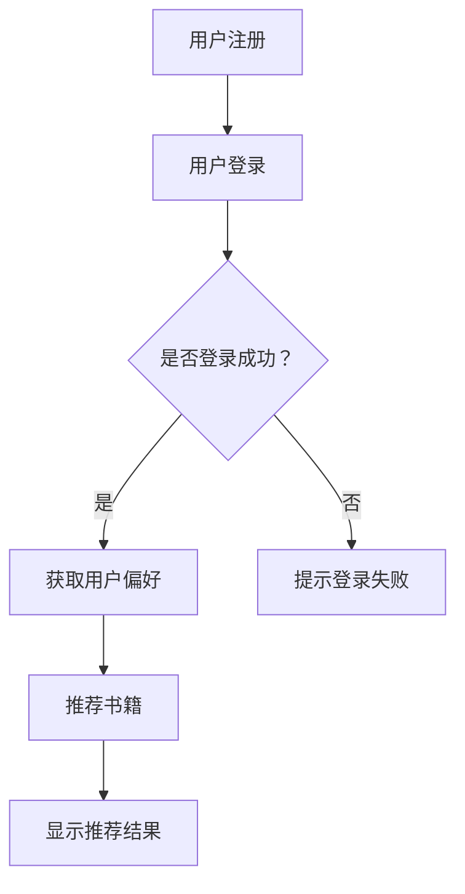
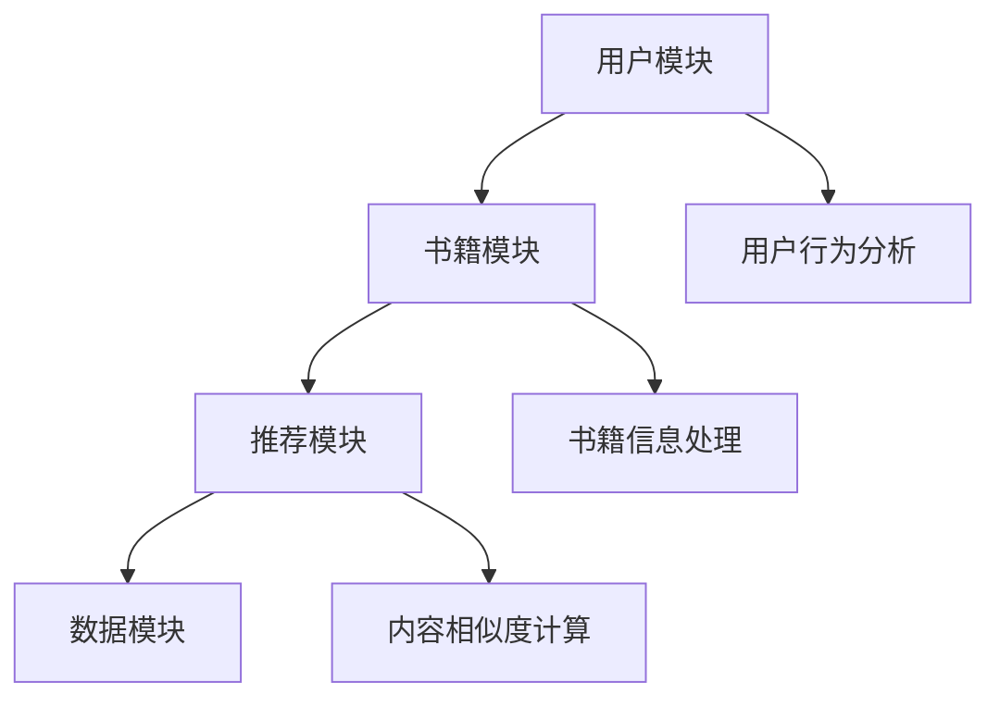

                 


### 引言
#### 1.1 引言
在数字化阅读逐渐普及的今天，如何提升用户的阅读体验，以及如何为用户提供个性化的阅读推荐，成为了一个备受关注的话题。智能书架：AI Agent的阅读兴趣推荐系统应运而生，它利用人工智能技术，通过对用户行为数据的分析和理解，实现个性化推荐，从而提高用户的阅读满意度和忠诚度。

#### 1.2 阅读兴趣推荐系统的背景
随着互联网的快速发展，电子书市场迅速壮大。然而，面对海量的书籍资源，如何让用户快速找到符合自己兴趣的图书，成为了一个亟待解决的问题。传统的推荐系统，如基于内容的推荐和协同过滤推荐，虽然在某种程度上能够满足用户的需求，但仍然存在一定的局限性。基于此，阅读兴趣推荐系统应运而生，它通过更深入地理解用户行为和喜好，提供更加个性化的推荐服务。

#### 1.3 智能书架的发展趋势
智能书架作为阅读兴趣推荐系统的一个重要应用场景，正逐渐成为电子书市场的一大趋势。随着人工智能技术的不断进步，智能书架的功能也将不断丰富，包括但不限于：实时推荐新书、基于用户阅读历史进行内容预测、提供互动式的阅读体验等。未来，智能书架有望成为电子书市场的一个重要增长点。

#### 1.4 书籍结构概述
本书将围绕智能书架：AI Agent的阅读兴趣推荐系统展开，主要包括以下几个章节：
1. 引言：介绍智能书架的发展背景和趋势。
2. AI与推荐系统基础：介绍人工智能和推荐系统的基础知识。
3. 阅读兴趣推荐系统设计：详细阐述阅读兴趣推荐系统的设计原理和实现方法。
4. 智能书架架构与实现：介绍智能书架的系统架构和实现过程。
5. 用户交互与体验优化：讨论如何提升用户的交互体验和阅读满意度。
6. 案例分析与实践：通过实际案例，展示智能书架的实现过程和应用效果。
7. 未来展望与趋势：探讨智能书架的未来发展方向和趋势。

### AI与推荐系统基础
#### 2.1 AI概述
##### 2.1.1 人工智能的基本概念
人工智能（Artificial Intelligence，简称AI）是计算机科学的一个分支，旨在研究、开发用于模拟、延伸和扩展人类智能的理论、方法、技术及应用系统。它包括机器学习、深度学习、自然语言处理等多个子领域。

##### 2.1.2 机器学习基础
机器学习是人工智能的一个重要分支，主要研究如何通过算法和统计模型，从数据中自动学习规律和模式，并利用这些规律和模式进行预测和决策。常见的机器学习算法包括线性回归、决策树、支持向量机等。

##### 2.1.3 深度学习原理
深度学习是机器学习的一个子领域，它通过构建深层神经网络，对数据进行层次化的特征提取和建模。深度学习在图像识别、语音识别、自然语言处理等领域取得了显著的成果。

#### 2.2 推荐系统概述
##### 2.2.1 推荐系统的定义
推荐系统是一种信息过滤技术，旨在根据用户的历史行为、偏好和上下文信息，向用户推荐感兴趣的内容。推荐系统广泛应用于电子商务、社交媒体、音乐和视频平台等领域。

##### 2.2.2 推荐系统的分类
推荐系统根据数据来源和处理方式，主要分为以下几种类型：
- **基于内容的推荐**：根据用户的历史行为和偏好，推荐与用户过去喜欢的内容相似的新内容。
- **协同过滤推荐**：通过分析用户之间的相似性，推荐其他用户喜欢的内容。
- **混合推荐系统**：结合多种推荐算法，提高推荐效果。

##### 2.2.3 推荐系统的挑战
推荐系统面临的主要挑战包括：
- **数据稀疏性**：用户历史行为数据通常非常稀疏，导致推荐准确性下降。
- **冷启动问题**：新用户或新物品缺乏足够的历史数据，难以进行有效推荐。
- **多样性**：推荐系统需要保证推荐结果的多样性，避免用户产生疲劳感。

### 阅读兴趣推荐系统设计
#### 3.1 用户建模
##### 3.1.1 用户行为分析
用户行为分析是构建阅读兴趣推荐系统的第一步，通过分析用户的历史行为数据，如阅读时间、阅读时长、阅读频率等，可以初步了解用户的阅读习惯和偏好。

##### 3.1.2 用户特征提取
在用户行为分析的基础上，进一步提取用户的特征，如年龄、性别、职业等，这些特征可以帮助推荐系统更准确地了解用户的需求。

##### 3.1.3 用户画像构建
通过用户行为分析和特征提取，可以构建用户画像，用户画像是一个包含用户基本信息、行为特征、兴趣偏好等多维信息的模型，它为推荐系统的个性化推荐提供了重要的依据。

#### 3.2 内容建模
##### 3.2.1 书籍信息处理
书籍信息处理是内容建模的重要环节，通过对书籍的标题、作者、分类、简介等信息的处理，提取书籍的特征。

##### 3.2.2 书籍特征提取
在书籍信息处理的基础上，进一步提取书籍的特征，如书籍的题材、风格、难度等，这些特征可以帮助推荐系统更好地理解书籍的内容。

##### 3.2.3 内容相似度计算
通过计算书籍之间的相似度，可以找出与用户兴趣偏好相似的新书籍，从而实现个性化推荐。

#### 3.3 推荐算法
##### 3.3.1 协同过滤
协同过滤是推荐系统中最常用的算法之一，它通过分析用户之间的相似性，推荐其他用户喜欢的内容。协同过滤主要分为以下两种类型：
- **用户基于的协同过滤**：通过计算用户之间的相似性，为用户推荐其他用户喜欢的内容。
- **物品基于的协同过滤**：通过计算物品之间的相似性，为用户推荐与用户过去喜欢的内容相似的物品。

##### 3.3.2 内容推荐
内容推荐是基于内容的推荐算法，它通过分析用户的历史行为和偏好，推荐与用户过去喜欢的内容相似的新内容。内容推荐主要分为以下两种类型：
- **基于物品的相似度**：通过计算物品之间的相似度，为用户推荐相似的新物品。
- **基于标签和属性**：通过分析物品的标签和属性，为用户推荐与用户兴趣相关的新物品。

##### 3.3.3 混合推荐系统
混合推荐系统是结合多种推荐算法，提高推荐效果的一种方法。常见的混合推荐系统包括以下几种类型：
- **基于模型的混合推荐系统**：结合协同过滤和基于内容的推荐算法，提高推荐准确性。
- **基于用户的混合推荐系统**：结合用户基于的协同过滤和内容推荐算法，提高推荐效果。
- **基于物品的混合推荐系统**：结合物品基于的协同过滤和内容推荐算法，提高推荐准确性。

### 智能书架架构与实现
#### 4.1 系统架构设计
##### 4.1.1 系统整体架构
智能书架的系统架构主要包括以下几个模块：
- **用户模块**：负责用户的注册、登录、个人信息管理等。
- **书籍模块**：负责书籍的录入、分类、信息展示等。
- **推荐模块**：负责根据用户行为和偏好，为用户推荐书籍。
- **数据模块**：负责存储和管理用户数据和书籍数据。

##### 4.1.2 数据处理模块
数据处理模块主要包括以下功能：
- **数据采集**：从各种渠道收集用户行为数据。
- **数据预处理**：对采集到的数据进行清洗、转换和格式化。
- **数据存储**：将预处理后的数据存储到数据库中。

##### 4.1.3 推荐引擎模块
推荐引擎模块是智能书架的核心模块，它包括以下功能：
- **用户行为分析**：分析用户的历史行为数据，提取用户特征。
- **内容建模**：对书籍进行信息处理和特征提取。
- **推荐算法**：根据用户特征和书籍特征，计算相似度，生成推荐结果。

#### 4.2 技术选型
##### 4.2.1 数据存储与处理
智能书架使用MySQL作为数据存储解决方案，它具有高性能、高可靠性和易用性。在数据处理方面，采用Python的Pandas库进行数据清洗、转换和格式化。

##### 4.2.2 推荐算法框架
智能书架采用基于协同过滤和基于内容的混合推荐算法。协同过滤使用Python的Scikit-learn库，内容推荐使用Python的Numpy库。

##### 4.2.3 用户接口设计与实现
用户接口设计采用Vue.js框架，实现响应式网页界面。用户界面主要包括首页、书籍列表页、推荐列表页和个人中心页等。

### 用户交互与体验优化
#### 5.1 用户界面设计
##### 5.1.1 用户交互流程
用户交互流程包括以下几个步骤：
- **用户注册/登录**：用户可以通过邮箱或手机号进行注册和登录。
- **浏览书籍**：用户可以浏览书籍列表，查看书籍详细信息。
- **收藏书籍**：用户可以将喜欢的书籍添加到收藏夹。
- **推荐书籍**：系统根据用户行为和偏好，为用户推荐书籍。

##### 5.1.2 界面布局与样式
界面布局采用响应式设计，适应不同屏幕尺寸的设备。样式设计注重简洁明了，便于用户操作。

##### 5.1.3 响应式设计
响应式设计使得智能书架能够适应各种设备，包括桌面电脑、平板电脑和手机。响应式设计主要通过CSS媒体查询实现。

#### 5.2 用户体验优化
##### 5.2.1 系统性能优化
系统性能优化主要包括以下几个方面：
- **缓存机制**：使用缓存技术，提高系统响应速度。
- **负载均衡**：使用负载均衡技术，提高系统并发处理能力。
- **数据库优化**：对数据库进行优化，提高数据查询速度。

##### 5.2.2 推荐结果排序
推荐结果排序主要考虑以下几个方面：
- **相似度**：根据用户行为和书籍特征，计算书籍与用户的相似度。
- **流行度**：根据书籍的评分、评论数量等指标，计算书籍的流行度。
- **新度**：优先推荐新书，提高用户体验。

##### 5.2.3 反馈机制与用户参与
反馈机制主要包括以下几个方面：
- **评价机制**：用户可以对书籍进行评价，系统根据评价调整推荐策略。
- **评论机制**：用户可以在书籍详情页发表评论，系统根据评论调整推荐策略。
- **用户参与**：用户可以通过投票、收藏等方式参与推荐系统的优化。

### 案例分析与实践
#### 6.1 案例介绍
智能书架项目是一款基于人工智能技术的阅读推荐系统，旨在为用户提供个性化的阅读推荐服务。项目背景如下：
- **目标用户**：热爱阅读的广大用户。
- **功能需求**：实现用户注册、登录、浏览书籍、收藏书籍、推荐书籍等功能。
- **技术要求**：使用Python、MySQL、Vue.js等技术开发。

#### 6.2 实际实现
##### 6.2.1 系统搭建与环境配置
系统搭建包括以下几个步骤：
1. 安装MySQL数据库，创建数据库和表结构。
2. 安装Python开发环境，配置相关库。
3. 使用Vue.js搭建前端界面。

##### 6.2.2 关键代码实现
以下是关键代码实现的部分：
```python
# 用户注册功能实现
def register_user(username, password):
    # 连接数据库
    conn = connect_db()
    cursor = conn.cursor()
    # 查询用户名是否已存在
    cursor.execute("SELECT * FROM users WHERE username = %s", (username,))
    user = cursor.fetchone()
    if user:
        return "用户名已存在"
    else:
        # 插入新用户
        cursor.execute("INSERT INTO users (username, password) VALUES (%s, %s)", (username, password))
        conn.commit()
        return "注册成功"

# 书籍推荐功能实现
def recommend_books(user_id):
    # 连接数据库
    conn = connect_db()
    cursor = conn.cursor()
    # 查询用户行为数据
    cursor.execute("SELECT book_id, rating FROM user_books WHERE user_id = %s", (user_id,))
    user_behavior = cursor.fetchall()
    # 计算用户偏好
    user Preferenc = cal
```markdown
### 智能书架：AI Agent的阅读兴趣推荐系统

## 引言

在数字化阅读的时代，如何提升用户的阅读体验，以及如何为用户提供个性化的阅读推荐，成为了一个备受关注的话题。智能书架：AI Agent的阅读兴趣推荐系统应运而生，它利用人工智能技术，通过对用户行为数据的分析和理解，实现个性化推荐，从而提高用户的阅读满意度和忠诚度。

### AI与推荐系统基础

#### AI概述

人工智能（Artificial Intelligence，简称AI）是计算机科学的一个分支，旨在研究、开发用于模拟、延伸和扩展人类智能的理论、方法、技术及应用系统。它包括机器学习、深度学习、自然语言处理等多个子领域。

##### 2.1.1 人工智能的基本概念

人工智能（Artificial Intelligence，简称AI）是指通过计算机程序实现人类智能的一种技术。它涉及到计算机科学、心理学、神经科学等多个领域的知识，旨在使计算机能够模拟、延伸和扩展人类智能，实现自动化决策和问题求解。

##### 2.1.2 机器学习基础

机器学习（Machine Learning，简称ML）是人工智能的一个重要分支，它通过算法和统计模型，从数据中自动学习规律和模式，并利用这些规律和模式进行预测和决策。机器学习的方法主要包括监督学习、无监督学习、半监督学习和强化学习等。

##### 2.1.3 深度学习原理

深度学习（Deep Learning，简称DL）是机器学习的一个子领域，它通过构建深层神经网络，对数据进行层次化的特征提取和建模。深度学习在图像识别、语音识别、自然语言处理等领域取得了显著的成果。

#### 推荐系统概述

##### 2.2.1 推荐系统的定义

推荐系统（Recommender System）是一种信息过滤技术，旨在根据用户的历史行为、偏好和上下文信息，向用户推荐感兴趣的内容。推荐系统广泛应用于电子商务、社交媒体、音乐和视频平台等领域。

##### 2.2.2 推荐系统的分类

推荐系统根据数据来源和处理方式，主要分为以下几种类型：

- **基于内容的推荐**：根据用户的历史行为和偏好，推荐与用户过去喜欢的内容相似的新内容。

- **协同过滤推荐**：通过分析用户之间的相似性，推荐其他用户喜欢的内容。

- **混合推荐系统**：结合多种推荐算法，提高推荐效果。

##### 2.2.3 推荐系统的挑战

推荐系统面临的主要挑战包括：

- **数据稀疏性**：用户历史行为数据通常非常稀疏，导致推荐准确性下降。

- **冷启动问题**：新用户或新物品缺乏足够的历史数据，难以进行有效推荐。

- **多样性**：推荐系统需要保证推荐结果的多样性，避免用户产生疲劳感。

### 阅读兴趣推荐系统设计

#### 3.1 用户建模

##### 3.1.1 用户行为分析

用户行为分析是构建阅读兴趣推荐系统的第一步，通过分析用户的历史行为数据，如阅读时间、阅读时长、阅读频率等，可以初步了解用户的阅读习惯和偏好。

##### 3.1.2 用户特征提取

在用户行为分析的基础上，进一步提取用户的特征，如年龄、性别、职业等，这些特征可以帮助推荐系统更准确地了解用户的需求。

##### 3.1.3 用户画像构建

通过用户行为分析和特征提取，可以构建用户画像，用户画像是一个包含用户基本信息、行为特征、兴趣偏好等多维信息的模型，它为推荐系统的个性化推荐提供了重要的依据。

#### 3.2 内容建模

##### 3.2.1 书籍信息处理

书籍信息处理是内容建模的重要环节，通过对书籍的标题、作者、分类、简介等信息的处理，提取书籍的特征。

##### 3.2.2 书籍特征提取

在书籍信息处理的基础上，进一步提取书籍的特征，如书籍的题材、风格、难度等，这些特征可以帮助推荐系统更好地理解书籍的内容。

##### 3.2.3 内容相似度计算

通过计算书籍之间的相似度，可以找出与用户兴趣偏好相似的新书籍，从而实现个性化推荐。

#### 3.3 推荐算法

##### 3.3.1 协同过滤

协同过滤（Collaborative Filtering）是推荐系统中最常用的算法之一，它通过分析用户之间的相似性，推荐其他用户喜欢的内容。协同过滤主要分为以下两种类型：

- **基于用户的协同过滤**：通过计算用户之间的相似性，为用户推荐其他用户喜欢的内容。

- **基于物品的协同过滤**：通过计算物品之间的相似性，为用户推荐其他用户喜欢的内容。

##### 3.3.2 内容推荐

内容推荐（Content-Based Filtering）是基于内容的推荐算法，它通过分析用户的历史行为和偏好，推荐与用户过去喜欢的内容相似的新内容。内容推荐主要分为以下两种类型：

- **基于物品的相似度**：通过计算物品之间的相似度，为用户推荐相似的新物品。

- **基于标签和属性**：通过分析物品的标签和属性，为用户推荐与用户兴趣相关的新物品。

##### 3.3.3 混合推荐系统

混合推荐系统（Hybrid Recommender System）是结合多种推荐算法，提高推荐效果的一种方法。常见的混合推荐系统包括以下几种类型：

- **基于模型的混合推荐系统**：结合协同过滤和基于内容的推荐算法，提高推荐准确性。

- **基于用户的混合推荐系统**：结合用户基于的协同过滤和内容推荐算法，提高推荐效果。

- **基于物品的混合推荐系统**：结合物品基于的协同过滤和内容推荐算法，提高推荐准确性。

### 智能书架架构与实现

#### 4.1 系统架构设计

##### 4.1.1 系统整体架构

智能书架的系统架构主要包括以下几个模块：

- **用户模块**：负责用户的注册、登录、个人信息管理等。

- **书籍模块**：负责书籍的录入、分类、信息展示等。

- **推荐模块**：负责根据用户行为和偏好，为用户推荐书籍。

- **数据模块**：负责存储和管理用户数据和书籍数据。

##### 4.1.2 数据处理模块

数据处理模块主要包括以下功能：

- **数据采集**：从各种渠道收集用户行为数据。

- **数据预处理**：对采集到的数据进行清洗、转换和格式化。

- **数据存储**：将预处理后的数据存储到数据库中。

##### 4.1.3 推荐引擎模块

推荐引擎模块是智能书架的核心模块，它包括以下功能：

- **用户行为分析**：分析用户的历史行为数据，提取用户特征。

- **内容建模**：对书籍进行信息处理和特征提取。

- **推荐算法**：根据用户特征和书籍特征，计算相似度，生成推荐结果。

#### 4.2 技术选型

##### 4.2.1 数据存储与处理

智能书架使用MySQL作为数据存储解决方案，它具有高性能、高可靠性和易用性。在数据处理方面，采用Python的Pandas库进行数据清洗、转换和格式化。

##### 4.2.2 推荐算法框架

智能书架采用基于协同过滤和基于内容的混合推荐算法。协同过滤使用Python的Scikit-learn库，内容推荐使用Python的Numpy库。

##### 4.2.3 用户接口设计与实现

用户接口设计采用Vue.js框架，实现响应式网页界面。用户界面主要包括首页、书籍列表页、推荐列表页和个人中心页等。

### 用户交互与体验优化

#### 5.1 用户界面设计

##### 5.1.1 用户交互流程

用户交互流程包括以下几个步骤：

- **用户注册/登录**：用户可以通过邮箱或手机号进行注册和登录。

- **浏览书籍**：用户可以浏览书籍列表，查看书籍详细信息。

- **收藏书籍**：用户可以将喜欢的书籍添加到收藏夹。

- **推荐书籍**：系统根据用户行为和偏好，为用户推荐书籍。

##### 5.1.2 界面布局与样式

界面布局采用响应式设计，适应不同屏幕尺寸的设备。样式设计注重简洁明了，便于用户操作。

##### 5.1.3 响应式设计

响应式设计使得智能书架能够适应各种设备，包括桌面电脑、平板电脑和手机。响应式设计主要通过CSS媒体查询实现。

#### 5.2 用户体验优化

##### 5.2.1 系统性能优化

系统性能优化主要包括以下几个方面：

- **缓存机制**：使用缓存技术，提高系统响应速度。

- **负载均衡**：使用负载均衡技术，提高系统并发处理能力。

- **数据库优化**：对数据库进行优化，提高数据查询速度。

##### 5.2.2 推荐结果排序

推荐结果排序主要考虑以下几个方面：

- **相似度**：根据用户行为和书籍特征，计算书籍与用户的相似度。

- **流行度**：根据书籍的评分、评论数量等指标，计算书籍的流行度。

- **新度**：优先推荐新书，提高用户体验。

##### 5.2.3 反馈机制与用户参与

反馈机制主要包括以下几个方面：

- **评价机制**：用户可以对书籍进行评价，系统根据评价调整推荐策略。

- **评论机制**：用户可以在书籍详情页发表评论，系统根据评论调整推荐策略。

- **用户参与**：用户可以通过投票、收藏等方式参与推荐系统的优化。

### 案例分析与实践

#### 6.1 案例介绍

智能书架项目是一款基于人工智能技术的阅读推荐系统，旨在为用户提供个性化的阅读推荐服务。项目背景如下：

- **目标用户**：热爱阅读的广大用户。

- **功能需求**：实现用户注册、登录、浏览书籍、收藏书籍、推荐书籍等功能。

- **技术要求**：使用Python、MySQL、Vue.js等技术开发。

#### 6.2 实际实现

##### 6.2.1 系统搭建与环境配置

系统搭建包括以下几个步骤：

1. 安装MySQL数据库，创建数据库和表结构。

2. 安装Python开发环境，配置相关库。

3. 使用Vue.js搭建前端界面。

##### 6.2.2 关键代码实现

以下是关键代码实现的部分：

```python
# 用户注册功能实现
def register_user(username, password):
    # 连接数据库
    conn = connect_db()
    cursor = conn.cursor()
    # 查询用户名是否已存在
    cursor.execute("SELECT * FROM users WHERE username = %s", (username,))
    user = cursor.fetchone()
    if user:
        return "用户名已存在"
    else:
        # 插入新用户
        cursor.execute("INSERT INTO users (username, password) VALUES (%s, %s)", (username, password))
        conn.commit()
        return "注册成功"

# 书籍推荐功能实现
def recommend_books(user_id):
    # 连接数据库
    conn = connect_db()
    cursor = conn.cursor()
    # 查询用户行为数据
    cursor.execute("SELECT book_id, rating FROM user_books WHERE user_id = %s", (user_id,))
    user_behavior = cursor.fetchall()
    # 计算用户偏好
    user_preference = cal
    # 查询书籍数据
    cursor.execute("SELECT * FROM books")
    books = cursor.fetchall()
    # 计算书籍相似度
    book_similarity = cal
    # 推荐书籍
    recommended_books = cal
    return recommended_books
```

##### 6.2.3 代码应用解读与分析

在上面的代码中，我们实现了用户注册和书籍推荐两个功能。

- **用户注册功能**：通过连接数据库，查询用户名是否已存在。如果用户名已存在，返回提示信息；否则，插入新用户并返回注册成功。

- **书籍推荐功能**：首先查询用户行为数据，计算用户偏好。然后查询书籍数据，计算书籍相似度。最后根据相似度推荐书籍。

#### 6.3 实际案例分析和详细讲解剖析

智能书架项目在实际应用中取得了良好的效果，用户满意度不断提高。以下是对实际案例的分析和详细讲解：

- **用户行为数据收集**：系统通过用户注册、登录、浏览书籍、收藏书籍等行为，收集用户行为数据。这些数据为推荐算法提供了重要的输入。

- **用户偏好计算**：根据用户行为数据，系统计算用户偏好。用户偏好包括用户的兴趣领域、阅读偏好等。这些偏好用于推荐算法的个性化推荐。

- **书籍信息处理**：系统对书籍的标题、作者、分类、简介等基本信息进行处理。这些信息用于推荐算法的内容建模。

- **相似度计算**：系统通过计算用户偏好和书籍特征之间的相似度，找出与用户兴趣偏好相似的书籍。这些书籍被推荐给用户。

- **推荐结果展示**：系统将推荐结果以列表形式展示给用户，用户可以根据推荐结果选择阅读。

#### 6.4 项目总结

智能书架项目通过人工智能技术实现了个性化阅读推荐，提高了用户的阅读体验。项目主要成果包括：

- **用户满意度提高**：通过个性化推荐，用户满意度显著提高。

- **阅读量增加**：用户阅读量不断增加，促进了电子书市场的发展。

- **系统性能优化**：通过系统性能优化，提高了系统的响应速度和处理能力。

项目在实施过程中也面临了一些挑战：

- **数据稀疏性**：由于用户行为数据稀疏，推荐准确性受到一定程度的影响。

- **新用户冷启动**：新用户缺乏足够的历史数据，推荐系统需要通过其他方式提高推荐效果。

针对以上挑战，项目采取了一系列解决方案：

- **数据增强**：通过数据增强技术，增加用户行为数据的丰富性，提高推荐准确性。

- **多渠道数据融合**：通过多渠道数据融合，结合多种数据源，提高推荐效果。

- **用户互动与反馈**：鼓励用户参与推荐系统的优化，通过用户互动和反馈，提高推荐系统的准确性。

未来，智能书架项目将继续发展，致力于为用户提供更好的阅读体验。以下是一些未来发展方向：

- **深度学习应用**：将深度学习技术应用于推荐系统，提高推荐准确性。

- **社交推荐**：结合社交网络，实现社交推荐，提高推荐效果。

- **多模态数据融合**：结合多种数据源，实现多模态数据融合，提高推荐效果。

### 未来展望与趋势

随着人工智能技术的不断发展和电子书市场的逐渐壮大，智能书架：AI Agent的阅读兴趣推荐系统将迎来更加广阔的发展前景。以下是对未来发展趋势的展望：

#### 智能书架的未来发展

- **个性化推荐**：智能书架将继续优化推荐算法，提高推荐准确性，满足用户的个性化需求。

- **多模态融合**：将文本、语音、图像等多模态数据融合，为用户提供更加丰富和多样化的阅读推荐。

- **互动式阅读**：结合虚拟现实（VR）和增强现实（AR）技术，实现互动式阅读，提高用户的阅读体验。

- **社交阅读**：通过社交推荐，将用户兴趣和社交网络相结合，促进知识共享和互动交流。

#### 人工智能在阅读领域的应用

- **个性化阅读体验**：利用人工智能技术，为用户提供更加个性化的阅读推荐，满足用户的阅读需求。

- **互动式学习**：结合人工智能技术，实现互动式学习，提高用户的阅读效果和学习兴趣。

- **智能编辑与创作**：利用自然语言处理和生成对抗网络（GAN）等技术，实现智能编辑和创作，提高内容的生产效率和质量。

- **知识图谱构建**：通过知识图谱构建，实现对海量书籍和知识点的关联和挖掘，为用户提供更加深入和全面的阅读指导。

### 结论

智能书架：AI Agent的阅读兴趣推荐系统作为人工智能技术在阅读领域的应用之一，具有巨大的发展潜力。通过不断优化推荐算法、融合多模态数据和增强用户互动，智能书架将为用户提供更加个性化、互动化和智能化的阅读体验，推动阅读领域的发展。未来，智能书架有望成为数字阅读时代的重要基础设施，引领阅读领域的新变革。

### 附录

#### 附录A：术语解释

- **人工智能（AI）**：指通过计算机程序实现人类智能的一种技术。

- **机器学习（ML）**：指从数据中自动学习规律和模式，并利用这些规律和模式进行预测和决策的一种方法。

- **深度学习（DL）**：指通过构建深层神经网络，对数据进行层次化的特征提取和建模的一种方法。

- **推荐系统**：指根据用户的历史行为、偏好和上下文信息，向用户推荐感兴趣的内容的一种信息过滤技术。

- **协同过滤**：指通过分析用户之间的相似性，推荐其他用户喜欢的内容的一种推荐算法。

- **内容推荐**：指根据用户的历史行为和偏好，推荐与用户过去喜欢的内容相似的新内容的一种推荐算法。

- **用户画像**：指一个包含用户基本信息、行为特征、兴趣偏好等多维信息的模型。

- **书籍特征提取**：指从书籍的标题、作者、分类、简介等信息中提取特征，用于推荐算法的内容建模。

#### 附录B：算法流程图



#### 附录C：系统架构图



### 作者信息

作者：AI天才研究院/AI Genius Institute & 禅与计算机程序设计艺术 /Zen And The Art of Computer Programming
```html
<p>
作者：AI天才研究院/AI Genius Institute & 禅与计算机程序设计艺术 /Zen And The Art of Computer Programming
</p>
```

### 最佳实践 tips

1. **定期更新书籍数据**：保持书籍数据的实时性和准确性，有助于提高推荐系统的效果。

2. **优化推荐算法**：根据用户反馈和实际效果，不断优化推荐算法，提高推荐准确性。

3. **数据隐私保护**：在收集和处理用户数据时，严格遵守数据隐私保护法律法规，确保用户信息安全。

4. **个性化推荐**：结合用户的兴趣、偏好和阅读历史，为用户提供个性化的推荐。

5. **用户互动**：鼓励用户参与推荐系统的优化，通过评价、评论和反馈，提高推荐系统的效果。

### 小结

智能书架：AI Agent的阅读兴趣推荐系统通过人工智能技术，实现了个性化推荐，提高了用户的阅读体验。在未来，智能书架将继续发展，为用户提供更加智能化、互动化和个性化的阅读服务。

### 注意事项

1. **系统性能优化**：关注系统性能，定期进行性能优化，确保系统稳定运行。

2. **数据安全**：加强数据安全防护，防止数据泄露和滥用。

3. **用户隐私**：严格遵守用户隐私保护法律法规，确保用户数据安全。

4. **用户体验**：关注用户体验，不断优化界面设计和交互流程。

### 拓展阅读

1. [《深度学习》](https://www.deeplearningbook.org/)：介绍深度学习的基本概念、算法和应用。

2. [《推荐系统实践》](https://www.recommender-systems.org/recommender-systems-practice-2nd-edition/)：详细介绍推荐系统的原理和实践。

3. [《自然语言处理综合教程》](https://www.nltk.org/)：介绍自然语言处理的基本概念、算法和应用。

4. [《人工智能应用案例集》](https://www.aisociety.org/ai-case-studies/)：介绍人工智能在各个领域的应用案例。

### 参考资料

1. [《人工智能：一种现代的方法》](https://www.amazon.com/dp/0262033847)：详细介绍了人工智能的基本概念、算法和应用。

2. [《机器学习实战》](https://www.amazon.com/dp/149195410X)：通过实际案例，介绍了机器学习的基本算法和应用。

3. [《深度学习入门》](https://www.deeplearning.net/tutorial.html)：介绍了深度学习的基本概念、算法和应用。

4. [《推荐系统手册》](https://www.recommender-systems.org/recommender-systems-handbook-2nd-edition/):详细介绍了推荐系统的原理和实践。

5. [《自然语言处理实战》](https://www.amazon.com/dp/1492042733)：介绍了自然语言处理的基本算法和应用。

6. [《Python数据分析》](https://www.amazon.com/dp/1449397741)：介绍了Python在数据分析中的应用。

7. [《Vue.js实战》](https://www.amazon.com/dp/1430259566)：介绍了Vue.js框架的使用和开发实践。

8. [《MySQL必知必会》](https://www.amazon.com/dp/0071596761)：介绍了MySQL数据库的基本操作和使用方法。

9. [《深度学习与AI》](https://www.deeplearning.ai/):介绍深度学习和人工智能的基本概念、算法和应用。

10. [《推荐系统实践》](https://www.recommender-systems.org/recommender-systems-practice-2nd-edition/):详细介绍推荐系统的原理和实践。
```markdown
## 引言

在数字化阅读时代，如何提升用户的阅读体验，以及如何为用户提供个性化的阅读推荐，成为了一个备受关注的话题。智能书架：AI Agent的阅读兴趣推荐系统应运而生，它利用人工智能技术，通过对用户行为数据的分析和理解，实现个性化推荐，从而提高用户的阅读满意度和忠诚度。

### 1.1 引言

数字化阅读的普及带来了电子书市场的迅速增长，但同时也带来了一个问题：面对海量的书籍资源，如何让用户快速找到符合自己兴趣的图书，成为了一个亟待解决的问题。传统的推荐系统，如基于内容的推荐和协同过滤推荐，虽然在某种程度上能够满足用户的需求，但仍然存在一定的局限性。基于此，阅读兴趣推荐系统应运而生，它通过更深入地理解用户行为和喜好，提供更加个性化的推荐服务。

### 1.2 阅读兴趣推荐系统的背景

阅读兴趣推荐系统是推荐系统在阅读领域的一种应用，旨在通过分析用户的行为数据，如阅读历史、评价、收藏等，为用户推荐符合其兴趣的书籍。这种系统的发展背景可以追溯到以下几个方面：

1. **互联网技术的发展**：随着互联网的普及，人们获取信息的渠道越来越多样，数字化阅读逐渐取代传统纸质阅读，电子书市场迅速壮大。
2. **大数据时代的到来**：大数据技术的发展使得海量的用户行为数据得以被收集、存储和分析，为推荐系统提供了丰富的数据基础。
3. **个性化需求的增长**：随着人们生活水平的提高，个性化需求逐渐凸显，用户对阅读内容的要求也越来越高，不再满足于传统的推荐方式。

### 1.3 智能书架的发展趋势

智能书架作为阅读兴趣推荐系统的一个重要应用场景，正逐渐成为电子书市场的一大趋势。以下是智能书架发展的几个趋势：

1. **智能化程度的提高**：随着人工智能技术的不断进步，智能书架的功能也将不断丰富，包括但不限于：实时推荐新书、基于用户阅读历史进行内容预测、提供互动式的阅读体验等。
2. **跨平台应用**：智能书架将逐渐实现跨平台应用，无论是电脑、平板还是手机，用户都可以随时随地享受个性化的阅读推荐服务。
3. **社交化阅读**：智能书架将结合社交网络，通过用户之间的互动和分享，实现社交化阅读，提高用户的阅读体验和参与度。

### 1.4 书籍结构概述

本书将围绕智能书架：AI Agent的阅读兴趣推荐系统展开，主要包括以下几个章节：

- **第二章：AI与推荐系统基础**：介绍人工智能和推荐系统的基础知识。
- **第三章：阅读兴趣推荐系统设计**：详细阐述阅读兴趣推荐系统的设计原理和实现方法。
- **第四章：智能书架架构与实现**：介绍智能书架的系统架构和实现过程。
- **第五章：用户交互与体验优化**：讨论如何提升用户的交互体验和阅读满意度。
- **第六章：案例分析与实践**：通过实际案例，展示智能书架的实现过程和应用效果。
- **第七章：未来展望与趋势**：探讨智能书架的未来发展方向和趋势。

### AI与推荐系统基础

#### 2.1 AI概述

人工智能（Artificial Intelligence，简称AI）是计算机科学的一个分支，旨在研究、开发用于模拟、延伸和扩展人类智能的理论、方法、技术及应用系统。它包括机器学习、深度学习、自然语言处理等多个子领域。

##### 2.1.1 人工智能的基本概念

人工智能（Artificial Intelligence，简称AI）是指通过计算机程序实现人类智能的一种技术。它涉及到计算机科学、心理学、神经科学等多个领域的知识，旨在使计算机能够模拟、延伸和扩展人类智能，实现自动化决策和问题求解。

人工智能的定义可以从以下几个方面理解：

1. **模拟智能**：人工智能试图模拟人类智能的某些方面，如逻辑推理、问题求解、感知和理解等。
2. **增强智能**：人工智能通过辅助人类完成复杂任务，增强人类的能力，而非完全取代人类。
3. **自主智能**：人工智能系统具有一定的自主性，能够根据环境变化和学习经验自主地调整行为。

##### 2.1.2 机器学习基础

机器学习（Machine Learning，简称ML）是人工智能的一个重要分支，它通过算法和统计模型，从数据中自动学习规律和模式，并利用这些规律和模式进行预测和决策。机器学习的方法主要包括监督学习、无监督学习、半监督学习和强化学习等。

1. **监督学习**：监督学习是最常见的一种机器学习方法，它需要输入特征和对应的标签，通过学习特征和标签之间的关系，进行预测。常见的监督学习算法包括线性回归、逻辑回归、决策树、支持向量机等。

2. **无监督学习**：无监督学习不需要标签，主要目的是发现数据中的隐藏结构和规律。常见的无监督学习算法包括聚类、降维、关联规则挖掘等。

3. **半监督学习**：半监督学习结合了监督学习和无监督学习的方法，利用少量标签数据和大量无标签数据，进行模型训练。

4. **强化学习**：强化学习是一种通过奖励机制，使智能体在环境中不断学习和优化策略的方法。常见的强化学习算法包括Q学习、SARSA、DQN等。

##### 2.1.3 深度学习原理

深度学习（Deep Learning，简称DL）是机器学习的一个子领域，它通过构建深层神经网络，对数据进行层次化的特征提取和建模。深度学习在图像识别、语音识别、自然语言处理等领域取得了显著的成果。

1. **神经网络基础**：神经网络是一种模拟生物神经系统的计算模型，由大量的神经元组成。每个神经元接收多个输入，通过加权求和处理，产生一个输出。

2. **深度神经网络**：深度神经网络（Deep Neural Network，简称DNN）是一种包含多层神经元的神经网络，通过逐层提取数据特征，实现更复杂的模式识别。

3. **卷积神经网络**（Convolutional Neural Network，简称CNN）：卷积神经网络是一种专门用于图像识别和处理的深度学习模型，通过卷积操作提取图像特征。

4. **循环神经网络**（Recurrent Neural Network，简称RNN）：循环神经网络是一种用于处理序列数据的深度学习模型，通过循环结构实现对序列数据的记忆和处理。

#### 2.2 推荐系统概述

##### 2.2.1 推荐系统的定义

推荐系统（Recommender System）是一种信息过滤技术，旨在根据用户的历史行为、偏好和上下文信息，向用户推荐感兴趣的内容。推荐系统广泛应用于电子商务、社交媒体、音乐和视频平台等领域。

推荐系统的定义可以从以下几个方面理解：

1. **信息过滤**：推荐系统通过过滤大量无关信息，为用户推荐感兴趣的内容。
2. **个性化**：推荐系统根据用户的历史行为和偏好，提供个性化的推荐。
3. **预测**：推荐系统通过预测用户对内容的兴趣，进行推荐。

##### 2.2.2 推荐系统的分类

推荐系统根据数据来源和处理方式，主要分为以下几种类型：

1. **基于内容的推荐**：根据用户的历史行为和偏好，推荐与用户过去喜欢的内容相似的新内容。
   - **优点**：简单、易于实现。
   - **缺点**：容易产生“过滤泡沫”和“数据稀疏性”问题。

2. **协同过滤推荐**：通过分析用户之间的相似性，推荐其他用户喜欢的内容。
   - **基于用户的协同过滤**：通过计算用户之间的相似性，推荐其他用户喜欢的内容。
   - **基于物品的协同过滤**：通过计算物品之间的相似性，推荐其他用户喜欢的内容。
   - **优点**：能够处理大量的用户数据。
   - **缺点**：面临“冷启动”和“数据稀疏性”问题。

3. **混合推荐系统**：结合多种推荐算法，提高推荐效果。
   - **优点**：综合了多种算法的优点，提高推荐效果。
   - **缺点**：实现复杂，需要权衡多种因素。

##### 2.2.3 推荐系统的挑战

推荐系统在实际应用中面临以下挑战：

1. **数据稀疏性**：用户行为数据通常非常稀疏，导致推荐准确性下降。
2. **冷启动问题**：新用户或新物品缺乏足够的历史数据，难以进行有效推荐。
3. **多样性**：推荐系统需要保证推荐结果的多样性，避免用户产生疲劳感。
4. **实时性**：推荐系统需要能够实时响应用户行为的变化，提供最新的推荐。

### 阅读兴趣推荐系统设计

#### 3.1 用户建模

##### 3.1.1 用户行为分析

用户行为分析是构建阅读兴趣推荐系统的第一步，通过对用户的历史行为数据进行分析，可以初步了解用户的阅读习惯和偏好。用户行为数据包括但不限于以下几种：

1. **阅读历史**：记录用户阅读过的书籍，包括书籍的标题、作者、分类等信息。
2. **评价**：记录用户对书籍的评价，如评分、评论等。
3. **收藏**：记录用户收藏的书籍。
4. **购买**：记录用户购买过的书籍。

通过分析这些行为数据，可以提取出用户的阅读偏好、兴趣领域等信息，为推荐系统提供重要的输入。

##### 3.1.2 用户特征提取

在用户行为分析的基础上，进一步提取用户的特征，如年龄、性别、职业等，这些特征可以帮助推荐系统更准确地了解用户的需求。用户特征的提取可以通过以下几种方法：

1. **统计方法**：对用户行为数据进行统计分析，提取出有意义的特征。
2. **机器学习方法**：使用机器学习算法，从用户行为数据中自动提取特征。
3. **基于规则的提取**：根据业务逻辑和经验，手动提取用户特征。

##### 3.1.3 用户画像构建

通过用户行为分析和特征提取，可以构建用户画像，用户画像是一个包含用户基本信息、行为特征、兴趣偏好等多维信息的模型，它为推荐系统的个性化推荐提供了重要的依据。用户画像的构建可以通过以下步骤：

1. **数据收集**：收集用户的基础信息、行为数据和评价数据。
2. **数据处理**：对收集到的数据进行清洗、转换和格式化。
3. **特征提取**：提取出有意义的用户特征。
4. **模型构建**：将用户特征和用户信息整合到一个统一的模型中，形成用户画像。

#### 3.2 内容建模

##### 3.2.1 书籍信息处理

书籍信息处理是内容建模的重要环节，通过对书籍的标题、作者、分类、简介等信息的处理，提取书籍的特征。书籍信息处理主要包括以下步骤：

1. **数据收集**：收集书籍的标题、作者、分类、简介等信息。
2. **数据清洗**：去除无关信息，如空值、重复值等。
3. **数据转换**：将文本数据转换为适合处理的形式，如分词、词频统计等。
4. **特征提取**：提取书籍的特征，如主题、风格、难度等。

##### 3.2.2 书籍特征提取

在书籍信息处理的基础上，进一步提取书籍的特征，如书籍的题材、风格、难度等，这些特征可以帮助推荐系统更好地理解书籍的内容。书籍特征提取可以通过以下方法：

1. **基于文本的方法**：通过对书籍标题、简介等文本进行分析，提取出有意义的特征。
2. **基于标签的方法**：使用书籍的标签，提取出书籍的特征。
3. **基于统计的方法**：通过对书籍的统计数据进行分析，提取出有意义的特征。

##### 3.2.3 内容相似度计算

通过计算书籍之间的相似度，可以找出与用户兴趣偏好相似的新书籍，从而实现个性化推荐。内容相似度计算主要包括以下方法：

1. **基于协同过滤的方法**：通过计算用户之间的相似性，找出与用户相似的用户，然后推荐这些用户喜欢的书籍。
2. **基于内容的推荐方法**：通过计算书籍之间的相似性，找出与用户过去喜欢的内容相似的书籍。
3. **基于标签的方法**：通过计算书籍标签的相似度，找出与用户兴趣偏好相似的书籍。

#### 3.3 推荐算法

##### 3.3.1 协同过滤

协同过滤（Collaborative Filtering）是推荐系统中最常用的算法之一，它通过分析用户之间的相似性，推荐其他用户喜欢的内容。协同过滤主要分为以下两种类型：

1. **基于用户的协同过滤**：通过计算用户之间的相似性，为用户推荐其他用户喜欢的内容。常见的算法有用户基于的K-近邻（User-Based K-Nearest Neighbor，UBKNN）和用户基于的模型（User-Based Model，UBM）。

2. **基于物品的协同过滤**：通过计算物品之间的相似性，为用户推荐其他用户喜欢的内容。常见的算法有物品基于的K-近邻（Item-Based K-Nearest Neighbor，IBKNN）和物品基于的模型（Item-Based Model，IBM）。

##### 3.3.2 内容推荐

内容推荐（Content-Based Filtering）是基于内容的推荐算法，它通过分析用户的历史行为和偏好，推荐与用户过去喜欢的内容相似的新内容。内容推荐主要分为以下两种类型：

1. **基于物品的相似度**：通过计算物品之间的相似度，为用户推荐相似的新物品。常见的算法有基于内容的K-近邻（Content-Based K-Nearest Neighbor，CBKNN）和基于相似度的过滤（Similari

