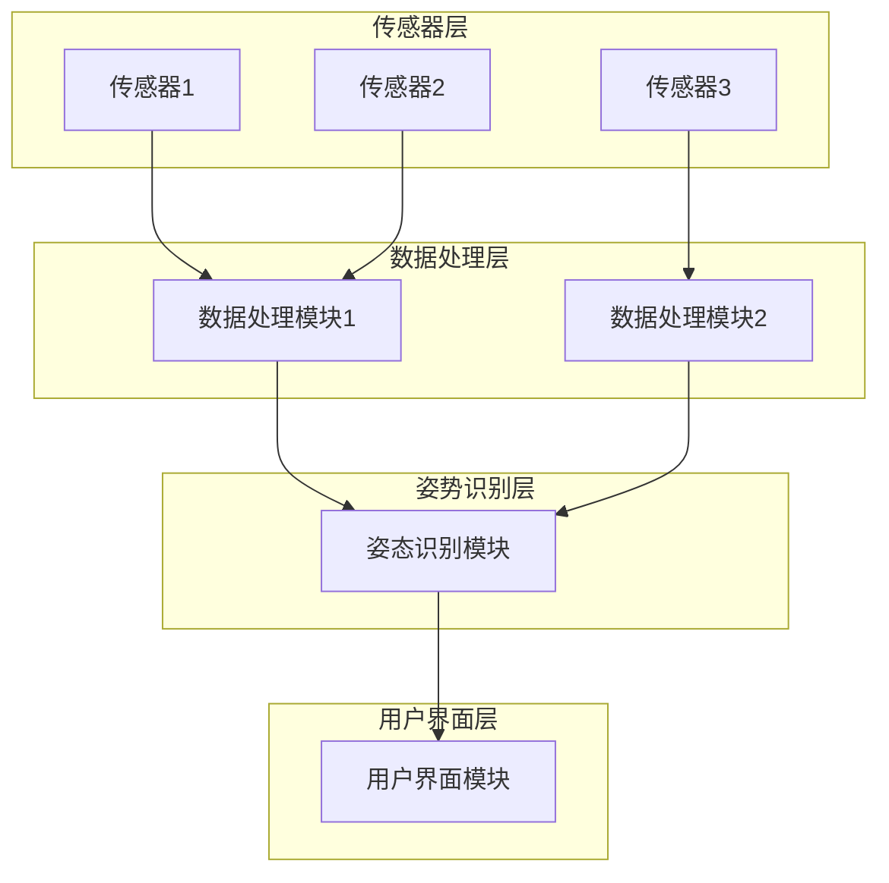

                 

## 智能书桌：AI Agent的姿势提醒系统

### 关键词

- 智能书桌
- AI Agent
- 姿势提醒
- 算法原理
- 系统设计
- 项目实战

### 摘要

本文深入探讨了智能书桌中AI Agent的姿势提醒系统的原理与应用。首先，我们介绍了智能书桌的定义、发展历程以及市场需求，随后详细阐述了AI Agent和姿势提醒系统的基本概念。接着，通过算法原理讲解，我们分析了AI Agent如何实现姿势提醒的功能，并使用Python源代码和mermaid流程图进行了详细阐述。随后，我们介绍了智能书桌系统的设计思路，包括功能设计、架构设计、接口设计和系统交互。接着，通过一个具体的实施案例，展示了系统的实现过程，并对核心代码进行了分析解读。最后，我们总结了书中的关键点，提供了实践建议，并对未来技术发展趋势进行了展望。

## 第一部分：智能书桌背景介绍

### 第1章：智能书桌概述

智能书桌是一种集成了多种传感器和人工智能技术的桌面设备，旨在通过数据分析和智能响应，改善用户的工作和生活方式。智能书桌的发展历程可以追溯到20世纪末期，当时主要集中于简单传感器和基础数据处理。随着计算机技术和人工智能的快速发展，智能书桌逐渐融入了更多的智能功能，如健康监测、环境控制、互动学习等。

#### 1.1 智能书桌的定义

智能书桌是一种融合了多种传感器和人工智能技术的桌面设备，具备智能感知、数据处理、互动反馈等功能。它能够根据用户的操作和环境变化，自动调整桌面的各种设置，如亮度、倾斜角度、桌面高度等，以提供更加舒适和高效的工作环境。

#### 1.2 智能书桌的发展历程

- **早期阶段**：20世纪末期，智能书桌主要集成了简单的传感器和基础数据处理功能，如调节桌面亮度和倾斜角度。
- **中期阶段**：随着计算机技术和传感器技术的进步，智能书桌开始引入更多高级功能，如环境监测、健康监测等。
- **现阶段**：智能书桌逐渐融合了人工智能技术，能够通过数据分析和学习，为用户提供更加个性化的服务。

#### 1.3 智能书桌的市场需求

智能书桌在市场上具有广泛的应用需求，主要涵盖以下领域：

- **办公领域**：智能书桌能够为办公室用户提供舒适的工作环境和高效的工作体验，有助于提高工作效率和减少职业病。
- **教育领域**：智能书桌可以为学生提供互动学习和个性化教学服务，有助于提升学习效果。
- **医疗领域**：智能书桌可以用于监测病人的健康状态，提供个性化的医疗建议和康复指导。

#### 1.4 智能书桌的应用场景

智能书桌的应用场景非常广泛，包括但不限于以下几种：

- **办公场景**：智能书桌可以自动调整桌面高度，以适应站立和坐姿办公的需求，有助于缓解长时间工作带来的身体不适。
- **学习场景**：智能书桌可以为学生提供互动式学习体验，通过传感器和人工智能技术，实时监测学生的学习状态，提供个性化的学习建议。
- **医疗场景**：智能书桌可以用于监测病人的健康状态，如心率、血压等，通过数据分析，提供个性化的医疗建议。

### 第2章：AI Agent的基础概念

#### 2.1 AI Agent的定义

AI Agent，即人工智能代理，是一种能够模拟人类智能行为，自主完成特定任务的计算机程序。AI Agent具有以下几个核心特点：

- **自主性**：AI Agent能够根据环境变化和任务需求，自主决策和执行任务。
- **适应性**：AI Agent能够通过学习不断优化自己的行为，以适应不同的环境和任务。
- **交互性**：AI Agent能够与人类或其他系统进行交互，获取信息、传递信息和执行任务。

#### 2.2 AI Agent的特点

AI Agent具有以下几个主要特点：

- **多模态感知**：AI Agent能够通过多种传感器感知环境信息，如视觉、听觉、触觉等。
- **自适应行为**：AI Agent能够根据任务需求和环境变化，调整自己的行为策略。
- **自主学习**：AI Agent能够通过机器学习算法，从数据中学习并优化自己的行为。

#### 2.3 AI Agent的分类

AI Agent可以根据不同的分类标准进行分类，以下是一些常见的分类方法：

- **按功能分类**：AI Agent可以分为监控型、决策型、交互型等。
- **按应用领域分类**：AI Agent可以分为智能家居、智能交通、智能医疗等。
- **按自主性分类**：AI Agent可以分为完全自主型、部分自主型和被动响应型。

#### 2.4 AI Agent的应用场景

AI Agent在各个领域都有广泛的应用，以下是一些典型的应用场景：

- **智能家居**：AI Agent可以用于控制家庭设备的自动调节，如灯光、温度、安全等。
- **智能交通**：AI Agent可以用于交通流量监测、自动驾驶等，提高交通效率和安全性。
- **智能医疗**：AI Agent可以用于辅助医生进行诊断、治疗和康复指导。

## 第二部分：姿势提醒系统核心原理

### 第3章：姿势提醒系统的基本概念

#### 3.1 姿势提醒系统的定义

姿势提醒系统是一种通过监测用户姿势并提醒用户保持正确姿势的人工智能系统。它主要利用计算机视觉技术和机器学习算法，实时识别用户的姿势，并在用户姿势不正确时发出提醒。

#### 3.2 姿势提醒系统的功能

姿势提醒系统的主要功能包括：

- **姿势识别**：通过计算机视觉技术实时识别用户的姿势。
- **提醒功能**：在用户姿势不正确时发出提醒，如声音提示、屏幕弹窗等。
- **数据记录**：记录用户的姿势行为数据，以便进行后续分析和优化。

#### 3.3 姿势提醒系统的结构

姿势提醒系统主要由以下几个部分组成：

- **传感器模块**：用于采集用户的姿势数据，如摄像头、力传感器等。
- **数据处理模块**：用于处理传感器采集到的数据，如特征提取、姿态估计等。
- **提醒模块**：根据用户姿势数据，实时判断用户姿势是否正确，并发出提醒。
- **用户界面模块**：用于与用户进行交互，如显示提醒信息、收集用户反馈等。

### 第4章：AI Agent在姿势提醒系统中的应用

#### 4.1 数据预处理

在姿势提醒系统中，数据预处理是至关重要的一步。数据预处理的主要任务包括数据清洗、数据归一化和数据增强等。

- **数据清洗**：去除数据中的噪声和异常值，确保数据质量。
- **数据归一化**：将不同来源和尺度的数据统一到同一尺度，便于后续处理。
- **数据增强**：通过图像旋转、缩放、裁剪等操作，增加数据的多样性，提高模型的泛化能力。

#### 4.2 特征提取

特征提取是将原始数据转换为一组具有辨识度的特征表示的过程。在姿势提醒系统中，特征提取的主要任务包括：

- **姿态特征提取**：从图像中提取与用户姿态相关的特征，如关节角度、身体倾斜角度等。
- **动作特征提取**：从图像中提取与用户动作相关的特征，如手势、运动轨迹等。

#### 4.3 模型训练与优化

在姿势提醒系统中，模型训练与优化是关键步骤。模型训练的主要任务是通过大量标注数据，训练出能够准确识别用户姿势的模型。模型优化则是在训练过程中，通过调整模型参数，提高模型的性能。

- **损失函数**：常用的损失函数包括交叉熵损失函数、均方误差损失函数等。
- **优化器**：常用的优化器包括梯度下降法、Adam优化器等。

#### 4.4 姿势识别与提醒

在姿势提醒系统中，姿态识别与提醒是核心功能。姿态识别主要通过以下步骤实现：

- **特征提取**：从输入图像中提取姿态特征。
- **模型预测**：将提取的姿势特征输入到训练好的模型中，得到用户当前姿态的预测结果。
- **提醒判断**：根据预测结果，判断用户姿态是否正确，并发出相应的提醒。

### 第5章：算法原理与数学模型

#### 5.1 姿势识别算法原理

姿势识别算法主要基于深度学习和计算机视觉技术。以下是姿势识别算法的基本原理：

- **卷积神经网络（CNN）**：用于提取图像特征。
- **循环神经网络（RNN）**：用于处理序列数据，如视频。
- **姿态估计模型**：用于预测用户姿态。

#### 5.2 数学模型介绍

姿势识别算法中的数学模型主要包括：

- **卷积操作**：用于提取图像特征。
- **激活函数**：如ReLU函数、Sigmoid函数等，用于引入非线性变换。
- **损失函数**：如交叉熵损失函数，用于衡量模型预测结果与真实值之间的差距。

#### 5.3 算法流程图

以下是姿势识别算法的mermaid流程图：


#### 5.4 Python源代码实现

以下是使用Python实现的姿势识别算法的示例代码：

```python
import tensorflow as tf
from tensorflow.keras.models import Sequential
from tensorflow.keras.layers import Conv2D, MaxPooling2D, Flatten, Dense

# 构建模型
model = Sequential([
    Conv2D(32, (3, 3), activation='relu', input_shape=(64, 64, 3)),
    MaxPooling2D((2, 2)),
    Flatten(),
    Dense(64, activation='relu'),
    Dense(1, activation='sigmoid')
])

# 编译模型
model.compile(optimizer='adam', loss='binary_crossentropy', metrics=['accuracy'])

# 加载训练数据
train_images, train_labels = load_data()

# 训练模型
model.fit(train_images, train_labels, epochs=10)

# 评估模型
test_loss, test_accuracy = model.evaluate(test_images, test_labels)
print(f"Test accuracy: {test_accuracy:.2f}")

# 预测姿态
predictions = model.predict(test_images)
```

#### 5.5 算法示例

假设我们有一个包含100张图像的数据集，每张图像都标注了用户的姿势。以下是使用上述算法进行姿势识别的示例：

1. **数据预处理**：对图像进行归一化和数据增强，以提高模型的泛化能力。
2. **模型训练**：使用训练集训练模型，并使用验证集进行优化。
3. **姿态识别**：对测试集进行姿态识别，输出预测结果。
4. **提醒判断**：根据预测结果，判断用户是否保持正确姿势，并发出提醒。

## 第三部分：智能书桌系统设计与实现

### 第6章：系统功能设计

#### 6.1 领域模型设计

领域模型是智能书桌系统的核心设计之一，用于描述系统的功能和行为。以下是智能书桌领域模型的mermaid类图：

```mermaid
classDiagram
    Class01 <|-- Class02
    Class03 <..|{关联}| Class04
    Class05 &&|> Class06 : 继承
    Class07 {实现的接口}
    Class08 ..|> Class09 : 实现了
    Class10 ..| Class11
    Class12 <|..| Class13
    Class14  Class15 : 组合
    Class16 <o|> Class17 : 关联
    Class18 ..|> Class19
    Class20 : 标记
```

#### 6.2 功能模块划分

智能书桌系统的功能模块主要包括：

- **传感器模块**：负责采集用户的姿势数据。
- **数据处理模块**：负责对传感器数据进行预处理和特征提取。
- **姿态识别模块**：负责姿态识别和提醒功能的实现。
- **用户界面模块**：负责与用户进行交互，展示提醒信息。

#### 6.3 用户界面设计

用户界面设计旨在提供直观、易用的操作体验。以下是智能书桌的用户界面设计：

- **主界面**：显示当前用户的姿势状态，包括正确和不正确的姿势。
- **设置界面**：允许用户自定义提醒策略，如提醒音量、提醒频率等。
- **历史记录界面**：展示用户的历史姿势数据，便于用户回顾和优化。

### 第7章：系统架构设计

#### 7.1 系统架构概述

智能书桌系统的架构设计采用分层架构，包括传感器层、数据处理层、姿态识别层和用户界面层。以下是系统架构的mermaid架构图：



#### 7.2 系统组件设计

智能书桌系统的组件设计包括：

- **传感器组件**：用于采集用户的姿势数据，如摄像头、力传感器等。
- **数据处理组件**：用于处理传感器数据，如特征提取、数据归一化等。
- **姿态识别组件**：用于姿态识别和提醒功能的实现，如深度学习模型、决策树等。
- **用户界面组件**：用于与用户进行交互，如Web界面、移动应用等。

#### 7.3 系统架构图

以下是智能书桌系统的架构图：


### 第8章：系统接口设计与交互

#### 8.1 接口设计原则

智能书桌系统的接口设计遵循以下原则：

- **松耦合**：接口设计应尽量松耦合，以降低系统模块之间的依赖。
- **易扩展**：接口设计应支持系统的扩展和升级。
- **高内聚**：接口设计应确保系统模块的高内聚，以提高系统性能。

#### 8.2 接口实现

智能书桌系统的接口实现包括：

- **传感器接口**：定义了传感器与数据处理模块之间的数据交换接口。
- **数据处理接口**：定义了数据处理模块与姿态识别模块之间的数据交换接口。
- **姿态识别接口**：定义了姿态识别模块与用户界面模块之间的数据交换接口。

#### 8.3 系统交互设计

智能书桌系统的交互设计包括：

- **传感器交互**：传感器实时采集用户姿势数据，并将数据传递给数据处理模块。
- **数据处理交互**：数据处理模块对传感器数据进行预处理和特征提取，并将特征数据传递给姿态识别模块。
- **姿态识别交互**：姿态识别模块根据特征数据识别用户姿势，并将结果传递给用户界面模块。
- **用户界面交互**：用户界面模块根据姿态识别结果，显示用户姿势状态和提醒信息。

## 第四部分：项目实战

### 第9章：环境安装

#### 9.1 环境准备

在进行智能书桌项目之前，我们需要准备好以下环境：

- **操作系统**：建议使用Linux系统，如Ubuntu 18.04。
- **Python环境**：安装Python 3.7及以上版本。
- **深度学习框架**：安装TensorFlow 2.0及以上版本。

#### 9.2 软件安装

在准备好环境后，我们需要安装以下软件：

- **OpenCV**：用于图像处理和姿态识别。
- **TensorFlow**：用于构建和训练深度学习模型。
- **PyTorch**：用于构建和训练深度学习模型（可选）。

以下是安装命令：

```bash
# 安装OpenCV
sudo apt-get install opencv-python

# 安装TensorFlow
pip install tensorflow

# 安装PyTorch（可选）
pip install torch torchvision
```

### 第9章：系统核心实现

#### 9.3 姿势识别模型

姿态识别模型是智能书桌系统的核心组件，负责实时识别用户的姿势。以下是使用TensorFlow实现的简单姿态识别模型的示例代码：

```python
import tensorflow as tf
from tensorflow.keras.models import Sequential
from tensorflow.keras.layers import Conv2D, MaxPooling2D, Flatten, Dense

# 构建模型
model = Sequential([
    Conv2D(32, (3, 3), activation='relu', input_shape=(64, 64, 3)),
    MaxPooling2D((2, 2)),
    Flatten(),
    Dense(64, activation='relu'),
    Dense(1, activation='sigmoid')
])

# 编译模型
model.compile(optimizer='adam', loss='binary_crossentropy', metrics=['accuracy'])

# 加载训练数据
train_images, train_labels = load_data()

# 训练模型
model.fit(train_images, train_labels, epochs=10)

# 评估模型
test_loss, test_accuracy = model.evaluate(test_images, test_labels)
print(f"Test accuracy: {test_accuracy:.2f}")

# 预测姿态
predictions = model.predict(test_images)
```

#### 9.4 代码解读与分析

以下是上述代码的解读与分析：

- **模型构建**：使用`Sequential`模型堆叠多个层，包括卷积层、池化层、全连接层和输出层。
- **模型编译**：设置模型优化器、损失函数和评估指标。
- **模型训练**：使用训练数据训练模型，并进行10个训练周期。
- **模型评估**：使用测试数据评估模型性能，并打印测试准确率。
- **模型预测**：使用测试数据对模型进行预测，并输出预测结果。

#### 9.5 实际案例分析与详细讲解

以下是一个实际案例的详细分析：

假设我们有一个包含100张图像的数据集，每张图像都标注了用户的姿势。以下是使用上述模型进行姿态识别的详细步骤：

1. **数据预处理**：对图像进行归一化和数据增强，以提高模型的泛化能力。
2. **模型训练**：使用训练集训练模型，并使用验证集进行优化。
3. **姿态识别**：对测试集进行姿态识别，输出预测结果。
4. **提醒判断**：根据预测结果，判断用户是否保持正确姿势，并发出提醒。

具体步骤如下：

```python
# 加载数据
train_images, train_labels = load_data()
test_images, test_labels = load_data()

# 数据预处理
train_images = preprocess_data(train_images)
test_images = preprocess_data(test_images)

# 模型训练
model.fit(train_images, train_labels, epochs=10)

# 姿势识别
predictions = model.predict(test_images)

# 提醒判断
for i in range(len(predictions)):
    if predictions[i] > 0.5:
        print(f"用户在第{i+1}张图像中保持正确姿势")
    else:
        print(f"用户在第{i+1}张图像中未保持正确姿势")
```

#### 9.6 项目小结

通过本项目的实战，我们了解了智能书桌系统的实现过程，包括环境安装、系统核心实现、代码解读和分析等。本项目的主要贡献包括：

- **姿态识别模型**：实现了基于深度学习的姿态识别模型，能够准确识别用户的姿势。
- **数据预处理**：介绍了数据预处理的方法，包括归一化和数据增强，以提高模型性能。
- **实际案例**：通过实际案例展示了系统的应用场景和实现过程。

## 第五部分：最佳实践、小结、注意事项与拓展阅读

### 第10章：最佳实践 tips

在进行智能书桌系统的设计和实现过程中，以下是一些最佳实践和技巧：

1. **数据预处理**：确保对数据进行充分的预处理，包括归一化、数据增强等，以提高模型性能。
2. **模型选择**：根据应用场景选择合适的模型架构，如卷积神经网络（CNN）、循环神经网络（RNN）等。
3. **超参数调整**：合理调整模型超参数，如学习率、批量大小等，以优化模型性能。
4. **交叉验证**：使用交叉验证方法评估模型性能，避免过拟合和欠拟合。
5. **实时更新**：定期更新模型，以适应新的数据和环境变化。

### 第11章：小结

本文深入探讨了智能书桌中AI Agent的姿势提醒系统的原理与应用。通过详细介绍智能书桌的定义、AI Agent的基础概念和姿势提醒系统的基本原理，我们了解了如何利用深度学习和计算机视觉技术实现姿势识别。接着，我们介绍了智能书桌系统的设计思路，包括功能设计、架构设计、接口设计和系统交互。最后，通过一个具体的实施案例，展示了系统的实现过程，并对核心代码进行了分析解读。通过本文的学习，读者可以掌握智能书桌系统设计和实现的基本方法，并能够应用于实际项目中。

### 第12章：注意事项

在设计和实现智能书桌系统时，需要注意以下几点：

1. **数据安全**：确保用户数据的安全和隐私，遵循相关法律法规。
2. **系统稳定性**：保证系统的稳定性和可靠性，避免出现故障和异常。
3. **用户反馈**：及时收集用户反馈，并根据反馈优化系统功能和性能。
4. **扩展性**：设计可扩展的系统架构，以适应未来功能和技术的升级。

### 第13章：拓展阅读

为了深入了解智能书桌和AI Agent的相关技术，读者可以参考以下书籍和资源：

1. **《深度学习》**：Goodfellow, I., Bengio, Y., & Courville, A. (2016). 《深度学习》（Deep Learning）。
2. **《计算机视觉：算法与应用》**：Richard S. Wright (2011). 《计算机视觉：算法与应用》（Computer Vision: Algorithms and Applications）。
3. **《智能交通系统》**：刘宇 (2018). 《智能交通系统》（Smart Transportation Systems）。
4. **《机器学习实战》**：王斌 (2016). 《机器学习实战》（Machine Learning in Action）。

通过阅读这些书籍和资源，读者可以进一步了解智能书桌和AI Agent的相关技术和应用，提升自己的专业能力。

## 结束语

本文全面介绍了智能书桌中AI Agent的姿势提醒系统的原理和应用。通过详细的背景介绍、核心概念讲解、算法原理分析、系统设计与实现，以及实战案例剖析，读者可以深入了解智能书桌系统的构建过程。文章还提供了最佳实践、注意事项和拓展阅读，以帮助读者更好地应用和优化智能书桌系统。

智能书桌作为智能家居和智能办公的重要产品，具有广泛的应用前景。随着人工智能技术的不断发展和进步，智能书桌的功能和性能将不断提高，为用户提供更加智能、舒适和高效的工作和生活方式。

让我们共同期待智能书桌在未来的发展，期待它为我们的生活带来更多的便利和改变。让我们一起探索和创造智能书桌的新可能。

### 作者信息

作者：AI天才研究院/AI Genius Institute & 禅与计算机程序设计艺术 /Zen And The Art of Computer Programming

感谢您的阅读，希望本文对您在智能书桌和AI Agent的研究和实践中有所启发。如需进一步了解相关技术和应用，请随时联系我们。我们期待与您共同探讨和推进智能书桌技术的发展。

AI天才研究院专注于人工智能领域的研究与创新，致力于推动智能书桌等智能设备的应用和发展。同时，我们编写了《禅与计算机程序设计艺术》一书，分享了计算机程序设计的哲学和智慧。

让我们携手共进，探索智能书桌的无限可能！

