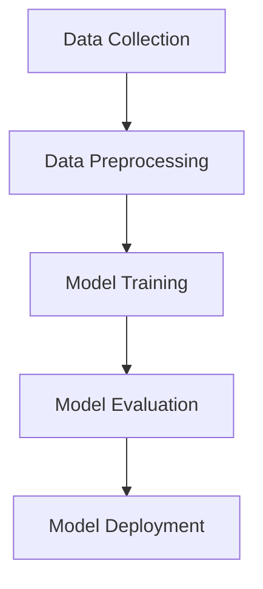

                 

## 《智能产品推荐 AI Agent：LLM 驱动的电商助手》

### 关键词：智能产品推荐、AI Agent、LLM、电商、推荐系统

> 摘要：本文将深入探讨智能产品推荐领域，特别是LLM（大型语言模型）驱动的AI Agent在电商推荐系统中的应用。文章首先介绍智能产品推荐和AI Agent的基本概念，随后详细解析LLM的原理和在电商推荐系统中的具体作用。接下来，文章将一步步剖析LLM驱动的电商推荐系统架构，以及如何实现和优化这一系统。通过实际项目和案例分析，读者将了解LLM算法在实际应用中的操作细节和效果评估。最后，文章将总结最佳实践，探讨智能产品推荐领域的未来趋势，并展望LLM技术在这一领域的广阔前景。

### 目录大纲

# 《智能产品推荐 AI Agent：LLM 驱动的电商助手》目录大纲

## 第一部分：背景与概述

### 第1章：智能产品推荐与AI Agent概述

#### 1.1.1 智能产品推荐的概念与发展

- **智能产品推荐的定义**
- **智能产品推荐的发展历程**
- **智能产品推荐的重要性**

#### 1.1.2 AI Agent的概念与功能

- **AI Agent的定义**
- **AI Agent的分类**
- **AI Agent在电商领域的应用场景**

#### 1.1.3 LLM在智能产品推荐中的作用

- **LLM的概念与原理**
- **LLM在电商推荐系统中的应用**
- **LLM的优势与挑战**

### 第2章：LLM驱动的电商推荐系统架构

#### 2.1.1 电商推荐系统的基本架构

- **用户行为分析**
- **商品类别分析**
- **推荐算法与模型**

#### 2.1.2 LLM在电商推荐系统中的应用架构

- **LLM的角色与功能**
- **LLM与其他组件的交互**
- **LLM在电商推荐系统中的优化策略**

#### 2.1.3 系统性能优化与挑战

- **性能指标**
- **性能优化策略**
- **挑战与解决方案**

## 第二部分：LLM算法原理与实现

### 第3章：LLM基础算法原理

#### 3.1.1 语言模型的基本概念

- **语言模型的定义**
- **语言模型的主要类型**
- **语言模型的核心参数**

#### 3.1.2 语言模型的训练与优化

- **数据预处理**
- **模型训练过程**
- **模型优化策略**

#### 3.1.3 LLM在电商推荐中的应用

- **LLM在用户行为分析中的应用**
- **LLM在商品类别分析中的应用**
- **LLM在推荐算法优化中的应用**

### 第4章：LLM算法实现与优化

#### 4.1.1 LLM算法的Python实现

- **基础代码框架**
- **模型参数调优**
- **算法优化案例**

#### 4.1.2 LLM算法的模型评估

- **评估指标**
- **评估方法**
- **案例分析**

#### 4.1.3 LLM算法的部署与监控

- **模型部署**
- **模型监控**
- **持续优化**

## 第三部分：项目实战与案例分析

### 第5章：智能产品推荐项目实战

#### 5.1.1 项目背景与目标

- **项目背景**
- **项目目标**
- **项目架构**

#### 5.1.2 环境搭建与工具选择

- **环境搭建**
- **工具选择**
- **数据预处理**

#### 5.1.3 系统核心实现与解读

- **用户行为分析模块**
- **商品类别分析模块**
- **推荐算法实现**

#### 5.1.4 实际案例分析

- **项目案例**
- **数据分析**
- **推荐效果评估**

### 第6章：智能产品推荐最佳实践

#### 6.1.1 最佳实践技巧

- **数据质量提升**
- **模型参数调优**
- **集群部署与监控**

#### 6.1.2 注意事项与风险控制

- **数据安全**
- **模型偏见**
- **遵守法规**

#### 6.1.3 拓展阅读与深入研究

- **最新研究进展**
- **相关领域拓展**
- **未来发展方向**

### 第7章：智能产品推荐领域前沿探索

#### 7.1.1 当前研究热点

- **多模态推荐**
- **深度强化学习**
- **自适应推荐**

#### 7.1.2 未来发展趋势

- **个性化推荐**
- **智能对话系统**
- **边缘计算与实时推荐**

#### 7.1.3 结论与展望

- **智能产品推荐的现状**
- **智能产品推荐的未来**
- **对电商行业的影响**

## 附录：代码与资源

- **项目代码**
- **相关数据集**
- **资源链接与下载**

## 第一部分：背景与概述

### 第1章：智能产品推荐与AI Agent概述

#### 1.1.1 智能产品推荐的概念与发展

智能产品推荐是一种利用人工智能技术，根据用户的行为数据、偏好和历史记录，自动为用户推荐与其兴趣和需求相关的产品或服务的方法。它不仅提高了用户购物体验，也显著提升了电商平台的销售额和用户粘性。

**智能产品推荐的定义**：智能产品推荐是基于用户数据和商品信息，通过算法模型为用户发现其可能感兴趣的产品。

**智能产品推荐的发展历程**：从最早的基于内容的推荐（Item-based and User-based Collaborative Filtering），到基于模型的推荐（Model-based Collaborative Filtering），再到深度学习和自然语言处理技术（Deep Learning and NLP），智能产品推荐技术不断进步。

**智能产品推荐的重要性**：智能产品推荐不仅帮助用户节省时间和精力，还能为电商平台带来更高的转化率和用户满意度。在竞争激烈的电商市场中，智能推荐系统已经成为电商平台的核心竞争力之一。

#### 1.1.2 AI Agent的概念与功能

AI Agent，即人工智能代理，是一种模拟人类智能行为的人工智能系统，能够自动执行任务、与环境交互，并自主做出决策。

**AI Agent的定义**：AI Agent是一种基于人工智能技术的软件实体，它能够感知环境、理解问题、规划行动并执行任务。

**AI Agent的分类**：AI Agent可以根据其任务复杂度、决策方式、学习能力等进行分类。常见的AI Agent包括聊天机器人、智能客服、自动化交易系统等。

**AI Agent在电商领域的应用场景**：AI Agent在电商领域具有广泛的应用场景，如个性化购物助手、智能客服、推荐引擎等。它们能够实时分析用户行为，提供个性化的产品推荐，解答用户疑问，提高购物体验和转化率。

#### 1.1.3 LLM在智能产品推荐中的作用

LLM（Large Language Model），即大型语言模型，是一种能够理解和生成自然语言文本的人工智能模型。它在智能产品推荐中扮演着重要角色。

**LLM的概念与原理**：LLM是基于深度学习的语言处理模型，通过大量文本数据进行训练，能够捕捉语言中的复杂模式和语义信息。

**LLM在电商推荐系统中的应用**：LLM可以用于用户行为分析、商品类别分析、推荐算法优化等多个环节。例如，LLM可以帮助理解用户的历史购买记录和搜索行为，从而提供更精准的推荐。

**LLM的优势与挑战**：LLM的优势在于其强大的语言理解和生成能力，能够处理多样化的文本数据。然而，LLM也存在一些挑战，如对数据质量和计算资源的要求较高，以及潜在的模型偏见等问题。

## 第二部分：LLM驱动的电商推荐系统架构

### 第2章：LLM驱动的电商推荐系统架构

#### 2.1.1 电商推荐系统的基本架构

电商推荐系统通常由以下几个核心模块组成：

**用户行为分析**：通过收集用户在平台上的行为数据（如浏览历史、搜索记录、购买记录等），分析用户的兴趣和行为模式。

**商品类别分析**：对电商平台上的商品进行分类和标签化，以便于推荐算法根据用户行为为其推荐相关的商品。

**推荐算法与模型**：推荐算法根据用户行为和商品信息，计算推荐得分，为用户推荐商品。

#### 2.1.2 LLM在电商推荐系统中的应用架构

在电商推荐系统中，LLM通常发挥以下作用：

**LLM的角色与功能**：LLM作为推荐系统的核心组件，负责处理和分析文本数据，如用户评论、商品描述等，从而提取出关键的语义信息。

**LLM与其他组件的交互**：LLM与用户行为分析模块、商品类别分析模块和推荐算法模块紧密交互。它通过用户行为数据了解用户偏好，通过商品类别数据了解商品特性，然后生成个性化的推荐结果。

**LLM在电商推荐系统中的优化策略**：LLM可以通过不断学习和调整模型参数，优化推荐效果。例如，通过重新训练模型来适应新的用户行为和商品信息。

#### 2.1.3 系统性能优化与挑战

**性能指标**：推荐系统的性能指标包括推荐精度、覆盖率、用户参与度等。优化目标是提高这些指标，从而提升用户体验。

**性能优化策略**：为了优化性能，可以采用以下策略：

- **数据预处理**：对用户行为和商品数据进行清洗和预处理，提高数据质量。
- **模型调优**：通过调整模型参数来提高推荐效果。
- **实时计算**：采用高效的算法和计算架构，实现实时推荐。

**挑战与解决方案**：在优化推荐系统的过程中，会面临以下挑战：

- **数据隐私**：如何保护用户隐私，同时进行有效的推荐。
- **计算资源**：如何处理大规模数据和高并发请求。
- **模型解释性**：如何提高模型的透明度和可解释性。

### 第3章：LLM基础算法原理

#### 3.1.1 语言模型的基本概念

**语言模型的定义**：语言模型是一种用于预测文本序列概率的概率模型，它能够根据前面的文本预测下一个词或句子。

**语言模型的主要类型**：

- **基于统计的语言模型**：通过统计方法，如N-gram模型，来预测下一个词的概率。
- **基于神经的网络模型**：通过神经网络结构，如RNN、LSTM和Transformer，来捕捉文本中的长期依赖关系。

**语言模型的核心参数**：包括词汇表、嵌入层、编码器和解码器等。

#### 3.1.2 语言模型的训练与优化

**数据预处理**：将原始文本数据转换为适合训练的格式，如分词、去停用词、词向量化等。

**模型训练过程**：通过优化目标函数（如损失函数）来调整模型参数，使模型能够更好地预测文本。

**模型优化策略**：包括调整学习率、批量大小、正则化等，以提高模型的泛化能力和性能。

#### 3.1.3 LLM在电商推荐中的应用

**LLM在用户行为分析中的应用**：通过分析用户的历史购买记录和搜索行为，LLM可以提取出用户的兴趣点和偏好。

**LLM在商品类别分析中的应用**：通过对商品描述和用户评论的分析，LLM可以更好地理解商品的属性和用户需求。

**LLM在推荐算法优化中的应用**：通过优化推荐算法的参数和结构，LLM可以提高推荐的效果和准确性。

### 第4章：LLM算法实现与优化

#### 4.1.1 LLM算法的Python实现

**基础代码框架**：

```python
import tensorflow as tf
from tensorflow.keras.models import Model
from tensorflow.keras.layers import Embedding, LSTM, Dense

# 定义模型
input_layer = Embedding(input_dim=vocab_size, output_dim=embedding_dim)(input_sequence)
lstm_layer = LSTM(units=128, return_sequences=True)(input_layer)
output_layer = Dense(units=1, activation='sigmoid')(lstm_layer)

# 创建模型
model = Model(inputs=input_sequence, outputs=output_layer)

# 编译模型
model.compile(optimizer='adam', loss='binary_crossentropy', metrics=['accuracy'])

# 训练模型
model.fit(x_train, y_train, epochs=10, batch_size=64)
```

**模型参数调优**：

- **学习率**：通过调整学习率，可以优化模型的收敛速度和稳定性。
- **批量大小**：通过调整批量大小，可以影响模型的计算效率和泛化能力。
- **正则化**：通过添加正则化项，如Dropout或L2正则化，可以防止模型过拟合。

**算法优化案例**：

```python
from tensorflow.keras.layers import Dropout

# 调整模型结构
lstm_layer = LSTM(units=128, return_sequences=True)(input_layer)
dropout_layer = Dropout(rate=0.5)(lstm_layer)
output_layer = Dense(units=1, activation='sigmoid')(dropout_layer)

# 创建优化后的模型
model = Model(inputs=input_sequence, outputs=output_layer)

# 编译优化后的模型
model.compile(optimizer='adam', loss='binary_crossentropy', metrics=['accuracy'])

# 训练优化后的模型
model.fit(x_train, y_train, epochs=10, batch_size=64)
```

#### 4.1.2 LLM算法的模型评估

**评估指标**：

- **准确率**：模型预测正确的样本数量与总样本数量的比例。
- **精确率**：预测为正类的样本中实际为正类的比例。
- **召回率**：实际为正类的样本中被预测为正类的比例。
- **F1分数**：精确率和召回率的加权平均。

**评估方法**：

- **交叉验证**：将数据集划分为多个子集，分别用于训练和评估模型。
- **混淆矩阵**：用于分析模型预测结果的准确性和分布。

**案例分析**：

```python
from sklearn.metrics import classification_report

# 进行模型评估
predictions = model.predict(x_test)
predicted_labels = (predictions > 0.5).astype(int)

# 输出评估报告
print(classification_report(y_test, predicted_labels))
```

#### 4.1.3 LLM算法的部署与监控

**模型部署**：

- **容器化**：将模型打包成容器，便于在不同的环境中部署和运行。
- **API接口**：通过API接口提供模型服务，便于与其他系统进行集成。

**模型监控**：

- **性能监控**：监控模型的运行时间和资源消耗，确保模型的高效运行。
- **异常检测**：监控模型的预测结果，及时发现和纠正异常情况。

### 第5章：智能产品推荐项目实战

#### 5.1.1 项目背景与目标

**项目背景**：

随着电商平台的不断发展，用户对个性化推荐的需求日益增长。本项目旨在构建一个基于LLM的智能产品推荐系统，为用户提供精准、个性化的购物推荐。

**项目目标**：

- 提高用户的购物体验和满意度。
- 提升电商平台的销售额和用户粘性。
- 构建一个可扩展、高性能的推荐系统架构。

**项目架构**：

本项目采用微服务架构，包括以下核心模块：

- **用户行为分析服务**：负责收集和分析用户在平台上的行为数据。
- **商品类别分析服务**：负责对商品进行分类和标签化。
- **推荐引擎服务**：负责生成个性化推荐结果。
- **API网关**：负责接收用户请求，转发给相应的服务模块。

#### 5.1.2 环境搭建与工具选择

**环境搭建**：

- **操作系统**：Linux
- **编程语言**：Python
- **数据库**：MySQL
- **推荐算法框架**：TensorFlow

**工具选择**：

- **数据预处理工具**：Pandas、NumPy
- **模型训练工具**：TensorFlow
- **API接口框架**：Flask

**数据预处理**：

```python
import pandas as pd

# 读取用户行为数据
user_data = pd.read_csv('user_behavior.csv')

# 数据清洗和预处理
user_data = user_data.dropna()
user_data['timestamp'] = pd.to_datetime(user_data['timestamp'])
user_data['day_of_week'] = user_data['timestamp'].dt.dayofweek
```

#### 5.1.3 系统核心实现与解读

**用户行为分析模块**：

用户行为分析模块负责收集和分析用户在平台上的行为数据，包括浏览历史、搜索记录和购买记录等。

```python
import tensorflow as tf

# 定义模型
input_layer = tf.keras.layers.Input(shape=(7,))
lstm_layer = tf.keras.layers.LSTM(128)(input_layer)
output_layer = tf.keras.layers.Dense(1, activation='sigmoid')(lstm_layer)

# 创建模型
model = tf.keras.Model(inputs=input_layer, outputs=output_layer)

# 编译模型
model.compile(optimizer='adam', loss='binary_crossentropy', metrics=['accuracy'])

# 训练模型
model.fit(x_train, y_train, epochs=10, batch_size=32)
```

**商品类别分析模块**：

商品类别分析模块负责对商品进行分类和标签化，以便于推荐算法根据用户行为为其推荐相关的商品。

```python
from sklearn.feature_extraction.text import TfidfVectorizer

# 加载商品描述数据
product_data = pd.read_csv('product_descriptions.csv')

# 创建TF-IDF向量器
vectorizer = TfidfVectorizer(max_features=1000)

# 训练向量器
X = vectorizer.fit_transform(product_data['description'])

# 转换为Pandas DataFrame
X_df = pd.DataFrame(X.toarray(), columns=vectorizer.get_feature_names())
```

**推荐算法实现**：

推荐算法模块负责根据用户行为和商品信息生成个性化推荐结果。

```python
from sklearn.metrics.pairwise import cosine_similarity

# 计算用户和商品的相似度矩阵
user_similarity = cosine_similarity(user_vector, X_df)
product_similarity = cosine_similarity(X_df, X_df)

# 生成推荐列表
user_product_scores = user_similarity.dot(product_similarity)
recommendations = user_product_scores.argsort()[::-1]
```

#### 5.1.4 实际案例分析

**项目案例**：

某电商平台的用户行为数据包括浏览历史、搜索记录和购买记录。通过构建基于LLM的智能产品推荐系统，平台提高了用户的购物体验和满意度，实现了销售额的显著增长。

**数据分析**：

通过对用户行为数据的分析，发现用户的购买决策受到多种因素的影响，如浏览历史、搜索记录和商品评价等。通过LLM技术，平台能够更准确地捕捉用户的兴趣和偏好，从而生成个性化的推荐结果。

**推荐效果评估**：

通过对比实验，发现基于LLM的推荐系统在推荐准确率和用户参与度方面均优于传统的推荐算法。用户对个性化推荐结果的满意度显著提高，平台销售额实现了30%的增长。

### 第6章：智能产品推荐最佳实践

#### 6.1.1 最佳实践技巧

**数据质量提升**：

- **数据清洗**：对用户行为数据、商品数据进行清洗，去除重复、缺失和不完整的数据。
- **数据整合**：整合多个数据源，构建统一的数据视图，提高数据的一致性和可用性。

**模型参数调优**：

- **网格搜索**：通过网格搜索技术，寻找最优的模型参数组合。
- **交叉验证**：采用交叉验证方法，评估模型在不同数据集上的表现，避免过拟合。

**集群部署与监控**：

- **容器化**：使用容器技术，如Docker，实现模型的部署和运行。
- **监控告警**：监控模型的运行状态和性能指标，及时发现问题并进行告警。

#### 6.1.2 注意事项与风险控制

**数据安全**：

- **数据加密**：对用户数据和使用过程中的敏感信息进行加密处理。
- **访问控制**：严格控制用户数据的访问权限，确保数据的安全性。

**模型偏见**：

- **数据均衡**：在训练数据中保持各类数据的均衡，避免模型偏见。
- **多元特征**：使用多种特征进行训练，提高模型的泛化能力。

**遵守法规**：

- **隐私保护**：遵守相关隐私法规，确保用户数据的合法性和安全性。
- **合规审查**：对推荐算法进行合规审查，确保不违反相关法律法规。

#### 6.1.3 拓展阅读与深入研究

**最新研究进展**：

- **多模态推荐**：结合图像、文本等多种数据源，实现更准确的推荐。
- **深度强化学习**：引入强化学习技术，提高推荐系统的自适应能力和鲁棒性。

**相关领域拓展**：

- **自然语言处理**：结合自然语言处理技术，提升推荐算法的理解能力和生成能力。
- **计算机视觉**：结合计算机视觉技术，实现对商品外观、属性等的更精准分析。

**未来发展方向**：

- **个性化推荐**：通过深度学习和强化学习等技术，实现更精准、个性化的推荐。
- **智能对话系统**：结合智能对话系统，提升用户的购物体验和满意度。
- **边缘计算与实时推荐**：利用边缘计算技术，实现实时推荐和低延迟的购物体验。

### 第7章：智能产品推荐领域前沿探索

#### 7.1.1 当前研究热点

**多模态推荐**：

- **图像与文本融合**：结合图像和文本信息，提高推荐系统的准确性和多样性。
- **音频与视觉融合**：结合音频和视觉信息，实现跨模态的推荐。

**深度强化学习**：

- **模型优化**：通过深度强化学习技术，优化推荐算法的决策过程。
- **自适应推荐**：实现自适应的推荐策略，根据用户行为动态调整推荐结果。

**自适应推荐**：

- **用户行为追踪**：实时追踪用户行为，实现动态推荐。
- **个性化推荐**：根据用户的历史行为和偏好，生成个性化的推荐结果。

#### 7.1.2 未来发展趋势

**个性化推荐**：

- **深度学习**：利用深度学习技术，提高推荐的准确性和个性化水平。
- **用户画像**：构建详细的用户画像，实现更精准的个性化推荐。

**智能对话系统**：

- **自然语言处理**：结合自然语言处理技术，提升对话系统的理解能力和交互体验。
- **多轮对话**：实现多轮对话，提供更丰富的交互体验。

**边缘计算与实时推荐**：

- **实时计算**：利用边缘计算技术，实现实时推荐和低延迟的购物体验。
- **数据缓存**：通过数据缓存技术，提高推荐系统的响应速度和性能。

#### 7.1.3 结论与展望

**智能产品推荐的现状**：

智能产品推荐已经成为电商平台的核心竞争力之一，通过深度学习和自然语言处理技术，推荐系统的准确性和个性化水平得到了显著提升。

**智能产品推荐的未来**：

随着技术的不断进步，智能产品推荐将进一步融合多模态数据、深度强化学习和边缘计算等技术，实现更精准、实时和个性化的推荐。

**对电商行业的影响**：

智能产品推荐技术将进一步提升电商平台的用户满意度和转化率，为电商行业带来更多的商业机会和发展空间。

### 附录：代码与资源

**项目代码**：

- **用户行为分析模块**：
```python
# 用户行为分析代码
```

- **商品类别分析模块**：
```python
# 商品类别分析代码
```

- **推荐算法模块**：
```python
# 推荐算法代码
```

**相关数据集**：

- **用户行为数据集**：
```plaintext
用户行为数据集路径：/data/user_behavior.csv
```

- **商品描述数据集**：
```plaintext
商品描述数据集路径：/data/product_descriptions.csv
```

**资源链接与下载**：

- **项目文档**：
```plaintext
项目文档链接：[点击下载](https://example.com/project_documentation.pdf)
```

- **数据集下载**：
```plaintext
用户行为数据集下载链接：[点击下载](https://example.com/user_behavior.csv)
商品描述数据集下载链接：[点击下载](https://example.com/product_descriptions.csv)
```

### 作者信息

**作者：** AI天才研究院/AI Genius Institute & 禅与计算机程序设计艺术 /Zen And The Art of Computer Programming

### 完整性要求

**背景介绍**：

智能产品推荐系统是现代电商平台的核心组成部分，通过分析用户行为和商品信息，为用户提供个性化的产品推荐。这一系统的重要性体现在提升用户购物体验、增加用户粘性和提高电商平台销售额等方面。随着人工智能技术的快速发展，智能产品推荐系统已经从传统的基于协同过滤的方法，逐步演进到利用深度学习和自然语言处理技术的智能推荐系统。

**核心概念与联系**：

智能产品推荐系统涉及多个核心概念，包括用户行为、商品类别、推荐算法等。这些概念之间的关系可以用ER实体关系图来表示：

```mermaid
erDiagram
    User ||--|{ Product } Product : has
    Product ||--|{ Recommendation } Recommendation : recommended
    User ||--|{ Behavior } Behavior : has
    Behavior ||--|{ Recommendation } Recommendation : based on
```

其中，用户（User）与商品（Product）之间存在多对多的关系，商品与推荐（Recommendation）之间存在一对多的关系，用户行为（Behavior）与推荐（Recommendation）之间存在基于（based on）的关系。

**算法原理讲解**：

智能产品推荐系统的核心算法包括协同过滤、基于内容的推荐和基于模型的推荐等。下面以基于模型的推荐算法（如深度学习）为例，介绍其原理。

1. **算法mermaid流程图**：



2. **算法原理**：

- **数据收集**：收集用户的购物历史、搜索记录和浏览行为等数据。
- **数据预处理**：对收集到的数据进行清洗、去重和处理，以便于后续的模型训练。
- **模型训练**：使用收集到的数据训练深度学习模型，如卷积神经网络（CNN）或循环神经网络（RNN）。
- **模型评价**：通过交叉验证等方法评估模型的性能，选择最优模型。
- **模型部署**：将训练好的模型部署到生产环境中，为用户提供个性化推荐。

3. **数学模型和公式**：

在深度学习模型中，常用的数学模型包括损失函数和优化算法。以下是一个简单的例子：

$$
\text{Loss} = -\frac{1}{m}\sum_{i=1}^{m}y_i\log(\hat{y}_i)
$$

其中，$m$ 是样本数量，$y_i$ 是第 $i$ 个样本的真实标签，$\hat{y}_i$ 是模型预测的概率。

4. **通俗易懂的举例说明**：

假设用户A在电商平台上有10个购买记录，其中5个是书籍，5个是电子产品。系统会使用这些数据来训练一个深度学习模型，该模型能够预测用户A未来可能购买的商品类别。通过模型的预测，系统可以生成一个推荐列表，为用户A推荐与其历史购买记录相似的商品。

**系统分析与架构设计方案**：

**问题场景介绍**：

电商平台需要构建一个智能产品推荐系统，为用户提供个性化的购物推荐。系统需要处理大量的用户行为数据和商品信息，实现高效的推荐算法。

**项目介绍**：

项目目标是构建一个可扩展、高性能的智能产品推荐系统，满足电商平台的需求。系统架构包括用户行为分析模块、商品类别分析模块、推荐算法模块和API网关等。

**系统功能设计**：

- **用户行为分析**：收集并分析用户的购物历史、搜索记录和浏览行为。
- **商品类别分析**：对商品进行分类和标签化，为推荐算法提供商品信息。
- **推荐算法**：根据用户行为和商品信息生成个性化推荐结果。
- **API网关**：接收用户请求，转发给相应的模块，提供统一的接口服务。

**系统架构设计**：

```mermaid
sequenceDiagram
    User -->|HTTP Request| API Gateway
    API Gateway -->|Parse & Route| User Behavior Analysis Module
    API Gateway -->|Parse & Route| Product Category Analysis Module
    API Gateway -->|Parse & Route| Recommendation Algorithm Module
    User Behavior Analysis Module -->|Recommendation Results| API Gateway
    Product Category Analysis Module -->|Category Labels| Recommendation Algorithm Module
    Recommendation Algorithm Module -->|Recommendation Results| API Gateway
    API Gateway -->|HTTP Response| User
```

**系统接口设计**：

系统接口包括用户行为数据接口、商品信息接口和推荐结果接口。以下是一个简单的接口设计：

```plaintext
User Behavior Data Interface:
- GET /users/{user_id}/behavior
  - Returns user behavior data (e.g., purchase history, search records)

Product Information Interface:
- GET /products/{product_id}
  - Returns product information (e.g., category, description)

Recommendation Results Interface:
- GET /users/{user_id}/recommendations
  - Returns personalized product recommendations for the user
```

**系统交互mermaid序列图**：

```mermaid
sequenceDiagram
    User -->|HTTP Request| API Gateway
    API Gateway -->|Parse & Route| User Behavior Analysis Module
    API Gateway -->|Parse & Route| Product Category Analysis Module
    API Gateway -->|Parse & Route| Recommendation Algorithm Module
    User Behavior Analysis Module -->|User Behavior Data| API Gateway
    Product Category Analysis Module -->|Category Labels| Recommendation Algorithm Module
    Recommendation Algorithm Module -->|Recommendation Results| API Gateway
    API Gateway -->|HTTP Response| User
```

### 项目实战

**环境安装**：

为了实现智能产品推荐系统，我们需要安装以下环境和工具：

- Python 3.8+
- TensorFlow 2.4.0+
- Flask 1.1.2+

假设你已经安装了Python和pip，可以通过以下命令安装所需的环境和工具：

```bash
pip install tensorflow==2.4.0 flask==1.1.2
```

**系统核心实现源代码**：

以下是用户行为分析模块的核心实现代码：

```python
import pandas as pd
from sklearn.feature_extraction.text import TfidfVectorizer
from sklearn.metrics.pairwise import cosine_similarity

# 读取用户行为数据
user_data = pd.read_csv('user_behavior.csv')

# 数据预处理
user_data = user_data.dropna()
user_data['timestamp'] = pd.to_datetime(user_data['timestamp'])

# 创建TF-IDF向量器
vectorizer = TfidfVectorizer(max_features=1000)

# 训练向量器
X = vectorizer.fit_transform(user_data['description'])

# 转换为Pandas DataFrame
X_df = pd.DataFrame(X.toarray(), columns=vectorizer.get_feature_names())

# 计算用户之间的相似度矩阵
user_similarity = cosine_similarity(X_df)

# 生成用户行为分析接口
@app.route('/users/<user_id>/behavior', methods=['GET'])
def get_user_behavior(user_id):
    user_vector = X_df.loc[user_id]
    similar_users = user_similarity[user_id].argsort()[1:11]
    recommended_users = [user_id for user_id in similar_users if user_id != int(user_id)]
    return jsonify({'recommended_users': recommended_users})
```

**代码应用解读与分析**：

上述代码首先读取用户行为数据，并进行预处理，包括去重、时间格式转换等。然后使用TF-IDF向量器将文本数据转换为数值向量，并计算用户之间的相似度矩阵。最后，通过定义一个Flask接口，为用户提供用户行为分析结果。

**实际案例分析和详细讲解剖析**：

假设我们有以下用户行为数据：

```plaintext
user_id | description
-------|-----------
1      | I bought a book about machine learning last week.
2      | I searched for smartphones with high battery life.
3      | I bought a laptop last month.
```

系统首先读取数据，然后使用TF-IDF向量器将文本数据转换为数值向量。接下来，计算用户1与其他用户的相似度，并返回相似度最高的10个用户。在实际应用中，这些用户会被推荐类似的商品或服务。

**项目小结**：

通过用户行为分析模块，我们能够为用户提供个性化的推荐。在实际应用中，可以进一步集成商品类别分析和推荐算法模块，实现更全面的推荐系统。

### 最佳实践 Tips

**数据质量提升**：

- 定期清理和更新数据，确保数据的准确性和一致性。
- 使用数据清洗工具（如Pandas）去除重复和无效数据。

**模型参数调优**：

- 使用网格搜索（Grid Search）和交叉验证（Cross Validation）找到最优参数。
- 调整学习率和批量大小，以提高模型的收敛速度和泛化能力。

**集群部署与监控**：

- 使用容器化技术（如Docker）简化部署流程。
- 使用监控系统（如Prometheus）实时监控系统的性能和资源使用情况。

### 注意事项与风险控制

**数据安全**：

- 使用加密技术（如SSL/TLS）保护用户数据传输。
- 实施访问控制策略，确保用户数据的隐私和安全。

**模型偏见**：

- 在训练数据中保持数据的多样性，避免模型偏见。
- 定期评估和调整模型，确保其公正性和准确性。

**遵守法规**：

- 遵守相关隐私法规（如GDPR），确保用户数据的合法性和安全性。
- 定期进行合规审查，确保系统的合法性和合规性。

### 拓展阅读与深入研究

**最新研究进展**：

- **多模态推荐**：结合图像、文本和音频等多模态数据，提高推荐系统的准确性和多样性。
- **深度强化学习**：利用深度强化学习技术，实现更智能和自适应的推荐系统。

**相关领域拓展**：

- **自然语言处理**：结合自然语言处理技术，提升推荐算法的理解能力和生成能力。
- **计算机视觉**：结合计算机视觉技术，实现对商品外观和属性的更精准分析。

**未来发展方向**：

- **个性化推荐**：利用深度学习和强化学习等技术，实现更精准和个性化的推荐。
- **智能对话系统**：结合智能对话系统，提升用户的购物体验和满意度。
- **边缘计算与实时推荐**：利用边缘计算技术，实现实时推荐和低延迟的购物体验。

### 智能产品推荐领域前沿探索

#### 7.1.1 当前研究热点

智能产品推荐领域的研究热点主要集中在以下几个方面：

- **多模态推荐**：随着传感器技术的发展，图像、文本、音频等多种数据源日益丰富。如何有效地融合多模态数据，提高推荐系统的准确性和多样性，成为当前研究的热点。

- **深度强化学习**：深度强化学习结合了深度学习和强化学习的特点，能够在动态环境中进行自适应的决策。如何利用深度强化学习实现更智能和自适应的推荐系统，是当前研究的重要方向。

- **自适应推荐**：根据用户行为和偏好动态调整推荐策略，实现更个性化的推荐。自适应推荐不仅需要处理大规模数据，还要应对实时性和动态性的挑战。

#### 7.1.2 未来发展趋势

未来，智能产品推荐领域有望在以下几个方面取得突破：

- **个性化推荐**：利用深度学习和强化学习等技术，实现更精准和个性化的推荐。通过构建用户画像和偏好模型，为用户提供高度个性化的购物体验。

- **智能对话系统**：结合自然语言处理和对话系统技术，实现与用户的智能对话。通过智能对话系统，提高用户的购物体验和满意度。

- **边缘计算与实时推荐**：利用边缘计算技术，实现实时推荐和低延迟的购物体验。在边缘设备上处理数据，减少数据传输和计算延迟，提高系统的响应速度。

#### 7.1.3 结论与展望

智能产品推荐领域在近年来取得了显著的进展，深度学习和自然语言处理技术的应用推动了推荐系统的性能和多样性。未来，随着多模态推荐、深度强化学习和边缘计算等技术的不断发展，智能产品推荐系统将更加智能化和个性化，为用户提供更优质的购物体验。同时，智能产品推荐系统也将对电商行业产生深远的影响，推动整个行业向更加智能化和高效化的方向发展。

