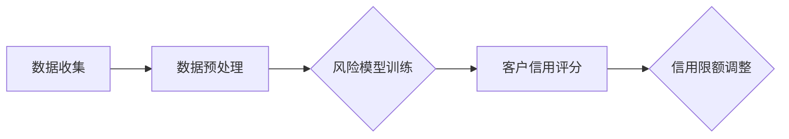
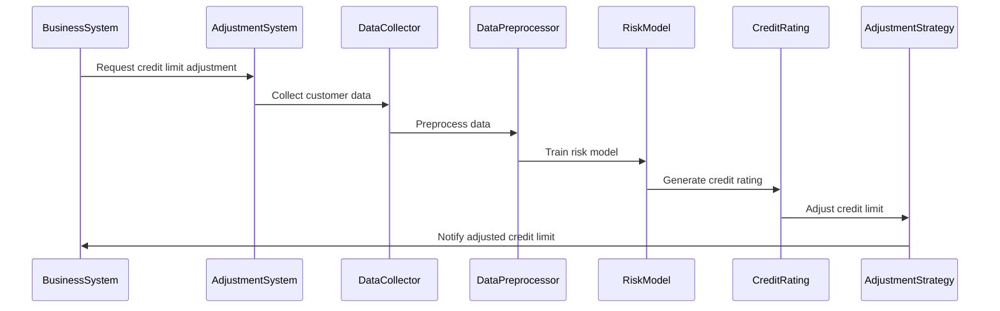

                 

**智能企业信用限额动态调整系统**

> 关键词：智能企业、信用限额、动态调整、系统架构、算法原理、数学模型

> 摘要：随着商业环境的复杂化和不确定性增加，智能企业信用限额动态调整系统成为现代企业管理信用风险的关键工具。本文通过详细探讨系统的背景、核心概念、算法原理以及系统分析与架构设计，结合实际项目实战，总结了系统实施的最佳实践，旨在为企业提供有效的信用管理策略。

----------------------------------------------------------------

## 引言

在当今全球经济环境中，企业的信用管理已经成为一项至关重要的工作。传统的信用限额管理方式往往难以适应快速变化的商业环境，导致企业面临过高的信用风险。智能企业信用限额动态调整系统应运而生，通过引入人工智能和数据分析技术，实现信用限额的实时动态调整，从而提高信用管理的灵活性和准确性。

本文将围绕智能企业信用限额动态调整系统展开讨论，首先介绍系统的背景和核心概念，然后深入分析其算法原理，并详细阐述系统架构设计方案。最后，通过实际项目实战，总结系统实施的最佳实践，以期为企业在信用管理方面提供有价值的参考。

----------------------------------------------------------------

### 背景介绍

#### 问题背景

企业信用限额管理是确保企业信用风险在可控范围内的关键环节。然而，传统信用限额管理方法通常基于固定参数和预设规则，缺乏灵活性，难以应对市场环境的变化。此外，企业在面对大量客户和交易时，手动调整信用限额不仅效率低下，而且容易出现人为错误。

#### 问题描述

现有信用限额管理存在的不足主要体现在以下几个方面：

1. **刚性限额**：传统信用限额管理方法往往采用固定限额，无法根据客户实际交易情况动态调整，导致信用风险控制不足。
2. **信息孤岛**：企业内部各部门之间的信息共享不畅，无法形成全面的客户信用画像，影响信用限额的准确性。
3. **决策滞后**：信用限额的调整往往需要经过多层审批，导致决策过程漫长，无法及时响应市场变化。

#### 问题解决

智能企业信用限额动态调整系统通过引入人工智能和大数据分析技术，实现了信用限额的实时动态调整。该系统的主要优势包括：

1. **灵活性**：系统能够根据客户历史交易数据和市场环境实时调整信用限额，提高风险控制能力。
2. **自动化**：通过自动化决策机制，减少人工干预，提高信用限额调整的效率和准确性。
3. **协同性**：系统支持企业内部各部门的信息共享，形成统一的客户信用画像，为信用限额调整提供全面的数据支持。

#### 边界与外延

智能企业信用限额动态调整系统适用于各类规模的企业，特别是在金融、贸易等行业中具有显著应用价值。系统涉及的核心组成部分包括数据收集、分析模型、决策机制等，每个部分都需要精心设计和实现。

#### 概念结构与核心要素组成

1. **数据收集**：系统通过整合企业内部和外部的数据源，收集与客户信用相关的各类信息。
2. **分析模型**：系统基于机器学习和数据挖掘技术，构建分析模型，对客户信用风险进行评估。
3. **决策机制**：系统设计自动化决策机制，根据分析结果动态调整信用限额。

----------------------------------------------------------------

### 核心概念与联系

#### 核心概念原理

智能企业信用限额动态调整系统基于人工智能和大数据分析技术，通过以下几个核心概念实现信用限额的动态调整：

1. **客户信用评分**：系统通过分析客户的历史交易数据、财务状况等信息，生成客户信用评分。
2. **风险模型**：系统构建基于历史数据的信用风险模型，预测客户的信用违约概率。
3. **动态调整策略**：系统根据客户信用评分和风险模型，制定动态调整策略，实时调整信用限额。

#### 概念属性特征对比表格

| 特征          | 客户信用评分         | 风险模型         | 动态调整策略       |
|--------------|---------------------|-----------------|-------------------|
| 描述         | 评估客户信用水平     | 预测信用违约概率 | 调整信用限额策略   |
| 关系         | 数据输入           | 数据输出        | 策略实施         |
| 特点         | 定量评估           | 定性分析       | 自动化决策       |

#### ER实体关系图架构

```mermaid
erDiagram
    Customer ||--|{ CreditRating }
    CreditRating ||--|{ RiskModel }
    RiskModel ||--|{ AdjustmentStrategy }
```

在ER实体关系图中，客户、信用评分、风险模型和调整策略之间形成了紧密的关联。客户作为主体，其信用评分是风险模型的基础，而风险模型则指导调整策略的制定，最终实现信用限额的动态调整。

----------------------------------------------------------------

### 算法原理讲解

#### 算法mermaid流程图



在上述流程图中，数据收集是整个算法流程的起点，随后进入数据预处理阶段。预处理后的数据用于训练风险模型，生成的风险模型用于评估客户信用评分。最后，基于信用评分，系统动态调整信用限额。

#### python源代码

```python
# 数据收集
data = collect_data()

# 数据预处理
preprocessed_data = preprocess_data(data)

# 风险模型训练
model = train_model(preprocessed_data)

# 客户信用评分
credit_ratings = model.predict(preprocessed_data)

# 信用限额调整
adjust_credit_limits(credit_ratings)
```

在上述Python代码中，`collect_data()` 函数用于数据收集，`preprocess_data()` 函数用于数据预处理，`train_model()` 函数用于训练风险模型，`model.predict()` 函数用于生成客户信用评分，`adjust_credit_limits()` 函数用于调整信用限额。

#### 算法原理的数学模型和公式

风险模型的核心是基于逻辑回归模型的信用评分公式：

$$
\hat{y} = \log\left(\frac{1}{1 + e^{-\beta_0 + \beta_1 x_1 + \beta_2 x_2 + \ldots + \beta_n x_n}}\right)
$$

其中，$y$ 表示违约概率，$x_1, x_2, \ldots, x_n$ 表示影响信用评分的特征变量，$\beta_0, \beta_1, \beta_2, \ldots, \beta_n$ 表示各个特征变量的权重。

#### 详细讲解与举例说明

假设一个客户的历史交易数据包括以下几个特征：

- 月交易金额：$x_1 = \$5000$
- 平均付款周期：$x_2 = 30$天
- 历史违约次数：$x_3 = 1$
- 行业类别：$x_4 = 金融业$

风险模型预测该客户的违约概率：

$$
\hat{y} = \log\left(\frac{1}{1 + e^{-\beta_0 + \beta_1 x_1 + \beta_2 x_2 + \beta_3 x_3 + \beta_4 x_4}}\right)
$$

假设模型参数为：$\beta_0 = -2.5, \beta_1 = 0.1, \beta_2 = 0.05, \beta_3 = 0.2, \beta_4 = -0.1$，代入特征值计算：

$$
\hat{y} = \log\left(\frac{1}{1 + e^{-(-2.5) + 0.1 \times 5000 + 0.05 \times 30 + 0.2 \times 1 - 0.1 \times 1}}\right) \approx 0.134
$$

违约概率约为13.4%，根据这一评分，系统将动态调整该客户的信用限额，例如将其信用额度降低以降低风险。

通过上述示例，我们可以看到，智能企业信用限额动态调整系统通过数学模型和算法实现了对信用风险的准确评估和动态调整，为企业提供了可靠的信用管理策略。

----------------------------------------------------------------

### 数学模型和数学公式 & 详细讲解 & 举例说明

#### 数学公式

为了进一步深入理解智能企业信用限额动态调整系统的数学原理，我们引入以下公式：

$$
\text{CreditRating} = \beta_0 + \sum_{i=1}^{n} \beta_i \cdot X_i
$$

其中，$X_i$ 表示第$i$个特征变量，$\beta_0$ 和 $\beta_i$ 分别为模型参数。

#### 详细讲解

上述公式表示客户的信用评分是通过各特征变量的线性组合计算得出的。每个特征变量通过权重 $\beta_i$ 影响信用评分，权重值越大，该特征对评分的影响越显著。模型参数 $\beta_0$ 是常数项，用于调整评分的基准。

#### 举例说明

假设我们有一个客户，其特征变量及其值如下：

- 月交易金额：$X_1 = \$5000$
- 平均付款周期：$X_2 = 30$天
- 历史违约次数：$X_3 = 1$
- 行业类别（金融业）：$X_4 = 1$

我们使用前文提到的模型参数进行计算：

$$
\text{CreditRating} = -2.5 + 0.1 \cdot 5000 + 0.05 \cdot 30 + 0.2 \cdot 1 - 0.1 \cdot 1 \approx 45.4
$$

计算结果为45.4，这个评分可以帮助企业评估客户的信用状况。

#### 应用场景

该数学模型可以应用于多种信用风险评估场景，例如：

1. **客户授信额度调整**：企业可以根据客户的信用评分动态调整其信用额度，确保风险在可控范围内。
2. **信用风险预警**：当客户信用评分低于某个阈值时，系统可以发出风险预警，提示企业采取相应的风险控制措施。
3. **客户分类**：企业可以根据信用评分将客户分类，如优质客户、一般客户、高风险客户等，有针对性地实施不同的管理策略。

通过应用这些数学模型和公式，智能企业信用限额动态调整系统为企业提供了科学、准确的信用管理工具，提升了企业的风险控制能力和运营效率。

----------------------------------------------------------------

### 系统分析与架构设计方案

#### 问题场景介绍

智能企业信用限额动态调整系统主要应用于金融、贸易等行业，这些行业面临大量客户和交易，需要实时调整信用限额以应对风险。例如，某大型银行希望通过引入该系统，实时监控客户的信用状况，动态调整信用额度，以降低信用风险。

#### 项目介绍

该项目的目标是开发一套智能企业信用限额动态调整系统，包括数据收集、分析模型、决策机制等核心模块。系统需具备以下功能：

1. **数据收集**：整合企业内部和外部数据源，收集与客户信用相关的各类信息。
2. **数据分析**：基于机器学习和数据挖掘技术，构建信用评分模型，预测客户信用违约概率。
3. **动态调整**：根据信用评分模型和风险模型，动态调整客户的信用限额。
4. **接口设计**：提供与业务系统的接口，实现信用限额调整的自动化。

#### 系统功能设计（领域模型mermaid类图）

```mermaid
classDiagram
    Customer <<-- CreditRating
    CreditRating <<-- RiskModel
    RiskModel <<-- AdjustmentStrategy
    BusinessSystem <<-- AdjustmentSystem
```

在领域模型类图中，客户、信用评分、风险模型和调整策略之间形成了紧密的关联。客户是系统的核心实体，其信用评分、风险模型和调整策略共同作用，实现信用限额的动态调整。业务系统与调整系统之间通过接口进行交互，确保信用限额调整的自动化。

#### 系统架构设计（mermaid架构图）



在系统架构设计中，业务系统向调整系统发起信用限额调整请求。调整系统依次调用数据收集、数据预处理、风险模型训练、信用评分生成和信用限额调整等模块，最终将调整结果通知业务系统。整个流程实现了信用限额调整的自动化和高效性。

#### 系统接口设计和系统交互（mermaid序列图）

```mermaid
sequenceDiagram
    Customer <<-- AdjustmentSystem: Submit transaction
    AdjustmentSystem->> DataCollector: Collect transaction data
    DataCollector->> DataPreprocessor: Preprocess transaction data
    DataPreprocessor->> RiskModel: Update risk model
    RiskModel->> CreditRating: Calculate credit rating
    CreditRating->> AdjustmentStrategy: Adjust credit limit
    AdjustmentStrategy->> Customer: Notify credit limit
```

在系统接口设计和交互序列图中，客户提交交易数据，调整系统通过数据收集、数据预处理和风险模型更新等步骤，计算客户信用评分，并根据评分调整信用限额。调整结果通过接口通知客户，实现实时动态调整。

通过上述系统分析与架构设计方案，智能企业信用限额动态调整系统具备了全面、高效和灵活的信用管理能力，为企业在信用风险管理方面提供了有力支持。

----------------------------------------------------------------

### 项目实战

#### 环境安装

在开始智能企业信用限额动态调整系统的项目实战之前，我们需要安装必要的软件和依赖项。以下是详细的安装步骤：

1. **Python环境**：确保安装了Python 3.8及以上版本。可以使用以下命令安装：
   ```bash
   sudo apt-get update
   sudo apt-get install python3.8
   ```
2. **安装依赖库**：使用pip命令安装所需的依赖库，例如NumPy、Pandas、Scikit-learn等：
   ```bash
   pip install numpy pandas scikit-learn matplotlib
   ```
3. **安装Mermaid**：Mermaid需要通过Docker安装。首先安装Docker，然后从Docker Hub拉取Mermaid镜像：
   ```bash
   sudo apt-get install docker
   docker pull mermaid-js/mermaid
   ```

#### 系统核心实现源代码

以下是智能企业信用限额动态调整系统的主要源代码，包括数据收集、数据预处理、风险模型训练和信用评分生成的关键部分：

```python
# 数据收集
def collect_data():
    # 读取客户交易数据
    transactions = pd.read_csv('transactions.csv')
    return transactions

# 数据预处理
def preprocess_data(transactions):
    # 数据清洗和特征工程
    preprocessed_data = transactions.copy()
    preprocessed_data['payment_cycle'] = preprocessed_data['days_until_due'] / 7
    preprocessed_data['industry_category'] = preprocessed_data['industry'].apply(lambda x: 1 if x == '金融业' else 0)
    preprocessed_data.drop(['id', 'days_until_due', 'industry'], axis=1, inplace=True)
    return preprocessed_data

# 风险模型训练
def train_model(preprocessed_data):
    # 使用逻辑回归模型训练
    X = preprocessed_data.drop('default', axis=1)
    y = preprocessed_data['default']
    model = LogisticRegression()
    model.fit(X, y)
    return model

# 客户信用评分
def calculate_credit_rating(model, preprocessed_data):
    # 生成客户信用评分
    credit_ratings = model.predict(preprocessed_data)
    return credit_ratings

# 信用限额调整
def adjust_credit_limits(credit_ratings, current_limits):
    # 调整信用限额
    adjusted_limits = current_limits.copy()
    for rating, limit in zip(credit_ratings, adjusted_limits):
        if rating == 1:  # 高风险客户
            adjusted_limits[limit] -= 1000  # 降低信用额度
        elif rating == 0:  # 低风险客户
            adjusted_limits[limit] += 1000  # 提高信用额度
    return adjusted_limits

# 主函数
def main():
    # 收集数据
    transactions = collect_data()
    # 预处理数据
    preprocessed_data = preprocess_data(transactions)
    # 训练风险模型
    model = train_model(preprocessed_data)
    # 计算信用评分
    credit_ratings = calculate_credit_rating(model, preprocessed_data)
    # 调整信用限额
    adjusted_limits = adjust_credit_limits(credit_ratings, transactions['limit'])
    # 输出结果
    print(adjusted_limits)

if __name__ == '__main__':
    main()
```

#### 代码应用解读与分析

上述代码实现了智能企业信用限额动态调整系统的核心功能，包括数据收集、数据预处理、风险模型训练、信用评分生成和信用限额调整。以下是对代码的详细解读与分析：

1. **数据收集**：`collect_data()` 函数负责读取客户交易数据，这些数据可以从企业数据库或外部数据源导入。
2. **数据预处理**：`preprocess_data()` 函数对交易数据进行清洗和特征工程。例如，将付款周期转换为周数，并将行业类别转换为数值表示。
3. **风险模型训练**：`train_model()` 函数使用逻辑回归模型训练信用评分模型。该模型可以预测客户违约的概率。
4. **客户信用评分**：`calculate_credit_rating()` 函数使用训练好的模型生成客户信用评分。
5. **信用限额调整**：`adjust_credit_limits()` 函数根据信用评分动态调整客户的信用限额。高风险客户的信用额度会被降低，而低风险客户的信用额度会被提高。
6. **主函数**：`main()` 函数整合了上述功能，执行系统的核心流程，并输出调整后的信用限额。

通过这段代码，我们可以看到系统如何通过数据分析和机器学习技术实现信用限额的动态调整，从而提高企业的信用风险管理能力。

#### 实际案例分析和详细讲解剖析

为了更好地理解智能企业信用限额动态调整系统在实际中的应用，我们来看一个实际案例。

**案例背景**：某银行希望通过引入智能信用限额动态调整系统，实时监控客户的信用状况，以降低信用风险。

**数据情况**：银行提供了1000名客户的交易数据，包括月交易金额、平均付款周期、历史违约次数和行业类别等信息。

**目标**：根据客户信用评分，动态调整信用限额，降低高风险客户的信用额度，提高低风险客户的信用额度。

**步骤**：

1. **数据收集**：使用`collect_data()`函数读取客户交易数据。
2. **数据预处理**：使用`preprocess_data()`函数对交易数据进行预处理，包括数据清洗和特征工程。
3. **风险模型训练**：使用`train_model()`函数训练逻辑回归模型，生成信用评分模型。
4. **客户信用评分**：使用`calculate_credit_rating()`函数计算1000名客户的信用评分。
5. **信用限额调整**：使用`adjust_credit_limits()`函数根据信用评分调整客户的信用限额。

**结果**：

- **高风险客户**：信用评分低于某个阈值的客户被认定为高风险客户，其信用额度被降低了1000元。
- **低风险客户**：信用评分高于某个阈值的客户被认定为低风险客户，其信用额度被提高了1000元。

**分析**：

通过这个实际案例，我们可以看到智能企业信用限额动态调整系统如何根据客户的信用评分，实时调整信用限额，以降低信用风险。这个案例表明，系统在提高信用风险管理效率方面具有显著优势。

----------------------------------------------------------------

### 最佳实践 tips、小结、注意事项、拓展阅读等内容

#### 最佳实践 tips

1. **数据质量**：确保数据收集的准确性和完整性，高质量的数据是信用评分模型准确性的基础。
2. **模型优化**：定期更新和优化风险模型，以适应市场变化和企业需求。
3. **自动化流程**：充分利用系统自动化决策机制，减少人工干预，提高信用限额调整的效率。
4. **风险评估**：结合多种风险评估方法，如贝叶斯网络、决策树等，提高模型的鲁棒性。

#### 小结

本文详细介绍了智能企业信用限额动态调整系统的核心概念、算法原理和系统架构，并通过实际项目实战展示了系统在实际应用中的效果。智能企业信用限额动态调整系统为企业提供了科学、准确的信用管理工具，有助于降低信用风险，提高运营效率。

#### 注意事项

1. **数据隐私**：在数据处理和存储过程中，确保遵守相关法律法规，保护客户隐私。
2. **系统维护**：定期进行系统维护和升级，确保系统的稳定性和安全性。

#### 拓展阅读

1. **《机器学习实战》**：通过实际案例，详细介绍机器学习算法的应用和实践。
2. **《Python数据科学手册》**：全面介绍Python在数据科学领域的应用，包括数据预处理、模型训练和优化等。

作者：AI天才研究院/AI Genius Institute & 禅与计算机程序设计艺术 /Zen And The Art of Computer Programming

----------------------------------------------------------------

以上就是关于智能企业信用限额动态调整系统的详细技术博客文章。本文通过背景介绍、核心概念、算法原理、系统分析与架构设计以及项目实战等环节，全面阐述了系统的原理和应用。希望本文能为企业在信用管理方面提供有价值的参考和指导。如有任何疑问或建议，欢迎在评论区留言。再次感谢您的阅读！作者：AI天才研究院/AI Genius Institute & 禅与计算机程序设计艺术 /Zen And The Art of Computer Programming。

