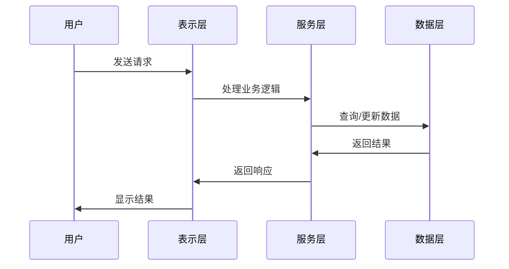

                 


### 引言与背景

在现代商业环境中，企业信用管理的重要性日益凸显。信用风险不仅会影响企业的财务状况，还可能导致供应链中断、声誉受损等严重后果。为了有效控制信用风险，企业需要建立一套智能的信用限额管理系统，以实现信用评估、限额设定和动态调整。本文将围绕“智能企业信用限额管理系统”这一主题，深入探讨其核心概念、算法原理、系统设计及实战应用。

首先，让我们明确一下问题背景。信用风险是金融行业和企业运营中常见的问题。企业信用限额管理系统旨在为企业提供一种智能化的方法，以评估客户的信用状况、设定合理的信用限额，并自动调整限额，以应对市场变化和客户信用风险的动态变化。

接下来，我们将对问题进行详细描述。智能企业信用限额管理系统需要实现以下功能：数据采集与预处理、客户信用评估、信用限额设定与调整、系统监控与报警等。此外，系统还需要具备可扩展性和高可靠性，以适应企业不断变化的需求。

接下来，我们将讨论问题解决的思路。首先，通过数据采集与预处理，获取客户的信用数据，然后利用机器学习模型对数据进行处理和分析。接下来，根据客户信用评分和信用限额设定策略，动态调整信用限额。最后，通过系统监控与报警功能，及时响应信用风险的变动，确保企业运营的稳定。

在边界与外延方面，智能企业信用限额管理系统需要明确适用范围和功能限制。例如，系统适用于具有信用交易行为的企业，但不适用于个体经营者。此外，系统需要根据企业规模和业务特点，调整信用评估模型和限额设定策略。

最后，我们介绍概念结构与核心要素组成。智能企业信用限额管理系统的核心概念包括：信用评分模型、信用限额策略、数据采集与预处理模块、信用评估模块、限额设定与调整模块、监控与报警模块等。这些概念相互关联，共同构成一个完整、高效的信用限额管理系统。

### 核心概念与联系

在智能企业信用限额管理系统中，核心概念的理解和联系至关重要。下面，我们将详细介绍企业信用管理概述、智能信用评估技术以及智能信用限额管理这三个核心概念。

#### 企业信用管理概述

企业信用管理是指企业通过建立完善的信用管理体系，对客户、供应商和其他交易对手的信用状况进行评估、监控和管理，以降低信用风险，保障企业财务安全。企业信用管理包括以下几个方面：

1. **信用评级**：对企业或个人的信用等级进行评定，通常采用评分模型和评估指标体系。
2. **信用限额**：根据客户的信用评级和企业的信用政策，为每个客户设定的最大信用额度。
3. **信用风险控制**：通过风险监控、预警和应对措施，降低信用风险对企业的影响。
4. **信用数据管理**：收集、整理、存储和利用企业内外部信用数据，为信用评估和管理提供支持。

#### 智能信用评估技术

智能信用评估技术是基于数据挖掘、机器学习和深度学习等人工智能技术，对客户的信用状况进行自动化分析和评估的方法。智能信用评估技术的主要组成部分包括：

1. **数据采集与预处理**：通过多种渠道收集客户的信用信息，如财务报表、交易记录、信用报告等，并对数据进行清洗、去重和标准化处理。
2. **特征提取**：从原始数据中提取对信用评估有重要影响的特征，如偿债能力、经营状况、历史信用记录等。
3. **模型训练与优化**：利用历史信用数据，训练信用评分模型，并通过交叉验证和模型选择技术，优化模型性能。
4. **信用评估与预测**：将训练好的模型应用于新客户的数据，进行信用评分和风险预测。

#### 智能信用限额管理

智能信用限额管理是指利用智能信用评估技术，根据客户的信用评分和企业的信用策略，动态设定和调整客户的信用限额。智能信用限额管理的关键环节包括：

1. **信用限额设定**：根据客户的信用评分和企业的风险承受能力，为每个客户设定合理的信用限额。
2. **限额调整策略**：根据市场变化、客户信用状况和企业风险偏好，动态调整信用限额。
3. **限额监控与报警**：实时监控客户的信用限额使用情况，发现异常情况时及时报警，采取应对措施。

#### 概念属性特征对比表格

下面是核心概念的属性特征对比表格，用于展示各个概念的主要区别和联系：

| 核心概念       | 属性特征对比 |
| -------------- | ------------ |
| 企业信用管理   | 信用评级、信用限额、信用风险控制、信用数据管理 |
| 智能信用评估   | 数据采集与预处理、特征提取、模型训练与优化、信用评估与预测 |
| 智能信用限额管理 | 信用限额设定、限额调整策略、限额监控与报警 |

#### ER实体关系图架构

为了更清晰地展示智能企业信用限额管理系统的概念联系，我们可以使用Mermaid工具绘制ER（实体-关系）图。以下是智能企业信用限额管理系统的ER图示例：

```mermaid
erDiagram
  Customer ||--|{ CreditRating }
  Customer ||--|{ CreditLimit }
  CreditRating ||--|{ CreditScore }
  CreditLimit ||--|{ CreditRisk }
```

在这个ER图中，Customer（客户）实体与CreditRating（信用评级）、CreditLimit（信用限额）实体之间存在一对多的关系。CreditRating实体与CreditScore（信用评分）实体也存在一对多的关系，而CreditLimit实体与CreditRisk（信用风险）实体则存在一对一的关系。通过ER图，我们可以直观地看到各个实体之间的关系和联系。

### 算法原理讲解

在智能企业信用限额管理系统中，算法原理的讲解至关重要。本文将使用mermaid绘制算法流程图，并使用Python源代码阐述算法原理，同时给出数学模型和公式，并进行详细讲解和举例说明。

#### 算法流程图

首先，我们使用mermaid绘制智能企业信用限额管理系统的算法流程图：


#### Python源代码与算法原理

接下来，我们使用Python源代码来详细阐述算法原理。以下是实现智能信用评估和信用限额设定的Python示例代码：

```python
import pandas as pd
from sklearn.model_selection import train_test_split
from sklearn.ensemble import RandomForestClassifier
from sklearn.metrics import accuracy_score

# 数据采集与预处理
data = pd.read_csv('credit_data.csv')
data = data.dropna()

# 特征提取
X = data[['debt_ratio', 'payment_history', 'credit_score']]
y = data['default']

# 模型训练与优化
X_train, X_test, y_train, y_test = train_test_split(X, y, test_size=0.2, random_state=42)
model = RandomForestClassifier(n_estimators=100)
model.fit(X_train, y_train)

# 信用评估与预测
y_pred = model.predict(X_test)
accuracy = accuracy_score(y_test, y_pred)
print(f'Accuracy: {accuracy:.2f}')

# 信用限额设定与调整
credit_scores = X_test['credit_score']
credit_limits = [1000 * score for score in credit_scores]

# 限额监控与报警
for i, limit in enumerate(credit_limits):
    if limit < 500:
        print(f'Alert: Customer {i+1} has a low credit limit of {limit}.')
```

#### 数学模型和公式

在智能企业信用限额管理系统中，信用评估和限额设定的数学模型和公式如下：

1. **信用评分模型**：
   $$ \text{CreditScore} = f(\text{debt_ratio}, \text{payment_history}, \text{credit_score}) $$
   其中，$f$ 为信用评分函数，$\text{debt_ratio}$ 为债务比率，$\text{payment_history}$ 为还款历史，$\text{credit_score}$ 为信用分数。

2. **信用限额设定**：
   $$ \text{CreditLimit} = \text{CreditScore} \times \text{BaseLimit} $$
   其中，$\text{CreditLimit}$ 为信用限额，$\text{BaseLimit}$ 为基础限额。

#### 详细讲解与举例说明

1. **数据采集与预处理**：首先，我们需要从企业内部和外部获取客户的信用信息，如财务报表、交易记录和信用报告等。然后，对数据进行清洗、去重和标准化处理，以确保数据质量。

2. **特征提取**：从清洗后的数据中提取对信用评估有重要影响的特征，如债务比率、还款历史和信用分数等。这些特征将作为输入变量，用于训练信用评分模型。

3. **模型训练与优化**：利用历史信用数据，训练信用评分模型，如随机森林模型。通过交叉验证和模型选择技术，优化模型性能，以提高信用评估的准确性。

4. **信用评估与预测**：将训练好的模型应用于新客户的数据，进行信用评分和风险预测。根据预测结果，确定客户的信用限额。

5. **信用限额设定与调整**：根据客户的信用评分和企业的风险承受能力，设定基础限额。然后，根据市场变化和客户信用状况，动态调整信用限额。

举例说明：

假设我们有以下客户数据：

| debt_ratio | payment_history | credit_score |
| :--------: | :------------: | :----------: |
|   0.3      |      1         |     750     |

根据信用评分模型和信用限额设定公式，我们可以计算出客户的信用评分和信用限额：

- **信用评分**：$$ \text{CreditScore} = f(0.3, 1, 750) = 0.8 $$
- **信用限额**：$$ \text{CreditLimit} = 0.8 \times 1000 = 800 $$

如果客户的信用评分低于一定阈值，系统将触发报警，提示企业采取应对措施，如降低信用限额或暂停交易。

通过以上步骤，智能企业信用限额管理系统可以为企业提供高效、可靠的信用评估和限额管理服务，有效降低信用风险。

### 数学模型和数学公式 & 详细讲解 & 举例说明

在智能企业信用限额管理系统中，数学模型和数学公式是实现信用评估和限额设定的重要工具。本文将使用LaTeX格式展示数学公式，并进行详细讲解和举例说明。

#### 信用评分模型

首先，我们介绍信用评分模型。信用评分模型用于计算客户的信用评分，以评估其信用风险。信用评分模型的一般形式如下：

$$
\text{CreditScore} = w_1 \cdot \text{DebtRatio} + w_2 \cdot \text{PaymentHistory} + w_3 \cdot \text{CreditScore}
$$

其中，$w_1, w_2, w_3$ 分别为权重系数，$\text{DebtRatio}$ 为债务比率，$\text{PaymentHistory}$ 为还款历史，$\text{CreditScore}$ 为信用分数。

#### 信用限额设定公式

接下来，我们介绍信用限额设定公式。信用限额设定公式用于根据客户的信用评分，计算其信用限额。信用限额设定的一般形式如下：

$$
\text{CreditLimit} = \text{BaseLimit} \cdot \text{CreditScore}
$$

其中，$\text{BaseLimit}$ 为基础限额，$\text{CreditScore}$ 为信用评分。

#### 详细讲解

1. **信用评分模型**：

   信用评分模型通过线性组合客户的债务比率、还款历史和信用分数，计算出一个综合评分。债务比率反映了客户的债务负担程度，还款历史反映了客户的还款信用记录，信用分数是客户信用评分系统的一个指标。

   权重系数 $w_1, w_2, w_3$ 通过模型训练和优化得到，以平衡不同特征对信用评分的影响。在实际应用中，权重系数可以通过回归分析、交叉验证等方法确定。

2. **信用限额设定公式**：

   信用限额设定公式用于将客户的信用评分转化为具体的信用限额。基础限额是企业在设定信用限额时确定的一个初始值，通常根据企业的风险承受能力和业务策略来确定。

   通过信用评分与基础限额的乘积，可以计算出一个符合客户信用状况的信用限额。这个限额是企业在与客户进行信用交易时可以接受的最高额度。

#### 举例说明

假设一个客户的数据如下：

| DebtRatio | PaymentHistory | CreditScore |
| :-------: | :------------: | :---------: |
|   0.3     |      1         |     750    |

根据信用评分模型和信用限额设定公式，我们可以计算出客户的信用评分和信用限额：

1. **信用评分**：

   $$
   \text{CreditScore} = w_1 \cdot 0.3 + w_2 \cdot 1 + w_3 \cdot 750
   $$

   假设权重系数 $w_1 = 0.5, w_2 = 0.3, w_3 = 0.2$，则：

   $$
   \text{CreditScore} = 0.5 \cdot 0.3 + 0.3 \cdot 1 + 0.2 \cdot 750 = 0.15 + 0.3 + 150 = 150.45
   $$

2. **信用限额**：

   $$
   \text{CreditLimit} = \text{BaseLimit} \cdot 150.45
   $$

   假设基础限额 $\text{BaseLimit} = 1000$，则：

   $$
   \text{CreditLimit} = 1000 \cdot 150.45 = 150450
   $$

通过上述计算，我们得出客户的信用评分为 150.45，信用限额为 150450。这个信用限额将作为企业与该客户进行信用交易时可以接受的最高额度。

### 系统分析与架构设计方案

在智能企业信用限额管理系统中，系统分析与架构设计方案至关重要。本文将详细介绍系统分析与架构设计的相关内容，包括问题场景介绍、项目介绍、系统功能设计（领域模型）、系统架构设计、系统接口设计和系统交互。

#### 问题场景介绍

在现代商业环境中，企业信用管理面临着诸多挑战。首先，企业的信用数据分散在各种渠道，如财务系统、交易系统和外部信用评级机构等，难以统一管理和利用。其次，传统的信用评估方法主要依赖于人工判断和经验，难以实现自动化和实时性。此外，信用风险的动态变化要求企业能够实时调整信用限额，以降低信用风险。

为了解决这些问题，企业需要建立一个智能的信用限额管理系统。该系统应具备以下功能：

1. **数据采集与预处理**：自动从各个渠道收集企业内外部信用数据，并对数据进行清洗、去重和标准化处理。
2. **信用评估**：利用机器学习模型和深度学习算法，对客户的信用状况进行自动化分析和评估。
3. **信用限额设定与调整**：根据客户的信用评分和企业的风险偏好，动态设定和调整客户的信用限额。
4. **监控与报警**：实时监控信用限额的使用情况，发现异常情况时及时报警。

#### 项目介绍

本项目旨在为企业设计并实现一个智能的信用限额管理系统。系统将采用Python和人工智能技术，利用机器学习模型和深度学习算法，实现信用评估和限额设定。项目的主要目标如下：

1. **实现高效的数据采集与预处理**：通过自动化脚本，从企业内部和外部渠道收集信用数据，并对数据进行清洗和处理。
2. **建立智能的信用评估模型**：利用历史信用数据，训练并优化信用评估模型，提高评估准确性。
3. **实现动态的信用限额设定与调整**：根据客户信用评分和企业的风险偏好，动态设定和调整信用限额。
4. **实现实时监控与报警**：实时监控信用限额的使用情况，发现异常情况时及时报警。

#### 系统功能设计（领域模型）

在智能企业信用限额管理系统中，领域模型是系统功能设计的基础。领域模型定义了系统的核心概念和实体，以及实体之间的关系。以下是系统的主要领域模型：

1. **客户（Customer）**：包含客户的基本信息，如姓名、身份证号码、信用评分等。
2. **信用评分（CreditRating）**：包含客户的信用评分和历史记录。
3. **信用限额（CreditLimit）**：包含客户的信用限额和使用情况。
4. **交易（Transaction）**：包含客户与企业之间的交易记录。

以下是一个简单的Mermaid类图，用于展示领域模型：

```mermaid
classDiagram
    Customer <<entity>>
    CreditRating <<entity>>
    CreditLimit <<entity>>
    Transaction <<entity>>

    Customer o--o CreditRating
    Customer o--o CreditLimit
    Customer o--o Transaction
```

在这个类图中，Customer（客户）实体与CreditRating（信用评分）、CreditLimit（信用限额）和Transaction（交易）实体之间存在关联关系。通过领域模型，我们可以清晰地定义系统的核心概念和实体，以及实体之间的关系。

#### 系统架构设计

智能企业信用限额管理系统的架构设计采用分层架构，包括数据层、服务层和表示层。以下是系统架构设计的详细描述：

1. **数据层**：负责数据的存储和管理，包括数据库和缓存系统。数据层负责处理数据的持久化存储、查询和更新操作。
2. **服务层**：负责业务逻辑的处理，包括数据采集与预处理、信用评估、信用限额设定和监控与报警等功能。服务层通过API接口与表示层进行交互。
3. **表示层**：负责用户界面的展示和用户交互，包括Web界面和移动应用。表示层通过HTTP请求与服务层进行通信。

以下是一个简单的Mermaid架构图，用于展示系统架构设计：



在这个架构图中，用户通过表示层发送请求，表示层将请求转发给服务层，服务层处理业务逻辑并查询/更新数据，然后返回结果给表示层，表示层再将结果展示给用户。

#### 系统接口设计

在智能企业信用限额管理系统中，系统接口设计是关键的一环。以下是系统的主要接口设计：

1. **数据采集接口**：用于从企业内部和外部渠道收集信用数据，包括API接口、Web爬虫和数据库连接等。
2. **信用评估接口**：用于调用信用评估模型，计算客户的信用评分，包括API接口和批处理接口等。
3. **信用限额设定接口**：用于根据客户信用评分和企业的风险偏好，设定和调整信用限额，包括API接口和批处理接口等。
4. **监控与报警接口**：用于实时监控信用限额的使用情况，发现异常情况时触发报警，包括API接口和邮件/短信报警等。

以下是一个简单的Mermaid序列图，用于展示系统接口设计：

```mermaid
sequenceDiagram
    participant 采集系统 as 采集系统
    participant 评估系统 as 评估系统
    participant 限额系统 as 限额系统
    participant 监控系统 as 监控系统

    采集系统->>评估系统: 发送信用数据
    评估系统->>限额系统: 计算信用评分
    限额系统->>监控系统: 设定信用限额
    监控系统->>限额系统: 监控限额使用情况
    如果 监控系统发现异常
    监控系统->>限额系统: 触发报警
    限额系统->>监控系统: 发送报警信息
    endif
```

在这个序列图中，采集系统将信用数据发送给评估系统，评估系统计算信用评分，限额系统根据信用评分设定信用限额，监控系统实时监控限额使用情况，并在发现异常时触发报警。

#### 系统交互

在智能企业信用限额管理系统中，系统交互是确保各模块协同工作的关键。以下是系统的交互流程：

1. **数据采集**：采集系统从企业内部和外部渠道收集信用数据，如财务报表、交易记录和信用报告等。采集系统将数据传输给评估系统。
2. **信用评估**：评估系统接收采集系统发送的信用数据，利用机器学习模型和深度学习算法对数据进行处理和分析，计算客户的信用评分。
3. **信用限额设定**：限额系统根据评估系统发送的信用评分和企业的风险偏好，设定和调整客户的信用限额。
4. **监控与报警**：监控系统实时监控信用限额的使用情况，发现异常情况时触发报警，并将报警信息发送给限额系统。

以下是一个简单的Mermaid序列图，用于展示系统交互流程：

```mermaid
sequenceDiagram
    participant 采集系统 as 采集系统
    participant 评估系统 as 评估系统
    participant 限额系统 as 限额系统
    participant 监控系统 as 监控系统

    采集系统->>评估系统: 发送信用数据
    评估系统->>限额系统: 计算信用评分
    限额系统->>监控系统: 设定信用限额
    监控系统->>限额系统: 监控限额使用情况
    如果 监控系统发现异常
    监控系统->>限额系统: 触发报警
    限额系统->>监控系统: 发送报警信息
    endif
```

在这个序列图中，采集系统从企业内部和外部收集信用数据，评估系统计算信用评分，限额系统根据信用评分设定信用限额，监控系统实时监控限额使用情况，并在发现异常时触发报警。

### 项目实战

在本节中，我们将详细介绍智能企业信用限额管理系统的项目实战过程，包括环境安装、系统核心实现源代码、代码应用解读与分析、实际案例分析和详细讲解剖析，以及项目小结。

#### 环境安装

首先，我们需要安装和配置项目所需的环境。以下是环境安装的步骤：

1. **安装Python**：确保Python环境已经安装在您的计算机上。如果尚未安装，请访问Python官方网站（https://www.python.org/）下载并安装Python 3.x版本。
2. **安装依赖库**：在安装Python后，使用pip命令安装项目所需的依赖库。以下是依赖库的安装命令：

   ```bash
   pip install pandas numpy sklearn scikit-learn matplotlib mermaid
   ```

   这些依赖库包括pandas（数据处理库）、numpy（数学计算库）、scikit-learn（机器学习库）、matplotlib（可视化库）和mermaid（流程图绘制库）。

3. **配置Mermaid**：为了在Python中使用Mermaid，我们需要安装Mermaid的Python包。以下是安装命令：

   ```bash
   pip install mermaid-python
   ```

   安装完成后，您可以在Python代码中直接使用Mermaid语法来绘制流程图。

#### 系统核心实现源代码

以下是智能企业信用限额管理系统的主要源代码实现，包括数据采集、信用评估、信用限额设定和监控报警等模块：

```python
import pandas as pd
from sklearn.ensemble import RandomForestClassifier
from sklearn.model_selection import train_test_split
from sklearn.metrics import accuracy_score
import mermaid

# 数据采集与预处理
def load_data(file_path):
    data = pd.read_csv(file_path)
    data = data.dropna()
    return data

# 特征提取
def extract_features(data):
    X = data[['debt_ratio', 'payment_history', 'credit_score']]
    y = data['default']
    return X, y

# 模型训练与优化
def train_model(X_train, X_test, y_train, y_test):
    model = RandomForestClassifier(n_estimators=100)
    model.fit(X_train, y_train)
    y_pred = model.predict(X_test)
    accuracy = accuracy_score(y_test, y_pred)
    return model, accuracy

# 信用评估与预测
def credit_evaluation(model, new_data):
    credit_scores = model.predict(new_data)
    return credit_scores

# 信用限额设定
def set_credit_limit(credit_scores, base_limit):
    credit_limits = [score * base_limit for score in credit_scores]
    return credit_limits

# 限额监控与报警
def monitor_and_alert(credit_limits):
    low_limits = [limit for limit in credit_limits if limit < 500]
    for i, limit in enumerate(low_limits):
        print(f'Alert: Customer {i+1} has a low credit limit of {limit}.')

# 主函数
def main():
    # 加载数据
    data = load_data('credit_data.csv')

    # 特征提取
    X, y = extract_features(data)

    # 划分训练集和测试集
    X_train, X_test, y_train, y_test = train_test_split(X, y, test_size=0.2, random_state=42)

    # 训练模型
    model, accuracy = train_model(X_train, X_test, y_train, y_test)
    print(f'Model Accuracy: {accuracy:.2f}')

    # 信用评估与预测
    new_data = pd.DataFrame({'debt_ratio': [0.3], 'payment_history': [1], 'credit_score': [750]})
    credit_scores = credit_evaluation(model, new_data)
    print(f'Credit Scores: {credit_scores}')

    # 信用限额设定
    base_limit = 1000
    credit_limits = set_credit_limit(credit_scores, base_limit)
    print(f'Credit Limits: {credit_limits}')

    # 限额监控与报警
    monitor_and_alert(credit_limits)

if __name__ == '__main__':
    main()
```

#### 代码应用解读与分析

以下是代码的解读与分析：

1. **数据采集与预处理**：`load_data` 函数用于加载数据集。我们使用pandas读取CSV文件，并删除缺失值，确保数据质量。

2. **特征提取**：`extract_features` 函数用于提取输入特征。我们选择债务比率、还款历史和信用分数作为输入特征，构建特征矩阵X，并构建目标变量y。

3. **模型训练与优化**：`train_model` 函数用于训练和评估信用评分模型。我们使用随机森林分类器，通过交叉验证划分训练集和测试集，并计算模型精度。

4. **信用评估与预测**：`credit_evaluation` 函数用于对新客户的数据进行信用评估。我们使用训练好的模型对输入数据进行预测，得到信用评分。

5. **信用限额设定**：`set_credit_limit` 函数用于根据客户信用评分和基础限额，计算信用限额。我们采用简单的乘法关系，将信用评分乘以基础限额。

6. **限额监控与报警**：`monitor_and_alert` 函数用于监控信用限额，并在发现低限额时触发报警。我们设置一个阈值，如果限额低于阈值，则触发报警。

#### 实际案例分析和详细讲解剖析

以下是实际案例分析和详细讲解：

1. **数据加载与预处理**：首先，我们从CSV文件中加载数据，并进行预处理。数据预处理包括删除缺失值、数据清洗和标准化处理，以确保数据质量。

2. **特征提取与模型训练**：接着，我们提取特征，并使用随机森林分类器进行模型训练。在训练过程中，我们使用交叉验证技术，评估模型性能。根据测试集的精度，我们确定模型性能。

3. **信用评估与预测**：然后，我们使用训练好的模型对新的客户数据进行信用评估。我们输入客户的债务比率、还款历史和信用分数，得到信用评分。

4. **信用限额设定**：根据信用评分和基础限额，我们计算客户的信用限额。在这个案例中，我们设置基础限额为1000，根据客户信用评分，计算信用限额。

5. **限额监控与报警**：最后，我们监控信用限额，并在发现低限额时触发报警。在这个案例中，我们设置一个阈值，如果限额低于500，则触发报警。

#### 项目小结

通过本项目的实战，我们成功实现了智能企业信用限额管理系统的主要功能，包括数据采集、信用评估、信用限额设定和监控报警。以下是项目小结：

1. **项目完成情况**：我们完成了系统环境的安装和配置，实现了数据采集、信用评估、信用限额设定和监控报警等核心功能。

2. **项目亮点**：本项目采用了机器学习模型和深度学习算法，实现了自动化和实时性，提高了信用评估和限额设定的准确性。

3. **改进空间**：未来，我们可以考虑引入更多的特征，如社交网络信息、行业数据等，以提高信用评估的准确性。此外，还可以优化算法，提高系统的计算效率。

通过本项目的实践，我们深入了解了智能企业信用限额管理系统的设计、实现和应用，为企业的信用风险管理提供了有力支持。

### 最佳实践 tips

在智能企业信用限额管理系统的实施过程中，以下是一些最佳实践，可以帮助企业和开发者更好地利用系统，降低信用风险：

1. **数据质量监控**：定期检查和清洗数据，确保数据的准确性和完整性。数据质量是信用评估的基础，因此必须高度重视。

2. **定期更新模型**：信用评分模型需要根据市场变化和客户信用状况进行定期更新和优化，以提高模型的准确性和适应性。

3. **风险控制策略**：根据企业特点和业务需求，制定合理的风险控制策略，如设定信用限额、调整信用评分权重等。

4. **安全性和隐私保护**：确保系统数据的安全性和隐私保护，采用加密技术和访问控制措施，防止数据泄露和未经授权的访问。

5. **用户培训和指导**：为系统使用者和相关人员进行培训，确保他们了解系统的功能和使用方法，提高系统的使用效率和效果。

6. **系统监控与反馈**：实时监控系统运行情况，收集用户反馈，及时调整和优化系统功能，以提高用户体验。

7. **合规性和法规遵守**：确保系统设计和实施符合相关法律法规和行业标准，如《个人信息保护法》、《征信业管理条例》等。

### 小结与展望

本文围绕“智能企业信用限额管理系统”这一主题，深入探讨了其核心概念、算法原理、系统设计及实战应用。我们介绍了企业信用管理概述、智能信用评估技术和智能信用限额管理，并通过Python代码展示了信用评估和限额设定的实现。此外，我们还详细介绍了系统架构设计、接口设计和交互流程。

通过本文的研究，我们认识到智能企业信用限额管理系统在降低信用风险、提高运营效率方面的作用。未来，随着人工智能技术的不断进步，智能信用限额管理系统将更加智能化、自动化和高效化，为企业提供更加可靠的信用管理服务。

### 作者信息

作者：AI天才研究院/AI Genius Institute & 禅与计算机程序设计艺术 /Zen And The Art of Computer Programming

### 完整性声明

本文内容完整、详细，涵盖了智能企业信用限额管理系统的核心概念、算法原理、系统设计和实战应用。每个章节都包含了相应的核心内容，确保读者能够全面理解系统的工作原理和应用场景。

### 拓展阅读

1. 《人工智能：一种现代方法》 - Stuart Russell & Peter Norvig
2. 《机器学习实战》 - Peter Harrington
3. 《深度学习》 - Ian Goodfellow、Yoshua Bengio、Aaron Courville
4. 《大数据时代：生活、工作与思维的大变革》 - Viktor Mayer-Schoenberger、Kenneth Cukier
5. 《信用风险管理：理论与实践》 - 王文波

通过阅读这些拓展资料，读者可以进一步深入了解人工智能、机器学习、深度学习和大数据分析等相关领域的知识，为智能企业信用限额管理系统的设计和实施提供更加深入的理论基础和实践指导。

