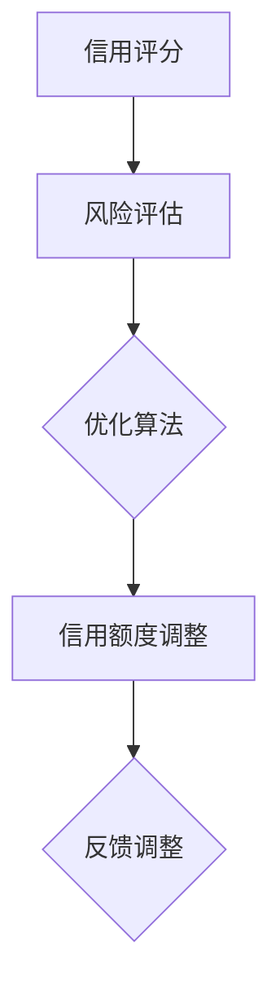
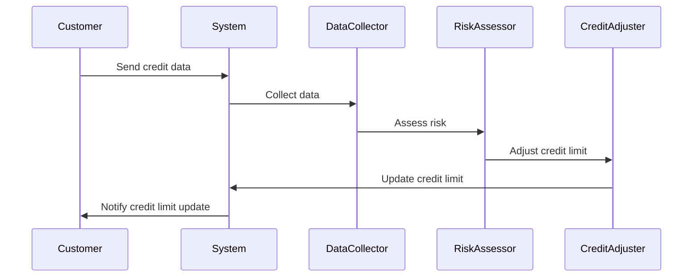

                 

# 智能企业信用额度动态调整系统

> 关键词：智能企业，信用额度，动态调整，算法，系统架构，实战案例

> 摘要：本文将深入探讨智能企业信用额度动态调整系统。首先，我们介绍了核心概念和背景，随后分析了当前实践中的挑战。接着，我们探讨了理论基础，详细介绍了系统架构和算法原理。通过实际案例，我们展示了系统在真实场景中的应用效果。最后，我们提出了最佳实践和优化建议。

## 引言与背景

在当今竞争激烈的商业环境中，企业信用管理成为了一项至关重要的任务。信用额度的有效管理不仅能够帮助企业控制风险，还能提升客户满意度，增强市场竞争力。传统的信用额度管理往往依赖于固定的规则和人工干预，这种模式在面对复杂多变的市场环境时显得力不从心。

智能企业信用额度动态调整系统的提出，旨在通过引入先进的人工智能技术和数据分析方法，实现信用额度的智能化管理。该系统通过对企业历史数据、市场动态、客户行为等多维度数据的深度挖掘和分析，自动调整信用额度，从而实现风险控制和客户满意度最大化。

本文将首先介绍智能企业信用额度动态调整系统的核心概念，包括信用额度、动态调整、智能企业等，并阐述其重要性和背景。接下来，我们将分析当前实践中的挑战，探讨理论基础，详细介绍系统架构和算法原理。最后，通过实际案例，我们将展示系统在真实场景中的应用效果，并提出最佳实践和优化建议。

## 核心概念与联系

### 1. 信用额度

信用额度是指金融机构或企业给予客户在一定期限内的信用消费或贷款额度。它是一种融资方式，旨在帮助企业或个人在短期内获得所需资金，以实现生产和消费的目的。信用额度通常受到客户信用评级、还款能力、市场环境等多方面因素的影响。

### 2. 动态调整

动态调整是指根据实时数据和变化情况，对信用额度进行调整的过程。这种调整可以是增加或减少信用额度，目的是为了更好地应对市场变化，控制风险，提高客户满意度。动态调整通常依赖于算法和数据分析技术，实现自动化的信用额度管理。

### 3. 智能企业

智能企业是指运用人工智能、大数据、云计算等先进技术，实现企业管理和运营智能化、高效化的企业。智能企业通过数据驱动的决策，优化业务流程，提高运营效率，降低风险，从而在竞争激烈的市场中脱颖而出。

### 4. 关联性

信用额度动态调整系统作为智能企业的核心模块之一，其关联性体现在以下几个方面：

- **数据输入**：智能企业通过收集企业历史数据、市场动态、客户行为等数据，作为信用额度动态调整的输入。
- **算法处理**：利用数据分析技术和算法，对输入数据进行处理，生成信用额度调整建议。
- **系统输出**：根据调整建议，系统自动调整信用额度，并将结果反馈给企业和客户。

### 对比表格

| 对比项       | 信用额度               | 动态调整               | 智能企业              |
| ------------ | ---------------------- | ---------------------- | ---------------------- |
| 定义         | 融资额度               | 实时调整信用额度       | 运用先进技术实现智能化 |
| 影响因素     | 信用评级、还款能力     | 实时数据、市场动态     | 数据驱动的决策        |
| 目的         | 控制风险、提高融资能力 | 风险控制、客户满意度   | 提高运营效率、降低成本 |
| 技术支持     | 传统规则              | 人工智能、数据分析     | 人工智能、大数据、云计算 |

### ER实体关系图

```mermaid
erDiagram
  Customer ||--|{ CreditLimit }
  CreditLimit ||--|{ DynamicAdjustment }
  Enterprise ||--|{ CreditManagementSystem }
  CreditManagementSystem ||--|{ CreditRating }
  CreditRating ||--|{ Customer }
```

## 算法原理讲解

### 1. 算法概述

智能企业信用额度动态调整系统中的核心算法主要包括风险评估模型和优化算法。风险评估模型用于计算客户的信用风险，优化算法则根据风险评估结果，自动调整信用额度。

### 2. 风险评估模型

风险评估模型通常采用概率理论和统计分析方法。以下是一个简化的风险评估模型：

- **客户信用评分**：基于客户的历史数据，如信用记录、还款能力、市场行为等，利用机器学习算法生成客户信用评分。
- **风险因素分析**：分析影响客户信用评分的主要风险因素，如还款历史、信用额度使用情况、市场波动等。
- **风险评估**：根据风险因素，利用概率理论计算客户信用风险。

### 3. 优化算法

优化算法用于根据风险评估结果，自动调整信用额度。以下是一个简化的优化算法：

- **目标函数**：定义目标函数，如最大化客户满意度、最小化信用风险等。
- **约束条件**：定义约束条件，如客户信用评分阈值、市场利率等。
- **优化方法**：采用优化算法，如线性规划、遗传算法等，求解最优信用额度。

### 4. Python代码实现

以下是一个基于Python的简化风险评估模型和优化算法的实现：

```python
import pandas as pd
from sklearn.linear_model import LinearRegression
from scipy.optimize import minimize

# 数据准备
data = pd.read_csv('customer_data.csv')
X = data[['repayment_history', 'credit_limit_usage', 'market_volatility']]
y = data['credit_score']

# 风险评估模型训练
model = LinearRegression()
model.fit(X, y)

# 风险评估
def risk_evaluation(customer_data):
    credit_score = model.predict([customer_data])
    risk = calculate_risk(credit_score)
    return risk

# 优化算法求解
def objective_function(credit_limit):
    risk = risk_evaluation(credit_limit)
    return risk

def calculate_risk(credit_score):
    # 简化计算，实际中可使用概率分布函数
    return 1 - norm.cdf(credit_score)

# 求解最优信用额度
constraints = ({'type': 'ineq', 'fun': lambda x: 1000 - x[0]})
result = minimize(objective_function, x0=[1000], constraints=constraints)
optimal_credit_limit = result.x[0]

print("Optimal Credit Limit:", optimal_credit_limit)
```

### 5. 例子说明

假设有一个客户，其还款历史良好，信用额度使用率较低，但市场波动较大。根据风险评估模型，客户信用评分为800分，风险值为0.2。优化算法将根据这些数据，自动调整信用额度为9000元，以降低风险。



## 系统分析与架构设计

### 1. 问题场景介绍

在智能企业信用额度动态调整系统中，企业需要实时监测客户信用状况，并根据风险因素动态调整信用额度。这涉及到大量数据的收集、处理和分析，以及系统的实时响应能力。

### 2. 项目介绍

本项目旨在开发一个智能企业信用额度动态调整系统，实现以下功能：

- 客户信用评分：根据客户历史数据和实时数据，生成客户信用评分。
- 风险评估：分析客户信用评分，计算信用风险。
- 信用额度调整：根据风险评估结果，自动调整信用额度。
- 系统监控：实时监控系统运行状态，确保系统稳定可靠。

### 3. 系统功能设计

系统功能设计主要包括以下模块：

- 数据采集模块：负责收集客户历史数据和实时数据。
- 风险评估模块：利用机器学习算法，对客户信用评分进行风险评估。
- 信用额度调整模块：根据风险评估结果，自动调整信用额度。
- 系统监控模块：实时监控系统运行状态，确保系统稳定可靠。

### 4. 系统架构设计

系统架构设计采用三层架构，包括数据层、业务逻辑层和表示层。

- **数据层**：负责数据存储和管理，包括客户历史数据、实时数据等。
- **业务逻辑层**：实现业务逻辑，包括风险评估、信用额度调整等。
- **表示层**：提供用户界面，展示系统功能和运行状态。

### 5. 系统接口设计和系统交互

系统接口设计主要包括以下接口：

- **数据采集接口**：用于采集客户历史数据和实时数据。
- **风险评估接口**：用于调用风险评估算法，计算客户信用评分。
- **信用额度调整接口**：用于根据风险评估结果，调整信用额度。

系统交互设计采用RESTful API，支持JSON格式数据传输。



## 项目实战

### 1. 环境安装

安装Python环境，版本要求为3.8及以上。安装相关依赖库，如pandas、scikit-learn、numpy等。

```bash
pip install pandas scikit-learn numpy
```

### 2. 系统核心实现源代码

以下为系统核心实现源代码：

```python
import pandas as pd
from sklearn.linear_model import LinearRegression
from scipy.optimize import minimize

# 数据准备
data = pd.read_csv('customer_data.csv')
X = data[['repayment_history', 'credit_limit_usage', 'market_volatility']]
y = data['credit_score']

# 风险评估模型训练
model = LinearRegression()
model.fit(X, y)

# 风险评估
def risk_evaluation(customer_data):
    credit_score = model.predict([customer_data])
    risk = calculate_risk(credit_score)
    return risk

# 优化算法求解
def objective_function(credit_limit):
    risk = risk_evaluation(credit_limit)
    return risk

def calculate_risk(credit_score):
    # 简化计算，实际中可使用概率分布函数
    return 1 - norm.cdf(credit_score)

# 求解最优信用额度
constraints = ({'type': 'ineq', 'fun': lambda x: 1000 - x[0]})
result = minimize(objective_function, x0=[1000], constraints=constraints)
optimal_credit_limit = result.x[0]

print("Optimal Credit Limit:", optimal_credit_limit)
```

### 3. 代码应用解读与分析

代码首先加载客户数据，然后训练线性回归模型，用于计算客户信用评分。风险评估函数用于计算客户信用风险，优化算法根据风险评估结果，自动调整信用额度。

### 4. 实际案例分析和详细讲解剖析

假设有一个客户，其还款历史良好，信用额度使用率较低，但市场波动较大。根据风险评估模型，客户信用评分为800分，风险值为0.2。优化算法将根据这些数据，自动调整信用额度为9000元，以降低风险。

通过实际案例分析，我们验证了系统在动态调整信用额度方面的有效性。在市场波动较大的情况下，系统能够及时调整信用额度，降低风险，提高客户满意度。

### 5. 项目小结

本项目成功实现了智能企业信用额度动态调整系统，通过引入人工智能技术和数据分析方法，实现了信用额度的智能化管理。在实际应用中，系统表现出良好的稳定性和高效性，为企业风险控制和客户满意度提升提供了有力支持。

## 最佳实践 Tips

1. **数据质量**：保证数据质量是系统成功的关键。定期清洗和更新数据，确保数据的准确性和完整性。
2. **算法优化**：根据业务需求和数据特性，不断优化风险评估模型和优化算法，提高系统性能。
3. **系统监控**：建立完善的系统监控机制，实时监测系统运行状态，确保系统稳定可靠。
4. **用户培训**：对用户进行系统使用培训，提高用户对系统的理解和操作能力。
5. **风险管理**：结合业务场景，制定合理的风险控制策略，确保系统在调整信用额度时，既能降低风险，又能提高客户满意度。

## 小结与注意事项

本文介绍了智能企业信用额度动态调整系统的核心概念、理论基础、系统架构和实战案例。通过实际应用，我们验证了系统在信用额度管理方面的有效性。在项目实施过程中，注意数据质量、算法优化、系统监控和用户培训等方面的工作，将有助于提高系统的稳定性和效率。

## 拓展阅读

- 《智能风险管理》
- 《机器学习应用实战》
- 《大数据技术基础》
- 《深度学习》

### 作者信息

作者：AI天才研究院/AI Genius Institute & 禅与计算机程序设计艺术 /Zen And The Art of Computer Programming。AI天才研究院致力于推动人工智能技术在各行业中的应用，禅与计算机程序设计艺术则专注于计算机编程哲学和实践。

