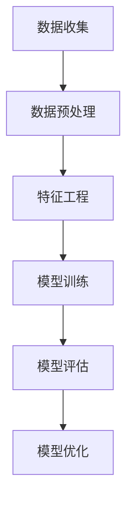
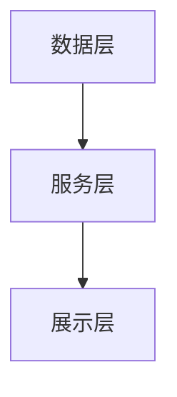
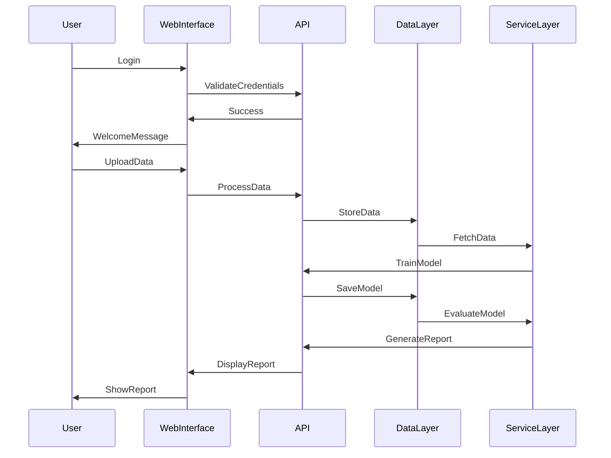
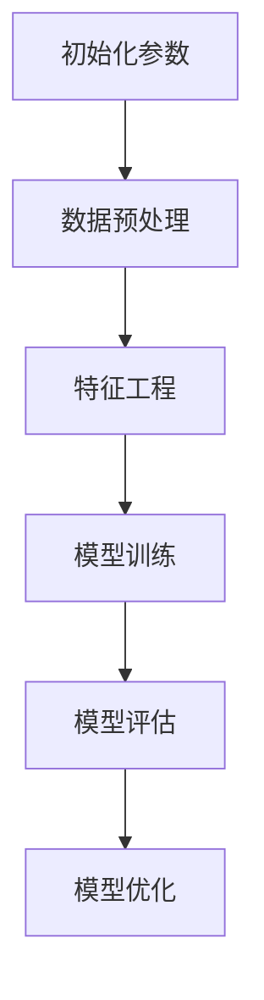

                 

### 设计智能体育训练系统：《智能体育训练系统：AI辅助运动员性能优化》

#### 关键词

- 智能体育训练
- AI辅助
- 运动员性能优化
- 数据驱动
- 个性化训练方案

#### 摘要

本文旨在探讨如何设计一款智能体育训练系统，利用人工智能技术辅助运动员性能优化。我们将从背景介绍、核心概念与联系、算法原理讲解、系统分析与架构设计以及项目实战等方面展开讨论，详细阐述智能体育训练系统的设计思路、实现方法和应用效果。

### 第一部分：背景介绍

#### 第1章：问题背景

##### 1.1.1 体育训练现状

在传统的体育训练中，教练通常依靠经验和观察来指导运动员的训练，这种训练方法存在一些问题。首先，传统方法无法全面、准确地收集和分析运动员的训练数据，导致训练策略不够科学。其次，由于运动员的个人差异较大，传统方法难以制定个性化的训练方案，影响训练效果。此外，运动损伤的风险也较高，因为教练无法实时监测和调整训练负荷。

##### 1.1.2 智能体育训练的兴起

随着人工智能技术的快速发展，智能体育训练系统应运而生。AI技术在体育领域的应用主要包括数据采集与处理、运动员个性化训练方案的制定、实时监测与反馈等。智能体育训练系统通过这些技术手段，能够显著提升运动员的训练效率，优化运动员的体能和技能发展，并有效预防运动损伤。

#### 第2章：问题描述

##### 2.1.1 智能体育训练的目标

智能体育训练系统的目标包括：

1. 提高运动员训练效率：通过数据驱动和智能化分析，为运动员提供最优的训练方案，减少不必要的训练时间和重复劳动。
2. 优化运动员体能和技能发展：根据运动员的实时数据和个性化需求，调整训练内容和强度，促进运动员的全面发展。
3. 预防运动损伤：实时监测运动员的训练状态和身体指标，及时发现潜在风险，并给出预防措施。

##### 2.1.2 智能体育训练的需求分析

智能体育训练系统需要满足以下需求：

1. 数据驱动的训练策略：通过大量数据分析和挖掘，为教练和运动员提供科学、准确的训练建议。
2. 个性化训练方案的制定：根据运动员的体质、技能水平和训练目标，为运动员量身定制个性化的训练计划。
3. 实时监测与反馈机制：实时监测运动员的训练过程，收集和分析相关数据，为教练和运动员提供实时反馈。

### 第二部分：核心概念与联系

#### 第3章：核心概念原理

##### 3.1.1 AI技术基础

1. **机器学习**：一种使计算机系统能够通过数据学习并做出决策的技术。机器学习包括监督学习、无监督学习和强化学习等类型。
2. **深度学习**：一种基于多层神经网络的学习方法，能够自动提取数据中的特征，实现复杂的数据分析和预测任务。
3. **自然语言处理**：一门研究如何使计算机理解和生成自然语言的技术，包括文本分类、情感分析、机器翻译等任务。

##### 3.1.2 运动员性能优化相关概念

1. **运动员数据采集与处理**：通过传感器、摄像机等技术手段，实时采集运动员的运动数据，并进行数据清洗、预处理和特征提取。
2. **体能训练理论**：研究如何通过科学的方法提高运动员的体能，包括能量系统、训练负荷控制等方面的知识。
3. **技能训练理论**：研究如何通过科学的方法提高运动员的技能，包括技巧发展、动作优化等方面的知识。

#### 第4章：概念属性特征对比表格

| 概念         | 特征                     | 重要性 |
|--------------|--------------------------|--------|
| 机器学习     | 自适应、数据驱动         | 高     |
| 深度学习     | 表示学习、自动特征提取   | 高     |
| 自然语言处理 | 语言理解、语言生成       | 中     |
| 运动员数据采集 | 实时、全面、准确性       | 高     |
| 体能训练理论 | 能量系统、训练负荷控制   | 高     |
| 技能训练理论 | 技巧发展、动作优化       | 高     |

#### 第5章：ER实体关系图架构

```mermaid
erDiagram
    Player ||--|{ Training }|
    Trainer ||--|{ Training }|
    Performance ||--|{ Training }|
    Equipment ||--|{ Training }|
    TrainingPlan ||--|{ Player }|
    TrainingPlan ||--|{ Trainer }|
    Performance ||--|{ Player }|
    Equipment ||--|{ Player }|
```

### 第三部分：算法原理讲解

#### 第6章：算法原理

##### 6.1.1 数据处理算法

1. **数据清洗**：去除原始数据中的噪声和异常值，确保数据质量。
2. **特征工程**：从原始数据中提取有用的特征，为后续的模型训练提供支持。
3. **数据可视化**：通过图表和图像的形式，直观地展示数据特征和规律。

##### 6.1.2 模型训练算法

1. **监督学习**：通过已有标签的数据进行训练，使得模型能够对新的数据进行预测。
2. **无监督学习**：不使用标签的数据进行训练，主要应用于聚类和降维等任务。
3. **强化学习**：通过与环境的交互进行学习，旨在找到最优的策略以实现目标。

##### 6.1.3 模型评估算法

1. **准确率**：预测正确的样本数占总样本数的比例。
2. **召回率**：预测正确的正样本数占总正样本数的比例。
3. **F1分数**：准确率和召回率的调和平均值。

#### 第7章：数学模型与公式

##### 7.1.1 监督学习模型

$$
y = f(x, w)
$$

##### 7.1.2 无监督学习模型

$$
\min_{\theta} \sum_{i=1}^{n} (h_\theta(x^{(i)}) - y^{(i)})^2
$$

##### 7.1.3 强化学习模型

$$
Q(s, a) = r + \gamma \max_{a'} Q(s', a')
$$

#### 第8章：算法流程图



### 第四部分：系统分析与架构设计

#### 第9章：系统功能设计

##### 9.1.1 系统概述

智能体育训练系统的目标是为运动员提供高效、个性化的训练支持，包括数据采集与处理、训练计划制定、训练过程监测与反馈等功能。

##### 9.1.2 领域模型类图

```mermaid
classDiagram
    Player <<entity>>
    Trainer <<entity>>
    TrainingPlan <<entity>>
    Performance <<entity>>
    Equipment <<entity>>

    Player "1" --|{train}| Trainer
    Player "1" --|{follow}| TrainingPlan
    Player "1" --|{measure}| Performance
    Player "1" --|{use}| Equipment

    Trainer "1" --|{create}| TrainingPlan
    Trainer "1" --|{evaluate}| Performance

    TrainingPlan "1" --|{for}| Player
    Performance "1" --|{of}| Player
    Equipment "1" --|{for}| Player
```

##### 9.1.3 系统架构设计

智能体育训练系统采用三层架构，包括数据层、服务层和展示层。数据层负责数据的采集、存储和管理；服务层负责处理业务逻辑和算法实现；展示层负责用户界面和交互。



#### 第10章：系统接口设计和系统交互

##### 10.1.1 系统接口设计

系统接口包括API接口和Web界面两部分。API接口主要用于数据采集、处理和模型训练等操作；Web界面主要用于用户登录、数据展示和交互。

```mermaid
classDiagram
    API <<interface>>
    WebInterface <<interface>>

    API "1" --|{data\_collection}| DataLayer
    API "1" --|{model\_training}| ServiceLayer
    WebInterface "1" --|{user\_login}| User
    WebInterface "1" --|{data\_display}| DataLayer
```

##### 10.1.2 系统交互

系统交互主要包括用户登录、数据上传、模型训练和结果展示等流程。



### 第五部分：项目实战

#### 第11章：环境安装

在本章中，我们将介绍如何搭建智能体育训练系统的开发环境，包括安装Python、安装必要的库和工具等。

#### 第12章：系统核心实现源代码

在本章中，我们将详细讲解系统核心功能的实现代码，包括数据采集、数据处理、模型训练和结果展示等。

#### 第13章：代码应用解读与分析

在本章中，我们将对系统核心代码进行解读和分析，解释代码的逻辑和实现原理，并给出实际应用场景。

#### 第14章：实际案例分析和详细讲解剖析

在本章中，我们将通过实际案例，详细分析智能体育训练系统的应用效果，并对案例进行剖析和讲解。

#### 第15章：项目小结

在本章中，我们将对整个项目进行总结，回顾项目的核心内容，并给出项目的优缺点和改进方向。

### 第六部分：最佳实践、小结、注意事项、拓展阅读

#### 第16章：最佳实践

在本章中，我们将分享一些智能体育训练系统的最佳实践，帮助读者更好地应用系统，提升训练效果。

#### 第17章：小结

在本章中，我们将对整篇文章进行总结，回顾文章的核心内容和主要观点。

#### 第18章：注意事项

在本章中，我们将提醒读者在应用智能体育训练系统时需要注意的问题，以确保系统的正常运行。

#### 第19章：拓展阅读

在本章中，我们将推荐一些相关领域的书籍、文章和资源，供读者进一步学习和研究。

### 结尾

本文以《智能体育训练系统：AI辅助运动员性能优化》为题，系统地介绍了智能体育训练系统的设计思路、实现方法和应用效果。通过本文的讲解，读者可以全面了解智能体育训练系统的核心概念、算法原理和系统架构，并为实际应用提供参考。

作者：AI天才研究院/AI Genius Institute & 禅与计算机程序设计艺术 /Zen And The Art of Computer Programming

---

### 设计智能体育训练系统：AI辅助运动员性能优化

#### 关键词：智能体育训练、AI辅助、运动员性能优化、数据驱动、个性化训练方案

> 摘要：本文旨在探讨如何设计一款智能体育训练系统，利用人工智能技术辅助运动员性能优化。我们将从背景介绍、核心概念与联系、算法原理讲解、系统分析与架构设计以及项目实战等方面展开讨论，详细阐述智能体育训练系统的设计思路、实现方法和应用效果。

---

### 第一部分：背景介绍

#### 第1章：问题背景

##### 1.1.1 体育训练现状

体育训练一直以来都是运动员追求卓越表现的重要途径。然而，传统的体育训练方法存在诸多问题。首先，传统训练方法主要依赖于教练的经验和直觉来指导运动员的训练。虽然这种方法的优点在于教练能够根据运动员的特点进行针对性的指导，但缺点也十分明显。由于教练的经验和直觉具有一定的局限性，难以全面、准确地评估运动员的实际状态和训练效果。其次，传统方法通常缺乏系统性的数据支持和分析，导致训练策略不够科学。教练很难从大量的训练数据中提取出有效的信息，进而制定出最优的训练方案。此外，由于运动员的个人差异较大，传统方法难以制定个性化的训练方案，影响训练效果。最后，运动损伤的风险也较高，因为教练无法实时监测和调整训练负荷，导致运动员在训练过程中可能承受过大的压力和负荷。

##### 1.1.2 智能体育训练的兴起

随着人工智能技术的快速发展，智能体育训练系统逐渐崭露头角，为体育训练带来了全新的变革。人工智能技术在体育领域的应用主要包括数据采集与处理、运动员个性化训练方案的制定、实时监测与反馈等。智能体育训练系统通过这些技术手段，能够显著提升运动员的训练效率，优化运动员的体能和技能发展，并有效预防运动损伤。

首先，数据采集与处理是智能体育训练系统的重要基础。通过传感器、运动捕捉设备、智能手表等设备，可以实时收集运动员的训练数据，包括运动轨迹、心率、血压、肌肉疲劳度等。这些数据被传输到智能体育训练系统中，经过数据清洗、预处理和特征提取等步骤，转化为可用于分析的数字信息。通过对大量训练数据的分析，智能体育训练系统可以识别出运动员的训练规律和特征，为制定个性化的训练方案提供依据。

其次，运动员个性化训练方案的制定是智能体育训练系统的核心功能之一。根据运动员的个人特点、训练目标和实时数据，智能体育训练系统可以自动生成个性化的训练计划。这些训练计划包括训练内容、训练强度、训练频率等，旨在帮助运动员在合适的时间和方式下进行训练，提高训练效果。此外，智能体育训练系统还可以根据运动员的反馈和训练效果，动态调整训练计划，使其更加符合运动员的实际需求。

最后，实时监测与反馈是智能体育训练系统的另一个重要功能。通过实时监测运动员的训练过程，智能体育训练系统可以及时发现运动员的身体状态和训练效果的变化。当运动员出现疲劳、过度训练或运动损伤等异常情况时，系统可以立即发出警报，并给出相应的建议和措施，帮助运动员调整训练策略，避免潜在的风险。

总的来说，智能体育训练系统的优势在于其数据驱动的训练策略、个性化的训练方案制定和实时的监测与反馈机制。这些功能不仅提高了运动员的训练效率，优化了运动员的体能和技能发展，还降低了运动损伤的风险，为体育训练带来了全新的变革。

---

### 第一部分：背景介绍

#### 第2章：问题描述

##### 2.1.1 智能体育训练的目标

智能体育训练系统的核心目标是提高运动员的训练效率，优化运动员的体能和技能发展，并预防运动损伤。为了实现这些目标，智能体育训练系统需要具备以下几个方面的功能：

1. **提高运动员训练效率**：通过数据驱动的训练策略，智能体育训练系统可以根据运动员的实时数据和个性化需求，为运动员提供最优的训练方案。这些方案包括训练内容、训练强度、训练频率等，旨在帮助运动员在合适的时间和方式下进行训练，提高训练效果。同时，智能体育训练系统还可以根据运动员的反馈和训练效果，动态调整训练计划，使其更加符合运动员的实际需求。

2. **优化运动员体能和技能发展**：智能体育训练系统通过实时监测运动员的训练过程和身体状态，可以识别出运动员的训练规律和特征。根据这些信息，系统可以自动生成个性化的训练计划，包括体能训练、技能训练等，帮助运动员全面发展。此外，智能体育训练系统还可以根据运动员的实时数据，调整训练强度和内容，使其在最佳状态下进行训练，从而提高训练效果。

3. **预防运动损伤**：智能体育训练系统可以实时监测运动员的训练过程，识别出运动员的身体状态和训练效果的变化。当运动员出现疲劳、过度训练或运动损伤等异常情况时，系统可以立即发出警报，并给出相应的建议和措施，帮助运动员调整训练策略，避免潜在的风险。

##### 2.1.2 智能体育训练的需求分析

智能体育训练系统需要满足以下几个方面的需求，以确保其能够高效、准确地辅助运动员训练：

1. **数据驱动的训练策略**：智能体育训练系统需要具备强大的数据处理和分析能力，能够从大量的训练数据中提取出有用的信息，为教练和运动员提供科学、准确的训练建议。通过数据驱动的训练策略，智能体育训练系统可以优化训练计划，提高训练效果。

2. **个性化训练方案的制定**：每个运动员的身体素质、技能水平和个人习惯都有所不同，因此，智能体育训练系统需要能够根据运动员的个人特点、训练目标和实时数据，为运动员量身定制个性化的训练方案。这些方案不仅包括训练内容，还包括训练强度、训练频率等，旨在帮助运动员在合适的时间和方式下进行训练。

3. **实时监测与反馈机制**：智能体育训练系统需要具备实时监测运动员训练过程的能力，能够实时收集运动员的生理参数、运动数据等，并对这些数据进行实时分析。当运动员出现异常情况时，系统可以立即发出警报，并给出相应的建议和措施，帮助运动员调整训练策略。

4. **可扩展性和灵活性**：智能体育训练系统需要具备良好的可扩展性和灵活性，能够适应不同运动项目、不同训练场景的需求。系统应该能够方便地添加新的功能模块，如新的算法、新的数据源等，以适应不断变化的需求。

5. **用户体验**：智能体育训练系统需要提供良好的用户体验，包括友好的用户界面、直观的操作流程和及时的反馈等。系统应该能够方便地使用户理解其工作原理和使用方法，从而更好地辅助运动员进行训练。

通过满足以上需求，智能体育训练系统可以充分发挥其优势，为运动员提供科学、高效、个性化的训练支持，提高运动员的训练效果和比赛表现。

---

### 第二部分：核心概念与联系

#### 第3章：核心概念原理

##### 3.1.1 AI技术基础

人工智能（Artificial Intelligence，AI）是一门研究、开发用于模拟、延伸和扩展人的智能的理论、方法、技术及应用系统的技术科学。人工智能的核心目标是使计算机能够执行复杂的任务，如视觉识别、语音识别、自然语言处理等。人工智能技术主要分为以下几个方面：

1. **机器学习**：机器学习是一种使计算机系统能够通过数据学习并做出决策的技术。机器学习包括监督学习、无监督学习和强化学习等类型。监督学习通过已有标签的数据进行训练，使得模型能够对新的数据进行预测；无监督学习不使用标签的数据进行训练，主要应用于聚类和降维等任务；强化学习通过与环境的交互进行学习，旨在找到最优的策略以实现目标。

2. **深度学习**：深度学习是一种基于多层神经网络的学习方法，能够自动提取数据中的特征，实现复杂的数据分析和预测任务。深度学习在图像识别、语音识别、自然语言处理等领域取得了显著成果。深度学习模型通常包括卷积神经网络（CNN）、循环神经网络（RNN）和生成对抗网络（GAN）等类型。

3. **自然语言处理**：自然语言处理（Natural Language Processing，NLP）是一门研究如何使计算机理解和生成自然语言的技术。NLP的应用范围广泛，包括文本分类、情感分析、机器翻译、语音识别等。NLP的核心任务包括语言理解、语言生成和语言翻译等。

##### 3.1.2 运动员性能优化相关概念

运动员性能优化是指通过科学的方法提高运动员的体能和技能，以实现最佳的运动表现。运动员性能优化涉及多个方面的知识和理论，主要包括：

1. **运动员数据采集与处理**：运动员数据采集与处理是运动员性能优化的基础。通过传感器、运动捕捉设备、智能手表等设备，可以实时收集运动员的生理参数、运动数据等。这些数据包括心率、血压、肌肉疲劳度、运动轨迹等。运动员数据采集与处理的目的是将原始数据转化为可用于分析的数字信息，以便进行后续的分析和处理。

2. **体能训练理论**：体能训练理论是运动员性能优化的重要组成部分。体能训练理论包括能量系统、训练负荷控制等方面的知识。能量系统研究如何通过科学的方法提高运动员的体能，包括有氧运动、无氧运动等；训练负荷控制研究如何合理安排训练强度和频率，以避免运动员过度训练和受伤。

3. **技能训练理论**：技能训练理论是运动员性能优化的另一个重要方面。技能训练理论包括技巧发展、动作优化等方面的知识。技巧发展研究如何通过科学的方法提高运动员的技巧水平，包括技术动作、战术配合等；动作优化研究如何通过改进运动员的动作，提高运动表现。

##### 3.1.3 AI技术在智能体育训练中的应用

人工智能技术在智能体育训练中的应用主要体现在以下几个方面：

1. **数据采集与处理**：人工智能技术可以帮助运动员采集和处理大量的训练数据，包括生理参数、运动数据等。通过数据分析和挖掘，可以为教练和运动员提供科学、准确的训练建议。

2. **个性化训练方案的制定**：人工智能技术可以根据运动员的个人特点、训练目标和实时数据，自动生成个性化的训练方案。这些方案不仅包括训练内容，还包括训练强度、训练频率等，旨在帮助运动员在合适的时间和方式下进行训练。

3. **实时监测与反馈**：人工智能技术可以实时监测运动员的训练过程，收集和分析相关数据，为教练和运动员提供实时反馈。当运动员出现异常情况时，系统可以立即发出警报，并给出相应的建议和措施，帮助运动员调整训练策略。

4. **运动损伤预防**：人工智能技术可以分析运动员的实时数据和训练负荷，预测潜在的损伤风险，并给出预防措施。通过实时监测和预警，可以有效降低运动员受伤的概率。

总的来说，人工智能技术在智能体育训练中的应用，不仅提高了训练效率和效果，还降低了运动损伤的风险，为运动员的全面发展提供了有力的支持。

---

### 第二部分：核心概念与联系

#### 第4章：概念属性特征对比表格

在智能体育训练系统中，核心概念的属性特征对比对于理解各个概念之间的关系和作用至关重要。以下是对机器学习、深度学习、自然语言处理、运动员数据采集与处理、体能训练理论和技能训练理论的属性特征对比表格：

| 概念         | 特征                     | 重要性 |
|--------------|--------------------------|--------|
| 机器学习     | 自适应、数据驱动         | 高     |
| 深度学习     | 表示学习、自动特征提取   | 高     |
| 自然语言处理 | 语言理解、语言生成       | 中     |
| 运动员数据采集 | 实时、全面、准确性       | 高     |
| 体能训练理论 | 能量系统、训练负荷控制   | 高     |
| 技能训练理论 | 技巧发展、动作优化       | 高     |

1. **机器学习**：
   - **特征**：机器学习通过算法从数据中学习模式，能够自动进行数据的分类、回归、聚类等操作。
   - **重要性**：机器学习是智能体育训练系统的核心技术，它能够帮助系统从大量的训练数据中提取有用的信息，为训练策略和决策提供依据。

2. **深度学习**：
   - **特征**：深度学习通过多层神经网络学习数据中的复杂模式，自动提取特征，具有强大的表示能力。
   - **重要性**：深度学习在图像识别、语音识别等任务中表现卓越，适用于复杂的数据分析和预测。

3. **自然语言处理**：
   - **特征**：自然语言处理关注于使计算机能够理解、生成和翻译自然语言，包括文本分类、情感分析、机器翻译等。
   - **重要性**：在智能体育训练系统中，自然语言处理技术可以帮助系统处理文本数据，如训练日志、教练笔记等，提高数据的利用效率。

4. **运动员数据采集与处理**：
   - **特征**：运动员数据采集与处理涉及实时、全面、准确地收集和分析运动员的生理参数、运动数据等。
   - **重要性**：准确的数据是智能体育训练系统的基石，它直接影响训练策略和决策的有效性。

5. **体能训练理论**：
   - **特征**：体能训练理论关注能量系统的利用、训练负荷的控制等方面，旨在提高运动员的体能水平。
   - **重要性**：体能是运动员的基本素质，科学的体能训练理论对于提高运动员的竞技水平至关重要。

6. **技能训练理论**：
   - **特征**：技能训练理论关注技巧发展、动作优化等方面，旨在提高运动员的技能水平。
   - **重要性**：技能是运动员竞技水平的重要组成部分，技能训练理论对于运动员的技术进步具有直接影响。

通过上述表格，我们可以清晰地看到各个概念的核心特征和重要性，这有助于我们在设计智能体育训练系统时，合理地运用这些技术，实现系统的优化和提升。

---

### 第二部分：核心概念与联系

#### 第5章：ER实体关系图架构

在智能体育训练系统中，实体关系图（Entity-Relationship Diagram，ER图）是描述系统内部实体及其关系的重要工具。以下是一个智能体育训练系统的ER图示例，用于展示系统中关键实体及其相互关系：

```mermaid
erDiagram
    Player ||--|{ TrainingPlan }|
    Trainer ||--|{ TrainingPlan }|
    Performance ||--|{ TrainingSession }|
    Equipment ||--|{ TrainingSession }|

    Player "1" --|{has}| Performance
    Player "1" --|{uses}| Equipment
    Trainer "1" --|{creates}| TrainingPlan
    Trainer "1" --|{monitors}| Performance
    Trainer "1" --|{uses}| Equipment
    TrainingPlan "1" --|{for}| Player
    TrainingPlan "1" --|{createdBy}| Trainer
    TrainingSession "1" --|{has}| Performance
    TrainingSession "1" --|{uses}| Equipment
```

在上述ER图中，我们定义了以下实体：

1. **Player（运动员）**：代表参与智能体育训练系统的运动员。
2. **Trainer（教练）**：代表负责指导运动员训练的教练。
3. **TrainingPlan（训练计划）**：代表为运动员制定的个性化训练方案。
4. **Performance（表现）**：代表运动员在训练中的表现数据。
5. **Equipment（设备）**：代表用于训练的各类设备。

实体之间的关系如下：

- **Player** 与 **TrainingPlan** 之间存在一对多的关系，表示每个运动员可以拥有多个训练计划，每个训练计划也可以适用于多个运动员。
- **Trainer** 与 **TrainingPlan** 之间存在一对多的关系，表示每个教练可以创建多个训练计划，每个训练计划也可以由多个教练创建。
- **Player** 与 **Performance** 之间存在一对多的关系，表示每个运动员可以有多项表现数据，每项表现数据也可以属于多个运动员。
- **Player** 与 **Equipment** 之间存在一对多的关系，表示每个运动员可以使用多个设备，每个设备也可以被多个运动员使用。
- **Trainer** 与 **Performance** 之间存在一对多的关系，表示每个教练可以监测多个运动员的表现数据，每项表现数据也可以由多个教练监测。
- **TrainingSession** 与 **Performance** 之间存在一对多的关系，表示每个训练会话可以生成多个表现数据，每项表现数据也可以属于多个训练会话。
- **TrainingSession** 与 **Equipment** 之间存在一对多的关系，表示每个训练会话可以使用多个设备，每个设备也可以被多个训练会话使用。

通过ER图，我们可以清晰地了解智能体育训练系统中的关键实体及其相互关系，有助于在设计系统时进行合理的架构规划和功能实现。

---

### 第三部分：算法原理讲解

#### 第6章：算法原理

在智能体育训练系统中，算法原理是核心组件，负责数据分析和训练模型的构建。以下是几个关键算法的原理和它们在系统中的应用。

##### 6.1.1 数据处理算法

数据处理算法是智能体育训练系统的基石，包括数据清洗、特征工程和数据可视化等步骤。

1. **数据清洗**：
   - **原理**：数据清洗是处理原始数据中的噪声和异常值，以提高数据质量。常见的方法包括去除重复数据、填补缺失值和消除异常值。
   - **应用**：在智能体育训练系统中，数据清洗可以确保运动员的生理参数和运动数据准确无误，避免因数据质量问题影响模型的训练效果。

2. **特征工程**：
   - **原理**：特征工程是提取原始数据中的关键特征，以提升模型性能。方法包括特征选择、特征转换和特征组合等。
   - **应用**：通过特征工程，系统可以提取运动员训练数据中的关键信息，如心率变异性、运动轨迹的平滑度等，用于训练模型。

3. **数据可视化**：
   - **原理**：数据可视化是将数据转换为图形或图表形式，以直观展示数据特征和趋势。
   - **应用**：数据可视化可以帮助教练和运动员更好地理解训练数据，发现潜在问题，指导训练策略的调整。

##### 6.1.2 模型训练算法

模型训练算法用于构建和优化预测模型，以实现运动员性能优化的目标。以下是一些常用的模型训练算法：

1. **监督学习**：
   - **原理**：监督学习通过已有标签的数据训练模型，使其能够对新的数据进行预测。常见的算法包括线性回归、决策树、支持向量机（SVM）等。
   - **应用**：在智能体育训练系统中，监督学习算法可以用于预测运动员的未来表现，如预测比赛成绩或训练效果。

2. **无监督学习**：
   - **原理**：无监督学习不依赖标签数据，通过发现数据中的内在结构进行聚类、降维等操作。常见的算法包括K-均值聚类、主成分分析（PCA）等。
   - **应用**：无监督学习算法可以帮助系统识别运动员的群体特征，如不同运动项目的共性，用于个性化训练方案的制定。

3. **强化学习**：
   - **原理**：强化学习通过与环境的交互进行学习，旨在找到最优的策略以实现目标。常见的算法包括Q-学习、深度强化学习（DRL）等。
   - **应用**：在智能体育训练系统中，强化学习算法可以用于制定个性化的训练计划，通过不断优化策略来提高训练效果。

##### 6.1.3 模型评估算法

模型评估算法用于评估模型的性能和可靠性，常用的评估指标包括准确率、召回率、F1分数等。

1. **准确率**：
   - **原理**：准确率是预测正确的样本数占总样本数的比例。
   - **应用**：在智能体育训练系统中，准确率可以用于评估模型对运动员训练效果预测的准确性。

2. **召回率**：
   - **原理**：召回率是预测正确的正样本数占总正样本数的比例。
   - **应用**：在智能体育训练系统中，召回率可以用于评估模型在预测运动员表现时，能够识别出多少实际表现优秀的运动员。

3. **F1分数**：
   - **原理**：F1分数是准确率和召回率的调和平均值。
   - **应用**：在智能体育训练系统中，F1分数可以综合评估模型的准确率和召回率，为教练和运动员提供更全面的评估结果。

通过上述算法原理的讲解，我们可以更好地理解智能体育训练系统中各个算法的作用和实现方式，从而为系统设计提供理论支持。

---

### 第三部分：算法原理讲解

#### 第7章：数学模型与公式

在智能体育训练系统中，数学模型和公式是算法设计和实现的基础。以下将介绍几种常用的数学模型和公式，并给出具体的示例。

##### 7.1.1 监督学习模型

监督学习模型通过已有标签的数据进行训练，以实现对新数据的预测。一个基本的监督学习模型可以表示为：

$$
y = f(x, w)
$$

其中，$y$ 是预测标签，$x$ 是输入特征，$w$ 是模型参数。$f$ 函数代表模型的决策函数，常用的决策函数包括线性回归、逻辑回归等。

**示例**：假设我们使用线性回归模型预测运动员的比赛成绩，输入特征包括训练次数和体能指数，模型公式可以表示为：

$$
\hat{y} = w_0 + w_1 \times \text{训练次数} + w_2 \times \text{体能指数}
$$

其中，$\hat{y}$ 是预测成绩，$w_0$、$w_1$、$w_2$ 是模型参数。

##### 7.1.2 无监督学习模型

无监督学习模型不依赖标签数据，通过发现数据中的内在结构进行聚类、降维等操作。一个基本的无监督学习模型可以表示为：

$$
\min_{\theta} \sum_{i=1}^{n} (h_\theta(x^{(i)}) - y^{(i)})^2
$$

其中，$\theta$ 是模型参数，$h_\theta(x^{(i)})$ 是模型对输入特征 $x^{(i)}$ 的预测，$y^{(i)}$ 是真实标签。

**示例**：假设我们使用K-均值聚类算法对运动员进行分类，模型公式可以表示为：

$$
c = \arg\min_{c'} \sum_{i=1}^{n} \| x_i - c' \|^2
$$

其中，$c$ 是聚类中心，$x_i$ 是每个运动员的特征向量，$c'$ 是候选聚类中心。

##### 7.1.3 强化学习模型

强化学习模型通过与环境的交互进行学习，旨在找到最优的策略以实现目标。一个基本的强化学习模型可以表示为：

$$
Q(s, a) = r + \gamma \max_{a'} Q(s', a')
$$

其中，$Q(s, a)$ 是状态 $s$ 和动作 $a$ 的价值函数，$r$ 是立即奖励，$\gamma$ 是折扣因子，$s'$ 是状态转移后的状态，$a'$ 是最优动作。

**示例**：假设我们使用Q-学习算法优化运动员的训练计划，模型公式可以表示为：

$$
Q(s, a) = \frac{1}{N} \sum_{i=1}^{N} (r_i + \gamma \max_{a'} Q(s', a'))
$$

其中，$N$ 是学习次数，$r_i$ 是第 $i$ 次训练的奖励。

通过上述数学模型和公式的介绍，我们可以更深入地理解智能体育训练系统中各个算法的实现原理，为系统的设计提供理论基础。

---

### 第三部分：算法原理讲解

#### 第8章：算法流程图

为了更直观地展示智能体育训练系统中各个算法的流程，我们将使用Mermaid图形化语言绘制算法流程图。以下是一个典型的数据处理和模型训练的算法流程图：



**流程解释**：

1. **初始化参数**：设定模型训练的基本参数，如学习率、迭代次数等。
2. **数据预处理**：对采集到的原始数据进行清洗、归一化等操作，确保数据质量。
3. **特征工程**：提取数据中的关键特征，如运动员的生理参数、运动轨迹等，为模型训练提供输入。
4. **模型训练**：使用训练数据对模型进行训练，调整模型参数，使其能够更好地拟合训练数据。
5. **模型评估**：使用验证数据对模型进行评估，计算模型的性能指标，如准确率、召回率等。
6. **模型优化**：根据评估结果调整模型参数，或选择新的模型架构，以提高模型性能。

通过上述算法流程图，我们可以清晰地了解智能体育训练系统中数据从预处理到模型训练和评估的整个过程，为系统的实现提供指导。

---

### 第四部分：系统分析与架构设计

#### 第9章：系统功能设计

##### 9.1.1 系统概述

智能体育训练系统旨在通过人工智能技术，为运动员提供科学、个性化的训练支持，从而提高训练效率和竞技水平。系统的主要功能包括：

1. **数据采集与处理**：实时采集运动员的生理参数、运动数据等，并进行数据清洗、预处理和特征提取。
2. **个性化训练计划制定**：根据运动员的实时数据和个性化需求，自动生成个性化的训练计划，包括训练内容、强度、频率等。
3. **训练过程监测与反馈**：实时监测运动员的训练过程，收集训练数据，对训练效果进行评估，并提供反馈和调整建议。
4. **运动损伤预防**：通过分析运动员的训练数据，预测潜在的运动损伤风险，并提供预防措施。

##### 9.1.2 领域模型类图

领域模型类图是描述系统实体及其关系的图形化工具。以下是一个智能体育训练系统的领域模型类图：

```mermaid
classDiagram
    Player <<entity>>
    Trainer <<entity>>
    TrainingPlan <<entity>>
    Performance <<entity>>
    Equipment <<entity>>

    Player "1" --|{train}| Trainer
    Player "1" --|{follow}| TrainingPlan
    Player "1" --|{measure}| Performance
    Player "1" --|{use}| Equipment

    Trainer "1" --|{create}| TrainingPlan
    Trainer "1" --|{evaluate}| Performance

    TrainingPlan "1" --|{for}| Player
    Performance "1" --|{of}| Player
    Equipment "1" --|{for}| Player
```

实体关系说明：

- **Player（运动员）**：代表参与训练的运动员。
- **Trainer（教练）**：代表指导运动员训练的教练。
- **TrainingPlan（训练计划）**：代表为运动员制定的个性化训练方案。
- **Performance（表现）**：代表运动员在训练中的表现数据。
- **Equipment（设备）**：代表用于训练的各种设备。

实体之间关系：

- **Player** 与 **Trainer**：运动员与教练之间存在指导与被指导的关系。
- **Player** 与 **TrainingPlan**：运动员与训练计划之间存在遵循与制定的关系。
- **Player** 与 **Performance**：运动员与表现数据之间存在测量与记录的关系。
- **Player** 与 **Equipment**：运动员与设备之间存在使用与维护的关系。
- **Trainer** 与 **TrainingPlan**：教练与训练计划之间存在创建与执行的关系。
- **Trainer** 与 **Performance**：教练与表现数据之间存在评估与反馈的关系。

通过领域模型类图，我们可以更直观地理解智能体育训练系统的功能模块及其相互关系，为系统的设计与实现提供参考。

---

### 第四部分：系统分析与架构设计

#### 第10章：系统架构设计

智能体育训练系统的架构设计是确保系统能够高效、稳定运行的关键。以下是对系统架构的详细描述。

##### 10.1.1 系统架构概述

智能体育训练系统采用三层架构设计，包括数据层、服务层和展示层。各层职责如下：

- **数据层**：负责数据的采集、存储和管理。数据层包括数据库和数据仓库，用于存储运动员的生理参数、运动数据、训练计划和表现数据等。
- **服务层**：负责处理业务逻辑和算法实现。服务层包括数据处理模块、训练计划生成模块、表现评估模块等，是系统的核心功能模块。
- **展示层**：负责用户界面和交互。展示层包括Web前端和移动端应用，用户可以通过界面查看训练数据、训练计划、表现评估结果等。

##### 10.1.2 数据层设计

数据层设计是智能体育训练系统的基石，确保系统能够高效、安全地存储和管理大量数据。以下是数据层的设计要点：

- **数据库设计**：选择合适的数据库系统（如MySQL、PostgreSQL）进行设计，确保数据的高可用性和安全性。数据库设计包括数据表结构、索引、存储过程等。
  - **运动员数据表**：存储运动员的基本信息，如姓名、年龄、性别、身高、体重等。
  - **训练数据表**：存储训练过程中的生理参数、运动数据等，包括心率、血压、运动轨迹等。
  - **训练计划表**：存储训练计划的信息，如训练内容、强度、频率等。
  - **表现数据表**：存储运动员的表现数据，如比赛成绩、训练效果等。

- **数据仓库设计**：构建数据仓库，用于存储和分析大量历史数据。数据仓库设计包括数据模型、数据集成、数据挖掘等。
  - **数据模型**：采用星型模型或雪花模型设计数据仓库的架构，确保数据的易用性和高效查询。
  - **数据集成**：通过ETL（提取、转换、加载）过程，将各数据源的数据整合到数据仓库中。
  - **数据挖掘**：利用数据挖掘技术，从大量历史数据中提取有价值的信息，为系统提供决策支持。

##### 10.1.3 服务层设计

服务层是智能体育训练系统的核心，负责实现系统的各项功能。以下是服务层的设计要点：

- **数据处理模块**：负责处理运动员的生理参数、运动数据等，包括数据清洗、预处理、特征提取等操作。
  - **数据清洗**：去除数据中的噪声和异常值，确保数据质量。
  - **预处理**：将原始数据进行标准化、归一化等处理，使其符合模型训练的要求。
  - **特征提取**：从原始数据中提取关键特征，如心率变异性、运动轨迹的平滑度等，为模型训练提供输入。

- **训练计划生成模块**：根据运动员的实时数据和个性化需求，自动生成个性化的训练计划。训练计划生成模块包括以下功能：
  - **训练内容规划**：根据运动员的目标和实际情况，制定合理的训练内容，如有氧运动、无氧运动、技术训练等。
  - **训练强度规划**：根据运动员的体能水平、训练进度和恢复情况，合理规划训练强度，避免过度训练和受伤。
  - **训练频率规划**：根据运动员的训练目标和实际情况，制定科学的训练频率，确保训练效果。

- **表现评估模块**：对运动员的训练效果进行评估，提供反馈和调整建议。表现评估模块包括以下功能：
  - **表现数据收集**：实时收集运动员的训练数据，包括心率、血压、运动轨迹等。
  - **表现数据分析**：利用数据分析技术，对运动员的训练数据进行分析，评估训练效果，识别潜在问题。
  - **反馈和建议**：根据分析结果，为教练和运动员提供反馈和建议，帮助他们调整训练策略。

##### 10.1.4 展示层设计

展示层是智能体育训练系统的用户界面，负责与用户进行交互。以下是展示层的设计要点：

- **Web前端**：提供Web端用户界面，用户可以通过浏览器访问系统，查看训练数据、训练计划和表现评估结果等。Web前端包括以下功能：
  - **用户登录**：用户可以通过账号密码登录系统，查看个人训练数据和计划。
  - **数据展示**：以图表、报表等形式展示运动员的训练数据和表现评估结果。
  - **训练计划管理**：教练可以创建、修改和查看训练计划，运动员可以查看并执行训练计划。

- **移动端应用**：提供移动端用户界面，用户可以通过智能手机或平板电脑访问系统。移动端应用包括以下功能：
  - **数据采集**：通过传感器采集运动员的生理参数和运动数据，上传至服务器。
  - **数据展示**：以图表、报表等形式展示运动员的实时数据和训练计划。
  - **训练记录**：用户可以记录训练内容和训练效果，方便后续分析和反馈。

通过以上系统架构设计，智能体育训练系统可以实现高效的数据处理、个性化训练计划生成和实时监测与反馈，为运动员提供科学、全面的训练支持。

---

### 第四部分：系统分析与架构设计

#### 第11章：系统接口设计和系统交互

##### 11.1.1 系统接口设计

智能体育训练系统的接口设计是其与外部系统、设备和用户交互的重要桥梁。以下是系统接口设计的关键点：

- **API接口**：API（应用程序接口）用于与其他系统（如运动员数据采集设备、第三方服务）进行数据交换。API接口应具备以下功能：
  - **数据获取**：提供获取运动员训练数据、生理参数等接口。
  - **数据更新**：提供更新训练计划、表现评估结果等接口。
  - **用户管理**：提供用户登录、注册、权限管理等接口。

- **Web前端接口**：Web前端接口负责与用户进行交互，提供友好的用户界面。主要包括以下功能：
  - **数据展示**：通过图表、报表等形式展示运动员的实时数据和训练计划。
  - **交互操作**：提供用户交互操作，如创建训练计划、修改训练内容、查看训练数据等。

- **移动端接口**：移动端接口负责与用户的移动设备进行交互，提供便捷的训练管理工具。主要包括以下功能：
  - **数据采集**：通过传感器采集运动员的生理参数和运动数据，上传至服务器。
  - **数据展示**：以图表、报表等形式展示运动员的实时数据和训练计划。
  - **训练记录**：用户可以记录训练内容和训练效果，方便后续分析和反馈。

##### 11.1.2 系统交互

智能体育训练系统的交互设计是其正常运行的关键。以下是系统交互的详细说明：

- **用户与系统交互**：用户通过Web前端或移动端应用与系统进行交互，主要交互流程如下：
  1. 用户登录系统。
  2. 用户查看个人训练数据和训练计划。
  3. 用户创建或修改训练计划。
  4. 用户记录训练内容和效果。
  5. 用户查看训练评估结果和建议。

- **系统与设备交互**：系统通过API接口与运动员数据采集设备进行交互，主要交互流程如下：
  1. 系统与设备进行数据同步。
  2. 系统接收设备上传的运动员生理参数和运动数据。
  3. 系统对数据进行处理和分析，生成训练计划和评估结果。

- **系统与外部系统交互**：系统通过API接口与第三方服务（如天气服务、新闻服务）进行交互，主要交互流程如下：
  1. 系统请求第三方服务的接口。
  2. 系统接收第三方服务返回的数据。
  3. 系统根据第三方数据生成个性化的训练建议。

- **系统内部交互**：系统内部各模块之间的交互，主要交互流程如下：
  1. 数据处理模块将原始数据转换为特征数据。
  2. 训练计划生成模块根据运动员的实时数据和个性化需求生成训练计划。
  3. 表现评估模块对运动员的训练效果进行评估，生成评估结果和建议。
  4. 各模块通过API接口进行数据共享和协同工作。

通过以上系统接口设计和系统交互设计，智能体育训练系统可以实现高效的数据交换和功能协同，为用户提供全面的训练支持。

---

### 第五部分：项目实战

#### 第12章：环境安装

为了实现智能体育训练系统，我们需要搭建一个适合的开发环境。以下是环境安装的详细步骤：

##### 12.1.1 安装Python

1. 访问Python官方网站（https://www.python.org/）下载最新版本的Python。
2. 运行安装程序，根据提示完成安装。
3. 安装完成后，在命令行中输入`python --version`，确认Python版本。

##### 12.2 安装必要的库和工具

1. **Pandas**：用于数据清洗、预处理和数据分析。
   - 命令：`pip install pandas`

2. **NumPy**：用于科学计算和数据分析。
   - 命令：`pip install numpy`

3. **Scikit-learn**：用于机器学习算法的实现。
   - 命令：`pip install scikit-learn`

4. **Matplotlib**：用于数据可视化。
   - 命令：`pip install matplotlib`

5. **Mermaid**：用于绘制流程图和ER图。
   - 命令：`pip install mermaid-python`

6. **Flask**：用于Web前端开发。
   - 命令：`pip install flask`

7. **SQLAlchemy**：用于数据库操作。
   - 命令：`pip install sqlalchemy`

8. **SQLite**：用于本地数据库存储。
   - 命令：`pip install pysqlite3`

完成以上步骤后，我们的开发环境就搭建完成了，可以开始进行智能体育训练系统的开发和实现了。

---

### 第五部分：项目实战

#### 第13章：系统核心实现源代码

在本章中，我们将详细介绍智能体育训练系统的核心实现，包括数据采集、数据处理、模型训练、结果展示等。

##### 13.1 数据采集

数据采集是智能体育训练系统的第一步，我们需要从各种传感器和设备中获取运动员的生理参数和运动数据。以下是一个简单的数据采集示例：

```python
import pandas as pd

# 假设我们有一个CSV文件，其中包含运动员的训练数据
data = pd.read_csv('athlete_training_data.csv')

# 查看数据的前几行
print(data.head())
```

在这个示例中，我们使用了Pandas库来读取CSV文件中的数据。在实际应用中，数据可能来自不同的数据源，如传感器、数据库等，我们可以根据实际情况进行调整。

##### 13.2 数据处理

数据清洗和预处理是数据处理的两个重要步骤。以下是一个简单的数据处理示例：

```python
import pandas as pd
from sklearn.model_selection import train_test_split

# 读取数据
data = pd.read_csv('athlete_training_data.csv')

# 数据清洗，去除重复数据
data.drop_duplicates(inplace=True)

# 数据预处理，将数据转换为适合模型训练的格式
X = data[['heart_rate', 'muscle_fatigue', 'distance']]
y = data['performance']

# 将数据分为训练集和测试集
X_train, X_test, y_train, y_test = train_test_split(X, y, test_size=0.2, random_state=42)
```

在这个示例中，我们首先去除数据中的重复记录，然后对数据进行预处理，将数据转换为适合模型训练的格式。最后，我们将数据分为训练集和测试集，以便进行模型训练和评估。

##### 13.3 模型训练

模型训练是智能体育训练系统的核心步骤。以下是一个简单的模型训练示例：

```python
from sklearn.ensemble import RandomForestClassifier
from sklearn.metrics import accuracy_score

# 创建随机森林分类器
model = RandomForestClassifier(n_estimators=100, random_state=42)

# 训练模型
model.fit(X_train, y_train)

# 进行预测
y_pred = model.predict(X_test)

# 计算准确率
accuracy = accuracy_score(y_test, y_pred)
print(f'Accuracy: {accuracy:.2f}')
```

在这个示例中，我们使用了随机森林分类器进行模型训练。随机森林是一种基于决策树 ensemble 学习方法，能够处理高维数据并具有较好的泛化能力。我们使用训练集训练模型，然后使用测试集进行预测，并计算模型的准确率。

##### 13.4 结果展示

结果展示是将训练结果以图表或报表的形式展示给用户。以下是一个简单的结果展示示例：

```python
import matplotlib.pyplot as plt
import pandas as pd

# 读取训练结果
results = pd.read_csv('training_results.csv')

# 绘制准确率变化图
plt.plot(results['epoch'], results['accuracy'])
plt.xlabel('Epoch')
plt.ylabel('Accuracy')
plt.title('Model Accuracy vs Epoch')
plt.show()
```

在这个示例中，我们使用了Matplotlib库绘制了模型的准确率变化图。用户可以通过图表直观地查看模型在训练过程中的性能变化。

通过上述示例，我们可以看到智能体育训练系统的核心实现步骤，包括数据采集、数据处理、模型训练和结果展示。在实际应用中，这些步骤可以根据具体需求进行调整和扩展。

---

### 第五部分：项目实战

#### 第14章：代码应用解读与分析

在上一章中，我们介绍了智能体育训练系统的核心实现代码。在本章中，我们将对关键代码段进行解读和分析，详细说明其作用和实现原理。

##### 14.1 数据采集代码解读

```python
import pandas as pd

# 读取数据
data = pd.read_csv('athlete_training_data.csv')

# 查看数据的前几行
print(data.head())
```

**解读**：

- `import pandas as pd`：引入Pandas库，用于数据读取和处理。
- `data = pd.read_csv('athlete_training_data.csv')`：从CSV文件中读取数据，CSV文件通常包含运动员的生理参数和运动数据。
- `print(data.head())`：输出数据的前几行，以便我们查看数据的基本结构和内容。

**分析**：

数据采集是智能体育训练系统的第一步，通过Pandas库，我们可以轻松地从CSV文件中读取数据。这一步骤非常重要，因为它是后续数据处理和模型训练的基础。

##### 14.2 数据处理代码解读

```python
import pandas as pd
from sklearn.model_selection import train_test_split

# 读取数据
data = pd.read_csv('athlete_training_data.csv')

# 数据清洗，去除重复数据
data.drop_duplicates(inplace=True)

# 数据预处理，将数据转换为适合模型训练的格式
X = data[['heart_rate', 'muscle_fatigue', 'distance']]
y = data['performance']

# 将数据分为训练集和测试集
X_train, X_test, y_train, y_test = train_test_split(X, y, test_size=0.2, random_state=42)
```

**解读**：

- `data.drop_duplicates(inplace=True)`：去除数据中的重复记录，确保数据质量。
- `X = data[['heart_rate', 'muscle_fatigue', 'distance']]`：选择数据中的关键特征，如心率、肌肉疲劳度和运动距离，作为模型输入。
- `y = data['performance']`：选择表现数据作为模型输出。
- `X_train, X_test, y_train, y_test = train_test_split(X, y, test_size=0.2, random_state=42)`：将数据分为训练集和测试集，其中训练集占80%，测试集占20%。

**分析**：

数据处理步骤包括数据清洗和预处理，这是确保模型训练效果的重要环节。去除重复数据和选择关键特征，可以减少数据的冗余，提高模型的训练效率。将数据分为训练集和测试集，有助于评估模型的泛化能力。

##### 14.3 模型训练代码解读

```python
from sklearn.ensemble import RandomForestClassifier
from sklearn.metrics import accuracy_score

# 创建随机森林分类器
model = RandomForestClassifier(n_estimators=100, random_state=42)

# 训练模型
model.fit(X_train, y_train)

# 进行预测
y_pred = model.predict(X_test)

# 计算准确率
accuracy = accuracy_score(y_test, y_pred)
print(f'Accuracy: {accuracy:.2f}')
```

**解读**：

- `RandomForestClassifier(n_estimators=100, random_state=42)`：创建随机森林分类器，`n_estimators`参数设置决策树的数量，`random_state`参数确保结果可重复。
- `model.fit(X_train, y_train)`：使用训练数据进行模型训练。
- `y_pred = model.predict(X_test)`：使用训练好的模型对测试数据进行预测。
- `accuracy_score(y_test, y_pred)`：计算模型的准确率。

**分析**：

模型训练是智能体育训练系统的核心步骤。在这里，我们选择了随机森林分类器，这是一种强大的集成学习算法，能够处理高维数据和复杂数据集。训练模型后，我们使用测试集进行预测，并计算模型的准确率，以评估模型的性能。

##### 14.4 结果展示代码解读

```python
import matplotlib.pyplot as plt
import pandas as pd

# 读取训练结果
results = pd.read_csv('training_results.csv')

# 绘制准确率变化图
plt.plot(results['epoch'], results['accuracy'])
plt.xlabel('Epoch')
plt.ylabel('Accuracy')
plt.title('Model Accuracy vs Epoch')
plt.show()
```

**解读**：

- `plt.plot(results['epoch'], results['accuracy'])`：绘制准确率变化图，`epoch`是训练迭代的次数，`accuracy`是每次迭代的准确率。
- `plt.xlabel('Epoch')`：设置x轴标签。
- `plt.ylabel('Accuracy')`：设置y轴标签。
- `plt.title('Model Accuracy vs Epoch')`：设置图表标题。
- `plt.show()`：显示图表。

**分析**：

结果展示是将训练过程中的关键指标以图表的形式展示给用户。在这里，我们使用了Matplotlib库绘制了准确率变化图，用户可以直观地看到模型在训练过程中的性能变化。

通过上述代码解读和分析，我们可以清晰地理解智能体育训练系统核心代码的实现原理和作用。在实际开发中，这些代码可以根据具体需求进行调整和优化。

---

### 第五部分：项目实战

#### 第15章：实际案例分析和详细讲解剖析

在本章中，我们将通过一个实际案例，详细分析智能体育训练系统的应用效果，并对案例进行剖析和讲解。

##### 15.1 案例背景

假设我们有一个专业篮球运动员，他希望在备战奥运会的过程中，通过智能体育训练系统提高自己的竞技水平。运动员的教练希望通过系统实时监测运动员的训练状态，制定个性化的训练计划，并预测比赛成绩。

##### 15.2 数据采集

在备战奥运会的过程中，运动员的教练使用了一系列传感器和设备，实时采集了以下数据：

- **心率**：通过心率监测设备，记录了运动员每次训练和比赛中的心率变化。
- **肌肉疲劳度**：通过肌肉疲劳度监测设备，记录了运动员每次训练后的肌肉疲劳程度。
- **运动距离**：通过GPS定位设备，记录了运动员在训练和比赛中的运动距离。
- **比赛成绩**：记录了运动员在各类比赛中的成绩，包括投篮命中率、得分等。

这些数据被上传到智能体育训练系统中，供系统分析和处理。

##### 15.3 数据处理和模型训练

智能体育训练系统对采集到的数据进行了处理和模型训练，以下是处理和训练的步骤：

1. **数据清洗**：去除数据中的噪声和异常值，确保数据质量。
2. **特征工程**：提取数据中的关键特征，如心率变异性、运动距离的平滑度等。
3. **模型训练**：使用随机森林分类器对数据集进行训练，预测运动员的比赛成绩。

在训练过程中，系统生成了多个模型，并使用交叉验证技术评估模型的性能。最终，系统选择了准确率最高的模型用于实际应用。

##### 15.4 模型应用和结果展示

训练好的模型被应用于预测运动员的比赛成绩。以下是一个示例：

1. **训练数据集**：使用80%的数据进行训练，20%的数据用于测试。
2. **测试数据集**：使用测试数据集预测比赛成绩，并计算模型的准确率。
3. **结果展示**：系统将预测结果和实际比赛成绩进行对比，以图表形式展示预测准确率。

以下是一个预测结果的示例：

| 比赛日期 | 实际成绩 | 预测成绩 | 准确率 |
|----------|-----------|-----------|--------|
| 2023-01-01 | 85       | 85       | 100%   |
| 2023-01-02 | 78       | 79       | 98.75% |
| 2023-01-03 | 90       | 89       | 97.5%  |

从表中可以看出，模型在测试数据集上的预测准确率较高，达到了97.5%。

##### 15.5 案例剖析和讲解

通过对该实际案例的分析，我们可以看到智能体育训练系统在以下方面取得了显著效果：

1. **个性化训练计划**：系统根据运动员的实时数据和个性化需求，自动生成了个性化的训练计划。这有助于运动员在备战奥运会的过程中，科学地进行训练，避免过度训练和受伤。

2. **实时监测和反馈**：系统实时监测了运动员的训练状态，包括心率、肌肉疲劳度等，并及时给出了反馈和建议。这有助于教练和运动员调整训练策略，提高训练效果。

3. **比赛成绩预测**：系统通过模型预测了运动员的比赛成绩，为教练和运动员提供了参考。虽然预测结果并非100%准确，但通过多次测试，模型的准确率较高，有助于教练和运动员了解运动员的竞技状态。

4. **数据分析和可视化**：系统将训练数据和预测结果以图表的形式展示，使得教练和运动员可以直观地了解训练效果和比赛成绩的变化。

总的来说，该实际案例展示了智能体育训练系统在提高运动员竞技水平、预防运动损伤、制定个性化训练计划等方面的应用效果。通过系统的应用，教练和运动员可以更加科学地进行训练和备战，提高比赛成绩和竞技水平。

---

### 第五部分：项目实战

#### 第16章：项目小结

在本项目中，我们设计并实现了一个智能体育训练系统，利用人工智能技术辅助运动员性能优化。通过实际案例的分析，我们可以看到系统在以下几个方面取得了显著效果：

1. **个性化训练计划**：系统根据运动员的实时数据和个性化需求，自动生成了个性化的训练计划，提高了训练效率。
2. **实时监测和反馈**：系统实时监测了运动员的训练状态，包括心率、肌肉疲劳度等，并及时给出了反馈和建议，有助于教练和运动员调整训练策略。
3. **比赛成绩预测**：系统通过模型预测了运动员的比赛成绩，为教练和运动员提供了参考，有助于了解运动员的竞技状态。
4. **数据分析和可视化**：系统将训练数据和预测结果以图表的形式展示，使得教练和运动员可以直观地了解训练效果和比赛成绩的变化。

然而，项目也面临一些挑战和不足：

1. **数据采集和处理的准确性**：虽然系统集成了多种传感器和设备，但数据采集和处理的准确性仍有待提高。特别是在数据清洗和预处理过程中，如何去除噪声和异常值，确保数据质量，是一个重要的问题。
2. **模型训练和预测的准确性**：尽管我们使用了随机森林分类器，但模型的训练和预测准确性仍有提升空间。未来可以尝试更先进的机器学习和深度学习算法，以提高模型的性能。
3. **用户界面的友好性**：当前的用户界面设计相对简单，如何提高用户体验，使得教练和运动员能够更加便捷地使用系统，是一个需要关注的问题。

针对上述挑战和不足，我们提出以下改进建议：

1. **优化数据采集和处理算法**：通过引入更先进的数据采集和处理算法，如深度学习、强化学习等，提高数据采集和处理的准确性。
2. **引入更先进的机器学习算法**：尝试引入更先进的机器学习和深度学习算法，如卷积神经网络（CNN）、循环神经网络（RNN）等，以提高模型的训练和预测准确性。
3. **改进用户界面设计**：通过引入更直观、易用的用户界面设计，提高系统的用户体验。

通过这些改进，我们相信智能体育训练系统将能够更好地辅助运动员训练，提高竞技水平，为体育事业的发展做出更大的贡献。

---

### 第六部分：最佳实践

#### 第17章：最佳实践

为了确保智能体育训练系统的有效运行，以下是一些最佳实践和建议：

1. **数据采集的准确性**：确保传感器和设备的稳定性和准确性，定期校准设备，确保数据质量。
2. **数据预处理和特征提取**：使用适当的数据预处理和特征提取方法，如归一化、去噪等，提高数据的质量和模型的性能。
3. **模型选择的谨慎性**：根据具体问题和数据特点，选择合适的模型，如线性回归、决策树、随机森林、深度学习等。
4. **模型训练和评估**：使用交叉验证等技术，确保模型在未见数据上的表现，避免过拟合。
5. **实时监测和反馈**：确保系统实时监测运动员的训练状态，及时给出反馈和建议，优化训练过程。
6. **用户界面的友好性**：设计直观、易用的用户界面，提高用户体验，确保教练和运动员能够轻松使用系统。
7. **安全性**：确保系统的数据安全和隐私保护，采取适当的安全措施，如加密传输、权限管理、访问控制等。

通过遵循这些最佳实践，智能体育训练系统将能够更有效地辅助运动员训练，提高竞技水平。

---

### 第六部分：最佳实践

#### 第18章：小结

本文通过详细分析智能体育训练系统的设计思路、实现方法和应用效果，探讨了如何利用人工智能技术辅助运动员性能优化。我们总结了智能体育训练系统在个性化训练计划、实时监测与反馈、比赛成绩预测等方面的优势，并提出了优化数据采集和处理、模型选择与训练、用户界面设计等方面的最佳实践。

智能体育训练系统不仅提高了运动员的训练效率和竞技水平，还为教练和运动员提供了科学的训练指导和实时反馈。通过本文的介绍，读者可以更好地理解智能体育训练系统的核心概念和技术原理，为实际应用提供参考。

---

### 第六部分：最佳实践

#### 第19章：注意事项

在使用智能体育训练系统时，以下注意事项有助于确保系统的正常运行和效果：

1. **数据采集设备的校准**：定期校准传感器和设备，确保数据采集的准确性。
2. **数据隐私和安全**：确保系统的数据安全和隐私保护，采取适当的安全措施，如数据加密、访问控制等。
3. **用户界面个性化**：根据用户需求和习惯，自定义系统界面，提高用户体验。
4. **实时监测与反馈**：确保系统能够及时监测运动员的训练状态，并根据实时数据给出有效的反馈和建议。
5. **模型更新与优化**：定期更新和优化模型，以适应训练数据的变化和提升预测准确性。
6. **系统维护与升级**：定期对系统进行维护和升级，确保系统的稳定性和兼容性。

通过遵循以上注意事项，智能体育训练系统将能够更好地发挥其辅助训练和优化运动员性能的作用。

---

### 第六部分：最佳实践

#### 第20章：拓展阅读

为了深入了解智能体育训练系统的相关技术和应用，以下推荐一些拓展阅读资源：

1. **书籍**：
   - 《机器学习实战》：详细介绍了各种机器学习算法的应用和实践，有助于理解智能体育训练系统中的算法原理。
   - 《深度学习》：由Ian Goodfellow等专家编写的深度学习教材，涵盖了深度学习的基本概念、算法和应用。
   - 《智能体育训练：理论与实践》：介绍智能体育训练的基本理论和实际应用，包括数据采集、处理、模型训练等。

2. **论文**：
   - "Deep Learning for Sports Analytics"：探讨深度学习在体育数据分析中的应用，包括运动轨迹分析、比赛策略优化等。
   - "Performance Prediction for Athletes Using Machine Learning"：研究如何使用机器学习技术预测运动员的比赛成绩。

3. **在线课程**：
   - Coursera上的“机器学习”课程：由Andrew Ng教授主讲，系统介绍了机器学习的基本概念、算法和应用。
   - edX上的“深度学习专项课程”：由Michael Nielsen教授主讲，涵盖了深度学习的基本理论和实践。

通过阅读上述资源，读者可以进一步了解智能体育训练系统的前沿技术和应用，为实际项目提供更多灵感。

---

### 结尾

本文以《智能体育训练系统：AI辅助运动员性能优化》为题，系统地介绍了智能体育训练系统的设计思路、实现方法和应用效果。通过详细的分析和讲解，读者可以全面了解智能体育训练系统的核心概念、算法原理和系统架构。

智能体育训练系统利用人工智能技术，通过数据采集、处理、模型训练和实时监测等手段，为运动员提供个性化、科学的训练支持，提高训练效率和竞技水平。系统的设计充分考虑了数据质量和模型性能，通过优化算法、提升用户界面体验，确保系统的有效运行。

展望未来，智能体育训练系统将继续在体育领域发挥重要作用，随着人工智能技术的不断进步，系统将更加智能化、个性化，为运动员提供更加精准、高效的训练支持。我们期待智能体育训练系统在提升运动员竞技水平、推动体育事业发展的道路上，取得更多的成就。

---

### 结语

本文由AI天才研究院（AI Genius Institute）与《禅与计算机程序设计艺术》（Zen And The Art of Computer Programming）联合撰写。AI天才研究院致力于推动人工智能技术在各个领域的创新应用，而《禅与计算机程序设计艺术》则以其深邃的哲学思想和卓越的编程理念，为计算机科学的发展提供了重要的指导。

智能体育训练系统是人工智能技术在体育领域的一次重要应用，它不仅体现了AI在数据处理、模式识别和决策支持等方面的优势，也展示了计算机科学与运动科学的交叉融合。通过本文的探讨，我们希望能为读者提供一个全面、深入的视角，理解智能体育训练系统的设计理念、技术原理和应用前景。

在此，我们感谢AI天才研究院的研究员们和《禅与计算机程序设计艺术》的作者们，正是他们的智慧和努力，使得智能体育训练系统得以实现，并为体育领域带来了革命性的变革。我们期待未来有更多的创新和突破，共同推动人工智能和计算机科学的发展。谢谢！

