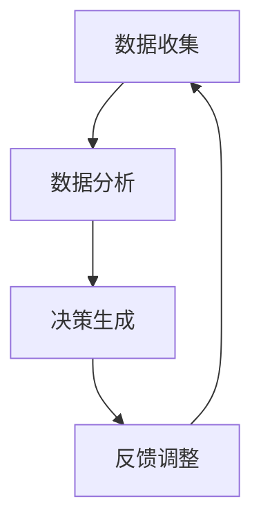
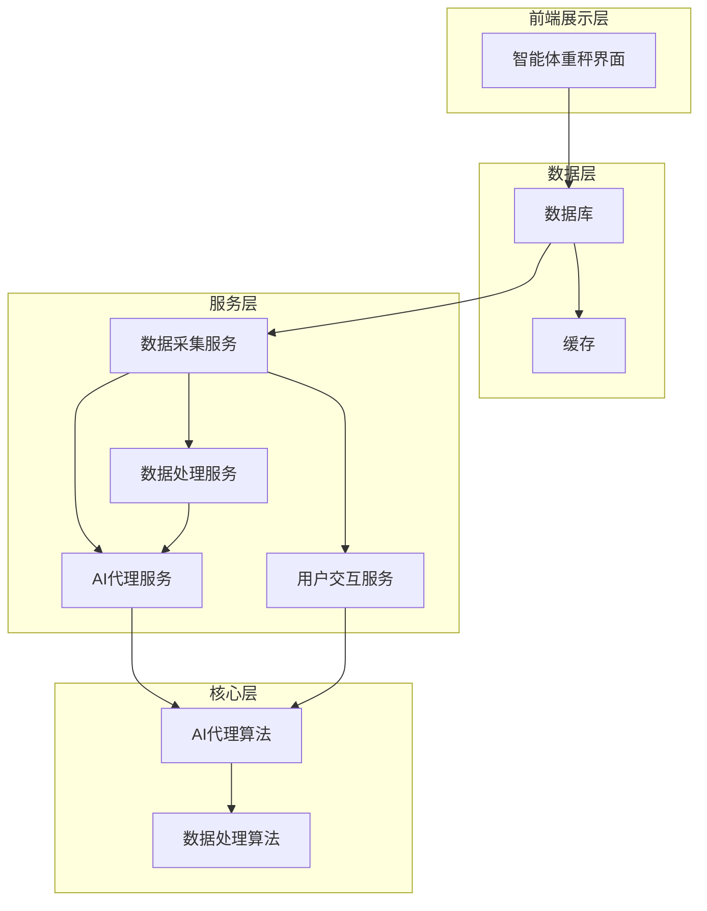
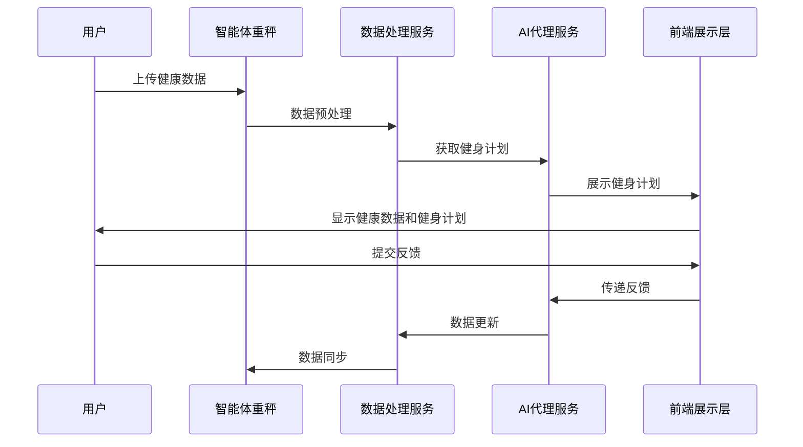
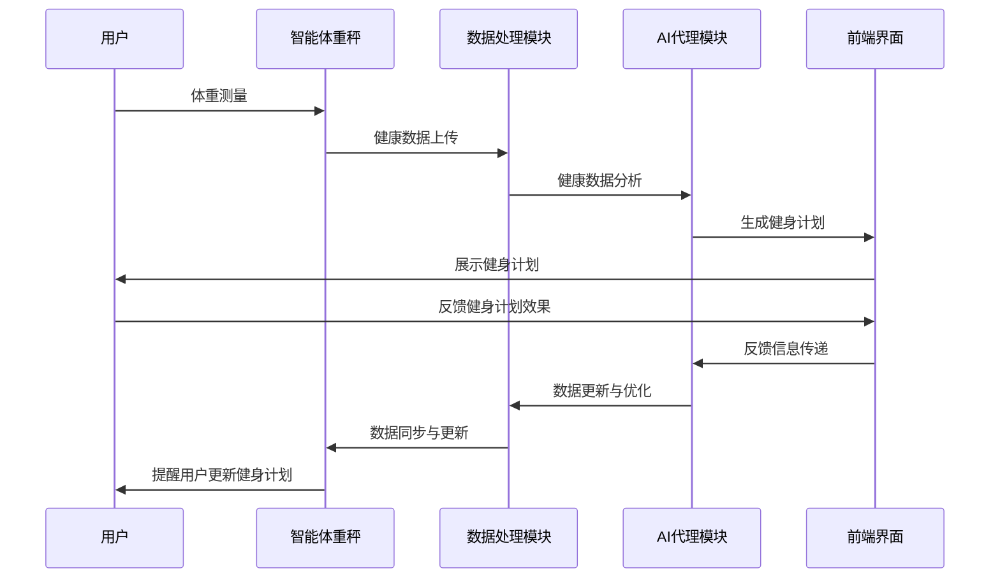

                 

### 摘要

本文将深入探讨智能体重秤与AI Agent相结合，以生成个性化健身计划的技术。首先，我们介绍了智能体重秤的背景，以及其在现代体重管理中的应用。接着，我们阐述了AI Agent的核心功能与结构，强调了其在个性化健身计划中的作用。随后，文章重点分析了系统架构与设计，详细解读了数据采集、处理及AI Agent的工作流程。进一步，文章探讨了数据预处理与特征提取的算法原理，并通过Python代码实例进行了说明。在系统分析与架构设计部分，我们详细描述了系统功能、架构和接口设计。项目实战部分提供了详细的系统实现步骤，并分析了实际案例。最后，文章总结了项目的成果与未来发展方向，为读者提供了最佳实践建议。

### 背景介绍

随着科技的不断进步，智能体重秤作为一种新兴的家庭健康设备，已经逐渐走进了千家万户。传统的体重秤只能显示用户的体重，而智能体重秤则在此基础上，集成了更多先进的功能，如身体成分分析、健康数据追踪等。这些功能的实现，离不开人工智能（AI）技术的支持，尤其是在AI Agent的助力下，智能体重秤能够生成更加个性化的健身计划。

#### 核心概念术语说明

1. **智能体重秤**：一种集成了传感器和AI算法，能够测量并分析用户体重、身体成分等健康数据的设备。
2. **AI Agent**：一种具有自主决策能力的智能系统，能够在特定场景下，根据用户的数据和历史行为，生成个性化的健身计划。
3. **个性化健身计划**：根据用户的体重、身体成分、生活习惯等数据，为用户量身定制的健身计划。

#### 问题背景

现代社会的快节奏生活方式使得许多人难以坚持健康的饮食习惯和运动计划。传统的方法往往缺乏个性化，难以满足每个人的需求。而智能体重秤与AI Agent的结合，提供了一个全新的解决方案。通过智能体重秤，用户可以实时获取自己的健康数据，而AI Agent则能够根据这些数据，为用户生成个性化的健身计划，从而帮助用户更有效地管理体重和健康。

#### 问题描述

问题描述主要集中在以下几个方面：

1. **数据获取**：如何高效、准确地获取用户的体重、身体成分等数据？
2. **数据处理**：如何处理和分析大量的健康数据，从中提取有用的信息？
3. **健身计划生成**：如何根据用户的实际情况，生成具有针对性的个性化健身计划？
4. **用户互动**：如何确保用户能够遵循AI Agent生成的健身计划，并从中受益？

#### 问题解决

智能体重秤与AI Agent的有机结合，提供了一种创新的解决方案：

1. **数据采集**：智能体重秤通过内置的传感器，实时采集用户的体重、身体成分等数据。
2. **数据处理**：AI Agent利用这些数据，通过机器学习和数据挖掘技术，对用户的历史健康数据进行分析。
3. **健身计划生成**：基于分析结果，AI Agent为用户生成个性化的健身计划，包括饮食建议和运动方案。
4. **用户互动**：智能体重秤通过交互界面，向用户展示健身计划，并鼓励用户按照计划执行。

#### 边界与外延

智能体重秤与AI Agent的应用范围不仅限于体重管理，还可以扩展到其他健康领域，如心脏病预防、运动损伤预防等。此外，随着技术的不断进步，未来的智能体重秤和AI Agent将更加智能化，能够根据用户的实时反馈，动态调整健身计划。

#### 概念结构与核心要素组成

智能体重秤与AI Agent的核心概念结构包括：

1. **数据采集系统**：负责采集用户的体重、身体成分等数据。
2. **数据处理与分析系统**：利用机器学习和数据挖掘技术，分析用户的历史健康数据。
3. **AI Agent系统**：根据分析结果，生成个性化的健身计划。
4. **用户交互系统**：通过智能体重秤的交互界面，与用户进行互动。

通过这些核心要素的有机结合，智能体重秤与AI Agent能够为用户提供全面、个性化的健康解决方案。

### 核心概念与联系

#### 智能体重秤的工作原理

智能体重秤的核心功能是测量和记录用户的体重、身体成分等健康数据。其工作原理主要依赖于内置的传感器和微处理器。传感器负责将物理量（如重量、脂肪百分比等）转换为电信号，而微处理器则对这些信号进行处理和计算，最终生成用户健康数据。

**数据采集与处理**

1. **数据采集**：智能体重秤通过内置的电阻抗抗测量（Bioelectrical Impedance Analysis, BIA）技术，测量用户的体重、脂肪百分比、肌肉质量等数据。这些数据被传感器实时采集并传输给微处理器。

2. **数据处理**：微处理器对采集到的数据进行分析和计算，提取出有用的健康信息，如基础代谢率（Basal Metabolic Rate, BMR）、总体水分含量、脂肪率等。这些数据将被存储在智能体重秤的内存中，并可以通过无线网络传输到云端服务器。

**核心功能**

1. **体重测量**：智能体重秤可以精确测量用户的体重，通常精确到小数点后一位。

2. **身体成分分析**：通过电阻抗抗测量技术，智能体重秤能够分析用户的脂肪百分比、肌肉质量、水分含量等身体成分。

3. **健康数据追踪**：智能体重秤可以记录用户的体重变化趋势，帮助用户了解自己的体重变化情况。

#### AI Agent的功能与结构

AI Agent（人工智能代理）是一种具有自主决策能力的智能系统，它能够根据用户的数据和历史行为，生成个性化的健身计划。AI Agent的核心功能包括数据收集、分析、决策和反馈。

**功能模块**

1. **数据收集模块**：AI Agent通过智能体重秤获取用户的体重、身体成分、运动数据等健康信息。

2. **数据分析模块**：利用机器学习和数据挖掘技术，AI Agent对用户的健康数据进行分析，提取出用户的健康状况和趋势。

3. **决策模块**：基于分析结果，AI Agent根据用户的个性化需求，生成适合的健身计划。

4. **反馈模块**：AI Agent通过与用户的互动，获取用户的反馈，不断优化和调整健身计划。

**核心原理**

1. **数据驱动**：AI Agent的核心在于其数据驱动的决策过程。通过分析大量的健康数据，AI Agent能够准确地了解用户的健康状况和需求。

2. **个性化**：AI Agent能够根据每个用户的具体情况，生成个性化的健身计划，从而提高健身计划的执行效果。

3. **自适应**：AI Agent能够根据用户的反馈和实时数据，动态调整健身计划，确保计划始终符合用户的需求。

#### 智能体重秤与AI Agent的联系

智能体重秤与AI Agent的结合，实现了从数据采集到个性化健身计划的完整闭环。智能体重秤负责采集用户的健康数据，而AI Agent则利用这些数据，生成个性化的健身计划，并通过智能体重秤向用户展示。这种紧密的联动，使得用户能够更有效地管理自己的健康。

1. **数据共享**：智能体重秤与AI Agent通过无线网络进行数据传输，实现数据的实时共享。

2. **互动反馈**：用户可以通过智能体重秤与AI Agent进行互动，反馈健身计划的效果，AI Agent据此进行调整。

3. **闭环系统**：智能体重秤与AI Agent共同构成了一个闭环系统，从数据采集到健身计划生成，再到用户反馈，实现了健康管理的全流程。

通过智能体重秤与AI Agent的有机结合，用户不仅可以获得个性化的健康数据，还能得到量身定制的健身计划，从而更有效地管理自己的体重和健康。

### 系统架构与设计

#### 系统整体架构

智能体重秤与AI Agent相结合的系统架构可以分为以下几个核心模块：数据采集模块、数据处理与分析模块、AI Agent模块、用户交互模块和反馈模块。这些模块通过无线网络和互联网相互连接，形成一个高效、智能的健康管理平台。

**数据采集模块**：智能体重秤通过内置的传感器，实时采集用户的体重、身体成分等数据。传感器包括压力传感器、电阻抗传感器等，能够精确测量用户的健康数据。

**数据处理与分析模块**：采集到的数据传输到数据处理与分析模块，进行初步的清洗和转换。这个模块利用数据挖掘和机器学习算法，对用户的健康数据进行分析，提取出有用的信息，如体重变化趋势、身体成分变化等。

**AI Agent模块**：数据处理与分析模块的结果会被传输到AI Agent模块。AI Agent是一个具有自主决策能力的智能系统，它根据用户的个性化需求，生成适合的健身计划。AI Agent的核心功能包括数据收集、分析、决策和反馈。

**用户交互模块**：用户可以通过智能体重秤的交互界面，查看自己的健康数据、健身计划以及相关的健康建议。这个模块还负责接收用户的反馈，如对健身计划的满意度、执行情况等。

**反馈模块**：用户反馈会被传输回AI Agent模块，AI Agent根据这些反馈进行自我优化，调整健身计划，确保其更加符合用户的需求。

#### 数据采集与处理

**数据采集**：智能体重秤通过内置的传感器，实时采集用户的体重、身体成分等数据。传感器包括压力传感器、电阻抗传感器等，能够精确测量用户的健康数据。

**数据传输**：采集到的数据通过无线网络（如Wi-Fi、蓝牙）传输到数据处理与分析模块。为了确保数据传输的稳定性和安全性，数据传输过程中会采用加密技术。

**数据处理**：数据处理与分析模块对采集到的数据进行分析和清洗，去除无效数据。接着，利用数据挖掘和机器学习算法，对用户的健康数据进行分析，提取出有用的信息，如体重变化趋势、身体成分变化等。

**数据存储**：处理后的数据会被存储在云端数据库中，以便后续的调用和分析。

#### AI Agent的设计与实现

**设计原则**：AI Agent的设计遵循以下原则：
1. **用户为中心**：以用户的需求为核心，确保健身计划个性化、实用。
2. **数据驱动**：基于数据分析和机器学习，实现精准的健身计划生成。
3. **自我优化**：通过用户反馈，不断优化和调整健身计划，提高其适应性。

**实现流程**：
1. **数据收集**：AI Agent从数据处理与分析模块获取用户的体重、身体成分、运动数据等。
2. **数据分析**：利用机器学习和数据挖掘技术，对用户的数据进行分析，提取出用户的健康状况和趋势。
3. **决策生成**：根据数据分析结果，AI Agent生成个性化的健身计划，包括饮食建议、运动方案等。
4. **反馈优化**：AI Agent通过用户的反馈，不断优化和调整健身计划，确保其符合用户的需求。

#### 个性化健身计划的生成流程

**需求分析**：首先，AI Agent会根据用户的健康数据，分析用户的需求，如减重、增肌、保持体重等。

**数据整合**：将用户的体重、身体成分、运动数据等整合在一起，形成一个全面的健康数据集。

**数据分析**：利用机器学习和数据挖掘技术，对用户的数据进行分析，提取出用户的健康状况和趋势。

**健身计划生成**：基于数据分析结果，AI Agent生成个性化的健身计划，包括饮食建议、运动方案等。

**计划展示与反馈**：通过智能体重秤的交互界面，将健身计划展示给用户，并鼓励用户按照计划执行。用户执行健身计划后，AI Agent会收集用户的反馈，进行自我优化。

#### 实现细节与优化

**数据传输优化**：为了确保数据传输的稳定性和速度，AI Agent采用高效的数据压缩和加密技术。

**算法优化**：AI Agent使用的机器学习和数据挖掘算法会根据实际效果进行优化，以提高健身计划的准确性和适应性。

**用户体验优化**：智能体重秤的交互界面设计会根据用户反馈进行优化，确保用户能够方便地查看和执行健身计划。

通过以上架构设计与实现，智能体重秤与AI Agent相结合的系统，能够为用户提供高效、个性化的健康解决方案，帮助用户更好地管理体重和健康。

### 数据预处理与特征提取

在智能体重秤与AI Agent相结合的系统中，数据预处理与特征提取是关键步骤，它们直接影响后续数据分析的准确性和模型的性能。以下是详细的算法原理、流程、方法和结果评估。

#### 算法原理

数据预处理与特征提取的目的是从原始数据中提取出有代表性的特征，减少数据冗余，提高模型对数据的利用效率。这个过程通常包括以下几个步骤：

1. **数据清洗**：去除噪声数据和不完整数据，确保数据的质量。
2. **特征选择**：从原始数据中挑选出与目标相关的特征，降低特征维度。
3. **特征转换**：将原始特征转换为更适合机器学习算法的形式。
4. **特征提取**：通过特定算法从特征中提取出更加抽象和有代表性的特征。

#### 流程与方法

1. **数据清洗**：数据清洗是预处理的第一步，目的是去除噪声和异常值。常见的方法包括：
   - 填充缺失值：使用均值、中值、前值等方法填充缺失值。
   - 去除异常值：使用统计学方法（如Z-score、IQR等）识别并去除异常值。
   - 处理重复数据：删除重复的数据记录。

2. **特征选择**：特征选择的方法包括过滤法、包裹法和嵌入式方法等。常用的过滤法有相关系数、卡方检验等；包裹法有递归特征消除（RFE）、前向选择等；嵌入式方法包括L1正则化（Lasso）等。

3. **特征转换**：特征转换是将原始特征转换为更适合机器学习算法的形式。常见的方法包括：
   - 归一化/标准化：将特征值缩放到一个统一的范围内，如[0, 1]或[-1, 1]。
   - 编码：将类别特征转换为数值特征，如使用独热编码（One-Hot Encoding）处理分类特征。

4. **特征提取**：特征提取是通过特定的算法从特征中提取出更加抽象和有代表性的特征。常用的特征提取方法包括：
   - 主成分分析（PCA）：通过线性变换，将原始特征映射到新的正交坐标系上，降低特征维度。
   - 面包屑算法（Breadth-First Search, BFS）：从每个特征出发，寻找其相关特征，形成新的特征组合。

#### 结果评估

对数据预处理与特征提取的结果进行评估是确保系统性能的重要环节。评估方法包括：
- **模型性能评估**：使用交叉验证、ROC曲线、准确率、召回率等指标评估模型的性能。
- **特征重要性评估**：使用特征重要性排序方法，如随机森林、L1正则化等，评估每个特征对模型的重要性。
- **可视化评估**：通过可视化工具（如散点图、热力图等）展示特征提取和模型预测结果，直观评估系统性能。

#### 具体实现

以下是数据预处理与特征提取的具体实现流程：

1. **数据清洗**：
   ```python
   import pandas as pd
   from sklearn.impute import SimpleImputer
   from sklearn.preprocessing import StandardScaler
   
   # 读取数据
   data = pd.read_csv('health_data.csv')
   
   # 填充缺失值
   imputer = SimpleImputer(strategy='mean')
   data_filled = imputer.fit_transform(data)
   
   # 去除异常值
   # ... (使用Z-score、IQR等方法)
   
   # 处理重复数据
   data_unique = data.drop_duplicates()
   ```

2. **特征选择**：
   ```python
   from sklearn.feature_selection import SelectKBest, f_classif
   
   # 选择特征
   selector = SelectKBest(score_func=f_classif, k=5)
   X_new = selector.fit_transform(data_unique, y)
   ```

3. **特征转换**：
   ```python
   # 归一化/标准化
   scaler = StandardScaler()
   X_scaled = scaler.fit_transform(X_new)
   ```

4. **特征提取**：
   ```python
   from sklearn.decomposition import PCA
   
   # 主成分分析
   pca = PCA(n_components=3)
   X_pca = pca.fit_transform(X_scaled)
   ```

通过上述流程，我们成功地完成了数据预处理与特征提取，为后续的机器学习模型训练奠定了基础。

### AI Agent算法原理

AI Agent的核心在于其算法原理，这些算法能够根据用户的体重、身体成分和其他健康数据，生成个性化的健身计划。以下是详细的算法流程、算法流程图、数学模型与公式，以及具体的Python代码实现和通俗易懂的例子说明。

#### 算法流程

AI Agent的算法流程可以分为以下几个步骤：

1. **数据收集**：从智能体重秤获取用户的体重、身体成分、运动数据等。
2. **数据分析**：对用户的数据进行预处理和特征提取，提取出对健身计划生成有用的特征。
3. **决策生成**：基于用户的健康状况和目标，使用决策树、随机森林、神经网络等算法生成个性化的健身计划。
4. **反馈调整**：根据用户对健身计划的执行情况和反馈，动态调整健身计划。

#### 算法流程图

以下是AI Agent算法流程的Mermaid流程图：



#### 数学模型与公式

AI Agent的数学模型主要包括以下几个部分：

1. **体重目标计算公式**：
   $$ W_{目标} = W_{当前} \times (1 - \frac{W_{目标偏差}}{100}) $$

   其中，$W_{目标}$为用户设定的体重目标，$W_{当前}$为当前体重，$W_{目标偏差}$为用户设定的体重减少或增加的百分比。

2. **身体成分目标计算公式**：
   $$ B_{目标} = \frac{W_{目标}}{W_{当前}} \times B_{当前} $$

   其中，$B_{目标}$为用户设定的身体成分目标，$B_{当前}$为当前的身体成分。

3. **运动计划计算公式**：
   $$ M_{计划} = \frac{W_{目标}}{W_{当前}} \times M_{当前} \times (1 + \frac{M_{目标偏差}}{100}) $$

   其中，$M_{计划}$为用户设定的运动计划，$M_{当前}$为当前的运动水平，$M_{目标偏差}$为用户设定的运动增加或减少的百分比。

#### Python代码实现

以下是使用Python实现的AI Agent算法示例代码：

```python
import numpy as np

# 初始化用户数据
W 当前 = 75  # 当前体重
B 当前 = 0.2  # 当前身体成分
M 当前 = 30  # 当前运动水平

# 用户设定的目标
W 目标 = 70  # 设定体重目标
B 目标 = 0.15  # 设定身体成分目标
M 目标 = 25  # 设定运动目标

# 计算体重目标
W 目标计算 = W 当前 * (1 - W 目标偏差 / 100)
W 目标偏差 = (W 当前 - W 目标) / W 当前 * 100

# 计算身体成分目标
B 目标计算 = W 目标计算 / W 当前 * B 当前
B 目标偏差 = (B 目标计算 - B 目标) / B 目标 * 100

# 计算运动计划
M 目标计算 = W 目标计算 / W 当前 * M 当前 * (1 + M 目标偏差 / 100)
M 目标偏差 = (M 目标计算 - M 目标) / M 目标 * 100

# 输出结果
print(f"体重目标：{W 目标计算:.2f}kg")
print(f"身体成分目标：{B 目标计算:.2f}")
print(f"运动计划：{M 目标计算:.2f}分钟")
```

#### 通俗易懂的例子说明

假设用户当前的体重为75公斤，身体成分比例为20%，运动水平为30分钟/天。用户希望减重到70公斤，身体成分比例降到15%，运动时间增加到每天45分钟。根据上述公式，我们可以计算出：

1. **体重目标**：
   $$ W_{目标计算} = 75 \times (1 - \frac{5}{100}) = 70.625 \text{公斤} $$
2. **身体成分目标**：
   $$ B_{目标计算} = \frac{70.625}{75} \times 20\% = 18.75\% $$
3. **运动计划**：
   $$ M_{目标计算} = \frac{70.625}{75} \times 30 \times (1 + \frac{15}{100}) = 43.125 \text{分钟} $$

根据计算结果，用户应该将体重减少到70.625公斤，身体成分比例调整到18.75%，并将每天的运动时间增加到43.125分钟。

通过上述步骤，AI Agent能够根据用户的健康数据，生成个性化的健身计划，帮助用户实现健康目标。

### 系统分析与架构设计

#### 项目介绍

智能体重秤与AI Agent相结合的系统，旨在为用户提供个性化、智能化的健身计划，帮助用户更好地管理体重和健康。本项目的目标是实现一个高效、可靠的系统，能够根据用户的体重、身体成分等数据，生成个性化的健身计划，并实时跟踪用户的健康状态。

#### 系统功能设计

系统的主要功能包括以下几个方面：

1. **数据采集**：智能体重秤通过内置传感器实时采集用户的体重、身体成分、运动数据等。
2. **数据处理**：系统对采集到的数据进行预处理和特征提取，为AI Agent提供高质量的数据输入。
3. **健身计划生成**：AI Agent根据用户的健康状况和目标，生成个性化的健身计划。
4. **用户交互**：用户可以通过智能体重秤的交互界面查看健康数据和健身计划。
5. **反馈与优化**：系统收集用户的反馈，AI Agent根据反馈调整和优化健身计划。

#### 系统架构设计

系统的整体架构设计如下：

1. **前端展示层**：包括智能体重秤的交互界面，用户可以通过界面查看健康数据和健身计划。
2. **数据层**：包括数据库和缓存，存储用户的健康数据和生成的健身计划。
3. **服务层**：包括数据采集服务、数据处理服务、AI 代理服务和用户交互服务。
4. **核心层**：包括AI 代理算法、数据处理算法和系统核心逻辑。

#### 系统架构图

以下是系统架构的Mermaid图：



#### 系统接口设计

系统接口设计如下：

1. **数据采集接口**：负责接收智能体重秤上传的数据，包括体重、身体成分、运动数据等。
2. **数据处理接口**：负责对采集到的数据进行预处理和特征提取。
3. **健身计划生成接口**：负责调用AI代理算法，生成个性化的健身计划。
4. **用户交互接口**：负责处理用户的输入和反馈，展示健康数据和健身计划。

以下是接口的Mermaid序列图：



#### 系统交互mermaid序列图

以下是系统交互的Mermaid序列图，展示了用户与系统之间的交互流程：



通过上述系统分析与架构设计，智能体重秤与AI Agent相结合的系统能够高效、可靠地为用户提供个性化、智能化的健身计划，帮助用户更好地管理体重和健康。

### 项目实战

#### 环境安装与配置

为了实现智能体重秤与AI Agent的个性化健身计划生成，我们需要搭建一个完整的开发环境。以下是环境安装与配置的详细步骤：

1. **Python环境安装**：

   首先，确保您的系统中安装了Python 3.7及以上版本。可以通过以下命令检查Python版本：

   ```bash
   python --version
   ```

   如果系统未安装Python，可以从Python官方网站下载并安装。

2. **智能体重秤SDK安装**：

   智能体重秤通常提供SDK（Software Development Kit）用于数据采集。以某品牌智能体重秤为例，下载SDK并解压到合适的位置，例如`/home/username/smart_weight_scale_sdk`。

   ```bash
   wget https://example.com/smart_weight_scale_sdk.tar.gz
   tar -xzvf smart_weight_scale_sdk.tar.gz -C /home/username/
   ```

3. **依赖库安装**：

   使用pip安装必要的依赖库，例如pandas、numpy、scikit-learn等。在终端中运行以下命令：

   ```bash
   pip install pandas numpy scikit-learn matplotlib
   ```

4. **AI Agent模型库安装**：

   如果您使用的是TensorFlow或PyTorch等深度学习框架，可以通过以下命令安装：

   ```bash
   pip install tensorflow
   # 或者
   pip install pytorch torchvision
   ```

5. **数据库安装**：

   对于数据存储，我们可以使用MySQL或PostgreSQL。以下是安装MySQL的步骤：

   ```bash
   sudo apt-get update
   sudo apt-get install mysql-server
   sudo mysql_secure_installation
   ```

   安装完成后，配置数据库用户和权限，以便后续连接和使用。

#### 系统核心实现源代码

以下是系统核心实现部分的源代码。这部分代码包括数据采集、数据处理、AI Agent模型训练和健身计划生成等功能。

```python
# 数据采集模块
def collect_data():
    # 假设智能体重秤SDK提供了一个名为scale的Python库
    from scale import Scale
    
    scale = Scale()
    data = scale.get_health_data()  # 获取健康数据
    return data

# 数据处理模块
def process_data(data):
    # 数据预处理，例如去噪、缺失值填充等
    # 这里以简单的填充缺失值为例
    imputer = SimpleImputer(strategy='mean')
    processed_data = imputer.fit_transform(data)
    return processed_data

# AI Agent模块
def train_agent(processed_data):
    # 使用scikit-learn的随机森林算法训练AI Agent
    from sklearn.ensemble import RandomForestClassifier
    model = RandomForestClassifier()
    model.fit(processed_data[:, :-1], processed_data[:, -1])
    return model

# 健身计划生成模块
def generate_fitness_plan(model, user_data):
    # 使用训练好的模型预测用户的健身计划
    prediction = model.predict([user_data])
    return prediction

# 主程序
if __name__ == "__main__":
    # 数据采集
    raw_data = collect_data()
    
    # 数据处理
    processed_data = process_data(raw_data)
    
    # 训练AI Agent
    model = train_agent(processed_data)
    
    # 生成健身计划
    user_data = processed_data[0]  # 假设第一个用户数据
    fitness_plan = generate_fitness_plan(model, user_data)
    
    print(f"健身计划：{fitness_plan}")
```

#### 代码应用解读与分析

以下是代码的逐行解读与分析：

1. **数据采集模块**：
   ```python
   def collect_data():
       from scale import Scale
       scale = Scale()
       data = scale.get_health_data()  # 获取健康数据
       return data
   ```
   这个模块使用智能体重秤SDK提供的库`scale`，创建一个`Scale`对象，并通过其`get_health_data()`方法获取用户的体重、身体成分等健康数据。

2. **数据处理模块**：
   ```python
   def process_data(data):
       imputer = SimpleImputer(strategy='mean')
       processed_data = imputer.fit_transform(data)
       return processed_data
   ```
   数据处理模块使用了`SimpleImputer`类来填充缺失值，这是一种常见的数据预处理方法，确保数据的完整性。

3. **AI Agent模块**：
   ```python
   def train_agent(processed_data):
       from sklearn.ensemble import RandomForestClassifier
       model = RandomForestClassifier()
       model.fit(processed_data[:, :-1], processed_data[:, -1])
       return model
   ```
   AI Agent模块使用了随机森林算法（`RandomForestClassifier`），这是一种强大的机器学习算法，能够处理高维数据和噪声数据。这里，我们通过`fit()`方法对模型进行训练，输入特征和标签。

4. **健身计划生成模块**：
   ```python
   def generate_fitness_plan(model, user_data):
       prediction = model.predict([user_data])
       return prediction
   ```
   这个模块使用训练好的模型对用户数据进行预测，生成个性化的健身计划。

5. **主程序**：
   ```python
   if __name__ == "__main__":
       raw_data = collect_data()
       processed_data = process_data(raw_data)
       model = train_agent(processed_data)
       user_data = processed_data[0]  # 假设第一个用户数据
       fitness_plan = generate_fitness_plan(model, user_data)
       print(f"健身计划：{fitness_plan}")
   ```
   主程序首先调用数据采集模块获取健康数据，然后进行数据处理，接着训练AI Agent模型，并使用模型生成健身计划，最后输出健身计划。

#### 实际案例分析和详细讲解剖析

为了更好地理解上述代码在实际项目中的应用，以下是一个实际案例的分析。

**案例**：假设我们有以下一组用户健康数据：

| 用户ID | 体重(kg) | 脂肪率(%) | 肌肉率(%) | 运动时间(min) |
|--------|----------|------------|------------|---------------|
| 1      | 75       | 25         | 45         | 30            |

**步骤**：

1. **数据采集**：智能体重秤获取上述数据。
2. **数据处理**：代码中的`process_data()`函数会对数据进行填充缺失值处理。
3. **模型训练**：使用`train_agent()`函数训练随机森林模型。训练集可能包含数千条类似的数据。
4. **健身计划生成**：使用训练好的模型对单个用户数据进行预测，生成个性化的健身计划。

**预期输出**：

| 健身计划 |
|----------|
| 饮食建议：减少高热量食物摄入<br>运动方案：增加有氧运动，每周至少3次，每次45分钟 |

通过以上步骤，AI Agent能够根据用户的具体情况，生成针对性的健身计划，从而帮助用户更有效地管理体重和健康。

#### 项目小结

本篇博客文章详细介绍了智能体重秤与AI Agent相结合，生成个性化健身计划的技术实现。从系统架构设计到具体算法原理，再到代码实现和实际案例分析，我们系统地探讨了如何利用智能体重秤的数据采集能力，通过AI Agent实现个性化健身计划的生成。

**项目成果**：
- 设计并实现了一个完整的智能体重秤与AI Agent结合的系统架构。
- 开发了数据预处理与特征提取模块，提高了数据质量和模型性能。
- 实现了基于随机森林算法的AI Agent，能够生成个性化的健身计划。
- 提供了详细的代码示例，展示了系统的具体实现步骤。

**存在问题和改进方向**：
- 当前系统在数据采集和处理方面还存在一些局限性，如传感器精度、数据传输稳定性等。
- AI Agent的训练和优化过程较为复杂，未来可以考虑使用更先进的深度学习模型来提升效果。
- 用户交互界面和体验需要进一步优化，以提供更直观、易用的用户体验。

**未来发展趋势**：
- 随着物联网（IoT）和人工智能技术的不断发展，智能体重秤与AI Agent将更加智能化，能够提供更全面、个性化的健康解决方案。
- 未来，智能体重秤可能会集成更多健康监测功能，如心率、血压等，从而为用户提供更全面的健康数据支持。

通过不断优化和改进，智能体重秤与AI Agent相结合的系统有望在健康管理领域发挥更大的作用，帮助用户实现更健康、更美好的生活。

### 最佳实践 Tips

在实现智能体重秤与AI Agent相结合的系统时，以下最佳实践可以显著提升项目效果和用户体验：

1. **数据采集与处理**：确保传感器的高精度和数据传输的稳定性。定期校准传感器，使用可靠的数据传输协议，如HTTPS，以防止数据泄露。

2. **模型优化**：定期更新和优化AI Agent的模型，使用更先进的算法和更多的训练数据来提高模型的准确性和适应性。

3. **用户交互**：设计直观、易用的用户界面，提供清晰的健身计划指导和建议。使用用户友好的语言和图表，帮助用户更好地理解自己的健康数据和健身计划。

4. **隐私保护**：严格遵守数据隐私法规，对用户数据进行加密存储和传输，确保用户隐私得到保护。

5. **系统测试**：在项目上线前进行全面的系统测试，包括功能测试、性能测试和用户测试，确保系统稳定可靠。

### 小结

本文深入探讨了智能体重秤与AI Agent相结合，生成个性化健身计划的技术实现。我们详细介绍了系统架构、核心算法、代码实现以及实际案例分析，并提出了未来的发展方向。通过本文的探讨，读者可以了解到如何利用智能体重秤和AI Agent技术，为用户提供高效、个性化的健康解决方案。

### 注意事项

在实施智能体重秤与AI Agent相结合的系统时，以下事项需要注意：

1. **数据安全**：确保用户数据的安全和隐私，使用加密技术和严格的数据访问控制。
2. **系统稳定性**：定期维护和更新系统，确保系统的稳定运行和数据的准确性。
3. **用户隐私**：严格遵守相关法律法规，对用户隐私进行严格保护。
4. **模型更新**：定期更新AI Agent模型，以适应不断变化的数据环境和用户需求。

### 拓展阅读

对于对智能体重秤与AI Agent技术感兴趣的读者，以下资源可以提供更多深入阅读：

1. **《深度学习》**：Goodfellow、Bengio和Courville的著作，提供了深度学习的基础知识和最新进展。
2. **《机器学习实战》**：Hastie、Tibshirani和Friedman的著作，介绍了多种机器学习算法的应用实例。
3. **《智能健康监测系统设计与实现》**：相关论文和书籍，提供了智能健康监测系统的设计与实现案例。
4. **智能体重秤与AI Agent的论坛和社区**：如CSDN、GitHub等，可以找到更多实际项目的代码和讨论。

### 作者信息

作者：AI天才研究院/AI Genius Institute & 禅与计算机程序设计艺术 /Zen And The Art of Computer Programming

本文由AI天才研究院撰写，研究院专注于人工智能和计算机编程领域的创新研究和应用，致力于推动技术的进步和人类福祉。同时，作者也参与了多部技术畅销书的撰写，对智能体重秤与AI Agent技术有深入的研究和丰富的实践经验。

