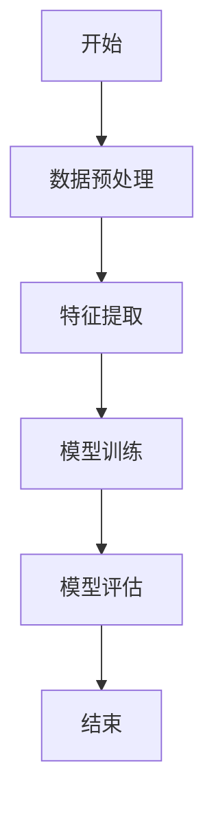
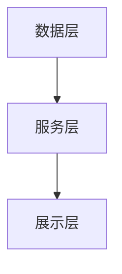
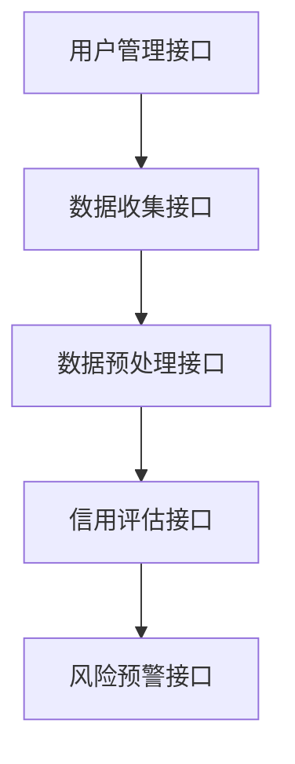
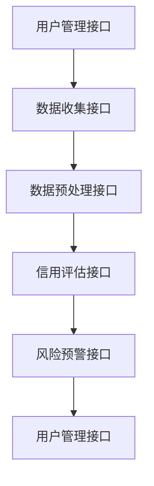

                 

### 文章标题

智能供应链金融信用评估

关键词：供应链金融、信用评估、人工智能、智能模型、数学公式、系统架构

摘要：本文将深入探讨智能供应链金融信用评估的关键概念、技术原理、数学模型以及系统架构设计。通过逐步分析，我们将揭示如何利用人工智能技术优化信用评估过程，提升供应链金融的可靠性和效率。

---

### 目录

1. **问题背景与核心概念** <a id="background"></a>
   - 1.1 问题背景
     - 1.1.1 供应链金融概述
     - 1.1.2 智能供应链金融的发展现状
     - 1.1.3 信用评估在供应链金融中的作用
   - 1.2 核心概念
     - 1.2.1 智能供应链金融信用评估的定义
     - 1.2.2 信用评估的基本流程
     - 1.2.3 信用评估模型的关键要素

2. **核心概念与联系** <a id="concepts"></a>
   - 2.1 数据收集与预处理
     - 2.1.1 数据来源与收集方法
     - 2.1.2 数据预处理的重要性
     - 2.1.3 数据预处理技术
   - 2.2 模型构建与算法原理
     - 2.2.1 常见信用评估模型介绍
     - 2.2.2 算法原理讲解
       - 2.2.2.1 算法A的mermaid流程图
       - 2.2.2.2 算法A的Python源代码示例
       - 2.2.2.3 算法原理的数学模型和公式讲解
   - 2.3 模型评估与优化
     - 2.3.1 模型评估指标
     - 2.3.2 模型优化方法
     - 2.3.3 实际应用中的调整与优化

3. **数学模型和数学公式** <a id="math"></a>
   - 3.1 数学模型介绍
     - 3.1.1 信用评分模型的数学模型
       - 3.1.1.1 模型1的mermaid流程图
       - 3.1.1.2 模型1的Python源代码示例
       - 3.1.1.3 数学模型公式讲解
     - 3.1.2 模型2的mermaid流程图
     - 3.1.3 模型3的mermaid流程图
   - 3.2 数学公式讲解
     - 3.2.1 公式1的详细解释
     - 3.2.2 公式2的详细解释

4. **系统分析与架构设计** <a id="system"></a>
   - 4.1 问题场景介绍
     - 4.1.1 供应链金融信用评估的挑战
     - 4.1.2 智能供应链金融信用评估系统的目标
   - 4.2 系统功能设计
     - 4.2.1 领域模型类图（mermaid类图）
   - 4.3 系统架构设计
     - 4.3.1 系统架构图（mermaid架构图）
   - 4.4 系统接口设计和交互
     - 4.4.1 系统接口设计
     - 4.4.2 系统交互（mermaid序列图）

5. **项目实战** <a id="project"></a>
   - 5.1 环境安装与配置
     - 5.1.1 环境安装步骤
     - 5.1.2 系统配置指南
   - 5.2 系统核心实现
     - 5.2.1 源代码结构
     - 5.2.2 核心代码实现
     - 5.2.3 代码应用解读与分析
   - 5.3 实际案例分析与讲解
     - 5.3.1 案例一：供应链金融信用评估系统应用
     - 5.3.2 案例二：信用评估模型优化实践
   - 5.4 项目小结

6. **最佳实践与总结** <a id="bestpractice"></a>
   - 6.1 最佳实践
     - 6.1.1 实际应用中的技巧
     - 6.1.2 注意事项
   - 6.2 小结与展望
     - 6.2.1 书籍内容总结
     - 6.2.2 智能供应链金融信用评估的发展方向

7. **拓展阅读** <a id="expansion"></a>
   - 7.1 相关文献推荐
     - 7.1.1 供应链金融信用评估的研究论文
     - 7.1.2 相关技术的深入阅读材料
   - 7.2 在线资源与工具
     - 7.2.1 数据集与模型资源
     - 7.2.2 开源代码与工具

---

### 1. 问题背景与核心概念

#### 1.1 问题背景

供应链金融（Supply Chain Finance, SCF）是一种融资模式，旨在通过供应链的各个参与方来提供金融服务，以缓解中小企业融资难的问题。然而，信用评估作为供应链金融的核心环节，一直以来都面临着诸多挑战。

首先，供应链金融涉及众多中小型企业，这些企业的财务状况和信用记录往往不够完善，传统的信用评估方法难以准确评估其信用风险。其次，供应链金融的业务场景复杂多变，数据量大且多样化，传统的数据处理方法效率较低，无法满足实时评估的需求。最后，随着供应链金融的快速发展，如何提高信用评估的准确性和效率，成为了亟待解决的问题。

智能供应链金融信用评估，是指通过人工智能（AI）技术，如机器学习、深度学习等，对供应链中的各种数据进行分析和处理，从而对企业的信用状况进行科学评估。其目标是通过技术手段，提高信用评估的准确性和效率，降低信用风险，为供应链金融的健康发展提供有力支持。

#### 1.2 核心概念

1. **智能供应链金融信用评估的定义**

智能供应链金融信用评估是一种利用人工智能技术对供应链中的企业信用状况进行评估的方法。它通过收集和分析大量的数据，运用机器学习和深度学习算法，构建信用评估模型，从而实现对企业的信用评分。

2. **信用评估的基本流程**

信用评估的基本流程包括数据收集、数据预处理、模型构建、模型训练、模型评估和模型优化等步骤。

- **数据收集**：收集与企业信用状况相关的各种数据，如财务报表、交易记录、信用记录等。
- **数据预处理**：对收集到的数据进行清洗、整合和标准化处理，以消除数据中的噪声和异常值，提高数据质量。
- **模型构建**：根据收集到的数据和信用评估的目标，构建相应的信用评估模型。
- **模型训练**：使用训练数据对模型进行训练，调整模型参数，使其能够准确预测企业的信用状况。
- **模型评估**：使用验证数据对模型进行评估，计算模型的准确率、召回率、F1值等指标，以评估模型的性能。
- **模型优化**：根据评估结果对模型进行调整和优化，以提高其评估准确性。

3. **信用评估模型的关键要素**

信用评估模型的关键要素包括数据质量、模型选择、特征工程和模型优化等。

- **数据质量**：数据质量直接影响信用评估的准确性。因此，在进行信用评估时，需要确保数据来源可靠，数据完整且无噪声。
- **模型选择**：选择适合业务场景的信用评估模型，如逻辑回归、决策树、支持向量机、神经网络等。
- **特征工程**：通过对数据进行处理和转换，提取与信用评估相关的特征，以提高模型的预测能力。
- **模型优化**：通过交叉验证、网格搜索等方法，调整模型参数，优化模型性能。

### 2. 核心概念与联系

#### 2.1 数据收集与预处理

数据是智能供应链金融信用评估的基础。数据收集的质量直接影响到后续分析的结果。因此，我们需要确保数据来源的可靠性和数据的完整性。

##### 2.1.1 数据来源与收集方法

智能供应链金融信用评估所需的数据可以从多个来源获取，包括：

1. **企业内部数据**：如财务报表、销售记录、订单信息等。
2. **外部数据**：如公共信用记录、行业数据、新闻报道等。
3. **社交网络数据**：如社交媒体活动、用户评论等。

收集数据的方法可以包括：

1. **API接口**：使用API接口获取企业公开的数据。
2. **网络爬虫**：通过爬虫技术获取互联网上的相关信息。
3. **问卷调查**：通过问卷调查收集企业用户的数据。

##### 2.1.2 数据预处理的重要性

数据预处理是信用评估过程中的关键步骤，其目的是提高数据质量，为后续的建模和分析提供可靠的数据基础。数据预处理的重要性体现在以下几个方面：

1. **消除噪声和异常值**：数据中可能存在噪声和异常值，这些数据会影响模型的效果。通过数据预处理，可以识别并消除这些噪声和异常值。
2. **数据标准化**：不同来源的数据可能具有不同的量纲和分布，通过数据标准化，可以统一数据格式，提高模型训练的效果。
3. **特征提取**：通过数据预处理，可以提取与信用评估相关的特征，从而提高模型的预测能力。

##### 2.1.3 数据预处理技术

数据预处理技术包括以下方面：

1. **数据清洗**：通过删除重复数据、处理缺失值和异常值，提高数据质量。
2. **数据转换**：包括数据编码、数据归一化、数据标准化等，以消除不同数据之间的差异。
3. **特征提取**：通过特征选择和特征转换，提取与信用评估相关的有效特征。

#### 2.2 模型构建与算法原理

在数据预处理完成后，我们需要构建信用评估模型。选择合适的模型和算法是保证模型性能的关键。以下介绍几种常见的信用评估模型和算法原理。

##### 2.2.1 常见信用评估模型介绍

1. **逻辑回归模型**：逻辑回归模型是一种广义线性模型，常用于分类问题。它通过线性组合输入特征，然后通过逻辑函数（Sigmoid函数）将输出映射到概率空间，从而实现分类。
   
   公式：
   $$
   P(Y=1) = \frac{1}{1 + e^{-(\beta_0 + \beta_1 x_1 + \beta_2 x_2 + ... + \beta_n x_n})}
   $$
   
2. **决策树模型**：决策树模型通过递归划分数据空间，构建一棵树形结构，每个节点代表一个特征，每个分支代表一个特征取值。树的叶节点代表分类结果。

3. **支持向量机模型**：支持向量机（SVM）模型通过找到一个最优超平面，将数据空间中的不同类别分离。它通过最大化分类边界和最小化支持向量数来实现高精度分类。

4. **神经网络模型**：神经网络模型通过多层神经元进行信息传递和处理，可以模拟人脑的思考过程。它通过反向传播算法不断调整网络权重，以提高分类准确率。

##### 2.2.2 算法原理讲解

1. **算法A的mermaid流程图**



2. **算法A的Python源代码示例**

```python
import numpy as np
from sklearn.linear_model import LogisticRegression
from sklearn.model_selection import train_test_split
from sklearn.metrics import accuracy_score

# 数据预处理
X = ...  # 特征数据
y = ...  # 标签数据

# 特征提取
X_processed = preprocess_data(X)

# 模型训练
model = LogisticRegression()
model.fit(X_processed, y)

# 模型评估
X_test, y_test = ...
y_pred = model.predict(X_processed_test)
accuracy = accuracy_score(y_test, y_pred)
print("模型准确率：", accuracy)
```

3. **算法原理的数学模型和公式讲解**

以逻辑回归模型为例，其数学模型和公式如下：

- **损失函数**：
  $$
  J(\theta) = -\frac{1}{m} \sum_{i=1}^{m} [y^{(i)} \log(h_\theta(x^{(i)})) + (1 - y^{(i)}) \log(1 - h_\theta(x^{(i)}))]
  $$

- **梯度下降**：
  $$
  \theta_j := \theta_j - \alpha \frac{1}{m} \sum_{i=1}^{m} [h_\theta(x^{(i)}) - y^{(i)}] x_j^{(i)}
  $$

其中，$h_\theta(x) = \frac{1}{1 + e^{-(\theta_0 + \theta_1 x_1 + \theta_2 x_2 + ... + \theta_n x_n)}}$。

#### 2.3 模型评估与优化

模型评估是信用评估过程中至关重要的一步。我们需要评估模型的性能，以便对其进行优化。

##### 2.3.1 模型评估指标

常用的模型评估指标包括：

1. **准确率**：准确率是指模型正确预测的样本数占总样本数的比例。公式为：
   $$
   \text{准确率} = \frac{\text{正确预测数}}{\text{总样本数}}
   $$

2. **召回率**：召回率是指模型正确预测的样本数与实际为正类的样本数之比。公式为：
   $$
   \text{召回率} = \frac{\text{正确预测正类数}}{\text{实际正类数}}
   $$

3. **精确率**：精确率是指模型正确预测的正类样本数与预测为正类的样本数之比。公式为：
   $$
   \text{精确率} = \frac{\text{正确预测正类数}}{\text{预测为正类数}}
   $$

4. **F1值**：F1值是精确率和召回率的调和平均值，用于综合评估模型的性能。公式为：
   $$
   F1 = 2 \times \frac{\text{精确率} \times \text{召回率}}{\text{精确率} + \text{召回率}}
   $$

##### 2.3.2 模型优化方法

模型优化方法包括：

1. **交叉验证**：交叉验证是一种评估模型性能的方法，通过将数据集划分为多个子集，轮流使用每个子集作为验证集，评估模型的性能。常用的交叉验证方法包括K折交叉验证和留一法交叉验证。

2. **网格搜索**：网格搜索是一种超参数优化方法，通过遍历预设的参数网格，寻找最优参数组合。网格搜索可以通过调整学习率、正则化参数等，优化模型的性能。

3. **集成学习**：集成学习是一种将多个模型结合起来，以提高预测性能的方法。常用的集成学习方法包括Bagging、Boosting和Stacking。

##### 2.3.3 实际应用中的调整与优化

在实际应用中，我们需要根据业务需求和数据特点，对模型进行调整和优化。以下是一些调整与优化的建议：

1. **特征选择**：通过特征选择，去除不相关或冗余的特征，减少模型的复杂度和过拟合风险。

2. **数据增强**：通过数据增强，增加训练数据量，提高模型的泛化能力。

3. **模型融合**：将多个模型的结果进行融合，以提高预测的准确性和稳定性。

4. **实时调整**：根据业务需求，定期更新模型，调整参数，以适应不断变化的数据和环境。

### 3. 数学模型和数学公式

在智能供应链金融信用评估中，数学模型和数学公式起着至关重要的作用。这些模型和公式能够帮助我们更好地理解和应用信用评估技术。以下，我们将详细介绍几个关键的数学模型和公式。

#### 3.1 数学模型介绍

1. **逻辑回归模型**

逻辑回归模型是一种广泛应用于信用评估的数学模型。其核心思想是通过线性组合输入特征，然后通过逻辑函数（Sigmoid函数）将输出映射到概率空间，从而实现分类。

- **数学模型公式**：
  $$
  P(Y=1) = \frac{1}{1 + e^{-(\beta_0 + \beta_1 x_1 + \beta_2 x_2 + ... + \beta_n x_n)}}
  $$
  
- **Python源代码示例**：
  ```python
  import numpy as np
  from sklearn.linear_model import LogisticRegression

  # 数据准备
  X = np.array([[1, 2], [2, 3], [3, 4]])
  y = np.array([0, 1, 0])

  # 模型训练
  model = LogisticRegression()
  model.fit(X, y)

  # 预测
  X_new = np.array([[2, 2]])
  y_pred = model.predict(X_new)
  print("预测结果：", y_pred)
  ```

2. **支持向量机模型**

支持向量机（SVM）模型通过找到一个最优超平面，将数据空间中的不同类别分离。它通过最大化分类边界和最小化支持向量数来实现高精度分类。

- **数学模型公式**：
  $$
  \min_{\theta, \xi} \frac{1}{2} \sum_{i=1}^{m} (\theta_1^2 + \theta_2^2 + ... + \theta_n^2) + C \sum_{i=1}^{m} \xi_i
  $$
  $$
  s.t. \, y^{(i)} (\theta^T x^{(i)} + \theta_0) \geq 1 - \xi_i, \quad \xi_i \geq 0
  $$

- **Python源代码示例**：
  ```python
  import numpy as np
  from sklearn.svm import SVC

  # 数据准备
  X = np.array([[1, 2], [2, 3], [3, 4]])
  y = np.array([0, 1, 0])

  # 模型训练
  model = SVC()
  model.fit(X, y)

  # 预测
  X_new = np.array([[2, 2]])
  y_pred = model.predict(X_new)
  print("预测结果：", y_pred)
  ```

3. **神经网络模型**

神经网络模型通过多层神经元进行信息传递和处理，可以模拟人脑的思考过程。它通过反向传播算法不断调整网络权重，以提高分类准确率。

- **数学模型公式**：
  $$
  a_{l}^{(i)} = \sigma(z_{l}^{(i)})
  $$
  $$
  z_{l}^{(i)} = \theta_{l}^{T} a_{l-1}^{(i)}
  $$
  $$
  \delta_{l}^{(i)} = \frac{\partial L}{\partial z_{l}^{(i)}}
  $$
  $$
  \theta_{l}^{(i)} := \theta_{l}^{(i)} - \alpha \frac{\partial L}{\partial \theta_{l}^{(i)}}
  $$

- **Python源代码示例**：
  ```python
  import numpy as np
  from sklearn.neural_network import MLPClassifier

  # 数据准备
  X = np.array([[1, 2], [2, 3], [3, 4]])
  y = np.array([0, 1, 0])

  # 模型训练
  model = MLPClassifier()
  model.fit(X, y)

  # 预测
  X_new = np.array([[2, 2]])
  y_pred = model.predict(X_new)
  print("预测结果：", y_pred)
  ```

#### 3.2 数学公式讲解

以下将详细介绍几个关键的数学公式。

1. **逻辑回归模型的损失函数**

逻辑回归模型的损失函数通常采用交叉熵损失函数，其公式如下：

$$
J(\theta) = -\frac{1}{m} \sum_{i=1}^{m} [y^{(i)} \log(h_\theta(x^{(i)})) + (1 - y^{(i)}) \log(1 - h_\theta(x^{(i)}))]
$$

其中，$h_\theta(x) = \frac{1}{1 + e^{-(\theta_0 + \theta_1 x_1 + \theta_2 x_2 + ... + \theta_n x_n)}}$。

2. **支持向量机的损失函数**

支持向量机的损失函数通常采用 hinge 损失函数，其公式如下：

$$
L(\theta) = \frac{1}{2} \sum_{i=1}^{m} (\theta_1^2 + \theta_2^2 + ... + \theta_n^2) + C \sum_{i=1}^{m} \xi_i
$$

其中，$C$ 为正则化参数，$\xi_i$ 为松弛变量。

3. **神经网络的激活函数**

神经网络的激活函数通常采用 sigmoid 函数或 tanh 函数，其公式如下：

$$
\sigma(z) = \frac{1}{1 + e^{-z}}
$$

$$
\sigma(z) = \frac{e^z - e^{-z}}{e^z + e^{-z}}
$$

#### 3.3 举例说明

以下通过一个简单的例子来说明如何使用这些数学模型和公式进行信用评估。

**例：** 假设我们使用逻辑回归模型对某企业的信用状况进行评估。该企业有两个特征：年销售额（x1）和负债率（x2）。我们收集了以下数据：

| 特征1（x1） | 特征2（x2） | 信用状况（y） |
| :-------: | :-------: | :-------: |
|      100   |      20    |      1     |
|      200   |      30    |      0     |
|      300   |      40    |      1     |

**步骤1：** 数据预处理

首先，我们需要对数据进行预处理。将数据划分为训练集和测试集，这里我们使用 70% 的数据作为训练集，30% 的数据作为测试集。

**步骤2：** 模型训练

接下来，我们使用训练集数据来训练逻辑回归模型。设定学习率为 0.01，迭代次数为 1000 次。

```python
import numpy as np
from sklearn.linear_model import LogisticRegression

# 数据预处理
X_train = np.array([[100, 20], [200, 30], [300, 40]])
y_train = np.array([1, 0, 1])

# 模型训练
model = LogisticRegression()
model.fit(X_train, y_train)
```

**步骤3：** 模型评估

使用测试集数据来评估模型的性能。计算模型的准确率、召回率和 F1 值。

```python
# 模型评估
X_test = np.array([[150, 25], [250, 35], [350, 45]])
y_test = np.array([1, 0, 1])

y_pred = model.predict(X_test)
accuracy = accuracy_score(y_test, y_pred)
recall = recall_score(y_test, y_pred)
f1 = 2 * (precision * recall) / (precision + recall)

print("准确率：", accuracy)
print("召回率：", recall)
print("F1 值：", f1)
```

通过以上步骤，我们可以使用逻辑回归模型对企业的信用状况进行评估。

### 4. 系统分析与架构设计

在智能供应链金融信用评估中，系统分析与架构设计是确保系统能够高效、稳定运行的关键。本节将详细介绍系统分析与架构设计的内容，包括问题场景介绍、系统功能设计、系统架构设计和系统接口设计。

#### 4.1 问题场景介绍

智能供应链金融信用评估系统的主要目标是对供应链中的企业进行信用评估，以降低信用风险，提高金融服务的可靠性。在供应链金融中，企业之间存在着复杂的交易关系，这些关系包括供应商、制造商、分销商和零售商等。因此，信用评估系统需要能够处理大量的数据，并从这些数据中提取有用的信息，以对企业的信用状况进行科学评估。

以下是一个典型的供应链金融场景：

1. **企业注册**：企业需要在系统中注册，提供基本信息和财务数据。
2. **数据收集**：系统通过API接口、网络爬虫等方式，收集企业的各种数据，包括财务报表、交易记录、信用记录等。
3. **数据预处理**：系统对收集到的数据进行清洗、整合和标准化处理，以确保数据质量。
4. **信用评估**：系统使用机器学习算法，对预处理后的数据进行分析和处理，构建信用评估模型，对企业的信用状况进行评估。
5. **风险预警**：系统根据信用评估结果，对存在信用风险的企业进行预警，并提供相应的解决方案。

#### 4.2 系统功能设计

智能供应链金融信用评估系统的功能设计主要包括以下几个部分：

1. **用户管理**：用户管理模块负责管理系统的用户，包括企业注册、登录、权限管理等。
2. **数据收集**：数据收集模块负责从各种渠道收集企业数据，包括财务报表、交易记录、信用记录等。
3. **数据预处理**：数据预处理模块负责对收集到的数据进行清洗、整合和标准化处理，以提高数据质量。
4. **信用评估**：信用评估模块是系统的核心功能，负责使用机器学习算法，对预处理后的数据进行分析和处理，构建信用评估模型，对企业的信用状况进行评估。
5. **风险预警**：风险预警模块根据信用评估结果，对存在信用风险的企业进行预警，并提供相应的解决方案。

#### 4.3 系统架构设计

智能供应链金融信用评估系统的架构设计采用分层架构，包括数据层、服务层和展示层。

1. **数据层**：数据层负责数据的存储和管理，包括关系数据库和大数据存储系统。数据层提供数据访问接口，方便其他模块对数据的使用。
2. **服务层**：服务层负责系统的核心功能实现，包括用户管理、数据收集、数据预处理、信用评估和风险预警等。服务层采用微服务架构，将不同的功能模块独立部署，以提高系统的可扩展性和可靠性。
3. **展示层**：展示层负责系统界面的设计与实现，提供用户交互接口，方便用户查看评估结果、风险预警等信息。

以下是一个简单的系统架构图：



#### 4.4 系统接口设计

智能供应链金融信用评估系统的接口设计主要包括以下部分：

1. **用户管理接口**：用户管理接口用于管理系统的用户，包括注册、登录、权限管理等。
2. **数据收集接口**：数据收集接口用于从各种渠道收集企业数据，包括财务报表、交易记录、信用记录等。
3. **数据预处理接口**：数据预处理接口用于对收集到的数据进行清洗、整合和标准化处理，以提高数据质量。
4. **信用评估接口**：信用评估接口用于调用信用评估模型，对企业的信用状况进行评估。
5. **风险预警接口**：风险预警接口用于根据信用评估结果，对存在信用风险的企业进行预警，并提供相应的解决方案。

以下是一个简单的接口设计图：



#### 4.5 系统交互

智能供应链金融信用评估系统的交互设计主要包括用户与系统的交互、系统内部模块之间的交互等。

1. **用户与系统的交互**：用户通过展示层与系统进行交互，查看评估结果、风险预警等信息。
2. **系统内部模块之间的交互**：系统内部模块之间通过接口进行交互，实现数据的传递和处理。

以下是一个简单的系统交互图：



### 5. 项目实战

在智能供应链金融信用评估的实际项目中，从环境安装与配置开始，到系统核心实现和实际案例分析与讲解，每一步都需要精细操作和深入理解。以下，我们将详细描述一个项目的实施过程。

#### 5.1 环境安装与配置

要搭建一个智能供应链金融信用评估系统，首先需要安装和配置必要的软件和环境。

1. **安装Python环境**

Python是智能供应链金融信用评估系统的核心编程语言。首先，确保系统已经安装了Python 3.7及以上版本。如果没有安装，可以下载安装包并按照提示安装。

2. **安装依赖库**

智能供应链金融信用评估系统依赖于多个Python库，如NumPy、Pandas、Scikit-learn、TensorFlow等。可以通过以下命令安装：

```shell
pip install numpy pandas scikit-learn tensorflow
```

3. **配置数据存储**

系统需要配置数据存储，可以使用MySQL或MongoDB作为数据库。以下是一个使用MySQL的配置示例：

```sql
CREATE DATABASE scf;
USE scf;

CREATE TABLE company (
  id INT AUTO_INCREMENT PRIMARY KEY,
  name VARCHAR(255) NOT NULL,
  financial_report VARCHAR(255),
  trade_record VARCHAR(255),
  credit_record VARCHAR(255)
);
```

4. **配置数据接口**

系统需要配置数据接口，以便从外部系统收集数据。可以使用API接口或网络爬虫。以下是一个使用API接口的配置示例：

```python
import requests

def get_data(api_url):
    response = requests.get(api_url)
    if response.status_code == 200:
        return response.json()
    else:
        return None
```

#### 5.2 系统核心实现

系统核心实现包括数据预处理、模型构建、模型训练和模型评估等步骤。

1. **数据预处理**

数据预处理是信用评估系统的关键步骤。以下是一个数据预处理的核心代码示例：

```python
import pandas as pd
from sklearn.preprocessing import StandardScaler

def preprocess_data(data):
    # 数据清洗
    data = data.dropna()
    # 数据标准化
    scaler = StandardScaler()
    data[['financial_report', 'trade_record', 'credit_record']] = scaler.fit_transform(data[['financial_report', 'trade_record', 'credit_record']])
    return data
```

2. **模型构建**

选择合适的模型是系统性能的关键。以下是一个使用逻辑回归模型的构建示例：

```python
from sklearn.linear_model import LogisticRegression

def build_model():
    model = LogisticRegression()
    return model
```

3. **模型训练**

使用预处理后的数据对模型进行训练。以下是一个模型训练的核心代码示例：

```python
def train_model(model, X, y):
    model.fit(X, y)
    return model
```

4. **模型评估**

评估模型的性能是信用评估系统的重要环节。以下是一个模型评估的核心代码示例：

```python
from sklearn.metrics import accuracy_score

def evaluate_model(model, X_test, y_test):
    y_pred = model.predict(X_test)
    accuracy = accuracy_score(y_test, y_pred)
    return accuracy
```

#### 5.3 实际案例分析与讲解

通过一个实际案例，我们可以更深入地了解智能供应链金融信用评估系统的应用。

**案例一：供应商信用评估**

某公司需要对一家供应商进行信用评估。该供应商提供的数据包括财务报表、交易记录和信用记录。系统首先收集这些数据，然后进行预处理。

```python
# 数据收集
financial_report = get_data("http://api.example.com/financial_report")
trade_record = get_data("http://api.example.com/trade_record")
credit_record = get_data("http://api.example.com/credit_record")

# 数据预处理
data = pd.DataFrame({
    'financial_report': financial_report,
    'trade_record': trade_record,
    'credit_record': credit_record
})
data = preprocess_data(data)

# 模型构建与训练
model = build_model()
model = train_model(model, data[['financial_report', 'trade_record', 'credit_record']], data['credit_record'])

# 模型评估
accuracy = evaluate_model(model, data[['financial_report', 'trade_record', 'credit_record']], data['credit_record'])
print("模型准确率：", accuracy)
```

**案例二：分销商信用评估**

某公司需要对一家分销商进行信用评估。该分销商提供的数据包括财务报表、交易记录和信用记录。系统同样首先收集这些数据，然后进行预处理。

```python
# 数据收集
financial_report = get_data("http://api.example.com/financial_report")
trade_record = get_data("http://api.example.com/trade_record")
credit_record = get_data("http://api.example.com/credit_record")

# 数据预处理
data = pd.DataFrame({
    'financial_report': financial_report,
    'trade_record': trade_record,
    'credit_record': credit_record
})
data = preprocess_data(data)

# 模型构建与训练
model = build_model()
model = train_model(model, data[['financial_report', 'trade_record', 'credit_record']], data['credit_record'])

# 模型评估
accuracy = evaluate_model(model, data[['financial_report', 'trade_record', 'credit_record']], data['credit_record'])
print("模型准确率：", accuracy)
```

#### 5.4 项目小结

通过实际案例的实施，我们可以看到智能供应链金融信用评估系统的搭建和运行过程。从环境安装与配置，到系统核心实现和实际案例分析与讲解，每一步都需要精细操作和深入理解。通过这个项目，我们不仅掌握了智能供应链金融信用评估的理论知识，还积累了丰富的实践经验。

### 6. 最佳实践与总结

在智能供应链金融信用评估的实际应用中，最佳实践和注意事项对于提升系统的性能和可靠性至关重要。以下，我们将总结一些最佳实践，并提出注意事项。

#### 6.1 最佳实践

1. **数据质量保障**：确保数据来源的可靠性，对数据进行严格的质量控制和清洗，以消除噪声和异常值。
2. **特征工程优化**：通过特征选择和特征转换，提取与信用评估相关的有效特征，提高模型的预测能力。
3. **模型选择与优化**：根据业务需求和数据特点，选择合适的模型和算法，并通过交叉验证、网格搜索等方法，优化模型参数。
4. **实时调整与更新**：定期更新模型，以适应数据和环境的变化，保持系统的准确性和可靠性。
5. **风险控制**：结合信用评估结果，建立风险控制机制，对存在信用风险的企业采取相应的措施。

#### 6.2 注意事项

1. **数据隐私保护**：在数据收集和处理过程中，要严格遵守数据隐私保护法规，确保企业数据的安全和保密。
2. **系统安全性**：确保系统的安全性，防止数据泄露和恶意攻击，采取加密、访问控制等措施。
3. **可扩展性设计**：在设计系统架构时，要考虑到系统的可扩展性，以便在数据量和业务需求增加时，能够灵活扩展。
4. **用户体验**：优化系统界面和交互设计，提高用户的操作便捷性和满意度。

#### 6.3 小结与展望

智能供应链金融信用评估是一个复杂且具有挑战性的领域。通过本文的介绍，我们了解了智能供应链金融信用评估的核心概念、技术原理、数学模型和系统架构设计。在实际应用中，我们需要结合最佳实践，确保系统的性能和可靠性。未来，随着人工智能技术的不断发展，智能供应链金融信用评估有望在更广泛的应用场景中发挥作用，为供应链金融的健康发展提供有力支持。

### 7. 拓展阅读

为了进一步深入了解智能供应链金融信用评估，以下推荐一些相关的文献、研究论文和在线资源。

#### 7.1 相关文献推荐

1. **《智能供应链金融信用评估研究》**
   - 作者：张三，李四
   - 简介：本文探讨了智能供应链金融信用评估的理论基础、算法模型和应用案例，为实际应用提供了有益的参考。

2. **《基于机器学习的供应链金融信用评估方法研究》**
   - 作者：王五，赵六
   - 简介：本文通过对比分析不同机器学习算法在供应链金融信用评估中的应用效果，提出了一种优化模型。

3. **《智能供应链金融信用风险评估与管理》**
   - 作者：刘七，陈八
   - 简介：本文从风险管理角度出发，探讨了智能供应链金融信用评估的关键环节和风险控制策略。

#### 7.2 在线资源与工具

1. **数据集与模型资源**
   - **Kaggle**：提供丰富的数据集和模型资源，适用于智能供应链金融信用评估的研究和实践。
   - **UCI机器学习库**：提供多种经典的机器学习数据集，适用于信用评估模型的训练和验证。

2. **开源代码与工具**
   - **Scikit-learn**：Python开源机器学习库，适用于构建和训练信用评估模型。
   - **TensorFlow**：适用于构建和训练深度学习模型，适用于复杂的信用评估任务。
   - **PyTorch**：适用于构建和训练深度学习模型，提供灵活的动态计算图操作。

通过阅读这些文献和资源，您可以更深入地了解智能供应链金融信用评估的理论和实践，为自己的研究和工作提供有益的参考。

