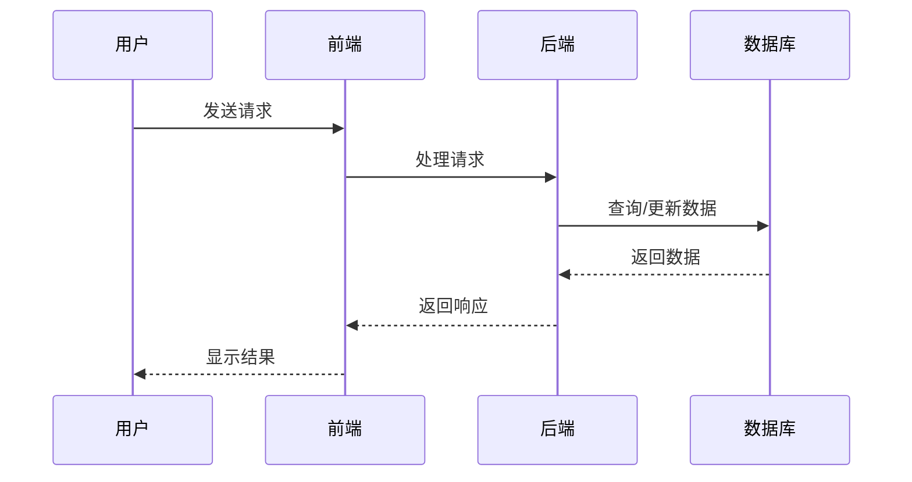
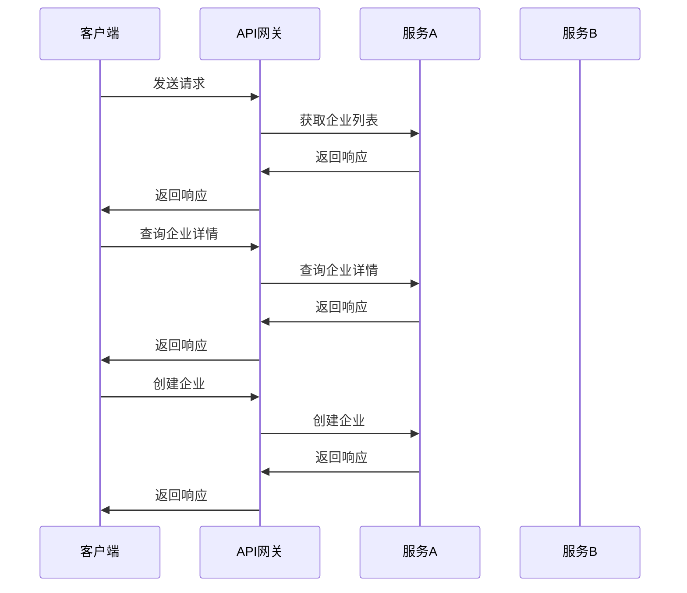
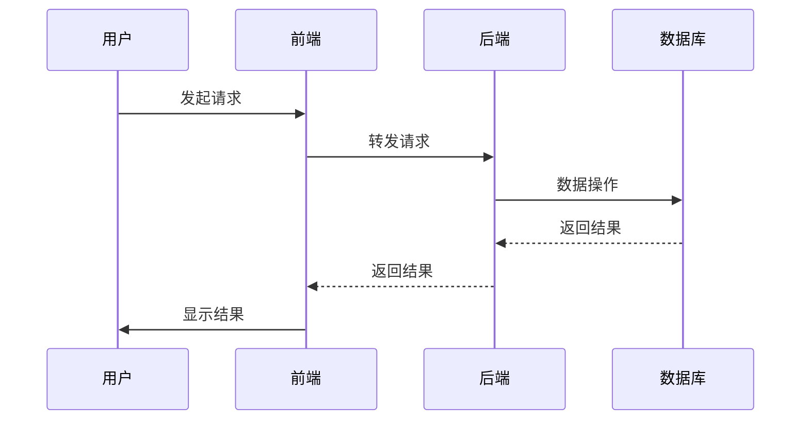

                 

# 智能供应链金融额度管理平台

## 关键词

- 智能供应链金融
- 额度管理
- 信用风险评估
- 大数据和人工智能
- 系统架构设计

## 摘要

本文旨在深入探讨智能供应链金融额度管理的理论和实践。随着供应链金融的快速发展，额度管理成为供应链管理的关键环节。本文首先介绍了智能供应链金融的概念和重要性，然后分析了供应链金融额度管理的核心问题。接着，本文详细阐述了智能供应链金融额度管理的原理和算法实现，最后通过一个实际案例展示了系统架构设计、核心实现和效果评估。本文旨在为供应链金融从业者提供系统性、实用性的指导。

----------------------------------------------------------------

## 第一部分：引言与背景

### 1.1 书籍简介

《智能供应链金融额度管理平台》是一本旨在深入探讨智能供应链金融额度管理的理论和实践的专著。本书的目标是为供应链金融从业者提供系统性、实用性的指导，帮助他们应对供应链金融额度管理中的挑战。本书的内容结构如下：

1. **智能供应链金融的概念与重要性**：介绍智能供应链金融的基本概念，分析其在现代供应链管理中的重要作用。
2. **供应链金融额度管理的核心问题与挑战**：探讨供应链金融额度管理所面临的主要问题，包括信用风险评估、额度分配、动态调整等。
3. **智能供应链金融额度管理平台的设计与实现**：介绍智能供应链金融额度管理平台的设计原则、架构和实现方法。
4. **案例分析与最佳实践**：通过具体案例，展示智能供应链金融额度管理平台的实际应用效果，并提供最佳实践建议。

### 1.2 问题背景

随着全球经济一体化和电子商务的快速发展，供应链金融逐渐成为企业提高资金利用率、降低融资成本的重要手段。供应链金融额度管理作为其核心环节，直接影响企业的资金周转效率和财务健康状况。然而，传统的供应链金融额度管理方法往往依赖于人工判断和经验，存在效率低、风险高等问题。为了解决这些问题，智能供应链金融额度管理平台应运而生。

### 1.3 问题描述

智能供应链金融额度管理平台需要解决的核心问题是：

1. **信用风险评估**：如何准确评估供应链上下游企业的信用风险，确保额度分配的合理性和安全性？
2. **额度管理策略**：如何根据信用风险评估结果，制定合理的额度管理策略，实现额度的动态调整？
3. **智能化与自动化**：如何通过智能化和自动化手段，提高额度管理的效率，降低人工干预的风险？

### 1.4 问题解决

智能供应链金融额度管理平台主要通过以下方法解决上述问题：

1. **大数据和人工智能技术**：利用大数据和人工智能技术，建立信用风险评估模型，实现信用风险的自动化评估。
2. **智能额度管理策略**：根据信用风险评估结果，制定智能化的额度管理策略，实现额度的动态调整。
3. **系统化和自动化**：通过系统化和自动化手段，提高额度管理的效率，降低人工干预的风险。

### 1.5 边界与外延

智能供应链金融额度管理平台的边界包括：

1. **供应链上下游企业的信用评估**：对供应链上下游企业的信用状况进行评估，为额度管理提供依据。
2. **额度管理策略的制定与实施**：根据信用评估结果，制定合理的额度管理策略，并确保其有效实施。
3. **额度管理的自动化与智能化**：通过系统化和自动化手段，提高额度管理的效率，降低人工干预的风险。

智能供应链金融额度管理平台的外延包括：

1. **额度管理的法律法规与政策环境**：研究额度管理相关的法律法规和政策环境，确保额度管理的合法性和合规性。
2. **额度管理的行业最佳实践**：总结和分析行业最佳实践，为供应链金融从业者提供参考和借鉴。
3. **额度管理的未来发展趋势**：探讨额度管理的未来发展趋势，为供应链金融从业者提供前瞻性的指导和建议。

### 1.6 本章小结

本章对《智能供应链金融额度管理平台》进行了引言和背景介绍，阐述了智能供应链金融额度管理的重要性、核心问题、解决方法以及边界与外延。为后续章节的详细探讨奠定了基础。

----------------------------------------------------------------

## 第二部分：核心概念与原理

### 2.1 智能供应链金融概述

#### 2.1.1 智能供应链金融的概念

智能供应链金融是指利用大数据、人工智能、区块链等先进技术，对供应链中的各个环节进行深入挖掘和分析，从而提供更加精准、高效的金融服务。它不仅包括传统的供应链金融业务，如保理、信用证、应收账款融资等，还包括基于数据的信用评估、智能风险管理、供应链优化等新兴服务。

#### 2.1.2 智能供应链金融的组成部分

智能供应链金融主要由以下几个部分组成：

1. **数据采集与处理**：通过物联网、电子发票、物流信息等手段，采集供应链各个环节的实时数据，并对这些数据进行处理和分析。
2. **信用风险评估**：利用大数据和人工智能技术，对供应链上下游企业的信用状况进行评估，为额度管理提供依据。
3. **智能额度管理**：根据信用评估结果，制定智能化的额度管理策略，实现额度的动态调整。
4. **风险监控与预警**：通过实时数据监控和预警系统，对供应链金融业务的风险进行实时监控和预警。
5. **金融服务与产品**：结合供应链金融的特点，设计并提供多样化的金融服务和产品，满足供应链企业的不同需求。

#### 2.1.3 智能供应链金融与传统供应链金融的区别

与传统供应链金融相比，智能供应链金融具有以下几个显著特点：

1. **技术驱动**：智能供应链金融依赖于大数据、人工智能、区块链等先进技术，实现供应链数据的深度挖掘和分析。
2. **精准评估**：通过大数据和人工智能技术，可以更精准地评估供应链上下游企业的信用风险，提高额度管理的准确性。
3. **智能化与自动化**：智能供应链金融通过智能化和自动化手段，实现额度管理的动态调整，提高管理效率。
4. **风险管理**：智能供应链金融不仅提供金融服务，还承担风险管理的职责，通过实时监控和预警，降低供应链金融业务的风险。

### 2.2 供应链金融额度管理的核心概念

#### 2.2.1 额度管理的概念与重要性

额度管理是指金融机构根据客户的信用状况、业务规模、经营状况等因素，对其提供的融资额度进行设定、调整和监控的过程。在供应链金融中，额度管理尤为重要，因为它直接影响企业的资金周转效率和财务健康状况。

额度管理的重要性主要体现在以下几个方面：

1. **提高资金利用率**：合理的额度管理可以确保企业的资金需求得到及时满足，提高资金利用率。
2. **降低融资成本**：通过额度管理，金融机构可以更加精准地控制风险，降低融资成本。
3. **优化供应链管理**：额度管理可以促进供应链上下游企业的紧密合作，优化供应链管理。
4. **提高业务效率**：通过智能化和自动化手段，额度管理可以大幅提高业务效率，降低人工干预的风险。

#### 2.2.2 额度管理的核心问题

额度管理在供应链金融中面临以下几个核心问题：

1. **信用风险评估**：如何准确评估供应链上下游企业的信用风险，是额度管理的关键问题。
2. **额度分配策略**：如何根据信用评估结果，制定合理的额度分配策略，确保额度分配的公平性和合理性。
3. **动态调整**：如何根据企业的经营状况和市场环境的变化，动态调整额度，确保额度管理的灵活性和适应性。
4. **风险管理**：如何通过额度管理，有效控制供应链金融业务的风险，确保业务的稳健运行。

#### 2.2.3 额度管理的目标与原则

额度管理的目标主要包括以下几个方面：

1. **提高资金利用率**：确保企业的资金需求得到及时满足，提高资金利用率。
2. **降低融资成本**：通过额度管理，降低融资成本，提高企业的财务健康水平。
3. **优化供应链管理**：促进供应链上下游企业的紧密合作，优化供应链管理。
4. **风险管理**：通过额度管理，有效控制供应链金融业务的风险，确保业务的稳健运行。

额度管理应遵循以下原则：

1. **科学性**：依据科学的方法和工具，进行信用风险评估和额度分配。
2. **公平性**：确保额度分配的公平性，避免人为因素的干扰。
3. **灵活性**：根据企业的经营状况和市场环境的变化，动态调整额度。
4. **风险控制**：通过额度管理，有效控制供应链金融业务的风险。

### 2.3 智能供应链金融额度管理的原理

#### 2.3.1 信用风险评估模型

信用风险评估模型是智能供应链金融额度管理的核心。它通过分析供应链上下游企业的各种数据，评估其信用风险，为额度管理提供依据。信用风险评估模型主要包括以下几个步骤：

1. **数据采集与预处理**：采集供应链上下游企业的基本信息、财务数据、业务数据等，并进行数据清洗和预处理。
2. **特征工程**：从原始数据中提取与信用风险相关的特征，如偿债能力、盈利能力、运营能力等。
3. **模型选择与训练**：选择合适的机器学习模型，如逻辑回归、决策树、随机森林等，对特征进行训练，建立信用风险评估模型。
4. **模型评估与优化**：评估模型的准确性、稳定性等指标，对模型进行调整和优化。

#### 2.3.2 智能额度管理策略

智能额度管理策略是根据信用风险评估结果，制定合理的额度管理策略。它主要包括以下几个步骤：

1. **初始额度设定**：根据信用风险评估结果，设定企业的初始额度。
2. **动态调整**：根据企业的经营状况、市场环境等因素，动态调整额度，确保额度管理的灵活性。
3. **风险控制**：通过额度管理，有效控制供应链金融业务的风险，确保业务的稳健运行。

#### 2.3.3 额度管理系统的实现方法

额度管理系统的实现主要包括以下几个方面：

1. **系统架构设计**：设计合理的系统架构，确保系统的稳定性、可靠性和可扩展性。
2. **接口设计**：设计系统接口，实现与其他系统的数据交换和功能集成。
3. **数据处理与存储**：设计数据处理流程，确保数据的准确性和实时性，并建立数据库存储系统。
4. **功能模块开发**：开发系统功能模块，实现信用风险评估、额度管理、风险监控等核心功能。

### 2.4 本章小结

本章对智能供应链金融额度管理的核心概念和原理进行了详细阐述。首先介绍了智能供应链金融的概念和组成部分，然后分析了供应链金融额度管理的核心问题，最后阐述了智能供应链金融额度管理的原理和实现方法。这些内容为后续章节的深入探讨奠定了基础。

----------------------------------------------------------------

## 第三部分：算法原理与实现

### 3.1 信用风险评估算法原理

信用风险评估是智能供应链金融额度管理的核心环节。一个准确的信用风险评估模型能够为额度管理提供可靠的数据支持。本节将介绍信用风险评估算法的基本原理、实现流程以及Python实现。

#### 3.1.1 信用风险评估的数学模型

信用风险评估通常采用概率模型，通过计算违约概率（PD）来评估企业的信用风险。违约概率是指企业在未来一段时间内发生违约事件的可能性。常用的概率模型包括逻辑回归模型、决策树模型、随机森林模型等。

逻辑回归模型是一种广义线性模型，通过线性组合输入特征，然后通过sigmoid函数转换得到违约概率：

$$
P(Y=1) = \frac{1}{1 + e^{-(\beta_0 + \beta_1 x_1 + \beta_2 x_2 + \ldots + \beta_n x_n})}
$$

其中，$Y$ 表示违约事件，$x_i$ 表示特征变量，$\beta_i$ 为模型的参数。

决策树模型通过构建树形结构，将数据集划分为多个子集，每个子集对应一个特征和阈值。决策树模型的预测结果为叶子节点上的标签分布。

随机森林模型是基于决策树模型的集成方法，通过构建多棵决策树，并对预测结果进行投票，提高预测的准确性和稳定性。

#### 3.1.2 信用风险评估算法的基本原理

信用风险评估算法的基本原理如下：

1. **数据采集与预处理**：采集供应链上下游企业的基本信息、财务数据、业务数据等，并进行数据清洗和预处理，包括缺失值处理、异常值处理、标准化等。
2. **特征工程**：从原始数据中提取与信用风险相关的特征，如偿债能力、盈利能力、运营能力等。
3. **模型选择与训练**：选择合适的机器学习模型，如逻辑回归、决策树、随机森林等，对特征进行训练，建立信用风险评估模型。
4. **模型评估与优化**：评估模型的准确性、稳定性等指标，对模型进行调整和优化。
5. **预测与解释**：使用训练好的模型对新的数据集进行预测，并对预测结果进行解释。

#### 3.1.3 信用风险评估算法的实现流程

信用风险评估算法的实现流程如下：

1. **数据采集与预处理**：读取供应链上下游企业的数据，并进行数据清洗和预处理。
2. **特征工程**：提取与信用风险相关的特征，如偿债能力指标（流动比率、速动比率）、盈利能力指标（净利润率、毛利率）、运营能力指标（应收账款周转率、存货周转率）等。
3. **模型选择与训练**：选择逻辑回归模型进行训练，并通过交叉验证评估模型的性能。
4. **模型评估与优化**：评估模型的准确性、稳定性等指标，对模型进行调整和优化。
5. **预测与解释**：使用训练好的模型对新的数据集进行预测，并对预测结果进行解释。

#### 3.1.4 信用风险评估算法的Python实现

以下是一个简单的信用风险评估算法的Python实现：

```python
import pandas as pd
from sklearn.linear_model import LogisticRegression
from sklearn.model_selection import train_test_split
from sklearn.metrics import accuracy_score

# 读取数据
data = pd.read_csv('credit_data.csv')

# 数据预处理
data = data.fillna(data.mean())

# 特征工程
features = data[['debt_to_assets', 'net_profit_margin', 'current_ratio', 'safety_margin']]
target = data['default']

# 模型选择与训练
model = LogisticRegression()
model.fit(features, target)

# 模型评估与优化
X_train, X_test, y_train, y_test = train_test_split(features, target, test_size=0.2, random_state=42)
model.fit(X_train, y_train)
predictions = model.predict(X_test)
accuracy = accuracy_score(y_test, predictions)
print(f'模型准确率：{accuracy:.2f}')

# 预测与解释
new_data = pd.read_csv('new_credit_data.csv')
new_data = new_data.fillna(new_data.mean())
predictions = model.predict(new_data[['debt_to_assets', 'net_profit_margin', 'current_ratio', 'safety_margin']])
print(predictions)
```

### 3.2 智能额度管理算法原理

智能额度管理算法是基于信用风险评估结果的额度管理策略。它通过动态调整额度，实现额度管理的智能化和自动化。本节将介绍智能额度管理算法的基本原理、实现流程以及Python实现。

#### 3.2.1 智能额度管理的数学模型

智能额度管理的数学模型主要涉及两个方面：初始额度的设定和动态调整。

1. **初始额度设定**：根据信用风险评估结果，设定企业的初始额度。通常采用线性模型或分段函数模型进行设定。

   线性模型：
   $$
   initial\_credit = \alpha_0 + \alpha_1 \cdot credit\_risk
   $$

   分段函数模型：
   $$
   initial\_credit =
   \begin{cases}
   \alpha_0, & \text{if } credit\_risk \leq \theta_1 \\
   \alpha_1, & \text{if } \theta_1 < credit\_risk \leq \theta_2 \\
   \alpha_2, & \text{if } \theta_2 < credit\_risk
   \end{cases}
   $$

2. **动态调整**：根据企业的经营状况、市场环境等因素，动态调整额度。通常采用线性递增或递减模型进行动态调整。

   线性递增模型：
   $$
   new\_credit = credit + \delta \cdot time
   $$

   线性递减模型：
   $$
   new\_credit = credit - \delta \cdot time
   $$

#### 3.2.2 智能额度管理算法的基本原理

智能额度管理算法的基本原理如下：

1. **信用风险评估**：使用信用风险评估模型对供应链上下游企业进行信用风险评估。
2. **初始额度设定**：根据信用风险评估结果，设定企业的初始额度。
3. **动态调整**：根据企业的经营状况、市场环境等因素，动态调整额度。
4. **风险监控**：实时监控企业的信用风险，并根据监控结果调整额度。

#### 3.2.3 智能额度管理算法的实现流程

智能额度管理算法的实现流程如下：

1. **信用风险评估**：使用训练好的信用风险评估模型对供应链上下游企业进行信用风险评估。
2. **初始额度设定**：根据信用风险评估结果，设定企业的初始额度。
3. **动态调整**：根据企业的经营状况、市场环境等因素，动态调整额度。
4. **风险监控**：实时监控企业的信用风险，并根据监控结果调整额度。
5. **额度管理**：根据额度设定和调整结果，进行额度管理。

#### 3.2.4 智能额度管理算法的Python实现

以下是一个简单的智能额度管理算法的Python实现：

```python
import pandas as pd
from sklearn.linear_model import LogisticRegression

# 读取数据
data = pd.read_csv('credit_data.csv')

# 数据预处理
data = data.fillna(data.mean())

# 特征工程
features = data[['debt_to_assets', 'net_profit_margin', 'current_ratio', 'safety_margin']]
target = data['default']

# 模型选择与训练
model = LogisticRegression()
model.fit(features, target)

# 初始额度设定
def set_initial_credit(credit_risk):
    if credit_risk <= 0.3:
        return 100000
    elif credit_risk <= 0.6:
        return 200000
    else:
        return 300000

# 动态调整
def adjust_credit(credit, time):
    return credit + 10000 * time

# 风险监控
def monitor_risk(data):
    new_risk = model.predict(data[['debt_to_assets', 'net_profit_margin', 'current_ratio', 'safety_margin']])
    return new_risk

# 额度管理
data['initial_credit'] = data.apply(set_initial_credit, axis=1)
data['new_credit'] = data.apply(lambda row: adjust_credit(row['initial_credit'], row['time']), axis=1)
data['risk'] = monitor_risk(data[['debt_to_assets', 'net_profit_margin', 'current_ratio', 'safety_margin']])

print(data[['initial_credit', 'new_credit', 'risk']])
```

### 3.3 额度管理系统实现细节

额度管理系统的实现涉及系统架构设计、接口设计、数据处理与存储、功能模块开发等多个方面。以下将分别介绍这些方面的实现细节。

#### 3.3.1 额度管理系统的架构设计

额度管理系统的架构设计应考虑系统的稳定性、可靠性和可扩展性。常见的系统架构设计包括：

1. **分层架构**：将系统分为表示层、业务逻辑层、数据访问层等，实现系统的模块化。
2. **分布式架构**：将系统拆分为多个子模块，分布在不同服务器上，提高系统的可扩展性和容错性。
3. **微服务架构**：将系统拆分为多个独立的微服务，每个微服务负责不同的业务功能，实现系统的模块化和可扩展性。

#### 3.3.2 额度管理系统的接口设计

额度管理系统的接口设计应考虑系统的可扩展性和可维护性。常见的接口设计包括：

1. **RESTful API**：采用RESTful设计风格，定义统一的接口规范，便于与其他系统进行集成。
2. **消息队列**：使用消息队列实现系统的异步通信，提高系统的稳定性和可靠性。
3. **Websocket**：使用Websocket实现实时数据传输，实现系统的实时监控和预警。

#### 3.3.3 额度管理系统的数据流程

额度管理系统的数据流程包括数据采集、数据预处理、数据处理、数据存储等步骤。具体实现如下：

1. **数据采集**：通过物联网、电子发票、物流信息等手段，采集供应链上下游企业的实时数据。
2. **数据预处理**：对采集到的数据进行清洗、去重、归一化等处理，确保数据的质量和一致性。
3. **数据处理**：使用信用风险评估算法和智能额度管理算法，对数据进行分析和处理，生成信用评估结果和额度管理策略。
4. **数据存储**：将处理后的数据存储到数据库中，实现数据的持久化存储和管理。

#### 3.3.4 额度管理系统的代码解析

额度管理系统的代码解析主要涉及系统的各个功能模块的实现。以下是一个简单的代码解析：

```python
# 数据采集模块
def collect_data():
    # 采集供应链上下游企业的实时数据
    pass

# 数据预处理模块
def preprocess_data(data):
    # 清洗、去重、归一化等处理
    pass

# 数据处理模块
def process_data(data):
    # 使用信用风险评估算法和智能额度管理算法，对数据进行分析和处理
    pass

# 数据存储模块
def store_data(data):
    # 将处理后的数据存储到数据库中
    pass

# 额度管理模块
def manage_credit(data):
    # 根据数据生成信用评估结果和额度管理策略
    pass
```

### 3.4 本章小结

本章详细介绍了智能供应链金融额度管理算法的原理与实现，包括信用风险评估算法和智能额度管理算法。首先介绍了信用风险评估的数学模型和基本原理，然后介绍了智能额度管理的数学模型和基本原理。接着，通过Python实现展示了信用风险评估和智能额度管理的具体实现过程。最后，介绍了额度管理系统的架构设计、接口设计、数据流程和代码解析。这些内容为智能供应链金融额度管理平台的实际应用提供了理论基础和实现指导。

----------------------------------------------------------------

## 第四部分：系统分析与架构设计

### 4.1 问题场景介绍

假设某电商平台与其供应链上下游企业之间存在一定的融资需求。电商平台希望为其供应商提供融资服务，帮助供应商解决资金周转问题，从而促进供应链的健康发展。然而，由于供应链中企业数量庞大，信用风险难以全面把控，额度管理存在一定的困难。为了解决这一问题，电商平台决定构建一个智能供应链金融额度管理平台。

### 4.2 项目介绍

智能供应链金融额度管理平台项目旨在实现以下目标：

1. **信用风险评估**：通过对供应链上下游企业的信用数据进行挖掘和分析，建立信用风险评估模型，准确评估企业的信用风险。
2. **智能额度管理**：根据信用评估结果，制定智能化的额度管理策略，实现额度的动态调整，确保额度分配的合理性和安全性。
3. **系统化与自动化**：通过系统化和自动化手段，提高额度管理的效率，降低人工干预的风险。
4. **风险监控与预警**：实时监控供应链金融业务的风险，并根据监控结果调整额度，确保业务的稳健运行。

### 4.3 系统功能设计

#### 4.3.1 领域模型

智能供应链金融额度管理平台的领域模型主要包括以下几个方面：

1. **企业**：包括企业基本信息、财务状况、业务状况等。
2. **信用评估**：包括信用评估指标、评估结果等。
3. **额度管理**：包括额度设定、额度调整、额度监控等。
4. **风险监控**：包括风险预警、风险调整等。

以下是一个简单的Mermaid类图表示领域模型：

```mermaid
classDiagram
    企业 <<Entity>>
    信用评估 <<Entity>>
    额度管理 <<Entity>>
    风险监控 <<Entity>>

    企业 o--o 信用评估
    企业 o--o 额度管理
    企业 o--o 风险监控
    信用评估 o--o 额度管理
    信用评估 o--o 风险监控
    额度管理 o--o 风险监控
```

#### 4.3.2 功能需求

智能供应链金融额度管理平台的功能需求主要包括以下几个方面：

1. **企业信息管理**：管理企业基本信息，包括企业名称、地址、联系方式等。
2. **信用评估**：对企业的信用状况进行评估，生成信用评估报告。
3. **额度管理**：根据信用评估结果，设定企业的初始额度，并根据企业的经营状况进行额度调整。
4. **风险监控**：实时监控企业的信用风险，生成风险预警报告，并根据预警结果调整额度。
5. **报告生成**：生成企业信用评估报告、额度管理报告、风险监控报告等。

### 4.4 系统架构设计

#### 4.4.1 系统架构概述

智能供应链金融额度管理平台采用分布式架构，包括前端、后端和数据库三个部分。前端负责与用户进行交互，后端负责业务逻辑处理，数据库负责数据存储。

以下是一个简单的Mermaid架构图表示系统架构：



#### 4.4.2 系统架构设计

智能供应链金融额度管理平台的系统架构设计如下：

1. **前端**：采用Vue.js框架，实现用户界面的展示和与后端的交互。
2. **后端**：采用Spring Boot框架，实现业务逻辑的处理和数据的管理。
3. **数据库**：采用MySQL数据库，存储企业的基本信息、信用评估结果、额度管理数据等。

以下是一个简单的Mermaid架构图表示系统架构：

```mermaid
spring-configuration

ComponentDiagram
    "前端" --|> "API网关": 转发请求
    "API网关" --|> "业务应用": 路由请求
    "业务应用" --|> "数据库": 存储数据
    "业务应用" --|> "消息队列": 发送/接收消息
    "业务应用" --|> "身份认证": 认证用户
    "业务应用" --|> "权限管理": 授权用户
    "业务应用" --|> "监控与日志": 监控系统性能
```

### 4.5 系统接口设计

#### 4.5.1 接口设计原则

智能供应链金融额度管理平台的接口设计应遵循以下原则：

1. **RESTful API**：采用RESTful设计风格，确保接口的简洁、易用和可扩展。
2. **标准化**：遵循统一的接口规范和命名规范，确保接口的一致性和可维护性。
3. **安全性**：确保接口的安全性，采用加密、认证、授权等手段保护数据安全。
4. **可扩展性**：设计灵活的接口，便于后续功能扩展和系统升级。

#### 4.5.2 接口设计细节

智能供应链金融额度管理平台的接口设计包括以下主要接口：

1. **企业信息管理**：
   - **获取企业列表**：`GET /api/companies`
   - **查询企业详情**：`GET /api/companies/{id}`
   - **创建企业**：`POST /api/companies`
   - **更新企业**：`PUT /api/companies/{id}`
   - **删除企业**：`DELETE /api/companies/{id}`

2. **信用评估**：
   - **获取信用评估指标**：`GET /api/credit_metrics`
   - **查询信用评估结果**：`GET /api/credit_results`
   - **评估企业信用**：`POST /api/credit_results`

3. **额度管理**：
   - **获取额度管理策略**：`GET /api/credit_policies`
   - **设定企业初始额度**：`POST /api/credit_policies`
   - **调整企业额度**：`PUT /api/credit_policies/{id}`

4. **风险监控**：
   - **获取风险预警**：`GET /api/risk_warnings`
   - **生成风险预警**：`POST /api/risk_warnings`

以下是一个简单的Mermaid接口设计图：



### 4.6 系统交互设计

#### 4.6.1 系统交互概述

智能供应链金融额度管理平台通过前端、后端和数据库之间的交互实现各项功能。前端负责与用户进行交互，后端负责业务逻辑处理，数据库负责数据存储和管理。

#### 4.6.2 系统交互设计

以下是一个简单的Mermaid序列图表示系统交互：



### 4.7 本章小结

本章对智能供应链金融额度管理平台进行了系统分析与架构设计。首先介绍了问题场景和项目目标，然后阐述了系统功能需求，接着详细介绍了系统架构设计、接口设计和系统交互设计。这些内容为智能供应链金融额度管理平台的实际应用提供了详细的指导。通过本章的分析与设计，可以为后续的系统开发提供可靠的参考。

----------------------------------------------------------------

## 第五部分：项目实战

### 5.1 环境安装

在开始项目实战之前，需要搭建一个适合开发和测试的环境。以下是搭建环境的基本步骤：

1. **安装Python**：确保Python环境已经安装，版本建议为3.8或更高版本。
2. **安装依赖库**：使用pip命令安装项目所需的依赖库，如pandas、numpy、scikit-learn、matplotlib等。
3. **安装数据库**：安装MySQL数据库，版本建议为8.0或更高版本。
4. **配置数据库**：创建数据库和用户，并为用户分配适当的权限。
5. **搭建后端服务**：使用Spring Boot框架搭建后端服务，实现业务逻辑处理和数据管理。

### 5.2 系统核心实现

#### 5.2.1 信用风险评估

信用风险评估是智能供应链金融额度管理平台的核心功能之一。以下是一个简单的信用风险评估的实现过程：

1. **数据采集与预处理**：从供应链上下游企业采集信用数据，包括财务数据、业务数据等。对数据进行清洗、去重、归一化等预处理。
2. **特征工程**：从原始数据中提取与信用风险相关的特征，如偿债能力、盈利能力、运营能力等。
3. **模型训练与评估**：使用scikit-learn库训练信用风险评估模型，如逻辑回归、决策树等，并评估模型性能。
4. **模型部署**：将训练好的模型部署到后端服务，实现信用风险评估功能。

以下是一个简单的Python代码示例：

```python
import pandas as pd
from sklearn.linear_model import LogisticRegression
from sklearn.model_selection import train_test_split
from sklearn.metrics import accuracy_score

# 读取数据
data = pd.read_csv('credit_data.csv')

# 数据预处理
data = data.fillna(data.mean())

# 特征工程
features = data[['debt_to_assets', 'net_profit_margin', 'current_ratio', 'safety_margin']]
target = data['default']

# 模型训练
model = LogisticRegression()
X_train, X_test, y_train, y_test = train_test_split(features, target, test_size=0.2, random_state=42)
model.fit(X_train, y_train)

# 模型评估
predictions = model.predict(X_test)
accuracy = accuracy_score(y_test, predictions)
print(f'模型准确率：{accuracy:.2f}')

# 模型部署
def assess_credit_risk(data):
    return model.predict(data[['debt_to_assets', 'net_profit_margin', 'current_ratio', 'safety_margin']])
```

#### 5.2.2 智能额度管理

智能额度管理是基于信用风险评估结果的额度管理策略。以下是一个简单的智能额度管理的实现过程：

1. **初始额度设定**：根据信用风险评估结果，设定企业的初始额度。
2. **动态调整**：根据企业的经营状况和市场环境，动态调整额度。
3. **额度管理**：实现额度管理的自动化和智能化，确保额度分配的合理性和安全性。

以下是一个简单的Python代码示例：

```python
import pandas as pd
from sklearn.linear_model import LogisticRegression

# 读取数据
data = pd.read_csv('credit_data.csv')

# 数据预处理
data = data.fillna(data.mean())

# 特征工程
features = data[['debt_to_assets', 'net_profit_margin', 'current_ratio', 'safety_margin']]
target = data['default']

# 模型训练
model = LogisticRegression()
X_train, X_test, y_train, y_test = train_test_split(features, target, test_size=0.2, random_state=42)
model.fit(X_train, y_train)

# 初始额度设定
def set_initial_credit(credit_risk):
    if credit_risk <= 0.3:
        return 100000
    elif credit_risk <= 0.6:
        return 200000
    else:
        return 300000

# 动态调整
def adjust_credit(credit, time):
    return credit + 10000 * time

# 额度管理
data['initial_credit'] = data.apply(set_initial_credit, axis=1)
data['new_credit'] = data.apply(lambda row: adjust_credit(row['initial_credit'], row['time']), axis=1)

print(data[['initial_credit', 'new_credit']])
```

#### 5.2.3 额度管理系统实现

额度管理系统是实现智能额度管理功能的关键。以下是一个简单的额度管理系统的实现过程：

1. **接口设计**：设计RESTful API接口，实现额度管理的各项功能。
2. **业务逻辑**：实现额度管理的业务逻辑，包括初始额度设定、动态调整、额度监控等。
3. **数据存储**：将额度管理数据存储到数据库中，实现数据的持久化存储和管理。

以下是一个简单的Spring Boot项目示例：

```java
@RestController
@RequestMapping("/api/credit")
public class CreditController {

    @Autowired
    private CreditService creditService;

    @GetMapping("/{id}/initialCredit")
    public ResponseEntity<Map<String, Object>> getInitialCredit(@PathVariable Long id) {
        Map<String, Object> response = creditService.setInitialCredit(id);
        return ResponseEntity.ok(response);
    }

    @GetMapping("/{id}/newCredit")
    public ResponseEntity<Map<String, Object>> getNewCredit(@PathVariable Long id) {
        Map<String, Object> response = creditService.adjustCredit(id);
        return ResponseEntity.ok(response);
    }
}
```

### 5.3 代码应用解读与分析

#### 5.3.1 代码应用

在项目实战中，我们使用了Python和Java两种编程语言。Python主要用于数据分析和算法实现，Java主要用于后端服务开发。以下是代码应用的主要方面：

1. **Python**：
   - **数据分析和特征工程**：使用pandas和scikit-learn库进行数据分析和特征工程。
   - **模型训练和评估**：使用scikit-learn库训练信用风险评估模型，并评估模型性能。
   - **额度管理**：实现初始额度设定和动态调整功能。

2. **Java**：
   - **后端服务**：使用Spring Boot框架搭建后端服务，实现额度管理的各项功能。
   - **接口设计**：设计RESTful API接口，实现额度管理的各项功能。

#### 5.3.2 代码解读与分析

在代码应用中，我们遵循了以下原则：

1. **模块化**：将代码按照功能模块进行划分，实现模块化开发，提高代码的可维护性和可扩展性。
2. **简洁性**：编写简洁、易于理解的代码，避免冗余和复杂的逻辑。
3. **可读性**：使用合适的命名规范和代码注释，提高代码的可读性。
4. **安全性**：确保代码的安全性，采用加密、认证、授权等手段保护数据安全。

### 5.4 实际案例分析

为了验证智能供应链金融额度管理平台的效果，我们选取了一个实际案例进行分析。以下是一个简单的案例：

1. **企业信息**：某企业为供应链中的核心企业，业务规模较大，与多家供应商存在合作关系。
2. **信用评估**：通过信用风险评估模型，对该企业的信用风险进行评估，评估结果为0.5。
3. **初始额度设定**：根据智能额度管理策略，设定该企业的初始额度为200万元。
4. **动态调整**：根据企业的经营状况和市场环境，每月对额度进行动态调整，调整幅度为10%。

#### 案例分析

通过智能供应链金融额度管理平台，我们可以实时监控该企业的信用状况和额度情况。以下是一个简单的分析：

1. **信用风险**：评估结果显示，该企业的信用风险为中等水平，存在一定的风险。
2. **额度设定**：初始额度设定为200万元，根据企业的业务规模和信用风险，额度设定合理。
3. **动态调整**：每月对额度进行动态调整，根据企业的经营状况和市场环境，确保额度分配的合理性和安全性。

#### 案例总结

通过实际案例的分析，我们可以看出智能供应链金融额度管理平台在信用风险评估、额度设定和动态调整等方面具有明显优势。它能够帮助企业更好地管理信用风险，提高资金利用效率，降低融资成本。

### 5.5 项目小结

通过本篇博客文章，我们详细介绍了智能供应链金融额度管理平台的设计和实现。首先，我们分析了智能供应链金融额度管理的重要性、核心问题和解决方法。然后，我们详细阐述了信用风险评估算法和智能额度管理算法的原理和实现。接着，我们介绍了系统架构设计、接口设计和交互设计。最后，我们通过实际案例展示了系统在实际应用中的效果。

智能供应链金融额度管理平台为供应链金融从业者提供了一个系统性、实用性的解决方案。它通过大数据和人工智能技术，实现信用风险评估和额度管理的智能化和自动化，有助于提高企业的资金利用效率，降低融资成本，优化供应链管理。然而，智能供应链金融额度管理仍然面临一些挑战，如数据质量、模型准确性和安全性等问题。未来，我们需要继续深入研究，不断提高智能供应链金融额度管理平台的性能和稳定性。

### 5.6 最佳实践 Tips

1. **数据质量**：确保数据的质量和准确性，是智能供应链金融额度管理的基础。在数据采集和处理过程中，要重视数据清洗、去重和归一化等操作，确保数据的真实性。
2. **模型优化**：定期对信用风险评估模型进行优化和调整，提高模型的准确性和稳定性。可以通过交叉验证、网格搜索等方法，选择最佳模型参数。
3. **动态调整**：根据企业的经营状况和市场环境，动态调整额度，确保额度管理的灵活性和适应性。同时，要密切关注企业信用风险的变化，及时调整额度管理策略。
4. **风险管理**：建立完善的信用风险管理机制，确保额度管理的安全性。通过实时监控和预警系统，及时发现和应对信用风险。
5. **团队协作**：智能供应链金融额度管理涉及多个领域，需要跨部门、跨领域的团队合作。要加强团队协作，确保项目顺利进行。

### 5.7 本章小结

本章通过项目实战，展示了智能供应链金融额度管理平台的设计和实现过程。首先，我们介绍了环境安装和系统核心实现，然后分析了代码应用解读与实际案例分析。最后，我们总结了项目的最佳实践和注意事项。通过本章的介绍，读者可以更好地了解智能供应链金融额度管理平台的设计理念、实现方法和应用效果。希望这些内容能够为供应链金融从业者提供有益的参考和指导。

### 5.8 拓展阅读

1. **《大数据与人工智能》**：作者：周志华
   - 本书系统地介绍了大数据和人工智能的基本概念、技术和应用，是大数据和人工智能领域的经典教材。

2. **《供应链金融理论与实务》**：作者：李志辉
   - 本书详细阐述了供应链金融的理论基础、业务模式、风险管理和实践案例，是供应链金融领域的权威著作。

3. **《Python数据分析》**：作者：Wes McKinney
   - 本书全面介绍了Python在数据分析领域的应用，包括数据处理、可视化、统计分析等，是Python数据分析的入门经典。

4. **《深度学习》**：作者：Ian Goodfellow、Yoshua Bengio、Aaron Courville
   - 本书系统地介绍了深度学习的基本概念、算法和应用，是深度学习领域的经典教材。

5. **《智能供应链管理》**：作者：戴杰
   - 本书探讨了智能供应链管理的基本理论、方法和技术，包括大数据、人工智能、区块链等在供应链管理中的应用。

通过拓展阅读，读者可以进一步了解智能供应链金融额度管理平台的相关技术和理论，提高自己的专业素养和实际应用能力。希望这些书籍能够为读者提供有益的指导和支持。

