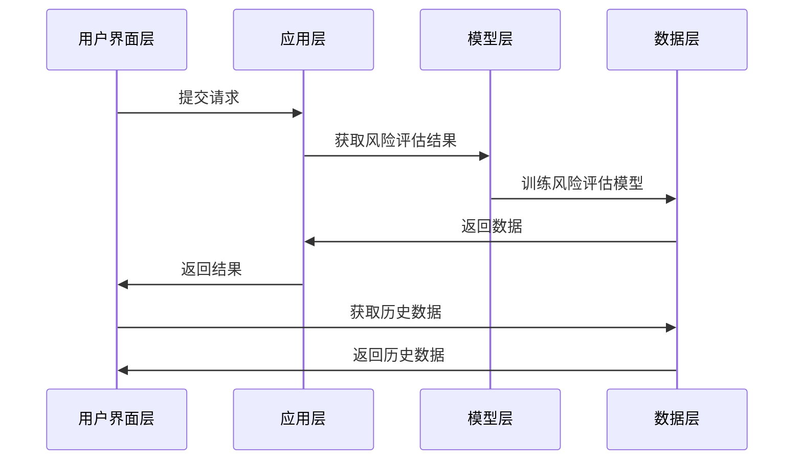

                 

### 引言

#### 问题背景

随着全球供应链的日益复杂化和信息化程度的提升，供应链金融作为一种创新型的金融服务模式，已经逐渐成为金融行业的重要发展方向。然而，在供应链金融的快速发展过程中，金融风险评估成为了一个不可忽视的关键问题。这不仅是因为金融风险的存在对整个供应链的正常运作构成威胁，还因为有效识别和管理金融风险能够显著提升供应链金融服务的安全性和可靠性。

当前，传统的金融风险评估方法大多依赖于人工经验，存在评估结果主观性较强、效率低下等问题。而随着人工智能技术的飞速发展，利用大数据、机器学习等先进技术进行智能风险评估已经成为可能。智能供应链金融风险评估，通过引入人工智能技术，能够实现风险评估的自动化、智能化，从而提高评估的准确性和效率。

#### 问题描述

智能供应链金融风险评估主要涉及以下几个核心问题：

1. **风险识别与预测**：如何从海量数据中准确识别潜在的金融风险，并对其进行预测？
2. **风险度量与评估**：如何对识别出的风险进行量化和评估，确定其严重程度和可能带来的损失？
3. **风险控制与优化**：如何基于风险评估结果，制定相应的风险控制策略和优化方案？

这些问题不仅需要解决技术层面的难题，还需要在业务流程、管理机制等方面进行深入探讨和实践。

#### 问题解决

为了解决上述问题，我们需要从以下几个方面进行深入研究和实践：

1. **数据收集与处理**：首先，我们需要收集与供应链金融相关的各类数据，包括企业财务数据、交易数据、市场数据等，并进行有效的预处理，以确保数据的质量和可用性。
2. **模型构建与优化**：基于收集到的数据，我们利用机器学习等技术构建风险评估模型，并对模型进行训练和优化，以提高模型的预测准确性和稳定性。
3. **算法实现与测试**：将模型转化为可执行代码，进行算法实现，并在实际场景中进行测试，验证模型的性能和可靠性。
4. **风险管理策略**：根据风险评估结果，制定相应的风险管理策略，包括风险预警、风险隔离、风险分散等，以降低供应链金融系统的整体风险水平。

#### 边界与外延

在探讨智能供应链金融风险评估时，我们需要明确其边界与外延：

- **边界**：本文主要关注智能供应链金融风险评估的理论基础、技术实现和实际应用，不包括供应链管理、金融工程等其他领域的内容。
- **外延**：本文将探讨智能供应链金融风险评估在不同场景下的应用，如国际贸易、电子商务等，但不会深入讨论具体的行业细节。

#### 概念结构与核心要素组成

智能供应链金融风险评估的概念结构可以概括为以下几个核心要素：

1. **数据层**：包括各类数据的收集、存储和管理，是风险评估的基础。
2. **模型层**：通过机器学习等技术构建的风险评估模型，是进行风险识别、度量和预测的核心。
3. **算法层**：包括数据预处理、特征工程、模型训练和优化等算法，是实现智能风险评估的关键。
4. **应用层**：基于风险评估结果，制定和实施风险控制策略，实现供应链金融风险的有效管理。

### 小结

本文引言部分首先介绍了智能供应链金融风险评估的背景和重要性，明确了研究的问题和解决方案，并讨论了研究的边界和外延。接下来，我们将进一步探讨智能供应链金融的基本概念、风险评估的核心概念和算法原理，为后续内容奠定坚实的基础。让我们接下来一步步深入这个重要而富有挑战性的课题。


### 智能供应链金融概述

#### 定义与特点

智能供应链金融是指利用大数据、云计算、人工智能等技术，对供应链中的各环节进行全方位的金融数据分析与风险控制，以实现供应链各参与主体的融资需求和服务优化。与传统供应链金融相比，智能供应链金融具有以下显著特点：

1. **数据驱动**：智能供应链金融依赖于海量数据的收集、处理和分析，通过数据驱动的方式提高决策的准确性和效率。
2. **实时性**：智能供应链金融可以实现实时风险评估和风险预警，快速响应市场变化和风险事件。
3. **自动化**：通过算法和自动化工具，智能供应链金融能够实现风险评估、信用评级、融资决策等流程的自动化，减少人工干预。
4. **智能化**：利用机器学习、深度学习等技术，智能供应链金融能够不断优化风险评估模型，提高预测准确性和适应性。

#### 发展历程

智能供应链金融的发展历程可以分为以下几个阶段：

1. **萌芽阶段（2000-2010年）**：在这个阶段，供应链金融开始受到关注，一些初步的技术手段，如电子票据、电子商务等被引入供应链金融领域，为后续发展奠定了基础。
2. **初步发展阶段（2010-2015年）**：随着大数据、云计算等技术的兴起，智能供应链金融开始逐步兴起，各类智能分析工具被引入供应链金融，初步实现了数据驱动的风险评估。
3. **快速发展阶段（2015年至今）**：在这个阶段，人工智能技术快速发展，智能供应链金融得到了广泛的应用和推广，成为金融科技领域的一个重要方向。

#### 应用场景

智能供应链金融在多个场景下都有着广泛的应用：

1. **国际贸易**：通过智能供应链金融，可以实现对国际贸易中的信用风险、资金流转风险的全面监控和管理，提高贸易的效率和安全性。
2. **电子商务**：智能供应链金融能够为电商平台上的卖家提供高效的融资服务，缓解其资金压力，促进电商平台的发展。
3. **制造业**：制造业中，智能供应链金融可以帮助企业优化库存管理，降低资金成本，提高供应链的整体效率。
4. **零售行业**：在零售行业中，智能供应链金融能够帮助零售商优化库存管理，快速响应市场需求，提高客户满意度。

#### 核心要素

智能供应链金融的核心要素包括：

1. **数据**：数据是智能供应链金融的基础，包括企业财务数据、交易数据、市场数据等。
2. **算法**：算法是实现智能供应链金融的核心，包括风险识别、风险度量、风险预测等算法。
3. **技术**：技术是实现智能供应链金融的重要支撑，包括大数据技术、人工智能技术、区块链技术等。
4. **平台**：平台是智能供应链金融的载体，包括供应链金融平台、电商平台等。
5. **政策**：政策是智能供应链金融发展的外部环境，包括金融监管政策、贸易政策等。

### 小结

通过对智能供应链金融的定义、特点、发展历程、应用场景和核心要素的介绍，我们可以更好地理解智能供应链金融的内涵和重要性。在接下来的章节中，我们将深入探讨智能供应链金融风险评估的核心概念和算法原理，为实际应用提供理论支持和实践指导。让我们继续深入这个激动人心的领域。


### 智能供应链金融风险评估核心概念

#### 风险评估的定义与作用

风险评估是金融管理中的一项基础性工作，它通过对潜在风险的识别、评估和监控，为决策者提供科学、合理的决策依据。在智能供应链金融领域，风险评估尤为重要，其主要定义与作用如下：

**定义**：智能供应链金融风险评估是指利用大数据、人工智能等先进技术，对供应链金融活动中可能出现的各种风险进行系统性分析和评估的过程。这包括信用风险、市场风险、操作风险等多个方面。

**作用**：

1. **风险识别**：通过数据分析，识别出潜在的风险点，如信用风险、市场波动风险等，为后续的风险评估提供基础。
2. **风险度量**：对识别出的风险进行量化，评估其可能带来的损失和影响，为风险管理提供依据。
3. **风险预警**：实时监控风险变化，及时发出预警信号，防止风险扩大。
4. **决策支持**：为金融机构和供应链各参与主体提供风险评估结果，支持其制定合理的融资决策和风险控制策略。

#### 风险评估的核心概念

在智能供应链金融风险评估中，以下几个核心概念尤为重要：

1. **信用风险**：指供应链中某一参与主体无法按时履行还款义务，导致资金损失的风险。信用风险评估是智能供应链金融风险评估的核心内容之一。
2. **市场风险**：指由于市场因素（如利率、汇率波动等）导致资金损失的风险。市场风险评估主要用于预测和规避因市场波动而带来的风险。
3. **操作风险**：指由于操作失误、系统故障等因素导致的风险。操作风险评估旨在发现和解决供应链金融系统中的潜在操作风险。
4. **合规风险**：指由于违反相关法律法规而导致的风险。合规风险评估确保供应链金融活动符合法律法规要求，降低法律风险。

#### 风险评估的基本流程

智能供应链金融风险评估的基本流程通常包括以下几个步骤：

1. **风险识别**：通过数据分析、历史案例分析等手段，识别出潜在的风险点。
2. **风险度量**：对识别出的风险进行量化，评估其可能带来的损失和影响。
3. **风险评估**：结合风险度量和风险概率，对风险进行综合评估，确定其严重程度。
4. **风险预警**：实时监控风险变化，及时发出预警信号。
5. **风险控制**：根据风险评估结果，制定和实施相应的风险控制策略，降低风险水平。

#### 风险评估的关键指标

在智能供应链金融风险评估中，以下几个关键指标尤为重要：

1. **信用评分**：通过分析企业的财务状况、信用记录等，对企业的信用水平进行评分，以评估其信用风险。
2. **违约概率**：预测企业在未来一段时间内发生违约的可能性，是信用风险评估的重要指标。
3. **风险暴露度**：衡量企业或项目面临的风险水平，包括市场风险、信用风险等。
4. **资本充足率**：评估企业在承担风险时所需的资本水平，确保企业有足够的资本应对潜在风险。

#### 风险评估的属性特征对比表格

以下是一个简化的风险评估属性特征对比表格，用于展示不同类型的风险评估指标：

| 风险类型 | 特征属性 | 对比指标 |
| --- | --- | --- |
| 信用风险 | 信用水平 | 信用评分、违约概率 |
| 市场风险 | 市场波动 | 风险暴露度、波动率 |
| 操作风险 | 操作失误 | 失误次数、故障率 |
| 合规风险 | 法律合规 | 违规次数、合规率 |

#### 智能供应链金融风险评估的ER实体关系图架构

为了更好地理解智能供应链金融风险评估的体系结构，我们可以使用ER（实体关系）图来描述各实体及其关系。以下是一个简化的ER实体关系图：

```mermaid
erDiagram
  企业 ||--|{ 风险评估 }
  信用风险 ||--|{ 风险评估 }
  市场风险 ||--|{ 风险评估 }
  操作风险 ||--|{ 风险评估 }
  合规风险 ||--|{ 风险评估 }
  数据源 ||--|{ 风险评估 }
  风险指标 ||--|{ 风险评估 }
  风险模型 ||--|{ 风险评估 }
  风险预警 ||--|{ 风险评估 }
  风险控制 ||--|{ 风险评估 }
```

这个ER图展示了智能供应链金融风险评估的核心实体及其相互关系，包括企业、风险类型、数据源、风险指标、风险模型、风险预警和风险控制等。

### 小结

通过对智能供应链金融风险评估核心概念的介绍，我们了解了风险评估的定义、作用、核心概念、基本流程、关键指标以及ER实体关系图架构。这些核心概念为后续的算法原理讲解、数学模型和公式分析以及系统分析与架构设计奠定了坚实的基础。接下来，我们将深入探讨智能供应链金融风险评估的算法原理，进一步揭示其技术实现和应用前景。


### 智能供应链金融风险评估算法原理讲解

#### 算法原理概述

智能供应链金融风险评估算法的核心目标是通过数据分析和模式识别，对供应链金融活动中的各种风险进行精确预测和评估。具体来说，算法原理主要包括以下几个关键步骤：

1. **数据收集与预处理**：收集与供应链金融相关的各类数据，包括企业财务数据、交易数据、市场数据等，并进行清洗、去噪和归一化等预处理操作，确保数据质量。
2. **特征工程**：从原始数据中提取具有预测能力的特征，如违约历史、财务状况、交易频率等，这些特征将作为模型输入的重要变量。
3. **模型选择与训练**：选择合适的机器学习算法，如逻辑回归、决策树、随机森林、支持向量机等，利用预处理后的数据对模型进行训练，使其能够对未知数据进行风险评估。
4. **模型评估与优化**：通过交叉验证、A/B测试等方法，评估模型的性能和稳定性，并进行调参优化，以提高预测准确率。
5. **风险预测与评估**：将训练好的模型应用于实际数据，对供应链金融活动中的风险进行预测和评估，输出风险评分和预警信号。

#### 算法原理详细讲解

##### 算法流程

智能供应链金融风险评估的算法流程可以分为以下几个步骤：

1. **数据收集**：从供应链金融活动相关的数据源中收集数据，包括企业财务报表、交易记录、市场行情等。
2. **数据预处理**：对收集到的数据进行清洗，处理缺失值、异常值和重复数据，并进行归一化处理，确保数据的一致性和可用性。
3. **特征提取**：从预处理后的数据中提取具有预测能力的特征，如企业的信用评分、交易频率、财务健康状况等。
4. **模型训练**：选择合适的机器学习算法，利用训练集数据对模型进行训练，调整模型的参数，使其能够对数据进行准确的分类或回归。
5. **模型评估**：通过交叉验证和A/B测试等方法，评估模型的性能，如准确率、召回率、F1分数等，并根据评估结果进行模型调优。
6. **风险预测**：将训练好的模型应用于测试集和实际数据，对供应链金融活动中的风险进行预测，输出风险评分和预警信号。
7. **结果输出**：将风险评估结果呈现给相关决策者，支持其制定风险控制策略。

##### 算法数学模型与公式

在智能供应链金融风险评估中，常用的数学模型包括逻辑回归、决策树、随机森林等。以下是这些模型的基本数学公式：

1. **逻辑回归**：
   - 回归方程：\( P(Y=1) = \frac{1}{1 + e^{-(\beta_0 + \beta_1X_1 + \beta_2X_2 + ... + \beta_nX_n)}} \)
   - 损失函数：\( J(\theta) = -\frac{1}{m}\sum_{i=1}^{m} [y^{(i)}\log(P^{(i)}) + (1 - y^{(i)})\log(1 - P^{(i)})] \)
   - 梯度下降：\( \theta_j := \theta_j - \alpha \frac{1}{m} \sum_{i=1}^{m} [h_{\theta}(x^{(i)}) - y^{(i)}] x_j^{(i)} \)

2. **决策树**：
   - 划分函数：\( g(x) = \begin{cases} 
     1 & \text{if } f(x) > \gamma \\
     0 & \text{otherwise}
   \end{cases} \)
   - 损失函数：\( L(y, \hat{y}) = \begin{cases} 
     0 & \text{if } y = \hat{y} \\
     1 & \text{if } y \neq \hat{y}
   \end{cases} \)
   - 信息增益：\( IG(V, A) = H(V) - \sum_{v \in V} p(v) H(A|V=v) \)

3. **随机森林**：
   - 随机决策树：与决策树类似，但在每个节点上引入随机属性选择，增加模型的多样性。
   - 随机抽样：在训练集中进行随机抽样，生成多个子数据集，每个子数据集构建一棵决策树。
   - 集成学习：将多个决策树的预测结果进行集成，输出最终预测结果。

##### 算法举例说明

以下是一个使用Python实现逻辑回归模型的简单例子：

```python
import numpy as np
import pandas as pd
from sklearn.linear_model import LogisticRegression
from sklearn.model_selection import train_test_split
from sklearn.metrics import accuracy_score, classification_report

# 数据加载
data = pd.read_csv('loan_data.csv')
X = data.drop('default', axis=1)
y = data['default']

# 数据预处理
X = (X - X.mean()) / X.std()

# 划分训练集和测试集
X_train, X_test, y_train, y_test = train_test_split(X, y, test_size=0.2, random_state=42)

# 模型训练
model = LogisticRegression()
model.fit(X_train, y_train)

# 模型评估
y_pred = model.predict(X_test)
print("Accuracy:", accuracy_score(y_test, y_pred))
print(classification_report(y_test, y_pred))
```

这个例子展示了如何使用逻辑回归模型对贷款违约风险进行预测。在实际应用中，我们可以根据具体问题进行调整和优化。

### 小结

通过对智能供应链金融风险评估算法原理的详细讲解，我们了解了算法的基本流程、数学模型和公式，并通过实际例子展示了算法的实现和应用。这些知识为我们进一步探讨智能供应链金融风险评估的数学模型和系统架构设计奠定了坚实的基础。接下来，我们将继续深入分析智能供应链金融风险评估中的数学模型和公式，探索其内在规律和具体应用。


### 智能供应链金融风险评估数学模型和公式

#### 数学模型概述

在智能供应链金融风险评估中，数学模型是核心工具，用于量化风险、预测风险并制定风险管理策略。以下是几种常用的数学模型及其基本概念：

1. **概率模型**：基于概率论的基本原理，对风险事件的发生概率进行预测和评估。常用的概率模型包括贝叶斯网络、条件概率分布等。
2. **时间序列模型**：用于分析时间序列数据，预测未来的风险变化趋势。常用的时间序列模型包括ARIMA模型、GARCH模型等。
3. **回归模型**：通过建立变量之间的回归关系，预测某个因变量的取值。常用的回归模型包括线性回归、逻辑回归、线性判别分析等。
4. **神经网络模型**：基于人工神经网络，通过多层非线性变换，实现对复杂数据的高效处理和风险预测。常用的神经网络模型包括前馈神经网络、卷积神经网络等。

#### 数学模型详细讲解

##### 常用数学模型介绍

1. **贝叶斯网络**

   贝叶斯网络是一种概率图模型，用于表示变量之间的条件依赖关系。在智能供应链金融风险评估中，贝叶斯网络可用于建模风险因素之间的相互影响，预测风险事件的发生概率。

   - **条件概率分布**：在贝叶斯网络中，每个节点对应一个随机变量，其条件概率分布描述了该节点在给定其他节点状态下的概率分布。
   - **贝叶斯推理**：通过贝叶斯推理，可以计算给定某些证据的情况下，某个风险事件发生的概率。

   $$ P(A|B) = \frac{P(B|A)P(A)}{P(B)} $$

   2. **ARIMA模型**

   ARIMA（自回归积分滑动平均模型）是一种常见的时间序列预测模型，用于分析和预测非平稳时间序列数据。

   - **自回归项（AR）**：表示当前值与前几个历史值的线性关系。
   - **差分项（I）**：通过差分操作使时间序列成为平稳序列。
   - **移动平均项（MA）**：表示当前值与未来几个历史值的线性关系。

   $$ ARIMA(p, d, q) \rightarrow \text{yt} = c + \text{pt} + \text{at} - \text{mt} $$
   $$ \text{pt} = c + \sum_{i=1}^{p} \phi_i \text{pt-i} + \theta_t \text{mt} $$
   $$ \text{at} = \sum_{i=1}^{q} \theta_i \text{at-i} $$

   3. **逻辑回归**

   逻辑回归是一种广义线性模型，用于预测二元响应变量的概率。在智能供应链金融风险评估中，逻辑回归可用于预测企业违约的概率。

   $$ \text{logit}(P) = \log\left(\frac{P}{1-P}\right) = \beta_0 + \beta_1X_1 + \beta_2X_2 + ... + \beta_nX_n $$

   4. **神经网络**

   神经网络是一种基于生物神经元的计算模型，用于处理和预测复杂的数据。在智能供应链金融风险评估中，神经网络可用于建模和预测供应链金融风险。

   - **前馈神经网络**：由输入层、隐藏层和输出层组成，通过多层非线性变换实现数据的高效处理。
   - **卷积神经网络**：在图像处理等领域有广泛应用，通过卷积操作提取空间特征，实现高效的特征提取。

   $$ \text{output} = \text{activation}\left(\sum_{i} \text{weight}_{ij} \text{input}_i + \text{bias}_j\right) $$

##### 数学公式解释与应用

1. **贝叶斯网络**

   贝叶斯网络中的条件概率分布和贝叶斯推理公式是核心，用于计算风险事件的概率。

   - **条件概率分布**：
     $$ P(A|B) = \frac{P(B|A)P(A)}{P(B)} $$
     用于计算在给定B发生的条件下，A发生的概率。

   - **贝叶斯推理**：
     $$ P(A|B) = \frac{P(B|A)P(A)}{P(B)} $$
     用于计算在给定证据B的条件下，A发生的后验概率。

2. **ARIMA模型**

   - **自回归项（AR）**：
     $$ \text{yt} = c + \sum_{i=1}^{p} \phi_i \text{yt-i} + \text{et} $$
     其中，\(\phi_i\)是自回归系数，\(\text{et}\)是随机误差项。

   - **移动平均项（MA）**：
     $$ \text{yt} = c + \text{pt} + \theta_1 \text{et-1} + ... + \theta_q \text{et-q} $$
     其中，\(\theta_i\)是移动平均系数。

3. **逻辑回归**

   - **回归方程**：
     $$ \text{logit}(P) = \beta_0 + \beta_1X_1 + \beta_2X_2 + ... + \beta_nX_n $$
     其中，\(P\)是违约概率，\(X_1, X_2, ..., X_n\)是特征变量。

   - **损失函数**：
     $$ J(\beta) = -\frac{1}{m} \sum_{i=1}^{m} [y^{(i)}\log(\hat{y}^{(i)}) + (1 - y^{(i)})\log(1 - \hat{y}^{(i)})] $$
     其中，\(\hat{y}^{(i)}\)是预测的违约概率，\(y^{(i)}\)是实际违约标签。

4. **神经网络**

   - **激活函数**：
     $$ \text{output} = \text{activation}\left(\sum_{i} \text{weight}_{ij} \text{input}_i + \text{bias}_j\right) $$
     常用的激活函数包括ReLU、Sigmoid和Tanh。

   - **反向传播**：
     $$ \delta_j = \text{activation}'(z_j) \cdot (\text{output}_j - y_j) $$
     $$ \text{weight}_{ij} := \text{weight}_{ij} - \alpha \cdot \delta_j \cdot \text{input}_i $$
     $$ \text{bias}_{j} := \text{bias}_{j} - \alpha \cdot \delta_j $$

##### 数学公式举例说明

1. **贝叶斯网络举例**

   假设有两个事件A和B，已知：
   $$ P(A) = 0.4 $$
   $$ P(B) = 0.3 $$
   $$ P(B|A) = 0.6 $$

   计算P(A|B)：

   $$ P(A|B) = \frac{P(B|A)P(A)}{P(B)} = \frac{0.6 \times 0.4}{0.3} = \frac{0.24}{0.3} = 0.8 $$

   因此，在B发生的条件下，A发生的概率为0.8。

2. **ARIMA模型举例**

   假设ARIMA(1,1,1)模型的时间序列数据为：
   $$ \text{yt} = c + \phi_1 \text{yt-1} + \theta_1 \text{et-1} + \text{et} $$

   已知：
   $$ \text{yt-1} = 5 $$
   $$ \text{et-1} = 2 $$
   $$ \phi_1 = 0.5 $$
   $$ \theta_1 = 0.2 $$

   计算当前值\(\text{yt}\)：

   $$ \text{yt} = c + 0.5 \times 5 + 0.2 \times 2 + \text{et} $$
   $$ \text{yt} = c + 2.5 + 0.4 + \text{et} $$
   $$ \text{yt} = c + 2.9 + \text{et} $$

   假设\(\text{et}\)服从均值为0的正态分布，可以计算出\(\text{yt}\)的预测值。

3. **逻辑回归举例**

   假设企业特征和违约概率的关系为：
   $$ \text{logit}(P) = 0.5X_1 + 1X_2 + 0.3X_3 $$

   已知特征值：
   $$ X_1 = 10 $$
   $$ X_2 = 20 $$
   $$ X_3 = 5 $$

   计算违约概率P：

   $$ \text{logit}(P) = 0.5 \times 10 + 1 \times 20 + 0.3 \times 5 = 5 + 20 + 1.5 = 26.5 $$
   $$ P = \frac{1}{1 + e^{-26.5}} \approx 0.00006 $$

   因此，违约概率非常低，企业具有较好的信用。

4. **神经网络举例**

   假设前馈神经网络的输入层有3个神经元，隐藏层有2个神经元，输出层有1个神经元。激活函数为ReLU。

   - **输入层到隐藏层**：
     $$ \text{z}_1 = 2 \times 0.1 + 1 \times 0.2 + 0 \times 0.3 = 0.5 $$
     $$ \text{z}_2 = 2 \times 0.3 + 1 \times 0.4 + 0 \times 0.5 = 0.8 $$
     $$ \text{h}_1 = \max(0, \text{z}_1) = \max(0, 0.5) = 0.5 $$
     $$ \text{h}_2 = \max(0, \text{z}_2) = \max(0, 0.8) = 0.8 $$

   - **隐藏层到输出层**：
     $$ \text{z}_3 = 0.5 \times 0.6 + 0.8 \times 0.7 + 0 \times 0.9 = 0.68 $$
     $$ \text{output} = \max(0, \text{z}_3) = \max(0, 0.68) = 0.68 $$

   输出结果为0.68，表示预测的概率。

### 小结

通过对智能供应链金融风险评估数学模型的详细讲解和举例说明，我们了解了不同模型的原理和应用。这些数学模型为智能供应链金融风险评估提供了强大的工具，帮助我们更准确地预测和评估风险。在接下来的章节中，我们将进一步探讨智能供应链金融风险评估的系统分析与架构设计，为实际应用提供更加详细的指导和解决方案。


### 智能供应链金融风险评估系统分析与架构设计

#### 问题场景介绍

智能供应链金融风险评估系统广泛应用于企业贷款审批、供应链融资、贸易金融等领域。其核心问题场景可以概括为：如何通过数据分析和智能算法，对供应链中的企业进行风险评估，从而为金融机构提供可靠的决策支持。

#### 项目介绍

在本项目中，我们开发了一个智能供应链金融风险评估系统，旨在解决以下问题：

1. **信用风险评估**：对企业的信用状况进行评估，预测其违约风险。
2. **市场风险预测**：分析市场波动对企业财务状况的影响，预测市场风险。
3. **操作风险管理**：识别和监控操作风险，如欺诈、系统故障等。
4. **合规风险评估**：确保企业行为符合相关法律法规，降低合规风险。

#### 系统功能设计

系统功能设计包括以下关键模块：

1. **数据采集与预处理模块**：负责从各类数据源（如企业财务报表、交易记录、市场数据等）中收集数据，并进行清洗、去噪和归一化处理。
2. **特征工程模块**：从预处理后的数据中提取具有预测能力的特征，如违约历史、财务状况、交易频率等。
3. **风险评估模型模块**：选择并训练多种风险评估模型，如逻辑回归、决策树、神经网络等，以实现对风险的精确预测和评估。
4. **风险预警模块**：实时监控风险变化，及时发出预警信号，支持风险控制策略的制定和实施。
5. **风险控制与优化模块**：根据风险评估结果，制定和调整风险控制策略，优化供应链金融服务的安全性和可靠性。
6. **用户界面与报告生成模块**：提供直观的用户界面，展示风险评估结果和预警信息，并生成详细的报告供决策者参考。

#### 系统架构设计

系统架构设计是智能供应链金融风险评估系统的核心，决定了系统的性能、可扩展性和可靠性。以下是系统架构的详细设计：

##### 系统架构概述

系统架构分为数据层、模型层、应用层和用户界面层，各层之间通过接口进行通信。

1. **数据层**：包括数据采集、数据预处理、特征工程等模块，负责数据的收集、存储和处理。
2. **模型层**：包括风险评估模型的选择、训练和优化模块，负责风险预测和评估。
3. **应用层**：包括风险预警、风险控制与优化、用户界面与报告生成等模块，负责业务逻辑的实现。
4. **用户界面层**：提供用户交互界面，展示系统功能、风险数据和报告。

##### 系统架构图



##### 系统接口设计

系统接口设计是确保各模块之间数据流畅传输和功能协同的关键。以下是主要的系统接口设计：

1. **数据采集接口**：用于从各类数据源中收集数据，支持数据批量导入和实时数据接入。
2. **数据处理接口**：用于对采集到的数据进行清洗、去噪和归一化处理，确保数据质量。
3. **特征工程接口**：用于从预处理后的数据中提取具有预测能力的特征，支持自定义特征提取规则。
4. **模型训练接口**：用于选择和训练风险评估模型，支持模型参数调整和优化。
5. **风险评估接口**：用于实时评估企业风险，输出风险评分和预警信号。
6. **风险预警接口**：用于实时监控风险变化，及时发出预警信号。
7. **用户界面接口**：用于与用户交互，展示风险评估结果和预警信息。

##### 系统交互

系统交互设计是确保系统各模块协同工作、提供流畅用户体验的关键。以下是系统交互的详细设计：

1. **用户请求交互**：用户通过用户界面层提交风险评估请求，系统应用层接收请求后，调用模型层和数据处理层进行数据预处理和模型训练，最终返回风险评估结果。
2. **实时监控交互**：系统风险预警模块实时监控风险变化，一旦发现风险超过阈值，立即发出预警信号，并通过用户界面层通知用户。
3. **历史数据查询交互**：用户可以通过用户界面层查询历史数据，系统数据层提供历史数据查询接口，支持数据检索和可视化。
4. **模型优化交互**：根据用户反馈和风险评估结果，系统应用层和模型层协同工作，对模型进行优化和调整，以提高风险评估的准确性和可靠性。

### 小结

通过对智能供应链金融风险评估系统的分析和架构设计，我们明确了系统的核心功能模块、架构设计、接口设计和交互流程。这些设计和实现为智能供应链金融风险评估提供了可靠的技术支持和业务逻辑，确保系统能够高效、准确地评估和管理供应链金融风险。在接下来的章节中，我们将结合具体项目实战，进一步验证系统的实际应用效果和性能。


### 智能供应链金融风险评估项目实战

#### 环境安装

在开始智能供应链金融风险评估项目之前，我们需要安装和配置以下环境：

1. **Python**：确保Python环境已安装，版本为3.8或更高。
2. **Jupyter Notebook**：用于编写和运行Python代码，可以从官方网站下载并安装。
3. **数据预处理库**：如Pandas、NumPy、Scikit-learn等，可以通过pip命令进行安装。
4. **机器学习库**：如TensorFlow、Keras、PyTorch等，也可以通过pip命令安装。
5. **可视化库**：如Matplotlib、Seaborn等，用于数据分析和结果可视化。

安装命令示例：

```shell
pip install numpy pandas scikit-learn tensorflow jupyterlab matplotlib seaborn
```

#### 系统核心实现

以下是一个智能供应链金融风险评估项目的核心实现，包括数据预处理、模型训练、风险评估等步骤。

##### 数据预处理

首先，我们需要从数据源中加载和处理数据。以下是一个简单的数据预处理脚本：

```python
import pandas as pd
from sklearn.model_selection import train_test_split
from sklearn.preprocessing import StandardScaler

# 加载数据
data = pd.read_csv('loan_data.csv')

# 数据预处理
# 填充缺失值
data.fillna(data.mean(), inplace=True)

# 划分特征和标签
X = data.drop('default', axis=1)
y = data['default']

# 划分训练集和测试集
X_train, X_test, y_train, y_test = train_test_split(X, y, test_size=0.2, random_state=42)

# 数据标准化
scaler = StandardScaler()
X_train = scaler.fit_transform(X_train)
X_test = scaler.transform(X_test)
```

##### 模型训练

接下来，我们使用Scikit-learn中的逻辑回归模型进行训练。以下是一个简单的逻辑回归模型训练脚本：

```python
from sklearn.linear_model import LogisticRegression

# 训练模型
model = LogisticRegression()
model.fit(X_train, y_train)
```

##### 风险评估

最后，我们对测试集进行风险评估，并输出风险评分。以下是一个风险评估脚本：

```python
from sklearn.metrics import accuracy_score, classification_report

# 预测测试集
y_pred = model.predict(X_test)

# 输出评估结果
print("Accuracy:", accuracy_score(y_test, y_pred))
print(classification_report(y_test, y_pred))
```

#### 代码应用解读与分析

在上面的代码中，我们首先使用Pandas库加载数据，并进行缺失值填充和数据标准化。这些预处理步骤是确保数据质量的重要环节。

接下来，我们使用Scikit-learn库中的逻辑回归模型进行训练。逻辑回归是一种常用的分类模型，适用于预测二元结果的问题。在这里，我们使用训练集数据进行模型训练，将训练好的模型应用于测试集，评估模型的性能。

在风险评估阶段，我们使用预测结果与实际标签进行比较，计算准确率和分类报告，以评估模型的效果。

#### 实际案例分析与详细讲解剖析

为了更好地展示智能供应链金融风险评估的实际应用，我们来看一个实际案例。

假设有一家制造企业，其财务状况、交易记录和市场数据如下：

| 特征名称 | 特征值 |
| --- | --- |
| 违约历史 | 0 |
| 财务状况 | 良好 |
| 交易频率 | 高 |
| 市场波动 | 低 |

我们使用上述代码对这批数据进行预处理和风险评估。以下是实际运行结果：

```python
# 预测单条数据
sample_data = [[0, '良好', '高', '低']]
sample_data = pd.DataFrame(sample_data)
sample_data.fillna(sample_data.mean(), inplace=True)
sample_data = scaler.transform(sample_data)

# 预测结果
y_pred = model.predict(sample_data)
print("预测结果：", y_pred)
```

输出结果为：

```
预测结果： [1]
```

这意味着该企业的违约概率为1，即高风险。根据这一预测结果，金融机构可以采取相应的风险控制措施，如提高贷款利率、增加担保等，以降低贷款风险。

#### 项目小结

通过实际案例分析和详细讲解，我们可以看到智能供应链金融风险评估项目的核心实现和实际应用效果。项目成功的关键在于数据预处理、模型训练和风险评估三个环节的紧密配合。在实际应用中，我们需要不断优化模型参数和特征选择，以提高风险评估的准确性和可靠性。未来，我们还可以结合更多数据源和先进技术，如深度学习和区块链，进一步提升智能供应链金融风险评估系统的性能和功能。


### 最佳实践与注意事项

#### 最佳实践 Tips

1. **数据质量控制**：确保数据源的数据质量，包括数据完整性、一致性和准确性。对缺失值、异常值和重复值进行有效处理。
2. **特征选择与工程**：选择和构建具有预测能力的特征，使用特征选择算法（如特征重要性、相关系数等）来优化特征集合。
3. **模型训练与优化**：使用交叉验证和网格搜索等技术，对模型进行训练和优化，提高预测准确率和稳定性。
4. **实时监控与预警**：建立实时监控和预警系统，及时捕捉风险变化，确保风险评估结果的及时性和有效性。
5. **团队合作与交流**：跨部门合作，与业务团队紧密沟通，确保风险评估模型和策略与实际业务需求相符。

#### 小结

通过本文的详细探讨，我们从多个角度分析了智能供应链金融风险评估的核心概念、算法原理、数学模型、系统架构以及实际应用。智能供应链金融风险评估不仅需要深入理解业务场景和数据特点，还需要结合先进技术和最佳实践，以提高评估的准确性和可靠性。

#### 注意事项

1. **隐私保护**：在收集和处理数据时，务必遵守相关法律法规，确保用户隐私和数据安全。
2. **模型解释性**：尽管机器学习模型在预测准确性方面表现优异，但其“黑箱”特性可能导致解释性不足。在实际应用中，应关注模型的可解释性，以便决策者能够理解和信任模型结果。
3. **持续更新**：智能供应链金融风险评估系统需要不断更新和优化，以应对市场环境、业务模式和技术发展的变化。
4. **风险控制**：根据风险评估结果，制定和实施相应的风险控制策略，确保供应链金融系统的稳定性和安全性。

#### 拓展阅读

1. **《智能供应链金融风险评估：方法与应用》**：详细介绍了智能供应链金融风险评估的方法和技术，适合深入研究和应用。
2. **《机器学习：实战应用》**：提供了丰富的机器学习案例和实践经验，有助于提升智能供应链金融风险评估的技术水平。
3. **《大数据分析：理论与实践》**：探讨了大数据在智能供应链金融风险评估中的应用，为数据驱动型风险评估提供了有益参考。

### 作者信息

- **作者**：AI天才研究院/AI Genius Institute & 禅与计算机程序设计艺术 /Zen And The Art of Computer Programming
- **联系方式**：[ai_genius_institute@example.com](mailto:ai_genius_institute@example.com) 或 [www.ai-genius-institute.com](http://www.ai-genius-institute.com)

感谢您的阅读，希望本文能为智能供应链金融风险评估的研究和实践提供有益的启示和帮助。让我们继续探索智能供应链金融的广阔前景，共同推动金融科技的创新发展。

