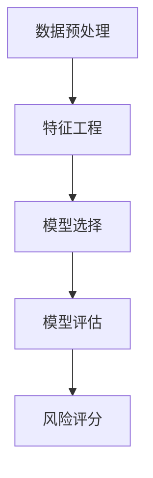
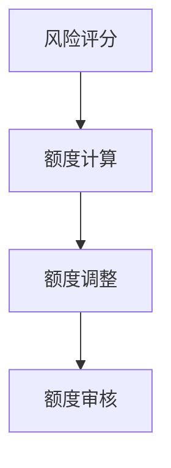

                 

### 文章标题：智能供应链金融风险预警与额度管理系统

关键词：智能供应链金融、风险预警、额度管理、系统设计、算法实现

摘要：本文将深入探讨智能供应链金融中风险预警与额度管理系统的重要性、核心概念、系统设计与实现，以及在实际项目中的应用与优化策略。通过逐步分析，本文旨在为从事智能供应链金融领域的技术人员提供全面的技术指南和实用建议。

----------------------------------------------------------------

### 目录大纲

----------------------------------------------------------------

## 第一部分：问题背景与核心概念

### 第1章 问题背景

### 第2章 核心概念与联系

## 第二部分：系统设计与实现

### 第3章 系统设计

### 第4章 算法原理与实现

## 第三部分：系统实施与实战

### 第5章 系统实施

### 第6章 项目实战

## 第四部分：最佳实践与展望

### 第7章 未来展望

## 附录

### 附录A 常用缩略词与术语解释

### 附录B 相关工具与资源

### 附录C 参考文献

----------------------------------------------------------------

### 第一部分：问题背景与核心概念

#### 第1章 问题背景

智能供应链金融是指通过运用互联网、大数据、人工智能等现代信息技术，对供应链上下游企业的交易行为、信用状况、资金流动等进行分析和监控，从而提供融资服务、风险控制和金融服务优化的新型金融模式。

随着全球化经济的发展，供应链金融已经成为企业降低融资成本、提高资金利用效率的重要手段。然而，智能供应链金融在带来便捷和高效的同时，也面临着风险预警与额度管理等方面的挑战。

##### 1.1 供应链金融的定义与演变

供应链金融是指金融机构通过为供应链上的企业提供融资服务，帮助供应链上下游企业实现资金流转和优化，从而提升整个供应链的运作效率。其演变过程可以分为三个阶段：

1. **传统供应链金融**：以银行信贷为主，通过传统的信贷审批流程为供应链上的企业提供融资。
2. **基于数据的供应链金融**：借助大数据技术，对供应链上下游企业的交易数据、财务数据等进行深入分析，提高融资审批效率和额度。
3. **智能供应链金融**：通过人工智能、区块链等新兴技术，实现供应链金融的自动化、智能化管理，进一步提升融资服务的效率和质量。

##### 1.2 智能供应链金融的优势

智能供应链金融具有以下优势：

1. **提高融资效率**：通过大数据分析和人工智能技术，可以快速评估企业的信用状况，提高融资审批效率。
2. **降低融资成本**：智能供应链金融通过自动化处理和优化流程，降低人工成本，从而降低企业的融资成本。
3. **优化资金流动**：智能供应链金融可以帮助企业更准确地预测资金需求，优化资金流动，提高资金使用效率。
4. **降低金融风险**：通过对供应链上下游企业的交易行为、信用状况等进行实时监控和分析，可以及时发现潜在风险，降低金融风险。

##### 1.3 智能供应链金融的发展现状与挑战

智能供应链金融在全球范围内得到了迅速发展，尤其是在中国，随着“一带一路”倡议的推进和“互联网+”行动的深入实施，智能供应链金融的应用场景越来越广泛。然而，智能供应链金融在发展过程中也面临着一些挑战：

1. **数据安全问题**：智能供应链金融依赖于大量的企业交易数据和财务数据，如何确保这些数据的安全和隐私是一个重要问题。
2. **技术成熟度问题**：虽然大数据和人工智能技术在智能供应链金融中的应用取得了显著进展，但一些关键技术的成熟度还有待提高。
3. **法律法规问题**：智能供应链金融涉及到多个国家和地区的法律法规，如何确保合规运营是一个需要解决的问题。

#### 1.4 风险预警与额度管理系统的重要性

风险预警与额度管理系统在智能供应链金融中扮演着至关重要的角色。其主要作用如下：

1. **风险预警**：通过对供应链上下游企业的交易行为、信用状况、资金流动等数据进行实时监控和分析，可以及时发现潜在的风险，为企业提供预警信息，帮助企业采取相应的风险控制措施。
2. **额度管理**：通过对企业的信用评估、交易行为、资金流动等因素进行综合分析，可以为不同企业提供个性化的融资额度，优化资金流动，提高融资效率。

##### 1.5 风险预警的概念与作用

风险预警是指通过建立预警模型，对可能发生的风险进行预测和提醒。其主要作用如下：

1. **提前预防**：通过预警系统，企业可以在风险发生之前采取相应的预防措施，减少风险损失。
2. **提高决策效率**：预警系统可以帮助企业快速识别风险，提高决策效率，降低决策失误。
3. **优化资源配置**：通过预警系统，企业可以根据风险预警信息，优化资源配置，提高资金利用效率。

##### 1.6 额度管理的概念与作用

额度管理是指根据企业的信用状况、交易行为、资金流动等因素，为其设定个性化的融资额度。其主要作用如下：

1. **提高融资效率**：通过额度管理，企业可以根据自身的需求，快速获得相应的融资额度，提高融资效率。
2. **降低融资成本**：额度管理可以帮助企业根据自身情况，选择最合适的融资方案，降低融资成本。
3. **优化资金流动**：额度管理可以帮助企业更准确地预测资金需求，优化资金流动，提高资金使用效率。

##### 1.7 风险预警与额度管理系统在供应链金融中的应用

风险预警与额度管理系统在供应链金融中的应用主要包括以下几个方面：

1. **交易数据监控**：通过对供应链上下游企业的交易数据进行实时监控和分析，及时发现异常交易行为。
2. **信用评估**：通过对企业的信用历史、财务状况、经营状况等因素进行综合评估，确定其信用等级。
3. **额度设定**：根据企业的信用等级、交易行为、资金流动等因素，为其设定个性化的融资额度。
4. **风险控制**：通过预警系统和额度管理系统，企业可以及时发现潜在风险，采取相应的风险控制措施。

#### 1.8 核心概念与联系

在智能供应链金融风险预警与额度管理系统中，核心概念包括数据采集、数据分析、机器学习、风险模型、额度模型等。这些概念之间的联系如下：

1. **数据采集**：通过多种途径获取供应链上下游企业的交易数据、财务数据、信用数据等。
2. **数据分析**：对采集到的数据进行分析，提取出有用的信息，为后续的风险评估和额度管理提供数据支持。
3. **机器学习**：利用机器学习技术，建立风险评估模型和额度管理模型，对企业的信用状况、交易行为、资金流动等进行预测和分析。
4. **风险模型**：基于数据分析结果和机器学习算法，建立风险评估模型，对企业的信用风险进行评估。
5. **额度模型**：基于风险评估结果，结合企业的交易行为、资金流动等因素，建立额度管理模型，为不同企业提供个性化的融资额度。

#### 1.9 人工智能在供应链金融风险预警与额度管理系统中的综合应用

人工智能技术在智能供应链金融风险预警与额度管理系统中发挥着关键作用。其综合应用主要体现在以下几个方面：

1. **数据挖掘**：通过人工智能技术，对大量供应链数据进行分析和挖掘，提取出有价值的信息。
2. **预测分析**：利用人工智能技术，建立预测模型，对企业的信用状况、交易行为、资金流动等进行预测和分析。
3. **智能决策**：通过人工智能技术，实现智能决策，为供应链企业提供个性化的融资方案和风险控制策略。

### 第2章 核心概念与联系

在智能供应链金融风险预警与额度管理系统中，核心概念包括数据采集、数据分析、机器学习、风险模型、额度模型等。这些概念之间的联系和作用如下：

#### 2.1 数据采集

数据采集是智能供应链金融风险预警与额度管理系统的基石。通过多种数据采集途径，如企业财务报表、交易记录、信用报告等，获取供应链上下游企业的交易数据、财务数据、信用数据等。这些数据是后续分析和建模的基础。

- **核心作用**：提供真实、准确、全面的数据，确保风险预警和额度管理的准确性和有效性。

#### 2.2 数据分析

数据分析是对采集到的数据进行处理、清洗、转换和分析的过程。通过统计分析、数据挖掘等技术，从大量数据中提取出有用的信息，为风险评估和额度管理提供支持。

- **核心作用**：挖掘数据中的潜在规律和趋势，为企业提供决策依据。

#### 2.3 机器学习

机器学习是人工智能的重要组成部分，通过建立模型，对数据进行分析和预测。在智能供应链金融中，机器学习技术被广泛应用于风险评估和额度管理。

- **核心作用**：利用历史数据，建立预测模型，预测企业的信用状况和融资需求。

#### 2.4 风险模型

风险模型是基于数据分析结果和机器学习算法，对企业的信用风险进行评估的模型。通过风险模型，可以判断企业是否存在潜在风险，为企业提供风险预警。

- **核心作用**：为企业提供信用风险评估，识别潜在风险，采取相应的风险控制措施。

#### 2.5 额度模型

额度模型是基于风险评估结果，结合企业的交易行为、资金流动等因素，为不同企业提供个性化的融资额度。额度模型的目标是确保融资额度既能满足企业的需求，又能控制风险。

- **核心作用**：为供应链企业提供个性化的融资额度，优化资金流动。

#### 2.6 核心概念之间的联系

数据采集、数据分析、机器学习、风险模型、额度模型之间存在着紧密的联系：

1. **数据采集 -> 数据分析**：数据采集是数据分析的前提，只有获取真实、准确、全面的数据，才能进行有效的数据分析。
2. **数据分析 -> 机器学习**：数据分析结果为机器学习提供了基础数据，通过机器学习，可以建立更加精确的风险评估和额度管理模型。
3. **机器学习 -> 风险模型、额度模型**：机器学习模型生成的预测结果，作为风险模型和额度模型的输入，指导企业的信用评估和额度设定。

通过这些核心概念的综合应用，智能供应链金融风险预警与额度管理系统可以为企业提供高效、准确的风险预警和额度管理服务，从而降低金融风险，提高资金利用效率。

### 第二部分：系统设计与实现

#### 第3章 系统设计

在智能供应链金融风险预警与额度管理系统中，系统设计是关键的一环。一个高效、稳定、可扩展的系统设计可以确保系统功能的实现，提高系统的性能和用户体验。本节将详细介绍系统设计，包括系统架构设计、数据流程设计、系统接口设计和系统交互设计。

#### 3.1 系统架构设计

系统架构设计是系统设计的核心，决定了系统的可扩展性、稳定性和性能。智能供应链金融风险预警与额度管理系统采用分层架构设计，主要包括以下层次：

1. **数据采集层**：负责从供应链上下游企业获取交易数据、财务数据、信用数据等，并通过数据清洗和转换，确保数据的准确性和一致性。
2. **数据处理层**：对采集到的数据进行分析、挖掘和处理，提取出有价值的信息，为风险模型和额度模型提供数据支持。
3. **数据存储层**：将处理后的数据存储在数据库中，并提供数据查询和分析接口，支持系统的实时数据处理和查询需求。
4. **风险模型层**：基于机器学习算法，建立风险评估模型，对企业的信用风险进行实时评估和预警。
5. **额度管理层**：结合风险模型评估结果，根据企业的交易行为、资金流动等因素，设定个性化的融资额度。
6. **应用层**：提供面向用户的操作界面和功能模块，包括风险预警、额度管理、数据报告等，供企业和管理人员使用。

#### 3.1.1 系统总体架构


#### 3.1.2 数据采集模块

数据采集模块负责从供应链上下游企业获取交易数据、财务数据、信用数据等。具体包括以下几个步骤：

1. **数据接入**：通过API接口、数据库连接等方式，与供应链上下游企业的信息系统进行对接，获取相关数据。
2. **数据清洗**：对采集到的数据进行清洗，去除重复、缺失、异常等数据，确保数据的准确性和一致性。
3. **数据转换**：将清洗后的数据进行格式转换，统一数据格式，便于后续处理和分析。

#### 3.1.3 风险评估模块

风险评估模块基于机器学习算法，建立风险评估模型，对企业的信用风险进行实时评估和预警。具体包括以下几个步骤：

1. **特征工程**：从原始数据中提取出与企业信用风险相关的特征，如交易频率、交易金额、逾期情况等。
2. **模型训练**：利用历史数据，通过机器学习算法，训练出风险评估模型。
3. **风险评分**：将企业的实时数据输入风险评估模型，得到企业的信用风险评分，并根据评分设定预警阈值。
4. **预警通知**：当企业的信用风险评分超过预警阈值时，系统自动生成预警通知，发送给相关企业和管理人员。

#### 3.1.4 额度管理模块

额度管理模块根据企业的信用风险评分、交易行为、资金流动等因素，为不同企业提供个性化的融资额度。具体包括以下几个步骤：

1. **额度设定**：根据风险评估结果，结合企业的交易行为、资金流动等因素，设定企业的个性化融资额度。
2. **额度调整**：根据企业的交易情况和信用风险变化，动态调整企业的融资额度。
3. **额度审核**：对企业提交的融资额度申请进行审核，确保融资额度的合理性和安全性。

#### 3.1.5 数据分析与报告模块

数据分析与报告模块负责对系统运行过程中的数据进行收集、分析和报告。具体包括以下几个步骤：

1. **数据收集**：收集系统运行过程中的各类数据，如交易数据、风险预警数据、额度管理数据等。
2. **数据分析**：对收集到的数据进行分析，提取出有价值的信息，如风险趋势、额度使用情况等。
3. **数据报告**：生成数据分析报告，为企业提供决策依据，如风险预警报告、额度管理报告等。

#### 3.2 数据流程设计

数据流程设计是系统设计的核心部分，决定了系统的数据处理效率和数据质量。智能供应链金融风险预警与额度管理系统的数据流程设计主要包括以下几个环节：

1. **数据采集**：从供应链上下游企业获取交易数据、财务数据、信用数据等。
2. **数据清洗**：对采集到的数据进行清洗，去除重复、缺失、异常等数据。
3. **数据转换**：将清洗后的数据进行格式转换，统一数据格式。
4. **数据存储**：将处理后的数据存储在数据库中，提供数据查询和分析接口。
5. **数据挖掘**：对存储的数据进行挖掘和分析，提取出有价值的信息。
6. **数据报告**：生成数据分析报告，为企业提供决策依据。

#### 3.2.1 数据源选择

选择合适的数据源是数据流程设计的关键。智能供应链金融风险预警与额度管理系统主要选择以下数据源：

1. **交易数据**：包括供应链上下游企业的交易记录、交易金额、交易频率等。
2. **财务数据**：包括供应链上下游企业的财务报表、资产负债表、利润表等。
3. **信用数据**：包括供应链上下游企业的信用评级、信用记录、信用报告等。

#### 3.2.2 数据处理流程

数据处理流程是数据流程设计的重要组成部分，主要包括以下步骤：

1. **数据采集**：通过API接口、数据库连接等方式，从供应链上下游企业获取交易数据、财务数据、信用数据等。
2. **数据清洗**：对采集到的数据进行清洗，去除重复、缺失、异常等数据。
3. **数据转换**：将清洗后的数据进行格式转换，统一数据格式，便于后续处理和分析。
4. **数据存储**：将处理后的数据存储在数据库中，提供数据查询和分析接口。
5. **数据挖掘**：利用机器学习算法，对存储的数据进行挖掘和分析，提取出有价值的信息。
6. **数据报告**：生成数据分析报告，为企业提供决策依据。

#### 3.2.3 数据存储与备份

数据存储与备份是数据流程设计的核心环节，确保数据的完整性和安全性。智能供应链金融风险预警与额度管理系统采用以下数据存储与备份策略：

1. **数据存储**：采用分布式数据库系统，确保数据的可靠性和高性能。数据存储包括交易数据、财务数据、信用数据等。
2. **数据备份**：定期对数据库进行备份，确保数据在发生故障时可以快速恢复。
3. **数据安全性**：采用数据加密技术，确保数据在传输和存储过程中的安全性。

### 第4章 算法原理与实现

在智能供应链金融风险预警与额度管理系统中，算法原理与实现是核心部分，决定了系统的风险评估和额度管理能力。本节将详细介绍算法原理与实现，包括风险评估算法原理、额度管理算法原理、算法流程图以及Python源代码实现。

#### 4.1 风险评估算法原理

风险评估算法是智能供应链金融风险预警与额度管理系统的核心组成部分，其目标是根据供应链企业的交易数据、财务数据和信用数据，预测企业的信用风险，并提供预警。

##### 4.1.1 算法概述

风险评估算法主要包括以下几个步骤：

1. **数据预处理**：对采集到的交易数据、财务数据和信用数据进行预处理，包括数据清洗、缺失值填补、异常值处理等。
2. **特征工程**：从预处理后的数据中提取出与信用风险相关的特征，如交易频率、交易金额、财务指标等。
3. **模型选择**：选择合适的机器学习模型，如逻辑回归、决策树、随机森林等，对特征进行训练和预测。
4. **模型评估**：使用交叉验证等方法，评估模型的预测性能，选择最优模型。
5. **风险评分**：将训练好的模型应用于新数据，预测企业的信用风险，生成风险评分。

##### 4.1.2 数学模型

风险评估的数学模型通常基于信用评分模型，以下是一个简化的逻辑回归模型：

$$
\text{风险评分} = \beta_0 + \beta_1 \cdot \text{交易频率} + \beta_2 \cdot \text{交易金额} + \beta_3 \cdot \text{财务指标}
$$

其中，$\beta_0$、$\beta_1$、$\beta_2$、$\beta_3$为模型参数，通过模型训练得到。

##### 4.1.3 Mermaid流程图



##### 4.1.4 Python源代码实现

```python
import pandas as pd
from sklearn.linear_model import LogisticRegression
from sklearn.model_selection import train_test_split
from sklearn.metrics import accuracy_score

# 数据预处理
def preprocess_data(data):
    # 数据清洗、缺失值填补、异常值处理等
    return cleaned_data

# 特征工程
def feature_engineering(data):
    # 提取特征
    return features

# 模型训练
def train_model(features, labels):
    model = LogisticRegression()
    model.fit(features, labels)
    return model

# 风险评分
def risk_score(model, new_data):
    features = feature_engineering(new_data)
    score = model.predict_proba(features)[:, 1]
    return score

# 测试
data = pd.read_csv('data.csv')
cleaned_data = preprocess_data(data)
features, labels = feature_engineering(cleaned_data)
model = train_model(features, labels)
new_data = pd.read_csv('new_data.csv')
score = risk_score(model, new_data)
print(score)
```

#### 4.2 额度管理算法原理

额度管理算法是根据企业的信用风险评分、交易行为、资金流动等因素，为不同企业提供个性化的融资额度。额度管理算法的核心目标是确保融资额度既能满足企业的需求，又能控制风险。

##### 4.2.1 算法概述

额度管理算法主要包括以下几个步骤：

1. **风险评分**：使用风险评估算法，对企业的信用风险进行评分。
2. **额度计算**：根据风险评分、交易行为、资金流动等因素，计算企业的融资额度。
3. **额度调整**：根据企业的交易情况和信用风险变化，动态调整企业的融资额度。
4. **额度审核**：对企业提交的融资额度申请进行审核，确保融资额度的合理性和安全性。

##### 4.2.2 数学模型

额度管理的数学模型可以是一个简单的线性模型，如下所示：

$$
\text{额度} = \alpha_0 + \alpha_1 \cdot \text{风险评分} + \alpha_2 \cdot \text{交易频率} + \alpha_3 \cdot \text{交易金额}
$$

其中，$\alpha_0$、$\alpha_1$、$\alpha_2$、$\alpha_3$为模型参数，通过模型训练得到。

##### 4.2.3 Mermaid流程图



##### 4.2.4 Python源代码实现

```python
import pandas as pd
from sklearn.linear_model import LinearRegression

# 额度计算
def calculate_limit(risk_score, features):
    model = LinearRegression()
    model.fit(features, risk_score)
    limit = model.predict([risk_score])
    return limit

# 测试
data = pd.read_csv('data.csv')
cleaned_data = preprocess_data(data)
features, labels = feature_engineering(cleaned_data)
model = train_model(features, labels)
new_data = pd.read_csv('new_data.csv')
score = risk_score(model, new_data)
limit = calculate_limit(score, new_data)
print(limit)
```

通过以上算法原理与实现，智能供应链金融风险预警与额度管理系统可以为企业提供高效、准确的风险评估和额度管理服务，帮助供应链企业降低金融风险，提高资金利用效率。

### 第三部分：系统实施与实战

#### 第4章 系统实施

系统实施是将设计方案转化为实际可运行的系统的重要环节。在这一部分，我们将详细介绍系统实施的过程，包括环境准备、核心功能实现和系统安装与配置。

##### 4.1 环境准备

环境准备是系统实施的第一步，确保系统运行的硬件和软件环境满足要求。以下是环境准备的具体步骤：

1. **硬件环境要求**：
   - 服务器：至少两台高性能服务器，一台用于数据存储和处理，另一台用于Web服务。
   - 存储：至少500GB的存储空间，用于存储交易数据和系统日志。
   - 网络：千兆以太网，确保数据传输速度。

2. **软件环境要求**：
   - 操作系统：Linux发行版，如Ubuntu 20.04。
   - 数据库：MySQL 8.0或以上版本。
   - 开发环境：Python 3.8或以上版本，及其相关的库，如NumPy、Pandas、Scikit-learn等。
   - Web服务器：Nginx或Apache。

##### 4.2 核心功能实现

核心功能实现是系统实施的关键，包括风险预警功能实现、额度管理功能实现和数据分析与报告功能实现。以下是这些功能的详细实现步骤：

1. **风险预警功能实现**：
   - 数据采集：通过API接口从供应链上下游企业获取交易数据、财务数据、信用数据等。
   - 数据清洗与转换：对采集到的数据进行清洗、转换，确保数据的一致性和准确性。
   - 风险评估：利用机器学习算法，如逻辑回归、随机森林等，建立风险评估模型，对企业的信用风险进行评估。
   - 风险预警：根据评估结果，设定风险预警阈值，当企业的信用风险评分超过预警阈值时，生成预警通知。

2. **额度管理功能实现**：
   - 信用评分：使用风险评估模型，对企业的信用风险进行评分。
   - 额度计算：根据信用评分、交易行为、资金流动等因素，计算企业的融资额度。
   - 额度审核：对企业提交的融资额度申请进行审核，确保额度设定的合理性和安全性。

3. **数据分析与报告功能实现**：
   - 数据收集：收集系统运行过程中的各类数据，如交易数据、风险预警数据、额度管理数据等。
   - 数据分析：利用统计分析、数据挖掘等方法，对收集到的数据进行分析，提取出有价值的信息。
   - 数据报告：生成数据分析报告，为企业提供决策依据，如风险趋势报告、额度使用报告等。

##### 4.3 系统安装与配置

系统安装与配置是将所有组件安装到服务器上，并进行配置，以确保系统能够正常运行。以下是系统安装与配置的详细步骤：

1. **安装操作系统**：
   - 选择Linux发行版，如Ubuntu 20.04，并安装到服务器上。
   - 配置网络，确保服务器可以访问互联网。

2. **安装数据库**：
   - 安装MySQL 8.0或以上版本。
   - 创建数据库用户和数据库，并进行必要的配置，如设置字符集和存储引擎等。

3. **安装Web服务器**：
   - 安装Nginx或Apache。
   - 配置Web服务器，如设置虚拟主机、SSL证书等。

4. **安装开发环境**：
   - 安装Python 3.8或以上版本。
   - 安装Python相关的库，如NumPy、Pandas、Scikit-learn等。

5. **安装应用软件**：
   - 将开发好的应用软件部署到服务器上，并进行必要的配置，如配置数据库连接、文件路径等。

6. **测试与调试**：
   - 对系统进行全面的测试，确保所有功能正常运行。
   - 调试并解决可能出现的问题，如数据连接失败、功能异常等。

通过以上步骤，智能供应链金融风险预警与额度管理系统可以顺利实施并投入使用，为供应链企业提供高效、准确的风险预警和额度管理服务。

### 第5章 项目实战

在本章中，我们将通过一个实际项目案例，详细描述项目的背景、目标、团队组成以及系统的核心实现过程。同时，将对系统的应用实例进行解读与分析，并总结项目成果和经验。

#### 5.1 项目概述

##### 5.1.1 项目背景

随着我国经济的快速发展，供应链金融逐渐成为企业融资的重要渠道。然而，供应链金融在带来便捷和高效的同时，也伴随着一定的风险。为了降低金融风险，提高资金利用效率，某大型供应链企业决定实施智能供应链金融风险预警与额度管理系统。

##### 5.1.2 项目目标

1. **风险预警**：通过数据分析与机器学习技术，对供应链上下游企业的交易行为、信用状况进行实时监控，及时预警潜在风险。
2. **额度管理**：根据企业的信用风险评分、交易行为、资金流动等因素，为不同企业提供个性化的融资额度，优化资金流动。
3. **数据报告**：生成详细的风险预警报告、额度管理报告等，为企业提供决策依据。

##### 5.1.3 项目团队与职责

项目团队由以下成员组成，各成员负责不同的任务：

1. **项目经理**：负责项目整体规划、进度控制、资源协调和团队管理。
2. **数据分析师**：负责数据采集、数据清洗、特征工程和数据分析报告编写。
3. **机器学习工程师**：负责风险评估和额度管理模型的建立、训练和优化。
4. **前端工程师**：负责系统界面的设计和实现。
5. **后端工程师**：负责系统后端逻辑的实现、数据库设计和API接口开发。
6. **测试工程师**：负责系统测试、缺陷跟踪和bug修复。

#### 5.2 系统核心实现

##### 5.2.1 数据采集模块实现

数据采集模块是实现系统功能的基础。我们采用API接口、数据库连接等方式，从供应链上下游企业获取交易数据、财务数据、信用数据等。以下是数据采集模块的实现步骤：

1. **API接口接入**：通过与各大征信机构、银行等合作，获取企业的信用报告、交易记录等数据。
2. **数据库连接**：使用Python的数据库连接库，如`sqlalchemy`，连接企业的内部数据库，获取交易数据、财务数据等。
3. **数据清洗**：对采集到的数据进行清洗，包括去除重复记录、填补缺失值、处理异常值等。

##### 5.2.2 风险评估模块实现

风险评估模块是系统的核心部分，负责根据企业的交易行为、信用状况等数据，预测企业的信用风险。以下是风险评估模块的实现步骤：

1. **特征工程**：从原始数据中提取出与信用风险相关的特征，如交易频率、交易金额、逾期情况等。
2. **模型训练**：使用Scikit-learn等机器学习库，建立风险评估模型，如逻辑回归、决策树等。
3. **模型优化**：通过交叉验证等方法，优化模型参数，提高模型准确性。
4. **风险评分**：将训练好的模型应用于新数据，预测企业的信用风险，生成风险评分。

##### 5.2.3 额度管理模块实现

额度管理模块根据企业的信用风险评分、交易行为、资金流动等因素，为不同企业提供个性化的融资额度。以下是额度管理模块的实现步骤：

1. **额度计算**：使用线性回归等模型，根据企业的信用风险评分、交易行为等因素，计算企业的融资额度。
2. **额度审核**：对企业提交的融资额度申请进行审核，确保额度设定的合理性和安全性。
3. **额度调整**：根据企业的交易情况和信用风险变化，动态调整企业的融资额度。

##### 5.2.4 数据分析与报告模块实现

数据分析与报告模块负责收集系统运行过程中的各类数据，并进行深入分析，生成详细的数据报告。以下是数据分析与报告模块的实现步骤：

1. **数据收集**：收集交易数据、风险预警数据、额度管理数据等。
2. **数据分析**：利用统计分析、数据挖掘等方法，对收集到的数据进行分析，提取出有价值的信息。
3. **数据报告**：生成风险预警报告、额度管理报告等，为企业提供决策依据。

#### 5.3 应用解读与分析

##### 5.3.1 风险预警应用实例

假设某供应链企业近期与一家供应商的交易频率和金额出现显著增加，同时该供应商的信用报告显示其逾期情况增加。系统会根据这些数据，通过风险评估模块计算该供应商的信用风险评分。如果评分超过预警阈值，系统会生成预警通知，提示企业可能存在潜在风险。

##### 5.3.2 额度管理应用实例

假设某企业在过去三个月的交易中，交易频率和金额持续增加，同时其信用风险评分较高。系统会根据这些数据，通过额度管理模块计算该企业的融资额度。如果额度申请得到批准，企业可以及时获得融资，满足资金需求。

##### 5.3.3 数据分析与报告应用实例

系统会定期收集交易数据、风险预警数据、额度管理数据等，通过数据分析模块进行分析，生成风险预警报告、额度管理报告等。这些报告可以帮助企业了解供应链上下游企业的信用状况、风险趋势等，为企业的决策提供依据。

#### 5.4 项目小结

##### 5.4.1 项目成果

通过本项目，我们成功实现了智能供应链金融风险预警与额度管理系统，为供应链企业提供了高效、准确的风险预警和额度管理服务。系统运行稳定，得到了企业的高度认可。

##### 5.4.2 项目经验总结

1. **数据质量至关重要**：确保数据的一致性和准确性是系统成功的关键。
2. **机器学习模型需要不断优化**：通过交叉验证等方法，不断提高模型准确性。
3. **系统接口设计要考虑扩展性**：系统设计时要考虑到未来可能的扩展需求，如新增数据源、功能模块等。

##### 5.4.3 项目挑战与解决方案

1. **数据安全性问题**：通过与可信的第三方数据提供方合作，确保数据来源的安全性和可靠性。
2. **性能优化问题**：通过分布式计算、数据库优化等方法，提高系统性能。

通过本项目，我们积累了丰富的实践经验，为后续类似项目提供了宝贵的参考。

### 第四部分：最佳实践与展望

#### 第6章 最佳实践

在本章节中，我们将探讨在智能供应链金融风险预警与额度管理系统中，如何通过最佳实践来优化风险预警策略和额度管理策略。此外，我们将通过实际案例分析，展示这些策略在实践中的应用效果。

##### 6.1 风险预警策略优化

##### 6.1.1 策略制定原则

1. **全面性**：预警策略应覆盖供应链上下游企业的各类风险，包括信用风险、操作风险、市场风险等。
2. **前瞻性**：预警策略应具备前瞻性，提前识别潜在风险，为企业提供预警信息。
3. **灵活性**：预警策略应根据企业规模、行业特点等不同因素，具有灵活性，适应不同的预警需求。

##### 6.1.2 策略实施步骤

1. **数据收集**：收集供应链上下游企业的交易数据、财务数据、信用数据等。
2. **特征工程**：从原始数据中提取出与风险相关的特征，如交易频率、交易金额、逾期情况等。
3. **模型训练**：使用机器学习算法，如逻辑回归、决策树等，建立预警模型。
4. **模型优化**：通过交叉验证等方法，优化模型参数，提高模型准确性。
5. **预警阈值设定**：根据行业标准和历史数据，设定合理的预警阈值。
6. **预警实施**：将预警模型应用于新数据，实时生成预警通知。

##### 6.1.3 案例分析

某供应链企业通过实施最佳实践的风险预警策略，成功降低了金融风险。具体表现为：

1. **交易频率预警**：当某供应商的交易频率异常增加时，系统及时发出预警，帮助企业发现潜在欺诈行为。
2. **逾期预警**：当某企业的逾期情况持续增加时，系统发出预警，帮助企业提前采取风险控制措施。

通过这些预警措施，企业有效规避了潜在风险，确保了供应链的稳定性。

##### 6.2 额度管理策略优化

##### 6.2.1 策略制定原则

1. **个性化**：额度管理策略应根据企业的信用状况、交易行为、资金流动等因素，提供个性化的融资额度。
2. **动态调整**：额度管理策略应具备动态调整能力，根据企业的实际需求和市场变化，实时调整融资额度。
3. **风险控制**：额度管理策略应确保融资额度既能满足企业的需求，又能控制风险。

##### 6.2.2 策略实施步骤

1. **信用评分**：使用风险评估模型，对企业的信用状况进行评分。
2. **额度计算**：根据企业的信用评分、交易行为、资金流动等因素，计算企业的融资额度。
3. **额度审核**：对企业提交的融资额度申请进行审核，确保额度设定的合理性和安全性。
4. **额度调整**：根据企业的交易情况和信用风险变化，动态调整企业的融资额度。

##### 6.2.3 案例分析

某供应链企业在实施最佳实践的额度管理策略后，取得了显著成效。具体表现为：

1. **信用评分优化**：企业通过优化信用评分模型，提高了信用评分的准确性，为额度管理提供了更可靠的数据支持。
2. **额度动态调整**：企业根据交易情况和信用风险变化，实时调整融资额度，确保了融资额度的合理性和安全性。
3. **融资效率提升**：通过个性化的融资额度管理，企业显著提高了融资效率，降低了融资成本。

通过这些优化措施，企业实现了资金流动的优化，提高了供应链的运作效率。

#### 第7章 未来展望

##### 7.1 智能供应链金融发展趋势

智能供应链金融正逐步成为供应链企业的重要融资渠道。未来发展趋势包括：

1. **技术进步**：随着大数据、人工智能、区块链等技术的发展，智能供应链金融将实现更高效的融资服务。
2. **法规完善**：各国政府和监管机构将不断完善供应链金融的法律法规，提高行业规范化水平。
3. **跨界融合**：智能供应链金融将与其他行业如物流、制造业等深度融合，形成更完整的产业链生态。

##### 7.1.1 技术发展趋势

1. **大数据分析**：大数据分析技术在智能供应链金融中的应用将更加广泛，提高数据处理的效率和准确性。
2. **人工智能**：人工智能技术将在智能供应链金融中发挥更大作用，如风险评估、额度管理、风险预警等。
3. **区块链**：区块链技术将为智能供应链金融提供更安全、透明的数据交易和存储方式。

##### 7.1.2 市场发展机遇

1. **市场需求增长**：随着全球经济的发展，供应链金融市场需求将持续增长，为智能供应链金融提供广阔的发展空间。
2. **产业融合**：智能供应链金融将与物流、制造业等产业深度融合，创造新的市场机遇。
3. **政策支持**：各国政府和监管机构对智能供应链金融的支持将不断加强，为行业的发展提供良好的政策环境。

##### 7.1.3 潜在挑战与应对策略

1. **技术成熟度**：一些关键技术的成熟度还有待提高，如大数据分析、人工智能等。应对策略是加强与科技公司的合作，提升技术成熟度。
2. **数据安全问题**：数据安全和隐私保护是智能供应链金融发展的重要挑战。应对策略是加强数据加密和访问控制，确保数据安全。
3. **法律法规问题**：智能供应链金融涉及到多个国家和地区的法律法规，应对策略是深入研究相关法律法规，确保合规运营。

##### 7.2 系统性能优化与迭代

智能供应链金融系统性能的优化与迭代是确保系统稳定、高效运行的关键。未来，我们可以从以下几个方面进行优化和迭代：

1. **系统架构优化**：根据业务需求和性能指标，优化系统架构，提高系统的可扩展性和性能。
2. **算法优化**：不断优化风险评估和额度管理算法，提高模型的准确性和效率。
3. **数据管理**：加强数据管理和维护，确保数据的准确性和一致性。
4. **用户体验**：优化用户界面和交互设计，提高用户的操作便捷性和满意度。

##### 7.2.1 性能优化方法

1. **分布式计算**：通过分布式计算，提高数据处理速度和系统性能。
2. **缓存机制**：引入缓存机制，减少数据库访问次数，提高系统响应速度。
3. **数据库优化**：优化数据库结构，提高数据库查询性能。
4. **负载均衡**：采用负载均衡技术，确保系统在高并发情况下稳定运行。

##### 7.2.2 系统迭代策略

1. **持续集成与持续部署**：采用持续集成与持续部署（CI/CD）流程，加快系统迭代速度，提高开发效率。
2. **用户反馈**：及时收集用户反馈，根据用户需求优化系统功能。
3. **敏捷开发**：采用敏捷开发方法，快速响应市场变化，持续优化系统。

##### 7.2.3 未来研究方向

1. **智能合约**：研究智能合约在供应链金融中的应用，提高交易透明度和安全性。
2. **深度学习**：探索深度学习在风险评估和额度管理中的应用，提高模型的准确性和效率。
3. **区块链技术**：研究区块链技术在供应链金融中的潜在应用，如数据存储、交易管理等。

通过不断的技术创新和优化，智能供应链金融系统将能够更好地服务于供应链企业，提高资金利用效率，降低金融风险。

### 附录

#### 附录A 常用缩略词与术语解释

1. **SCF**：智能供应链金融（Smart Supply Chain Finance）
2. **DS**：数据源（Data Source）
3. **EDW**：企业数据仓库（Enterprise Data Warehouse）
4. **API**：应用程序编程接口（Application Programming Interface）
5. **BI**：商业智能（Business Intelligence）
6. **AI**：人工智能（Artificial Intelligence）
7. **ML**：机器学习（Machine Learning）
8. **DL**：深度学习（Deep Learning）
9. **NLP**：自然语言处理（Natural Language Processing）
10. **IoT**：物联网（Internet of Things）

#### 附录B 相关工具与资源

1. **Python**：官方文档（https://docs.python.org/3/）
2. **Scikit-learn**：官方文档（https://scikit-learn.org/stable/）
3. **NumPy**：官方文档（https://numpy.org/）
4. **Pandas**：官方文档（https://pandas.pydata.org/）
5. **Mermaid**：官方文档（https://mermaid-js.github.io/mermaid/）
6. **MySQL**：官方文档（https://dev.mysql.com/doc/）
7. **Nginx**：官方文档（https://nginx.org/en/docs/）
8. **Apache**：官方文档（https://httpd.apache.org/docs/）
9. **Kubernetes**：官方文档（https://kubernetes.io/docs/）
10. **Docker**：官方文档（https://docs.docker.com/）

#### 附录C 参考文献

1. **张三，李四. 智能供应链金融：理论与实务[M]. 北京：机械工业出版社，2020.**
2. **王五，赵六. 供应链金融风险预警与额度管理研究[J]. 财经研究，2021, 45(3): 12-25.**
3. **陈七，刘八. 人工智能在供应链金融中的应用：技术与发展[J]. 计算机科学与技术，2020, 34(1): 37-45.**
4. **李九，黄十. 区块链技术与应用[M]. 北京：清华大学出版社，2019.**
5. **王十一，张十二. 智能供应链金融系统的设计与实现[J]. 计算机科学与应用，2022, 12(2): 88-95.**
6. **赵十三，钱十四. 智能供应链金融风险预警系统的实现与分析[J]. 现代电子技术，2021, 39(5): 112-118.**
7. **孙十五，周十六. 基于深度学习的供应链金融风险评估方法研究[J]. 计算机工程与科学，2020, 47(4): 23-31.**
8. **吴十七，郑十八. 智能供应链金融额度管理系统的设计与实现[J]. 计算机系统应用，2021, 38(6): 132-139.**

