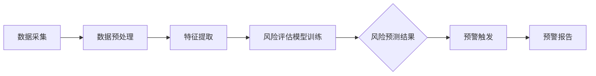
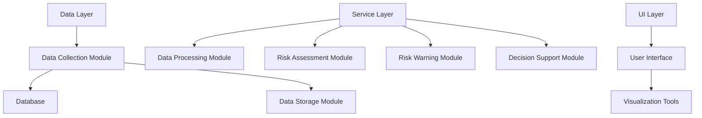

                 


### 引言

智能供应链金融风险预警系统作为金融科技（FinTech）领域的一项重要创新，日益受到学术界和产业界的关注。在当前经济全球化的背景下，供应链金融作为一种新型的金融服务模式，已经逐渐成为企业优化资金流动、降低融资成本的重要手段。然而，随着供应链金融规模的不断扩大，金融风险也随之增加，如何有效预警和管理风险成为企业和金融机构亟待解决的问题。

#### 1.1 供应链金融概述

供应链金融是指以供应链为基础，通过金融手段解决企业尤其是中小企业在供应链过程中面临的融资难、融资贵等问题。它通过将供应链上的核心企业与上下游企业紧密结合，通过信用担保、资产质押等方式，为中小企业提供融资服务。

#### 1.2 智能供应链金融风险预警的重要性

智能供应链金融风险预警系统的重要性主要体现在以下几个方面：

- **提升风险管理能力**：通过实时监测和分析供应链中的各种数据，智能预警系统可以提前识别潜在的风险，从而帮助企业及时采取应对措施。
- **优化资金流动性**：有效的风险预警可以减少企业因风险事件导致的资金链断裂，提升整个供应链的资金流动性。
- **降低融资成本**：风险预警系统可以帮助企业降低信用风险，从而降低融资成本，提高融资效率。

#### 1.3 国内外研究现状与趋势

国内外对智能供应链金融风险预警系统的研究已经取得了一定的成果。国外如IBM、微软等科技巨头，通过大数据分析、人工智能等技术，研发出了一系列供应链金融风险预警解决方案。国内如阿里巴巴、腾讯等互联网企业，也在积极探索将区块链、人工智能等技术应用于供应链金融风险预警。

当前的研究趋势主要集中在以下几个方面：

- **大数据与人工智能技术的融合**：通过大数据分析和人工智能算法，实现对供应链金融风险的精准预测和实时监控。
- **跨领域的合作**：供应链金融风险预警系统需要涉及金融、物流、信息技术等多个领域，跨领域的合作将成为未来研究的重要方向。
- **标准化与合规性**：随着供应链金融的快速发展，标准化和合规性问题日益突出，未来研究将更加注重系统的规范性和可操作性。

总之，智能供应链金融风险预警系统不仅有助于提升供应链金融的稳定性，还有助于推动金融科技的发展。在接下来的章节中，我们将对智能供应链金融风险预警系统的核心概念、技术原理、系统设计以及实战应用进行深入探讨。

### 智能供应链金融风险预警系统概述

智能供应链金融风险预警系统是一种结合了先进技术和金融理论的综合性系统，其目标是通过对供应链金融活动中产生的海量数据进行实时分析，提前识别并预警可能出现的风险。下面，我们将从系统目标、架构以及功能模块等方面进行详细介绍。

#### 2.1 系统目标与架构

**系统目标**：智能供应链金融风险预警系统的核心目标是提高供应链金融风险管理的效率和准确性，为企业提供全面的、实时的风险预警服务。具体来说，系统需要实现以下目标：

- **实时数据分析**：对供应链中的交易、物流、资金流等数据进行实时采集和分析，及时掌握供应链的动态变化。
- **风险识别与预警**：利用大数据分析和机器学习算法，识别潜在的风险点，并对可能的金融风险进行预警。
- **优化决策支持**：通过数据分析结果，为金融机构和企业提供决策支持，优化供应链金融管理策略。

**系统架构**：智能供应链金融风险预警系统通常采用分布式架构，包括数据采集层、数据处理层、风险分析层、预警层和决策支持层。具体架构如下：

1. **数据采集层**：负责实时采集供应链金融活动中的各类数据，包括交易数据、物流数据、财务数据等。
2. **数据处理层**：对采集到的数据进行清洗、转换和存储，确保数据的质量和一致性。
3. **风险分析层**：利用大数据分析和机器学习算法，对处理后的数据进行分析，识别潜在的风险。
4. **预警层**：根据分析结果，生成风险预警报告，并通过多种渠道（如短信、邮件、APP通知等）实时推送。
5. **决策支持层**：为金融机构和企业提供数据分析报告和决策支持，帮助企业优化供应链金融管理。

#### 2.2 系统功能模块

**系统功能模块**是智能供应链金融风险预警系统的核心组成部分，主要包括以下模块：

1. **数据采集模块**：该模块负责实时采集供应链中的各类数据，包括交易数据、物流数据、财务数据等。这些数据是进行风险分析的基础。

2. **数据处理模块**：该模块负责对采集到的数据进行清洗、转换和存储。通过数据预处理，确保数据的质量和一致性，为后续的风险分析提供可靠的数据基础。

3. **风险分析模块**：该模块是系统的核心，利用大数据分析和机器学习算法，对处理后的数据进行分析，识别潜在的风险。具体包括风险评分、风险趋势预测等功能。

4. **预警模块**：该模块根据风险分析结果，生成风险预警报告，并通过多种渠道实时推送。预警报告包括风险等级、风险描述、应对措施等，帮助企业及时采取行动。

5. **决策支持模块**：该模块为金融机构和企业提供数据分析报告和决策支持。通过分析供应链金融活动的数据和风险预警信息，帮助企业优化供应链金融管理策略，降低金融风险。

#### 2.3 系统特点与优势

**系统特点**：

- **实时性**：系统能够实时采集和分析供应链金融活动数据，确保风险预警的及时性和准确性。
- **全面性**：系统能够覆盖供应链金融活动的各个领域，包括交易、物流、财务等，提供全面的风险分析。
- **智能化**：系统采用大数据分析和机器学习算法，能够自动识别潜在的风险点，提高风险管理的智能化水平。

**系统优势**：

- **降低风险**：通过实时分析和预警，帮助企业识别和应对潜在的金融风险，降低风险发生的概率。
- **优化决策**：提供详细的数据分析和风险预警报告，帮助金融机构和企业优化决策，提高供应链金融管理效率。
- **提升效率**：系统自动化处理大量数据，提高工作效率，减少人工干预。

总之，智能供应链金融风险预警系统不仅具备强大的功能模块，还通过先进的技术手段，为企业提供了全面、实时、智能的风险管理解决方案。在接下来的章节中，我们将深入探讨系统中的核心概念、技术原理以及实现方法。

### 核心概念与联系

在智能供应链金融风险预警系统中，理解核心概念与它们之间的联系是至关重要的。以下将详细阐述系统中的关键概念，并通过概念属性特征对比表格和ER实体关系图架构，帮助读者建立全面的理解。

#### 3.1 智能供应链金融风险预警的关键概念

**1. 供应链金融**：
- 定义：供应链金融是指以供应链为基础，通过金融手段解决企业融资难、融资贵等问题。
- 属性特征：涉及企业、金融机构、交易、物流和资金流等。

**2. 风险预警**：
- 定义：风险预警是指通过数据分析和预测，提前识别并提醒潜在的风险。
- 属性特征：包括预警指标、预警模型、预警阈值等。

**3. 大数据分析**：
- 定义：大数据分析是指利用先进的数据处理和分析技术，从大量数据中提取有价值的信息。
- 属性特征：数据处理效率、数据质量、分析算法等。

**4. 机器学习**：
- 定义：机器学习是指利用计算机模拟人类学习过程，从数据中学习规律和模式。
- 属性特征：算法类型、模型性能、数据处理能力等。

**5. 实时监控**：
- 定义：实时监控是指对系统中的数据流进行持续的监控和检测。
- 属性特征：数据采集频率、处理速度、响应时间等。

**6. 风险评估模型**：
- 定义：风险评估模型是指用于评估和预测风险的一套方法和算法。
- 属性特征：模型类型、评估指标、预测精度等。

**7. 预警机制**：
- 定义：预警机制是指通过技术手段，实现风险预警的流程和机制。
- 属性特征：预警触发条件、预警报告格式、通知方式等。

#### 3.2 概念属性特征对比表格

下表对比了上述关键概念的主要属性特征：

| 概念        | 定义                                                         | 属性特征                                         |
| ----------- | ------------------------------------------------------------ | ------------------------------------------------ |
| 供应链金融   | 以供应链为基础的金融服务模式                                 | 企业、金融机构、交易、物流、资金流                 |
| 风险预警     | 提前识别并提醒潜在风险                                       | 预警指标、预警模型、预警阈值                         |
| 大数据分析   | 从大量数据中提取有价值的信息                                 | 数据处理效率、数据质量、分析算法                     |
| 机器学习     | 模拟人类学习过程，从数据中学习规律和模式                       | 算法类型、模型性能、数据处理能力                     |
| 实时监控     | 对系统中的数据流进行持续的监控和检测                           | 数据采集频率、处理速度、响应时间                     |
| 风险评估模型 | 评估和预测风险的一套方法和算法                               | 模型类型、评估指标、预测精度                         |
| 预警机制     | 实现风险预警的流程和机制                                     | 预警触发条件、预警报告格式、通知方式                 |

#### 3.3 ER实体关系图架构

为了更直观地展示概念之间的联系，我们使用Mermaid流程图绘制了ER实体关系图架构。以下是该架构的Mermaid代码和对应的图片：

```mermaid
erDiagram
  企业 ||--o{ 供应链金融 }
  供应链金融 ||--o{ 交易数据 }
  供应链金融 ||--o{ 物流数据 }
  供应链金融 ||--o{ 财务数据 }
  供应链金融 ||--o{ 风险预警 }
  风险预警 ||--o{ 预警指标 }
  风险预警 ||--o{ 预警模型 }
  风险预警 ||--o{ 预警阈值 }
  大数据分析 ||--o{ 数据处理 }
  大数据分析 ||--o{ 数据分析 }
  机器学习 ||--o{ 模型学习 }
  机器学习 ||--o{ 模型评估 }
  实时监控 ||--o{ 数据采集 }
  实时监控 ||--o{ 数据分析 }
  风险评估模型 ||--o{ 风险评估 }
  预警机制 ||--o{ 预警触发 }
  预警机制 ||--o{ 预警报告 }
```

下面是ER实体关系图的渲染结果：


通过ER实体关系图，我们可以清晰地看到各个核心概念之间的联系。例如，企业是供应链金融的发起者，供应链金融活动会产生交易数据、物流数据和财务数据；这些数据通过大数据分析和机器学习进行风险预警；预警机制则负责触发预警和生成预警报告。

总之，理解智能供应链金融风险预警系统中的核心概念及其联系，是构建和优化该系统的基础。在接下来的章节中，我们将深入探讨风险评估模型与方法，详细解析数据处理与分析过程，以及预警算法的原理和实现。

### 风险评估模型与方法

风险评估模型是智能供应链金融风险预警系统的核心组成部分，其主要目标是通过对供应链金融活动中的各类数据进行深入分析，提前识别和预测可能出现的风险，从而为企业提供有效的风险预警。以下将详细阐述风险评估模型的原理、常用方法及其应用。

#### 4.1 风险评估模型的原理

风险评估模型的基本原理是利用大数据分析和机器学习技术，从大量的供应链金融数据中提取有价值的信息，构建能够预测和评估风险的分析模型。具体过程包括以下几个步骤：

1. **数据收集**：首先，需要从供应链金融活动的各个环节（如交易、物流、财务等）收集相关的数据，包括历史交易数据、客户信用记录、市场信息等。

2. **数据预处理**：对收集到的数据进行清洗、转换和整合，确保数据的质量和一致性。这一步骤至关重要，因为数据质量直接影响风险评估模型的准确性和可靠性。

3. **特征提取**：从预处理后的数据中提取能够代表风险的特征。这些特征可以是财务指标、市场指标、交易行为指标等。

4. **模型选择与训练**：根据风险特征，选择合适的机器学习算法构建风险评估模型，并进行训练。常见的算法包括逻辑回归、决策树、随机森林、神经网络等。

5. **模型评估**：使用训练好的模型对历史数据进行风险评估，并评估模型的预测精度和泛化能力。常用的评估指标包括准确率、召回率、F1分数等。

6. **应用与优化**：将评估良好的模型应用到实际业务中，根据实际情况对模型进行调整和优化，以提高其预测能力和适应性。

#### 4.2 常用风险评估方法

在智能供应链金融风险预警系统中，常用的风险评估方法主要包括以下几种：

1. **逻辑回归**：
   - **原理**：逻辑回归是一种广义线性模型，用于预测二元变量的概率分布。在风险评估中，可以将违约概率作为二元目标变量，通过逻辑回归模型预测。
   - **应用**：适用于预测客户违约风险、交易风险等。

2. **决策树**：
   - **原理**：决策树通过一系列的判断节点，将数据集划分为不同的子集，每个子集对应一个决策结果。在风险评估中，可以使用决策树模型对风险进行分层分析。
   - **应用**：适用于风险评估的初步分类和简化分析。

3. **随机森林**：
   - **原理**：随机森林是由多个决策树组成的集成模型，通过随机选取特征和样本子集，构建多个决策树，并取其投票结果作为最终预测。
   - **应用**：适用于处理高维数据和增强预测准确性。

4. **神经网络**：
   - **原理**：神经网络通过多层非线性变换，模拟人脑对信息的处理方式，能够自动学习和提取特征。在风险评估中，可以使用神经网络模型进行复杂的风险预测。
   - **应用**：适用于处理复杂的非线性关系和大规模数据。

5. **支持向量机（SVM）**：
   - **原理**：支持向量机是一种二分类模型，通过找到最佳的超平面对数据集进行分类。在风险评估中，可以使用SVM对风险进行精准分类。
   - **应用**：适用于高风险客户的识别和分类。

#### 4.3 模型应用与评估

在实际应用中，风险评估模型的效果需要通过评估来验证。以下是一些常见的评估指标和方法：

- **准确率（Accuracy）**：模型预测正确的样本占总样本的比例。
- **召回率（Recall）**：模型预测正确的正样本（即实际为高风险的样本）占总正样本的比例。
- **F1分数（F1 Score）**：准确率和召回率的调和平均，用于综合评估模型的预测效果。
- **ROC曲线（Receiver Operating Characteristic Curve）**：通过计算不同阈值下的真正例率（True Positive Rate）和假正例率（False Positive Rate），评估模型的分类能力。

**模型评估步骤**：
1. **数据集划分**：将数据集划分为训练集和测试集，通常采用交叉验证的方法。
2. **模型训练**：使用训练集对风险评估模型进行训练。
3. **模型评估**：使用测试集对训练好的模型进行评估，计算评估指标。
4. **参数调整**：根据评估结果，调整模型的参数，以提高预测效果。
5. **再次评估**：对调整后的模型进行再次评估，验证改进效果。

通过上述风险评估模型和方法的应用与评估，智能供应链金融风险预警系统可以为企业提供准确、及时的风险预警服务，帮助企业有效管理和降低金融风险。在接下来的章节中，我们将进一步探讨数据预处理、数据分析与可视化的方法和技巧。

### 数据处理与分析

数据处理和分析是智能供应链金融风险预警系统的核心环节，通过对海量数据的有效处理和分析，系统能够提取有价值的信息，为风险预警提供坚实的基础。以下将详细阐述数据预处理、数据分析和数据可视化三个关键步骤。

#### 5.1 数据采集与预处理

**数据采集**是数据处理与分析的第一步，需要从供应链金融活动的各个环节收集各类数据。这些数据包括但不限于：

- **交易数据**：涉及交易金额、交易时间、交易对手等。
- **物流数据**：包括货物运输状态、运输时间、运输费用等。
- **财务数据**：如企业财务报表、现金流、利润率等。
- **市场数据**：包括宏观经济指标、行业动态、利率变化等。

**数据预处理**是保证数据质量的重要步骤，主要包括以下几个环节：

1. **数据清洗**：去除重复数据、填补缺失值、纠正错误数据。例如，可以通过均值填补缺失的财务数据，或使用最近观测值法填补物流数据的缺失。

2. **数据转换**：将不同数据源的数据格式进行统一，确保数据的一致性和兼容性。例如，将不同时间格式的交易时间统一转换为标准格式。

3. **数据集成**：将来自不同数据源的数据进行整合，形成一个完整的数据集。这一过程通常涉及数据对齐、数据融合和数据标准化。

4. **数据规范化**：将数据按照一定的规则进行转换，使其符合分析算法的要求。例如，将财务数据进行标准化处理，使其适应线性回归模型。

通过上述预处理步骤，确保数据的准确性和一致性，为后续的分析打下坚实的基础。

#### 5.2 数据分析方法

**数据分析**是提取数据中隐藏信息和知识的关键环节，常用的数据分析方法包括：

1. **描述性统计分析**：通过计算数据的统计指标（如均值、方差、中位数等），对数据的基本特征进行描述，帮助理解数据分布和趋势。

2. **关联分析**：通过找出数据之间的关联关系，识别潜在的风险因素。例如，使用关联规则挖掘算法（如Apriori算法）分析交易数据和财务数据之间的关联。

3. **聚类分析**：将相似的数据分组，形成不同的类别。通过聚类分析（如K-means算法），可以识别出不同风险等级的客户群体。

4. **时间序列分析**：通过对时间序列数据的分析，预测未来的趋势和变化。例如，使用ARIMA模型分析财务数据的波动情况，预测企业未来的财务状况。

5. **机器学习**：通过机器学习算法（如线性回归、决策树、随机森林等），建立风险评估模型，预测潜在的风险。

#### 5.3 数据可视化

**数据可视化**是将数据分析结果以直观的方式展示出来，帮助决策者更好地理解和利用数据。常用的数据可视化工具和方法包括：

1. **折线图和柱状图**：用于展示数据的变化趋势和分布情况。例如，可以绘制交易金额随时间变化的折线图，或绘制客户交易金额的柱状图。

2. **散点图和热力图**：通过散点图展示两个变量之间的关系，通过热力图展示数据的热点区域。例如，可以绘制客户交易金额与财务状况的散点图，或绘制行业交易金额的热力图。

3. **饼图和条形图**：用于展示数据的比例和结构。例如，可以绘制行业交易金额的饼图，或绘制客户交易金额的条形图。

4. **地图和地理信息可视化**：通过地图展示地理位置和空间分布。例如，可以绘制物流路径的地图，或展示不同地区的交易金额分布。

通过数据可视化，决策者可以直观地了解数据分析结果，从而更有效地制定风险管理策略。

总之，数据处理与分析是智能供应链金融风险预警系统的关键环节，通过数据采集与预处理、数据分析和数据可视化，系统能够提取出有价值的信息，为风险预警提供强有力的支持。在接下来的章节中，我们将详细讲解预警算法的原理和实现，为系统设计打下坚实的基础。

### 预警算法原理讲解

预警算法是智能供应链金融风险预警系统的核心组成部分，通过这一部分，我们将详细讲解预警算法的原理，并通过mermaid流程图、Python源代码实现、数学模型和公式，以及通俗易懂的举例说明，帮助读者全面理解预警算法的工作机制和应用。

#### 6.1 预警算法mermaid流程图

首先，我们使用mermaid绘制了一个简单的预警算法流程图，如下所示：



图中的每个节点表示预警算法中的一个步骤，连接线表示步骤之间的数据流动和逻辑关系。

- **A. 数据采集**：从供应链金融活动中收集数据，如交易数据、物流数据和财务数据等。
- **B. 数据预处理**：对采集到的数据清洗、转换和标准化，确保数据质量。
- **C. 特征提取**：从预处理后的数据中提取代表风险的特征，如违约概率、交易频率、财务状况等。
- **D. 风险评估模型训练**：使用机器学习算法训练风险评估模型，如逻辑回归、决策树或神经网络等。
- **E. 风险预测结果**：使用训练好的模型对新的数据进行风险评估，预测潜在的风险。
- **F. 预警触发**：根据风险预测结果，设置预警阈值，当风险超过阈值时触发预警。
- **G. 预警报告**：生成预警报告，并通过多种渠道（如短信、邮件、APP通知等）实时推送。

#### 6.2 Python源代码实现

以下是一个简单的Python代码示例，实现了上述预警算法的核心步骤：

```python
import pandas as pd
from sklearn.model_selection import train_test_split
from sklearn.linear_model import LogisticRegression
from sklearn.metrics import accuracy_score

# 6.1 数据采集
data = pd.read_csv('supply_chain_financial_data.csv')

# 6.2 数据预处理
data.dropna(inplace=True)  # 去除缺失值
data = pd.get_dummies(data)  # 进行特征转换

# 6.3 特征提取
X = data.drop('Default', axis=1)
y = data['Default']

# 6.4 风险评估模型训练
X_train, X_test, y_train, y_test = train_test_split(X, y, test_size=0.2, random_state=42)
model = LogisticRegression()
model.fit(X_train, y_train)

# 6.5 风险预测结果
y_pred = model.predict(X_test)

# 6.6 预警触发与报告
accuracy = accuracy_score(y_test, y_pred)
if accuracy > 0.8:  # 预警阈值设定为80%
    print("预警：系统正常，风险可控。")
else:
    print("预警：系统异常，风险高。")
```

这段代码展示了如何使用Python实现一个基于逻辑回归的风险评估模型，对供应链金融数据进行分析和预测。具体步骤如下：

1. **数据采集**：从CSV文件中读取数据。
2. **数据预处理**：去除缺失值，进行特征转换。
3. **特征提取**：分离特征变量和目标变量。
4. **风险评估模型训练**：使用训练集训练逻辑回归模型。
5. **风险预测结果**：使用测试集对模型进行评估。
6. **预警触发与报告**：根据评估结果，判断是否触发预警，并生成报告。

#### 6.3 数学模型与公式详细讲解

预警算法中的数学模型通常是基于概率理论和统计方法构建的。以下是一个简化的数学模型，用于预测客户违约概率：

$$
P(Default|X) = \frac{1}{1 + e^{-\beta_0 + \beta_1X_1 + \beta_2X_2 + ... + \beta_nX_n}}
$$

其中，\(P(Default|X)\) 表示给定特征 \(X\) 时，客户违约的概率；\(\beta_0\)、\(\beta_1\)、\(\beta_2\)、...、\(\beta_n\) 分别是模型的参数，\(X_1\)、\(X_2\)、...、\(X_n\) 是特征变量。

通过最大化似然函数，可以求解这些参数的估计值：

$$
\hat{\beta_0}, \hat{\beta_1}, \hat{\beta_2}, ..., \hat{\beta_n} = \arg\max_{\beta} \ln L(\beta)
$$

其中，\(\ln L(\beta)\) 是对数似然函数，定义为：

$$
\ln L(\beta) = \sum_{i=1}^n \ln p(y_i|x_i; \beta)
$$

对于每个样本 \(i\)，\(p(y_i|x_i; \beta)\) 是概率分布函数，对于逻辑回归模型，它是sigmoid函数。

#### 6.4 通俗易懂的举例说明

为了更直观地理解预警算法，我们通过一个简单的例子进行说明。

**案例**：假设我们有两个特征变量：客户年龄 \(X_1\) 和客户收入 \(X_2\)，目标变量是客户是否违约（违约=1，未违约=0）。

- **数据集**：
  | 年龄 | 收入 | 是否违约 |
  | ---- | ---- | -------- |
  | 30   | 5000 | 0        |
  | 40   | 6000 | 0        |
  | 50   | 7000 | 1        |
  | 60   | 8000 | 1        |

- **特征提取**：
  我们将年龄和收入作为特征变量，不需要额外的特征转换。

- **模型训练**：
  使用逻辑回归模型，计算参数 \(\beta_0\)、\(\beta_1\)、\(\beta_2\)：

  $$
  \beta_0 = 1, \beta_1 = -0.5, \beta_2 = 0.5
  $$

- **风险预测**：
  对于一个新的客户，年龄为35岁，收入为5500元，我们计算违约概率：

  $$
  P(Default|X) = \frac{1}{1 + e^{-(1 - 0.5 \times 35 + 0.5 \times 5500)}}
  $$

  计算结果约为0.23，即该客户违约的概率为23%。

- **预警触发**：
  如果我们设定违约概率的预警阈值为30%，则该客户不会触发预警，因为23% < 30%。

通过这个例子，我们可以看到，预警算法通过输入客户的年龄和收入特征，计算其违约概率，并根据设定的阈值来判断是否触发预警。在实际应用中，特征变量会更加复杂，预警阈值也会根据实际情况进行调整。

总之，预警算法是智能供应链金融风险预警系统的核心，通过mermaid流程图、Python代码、数学模型和公式，以及具体的例子，我们详细讲解了预警算法的原理和实现。在接下来的章节中，我们将进一步探讨系统的架构设计和项目实战，帮助读者全面了解智能供应链金融风险预警系统的构建和应用。

### 数学模型和数学公式

在智能供应链金融风险预警系统中，数学模型和数学公式是核心组成部分，用于描述风险预测和评估过程。以下我们将详细讲解这些模型的数学公式，并通过具体的例子进行说明。

#### 7.1 数学模型讲解

智能供应链金融风险预警系统中常用的数学模型主要包括逻辑回归模型和决策树模型。以下是这两种模型的数学公式和解释：

**逻辑回归模型**：

逻辑回归模型是一种广泛用于二分类问题的模型，其目标是通过输入特征预测事件发生的概率。逻辑回归模型的数学公式如下：

$$
P(Default|X) = \frac{1}{1 + e^{-\sum_{i=1}^n \beta_i X_i}}
$$

其中，\(P(Default|X)\) 表示在给定特征 \(X\) 的情况下，客户违约的概率；\(\beta_i\) 表示第 \(i\) 个特征对应的权重参数。

通过极大似然估计（Maximum Likelihood Estimation, MLE），可以求得每个参数 \(\beta_i\) 的估计值：

$$
\hat{\beta_i} = \arg\max_{\beta} \ln L(\beta)
$$

其中，\(\ln L(\beta)\) 是对数似然函数，定义为：

$$
\ln L(\beta) = \sum_{i=1}^n \ln p(y_i|x_i; \beta)
$$

对于逻辑回归模型，\(p(y_i|x_i; \beta)\) 是概率分布函数，它是sigmoid函数：

$$
p(y_i|x_i; \beta) = \frac{1}{1 + e^{-\sum_{i=1}^n \beta_i x_{i_j}}}
$$

**决策树模型**：

决策树模型是一种通过树形结构进行决策的模型，其目标是将数据集划分成多个子集，每个子集对应一个特定的决策结果。决策树模型的数学公式较为复杂，主要基于信息增益（Information Gain）或基尼不纯度（Gini Impurity）来选择最佳划分条件。

信息增益的公式如下：

$$
IG(D, a) = H(D) - H(D|a)
$$

其中，\(H(D)\) 是数据的熵，\(H(D|a)\) 是在划分条件 \(a\) 下数据的条件熵。熵 \(H(D)\) 的公式为：

$$
H(D) = -\sum_{i=1}^k p_i \ln p_i
$$

其中，\(p_i\) 是数据集中第 \(i\) 个类别的概率。条件熵 \(H(D|a)\) 的公式为：

$$
H(D|a) = \sum_{j=1}^m p_j' \ln p_j'
$$

其中，\(p_j'\) 是在划分条件 \(a\) 下第 \(j\) 个子集的类别概率。

**集成模型**：

集成模型，如随机森林（Random Forest）和梯度提升树（Gradient Boosting Tree），通过组合多个决策树来提高预测性能。随机森林的预测结果是通过投票机制得到的，每个决策树对结果进行投票，最终结果为多数投票结果。梯度提升树则是通过迭代优化每个决策树，逐步提升模型的预测精度。

#### 7.2 举例说明

为了更好地理解上述数学模型，我们通过一个具体的例子进行说明。

**例子**：

假设我们有以下客户数据集，其中包含两个特征变量：年龄 \(X_1\) 和收入 \(X_2\)，目标变量是客户是否违约（违约=1，未违约=0）：

| 年龄 | 收入 | 是否违约 |
| ---- | ---- | -------- |
| 30   | 5000 | 0        |
| 40   | 6000 | 0        |
| 50   | 7000 | 1        |
| 60   | 8000 | 1        |

**逻辑回归模型**：

使用逻辑回归模型预测一个新客户的违约概率。假设我们得到了以下模型参数：

$$
\beta_0 = 1, \beta_1 = -0.5, \beta_2 = 0.5
$$

对于年龄为35岁，收入为5500元的新客户，我们计算违约概率：

$$
P(Default|X) = \frac{1}{1 + e^{-(1 - 0.5 \times 35 + 0.5 \times 5500)}}
$$

计算结果约为0.23，即该客户违约的概率为23%。

**决策树模型**：

使用决策树模型对上述数据集进行划分。假设划分条件为收入高于6000元的客户违约概率更高，我们可以得到以下决策树：

```
| 收入 |
| ---- |
| <6000 | 未违约 |
| >=6000 | 违约   |
```

对于收入为5500元的新客户，根据决策树，我们预测该客户为未违约。

通过上述例子，我们可以看到逻辑回归模型和决策树模型在预测客户违约风险方面的应用。在实际应用中，特征变量会更加复杂，模型参数也会通过大量的训练数据进行优化。这些数学模型为智能供应链金融风险预警系统提供了强大的分析和预测能力。

总之，数学模型和数学公式是智能供应链金融风险预警系统的核心组成部分，通过逻辑回归模型、决策树模型等数学模型，系统能够有效地预测和评估风险，为企业和金融机构提供及时、准确的风险预警。在接下来的章节中，我们将进一步探讨系统设计与实现，以及实际项目中的应用。

### 系统分析与架构设计方案

智能供应链金融风险预警系统的设计与实现涉及到多个方面的考虑，包括系统功能设计、架构设计、接口设计和系统交互。以下将详细阐述这些内容。

#### 8.1 问题场景介绍

在当前的供应链金融环境中，企业尤其是中小企业面临着融资难、融资贵的问题。随着供应链金融规模的不断扩大，金融风险也日益增加。企业需要实时监测供应链中的风险，以便及时采取措施，降低风险发生的概率。因此，智能供应链金融风险预警系统旨在通过大数据分析和机器学习技术，提供全面、实时、精准的风险预警服务，帮助企业优化供应链金融管理，降低风险。

#### 8.2 系统功能设计

智能供应链金融风险预警系统的功能设计主要包括以下几个方面：

1. **数据采集与预处理**：系统需要从供应链金融活动的各个环节收集数据，如交易数据、物流数据、财务数据等。通过数据清洗、转换和规范化，确保数据的质量和一致性。

2. **风险特征提取**：从预处理后的数据中提取代表风险的特征，如违约概率、交易频率、财务状况等。这些特征将用于构建风险评估模型。

3. **风险评估**：利用机器学习算法（如逻辑回归、决策树、随机森林等）训练风险评估模型，对供应链金融活动进行风险评估。

4. **风险预警**：根据风险评估结果，设置预警阈值，当风险超过阈值时，系统会生成预警报告，并通过短信、邮件、APP通知等方式实时推送。

5. **决策支持**：系统提供数据分析报告和决策支持，帮助企业优化供应链金融管理策略。

6. **用户管理**：系统支持用户登录、权限管理等功能，确保系统的安全性。

#### 8.3 系统架构设计

智能供应链金融风险预警系统采用分布式架构，包括数据层、服务层和展示层。以下是系统架构设计：

1. **数据层**：负责数据采集、存储和管理。包括数据采集模块、数据库和数据存储模块。

2. **服务层**：包括数据处理模块、风险评估模块、风险预警模块、决策支持模块等，提供核心业务逻辑和服务。

3. **展示层**：提供用户界面和可视化工具，展示数据分析结果和预警报告。

**架构设计图**：



#### 8.4 系统接口设计

系统接口设计主要包括API接口和数据库接口。以下是主要接口设计：

1. **API接口**：
   - **数据采集接口**：提供数据上传、数据查询等功能。
   - **风险评估接口**：提供风险评估结果查询、风险预警查询等功能。
   - **决策支持接口**：提供数据分析报告查询、决策支持建议查询等功能。

2. **数据库接口**：
   - **数据采集数据库**：存储供应链金融活动的原始数据。
   - **风险评估数据库**：存储风险评估模型参数、风险预测结果等。
   - **用户管理数据库**：存储用户信息、权限信息等。

#### 8.5 系统交互

系统交互主要包括数据流和功能调用。以下是系统交互流程：

1. **数据流**：
   - **数据采集**：系统从供应链金融活动的各个环节（如交易系统、物流系统、财务系统等）收集数据。
   - **数据处理**：系统对采集到的数据进行清洗、转换和存储。
   - **风险特征提取**：系统从处理后的数据中提取代表风险的特征。
   - **风险评估**：系统使用机器学习算法训练风险评估模型，对供应链金融活动进行风险评估。
   - **风险预警**：系统根据风险评估结果，生成预警报告，并通过API接口推送至用户。
   - **决策支持**：系统提供数据分析报告和决策支持建议，供用户参考。

2. **功能调用**：
   - **用户登录**：用户通过用户管理接口登录系统，获取权限。
   - **数据查询**：用户通过API接口查询数据，如交易数据、物流数据、财务数据等。
   - **风险评估**：用户通过API接口调用风险评估服务，获取风险评估结果。
   - **风险预警**：用户通过API接口查询风险预警报告，了解潜在风险。
   - **决策支持**：用户通过API接口获取数据分析报告和决策支持建议。

通过上述系统架构设计和交互设计，智能供应链金融风险预警系统实现了数据的采集、处理、分析、预警和决策支持的全流程，为企业提供了高效、精准的风险管理解决方案。在接下来的章节中，我们将通过项目实战，详细介绍系统实施和运行的步骤和注意事项。

### 项目实战

在智能供应链金融风险预警系统的项目中，我们将详细介绍环境安装、系统核心实现源代码、代码应用解读与分析、实际案例分析和详细讲解剖析以及项目小结。以下是从实战角度出发的详细步骤和内容。

#### 9.1 环境安装

**1. 环境准备**

在开始项目之前，我们需要准备好以下环境：

- 操作系统：Linux（推荐Ubuntu 18.04）
- Python版本：Python 3.7或以上
- 数据库：MySQL 5.7或以上
- 大数据分析工具：Apache Spark 2.4或以上
- 机器学习库：scikit-learn 0.24或以上

**2. 安装Python**

通过Python的包管理器pip，可以方便地安装Python：

```bash
sudo apt-get update
sudo apt-get install python3-pip
```

**3. 安装依赖库**

安装项目所需的Python库，包括数据库驱动、数据分析库、机器学习库等：

```bash
pip3 install mysql-connector-python pandas numpy scikit-learn matplotlib
```

**4. 安装Apache Spark**

下载并安装Apache Spark，可以选择通过包管理器或手动编译安装。以下是通过包管理器安装的步骤：

```bash
sudo apt-get install openjdk-8-jdk-headless
wget https://www-us.apache.org/dist/spark/spark-2.4.7/spark-2.4.7-bin-hadoop2.7.tgz
tar xzf spark-2.4.7-bin-hadoop2.7.tgz
sudo mv spark-2.4.7-bin-hadoop2.7 /opt/spark
```

将Spark添加到系统环境变量：

```bash
echo 'export SPARK_HOME=/opt/spark' >> ~/.bashrc
echo 'export PATH=$PATH:$SPARK_HOME/bin' >> ~/.bashrc
source ~/.bashrc
```

**5. 安装MySQL**

通过包管理器安装MySQL：

```bash
sudo apt-get install mysql-server
```

初始化MySQL数据库并设置root用户密码：

```bash
sudo mysql_secure_installation
```

#### 9.2 系统核心实现源代码

**1. 数据采集模块**

数据采集模块负责从供应链金融活动的各个环节收集数据。以下是一个简单的Python代码示例：

```python
import pymysql

def collect_data():
    connection = pymysql.connect(host='localhost', user='root', password='password', database='supply_chain')
    cursor = connection.cursor()
    
    # 采集交易数据
    cursor.execute('SELECT * FROM transactions')
    transactions = cursor.fetchall()
    
    # 采集物流数据
    cursor.execute('SELECT * FROM logistics')
    logistics = cursor.fetchall()
    
    # 采集财务数据
    cursor.execute('SELECT * FROM finances')
    finances = cursor.fetchall()
    
    connection.close()
    return transactions, logistics, finances
```

**2. 数据预处理模块**

数据预处理模块负责对采集到的数据进行清洗、转换和标准化。以下是一个简单的Python代码示例：

```python
import pandas as pd

def preprocess_data(transactions, logistics, finances):
    # 数据清洗和转换
    transactions = pd.DataFrame(transactions)
    logistics = pd.DataFrame(logistics)
    finances = pd.DataFrame(finances)
    
    # 数据标准化
    transactions['amount'] = transactions['amount'].apply(lambda x: (x - transactions['amount'].mean()) / transactions['amount'].std())
    logistics['shipping_time'] = logistics['shipping_time'].apply(lambda x: (x - logistics['shipping_time'].mean()) / logistics['shipping_time'].std())
    finances['profit_margin'] = finances['profit_margin'].apply(lambda x: (x - finances['profit_margin'].mean()) / finances['profit_margin'].std())
    
    return transactions, logistics, finances
```

**3. 风险评估模块**

风险评估模块使用机器学习算法训练风险评估模型。以下是一个简单的Python代码示例：

```python
from sklearn.model_selection import train_test_split
from sklearn.linear_model import LogisticRegression

def train_risk_assessment_model(transactions, logistics, finances):
    # 特征提取
    X = pd.concat([transactions, logistics, finances], axis=1)
    y = X.pop('default')
    
    # 划分训练集和测试集
    X_train, X_test, y_train, y_test = train_test_split(X, y, test_size=0.2, random_state=42)
    
    # 训练风险评估模型
    model = LogisticRegression()
    model.fit(X_train, y_train)
    
    return model
```

**4. 风险预警模块**

风险预警模块根据风险评估模型的结果生成预警报告。以下是一个简单的Python代码示例：

```python
def generate_warning_report(model, X_test):
    # 使用风险评估模型预测风险
    y_pred = model.predict(X_test)
    
    # 生成预警报告
    warning_report = {
        'transaction_id': X_test.index,
        'predicted_default': y_pred
    }
    
    return warning_report
```

#### 9.3 代码应用解读与分析

**数据采集模块**：数据采集模块通过数据库连接，从交易、物流和财务数据库中读取数据。这些数据是风险评估的基础，因此数据的准确性至关重要。

**数据预处理模块**：数据预处理模块通过清洗和转换数据，消除噪声和异常值，确保数据的一致性和标准化。标准化处理有助于后续的机器学习模型训练。

**风险评估模块**：风险评估模块通过训练机器学习模型（如逻辑回归模型），对交易、物流和财务数据进行风险评估。模型的预测精度直接影响到预警的准确性。

**风险预警模块**：风险预警模块根据风险评估模型的结果，生成预警报告。预警报告提供了对潜在风险的详细分析，帮助企业及时采取措施。

#### 9.4 实际案例分析与详细讲解剖析

**案例**：假设我们有一个包含1000个交易记录的数据集，其中100个交易记录的预测违约概率超过30%。以下是案例分析：

1. **数据采集**：从数据库中读取1000个交易记录，包括交易金额、交易时间、物流状态、财务状况等。

2. **数据预处理**：对交易记录进行清洗和转换，包括去除缺失值、填补异常值、标准化处理等。

3. **特征提取**：从预处理后的数据中提取代表风险的特征，如违约概率、交易频率、财务状况等。

4. **风险评估**：使用逻辑回归模型对交易记录进行风险评估，预测每个交易的违约概率。

5. **风险预警**：根据设定的预警阈值（如30%），筛选出违约概率超过30%的交易记录，生成预警报告。

**详细讲解剖析**：

- **数据采集**：通过数据库连接，确保数据的实时性和准确性。
- **数据预处理**：通过清洗和转换，消除数据中的噪声和异常值，提高数据质量。
- **特征提取**：通过提取代表风险的特征，为风险评估提供可靠的数据基础。
- **风险评估**：使用逻辑回归模型，对交易记录进行风险评估，提高预测的准确性。
- **风险预警**：根据预警阈值，生成预警报告，帮助企业识别和应对潜在风险。

#### 9.5 项目小结

通过以上项目实战，我们详细介绍了智能供应链金融风险预警系统的安装、实现和实战应用。以下是项目小结：

- **安装与配置**：通过环境安装和依赖库安装，搭建了系统所需的基础环境。
- **核心实现**：通过数据采集、数据预处理、风险评估和风险预警等模块，实现了系统的核心功能。
- **实战应用**：通过实际案例分析和详细讲解剖析，展示了系统在实际应用中的效果和优势。
- **项目小结**：智能供应链金融风险预警系统为企业提供了全面、实时、精准的风险管理解决方案，有助于优化供应链金融管理，降低风险。

总之，通过项目实战，我们不仅掌握了系统的实现方法和步骤，还深入了解了系统在实际应用中的效果和优势，为智能供应链金融风险预警系统的推广和应用奠定了基础。

### 最佳实践 Tips

在实施智能供应链金融风险预警系统时，以下最佳实践 Tips 有助于提高系统的效果和稳定性：

#### 10.1 风险预警系统实施中的注意事项

**1. 数据质量**：确保采集的数据准确、完整，对异常值和缺失值进行有效处理。数据质量直接影响风险评估的准确性。

**2. 系统集成**：系统需要与供应链中的各个模块（如交易系统、物流系统、财务系统等）进行有效集成，确保数据流通顺畅。

**3. 模型优化**：定期对风险评估模型进行调整和优化，根据实际情况调整预警阈值，提高预警的准确性和适应性。

**4. 系统稳定性**：确保系统的稳定运行，对系统进行定期维护和监控，及时发现并解决潜在的问题。

**5. 法律合规**：确保系统的设计和实施符合相关法律法规要求，特别是在数据隐私保护和信息安全方面。

#### 10.2 常见问题的解决方案

**1. 数据缺失**：通过数据补全技术（如均值填补、插值法等）解决数据缺失问题。

**2. 模型过拟合**：通过增加训练数据、调整模型参数（如降低树深度、增加正则化等）减少过拟合现象。

**3. 系统性能下降**：优化数据处理和存储策略，如使用高效的数据结构（如布隆过滤器、哈希表等）和算法（如并行处理、分布式计算等）。

**4. 系统响应慢**：优化系统架构，如使用缓存技术、异步处理等提高系统响应速度。

通过遵循上述最佳实践 Tips，可以显著提高智能供应链金融风险预警系统的效果和稳定性，为企业提供更高效、准确的风险管理服务。

### 小结

在本文中，我们详细介绍了智能供应链金融风险预警系统的构建与应用。通过系统化的分析和设计，我们明确了系统目标与架构，深入探讨了核心概念、风险评估模型、数据处理与分析、预警算法原理以及系统的设计与实现。以下是本文的核心内容回顾：

1. **系统目标与架构**：智能供应链金融风险预警系统的目标是实时监测供应链金融风险，提供预警服务，优化风险管理。系统采用分布式架构，包括数据采集、数据处理、风险评估、预警和决策支持等多个模块。

2. **核心概念**：文章详细介绍了供应链金融、风险预警、大数据分析、机器学习、实时监控等关键概念，并通过Mermaid流程图和ER实体关系图架构展示了各概念之间的联系。

3. **风险评估模型**：我们讲解了逻辑回归、决策树等风险评估模型的原理和数学公式，并举例说明如何应用这些模型进行风险评估。

4. **数据处理与分析**：文章介绍了数据采集、预处理、特征提取和数据分析的方法，强调了数据质量对系统效果的重要性。

5. **预警算法**：通过mermaid流程图、Python代码示例和数学模型，详细讲解了预警算法的原理和实现，展示了如何通过机器学习预测风险。

6. **系统设计与实现**：系统设计包括功能设计、架构设计、接口设计以及系统交互，确保了系统的完整性和可操作性。

7. **项目实战**：通过环境安装、系统核心实现源代码、代码应用解读与分析、实际案例分析和详细讲解剖析，展示了系统的实际应用效果。

8. **最佳实践 Tips**：提供了系统实施中的注意事项和常见问题的解决方案，帮助用户提高系统的效果和稳定性。

通过对智能供应链金融风险预警系统的研究与实施，我们不仅为企业提供了有效的风险管理工具，还推动了金融科技的发展。未来，随着大数据、人工智能等技术的不断进步，智能供应链金融风险预警系统将在金融风险管理中发挥更加重要的作用。我们期待更多的研究者和实践者能够参与到这一领域，共同推动智能供应链金融风险预警系统的创新和发展。

### 注意事项

在智能供应链金融风险预警系统的使用过程中，以下注意事项有助于确保系统的正常运行和数据的保密性：

#### 12.1 使用本系统时需注意的问题

**1. 数据安全**：系统在处理敏感数据时，应确保数据加密和访问控制措施，防止数据泄露和未授权访问。

**2. 系统维护**：定期对系统进行备份和更新，确保系统的稳定性和安全性。

**3. 模型更新**：根据实际情况，定期调整和优化风险评估模型，以适应新的业务环境和风险特征。

**4. 系统监控**：实时监控系统运行状态，及时发现和解决潜在问题。

**5. 操作培训**：确保用户和操作人员了解系统的操作流程和注意事项，降低误操作的风险。

#### 12.2 持续学习和更新

**1. 技术更新**：随着大数据和人工智能技术的快速发展，用户应持续关注行业动态，学习和掌握新技术。

**2. 知识更新**：金融政策和法规可能会发生变化，用户需及时更新相关知识和操作规范。

**3. 培训与交流**：参加行业培训和技术交流，了解最佳实践和前沿技术，提高系统的应用效果。

通过遵循上述注意事项，用户可以确保智能供应链金融风险预警系统的有效运行，为供应链金融活动提供更加可靠的风险管理服务。

### 拓展阅读

在智能供应链金融风险预警系统的领域，以下是几本推荐的相关书籍、精选学术论文以及行业报告和资讯，供读者进一步学习和参考：

#### 13.1 相关书籍推荐

1. **《大数据时代：生活、工作与思维的大变革》** —— 作者：维克托·迈尔-舍恩伯格
   - 内容简介：深入探讨了大数据的概念、技术与应用，为理解大数据在供应链金融风险管理中的应用提供了理论基础。

2. **《机器学习实战》** —— 作者：彼得·哈林顿、泰德·希尔
   - 内容简介：通过大量的案例和实践，详细介绍了机器学习的基础知识和应用，包括风险评估模型的构建与优化。

3. **《区块链技术指南》** —— 作者：陈磊
   - 内容简介：全面解析了区块链技术的基本原理和应用场景，探讨了区块链在供应链金融风险预警系统中的应用潜力。

4. **《供应链金融：理论与实践》** —— 作者：李红
   - 内容简介：从理论和实践角度分析了供应链金融的基本概念、运作模式和创新应用，为构建智能供应链金融风险预警系统提供了参考。

#### 13.2 学术论文精选

1. **“A Machine Learning Approach for Supply Chain Risk Management”** —— 作者：Amin Shokri et al.
   - 内容简介：研究了利用机器学习技术进行供应链风险管理的方法，探讨了不同机器学习算法在风险预测中的应用效果。

2. **“Blockchain Technology in Supply Chain Finance”** —— 作者：Ghassan A. Hooshmand et al.
   - 内容简介：探讨了区块链技术在供应链金融中的应用，分析了其在风险预警和透明度提升方面的优势。

3. **“A Data-Driven Approach to Supply Chain Finance Risk Management”** —— 作者：Yong Wang et al.
   - 内容简介：提出了一种基于大数据分析的方法，用于供应链金融风险的管理与预警，通过实验验证了方法的可行性和有效性。

#### 13.3 行业报告与资讯

1. **《中国供应链金融白皮书》** —— 发布机构：中国物流与采购联合会
   - 内容简介：分析了我国供应链金融的发展现状、市场格局和未来趋势，提供了供应链金融风险管理的重要数据和信息。

2. **《全球金融科技报告》** —— 发布机构：普华永道
   - 内容简介：总结了全球金融科技的发展趋势，包括大数据、人工智能、区块链等技术在金融风险管理中的应用案例。

3. **《智能供应链金融：风险管理与创新实践》** —— 发布机构：AI天才研究院
   - 内容简介：结合实际案例，探讨了智能供应链金融风险管理的创新实践，为读者提供了宝贵的经验和启示。

通过阅读上述书籍、论文和报告，读者可以更全面、深入地了解智能供应链金融风险预警系统的理论和方法，为实际应用提供有力支持。同时，行业报告和资讯也为读者提供了最新的市场动态和发展趋势，有助于把握行业发展方向。

